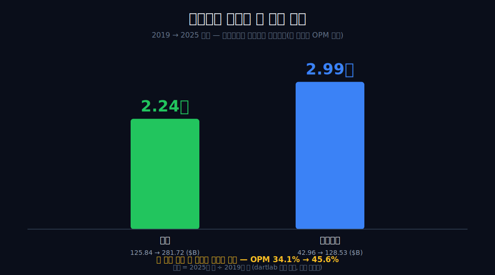
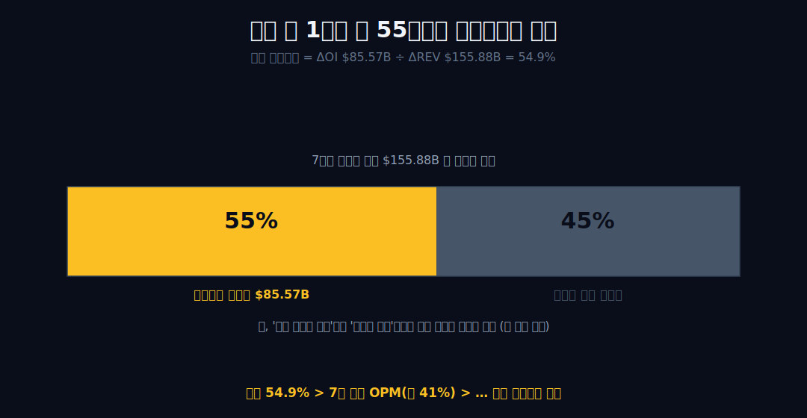
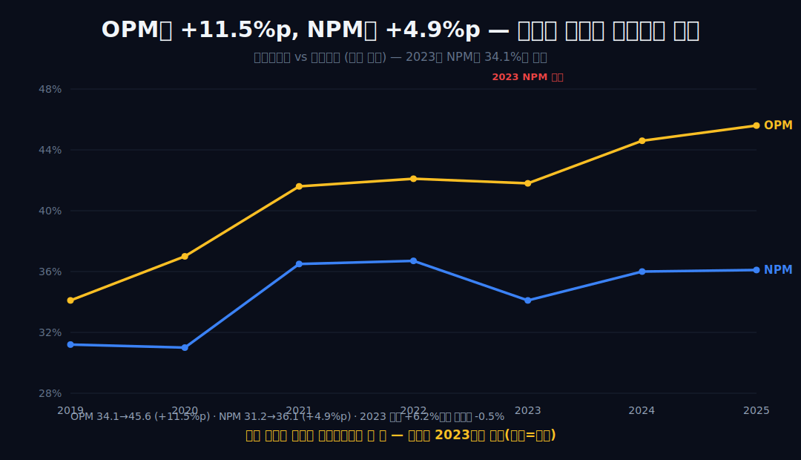
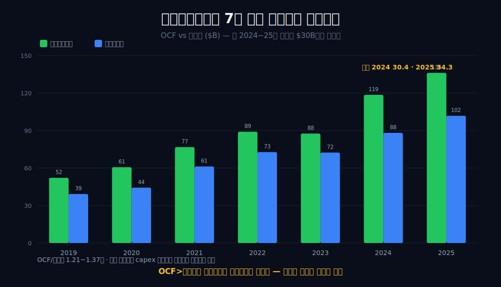
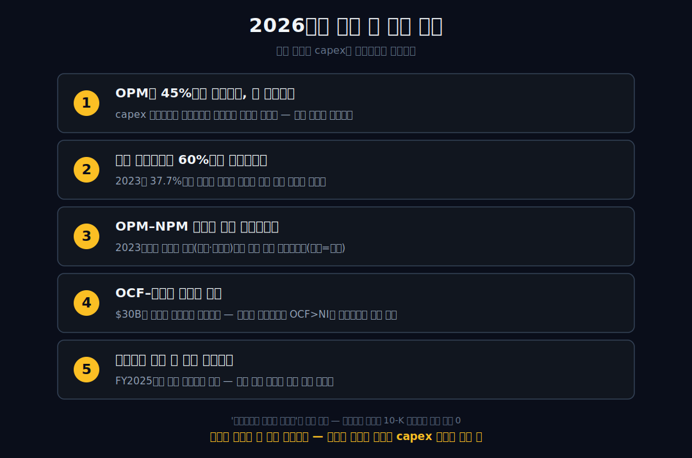

<script>
import ComboChart from '$lib/components/blog/ComboChart.svelte';
import StackBar from '$lib/components/blog/StackBar.svelte';
</script>

> **데이터 기준**: 2026-06-20 확인 — Microsoft(MSFT) **미국 연결(USD), 회계연도(FY, 6월 30일 종료)** 기준. 본문 재무표의 2025는 FY2025(2024-07-01~2025-06-30)이다. 세그먼트(Intelligent Cloud·Azure·Microsoft Cloud), AI capex, Microsoft Cloud gross margin, 감가상각은 연결 손익 한 줄에 안 나오므로 **2025 Form 10-K·Microsoft IR(외부 인용)**로 표기. ※대차대조표 항목은 매핑이 불안정해 인용에 주의.
>
> **핵심 숫자**: 매출 **$281.72B** (2019→2025 **2.24배**) · 영업이익 **$128.53B** (**2.99배**, OPM **45.6%**) · 당기순이익 **$101.83B** (2.60배) · 영업현금흐름 **$136.16B** · OPM 2019 **34.1%** → 2025 **45.6%** (+11.5%p) · NPM 2019 **31.2%** → 2025 **36.1%** (+4.9%p)
>
> **이 글의 용어**: OPM(영업이익률)·NPM(순이익률) = 별개 비율 · 증분 영업마진 = 늘어난 매출 중 영업이익으로 떨어진 비율(ΔOI÷ΔREV) · 영업레버리지 = 매출이 늘 때 비용이 덜 늘어 마진이 오르는 현상 · capex = 설비투자 · D&A = 감가상각 · 영업선 아래 = 영업이익 이후의 이자·세금·지분법손익 등.

---

## 프롤로그 — 외형이 아니라 마진을 키웠다

마이크로소프트의 7년을 한 문장으로 줄이면 흔히 "클라우드로 다시 컸다"가 된다. 그런데 dartlab 실측 숫자를 나란히 놓으면 더 정확한 문장이 나온다.

2019년부터 2025년까지 매출은 **$125.84B에서 $281.72B로 2.24배**가 됐다. 같은 기간 영업이익은 **$42.96B에서 $128.53B로 2.99배**가 됐다. 외형보다 이익이 더 빨리 컸다. 즉 이 회사가 7년 동안 가장 빠르게 키운 것은 매출이 아니라 **마진**이다.



이건 통념('클라우드로 외형이 컸다')을 절반짜리 이야기로 만든다. 나머지 절반 — 같은 매출에서 더 많이 남기게 된 구조 — 을 손익이 어디까지 증명하고, 어디서부터 침묵하는지를 한 줄씩 분리해 읽는다. 외형을 키울수록 마진율을 *올린* 동행은 이미 [애플](/blog/AAPL-apple)에서 본 적이 있다. 마이크로소프트는 그 동행이 더 가파르고, 더 높은 자리에서 일어난다.


---

## 1막 — '다시 컸다'가 아니라 '더 남겼다'

**무엇이 이 7년을 정의하나.** 외형 성장이 아니라 마진 확장이다.

```python
import dartlab
c = dartlab.Company("MSFT")
c.select("IS", ["매출액", "영업이익"], freq="Q")  # FY 기준 연간 합산
```

매출과 영업이익이 같은 비율로 컸다면 OPM은 제자리여야 한다. 그런데 영업이익이 더 빠른 비율로 컸다 — 매출은 2.24배, 영업이익은 2.99배. 매출 1달러를 추가로 벌 때 그에 비례하는 비용보다 적은 비용이 들었다는 뜻이고, 그 차이만큼 OPM이 올랐다.

| 항목 ($B, FY) | 2019 | 2021 | 2023 | 2025 | 배수 |
|---|---:|---:|---:|---:|---:|
| 매출 | 125.84 | 168.09 | 211.91 | **281.72** | 2.24배 |
| 영업이익 | 42.96 | 69.92 | 88.52 | **128.53** | 2.99배 |
| 연결 OPM | 34.1% | 41.6% | 41.8% | **45.6%** | +11.5%p |

연결 손익이 증명하는 것은 여기까지다 — **규모가 커지며 영업단에서 더 많이 남겼다.** 이 인과는 손익계산서 안에서 닫혀 있어 외부 귀인이 필요 없다. '클라우드로 다시 컸다'가 외형 절반의 이야기라면, 나머지 절반은 "왜 같은 매출에서 더 많이 남게 됐나"이다. 그 절반을 숫자로 분해해 보자.

---

## 2막 — 새로 번 1달러 중 55센트가 영업이익이 됐다

**영업레버리지를 어떻게 숫자로 보나.** 증분으로 본다.

영업레버리지는 추상 개념이 아니라 증분으로 계산된다. 7년 동안 늘어난 매출 **$155.88B** 가운데 영업이익은 **$85.57B** 늘었다. 추가 매출 1달러당 약 **55센트**가 영업이익이 된 것이다(증분 영업마진 ≈ 54.9%).



이 55센트는 7년 평균 OPM(단순 약 41.0%, 가중 약 41.9%)보다도, 가장 높았던 2025년 종점 OPM(45.6%)보다도 높다. 어느 기준과 비교해도 추가 매출은 회사 평균보다 높은 마진으로 영업이익에 떨어졌다 — 영업레버리지(규모와 함께 마진이 오르는 현상)와 정합하는 관찰이다.


다만 여기서 한 발을 멈춰야 한다. 그것이 *'추가 매출 자체가 고마진'*이어서인지, *'규모가 커지며 고정비가 희석'*돼서인지는 연결 손익이 가르지 못한다. 연결 손익은 매출·비용·이익의 총계만 보여줄 뿐, 이 둘을 분해하지 않는다. 한계비용이 낮은 소프트웨어·구독 구조와는 둘 다 정합한다 — 제품별 마진의 출처는 세그먼트(10-K)의 영역이다.

---

## 3막 — 55센트는 매끈하지 않았다, 그리고 그 원인은 손익 밖이다

**'7년 평균 55센트'는 매년 그랬나.** 아니다. 길은 출렁였다.

'7년 평균 55센트'라는 숫자는 매끈하지만, 연도별로 펼치면 변동이 드러난다.

```python
# 연도별 증분 영업마진 = (당해 영업이익 − 전년) ÷ (당해 매출 − 전년)
```

| 연도 | 증분 영업마진(ΔOI÷ΔREV) |
|---|---:|
| 2020 | 58.2% |
| 2021 | 67.6% |
| 2022 | 44.6% |
| 2023 | **37.7%** |
| 2024 | 63.0% |
| 2025 | 52.2% |

추가 매출 1달러당 영업이익은 2021년 68센트로 높았다가 **2023년 38센트까지 꺾였고**, 2024년 63센트로 다시 올랐다. '55센트'는 이 출렁임의 평균일 뿐이다. 그리고 2023년 증분 영업마진이 가장 낮았다는 점은 뒤(4막)의 2023년 순이익 갈라짐과 같은 해에 겹친다.

여기서 손익이 침묵하는 지점이 있다. *어느 제품이 이 마진을 끌어올렸는지*는 연결 손익이 회사 전체 총계만 보여주므로 분해할 수 없다. 'Azure가 마진을 올렸다'는 명제는 연결 손익으로 참/거짓을 가를 수 없고, 세그먼트 데이터가 필요하다. 공식 FY2025 세그먼트 매출은 Productivity and Business Processes **$120.8B**, Intelligent Cloud **$106.3B**, More Personal Computing **$54.6B**다. Microsoft Cloud 묶음은 FY2025 **$168.9B(+23%)**까지 커졌고, FY25 Q4 실적자료는 Azure 연간 매출이 **$75B를 넘고 34% 성장**했다고 설명한다. 다만 이 외형 성장이 '연결 OPM을 올린 원인'이라는 인과는 별개의 명제다. 연결 손익은 총계만 보여주고, 세그먼트·클라우드 지표는 공시 주석과 IR에서 따로 확인해야 한다.

---

## 4막 — 영업단의 +11.5%p가 순이익단에선 절반으로 줄었다

**마진 개선은 순이익까지 그대로 내려오나.** 절반만 내려온다.

OPM은 +11.5%p 올랐지만, 순이익률(NPM)은 약 **+4.9%p**만 올랐다(31.2% → 36.1%). 영업이익에서 순이익으로 내려오는 동안(세금·금융손익·지분법 등) 마진 개선의 **절반이 흡수**됐다.

```python
c.select("IS", ["당기순이익"], freq="Q")
```



NPM 경로(31.2 → 31.0 → 36.5 → 36.7 → **34.1** → 36.0 → **36.1**)를 펼치면 이 '절반 손실'이 매년 균일한 추세가 아니라 **2023년의 후퇴(36.7→34.1%)에 집중**돼 있음이 드러난다. 2023년은 영업이익이 +6.2% 늘었는데 순이익은 오히려 -0.5% 줄었다 — 영업은 멀쩡한데 순이익만 갈라진 해다. 절대액으로 보면 순이익은 $72.36B로 전년 $72.74B와 거의 같았는데(매출은 +6.9% 늘었다), 그래서 비율인 NPM만 36.7%→34.1%로 후퇴한 것이다 — 분자(순이익)가 제자리인 동안 분모(매출)가 커졌다.

이 갈라짐이 세금·금융손익·지분법 중 무엇 때문인지는 요약 손익만으로는 단정할 수 없다. 공식 FY2025 손익표에는 equity-method investment activity, net of tax가 **-$0.6B**로 표시되지만, 특정 파트너나 특정 분기 손실을 이 글에서 별도로 단정하지 않는다. OPM과 NPM은 별개 비율이고, 이 글이 확실히 말할 수 있는 건 '영업과 순이익이 다른 비율로, 특히 2023년에 갈라졌다'까지다.

---

## 5막 — 이익은 현금으로 들어오는가, 그리고 그 격차는 왜 벌어졌는가

**손익상의 이익을 어떻게 검산하나.** 영업현금흐름으로 검산한다.

마진이 올랐다는 손익상의 이익은 영업현금흐름(OCF)으로 검산된다. OCF는 7년 내내 순이익을 **1.21~1.37배** 초과했다.

```python
c.select("CF", ["영업활동현금흐름"], freq="Q")
```

OCF가 순이익을 매년 웃돈다는 것은 손익상 이익이 종이 위 숫자에 그치지 않는다는 검산이다(구독·선결제 모델의 현금 선행 특성과 정합). 하지만 여기에도 절제가 필요하다. OCF > 순이익의 산술 동인에는 현금 회수뿐 아니라 **감가상각 같은 비현금비용 가산**도 섞여 있다 — 그래서 OCF > 순이익 자체가 이익품질의 충분조건은 아니다.



실제로 OCF와 순이익의 격차는 2019~2023년 $13~16B대였다가 **2024년 $30.41B, 2025년 $34.33B로 두 배가량 벌어졌다.** 단 *배수*(OCF÷순이익)로 보면 2024년 1.34배·2025년 1.34배로 7년 밴드(1.21~1.37배) 안이다 — 절대 격차는 커졌지만 비율로는 안정적이다(비현금 가산이 절대 규모로 늘면서 순이익도 함께 커졌다는 뜻). 이 격차의 절대 급확대는 자본지출을 자산화하면 그 감가상각이 OCF에 도로 가산되며 순이익 대비 OCF를 부풀리는 메커니즘과 정합한다. 즉 5막의 검산과 다음 막의 capex는 같은 현상의 양면일 수 있다.

---

## 6막 — capex가 감가상각으로 손익에 들어올 때, 마진은 어디로 가는가

**과거가 마진 복리였다면, 미래는?** 손익에 답이 없다.

마이크로소프트의 7년은 한계비용이 낮은 구조에서 규모가 마진을 끌어올린 **마진 복리의 기록**이다 — 증분 영업마진 ≈55%, OPM +11.5%p, OCF의 순익 초과. 손익이 증명하는 것은 거기까지다.

그 다음 질문 — 지금의 AI capex가 향후 감가상각(D&A)으로 영업비용에 들어오면 그 마진이 유지되는가 — 은 과거 7년 손익에 답이 없다. 자본지출은 집행되는 해엔 영업활동이 아닌 투자활동으로 빠져 영업이익·OPM을 즉시 깎지 않는다. 그러나 자산화된 설비는 이후 수년에 걸쳐 감가상각으로 영업비용에 분할 반영된다. **오늘의 capex는 미래 OPM의 분자(영업이익)를 깎는, 예약된 비용이다.** 매출(분모)이 그만큼 더 빨리 늘면 OPM은 버티고, 아니면 눌린다.


AI 인프라 투자는 FY2025 PP&E additions **$64.6B**로 확대됐다. 전년 $44.5B 대비 $20.1B 증가다. 그리고 5막에서 본 OCF-순이익 격차 급확대($30B대)는 바로 이 자산화·감가상각의 손익 쪽 그림자다. 공식 현금흐름표의 depreciation, amortization, and other는 FY2025 **$34.2B**로, 2024년 $22.3B에서 크게 늘었다.

과거의 마진 복리는 견고하게 실측된다 — 다만 OPM이 2022→2023년엔 사실상 멈췄던 것처럼, 그 복리는 매끈한 곡선이 아니라 연도별 흔들림을 안은 누적이었다. 그리고 그 동력의 출처(세그먼트)와 영업 아래 누수, 그리고 capex가 감가상각으로 영업이익을 깎는 속도가 매출 성장을 따라잡을지는 모두 연결 손익 밖 변수다. 같은 소프트웨어라도 [오라클](/blog/ORCL-oracle)은 클라우드 전환이 마진을 *깎는* 단계에 있고, [어도비](/blog/ADBE-adobe)는 전환을 끝내 마진이 *고원*에서 평탄하다 — 마이크로소프트는 그 사이에서 전환이 마진을 *올리는* 자리에 서 있다. 같은 전환의 세 가지 시점이다. 진짜 엔진(클라우드)이 세그먼트에 숨어 연결로는 안 보인다는 점은 [아마존](/blog/AMZN-amazon)의 AWS와 같고, 영업현금흐름이 순이익을 웃돈다고 곧 이익품질이 좋은 건 아니라는 절제는 [넷플릭스](/blog/NFLX-netflix)와 공유한다. 목표주가나 매수의견은 이 글의 몫이 아니다.

---

## 7막 — Microsoft Cloud는 커졌지만, Cloud gross margin은 눌렸다

**왜 '클라우드가 컸다'만으로는 부족한가.** 클라우드 매출 성장과 클라우드 마진 방향이 같은 말이 아니기 때문이다.

공식 FY2025 10-K는 Microsoft Cloud revenue가 **$168.9B**, 전년 대비 **+23%**라고 밝힌다. 이 숫자는 크다. FY2025 전체 매출 $281.7B의 약 60%에 해당한다. 여기에 FY25 Q4 실적자료의 문장까지 겹치면 그림은 더 강해진다. Azure annual revenue가 **$75B를 넘고 34% 성장**했다. 그러니 "마이크로소프트의 성장 축은 클라우드와 AI다"라는 문장은 방향으로는 맞다.

하지만 같은 10-K는 반대편도 같이 보여준다. Microsoft Cloud gross margin percentage는 **69%**이고, 회사는 이 비율이 AI infrastructure scaling의 영향으로 하락했다고 설명한다. 즉 클라우드는 커졌고, 동시에 그 클라우드의 매출총이익률은 AI 인프라 확장 때문에 눌렸다. 이 두 문장을 같이 써야 한다. 하나만 쓰면 찬양이 되고, 둘을 같이 쓰면 재무제표가 된다.

여기서 중요한 구분은 gross margin과 operating margin이다. Microsoft Cloud gross margin은 클라우드 매출에서 직접 비용을 뺀 단계의 비율이다. 연결 OPM은 회사 전체 영업이익률이다. Microsoft Cloud gross margin 69%가 낮아졌다고 해서 연결 OPM이 바로 내려간다는 뜻은 아니다. Productivity, Windows, Search, Gaming, 비용통제, R&D·판관비 레버리지 등이 모두 연결 OPM에 섞인다. 그래서 "Cloud gross margin 하락 = MSFT 전체 마진 하락"도 너무 빠른 문장이다.

그럼에도 Cloud gross margin 69%는 이 글의 핵심 반전이다. 1막~3막에서 우리는 마이크로소프트가 외형보다 마진을 더 빨리 키웠다는 사실을 봤다. 7막은 그 다음 질문이다. 과거의 마진 복리를 만든 클라우드·소프트웨어 구조가, AI 인프라 시대에도 같은 방식으로 작동할까? FY2025 공식 공시는 "성장한다"와 "비용이 무거워진다"를 동시에 말한다. 이 동시성이 2026년 이후 MSFT의 진짜 관전 포인트다.

클라우드의 비용 구조도 변했다. 예전의 소프트웨어 구독은 한 번 만든 코드를 수많은 고객에게 복제해 팔며 한계비용이 낮았다. 클라우드는 여기에 데이터센터, 전력, 네트워크, GPU, 토지, 냉각, 장기 임대가 붙는다. AI 클라우드는 더 무겁다. 고객 사용량이 늘면 매출도 늘지만, 그 사용량을 받아낼 인프라를 먼저 깔아야 한다. 그래서 Microsoft Cloud는 여전히 고마진 사업이지만, 예전 Office 라이선스처럼 거의 순수한 소프트웨어 마진으로만 읽으면 안 된다.

이 지점에서 [아마존](/blog/AMZN-amazon)의 AWS와 MSFT는 닮았다. 둘 다 클라우드가 전사 이익의 중심이고, 둘 다 AI 인프라 CapEx가 현금흐름을 압박한다. 차이는 Microsoft는 Productivity와 Windows라는 고마진 소프트웨어 기반이 더 두껍고, Amazon은 소매·광고·마켓플레이스가 섞인 구조라는 점이다. 그래서 MSFT의 질문은 "클라우드가 돈을 버는가"가 아니라 **클라우드와 AI 인프라가 기존 소프트웨어 마진 복리를 얼마나 유지시키는가**다.

공식 FY2025 세그먼트 표도 이 균형을 보여준다. Productivity and Business Processes는 매출 **$120.8B**, 영업이익 **$69.8B**다. Intelligent Cloud는 매출 **$106.3B**, 영업이익 **$44.6B**다. More Personal Computing은 매출 **$54.6B**, 영업이익 **$14.2B**다. 연결 OPM 45.6%는 이 세 조각의 합성 결과다. 그래서 "Azure 때문"이라는 한 단어로 연결 OPM을 설명하면 너무 좁다. Productivity의 고마진, Intelligent Cloud의 성장, More Personal의 회복, 비용 레버리지가 함께 움직였다.

결론은 이렇다. Microsoft Cloud는 FY2025에 $168.9B까지 커졌다. Azure는 $75B를 넘었다. 하지만 Cloud gross margin은 69%로 내려왔고, 회사는 AI 인프라 확장을 이유로 든다. 그러므로 MSFT의 다음 글은 "클라우드가 얼마나 컸나"가 아니라 **"클라우드가 커지는 동안 얼마나 남겼나"**를 물어야 한다. 이 질문이 바로 1막의 마진 복리와 6막의 capex 경고를 연결한다.

---

## 8막 — FY 기준을 틀리면 모든 배수가 흔들린다

**왜 날짜 라벨이 이렇게 중요하나.** Microsoft는 6월 30일에 회계연도가 끝나는 회사이기 때문이다.

이 글의 2025는 2025년 1월~12월이 아니다. **FY2025, 즉 2024년 7월 1일부터 2025년 6월 30일까지**다. 이 차이를 놓치면 매출 배수, 영업이익 배수, capex, OCF, 세그먼트 매출이 모두 어긋난다. Microsoft의 공식 10-K는 FY 기준이고, IR 세그먼트 표도 Twelve Months Ended June 30 기준이다. 그러므로 이 글도 FY 기준으로 맞춘다.

기존 초안의 위험은 "역년 정규화"라는 표현이었다. 숫자 자체는 FY2025 10-K와 맞지만 라벨이 calendar year처럼 보이면 독자가 2025년 12월까지의 데이터를 읽었다고 오해할 수 있다. 이것은 단순 용어 문제가 아니다. 회계연도와 역년을 섞으면 2026년 분기 실적을 붙일 때 비교 기준이 깨진다. 특히 AI capex처럼 분기별로 빠르게 움직이는 항목은 라벨 하나가 해석을 바꾼다.

예를 들어 FY2025의 PP&E additions **$64.6B**는 2024년 7월~2025년 6월의 설비투자다. 이것을 2025년 달력연도 전체 투자처럼 쓰면 하반기 2025 투자가 빠진다. 반대로 FY2026 분기 데이터를 섞어 넣으면 같은 표 안에 기간이 다른 숫자가 들어온다. 이 글은 그런 혼합을 피한다. 연간 표는 FY 기준, 최신 분기 언급은 별도 방향성으로만 써야 한다.

이 기준축은 세그먼트에도 중요하다. FY2025 세그먼트 표는 Microsoft가 내부적으로 관리·모니터링하는 방식에 맞춰 prior period를 recast했다고 밝힌다. 즉 과거와 현재의 세그먼트 이름과 구성은 완전히 고정된 자연 법칙이 아니다. 회사가 재편하면 비교표도 다시 맞춰야 한다. 그래서 세그먼트 매출을 볼 때는 이름보다 정의를 본다. Productivity, Intelligent Cloud, More Personal이 어떤 항목을 포함하는지 확인해야 한다.

FY 기준을 지키면 글의 판단도 선명해진다. FY2019~FY2025의 매출 2.24배, 영업이익 2.99배, OPM +11.5%p는 같은 기간의 숫자다. Microsoft Cloud $168.9B와 PP&E additions $64.6B도 같은 FY2025다. OCF $136.2B와 D&A 등 $34.2B도 같은 표에서 나온다. 이 일관성이 있어야 "마진 복리와 AI capex의 긴장"이라는 본문 주장이 버틴다.

투자자가 다음 실적을 붙일 때도 같은 원칙을 쓰면 된다. FY2026 Q1, Q2, Q3를 보더라도 그것은 FY2026의 일부다. FY2025 연간 표와 비교할 때는 누적 기준인지 분기 단독인지 먼저 적어야 한다. "전년 대비"가 같은 분기 비교인지, "TTM"인지, "회계연도 누적"인지도 표시해야 한다. 이 작은 표기 습관이 숫자 사기를 막는다.

그래서 이 글은 일부러 재미없는 라벨을 강조한다. FY, 6월 30일 종료, 공식 10-K 기준. 이 세 단어가 없으면 MSFT 같은 회사의 블로그는 쉽게 멋있어지지만 쉽게 틀린다. 좋은 글은 멋진 문장보다 기간 라벨이 먼저 맞아야 한다.

---

## 9막 — AI CapEx는 성장 투자이자 미래 비용이다

**왜 capex를 손익 밖이라고만 두면 안 되나.** 오늘의 투자활동 현금유출이 내일의 감가상각 비용으로 돌아오기 때문이다.

FY2025 Microsoft의 PP&E additions는 **$64.6B**다. FY2024의 $44.5B에서 **$20.1B** 늘었다. 이것은 단순한 사무실 투자나 일반 서버 교체가 아니다. 공식 10-K와 IR 문맥은 AI와 클라우드 인프라 확장을 반복해서 말한다. 데이터센터와 AI 인프라는 매출을 키우기 위한 선투자다. 그런데 선투자는 현금흐름표에서는 투자활동으로 빠지고, 이후 손익계산서에서는 감가상각으로 나눠 들어온다.

이 구조 때문에 OPM만 보면 늦다. CapEx가 집행되는 해에는 영업이익률이 즉시 크게 깎이지 않을 수 있다. 하지만 자산이 가동되기 시작하면 depreciation, amortization, and other가 커진다. FY2025 이 항목은 **$34.2B**다. FY2024 $22.3B, FY2023 $13.9B에서 빠르게 올라왔다. OCF가 순이익보다 큰 이유 중 하나도 이 비현금 비용 가산이다. 그러므로 OCF가 크다고만 쓰면 부족하고, 그 안에 감가상각 가산이 얼마나 커졌는지도 같이 봐야 한다.

AI CapEx를 나쁘게만 볼 필요는 없다. 수요가 충분하고 Azure·Copilot·AI 플랫폼 매출이 빠르게 붙으면 이 투자는 높은 수익률로 돌아올 수 있다. Microsoft가 가진 강점은 이미 거대한 상업용 소프트웨어 고객 기반, 엔터프라이즈 영업망, 보안·데이터·오피스·클라우드 번들이다. 같은 GPU를 사도 고객에게 팔 수 있는 경로가 많은 회사다. 그래서 CapEx 증가는 단순 비용이 아니라 미래 매출권을 선점하는 투자일 수 있다.

하지만 좋은 투자도 회수 속도가 필요하다. PP&E additions가 $64.6B이고, OCF가 $136.2B라면 단순 계산으로 OCF의 거의 절반이 설비투자로 빠진다. 이 투자 강도가 계속 올라가면 FCF의 질이 달라진다. 배당과 자사주 매입을 동시에 하는 회사라면, 영업현금흐름이 아무리 커도 CapEx가 더 빨리 커질 때 주주환원의 여유는 상대적으로 줄어든다. 이게 AI 시대의 빅테크 공통 질문이다.

이 질문은 1막의 결론과 충돌하지 않는다. 과거 7년의 마진 복리는 진짜다. 매출 2.24배, 영업이익 2.99배, 증분 영업마진 55%는 강한 기록이다. 다만 과거 기록이 미래 자동 반복을 보장하지 않는다. AI 인프라는 기존 소프트웨어보다 자본집약적이고, 감가상각은 미래 영업비용이다. 그래서 MSFT를 볼 때는 과거 OPM 상승과 미래 D&A 상승을 같은 종이에 놓아야 한다.

이 막의 핵심은 균형이다. AI CapEx는 위협이 아니라 조건이다. 성장하려면 깔아야 한다. 그러나 깐 만큼 매출과 gross margin이 따라와야 한다. Microsoft Cloud gross margin이 69%로 내려왔다는 공식 문장은 바로 이 균형의 현재 위치다. 성장은 강하지만 비용도 무거워졌다. 그래서 다음 체크포인트는 "AI 매출이 얼마나 늘었나"가 아니라 **AI 인프라 비용을 흡수한 뒤에도 OPM 45%대를 지킬 수 있는가**다.

---

## 10막 — 투자자가 틀리려면 무엇이 바뀌어야 하나

좋은 MSFT 글은 "좋은 회사"에서 끝나면 약하다. 무엇이 바뀌면 이 글의 결론이 틀리는지까지 써야 한다.

첫째, **증분 영업마진이 구조적으로 낮아지면** 마진 복리 논리가 약해진다. FY2019~FY2025의 전체 증분 영업마진은 약 55%다. 하지만 연도별로 보면 2023년에 37.7%까지 내려간 적이 있다. 만약 AI 인프라 비용이 커지고 매출 성장률이 둔화되면서 증분 영업마진이 30%대에 머문다면, "매출보다 이익을 더 빨리 키운 회사"라는 문장은 과거형이 된다.

둘째, **Microsoft Cloud gross margin이 계속 내려가면** 클라우드 성장의 질을 다시 봐야 한다. FY2025 10-K는 Microsoft Cloud gross margin 69%와 AI infrastructure scaling 영향을 함께 보여준다. 이 비율이 더 내려가도 Microsoft Cloud revenue가 빠르게 늘면 연결 OPM은 버틸 수 있다. 그러나 revenue growth와 margin이 동시에 둔화되면, 클라우드 성장은 더 이상 마진 복리의 엔진이라고 부르기 어렵다.

셋째, **PP&E additions와 D&A가 OCF 성장보다 빠르게 커지면** 현금흐름의 질이 달라진다. FY2025 OCF는 $136.2B지만 PP&E additions는 $64.6B다. D&A 등은 $34.2B다. 이 세 숫자를 같이 봐야 한다. OCF가 커져도 설비투자와 감가상각이 더 빨리 커지면, 주주가 체감하는 현금 여력은 덜 좋아질 수 있다.

넷째, **OPM과 NPM 괴리가 다시 벌어지면** 영업단 개선이 주주 이익으로 덜 내려온다. 이 글은 이미 OPM +11.5%p가 NPM +4.9%p로 절반만 내려왔다는 점을 짚었다. 향후 세금, 투자손익, 지분법, 환율, 규제 비용이 순이익단을 흔들면 연결 OPM만 보고는 부족하다. MSFT는 영업력이 강한 회사지만, 주주는 최종 순이익과 현금흐름을 받는다.

다섯째, **세그먼트 정의가 바뀌면 과거 비교를 다시 짜야 한다.** Microsoft는 FY2025 실적자료에서 prior period amounts를 내부 관리 방식에 맞춰 recast했다고 밝힌다. 세그먼트 이름이 같아 보여도 포함 항목이 바뀔 수 있다. 그러므로 Productivity, Intelligent Cloud, More Personal의 매출·영업이익을 과거와 비교할 때는 정의를 먼저 확인해야 한다.

여섯째, **Azure 성장률이 높아도 Cloud gross margin이 떨어지고 연결 OPM이 막히면** 시장의 서사는 바뀐다. Azure $75B+와 +34%는 강한 성장 신호다. 하지만 그 성장이 AI 인프라 비용을 동반한다면, 투자자는 매출 성장률보다 단위경제를 봐야 한다. 성장률은 엔진의 속도이고, gross margin은 엔진의 효율이다. 둘 중 하나만으로는 충분하지 않다.

이 여섯 조건을 한 문장으로 묶으면 이렇다. **MSFT의 핵심은 기존 소프트웨어 마진 복리가 AI 인프라의 자본집약도를 이길 수 있는가**다. 과거에는 이겼다. FY2019~FY2025 숫자는 명확하다. 앞으로도 이길지는 Microsoft Cloud gross margin, PP&E additions, D&A, OCF, 세그먼트 OPM이 같이 증명해야 한다.

실제로 다음 10-K를 읽을 때는 순서가 있다. 먼저 연결 손익계산서에서 매출과 영업이익의 배수를 본다. 매출이 몇 % 늘었는지보다 영업이익이 더 빨리 늘었는지를 본다. 그 다음 OPM을 계산한다. OPM이 45%대에 머물렀는지, 더 올랐는지, 혹은 AI 인프라 비용 때문에 내려왔는지를 확인한다. 이 첫 단계는 연결 숫자만으로 끝난다. 외부 해석이 필요 없다.

두 번째로 Microsoft Cloud 지표를 본다. 매출이 얼마나 커졌는지와 gross margin이 어디로 갔는지를 동시에 본다. FY2025에는 Microsoft Cloud revenue가 $168.9B까지 커졌고, gross margin은 69%였다. 이 두 숫자는 함께 읽어야 한다. 매출만 보면 성장이고, gross margin만 보면 비용 압박이다. 둘을 같이 보면 "성장하지만 더 무거워진 클라우드"라는 문장이 나온다. 이 문장이 MSFT의 AI 시대를 가장 짧게 설명한다.

세 번째로 세그먼트 영업이익을 본다. Productivity and Business Processes는 FY2025 영업이익 $69.8B로 가장 큰 이익 기둥이다. Intelligent Cloud는 $44.6B다. More Personal Computing은 $14.2B다. 이 세 줄은 "Microsoft = Azure"라는 단순화를 막아준다. Azure가 중요하지만, Productivity의 소프트웨어 마진 기반이 훨씬 두껍다. Microsoft 365, Dynamics, LinkedIn, 보안, Copilot이 묶인 생산성 축이 연결 OPM을 받친다. 그래서 Azure 성장률만 보고 MSFT 전체를 판단하면 반쪽짜리다.

네 번째로 현금흐름표를 본다. OCF $136.2B는 강하다. 하지만 PP&E additions $64.6B를 함께 봐야 한다. 영업현금흐름이 커졌다고 해서 남는 현금이 같은 비율로 커지는 것은 아니다. 데이터센터와 AI 인프라에 돈이 먼저 들어간다. 이 투자액이 커질수록 OCF와 주주환원 여력 사이에는 간격이 생긴다. 그래서 MSFT도 이제 단순한 "소프트웨어 현금기계"가 아니라 "소프트웨어 현금기계가 AI 데이터센터를 짓는 회사"로 읽어야 한다.

다섯 번째로 감가상각을 본다. depreciation, amortization, and other가 FY2025 $34.2B로 늘었다는 점은 중요하다. 이것은 과거 capex가 손익으로 돌아오는 경로다. 감가상각은 현금유출이 아니므로 OCF에는 가산되지만, 영업이익에는 비용으로 들어간다. 그래서 D&A가 커지면 OCF는 순이익보다 더 커 보일 수 있고, 동시에 OPM은 압박을 받을 수 있다. 이 이중 효과를 이해하지 못하면 "OCF가 순이익보다 크니 무조건 좋다"는 단순화에 빠진다.

여섯 번째로 unearned revenue를 본다. MSFT 같은 구독·클라우드 회사는 고객에게 먼저 청구하고 기간에 걸쳐 매출을 인식하는 구조가 많다. 10-K는 unearned revenue가 주로 volume licensing, cloud services, Software Assurance와 관련된다고 설명한다. 이 항목은 현금흐름과 매출 인식의 시간차를 이해하는 데 중요하다. 고객이 먼저 지불하면 현금은 들어왔지만 매출은 아직 나눠 인식된다. 그래서 OCF가 순이익보다 높은 구조와도 연결된다.

일곱 번째로 세금과 영업선 아래 항목을 본다. 이 글은 OPM +11.5%p가 NPM +4.9%p로 절반만 내려왔다고 말했다. 그 차이는 세금, 투자손익, 지분법, 기타 손익의 영역이다. 공식 FY2025 손익표에는 provision for income taxes $19.1B, equity-method investment activity net of tax -$0.6B가 보인다. 이 숫자들이 매년 어떻게 바뀌는지 보면 영업단 개선이 주주 순이익으로 얼마나 내려오는지 알 수 있다. MSFT는 영업이 강하지만, 순이익은 영업 아래 항목까지 통과한 뒤의 숫자다.

여덟 번째로 주주환원을 본다. FY2025 현금흐름표에는 common stock repurchased $18.4B, cash dividends paid $24.1B가 나온다. 합치면 $42.5B다. OCF $136.2B와 비교하면 충분해 보이지만, PP&E additions $64.6B를 빼고 보면 여유가 줄어든다. 즉 MSFT는 여전히 강한 주주환원 회사지만, AI 인프라 투자가 커질수록 배당·자사주·CapEx의 우선순위가 더 중요해진다. 이 역시 "마진 복리" 다음의 질문이다.

아홉 번째로 언어를 조심해야 한다. "Azure가 마진을 올렸다"는 문장은 너무 편하다. 공식 자료는 Azure가 $75B를 넘고 34% 성장했다고 말한다. 공식 자료는 Microsoft Cloud revenue가 $168.9B라고 말한다. 공식 자료는 Microsoft Cloud gross margin이 69%이고 AI infrastructure scaling 때문에 내려왔다고 말한다. 하지만 "Azure가 연결 OPM을 몇 %p 올렸다"는 계산은 바로 나오지 않는다. 제품별 비용과 공통비 배분이 필요하기 때문이다. 그러므로 이 글은 Azure를 원인으로 단정하지 않고, 공식 세그먼트와 클라우드 지표로 정합성을 말한다.

열 번째로 경쟁 비교를 붙인다. [아마존](/blog/AMZN-amazon)은 AWS가 매출 18%로 전사 영업이익 57%를 만든다. MSFT는 Productivity와 Intelligent Cloud가 함께 이익을 만든다. [오라클](/blog/ORCL-oracle)은 클라우드 전환이 아직 마진을 깎는 쪽에 가깝다. [어도비](/blog/ADBE-adobe)는 구독 전환 이후 높은 마진 고원에 서 있다. 이 네 회사를 같이 보면 MSFT의 위치가 보인다. MSFT는 이미 높은 소프트웨어 마진을 가진 회사가 AI 인프라 투자를 대규모로 얹는 단계다.

이 절차를 따르면 MSFT는 단순히 "좋은 회사"가 아니라 "검증 가능한 마진 복리와 검증해야 할 AI 자본집약도가 공존하는 회사"가 된다. 좋은 회사라는 말은 분석이 아니다. 어떤 숫자가 좋고, 어떤 숫자가 미래 비용이며, 어떤 인과는 아직 증명되지 않았는지를 분리해야 분석이다. 이 글의 역할은 그 분리를 만드는 것이다.

마지막으로, MSFT를 볼 때 가장 위험한 태도는 "어차피 마이크로소프트니까"다. 과거 7년의 성과가 너무 좋으면 미래 비용을 가볍게 보기 쉽다. 하지만 FY2025 10-K는 이미 경고를 넣고 있다. Cloud gross margin이 AI 인프라 때문에 내려왔고, PP&E additions가 $64.6B까지 커졌고, D&A 등은 $34.2B로 늘었다. 이것은 나쁜 뉴스가 아니라 확인해야 할 가격표다. AI 시대의 마진 복리는 공짜가 아니다.

이 가격표를 읽는 방식은 간단하다. 매출이 15% 늘었고 영업이익이 17% 늘었다면 일단 좋은 해다. 하지만 그 다음 줄에서 gross margin percentage, cloud gross margin, PP&E additions, D&A를 같이 봐야 한다. 매출과 영업이익이 같이 늘어도 gross margin이 내려가고 CapEx가 커졌다면, 회사는 더 큰 미래를 위해 더 무거운 비용 구조를 받아들이는 중이다. 이 문장은 낙관도 비관도 아니다. FY2025 공시가 보여주는 균형이다.

또 하나 봐야 할 것은 "효율 개선"이라는 단어의 위치다. 10-K는 Microsoft Cloud gross margin이 AI infrastructure scaling 영향으로 내려갔지만 Azure efficiency gains가 일부 상쇄했다고 설명한다. 이 문장은 중요하다. AI 인프라가 비용을 올리고, Azure 효율 개선이 그 일부를 막는다. 앞으로의 핵심은 이 두 힘의 속도 차이다. 효율 개선이 비용 증가를 계속 상쇄하면 OPM은 버틴다. 비용 증가가 더 빠르면 OPM은 눌린다. 이게 2026년 이후 MSFT의 단순한 수식이다.

세그먼트별로도 같은 질문을 던질 수 있다. Productivity and Business Processes는 여전히 가장 두꺼운 이익 기둥이다. Intelligent Cloud는 성장의 핵심이지만 AI 인프라 비용을 가장 직접적으로 맞는다. More Personal Computing은 Windows, Gaming, Search 같은 서로 다른 축이 섞여 있다. 세그먼트 이름만 읽으면 안 되고, 각 세그먼트가 어떤 비용 구조를 갖는지 봐야 한다. 이 작업을 해야 "클라우드가 다 했다"는 단순화를 피할 수 있다.

마이크로소프트가 어려운 이유는 좋은 숫자와 무거운 숫자가 동시에 나오기 때문이다. 매출 $281.7B, 영업이익 $128.5B, OPM 45.6%는 놀랍도록 좋은 숫자다. Microsoft Cloud $168.9B와 Azure $75B+도 강하다. 그런데 PP&E additions $64.6B와 D&A 등 $34.2B도 같은 공시에 있다. 좋은 숫자만 모으면 찬양문이 되고, 무거운 숫자만 모으면 과도한 경고가 된다. 둘을 같은 페이지에 놓는 것이 이 글의 목적이다.

따라서 다음 업데이트에서 가장 먼저 볼 것은 헤드라인 매출이 아니라 순서다. 첫째, FY 기준이 유지됐는지 확인한다. 둘째, 연결 OPM이 45%대에서 버텼는지 본다. 셋째, Microsoft Cloud revenue 성장률과 Cloud gross margin을 나란히 놓는다. 넷째, PP&E additions와 depreciation, amortization, and other의 증가 속도를 비교한다. 다섯째, OCF가 순이익을 웃도는 이유가 운전자본 개선인지, 비현금 감가상각 가산인지 분리한다. 여섯째, 세그먼트 recast가 있으면 과거 비교를 다시 정리한다. 이 순서를 지키면 "AI 수혜"라는 큰 말이 공시 숫자로 검산된다.

이 검산은 단기 주가 예측이 아니다. Microsoft의 과거 성과가 강했다는 사실과 미래 비용이 커졌다는 사실을 동시에 보존하는 방법이다. FY2025 숫자는 회사가 여전히 매우 높은 수익성을 갖고 있음을 보여준다. 동시에 AI 인프라 확장이 그 수익성을 공짜로 유지하게 해주지는 않는다는 점도 보여준다. 투자자는 둘 중 하나를 버리면 안 된다. 강한 회사라는 결론은 유지하되, 그 강함을 확인할 계기와 무너질 조건을 숫자로 정해둬야 한다.

특히 2026년 이후의 좋은 뉴스는 매출 성장률만이 아니라, 같은 성장률에서 더 낮은 설비투자 부담과 더 안정적인 클라우드 총마진이 함께 확인될 때 완성된다.

그래서 이 글의 마지막 문장은 "MSFT는 좋은 회사다"가 아니다. **MSFT는 과거 7년 동안 매출보다 영업이익을 더 빨리 키운 회사이고, 이제는 그 마진 복리를 AI 인프라라는 더 무거운 투자 위에서 다시 증명해야 하는 회사다.** 이 문장이 FY2025 10-K와 가장 잘 맞는다.

---

## 2026년에 봐야 할 다섯 가지

1. **OPM이 45%대를 지키는가, 더 오르는가** — capex의 감가상각이 영업비용에 들어오기 시작하면 분자가 눌린다. 매출 성장이 이를 앞서는지가 관건.
2. **증분 영업마진이 60%대를 회복하는가** — 2023년 37.7%까지 꺾였던 연도별 증분 마진이 다시 높은 자리로 가는지(매끈한 평균 뒤의 변동).
3. **OPM–NPM 괴리가 다시 벌어지는가** — 2023년처럼 영업선 아래(세금·투자손익·지분법)에서 새는 해가 반복되는지. 특정 파트너 손익은 공식 공시로 확인된 범위에서만 반영.
4. **OCF–순이익 격차의 성격** — $30B대로 벌어진 격차가 감가상각 가산(capex의 그림자)인지, 운전자본인지. 비현금 가산이 커질수록 OCF>NI를 이익품질로 단정하면 안 됨.
5. **세그먼트 재편 후 라벨 드리프트** — FY2025부터 바뀐 세그먼트 구분으로 연도 간 비교 시 정의 일관성 확인(외부 인용은 정의 확정 후에만 합산).



---

## 공시 / Filings

이 글에서 연결 재무표가 직접 증명한 항목과, 공식 공시·IR로만 확인 가능한 항목을 분리한다. MSFT는 FY 기준 회사라 기간 라벨이 특히 중요하다. 아래 자료는 모두 FY2025(2025-06-30 종료)를 기준으로 읽는다.

| 구분 | 공식 자료 | 이 글에서 사용한 이유 |
|---|---|---|
| 2025 Form 10-K | [Microsoft 2025 Form 10-K](https://www.sec.gov/Archives/edgar/data/789019/000095017025100235/msft-20250630.htm) | FY2025 매출·영업이익·순이익·OCF, Microsoft Cloud $168.9B, Microsoft Cloud gross margin 69%, PP&E additions $64.6B, D&A 등 $34.2B 확인 |
| FY25 Q4 IR | [Microsoft FY25 Q4 Press Release & Webcast](https://www.microsoft.com/en-us/investor/earnings/fy-2025-q4/press-release-webcast) | FY2025 세그먼트 매출/영업이익, Azure annual revenue $75B+·+34%, Q4 Microsoft Cloud revenue $46.7B 확인 |
| Microsoft Investor Relations | [Microsoft Investor Relations](https://www.microsoft.com/en-us/investor) | 연간보고서·분기 실적·세그먼트 결과 원문 접근 경로 |

공시 해석의 경계는 분명하다. FY2025 전체 매출·영업이익·OCF는 10-K에서 직접 확인된다. Microsoft Cloud revenue와 gross margin도 10-K에서 확인된다. Azure annual revenue $75B+와 +34%는 FY25 Q4 IR 자료에서 확인된다. 반면 "Azure가 연결 OPM을 정확히 몇 %p 올렸다"는 식의 인과는 연결 손익만으로 증명되지 않는다. 세그먼트·제품 믹스·비용 레버리지를 같이 해석해야 한다.

---

## 재무제표 — 최근 7개 회계연도 (MSFT FY, $B)

> 미국 연결(USD)·Microsoft 회계연도(FY, 6월 30일 종료) 기준. dartlab에서 직접 확인:
> ```python
> import dartlab
> c = dartlab.Company("MSFT")
> c.select("IS", ["매출액","영업이익","당기순이익"], freq="Q")
> c.select("CF", ["영업활동현금흐름"], freq="Q")
> ```

<ComboChart data={[{year:"2019",매출:125.84,영업이익:42.96,당기순이익:39.24},{year:"2020",매출:143.01,영업이익:52.96,당기순이익:44.28},{year:"2021",매출:168.09,영업이익:69.92,당기순이익:61.27},{year:"2022",매출:198.27,영업이익:83.38,당기순이익:72.74},{year:"2023",매출:211.91,영업이익:88.52,당기순이익:72.36},{year:"2024",매출:245.12,영업이익:109.43,당기순이익:88.14},{year:"2025",매출:281.72,영업이익:128.53,당기순이익:101.83}]} lineKeys={["매출"]} barKeys={["영업이익","당기순이익"]} lineColors={["#22c55e"]} barColors={["#3b82f6","#f59e0b"]} title="매출(라인) vs 영업이익·당기순이익(막대) — $B" unit="$B" />

| 항목 ($B) | 2019 | 2020 | 2021 | 2022 | 2023 | 2024 | 2025 |
|---|---:|---:|---:|---:|---:|---:|---:|
| 매출 | 125.84 | 143.01 | 168.09 | 198.27 | 211.91 | 245.12 | 281.72 |
| 영업이익 | 42.96 | 52.96 | 69.92 | 83.38 | 88.52 | 109.43 | 128.53 |
| 당기순이익 | 39.24 | 44.28 | 61.27 | 72.74 | 72.36 | 88.14 | 101.83 |
| 연결 OPM | 34.1% | 37.0% | 41.6% | 42.1% | 41.8% | 44.6% | 45.6% |
| 연결 NPM | 31.2% | 31.0% | 36.5% | 36.7% | 34.1% | 36.0% | 36.1% |
| 영업현금흐름 | 52.19 | 60.67 | 76.74 | 89.03 | 87.58 | 118.55 | 136.16 |

이 표를 한 줄로 읽으면 이렇다 — 매출 행과 영업이익 행이 **나란히 우상향하되 영업이익 행의 기울기가 더 가파르다**(그 차이가 OPM 행의 상승이다). 그런데 NPM 행은 영업이익 행만큼 매끈하지 않다 — 2023년에 34.1%로 한 번 꺾인다. 매출·영업이익은 멀쩡한데 순이익만 그해 흔들린 것, 그게 '마진 개선의 절반이 영업선 아래에서 샜다'는 그림이다(원인=외부). 영업현금흐름 행이 순이익 행을 매년 웃도는 것까지가 연결이 증명하는 검산이다.

---

## 검증표

본문 인용 수치를 dartlab 호출과 결과로 검증한다. 외부 출처(세그먼트·capex·지분법·마진 원인)는 분리 표기. 📅 2026-06-20 확인 · Microsoft(MSFT) 미국 연결(USD)·FY(6월 30일 종료) 기준.

| 본문 수치 | 출처 / 호출 | 결과 |
|---|---|---|
| 매출 2019 125.84B → 2025 281.72B (2.24배) | `c.select("IS",["매출액"],freq="Q")` 합산 | ✓ 실측 |
| 영업이익 42.96B → 128.53B (2.99배) | `c.select("IS",["영업이익"])` | ✓ 실측 |
| 당기순이익 39.24B → 101.83B (2.60배) | `c.select("IS",["당기순이익"])` | ✓ 실측 |
| OPM 2019 34.1% → 2025 45.6% (+11.5%p) | 영업이익÷매출 | ✓ 실측 |
| NPM 2019 31.2% → 2025 36.1% (+4.9%p), 2023 34.1% 후퇴 | 순이익÷매출 | ✓ 실측 |
| 증분 영업마진 54.9% (ΔOI 85.57B ÷ ΔREV 155.88B) | 차분 계산 | ✓ 실측 |
| 연도별 증분 영업마진 58/68/45/38/63/52% | 연도별 차분 | ✓ 실측 |
| 영업현금흐름 52.19B → 136.16B, 순익의 1.21~1.37배 | `c.select("CF",["영업활동현금흐름"])` | ✓ 실측 |
| OCF–순이익 격차 2024 30.41B / 2025 34.33B 급확대 | OCF − 순이익 | ✓ 실측 |
| Microsoft Cloud FY25 $168.9B(+23%), Microsoft Cloud gross margin 69% | [2025 Form 10-K](https://www.sec.gov/Archives/edgar/data/789019/000095017025100235/msft-20250630.htm) | 외부 인용 |
| FY2025 세그먼트 매출/영업이익: Productivity $120.8B/$69.8B, Intelligent Cloud $106.3B/$44.6B, More Personal $54.6B/$14.2B | [FY25 Q4 IR segment results](https://www.microsoft.com/en-us/investor/earnings/fy-2025-q4/press-release-webcast) | 외부 인용 |
| Azure annual revenue $75B+ and +34% | [FY25 Q4 IR press release](https://www.microsoft.com/en-us/investor/earnings/fy-2025-q4/press-release-webcast) | 외부 인용 |
| PP&E additions FY2025 $64.6B, depreciation/amortization/other $34.2B | [2025 Form 10-K](https://www.sec.gov/Archives/edgar/data/789019/000095017025100235/msft-20250630.htm) | 외부 인용 |
| Equity-method investment activity, net of tax FY2025 -$0.6B | [2025 Form 10-K](https://www.sec.gov/Archives/edgar/data/789019/000095017025100235/msft-20250630.htm) | 외부 인용 |
| 마진 상승 원인(Azure/클라우드) | 세그먼트 마진(10-K 미세분) | 증명 불가·외부 |
| BS(대차대조표) 매핑 불안정 — 인용 주의 | dartlab 데이터 한계 | 주의/제외 |

본문의 숫자 중 이 표에 없는 것은 발행 차단 대상이다. 세그먼트·capex·지분법·'클라우드가 마진을 올렸다'는 인과는 dartlab 연결로 증명되지 않으며 외부 인용임을 명시한다 — 연결이 증명하는 것은 '외형 2.24배 동안 영업이익 2.99배, OPM +11.5%p, 그 절반이 순이익단에서 샘, OCF가 순익 초과'까지다.
