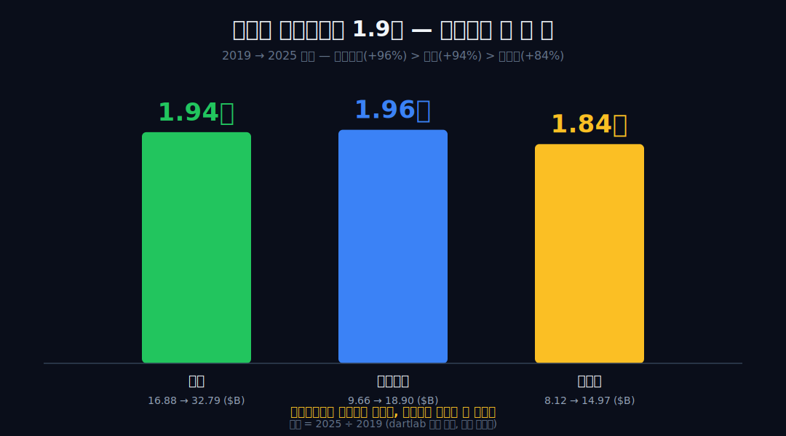
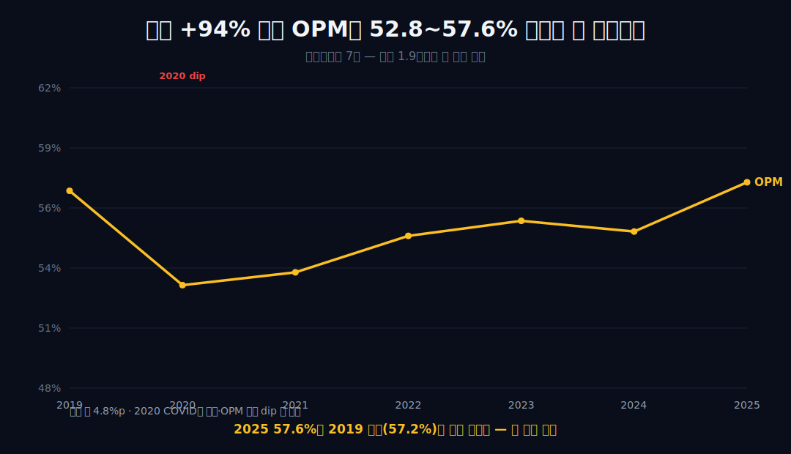
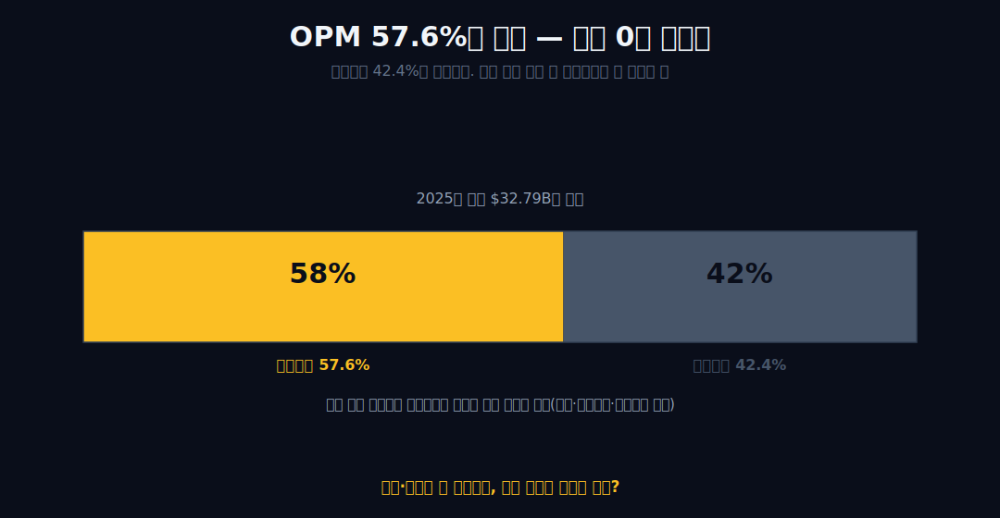
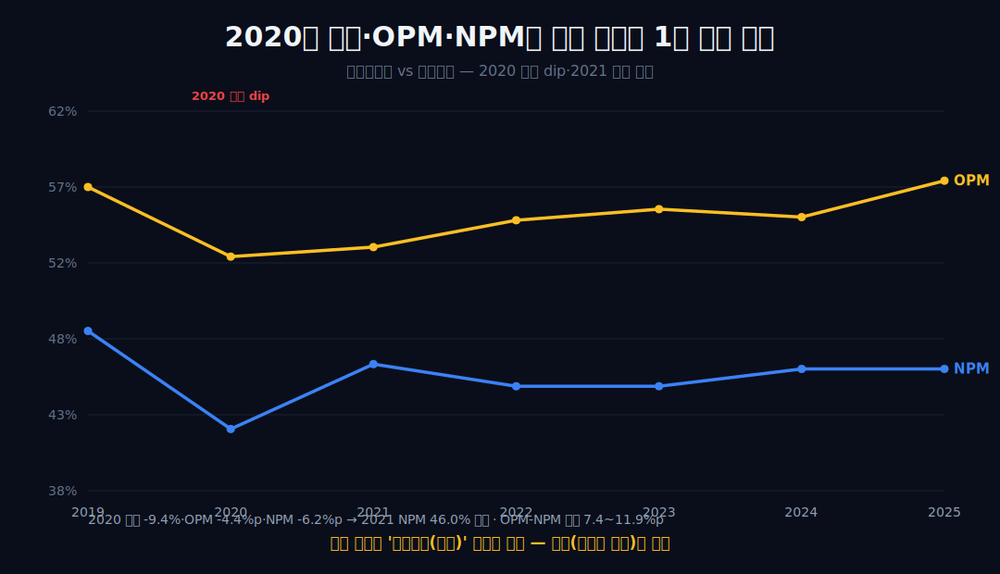
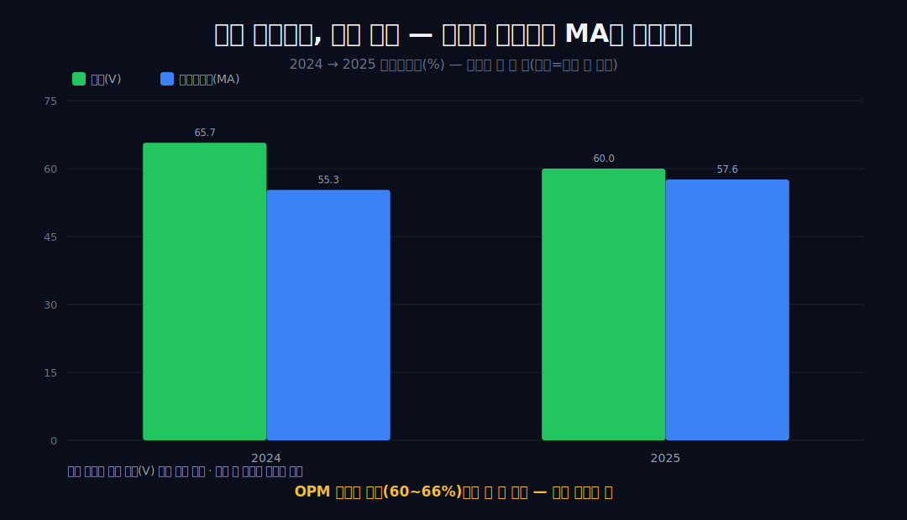
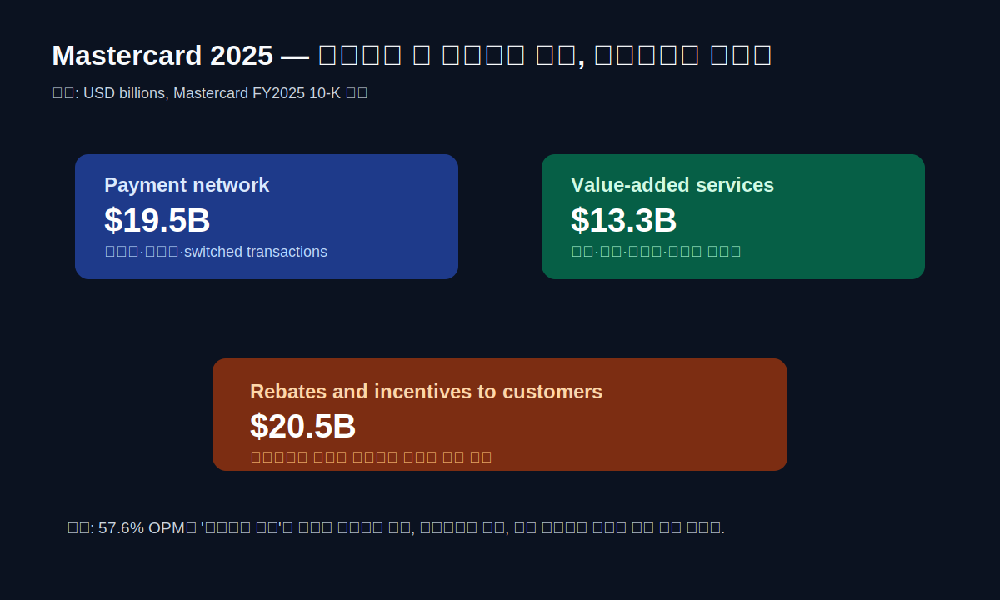
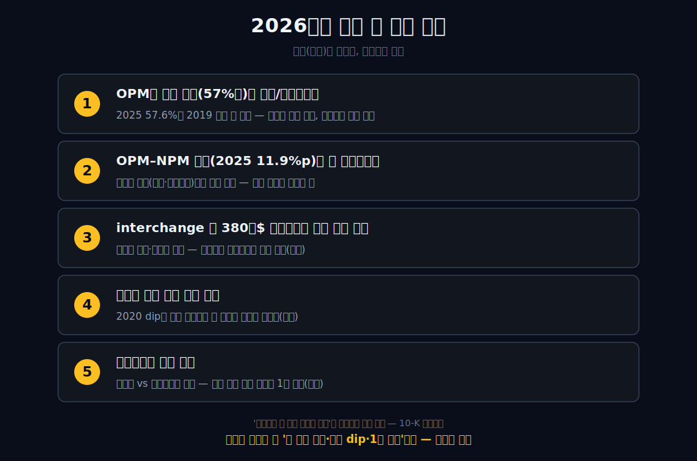

<script>
import ComboChart from '$lib/components/blog/ComboChart.svelte';
import StackBar from '$lib/components/blog/StackBar.svelte';
</script>

> **데이터 기준**: 2026-06-20 dartlab 실측 — Mastercard(MA) **미국 연결(USD)** 기준, 분기 데이터를 역년(calendar year)으로 정규화·합산. 세그먼트(결제망 vs 부가서비스)·interchange 소송·국경간 거래량·GDV는 연결 손익에 안 나오므로 **10-K·IR·언론(외부 인용)**으로 표기. 비자(V) 비교 수치는 직전 [비자 글](/blog/V-visa)의 연결 실측. ※대차대조표 항목은 매핑이 불안정해 인용에 주의.
>
> **핵심 숫자**: 매출 **$32.79B** (2019→2025 **+94%**, 1.94배) · 영업이익 **$18.90B** (**+96%**, OPM **57.6%**) · 당기순이익 **$14.97B** (+84%) · 영업현금흐름 **$17.65B** · OPM 밴드 **52.8~57.6%** (폭 4.8%p) · NPM 밴드 **41.9~48.1%** · OPM–NPM 간극 약 **7.4~11.9%p**
>
> **이 글의 용어**: OPM(영업이익률)·NPM(순이익률) = 별개 비율 · 통행료망 = 거래를 통과시키고 수수료를 받는 네트워크 · four-party = 발급사·매입사·가맹점·소비자 4자 구조 · interchange = 가맹점이 무는 스와이프 수수료(발급은행 수취분) · GDV = 총결제액.

---

## 프롤로그 — 카드를 만드는 건 마스터카드가 아니다

마스터카드 카드를 만드는 건 마스터카드가 아니다. 회사가 10-K에 스스로 적어둔 바에 따르면(**외부 자기기술**), 카드를 찍어 손에 쥐여주는 건 발급은행이고, 못 갚으면 떼이는 손실도 그 은행 몫이다. 마스터카드는 거래가 자기 망을 통과할 때 수수료를 받는다.

그래서 2020년 코로나가 왔을 때, 이 회사의 손익은 카드사가 휘청이는 방식과 다르게 움직였다. 매출 -9.4%, OPM 57.2%→52.8%로 꺾인 건 맞지만, 위기에 카드사를 갉는 그 숫자(대손)는 연결 손익 어디에도 나타나지 않았고, NPM은 이듬해 곧장 돌아왔다.



무엇이 꺾였다 돌아왔는지는 숫자가 말한다. 왜 그랬는지는 회사의 자기기술이 말한다. 이 글은 그 둘을 끝까지 갈라 적는다. 이미 [비자(V)](/blog/V-visa)에서 본 '리스크를 안 지는 통행료망'의 형제편이되, 마스터카드의 마진은 비자보다 한 칸 낮은 자리에 있다.


---

## 1막 — 안 깎인 마진 한 줄, 그러나 비자보다 한 칸 낮은

**6년간 외형이 1.9배가 됐는데 마진은 어떻게 됐나.** 한 밴드를 못 벗어났다.

```python
import dartlab
c = dartlab.Company("MA")
c.select("IS", ["매출액", "영업이익"], freq="Q")  # 분기→역년 합산
```

매출은 $16.88B에서 $32.79B로 +94%(1.94배) 커졌는데, 영업이익률은 **52.8~57.6% 밴드(폭 4.8%p)**를 단 한 번도 벗어나지 않았다. 영업이익도 $9.66B에서 $18.90B로 **+96%** — 매출 +94%를 근소 상회해, 외형 1.9배가 마진을 희석하지 않고 오히려 살짝 좋아지는 쪽이었다. 실제로 2025년 OPM 57.6%는 6년 만에 2019년 고점(57.2%)을 처음 넘어선 값이다 — '안 깎였다'를 넘어 밴드 상단을 새로 그었다.



이미 발간한 [비자(V)](/blog/V-visa) 글에서 본 패턴과 같다. 다만 마스터카드의 OPM 밴드(52~58%)는 비자(60~66%)보다 한 칸 아래다 — 같은 형제망이라도 수익성 색채가 다르다. 이 한 줄이 말하는 건 '아직 안 깎였다'까지다. 왜 안 깎였는지, 왜 비자보다 한 칸 낮은지는 한 글자도 말하지 않는다. 외형이 1.9배가 됐는데 마진이 안 깎이려면, 매출과 함께 늘어났어야 할 무엇이 안 늘어났다는 뜻이다 — 그게 2막의 질문이다.

---

## 2막 — 비용 0이 아니라, 매출 따라 늘 비용이 안 따라온다

**마진이 높다는 건 비용이 없다는 뜻인가.** 아니다. 영업비용은 매출의 42%가 실재한다.

OPM 57.6%(2025)는 거꾸로 **영업비용이 매출의 42.4% 실재**한다는 뜻이다 — '비용 0' 네트워크가 아니다. 그런데 매출이 +94% 커지는 6년 내내 그 비용 비율이 마진을 끌어내리지 못했다(52.8~57.6% 밴드).



매출이 늘 때 원가·대손이 같이 늘어 갉아먹는 사업이라면 외형 1.9배에서 50%대 밴드를 지키기 어렵다. 매출을 따라 늘어나는 변동원가의 비중이 작은 사업과 **양립**한다(단 밴드 유지는 환율·고객 인센티브·믹스로도 설명 가능하다 — 'OPM 57%니까 독점'이라는 단정은 피한다. 높은 마진과 통행료망 구조는 양립일 뿐, 마진이 구조를 증명하지 않는다). 그렇다면 자연스러운 질문 — 매출과 함께 늘어났어야 할 그 원가·대손은 대체 **누구의 장부**에 있는가?

---

## 3막 — 회사가 스스로 적어둔 문장: 카드사가 아니다 (외부 인용)

**그 변동원가는 어디 있나.** 연결 손익 안엔 답이 없고, 회사가 10-K에 적어뒀다.

변동원가의 행방은 연결 손익 '안'에 답이 없고, 회사가 '밖'에 적어둔 자기기술에만 있다. **외부 인용(10-K)**: 마스터카드는 자기 자본으로 카드를 발급하거나 소비자에게 신용을 주지 않는다 — 발급은 은행, 대출 리스크도 은행이 진다. 발급사와 매입사 사이에서 거래를 '스위칭'(승인→청산→정산)하고, 그 거래가 통과한 대가로 수수료를 받는 four-party 네트워크다. 신용 리스크는 보유하지 않는다.

그래서 2막에서 '안 늘어난 변동원가'의 자리에, 회사는 스스로 '우리는 대손·여신을 안 진다'는 문장을 적어둔다 — 내부 마진 밴드와 이 외부 자기기술은 서로 **정합**한다. 여기까지가 경계다. '리스크를 안 져서 마진이 높다'로 한 발 더 가는 순간, 정합은 인과로 둔갑하고 검증 범위를 벗어난다.

---

## 4막 — 2020: 연결이 증명한 두 줄, 증명 못 한 한 줄

**코로나에 카드 회사니까 연체로 휘청였을까.** 데이터로 시험해보자.

[비자](/blog/V-visa) 글은 2020을 분기 누락으로 통째로 제외했지만, 마스터카드는 검증 데이터에 2020 dip이 그대로 찍혀 있다 — 그래서 통념을 데이터로 시험할 수 있다.

```python
c.select("IS", ["당기순이익"], freq="Q")
```



연결 데이터가 말하는 **두 줄**: (1) 2020년 매출은 -9.4%, OPM은 57.2→52.8%(-4.4%p), NPM은 48.1→41.9%(-6.2%p)로 셋이 **함께 꺾였다**. (2) NPM은 이듬해 곧장 46.0%로 복원됐고 매출은 +23.4% 반등했다. 이 빠른 복원이 증명하는 것은 정확히 '**영구손상(대손)이 아니다**'까지다 — 대손에 의한 영구손상이었다면 회복이 더뎠을 것이다.

증명 **못 하는 한 줄**: 그 dip의 '원인'이 국경간 거래량 붕괴인지는 연결 숫자로 못 가른다. 거래량·세그먼트는 검증 데이터에 없다. 그 원인은 외부 자기기술(2020 국경간 볼륨 -30%대·여행 봉쇄, 신용손실 아님 **[외부 인용]**)과 정합할 뿐, 인과로 잇지 않는다. 2020은 붕괴가 아니라 완만한 dip이었고 1년 만에 되돌았다 — 절제된 사실 그대로가 '카드 회사니까 연체로 휘청였겠지'라는 통념을 충분히 흔든다.

---

## 5막 — 진짜 돈줄(요율 설정 권한)이 지금 법정에 있다

**가장 강력한 외부 리스크는.** 정하지만 직접 안 받는 수수료, 그 요율 권한이다.

가맹점이 무는 interchange(스와이프 수수료)는 카드 발급은행이 수취하고 마스터카드가 직접 매출로 잡지 않는다 — 그러나 그 기본 요율표는 마스터카드가 설정한다 **[외부 인용]**. 바로 그 '정하지만 안 받는' 요율 권한이 표적이다.

**외부 인용**: 미 interchange 집단소송(MDL 1720)에서 2024년 3월 약 300억$ 합의안이 나왔으나 2024년 6월 Brodie 판사가 기각(인하 미미·Honor All Cards 규칙 유지)했고, 2025년 11월 수정안(신용 interchange 합산 평균 약 10bp 인하)이 제출됐다. NRF 등 가맹점 단체는 '실질 없음'이라며 반대한다. 이건 신용손실 리스크가 아니라 **가격결정력(요율)에 대한 법적 압박**이다.


두 가지를 헷갈리면 안 된다 — (1) interchange는 발급은행 수취분이라 마스터카드 매출이 아니다('합의 규모 = 매출 타격'으로 읽으면 오독), (2) 이 소송을 2025 OPM 57.6%와 인과로 잇는 순간 거짓이 된다(요율-OPM 연결 자체가 데이터 밖이므로, 손익 영향은 외부 추정으로만 둔다).

---

## 6막 — OPM과 NPM 사이의 7~12%p, 그 간극이 못 말하는 것

**연결을 끝까지 따라가면 무엇이 남나.** 별개 비율 사이의, 설명 안 되는 간극이다.

연결 데이터로 끝까지 따라가도 OPM(약 53~58%)과 NPM(약 42~48%) 사이에는 매년 약 **7.4~11.9%p**의 간극이 있다 — 2021년 7.4%p로 가장 좁았다가 2025년 11.9%p로 가장 넓어졌다(구조적 고정이 아니라 변동 요소라는 뜻). 그리고 6년 구간을 보면 **영업이익 +96% > 매출 +94% > 순이익 +84%** 순서다 — 영업단까지는 외형보다 약간 빠르게 벌었는데, 순이익은 외형에도 못 미쳤다.



영업단 아래(세금·투자손익 등)에서 무언가 새고 있다는 것까지는 연결 숫자가 말한다. 그러나 그 출처를 손익명세로 분해하는 것은 검증 데이터에 없는 영역이다. 비자와의 검증 차이도 여기서 마지막으로 못 박되, 그 이유는 전부 데이터 밖임을 분명히 한다 — OPM 밴드가 한 칸 낮고(52~58% vs 60~66%), 2024→2025에 비자는 65.7→60.0%로 내려온 반면 마스터카드는 55.3→57.6%로 올라왔다. **왜 그런지는 데이터 밖이라, 어느 한쪽으로 해석을 고르지 않는다** — 한쪽 해석을 고르는 순간 그게 곧 봉합이다. 같은 '간판과 진짜 돈줄이 다른 회사'라도 [비자](/blog/V-visa)는 경계가 결론이었고, 마스터카드는 그 경계가 한 칸 아래에 그어진다.

---

## 7막 — 2025년 순매출은 두 엔진이다: 네트워크 19.5B, 부가서비스 13.3B

**마스터카드는 정말 단순한 카드망인가.** 2025년 10-K는 이 회사를 두 엔진으로 나눠 보여준다. Payment network net revenue는 **$19.476B**, value-added services and solutions net revenue는 **$13.315B**다. 합치면 total net revenue **$32.791B**다. 전년 대비 성장률은 payment network 12%, value-added services 23%다.



이 숫자는 “마스터카드는 거래가 지나갈 때 수수료를 받는 통행료망”이라는 한 문장을 더 정밀하게 만든다. Payment network는 여전히 가장 큰 엔진이다. 총결제액, 국경간 볼륨, switched transactions가 커질수록 네트워크 매출이 늘어난다. 그러나 부가서비스도 이미 전체 순매출의 40% 안팎까지 커졌다. 보안, 인증, 데이터, 마케팅, 소비자 acquisition and engagement 서비스가 단순 결제 승인보다 빠르게 자라고 있다.

그래서 57.6% OPM을 “거래마다 수수료를 떼는 독점망이라서”라고만 설명하면 너무 거칠다. 2025년에는 네트워크 매출이 견조했고, 부가서비스가 더 빨리 컸고, 고객 rebates and incentives가 순매출을 크게 깎았다. 10-K는 payment network net revenue 안에 고객에게 제공한 rebates and incentives가 **$20.522B** 포함되어 있다고 적는다. 이 항목은 net revenue를 계산할 때 매우 중요하다.

여기서 오독이 자주 나온다. 마스터카드의 gross dollar volume, assessments, interchange, rebates를 서로 섞으면 안 된다. GDV는 망을 지난 거래 규모이고, 순매출은 그중 마스터카드가 인식하는 revenue에서 고객 인센티브 등을 반영한 결과다. interchange는 발급은행이 받는 성격이 강하고, 마스터카드 매출이 아니다. 그래서 “거래액이 10.6T니까 수수료율 몇 %면 매출이 이렇다”는 식의 뒷계산은 위험하다. 공시는 순매출과 key drivers를 분리해서 보여준다.

이 막이 주는 결론은 하나다. 마스터카드의 해자는 “카드망”이라는 한 단어보다 복잡하다. 네트워크가 거래를 붙잡고, 부가서비스가 성장률을 보태고, 고객 인센티브가 순매출을 깎는다. 그 세 줄을 같이 봐야 57%대 마진이 왜 유지되는지, 그리고 어떤 줄이 흔들리면 마진이 꺾일 수 있는지 보인다.

---

## 8막 — 2025년 key drivers: GDV 10.6T, 국경간 15%, switched 10%

**2025년에 실제로 무엇이 마스터카드 매출을 밀었나.** 회사의 FY2025 earnings release는 key drivers를 세 줄로 제시한다. Gross dollar volume은 local currency 기준 9% 성장해 **$10.6T**가 됐다. Cross-border volume은 local currency 기준 **15%** 성장했다. Switched transactions는 **10%** 성장했다.

이 세 줄이 2020년 dip의 해석을 다시 확인한다. 2020년 마스터카드의 매출·OPM·NPM이 동시에 꺾였던 이유를 연결 손익만으로는 국경간 여행 붕괴라고 단정할 수 없다. 그러나 2025년 key drivers에서 cross-border volume이 여전히 별도 핵심 지표로 제시된다는 사실은, 국경간 흐름이 이 회사의 수익성에 중요한 레버라는 해석과 정합한다. 여행·출장·해외 전자상거래가 회복될 때 마스터카드는 카드 대손이 아니라 거래 흐름으로 돈을 번다.

다만 여기서도 경계가 필요하다. GDV 9%, cross-border 15%, switched 10%가 모두 좋다고 해서 OPM이 반드시 같은 비율로 오른다는 뜻은 아니다. 고객 rebates and incentives도 key drivers 증가와 신규·갱신 deal에 따라 늘어난다. 2025년 payment network rebates and incentives는 16% 증가했다. 거래량이 커질수록 고객에게 돌려주는 돈도 커질 수 있다는 뜻이다.

즉 마스터카드의 성장은 “거래량이 늘면 끝”이 아니다. 거래량이 늘고, 국경간 비중이 좋고, switched transactions가 늘고, value-added services가 더 빨리 커지고, customer incentives가 그 성장을 과도하게 먹지 않을 때 순매출과 OPM이 같이 좋아진다. 마진 57.6%는 이 다섯 요소가 한 해 동안 같은 방향으로 맞아떨어진 결과다.

이 점은 Visa 비교에도 중요하다. Visa는 더 높은 OPM 밴드를 갖고 있고, 마스터카드는 한 칸 낮은 대신 부가서비스와 고객 조합이 다른 색채를 만든다. 어느 쪽이 “더 좋다”가 아니다. 두 회사 모두 결제망이지만, 순매출 구성·고객 인센티브·비용 구조가 다르면 같은 거래량 성장도 다른 OPM으로 내려온다. 그래서 마스터카드 글은 Visa보다 낮은 마진을 약점으로만 쓰지 않는다. 낮은 밴드 안에서 부가서비스가 어떻게 커지는지를 따로 본다.

---

## 9막 — 2026년 1분기: OPM 58.4%, adjusted 60.8%, 그러나 둘을 섞지 않는다

**최신 분기는 어떤 답을 줬나.** Q1 2026은 마스터카드의 고마진 구조가 아직 꺾이지 않았음을 보여준다. net revenue는 **$8.4B**, operating expenses는 $3.5B, operating income은 $4.9B, GAAP operating margin은 **58.4%**다. net income은 $3.9B다. non-GAAP 기준 adjusted operating margin은 **60.8%**다.

이 숫자는 강하다. 2025년 연간 GAAP OPM 57.6%에서 Q1 2026 GAAP OPM 58.4%로 더 올라왔다. Q1 gross dollar volume은 local currency 기준 7% 성장해 $2.7T였고, cross-border volume은 13%, switched transactions는 9% 성장했다. Value-added services and solutions net revenue는 전년 대비 22% 성장했다. 결제망과 부가서비스가 동시에 움직인 분기다.

하지만 GAAP 58.4%와 adjusted 60.8%를 섞으면 안 된다. Q1 2026 adjusted operating margin은 equity investment gains/losses, special items, currency impacts 등을 조정한 보조 지표다. GAAP margin이 주주가 받는 공식 손익이고, adjusted margin은 비교를 돕는 렌즈다. AMD 글에서 non-GAAP을 다룬 것과 같은 원칙이다. 보조 렌즈는 유용하지만, 최종 손익을 대체하지 않는다.

Q1 2026에는 operating expenses가 13% 증가했다. 회사는 그 이유 중 하나로 general and administrative expenses 증가와 restructuring charge를 들고, litigation provision 감소가 일부 상쇄했다고 설명한다. 이것은 마스터카드의 50%대 OPM이 “비용이 없는 사업”이 아니라는 점을 다시 보여준다. 비용은 크다. 다만 매출과 함께 늘어야 할 원가·대손이 카드 발급사처럼 붙지 않는 구조라 50%대 마진이 유지된다.

Q1 2026의 또 다른 업데이트는 BVNK 인수 계획과 stablecoin solutions 확장이다. 이건 흥미롭지만, 이 글의 본문 결론으로 당겨 쓰지 않는다. stablecoin이 마스터카드 순매출과 OPM을 얼마나 바꿀지는 아직 연결 손익에 들어오지 않았다. 지금 검증 가능한 것은 Q1 2026 결제망·부가서비스 성장, GAAP OPM 58.4%, adjusted OPM 60.8%, 그리고 key drivers의 동행까지다.

---

## 10막 — 이 글이 틀리려면 무엇이 바뀌어야 하나

**어떤 숫자가 나오면 “안 깎인 마진” 서사를 버려야 하나.** 마스터카드에서는 다섯 줄을 봐야 한다.

첫째, OPM이 52.8~57.6% 역사 밴드 아래로 내려가면 이 글의 중심은 깨진다. 2019~2025년 마스터카드는 외형 1.94배에도 OPM 밴드를 지켰다. Q1 2026에는 58.4%로 더 높아졌다. 만약 앞으로 OPM이 50% 초반 아래로 내려가고 회복하지 못하면, 네트워크 구조의 영업 레버리지가 약해졌거나 고객 인센티브·비용·규제 부담이 더 커졌다는 뜻이다.

둘째, rebates and incentives가 순매출 성장보다 빠르게 커지면 마진의 질이 낮아진다. 2025년 payment network rebates and incentives는 $20.522B였고 16% 증가했다. 이 항목은 고객 확보와 계약 갱신의 가격이다. 거래량이 늘어도 고객에게 돌려주는 금액이 더 빠르게 커지면, “거래량 증가 → 순매출 증가 → OPM 유지”라는 경로가 약해진다.

셋째, value-added services 성장률이 둔화되면 마스터카드는 다시 단순 결제망에 가까워진다. 2025년 value-added services net revenue는 $13.315B였고 23% 성장했다. Q1 2026도 22% 성장했다. 이 축이 payment network보다 빠르게 크기 때문에 마스터카드는 단순 swipe fee 회사가 아니라 보안·인증·데이터 서비스 회사로도 읽힌다. 이 성장률이 낮아지면 57%대 OPM의 구조 설명도 다시 써야 한다.

넷째, cross-border volume이 둔화되면 2020 dip의 반대편 레버가 약해진다. 2025년 cross-border volume 성장률은 15%, Q1 2026은 13%였다. 국경간 흐름은 고마진 결제망의 중요한 driver다. 경기 둔화, 여행 위축, 환율, 지정학 리스크로 이 줄이 꺾이면, 매출 성장률과 OPM이 같이 둔화될 수 있다.

다섯째, 법률·규제 비용이 영업비용에 반복적으로 커지면 “신용 리스크 비보유”만으로는 방어가 안 된다. 마스터카드는 카드 대손을 떠안지 않지만, interchange·가격결정력·네트워크 규칙을 둘러싼 소송과 규제는 다른 종류의 리스크다. 2025년 provision for litigation은 $504M이었다. 이 항목이 여러 해 반복 확대되면, 대손이 없어도 영업마진은 깎인다.

여섯째, 다섯 largest customers 집중도가 커지면 협상력의 방향을 다시 봐야 한다. 2025년 10-K는 상위 5개 고객에서 나온 net revenue가 약 $6.9B, 전체의 21%라고 설명한다. 마스터카드는 전 세계 네트워크지만, 주요 발급사와 대형 프로그램의 계약이 순매출에 중요하다. 고객이 크면 거래량을 가져오지만, 동시에 rebates and incentives 협상도 커진다. 순매출 성장률이 좋아도 특정 고객 계약 갱신에서 인센티브가 커지면 OPM은 늦게 반응할 수 있다.

일곱째, Payment network와 value-added services의 성장률 격차가 좁혀지면 “두 번째 엔진”의 의미가 달라진다. 2025년 value-added services는 23% 성장했고, Q1 2026도 22% 성장했다. 이 축이 빠르게 크면 마스터카드는 단순 결제망보다 더 넓은 데이터·보안·인증 플랫폼으로 읽힌다. 그러나 성장률이 payment network와 비슷해지거나 낮아지면, 회사의 프리미엄은 다시 결제망 거래량과 국경간 흐름에 더 의존하게 된다. 그 경우 투자자는 부가서비스를 별도 성장엔진이 아니라 네트워크를 보완하는 서비스 묶음으로 낮춰 읽어야 한다.

여덟째, adjusted margin이 GAAP margin보다 계속 높게 유지되는 이유를 매년 확인해야 한다. 2025년 GAAP OPM은 57.6%, adjusted OPM은 59.2%였다. Q1 2026 GAAP OPM은 58.4%, adjusted OPM은 60.8%였다. 차이는 크지 않지만 반복된다. 조정 항목이 일회성이고 비교가능성을 높이는 성격이면 보조 렌즈로 유용하다. 반대로 litigation, restructuring, equity investment gains/losses 같은 항목이 계속 반복되면 “조정 후 마진”은 회사의 실제 비용 구조를 너무 부드럽게 보여줄 수 있다.

아홉째, settlement risk를 대손 리스크와 헷갈리면 안 된다. 마스터카드가 소비자에게 신용을 주지 않는다는 사실은 카드 대출 부실에서 자유롭다는 뜻이다. 그러나 결제망 규칙, interchange 구조, 가격결정력은 법률·규제의 대상이 된다. 두 리스크는 성격이 다르다. 신용 리스크는 경기침체기에 대손으로 나타나고, 규제 리스크는 수수료 구조·계약 조건·법률 비용으로 나타난다. 마스터카드는 전자를 피하지만 후자를 피하지 못한다. 50%대 OPM을 방어하려면 이 둘을 분리해야 한다.

열째, share repurchase가 EPS를 돕는 것과 사업 마진이 유지되는 것은 다른 사건이다. 2025년 마스터카드는 $11.727B의 Class A share repurchase와 $2.756B의 cash dividends를 집행했다. OCF $17.648B가 이를 뒷받침했다는 점은 강하다. 그러나 자사주 매입은 EPS와 주주환원을 돕는 자본배분이고, OPM 57.6%는 영업구조의 결과다. 주가가 높아질수록 같은 달러의 buyback 효율은 낮아질 수 있다. 그래서 자본배분 평가는 OCF, debt, repurchase price, remaining authorization을 같이 봐야 한다.

열한째, stablecoin·agentic commerce 같은 새 단어는 매출 줄에 들어오기 전까지 서사가 아니다. Q1 2026 release는 Mastercard Agent Pay와 BVNK 인수 계획, stablecoin solutions 확장을 언급한다. 흥미로운 방향이지만, 아직 이 글의 검증 축은 net revenue, OPM, GDV, cross-border, switched transactions, value-added services다. 새 단어가 정말 사업을 바꾸려면 순매출 구성, 비용 구조, 거래량 지표, 또는 부가서비스 성장률에 흔적을 남겨야 한다. 그 전에는 전략 발표이지 재무제표의 증거가 아니다.

마지막으로, 마스터카드를 “영원히 좋은 회사”라고 쓰는 순간 이 글은 약해진다. 좋은 회사일수록 어느 줄이 좋아서 좋은지 분명히 해야 한다. 이 글에서 좋은 줄은 매출 1.94배에도 OPM 밴드가 유지됐다는 사실, OCF가 영업이익에 가깝게 따라온다는 사실, Q1 2026에도 GAAP OPM이 58.4%였다는 사실이다. 위험한 줄은 rebates, 고객 집중, litigation, 규제, adjusted margin 반복 조정이다. 강점과 위험을 같은 표 위에 올려둘 때, “카드를 만들지 않는 카드회사”라는 문장이 투자자의 검산 도구가 된다.

따라서 마스터카드의 결론은 “영원히 50%대 마진”이 아니다. 더 정확한 문장은 이렇다. 2019~2025년 연결 숫자와 Q1 2026 공식 실적은, 마스터카드가 카드 발급사가 아니라 네트워크·서비스 사업자라는 구조와 정합한다. 그러나 이 구조가 유지되려면 거래량, 국경간, switched transactions, value-added services, rebates, litigation cost가 같은 방향으로 버텨야 한다. 한 줄만 무너지면 57%대 마진은 숫자로 다시 시험받는다.

---

## 2026년에 봐야 할 다섯 가지

1. **OPM이 밴드 상단(57%대)을 유지/돌파하는가** — 2025년 57.6%로 2019 고점(57.2%)을 처음 넘었다. 유지·돌파면 믹스 효과 가설, 되밀리면 일시 회복. 인과 봉합은 그 후에만.
2. **OPM–NPM 간극(2025 11.9%p)이 더 벌어지는가** — 영업단 아래(세금·투자손익)에서 새는 부분의 추이. 단 출처 분해는 손익명세가 필요해 데이터 밖.
3. **interchange 약 380억$ 수정합의(MDL 1720)의 최종 승인 여부** — 가맹점 반대·항소가 어디로 가는가. '잠정 → 최종/번복'이 분기점이며, 발급은행 수취분임을 계속 분리(외부).
4. **국경간 볼륨 회복 지속 여부** — 2020 dip을 만든 그 통행량이 두 자릿수 성장을 잇는가. 통행료망의 큰 이익 레버이자 2020 dip의 성격(여행 기반·신용 무관) 재확인(외부).
5. **부가서비스 비중 추이** — 외부 인용 기준 결제망 vs 부가서비스 구성이 어떻게 바뀌는가. 비자 대비 색채 차이의 1차 지표(외부, IR 확인 대상).

이 다섯 줄은 “고마진이라 좋다”는 한 문장을 재무제표 언어로 쪼갠 것이다. OPM은 결과이고, 결과를 만드는 입력은 거래량, 국경간 흐름, switched transactions, value-added services, customer incentives, legal cost다. Q1 2026처럼 모든 driver가 같이 좋으면 58.4% OPM이 나온다. 그러나 driver 중 하나가 꺾였을 때 어느 줄이 먼저 흔들리는지는 다르다. 거래량 둔화는 payment network revenue에 먼저 오고, 고객 인센티브 확대는 순매출에 먼저 오며, litigation은 operating expenses에 먼저 온다.

가장 느리게 보이는 위험은 고객 인센티브다. 마스터카드는 고객과 장기 계약을 맺고, 그 계약은 volume threshold나 performance 조건에 따라 rebates and incentives를 만든다. 2025년 10-K가 이 항목을 critical audit matter로 다루는 이유도 추정과 판단이 들어가기 때문이다. 고객 성과 추정이 바뀌면 net revenue가 달라질 수 있다. 투자자는 매출 성장률만 보는 대신, rebates and incentives 증가율과 순매출 성장률을 같이 봐야 한다. 고마진 회사의 압력은 종종 매출총액이 아니라 순매출 조정에서 먼저 보인다.

국경간 볼륨도 단순 여행 지표가 아니다. 온라인 해외구매, 출장, 관광, 송금성 결제, 기업 지출, 환율이 모두 섞인다. 2025년 cross-border volume +15%, Q1 2026 +13%는 매우 강하다. 그러나 이 줄이 둔화되면 payment network revenue 성장률이 먼저 낮아질 수 있고, 국경간 거래가 가진 높은 경제성이 약해질 수 있다. 2020년 dip을 “신용손실이 아니다”라고 말할 수 있었던 이유는 회복이 빨랐기 때문이다. 다음 둔화가 와도 같은 속도로 회복되는지가 진짜 검증이다.

부가서비스는 마스터카드를 단순 결제망에서 멀어지게 하지만, 동시에 비용 구조를 바꿀 수 있다. 보안·인증·데이터·마케팅 솔루션은 소프트웨어적 성격을 갖지만, 인수, 인력, 기술 투자, 영업조직이 필요하다. 2025년 depreciation and amortization이 27% 증가했고, Q1 2026에서도 general and administrative expense가 늘었다. 부가서비스가 빠르게 성장해도, 그 성장이 더 높은 비용을 요구하면 OPM 개선 폭은 제한될 수 있다. 그래서 VASS 성장률만 보지 말고 adjusted operating expenses와 GAAP operating expenses를 같이 봐야 한다.

자사주 매입은 강점이지만, 마진 검증의 대체물이 아니다. OCF가 충분히 크기 때문에 마스터카드는 배당과 buyback을 동시에 할 수 있다. 그러나 주주환원은 영업의 결과를 배분하는 행위이지, 영업마진의 원인이 아니다. 같은 OCF라도 주가가 높으면 buyback 효율은 낮아지고, 법률비용이나 인수기회가 생기면 자본배분 우선순위가 바뀐다. 따라서 주주환원은 “현금이 진짜로 들어온다”는 검산에는 좋지만, “마진이 왜 높은가”의 답은 여전히 네트워크 구조와 순매출 구성에 있다.

마지막으로, 마스터카드의 좋은 점은 숫자가 지루할 만큼 안정적이라는 데 있다. 하지만 안정적인 숫자일수록 변화를 늦게 보여준다. OPM이 55%에서 53%로 내려와도 여전히 아주 높은 마진이라 위기처럼 보이지 않을 수 있다. 그러나 그 하락이 고객 인센티브, 규제비용, 국경간 둔화, VASS 비용 증가와 함께 온다면 의미는 달라진다. 2026년 이후에는 “여전히 50%대”라는 안도보다, 밴드 안에서 어느 방향으로 움직이는지를 봐야 한다. 좋은 회사의 위험은 대개 나빠 보이기 전에 밴드의 방향에서 먼저 나타난다.

또 하나의 경보는 “interchange가 마스터카드 매출”이라는 흔한 오해다. 가맹점이 부담하는 수수료 체계에서 interchange는 핵심 단어지만, 발급은행 수취분이라는 성격을 갖는다. 마스터카드는 요율표와 네트워크 규칙에 영향을 주지만, 그 금액 전부를 매출로 잡는 회사가 아니다. 그래서 소송이나 합의 규모를 마스터카드 매출에서 바로 빼는 식의 계산은 위험하다. 반대로 “직접 매출이 아니니 상관없다”도 틀리다. 요율 구조가 바뀌면 고객 경제성과 네트워크 경쟁력이 바뀌고, 장기적으로 net revenue와 incentives에 영향을 줄 수 있다.

두 번째 경보는 currency-neutral growth와 reported growth의 차이다. 마스터카드는 전 세계 결제망이고, 2025년 net revenue 성장률도 reported 16%, currency-neutral 15%로 나뉜다. Q1 2026도 net revenue 16%, currency-neutral 12%다. 환율과 헤지 효과가 성과 해석을 바꿀 수 있다는 뜻이다. reported growth가 좋아 보여도 currency-neutral growth가 둔화되면 실제 거래 기반 성장률은 약해질 수 있고, 반대로 강달러가 reported number를 눌러도 underlying driver는 견조할 수 있다. 이 회사는 항상 두 성장률을 같이 읽어야 한다.

세 번째 경보는 settlement guarantee다. 마스터카드는 일반적인 소비자 신용대출을 하지 않지만, 고객 간 거래 정산을 보증하는 구조를 갖는다. 10-K는 이 보증에서 역사적으로 큰 지급이 없었다고 설명하지만, 고객이나 지역 금융 시스템의 문제가 생기면 liquidity와 capital access가 중요해질 수 있다. 이것은 카드 대손과 다른 리스크다. 신용카드 대출 손실이 아니라 네트워크 정산 리스크다. 그래서 “신용 리스크 비보유”라는 강점은 맞지만, 모든 금융 리스크가 0이라는 뜻은 아니다.

네 번째 경보는 operating expenses의 구성이다. 2025년 operating expenses는 $13.894B였고, 그 안에는 G&A $11.318B, advertising and marketing $929M, depreciation and amortization $1.143B, provision for litigation $504M이 들어 있다. 고마진 회사라 해서 비용 구성이 단순한 것이 아니다. 특히 G&A는 인력, 기술, 규제 대응, 국제 운영이 함께 들어가는 큰 통이다. 비용이 어느 항목에서 늘어나는지 보지 않으면, OPM이 유지되는 이유도 OPM이 흔들리는 이유도 알 수 없다.

다섯 번째 경보는 인수 효과다. 2025년 net revenue growth 16% 중 acquisition impact는 1%p였고, value-added services growth에는 acquisitions가 3%p 기여했다. 인수는 성장률을 보태지만, 동시에 amortization, integration cost, 인력·시스템 비용을 가져올 수 있다. 부가서비스가 인수로 빠르게 커지는 것은 긍정적이지만, organic growth와 acquisition growth를 구분하지 않으면 성장의 질을 과대평가할 수 있다. 다음 공시에서도 operational growth와 acquisition contribution을 나눠 봐야 한다.

여섯 번째 경보는 “현금이 많으니 문제없다”는 문장이다. 마스터카드는 OCF가 강하고 유동성도 크지만, 정산 보증, 법률비용, 인수, 배당, 자사주 매입, 고객 인센티브가 모두 현금의 사용처다. 현금 창출력이 강한 회사일수록 자본배분 결정의 품질이 중요해진다. 2025년처럼 OCF가 $17.648B이고 buyback과 배당을 감당하는 해는 좋다. 그러나 같은 현금을 어떤 가격에 자사주로 쓰고, 어떤 인수를 위해 쓰고, 어떤 법률비용을 감당하는지가 장기 주주수익률을 가른다.

그래서 마스터카드의 다음 공시는 headline EPS보다 순매출 구성과 비용 구성을 먼저 봐야 한다. Payment network와 value-added services가 같이 커지고, rebates가 통제되고, litigation provision이 반복 확대되지 않고, OCF가 영업이익에 붙어 있으면 고마진 구조는 유지된다. 반대로 EPS가 좋아도 adjusted item과 buyback 효과가 대부분이라면, 사업의 질은 별도로 검산해야 한다.

마스터카드의 장점은 단순하지만 검증은 단순하지 않다. 거래가 늘고, 고객에게 돌려주는 금액이 통제되고, 법률비용이 튀지 않고, 현금이 따라올 때만 50%대 OPM은 진짜 방어력으로 남는다.

다음 공시에서도 이 순서를 유지하면 된다. 먼저 net revenue의 두 엔진을 나누고, 그다음 rebates and incentives를 보고, 이어서 operating expenses와 litigation provision을 확인하고, 마지막으로 OCF와 buyback을 본다. 이 순서를 지키면 마스터카드가 여전히 통행료망인지, 아니면 고객 확보 비용과 규제 비용이 커진 고마진 회사인지 구분할 수 있다.



---

## 공시 / Filings

이 글에서 payment network, value-added services, rebates and incentives, key drivers, GAAP/adjusted margin, cash flow, share repurchase, Q1 2026 실적은 아래 공식 자료만 사용했다. interchange 소송·규제 리스크는 기존 글의 외부 인용 영역으로 남기되, 새 보강에서는 공식 IR/10-K 숫자와 연결되는 범위까지만 다룬다.

| 자료 | 이 글에서 쓰는 항목 |
|---|---|
| [Mastercard 2025 Form 10-K (SEC)](https://www.sec.gov/Archives/edgar/data/1141391/000114139126000013/ma-20251231.htm) | FY2025 total net revenue $32.791B, payment network $19.476B, value-added services $13.315B, rebates and incentives $20.522B, OCF $17.648B |
| [Mastercard FY2025 Earnings Release](https://s25.q4cdn.com/479285134/files/doc_financials/2025/q4/4Q25-Mastercard-Earnings-Release.pdf) | FY2025 GAAP OPM 57.6%, adjusted OPM 59.2%, GDV $10.6T, cross-border +15%, switched transactions +10% |
| [Mastercard Q1 2026 Earnings Release](https://s25.q4cdn.com/479285134/files/doc_financials/2026/q1/1Q26-Mastercard-Earnings-Release.pdf) | Q1 2026 net revenue $8.4B, GAAP OPM 58.4%, adjusted OPM 60.8%, GDV $2.7T, cross-border +13%, switched transactions +9% |

---

## 재무제표 — 최근 7개 연도 (dartlab 연결, $B, 역년 정규화)

> 미국 연결(USD)·분기 합산(역년 정규화) 기준. dartlab에서 직접 확인:
> ```python
> import dartlab
> c = dartlab.Company("MA")
> c.select("IS", ["매출액","영업이익","당기순이익"], freq="Q")
> c.select("CF", ["영업활동현금흐름"], freq="Q")
> ```

<ComboChart data={[{year:"2019",매출:16.88,영업이익:9.66,당기순이익:8.12},{year:"2020",매출:15.30,영업이익:8.08,당기순이익:6.41},{year:"2021",매출:18.88,영업이익:10.08,당기순이익:8.69},{year:"2022",매출:22.24,영업이익:12.26,당기순이익:9.93},{year:"2023",매출:25.10,영업이익:14.01,당기순이익:11.20},{year:"2024",매출:28.17,영업이익:15.58,당기순이익:12.87},{year:"2025",매출:32.79,영업이익:18.90,당기순이익:14.97}]} lineKeys={["매출"]} barKeys={["영업이익","당기순이익"]} lineColors={["#22c55e"]} barColors={["#3b82f6","#f59e0b"]} title="매출(라인) vs 영업이익·당기순이익(막대) — $B" unit="$B" />

| 항목 ($B) | 2019 | 2020 | 2021 | 2022 | 2023 | 2024 | 2025 |
|---|---:|---:|---:|---:|---:|---:|---:|
| 매출 | 16.88 | 15.30 | 18.88 | 22.24 | 25.10 | 28.17 | 32.79 |
| 영업이익 | 9.66 | 8.08 | 10.08 | 12.26 | 14.01 | 15.58 | 18.90 |
| 당기순이익 | 8.12 | 6.41 | 8.69 | 9.93 | 11.20 | 12.87 | 14.97 |
| 연결 OPM | 57.2% | 52.8% | 53.4% | 55.1% | 55.8% | 55.3% | 57.6% |
| 연결 NPM | 48.1% | 41.9% | 46.0% | 44.6% | 44.6% | 45.7% | 45.7% |
| 영업현금흐름 | 8.18 | 7.22 | 9.46 | 11.20 | 11.98 | 14.78 | 17.65 |

이 표를 한 줄로 읽으면 이렇다 — 매출 행은 2020년 한 칸만 빼고 우상향하는데, **OPM 행은 52.8~57.6% 밴드를 한 번도 벗어나지 않는다.** 2020년 열만 매출·OPM·NPM 세 행이 동시에 내려앉았다가 2021년 열에서 되돌아온다(그게 '동반 dip·빠른 복원'이다). 영업현금흐름 행이 영업이익 행에 바짝 붙어 따라가는 것까지가 연결이 증명하는 검산이고, NPM 행이 OPM 행보다 7~12%p 아래에서 따로 노는 그 간극의 출처는 데이터 밖이다.

---

## 검증표

본문 인용 수치를 dartlab 호출과 결과로 검증한다. 외부 출처(세그먼트·소송·국경간 거래량·비자 비교)는 분리 표기. 📅 dartlab 실측 2026-06-20 · Mastercard(MA) 미국 연결(USD)·분기 역년 정규화 기준.

| 본문 수치 | 출처 / 호출 | 결과 |
|---|---|---|
| 매출 2019 16.88B → 2025 32.79B (+94%, 1.94배) | `c.select("IS",["매출액"],freq="Q")` 합산 | ✓ 실측 |
| 영업이익 9.66B → 18.90B (+96%) | `c.select("IS",["영업이익"])` | ✓ 실측 |
| 당기순이익 8.12B → 14.97B (+84%) | `c.select("IS",["당기순이익"])` | ✓ 실측 |
| OPM 밴드 52.8~57.6% (폭 4.8%p), 2025 57.6%가 2019 57.2% 첫 상회 | 영업이익÷매출 | ✓ 실측 |
| NPM 밴드 41.9~48.1%, OPM–NPM 간극 7.4~11.9%p | 순이익÷매출 | ✓ 실측 |
| 2020 dip 매출 -9.4% / OPM -4.4%p / NPM -6.2%p, 2021 NPM 46.0% 복원·매출 +23.4% | 연도별 비교 | ✓ 실측 |
| 영업현금흐름 8.18B → 17.65B, OCF/OP 2024 95%·2025 93% | `c.select("CF",["영업활동현금흐름"])` | ✓ 실측 |
| 비자 OPM 60~66%, 2024→2025 65.7→60.0% (마스터카드 55.3→57.6%) | [비자 글](/blog/V-visa) 연결 실측 | 직전 글 실측 |
| 카드 미발급·신용 비보유·four-party·스위칭 / 대손은 발급은행 | [MA 10-K (SEC)](https://www.sec.gov/cgi-bin/browse-edgar?action=getcompany&CIK=0001141391&type=10-K) | 외부 인용 |
| interchange MDL 1720: 2024.3 합의안→2024.6 기각→2025.11 수정안(약 10bp), NRF 반대 | [Reuters](https://www.reuters.com/) · [법원 기록](https://www.govinfo.gov/) · [Bloomberg](https://www.bloomberg.com/) | 외부 인용 |
| 2020 국경간 볼륨 -30%대·여행 봉쇄(신용손실 아님), 세그먼트(결제망/부가서비스) | [MA IR](https://investor.mastercard.com/) | 외부 인용 |
| 2020 dip 원인이 국경간 거래량인지 / 마진이 왜 비자보다 낮은지 | 세그먼트·거래량(연결 미세분) | 증명 불가·외부 |
| BS(대차대조표) 매핑 불안정 — 인용 주의 | dartlab 데이터 한계 | 주의/제외 |
| FY2025 공식 net revenue 32.791B, operating income 18.9B, OPM 57.6%, net income 15.0B | [Mastercard FY2025 Earnings Release](https://s25.q4cdn.com/479285134/files/doc_financials/2025/q4/4Q25-Mastercard-Earnings-Release.pdf) | 외부 인용 |
| FY2025 adjusted operating margin 59.2% | [Mastercard FY2025 Earnings Release](https://s25.q4cdn.com/479285134/files/doc_financials/2025/q4/4Q25-Mastercard-Earnings-Release.pdf) | 외부 인용·GAAP과 분리 |
| FY2025 Payment network 19.476B, Value-added services and solutions 13.315B | [Mastercard 2025 Form 10-K](https://www.sec.gov/Archives/edgar/data/1141391/000114139126000013/ma-20251231.htm) | 외부 인용 |
| FY2025 payment network rebates and incentives 20.522B, 전년 대비 +16% | [Mastercard 2025 Form 10-K](https://www.sec.gov/Archives/edgar/data/1141391/000114139126000013/ma-20251231.htm) | 외부 인용 |
| FY2025 GDV 10.6T(+9% local), cross-border +15% local, switched transactions +10% | [Mastercard FY2025 Earnings Release](https://s25.q4cdn.com/479285134/files/doc_financials/2025/q4/4Q25-Mastercard-Earnings-Release.pdf) | 외부 인용 |
| FY2025 OCF 17.648B, cash dividends paid 2.756B, share repurchase 11.727B | [Mastercard 2025 Form 10-K](https://www.sec.gov/Archives/edgar/data/1141391/000114139126000013/ma-20251231.htm) | 외부 인용 |
| Q1 2026 net revenue 8.4B, operating income 4.9B, GAAP OPM 58.4%, net income 3.9B | [Mastercard Q1 2026 Earnings Release](https://s25.q4cdn.com/479285134/files/doc_financials/2026/q1/1Q26-Mastercard-Earnings-Release.pdf) | 외부 인용 |
| Q1 2026 adjusted OPM 60.8%, GDV 2.7T(+7% local), cross-border +13%, switched transactions +9%, VASS +22% | [Mastercard Q1 2026 Earnings Release](https://s25.q4cdn.com/479285134/files/doc_financials/2026/q1/1Q26-Mastercard-Earnings-Release.pdf) | 외부 인용·GAAP과 분리 |

본문의 숫자 중 이 표에 없는 것은 발행 차단 대상이다. 세그먼트·소송·국경간 거래량·'리스크를 안 져서 마진이 높다'는 인과는 dartlab 연결로 증명되지 않으며 외부 인용임을 명시한다 — 연결이 증명하는 것은 '매출 +94% 동안 OPM 밴드 유지, 2020 동반 dip·1년 복원(영구손상 아님), 영업이익이 매출보다·순이익이 매출보다 다르게 자람'까지다.
