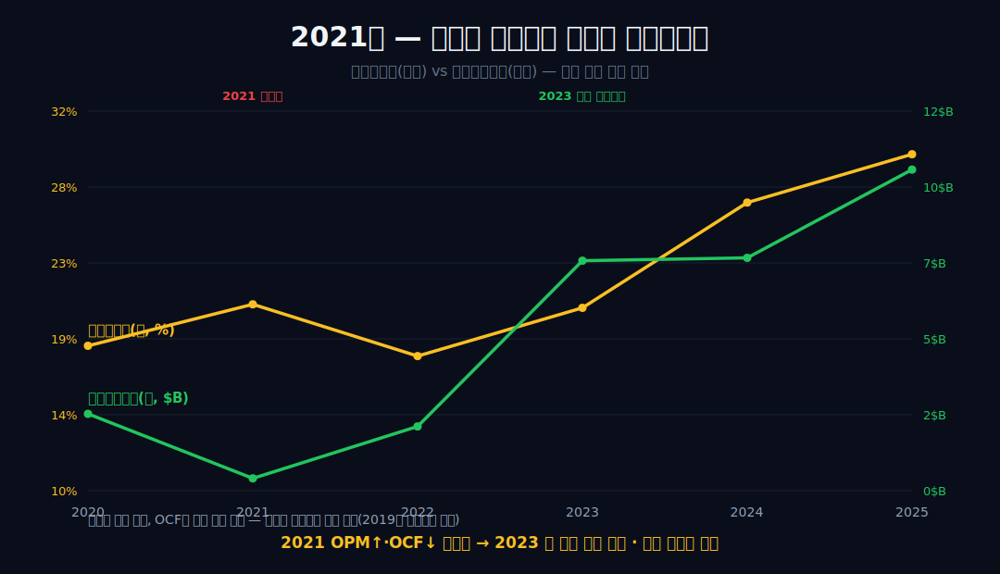
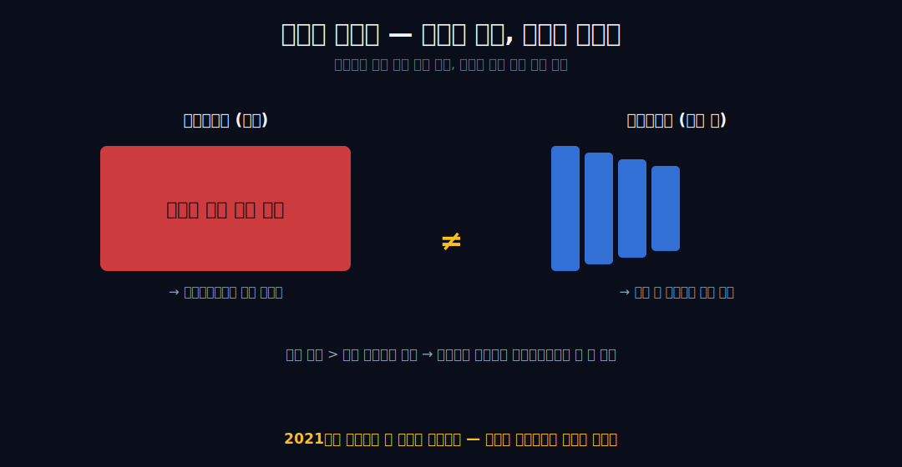
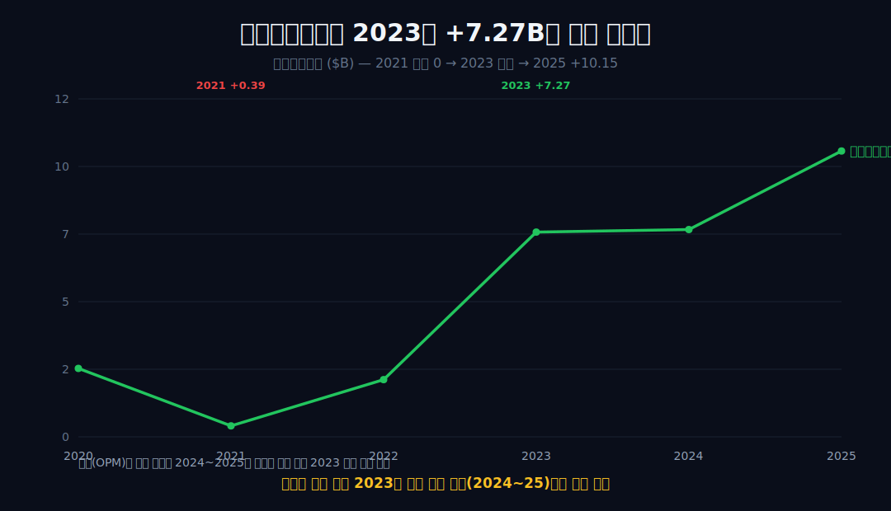
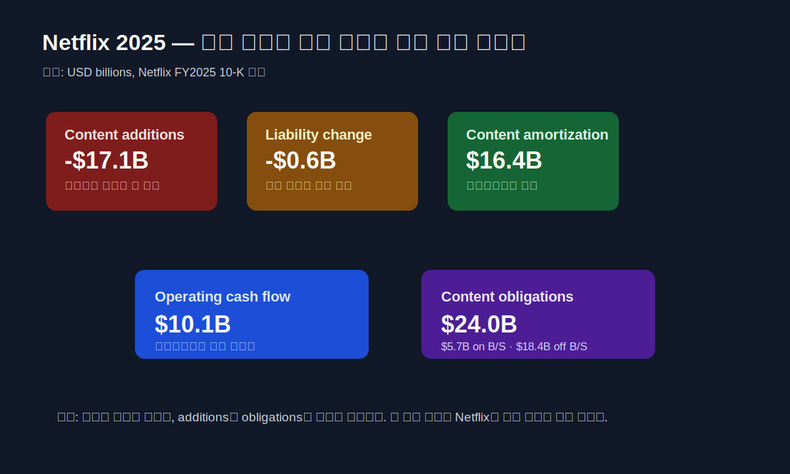
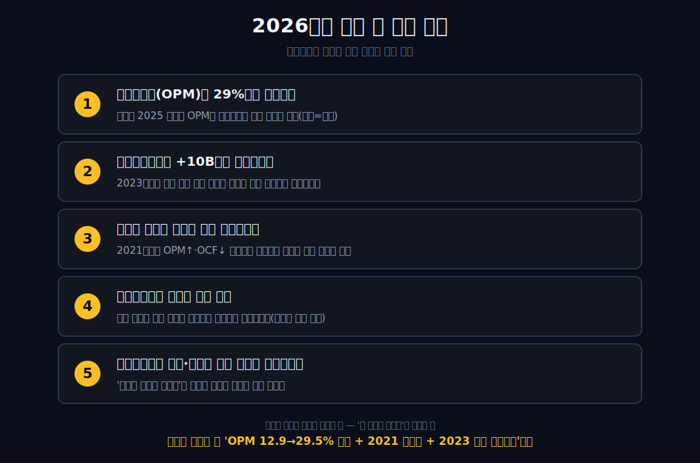

<script>
import ComboChart from '$lib/components/blog/ComboChart.svelte';
import StackBar from '$lib/components/blog/StackBar.svelte';
</script>

> **데이터 기준**: 2026-06-20 dartlab 실측 — Netflix(NFLX) **미국 연결(USD)** 기준, 분기 데이터를 역년(calendar year)으로 정규화·합산. 광고요금제·워너브라더스 인수·콘텐츠 상각 세부·구독자 수·잉여현금흐름은 연결 손익에 안 나오므로 **10-K·IR·언론(외부 인용)**으로 표기. **차트의 영업현금흐름은 2020~2025만 사용**(2019는 3개 분기만 집계된 부분치). ※대차대조표 항목은 매핑이 불안정해 인용에 주의.
>
> **핵심 숫자**: 매출 **$45.18B** (2019→2025) · 영업이익 **$13.33B** (OPM **29.5%**) · 당기순이익 **$10.98B** (NPM **24.3%**) · OPM 2019 **12.9%** → 2025 **29.5%** · 영업현금흐름 2021 **+0.39B**(거의 바닥) → 2023 **+7.27B** → 2025 **+10.15B**
>
> **이 글의 용어**: OPM(영업이익률)·NPM(순이익률) = 별개 비율 · 영업현금흐름(OCF) = 그해 실제로 들어오고 나간 영업 현금 · 콘텐츠 자본화 = 제작비를 그해 현금으로 다 쓰되 장부엔 자산으로 잡아 여러 해로 나눠 상각하는 회계 · 상각 = 그 자산을 해마다 조금씩 비용 처리하는 것.

---

## 프롤로그 — '이익이 늘었다'와 '현금을 벌기 시작했다'는 같은 말이 아니다

넷플릭스의 영업이익률은 12.9%에서 29.5%로 두 배 넘게 벌어졌다. 손익계산서만 보면 흠잡을 데 없는 우상향이다. 그런데 2021년을 보면 이상한 일이 있다.

그해 영업이익률은 18.4%에서 **20.8%로 올랐는데**, 영업현금흐름은 +2.43B에서 **+0.39B로 거의 바닥까지 떨어졌다.** 두 숫자 모두 우리가 가진 차트 안의 실측값이다.



'이익이 늘었다'와 '현금을 벌기 시작했다'는 같은 말이 아니다. 이 글은 그 둘이 왜, 언제 어긋났는지를 손익이 증명하는 범위 안에서만 따라간다. [마이크로소프트](/blog/MSFT-microsoft)에서 영업현금흐름이 순이익을 웃돈 것이 '이익품질'의 충분조건이 아니었듯, 넷플릭스에선 마진과 현금이 아예 다른 해에 움직인다.


---

## 1막 — 마진은 두 배가 됐다 (손익계산서가 하는 말)

**손익계산서는 무엇을 말하나.** 수익성이 추세적으로 확대됐다.

```python
import dartlab
c = dartlab.Company("NFLX")
c.select("IS", ["매출액", "영업이익", "당기순이익"], freq="Q")  # 분기→역년 합산
```

매출이 $20.16B에서 $45.18B로 늘어나는 동안 영업이익은 $2.60B에서 $13.33B로 더 빠르게 증가했다. 이익 증가율이 매출 증가율을 앞섰기 때문에 영업이익률(영업이익/매출)이 상승한다 — 이것은 비율의 정의에서 직접 따라 나오는 산술이지 인과 주장이 아니다.

| 항목 ($B) | 2019 | 2021 | 2023 | 2025 |
|---|---:|---:|---:|---:|
| 매출 | 20.16 | 29.70 | 33.72 | **45.18** |
| 영업이익 | 2.60 | 6.19 | 6.95 | **13.33** |
| OPM | 12.9% | 20.8% | 20.6% | **29.5%** |
| NPM | 9.3% | 17.2% | 16.0% | **24.3%** |

영업이익률은 12.9%→18.4%→20.8%→17.8%→20.6%→26.7%→29.5%로, 순이익률은 9.3%→11.0%→17.2%→14.2%→16.0%→22.3%→24.3%로 움직였다. 이익 증가율이 매출 증가율을 앞섰기 때문에 마진이 올라간 것이다 — 이것은 비율의 산술이지 '무엇 때문에 올랐다'는 인과가 아니다. OPM과 NPM은 별개 비율이고, 두 비율이 같이 올랐다는 사실과 '왜 올랐나'는 다른 질문이다.

---

## 2막 — 2021년, 마진은 올랐는데 현금은 주저앉았다 (통념 반박)

**'이익이 늘면 현금도 는다'는 맞나.** 2021년이 그 통념을 깬다.

손익계산서의 마진이 오르던 해에도 넷플릭스의 영업현금흐름은 거꾸로 급감할 수 있었다. '이익이 늘었으니 현금도 늘었다'는 통념은 2021년 차트 안 실측 두 값만으로 깨진다.

```python
c.select("CF", ["영업활동현금흐름"], freq="Q")
```

두 곡선을 같은 그래프에 겹치면 어긋남이 또렷하다. 영업이익률은 2020년 18.4%에서 2021년 20.8%로 올랐다 — 손익계산서는 더 좋아 보였다. 같은 2021년 영업현금흐름은 2020년 +2.43B에서 **+0.39B**로 떨어졌다.

마진은 손익계산서의 비율이고, 영업현금흐름은 그해 실제로 들어오고 나간 현금이다. 둘은 서로 다른 표의 사건이고, 2021년엔 정반대로 움직였다. 손익이 직접 증명하는 것은 '두 숫자가 반대로 움직였다'는 동시성까지다 — '무엇 때문에'라는 연결은 현금흐름표 항목별 분해가 있어야 쓸 수 있다. 이 한 해가 시차 가설의 가장 깨끗한 증거이고, 두 값 모두 우리가 보유한 차트 안에 있다. 그러면 왜 마진과 현금이 이렇게 갈라질 수 있는가?

---

## 3막 — 왜 이런 일이 생기나 (콘텐츠 자본화 회계)

**마진과 현금은 왜 갈라지나.** 제작비는 현금으로 먼저, 비용은 장부에 나중에.


이 어긋남은 콘텐츠 자본화 회계 구조에서 나온다. 드라마 제작비는 만드는 해에 한꺼번에 현금으로 빠져나간다. 그러나 회계상 콘텐츠는 자산으로 잡혀 여러 기간에 걸쳐 상각되고(쉽게 말해 한 번 쓴 큰돈을 장부에는 여러 해로 나눠 비용 처리한다), 손익계산서에는 그해 몫의 상각액만 비용으로 들어간다.



그래서 제작에 쓴 현금이 그해 장부에 잡힌 상각비보다 큰 국면에서는, 영업이익이 흑자라도 영업현금흐름은 마이너스가 되거나 급감할 수 있다 — 일반론으로서 성립하는 메커니즘이다. 2021년의 어긋남(2막)이 이 구조와 **양립**한다. 다만 '2021년이 정확히 이 국면이었다'를 항목 단위로 단정하려면 현금흐름표의 제작현금 대 상각비 분해가 있어야 하고, 그 분해는 우리 데이터에 없다.

참고로 2019년 영업현금흐름도 음수였으나, 우리 데이터의 -1.43B는 3개 분기만 집계된 부분치(**차트 미사용**)이며 실제 소각의 절반에도 못 미친다 — 정확한 FY2019는 약 -2.9B **[외부 인용, 10-K]**. 이 글은 차트 안 실측인 2021년을 본 증거로 쓴다.

---

## 4막 — 2023년, 두 곡선이 같은 방향을 보기 시작했다

**언제 현금이 자리 잡았나.** 마진이 본격 확대되기 *전*인 2023년이다.

2023년부터 영업현금흐름이 +7.27B로 자리 잡으며, 마진 곡선과 현금 곡선이 비로소 같은 방향으로 움직이기 시작했다.



영업현금흐름은 2022년 +2.03B에서 2023년 +7.27B로 크게 뛴 뒤 2024년 +7.36B, 2025년 +10.15B로 유지·확대됐다. 같은 기간 영업이익률도 2022년 17.8%에서 2023년 20.6%, 2024년 26.7%, 2025년 29.5%로 올랐다. 한 가지 더 — 마진의 *가속*은 2024년에 있었다. OPM 상승폭이 2023년 +2.8%p(17.8→20.6)에서 2024년 **+6.1%p**(20.6→26.7)로 두 배 넘게 커졌다. 즉 현금이 자리 잡은 해(2023)와 마진이 본격적으로 가속한 해(2024)는 또 한 칸 어긋나 있다. 이전 국면(2021)과 달리 이제 두 곡선이 같은 방향을 가리키지만, 박자는 여전히 한 칸씩 다르다.

우리 연결 손익이 증명하는 것은 여기까지다 — 두 곡선이 같은 방향으로 움직였다는 **정합 관찰**이지, 어느 한쪽이 다른 쪽을 만들었다는 인과도, '왜 그렇게 됐는지'의 내부 동인도 우리 데이터로는 분해되지 않는다. 다만 **시점 격차**는 또렷하다 — 마진이 본격 확대된 것은 2024~2025(OPM 26.7→29.5)인데, 영업현금흐름이 +7B대로 자리 잡은 것은 그보다 앞선 2023년(+7.27)이다. '다른 해에 일어난 다른 사건'이라는 주제가 연도 숫자로 못 박힌다.

---

## 5막 — 손익 밖의 사건들 (경계 선언)

**광고요금제·워너 인수는 어디에 두나.** 아직 우리 손익 밖이다.

광고요금제·워너브라더스 인수 같은 화제들은 우리가 보유한 연결 손익이 아직 분해하지 못한 외부 영역이다. 넷플릭스는 구독 단일축에서 광고요금제·유료 계정공유를 더한 다축 구조로 전환했다고 밝혔고 **[외부 인용]**, 2025년 12월엔 워너브라더스 인수 합의를 발표했다 **[외부 인용]**. 이 둘을 대표 예시로 둔다.

그 외 브라질 세무 비용, 구독자 공시 중단, 잉여현금흐름 추이 같은 뉴스/공시 숫자들은 검증 데이터에 없어 우리가 확인할 수 없으므로 검증표에만 외부 라벨로 남긴다. 핵심은 이 사건들의 효과가 우리가 가진 연결 손익(매출·영업이익·순이익·영업현금흐름)에 항목별로 분해되어 들어오기 전까지는, '광고요금제가 마진을 올렸다'거나 '워너가 현금을 바꿀 것'이라는 식의 연결을 쓰지 않는다는 것이다. 이 글의 메시지는 그 사건들의 효과가 '아직 우리 손익에 들어오지 않았다'는 **경계 선언 자체**다.

---

## 6막 — 우리가 분해할 수 없는 것 (겸손)

**그래서 마진은 왜 올랐나.** 그건 우리 데이터로 못 가른다.

보유한 연결 손익만으로는 마진 확대의 내부 동인을 항목별로 분해할 수 없고, 현금 곡선의 미래도 단정할 수 없다. 우리가 가진 데이터는 연도별 매출·영업이익·순이익·영업현금흐름과 그 비율(OPM·NPM)뿐이다. 이것으로는 영업이익률이 무엇 때문에 올랐는지 — 가격인지, 콘텐츠 믹스인지, 상각 곡선인지, 마케팅비 변화인지 — 를 항목별로 분해할 수 없다.

손익이 증명하는 것은 '마진이 올랐다'는 결과까지다. 현금 곡선의 미래도 마찬가지로, 콘텐츠 투자 강도가 다시 커지면 영업현금흐름이 흔들릴 수 있으나 그 시점과 폭을 우리 데이터는 예고하지 못한다. 회사는 2025년 하반기 영업이익률이 상반기보다 낮을 것으로 안내했다 **[외부 인용]** — 그 사유까지는 외부 라벨에 둔다.

모른다고 말하는 것이 지어내는 것보다 정확하다. 넷플릭스의 '장부이익이 늘었다'와 '현금을 벌기 시작했다'는 서로 다른 해에 일어난 다른 사건이고, 그 사이의 시차를 만든 것은 콘텐츠를 자산으로 적는 회계 구조와 **양립**한다(단정은 아니다). 같은 '간판과 진짜 돈줄' 시리즈에서 [코스트코](/blog/COST-costco)가 입구 회비를 *미리* 받아 현금이 이익을 앞섰다면, 넷플릭스는 콘텐츠 현금을 *미리* 써서 현금이 이익을 뒤따라왔다 — 같은 시차의 정반대 부호다. 또 다른 구독 기업 [어도비](/blog/ADBE-adobe)도 영업현금흐름이 순이익을 웃돌지만, 그것을 '구독 모델 우월성'으로 단정하지 않는다는 절제는 두 글이 공유한다 — 외형과 마진이 *동행*한 [애플](/blog/AAPL-apple)·[마이크로소프트](/blog/MSFT-microsoft)와 달리, 넷플릭스의 이야기는 마진과 현금이 *엇갈린* 시점에 있다. 목표주가·매수의견은 이 글의 몫이 아니다.

---

## 7막 — 2025년 콘텐츠 표: 상각 16.4B와 additions 17.1B는 같은 숫자가 아니다

**콘텐츠 회계를 진짜 숫자로 열면 무엇이 보이나.** 2025년 10-K는 이 글의 가설을 더 날카롭게 만든다. Netflix의 2025년 매출은 $45.183B, operating income은 $13.327B, operating margin은 29.5%, net income은 $10.981B다. 여기까지만 보면 “이익이 잘 나는 스트리밍 회사”다. 그런데 현금흐름표의 조정 항목을 열면 다른 시간표가 나온다.

2025년 additions to content assets는 **-$17.097B**다. content liabilities change는 **-$0.611B**다. 반대로 amortization of content assets는 **+$16.422B**로 순이익에서 영업현금흐름으로 조정된다. 이 세 줄이 넷플릭스 회계의 핵심이다. 제작·취득의 현금 박자는 additions와 liabilities change 쪽에 있고, 손익계산서의 비용 박자는 content amortization에 있다.



그래서 “콘텐츠 비용이 16.4B였다”라고만 쓰면 절반만 맞다. 손익계산서에 비용으로 들어간 content amortization은 16.4B였다. 그러나 현금흐름표에서 콘텐츠 자산 additions는 17.1B였다. 둘은 비슷해 보이지만 같은 개념이 아니다. 상각은 과거에 자산으로 잡은 콘텐츠를 올해 비용으로 나누어 넣는 장부의 시간표이고, additions는 올해 새로 자산으로 올린 콘텐츠 현금의 시간표다. 둘을 섞으면 넷플릭스의 현금 전환을 잘못 읽는다.

이 숫자가 2021년의 반전을 설명하는 방식도 조심해야 한다. 2021년에 OPM은 올랐고 OCF는 떨어졌다. 그 현상은 콘텐츠 자본화 구조와 양립한다. 그러나 “2021년에 정확히 어떤 콘텐츠 항목 때문에 얼마가 빠졌다”를 말하려면 그해의 content additions, liabilities, amortization을 함께 열어야 한다. 이 글은 지금 2025년 10-K를 통해 구조를 설명하되, 2021년의 원인을 한 항목으로 단정하지 않는다. 연결 손익이 증명하는 것은 어긋남이고, 공시 주석이 설명하는 것은 그 어긋남이 가능한 회계 구조다.

또 하나 중요한 점은 Netflix가 하나의 operating segment로 보고한다는 사실이다. 2025년 10-K는 CODM이 consolidated operating margin과 net income을 보고 성과와 자원배분을 판단한다고 설명한다. 지역별 매출은 보여주지만, “광고”, “게임”, “라이브”, “한국 콘텐츠”, “미국 콘텐츠” 같은 독자가 궁금해할 축은 손익 세그먼트로 분해되지 않는다. 그래서 지역 매출을 가입자 수나 ARPU처럼 바로 환산하면 오독이다. 세그먼트가 하나라는 것은, 외부에서 보는 섬세한 제품 이야기와 공시 손익의 칸이 다르다는 뜻이다.

이 막이 더하는 결론은 간단하다. 넷플릭스의 강점은 2025년에 OPM 29.5%와 OCF $10.149B를 동시에 찍었다는 점이다. 그러나 그 강점의 회계 구조는 여전히 콘텐츠 현금과 콘텐츠 상각이 다른 박자로 움직인다는 사실 위에 있다. 지금은 두 곡선이 같은 방향을 보지만, 같은 줄이 된 것은 아니다.

---

## 8막 — 콘텐츠 의무 24.0B: 부채 5.7B와 장부 밖 18.4B를 나눠 읽는다

**콘텐츠 약속은 모두 부채인가.** 아니다. 2025년 10-K는 total content obligations를 약 $24.0B로 제시한다. 이 중 balance sheet에 잡힌 content liabilities는 current $4.1B와 non-current $1.6B, 합계 약 **$5.7B**다. 나머지 약 **$18.4B**는 아직 인식 조건을 충족하지 않아 balance sheet에 반영되지 않은 obligations다.

이 구분은 넷플릭스 글에서 특히 중요하다. 콘텐츠 회사는 미래 작품·라이선스·제작 약속을 계속 맺는다. 그러나 모든 약속이 같은 날 부채가 되는 것은 아니다. 어떤 약속은 이미 서비스를 제공받았거나 조건을 충족해 content liability가 되고, 어떤 약속은 아직 장부에 들어오지 않는다. “콘텐츠 의무 24B”를 “부채 24B”라고 쓰면 틀린다. 반대로 “대차대조표 부채 5.7B뿐이니 나머지는 없는 돈”이라고 쓰는 것도 틀린다.

공시가 알려주는 더 실전적인 질문은 지급 시점이다. 2025년 말 content obligations $24.0B 중 less than one year가 $11.5B, one through three years가 $8.4B, three through five years가 $3.0B, after five years가 $1.1B다. 즉 의무의 상당 부분이 3년 안에 현금 박자로 다가온다. 이 현금 박자가 콘텐츠 additions와 OCF의 다음 리듬을 만든다.

그래서 넷플릭스의 “현금 전환”은 단순히 OCF가 플러스냐 마이너스냐로 끝나지 않는다. 2025년 OCF $10.149B는 매우 강하다. 하지만 콘텐츠 obligations는 다음 작품 사이클의 현금 요구를 미리 보여준다. OCF가 강하더라도, 신규 콘텐츠 약속의 속도가 더 빨라지면 additions와 liabilities change가 다시 현금을 당겨갈 수 있다. 이때 손익계산서의 OPM은 여전히 좋아 보일 수 있다. 2021년에 보았던 어긋남이 다시 나타나는 구조가 여기에 있다.

이 구분은 Warner Bros. 거래 이야기와도 연결된다. 2026년 Q1 shareholder letter에는 Warner Bros. transaction termination fee $2.8B가 interest and other income에 인식되어 Q1 net income을 키운다. 이 항목은 영업이익이 아니다. 콘텐츠 사업의 경쟁력도 아니고 반복 영업현금도 아니다. 그래서 2026년 Q1 순이익만 보고 “현금 창출력이 갑자기 폭발했다”고 읽으면 안 된다. 넷플릭스에서 중요한 것은 operating income, operating margin, operating cash flow, free cash flow, content obligations가 같은 방향으로 버티는지다.

결국 콘텐츠 의무는 넷플릭스의 약점이 아니라, 비즈니스의 연료탱크다. 문제는 연료가 있느냐가 아니라, 그 연료를 넣는 현금 박자가 손익계산서보다 빨리 오느냐다. 넷플릭스의 2025년은 이 박자를 잘 관리한 해였고, 2026년 이후의 시험은 그 관리가 광고·라이브·지역 콘텐츠·가격 인상 사이에서도 유지되는지다.

---

## 9막 — 2026년 1분기: 마진은 32.3%, 현금은 5.29B, 그러나 순이익엔 일회성이 섞였다

**최신 분기는 어떤 답을 줬나.** 2026년 1분기는 넷플릭스의 방향을 더 좋게 보이게 하지만, 해석에는 한 번 더 필터가 필요하다.

Q1 2026 shareholder letter에 따르면 revenue는 $12.250B, operating income은 $3.957B, operating margin은 **32.3%**다. operating cash flow는 $5.290B, free cash flow는 $5.094B다. 회사는 2026년 revenue guidance를 $50.7B~$51.7B, full-year operating margin target을 31.5%로 유지했다. 광고 매출은 2026년에 약 $3B를 목표로 하고, 전년 대비 두 배 수준을 언급했다.

이 숫자는 2025년의 “마진과 현금이 같은 방향을 보기 시작했다”는 해석을 강화한다. 2025년 연간 OPM 29.5%에서 Q1 2026 OPM 32.3%로 올라갔고, Q1 OCF도 $5.29B로 강했다. Q2 forecast도 operating margin 32.6%를 제시한다. 손익계산서와 현금흐름표가 동시에 좋아 보이는 구간이다.

하지만 Q1 순이익 $5.283B에는 주의가 필요하다. shareholder letter는 diluted EPS가 예상을 웃돈 이유 중 하나로 Warner Bros. transaction과 관련된 $2.8B termination fee가 interest and other income에 인식됐다고 설명한다. 즉 Q1 net income은 영업이익보다 훨씬 큰 일회성 기타수익 효과를 포함한다. 이 글이 OPM과 OCF를 중심으로 보는 이유가 여기에 있다. 순이익 한 줄은 가끔 콘텐츠 사업과 무관한 사건을 안고 뛴다.

2026년의 더 중요한 문장은 “content amortization growth가 first-half weighted이고 Q2에 가장 높을 것”이라는 회사 설명이다. 이것은 넷플릭스가 여전히 콘텐츠 출시 타이밍과 상각 곡선의 영향을 크게 받는다는 뜻이다. Q2 operating margin forecast 32.6%는 전년 Q2 34.1%보다 낮다. 하지만 회사는 Q3·Q4에서 year-over-year operating margin growth를 기대한다고 했다. 그러면 투자자가 봐야 할 것은 1분기 숫자의 환호가 아니라, 상각 타이밍이 지나간 뒤에도 연간 31.5% margin target이 지켜지는지다.

광고 매출도 마찬가지다. “광고 매출이 두 배”라는 말은 강하지만, 이 글의 검증 범위에서는 아직 별도 세그먼트 손익으로 보이지 않는다. 광고가 매출 성장에 기여하고 있다는 회사 설명은 공식 자료로 확인되지만, 광고가 어느 정도 OPM을 올렸는지, 어느 정도 FCF를 만들었는지는 연결 손익으로 분해되지 않는다. 광고를 새 성장축으로 인정하되, “광고 때문에 마진이 올랐다”는 인과는 보류해야 한다.

그래서 Q1 2026은 넷플릭스 글의 결론을 이렇게 업데이트한다. 장부이익과 현금의 시차는 2025~Q1 2026에 많이 안정됐다. 그러나 콘텐츠 상각 타이밍, 광고 매출의 미분해성, Warner Bros. termination fee 같은 영업 밖 항목 때문에, 손익계산서의 한 줄만으로 미래 현금을 단정하는 습관은 여전히 위험하다.

---

## 10막 — 이 글이 틀리려면 무엇이 바뀌어야 하나

**어떤 숫자가 나오면 이 해석을 버려야 하나.** 넷플릭스에서는 네 가지다.

첫째, OPM이 높아지는데 OCF가 다시 꺾이면 이 글의 경고가 재등장한다. 2021년이 바로 그 사례였다. 2026년 이후에도 operating margin이 31%대에 머무르거나 더 높아지는데 operating cash flow와 free cash flow가 내려앉으면, 콘텐츠 additions와 obligations가 손익보다 빨리 현금을 먹는 국면으로 돌아간다. 그때는 “마진 확대”보다 “현금 박자”가 앞줄로 와야 한다.

둘째, content additions가 amortization을 크게 앞지르는 국면이 길어지면 현금 전환의 질이 낮아진다. 2025년 additions to content assets는 $17.097B, content amortization은 $16.422B로 비교적 가까웠다. 그러나 additions가 여러 해 동안 상각보다 훨씬 빠르게 늘면, 손익계산서의 안정적인 OPM 뒤에 더 큰 현금 선지출이 숨어 있을 수 있다. 이 경우 “콘텐츠 자본화가 만드는 시차”는 다시 투자자의 중심 질문이 된다.

셋째, content obligations의 1년 내 지급분이 커지는데 FCF가 버티지 못하면, 콘텐츠 약속은 성장 연료가 아니라 현금 압박이 된다. 2025년 말 total content obligations는 $24.0B이고, 1년 내 지급 예정은 $11.5B다. 이 숫자가 매출 성장보다 더 빨리 커지면, 넷플릭스는 좋은 OPM을 유지하면서도 현금흐름 변동성이 커질 수 있다.

넷째, 광고·라이브·게임 같은 새 축이 연결 손익에서 분해되지 않는 기간이 길어지면, 외부 서사를 보수적으로 다뤄야 한다. 회사는 광고 매출 $3B 목표와 라이브 이벤트 성과를 말한다. 그러나 공시 손익은 아직 하나의 operating segment다. 새 축이 정말로 마진을 올리는지는 별도 공시, 명확한 KPI, 또는 연결 비용 구조의 변화가 있어야 단정할 수 있다. 그 전까지는 “성장 기여 가능성”이지 “마진 개선 원인”이 아니다.

다섯째, 순이익이 영업이익보다 크게 뛰는 분기에는 기타수익을 먼저 확인해야 한다. Q1 2026은 좋은 예다. operating income은 $3.957B였지만 net income은 $5.283B였다. 그 차이에는 Warner Bros. transaction termination fee $2.8B가 interest and other income에 들어간 영향이 있다. 이익이 커진 것은 사실이지만, 콘텐츠 사업의 반복 영업력이 갑자기 그만큼 좋아졌다는 뜻은 아니다. 넷플릭스 글에서 순이익은 항상 두 번째 줄이다. 첫 번째 줄은 revenue, operating income, operating margin, OCF, FCF, content additions다.

여섯째, 콘텐츠 상각 성장률이 특정 반기에 몰릴 때는 분기 OPM을 과대해석하지 않아야 한다. 회사는 Q2 2026에서 content amortization growth가 가장 높을 것으로 설명했다. 콘텐츠 출시 타이밍이 비용 인식 타이밍을 흔들면, 한 분기 OPM은 작품 슬레이트와 상각 일정의 그림자를 안는다. 그래서 Q1 32.3%와 Q2 forecast 32.6%를 보고 “항구적 32%대 마진”이라고 쓰면 아직 빠르다. 연간 target 31.5%가 지켜지는지, 그리고 그 과정에서 OCF와 FCF가 같이 버티는지를 봐야 한다.

일곱째, regional revenue를 가입자 수처럼 읽는 실수를 피해야 한다. 2025년 10-K는 지역별 streaming revenue를 보여주지만, 가입자 수 공시는 중단됐고 회사는 revenue와 operating margin을 primary financial metrics로 삼겠다고 설명한다. 지역 매출이 늘었다고 해서 그 지역 가입자가 같은 비율로 늘었다고 볼 수 없다. 가격 인상, 환율, 광고, 계정공유 단속, 지역별 콘텐츠 흥행이 모두 섞인다. 따라서 지역 매출은 “어디서 돈이 들어왔는가”를 보여줄 뿐, “몇 명이 얼마를 냈는가”를 완전히 복원해주지 않는다.

여덟째, content obligations가 안정적으로 보이더라도 지급 시점은 계속 봐야 한다. 2025년 말 total content obligations는 $24.039B이고, Q1 2026 말 supplemental information은 $24.139B를 보여준다. 총액만 보면 거의 안정적이다. 그러나 1년 내 지급분, 1~3년 지급분, 장부상 liabilities와 장부 밖 obligations의 구성은 현금 박자를 바꾼다. 총액이 비슷해도 단기 지급분이 커지면 OCF에 더 직접적인 압박이 된다. 반대로 장기 약속 비중이 늘면 콘텐츠 파이프라인은 유지되지만 단기 현금 부담은 완화될 수 있다.

아홉째, 광고 매출 목표를 FCF 목표로 착각하지 말아야 한다. 2026년 광고 매출 $3B 목표는 성장성 면에서 중요하다. 그러나 광고 사업은 판매조직, 측정기술, 파트너 계약, 콘텐츠 내 광고 인벤토리, 가격 정책이 필요하다. 매출이 두 배가 되어도 그 매출이 어떤 incremental margin을 갖는지는 연결 손익에서 아직 보이지 않는다. 광고가 진짜로 고마진 축이면 시간이 지나면서 operating margin과 FCF가 같이 좋아질 것이다. 그 전에는 “광고가 FCF를 만든다”가 아니라 “광고 매출이 커진다고 회사가 말했다”까지가 정확하다.

열째, 넷플릭스의 강점을 콘텐츠 회계의 약점으로만 읽으면 반대로 틀린다. 콘텐츠 자본화는 현금과 손익의 시차를 만들지만, 동시에 대규모 콘텐츠 투자를 여러 해의 수익 창출 기간과 맞추는 회계 방식이다. 문제는 자본화 자체가 아니라, 현금 지출과 상각, obligations와 OCF를 섞어서 읽는 습관이다. 2025년과 Q1 2026의 숫자는 넷플릭스가 이 박자를 꽤 잘 맞추고 있음을 보여준다. 경고는 비관이 아니라 검산 순서다. 먼저 박자를 분리하고, 그 다음에 강점을 인정해야 한다.

마지막으로, 이 글은 넷플릭스가 약하다는 글이 아니다. 오히려 2025년 OPM 29.5%, OCF $10.149B, Q1 2026 OPM 32.3%, OCF $5.290B는 매우 강한 숫자다. 다만 강한 숫자일수록 어떤 표에서 왔는지를 더 엄격히 봐야 한다. 손익계산서의 상각, 현금흐름표의 additions, 대차대조표의 content assets, 주석의 content obligations가 서로 다른 표라는 사실을 기억하면, 넷플릭스의 강점은 더 깨끗하게 보인다.

이 네 조건은 모두 같은 문장으로 묶인다. 넷플릭스는 이제 현금을 벌기 시작한 회사가 아니라, 이미 큰 현금을 버는 회사다. 다만 그 현금은 콘텐츠 시간표 위에서 움직인다. 독자가 봐야 할 것은 OPM 30%라는 예쁜 숫자가 아니라, content additions·amortization·obligations·OCF가 서로 어느 박자로 움직이는지다. 그 박자가 다시 어긋나면 이 글의 경고는 현재형으로 돌아온다.

---

## 2026년에 봐야 할 다섯 가지

1. **영업이익률(OPM)이 29%대를 지키는가** — 회사는 2025 하반기 OPM이 상반기보다 낮을 것으로 안내했다(사유=외부). 비율의 추세를 본다.
2. **영업현금흐름이 +10B대를 유지하는가** — 2023년부터 자리 잡은 현금 곡선이 콘텐츠 투자 재가속에 흔들리는지. OCF는 마진과 다른 곡선임을 계속 분리.
3. **마진과 현금의 시차가 다시 벌어지는가** — 2021년처럼 OPM↑·OCF↓의 어긋남이 재현되면 콘텐츠 투자 사이클의 신호.
4. **워너브라더스 인수의 손익 반영** — 외부 합의가 우리 연결 손익(매출·영업이익·OCF)에 항목별로 들어오기 시작하는가. 들어오기 전까지 '현금을 바꿀 것'은 외부 가설.
5. **광고요금제가 매출·마진에 분리 기여로 나타나는가** — '광고가 마진을 올렸다'는 연결 손익이 분리해 보여줄 때만 인과로 쓴다.

이 다섯 줄 중 가장 중요한 것은 두 번째와 세 번째다. OPM이 높아지는 회사는 많지만, 콘텐츠 사업에서 OCF가 같은 방향으로 오래 유지되는 회사는 훨씬 적다. 넷플릭스가 2025년과 Q1 2026에 강해 보이는 이유는 손익과 현금이 동시에 좋아졌기 때문이다. 그러나 그 동행은 매 분기 새로 검산해야 한다. 콘텐츠 additions가 다시 커지고 obligations의 단기 지급분이 늘면, 손익계산서의 OPM은 늦게 반응하고 현금흐름표가 먼저 흔들릴 수 있다. 넷플릭스 투자자는 손익계산서보다 현금흐름표에서 먼저 힌트를 볼 가능성이 높다.

워너브라더스 거래는 특히 조심해야 한다. 거래가 완료되기 전에는 termination fee, bridge commitment, transaction cost, regulatory timeline 같은 영업 밖 사건이 순이익과 현금 항목을 흔들 수 있다. 거래가 완료된 뒤에는 콘텐츠 라이브러리, 부채, 통합 비용, 상각, 지역별 권리 구조가 한꺼번에 들어온다. 어느 쪽이든 “워너가 들어오면 콘텐츠가 많아진다”는 말만으로는 부족하다. 재무제표에서는 콘텐츠 자산, 콘텐츠 부채, 장기부채, interest expense, operating margin, FCF가 함께 움직인다. 이 글의 방법은 거래 전후에도 같다. 먼저 표를 나누고, 그다음 서사를 붙인다.

광고요금제도 같은 방식으로 봐야 한다. 광고는 구독 매출과 다른 수익 곡선을 가질 수 있고, 같은 콘텐츠에서 추가 매출을 만들 수 있다는 점에서 매력적이다. 그러나 광고 사업은 판매조직과 측정 기술, 브랜드 세이프티, 광고주 수요, 지역별 규제가 필요하다. 매출이 늘면 좋은 일이지만, 그 매출이 고마진인지 초기 투자비를 먹는지, 기존 구독 가격과 충돌하는지는 따로 봐야 한다. 회사가 광고 매출 목표를 말하는 것과 투자자가 광고의 incremental margin을 아는 것은 다른 일이다.

라이브 이벤트도 마찬가지다. 라이브는 가입과 유지에 큰 순간을 만들 수 있지만, 스포츠·이벤트 권리는 선지급과 장기 계약을 동반한다. 큰 이벤트 하나가 가입자 관심을 끌어도, 그 계약이 content obligations와 cash payments에 어떤 박자로 들어오는지 봐야 한다. 넷플릭스가 스포츠 채널로 변한다는 식의 과장보다, 라이브가 전체 콘텐츠 예산 안에서 어떤 현금 박자를 만드는지가 더 중요하다. 2026년 이후 라이브 이벤트 확대는 revenue보다 obligations에서 먼저 흔적을 남길 수 있다.

마지막으로, 넷플릭스의 강한 OPM을 전통 미디어와 단순 비교하는 것도 위험하다. 전통 미디어는 극장, 케이블, 광고 경기, 네트워크 편성, 스포츠 권리, 선형 TV 쇠퇴가 섞이고, 넷플릭스는 글로벌 구독과 스트리밍 사용 시간을 중심으로 움직인다. 같은 콘텐츠 회사라도 현금의 시간표가 다르다. 그래서 넷플릭스의 핵심 비교 대상은 다른 미디어 회사의 P/E가 아니라, 자기 자신의 content additions, amortization, obligations, OCF의 박자다. 이 네 줄이 맞으면 강점은 유지되고, 어긋나면 좋은 콘텐츠가 오히려 현금을 먼저 먹는다.

또 하나의 경보는 “한 작품의 흥행”을 곧바로 재무제표로 번역하는 습관이다. 넷플릭스는 개별 작품의 views와 engagement를 말할 수 있고, 특정 라이브 이벤트가 가입과 팬덤을 만들 수 있다. 그러나 작품 흥행은 revenue와 retention을 통해 천천히 연결되고, 비용은 제작·라이선스 계약과 상각 일정으로 따로 움직인다. 한 작품이 대히트해도 그 작품의 경제성이 전체 OPM에 얼마나 기여했는지는 공시 손익만으로 분해되지 않는다. 그래서 작품 이야기는 서사의 배경이고, 검증은 항상 연결 손익과 현금흐름표로 돌아와야 한다.

두 번째 경보는 환율이다. 넷플릭스는 글로벌 매출을 올리고, Q1 2026 letter도 FX-neutral growth를 따로 제시한다. 달러 기준 revenue와 local currency 기준 성장률이 달라질 수 있다. 콘텐츠 제작비와 마케팅비도 지역별 통화와 계약 구조에 따라 다르게 움직인다. 그래서 달러 매출 증가율만 보고 수요를 판단하면 안 된다. FX-neutral revenue growth, reported revenue, operating margin을 함께 읽어야 지역별 가격 인상과 환율 효과를 구분할 수 있다.

세 번째 경보는 기술 투자와 제품 변화다. 넷플릭스는 추천, 광고, 모바일 경험, 게임, 콘텐츠 제작 도구를 계속 바꾼다. 이런 변화는 비용으로 먼저 나타나고, retention이나 광고 수익으로 나중에 나타날 수 있다. 손익계산서에서는 technology and development, sales and marketing, G&A가 함께 움직인다. 만약 기술 투자와 광고 영업비가 빠르게 늘면서 operating margin target이 흔들리면, “콘텐츠 현금 박자”뿐 아니라 플랫폼 비용 박자도 별도로 봐야 한다. 넷플릭스가 콘텐츠 회사이면서 기술 회사라는 사실은 강점이지만, 비용 검산을 더 어렵게 만든다.

네 번째 경보는 buyback과 per-share 지표다. 넷플릭스는 주당순이익을 제시하지만, 2025년 11월 10-for-1 stock split 이후 과거 주당 수치가 retroactively adjusted되어 비교된다. 주가·주식수·자사주 매입은 per-share 성과를 바꿀 수 있지만, 이 글의 중심인 operating margin과 OCF의 박자를 대체하지 못한다. EPS가 좋아져도 content additions가 커지고 FCF가 흔들리면 품질은 낮아진다. 반대로 EPS가 일회성 기타수익 때문에 튀어도 OPM과 FCF가 안정적이면 본업은 별도로 평가해야 한다.

다섯 번째 경보는 “글로벌 1위라서 가격을 올릴 수 있다”는 쉬운 문장이다. 가격 인상은 매출을 올릴 수 있지만, churn과 engagement, 지역별 구매력, 광고요금제 전환, 계정공유 정책과 함께 움직인다. 가격이 올라 revenue가 늘어도 engagement가 약해지면 장기 retention이 흔들릴 수 있고, 반대로 engagement가 강하면 가격 인상을 흡수할 수 있다. 공시 숫자에서 이 관계는 revenue growth, operating margin, cash flow, 회사가 언급하는 engagement 지표로 간접 확인할 수 있을 뿐이다.

여섯 번째 경보는 “콘텐츠 예산을 줄이면 FCF가 좋아진다”는 단순화다. 콘텐츠 지출을 줄이면 단기 현금은 좋아질 수 있지만, 몇 년 뒤 engagement와 retention이 약해질 수 있다. 반대로 콘텐츠 지출을 늘리면 단기 OCF는 눌릴 수 있지만 장기 가입과 가격 결정력은 강해질 수 있다. 넷플릭스의 어려움은 바로 이 시간 차이다. 좋은 콘텐츠 투자는 올해 현금흐름표를 누르고, 나쁜 콘텐츠 투자는 몇 년 뒤 손익계산서를 누른다. 그래서 한 해 FCF만으로 콘텐츠 전략의 성패를 말하면 늦거나 빠르다.

따라서 다음 넷플릭스 공시는 작품 라인업보다 표의 연결을 먼저 봐야 한다. revenue가 늘고 OPM이 버티며 OCF와 FCF가 같이 따라오고, content obligations가 통제된다면 강한 회사라는 결론은 더 선명해진다. 반대로 작품 흥행 뉴스가 많아도 additions와 obligations가 먼저 뛰고 FCF가 꺾이면, 그 흥행은 아직 주주 현금으로 번역되지 않은 것이다.

결국 넷플릭스의 질문은 “좋은 콘텐츠가 있나”에서 끝나지 않는다. 좋은 콘텐츠가 반복 매출, 높은 OPM, 안정적인 FCF, 관리 가능한 obligations로 번역되는지가 마지막 검산이다.

다음 공시에서 이 네 줄이 동시에 좋아지면 넷플릭스는 단순한 콘텐츠 히트 회사가 아니라 콘텐츠 현금흐름을 통제하는 플랫폼으로 더 강하게 읽힌다. 한두 작품의 흥행보다 중요한 것은 흥행이 끝난 뒤에도 매출과 현금이 남는 구조다. 그 구조가 유지될 때 콘텐츠 자본화는 위험한 장부 기술이 아니라 대규모 제작을 견디는 회계 장치가 된다.



---

## 공시 / Filings

이 글에서 콘텐츠 자산 additions, content amortization, content liabilities, content obligations, Q1 2026 실적과 2026 guidance는 아래 공식 자료만 사용했다. 광고·라이브·Warner Bros. 관련 항목은 연결 손익에서 분해되지 않는 영역이므로, 공식 자료에 적힌 범위 밖으로 인과를 확장하지 않는다.

| 자료 | 이 글에서 쓰는 항목 |
|---|---|
| [Netflix 2025 Form 10-K (SEC)](https://www.sec.gov/Archives/edgar/data/1065280/000106528026000034/nflx-20251231.htm) | FY2025 매출 $45.183B, OPM 29.5%, content amortization $16.422B, content additions -$17.097B, total content obligations $24.0B |
| [Netflix Q1 2026 Shareholder Letter](https://s22.q4cdn.com/959853165/files/doc_financials/2026/q1/FINAL-Q1-26-Shareholder-Letter.pdf) | Q1 2026 revenue $12.250B, operating income $3.957B, OPM 32.3%, OCF $5.290B, 2026 revenue guidance $50.7B~$51.7B |
| [Netflix Annual Reports & Proxies](https://ir.netflix.net/financials/annual-reports-and-proxies/default.aspx) | 연도별 공식 보고서 접근 경로 |

---

## 재무제표 — 최근 7개 연도 (dartlab 연결, $B, 역년 정규화)

> 미국 연결(USD)·분기 합산(역년 정규화) 기준. **영업현금흐름 차트는 2020~2025만 사용**(2019는 3개 분기 부분치). dartlab에서 직접 확인:
> ```python
> import dartlab
> c = dartlab.Company("NFLX")
> c.select("IS", ["매출액","영업이익","당기순이익"], freq="Q")
> c.select("CF", ["영업활동현금흐름"], freq="Q")
> ```

<ComboChart data={[{year:"2019",매출:20.16,영업이익:2.60,당기순이익:1.87},{year:"2020",매출:25.00,영업이익:4.59,당기순이익:2.76},{year:"2021",매출:29.70,영업이익:6.19,당기순이익:5.12},{year:"2022",매출:31.62,영업이익:5.63,당기순이익:4.49},{year:"2023",매출:33.72,영업이익:6.95,당기순이익:5.41},{year:"2024",매출:39.00,영업이익:10.42,당기순이익:8.71},{year:"2025",매출:45.18,영업이익:13.33,당기순이익:10.98}]} lineKeys={["매출"]} barKeys={["영업이익","당기순이익"]} lineColors={["#22c55e"]} barColors={["#3b82f6","#f59e0b"]} title="매출(라인) vs 영업이익·당기순이익(막대) — $B" unit="$B" />

| 항목 ($B) | 2019 | 2020 | 2021 | 2022 | 2023 | 2024 | 2025 |
|---|---:|---:|---:|---:|---:|---:|---:|
| 매출 | 20.16 | 25.00 | 29.70 | 31.62 | 33.72 | 39.00 | 45.18 |
| 영업이익 | 2.60 | 4.59 | 6.19 | 5.63 | 6.95 | 10.42 | 13.33 |
| 당기순이익 | 1.87 | 2.76 | 5.12 | 4.49 | 5.41 | 8.71 | 10.98 |
| 연결 OPM | 12.9% | 18.4% | 20.8% | 17.8% | 20.6% | 26.7% | 29.5% |
| 연결 NPM | 9.3% | 11.0% | 17.2% | 14.2% | 16.0% | 22.3% | 24.3% |
| 영업현금흐름 | (부분치) | 2.43 | 0.39 | 2.03 | 7.27 | 7.36 | 10.15 |

이 표를 한 줄로 읽으면 이렇다 — 매출·영업이익 행은 꾸준히 우상향하고 OPM 행도 12.9%에서 29.5%로 오른다. 그런데 **영업현금흐름 행만 따로 논다** — 2021년 열에서 +0.39B로 거의 0까지 내려갔다가 2023년 열에서 +7.27B로 점프한다. 손익(위 네 행)이 매끄럽게 좋아지는 동안 현금(맨 아래 행)은 다른 박자로 움직인 것, 그게 이 글의 전부다(2019 OCF는 부분치라 표·차트에서 제외).

---

## 검증표

본문 인용 수치를 dartlab 호출과 결과로 검증한다. 외부 출처(광고·워너·세무·구독자·상각 세부)는 분리 표기. 📅 dartlab 실측 2026-06-20 · Netflix(NFLX) 미국 연결(USD)·분기 역년 정규화 기준.

| 본문 수치 | 출처 / 호출 | 결과 |
|---|---|---|
| 매출 2019 20.16B → 2025 45.18B | `c.select("IS",["매출액"],freq="Q")` 합산 | ✓ 실측 |
| 영업이익 2.60B → 13.33B, OPM 12.9% → 29.5% | `c.select("IS",["영업이익"])` ÷ 매출 | ✓ 실측 |
| 당기순이익 1.87B → 10.98B, NPM 9.3% → 24.3% | `c.select("IS",["당기순이익"])` ÷ 매출 | ✓ 실측 |
| OPM 경로 12.9→18.4→20.8→17.8→20.6→26.7→29.5 | 영업이익÷매출 | ✓ 실측 |
| 2021 OPM 18.4→20.8% 상승 vs OCF +2.43B→+0.39B 급감 | `c.select("CF",["영업활동현금흐름"])` | ✓ 실측 |
| OCF 2022 +2.03 → 2023 +7.27 → 2025 +10.15 | `c.select("CF",[...])` | ✓ 실측 |
| 2019 OCF -1.43B는 3분기 부분치(차트·표 미사용) | dartlab 집계 미완 | 부분치·제외 |
| 정확한 FY2019 영업현금흐름 약 -2.9B | [NFLX 10-K (SEC)](https://www.sec.gov/cgi-bin/browse-edgar?action=getcompany&CIK=0001065280&type=10-K) | 외부 인용 |
| 광고요금제·유료 계정공유 다축 전환 / 2025.12 워너 인수 합의 | [Netflix IR](https://ir.netflix.net/) · [Reuters](https://www.reuters.com/) · [Bloomberg](https://www.bloomberg.com/) | 외부 인용 |
| 브라질 세무 비용·구독자 공시 중단·콘텐츠 상각 세부·하반기 OPM 가이던스 | [Netflix IR](https://ir.netflix.net/) · 공시 | 외부 인용 |
| 마진이 '왜' 올랐는지(가격·믹스·상각·마케팅) | 손익 항목별(연결 미세분) | 분해 불가 |
| BS(대차대조표) 매핑 불안정 — 인용 주의 | dartlab 데이터 한계 | 주의/제외 |
| FY2025 매출 45.183B, operating income 13.327B, OPM 29.5%, net income 10.981B | [Netflix 2025 Form 10-K](https://www.sec.gov/Archives/edgar/data/1065280/000106528026000034/nflx-20251231.htm) | 외부 인용 |
| FY2025 content additions -17.097B, content liabilities change -0.611B, content amortization 16.422B | [Netflix 2025 Form 10-K](https://www.sec.gov/Archives/edgar/data/1065280/000106528026000034/nflx-20251231.htm) | 외부 인용 |
| FY2025 total content obligations 24.039B, 장부상 content liabilities 5.7B, 장부 밖 obligations 18.4B | [Netflix 2025 Form 10-K](https://www.sec.gov/Archives/edgar/data/1065280/000106528026000034/nflx-20251231.htm) | 외부 인용 |
| FY2025 1년 내 content obligations 11.528B, 1~3년 8.376B, 3~5년 3.042B, 5년 초과 1.094B | [Netflix 2025 Form 10-K](https://www.sec.gov/Archives/edgar/data/1065280/000106528026000034/nflx-20251231.htm) | 외부 인용 |
| Netflix는 단일 operating segment, CODM은 consolidated operating margin과 net income 사용 | [Netflix 2025 Form 10-K](https://www.sec.gov/Archives/edgar/data/1065280/000106528026000034/nflx-20251231.htm) | 외부 인용 |
| Q1 2026 revenue 12.250B, operating income 3.957B, OPM 32.3%, OCF 5.290B, FCF 5.094B | [Netflix Q1 2026 Shareholder Letter](https://s22.q4cdn.com/959853165/files/doc_financials/2026/q1/FINAL-Q1-26-Shareholder-Letter.pdf) | 외부 인용 |
| 2026 guidance: revenue 50.7B~51.7B, operating margin 31.5%, 광고 revenue 목표 약 3B | [Netflix Q1 2026 Shareholder Letter](https://s22.q4cdn.com/959853165/files/doc_financials/2026/q1/FINAL-Q1-26-Shareholder-Letter.pdf) | 외부 인용·전망 |
| Q1 2026 Warner Bros. termination fee 2.8B는 interest and other income 항목 | [Netflix Q1 2026 Shareholder Letter](https://s22.q4cdn.com/959853165/files/doc_financials/2026/q1/FINAL-Q1-26-Shareholder-Letter.pdf) | 외부 인용·영업이익 아님 |

본문의 숫자 중 이 표에 없는 것은 발행 차단 대상이다. 광고·워너·세무·구독자·상각 세부는 dartlab 연결로 증명되지 않으며 외부 인용임을 명시한다 — 연결이 증명하는 것은 'OPM 12.9→29.5% 확대, 2021년 OPM↑·OCF↓ 어긋남, OCF가 2023년 +7.27B로 자리 잡음(마진 본격 확대보다 앞선 해)'까지다.
