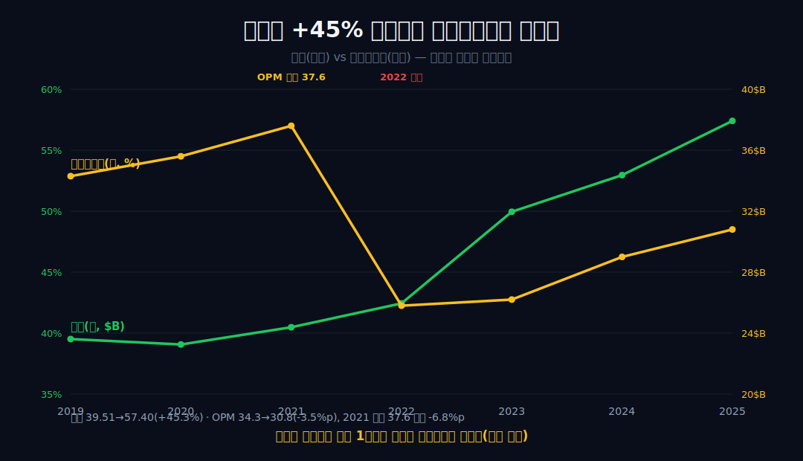
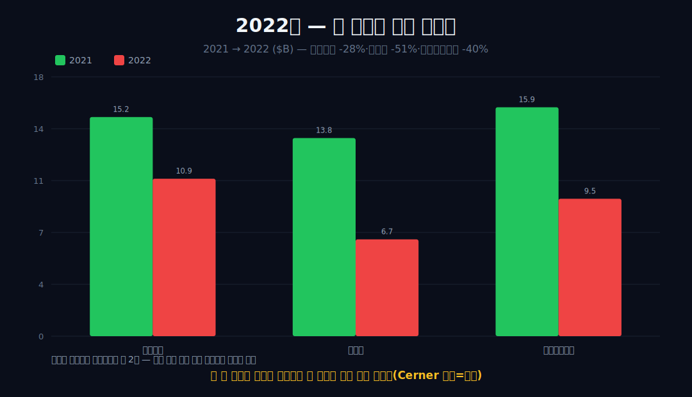
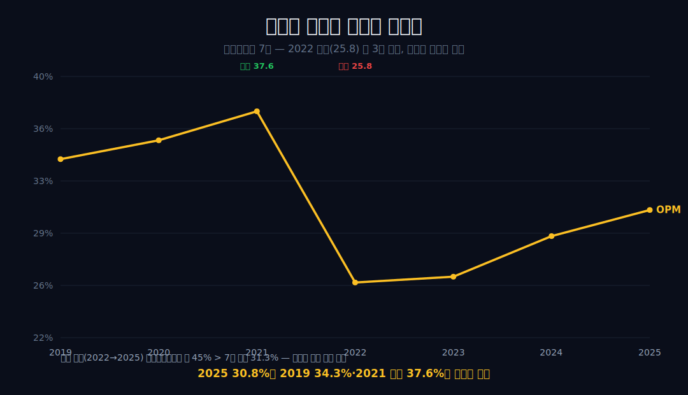
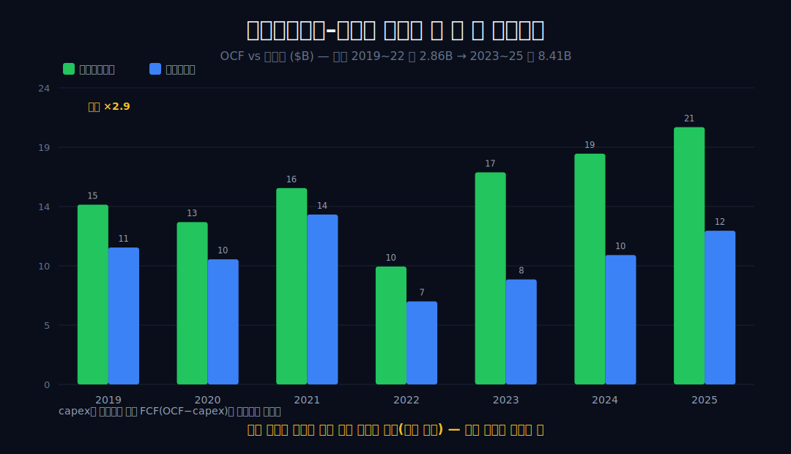
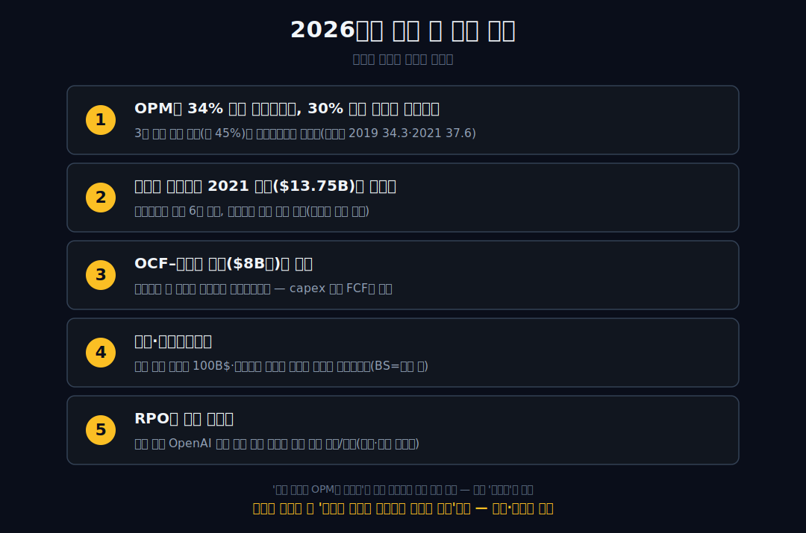

<script>
import ComboChart from '$lib/components/blog/ComboChart.svelte';
import StackBar from '$lib/components/blog/StackBar.svelte';
</script>

> **데이터 기준**: 2026-06-14 dartlab 실측 — Oracle(ORCL) **미국 연결(USD)** 기준, 분기 데이터를 역년(calendar year)으로 정규화·합산(회계연도는 5월말). 세그먼트(Cloud Services·OCI·SaaS)·부채·이자·capex·RPO·OCI 마진은 연결 손익에 안 나오므로 **10-K·IR·언론(외부 인용)**으로 표기. ※대차대조표 항목은 매핑이 불안정해 인용에 주의. capex가 데이터에 없어 **잉여현금흐름(FCF)은 계산하지 않는다.**
>
> **핵심 숫자**: 매출 **$57.40B** (2019→2025 **+45.3%**, CAGR 6.4%) · 영업이익 **$17.68B** (OPM **30.8%**) · 당기순이익 **$12.44B** · 영업현금흐름 **$20.82B** (매출 대비 36.3%) · OPM 2019 **34.3%** → 2021 고점 **37.6%** → 2022 **25.8%** → 2025 **30.8%**
>
> **이 글의 용어**: OPM(영업이익률)·NPM(순이익률)·GPM(매출총이익률) = 별개 비율 · 한계영업이익률 = 늘어난 매출 중 영업이익으로 떨어진 비율(ΔOI÷ΔREV) · below-the-line = 영업이익 아래(영업외·이자·세금) · RPO = 잔여 이행의무(미인식 계약잔액) · OCI = Oracle Cloud Infrastructure.

---

## 프롤로그 — 같은 '클라우드 전환'인데 마진이 거꾸로 갔다

'클라우드로 가면 마진이 오른다'는 통념은 흔히 [마이크로소프트](/blog/MSFT-microsoft)의 사례로 굳어졌다. 오라클의 6년 손익은 그 통념과 어긋난다.

매출은 $39.51B에서 $57.40B로 **+45.3%** 불었는데, 영업이익률은 34.3%에서 30.8%로 오히려 **3.5%p 내려갔다.** 같은 '클라우드 전환'이라는 단어 아래, 어떤 회사는 마진이 오르며 컸고 오라클은 마진이 빠지는 가운데 컸다.



이 글은 그 차이를 단정하지 않고, 연결 손익계산서 안에서만 추적한다. 전환이 마진을 *올린* [마이크로소프트](/blog/MSFT-microsoft), 전환을 *끝내* 마진이 고원에 머문 [어도비](/blog/ADBE-adobe)와 나란히 놓으면, 오라클은 '전환이 진행 중이라 비용이 먼저 나가는' 세 번째 자리에 선다.


---

## 1막 — 통념 반박: 매출과 마진이 반대로 갔고, 절대 이익도 고점 미달이다

**성장하면 마진이 오르나.** 오라클은 그 반대다.

```python
import dartlab
c = dartlab.Company("ORCL")
c.select("IS", ["매출액", "영업이익", "당기순이익"], freq="Q")  # 분기→역년 합산
```

검증 데이터의 두 시계열을 나란히 놓으면 방향이 어긋난다 — 매출($39.51→57.40B)은 단조 증가에 가깝지만 OPM(34.3→30.8%)은 더 낮은 자리에서 끝난다. 손익계산서가 증명하는 것은 '매출 1달러가 남기는 영업이익이 6년 전보다 줄었다'는 사실 자체다.

| 항목 ($B) | 2019 | 2021 | 2022 | 2025 |
|---|---:|---:|---:|---:|
| 매출 | 39.51 | 40.48 | 42.44 | **57.40** |
| 영업이익 | 13.54 | 15.21 | 10.93 | **17.68** |
| 연결 OPM | 34.3% | 37.6% | 25.8% | **30.8%** |
| 당기순이익 | 11.08 | 13.75 | 6.72 | **12.44** |


절대 이익으로 보아도 비대칭이 드러난다 — 영업이익($17.68B)은 6년 최고지만 순이익($12.44B)은 2019년($11.08B)은 넘되 2021년 고점($13.75B)에 1.31B$ 모자란다. 외형은 커졌는데 매출 1달러가 남기는 영업이익은 줄었다 — 비율과 절대 이익 모두에서 귀환은 아직 미완이다. 원인(믹스·비용)은 뒤 막에서 데이터가 허락하는 범위까지만 다루고, 이 막은 '비율과 절대액 모두에서 귀환이 미완'이라는 관찰까지만 단정한다.

---

## 2막 — 두 개의 바닥이 꺼진 2022: 한 해의 잡음이 아니다

**2022년에 무슨 일이 있었나.** 영업단과 그 아래가 함께 꺼졌다.

2022년의 급락은 한 번의 잡음이 아니라, 영업단과 그 아래(below-the-line)가 함께 꺼진 분기점이다. 검증 데이터에서 2022년 영업이익은 전년비 **28.1%** 줄었고($15.21→10.93B), 순이익은 **51.1%** 줄었다($13.75→6.72B).



순이익 감소율이 영업이익 감소율의 약 두 배라는 점이 눈에 띈다 — 이는 영업 바깥(영업외·세금·일회성)의 추가 타격과 양립하지만, 세전이익 베이스가 작아질 때 고정 이자·세금이 비율을 증폭시키는 **레버리지 효과**로도 같은 모양이 나타날 수 있다. 따라서 어느 쪽인지는 단정하지 않는다. **[외부 인용]** 2022년 6월 Cerner 인수($28.3B)와 통합비용·투자평가손 맥락은 이 패턴과 양립하나, 어느 항목이 얼마인지는 연결 손익이 항목별로 증명하지 않는다. 영업현금흐름도 $15.89B에서 $9.54B로 40% 줄어, 회계 이익뿐 아니라 현금까지 한 해 동안 눌렸다.

---

## 3막 — 회복했으나 귀환은 아니다: 30.8%의 위치와 회복의 질

**그 뒤 마진은 돌아왔나.** 3년 연속 올랐지만, 출발점까지는 아니다.

2022년 이후 마진은 3년 연속 회복했지만 출발점으로 돌아오지는 못했다 — 그리고 회복의 '질'을 뜯어보면 단순한 마진 잠식 서사와는 긴장한다.

검증 데이터에서 OPM은 25.8%(2022)→26.2%→29.0%→**30.8%**(2025)로 단조 회복하나, 2019년 34.3%보다 3.5%p, 2021년 고점 37.6%보다 6.8%p 아래에 멈춰 있다.



이 막의 신규 분해는 '회복의 질'이다 — 2022→2025 매출은 $14.96B 늘었고 영업이익은 $6.75B 늘어, 추가 매출에 대한 **한계영업이익률은 약 45%**다. 이는 7년 평균 OPM(31.3%)도, 2025년 OPM(30.8%)도 웃돈다. 즉 회복 구간에서 들어온 추가 매출은 평균보다 마진이 좋았다는 뜻이며, '성장이 마진을 일방적으로 깎는다'는 단순 서사와 긴장한다. 전환은 한 방향의 잠식이 아니라 — 과거 고마진 기반의 평균이 내려앉은 가운데 신규 증분은 비교적 양호한 — 더 복합적인 그림이다.

---

## 4막 — 현금은 왜 이익보다 좋아 보이는가: 벌어진 격차를 어디까지 말할 수 있나

**영업현금흐름은 견조한데, 그게 좋은 신호인가.** 격차의 출처는 데이터 밖이다.

영업현금흐름은 견조하지만, 순이익과의 격차가 약 세 배 벌어진 점은 비현금 비용 증가 신호와 양립하되 그 이상으로 못박지 않는다.

```python
c.select("CF", ["영업활동현금흐름"], freq="Q")
```

검증 데이터에서 순이익 대비 영업현금흐름의 격차(OCF−NI)는 2019~2022년 약 $2~3.5B(2019 3.47·2020 3.01·2021 2.14·2022 2.82, 평균 2.86B$)였으나, 2023년 8.66·2024년 8.20·2025년 8.38(평균 8.41B$)로 **약 세 배(2.9배)** 커졌다.



OCF가 NI보다 큰 이유 중 하나는 감가상각 같은 비현금 비용이 순이익을 깎은 뒤 현금흐름에서 되더해지기 때문이다. 다만 OCF−NI 격차는 비현금 비용뿐 아니라 운전자본 변동·이연법인세·주식보상비용 등 여러 항목의 합이므로, 연결 손익+OCF 총액만으로는 어느 항목이 격차를 키웠는지 분해되지 않는다. 따라서 '비현금 비용 증가 신호와 **양립**한다'까지만 말한다. **[외부 인용]** 데이터센터 capex 급증 맥락은 이와 양립하나, capex 항목 자체는 본 조사(연결 손익+OCF) 범위 밖이라 호재·악재로 단정하지 않는다.

---

## 5막 — 매출은 왜 늘었나: 외부 세그먼트가 채우는 빈칸, 그리고 제목과의 긴장

**매출 증가의 동력은.** 연결 손익은 거기까진 말 안 한다 — 세그먼트(외부)가 채운다.

연결 손익은 '매출이 늘고 OPM이 줄었다'까지만 말한다. 그 안의 믹스는 세그먼트(외부)가 채운다. **[외부 인용]** FY2025 매출 $57.4B 중 Cloud Services & License Support가 $44.0B(약 77%, +12%)로 규모를 떠받치고, IaaS(FY25 Q4 $3.0B, +52%)가 성장률을 끌어올린다. 외부 추정 OCI의 매출총이익률(GPM)이 약 14%로 소프트웨어(약 70%)보다 낮다는 신호는, 저마진 믹스로 기울며 늘 때 전사 마진이 눌리는 그림과 정합한다.

단 GPM·OPM·NPM은 별개 비율이므로 섞지 않으며, '믹스 변화가 OPM을 깎았다'는 단정 대신 두 데이터가 같은 방향이라는 **양립**까지만 말한다. 여기서 3막의 한계영업이익률 약 45%를 다시 떠올리면, 외부의 저마진 믹스 신호와 내부의 양호한 증분 마진이 동시에 성립하는 긴장이 남는다 — 이 긴장 자체가 전환을 단순 잠식으로 못박지 못하게 한다. 그래서 이 글의 제목('갈라선')은 인과가 아니라 관찰이다. '믹스 때문에 깎였다'고 쓰는 순간 연결 손익이 증명하지 않은 메커니즘을 기정사실화하는 것이다.

---

## 6막 — 손익 밖의 세 가지, 그리고 그것을 가르려면 무엇이 필요한가

**이 글이 답 못 하는 것은.** 부채·고객집중·전환의 종착 마진 — 그리고 각각 무엇이 있어야 풀리는가.

이 글이 답하지 못하는 세 가지가 남는다 — 부채·이자, 고객 집중, 전환의 종착 마진. 면책에 그치지 않으려면 각각을 가르는 데 어떤 데이터가 필요한지까지 명시한다.

본 분석의 토대는 연결 손익계산서와 영업현금흐름이다. **[외부 인용]** 총부채 100B$ 돌파·이자비용 급증은 재무상태표·현금흐름 투자/재무 항목의 문제로 본 조사 범위 밖이며, 이를 가르려면 BS의 차입 만기 구조와 이자보상배율, 잉여현금흐름(OCF−capex) 시계열이 필요하다 — **본 데이터에는 capex가 없어 FCF를 계산할 수 없다**는 것이 한계의 핵심이다. **[외부 인용]** RPO의 약 58%가 OpenAI 단일 고객 연계 추정은 매출의 미래 분포 변수지만, 과거 손익은 이를 말하지 않으며 이를 가르려면 세그먼트별 잔여 이행의무의 고객 집중도와 인식 일정이 필요하다.

마지막으로, 전환이 끝났을 때 OPM이 다시 34% 위로 귀환할지 30% 부근에서 고원을 이룰지를 가르려면, 신규 증분 마진(3막의 약 45%)이 유지되는지의 연속 분기 추적과 감가상각 부담이 정점을 지나는 시점이 필요하다. 이 추가 데이터들이 없는 한 정직한 결론은 '아직 모른다'이다 — 연결 손익이 증명한 것은 '성장과 마진이 갈라섰고 귀환은 미완'이라는 사실까지다. 목표주가·매수의견은 제시하지 않는다.

---

## 2026년에 봐야 할 다섯 가지

1. **OPM이 34% 위로 귀환하는가, 30% 부근 고원에 머무는가** — 3막의 신규 증분 마진(약 45%)이 유지되는지가 가른다. 2019년 34.3%·2021년 고점 37.6%가 기준선.
2. **순이익 절대액이 2021년 고점($13.75B)을 넘는가** — 영업이익은 이미 6년 최고지만 순이익은 아직 고점 미달. 영업단 아래의 회복 여부.
3. **OCF–순이익 격차($8B대)의 성격** — 감가상각 등 비현금 비용 증가인지, 운전자본인지. capex가 데이터에 없어 FCF는 외부 영역.
4. **부채·이자보상배율** — 외부 보도의 총부채 100B$·이자비용 급증이 손익(이자비용)에 어떻게 반영되는가. BS·이자보상배율은 연결 손익 밖.
5. **RPO의 고객 집중도** — 외부 추정 OpenAI 단일 고객 연계 비중이 실제 매출 인식으로 어떻게 분산/집중되는가(외부, 이행 리스크).



---

## 재무제표 — 최근 7개 연도 (dartlab 연결, $B, 역년 정규화)

> 미국 연결(USD)·분기 합산(역년 정규화, 회계연도 5월말) 기준. dartlab에서 직접 확인:
> ```python
> import dartlab
> c = dartlab.Company("ORCL")
> c.select("IS", ["매출액","영업이익","당기순이익"], freq="Q")
> c.select("CF", ["영업활동현금흐름"], freq="Q")
> ```

<ComboChart data={[{year:"2019",매출:39.51,영업이익:13.54,당기순이익:11.08},{year:"2020",매출:39.07,영업이익:13.90,당기순이익:10.13},{year:"2021",매출:40.48,영업이익:15.21,당기순이익:13.75},{year:"2022",매출:42.44,영업이익:10.93,당기순이익:6.72},{year:"2023",매출:49.95,영업이익:13.09,당기순이익:8.50},{year:"2024",매출:52.96,영업이익:15.35,당기순이익:10.47},{year:"2025",매출:57.40,영업이익:17.68,당기순이익:12.44}]} lineKeys={["매출"]} barKeys={["영업이익","당기순이익"]} lineColors={["#22c55e"]} barColors={["#3b82f6","#f59e0b"]} title="매출(라인) vs 영업이익·당기순이익(막대) — $B" unit="$B" />

| 항목 ($B) | 2019 | 2020 | 2021 | 2022 | 2023 | 2024 | 2025 |
|---|---:|---:|---:|---:|---:|---:|---:|
| 매출 | 39.51 | 39.07 | 40.48 | 42.44 | 49.95 | 52.96 | 57.40 |
| 영업이익 | 13.54 | 13.90 | 15.21 | 10.93 | 13.09 | 15.35 | 17.68 |
| 당기순이익 | 11.08 | 10.13 | 13.75 | 6.72 | 8.50 | 10.47 | 12.44 |
| 연결 OPM | 34.3% | 35.6% | 37.6% | 25.8% | 26.2% | 29.0% | 30.8% |
| 영업현금흐름 | 14.55 | 13.14 | 15.89 | 9.54 | 17.16 | 18.67 | 20.82 |

이 표를 한 줄로 읽으면 이렇다 — 매출 행은 2022년 이후 가속하며 우상향하는데, **OPM 행은 2021년 37.6%를 정점으로 2022년 25.8%까지 꺼졌다가 30.8%로 절반쯤만 돌아온다.** 당기순이익 행은 2022년 열에서 6.72까지 무너졌다가 다시 오르지만 2021년 13.75는 아직 못 넘는다. 매출 행만 보면 가속 성장 기업이지만, OPM 행과 순이익 행의 '꺼졌다 덜 돌아온' 모양을 겹쳐 보면 '성장과 마진이 갈라졌다'는 그림이 드러난다(원인=외부).

---

## 검증표

본문 인용 수치를 dartlab 호출과 결과로 검증한다. 외부 출처(세그먼트·부채·RPO·capex·OCI 마진)는 분리 표기. 📅 dartlab 실측 2026-06-14 · Oracle(ORCL) 미국 연결(USD)·분기 역년 정규화 기준.

| 본문 수치 | 출처 / 호출 | 결과 |
|---|---|---|
| 매출 2019 39.51B → 2025 57.40B (+45.3%, CAGR 6.4%) | `c.select("IS",["매출액"],freq="Q")` 합산 | ✓ 실측 |
| OPM 34.3%→37.6%(2021)→25.8%(2022)→30.8%(2025), 2025 −3.5%p/−6.8%p | 영업이익÷매출 | ✓ 실측 |
| 2022 영업이익 -28.1%·순이익 -51.1%·OCF -40% | 연도별 비교 | ✓ 실측 |
| 순이익 2025 12.44B (2019 11.08 상회, 2021 고점 13.75 −1.31B 미달) | `c.select("IS",["당기순이익"])` | ✓ 실측 |
| 회복구간 한계영업이익률 45.1% (ΔOI 6.75B ÷ ΔREV 14.96B), 7년 평균 OPM 31.3% | 차분 계산 | ✓ 실측 |
| OCF 20.82B(매출 36.3%), OCF–NI 격차 2.86B→8.41B (약 2.9배) | `c.select("CF",["영업활동현금흐름"])` | ✓ 실측 |
| Cloud Services & License Support FY25 44.0B(약 77%, +12%), IaaS +52% | [ORCL 10-K (SEC)](https://www.sec.gov/cgi-bin/browse-edgar?action=getcompany&CIK=0001341439&type=10-K) · [Oracle IR](https://investor.oracle.com/) | 외부 인용 |
| OCI 추정 GPM 약 14% vs 소프트웨어 약 70% | 외부 추정·언론 | 외부 인용 |
| 총부채 100B$ 돌파·이자비용 급증 / RPO 약 58% OpenAI 연계 추정 / capex 급증 | [Reuters](https://www.reuters.com/) · [Oracle IR](https://investor.oracle.com/) | 외부 인용 |
| 2022 Cerner 인수($28.3B) 통합비용·투자평가손 (항목별 인과) | [Oracle IR](https://investor.oracle.com/) | 외부·항목 미증명 |
| 믹스가 OPM을 깎았는지 / FCF(OCF−capex) | 세그먼트 마진·capex(연결 미수록) | 분해 불가 |
| BS(대차대조표) 매핑 불안정 — 인용 주의 | dartlab 데이터 한계 | 주의/제외 |

본문의 숫자 중 이 표에 없는 것은 발행 차단 대상이다. 세그먼트·부채·RPO·capex·'믹스 때문에 마진이 깎였다'는 인과는 dartlab 연결로 증명되지 않으며 외부 인용임을 명시한다 — 연결이 증명하는 것은 '매출 +45% 동안 OPM -3.5%p, 2022 동반 급락·부분 회복(귀환 미완), 회복 구간 한계영업이익률 약 45%, OCF–NI 격차 약 세 배 확대'까지다.
