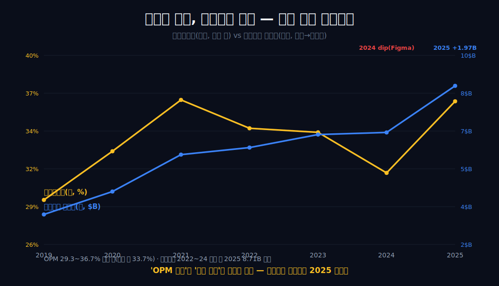
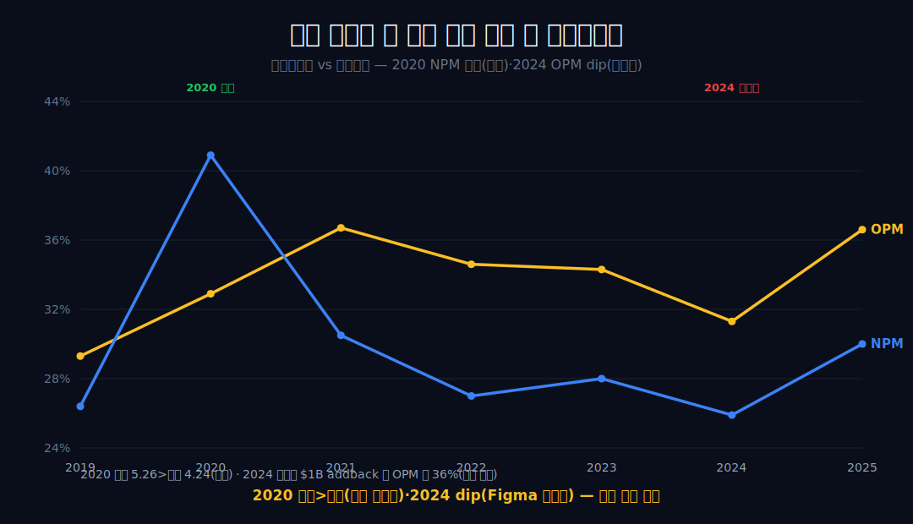
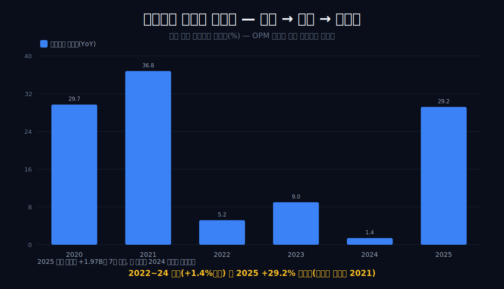
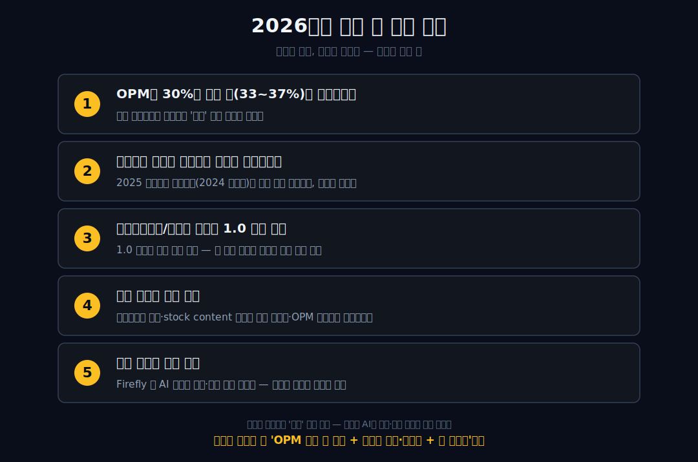

<script>
import ComboChart from '$lib/components/blog/ComboChart.svelte';
import StackBar from '$lib/components/blog/StackBar.svelte';
</script>

> **데이터 기준**: 2026-06-20 dartlab 실측 — Adobe(ADBE) **미국 연결(USD)** 기준, 분기 데이터를 역년(calendar year)으로 정규화·합산(회계연도 11월말). 2026 Q2 이후 숫자(ARR·AI-first ARR·Semrush·가이던스·CFO 교체)는 Adobe 2026-06-11 공식 8-K/earnings release와 Q2 FY2026 10-Q로 분리 표기. ※대차대조표 항목은 매핑이 불안정해 인용에 주의.
>
> **핵심 숫자**: 매출 **$23.77B** (2019→2025 **2.13배**) · 영업이익 **$8.71B** (OPM **36.6%**) · 당기순이익 **$7.13B** · 영업현금흐름 **$10.03B** · OPM 밴드 **29.3~36.7%** (폭 7.4%p, 평균 약 33.7%) · 영업이익 절대액 증가율 2024 **+1.4%** → 2025 **+29.2%**
>
> **이 글의 용어**: OPM(영업이익률)·NPM(순이익률) = 별개 비율 · 고원(plateau) = 좁은 띠 안에서 추세 없이 평탄한 상태 · 절대액 = 비율이 아닌 금액 그 자체 · addback = 일회성 비용을 되돌려 가산하는 가설 계산 · 기저효과 = 비교 기준이 비정상이라 증가율이 부풀려 보이는 것.

---

## 프롤로그 — 평평한 비율 한 줄이 출렁이는 절대액을 덮고 있다

소프트웨어 기업의 영업이익률 한 줄을 7년 늘어놓고 '평평하다'고 말하기는 쉽다. 어도비의 OPM은 2019년부터 2025년까지 29.3%에서 36.7% 사이, 폭 7.4%p의 좁은 띠 안에서 추세 없이 머문다. 여기서 멈추면 흔한 결론이 나온다 — '성숙해서 정체됐다'.

그러나 같은 7년의 영업이익 **절대액**을 보면 이야기가 달라진다. 비율이 평평한 동안 영업이익 증가율은 급증했다 둔화했다 다시 튀어 올랐고, 마지막 해엔 7년 최고치를 갈아치웠다.



평평한 비율 한 줄이 출렁이는 절대액을 덮고 있는 것이다. 이 글은 OPM 한 줄로 어도비를 읽는 습관을 의심하는 데서 시작한다 — 비율과 절대액은 다른 곡선이고, 둘을 분리할 때 비로소 일회성과 추세, 손익 안과 밖이 갈린다. 같은 소프트웨어 전환이라도 [마이크로소프트](/blog/MSFT-microsoft)는 마진이 *오르고*, [오라클](/blog/ORCL-oracle)은 마진이 *빠지는* 가운데 컸다면, 어도비는 이미 도달한 자리에서 *평탄*하다.


---

## 1막 — OPM은 6년째 좁은 띠 안에 있다 (사실만)

**OPM은 어떻게 움직였나.** 한 방향 추세 없이 평탄하다.

```python
import dartlab
c = dartlab.Company("ADBE")
c.select("IS", ["매출액", "영업이익"], freq="Q")  # 분기→역년 합산
```

연결 손익계산서의 OPM(영업이익/매출)을 7개 연도로 늘어놓으면 29.3→32.9→36.7→34.6→34.3→31.3→36.6으로, 오르거나 내리는 추세선이 그려지지 않는다. 최고(36.7%)와 최저(29.3%)의 간격은 7.4%p뿐이다.

| 연도 | 2019 | 2020 | 2021 | 2022 | 2023 | 2024 | 2025 |
|---|---:|---:|---:|---:|---:|---:|---:|
| OPM | 29.3% | 32.9% | 36.7% | 34.6% | 34.3% | 31.3% | 36.6% |

이것은 올라가는 곡선도 눌리는 곡선도 아닌, 좁은 띠 안의 평탄이다 — 다만 '평탄'은 관찰일 뿐 '천장에 도달했다'는 해석은 이 막의 데이터가 증명하지 않는다. 평탄의 원인과 의미는 다음 막들로 미루고, 1막은 비율이 좁은 띠에 머물렀다는 사실만 세운다(7년 평균 약 33.7%, 표본표준편차 약 2.72%p).

---

## 2막 — 평탄과 양립하는 가설 하나: 구독 전환이 이미 끝난 단계

**왜 평탄한가.** 한 가지 가설 — 전환을 일찍 끝낸 성숙 SaaS와 양립한다.

OPM 평탄은 구독 전환을 일찍 끝낸 성숙 SaaS의 상태와 **양립**한다. 이는 평탄의 원인을 단정하는 막이 아니라, 평탄과 모순되지 않는 외부 가설 하나를 소개하는 막이다.

외부 공시(10-K)에 따르면 어도비는 영구 라이선스에서 Creative Cloud 구독으로의 전환을 2013년 전후에 끝냈다 **[외부 인용]**. 전환이 진행 중이면 매출 인식 방식이 바뀌며 마진이 출렁이지만, 전환이 끝난 뒤에는 연간 반복 매출 기반으로 비율이 평탄해지는 경향이 있다고 알려져 있다 **[외부 인용]**. 어도비 OPM이 30%대 중반에서 추세 없이 평탄한 것은 이 외부 가설과 모순되지 않는다 — 그러나 이는 '양립'이지 '증명'이 아니다.

손익 데이터 자체는 평탄의 원인이 2013 전환완료인지, 의도적 가격·비용 관리인지, 다른 무엇인지 가르지 못한다. 따라서 이 막은 가능한 설명 하나를 제시할 뿐, '평탄은 전환완료 때문'이라는 인과를 단정하지 않는다. 세그먼트 매출(Digital Media/Digital Experience) 등 외부 라벨 수치는 내부 연결 OPM과 직접 인과로 잇지 않는다.

---

## 3막 — 눈에 띄는 두 변동은 모두 손익 밖 일회성이다 (세금·위약금)

**띠를 벗어난 두 점은 무엇인가.** 본업이 아니라 그 밖(세무·인수 무산)에서 왔다.

7년 손익에서 추세를 벗어난 두 점(2020 순익>영익, 2024 OPM dip)은 모두 손익 밖 일회성으로 설명되며 수익성 추세가 아니다. 단, OPM과 NPM은 끝까지 별개 축으로 다룬다.

**(1) NPM 축.** 2020년 NPM은 40.9%로 7년 중 압도적 최고였지만 같은 해 OPM은 32.9%로 평범한 띠 안 값이었다 — 영업 단계엔 특별할 게 없었다는 뜻이다. 비밀은 영업이익 아래에 있다: 2020년 순이익($5.26B)이 영업이익($4.24B)을 넘어선 것은 7년 중 유일하며, 이는 영업 외 항목인 대규모 법인세 효과라는 일회성으로 설명된다. 따라서 NPM 40.9%를 '본업 수익성 도약'으로 읽으면 OPM과 NPM을 섞는 오독이다.



**(2) OPM 축.** 2024년 OPM은 직전 34.3%에서 31.3%로 3.0%p 내렸다. 외부 출처에 따르면 어도비는 2023년 12월 Figma 인수($20B) 무산으로 $1B 현금 역위약금을 지급했다 **[외부 인용]**. 이 비용을 영업이익에 되돌려 가산하면 OPM은 약 36.0%로 띠 안에 돌아온다 — 다만 이 위약금이 영업이익 라인에 계상됐다는 전제 자체가 외부 인용 의존이므로, 이 복원치는 손익이 증명한 결과가 아니라 **가설 산식**이다. 두 변동의 공통점은 본업(OPM 띠)이 아니라 그 밖(세무·인수 무산)에서 왔다는 것이다.

---

## 4막 — 비율은 평평해도 절대액은 출렁였다: 영업이익 증가율의 둔화와 재점프

**OPM이 평탄하면 이익도 정체인가.** 아니다. 절대액 증가율은 둔화했다 재점프했다.

OPM 평탄을 '이익 정체'로 읽으면 오독이다. 영업이익 절대액 증가율은 평탄하지 않고 둔화(2022~2024)했다가 2025에 7년 최대폭으로 재점프했다.

```python
# 영업이익 절대액의 전년 대비 증가율
```

OPM은 비율이라 분자(영업이익)와 분모(매출)가 같은 속도로 움직이면 평탄하게 보인다 — 그래서 OPM 한 줄은 절대액의 출렁임을 가린다. 영업이익 절대액의 YoY를 보면 곡선이 드러난다:



+29.7%(2020)·+36.8%(2021)로 급증한 뒤 +5.2%(2022)·+9.0%(2023)·**+1.4%(2024)**로 뚜렷이 둔화했고, 그러다 **+29.2%(2025)**로 재점프했다. 즉 같은 7년에 'OPM 비율은 띠 안 평탄'이지만 '영업이익 증가율은 급증→둔화→재점프'였다. 2025 영업이익 $8.71B는 7년 절대 최고치이고, 전년 대비 절대 증가폭(+$1.97B)도 7년 중 가장 크다.

다만 2025 증가율의 일부는 **기저효과**다 — 비교 기준인 2024 영업이익($6.74B)이 위약금(외부 인용)으로 눌렸기 때문에 2025의 +29.2%는 순수 성장과 기저 회복이 섞여 있다(증가율로는 2021 +36.8%가 더 크다). 위약금 $1B를 되돌린 2024 영업이익 약 $7.74B(가설 산식)를 기준으로 삼으면 2025 증가율은 약 +13%로 내려앉는다 — 재점프의 상당 부분이 기저 회복이라는 뜻이다. 이 막의 요점은 인과가 아니라 분리다: 평평한 비율 한 줄이 둔화-반등하는 절대액을 덮고 있으니, '고원'은 비율에만 붙일 수 있는 라벨이지 이익 흐름 전체에 붙일 라벨이 아니다.

---

## 5막 — 현금은 7년 내내 이익보다 많았다 (관찰, 그리고 그 한계)

**현금은 이익을 따라왔나.** 7년 내내 웃돌았다 — 다만 그게 우월성의 증거는 아니다.

영업현금흐름이 7년 내내 순이익을 웃돈 것은 관찰된 사실이다. 다만 이 사실만으로 '구독 모델의 현금 우월성'을 증명하지는 못한다.

```python
c.select("CF", ["영업활동현금흐름"], freq="Q")
```

영업현금흐름(OCF)을 순이익(NI)과 나란히 보면 2019년 $4.42B vs $2.95B, 2025년 $10.03B vs $7.13B로, OCF가 7년 내내 NI를 **1.09~1.65배** 상회했다. 한 해도 1.0 밑으로 내려가지 않은 것은 사실이다.

그러나 이 관찰을 '구독 모델의 현금 전환이 우월하다'는 결론으로 곧장 옮기면 비약이다 — OCF가 NI를 웃도는 현상은 감가상각·주식보상 등 비현금비용을 NI에 다시 더하는 회계 구조만으로도 성숙기업 다수에서 흔히 성립한다(같은 구독 기업 [넷플릭스](/blog/NFLX-netflix)에서도 OCF가 순이익을 웃돌지만, 거긴 콘텐츠 자본화라는 또 다른 회계 구조가 끼어 있어 의미가 다르다). 구독 선수금(대금 선수취·매출 기간 인식)이 이 격차에 기여하는 경향이 있다고 알려져 있으나 **[외부 인용]**, 검증 데이터의 OCF/NI 배수만으로는 그 기여분을 비현금비용 효과와 분리할 수 없다. 따라서 이 막은 두 가지만 기록한다: (1) OCF가 7년 내내 NI를 웃돌았다는 관찰, (2) 이 관찰은 구독 우월성의 독립 증거가 아니며 미래 성장률도 보장하지 않는다는 한계. 'OCF>NI'는 사실이고, 그 사실에 가치 형용사를 붙이는 것은 데이터를 넘는다.

---

## 6막 — 손익이 답하지 못하는 것: 생성형 AI는 양방향 모두 미검증 서사다

**진짜 관전 포인트는.** 평탄한 손익 안이 아니라 손익 밖에 있다.

생성형 AI가 구독 가격결정력을 흔드는지 — 그것은 현재 손익으로 알 수 없고, 위협 서사도 기회 서사도 모두 미검증 외부 이야기다.

앞의 다섯 막은 손익이 보여줄 수 있는 범위 안이었다: OPM 비율은 평탄하고, 두 변동은 일회성이며, 영업이익 절대액은 둔화-반등했고, 현금은 이익을 웃돌았다. 그러나 손익은 후행 지표다. 손익 밖에는 두 방향의 외부 서사가 있는데, 둘 다 검증 데이터로 확인되지 않는다.

**(위협 서사)** 생성형 도구 확산은 Adobe의 risk factor와 제품 전략 설명에서 계속 다뤄지는 경쟁 변수다. 다만 이 인과가 연결 손익의 특정 매출 감소나 OPM 하락으로 분리되어 보인 것은 아니다. **(기회 서사)** 동시에 Adobe는 2026 Q2 공식자료에서 AI-first ARR가 전년 대비 3배 이상 커져 5억 달러를 넘었다고 밝혔다. 이것은 기회 서사가 처음으로 별도 수치 라벨을 얻은 사건이지만, 여전히 전사 매출·OPM에 독립 라인으로 분리된 것은 아니다.


두 서사를 나란히 놓는 것은 '검증된 두 힘의 길항'을 보여주려는 게 아니다 — 오히려 어느 쪽도 손익이 증명하지 않았음을 못박기 위해서다. 양쪽 단정을 모두 피하는 게 맞다: 'AI로 끝났다'도 'AI로 더 큰다'도 현재 연결 손익으로는 증명되지 않는다. 이 고원이 흔들릴지 평탄을 이어갈지는, 손익 밖 변수가 손익 안(OPM·매출 성장률)으로 들어오는 분기를 기다려야만 알 수 있다. 좁은 띠 안에서 마진이 안 흔들린다는 점은 [마스터카드](/blog/MA-mastercard)의 통행료 밴드(57%대)와 결이 같고(자리만 다를 뿐), 외형과 마진이 함께 *오른* [애플](/blog/AAPL-apple)·[마이크로소프트](/blog/MSFT-microsoft)와는 정반대로 — 어도비는 '이미 도달한 고원'에 서 있다. 목표주가·매수의견은 이 글의 몫이 아니다.

---

## 7막 — 2026 Q2: AI가 처음으로 숫자 이름표를 달았다

2026년 6월 11일 공시는 기존 결론을 조금 바꾼다. 2025년까지의 연간 손익만 보면 생성형 AI는 손익 밖 변수였다. 그런데 2026년 Q2 공식자료에서 Adobe는 `AI-first ARR`라는 이름표를 따로 제시했고, 그 금액이 전년 대비 3배 이상 커져 5억 달러를 넘었다고 밝혔다. 이 한 줄은 중요하다. AI가 더 이상 기사 제목이나 제품 발표만은 아니라, 반복매출 지표 안에 이름을 얻었기 때문이다.

다만 이름표가 붙었다고 전사 손익을 움직였다는 뜻은 아니다. 같은 공시에서 총 Adobe ARR은 27.10B$였고, 그 안에는 Semrush 인수로 들어온 약 0.48B$가 포함된다. AI-first ARR 0.5B$ 초과는 총 ARR 대비 대략 1.8% 수준이다. 숫자 자체는 작지 않지만, 전사 매출과 30%대 GAAP 영업이익률을 좌우하는 중심축이라고 부르기엔 아직 작다. 그래서 결론은 이렇게 바뀐다 — "AI는 완전히 손익 밖"이 아니라, "AI 라벨은 손익 주변부에 들어왔지만 전사 마진을 흔드는 독립 축으로는 아직 작다."

공식 Q2 FY2026 손익도 이 보정과 정합한다. 매출은 6.62B$로 전년 대비 13% 늘었고, GAAP 영업이익은 2.24B$였다. 6개월 누적 매출은 13.02B$, 영업이익은 4.66B$다. 단순 계산 OPM은 분기 약 33.8%, 6개월 누적 약 35.8%다. 2019~2025의 고원 밴드(29.3~36.7%) 안쪽이다. 다시 말해 AI-first ARR는 새 이름표를 얻었지만, 아직 고원을 뚫고 위나 아래로 밀어낸 흔적은 약하다.

| 2026 공식자료 항목 | 숫자 | 이 글에서의 의미 |
|---|---:|---|
| Q2 FY2026 매출 | 6.62B$ | 두 자릿수 성장은 유지 |
| Q2 FY2026 GAAP 영업이익 | 2.24B$ | 분기 OPM 약 33.8%, 고원 안쪽 |
| 6개월 누적 매출 | 13.02B$ | FY2026 상반기 속도는 FY2025보다 빠름 |
| 총 Adobe ARR | 27.10B$ | 반복매출 기반은 여전히 크고 넓음 |
| AI-first ARR | 0.50B$ 초과 | 이름표는 생겼지만 총 ARR의 작은 조각 |
| Semrush 포함 ARR | 약 0.48B$ | 순수 organic 성장률을 읽을 때 보정 필요 |

이 표의 핵심은 'AI가 작다'가 아니다. 더 정확히는 'AI가 드디어 측정되기 시작했지만, 측정 단위가 아직 전사 손익 단위보다 작다'이다. 2026년에 어도비를 볼 때는 Firefly 같은 제품명을 좇기보다, AI-first ARR가 총 ARR 안에서 몇 퍼센트로 올라오는지, 그 과정에서 GAAP OPM이 30%대 고원을 유지하는지를 같이 봐야 한다.

---

## 8막 — Semrush는 성장률을 돕지만, 순수 성장률을 흐린다

2026 Q2 자료의 또 다른 보정표는 Semrush다. Adobe는 총 ARR 27.10B$ 안에 Semrush 약 0.48B$가 들어 있다고 밝혔다. 이것은 작은 숫자가 아니다. AI-first ARR 0.5B$ 초과와 거의 같은 크기다. 따라서 2026년 ARR 성장률을 그냥 한 줄로 읽으면 위험하다. AI-first ARR가 커졌는지, Semrush가 더해졌는지, 기존 Creative·Experience 구독이 자체적으로 오른 것인지를 구분해야 한다.

이 지점은 어도비 글에서 특히 중요하다. 기존 글의 핵심은 "OPM 고원은 비율의 사실이고, 절대액은 출렁인다"였다. 2026년 이후에는 그 절대액이 더 복잡해진다. 인수로 붙은 ARR는 매출 기초체력을 키우지만, 유기적 가격결정력의 증거로 쓰기 어렵다. 고객이 더 많이 냈기 때문에 오른 것인지, 회사가 다른 ARR 덩어리를 사왔기 때문에 오른 것인지가 갈리기 때문이다.

Semrush가 나쁘다는 뜻이 아니다. 검색·콘텐츠·마케팅 데이터의 흐름이 AI 시대의 제작 도구와 결합될 수 있다는 점에서 전략적 이유는 분명하다. 하지만 재무제표 독자는 전략 설명보다 먼저 분모를 본다. 0.48B$가 총 ARR에 들어왔다는 사실은 2026년 ARR 성장률을 읽을 때 "organic인지 acquired인지"를 먼저 물으라는 표시다. 2025년까지는 Figma 위약금이 OPM을 보정해야 할 사건이었다면, 2026년에는 Semrush ARR가 성장률을 보정해야 할 사건이다.

이 관점으로 보면 Adobe의 2026 Q2는 아주 어도비다운 숫자다. 본업의 마진 고원은 유지되고, 반복매출 표면에는 새 이름표(AI-first)와 새 덩어리(Semrush)가 동시에 붙는다. 겉으로는 모두 성장으로 보이지만, 재무 독자는 세 줄로 쪼개야 한다 — 기존 구독의 가격·좌석 확장, AI-first 제품의 새 ARR, 인수로 들어온 ARR. 이 셋을 섞으면 "AI가 전부"라는 과장도, "AI가 아무것도 아니다"라는 과소평가도 동시에 생긴다.

---

## 9막 — CFO 교체와 70M$ impairment: 고원 위의 작은 균열

고원이 유지된다는 말은 아무 일도 없다는 뜻이 아니다. 2026 Q2 공식자료에는 두 개의 작은 균열이 함께 들어 있다. 하나는 CFO 교체이고, 다른 하나는 Publishing & Advertising reporting unit 관련 70M$ goodwill impairment다. 둘 다 어도비 전체 손익을 뒤집을 규모는 아니지만, 고원 위에서 봐야 할 온도계다.

먼저 CFO 교체. Adobe는 Dan Durn CFO가 2026년 6월 15일 회사를 떠나고 Steve Day가 interim CFO를 맡는다고 공시했다. 재무제표 숫자 하나를 즉시 바꾸는 사건은 아니다. 그러나 2026년은 Adobe가 AI-first ARR, Semrush, 가이던스 상향, 비용 조정표를 동시에 설명해야 하는 해다. 이런 해의 CFO 전환은 "실적이 나쁘다"의 증거가 아니라, 숫자를 해석할 때 보수적으로 읽어야 할 지배구조 이벤트다.

다음은 70M$ impairment다. Q2 GAAP EPS에는 Publishing & Advertising reporting unit 관련 비현금 goodwill impairment가 반영됐다. 70M$는 Q2 매출 6.62B$와 GAAP 영업이익 2.24B$에 비하면 작다. 그러나 의미는 있다. Adobe 안에서도 모든 사업 라인이 같은 속도로 AI·구독 고원 위에 올라탄 것은 아니라는 신호다. Creative와 Experience라는 큰 이야기 안에, 더 작은 reporting unit의 약한 지점이 남아 있다.

이 두 사건은 결론을 바꾸지는 않지만 톤을 낮춘다. 2026년의 어도비는 "AI 성장으로 모든 것이 해결되는 회사"가 아니다. 동시에 "AI 때문에 무너지는 회사"도 아니다. 공식자료가 보여주는 더 정직한 그림은, 30%대 GAAP 마진 고원 위에서 AI-first ARR라는 새 라벨을 키우고, Semrush를 붙이고, CFO 전환과 작은 impairment를 관리하는 회사다. 강점은 고원이 아직 유지된다는 점이고, 약점은 고원 위의 새 숫자들이 아직 깔끔하게 한 방향으로 정리되지 않았다는 점이다.

---

## 10막 — 2026 가이던스가 새 기준선을 만든다

Adobe는 Q2와 함께 FY2026 가이던스를 올렸다. 총매출 26.50~26.60B$, GAAP EPS 17.90~18.00$, non-GAAP EPS 24.35~24.45$, FY2026 GAAP operating margin 약 35%, non-GAAP operating margin 약 45%다. 이 가이던스는 이 글의 2026 체크포인트를 바꾼다. 이제 질문은 "AI가 들어왔나?"가 아니라 "AI·Semrush가 들어온 뒤에도 GAAP OPM 35% 안팎을 유지하는가?"다.

2025년 매출 23.77B$와 비교하면 FY2026 매출 가이던스 중간값 26.55B$는 약 11.7% 성장을 뜻한다. 2025년 OPM 36.6%와 비교하면 GAAP operating margin 약 35%는 조금 낮지만 여전히 기존 고원 안이다. 즉 가이던스 자체는 고원 붕괴가 아니라 고원 유지 쪽에 가깝다. 다만 2026년의 고원은 2025년과 같은 고원이 아니다. AI-first ARR, Semrush ARR, CFO 전환, impairment, loss contingency가 함께 올라온 고원이다.

이때 non-GAAP 45%를 GAAP 고원과 섞으면 안 된다. Adobe가 제시한 45% non-GAAP operating margin은 주식보상비용, 무형자산상각, impairment, loss contingency, acquisition-related expenses 등을 빼는 관리지표다. 본문이 추적한 2019~2025 OPM은 GAAP 영업이익률이다. 둘을 나란히 놓을 수는 있지만 같은 줄로 이어서는 안 된다. GAAP 고원은 30%대 중반이고, non-GAAP 고원은 40%대 중반이다. 둘의 차이가 커질수록 "고원"이라는 단어도 두 벌로 읽어야 한다.

그래서 2026년 이후의 어도비 판단은 네 개 숫자로 닫힌다. 첫째, GAAP OPM이 33~37% 고원 안에 머무는가. 둘째, AI-first ARR가 0.5B$에서 얼마나 빨리 커지는가. 셋째, Semrush를 제외한 organic ARR 성장이 둔화하지 않는가. 넷째, GAAP와 non-GAAP 마진의 간극이 더 벌어지는가. 이 네 개가 함께 좋아져야 'AI가 고원을 더 높은 자리로 밀었다'고 말할 수 있다. 하나만 좋아지면 아직 라벨이다.

### 2026년 어도비를 읽는 순서 — 매출보다 ARR, ARR보다 mix

2026년의 어도비를 매출 한 줄로 읽으면 놓치는 것이 많다. Q2 매출 6.62B$와 FY2026 매출 가이던스 26.50~26.60B$는 분명 강하다. 그러나 이 회사의 사업은 이미 대부분 subscription 기반이다. 매출은 과거 계약과 현재 사용이 회계적으로 풀려 나온 결과이고, ARR은 앞으로 반복될 계약 규모에 더 가깝다. 그래서 어도비는 매출보다 ARR, ARR보다 그 안의 mix를 먼저 봐야 한다. 총 ARR 27.10B$가 크다는 말만으로는 부족하고, 그 안에서 AI-first ARR가 얼마나 커지는지, Semrush처럼 인수로 들어온 ARR가 얼마나 되는지, 기존 Creative·Marketing Professional 기반 ARR가 둔화하지 않는지를 나눠야 한다.

이 점은 [ServiceNow](/blog/NOW-servicenow) 같은 SaaS 회사와 비교하면 더 선명하다. ServiceNow는 RPO·cRPO가 매출보다 먼저 움직이는 회사이고, 어도비는 ARR가 그 역할을 한다. 둘 다 손익계산서보다 앞선 계약성 지표를 봐야 하지만, 그 지표의 의미는 다르다. ServiceNow의 RPO는 아직 인식되지 않은 계약잔액이고, Adobe의 ARR는 연환산 반복매출 기반이다. 둘을 모두 "미래 매출"이라고 뭉뚱그리면 안 된다. Adobe에서 ARR는 구독 기반의 크기와 가격결정력을 보여주는 온도계이고, AI-first ARR는 그 온도계 안의 아주 작은 새 눈금이다.

따라서 2026 Q2의 핵심은 "AI-first ARR가 0.5B$를 넘었다"가 아니라 "전사 ARR 27.10B$ 안에서 AI-first ARR가 처음으로 별도 추적할 만큼 커졌다"이다. 이 문장 차이가 크다. 첫 문장은 AI 수혜를 과장하기 쉽고, 두 번째 문장은 위치를 잡아준다. 아직 0.5B$는 전체 ARR의 작은 조각이다. 하지만 이름을 얻은 조각은 다음 분기부터 추적할 수 있다. 추적 가능한 숫자가 생기면, 서사는 검증 가능한 가설로 바뀐다.

### GAAP 고원과 non-GAAP 고원은 서로 다른 지도다

Adobe의 2026 release를 읽을 때 가장 자주 생기는 오독은 GAAP와 non-GAAP를 한 줄로 이어 붙이는 것이다. 본문이 추적한 2019~2025의 OPM 고원은 GAAP 영업이익률이다. 이 고원은 대체로 30%대 중반이다. 반면 FY2026 가이던스의 non-GAAP operating margin 약 45%는 주식보상비용, 무형자산상각, impairment, legal contingency, acquisition-related expenses 같은 항목을 조정한 관리지표다. 둘 다 유용하지만, 서로 다른 지도다.

GAAP 지도는 주주에게 실제 회계 이익이 어떻게 남는지 보여준다. non-GAAP 지도는 경영진이 반복 영업의 체력을 어떻게 보는지 보여준다. Adobe처럼 주식보상비용과 무형자산상각이 있는 소프트웨어 회사에서는 두 지도의 간극이 항상 존재한다. 문제는 간극의 크기와 방향이다. GAAP OPM은 35% 안팎인데 non-GAAP가 45%라면, 약 10%p의 조정 간극이 있다는 뜻이다. 이 간극이 안정적이면 투자자는 반복 영업 체력을 따로 볼 수 있다. 그러나 간극이 계속 넓어지면, "반복 영업"이라는 이름으로 비용을 너무 많이 밖으로 밀어내는 것은 아닌지 봐야 한다.

2026년 Adobe의 경우 이 간극을 더 중요하게 봐야 하는 이유가 있다. Semrush 인수로 무형자산상각과 integration expense가 붙을 수 있고, Publishing & Advertising goodwill impairment 같은 비현금 항목도 발생했다. AI-first 제품 확장 과정에서는 주식보상비용과 R&D 투자가 늘 수 있다. 따라서 2026년 이후의 좋은 그림은 단순히 non-GAAP 45%를 유지하는 것이 아니다. 좋은 그림은 GAAP OPM도 기존 고원 안에 남고, non-GAAP와 GAAP의 간극이 관리 가능한 범위에서 유지되는 것이다.

### Semrush를 빼고도 10%대 성장이 남는가

Semrush 약 0.48B$ ARR는 작아 보이지만, AI-first ARR 0.5B$ 초과와 거의 같은 크기다. 이것이 2026 ARR 독해의 핵심 보정이다. 한쪽은 "새 AI 제품군이 벌어온 반복매출"이라는 라벨이고, 다른 한쪽은 "인수로 붙은 반복매출"이라는 라벨이다. 둘 다 총 ARR을 키우지만, 질이 다르다. 전자는 제품 가격결정력과 채택률의 증거에 더 가깝고, 후자는 자본배분과 포트폴리오 확장의 증거에 더 가깝다.

이 둘을 섞으면 성장률을 너무 쉽게 낙관한다. 예컨대 총 ARR 성장률이 좋아도 그 안에서 Semrush 효과가 크다면 기존 Adobe 플랫폼의 organic 성장률은 낮을 수 있다. 반대로 Semrush 효과를 제외해도 Creative·Marketing Professionals subscription revenue가 두 자릿수로 유지된다면, AI-first ARR는 본업 기반 위에 추가되는 옵션이 된다. 그래서 2026년 Adobe의 질문은 "AI-first ARR가 얼마인가"에서 멈추면 안 된다. "Semrush를 제외해도 기존 subscription revenue가 10%대 성장을 유지하는가"가 더 강한 질문이다.

공식 Q2 자료는 이 질문의 출발점을 준다. Total Customer Group subscription revenue는 6.39B$였고, 그 안에 Semrush 약 40M$가 포함됐다. Business Professionals & Consumers subscription revenue는 1.85B$, Creative & Marketing Professionals subscription revenue는 4.54B$였다. 이 세 줄이 다음 분기마다 같은 방향으로 움직이면 AI-first ARR는 고원 위의 새 성장축이 된다. 한 줄만 튀고 나머지가 둔화하면, AI-first ARR는 아직 마케팅 라벨에 가까워진다.

### CFO 교체는 숫자가 아니라 해석 리스크다

CFO 교체는 손익계산서에 바로 찍히지 않는다. 그래서 숫자 중심 글에서는 쉽게 지나친다. 하지만 2026년 Adobe에서는 그냥 지나치기 어렵다. Dan Durn CFO가 2026년 6월 15일 떠나고 Steve Day가 interim CFO가 되는 시점은, 회사가 AI-first ARR와 Semrush, 가이던스 상향, GAAP/non-GAAP 조정표를 동시에 설명해야 하는 시점과 겹친다. CFO 전환은 실적 악화의 증거가 아니다. 다만 다음 몇 분기의 숫자 설명을 더 보수적으로 읽으라는 해석 리스크다.

재무제표 독자는 사람 이름으로 결론을 내리지 않는다. 대신 해석의 일관성을 본다. 2026년 Q3와 Q4에서 새 CFO 체제가 ARR, AI-first ARR, Semrush integration, GAAP/non-GAAP bridge를 얼마나 일관된 방식으로 설명하는지가 중요하다. 조정항목이 매 분기 바뀌거나, organic growth와 acquired growth의 구분이 흐려지거나, AI-first ARR의 정의가 흔들리면 숫자의 신뢰도가 떨어진다. 반대로 정의와 bridge가 안정적으로 유지되면 CFO 전환은 사건으로 끝나고, 재무 스토리는 계속된다.

이 점은 어도비의 장점과 약점을 동시에 보여준다. 장점은 이미 고원 위에 있다는 것이다. 30%대 GAAP OPM과 40%대 non-GAAP margin은 웬만한 기업이 쉽게 갖지 못하는 체력이다. 약점은 그 위에 붙는 새 라벨이 많아졌다는 것이다. AI-first, Semrush, goodwill impairment, loss contingency, CFO transition. 라벨이 많아질수록 독자는 더 단순한 질문으로 돌아가야 한다. "매출은 늘었나"보다 "어떤 매출이 늘었나", "마진은 높나"보다 "어떤 비용을 빼고 높은가"를 물어야 한다.

### 이 글이 틀리는 조건

이 글의 중심 결론은 "AI 라벨은 생겼지만 전사 손익을 움직였다는 증거는 아직 작다"이다. 따라서 이 글이 틀리는 조건도 분명하다. 첫째, AI-first ARR가 2026년 하반기에 0.5B$에서 빠르게 올라 총 ARR의 의미 있는 비중이 된다. 둘째, 그 성장과 동시에 GAAP OPM이 35% 안팎을 유지한다. 셋째, Semrush 효과를 빼도 Creative & Marketing Professionals와 Business Professionals & Consumers subscription revenue가 모두 두 자릿수 성장에 가깝게 남는다. 넷째, GAAP와 non-GAAP margin의 간극이 커지지 않는다.

반대로 이 글이 더 강해지는 조건도 있다. AI-first ARR는 늘지만 전체 ARR 성장률이 둔화하거나, Semrush를 제외한 organic growth가 약해지거나, GAAP OPM이 30%대 초반 아래로 내려가거나, non-GAAP 조정 간극이 계속 커지면 "AI가 고원을 더 높은 곳으로 밀었다"는 말은 약해진다. 이 네 가지 조건은 모두 다음 공시에서 확인할 수 있다. 그래서 이 글의 마지막 질문은 제품명이 아니라 회계표다. Firefly가 멋진가가 아니라, Firefly와 AI-first 제품군이 총 ARR와 GAAP OPM을 동시에 밀어 올리는가다.

### 다음 공시에서 직접 계산할 네 줄

Adobe 다음 분기 공시를 열면 먼저 네 줄만 계산하면 된다. 첫째, total revenue growth. 둘째, GAAP operating margin. 셋째, total ARR growth. 넷째, AI-first ARR as percentage of total ARR. 이 네 줄을 한 표에 놓으면, 제품 발표를 읽기 전에 재무제표가 먼저 답한다. 매출은 늘었는데 GAAP OPM이 떨어지고, AI-first ARR 비중은 여전히 작다면 "AI 수혜가 손익으로 들어왔다"는 말은 약하다. 반대로 매출·GAAP OPM·ARR·AI-first 비중이 함께 좋아지면, 고원은 단순 유지가 아니라 상승 압력을 받는 고원이 된다.

| 다음 분기 계산 | 왜 보는가 | 좋은 신호 | 나쁜 신호 |
|---|---|---|---|
| 매출 성장률 | 제품 발표가 실제 매출로 이어졌는지 | 10%대 유지 | 한 자릿수 둔화 |
| GAAP OPM | 고원이 유지되는지 | 33~37% 안쪽 | 30% 초반 이탈 |
| Total ARR growth | 반복매출 기반이 커지는지 | 두 자릿수 근처 | Semrush 효과 제외 후 둔화 |
| AI-first ARR / Total ARR | AI 라벨의 비중 | 1.8%에서 빠르게 상승 | 이름표만 있고 비중 정체 |
| GAAP와 non-GAAP 간극 | 조정항목 의존도 | 안정 또는 축소 | 계속 확대 |

이 표는 투자 추천이 아니라 읽는 순서다. Adobe 같은 회사는 narrative가 너무 많다. Firefly, Express, Acrobat AI Assistant, Experience Platform, Semrush, GenStudio, customer orchestration처럼 이름만 따라가도 글이 쉽게 흩어진다. 그러나 모든 제품명은 결국 이 표의 네 줄로 돌아와야 한다. 제품명이 많아졌는데 ARR 비중이 작고 GAAP OPM이 내려가면, 이야기는 아직 비용이다. 제품명이 많아졌고 ARR 비중도 커지며 GAAP OPM이 유지되면, 이야기는 손익으로 들어온 것이다.

### "고원"이라는 단어를 다시 정의한다

이 글의 제목은 고원이다. 그런데 2026년 이후 고원은 정지가 아니다. 고원은 이미 높은 마진 지대에 올라와 있다는 뜻이지, 더 이상 움직이지 않는다는 뜻이 아니다. Adobe의 2019~2025 GAAP OPM 고원은 29.3~36.7%였다. 이 정도의 이익률을 유지하면서 매출을 2배 이상 키운 회사는 이미 강하다. 문제는 그 강함이 앞으로도 같은 이유로 유지되는지다.

2019~2025의 고원은 구독 전환이 끝난 성숙 SaaS의 고원이었다. 2026년 이후의 고원은 AI-first ARR와 인수 ARR를 같이 품은 고원이다. 겉보기에는 같은 35% OPM이어도, 안쪽 구조는 달라진다. 예전에는 Creative Cloud와 Experience Cloud의 구독 기반이 중심이었다면, 앞으로는 AI 기능의 별도 과금, search/marketing data layer, 고객 생산성 도구의 bundling이 붙는다. 같은 높이의 고원이라도 지질이 바뀌는 것이다.

그래서 앞으로 Adobe를 볼 때 "OPM이 유지됐다"는 말만으로는 부족하다. 어떤 매출 mix에서 유지됐는지를 봐야 한다. AI-first ARR가 커졌는데도 OPM이 유지되면 좋은 신호다. Semrush integration expense가 붙었는데도 OPM이 유지되면 좋은 신호다. 반대로 AI-first ARR는 작고, acquired ARR가 성장을 밀고, GAAP/non-GAAP 간극이 커지며 OPM이 유지된다면 고원의 질은 약해진다. 고원의 높이뿐 아니라 고원의 재료를 봐야 한다.

### Adobe 글의 최종 판정 문장

어도비는 아직 "AI가 손익을 다 바꾼 회사"가 아니다. 그렇다고 "AI가 손익 밖에만 있는 회사"도 아니다. 2026 Q2 이후의 더 정확한 문장은 이렇다. 어도비는 30%대 GAAP 마진 고원 위에서 AI-first ARR라는 작은 새 숫자를 공개하기 시작한 회사다. 그 숫자는 아직 총 ARR의 작은 조각이지만, 다음 공시부터 추적 가능한 조각이다.

이 문장이 강한 이유는 낙관과 비관을 모두 막기 때문이다. 낙관은 0.5B$를 너무 크게 본다. 비관은 0.5B$라는 별도 라벨의 출현을 너무 작게 본다. 재무제표 독자는 둘 사이에 선다. 지금은 작지만 추적 가능해진 숫자. 이것이 2026년 어도비의 핵심이다. 그러니 다음 공시에서 봐야 할 것은 AI 데모의 화려함이 아니라, AI-first ARR의 비중과 GAAP OPM의 동시 유지다.

### 숫자 감각 — 0.5B$가 작은가 큰가

AI-first ARR 0.5B$는 두 얼굴을 갖는다. Adobe 전체 ARR 27.10B$에 비하면 작다. 2%도 안 되는 비중이다. 이 관점에서는 아직 전사 손익을 좌우하기 어렵다. 그러나 독립 제품군의 새 반복매출로 보면 작지 않다. 0.5B$ ARR는 연환산 기준으로 이미 중견 SaaS 회사 한 개의 매출 규모다. 그래서 이 숫자를 작다고만 해도 틀리고, 크다고만 해도 틀린다. 전사 기준으로는 작고, 새 제품군 기준으로는 크다.

이 이중성을 붙잡아야 Adobe 글이 강해진다. 전사 손익을 바꾸려면 0.5B$가 2B$, 3B$, 5B$로 올라와야 한다. 하지만 추적 가능한 새 라벨로서의 의미는 이미 충분하다. 지금까지 AI 이야기는 제품 발표와 사용자 반응에 기대는 면이 컸다. 2026 Q2부터는 최소한 하나의 공식 반복매출 지표가 생겼다. 재무제표 독자에게 이 차이는 크다. 말이 숫자로 바뀌는 순간, 다음 분기부터 검산이 가능해진다.

### 왜 Adobe는 여전히 "방어적 성장"인가

Adobe의 매력은 폭발적 매출 성장보다 방어적 성장에 있다. 2025년까지 매출은 2.13배 늘었고, GAAP OPM은 30%대 고원에 머물렀다. 2026 가이던스도 매출 26.50~26.60B$, GAAP operating margin 약 35%를 제시한다. 이는 성장률이 높아서가 아니라, 성장하면서도 이미 높은 수익성을 방어한다는 점에서 강하다. 고성장 적자 SaaS와 다른 지점이다.

그렇기 때문에 Adobe에서 가장 위험한 변화는 성장률 둔화보다 margin discipline 붕괴다. AI 기능을 붙이기 위해 R&D와 infrastructure cost가 늘고, 인수 integration cost가 붙고, stock-based compensation 조정 간극이 커지면, 매출은 늘어도 고원의 질이 낮아질 수 있다. 반대로 AI-first ARR가 커지는데 GAAP OPM이 유지되면, Adobe는 방어적 성장의 새 버전을 만든다. 이 회사의 질문은 "얼마나 빨리 크나"보다 "높은 마진을 유지하며 새 제품군을 키우나"다.

이 질문은 Adobe와 [넷플릭스](/blog/NFLX-netflix)를 가르는 지점이기도 하다. Netflix는 콘텐츠 투자와 가입자·광고 mix가 현금흐름의 핵심이고, Adobe는 반복 소프트웨어 구독과 지식노동 도구의 가격결정력이 핵심이다. 둘 다 구독이라는 단어를 쓰지만, 비용 구조와 증분마진의 모양은 다르다. Adobe에서 AI가 좋은 사업이 되려면 단순 사용량 증가가 아니라, 기존 구독 가격·seat expansion·enterprise attach를 훼손하지 않고 ARR 위에 붙어야 한다. 사용자가 늘어도 AI inference 비용이 더 빨리 늘면 고원은 낮아진다. 사용자가 늘고 가격도 오르며 GAAP OPM이 유지되면 고원은 단단해진다.

그래서 Adobe의 다음 공시는 제품 데모보다 숫자의 결합으로 본다. AI-first ARR가 오른다. Semrush 제외 organic subscription revenue도 오른다. GAAP OPM은 유지된다. GAAP/non-GAAP 간극은 커지지 않는다. 네 조건이 동시에 맞으면 이 글은 다음 판에서 더 낙관적으로 바뀐다. 하나라도 빠지면 아직은 "작지만 추적 가능한 AI 라벨"이라는 지금 판정이 유지된다.

독자가 직접 해볼 계산도 간단하다. 다음 10-Q에서 total revenue, subscription revenue, GAAP operating income, total ARR, AI-first ARR를 한 줄씩 옮겨 적고, AI-first ARR 비중과 GAAP OPM을 같이 계산한다. 그 두 숫자가 동시에 올라가면 Adobe의 고원은 높아진다. 하나만 올라가면 아직은 제품 라벨이고, 둘 다 내려가면 고원 균열이다.

이 글의 결론은 그래서 보수적 낙관이다. Adobe는 AI 때문에 갑자기 새 회사가 된 것이 아니라, 이미 높은 마진을 가진 회사가 AI를 새 ARR 라벨로 붙이기 시작한 상태다. 강한 증거는 매출·ARR·OPM의 동시 유지이고, 약한 증거는 제품 발표와 사용자 반응이다. 다음 판에서 판단이 바뀐다면 그 이유도 숫자여야 한다.

---

## 2026년에 봐야 할 다섯 가지

1. **OPM이 30%대 중반 띠(대략 33~37%)를 유지하는가** — 띠를 벗어나 추세적으로 이탈하기 시작하면 '고원'이라는 라벨 자체를 재검토.
2. **영업이익 절대액 증가율이 2022~2024 둔화로 회귀하는가** — 2025 재점프가 기저효과(2024 위약금)를 넘은 지속 성장인지, 비율(OPM)이 아닌 절대액 추세로 확인.
3. **영업현금흐름/순이익 배수가 1.0 이상을 유지하는가** — 1.0 밑으로 내려가면 현금 구조 변화 신호(단, 이 배수 자체는 우월성 증거가 아닌 관찰 지표).
4. **위협 서사의 손익 진입** — 가격결정력 의문·stock content 축소가 실제 매출 성장률·OPM 하락으로 연결 손익에 분리되어 나타나는가.
5. **기회 서사의 손익 진입** — Firefly 등 AI 과금이 매출·마진에 분리 기여로 나타나는가. 나타나기 전까지 양방향 모두 미검증 외부 서사.



---

## 공시 / Filings

- [Adobe Q2 FY2026 earnings release / 8-K Exhibit 99.1](https://www.sec.gov/Archives/edgar/data/796343/000079634326000109/adbeex991q226.htm) — 2026-06-11 공시. Q2 매출 6.62B$, AI-first ARR 5억 달러 초과, 총 ARR 27.10B$, FY2026 가이던스 상향, CFO 교체, GAAP/non-GAAP 조정표의 정본.
- [Adobe Q2 FY2026 Form 10-Q](https://www.sec.gov/Archives/edgar/data/796343/000079634326000112/adbe-20260529.htm) — 2026년 5월 29일 종료 분기 10-Q. Q2 release 숫자를 정식 SEC 분기보고서로 재확인할 때 사용한다.
- [Adobe FY2025 Form 10-K](https://www.sec.gov/Archives/edgar/data/796343/000079634326000003/adbe-20251128.htm) — 2025년 연차 기준. 2019~2025 고원 해석, segment change, subscription model, risk factor를 확인하는 정본.
- [Adobe Investor Relations](https://www.adobe.com/investor-relations.html) — earnings 자료, investor datasheet, prepared remarks를 확인하는 회사 공식 IR 입구.

공식자료를 읽을 때 GAAP와 non-GAAP를 섞지 않는다. 이 글의 2019~2025 고원은 GAAP 연결 손익 기준이고, 2026 release의 45%는 non-GAAP operating margin 목표다. AI-first ARR는 공식 지표지만 전사 손익 라인이 아니므로 매출·OPM과 같은 증명력을 갖는 숫자로 쓰지 않는다.

---

## 재무제표 — 최근 7개 연도 (dartlab 연결, $B, 역년 정규화)

> 미국 연결(USD)·분기 합산(역년 정규화, 회계연도 11월말) 기준. dartlab에서 직접 확인:
```python
import dartlab
c = dartlab.Company("ADBE")
c.select("IS", ["매출액","영업이익","당기순이익"], freq="Q")
c.select("CF", ["영업활동현금흐름"], freq="Q")
```

| 항목 ($B) | 2019 | 2020 | 2021 | 2022 | 2023 | 2024 | 2025 |
|---|---:|---:|---:|---:|---:|---:|---:|
| 매출 | 11.17 | 12.87 | 15.79 | 17.61 | 19.41 | 21.50 | 23.77 |
| 영업이익 | 3.27 | 4.24 | 5.80 | 6.10 | 6.65 | 6.74 | 8.71 |
| 당기순이익 | 2.95 | 5.26 | 4.82 | 4.76 | 5.43 | 5.56 | 7.13 |
| 연결 OPM | 29.3% | 32.9% | 36.7% | 34.6% | 34.3% | 31.3% | 36.6% |
| 연결 NPM | 26.4% | 40.9% | 30.5% | 27.0% | 28.0% | 25.9% | 30.0% |
| 영업현금흐름 | 4.42 | 5.73 | 7.23 | 7.84 | 7.30 | 8.06 | 10.03 |

<ComboChart data={[{year:"2019",매출:11.17,영업이익:3.27,당기순이익:2.95},{year:"2020",매출:12.87,영업이익:4.24,당기순이익:5.26},{year:"2021",매출:15.79,영업이익:5.80,당기순이익:4.82},{year:"2022",매출:17.61,영업이익:6.10,당기순이익:4.76},{year:"2023",매출:19.41,영업이익:6.65,당기순이익:5.43},{year:"2024",매출:21.50,영업이익:6.74,당기순이익:5.56},{year:"2025",매출:23.77,영업이익:8.71,당기순이익:7.13}]} lineKeys={["매출"]} barKeys={["영업이익","당기순이익"]} lineColors={["#22c55e"]} barColors={["#3b82f6","#f59e0b"]} title="매출(라인) vs 영업이익·당기순이익(막대) — $B" unit="$B" />

이 표를 한 줄로 읽으면 이렇다 — 매출 행은 매끄럽게 우상향하고 **OPM 행은 29~37% 좁은 띠에서 위아래로만 흔들린다(추세 없음)**. 두 군데가 튄다: 2020년 NPM 행(40.9%)이 그해 OPM(32.9%)을 넘는데, 이는 순이익 행($5.26B)이 영업이익 행($4.24B)을 넘은 그해의 세금 일회성이다. 그리고 영업이익 행은 2022~2024년 거의 제자리($6.10→6.65→6.74)였다가 2025년 $8.71로 튄다 — 'OPM은 평탄해도 영업이익 절대액은 둔화·반등했다'는 그림이다.

---

## 검증표

본문 인용 수치를 dartlab 호출과 결과로 검증한다. 외부 출처(세그먼트·Figma·전환 시점·AI 서사)는 분리 표기. 📅 dartlab 실측 2026-06-14 · Adobe(ADBE) 미국 연결(USD)·분기 역년 정규화 기준.

| 본문 수치 | 출처 / 호출 | 결과 |
|---|---|---|
| OPM 밴드 29.3~36.7% (폭 7.4%p, 평균 약 33.7%, 표본표준편차 약 2.72%p) | `c.select("IS",["영업이익"])` ÷ 매출, 작성자 계산 | ✓ 실측·계산 |
| 매출 11.17B → 23.77B (2.13배), 2023~2025 YoY 약 10~11% | `c.select("IS",["매출액"])` | ✓ 실측·계산 |
| 영업이익 절대액 YoY +29.7/+36.8/+5.2/+9.0/+1.4/+29.2% | 연도별 차분, 작성자 계산 | ✓ 실측·계산 |
| 2025 영업이익 8.71B = 7년 최고, 최대 절대 증가폭 +1.97B (증가율 최대는 2021 +36.8%) | `c.select("IS",["영업이익"])` | ✓ 실측·계산 |
| 2020 순익 5.26B > 영익 4.24B (7년 유일), NPM 40.9% vs OPM 32.9% | `c.select("IS",[...])` | ✓ 실측 |
| 2024 OPM 31.3% (직전 34.3%, -3.0%p) | 영업이익÷매출 | ✓ 실측 |
| 영업현금흐름 4.42B → 10.03B, OCF/NI 1.09~1.65배 | `c.select("CF",["영업활동현금흐름"])` | ✓ 실측·계산 |
| Figma 인수($20B) 무산 위약금 $1B (2023.12) / addback 시 OPM 약 36% | [Adobe FY2025 10-K](https://www.sec.gov/Archives/edgar/data/796343/000079634326000003/adbe-20251128.htm) · [Adobe Investor Relations](https://www.adobe.com/investor-relations.html) | 공식 공시·가설 산식 |
| 2013 전후 구독 전환 완료 / 세그먼트(Digital Media·Digital Experience) | [Adobe 10-K](https://www.adobe.com/investor-relations.html) | 외부 인용 |
| AI-first ARR 5억 달러 초과, 전년 대비 3배 이상 / FY2026 가이던스 상향 | [Adobe Q2 FY2026 earnings release](https://www.sec.gov/Archives/edgar/data/796343/000079634326000109/adbeex991q226.htm) | 공식 IR·연결 손익 분리 필요 |
| 2020 NPM 40.9%의 세금 항목 / 평탄의 원인(전환·가격·비용) | 손익 항목별(연결 미세분) | 분해 불가 |
| BS(대차대조표) 매핑 불안정 — 인용 주의 | dartlab 데이터 한계 | 주의/제외 |

본문의 숫자 중 이 표에 없는 것은 발행 차단 대상이다. 세그먼트·Figma·전환 시점·AI 서사는 dartlab 연결로 증명되지 않으며 외부 인용임을 명시한다 — 연결이 증명하는 것은 'OPM 29~37% 좁은 띠 평탄, 절대액 증가율은 둔화→재점프, 2020·2024 두 변동은 손익 밖 일회성, OCF가 7년 내내 순익 초과'까지다. 평탄은 관찰이지 '천장' 증명이 아니다.
