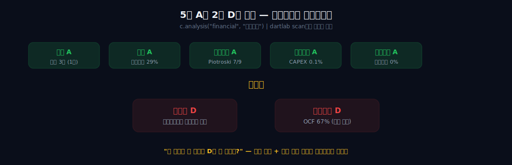
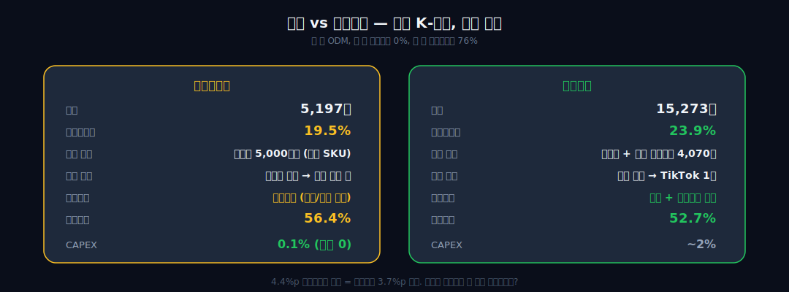
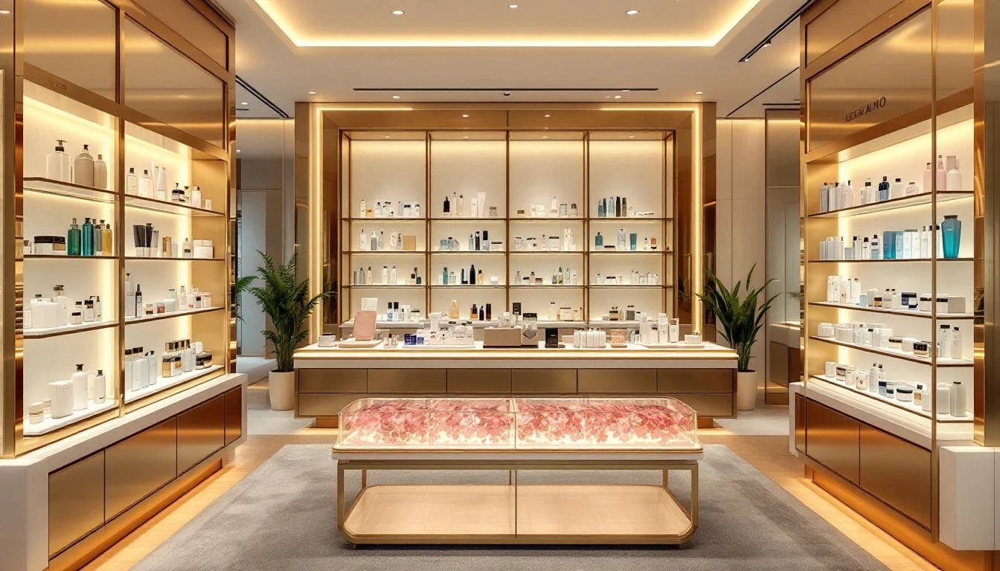

> **성장** | 소비재 > 화장품 | 2026-04-09 dartlab 실측
> 같은 시리즈: [SK하이닉스](/blog/000660-skhynix) · [삼양식품](/blog/003230-samyang-foods) · [두산에너빌리티](/blog/034020-doosan-enerbility) · [알테오젠](/blog/196170-alteogen) · [HMM](/blog/011200-hmm) · [셀트리온](/blog/068270-celltrion) · [한화에어로스페이스](/blog/012450-hanwha-aerospace) · [HD현대일렉트릭](/blog/267260-hd-hyundai-electric) · [고려아연](/blog/010130-korea-zinc) · [에이피알](/blog/278470-apr) · [크래프톤](/blog/259960-krafton) · [기업이야기 시리즈 전체](/blog/series/company-reports)

---

## dartlab scan이 이 회사를 발견했다

```python
import dartlab
dartlab.scan("profitability")
```

전종목 횡단분석을 돌리면 가끔 설명이 안 되는 숫자가 나온다. 영업이익률 26%, ROE 19.9%. 화장품인데 반도체 마진이다. 코스피 2,700개 종목 중 이 조합을 가진 회사는 손에 꼽는다.

영업이익률 상위 5%, ROE 상위 10%를 교차하면 43개 종목이 남는다. 그 중 **화장품은 2개** — 에이피알(이미 썼다)과 이 회사. 종목코드 483650, **달바글로벌**. 자체 공장 하나 없이 미스트 하나로 **5,000만병**을 팔고, 러시아에서 럭셔리 3위에 올라간 회사. 숫자가 먼저 말을 걸었으니, 숫자부터 따라가 보자.

```python
c = dartlab.Company("483650")
c.analysis("financial", "종합평가")
```



| 영역 | 등급 |
|------|------|
| 성장성 | **A** |
| 안정성 | **A** |
| 이익품질 | **A** |
| 투자효율 | **A** |
| 재무정합성 | **A** |
| 효율성 | B |
| 수익성 | D |
| 현금흐름 | D |

**5개 A.** Piotroski **7/9**. 그런데 수익성 D? 현금흐름 D? 5개 A와 2개 D가 공존한다. **"왜 이렇게 잘 버는데 수익성과 현금흐름이 D인가?"** 이 모순이 이 글의 관통선이다.

---

## 1막 — 매출 3배, 1년 만에. 공장은 없다


```python
c.select("IS", ["매출액", "영업이익"], freq="Y")
```

| 연도 | 매출 | 영업이익 | 영업이익률 | 매총이익률 |
|------|------|---------|-----------|----------|
| 2024 | 1,690억 | 275억 | 16.3% | 75.7% |
| 2025 | **5,197억** | **1,015억** | **19.5%** | **75.9%** |

1년 만에 매출 **3배**. 영업이익 **3.7배**. 매출총이익률 **75.9%** — 에이피알(76.6%)과 거의 같다.

여기서 dartlab 플래그가 하나 튀어나온다: *"CAPEX/매출 0.1% — 극소 투자."*

**공장이 없다.** 달바글로벌은 한국콜마/코스맥스에 위탁 생산한다. 자체 공장 0. 직원 수백 명. 그런데 매출 5,197억.

```python
c.analysis("financial", "자금조달")
```

| 자금 원천 | 2024 | 2025 |
|-----------|------|------|
| 내부유보 | 19.0% | **39.7%** |
| 주주자본 | 56.1% | 41.5% |
| **금융차입** | **0%** | **0%** |
| 영업조달 | 5.9% | 5.8% |

**금융차입 0%.** 은행 빚 없다. 부채비율 **29%**. 이 회사는 이익만으로 자본을 쌓고 있다. 내부유보가 1년 만에 19%에서 40%로 뛰었다 — 이익이 빠르게 쌓이고 있다는 뜻.



에이피알과 나란히 놓으면:

| 지표 | 달바글로벌 | 에이피알 |
|------|----------|---------|
| 매출 | 5,197억 | 15,273억 |
| 매총이익률 | 75.9% | 76.6% |
| 영업이익률 | 19.5% | 23.9% |
| 금융차입 | 0% | 0% |
| CAPEX/매출 | **0.1%** | ~2% |
| 공장 | **없음** | 없음 (ODM) |

같은 K-뷰티, 같은 ODM, 같은 매총이익률. 다른 건 규모와 영업이익률 4.4%p. 에이피알이 판관비율을 52.7%까지 낮춘 반면, 달바는 **56.4%**. 이 4%p 차이가 영업이익률 차이의 정체다. 달바가 더 성장하면 판관비율이 내려가면서 에이피알 수준에 도달할 수 있는가? 그것이 다음 질문이다.

---

## 2막 — 화장품 경험 0, 컨설턴트가 만든 브랜드


**반성연.** 1981년생. 서울대 산업공학과. NHN(네이버) 개발자 → A.T. Kearney/Arthur D. Little 전략 컨설턴트. 화장품 경험 **0**.

2016년 창업. 처음부터 "브랜드는 설계하는 것"이라는 컨설턴트의 접근. 이탈리아 화이트 트러플을 핵심 원료로 잡고, 비건 프리미엄 스킨케어를 기획했다. 공장을 짓지 않았다 — ODM에 맡기고 브랜드와 유통에만 집중하는 **에셋라이트(asset-light) 모델**.

대표 제품: **"승무원 미스트"** (화이트 트러플 퍼스트 스프레이 세럼). 기내에서 승무원들이 사용하는 장면이 SNS에서 바이럴됐다. 글로벌 누적 **5,000만병** 판매. 미스트+선케어가 매출의 **71%**. SKU가 극도로 적다 — 집중된 포트폴리오가 마케팅 효율을 극대화한다.

숫자로 보면 이 전략의 흔적이 선명하다:
- **SKU 수**: 미스트+선케어 = 매출의 **71%**. 에이피알(메디큐브+에이지알 수십 개 SKU)보다 극도로 집중
- **R&D/매출**: 화장품 업종 평균 2~3% 대비 달바는 더 낮을 것으로 추정 (자체 성분 개발보다 화이트 트러플 원료 소싱에 집중)
- **직원 수**: 수백 명 수준. 매출 5,197억 ÷ 300명 = **1인당 매출 17억**. 아모레퍼시픽(4.6조 ÷ 약 6,000명 = 7.7억)의 **2배+**

화장품 경험 0인 컨설턴트가 만든 회사답게 — 제품을 만드는 게 아니라 **브랜드를 설계**한 것이다. 제조는 한국콜마에, 물류는 외주에, 내부에는 브랜딩과 마케팅만 남겼다.

---

## 3막 — 러시아에서 먼저 뜬 K-뷰티



달바의 해외 진출 순서가 재미있다.

| 시장 | 비중 (2024) | 특징 |
|------|-----------|------|
| **러시아** | **29%** | 골드애플 럭셔리 3위 |
| 일본 | 22% | 큐텐/라쿠텐 |
| 아세안 | 19% | |
| 북미 | 18% | 울타/코스트코/아마존 |
| 유럽 | 5% | |

**해외 비중**: 2021년 7% → 2023년 22% → 2024년 46% → 2025년 **63%**. 해외 매출 연평균 **208%** 성장. 4년 만에 내수 중심 회사가 해외 매출 63% 회사로 바뀌었다.

에이피알은 미국부터 갔다. 달바는 **러시아부터 갔다.** 왜?

2022년 2월 러시아-우크라이나 전쟁 이후, 에스티로더·로레알·시세이도 등 서방+일본 럭셔리 브랜드가 러시아에서 일제히 철수했다. 러시아 화장품 시장 규모는 약 200억 달러. 그 시장의 프리미엄 선반이 한꺼번에 비었다. 달바가 그 진공에 들어갔다.

러시아 최대 뷰티 리테일러 **골드애플**(Goldapple) — 러시아판 세포라. 매장 400개+, 온라인 포함 러시아 뷰티 시장 1위. 달바는 여기서 럭셔리 카테고리 **3위**에 올랐다. 1위·2위는 유럽 니치 브랜드. K-뷰티로는 사실상 1위.

이것이 재무제표에 어떻게 찍혔는가. 러시아 매출이 2023년 해외 매출의 핵심 동력이었고, 해외 비중이 22%에서 46%로 뛴 2024년에 러시아가 가장 큰 몫을 했다. **서방 브랜드 철수라는 외부 사건이 달바의 해외 확장을 가속시킨 것**이다.

그런데 여기에 리스크가 있다. dartlab 스코어카드에서 **수익성 D**가 나온 이유 중 하나가 이것이다.

```python
c.analysis("financial", "비용구조")
```

분기별 영업이익률: 1Q **23%** → 2Q 20% → 3Q **14.2%** → 4Q 회복. 3분기 급락의 원인: **러시아 성장 둔화** (3Q 러시아 매출 성장률 32%, 전체 69% 대비 절반). 러시아가 해외 매출의 29%를 차지하는데, 금융 제재와 물류 애로로 성장이 둔화되면 분기 마진이 흔들린다. 수익성 D는 이 분기 변동성을 반영한 것이다.

---

## 4막 — 5A인데 수익성D, 현금흐름D. 이 모순의 정체

dartlab 스코어카드의 모순을 풀어보자.

**성장A + 안정A + 이익품질A + 투자효율A + 재무정합A = 5A.**
**수익성D + 현금흐름D = 2D.**

```python
c.analysis("financial", "수익성")
```

수익성 D의 이유: **영업외손실이 영업이익을 상쇄**한다. dartlab 플래그: *"영업외손실 비중 100% — 영업이익을 상쇄."*

| 항목 | 2025 |
|------|------|
| 영업이익 | 1,015억 |
| 영업외손익 | ~-224억 |
| 당기순이익 | 791억 |

영업에서 1,015억을 벌었는데 영업 밖에서 224억이 빠졌다. 뭔가? IPO 관련 비용, 상장 준비 비용, 환율 손실 등이 섞여 있을 가능성. 2025년이 상장 첫 해(2025년 5월 상장)라서 일회성 비용이 반영된 것이다.

**현금흐름 D의 이유:**

```python
c.select("CF", ["영업활동현금흐름"], freq="Y")
```

| 연도 | 영업CF | 영업이익 |
|------|--------|---------|
| 2024 | 0억 | 275억 |
| 2025 | **685억** | **1,015억** |

2024년 영업CF **0원**. 이익이 275억인데 현금이 안 들어왔다. 2025년도 685억/1,015억 = **67%**만 현금으로 전환. Piotroski에서 "CF > 순이익" 불통과.

이유: **재고 급증**. 재고자산 479억(2024) → 662억(2025). 해외 확장 속도에 맞춰 재고를 미리 쌓는 구조 — 에이피알, HD현대일렉트릭에서 봤던 것과 같은 패턴이다.

그런데 BS를 더 보면 긍정적 신호가 있다. 현금이 540억(2024)에서 **1,010억**(2025)으로 **거의 2배**가 됐다. 부채는 340억에서 568억으로 소폭 증가. **현금이 부채보다 빠르게 늘고 있다.** 순현금(현금-부채) 200억 → **442억**. 이 회사는 빚 없이 현금을 쌓는 구조다. 성장하면서 동시에 현금이 늘어나는 회사 — 이것이 에셋라이트 모델의 힘이다.

dartlab 플래그: *"진성 고수익 (ROE 39.8%, 낮은 레버리지)."* 부채 레버리지 없이 순수하게 이익률로 ROE를 만든다는 뜻이다.

**5A와 2D의 공존.** 일회성(상장 비용)이 빠지면 D가 올라갈 수 있다. 그런데 **러시아 지정학 비용이 구조적이라면?** 3막에서 봤듯 러시아가 해외 매출의 29%다. 금융 제재, 물류 애로, 환율 변동이 매 분기 영업외에서 이익을 깎아먹는다면 — 이 D는 일회성이 아니라 **구조적**일 수 있다.

이 질문에 답하려면 다음 막을 봐야 한다.

---

## 5막 — 북미가 러시아를 넘는 시점이 분기점이다

4막의 질문: "러시아 지정학 비용이 구조적이면 D가 안 올라간다." 답: **러시아 비중이 내려가면 된다.** 그러려면 **북미가 터져야 한다.**

숫자로 계산해보자. 에이피알이 울타뷰티 1,400개 매장에서 2025년 미국 매출 약 5,700억을 뽑았다 ([에이피알 공시](https://www.insightkorea.co.kr/news/articleView.html?idxno=240537)). 달바는 울타 200개 매장에서 시작해 **1,300개로 확대** 예정. 에이피알 매출을 매장 수 비례로 환산하면:

| 비교 | 에이피알 | 달바 (현재) | 달바 (1,300개 시) |
|------|---------|-----------|----------------|
| 울타 매장 수 | 1,400개 | 200개 | 1,300개 |
| 미국 매출 추정 | 5,700억 | ~900억 | **~5,300억?** |

단순 비례지만, 달바가 울타 1,300개 + 코스트코(29억 공급 계약) + 아마존 10개 권역 직접 운영을 더하면 **북미가 러시아를 넘는 시점**이 2026~2027년에 올 수 있다.

그 시점이 분기점인 이유: **북미 판가가 러시아보다 높다.** 북미에서는 달바 미스트가 $38(약 5만원)에 팔린다. 러시아 골드애플에서는 루블화 가격이 환율에 따라 변동하고, 금융 제재로 대금 회수가 불안정하다. 북미 비중 ↑ = GP 마진 ↑ + 지정학 리스크 ↓ = **수익성 D → B 전환의 조건.**

달바의 북미 진입 경로를 더 구체적으로 보면:
- **아마존**: 10개 권역 직접 브랜드 스토어. 벤더(중간 유통)를 거치지 않는다 — 에이피알과 같은 DTC 구조
- **울타뷰티**: 200개 → 1,300개 확대. 에이피알(1,400개)에 1~2년 뒤 도달 가능
- **코스트코**: 29억원 공급 계약. 코스트코는 소품종 대량 구매 — 미스트 같은 단일 히트 제품에 유리한 채널
- **TikTok Shop**: K-뷰티 카테고리 진입. 에이피알이 TikTok 1위로 미국을 터뜨린 것을 목격한 상태

2026년 목표: 매출 7,000억(+35%), OPM 21%. 해외 오프라인 5,000개 매장. 이 목표가 달성되면 북미 비중은 30%+에 도달하고, 러시아(29%)를 넘는다.

---

## 6막 — "키엘/이솝과 어깨를 나란히" 할 수 있는가

반성연 대표가 인터뷰에서 밝힌 5년 목표: **"키엘, 이솝과 같은 글로벌 프리미엄 브랜드."** K-뷰티의 "가성비" 이미지를 벗고 프리미엄으로.

이게 재무제표에서 가능해 보이는가?

| 지표 | 달바 | 글로벌 프리미엄 뷰티 평균 |
|------|------|----------------------|
| 매총이익률 | **76%** | 75~80% |
| 영업이익률 | 19.5% | **20~25%** (로레알 Luxe 25%) |
| 가격대 | 중~프리미엄 | 프리미엄~초프리미엄 |
| 브랜드 수 | 1개 | 단일 (키엘, 이솝) |

달바의 매총이익률 76%는 **이미 글로벌 프리미엄 수준**이다. 로레알 Luxe 부문 영업이익률은 2024년 기준 약 25% ([로레알 2024 Annual Report](https://www.loreal-finance.com/)). 여기에 도달하려면 판관비율을 56%에서 51%로 5%p 낮춰야 한다 — 매출이 7,000억→1조로 가면 스케일 효과로 가능한 범위. 다만 **단일 브랜드 + 미스트 71% 집중**이 프리미엄 전략과 맞는가는 별개의 질문. 키엘은 스킨케어 라인이 수십 개, 이솝은 핸드케어/바디/프레그런스까지 확장. 달바가 미스트 하나에서 라인 확장 없이 프리미엄 브랜드가 될 수 있는가.

---

## 이 회사를 계속 열어볼 숫자

**1. 판관비율** — 56.4%가 50% 이하로 내려가면 영업이익률 25%+. 에이피알 궤적(66.8%→52.7%)을 따를 수 있는가.

**2. 러시아 비중** — 29%가 내려가면 지정학 리스크 감소. 동시에 북미 비중이 올라가면 마진 개선.

**3. 수익성 등급** — D가 B 이상으로 올라가는가. 상장 비용 일회성이 빠지면.

**4. 현금흐름** — OCF/OI가 67%에서 90%+로 올라가는가. 재고 비축이 안정되면.

**5. 북미 매출** — 울타 1,300개, 코스트코, TikTok. 북미가 러시아를 넘는 시점.

---

달바글로벌은 dartlab이 **데이터에서 먼저 발견한 회사**다. 2,700개 종목을 스캔했을 때 영업이익률 26%, 매총이익률 76%, 금융차입 0%라는 조합이 튀어나왔다. 파고 들어갔더니 공장 없이 미스트 하나로 5,000만병을 팔고, 러시아에서 럭셔리 3위에 올라간 회사가 있었다.

이 구조가 — 1조, 2조로 갈 때도 버틸 수 있는 구조인가. 그 답은 아직 숫자가 쓰는 중이다.

```python
# 이 글의 모든 숫자를 직접 확인하려면
c.show("IS", freq="Y")
c.show("BS", freq="Y")
c.show("CF", freq="Y")
c.analysis("financial", "성장성")
c.analysis("financial", "수익성")
c.analysis("financial", "비용구조")
c.analysis("financial", "자금조달")
c.analysis("financial", "종합평가")
```

---

## 재무제표 — IS / BS

### 손익계산서 (IS) — 단위 억원

| 항목 | 2025 | 2024 |
|---|---:|---:|
| 매출 | 5,197 | 1,690 |
| 매출총이익률 | 75.9% | 75.7% |
| 영업이익 | 1,015 | 275 |
| 영업이익률 | 19.5% | 16.3% |
| 순이익 | 791 | 226 |
| 판관비 | 2,930 | 1,004 |
| 판관비율 | 56.4% | 59.4% |

### 재무상태표 (BS) — 단위 억원

| 항목 | 2025 | 2024 |
|---|---:|---:|
| 총자산 | 2,553 | 1,361 |
| 부채 | 568 | 340 |
| 자본 | 1,986 | 1,021 |
| 현금 | 1,010 | 540 |
| 재고 | 662 | 479 |
| 부채비율 | 29% | 33% |

---

## 외부 출처

- [달바글로벌 위키백과](https://ko.wikipedia.org/wiki/%EB%8B%AC%EB%B0%94%EA%B8%80%EB%A1%9C%EB%B2%8C)
- [반성연 대표 인터뷰 — 포브스코리아](https://www.forbeskorea.co.kr/news/articleView.html?idxno=400306)
- [2025 매출 5,000억 돌파 — 마켓이코노미](https://www.meconomynews.com/news/articleView.html?idxno=128008)
- [ULTA/코스트코 입점 — 한국신용신문](https://www.creditnews.kr/news/articleView.html?idxno=1711)
- [글로벌 누적 5,000만병 — 서울경제](https://www.sedaily.com/NewsView/2GQEQCIIV7)

## 검증표

| 본문 수치 | 출처 |
|-----------|------|
| scan 영업이익률 26.4% | dartlab scan("profitability") |
| 매출 5,197억, 영업이익 1,015억 | dartlab 실측 |
| 매총이익률 75.9%, 원가율 24.1% | dartlab 실측 |
| 금융차입 0%, 부채비율 29% | dartlab 실측 |
| CAPEX/매출 0.1% | dartlab 실측 |
| 스코어카드 5A + 수익D + 현금D | dartlab 실측 |
| 영업CF 685억/1,015억 = 67% | dartlab 실측 |
| 승무원 미스트 5,000만병 | 서울경제 |
| 러시아 골드애플 럭셔리 3위 | 딜사이트 |
| IPO 공모가 66,300원, 수요예측 1,140:1 | 유진투자증권 |
| 울타 200→1,300개, 코스트코 29억 | 한국신용신문 |
| 반성연 서울대 산업공학, 화장품 경험 0 | 포브스코리아, 비즈니스포스트 |
| 에이피알 미국 매출 ~5,700억 (2025) | 인사이트코리아 |
| 로레알 Luxe 영업이익률 ~25% (2024) | 로레알 Annual Report |
