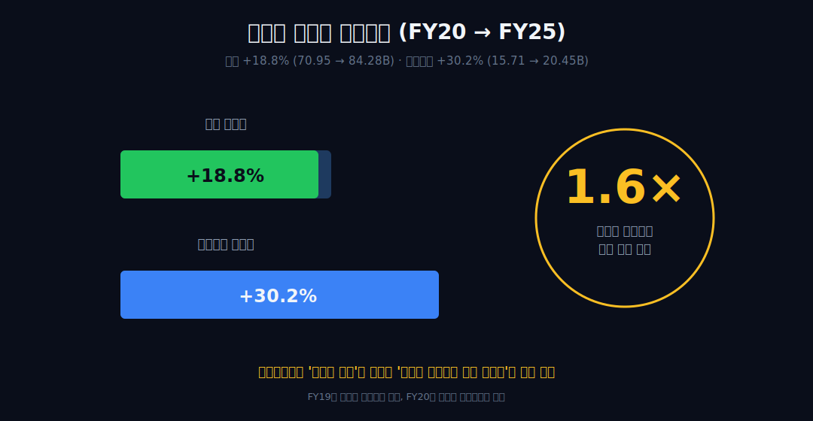
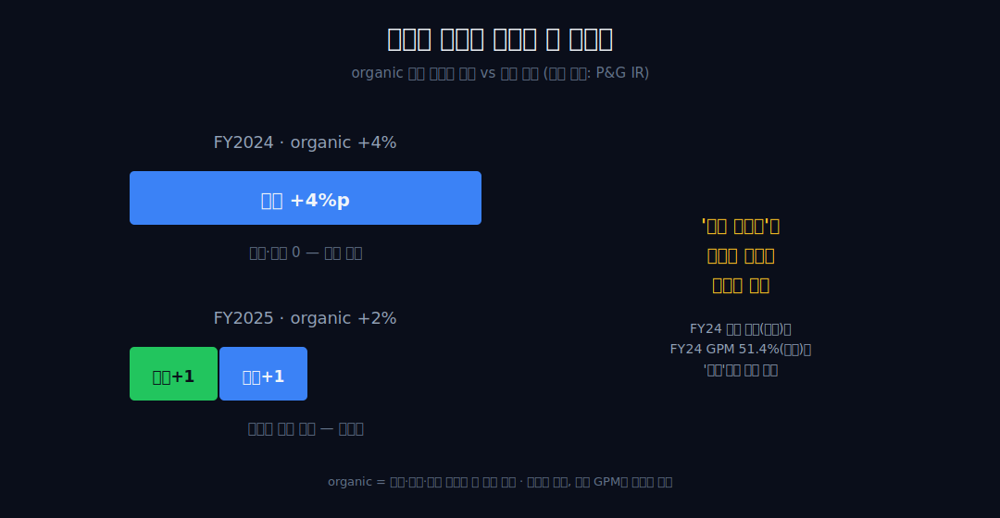
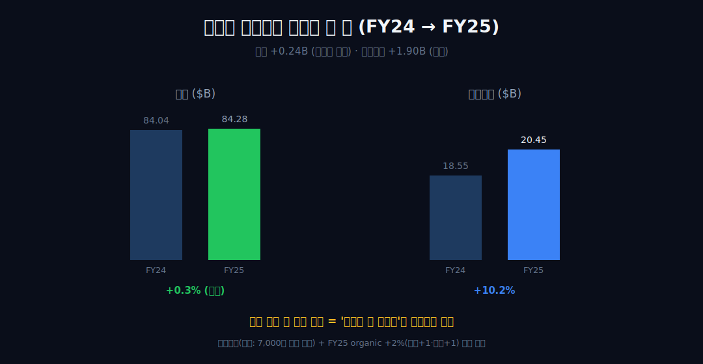
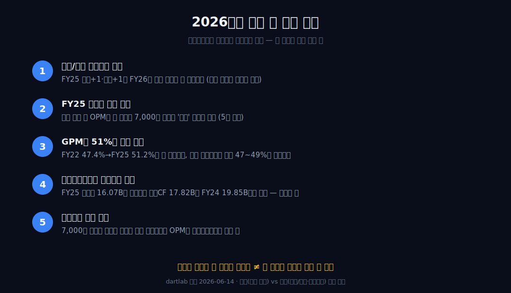

<script>
import ComboChart from '$lib/components/blog/ComboChart.svelte';
import StackBar from '$lib/components/blog/StackBar.svelte';
</script>

> **데이터 기준**: 2026-06-14 dartlab 실측 — Procter & Gamble(PG) **미국 연결(USD)** 기준, 분기 데이터를 회계연도(6월말 결산)로 합산. FY19는 질레트 손상으로 영업이익이 왜곡돼 추세 기준점에서 제외하고 **FY20을 정상화 기준점**으로 본다. 사업부(세탁·뷰티·헬스 등) 구성·가격/물량 분해·시가총액·배당 이력은 연결 손익에 안 나오므로 **10-K·IR·언론(외부 인용)**으로 표기. ※대차대조표 항목은 매핑이 불안정해 인용에 주의.
>
> **핵심 숫자**: 매출 **$84.28B** · 영업이익 **$20.45B** (OPM **24.3%**) · 매출총이익률 **51.2%** · 당기순이익 **$16.07B** · 영업현금흐름 **$17.82B** · FY20→FY25 매출 **+18.8%** vs 영업이익 **+30.2%**(이익이 약 1.6배 빨리 성장)
>
> **이 글의 용어**: OPM(영업이익률)·NPM(순이익률)·GPM(매출총이익률) = 각각 영업이익·순이익·매출총이익÷매출(서로 별개 비율) · organic 매출 = 환율·인수·매각 효과를 뺀 자체 성장 · 가격결정력(pricing power) = 가격을 올려도 판매량이 크게 빠지지 않는 힘.

---

## 프롤로그 — 틀린 질문으로 시작하는 회사

대부분의 성장 스토리는 "매출이 얼마나 늘었나"로 시작한다. P&G는 그 질문이 **틀린** 회사다.


FY20부터 FY25까지 매출은 **18.8%** 늘었다. 그런데 영업이익은 **30.2%** 늘었다. 이익이 매출보다 **약 1.6배 빨리** 자란 것이다. 이게 P&G를 보는 올바른 입구다 — 외형이 아니라, 외형과 이익 사이에 벌어진 **속도 차이**.



관통선은 하나다. **"매출은 거의 제자리에 가까운데 이익만 앞서간 이 회사는, 무엇으로 그 차이를 만들었고 — 그 힘은 어디까지가 진짜인가?"** 답을 *경계까지만* 정직하게 쓴다. 먼저 정직 포인트 하나를 박고 들어간다. FY19의 영업이익률 8.1%는 P&G의 실력이 아니라 **질레트 영업권·무형자산 손상**(외부 인용: 약 $8B, 일회성·비현금) 때문이다. 그래서 추세선에서 FY19를 빼고, 정상화 기준점은 **FY20**으로 둔다.

---

## 1막 — 비대칭부터 본다

**왜 매출이 아니라 '매출과 이익의 속도 차이'부터 보나.** 가격결정력의 증거는 성장의 *크기*가 아니라 이익이 매출을 앞지른 *비대칭*에 있기 때문이다.

```python
import dartlab
c = dartlab.Company("PG")
c.select("IS", ["매출액", "영업이익"], freq="Q")  # 분기→회계연도 합산
```

| 항목 ($B, 회계연도) | FY20 | FY22 | FY24 | FY25 |
|---|---:|---:|---:|---:|
| 매출 | 70.95 | 80.19 | 84.04 | **84.28** |
| 영업이익 | 15.71 | 17.81 | 18.55 | **20.45** |

매출은 FY20 70.95B에서 FY25 84.28B로 **+18.8%**, 영업이익은 15.71B에서 20.45B로 **+30.2%**. 이익이 매출보다 1.6배 빠르다. 이것이 관통선의 1차 증거다. 정직 단서를 동행한다 — 기준점 FY20은 FY19 손상 *직후*라 회복분이 일부 끼는 base effect가 있다. 그래서 FY19를 anchor로 쓰지 않고 FY20을 기준점으로 못 박는 것이다.

이 한 줄이 말하는 건 '이익이 더 빨리 자랐다'까지다. *왜* 빨리 자랐는지는 다음 막의 일이다 — 외형이 1.2배 되는 동안 이익이 1.3배가 되려면, 매출 1달러당 남는 몫이 커졌어야 한다. 그 몫은 어디에 찍히는가?

---

## 2막 — 그 비대칭이 마진에 남긴 자국

**왜 다음이 영업이익률인가.** 비대칭은 결국 OPM의 움직임으로 환산돼야 '검증 가능한 한 줄'이 되기 때문이다.

OPM은 FY20 22.1%에서 FY25 **24.3%**로 올라 5년 중 최고를 갱신했다. 다만 정직하게 짚자 — FY21에 이미 23.6%였으니 FY25 24.3%는 그보다 **0.7%p** 높을 뿐이다. '극적 확장'이 아니라 '밴드 상단 갱신'까지가 정확한 표현이다. 중간 FY22~FY24는 22.1~22.2% 밴드에 머물렀다.


그러니 OPM의 0.7%p로는 1막의 비대칭(이익이 매출보다 1.6배 빠름)을 다 설명하지 못한다. 비대칭의 무게는 OPM 위쪽, 즉 **매출총이익** 단에 더 크게 실려 있다. 그래서 다음 막은 OPM이 아니라 GPM을 따로 본다.

---

## 3막 — 마진을 되돌린 그래프: 매출총이익률

**왜 GPM을 OPM 다음에 따로 보나.** OPM 0.7%p보다 GPM **3.8%p** 회복이 마진 스토리의 진짜 주인공이고, 가격이 마진을 *어디서* 되돌렸는지 보여주기 때문이다.

```python
c.select("IS", ["매출총이익"], freq="Q")  # 매출총이익률(GPM) 계산
```

| GPM(매출총이익률) | FY20 | FY21 | FY22 | FY23 | FY24 | FY25 |
|---|---:|---:|---:|---:|---:|---:|
| 매출총이익률 | 50.3% | 51.2% | **47.4%** | 47.9% | 51.4% | **51.2%** |


FY22에 47.4%까지 눌렸다가 FY24·FY25에 51%대로 복원됐다. 원자재·물류비가 치솟던 FY22에 원가에 눌렸고, 그 뒤 가격을 올려 되돌린 자국이다. 단 여기서 한 발을 멈춘다. 이 회복을 **'가격결정력 단독'으로 귀속하면 비약**이다 — 원자재·물류비 하락(외부 매크로)도 같은 기간 GPM을 밀어 올렸고, 둘은 내부 수치로 분리되지 않는다. 그래서 '가격전가와 원가완화가 *겹친 정합*'에서 멈춘다. 이 두 힘이 겹쳐 매출총이익 단에서 마진을 되돌렸고, 그게 1막의 비대칭으로 이어졌다. 그렇다면 질문은 자연히 다음으로 간다 — 가격을 올리는 동안 *물량은 왜 안 빠졌나?*

---

## 4막 — 왜 안 떠났나: 검증 가능한 한 줄 (외부 인용)

**왜 여기서 '브랜드 해자'를 추상명사로 말하지 않고 한 숫자로 치환하나.** 형용사는 증명 회피로 읽히고, 외부 한 줄이 그것을 검증 가능하게 만들기 때문이다.


외부 인용에 따르면 P&G의 **FY2024 organic 매출 +4%는 전량 가격(price)에서 나왔다 — 물량·믹스 기여는 0이었다**(us.pg.com FY24 연차보고서). 즉 그 해 P&G는 더 많이 판 게 아니라 *더 비싸게 팔았고*, 그런데도 외형이 줄지 않았다. 가격을 올려도 장바구니에서 빠지지 않은 것이다.



이 외부 한 줄(FY24 가격 +4pt)은 내부 수치(FY24 GPM 51.4% 점프)와 *같은 방향*이다 — 인과 증명이 아니라 **정합**이다. '가격을 올려도 떠나지 않는 소비자'라는 추상은 여기서 이 한 줄로 대체된다. 그 힘의 원천은 외부 사실로만 채운다 — 21개의 연 매출 10억 달러 브랜드를 180개국에 파는 규모, 세탁(Tide)·기저귀(Pampers)·면도(Gillette)·구강(Crest/Oral-B)에서 카테고리 1~2위라는 점유(외부 인용: 10-K·IR). 길목을 가격으로 쥔다는 점에서, 원액 프랜차이즈로 가치사슬을 쥔 [코카콜라](/blog/KO-coca-cola), 스낵·음료 브랜드로 진열대를 쥔 [펩시코](/blog/PEP-pepsico), 그리고 한국의 생활용품 거울 [LG생활건강](/blog/051900-lg-h-and-h)과 같은 계열이다.

---

## 5막 — 최대 함정: FY25는 가격의 정점이 아니다

**왜 클라이맥스를 '사상 최고 이익'이 아니라 그 이익의 *출처 의심*에 두나.** 매출이 정체했는데 이익만 뛴 해는 가격이 아니라 *비용* 이야기일 가능성이 크고, 이걸 안 짚으면 독자가 틀린 인과를 가져가기 때문이다.

```python
c.select("IS", ["매출액","영업이익","당기순이익"], freq="Q")  # FY24 vs FY25 대조
```

내부 실측에서 가장 조심해야 할 대목이 여기 있다. FY24→FY25에 **매출은 84.04B→84.28B로 +0.24B(사실상 정체)**인데 **영업이익은 18.55B→20.45B로 +1.90B 급증**했고 OPM이 5년 최고(24.3%)를 찍었다.



매출이 안 늘었는데 이익만 뛰었다면, 그 점프를 **'가격을 더 올려서'로 단정하는 건 위험**하다. 외부 인용이 그 의심을 뒷받침한다 — P&G는 2025년 6월 비핵심 부문에서 최대 **7,000명 감원**을 발표했고(외부 인용: CNBC 2025-06-05), FY2025 organic 매출은 **+2%로 물량 +1·가격 +1**(외부 인용: SEC 8-K)이었다. 즉 '가격 일변도'는 FY22~FY24 인플레이션 국면의 *한시적* 특성이었고, FY25엔 물량이 다시 등장하면서 마진 점프의 상당 부분은 가격이 아니라 **비용·구조조정** 쪽에서 왔을 수 있다. 4막의 '가격결정력'과 5막의 '비용규율'은 둘 다 실재하지만, FY25 한 해의 마진을 어느 쪽에 귀속할지는 내부 수치로 가를 수 없다 — 그래서 양쪽을 다 적어두고 봉합하지 않는다.

---

## 6막 — 경계: 실재하되 무한하지 않다

**왜 마지막이 단정이 아니라 경계인가.** 가격결정력은 실재하지만 마진을 무한히 끌 수 없고, '왜'는 검증선 끝에서 멈춰야 정직하기 때문이다.

```python
c.select("CF", ["영업활동현금흐름"], freq="Q")  # 이익의 질(현금 전환) 확인
```


먼저 이익의 질을 확인한다. 순이익은 FY20 13.10B에서 FY25 **16.07B**(+22.7%)로 늘었고, 영업현금흐름은 FY25 **17.82B**로 순이익을 웃돈다 — 이익이 회계 장부에만 머물지 않고 현금으로 돈다(단 FY24 19.85B보다는 낮다, 둘 다 본다). 가격을 올릴 수 있는 회사인 동시에, 가격이 멈추면 **물량과 비용으로 갈아타는** 회사라는 게 FY25의 두 접점(GPM 저점에서도 OPM 방어, 감원과 동시에 마진 최고)에서 드러난다.

정직하고 강한 결론은 빈손이 아니다 — *내부 실측은 '이익이 매출보다 빨리 자랐고 그 자국이 GPM 회복에 있다'까지, 외부 사실은 'FY24엔 그게 전량 가격이었고 FY25엔 물량·비용으로 무게가 옮겨갔다'까지 말한다. 가격결정력은 실재하되, 가격만으로 무한히 끌 수 없다는 그 경계가 이 회사의 현재다.* 가격을 올려도 안 떠나는 소비자를 가졌다는 것과, 그 가격을 영원히 올릴 수 있다는 것은 다른 문장이다 — 그 둘을 잇지 않는 것이 이 글의 원칙이다. 규제 해자로 마진을 지키려다 못 지킨 [KT&G](/blog/033780-ktng), 박리(薄利)로 길목을 지키는 [월마트](/blog/WMT-walmart), 회비로 마진을 묶어두는 [코스트코](/blog/COST-costco)가 각각 다른 방식으로 '마진의 출처'를 보여준다 — P&G는 그중 *가격을 올리고도 손님을 잃지 않는* 거울이다.

---

## 2026년에 봐야 할 다섯 가지

1. **organic 가격/물량 재균형의 지속** — FY25의 물량+1·가격+1(외부)이 FY26에 물량 우위로 더 기우는가. 가격 기여가 다시 +3%p 이상으로 튀면 인플레 2차 국면, 물량이 끄는 성장이면 '가격 일변도 종료'의 확증이다.
2. **FY25 마진의 출처 분리** — FY26 매출이 회복(예: +3% 이상)되면서 OPM 24%대를 지키면 '가격+물량 동반'이지만, 매출 정체 속 OPM만 또 오르면 7,000명 감원(외부)발 *비용* 스토리가 FY25 마진의 주동인이었다는 5막 의심이 강해진다.
3. **GPM의 51%대 안착 여부** — FY22 47.4% 저점→FY25 51.2%가 새 정상 밴드인지, 원가 재상승(외부 매크로)으로 다시 47~49%로 밀리는지. 회복이 가격전가 *실력*인지 원가완화 *운*인지 가르는 분기점이다.
4. **영업현금흐름과 순이익의 동행** — FY25 순이익 16.07B는 최고지만 영업CF 17.82B는 FY24 19.85B보다 낮다. 이익의 질(현금 전환)이 FY26에 다시 벌어지면 마진 확장이 회계적 성격이었는지 점검해야 한다.
5. **구조조정 후속 효과** — 7,000명 감원(외부)이 일회성 비용으로 FY26 초 마진을 일시 눌렀다가 이후 구조적으로 OPM을 끌어올리는지. '버리는 규율'이 실제 수치로 발현되는지의 유일한 내부 검증 창이다.



---

## 재무제표 — 최근 7개년 (dartlab 연결, $B)

> 미국 연결(USD)·회계연도(6월말) 합산 기준. FY19는 질레트 손상으로 영업이익이 왜곡됐다(정직성 표기). dartlab에서 직접 확인:
> ```python
> import dartlab
> c = dartlab.Company("PG")
> c.select("IS", ["매출액","영업이익","당기순이익","매출총이익"], freq="Q")
> c.select("CF", ["영업활동현금흐름"], freq="Q")
> ```

<ComboChart data={[{year:"FY19",매출:67.68,영업이익:5.49,당기순이익:3.97},{year:"FY20",매출:70.95,영업이익:15.71,당기순이익:13.10},{year:"FY21",매출:76.12,영업이익:17.99,당기순이익:14.35},{year:"FY22",매출:80.19,영업이익:17.81,당기순이익:14.79},{year:"FY23",매출:82.01,영업이익:18.13,당기순이익:14.74},{year:"FY24",매출:84.04,영업이익:18.55,당기순이익:14.97},{year:"FY25",매출:84.28,영업이익:20.45,당기순이익:16.07}]} lineKeys={["매출"]} barKeys={["영업이익","당기순이익"]} lineColors={["#22c55e"]} barColors={["#3b82f6","#f59e0b"]} title="매출(라인) vs 영업이익·당기순이익(막대) — $B" unit="$B" />

| 항목 ($B) | FY19 | FY20 | FY21 | FY22 | FY23 | FY24 | FY25 |
|---|---:|---:|---:|---:|---:|---:|---:|
| 매출 | 67.68 | 70.95 | 76.12 | 80.19 | 82.01 | 84.04 | 84.28 |
| 매출총이익 | 32.92 | 35.70 | 39.01 | 38.03 | 39.25 | 43.19 | 43.12 |
| GPM | 48.6% | 50.3% | 51.2% | 47.4% | 47.9% | 51.4% | 51.2% |
| 영업이익 | 5.49 | 15.71 | 17.99 | 17.81 | 18.13 | 18.55 | 20.45 |
| OPM | 8.1%※ | 22.1% | 23.6% | 22.2% | 22.1% | 22.1% | 24.3% |
| 당기순이익 | 3.97 | 13.10 | 14.35 | 14.79 | 14.74 | 14.97 | 16.07 |
| 영업현금흐름 | 15.24 | 17.40 | 18.37 | 16.72 | 16.85 | 19.85 | 17.82 |

※FY19 OPM 8.1%는 질레트 영업권·무형자산 손상(외부 약 $8B, 일회성·비현금)으로 왜곡 — 추세 기준점에서 제외.

이 표를 한 줄로 읽으면 이렇다 — **매출 행이 +18.8% 오르는 동안 영업이익 행이 +30.2% 올라 둘 사이가 벌어진다.** 그 틈의 정체는 GPM 행에 있다(FY22 47.4% → FY25 51.2%). 그리고 가장 정직하게 봐야 할 칸은 FY24→FY25다 — 매출은 0.24B 늘었는데 영업이익이 1.90B 늘었다. 매출·이익 행만 보면 평범한 성장이지만, GPM의 *되돌림*과 매출 정체 위의 이익 점프를 겹쳐 보면 이건 '많이 판 회사'가 아니라 '비싸게 팔고도 안 떠난, 그리고 비용을 깎은' 회사의 손익이다(가격 vs 비용의 분해는 외부).

---

## 검증표

본문 인용 수치를 dartlab 호출과 결과로 검증한다. 외부 출처(가격/물량 분해·세그먼트·손상·감원·시총·배당)는 분리 표기. 📅 dartlab 실측 2026-06-14 · Procter & Gamble(PG) 미국 연결(USD)·회계연도 합산 기준.

| 본문 수치 | 출처 / 호출 | 결과 |
|---|---|---|
| 매출 FY20 70.95B → FY25 84.28B (+18.8%) | `c.select("IS",["매출액"],freq="Q")` 합산 | ✓ 실측 |
| 영업이익 FY20 15.71B → FY25 20.45B (+30.2%, 매출의 1.6배 속도) | 영업이익 합산 | ✓ 실측 |
| OPM 22.1%(FY20) → 24.3%(FY25), FY21 23.6% 대비 +0.7%p | 영업이익÷매출 | ✓ 실측 |
| GPM 51.2%(FY25), FY22 저점 47.4% → +3.8%p 복원 | 매출총이익÷매출 | ✓ 실측 |
| 순이익 13.10→16.07B(+22.7%) / 영업CF FY25 17.82B(FY24 19.85B) | `c.select("CF",["영업활동현금흐름"])` | ✓ 실측 |
| FY24→FY25 매출 +0.24B(정체) vs 영업이익 +1.90B | IS 합산 | ✓ 실측 |
| FY19 OPM 8.1% = 질레트 영업권·무형자산 손상 약 $8B(일회성·비현금) | [CNBC 2019-07-30](https://www.cnbc.com/2019/07/30/procter-gamble-q4-2019-earnings.html) | 외부 인용 |
| FY2024 organic +4% 전량 가격(물량·믹스 0) / FY2025 organic +2%(물량+1·가격+1) | [P&G IR](https://www.pginvestor.com/) · [P&G 10-K (SEC)](https://www.sec.gov/cgi-bin/browse-edgar?action=getcompany&CIK=0000080424&type=10-K) | 외부 인용 |
| 2025.6 비핵심 최대 7,000명 감원 발표 | [CNBC 2025-06-05](https://www.cnbc.com/2025/06/05/procter-gamble-job-cuts.html) | 외부 인용 |
| 21개 10억$ 브랜드·180개국·카테고리 1~2위 점유 | [P&G Brands](https://us.pg.com/brands/) | 외부 인용 |
| 70년 연속 배당 인상·135년 연속 배당 지급(Dividend King) | [P&G IR](https://www.pginvestor.com/) | 외부 인용 |
| BS(대차대조표) 매핑 불안정 — 인용 주의 | dartlab 데이터 한계 | 주의/제외 |

본문의 숫자 중 이 표에 없는 것은 발행 차단 대상이다. 가격/물량 분해·세그먼트·손상·감원은 dartlab 연결로 증명되지 않으며 10-K·IR·언론 외부 인용임을 명시한다. 마진(내부)과 그 원인(가격/원가/비용, 외부)을 인과로 잇지 않는 것이 이 글의 원칙이다.
