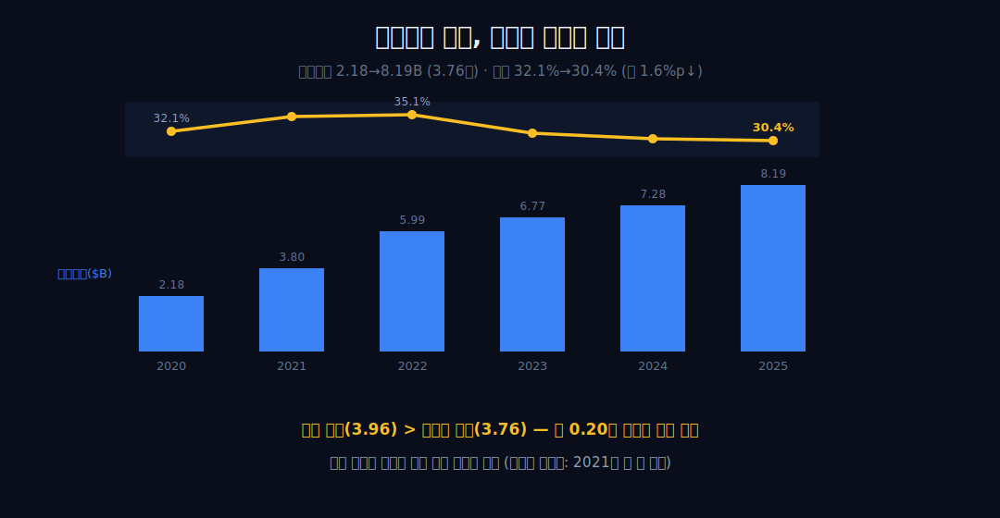
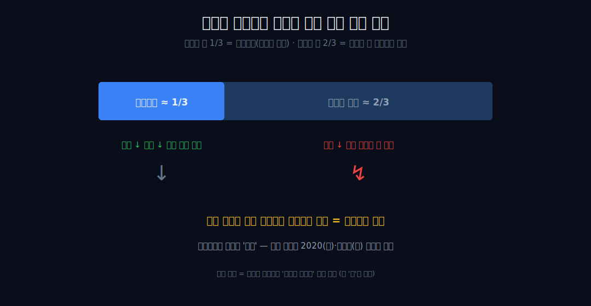
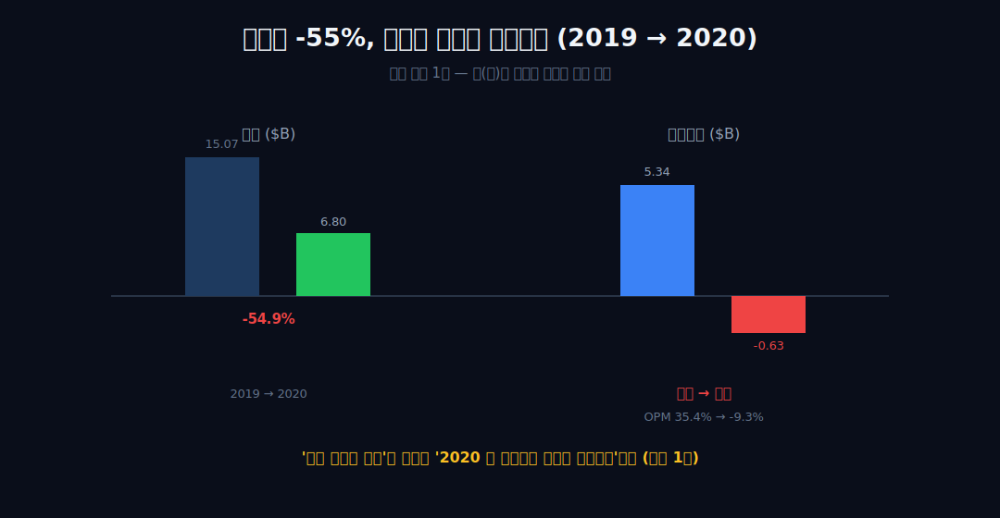
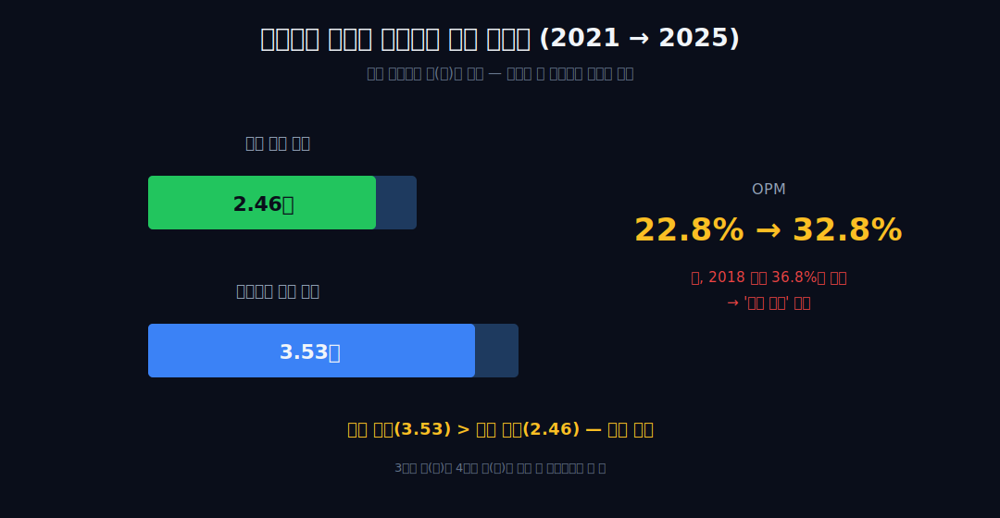
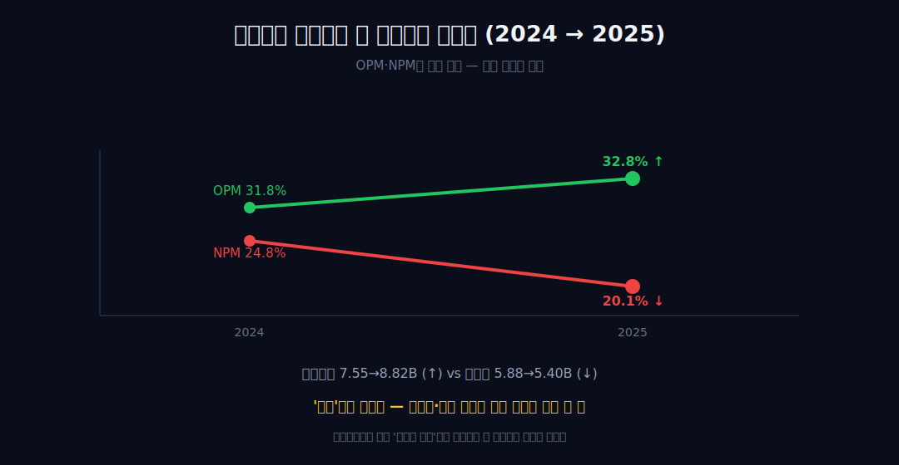
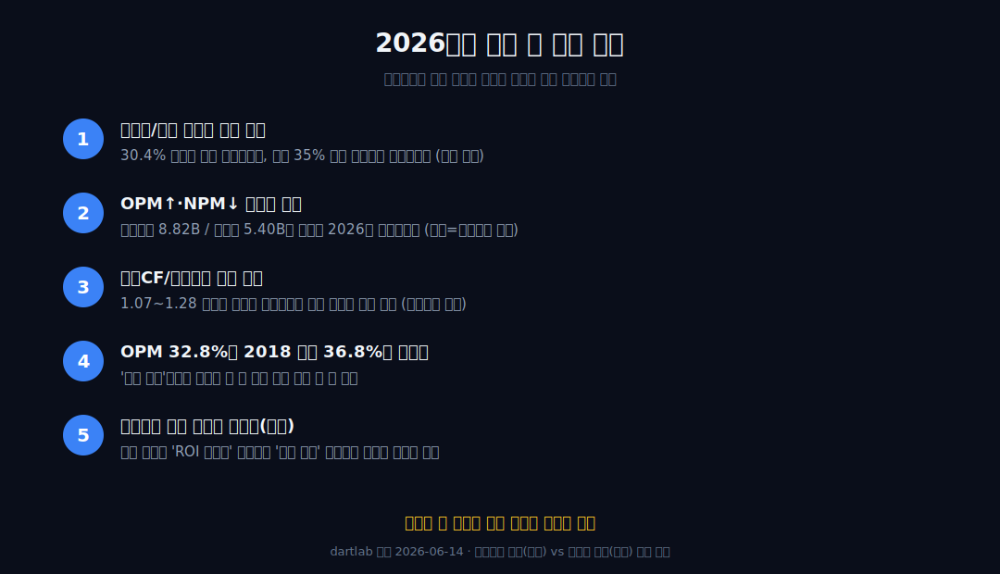

<script>
import ComboChart from '$lib/components/blog/ComboChart.svelte';
import StackBar from '$lib/components/blog/StackBar.svelte';
</script>

> **데이터 기준**: 2026-06-14 dartlab 실측 — Booking Holdings(BKNG) **미국 연결(USD)** 기준, 분기 데이터를 달력연도로 합산. 매출 추세는 8년(2018~2025), **마케팅비·비율 추세는 6년(2020~2025)** — 2018·2019 마케팅비는 내부 데이터에 없어 그 구간만 표기. 마케팅비 안의 성과형/브랜드 구성·구글·메타 통행료 비중·GMV·브랜드별(Booking.com/Priceline/Agoda/KAYAK) 구성은 연결 손익에 안 나오므로 **10-K·IR·언론(외부 인용)**으로 표기. ※대차대조표 항목은 매핑이 불안정해 인용에 주의.
>
> **핵심 숫자**: 매출 **$26.92B** · 영업이익 **$8.82B** (OPM **32.8%**) · 당기순이익 **$5.40B** · 영업현금흐름 **$9.41B** · 마케팅비 **$8.19B** (매출의 **30.4%**) · 2020 매출 충격 -54.9% → OPM **35.4%→-9.3%**
>
> **이 글의 용어**: OPM(영업이익률)·NPM(순이익률) = 각각 영업이익·순이익÷매출(별개 비율) · 마케팅비 = 손익계산서상 marketing expense(성과형+브랜드) · 성과형 광고(performance marketing) = 검색엔진 키워드·제휴·메타서치 리퍼럴 등 거래 직결 광고 · OTA = 온라인 여행사.

---

## 프롤로그 — 가장 큰 비용이 광고비인 회사

한 회사의 가장 큰 비용이 호텔도, 직원도, 서버도 아니라 **'광고비'**라면, 그 회사의 손익은 광고비가 어떻게 움직이느냐를 먼저 봐야 읽힌다.


부킹홀딩스의 마케팅비는 2020년 **21.8억 달러(2.18B)**에서 2025년 **81.9억 달러(8.19B)**로 6년간 **3.76배** 늘었다(내부 실측). 그런데 같은 기간 매출 대비 비율은 32.1%에서 30.4%로 오히려 **약 1.6%p 내려갔다.** 절대액은 폭증했는데 비율은 줄었다 — 이 모순처럼 보이는 한 줄이 이 글의 입구다.



관통선은 하나다. **"가장 큰 비용이 매출에 연동되어 따라 움직이는 이 회사는, 매출이 흔들릴 때 이익이 어디서 증폭되며 — 그 광고비는 누구에게 가는가?"** 비율이 일정한 *이유*(검색 플랫폼 의존인지, 의도적 ROI 타게팅인지)는 외부 자료의 몫이고, 우리는 내부 수치가 닫아주는 한 줄에서 멈춘다.

---

## 1막 — 왜 먼저 '비율'부터 보나

**왜 절대액이 아니라 매출 대비 비율부터 보나.** 가장 큰 단일 비용이 매출 대비 *어디에 머무는지*를 봐야 손익 구조의 정체가 드러나기 때문이다.

```python
import dartlab
c = dartlab.Company("BKNG")
c.select("IS", ["매출액", "마케팅비용"], freq="Q")  # 분기→연간 합산
```

| 마케팅/매출 | 2020 | 2021 | 2022 | 2023 | 2024 | 2025 |
|---|---:|---:|---:|---:|---:|---:|
| 마케팅비($B) | 2.18 | 3.80 | 5.99 | 6.77 | 7.28 | 8.19 |
| 매출 대비 | 32.1% | 34.7% | 35.1% | 31.7% | 30.7% | 30.4% |

마케팅/매출 비율은 6년 내내 **30.4~35.1% 밴드**(2022 실측 35.05%)에 갇혀 있었다. 절대액은 2.18→8.19B로 3.76배 늘었지만, 같은 6년 매출도 6.80→26.92B로 **3.96배** 늘었다. 매출 배수(3.96)가 마케팅 배수(3.76)를 근소하게 앞섰고, 그 **0.20배 차이가 곧 비율 약 1.6%p 하락**이다. 단일 비용 항목이 매출과 이렇게 동조한다는 것 — 여기까지가 검증 가능한 한 줄이다(경로는 비단조다: 32.1→34.7→35.1→31.7→30.7→30.4로 2021에 한 번 올랐다 내려왔다, '꾸준히 하락'이 아니다).

---

## 2막 — 왜 '나머지 3분의 2'를 봐야 하나

**왜 손익의 지렛대를 비율이 아니라 그 바깥에서 찾나.** 매출의 약 3분의 1이 매출에 연동되면, 진짜 지렛대는 그 비율이 *닿지 않는* 나머지에 있기 때문이다.

마케팅비가 매출의 30~35%로 따라 움직인다면, 매출이 빠질 때 이 비용은 같이 줄어 손익을 일부 받쳐준다 — 실제로 2020년엔 매출 6.80B에 마케팅비도 2.18B로 함께 줄어든 것이 관찰된다. 문제는 나머지 약 3분의 2 영역에 깔린 비용(인력·기술·고정성 경비)은 매출이 빠져도 그만큼 줄지 않는다는 데 있다.



그래서 매출 충격이 이익 충격으로 *증폭*되는 자리는 마케팅비가 아니라 그 바깥이다. 여기까지는 구조의 '예고'다 — 실제로 그렇게 작동했는지는 다음 두 막의 숫자가 증언한다. (한 가지 선을 긋는다: 비율이 일정한 것을 '회계적 변동비'로 단정하지 않는다. 통계적 동조이며, 경영진이 광고 투자수익률(ROI) 상한을 겨냥한 결과일 수도 있다 — 그 '왜'는 외부 영역이다.)

---

## 3막 — 왜 2020을 따로 떼어 보나

**왜 평상시가 아니라 단 한 번의 극단을 보나.** 매출 충격이 이익 충격으로 증폭되는지는 외생 충격 1회의 표본에서만 또렷이 보이기 때문이다.

```python
c.select("IS", ["매출액", "영업이익"], freq="Q")  # 2020 충격 확인
```

2020년 매출은 15.07→6.80B로 **-54.9%** 무너졌다(전 세계 여행 동결이라는 외생 충격 1회). 그러자 영업이익은 5.34→**-0.63B로 적자 전환**, OPM은 35.4%(2019)→**-9.3%**로 떨어졌다.



매출이 절반 남짓 빠진 충격이 이익에서는 **흑자→적자로 부호까지** 바꿔 나타났다 — 2막에서 예고한 증폭이 음(陰)의 방향으로 작동한 직접 증거다. 단, 이것은 표본 1개다. '항상 이렇게 적자가 난다'가 아니라 '2020 이 충격에서 이렇게 작동했다'까지가 정직한 한 줄이다. 그렇다면 같은 지렛대가 반대 방향으로도 작동하는가?

---

## 4막 — 왜 회복기를 같은 렌즈로 보나

**왜 회복기에 같은 렌즈를 다시 대나.** 같은 지렛대가 반대 방향으로도 작동하는지를 봐야, 3막이 우연이 아니라 같은 메커니즘의 양면임을 알 수 있기 때문이다.

```python
c.select("IS", ["매출액", "영업이익"], freq="Q")  # 회복기 배수 비교
```


2021→2025 회복기에 매출은 10.96→26.92B로 **2.46배** 늘었다. 같은 기간 영업이익은 2.50→8.82B로 **3.53배** 늘어 매출 배수를 앞질렀고, OPM은 22.8%→**32.8%**로 올라섰다.

 이익 배수(3.53)가 매출 배수(2.46)보다 크다는 한 줄이 양(陽)의 작동을 보여준다 — 매출이 늘 때 매출에 덜 연동되는 비용이 희석되며 이익이 더 빨리 자란 것이다.

다만 정직하게 짚는다 — 회복은 사실이되 *완전* 회복은 아니다. 2025 OPM 32.8%는 2018 **36.8%**·2019 **35.4%** 정점에 아직 미치지 못한다. 코로나 이전의 마진 천장을 아직 못 넘었다.

---

## 5막 — 왜 이익의 '현금화'와 순이익을 함께 보나

**왜 영업이익만으로 멈추지 않나.** 영업이익이 현금으로 뒷받침되는지, 그리고 영업단의 호조가 맨 아랫줄까지 내려갔는지는 *별개의* 질문이기 때문이다.

```python
c.select("CF", ["영업활동현금흐름"], freq="Q")
c.select("IS", ["당기순이익"], freq="Q")  # NPM 계산
```

영업현금흐름은 영업이익을 꾸준히 웃돌았다 — 2022 6.55/5.10=1.28배, 2024 8.32/7.55=1.10배, 2025 9.41/8.82=1.07배. 회계이익이 현금으로 뒷받침된다는 '현금화 양호'까지가 검증 가능한 한 줄이다(초과분의 원인이 운전자본·이연수익인지는 외부/추정 영역).



그런데 맨 아랫줄은 다르게 움직였다. 2025년 영업이익은 7.55→8.82B로 올랐는데(OPM 31.8%→32.8%), **순이익은 5.88→5.40B로 내렸다(NPM 24.8%→20.1%)**. OPM과 NPM이 반대로 갔다는 *관찰*에서 멈춘다 — 내부 수치에 영업외·세금 항목 분해가 없어 원인은 단정하지 않는다. 영업이익률만 보고 '수익성이 좋아졌다'고 결론내면 맨 아랫줄의 역행을 놓친다.

---

## 6막 — 왜 '통행료' 이야기는 여기서 멈추나

**왜 광고비의 행방을 끝까지 파고들지 않나.** 마케팅비 총액(내부)과 그 안의 검색 플랫폼 통행료(외부)는 서로 다른 정보 층이라, 인과로 잇는 순간 검증선을 넘기 때문이다.


마케팅비 81.9억 달러(2025, 내부)가 *어디로* 갔는지 — 성과형 대 브랜드 구성, 구글·메타에 내는 통행료 비중, GMV 대비 수수료율, 브랜드별 구성 — 은 전부 10-K·IR **외부 영역**이다. 외부 인용에 따르면 부킹홀딩스는 2023년 구글 광고에만 추정 **약 $3.2B**를 지출했다고 알려져 있다(외부 인용, 2023년·구글 단일 추정치라 2025년 내부 마케팅 총액 8.19B와 *직접 차감 관계가 아니다*). 비율이 30~35%에 머문다는 내부 관찰과 '검색 플랫폼 의존 때문'이라는 외부 서술은 **'정합/양립'일 뿐 인과 증명이 아니다.**

여기서 한 번만 그림을 착지시킨다 — 여행예약이라는 자리를 가진 대형 플랫폼이, 손님을 데려오기 위해 *검색*이라는 또 다른 자리(구글·메타)에 통행료를 낸다. 거래가 망을 지날 때 통행료를 떼는 [비자](/blog/V-visa), 검색이라는 길목 자체를 가진 [네이버](/blog/035420-naver), 의무 장부의 길목을 쥔 [더존비즈온](/blog/012510-douzone)과 비교하면 — 부킹은 *길목을 쥔 동시에 길목에 종속된* 거울이다. 그러나 본문의 척추는 이 비유가 아니라 내부 수치가 닫아주는 두 줄 — **비율이 30~35%에 머물렀다는 것, 그리고 2020에서 검증된 매출↔이익 증폭** — 에서 끝난다. 같은 플랫폼 계열의 [쿠팡](/blog/CPNG-coupang)이 물류로, [아마존](/blog/AMZN-amazon)이 클라우드로 이익을 만든다면, 부킹은 *광고비라는 단일 비용의 동조*로 손익이 거의 설명되는 회사다.

---

## 2026년에 봐야 할 다섯 가지

1. **마케팅/매출 비율의 이탈 방향** — 비율이 30.4% 아래로 처음 내려가는가, 아니면 다시 35% 밴드 상단으로 돌아가는가. 밴드 이탈 방향이 2026 손익 구조 변화의 첫 신호다(내부 추적 가능).
2. **OPM↑·NPM↓ 괴리의 향방** — 2025에 벌어진 영업이익 8.82B / 순이익 5.40B의 역행이 2026에 좁혀지는가. 영업외·세금이 일시적이었는지 추세였는지는 다음 해 순이익이 영업이익을 다시 따라가는지로만 사후 확인된다.
3. **영업CF/영업이익 배수의 유지** — 1.07~1.28 밴드가 깨지면 회계이익의 현금 뒷받침이 약해진 신호다. merchant 선결제·이연수익 구조 변화(외부) 가능성을 따로 점검해야 한다.
4. **OPM 32.8%가 2018 정점 36.8%를 넘는가** — '완전 회복'이라는 단어는 이 한 선을 넘기 전엔 쓸 수 없다.
5. **마케팅비 안의 성과형 비중·구글/메타 통행료 추정치(외부)** — 내부 비율 안정이 '의도적 ROI 타게팅' 때문인지 '검색 의존' 때문인지를 가르는 유일한 자료다. 2026 공시에서 확인해야 이 글의 외부 보조설명이 갱신된다.



---

## 재무제표 — 최근 8개년 (dartlab 연결, $B)

> 미국 연결(USD)·달력연도 합산 기준. 마케팅비는 2020년부터 표기(2018·2019 내부 데이터 없음). dartlab에서 직접 확인:
> ```python
> import dartlab
> c = dartlab.Company("BKNG")
> c.select("IS", ["매출액","영업이익","당기순이익","마케팅비용"], freq="Q")
> c.select("CF", ["영업활동현금흐름"], freq="Q")
> ```

<ComboChart data={[{year:"2018",매출:14.53,영업이익:5.34,당기순이익:4.00},{year:"2019",매출:15.07,영업이익:5.34,당기순이익:4.87},{year:"2020",매출:6.80,영업이익:-0.63,당기순이익:0.06},{year:"2021",매출:10.96,영업이익:2.50,당기순이익:1.17},{year:"2022",매출:17.09,영업이익:5.10,당기순이익:3.06},{year:"2023",매출:21.36,영업이익:5.83,당기순이익:4.29},{year:"2024",매출:23.74,영업이익:7.55,당기순이익:5.88},{year:"2025",매출:26.92,영업이익:8.82,당기순이익:5.40}]} lineKeys={["매출"]} barKeys={["영업이익","당기순이익"]} lineColors={["#22c55e"]} barColors={["#3b82f6","#f59e0b"]} title="매출(라인) vs 영업이익·당기순이익(막대) — $B" unit="$B" />

| 항목 ($B) | 2018 | 2019 | 2020 | 2021 | 2022 | 2023 | 2024 | 2025 |
|---|---:|---:|---:|---:|---:|---:|---:|---:|
| 매출 | 14.53 | 15.07 | 6.80 | 10.96 | 17.09 | 21.36 | 23.74 | 26.92 |
| 영업이익 | 5.34 | 5.34 | -0.63 | 2.50 | 5.10 | 5.83 | 7.55 | 8.82 |
| OPM | 36.8% | 35.4% | -9.3% | 22.8% | 29.8% | 27.3% | 31.8% | 32.8% |
| 당기순이익 | 4.00 | 4.87 | 0.06 | 1.17 | 3.06 | 4.29 | 5.88 | 5.40 |
| 마케팅비 | — | — | 2.18 | 3.80 | 5.99 | 6.77 | 7.28 | 8.19 |
| 마케팅/매출 | — | — | 32.1% | 34.7% | 35.1% | 31.7% | 30.7% | 30.4% |
| 영업현금흐름 | 1.96 | 4.87 | 0.09 | 2.82 | 6.55 | 7.34 | 8.32 | 9.41 |

이 표를 한 줄로 읽으면 이렇다 — **매출 행이 2020에 반토막 났을 때 영업이익 행만 부호가 바뀌었고(흑→적), 회복기엔 영업이익 행이 매출 행보다 가파르게 올라온다.** 마케팅비 행은 매출 행과 거의 같은 기울기로 움직이고(비율 행이 30~35%에 묶임), 영업CF 행은 영업이익 행을 꾸준히 웃돈다. 매출·이익 행만 보면 평범한 V자 같지만, 마케팅 비율의 *고정*과 2020의 부호 전환을 겹쳐 보면 이건 '여행회사'가 아니라 *매출에 연동된 거대한 광고비 위에서 도는 손익*이다(통행료의 행방은 외부).

---

## 검증표

본문 인용 수치를 dartlab 호출과 결과로 검증한다. 외부 출처(통행료·GMV·브랜드 구성·산업사)는 분리 표기. 📅 dartlab 실측 2026-06-14 · Booking Holdings(BKNG) 미국 연결(USD)·달력연도 합산 기준.

| 본문 수치 | 출처 / 호출 | 결과 |
|---|---|---|
| 마케팅비 2020 2.18B → 2025 8.19B (3.76배) | `c.select("IS",["마케팅비용"],freq="Q")` 합산 | ✓ 실측 |
| 마케팅/매출 32.1%→30.4% (약 1.6%p↓), 6년 밴드 30.4~35.1% | 마케팅비÷매출 | ✓ 실측 |
| 매출 배수 3.96 vs 마케팅 배수 3.76 (차이 0.20배=비율 하락) | 매출·마케팅 합산 비교 | ✓ 실측 |
| 2020 매출 -54.9%(15.07→6.80B) · OPM 35.4%→-9.3% · 영업이익 5.34→-0.63B | `c.select("IS",["매출액","영업이익"])` | ✓ 실측 |
| 회복기 매출 2.46배(10.96→26.92) vs 영업이익 3.53배(2.50→8.82), OPM 22.8%→32.8% | IS 합산 | ✓ 실측 |
| 2025 OPM↑(31.8→32.8%) vs NPM↓(24.8→20.1%, 순이익 5.88→5.40B) | 영업이익·순이익÷매출 | ✓ 실측 |
| 영업CF/영업이익 1.07~1.28배 (2022 1.28·2024 1.10·2025 1.07) | `c.select("CF",["영업활동현금흐름"])` | ✓ 실측 |
| 2025 OPM 32.8% &lt; 2018 36.8%·2019 35.4% 정점 (완전 회복 아님) | IS 합산 | ✓ 실측 |
| 마케팅비 매출의 약 31%(2024 $7.3B)·성과형 광고 구성 | [BKNG 10-K (SEC)](https://www.sec.gov/cgi-bin/browse-edgar?action=getcompany&CIK=0001075531&type=10-K) · [Phocuswire](https://www.phocuswire.com/) | 외부 인용 |
| 2023 구글 광고 추정 약 $3.2B (2023·구글 단일 추정, 내부 총액과 차감 관계 아님) | [Statista](https://www.statista.com/) | 외부 인용·추정 |
| 직접·앱 트래픽 mid-60%·Genius 로열티(예약의 약 40%) | [Booking Holdings IR](https://www.bookingholdings.com/) | 외부 인용 |
| 상위 4개 OTA가 섹터 매출 96%·Booking/Expedia 유럽·미국 약 60% | [Skift](https://skift.com/) | 외부 인용 |
| EU 디지털시장법(DMA) 게이트키퍼 지정 | [European Commission](https://digital-markets-act.ec.europa.eu/) | 외부 인용 |
| BS(대차대조표) 매핑 불안정 — 인용 주의 | dartlab 데이터 한계 | 주의/제외 |

본문의 숫자 중 이 표에 없는 것은 발행 차단 대상이다. 통행료·GMV·브랜드 구성·산업사는 dartlab 연결로 증명되지 않으며 10-K·IR·언론 외부 인용임을 명시한다. 마케팅비 총액(내부)과 그 안의 통행료(외부)를 인과로 잇지 않는 것이 이 글의 원칙이다.
