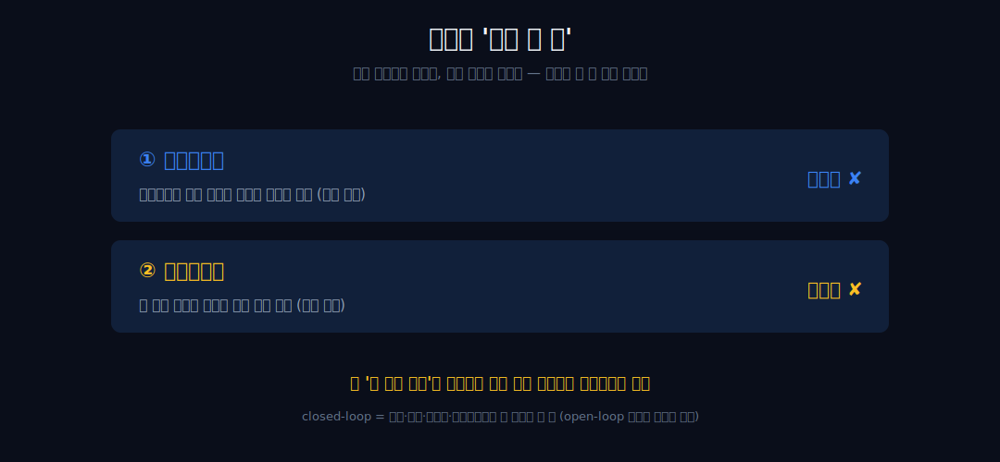
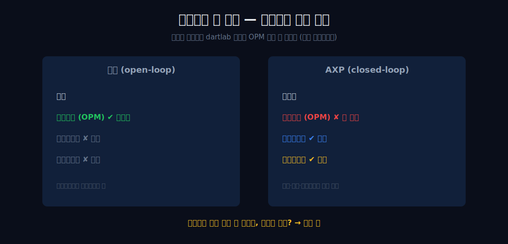
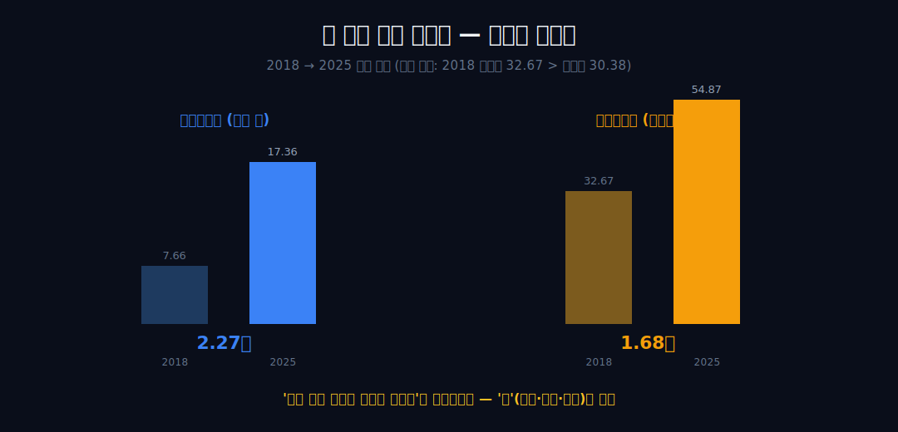
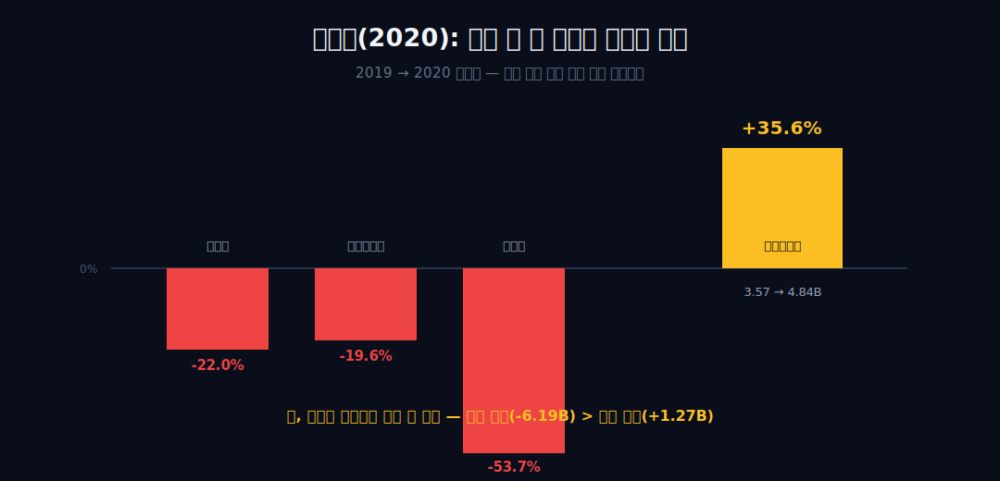
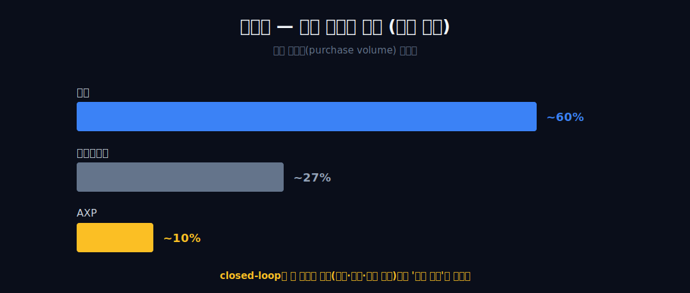
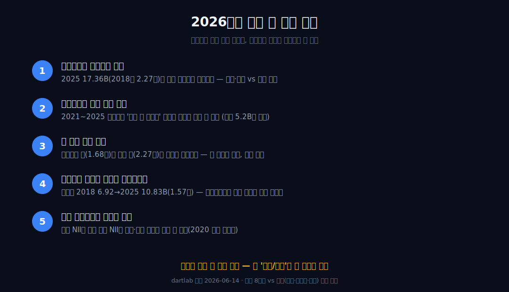

<script>
import ComboChart from '$lib/components/blog/ComboChart.svelte';
import StackBar from '$lib/components/blog/StackBar.svelte';
</script>

> **데이터 기준**: 2026-06-14 dartlab 실측 — American Express(AXP) **미국 연결(USD)** 기준, 분기 데이터를 달력연도로 합산. 내부로 쓰는 라인은 8개뿐 — 총수익·순이자이익·비이자수익·순이익·마케팅비(2018~2025) + 대손충당금(2018~2020 3점만, 2021+ 매핑 결손). 카드회원대출 잔액·점유율·소유구조·창업사·Platinum 혜택·소송은 연결 손익에 안 나오므로 **10-K·IR·언론(외부 인용)**으로 표기. ※내부 순이자이익 라인은 외부 보고 NII와 연도 정렬이 다를 수 있어 외부 NII 절대값과 같은 곡선에 올리지 않는다. ※대차대조표 항목은 매핑이 불안정해 인용에 주의.
>
> **핵심 숫자**: 총수익 **$41.30B** · 순이자이익 **$17.36B** (2018 7.66B의 **2.27배**) · 비이자수익 **$54.87B** (1.68배) · 당기순이익 **$10.83B** · 2020 대손충당금 **+35.6%**(3.57→4.84B, 다섯 줄 중 유일한 역행) · 영업이익(OPM) 라인 **부재**
>
> **이 글의 용어**: closed-loop(폐쇄형 망) = 한 회사가 카드 발급·가맹점 정산·결제망·신용리스크를 모두 쥔 구조(open-loop인 비자는 그 역할을 은행들에 나눠준다) · 순이자이익 = 카드회원에 직접 빌려준 돈에서 나오는 이자 수익 · 대손충당금 = 못 받을 것으로 예상해 미리 쌓는 손실 · 비이자수익 = 가맹점 할인수수료·카드 수수료 등.

---

## 프롤로그 — 손익에 있는 두 줄

비자([이미 발간](/blog/V-visa))의 손익을 dartlab으로 열면, 두 줄이 *없다* — 순이자이익도, 대손충당금도. 비자는 간판을 빌려주고 신용리스크는 발급은행에 넘기기 때문이다. 아메리칸 익스프레스의 손익을 같은 도구로 열면, 그 두 줄이 *있다.*


직접 빌려주니 **이자(순이자이익)**가 수익 라인이 되고, 직접 떼이니 **못 받은 손실(대손충당금)**이 비용 라인이 된다. 이 '두 줄의 실재'가 이 글의 전부다.



관통선은 하나다. **"통행료만 받는 망이라면 없어야 할 두 줄이 이 회사 손익엔 왜 있고, 그 줄들은 위기에 어떻게 반응하는가?"** closed-loop는 한 회사가 카드 발급·가맹점 정산·결제망·신용리스크를 다 쥐는 구조다 — 이 한 문장 이후로는 '거울' 같은 수사 대신 손익 라인의 **있다/없다**로만 말한다. '왜' 그 줄이 더 빨리 컸는지는 내부 수치 밖, 외부의 경계까지만.

---

## 1막 — 부재라는 첫 단서: 영업이익 줄이 없다

**왜 '있는 것'이 아니라 '없는 것'부터 보나.** 비자 글의 주인공이던 영업이익률(OPM) 줄이 AXP 손익 격자엔 *안 잡히는데*, 이 부재 자체가 뒤 막들의 전제이기 때문이다.

```python
import dartlab
c = dartlab.Company("AXP")
c.select("IS", None, freq="Q")  # 손익 라인 목록 확인
```



dartlab 손익 격자를 열면 AXP에는 영업이익(OPM) 라인이 안 잡힌다. 이건 dartlab이 *못 가져온* 결손이 아니라 **dartlab이 은행형 손익으로 읽어 그 줄이 격자에 안 잡히는 것**이다 — 은행형 손익은 영업이익이 아니라 순이자이익과 대손으로 읽힌다. 단 여기까지만 말한다. '이 손익 격자에는 그 줄이 안 잡힌다'까지이고, 'AXP가 영업이익 개념을 회계적으로 안 쓴다'거나 '부재가 사업 실체를 증명한다'로 끌어올리지 않는다. 비자 글의 주인공이던 OPM 60%대(별도 글의 외부 사실)와는 애초에 같은 표에 올릴 수 없다. 그렇다면 자연히 다음 질문 — 영업이익 줄이 없는 그 자리에, *무엇이* 있나?

---

## 2막 — 그래서 무엇이 '있나': 두 줄의 존재

**왜 부재 다음에 곧장 존재를 가리키나.** 비자에 없는 라인을 AXP 손익에서 직접 짚는 것이 관통선의 본체이기 때문이다.


AXP 손익에는 비자에 없는 두 줄이 있다 — **순이자이익**(직접 대출 이자, 2018 7.66B)과 **대손충당금**(직접 떼임, 2018 3.35B). 두 줄이 '있다'는 사실 자체가 핵심이다. 비자는 카드를 찍어준 발급은행이 신용·대손을 지고, 자신은 망 수수료만 번다(외부 자기기술, [비자 글](/blog/V-visa) 참조). AXP는 closed-loop라 발급·정산·신용리스크를 한 회사가 쥐므로, 빌려준 돈의 이자도 자기 수익이고 못 받은 손실도 자기 비용이다. 같은 '직접 리스크를 떠안는' 손익 구조는 보험·증권 리스크를 자기 장부에 지는 [메리츠금융지주](/blog/138040-meritz-financial)에서도 보인다 — 통행료만 떼는 망과는 다른 계열이다. 창업사(1850 운송 → 1891 여행자수표 → 1958 charge card)는 '돈·가치의 이동을 다뤄온 업력'이라는 사실 한 줄로만 둔다(외부 인용) — '리스크 떠안는 기질이라 은행이 될 운명'이라는 봉합은 하지 않는다.

---

## 3막 — 두 줄의 절대 성장 (합산도 분해도 안 한다)

**왜 두 수익 라인을 *따로따로* 보나.** 두 줄을 더하면 거짓이 되기 때문이다 — 2018년 비이자수익(32.67B)이 총수익(30.38B)보다 커서, 순이자+비이자가 총수익으로 합쳐지지 않는다(합 40.33 &gt; 30.38).

```python
c.select("IS", ["순이자이익","비이자수익"], freq="Q")  # 각자 절대 배수
```

| 항목 ($B) | 2018 | 2025 | 배수 |
|---|---:|---:|---:|
| 순이자이익(은행 줄) | 7.66 | 17.36 | **2.27배** |
| 비이자수익(통행료성 줄) | 32.67 | 54.87 | **1.68배** |

은행 줄(순이자이익)은 2.27배, 통행료성 줄(비이자수익)은 1.68배로 각자 자랐다. 두 라인을 각자 절대 배수로만 제시하고 **절대 더하지 않는다**(총수익 구성 분해는 외부 10-K 영역). 관찰은 하나 — *은행 줄이 통행료 줄보다 빠르게 컸다.* 단 여기서 멈춘다. '그래서 구조가 은행 쪽으로 진화/우월하다'는 비약이고, 왜 더 빨랐는지(대출잔액·금리·리볼빙·회원 증가)는 전부 내부 8라인 밖이다.



---

## 4막 — 코로나라는 자연실험: 거꾸로 간 한 줄

**왜 평상시가 아니라 2020을 떼어 보나.** 두 줄이 위기에 어떻게 반응하는지는 외부 의존이 가장 낮은 단단한 단일 자연실험에서만 또렷이 보이기 때문이다.

```python
c.select("IS", ["매출액","비이자수익","대손충당금","당기순이익"], freq="Q")  # 2019 vs 2020
```

2020년, 라인들이 음(-)으로 꺾였다 — 총수익 **-22.0%**(28.16→21.97B), 비이자수익 **-19.6%**(34.94→28.10B), 순이익 **-53.7%**(6.76→3.13B). 그런데 **대손충당금만 +35.6%**(3.57→4.84B)로 거꾸로 갔다.



수익·이익 줄들이 무너지는 동안 *대손충당금만* 거꾸로 부풀었다 — 못 받을 돈에 대비해 미리 쌓는 손실이, 경기가 얼어붙자 동시에 늘어난 것이다. 비자 손익엔 애초에 이 줄이 없으니 이런 역행도 없다. 단 두 가지 선을 긋는다. (1) 순이익 반토막을 **대손 탓으로 봉합하면 거짓**이다 — 수익 하락분(-6.19B)이 대손 증가분(+1.27B)보다 훨씬 크다. '대손은 다섯 줄 중 유일하게 거꾸로 간 줄'까지만이다. (2) 이건 표본 1개의 동시성 관찰이다 — '대손이 경기에 직접 반응한다'는 인과 라벨이 아니라 '같은 해에 대손만 역행했다'는 동시성까지만.

---

## 5막 — '왜 더 빨리 컸나'는 경계에서 멈춘다

**왜 3막의 배수 차이(2.27배 vs 1.68배)의 원인을 캐지 않나.** 그 '왜'가 내부 수치로 증명 불가능한 지점이고, 거기서 멈추는 게 이 글의 척추이기 때문이다.

순이자이익이 왜 비이자수익보다 빨리 컸는지 — 카드회원 대출잔액(외부 인용: 2025년 약 $136.5B), 금리 상승, 리볼빙 잔액, 회원 증가 — 는 전부 외부 사실이고 내부 8라인으로 증명되지 않는다. 내부 수치가 단단하게 말하는 건 '순이자이익 절대액이 2.27배 컸다'까지다. 순이자이익이나 대손을 총수익으로 나눈 비율(예: 대손/총수익 11%→22%)은 *분모 정의가 불명*(2018년 비이자수익이 총수익보다 큼)이라 보조 참고로만 두고, 절대 성장이 본 증거다.


균형추도 외부로 단다 — AXP의 미국 구매액 점유율은 약 **10%**로, 비자(약 60%)·마스터카드(약 27%)에 비하면 절대 규모는 작다(외부 인용).

 closed-loop는 더 무거운 모델(대손·자본·규제를 직접 진다)이지 '슈퍼 해자'가 아니다. 길목을 통행료로 쥔 [비자](/blog/V-visa)·[맥도날드](/blog/MCD-mcdonalds)·[더존비즈온](/blog/012510-douzone)과 달리, AXP는 *그 통행료에 은행 손익을 더 얹은 대신 리스크도 직접 지는* 무거운 길목이다.

---

## 6막 — 60년 보유는 흥미로운 사실이지 증거가 아니다

**왜 마지막에 소유구조를 두되 거기서 사업 품질을 끌어내지 않나.** 누가 얼마나 오래 베팅했나는 흥미로운 사실이지만, 소유에서 손익 구조의 우월로 비약하는 순간 검증선을 넘기 때문이다.

```python
c.select("IS", ["당기순이익"], freq="Q")  # 순이익 추세
c.select("IS", ["마케팅비용"], freq="Q")    # 노이즈 확인
```

외부 인용에 따르면 워런 버핏이 AXP를 처음 산 건 1963년 'salad oil' 사기로 주가가 반토막 났을 때였고, 그 베팅은 60년이 지난 지금 Berkshire가 약 **22%**를 쥔 최대주주로 이어진다. 이는 '리스크 모델이 검증된 우량 구조'라는 *인과*가 아니라 정합/양립까지만이다(1963년 사건은 창고증권 담보 사기이지, 손익의 신용리스크와 다른 종류다).

순이익은 2018 6.92B에서 2025 **10.83B**로 늘었다(약 1.57배). 마케팅비(2019 7.11→2022 5.46→2025 6.25B)는 뚜렷한 추세 없는 노이즈라 관통선에 끼우지 않고 부차 관찰로만 둔다. 결론은 경계에서 닫는다 — *내부 수치는 '비자에 없는 두 줄이 AXP 손익에 실재하고, 2020에 대손만 거꾸로 갔다'까지 말한다. 그 두 줄이 왜 그렇게 컸고 앞으로도 그럴지는 외부와 경계 밖이다.* 통행료만 받는 가벼운 망이 아니라, 빌려주고 떼이는 무게까지 자기 손익에 진 회사 — 그 '있다/없다'가 이 회사의 정체다.

---

## 2026년에 봐야 할 다섯 가지

1. **순이자이익 절대액의 향방** — 2025 17.36B(2018의 2.27배)가 금리 하강 국면에서도 계속 자라는가. 자라면 대출잔액·회원 쪽, 꺾이면 금리 쪽 기여가 컸다는 외부 단서다(내부론 여전히 증명 불가, 외부 10-K로만).
2. **대손충당금 매핑 결손(2021~2025) 복구 여부** — 복구되면 2018~2020 3점을 넘어 '위기 후 정상화' 곡선을 내부 수치로 그릴 수 있다. 그 전까지 2024년 약 $5.2B(외부 SEC 8-K)은 2020 4.84B(내부)와 같은 곡선에 찍지 않는다.
3. **두 줄의 배수 격차** — 통행료성 줄(비이자수익 1.68배)이 은행 줄(순이자이익 2.27배)과의 격차를 좁히는가 벌리는가. 단 두 라인은 끝까지 따로, 합산·분해는 하지 않는다.
4. **순이익이 영업단 호조를 따라가는가** — 순이익 2018 6.92→2025 10.83B(1.57배)가 수익 성장 속도를 유지하는지. 신용사이클이 돌면 대손이 이 줄을 먼저 누른다.
5. **내부 순이자이익 라인의 정렬** — 내부 NII 라인이 외부 보고 NII와 부호·연도 정렬이 다를 수 있다(2020 방향이 어긋남). 매핑이 정합되는지 확인해야 이 글의 내부 NII 서술을 외부와 연결할 수 있다.



---

## 재무제표 — 최근 8개년 (dartlab 연결, $B)

> 미국 연결(USD)·달력연도 합산 기준. AXP는 은행형 손익이라 영업이익(OPM) 라인이 격자에 안 잡힌다 — 총수익·순이자이익·비이자수익·순이익으로 읽는다. 대손충당금은 2018~2020만(2021+ 매핑 결손). dartlab에서 직접 확인:
> ```python
> import dartlab
> c = dartlab.Company("AXP")
> c.select("IS", ["매출액","순이자이익","비이자수익","대손충당금","당기순이익"], freq="Q")
> ```

<ComboChart data={[{year:"2018",총수익:30.38,순이자이익:7.66,당기순이익:6.92},{year:"2019",총수익:28.16,순이자이익:8.62,당기순이익:6.76},{year:"2020",총수익:21.97,순이자이익:7.99,당기순이익:3.13},{year:"2021",총수익:27.72,순이자이익:7.75,당기순이익:8.06},{year:"2022",총수익:34.22,순이자이익:9.89,당기순이익:7.51},{year:"2023",총수익:37.22,순이자이익:13.13,당기순이익:8.37},{year:"2024",총수익:38.83,순이자이익:15.54,당기순이익:10.13},{year:"2025",총수익:41.30,순이자이익:17.36,당기순이익:10.83}]} lineKeys={["총수익"]} barKeys={["순이자이익","당기순이익"]} lineColors={["#22c55e"]} barColors={["#3b82f6","#f59e0b"]} title="총수익(라인) vs 순이자이익·당기순이익(막대) — $B" unit="$B" />

| 항목 ($B) | 2018 | 2019 | 2020 | 2021 | 2022 | 2023 | 2024 | 2025 |
|---|---:|---:|---:|---:|---:|---:|---:|---:|
| 총수익 | 30.38 | 28.16 | 21.97 | 27.72 | 34.22 | 37.22 | 38.83 | 41.30 |
| 순이자이익 | 7.66 | 8.62 | 7.99 | 7.75 | 9.89 | 13.13 | 15.54 | 17.36 |
| 비이자수익 | 32.67 | 34.94 | 28.10 | 34.63 | 42.97 | 47.38 | 50.41 | 54.87 |
| 대손충당금 | 3.35 | 3.57 | 4.84 | — | — | — | — | — |
| 당기순이익 | 6.92 | 6.76 | 3.13 | 8.06 | 7.51 | 8.37 | 10.13 | 10.83 |
| 마케팅비 | 6.47 | 7.11 | 6.75 | 9.05 | 5.46 | 5.21 | 6.04 | 6.25 |

이 표를 한 줄로 읽으면 이렇다 — **비자 표에는 아예 없는 '순이자이익'과 '대손충당금' 두 행이 여기엔 있다.** 순이자이익 행은 2018→2025에 2.27배로 자라고, 대손충당금 행은 2020에만 뚝 솟았다가(코로나) 그 뒤는 데이터가 비어 있다. 비이자수익 행이 총수익 행보다 크다는 점(예: 2025 54.87 vs 41.30)에 유의 — 두 수익 라인은 더해서 총수익이 되지 않으므로 *합산하지 않는다*(총수익은 이자비용 차감 후 순액 성격, 구성 분해는 외부 10-K). 총수익·순이익 행만 보면 평범한 금융주 같지만, 비자엔 없는 두 행의 *존재*와 2020 대손의 *역행*을 겹쳐 보면 이건 통행료만 받는 망이 아니라 빌려주고 떼이는 무게까지 진 손익이다.

---

## 검증표

본문 인용 수치를 dartlab 호출과 결과로 검증한다. 외부 출처(대출잔액·점유율·소유구조·창업사·소송)는 분리 표기. 📅 dartlab 실측 2026-06-14 · American Express(AXP) 미국 연결(USD)·달력연도 합산 기준.

| 본문 수치 | 출처 / 호출 | 결과 |
|---|---|---|
| 순이자이익 2018 7.66B → 2025 17.36B (2.27배) | `c.select("IS",["순이자이익"],freq="Q")` 합산 | ✓ 실측 |
| 비이자수익 2018 32.67B → 2025 54.87B (1.68배) | `c.select("IS",["비이자수익"])` 합산 | ✓ 실측 |
| 2018 비이자수익(32.67) > 총수익(30.38) → 두 줄 합산 불가 | IS 합산 | ✓ 실측 |
| 2020 총수익 -22.0%·비이자수익 -19.6%·순이익 -53.7% | `c.select("IS",...)` 2019 vs 2020 | ✓ 실측 |
| 2020 대손충당금 +35.6% (3.57→4.84B, 다섯 줄 중 유일 역행) | `c.select("IS",["대손충당금"])` | ✓ 실측 |
| 순이익 반토막 ≠ 대손 탓 (수익 -6.19B > 대손 +1.27B) | IS 차감 비교 | ✓ 실측 |
| 순이익 2018 6.92B → 2025 10.83B (약 1.57배) | `c.select("IS",["당기순이익"])` | ✓ 실측 |
| 영업이익(OPM) 라인 부재 = 은행형 손익으로 격자에 안 잡힘 | dartlab IS 격자 | 매핑 사실 |
| 대손충당금 2021~2025 결손 / 내부 NII 라인 외부 정렬 차이 | dartlab 데이터 한계 | 주의 |
| closed-loop·발급·정산·신용리스크 단일 통제 / 1850 운송·1891 수표·1958 charge card | [AXP 10-K (SEC)](https://www.sec.gov/cgi-bin/browse-edgar?action=getcompany&CIK=0000004962&type=10-K) · [HISTORY](https://www.history.com/this-day-in-history/american-express-launches-first-credit-card) | 외부 인용 |
| 카드회원 대출 약 $136.5B (2025) / 2024 대손 약 $5.2B | [AXP IR](https://ir.americanexpress.com/) | 외부 인용 |
| 미국 구매액 점유율 약 10% (Visa ~60%·MA ~27%) | [UpgradedPoints](https://upgradedpoints.com/credit-cards/credit-card-market-share-by-network/) | 외부 인용 |
| Berkshire 약 22% 최대주주·1963 salad oil 진입·60년 보유 | [Berkshire 13F](https://www.berkshirehathaway.com/) | 외부 인용 |
| 2025.9 Platinum 연회비 $695→$895·혜택 2배 | [CNBC 2025-09-18](https://www.cnbc.com/) | 외부 인용 |
| BS(대차대조표) 매핑 불안정 — 인용 주의 | dartlab 데이터 한계 | 주의/제외 |

본문의 숫자 중 이 표에 없는 것은 발행 차단 대상이다. 대출잔액·점유율·소유구조·창업사는 dartlab 연결로 증명되지 않으며 10-K·IR·언론 외부 인용임을 명시한다. 두 수익 라인을 합산하지 않고, 내부 순이자이익을 외부 보고 NII와 같은 곡선에 올리지 않는 것이 이 글의 원칙이다.
