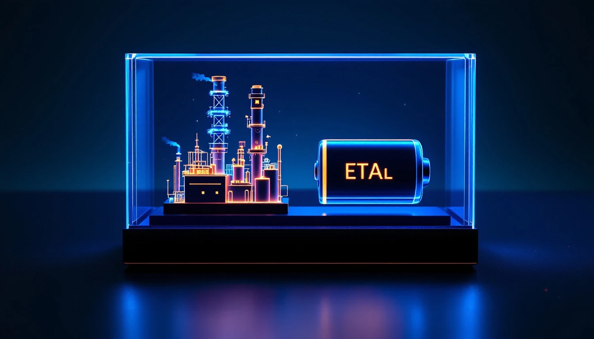
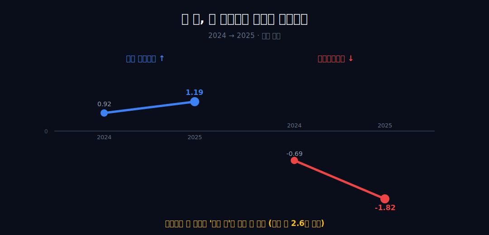
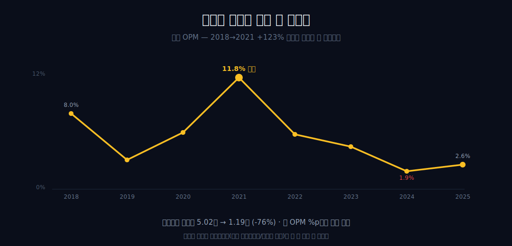
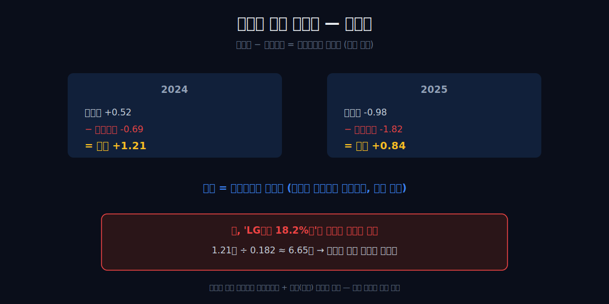
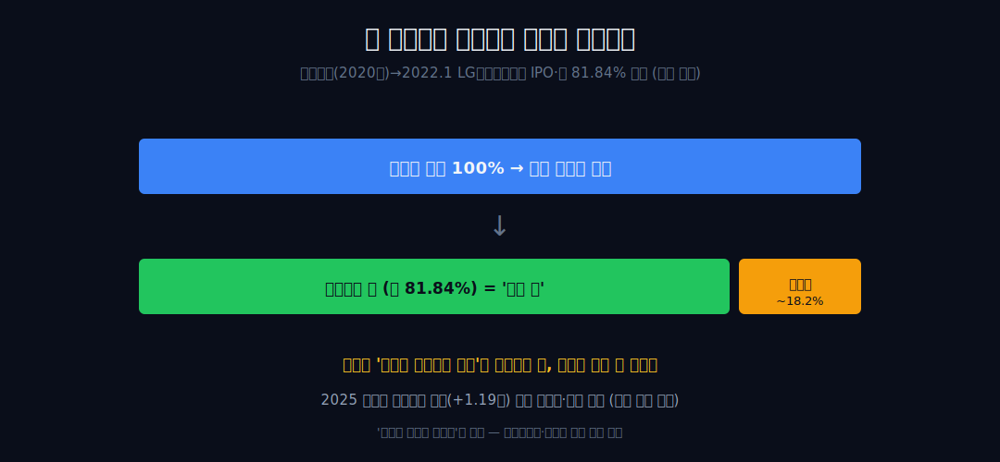
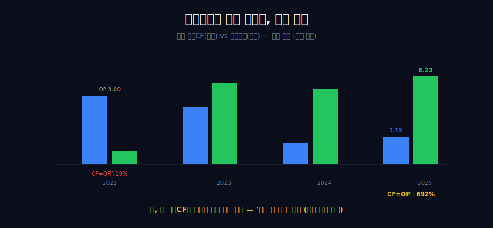
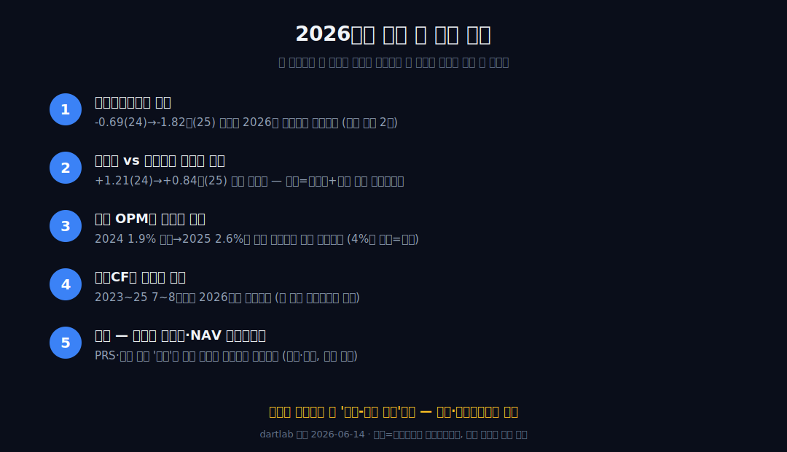

<script>
	import CompanyFinancials from '$lib/components/blog/CompanyFinancials.svelte';
</script>

> **데이터 기준**: 2026-06-14 dartlab 실측 — LG화학(051910) **연결(원화)** 기준, 분기 데이터를 달력연도로 합산(단위 조원). 내부로 쓰는 건 연결 손익표 한 장 — 매출·영업이익·OPM·총순이익·지배주주순익·영업CF의 2018~2025 시계열. **2023 지배주주순익은 dartlab 매핑 결손이라 본문에 인용하지 않는다**(총순익 2.64조만 사용, 지배순익 시계열은 2024·2025 두 점뿐). 세그먼트(석화/첨단소재/생명과학)·LG에너지솔루션 물적분할·약 81.84% 보유 지분율·시가총액·NAV 디스카운트는 연결 손익에 안 나오므로 **공시·시장·언론(외부 인용, 시점 명시)**으로 표기.
>
> **핵심 숫자**: 연결 영업이익 **1.19조** (OPM 2.6%) · 총순이익 **-0.98조** · **지배주주순익 -1.82조** · 영업현금흐름 **8.23조** · 2024→2025 영업이익 +0.27조(↑)인데 지배순익 -0.69→-1.82조(약 2.6배 악화) · 총순익-지배순익 차액 2025 **+0.84조**(비지배지분 귀속분)
>
> **이 글의 용어**: 연결 손익 = 자회사 실적을 모회사 장부에 합쳐 100% 인식 · 지배주주순익 = 그 총순익에서 비지배(소수)주주 몫을 뺀 '주인 몫' · 비지배지분 = 자회사 중 모회사가 안 가진 지분의 귀속분 · OPM(영업이익률)·NPM(순이익률) = 별개 비율 · 물적분할 = 사업부를 100% 자회사로 떼어내는 분할.

---

## 프롤로그 — 두 화살표가 반대로 갈라진 한 해

LG화학의 2025년 연결 영업이익은 1.19조, 전년(0.92조)보다 **올랐다.** 보통은 좋은 신호다. 그런데 같은 해 회사가 주주에게 귀속시킨 순이익은 **-1.82조**, 전년(-0.69조)보다 적자가 약 2.6배 깊어졌다.



영업이익은 위로, 주인 몫은 아래로 — 한 회사의 한 해에 두 화살표가 정반대로 갈라진다.



이 글은 그 두 화살표 사이의 거리를 검증 가능한 숫자로만 따라가다, 거리의 정체가 *'한 손익표에 상장 자회사가 통째로 들어온 회계 형태'*에 있다는 경계까지만 간다. 관통선은 하나다 — **"영업이익은 올랐는데 주인 몫은 왜 더 깊이 꺼졌고, 그 거리는 무엇으로 채워져 있는가?"** 적자의 원인이 무엇이고 시장이 매긴 값이 정당한가는 그 경계 너머, 외부의 몫으로 남긴다.

---

## 1막 — 표면: 사이클이 한 비율에 새긴 진폭

**왜 먼저 연결 영업이익률부터 보나.** 모든 의문의 출발점이 '본업이 그렇게 나빠졌나'라는 표면 인상이라, 그 인상을 정확한 폭으로 박아두고 시작해야 다음 막의 균열이 드러나기 때문이다.

```python
import dartlab
c = dartlab.Company("051910")
c.select("IS", ["매출액", "영업이익"], freq="Y")
```

연결 영업이익은 2021년 5.02조(OPM 11.8%)로 정점을 찍고 2025년 1.19조(OPM 2.6%)까지 내려왔다 — **절대액 기준 -76%.** OPM만 늘어놓으면 2018 8.0% → 2019 3.1% → 2020 6.0% → 2021 11.8% → 2022 5.8% → 2023 4.5% → 2024 1.9% → 2025 2.6%다(영업이익 절대액의 -76%와 OPM의 %p 변화는 다른 척도임에 유의).



'추세적 쇠퇴'로 읽고 싶지만 2018→2021엔 영업이익이 **+123%**(2.25→5.02조) 상승한 게 선행했다. 이건 한 방향 추세가 아니라 진폭이 큰 사이클이다. 여기서 멈춘다 — 무엇이 진폭을 만들었는지(석화 다운사이클인지 배터리 캐즘인지)는 이 한 줄로는 못 가른다.

---

## 2막 — 균열: 두 화살표가 갈라지는 단 한 지점

**왜 영업이익 다음에 곧장 지배주주순익을 겹쳐 보나.** 표면(영업이익)만 보면 2025년은 '회복'처럼 읽히는데, 같은 기간 주주 귀속 이익을 포개는 순간 그 인상이 깨지기 때문이다 — 이 역전이 글 전체의 코어다.

```python
c.select("IS", ["영업이익", "당기순이익"], freq="Y")  # 총순익
# 지배주주순익은 (지배주주지분)당기순이익 라인
```

| 항목 (조원) | 2024 | 2025 |
|---|---:|---:|
| 연결 영업이익 | 0.92 | **1.19** (↑ +0.27) |
| 총순이익 | 0.52 | -0.98 |
| **지배주주순익** | **-0.69** | **-1.82** (↓ 약 2.6배) |

영업이익만 보면 0.92→1.19조로 올랐다. 그런데 지배주주순익은 -0.69→-1.82조로 같은 기간 거꾸로 적자 규모가 약 **2.6배**(0.69→1.82조) 커졌다. 위로 가는 화살표(영업이익)와 아래로 가는 화살표(지배순익)가 한 회사의 한 구간에서 정반대로 갈라진다. 결론은 관찰까지만 — *영업이익 한 줄로는 주주 실질을 못 읽는다.* 단정 경계 하나: 이 역전은 단 2개 연도(2024→2025) 비교다. '추세'가 아니라 '두 해 연속 갈라짐'까지만 말한다(지배순익 시계열은 2023 매핑 결손으로 2024·2025 두 점뿐이다).

---

## 3막 — 분해: 차액에 이름 붙이기, 그러나 절반만

**왜 균열을 본 뒤 곧장 차액을 계산하나.** 두 화살표가 갈라진 거리를 숫자로 떼어내야, 그 거리가 *어디서* 왔는지 묻는 다음 막으로 넘어갈 수 있기 때문이다.

분해는 뺄셈 하나다. 2024년 총순익 +0.52조인데 지배순익 -0.69조 → 차액 **+1.21조**. 2025년 총순익 -0.98조인데 지배순익 -1.82조 → 차액 **+0.84조**. 이 차액이 **비지배지분 귀속분**이다 — 총이익(흑이든 적이든)을 100% 인식한 뒤 비지배(소수)주주 몫을 빼면 '주인 몫'이 더 깊은 적자가 된다. 이는 분식이 아니라 정상적인 소수지분 연결회계다.



확인 가능한 한계 둘을 못 박는다. (1) 이 차액을 *'곧 LG에너지솔루션 18.2%분'으로 등치하면 산술로 반증된다* — 1.21조÷0.182 ≈ **6.65조**인데, 이는 자회사 순익 규모상 불가능하다. 차액엔 다수 종속회사의 비지배지분과 본업(별도) 손익이 섞이므로 '차액 = 비지배지분 귀속분'까지만 단언하고, 특정 자회사로 환산하지 않는다(81.84% 보유는 외부 사실이라 '주로 자회사로 양립' 정도로만). (2) 2025 적자는 영업이익이 흑자(+1.19조)인데 *그 아래* 영업외·세금 단계에서 발생했고, 내부 수치엔 영업외(평가손실·일회성) 분해가 없어 '비지배지분만의 효과'로 환원할 수 없다. 차액=비지배 몫까지만이다.

---

## 4막 — 왜 이 형태가 됐나: 회계 구조의 기원 (외부 인용)

**왜 숫자를 다 떼어낸 뒤에야 '왜 이런 손익표가 됐나'를 묻나.** 차액의 정체(비지배지분)를 확정하기 전에 형태를 말하면 인과가 거꾸로 흐른다. 정량 코어를 손에 쥔 다음에야 형태를 외부 사실로 입힐 수 있다.


외부 인용에 따르면 LG화학은 2020년 말 배터리 사업을 물적분할하고 2022년 1월 LG에너지솔루션을 상장시켰다. 모회사는 자회사 지분 약 **81.84%**를 보유한다(외부 인용). 회계상 81.84% 보유 자회사는 연결 손익에 100% 잡히고, 나머지 약 18.2%가 비지배지분으로 분리된다 — 3막의 차액이 양(+)으로 나오는 회계적 자리가 바로 여기다(단, 그것이 차액이 생기는 한 자리일 뿐 유일한 자리는 아니다).



인과의 경계를 분명히 한다. 이 *형태*는 괴리를 드러내는 구조를 만들었을 뿐, *적자 자체를 만든 건 아니다.* 다운사이클·캐즘은 외부 정성 배경일 뿐이고, 2025 적자는 영업이익 흑자(+1.19조) 아래 영업외·세금 단계에서 발생했으며 그 구성은 내부 수치로 가를 수 없다. '분할이 회사를 망쳤다'는 비약은 여기서 차단한다. 같은 석유화학 다운사이클을 공유하는 [롯데케미칼](/blog/011170-lotte-chemical), 같은 배터리 캐즘에 놓인 자회사 [LG에너지솔루션](/blog/373220-lg-energy-solution)·[삼성SDI](/blog/006400-samsung-sdi), 양극재 전선의 [에코프로비엠](/blog/247540-ecopro-bm)·[포스코퓨처엠](/blog/003670-posco-future-m)이 같은 솥의 다른 자리들이다.

---

## 5막 — 현금이라는 다른 화살표, 그리고 같은 함정

**왜 손익 다음에 현금흐름을 보나.** '주인 몫이 적자면 회사가 위태로운가'라는 다음 질문에 답하면서, 동시에 현금마저 같은 형태의 격리 대상임을 보여 손익-현금 오독을 막아야 하기 때문이다.

```python
c.select("CF", ["영업활동현금흐름"], freq="Y")
```

손익이 부진한 2023~2025에도 연결 영업CF는 7.54 → 7.01 → **8.23조**로 견고하다. 2025년만 보면 영업이익 1.19조 대비 영업CF 8.23조 = **692%**. 반대로 2022년은 영업이익 3.00조인데 영업CF 0.57조로(영업CF가 영업이익의 19%) 역전됐다. 이익과 현금이 따로 논다.



단 두 겹의 유의 사항을 단다. (1) 주입 수치엔 현금흐름 구성항목(감가상각·운전자본) 분해가 없어 *원천을 가를 수 없다* — 대규모 비현금비용을 동반하는 자본집약 특성과 '양립'할 뿐이고, '비현금비용이 크다'는 정의상 항등식에 가까워 그 자체로 본업 건강을 증명하지 않는다. (2) 이 영업CF 8.23조는 *자회사를 포함한 연결 합산치*다 — 즉 '주인 몫 현금'이 아니라, 현금 역시 4막의 형태(소유구조 격리) 안에 있다. '현금 풍부 = 안전'으로 읽으면 안 된다.

---

## 6막 — 시장이 매긴 값과, 멈추는 자리 (외부 인용)

**왜 마지막에 시장 평가를 두나.** 내부 숫자가 증명할 수 있는 건 '연결-지배 괴리'까지이고, 그 너머 '그래서 회사 가치는 얼마인가'는 전적으로 외부의 영역이라 글의 가장 끝, 경계 밖에 둬야 하기 때문이다.


일부 투자자와 보도는 LG화학을 '석화회사'가 아니라 *'자회사 지분가치 + 본업'의 합*으로 평가하는 시각을 갖는다(외부 인용). 보유한 자회사 지분가치만으로 모회사 본체 시총을 웃도는 구간이 관측됐고(외부 인용: 2025년 11월 보도 기준), 이것이 흔히 말하는 NAV(지주) 디스카운트다. 회사는 주가수익스왑(PRS)을 통한 지분 일부 처분·보유율 인하를 추진·검토하는 *단계*다(외부 인용, 완결이 아닌 시도). 같은 NAV 디스카운트에 갇힌 [SK스퀘어](/blog/402340-sk-square)가 그 거울이다.

글은 여기서 멈춘다 — *내부 수치가 단언하는 건 '연결 영업이익과 지배주주순익의 방향 역전, 그리고 그 괴리=비지배지분 귀속분'까지다.* 시총 역전·디스카운트·그 해소는 시점에 따라 변하는 외부 사실이고, '저평가니까 싸다'는 투자 결론은 이 글의 경계 밖이다. 한 손익표 안에 두 회사가 담기면, 영업이익 한 줄로는 누구의 몫도 끝까지 읽히지 않는다 — 그 경계가 LG화학의 현재다.

---

## 2026년에 봐야 할 다섯 가지

1. **지배주주순익의 방향** — 2024 -0.69조 → 2025 -1.82조의 적자가 2026년에 더 깊어지는가, 좁혀지는가. '두 해 연속 역전'이 셋째 해에도 이어지면 비로소 추세로 말할 수 있다(현재는 표본 2점).
2. **총순익 vs 지배순익 차액의 추이** — 2024 +1.21조 → 2025 +0.84조로 이미 줄었다. 2026 차액이 더 좁혀지면 비지배지분+별도 손익 합산의 변화 신호다(단 차액=비지배 몫까지만, 특정 자회사 환산 금지).
3. **연결 OPM의 사이클 위치** — 2024 1.9% 바닥 → 2025 2.6%가 일시 반등인지 사이클 회복의 시작인지. 2026 OPM이 4%대를 회복하면 상행, 다시 2%대 이하면 바닥 재확인.
4. **영업CF의 견고함 지속** — 2023~2025 7~8조대가 2026에도 유지되는가. 영업CF가 영업이익 대비 여전히 수백 % 수준이면 자본집약 디커플링 지속, 급락하면 운전자본·투자 사이클 전환 신호(단 연결 합산치임을 유지).
5. **외부 — 자회사 보유율과 NAV 디스카운트** — PRS 처분·지분 인하 '시도'가 2026년에 실제 보유율 변동으로 완결되는가, 자회사 시총 > 모회사 본체의 역전 구조가 해소되는가(전부 외부·시점 명시 필수, 매수 시그널로 오독 금지).



---

## 검증표

본문 인용 수치를 dartlab 호출과 결과로 검증한다. 외부 출처(세그먼트·물적분할·지분율·시총·NAV)는 분리 표기. 📅 dartlab 실측 2026-06-14 · LG화학(051910) 연결(원화)·달력연도 합산 기준(조원).

| 본문 수치 | 출처 / 호출 | 결과 |
|---|---|---|
| 연결 영업이익 2021 5.02조(OPM 11.8%) → 2025 1.19조(OPM 2.6%), 절대 -76% | `c.select("IS",["매출액","영업이익"],freq="Y")` | ✓ 실측 |
| 2018→2021 영업이익 +123%(2.25→5.02조) 상승 선행 | IS 시계열 | ✓ 실측 |
| 2024→2025 영업이익 0.92→1.19조(+0.27) vs 지배순익 -0.69→-1.82조(약 2.6배) | `c.select("IS",["영업이익","(지배주주지분)당기순이익"])` | ✓ 실측 |
| 차액 2024 +1.21조 / 2025 +0.84조 = 비지배지분 귀속분 | 총순익 − 지배순익 | ✓ 실측 |
| LG엔솔 18.2%분 등치 반증: 1.21조÷0.182≈6.65조(불가능) | 산술 검산 | ✓ 실측 |
| 2025 총순익 -0.98조 = 영업이익 흑자(+1.19) 아래 영업외·세금 단계 | IS 단계 비교 | ✓ 실측(분해 불가) |
| 영업CF 2023~2025 7.54→7.01→8.23조 / 2025 OP의 692% / 2022 OP의 19% | `c.select("CF",["영업활동현금흐름"],freq="Y")` | ✓ 실측 |
| 2023 지배주주순익 매핑 결손 → 본문 인용 안 함(총순익 2.64조만) | dartlab 데이터 한계 | 주의/제외 |
| 배터리 물적분할(2020말)→2022.1 LG에너지솔루션 IPO·약 81.84% 보유 | [DART 전자공시](https://dart.fss.or.kr/) · [LG화학 IR](https://www.lgchem.com/company/ir) | 외부 인용 |
| 자회사 시총 > 모회사 본체 시총·NAV(지주) 디스카운트(2025-11 보도 기준) | 언론(예: [한국경제](https://www.hankyung.com/)) | 외부 인용·시점 |
| 2025.11 PRS 약 2조 지분 처분·중장기 보유율 인하 추진 | 언론·공시 | 외부 인용 |
| 세그먼트(석화/첨단소재/생명과학) 구성 | 사업보고서(DART) | 외부 인용 |
| 중국 에틸렌 자급률 80% 초과·NCC 구조조정 | 업계 리서치 | 외부 인용 |

본문의 숫자 중 이 표에 없는 것은 발행 차단 대상이다. 세그먼트·물적분할·지분율·시총·NAV는 dartlab 연결로 증명되지 않으며 공시·시장·언론 외부 인용(시점 명시)임을 명시한다. 내부는 '연결-지배 괴리'까지, 차액은 '비지배지분 귀속분'까지만 단언하는 것이 이 글의 원칙이다.

---

<CompanyFinancials code="051910" />
