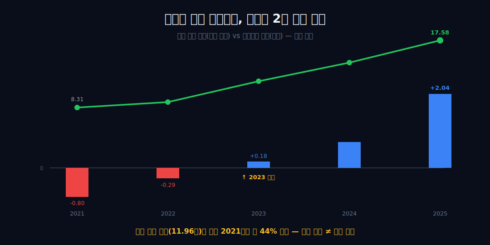
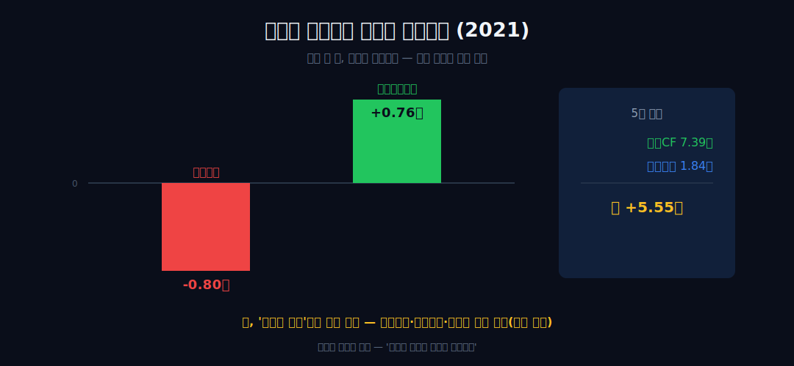
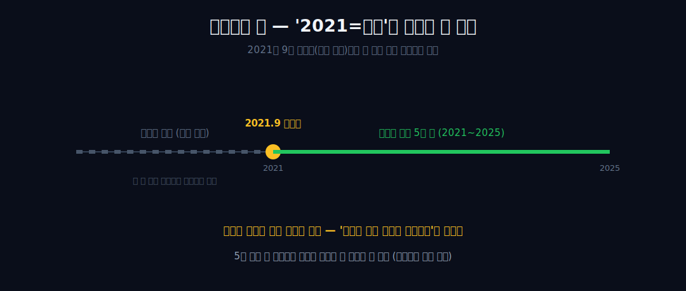
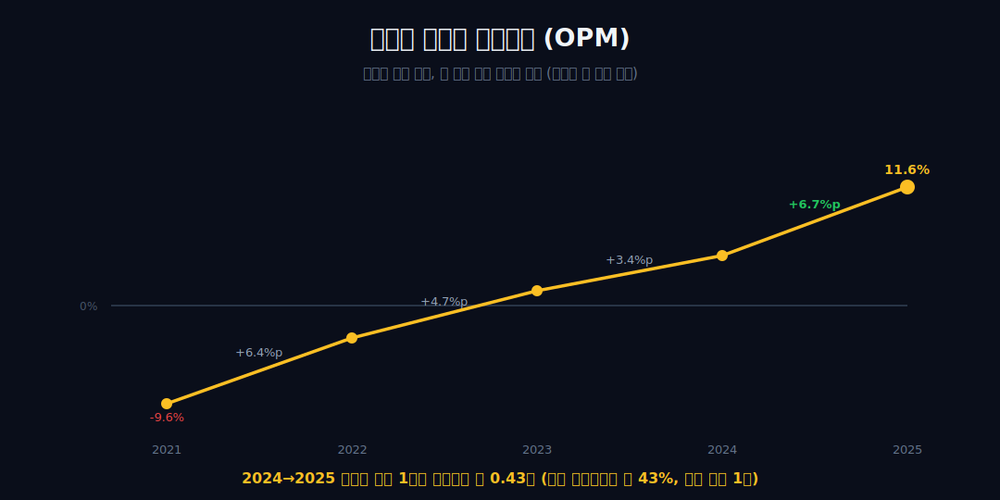
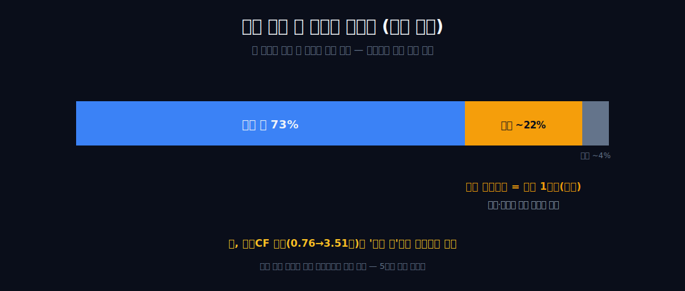
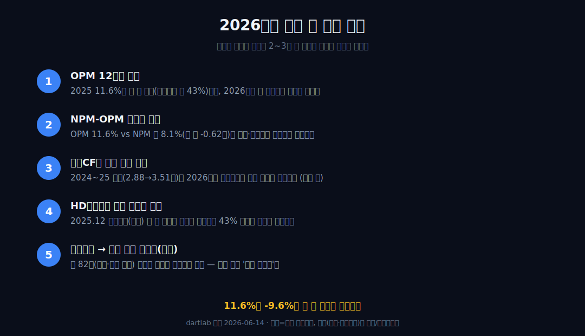

<script>
	import CompanyFinancials from '$lib/components/blog/CompanyFinancials.svelte';
import ComboChart from '$lib/components/blog/ComboChart.svelte';
import StackBar from '$lib/components/blog/StackBar.svelte';
</script>

> **데이터 기준**: 2026-06-20 dartlab 실측 + HD현대중공업 2026년 1분기 IR + DART/KIND 정기공시 — HD현대중공업(329180) **연결(원화)** 기준, 분기 데이터를 달력연도로 합산(단위 조원). 내부로 쓰는 건 2021~2025 연결 5줄 — 매출·영업이익·OPM·당기순이익·영업CF. **2021년 이전 단독 데이터가 없는 건 2021.9 재상장(분할 이력)의 흔적이지 데이터 결함이 아니다.** 후판 가격·수주잔고·사업부 비중(조선/엔진/해양)·힘센엔진 점유율·HD현대미포 합병·HD한국조선해양 지배구조는 연결 손익에 안 나오므로 **공시·IR·언론(외부 인용)**으로 표기.
>
> **핵심 숫자**: 매출 **17.58조** · 영업이익 **2.04조** (OPM **11.6%**) · 당기순이익 **1.42조** (NPM 약 8.1%) · 영업현금흐름 **3.51조** · 영업이익 부호 2021 -0.80조 → 2023 +0.18조 흑전(흑전 시점 매출은 2021보다 약 +44%) · 2021 영업이익 -0.80조 vs 영업CF +0.76조(부호 불일치)
>
> **이 글의 용어**: 헤비테일(heavy-tail) = 배 한 척 값의 대부분을 인도 시점에 몰아 인식하는 구조 · 진행기준 = 공정 진척률에 따라 매출·이익을 나눠 인식 · OPM(영업이익률)·NPM(순이익률) = 각각 영업이익·순이익÷매출(별개 비율) · 수주잔고(backlog) = 이미 계약된 미래 매출.

---

## 프롤로그 — 장부가 찍는 건 '지금'이 아니다

조선업의 장부에는 시계가 두 개 돈다. 하나는 회계가 매출과 이익을 인식하는 시각, 다른 하나는 2~3년 전 어떤 배를 얼마에 따냈고 그새 후판값이 어떻게 변했는지가 *지금* 매출로 도착하는 시각.


이 글은 외부 산업 서사로 결론을 끌어오지 않는다. 대신 HD현대중공업의 연결 실측 5줄(매출·영업이익·OPM·당기순이익·영업CF, 2021~2025)만으로 한 가지를 보인다 — *이 회사 장부는 지금이 아니라 시차(時差)를 찍는다.* 비유는 여기 한 번만 쓰고, 이후로는 숫자와 부호로만 말한다.



관통선은 하나다. **"매출은 매년 오르는데 흑자는 왜 2년 늦게 왔고, 적자인 해에 현금은 왜 들어왔는가?"** 후판값·수주잔고·사업부 비중은 전부 외부 인용으로만 등장하며, 내부 수치가 증명하는 경계 — *시차가 존재한다* — 에서 정확히 멈춘다.

---

## 1막 — 매출은 매년 오르는데, 흑자는 2년 늦게 왔다

**왜 이 관찰을 맨 앞에 두나.** '매출이 곧 이익'이라는 자연스러운 기대를 단 두 줄의 내부 수치로 깨는 것이 관통선의 입구이기 때문이다 — 이익 부호가 매출 크기의 함수가 아니라면, 장부는 다른 시계를 따른다.

```python
import dartlab
c = dartlab.Company("329180")
c.select("IS", ["매출액", "영업이익"], freq="Q")  # 분기→연간 합산
```

| 항목 (조원) | 2021 | 2022 | 2023 | 2024 | 2025 |
|---|---:|---:|---:|---:|---:|
| 매출 | 8.31 | 9.05 | 11.96 | 14.49 | **17.58** |
| 영업이익 | -0.80 | -0.29 | **+0.18** | 0.71 | **2.04** |

매출은 5년 내내 멈춤 없이 올랐다(8.31→9.05→11.96→14.49→17.58조, **2.12배**, 재상장 첫해 2021 기점 연평균 약 +20.6%). 그런데 영업이익 부호는 2021 -0.80, 2022 -0.29로 적자였다가 **2023년(+0.18조)에야** 플러스로 뒤집혔다. 흑전한 2023년의 매출(11.96조)은 적자였던 2021년보다 이미 **약 44%** 크다. 더 큰 매출이 된 *뒤에야* 부호가 바뀐 것이다 — 즉 그해 이익 부호는 그해 매출 크기의 단순 함수가 아니다. 여기서 '왜'를 단정하지 않는다. 헤비테일과 정합하지만, 후판 급등기 마진 압박·고정비 레버리지·일회성 충당금도 같은 패턴을 만들 수 있다. 내부 수치가 증명하는 건 '이익 부호 ≠ 매출 크기'까지다.

---

## 2막 — 결정타: 손익은 적자인데 현금은 들어왔다 (2021)

**왜 1막 다음에 곧장 현금흐름인가.** 1막의 시차를 *같은 한 해 안에서* 못 박는 가장 강한 내부 증거가 2021년의 부호 불일치이기 때문이다.

```python
c.select("CF", ["영업활동현금흐름"], freq="Q")  # 2021 손익 vs 현금
```


적자 정점 2021년, 영업이익은 **-0.80조**인데 영업현금흐름은 **+0.76조**다. 부호가 어긋난다. 장부가 손실을 인식하는 동안 현금은 들어왔다.



5년 누적으로도 영업CF 7.39조가 영업이익 1.84조를 웃돌아 갭이 +5.55조다. 여기서 선을 긋는다. 이 부호 불일치를 *'선수금 덕분'으로 단정하면 비약*이다 — 손실 중에도 영업CF를 플러스로 만드는 경로는 여럿(감가상각 가산, 재고·매출채권 감소, 충당금 설정)이고, 5줄로는 어느 것인지 분해할 수 없다. 누적 갭이 크다고 '현금흐름 우량주'로 단정하는 것도 비약이다. 안전한 진술은 하나 — *손익과 현금의 부호가 어긋났다.* 그 관찰만으로도 '장부 이익이 곧 그해의 현금 사정이 아니다 = 인식 시점이 따로 논다'는 시차가 확인된다.

---

## 3막 — 데이터의 끝: 2021년이 '바닥'으로 보이는 건 착시일 수 있다

**왜 회복 곡선을 그리기 전에 데이터 경계부터 짚나.** 2021년을 '적자 바닥·출발점'으로 읽으면 '회사가 새로 망했다 살아났다'로 오독하기 때문 — 곡선을 그리기 전에 이 착시를 먼저 제거해야 한다.

우리 5줄 시계열이 2021년부터 시작하는 건 회사가 그때 바닥을 쳤기 때문이 *아니라*, 2021년 9월 재상장(분할 이력)으로 그 이전 단독 연결 데이터가 존재하지 않기 때문이다(외부 인용).



이건 데이터 결함이 아니라 분할 이력의 흔적이다. 따라서 '2021 = 사이클의 시작점'이 아니다 — 우리가 보는 5년 창은 한 건조 사이클의 *전체*가 아니라, 잘려나간 더 긴 사이클의 한 토막일 수 있다. 소유구조·분할 경위는 여기서 사실로만 두고('알짜만 떼서 상장했다' 류의) 가치판단은 얹지 않는다. 같은 분할·재상장의 가족인 [HD한국조선해양](/blog/009540-hd-ksoe)이 그 위에 있다.

---

## 4막 — 양의 끝: 같은 시차가 이번엔 흑자를 찍는다

**왜 회복 곡선을 4막에 두나.** 1~2막에서 시차를 보이고 3막에서 착시를 제거한 다음에야, OPM 상승을 '실력'이 아니라 *시차가 양으로 도착한 결과*로 정확히 읽을 수 있기 때문이다.

```python
c.select("IS", ["매출액","영업이익"], freq="Q")  # OPM 추이
```

OPM은 -9.6 → -3.2 → 1.5 → 4.9 → **11.6%**로, *레벨*은 매년 올랐다. 단 정확히 짚는다 — 레벨은 단조 상승이지만 *개선 폭*은 일정하지 않다(구간별 +6.4 → +4.7 → +3.4 → +6.7%p로, 줄다가 마지막 해에 다시 커졌다).



가장 두드러진 건 마지막 한 해다 — 2024→2025 매출 +21.3%(14.49→17.58조)에 영업이익은 0.71→2.04조로 뛰었다. 다르게 말하면 **늘어난 매출 1조당 영업이익 약 0.43조가 더해졌다**(한계 영업이익률 약 43%). 단 세 가지를 못 박는다. (1) 이 43%는 단일 연도 1점 증분이라 잡음에 취약하다 — '구조적 43% 마진'으로 일반화하지 않는다. 고정비 레버리지(기존 매출의 단위당 고정비 감소)만으로도 같은 한계마진이 나올 수 있다. (2) 늘어난 매출 분모에 2025년 12월 HD현대미포 흡수합병분(외부 인용)이 섞였을 수 있어, '같은 회사 신규 수주 마진'이라는 전제가 깨질 수 있다(합병 기준일·편입 범위는 외부 확인 필요). (3) OPM 개선의 원인을 '고가 수주분 건조'로 돌리는 건 외부 서사 차용 — 환율·후판 하락·일회성 항목 등 교란요인은 내부 분해 불가다. 그래서 표현은 '회복'이 아니라 *'시차가 양으로 도착했다'*이다.

---

## 5막 — 다른 박자: 간판 뒤의 또 하나의 사업부 (외부 인용)

**왜 회복 곡선 직후에 엔진을 한 문단만 넣나.** 우리 5줄에는 사업부 분해가 0이라 엔진은 내부로 증명할 수 없다 — 그래서 척추가 아니라, '간판=조선'이라는 단순화를 깨는 외부 각주 한 문단으로만 절제한다.

간판은 조선이지만, 외부 자료에 따르면 사업부는 대략 조선 약 73% / 엔진기계 약 22% / 해양 약 4%로 나뉘고, 중속 선박엔진 '힘센'은 세계 1위급 점유로 알려져 있다(전부 외부 인용). 엔진은 후판·수주 사이클과 *다른 박자*를 가진 사업부일 수 있다.



그러나 반드시 선을 긋는다 — 우리 영업CF 개선(0.76→3.51조)을 *엔진 덕으로 돌리는 건* 외부 정성 서술을 내부 현금흐름에 잘못 귀속하는 비약이다. 우리 5줄은 연결 합산뿐이라 엔진의 기여를 분리 확인할 수 없다. 이 문단의 역할은 하나 — '이 장부는 한 박자가 아니라 최소 두 박자가 겹쳐 있다'는 사실을 외부 인용으로 표시하고 지나가는 것이다. 같은 엔진 사업의 [한화엔진](/blog/082740-hanwha-engine), 같은 조선 빅3의 [한화오션](/blog/042660-hanwha-ocean), 같은 그룹의 [HD현대일렉트릭](/blog/267260-hd-hyundai-electric)이 각각 다른 박자의 거울이다.

---

## 6막 — 경계: 다음 시각이 무엇을 찍을지는, 여기까지만

**왜 미래(수주잔고)를 마지막에, 그것도 경계로만 두나.** 시차가 관통선이라면 '다음 도착의 원천'은 미래 매출이지만, 우리 5줄로도 외부 수치로도 미래 OPM은 증명되지 않기 때문이다.

```python
c.select("IS", ["당기순이익"], freq="Q")  # NPM 계산
```

외부 자료에 따르면 그룹 조선해양 부문 수주잔고는 약 82조 규모(외부 인용·그룹 합산치이지 329180 단독 아님)이고 고부가 LNG선 비중도 높은 편이라 한다(전부 외부 인용). 이는 '다음 시각에 장부가 찍을 매출의 크기'를 *시사*하나, 인도 시점·취소율·향후 후판값에 종속되므로 미래 매출·이익으로 외삽하면 비약이다 — '이미 계약된 미래 매출의 크기를 시사'까지만이다.

그리고 명확히 한 줄로 닫는다 — **OPM은 순이익률(NPM)이 아니다.** 2025년 OPM은 11.6%지만, 순이익(1.42조)을 매출로 나눈 NPM은 약 **8.1%**로, 그 격차(영업이익 2.04조 vs 순이익 1.42조, 약 -0.62조)는 영업 아래 단(금융·세무·기타)에서 벌어진다(내부 분해 불가). 11.6%를 순이익률처럼 읽으면 안 된다. 결론 — *11.6%도 -9.6%도 둘 다 시차의 산물이다. 장부는 지금의 실력이 아니라 2~3년 전 결정이 어느 시각에 도착했는지를 찍는다.* '왜'는 여기까지다. 같은 시차 회계를 사는 [대한조선](/blog/439260-daehan-shipbuilding)이 그 거울이다.

---

## 공시 / Filings — 2026년 1분기는 강하지만, 섞인 것이 많다

HD현대중공업 글의 최신 보강에서 가장 중요한 공식 자료는 두 갈래다. 하나는 DART/KIND 정기공시와 사업보고서로 닫히는 연결 재무제표다. 다른 하나는 회사가 제공한 2026년 1분기 연결 실적발표 IR이다. 전자는 감사·검토 절차와 주석이 있는 공시이고, 후자는 투자자 이해를 돕는 발표 자료다. 둘을 같은 무게로 섞지 않는다. 이 글은 연간 2021~2025 추세는 dartlab 연결과 정기공시 기준으로 읽고, 2026년 1분기는 **미감사 IR의 최신 방향성**으로만 붙인다.

| 공식 자료 | 기간 | 이 글에서 쓰는 역할 | 숫자 사용 원칙 |
|---|---|---|---|
| [DART HD현대중공업 정기공시 검색](https://dart.fss.or.kr/navi/searchNavi.do?naviCode=A002&naviCrpCik=01390344&naviCrpNm=HD%ED%98%84%EB%8C%80%EC%A4%91%EA%B3%B5%EC%97%85) | 정기공시 | 사업보고서·분기보고서 접근 | 연결 재무제표와 주석 기준 |
| [HD현대중공업 실적발표 페이지](https://hd-hhi.com/kr/investors/ir-data/earnings-release) | 회사 IR 색인 | 2026년 1분기 연결 실적발표 확인 | 발표자료의 미감사 주석을 함께 표기 |
| [2026년 1분기 경영실적 IRGO 원문](https://m.irgo.co.kr/IR%EC%9E%90%EB%A3%8C/73840/TB/HD%ED%98%84%EB%8C%80%EC%A4%91%EA%B3%B5%EC%97%85-HD%ED%98%84%EB%8C%80%EC%A4%91%EA%B3%B5%EC%97%85-2026%EB%85%84-1%EB%B6%84%EA%B8%B0-%EA%B2%BD%EC%98%81%EC%8B%A4%EC%A0%81-%EB%B0%9C%ED%91%9C) | 2026-05-07 등록 | PDF 원문 링크 확인 | 매출·영업이익·합병 주석 확인 |
| [2026년 1분기 IR PDF](https://file.irgo.co.kr/data/BOARD/ATTACH_PDF/44T5MMBKYEMUYMKFK_B988RBHRH3BF9C2202657173233.pdf) | 2026년 1분기 | 최신 분기 수치 | 단위 억원, K-IFRS 연결, 미감사 |

2026년 1분기 IR의 headline은 강하다. 매출액 **5조9163억원**, 영업이익 **9054억원**, 영업이익률 **15.3%**, 당기순이익 **7738억원**이다. 전년 동기 대비 매출은 54.8%, 영업이익은 108.8% 증가했다. 직전 분기 대비로도 매출은 13.9%, 영업이익은 57.5% 늘었다. 표면만 보면 "조선 턴어라운드가 완성됐다"는 문장이 쉽다.

하지만 IR 주석이 곧바로 브레이크를 건다. HD현대미포는 2025년 12월 1일부로 HD현대중공업과 합병됐고, 2025년 4분기 실적에는 HD현대미포의 **1개월치**만 반영됐으며, 2026년 1분기에는 사실상 3개월 온기가 들어온다. 그러면 4Q25→1Q26의 증가율을 같은 회사의 순수 organic 성장처럼 읽으면 안 된다. 매출 +13.9%와 영업이익 +57.5% 안에는 합병 온기 반영, 사업부 믹스, 생산성, 제품믹스가 함께 들어 있다. 이 글은 그래서 "좋아졌다"는 말은 하되, "같은 법인 동일 범위에서 이렇게 좋아졌다"라고 쓰지 않는다.

사업부 표는 더 구체적이다. 2026년 1분기 조선 부문 매출은 **4조5598억원**, 영업이익은 **7126억원**, 영업이익률은 **15.6%**다. 해양플랜트는 매출 **4580억원**, 영업이익 **866억원**, OPM **18.9%**다. 엔진기계는 매출 **8789억원**, 영업이익 **1852억원**, OPM **21.1%**다. 연결 총계 OPM 15.3%보다 엔진기계 OPM이 높고, 조선도 두 자릿수 중반까지 올라왔다. 숫자만 보면 사업부 전반의 체질 개선이 보인다.

다만 여기서도 인과를 절제해야 한다. IR은 조선 부문 영업이익 증가 사유로 매출 증가, 생산성 향상, 고선가 선박 매출 비중 확대를 든다. 엔진기계는 매출 증가와 제품믹스 개선 효과를 말한다. 이것은 회사의 공식 설명이다. 그러나 본문에서는 그 설명을 "증명된 원인"으로 확정하지 않는다. 후판 가격, 환율, 선가, 공정률, 일회성 C/O, 합병 효과가 모두 장부에 영향을 줄 수 있다. 공시가 말해주는 것은 방향과 구성이고, 투자자가 해야 할 일은 다음 분기에서도 같은 구성이 유지되는지 확인하는 것이다.

Q1의 영업외손익도 시차 논지와 맞물린다. 2026년 1분기 영업외손익은 **1511억원**이고, 그 안에는 외환관련손익 **1560억원**, 금융손익 **84억원**, 기타 **-133억원**이 있다. 순이익 7738억원은 영업이익 9054억원보다 작지만, 영업외에서 플러스가 있었다. 이 한 분기만 놓고 "영업 아래가 구조적으로 좋아졌다"라고 쓰지 않는다. 외환평가손익 2900억원과 파생평가손익 -1340억원 같은 항목은 환율과 평가 변수에 민감하다. 그러니 Q1은 영업단이 좋아진 분기이면서 동시에 영업외도 순이익을 보탠 분기다.

이 공시 섹션의 결론은 한 문장이다. **2026년 1분기는 기존 시차 논지를 반박하지 않고 강화한다.** 과거 수주와 제품믹스가 좋은 방향으로 도착했고, 합병 온기가 매출 범위를 키웠고, 엔진기계가 높은 마진을 보탰다. 그러나 그것은 "오늘 갑자기 잘해서"가 아니라, 몇 년 전 수주·설계·생산·합병 결정이 2026년 1분기 손익계산서에 도착한 결과다. 조선 장부는 여전히 지금이 아니라 도착 시각을 찍는다.

## 최신 분기 — OPM 15.3%를 어떻게 읽을 것인가

OPM 15.3%는 이 글에서 가볍게 지나칠 수 없는 숫자다. 2021년 OPM -9.6%, 2022년 -3.2%, 2023년 1.5%, 2024년 4.9%, 2025년 11.6%로 올라온 뒤, 2026년 1분기에는 15.3%를 찍었다. 레벨만 보면 완전히 다른 회사처럼 보인다. 특히 2025년 1분기 이미 OPM 11.3%였는데, 1년 뒤 15.3%까지 오른 점은 단순 흑자전환을 넘어선다.

그러나 15.3%를 "새 정상 마진"이라고 부르는 것은 아직 빠르다. 첫째, 1개 분기다. 조선업은 프로젝트 인도와 공정 진행률에 따라 분기별 손익이 크게 흔들릴 수 있다. 둘째, 합병 범위가 바뀌었다. 2025년 4분기에는 HD현대미포 1개월, 2026년 1분기에는 3개월이 반영된다. 셋째, 해양플랜트와 엔진기계의 일회성·믹스 효과가 분기별로 다르다. 넷째, 영업외손익에 환율·파생 평가가 들어간다. 따라서 15.3%는 강한 관찰이지만, 기준선이 되려면 적어도 몇 개 분기 더 필요하다.

그럼에도 이 숫자가 중요한 이유는 있다. 2021~2022년 적자 시절의 저가 수주·원가 압박 장부가 지나가고, 고선가·생산성·제품믹스가 손익에 도착하는 구간임을 보여주기 때문이다. 기존 글의 핵심은 "매출은 먼저 오르고 흑자는 늦게 온다"였다. 2026년 1분기는 그 문장의 두 번째 장면이다. 흑자가 늦게 왔고, 한 번 오기 시작하자 영업 레버리지가 크게 보인다. 단 이 레버리지 역시 프로젝트 장부의 결과이지, 모든 미래 분기에 자동 반복되는 공식이 아니다.

조선 부문 OPM 15.6%는 특히 의미가 크다. 조선업은 선박 건조 원가, 후판 가격, 외주비, 공정 안정성, 환율, 선가가 모두 얽히는 사업이다. 예전 저가 수주 물량이 지나가고 고선가 물량 비중이 올라오면 손익은 가파르게 좋아질 수 있다. 하지만 같은 이유로, 수주 당시 조건이 나쁘거나 원가가 다시 오르면 장부는 몇 년 뒤 다시 눌릴 수 있다. 이 사업은 "현재 수요가 좋다"와 "현재 손익이 좋다"가 일치하지 않는다. 오늘 좋은 수요가 오늘 이익으로 바로 들어오는 사업이 아니기 때문이다.

엔진기계 OPM 21.1%도 따로 봐야 한다. 엔진기계는 조선과 같은 선박 사이클에 연결되지만, 마진 구조와 수요처가 다르다. IR은 제품믹스 개선과 D/F 비중 확대를 언급한다. 이 줄은 향후 글감으로 충분히 강하다. 다만 연결 손익에서 엔진기계가 얼마를 보탰는지는 보이지만, 개별 제품별 마진이나 미래 수주 수익성은 보이지 않는다. 그래서 "엔진이 조선보다 좋은 사업"이라는 문장은 가능하지만, "엔진만으로 전사 OPM 15%가 유지된다"는 문장은 아직 불가능하다.

해양플랜트 OPM 18.9%는 더 조심해야 한다. 해양플랜트는 프로젝트별 변동성이 크고, 4Q25에는 Shenandoah C/O 관련 이익 471억원 같은 기저 요인이 있었다는 설명이 있다. Q1에는 Trion FPU와 Ruya 프로젝트 매출 인식 확대가 수익성 개선에 기여했다고 회사가 설명한다. 이 문장은 한 분기의 프로젝트 진행을 말하지, 장기 정상 마진을 말하지 않는다. 해양플랜트의 강한 분기 숫자를 구조적 이익률로 일반화하면 조선업 장부의 변동성을 잊는 셈이다.

따라서 2026년 1분기의 올바른 읽기는 이렇다. "HD현대중공업은 2026년 1분기에 전 사업부가 강한 OPM을 보였고, 합병 온기와 제품믹스 개선이 손익을 키웠다. 그러나 이 숫자는 미감사 분기 IR이고, 합병 범위와 프로젝트 믹스가 섞인 한 점이다." 이 문장이 시시해 보일 수 있다. 하지만 조선업에서는 바로 이 시시한 문장이 돈을 지킨다. 강한 분기 숫자를 미래의 자동 반복으로 읽는 순간, 시차 회계의 본질을 놓친다.

## 합병과 사업부 믹스 — 같은 회사 비교가 깨지는 지점

HD현대미포 합병은 이 글에서 반드시 따로 표시해야 한다. 2025년 12월 1일 합병 이후 HD현대중공업의 2026년 1분기 숫자는 이전 HD현대중공업 단독과 같은 범위가 아니다. IR 주석은 4Q25에는 HD현대미포 1개월치 실적만 반영됐다고 쓴다. 그러면 1Q26의 QoQ 증가율에는 "사업이 좋아졌다"와 "반영 월수가 늘었다"가 함께 있다. 이 둘을 분리하지 않으면 분석은 좋아 보이지만 정확하지 않다.

합병은 특히 조선 부문 매출에 영향을 준다. IR은 조선 사업부문에 중형선(구 현대미포)과 함정(구 특수선)을 포함한다고 주석으로 밝힌다. 그러면 조선 부문 매출 증가를 대형 조선소의 기존 선종만으로 읽을 수 없다. 중형선 사업부의 온기 반영이 들어간다. 따라서 "조선 매출이 늘었다"는 맞지만, "같은 조선 사업에서 단가와 물량이 모두 늘었다"라고 쓰려면 더 많은 like-for-like 자료가 필요하다.

이 지점은 투자자가 실적 발표 직후 가장 자주 놓치는 부분이다. 표의 증가율은 하나지만, 그 안의 비교 범위가 바뀌면 증가율의 의미가 달라진다. 1Q26 매출 5조9163억원은 강하다. 그러나 4Q25 5조1931억원과 비교할 때, 4Q25에는 합병 1개월만 들어갔다는 점을 같이 적어야 한다. 그 주석을 지우고 QoQ +13.9%만 쓰면, 글은 숫자를 정확히 옮겼지만 비교를 잘못한 것이다.

사업부 믹스도 같은 문제를 만든다. 엔진기계 OPM 21.1%, 해양플랜트 OPM 18.9%, 조선 OPM 15.6%는 모두 강하다. 하지만 어느 사업부 매출 비중이 올라가느냐에 따라 전사 OPM은 달라진다. 2026년 1분기 기준 조선 매출 4조5598억원, 엔진기계 8789억원, 해양플랜트 4580억원이다. 조선이 가장 크고, 엔진은 마진이 높지만 규모는 작다. 따라서 전사 OPM의 지속성은 엔진의 고마진만이 아니라 조선의 두 자릿수 마진 유지 여부에 더 크게 달려 있다.

이 믹스 관점은 같은 그룹의 [HD한국조선해양](/blog/009540-hd-ksoe)과도 다르다. 지주/중간지주 격의 연결 범위와 조선소별 연결 범위가 다르고, 수주잔고·선종·엔진·해양플랜트 노출도 다르다. [한화오션](/blog/042660-hanwha-ocean)과 비교할 때도 마찬가지다. 같은 조선 슈퍼사이클이라는 말로 묶을 수는 있지만, 손익계산서는 회사별로 전혀 다른 도착 시간을 갖는다. 이 글이 HD현대중공업 단독의 5줄을 고집하는 이유다.

합병 후 첫 온전한 연도인 2026년은 그래서 검증의 해다. 1Q26 숫자는 좋다. 하지만 연간으로 보려면 2Q·3Q·4Q에서 조선 OPM, 엔진기계 OPM, 영업외손익, 영업CF가 어떻게 이어지는지 봐야 한다. 특히 영업CF가 영업이익을 따라오지 못하면 진행기준 이익과 현금 사이의 시차가 다시 커질 수 있다. 반대로 영업CF가 계속 강하면, 2021년의 손익·현금 부호 불일치와 다른 국면이 열릴 수 있다. 결론은 숫자가 아니라 검증 루틴이다.

## 읽기 규칙 — 조선 실적은 빨리 결론 내릴수록 틀린다

첫 번째 규칙은 매출 증가율보다 인식 시점을 먼저 보는 것이다. 조선업은 수주, 설계, 자재, 건조, 인도, 대금 수취가 긴 시간에 걸쳐 나뉜다. 오늘 공시된 매출은 오늘의 영업활동만이 아니라 과거 계약의 도착이다. 그래서 수주가 좋다는 뉴스와 손익이 좋아지는 시점은 다를 수 있다. 이 차이를 이해하지 못하면 2021~2022년 적자를 "현재 경쟁력 악화"로만 읽고, 2025~2026년 흑자를 "현재 경쟁력 급상승"으로만 읽게 된다.

두 번째 규칙은 OPM과 NPM을 분리하는 것이다. 2026년 1분기 영업이익률은 15.3%지만, 순이익률은 7738억원 / 5조9163억원으로 약 13.1%다. 영업외손익이 플러스였는데도 법인세를 지나 순이익률은 영업이익률보다 낮다. 2025년 연간도 OPM 11.6%와 NPM 8.1%가 다르다. 조선업에서는 환율·파생·금융손익이 하단을 크게 흔들 수 있다. 영업단이 좋아도 순이익과 현금이 같은 속도로 움직인다는 보장은 없다.

세 번째 규칙은 수주잔고를 이익으로 번역하지 않는 것이다. 수주잔고는 미래 매출의 원천을 보여주지만, 미래 이익률을 보장하지 않는다. 선가, 원가, 환율, 납기, 설계 변경, 클레임, 후판 가격이 모두 필요하다. 수주잔고가 많다는 말은 "먹을 일감이 있다"는 뜻이지, "고마진 이익이 확정됐다"는 뜻이 아니다. 이 글에서 수주잔고를 미래 이익으로 환산하지 않는 이유다.

네 번째 규칙은 합병 효과를 따로 표시하는 것이다. 2026년은 HD현대미포 합병 온기 반영이 들어가는 첫해다. 2025년과 2026년의 매출·이익 증가율에는 범위 변화가 섞인다. 합병은 나쁘다는 뜻도, 좋다는 뜻도 아니다. 다만 비교의 분모가 바뀌었다는 뜻이다. 분석에서 가장 위험한 실수는 좋은 숫자를 나쁜 숫자로 보는 것이 아니라, 다른 범위의 숫자를 같은 범위처럼 보는 것이다.

다섯 번째 규칙은 좋은 분기에도 질문을 남기는 것이다. 1Q26 OPM 15.3%는 강하다. 그러나 이 강함이 다음 분기에도 이어지는지, 영업CF가 따라오는지, 영업외손익이 뒤집히지 않는지, 조선·해양플랜트·엔진기계 믹스가 유지되는지 봐야 한다. 조선업은 느린 사업이다. 느린 사업을 빠르게 결론 내리면 대부분 틀린다. 이 글의 결론이 신중한 이유는 숫자가 약해서가 아니라, 숫자가 강한 만큼 더 오래 확인해야 하기 때문이다.

결국 HD현대중공업의 최신 문장은 이렇다. 2021~2025년 장부는 시차를 보여줬고, 2026년 1분기 장부는 그 시차가 양의 방향으로 크게 도착했음을 보여준다. 그러나 도착한 숫자에는 합병 온기, 사업부 믹스, 프로젝트 진행률, 환율 평가가 섞여 있다. 그러니 이 회사는 "좋아졌다"까지는 공시로 말할 수 있지만, "이 마진이 새 표준이다"까지는 아직 말할 수 없다. 다음 분기의 역할은 바로 그 문장을 검증하는 것이다.

## 반론과 재반론 — 15% OPM을 새 정상으로 볼 수 있는가

이 글의 가장 큰 반론은 2026년 1분기의 강도다. "OPM이 15.3%까지 올라왔고 조선·해양플랜트·엔진기계가 모두 두 자릿수 이상을 찍었다. 그렇다면 이제 시차를 말할 게 아니라 구조적 체질 개선을 인정해야 하는 것 아닌가"라는 반론이다. 이 반론은 타당하다. 숫자가 여기까지 왔는데 계속 과거 수주의 도착만 말하면 현재 실행력과 제품믹스 개선을 과소평가하는 글이 된다.

인정할 것은 인정해야 한다. 2026년 1분기 조선 OPM 15.6%, 해양플랜트 OPM 18.9%, 엔진기계 OPM 21.1%는 매우 강하다. 2021~2022년 적자 장부와 같은 회사라고 보기 어려울 정도다. 회사가 설명한 생산성 향상, 고선가 선박 매출 비중 확대, 제품믹스 개선은 모두 긍정적이다. 2025년 연간 OPM 11.6%도 이미 강했고, 2026년 1분기는 그보다 한 단계 높다. 따라서 "HD현대중공업의 수익성이 개선됐다"는 문장은 공시로 충분히 말할 수 있다.

문제는 "새 정상"이라는 단어다. 새 정상은 한 분기 숫자가 아니라 반복성으로 증명된다. 15.3% OPM이 2Q, 3Q, 4Q에도 유지되고, 영업CF가 따라오고, 영업외손익이 크게 뒤집히지 않고, 합병 범위 효과를 제외해도 기존 조선 부문 마진이 유지될 때 새 정상에 가까워진다. 지금은 그 첫 관찰점이다. 좋은 관찰점이지만 아직 표본은 작다. 조선업에서는 표본이 작을수록 결론은 느려야 한다.

두 번째 반론은 "합병 효과를 너무 조심스럽게 보는 것 아니냐"다. 합병도 회사의 전략이고, 합병 후 회사의 실제 장부가 중요하다는 주장이다. 맞다. 투자자는 2026년 이후의 통합 HD현대중공업을 산다. 과거 단독 범위만 고집할 수 없다. 그러나 비교할 때는 합병 효과를 표시해야 한다. 4Q25에는 HD현대미포 1개월, 1Q26에는 3개월이 들어간다. 이 차이를 적지 않으면 QoQ 증가율을 잘못 해석한다. 합병을 인정하되, 비교 범위가 바뀌었다는 주석도 같이 인정해야 한다.

세 번째 반론은 "엔진기계가 새 성장축이므로 조선 시차 논지만으로 부족하다"는 것이다. 이 역시 맞다. 엔진기계 OPM 21.1%는 전사 질을 바꾸는 중요한 요소다. 데이터센터향 중속 발전엔진, D/F 비중 확대, 제품믹스 개선 같은 이야기는 조선 선박 수주와 다른 투자 포인트를 만든다. 다만 연결 손익에서 엔진기계 사업부의 매출과 영업이익은 보이지만, 제품별 수익성·수주잔고·미래 마진은 보이지 않는다. 그래서 엔진기계는 강한 보조축으로 인정하되, 전사 15% OPM의 영구 원인으로 확정하지 않는다.

네 번째 반론은 "고선가 선박 비중 확대가 계속될 것이므로 마진 유지 가능성이 높다"는 것이다. 이 가설은 설득력이 있다. 저가 수주 물량이 빠지고 고선가 물량이 매출로 잡히면 조선업 마진은 크게 개선된다. 그러나 여기에도 시간이 있다. 오늘의 고선가 수주는 몇 년 뒤 매출로 들어오고, 오늘의 원가 환경은 그 사이 바뀔 수 있다. 후판 가격, 인건비, 외주비, 환율, 납기 지연은 모두 미래 마진을 바꾼다. 고선가 수주가 좋은 출발점인 것은 맞지만, 장부에 도착할 때의 원가를 함께 봐야 한다.

다섯 번째 반론은 "2021년 영업CF 흑자를 과도하게 조심스럽게 읽는다"는 것이다. 적자인 해에 현금이 들어왔고, 2024~2025에도 영업CF가 강했으니 현금흐름 품질이 좋은 회사라고 봐도 되지 않느냐는 주장이다. 영업CF가 좋아진 것은 분명 긍정적이다. 하지만 2021년의 손익·현금 부호 불일치는 진행기준 회계와 운전자본 변동, 감가상각, 충당금, 선수금 등 여러 요인이 만들 수 있다. 어떤 요인이 얼마였는지 5줄로는 분해되지 않는다. 그래서 "현금이 좋다"는 관찰과 "왜 좋은가"는 분리한다.

여섯 번째 반론은 "DART와 IR의 숫자가 맞으면 충분하지 않느냐"다. 공식 자료가 맞으면 해석도 강하게 해도 된다는 뜻이다. 그러나 공식 숫자와 해석은 다르다. 1Q26 매출 5조9163억원, 영업이익 9054억원은 공식 숫자다. 그 숫자가 "합병 온기와 제품믹스 개선으로 좋아졌다"는 것도 회사 설명이다. 하지만 "앞으로 15% OPM이 유지된다"는 미래 해석은 아직 공식 숫자가 아니다. 분석은 공식 숫자에서 시작하지만, 미래 문장은 항상 조건을 붙여야 한다.

일곱 번째 반론은 "조선 슈퍼사이클이라는 큰 산업 흐름이 있으니 개별 분기 주석보다 업황을 크게 봐야 한다"는 것이다. 업황은 중요하다. LNG선, 친환경 선박, 함정, 엔진 수요는 회사의 장기 그림을 바꿀 수 있다. 그러나 업황이 좋다고 모든 조선사가 같은 마진을 내는 것은 아니다. 선종, 수주 시점, 원가 관리, 공정 안정성, 환율, 충당금, 해양 프로젝트 노출이 다르다. 이 글은 산업 전망을 부정하지 않는다. 다만 투자자가 실제로 사는 것은 산업 전망이 아니라 특정 회사의 손익계산서라는 점을 다시 세운다.

여덟 번째 반론은 "주가가 이미 강하게 반응했다면 숫자도 그만큼 믿을 수 있는 것 아니냐"다. 주가는 기대를 반영하지만 검증표는 아니다. 시장은 1Q26의 강한 이익과 엔진 기대, 합병 효과를 빠르게 가격에 넣을 수 있다. 그러나 블로그의 역할은 주가 반응을 따라 쓰는 것이 아니라 숫자의 반복 가능성을 묻는 것이다. 좋은 실적과 좋은 주가가 동시에 있어도, 숫자의 원천을 분해하는 작업은 그대로 필요하다.

아홉 번째 반론은 "너무 조심스러우면 좋은 회사를 놓친다"는 것이다. 맞다. 지나친 보수성은 기회를 놓치게 한다. 하지만 조선업에서 보수성은 게으름이 아니라 회계 구조에 맞는 속도다. 이 산업은 수주와 손익 사이의 시간이 길고, 프로젝트별 손익 변동이 크며, 외환과 원자재가 하단을 흔든다. 그래서 좋은 회사를 좋다고 쓰려면 더 많은 확인이 필요하다. 2026년 1분기는 그 확인의 매우 강한 첫 장면이다. 아직 마지막 장면은 아니다.

따라서 이 글의 최종 입장은 이렇게 정리된다. **15.3% OPM은 인정한다. 그러나 새 정상으로 확정하지 않는다.** 합병 온기 반영, 조선 고선가 물량, 엔진기계 믹스, 해양 프로젝트 진행, 영업외 외환 효과가 섞인 한 분기다. 다음 분기에도 전사 OPM이 두 자릿수 중반을 유지하고, 영업CF가 따라오고, 합병 이후 like-for-like 비교가 가능해지면 문장은 더 강해질 수 있다. 지금은 "시차가 양의 방향으로 크게 도착했다"가 가장 정확하다.

이 표현은 보수적인 동시에 낙관적이다. 보수적인 이유는 15.3%를 영구 마진으로 쓰지 않기 때문이다. 낙관적인 이유는 과거 저가 수주와 원가 압박이 장부에 남긴 적자 흔적이 빠르게 사라지고 있음을 인정하기 때문이다. 2021년 -9.6% OPM에서 2026년 1분기 15.3%까지 온 변화는 단순한 회계 착시가 아니다. 회사의 수주 포트폴리오와 생산성이 실제 손익에 도착했다는 강한 신호다. 다만 신호와 결론 사이에는 반복성이 필요하다.

투자자가 다음 공시에서 가장 먼저 봐야 할 것은 매출보다 영업CF다. 조선업 이익은 진행률과 프로젝트 손익 추정에 따라 먼저 좋아질 수 있다. 그러나 현금이 따라오지 않으면 품질에 질문이 생긴다. 2024~2025 영업CF가 강했고, 2026년에도 이 흐름이 이어진다면 장부 이익과 현금의 괴리는 줄어든다. 반대로 OPM은 높은데 영업CF가 약해지면, 운전자본과 수금 시점의 문제가 다시 중심으로 온다.

두 번째로 봐야 할 것은 영업외손익이다. 2026년 1분기 외환관련손익 1560억원은 순이익을 도왔다. 그러나 외환평가손익과 파생평가손익은 다음 분기에 반대로 움직일 수 있다. 조선사는 달러 수주와 원화 비용, 헤지 포지션, 환율 평가가 얽힌다. 영업이익이 좋아도 순이익이 흔들릴 수 있는 이유다. 그래서 이 글은 OPM과 NPM을 계속 따로 둔다. 영업단의 회복과 주주에게 남는 순이익은 같은 속도로 움직이지 않는다.

세 번째는 수주 뉴스의 시간차다. 2026년에 좋은 수주가 나온다고 해도 그것은 2026년 손익이 아니라 몇 년 뒤 손익의 씨앗이다. 반대로 2026년에 보이는 좋은 손익은 과거 수주의 결과다. 이 둘을 같은 해 안에서 한 문장으로 이어버리면 조선 장부의 시계가 사라진다. 좋은 수주 뉴스는 좋다. 하지만 그것을 올해 OPM 15%의 원인처럼 쓰면 시간 순서가 틀린다. 원인과 결과 사이에 건조 기간이 있다.

네 번째는 동종사 비교다. [한화오션](/blog/042660-hanwha-ocean)이나 [대한조선](/blog/439260-daehan-shipbuilding)과 비교할 때도 단순 OPM 비교만으로 끝내면 위험하다. 선종, 방산/상선 비중, 해양플랜트 노출, 엔진 내재화, 합병 범위, 과거 저가 수주 비중이 다르다. HD현대중공업은 엔진기계라는 높은 마진 축이 있고, HD현대미포 합병으로 중형선 범위도 달라졌다. 동종사 비교는 필요하지만, 같은 조선업이라는 큰 라벨만으로 수익성 차이를 설명할 수는 없다.

마지막으로 이 회사의 좋은 점은 "숫자가 강하다"가 아니라 "좋아지는 이유를 추적할 수 있다"는 데 있다. 매출 증가, OPM 상승, 사업부별 OPM, 영업외손익, 합병 주석, 영업CF까지 이어지는 검증 루틴이 있다. 숫자가 좋아도 루틴이 없으면 서사가 된다. 숫자가 좋고 루틴이 있으면 분석이 된다. HD현대중공업은 2026년 1분기 기준으로 그 루틴이 작동하는 회사다. 다음 분기는 루틴을 더 강하게 만들 수도, 일부를 다시 흔들 수도 있다.

실전 검증표는 간단하다. 분기마다 매출, 영업이익, OPM, 당기순이익, 영업CF, 조선 OPM, 해양플랜트 OPM, 엔진기계 OPM, 영업외손익, 외환관련손익을 같은 줄에 놓는다. 그 다음 합병 범위 주석을 붙인다. 이 표에서 가장 좋은 그림은 조선 OPM과 엔진기계 OPM이 동시에 높고, 영업CF가 영업이익과 비슷한 방향으로 움직이며, 영업외손익이 순이익을 과도하게 만들지 않는 것이다. 그때 15% OPM은 점차 새 기준선이 된다.

반대로 경계해야 할 그림도 분명하다. 매출은 늘었는데 영업CF가 약해지고, OPM은 높은데 영업외손익이 순이익을 크게 흔들고, 엔진기계만 좋고 조선 OPM이 밀리며, 합병 범위 때문에 QoQ 비교가 계속 흐려지는 경우다. 이 경우 headline은 좋아도 품질은 낮아진다. 조선업에서 headline이 강한 분기는 많다. 오래 남는 것은 그 headline이 현금과 반복성으로 이어지는 분기다.

또 하나의 검증은 수주와 손익의 연결이다. 좋은 선가의 수주가 장부에 도착하는 데는 시간이 걸린다. 따라서 오늘의 수주잔고가 몇 년 뒤 어떤 매출과 OPM으로 들어오는지 추적해야 한다. 이때 환율과 원가를 함께 봐야 한다. 달러 기준 수주잔고는 커 보여도, 원화 비용과 후판 가격이 바뀌면 마진은 달라진다. 수주잔고를 미래 매출로 보는 것은 가능하지만, 미래 이익으로 바로 보는 것은 위험하다.

합병 후 통합 범위도 2026년 내내 반복 확인해야 한다. HD현대미포가 온기로 들어오면 중형선 사업의 매출과 마진이 전사 평균에 어떤 영향을 주는지 점차 보일 것이다. 만약 중형선 편입이 매출만 키우고 OPM을 낮춘다면 합병 효과의 질은 다시 평가받아야 한다. 반대로 조선 OPM이 높은 수준을 유지하면서 매출 범위도 커진다면, 합병은 단순 외형 확대가 아니라 수익성 있는 범위 확대가 된다. 그 차이는 2026년 연간 숫자가 닫혀야 더 분명해진다.

마지막으로, 이 글은 조선업의 좋은 사이클을 부정하지 않는다. 오히려 좋은 사이클이 드디어 손익계산서에 보이기 시작했다는 점을 인정한다. 다만 좋은 사이클을 좋은 투자 결론으로 바꾸려면 회계 시차와 현금 검증이 필요하다. HD현대중공업의 2026년 1분기는 좋은 출발점이다. 하지만 조선업에서는 출발점이 좋아도 도착점까지 시간이 길다. 그래서 결론은 신중하다. 신중함은 비관이 아니라, 이 산업의 시간표에 맞춘 읽기다.

이 시간표를 이해하면 좋은 뉴스도 다르게 읽힌다. 수주 증가는 미래 매출의 재료이고, 선가 상승은 미래 마진의 후보이며, 엔진기계 확장은 사업부 믹스의 개선 가능성이다. 그러나 각각이 손익계산서에 들어오는 시점은 다르다. 투자자가 해야 할 일은 이 재료들을 한꺼번에 현재 이익으로 당겨오지 않는 것이다. 조선업에서 가장 흔한 오류는 미래의 좋은 계약과 현재의 좋은 손익을 같은 원인으로 묶는 일이다.

2026년 1분기 숫자는 그 오류를 막아도 충분히 강하다. 매출 5조9163억원, 영업이익 9054억원, OPM 15.3%는 보수적으로 읽어도 강한 수치다. 사업부별 OPM도 모두 두 자릿수다. 이 강함을 인정하는 것과, 이 강함이 계속된다고 단정하는 것은 다르다. 좋은 글은 둘을 구분한다. 이 글은 첫 번째를 인정하고 두 번째를 다음 공시의 몫으로 남긴다.

다음 공시에서 문장이 더 강해지는 조건은 명확하다. 전사 OPM이 두 자릿수 중반을 유지하고, 조선 OPM이 엔진 없이도 충분히 높고, 영업CF가 영업이익을 따라오고, 외환관련손익이 순이익을 과도하게 만들지 않으며, 합병 온기 효과를 제외해도 매출과 이익이 늘어야 한다. 이 조건이 충족되면 "시차가 양으로 도착했다"에서 "새 수익성 레벨이 확인됐다"로 문장을 바꿀 수 있다.

반대로 조건이 깨지면 1Q26은 강한 단기 도착점으로 남는다. 조선업의 역사는 이런 강한 도착점과 약한 도착점이 번갈아 온 기록이다. 그래서 이 글은 숫자의 강함을 줄이지 않되, 시간의 변동성을 지우지 않는다. HD현대중공업은 지금 좋은 국면에 있다. 다만 좋은 국면을 좋은 장기 결론으로 만들려면 같은 루틴으로 몇 번 더 확인해야 한다.

이 루틴은 투자자의 감정을 늦춘다. 조선주는 좋은 실적이 나오면 주가와 해석이 빠르게 움직인다. 그러나 장부는 느리다. 좋은 수주가 몇 년 뒤 들어오고, 나쁜 수주도 몇 년 뒤 남는다. 합병 효과도 첫 분기에는 크게 보이고, 이후에는 정상 범위 안에서 다시 평가된다. 따라서 좋은 실적 직후일수록 숫자를 더 잘게 쪼개야 한다. 매출 증가가 범위 변화인지, OPM 개선이 제품믹스인지, 순이익 증가가 영업외인지, 현금이 따라왔는지를 순서대로 본다.

HD현대중공업의 2026년 1분기는 이 순서에서 대부분 좋은 답을 냈다. 매출은 컸고, 영업이익률은 높았고, 사업부별 마진도 좋았다. 다만 합병 온기와 영업외 외환 효과라는 주석이 함께 있다. 주석이 있다고 해서 숫자가 약해지는 것은 아니다. 주석은 숫자를 약하게 만드는 장치가 아니라, 숫자를 올바른 범위에 놓는 장치다. 이 글이 주석을 길게 쓰는 이유는 바로 거기에 있다.

다음으로 봐야 할 것은 2026년 2분기 이후의 정상화다. 1분기는 합병 온기와 강한 믹스가 동시에 나타난 첫 장면이다. 2분기 이후에는 중형선 편입 효과가 비교표 안에서 점차 정리되고, 조선·엔진·해양플랜트의 지속성이 더 잘 보인다. 이때 전사 OPM이 여전히 높고 영업CF가 유지되면, 1Q26은 단발이 아니라 새 레벨의 첫 신호가 된다. 반대로 마진이 크게 흔들리면, 1Q26은 프로젝트와 믹스가 잘 맞은 강한 분기로 남는다.

그래서 이 글의 최종 문장은 낙관도 비관도 아니다. 장부가 시차를 찍는다는 사실은 여전히 유효하고, 2026년 1분기는 그 시차가 좋은 방향으로 도착했다는 강한 증거다. 이제 남은 것은 도착의 반복성이다. HD현대중공업은 좋은 국면에 들어섰지만, 조선업의 좋은 국면은 항상 시간표와 함께 읽어야 한다. 그 시간표를 지우지 않는 것이 이 글의 핵심 안전장치다.

이 안전장치는 다음 글에도 그대로 적용된다. 2026년 2분기 이후 숫자가 더 좋아지면 문장은 더 강해질 수 있다. 그러나 그때도 순서는 같다. 먼저 연결 손익, 다음 사업부 OPM, 다음 영업CF, 다음 영업외손익, 마지막으로 수주와 산업 전망이다. 수주 뉴스가 아무리 좋아도 손익과 현금이 따라오는지 확인한다. 조선업에서 좋은 분석은 좋은 전망보다 좋은 시간표에서 나온다.

결국 HD현대중공업의 관전 포인트는 "좋은가"가 아니라 "좋음이 어느 줄에 남는가"다. 매출에 남는지, 영업이익에 남는지, 순이익에 남는지, 현금에 남는지, 수주잔고에만 남는지에 따라 투자 해석은 달라진다. 1Q26은 여러 줄에 동시에 좋은 흔적을 남겼다. 이제 그 흔적이 반복되는지를 보는 구간이다.

이 반복성 확인이 끝나기 전까지는 좋은 숫자도 조건부로 둔다. 조건부라는 말은 약하다는 뜻이 아니라, 다음 공시에서 더 강해질 수 있는 문장을 남겨둔다는 뜻이다. HD현대중공업은 이미 강한 수치를 보여줬고, 이제 필요한 것은 그 강함이 장부의 여러 줄에 계속 남는지 확인하는 일이다.

그 확인이 반복되면 이 글의 시차 논지는 더 강한 낙관으로 바뀐다. 반복되지 않으면 1Q26은 강한 단기 도착점으로 남는다.

이 차이를 구분하는 일이 조선업 글의 핵심이다. 좋은 수주, 좋은 선가, 좋은 분기 실적은 모두 중요하지만 각각 다른 시계에 속한다. 수주는 미래의 시계, 분기 손익은 과거 수주의 도착 시계, 현금흐름은 대금 회수와 운전자본의 시계다. HD현대중공업을 제대로 읽으려면 이 세 시계를 하나로 합치지 않아야 한다. 1Q26은 세 시계가 꽤 좋은 방향으로 겹친 장면이다.

## 2026년에 봐야 할 다섯 가지

1. **OPM 12개월 추세** — 2025년 11.6%가 한 해 점프(한계 영업이익률 약 43%)에 기댄 단일 점인지, 2026년에도 두 자릿수 OPM이 유지되며 추세로 굳는지. 1점 관찰이 추세로 바뀌는 순간을 본다.
2. **NPM-OPM 격차의 향방** — 2025 OPM 11.6% vs NPM 약 8.1%(갭 약 -0.62조). 이 격차가 금융·세무에서 더 벌어지는지 좁혀지는지 — 영업단의 시차 회복이 순이익 단까지 도착하는지.
3. **영업CF의 부호 정합 지속** — 2024~25 영업CF 급증(2.88→3.51조)이 진행기준 이익의 현금 정합이라면, 2026에도 영업CF가 영업이익과 같은 부호·비슷한 크기로 따라오는지(누적 갭 +5.55조가 더 벌어지는지 좁혀지는지).
4. **HD현대미포 합병 효과의 분해** — 2026년 1분기에는 합병 온기가 반영됐다. 2026년 전체 수치에서 같은 범위 비교가 가능해지는지, 중형선 편입분과 기존 조선 손익이 분리되는지 본다.
5. **수주잔고 → 매출 도착 타이밍(외부)** — 잔고가 실제 매출로 도착하는 속도와 마진을 확인한다. 미래 매출·이익 예측이 아니라 '도착 타이밍'과 '도착할 때의 원가'가 핵심이다.



---

## 재무제표 — 최근 5개년 (dartlab 연결, 조원)

> 연결(원화)·달력연도 합산 기준. 2021년 9월 재상장으로 그 이전 단독 데이터는 없다(결함 아닌 분할 이력). dartlab에서 직접 확인:
> ```python
> import dartlab
> c = dartlab.Company("329180")
> c.select("IS", ["매출액","영업이익","당기순이익"], freq="Q")
> c.select("CF", ["영업활동현금흐름"], freq="Q")
> ```

<ComboChart data={[{year:"2021",매출:8.31,영업이익:-0.80,당기순이익:-0.81},{year:"2022",매출:9.05,영업이익:-0.29,당기순이익:-0.35},{year:"2023",매출:11.96,영업이익:0.18,당기순이익:0.02},{year:"2024",매출:14.49,영업이익:0.71,당기순이익:0.62},{year:"2025",매출:17.58,영업이익:2.04,당기순이익:1.42}]} lineKeys={["매출"]} barKeys={["영업이익","당기순이익"]} lineColors={["#22c55e"]} barColors={["#3b82f6","#f59e0b"]} title="매출(라인) vs 영업이익·당기순이익(막대) — 조원" unit="조원" />

| 항목 (조원) | 2021 | 2022 | 2023 | 2024 | 2025 |
|---|---:|---:|---:|---:|---:|
| 매출 | 8.31 | 9.05 | 11.96 | 14.49 | 17.58 |
| 영업이익 | -0.80 | -0.29 | 0.18 | 0.71 | 2.04 |
| OPM | -9.6% | -3.2% | 1.5% | 4.9% | 11.6% |
| 당기순이익 | -0.81 | -0.35 | 0.02 | 0.62 | 1.42 |
| 영업현금흐름 | 0.76 | 0.07 | 0.17 | 2.88 | 3.51 |

이 표를 한 줄로 읽으면 이렇다 — **매출 행은 5년 내내 오르는데 영업이익 행은 2023년에야 부호가 +로 바뀌고, 적자였던 2021년에도 영업CF 행은 +0.76조다.** 매출·이익 행만 보면 평범한 흑자전환 같지만, 부호가 뒤집힌 *시점*과 2021년의 손익·현금 부호 불일치를 겹쳐 보면 이건 '지금의 실적'이 아니라 *2~3년 전 결정이 도착한 시각*의 손익이다(그 결정의 내용=후판가·수주가는 외부).

---

## 검증표

본문 인용 수치를 dartlab 호출과 결과로 검증한다. 외부 출처(후판가·수주잔고·사업부·힘센·합병·지배구조)는 분리 표기. 📅 dartlab 실측 2026-06-20 · HD현대중공업(329180) 연결(원화)·달력연도 합산 기준(조원).

| 본문 수치 | 출처 / 호출 | 결과 |
|---|---|---|
| 매출 2021 8.31조 → 2025 17.58조 (2.12배, 재상장 기점 CAGR 약 20.6%) | `c.select("IS",["매출액"],freq="Q")` 합산 | ✓ 실측 |
| 영업이익 부호 2021 -0.80 → 2023 +0.18조 흑전 / 흑전 시점 매출 약 +44% | `c.select("IS",["영업이익"])` | ✓ 실측 |
| 2021 영업이익 -0.80조 vs 영업CF +0.76조 (부호 불일치) | `c.select("CF",["영업활동현금흐름"])` | ✓ 실측 |
| 누적(2021~25) 영업CF 7.39조 vs 영업이익 1.84조 (갭 +5.55조) | IS·CF 합산 | ✓ 실측 |
| OPM -9.6→-3.2→1.5→4.9→11.6% (레벨 단조, 개선폭 +6.4/+4.7/+3.4/+6.7%p 비단조) | 영업이익÷매출 | ✓ 실측 |
| 2024→2025 매출 +21.3%·늘어난 매출 1조당 영업이익 약 0.43조(한계 영업이익률 약 43%) | IS 합산 | ✓ 실측 |
| 2025 OPM 11.6% vs NPM 약 8.1% (영업이익 2.04조 vs 순이익 1.42조, 갭 약 -0.62조) | 영업이익·순이익÷매출 | ✓ 실측 |
| 2026년 1분기 매출 5조9163억원 / 영업이익 9054억원 / OPM 15.3% / 당기순이익 7738억원 | [2026년 1분기 IR PDF](https://file.irgo.co.kr/data/BOARD/ATTACH_PDF/44T5MMBKYEMUYMKFK_B988RBHRH3BF9C2202657173233.pdf) | 공식 IR·미감사 |
| 2026년 1분기 YoY: 매출 +54.8%, 영업이익 +108.8%, 순이익 +172.3% | 2026년 1분기 IR PDF | 공식 IR |
| 2026년 1분기 조선 매출 4조5598억원 / 영업이익 7126억원 / OPM 15.6% | 2026년 1분기 IR PDF 사업부 표 | 공식 IR |
| 2026년 1분기 해양플랜트 매출 4580억원 / 영업이익 866억원 / OPM 18.9% | 2026년 1분기 IR PDF 사업부 표 | 공식 IR |
| 2026년 1분기 엔진기계 매출 8789억원 / 영업이익 1852억원 / OPM 21.1% | 2026년 1분기 IR PDF 사업부 표 | 공식 IR |
| 2026년 1분기 영업외손익 1511억원(외환관련손익 1560억원, 금융손익 84억원, 기타 -133억원) | 2026년 1분기 IR PDF 영업외손익 표 | 공식 IR |
| HD현대미포는 2025년 12월 1일 합병, 4Q25에는 1개월치만 반영 | 2026년 1분기 IR PDF 주석 | 비교 범위 주의 |
| 2021 이전 단독 데이터 부재 = 2021.9 재상장(분할 이력) | [DART 전자공시](https://dart.fss.or.kr/) | 외부 인용 |
| 사업부 약 조선 73·엔진 22·해양 4% / 힘센 중속엔진 세계 1위급 | [HD현대중공업 IR](https://www.hd-hyundaiheavy.com/) | 외부 인용 |
| 그룹 조선해양 수주잔고 약 82조(그룹 합산, 329180 단독 아님)·LNG선 비중 | 증권사 리포트(예: [KIS](https://www.kisrating.com/)) | 외부 인용 |
| 후판 가격 2년 새 약 2배 급등(2021~22) 후 하락 | 업계 언론 | 외부 인용 |
| 2025.12 HD현대미포 흡수합병(기준일·편입범위 외부 확인 필요) | [경향신문](https://www.khan.co.kr/) | 외부 인용 |
| BS(대차대조표) 매핑 불안정 — 인용 주의 | dartlab 데이터 한계 | 주의/제외 |

본문의 숫자 중 이 표에 없는 것은 발행 차단 대상이다. 후판가·수주잔고·사업부·힘센·합병은 dartlab 연결로 증명되지 않으며 공시·언론 외부 인용임을 명시한다. 내부는 '시차가 존재한다'까지만, 외부 수치(82조는 그룹 합산)는 인과로 잇지 않고 정합/양립까지만 두는 것이 이 글의 원칙이다.

---

<CompanyFinancials code="329180" />
