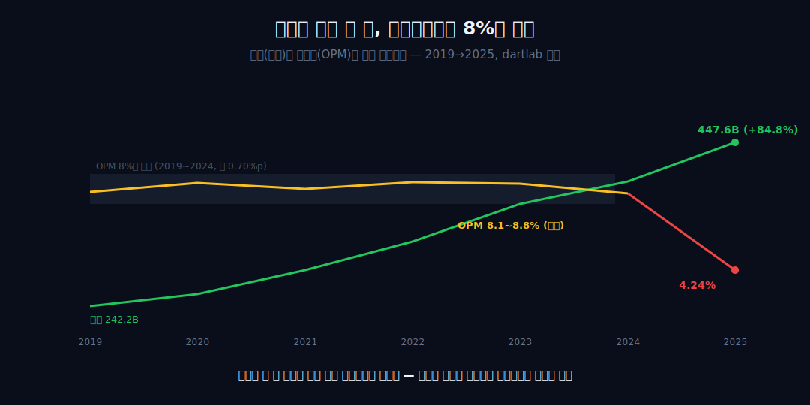
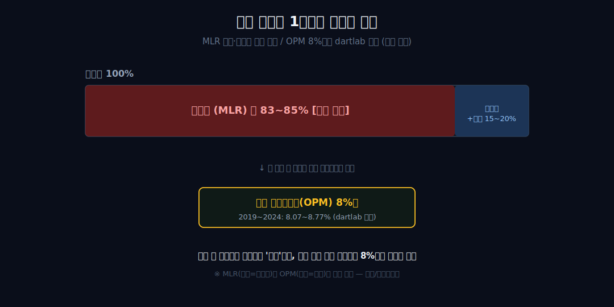
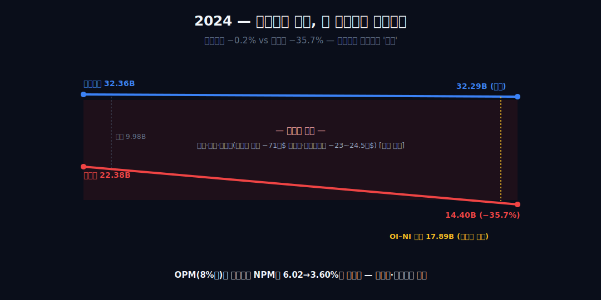
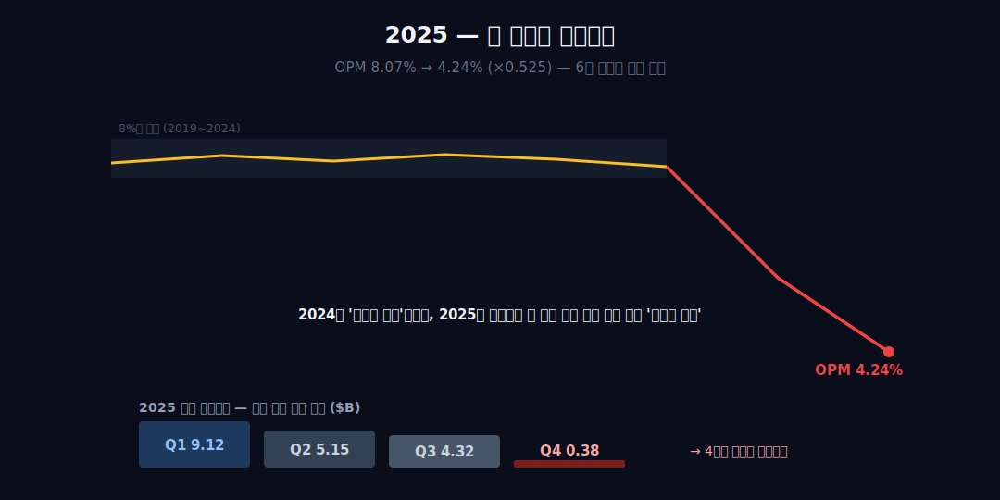
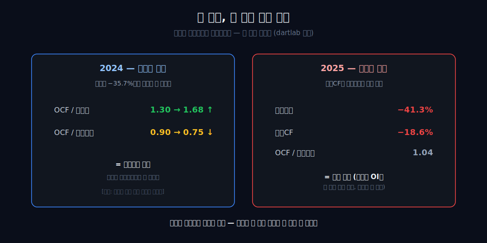
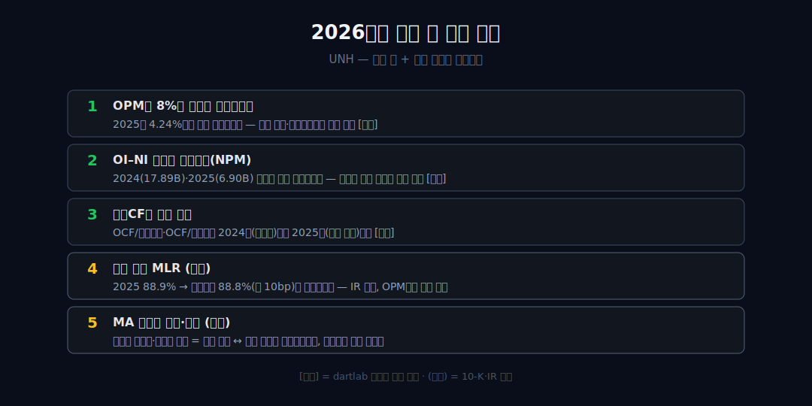

<script>
import ComboChart from '$lib/components/blog/ComboChart.svelte';
import StackBar from '$lib/components/blog/StackBar.svelte';
</script>

> **데이터 기준**: 2026-06-20 dartlab 실측 — UnitedHealth Group(UNH) **미국 연결(USD)** 기준, 분기 데이터를 역년으로 합산. 의료비율(MCR)·Optum 세그먼트·개별 일회성 항목(브라질 매각·사이버공격·메디케어 이용률)은 연결 손익에 분해되지 않으므로 **10-K·10-Q·IR 공식자료**로 분리 표기하며 dartlab 연결로는 증명되지 않는다. ※대차대조표 항목은 매핑이 불안정해 인용에 주의.
>
> **핵심 숫자**: 매출 **242.2 → 447.6B** (2019→2025 **+84.8%**) · 영업이익률(OPM) **8.07~8.77% 박스**(2019~2024) → **4.24%**(2025) · 2024 순이익 **−34.1%**(영업선 아래) · 2025 영업이익 **−41.3%**(영업선 자체)
>
> **이 글의 용어**: OPM(영업이익률)·NPM(순이익률) = 별개 비율, 절대 섞지 않음 · OI–NI 간극 = 영업이익에서 순이익으로 내려오며 빠지는 금액 · OCF/OI·OCF/NI = 영업현금흐름이 영업이익·순이익의 몇 배인지 · '영업선 아래' = 이자·세금·일회성 항목이 자리한 영업이익 하단 · 정합/양립 = 데이터가 인과를 증명 못 해 '같이 일어난 두 관찰'까지만 두는 것.

---

## 프롤로그 — 매출이 두 배가 되면, 보통은 이익률도 따라 두꺼워진다

보통 "매출이 두 배가 되면 이익도 그만큼 커진다"고 믿는다. 그런데 유나이티드헬스는 6년간 매출이 242.2B에서 447.6B로 **+84.8%**, 거의 두 배가 됐는데도 영업이익률은 8.13 → 8.72 → 8.34 → 8.77 → 8.71 → 8.07%, 단 한 번도 9%를 넘지 못하고 8%대 좁은 박스 안에서만 움직였다.



마진 띠가 두꺼워지지 않았다는 건, 늘어난 매출이 자기 몫이 아니라 거의 그대로 통과하는 비용이었다는 관찰과 정합한다. 더 흥미로운 건 그 평평한 띠가 무너진 방식이다 — 2024년과 2025년, 같은 회사가 손익계산서의 **서로 다른 '층'**에서 부러졌다.

관통선은 둘이다. 하나, 외형이 두 배가 돼도 마진 띠는 8%대에 잠겨 있었다(연결이 증명). 둘, 그 띠가 깨질 때조차 *어느 층에서 깨졌는지*가 두 해 달랐고, 현금의 흔적마저 정반대였다. 이 글은 손익계산서를 위에서 아래로 흐르는 한 줄이 아니라 **'층(layer)'**으로 읽는다.


---

## 1막 — 두 배가 된 몸집, 두꺼워지지 않은 띠

**매출이 +85% 불어나는 동안, 왜 영업이익률은 8%대 한 줄에서 거의 움직이지 않았나.** 먼저 인과 없이 관찰만 못 박는다.

```python
import dartlab
c = dartlab.Company("UNH")
c.select("IS", ["매출액", "영업이익"], freq="Q")  # 분기→역년 합산
```

매출은 242.2B에서 447.6B로 **+84.8%**, 거의 두 배가 됐다. 그런데 영업이익률(OPM)은 2024년까지 6년간 8.07~8.77% 사이, **최대폭 0.70%포인트** 안에서만 움직였다. 절대 영업이익은 19.68B에서 32.36B로 +64%나 늘었지만, *비율*은 거의 잠겨 있었다 — 몸집을 키우는 것이 곧 몫의 폭을 키우는 것은 아니었다.

이 '평평함'이 이 회사 손익의 출발점이다. 외형이 커질수록 마진을 *일부러* 얇게 묶어 두는 [코스트코](/blog/COST-costco)나, 박리 마진(약 4%)을 6년 내내 지킨 [월마트](/blog/WMT-walmart)처럼, 유나이티드헬스도 외형과 마진율이 따로 논다. 다만 그 띠의 *얇음*은 유통의 박리와는 다른 이유에서 나온다.

---

## 2막 — 띠가 얇은 이유는 손익 구조 안에 있다

**이 8%대 천장은 경영 성과가 만든 것인가, 아니면 業의 형태가 미리 그어 놓은 것인가.** 내부 수치로는 '영업단에서 거의 다 빠진다'까지만 말할 수 있다.

매출(+84.8%)과 영업이익(+64.4%)이 나란히 커지는 동행이 그 흔적이다. 매출이 늘어난 만큼 영업단까지 거의 비례해 빠져나가니, 남는 비율이 8%대에 고정된다. 여기서부터는 외부 라벨이 필요하다.

**[외부 인용]** 미국 ACA(건강보험개혁법)는 보험사가 받은 보험료의 80~85%를 의료비로 쓰도록 *법으로* 강제하고, 미달 시 가입자에게 리베이트를 환급하게 한다(KFF·NAIC). 행정비와 이익을 합쳐 15~20% 안에서만 움직이도록 천장이 씌워져 있는 셈이다. **[외부 인용]** 이 천장의 이름이 의료손해율(MLR)이며, UNH 전사 MLR은 2023년 83.2%였다(UnitedHealth IR).



여기서 경계를 그어야 한다. 내부의 'OPM 8%대 고정'과 외부의 'MLR 규제 천장'은 분모·분자가 다른 **별개 비율**이고, 둘은 정합/양립할 뿐이다 — 외부가 내부 박스의 원인이라고 단정하지 않는다. 연결 손익이 증명하는 건 '띠가 얇고 평평하다'는 결과까지다. 그러면 이제 진짜 질문 — 그 평평한 띠가 *어떻게* 깨졌나.

---

## 3막 — 첫 골절은 영업선 '아래'에서 났다 (2024)

**2024년 영업이익은 멀쩡한데 순이익만 크게 꺾였다 — 균열은 어느 층에서 시작됐나.** 영업선 위가 아니라 '아래'다.

```python
c.select("IS", ["영업이익", "당기순이익"], freq="Q")  # 2024: OI 평탄, NI 급락
```

2024년 영업이익은 32.36B에서 32.29B로 달러 기준 사실상 평탄했다(OPM은 8.71%→8.07%로 0.64%포인트 미끄러짐 — '멀쩡'이 아니라 '달러 평탄·마진 소폭 하락'). 그런데 순이익만 23.14B에서 15.24B로 **−34.1%** 무너졌다. 영업이익률(OPM)은 8%대 박스를 지켰는데 순이익률(NPM)만 6.23%에서 3.81%로 급락한 것이다.

이건 OI–NI 간극이 9.22B에서 **17.05B**로 벌어진 내부 산술에서 직접 도출된다. 영업이익에서 순이익으로 내려오는 길에 평소의 두 배 가까운 돈이 빠졌다 — 첫 균열은 영업선 위가 아니라 그 *아래*에서 났다.



**[외부 인용]** 그 간극을 키운 외부 항목은 브라질 Amil 매각 손실 약 71억 달러(대부분 비현금 외화환산)와 Change Healthcare 사이버공격 비용 약 23~24.5억 달러다(Healthcare Dive·Cybersecurity Dive). 이는 영업선 *아래*의 비영업·일회성 성격이라, '영업이익 평탄·순이익만 급락'이라는 내부 관찰과 정합한다. 실제로 2024년 1분기는 순손실 −1.41B였다(분기 실측). 단, 그 구체 항목들은 전부 외부 인용이고 연결 손익으로는 '간극이 영업선 아래에서 벌어졌다'는 위치까지만 단언한다.

---

## 4막 — 두 번째 골절은 띠 자체를 찢었다 (2025)

**2025년엔 균열이 왜 한 층 위로, 영업선 자체로 올라왔나.** 골절선이 이동한다.

2025년엔 영업이익이 32.29B에서 18.96B로 **−41.3%** 무너지며 OPM이 8.07%에서 4.24%로, 6년 박스를 처음으로 뚫고 정확히 반토막(×0.525) 났다. 2023년 정점(32.36B) 대비로도 −41.4%다. 2024가 '영업선 아래'였다면 2025는 '영업선 자체'다 — 통과하는 돈 대비 자기 몫의 폭이 처음으로 깨졌고, NPM도 3.81%에서 2.86%로 따라 내려갔다.




같은 '추락'이 아니라 서로 다른 골절선이라는 게 이 막의 핵심이며, 이 위치 구분은 외부 인과를 빌리지 않고 OPM·NPM의 내부 수치 위치만으로 성립한다. 그리고 그 붕괴는 한 번에 온 게 아니다 — 2025년 분기 영업이익은 9.12 → 5.15 → 4.32 → **0.38**B로, 해를 따라 점진적으로 식어 4분기엔 사실상 손익분기까지 내려갔다(분기 실측).

**[외부 인용]** 그 본체 균열의 외부 정체는 메디케어 어드밴티지(MA) 가입자 이용률이 회사 전망의 약 2배로 급등하고(CNBC), 전사 조정 MLR이 88.9%로 전년 대비 약 340bp 상승한 것이다(UnitedHealth IR). 내부 OPM 붕괴와 외부 MLR 상승은 양립까지만 — 한쪽이 다른 쪽을 만들었다고 비약하지 않는다.

---

## 5막 — 두 골절은 현금의 흔적까지 정반대였다

**두 번 부러지는 동안 현금(영업CF)은 회계이익을 따라갔나, 배신했나.** 단선적으로 '현금은 떠나지 않았다'는 틀렸다 — 두 골절은 현금 서명(signature)이 정반대다.

```python
c.select("CF", ["영업활동현금흐름"], freq="Q")  # 두 해의 현금 서명 비교
```

**2024년**: 순이익이 −34.1% 빠질 때 영업CF는 −16.8%만 줄었다. 그래서 OCF/영업이익은 0.90에서 0.75로 *오히려* 떨어졌지만, OCF/순이익은 1.26에서 **1.59**로 올라갔다. 즉 2024년 순이익 급락은 현금이 덜 따라간 '비현금성' 타격이었다 — 현금이 회계이익보다 덜 흔들렸다. **[외부 인용]** 이는 71억 브라질 매각 손실이 대부분 비현금이라는 외부 설명과 정합한다(Healthcare Dive).

**2025년**: 영업CF가 −18.6%로 영업이익(−41.3%)과 *함께* 빠졌고, OCF/영업이익은 1.04로 회복됐다(영업이익이 더 깊이 빠진 탓의 비율 효과다 — 현금이 좋아진 게 아니다).



회계 균열의 층이 달랐듯, 현금이 그 균열을 따라갔는지도 두 해가 달랐다. 여기까지는 '현금과 회계이익의 분기'라는 관찰이고, 어느 해가 더 우량한지 판정은 하지 않는다(영업CF가 영업이익보다 작은 건 발생주의와 현금주의의 정상적 차이일 수 있다).

---

## 6막 — 다음 골절은 어느 층에서 날 것인가

**얇은 띠 + 그 띠가 어느 층에서 깨지느냐 — 이 프레임으로 2026을 어떻게 지켜보나.** 이 회사 손익은 이 두 줄로 요약된다.

2024는 영업선 *아래*(비현금성, OCF/순이익↑), 2025는 영업선 *자체*(현금 동반, OPM 반토막) — 같은 회사가 2년 연속 다른 층에서, 다른 현금 흔적을 남기며 부러졌다. **[외부 인용]** 회사가 Optum(의료서비스·약국·데이터)으로 '지불자이자 공급자'가 되는 수직통합을 택한 것이 이 충격을 흡수할지 증폭할지는(Health Affairs) 내부 연결 손익만으로는 세그먼트가 분해되지 않아 답할 수 없다 — 모르는 것을 아는 척하지 않는다.


**[외부 인용]** 회사는 2026년 조정 MLR을 88.8%로 가이던스해 2025년(88.9%) 대비 단 10bp 개선에 그쳐, 마진 회복이 매우 점진적임을 시사한다(UnitedHealth 2026 Outlook). 이건 예측도 목표가도 아니다.

정리하면 — 이 글이 내릴 수 있는 유일한 결론은 이렇다. **매출 두 배가 마진 두 배가 되지 못하는 구조에서, 균열의 무게보다 균열의 *위치*가 더 많은 걸 말한다.** 마진율이 외형과 따로 노는 점에선 [애플](/blog/AAPL-apple)·[코스트코](/blog/COST-costco)의 사촌이고, 사상 최대 매출의 해에 마진이 무너진 점에선 [스타벅스](/blog/SBUX-starbucks)의 거울이다. 다음 균열이 영업선 위에서 날지 아래에서 날지를 손익계산서 높이로 읽는 프레임을 남기고 닫는다.

---

## 2026 Q1 업데이트 — 박스에 돌아온 것처럼 보이는 숫자, 그러나 다른 균열

2026년 1분기 공식자료를 붙이면 유나이티드헬스의 그림은 더 복잡해진다. 표면만 보면 회복처럼 보인다. consolidated revenue는 111.721B$로 전년 동기 대비 +2%, consolidated earnings from operations는 8.990B$로 -1%, consolidated operating margin은 8.0%였다. 2025년 연간 OPM 4.24%와 비교하면, 마치 8%대 박스로 돌아온 것처럼 보인다.

하지만 이 문장은 절반만 맞다. 2026Q1은 분기 숫자이고, 2025년 4.24%는 역년 합산 숫자다. 같은 기간이 아니다. 2025년은 해를 따라 영업이익이 9.12B$→5.15B$→4.32B$→0.38B$로 무너진 해였고, 2026Q1은 그 다음 첫 분기다. Q1 하나가 박스 안에 들어왔다고 해서 연간 박스가 복원됐다고 쓰면 기간을 섞는 것이다.

그래도 Q1은 중요한 신호다. 왜냐하면 2025년의 두 번째 골절이 영업선 자체였기 때문이다. 영업이익이 실제로 돌아오는지, 의료비율이 안정되는지, Optum이 같이 회복되는지를 확인해야 했다. 공식자료는 일부는 긍정, 일부는 경고를 준다.

UnitedHealthcare 부문은 좋아졌다. Q1 UnitedHealthcare revenue는 86.265B$, earnings from operations는 5.694B$였다. 전년 동기 대비 revenue는 +2%, earnings from operations는 +9%다. 영업마진도 6.2%에서 6.6%로 올라갔다. 가격 재조정, Medicaid rate update, fee-based commercial 성장, favorable reserve development가 함께 작동했다는 회사 설명과 숫자가 맞물린다. 이쪽만 보면 2025년의 균열이 봉합되는 듯하다.

문제는 Optum이다. Optum revenue는 63.749B$로 전년 동기와 거의 같았고, earnings from operations는 3.296B$로 전년 동기 3.893B$에서 -15% 줄었다. Optum Health는 revenue 24.109B$(-3%), earnings from operations 1.141B$(-19%)였다. Optum Insight도 earnings from operations가 -17%, Optum Rx도 -10%였다. 즉 보험 쪽이 올라오는 동안, 수직통합의 다른 축이 내려갔다. 이게 2026Q1을 단순 회복이라고 부르지 못하는 이유다.

이제 이 글의 프레임으로 다시 읽어 보자. 2024년 골절은 영업선 아래였다. 2025년 골절은 영업선 자체였다. 2026Q1은 영업선 자체가 전사 기준으로 8% 근처에 돌아왔지만, 그 안쪽에서 균열 위치가 부문별로 갈라졌다. UnitedHealthcare는 나아지고, Optum은 후퇴했다. 전사 8.0%라는 숫자는 두 힘의 평균이다. 평균은 회복처럼 보이지만, 안쪽 구조는 아직 닫히지 않았다.

### MCR 83.9%는 회복 신호지만, OPM이 아니다

UnitedHealth의 Q1 release는 medical cost ratio(MCR) 83.9%를 제시했다. 전년 동기 대비 90bp 낮아졌다. 이 숫자는 보험업에서 중요하다. 받은 보험료 중 의료비로 나간 비중이 낮아졌다는 뜻이기 때문이다. 2025년에 의료비용이 통제되지 않아 OPM 박스가 무너졌다는 글의 관점에서는 긍정 신호다.

그러나 MCR을 OPM처럼 쓰면 안 된다. MCR은 의료비 비율이고, OPM은 매출에서 모든 영업비용을 뺀 뒤 남는 비율이다. 같은 방향으로 움직일 수는 있지만 같은 지표가 아니다. Q1에서 MCR은 좋아졌지만 operating cost ratio는 13.8%로 전년 동기 12.4%보다 높아졌다. 의료비율이 좋아진 일부를 운영비율 상승이 먹은 셈이다. 그래서 consolidated operating margin은 8.3%에서 8.0%로 오히려 30bp 낮아졌다.

이 조합이 중요하다. 의료비율만 보면 좋아졌다. 전사 OPM만 보면 아직 전년 동기보다 낮다. UnitedHealthcare만 보면 좋아졌다. Optum까지 보면 전사 이익은 제자리다. 즉 Q1은 하나의 숫자로 요약할 수 없다. "MCR 개선"과 "Optum 압박"이 동시에 존재한다.

### Medicare Advantage 가입자 감소는 매출보다 질의 문제다

공식자료에서 가장 조심해서 봐야 할 줄은 Medicare Advantage다. 회사 발표는 2026년 1분기 중 Medicare Advantage 가입자가 965,000명 감소했다고 설명한다. 10-Q 표 기준으로도 Medicare Advantage served는 2025년 3월 8.245M에서 2026년 3월 7.555M으로 690k 줄었다. 숫자 기준이 다르니 두 값을 섞지 않는다. 하나는 분기 중 변동 설명이고, 하나는 전년 동기 말 대비 표다. 둘 다 같은 방향, 즉 가입자 축소를 말한다.

가입자 감소는 나쁜 것처럼 보이지만, 의료보험에서는 항상 그렇게 단순하지 않다. 수익성이 낮은 가입자를 줄이고 가격을 재조정하면 매출 성장률은 낮아져도 margin은 좋아질 수 있다. 실제 Q1 UnitedHealthcare Medicare & Retirement revenue는 42.082B$로 +1%에 그쳤다. 그런데 UnitedHealthcare earnings from operations는 +9%였다. 적어도 Q1만 보면 규모보다 가격·mix가 더 중요해진 그림이다.

그래서 다음 질문은 "가입자가 줄었는데 매출이 왜 안 무너졌나"가 아니다. 질문은 "가입자를 줄여서 얻은 margin 회복이 Optum의 이익 감소와 전사 운영비 상승을 덮을 만큼 충분한가"다. 이 질문이 2026년의 핵심이다. 의료보험 회사에서 좋은 축소는 수익성 개선을 동반한다. 나쁜 축소는 규모와 bargaining power를 같이 잃는다. Q1만으로는 둘 중 하나를 확정할 수 없다.

### Optum은 방어막인가, 새 균열인가

UNH를 단순 보험회사로 보지 않게 만든 자산이 Optum이다. Optum Health, Optum Insight, Optum Rx는 보험료를 받아 의료비로 내보내는 통과형 구조를 넘어, 의료서비스·데이터·약국관리까지 붙이는 수직통합의 장치다. 그래서 2025년의 영업선 골절을 볼 때도 "Optum이 충격을 흡수할까, 오히려 증폭할까"가 핵심 질문이었다.

2026Q1은 이 질문에 불편한 답을 준다. Optum 전체 earnings from operations는 -15%다. Optum Health는 value-based care members 감소와 elevated medical cost trends의 영향을 받았다. Optum Insight는 투자와 restructuring, business services volume 약세가 눌렀다. Optum Rx도 영업이익이 줄었다. 세 축이 모두 다른 이유로 약해졌다. 수직통합이 자동 방어막이라는 주장은 Q1 숫자만으로는 성립하지 않는다.

물론 이것도 반대로 과장하면 안 된다. Optum revenue는 여전히 63.749B$다. 전사 매출에서 제거되는 내부거래가 크기 때문에 단순 합산으로 회사 크기를 말하면 안 되지만, Optum은 여전히 거대한 사업이다. Q1의 문제는 존재 여부가 아니라 margin이다. Optum이 커서 좋은 것이 아니라, 커진 Optum이 의료비율 상승 국면에서 전사 margin을 안정시킬 수 있어야 좋다. 2026Q1은 그 시험을 아직 통과하지 못했다.

### receivables financing과 portfolio divestiture는 보조 신호다

UNH 2026Q1 10-Q에는 손익 외에도 눈여겨볼 줄이 있다. 회사는 3.3B$ 규모의 364일 receivables financing facility를 갖고 있고, Q1에 585M$의 receivables를 매각했다. 또한 2025년 전략적 검토로 분류된 일부 사업 매각과 관련해 2026Q1에 net gain 230M$를 인식했다. 이것들은 본문 결론을 바꿀 중심 숫자는 아니지만, 2026년을 읽을 때 회계와 현금의 층을 나누는 데 유용하다.

receivables financing은 영업현금흐름의 timing을 건드릴 수 있다. 사업이 돈을 못 번다는 뜻은 아니지만, 운전자본이 언제 현금으로 들어오는지의 표면을 바꾼다. portfolio divestiture gain은 영업 구조를 정리하는 과정의 흔적이다. 2025년의 골절 이후 회사가 자산과 사업을 다시 추리고 있다는 뜻이다. 그래서 2026년의 UNH는 순수한 보험 가격 재조정만 보는 회사가 아니다. 운전자본, 사업 매각, Optum 재정렬까지 함께 봐야 한다.

### 2026Q1이 이 글의 결론을 어떻게 바꾸나

기존 결론은 "두 골절의 위치를 읽어라"였다. 2026Q1 이후 결론은 더 구체적이다. "전사 OPM이 8% 근처에 돌아와도, 부문별 균열이 닫혔는지 확인하라." 전사 평균은 좋아 보일 수 있다. 하지만 UnitedHealthcare와 Optum이 반대 방향으로 움직이면, 평균은 다음 균열을 숨긴다.

따라서 다음 분기에서 볼 표는 네 줄이다. UnitedHealthcare operating margin, Optum operating margin, MCR, operating cost ratio. 이 네 줄이 동시에 좋아져야 진짜 회복이다. MCR만 좋아지고 Optum이 약하면 회복은 보험 가격 재조정에만 기대는 것이다. Optum만 좋아지고 MCR이 나빠지면 의료비율 문제가 다시 올라온다. 두 줄 모두 좋아지고 operating cost ratio가 내려가야 2025년의 영업선 골절이 봉합됐다고 말할 수 있다.

이 관점에서 UnitedHealth는 아직 "회복한 회사"가 아니라 "회복 조건이 숫자로 드러나기 시작한 회사"다. Q1은 좋은 첫 답안이지만, 답안지가 네 과목으로 나뉘어 있다. 보험, Optum, 의료비율, 운영비율. 한 과목만 잘 보면 다음 골절을 놓친다.

### Q1을 연간 회복으로 번역할 때 생기는 세 가지 함정

첫 번째 함정은 run-rate다. Q1 operating earnings 8.990B$에 4를 곱하면 35.96B$가 된다. 이 숫자는 2024년 영업이익 32.29B$보다 높고, 2025년 18.96B$보다 훨씬 높다. 하지만 이 곱셈은 회복의 증거가 아니라 확인해야 할 가설이다. 의료보험 사업은 분기별 의료비 발생, risk adjustment, 가입자 mix, 운영비 집행 timing이 다르게 잡힌다. Q1 하나를 연간화하면 "의료비율이 안정되고 Optum 압박이 완화된다"는 조건을 이미 통과한 것처럼 처리한다. 그 조건은 아직 다음 분기들이 증명해야 한다.

두 번째 함정은 segment 합산이다. UnitedHealthcare revenue 86.265B$와 Optum revenue 63.749B$를 더하면 전사 revenue 111.721B$보다 훨씬 크다. 내부거래 제거 때문이다. 따라서 두 부문 매출을 단순 합산해 회사 크기를 말하면 안 된다. 부문별 표는 "어디서 이익이 생겼나"를 보여주는 지도이지, 전사 매출을 다시 만드는 공식이 아니다. 이 점을 놓치면 Optum의 크기를 과장하거나 UnitedHealthcare의 회복을 중복 계산하게 된다.

세 번째 함정은 MCR 하나로 회복을 선언하는 것이다. MCR 83.9%는 분명 좋아진 숫자다. 하지만 operating cost ratio가 13.8%로 올라가면서 전사 operating margin은 전년 동기보다 낮아졌다. 보험회사의 손익은 의료비율만으로 닫히지 않는다. 청구·관리·기술·통합 비용이 같이 움직인다. 2025년의 골절이 의료비용에서 시작됐더라도, 2026년의 봉합은 운영비율까지 같이 안정될 때만 완성된다.

그래서 이 글은 Q1을 "회복의 시작"으로는 읽되 "회복 완료"로는 읽지 않는다. 숫자는 좋아진 곳을 분명히 보여준다. UnitedHealthcare margin은 올라갔고, MCR은 내려갔고, OCF는 8.9B$로 강했다. 동시에 숫자는 약해진 곳도 숨기지 않는다. Optum earnings는 줄었고, operating cost ratio는 올라갔고, MA 가입자는 줄었다. UNH는 한 줄 요약을 거부하는 회사다. 다음 분기의 핵심은 좋은 줄이 늘어나는지가 아니라, 서로 반대 방향으로 움직이던 줄들이 같은 방향으로 정렬되는지다.

---

## 2026년에 봐야 할 다섯 가지

1. **전사 OPM이 8%대를 연간으로 유지하는가** — 2026Q1 consolidated operating margin은 8.0%다. 분기 회복이 연간으로 이어지는지 확인한다.
2. **MCR과 operating cost ratio가 동시에 좋아지는가** — Q1 MCR 83.9%는 좋아졌지만 operating cost ratio 13.8%는 높아졌다. 한 줄만 좋아져서는 부족하다.
3. **UnitedHealthcare와 Optum이 같은 방향으로 움직이는가** — Q1 UnitedHealthcare 영업이익은 +9%, Optum 영업이익은 -15%였다. 이 반대 방향이 지속되면 전사 평균은 착시가 된다.
4. **MA 가입자 축소가 margin 회복을 동반하는가** — 가입자 감소 자체보다 수익성 낮은 book을 줄였는지가 중요하다. 매출 둔화와 margin 회복을 같이 본다.
5. **OCF와 receivables financing의 관계** — Q1 OCF 8.9B$와 receivables financing facility를 같이 봐야 현금 서명의 질을 읽을 수 있다.



---

## 공시 / Filings

- [UnitedHealth Group 2026 Q1 results](https://www.unitedhealthgroup.com/content/dam/UHG/PDF/investors/2026/unh-reports-first-quarter-2026-results.pdf) — 2026년 1분기 공식 실적자료. consolidated revenue 111.7B$, operating cash flow 8.9B$, MCR 83.9%, operating cost ratio 13.8% 확인용.
- [UnitedHealth Group FY2026 Q1 Form 10-Q](https://www.sec.gov/Archives/edgar/data/731766/000073176626000127/unh-20260331.htm) — 2026년 3월 31일 종료 분기 10-Q. 부문별 revenue, earnings from operations, margin, Medicare Advantage served, receivables financing 확인용.
- [UnitedHealth Group investor reports](https://www.unitedhealthgroup.com/investors/financial-reports.html) — 연간·분기 보고서의 공식 입구.
- [UnitedHealth Group SEC company filings](https://www.sec.gov/cgi-bin/browse-edgar?action=getcompany&CIK=0000731766) — 10-K, 10-Q, 8-K 원문 확인용.

---

## 재무제표 — 최근 6개년 (dartlab 연결, $B)

미국 연결(USD)·분기 합산(역년) 기준. dartlab에서 직접 확인:

```python
import dartlab
c = dartlab.Company("UNH")
c.select("IS", ["매출액","영업이익","당기순이익"], freq="Q")
c.select("CF", ["영업활동현금흐름"], freq="Q")
```

| 항목 ($B) | 2020 | 2021 | 2022 | 2023 | 2024 | 2025 |
|---|---:|---:|---:|---:|---:|---:|
| 매출 | 257.1 | 287.6 | 324.2 | 371.6 | 400.3 | 447.6 |
| 영업이익 | 22.41 | 23.97 | 28.43 | 32.36 | 32.29 | 18.96 |
| 당기순이익 | 15.40 | 17.29 | 20.12 | 23.14 | 15.24 | 12.81 |
| 영업이익률(OPM) | 8.72% | 8.34% | 8.77% | 8.71% | 8.07% | 4.24% |
| 순이익률(NPM) | 5.99% | 6.01% | 6.21% | 6.23% | 3.81% | 2.86% |
| 영업현금흐름 | 22.17 | 22.34 | 26.21 | 29.07 | 24.20 | 19.70 |

<ComboChart data={[{year:"2020",매출:257.1,영업이익:22.41,당기순이익:15.40},{year:"2021",매출:287.6,영업이익:23.97,당기순이익:17.29},{year:"2022",매출:324.2,영업이익:28.43,당기순이익:20.12},{year:"2023",매출:371.6,영업이익:32.36,당기순이익:23.14},{year:"2024",매출:400.3,영업이익:32.29,당기순이익:15.24},{year:"2025",매출:447.6,영업이익:18.96,당기순이익:12.81}]} lineKeys={["매출"]} barKeys={["영업이익","당기순이익"]} lineColors={["#22c55e"]} barColors={["#3b82f6","#f59e0b"]} title="매출(라인) vs 영업이익·당기순이익(막대) — $B" unit="$B" />

이 표를 한 줄로 읽으면 이렇다 — 매출 행은 매년 우상향이고, OPM 행은 2024년까지 8%대에 갇혔다가 **2025년 4.24%로 박스를 이탈한다.** 그리고 NPM 행은 2024년에(영업선 아래), OPM 행은 2025년에(영업선 자체) — 두 비율이 *다른 해에* 무너진다. 이게 이 표의 핵심이다. 이 표가 증명하는 건 '두 골절의 위치'까지이고, 그 *원인*은 어디에도 안 적혀 있다(세그먼트·MLR=외부).

---

## 검증표

본문 인용 수치를 dartlab 호출과 결과로 검증한다. 외부 출처(MLR·세그먼트·일회성 항목)는 분리 표기. 📅 dartlab 실측 2026-06-14 · UnitedHealth(UNH) 미국 연결(USD)·분기 합산 기준.

| 본문 수치 | 출처 / 호출 | 결과 |
|---|---|---|
| 매출 2019 242.2B → 2025 447.6B (+84.8%) | `c.select("IS",["매출액"],freq="Q")` 합산 | ✓ 실측 |
| OPM 8.07~8.77% 박스(2019~2024), 폭 0.70%p | 영업이익÷매출 | ✓ 실측 |
| 2024 영업이익 −0.2%(32.36→32.29) vs 순이익 −34.1%(23.14→15.24) | `c.select("IS",[...])` | ✓ 실측 |
| OI–NI 간극 2023 9.22 → 2024 17.05B(최대) | 영업이익−순이익 | ✓ 실측 |
| 2025 영업이익 −41.3%, OPM 8.07→4.24%(×0.525) | `c.select("IS",[...])` | ✓ 실측 |
| 2025 분기 영업이익 9.12→5.15→4.32→0.38B | `c.select("IS",["영업이익"],freq="Q")` | ✓ 실측 |
| OCF/순이익 2024 1.26→1.59, OCF/영업이익 0.90→0.75 | `c.select("CF",["영업활동현금흐름"])` | ✓ 실측 |
| MLR 규제(보험료 80~85% 의료비 강제), UNH MLR 2023 83.2% | [KFF](https://www.kff.org/) · [UNH 10-K (SEC)](https://www.sec.gov/cgi-bin/browse-edgar?action=getcompany&CIK=0000731766&type=10-K) | 외부 인용·연결 증명 0 |
| 2024 브라질 Amil 매각 손실 ~71억$(대부분 비현금)·Change Healthcare 사이버공격 ~23~24.5억$ | [Healthcare Dive](https://www.healthcaredive.com/) · [Cybersecurity Dive](https://www.cybersecuritydive.com/) | 외부 인용·일회성 |
| 2025 MA 이용률 급등·조정 MLR 88.9%(+340bp)·2026 가이던스 88.8% | [CNBC](https://www.cnbc.com/) · [UnitedHealth IR](https://www.unitedhealthgroup.com/investors.html) | 외부 인용 |
| 2026Q1 consolidated revenue 111.721B$, earnings from operations 8.990B$, operating margin 8.0% | [UNH FY2026 Q1 Form 10-Q](https://www.sec.gov/Archives/edgar/data/731766/000073176626000127/unh-20260331.htm) | SEC filing |
| 2026Q1 UnitedHealthcare revenue 86.265B$, earnings 5.694B$, margin 6.6% | [UNH FY2026 Q1 Form 10-Q](https://www.sec.gov/Archives/edgar/data/731766/000073176626000127/unh-20260331.htm) | SEC filing |
| 2026Q1 Optum revenue 63.749B$, earnings 3.296B$, margin 5.2% | [UNH FY2026 Q1 Form 10-Q](https://www.sec.gov/Archives/edgar/data/731766/000073176626000127/unh-20260331.htm) | SEC filing |
| 2026Q1 MCR 83.9%, operating cost ratio 13.8%, OCF 8.9B$ | [UnitedHealth Group 2026 Q1 results](https://www.unitedhealthgroup.com/content/dam/UHG/PDF/investors/2026/unh-reports-first-quarter-2026-results.pdf) | 공식 실적자료 |
| Medicare Advantage served 8.245M → 7.555M, Q1 중 MA 가입자 965k 감소 | [UNH FY2026 Q1 Form 10-Q](https://www.sec.gov/Archives/edgar/data/731766/000073176626000127/unh-20260331.htm) · [UnitedHealth Group 2026 Q1 results](https://www.unitedhealthgroup.com/content/dam/UHG/PDF/investors/2026/unh-reports-first-quarter-2026-results.pdf) | 기준 분리 |
| Optum 수직통합(지불자+공급자) 흡수/증폭 여부 | [UNH 10-K (SEC)](https://www.sec.gov/cgi-bin/browse-edgar?action=getcompany&CIK=0000731766&type=10-K) | 봉인(세그먼트 미분해) |
| 통상 패턴 비교군 코스트코·월마트·애플·스타벅스 | 본 시리즈 각 글 | 정성 비교 |
| BS(대차대조표) 매핑 불안정 — 인용 주의 | dartlab 데이터 한계 | 주의/제외 |

본문의 숫자 중 이 표에 없는 것은 발행 차단 대상이다. MLR·세그먼트·일회성 항목은 dartlab 연결로 증명되지 않으며 외부 인용임을 명시한다 — 연결이 증명하는 것은 '두 골절의 위치와 현금 서명'(결과)까지이고, '왜'는 손익 밖에 있다.
