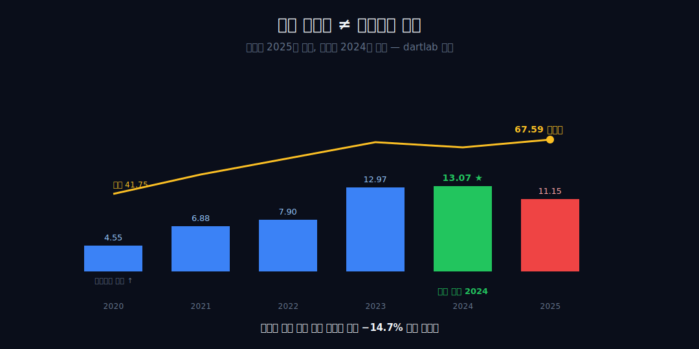
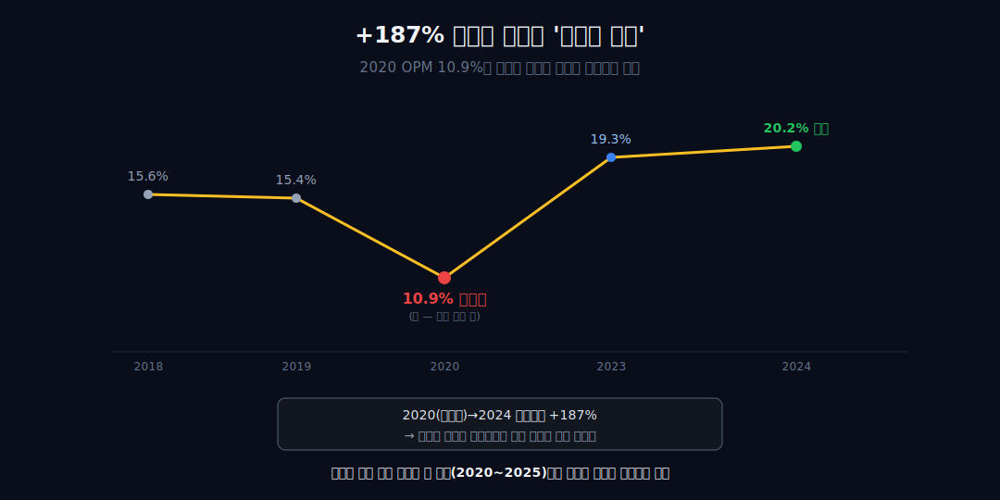
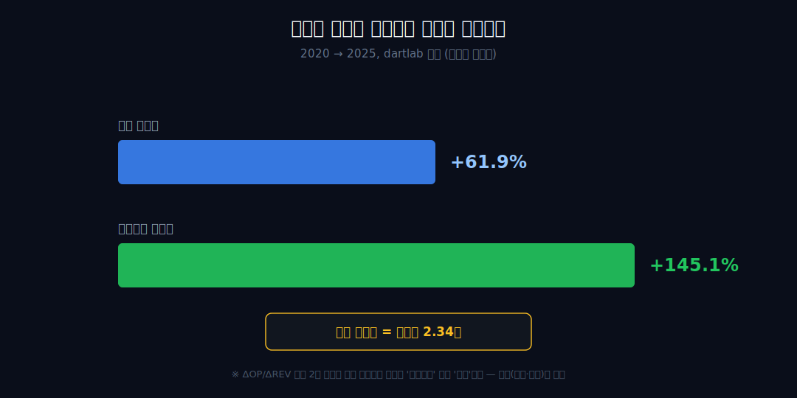
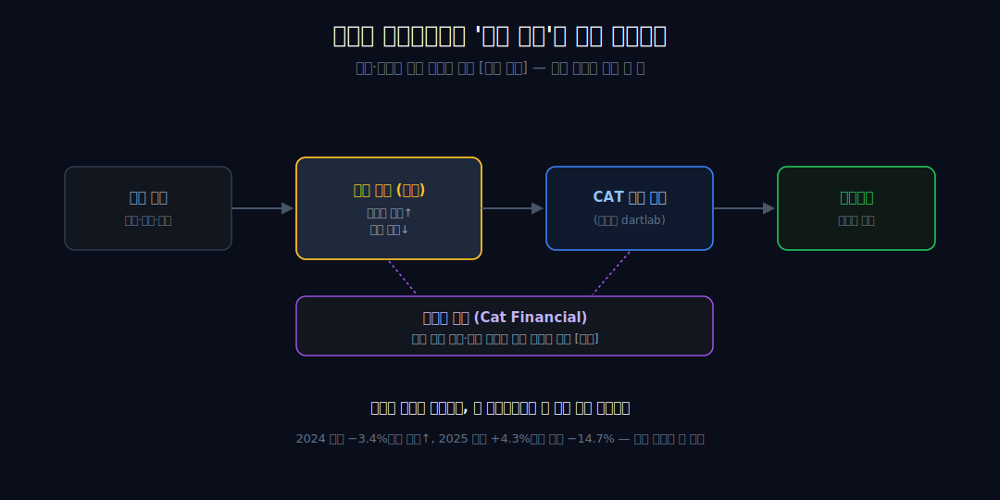
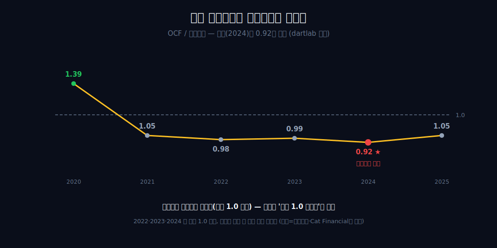

<script>
import ComboChart from '$lib/components/blog/ComboChart.svelte';
import StackBar from '$lib/components/blog/StackBar.svelte';
</script>

> **데이터 기준**: 2026-06-14 dartlab 실측 — Caterpillar(CAT) **미국 연결(USD)** 기준, 분기 데이터를 역년으로 합산. 세그먼트(Construction/Resource/Energy&Transportation/Power&Energy)·Cat Financial·딜러 재고·관세·수주잔고는 연결 손익에 분해되지 않으므로 **10-K·IR(외부 인용)**로 표기하며 dartlab 연결로는 증명되지 않는다. 글의 서사 구간은 데이터가 깨끗한 **2020~2025**로 고정한다(2018·2019 영업CF는 dartlab 결손이라 현금 논의에 인용하지 않음). ※대차대조표 항목은 매핑이 불안정해 인용에 주의.
>
> **핵심 숫자**: 매출 **41.75 → 67.59B** (2020→2025 **+61.9%**) · 영업이익 **4.55 → 11.15B** (**+145.1%**, 매출의 2.34배) · 영업이익 정점 **2024**(13.07B·OPM 20.2%) ≠ 매출 신고점 **2025**(67.59B·OPM 16.5%) · OCF/영업이익 정점 2024에 **0.92**(최약)
>
> **이 글의 용어**: OPM(영업이익률)·NPM(순이익률) = 별개 비율 · 영업 레버리지 = 고정비 위에서 매출 변동이 이익을 증폭하는 것(관찰) · OCF/OP = 영업현금흐름이 영업이익의 몇 배인가 · 트로프 = 사이클 저점 · 정합/양립 = 데이터가 인과를 증명 못 해 '같이 일어난 두 관찰'까지만 두는 것.

---

## 프롤로그 — 매출 신고점은 곧 이익 신고점일 것이다, 보통은

중장비 회사를 읽는 통념은 단순하다 — 인프라·광산 사이클이 돌면 매출이 늘고, 매출이 늘면 이익이 따라 는다. 그래서 매출 신고점은 곧 이익 신고점일 것이다.

그런데 캐터필러의 6개년 연결 손익을 그대로 펴 보면 정반대 장면이 나온다. 매출 신고점은 2025년(67.59B)인데 **영업이익 정점은 그 전 해 2024년(13.07B)**이고, 2025년 영업이익은 오히려 −14.7% 빠졌다.



관통선은 둘이다. 하나, 캐터필러의 손익은 '얼마나 파느냐(매출)'보다 *마진의 방향과 현금전환*이 정한다(연결이 증명). 둘, 그 비대칭이 *왜* 생기는지 — 딜러 재고, 캡티브 금융, 가격, 관세 — 는 연결 손익이 답하지 못한다(외부 인용·봉인). 이 글은 매출 성장률을 자랑하는 대신, 매출이 아닌 두 내부 지표(마진 방향·현금전환)로 같은 고정비 레버가 올라갈 때와 내려갈 때 왜 다르게 도는지를 심문한다.


---

## 1막 — 트로프에서 출발하는 착시

**2020년에서 2024년까지 매출은 +55%인데 영업이익은 +187%, 정말 레버리지가 '세 배'로 일한 걸까.** 절반은 착시다.

```python
import dartlab
c = dartlab.Company("CAT")
c.select("IS", ["매출액", "영업이익"], freq="Q")  # 분기→역년 합산
```

2020(매출 41.75B, 영업이익 4.55B, OPM 10.9%)에서 2024(64.81B, 13.07B, OPM 20.2%)를 이으면 매출 +55%에 영업이익 +187%, 분명한 비대칭이다. 그러나 출발점 2020 OPM 10.9%는 정상 수준이 아니다 — **[외부 인용]** 2020은 팬데믹 트로프 국면이고, 캐터필러는 광산·석유가스 하강이던 2015~2016년 90년 역사상 처음으로 매출이 4년 연속 감소했던 깊은 사이클 기업이다.



서사 골격엔 쓰지 않는 닻 2018·2019의 OPM은 각각 15.6%·15.4%로, 2020은 그보다 한참 눌린 저점이다. 즉 +187%라는 큰 배수의 절반은 '레버리지의 힘'이 아니라 '낮은 데서 출발한 기저효과'다. 사이클 저점에서 측정한 회복 배수가 실제보다 부풀어 보이는 이 함정은 깊은 사이클 기업의 고질이다 — 해운 운임이 바닥에서 천장까지 갔다 온 [HMM](/blog/011200-hmm)의 곡선을 어느 해부터 재느냐에 따라 회복률이 몇 배씩 달라지는 것과 같은 종류의 착시다. 그래서 다음 막부터는 배수를 자랑하는 대신, 사이클 전 구간(2020~2025)에서 매출과 이익이 *어떻게 어긋나는지*를 본다.

---

## 2막 — 고정비 위에서 사이클은 이익을 증폭한다

**같은 매출 변동이 왜 이익에선 두 배 넘게 증폭되나.** 고정비 위에 사이클이 얹혀 있기 때문이다.

2020→2025 매출은 41.75B에서 67.59B로 **+61.9%**인데, 영업이익은 4.55B에서 11.15B로 **+145.1%** — 이익 증가율이 매출 증가율의 2.34배다. 고정비(공장·인건비·딜러 지원)는 매출이 늘어도 비례해 늘지 않으니, 늘어난 매출의 더 큰 몫이 이익으로 떨어진다. 이게 영업 레버리지의 관찰이다.



짚어 둘 것이 있다 — 이건 *관찰된 비대칭*이지, 매출 한 단위가 이익 몇 단위를 만드는지를 정밀히 잰 값이 아니다. 연도별 증분(ΔOP/ΔREV)은 분모(매출 변동)가 작아질 때 비율이 기계적으로 튀므로, 그걸 '레버 메커니즘'으로 못 박지 않는다. **[외부 인용]** 회사 스스로는 이 증폭을 '풀스루(pull-through)'로 명문화해, 하강기 영업이익 감소를 매출 감소의 25~30% 이내로 묶고 회복기엔 큰 증분 이익을 기대한다고 밝혀 왔다(10-K·IR). 내부의 +145% 관찰과 이 외부 프레임은 정합하나, 가격·믹스 효과가 동시에 작동하므로 어느 쪽이 몇 %인지는 연결 수치로 분해할 수 없다.

---

## 3막 — 정점은 매출 정점이 아니다

**2024년 매출은 전년보다 빠졌는데 어떻게 영업이익과 OPM은 둘 다 최고치였나.** 여기서 통념이 깨진다.

2024는 매출이 67.06B에서 64.81B로 **−3.4%** 꺾였는데 영업이익은 12.97B에서 13.07B로 외려 올랐고, OPM은 19.3%에서 20.2%로 6개년 최고치를 찍었다. 통념상 매출 신고점이어야 할 이익 정점이, 실제로는 매출이 *이미 꺾인* 해에 나타난 것이다.

```python
c.select("IS", ["매출액", "영업이익"], freq="Q")  # 2024 매출↓·이익↑, 2025 매출↑·이익↓
```

마진이 매출 정점보다 한 박자 늦게 식는 '지연'이 수치로 잡힌다. **[외부 인용]** 무엇이 2024 매출을 꺾었는지의 원인 — 일부 최종시장 둔화·딜러 재고 변동 — 은 10-K 영역이며, 회사는 매출 브릿지에서 '가격 실현·판매 볼륨·딜러 재고 변동'을 각각 별도 항목으로 분해한다. 실제로 2025년 1분기 매출 둔화의 주범으로 회사가 든 것은 최종수요가 아니라 딜러 재고였다(Q1 2025 딜러 재고 증가폭이 전년 대비 약 1.3B 줄어든 스윙). 내부 수치로는 '이익이 매출보다 늦게 식는다'까지만 말할 수 있다. 그리고 이익이 매출보다 늦게 식는다면, 다음 해엔 그 지연이 청구서로 돌아온다.



---

## 4막 — 같은 레버가 거꾸로 돌 때

**2025년 매출은 오히려 +4% 늘었는데, 왜 영업이익은 두 자릿수로 빠졌나.** 올릴 때 증폭시킨 바로 그 구조가, 내릴 땐 거꾸로 돈다.

2025 매출은 64.81B에서 67.59B로 **+4.3%**, 신고점이다. 그런데 영업이익은 13.07B에서 11.15B로 **−14.7%**, OPM은 20.2%에서 16.5%로 내려앉는다. 매출이 늘었는데 이익이 빠지는 이 역설이 핵심이다 — 고정비 레버는 올릴 때 이익을 증폭시키지만, 작은 매출 변동에도 마진 방향이 뒤집히면 2년치 마진 상승분을 도로 깎는다.


하강이 상승보다 가파르게 *보인다*는 게 한 쌍의 숫자로 관찰된다(단, 두 해의 매출 변동폭이 달라 '증명'이라 부르지는 않는다). **[외부 인용]** 회사는 2025 둔화 배경으로 약 15~18억 달러 규모의 신규 관세, 불리해진 가격, 불리한 제조원가를 제시했다(4Q25 발표). 내부 비대칭과 이 외부 요인은 정합하나 인과는 단정하지 않는다. 매출이 늘어도 이익이 빠진다면, 그 줄어든 이익이라도 진짜 현금인지부터 의심해야 한다.

---

## 5막 — 정점 이익일수록 현금이 약했다

**정점 이익은 회계 착시인가 진짜 현금인가 — 그리고 그 답은 통념과 반대 아닌가.** 통념과 반대다.

흔히 '정점 이익은 현금으로도 가장 잘 회수된다'고 기대한다. 그러나 영업현금흐름/영업이익(OCF/OP)을 직접 계산하면 정반대다.

```python
c.select("CF", ["영업활동현금흐름"], freq="Q")  # OCF/영업이익 = 정점에 최약
```

| 연도 | 2020 | 2021 | 2022 | 2023 | 2024 | 2025 |
|---|---:|---:|---:|---:|---:|---:|
| OCF/영업이익 | 1.39 | 1.05 | 0.98 | 0.99 | **0.92** | 1.05 |

2022·2023·2024 세 해가 1.0 아래이고, **영업이익 정점인 2024가 0.92로 6개년 중 현금전환이 가장 약했다.** 즉 정점 이익은 발생주의 신기루는 아니다(영업CF가 영업이익에 내내 근접) — 하지만 '항상 1.0을 넘었다'는 식의 단정은 거짓이다. 오히려 이익이 가장 클 때 현금전환이 가장 낮았다는 게 이 데이터의 발견이다.



**[외부 인용]** 정점 국면의 현금전환 약화와 양립할 수 있는 외부 요인으로는 운전자본 증가와 캡티브 금융자회사 Cat Financial의 금융수취채권 흡수가 있으나, 이 분해는 연결 영업CF로는 불가능하다(10-K). 내부 수치는 'OCF/OP가 정점에 가장 낮았다'는 위치까지만 단언한다. OPM·NPM·OCF/OP 세 비율을 섞지 않고 따로 읽은 결과다.

---

## 6막 — 그래서 질문은 매출이 아니다

**투자자가 캐터필러를 읽을 때 진짜 던져야 할 한 줄짜리 질문은 무엇인가.** 매출 성장률이 아니다.

여섯 해를 한 장으로 겹쳐 보면 결론은 하나다. 2020→2025 매출 +62%에 영업이익 +145%로 이익 증가율이 매출의 2.34배였지만, 매출 신고점(2025)은 이익 정점(2024)과 어긋났고, 현금전환은 정점에서 가장 약했다. 그러니 핵심 질문은 매출 성장률이 아니라 — *지금 OPM이 어느 방향이고, OCF/OP가 1.0 위인가*다.


**[외부 인용]** 그 방향을 미리 흔드는 외부 변수 — 딜러 재고 위상, 세그먼트별 가격·물량, 2026 관세 가이던스 약 26억$, 광산·데이터센터 capex(2025말 수주잔고 약 51.2B, 발전 매출 10B 초과·+30%) — 는 전부 10-K·IR 영역이며, 연결 수치는 그것이 이익에 도달한 결과를 사후 검증할 뿐이다. 1925년 합병에서 비롯된 독립 딜러망과 그 재고를 받치는 캡티브 금융(Cat Financial)이라는 구조도 외부다.

정리하면 — 이 글이 내릴 수 있는 유일한 결론은 이렇다. **캐터필러의 손익은 매출이 아니라 마진의 방향과 현금전환이 정하고, 그 셋의 비대칭은 연결로 증명되지만 그 *원인*은 손익 밖에 있다.** 외형과 마진율이 따로 노는 점에선 [유나이티드헬스](/blog/UNH-unitedhealth)·[애플](/blog/AAPL-apple)의 사촌이고, 사이클이 마진을 정한다는 점에선 [SK하이닉스](/blog/000660-skhynix)·[삼성전기](/blog/009150-samsung-electro-mechanics)의 형제다. 매출 신고점에서 이익이 이미 꺾여 있던 2024~2025가 그 가장 선명한 사례다.

---

## 2026년에 봐야 할 다섯 가지

1. **2026 OPM의 방향** — 2024 20.2% 정점 → 2025 16.5%. 더 빠지는지, 반등하는지. 연결 매출·영업이익으로 직접 산출하는 추적점.
2. **OCF/영업이익이 1.0 위를 유지하는가** — 2024 0.92로 가장 약했던 현금전환이 2025 1.05로 회복. 2026에도 1.0 이상이면 정점-이후 운전자본 부담이 풀린 것과 양립.
3. **OPM·NPM의 격차와 방향** — 2024 OPM 20.2%/NPM 16.6%, 2025 16.5%/13.1%. 두 비율이 함께 빠지는지, 벌어지는지(영업외·세금 효과 분리 신호).
4. **2026 관세 비용의 실현치(외부)** — 가이던스 약 26억$. 이익이 매출보다 빠지는 하강 레버리지를 외부에서 얼마나 키우거나 되돌리는지. 전부 외부 인용.
5. **Power & Energy(데이터센터 발전) 수주잔고의 지속성(외부)** — 2025말 51.2B(2024말 30.0B). 이 외부 수요가 매출을 받치면 딜러 재고 메커니즘상 매출 둔화가 늦춰지는지.


---

## 2026 공식 업데이트 — 매출은 급반등했지만, 마진은 더 높은 기준을 요구한다

2026년 1분기 캐터필러 공식 자료는 이 글의 제목을 시험대에 올린다. 회사는 매출·수익이 **$17.4B**로 전년 대비 22% 늘었다고 발표했다. EPS는 **$5.47**, 조정 EPS는 **$5.54**였다. 표면만 보면 2025년에 꺾였던 이익 사이클이 다시 위로 도는 것처럼 보인다. 하지만 이 글의 기준은 매출이 아니다. 2025년의 핵심은 매출 신고점에서도 이익이 이미 꺾였다는 것이었다. 따라서 2026년 1분기의 질문은 "매출이 늘었나"가 아니라 "그 매출 증가가 마진과 현금으로 충분히 번역됐나"다.

| 2026 Q1 공식 지표 | 수치 | 전년 동기 | 이 글에서의 판정 |
|---|---:|---:|---|
| 총 매출·수익 | $17.415B | $14.249B | +22%, 외형은 강하게 반등 |
| 영업이익 | $3.085B | $2.579B | 이익도 증가했지만 매출 증가율보다 느림 |
| 영업마진 | 17.7% | 18.1% | 매출 급증에도 마진은 낮아짐 |
| 조정 영업마진 | 18.0% | 18.3% | 조정 기준도 전년보다 낮음 |
| EPS | $5.47 | 비교 기준 별도 | 주당 이익은 강함 |
| 조정 EPS | $5.54 | 비교 기준 별도 | 조정 기준도 강함 |
| Enterprise operating cash flow | $1.9B | 공개 비교 별도 | 현금 창출은 플러스 |
| Enterprise cash | $4.1B | 공개 비교 별도 | 유동성 완충 존재 |

이 표에서 가장 중요한 줄은 매출 +22%가 아니라 영업마진 **17.7%**다. 2025년 연간 OPM **16.5%**보다는 높지만, 전년 동기 **18.1%**보다 낮고, 2024년 연간 정점 **20.2%**에는 못 미친다. 다시 말해 2026년 1분기는 매출이 크게 반등한 분기이지, 마진이 정점 체력으로 복귀한 분기라고 말하기는 어렵다. 캐터필러가 사이클 기업이라는 점을 생각하면 이 차이가 중요하다. 매출은 딜러 재고, 출하 타이밍, 가격, 대형 프로젝트에 빠르게 반응하지만, 마진은 비용·믹스·가격 실현·생산 효율의 결과다.

10-Q는 이 차이를 더 구체적으로 보여 준다. 매출 증가는 주로 판매 물량 **$2.3B** 증가와 가격 실현 **$426M** 효과에서 왔다. 회사는 더 높은 물량이 딜러 재고와 최종 사용자 장비 판매에서 비롯됐다고 설명했다. 세그먼트별로는 Construction Industries 매출이 **$7.161B**로 38% 늘었고, Power & Energy 매출은 **$7.031B**로 22% 늘었다. 반면 Resource Industries 매출은 **$3.797B**로 4% 증가에 그쳤다. 이처럼 2026년 1분기의 외형 성장은 균일하지 않다. 어느 세그먼트가 밀고, 어느 세그먼트가 끌리는지의 차이가 있다.

```python
revenue_2026_q1 = 17.415
op_income_2026_q1 = 3.085
revenue_2025_q1 = 14.249
op_income_2025_q1 = 2.579

opm_2026_q1 = op_income_2026_q1 / revenue_2026_q1
opm_2025_q1 = op_income_2025_q1 / revenue_2025_q1
incremental_margin = (op_income_2026_q1 - op_income_2025_q1) / (revenue_2026_q1 - revenue_2025_q1)
print(opm_2026_q1, opm_2025_q1, incremental_margin)
```

단순 증분마진은 약 16% 수준이다. 이 숫자를 과장하지 않는다. 분기별 증분마진은 믹스와 비용 인식 타이밍에 크게 흔들리고, 2점 계산은 분모가 작을수록 불안정하다. 하지만 방향을 읽는 데는 도움이 된다. 매출은 $3.166B 늘었고, 영업이익은 $0.506B 늘었다. 매출 증가가 이익으로 번역되긴 했지만, 전년 동기 마진을 끌어올릴 만큼 두껍지는 않았다. 이것이 2026년 1분기 공식 자료를 붙인 뒤에도 이 글의 결론이 유지되는 이유다.

---

## 원래 질문에 겹쳐 읽기 — 신고점보다 중요한 것은 매출의 질이다

2025년 글의 핵심은 캐터필러가 2025년에 매출 신고점을 찍었지만 영업이익 정점은 2024년에 이미 지나갔다는 점이었다. 2026년 1분기 매출 +22%는 이 결론을 약화시키는 게 아니라 오히려 더 까다롭게 만든다. 매출이 크게 늘었는데도 영업마진이 전년보다 낮다면, 매출 증가 그 자체만으로 사이클 회복을 말할 수 없기 때문이다. 캐터필러에서 좋은 매출은 단순한 출하 증가가 아니라 가격, 믹스, 원가, 딜러 재고, 금융부문이 함께 버텨 주는 매출이다.

세그먼트별 이익도 같은 이야기를 한다. 2026년 1분기 Construction Industries 이익은 **$1.535B**로 전년 **$1.024B**보다 50% 늘었다. Power & Energy 이익은 **$1.450B**로 13% 늘었다. 그러나 Resource Industries 이익은 **$378M**로 전년 **$623M**보다 39% 줄었다. 총 매출이 +22%였다는 한 줄만 보면 이 차이가 사라진다. 실제로는 한쪽 엔진이 세게 밀고, 다른 쪽은 이익을 깎았다. 캐터필러를 매출 하나로 읽으면 위험한 이유다.

Power & Energy의 성장은 특히 중요하다. 발전 수요, 데이터센터 전력, 에너지 인프라가 캐터필러의 새 고성장 축으로 읽힐 수 있기 때문이다. 2026년 1분기 Power Generation 외부 매출은 **$2.817B**로 전년 **$1.996B**보다 크게 늘었다. 이 숫자는 데이터센터·전력 투자 서사와 잘 맞는다. 그러나 여기서도 원인 단정은 금지다. 10-Q는 세그먼트별 매출과 이익을 제공하지만, 그 안에서 데이터센터가 얼마인지, 가격이 얼마인지, 딜러 재고가 얼마인지까지 연결 손익이 직접 증명하지 않는다. 따라서 이 글에서는 "Power & Energy가 매출을 받쳤고, 발전 관련 매출 증가와 양립한다"까지만 쓴다.

딜러 재고는 2026년 업데이트에서 특히 중요하다. 회사는 1분기 매출 증가의 배경으로 딜러 재고와 최종 사용자 장비 판매를 같이 언급했다. 딜러 재고가 늘면 제조사는 최종 수요보다 먼저 매출을 인식할 수 있고, 딜러 재고가 줄면 최종 수요가 나쁘지 않아도 제조사 매출은 눌릴 수 있다. 그래서 캐터필러의 매출은 소비자에게 직접 판매하는 소프트웨어 구독 매출과 다르다. [서비스나우](/blog/NOW-servicenow)의 선불 구독 현금흐름을 읽는 방식으로 캐터필러를 읽으면 안 된다. 캐터필러는 기계, 딜러, 재고, 금융이 함께 움직이는 사이클 기업이다.

이런 구조 때문에 2026년 1분기의 매출 반등은 반갑지만, 결론은 여전히 "마진과 현금"이다. 매출 +22%에도 영업마진이 낮아졌다면, 다음 공시에서는 가격 실현이 원가와 믹스를 얼마나 이기는지, Resource Industries 약세가 이어지는지, Enterprise OCF가 이익 증가를 따라가는지를 봐야 한다. 캐터필러의 좋은 회복은 매출이 늘어나는 회복이 아니라, 매출 증가가 20% 안팎의 OPM과 1.0에 가까운 OCF/영업이익으로 함께 번역되는 회복이다.

---

## GAAP·조정치·세그먼트 숫자를 섞지 않는 검산 노트

캐터필러는 숫자 층이 많다. 연결 매출·영업이익, 조정 EPS, 조정 영업마진, Machinery/Energy/Transportation 기준 현금흐름, Financial Products, 세그먼트 이익이 모두 따로 나온다. 모두 중요하지만, 같은 분모로 섞으면 오류가 된다. 2026년 1분기 발표에서 조정 영업마진 **18.0%**는 구조조정 비용 등을 조정한 기준이고, GAAP 영업마진 **17.7%**는 보고 기준이다. 둘을 비교할 수는 있지만, 본문 결론의 기본값은 GAAP다.

| 숫자 층 | 예시 | 주의점 | 이 글의 사용법 |
|---|---|---|---|
| 연결 GAAP | 매출 $17.415B, 영업이익 $3.085B | 모든 부문을 합친 보고 기준 | 본문 마진 결론의 중심 |
| 조정 기준 | 조정 영업마진 18.0%, 조정 EPS $5.54 | 조정 항목 제외 | 회복 품질의 보조 렌즈 |
| 세그먼트 | Construction, Resource, Power & Energy | 내부거래·조정 전후에 주의 | 어느 엔진이 밀었는지 확인 |
| Financial Products | Cat Financial 수익·이익 | 제조업 손익과 성격이 다름 | 금융부문 부담·완충 확인 |
| Enterprise OCF | $1.9B | 금융부문 제외/포함 범위 확인 필요 | 현금 창출 보조 지표 |

이 표가 필요한 이유는 캐터필러가 단순 제조업이 아니기 때문이다. 기계를 만들고, 딜러망으로 판매하고, Cat Financial을 통해 고객과 딜러의 금융을 지원한다. 같은 "매출"이라도 제조업 매출과 금융 수익은 성격이 다르고, 같은 "현금흐름"이라도 enterprise 기준과 연결 전체 기준은 범위가 다를 수 있다. 그래서 2025년 본문에서 대차대조표 항목을 조심스럽게 다뤘고, 2026년 업데이트에서도 같은 규칙을 유지한다.

세그먼트 이익률도 조심해야 한다. Construction Industries가 강하고 Resource Industries가 약하다는 말은 가능하다. 하지만 세그먼트 이익을 연결 영업이익과 같은 선상에 놓고 그대로 더하거나, 세그먼트별 마진을 연결 OPM의 원인으로 단정하면 안 된다. 세그먼트 간 내부거래, 기업 비용, 조정 항목, 금융부문이 있기 때문이다. 이 글에서 허용되는 문장은 "Construction과 Power & Energy가 2026년 Q1 외형과 이익을 받쳤고, Resource Industries는 이익을 깎았다"까지다.

현금도 같은 방식으로 본다. 2026년 1분기 Enterprise OCF **$1.9B**는 좋은 숫자다. 그러나 본문에서 2020~2025에 쓴 OCF/영업이익은 dartlab 연결 현금흐름 기준이다. enterprise OCF와 연결 OCF를 같은 표에 바로 이어 붙이면 분모가 달라질 수 있다. 따라서 2026년에는 "enterprise 기준 현금 창출은 플러스였고, cash는 $4.1B였다"는 보조 관찰로 둔다. 2026년 연간 dartlab 연결 데이터가 들어오면 같은 기준으로 다시 계산해야 한다.

마지막 검산은 자사주와 배당이다. 회사는 2026년 1분기에 자사주 매입과 배당으로 큰 금액을 주주에게 돌려줬다. 발표 기준으로 자사주 매입에 **$5.0B**, 배당에 **$0.7B**를 배정했다고 설명했다. 10-Q의 주식수·자본 항목에서는 다른 방식의 수치가 보일 수 있다. 기간, 체결, 결제, 표기 기준이 다를 수 있기 때문이다. 이 금액들을 영업성과처럼 쓰지 않는다. 주주환원은 현금 배분의 결과이고, 본업 마진의 원인이 아니다.

---

## 다음 공시에서 틀릴 조건 — 진짜 반등이라고 부르려면

캐터필러가 이 글의 의심을 뒤집는 방법은 명확하다. 매출 증가가 아니라 매출 증가의 질을 보여 주면 된다. 2026년 1분기처럼 매출이 크게 늘어도 영업마진이 전년보다 낮으면 "외형 반등"은 가능하지만 "사이클 마진 반등"은 아직 아니다. 다음 공시에서 봐야 할 조건은 다섯 가지다.

| 체크포인트 | 강한 반등 신호 | 약한 반등 신호 |
|---|---|---|
| 연결 OPM | 18~20%대로 올라가며 전년 대비 개선 | 매출은 늘지만 OPM이 17%대에 머묾 |
| 증분마진 | 매출 증가분의 더 큰 몫이 영업이익으로 떨어짐 | 매출 증가는 크지만 이익 증가가 얇음 |
| Resource Industries | 매출·이익이 동시에 회복 | 매출은 유지되지만 이익 감소가 지속 |
| Power & Energy | 발전 수요가 이익률까지 끌어올림 | 매출은 늘지만 믹스·원가로 이익률이 제한 |
| 현금전환 | 연결 또는 일관된 기준의 OCF/OP가 1.0 안팎 이상 | 현금은 플러스지만 이익 증가를 따라가지 못함 |

이 표는 "매출이 늘면 좋다"보다 더 높은 기준이다. 캐터필러 같은 기업은 출하량과 딜러 재고가 매출을 빠르게 흔들 수 있다. 그래서 매출 반등 자체는 첫 번째 신호일 뿐이다. 진짜 강한 반등은 가격 실현이 원가를 이기고, 세그먼트 믹스가 좋아지고, 금융부문 부담이 커지지 않으며, 현금흐름이 이익을 따라오는 경우다. 2026년 1분기는 외형과 일부 세그먼트에서 좋은 신호를 줬지만, OPM은 아직 전년보다 낮았다.

가장 강한 다음 장면은 이렇다. 2026년 상반기 매출이 두 자릿수 성장률을 유지하고, OPM이 18% 후반으로 올라가며, Resource Industries 이익 감소가 멈추고, Enterprise OCF 또는 연결 OCF가 영업이익 증가를 따라가는 경우다. 그때는 2025년을 "매출 신고점에서 잠시 마진이 꺾인 해"로 다시 쓸 수 있다. 가장 약한 장면은 매출 성장률이 높아도 OPM이 17%대 이하에 머물고, Resource Industries 약세가 이어지고, 주주환원이 현금 창출보다 더 큰 뉴스가 되는 경우다. 그때는 "매출은 돌아왔지만 마진 사이클은 아직 아니다"가 된다.

관세와 가격도 다음 공시의 핵심 변수다. 회사는 과거 발표에서 관세와 가격 실현, 제조원가를 이익 압박 요인으로 설명해 왔다. 관세 비용이 커지면 매출이 늘어도 마진이 눌릴 수 있고, 가격 실현이 강하면 같은 물량에서도 이익률이 방어된다. 그러나 관세 비용을 연결 손익표에서 한 줄로 분리할 수는 없다. 공식 자료가 제공하는 설명을 참고하되, dartlab 연결 수치로는 결과만 본다. 이것이 이 글의 "확정된 관찰 → 봉인된 원인" 구조다.

캐터필러가 좋은 회사인가 나쁜 회사인가보다 더 중요한 질문은, 사이클의 어느 지점에 있는가다. 2026년 1분기는 외형상 강한 지점처럼 보인다. 그러나 이 글의 기준으로는 아직 판정 중이다. 매출 반등은 이미 나왔고, 다음은 마진·세그먼트·현금이 같은 방향으로 따라오는지다. 그 세 줄이 맞으면 반등이고, 하나라도 계속 엇갈리면 매출 신고점의 착시가 반복된다.

---

## 공시 / Filings

아래 자료는 2026년 1분기 업데이트와 2025년 연간 기준선을 검산할 때 사용한 1차 자료다. 캐터필러는 세그먼트·금융부문·조정치가 많기 때문에 연결 GAAP, 조정 기준, 세그먼트, enterprise cash flow를 분리해 읽었다.

| 자료 | 링크 | 이 글에서 사용한 내용 |
|---|---|---|
| Caterpillar Q1 2026 results | [caterpillar.com](https://www.caterpillar.com/en/news/corporate-press-releases/h/1q26-results-caterpillar-inc.html) | 매출 $17.4B, EPS, 조정 EPS, 영업마진, Enterprise OCF, cash, 주주환원 |
| Caterpillar Q1 2026 Form 10-Q | [SEC filing](https://www.sec.gov/Archives/edgar/data/18230/000001823026000021/cat-20260331.htm) | 매출·영업이익, 판매물량·가격 실현, 세그먼트 매출·이익 |
| Caterpillar FY2025 Form 10-K | [SEC filing](https://www.sec.gov/Archives/edgar/data/18230/000001823026000008/cat-20251231.htm) | 2025년 연간 기준선, 사업·세그먼트·위험요인 검산 |

공식 자료를 붙인 뒤 결론은 더 선명하다. 캐터필러의 2026년 1분기는 외형 반등을 보여 줬지만, 전년 대비 영업마진 개선까지 보여 준 것은 아니다. 따라서 매출 신고점 논쟁은 끝나지 않았다. 다음 공시에서 봐야 할 것은 **매출 성장률이 아니라 OPM, 세그먼트 이익, 현금전환**이다.

**업데이트 후 독법 1 — 사이클 기업의 좋은 뉴스는 늘 두 번 검산한다.** 캐터필러의 2026년 1분기 매출 +22%는 강한 뉴스다. 그러나 사이클 기업에서는 강한 매출이 곧 강한 체력이라고 단정하기 어렵다. 딜러가 재고를 쌓으면 제조사 매출은 먼저 늘고, 최종 수요가 따라오지 않으면 다음 분기엔 재고 조정이 매출을 누를 수 있다. 반대로 딜러가 재고를 줄이면 최종 수요가 나쁘지 않아도 제조사 매출은 약해질 수 있다. 그래서 캐터필러의 매출은 "수요"와 "채널 재고"가 섞인 결과다. 이 글에서 매출보다 OPM과 현금전환을 먼저 보는 이유가 여기에 있다. 좋은 뉴스일수록 두 번째 줄을 봐야 한다.

**업데이트 후 독법 2 — 매출 증가율과 이익 증가율의 순서를 본다.** 2020~2025 구간에서는 영업이익 증가율이 매출 증가율의 2.34배였다. 이것이 영업 레버리지의 좋은 방향이다. 그러나 2026년 1분기에는 매출이 22% 늘었고 영업이익은 약 20% 늘었다. 여전히 좋은 숫자지만, 이익 증가율이 매출 증가율을 확실히 앞지르는 장면은 아니다. 그래서 외형은 강하지만 마진의 질은 아직 판정 중이다. 캐터필러가 진짜 강한 회복을 보여 주려면 매출 증가율보다 영업이익 증가율이 더 높거나, 최소한 OPM이 전년보다 올라야 한다. 2026년 1분기는 그 기준에는 아직 못 미친다.

**업데이트 후 독법 3 — 세그먼트 하나가 전체를 가릴 수 있다.** Construction Industries와 Power & Energy가 강하면 전체 매출은 좋아 보인다. 특히 Power Generation 관련 매출은 데이터센터와 전력 인프라 서사와 잘 맞는다. 그러나 Resource Industries가 이익을 크게 깎으면 연결 OPM은 기대보다 덜 좋아진다. 2026년 1분기 자료가 바로 그 구조를 보여 준다. 총 매출만 보면 강한 회복이고, 세그먼트를 보면 회복의 질이 다르다. 따라서 다음 공시에서는 총 매출보다 Construction, Resource, Power & Energy의 이익 방향을 각각 봐야 한다. 세그먼트가 같은 방향으로 움직일 때만 회복은 두껍다.

**업데이트 후 독법 4 — Power & Energy 서사는 좋지만, 원인을 과장하지 않는다.** 발전 수요와 데이터센터 전력 부족은 캐터필러에 매력적인 장기 서사다. 대형 엔진, 발전기, 전력 장비 수요가 늘면 Power & Energy 부문은 구조적 성장 축이 될 수 있다. 하지만 공식 10-Q의 세그먼트 표가 곧 데이터센터 매출표는 아니다. 발전 관련 매출이 늘었다는 사실과 데이터센터 수요가 강하다는 산업 서사는 양립하지만, 연결 손익만으로 그 둘의 정확한 인과를 증명할 수 없다. 그래서 이 글은 "Power & Energy가 강했다"를 쓰되, "데이터센터 때문에 전체 마진이 회복됐다"까지 쓰지 않는다. 아직 그 문장은 자료가 부족하다.

**업데이트 후 독법 5 — 금융부문은 매출을 돕지만, 현금과 위험을 같이 가져온다.** Cat Financial은 캐터필러의 딜러망과 고객 판매를 받치는 중요한 구조다. 장비를 팔기 위해 금융을 제공하면 매출은 더 부드럽게 이어질 수 있다. 하지만 금융수취채권, 신용손실, 금리, 자금조달 비용도 같이 생긴다. 그래서 캐터필러는 순수 제조업보다 복잡하다. 좋은 매출이 금융부문의 부담을 얼마나 동반했는지, Financial Products의 수익과 이익이 어떻게 움직이는지를 같이 봐야 한다. 이 글이 대차대조표를 조심스럽게 다루는 이유도 여기 있다. 매출을 만든 도구가 동시에 위험을 만들 수 있다.

**업데이트 후 독법 6 — 주주환원은 강점이지만 본업 마진은 아니다.** 캐터필러는 2026년 1분기에 큰 규모의 자사주 매입과 배당을 집행했다. 이는 주주에게 중요한 정보이고, 회사의 현금 배분 의지를 보여 준다. 그러나 자사주 매입은 본업 영업마진을 개선하지 않는다. 주식 수가 줄면 EPS에는 도움이 될 수 있지만, OPM이나 OCF/영업이익이 좋아진 것은 아니다. 따라서 캐터필러를 읽을 때 EPS와 본업 마진을 분리해야 한다. EPS가 강하고 OPM이 약하면, 그건 같은 결론이 아니다. 2026년 1분기는 EPS가 강했지만 OPM은 전년보다 낮았다. 이 차이가 바로 검산 지점이다.

**업데이트 후 독법 7 — 관세와 가격은 설명이지 면죄부가 아니다.** 회사가 관세, 제조원가, 가격 실현을 이익 압박 요인으로 설명하는 것은 중요하다. 하지만 투자자와 글쓴이는 그 설명을 결과 숫자와 다시 맞춰 봐야 한다. 관세가 일회성인지 반복성인지, 가격으로 얼마나 전가되는지, 원가 절감으로 얼마나 상쇄되는지에 따라 마진 회복의 질이 달라진다. 연결 손익표는 관세 비용을 따로 떼어 보여 주지 않는다. 그래서 이 글에서는 관세를 "외부 설명"으로 두고, 실제 판정은 OPM과 현금전환으로 한다. 설명이 아무리 그럴듯해도, 마진이 올라오지 않으면 회복은 아직 아니다.

**업데이트 후 독법 8 — 강한 반등은 세 줄이 동시에 맞아야 한다.** 캐터필러가 이 글의 의심을 뒤집으려면 다음 공시에서 매출, 마진, 현금이 함께 좋아져야 한다. 매출이 늘고 OPM이 올라가며 OCF/영업이익이 1.0 안팎을 유지하면, 2025년은 일시적 마진 압박으로 재해석될 수 있다. 매출만 늘고 OPM이 낮아지면, 2026년은 외형 반등일 뿐이다. OPM은 좋아지지만 현금전환이 약하면, 발생주의 이익의 질을 다시 봐야 한다. 세 줄이 동시에 좋아질 때만 사이클 반등은 강하다. 캐터필러는 매출 신고점보다 그 세 줄의 정렬이 더 중요한 회사다.

**업데이트 후 독법 9 — 딜러 재고는 매출의 선행 신호이자 함정이다.** 캐터필러의 딜러망은 강점이다. 고객 가까이에 재고와 서비스망을 두고, 경기 회복기에 빠르게 출하를 늘릴 수 있다. 하지만 딜러 재고는 매출을 앞당기거나 늦추는 장치이기도 하다. 딜러가 재고를 쌓는 분기에는 제조사 매출이 좋아 보이고, 재고를 줄이는 분기에는 최종 수요가 완전히 무너지지 않아도 제조사 매출은 약해진다. 그래서 2026년 1분기의 강한 매출을 볼 때도 딜러 재고의 위치를 같이 봐야 한다. 딜러 재고가 최종 수요와 같은 방향이면 회복은 단단하고, 재고 쌓기만 앞서면 다음 분기 리스크가 커진다.

**업데이트 후 독법 10 — 가격 실현은 영업 레버리지의 두 번째 엔진이다.** 매출이 늘 때 가격이 같이 올라가면 고정비 레버리지보다 더 강한 마진 효과가 생긴다. 반대로 물량은 늘었는데 가격이 약하거나 원가가 더 빠르게 오르면, 매출 성장은 영업이익률을 끌어올리지 못한다. 2026년 1분기 10-Q는 가격 실현 효과를 별도 요인으로 보여 준다. 이 줄은 단순한 보조 설명이 아니다. 사이클 기업에서 가격은 물량만큼 중요하다. 다음 공시에서 가격 실현이 계속 양수인지, 관세와 제조원가를 얼마나 상쇄하는지에 따라 OPM의 방향이 달라진다. 매출보다 가격 실현의 질을 봐야 한다.

**업데이트 후 독법 11 — Resource Industries는 작은 줄이 아니다.** 광산·자원 관련 장비는 캐터필러의 사이클성을 크게 만드는 축이다. 2026년 1분기에 Resource Industries 이익이 크게 줄었다는 사실은 전체 매출 +22% 헤드라인 아래 숨어 있는 약점이다. 광산 고객의 투자 사이클, 원자재 가격, 대형 장비 교체 주기, 부품·서비스 믹스가 모두 이 부문에 영향을 준다. Construction과 Power & Energy가 좋아도 Resource가 계속 이익을 깎으면 연결 OPM은 정점으로 돌아가기 어렵다. 그래서 다음 공시에서는 Resource의 이익 방향을 꼭 따로 봐야 한다. 전체 매출 표 하나로는 이 약점을 볼 수 없다.

**업데이트 후 독법 12 — 부품과 서비스 믹스는 조용한 마진 변수다.** 캐터필러는 새 장비 판매만 하는 회사가 아니다. 이미 설치된 장비의 부품, 정비, 서비스가 반복적으로 붙는다. 일반적으로 부품·서비스는 새 장비보다 마진이 좋을 수 있지만, 연결 손익만으로 그 비율을 정밀히 분해하기는 어렵다. 2026년 1분기처럼 매출이 크게 늘 때 새 장비 비중이 높아졌는지, 서비스와 부품이 얼마나 따라왔는지가 중요하다. 장비 출하가 늘어도 서비스 믹스가 약하면 마진은 기대보다 낮을 수 있다. 이 역시 매출만으로 회복을 말할 수 없는 이유다.

**업데이트 후 독법 13 — 현금전환은 사이클 후반을 가르는 기준이다.** 사이클 상승기에는 재고, 채권, 생산 준비, 고객 금융이 모두 현금을 먹을 수 있다. 그래서 이익이 좋아져도 영업현금흐름이 약해지는 장면이 생긴다. 2024년에 OCF/영업이익이 0.92로 낮았던 것은 바로 이 지점을 보게 만든다. 2026년에도 매출이 강하게 반등하는 동안 현금전환이 따라오는지 봐야 한다. 이익 증가가 운전자본에 묶이면 회복은 회계상으로는 좋아 보이지만 현금상으로는 덜 강하다. 캐터필러의 다음 공시는 OPM만큼 OCF/OP가 중요하다.

**업데이트 후 독법 14 — 관세는 비용표에서 검증되어야 한다.** 관세가 이익을 누른다는 설명은 납득 가능하다. 그러나 납득 가능한 설명과 검증된 회복은 다르다. 관세 비용이 가격 인상으로 전가되면 매출은 늘 수 있지만, 고객 수요가 약해질 수 있다. 전가하지 못하면 OPM이 눌린다. 일부는 공급망 조정으로 완화될 수 있고, 일부는 제조원가에 남을 수 있다. 따라서 관세는 매출 성장률보다 비용 비율과 OPM에서 판정해야 한다. 회사가 관세를 설명했는지보다, 실제 영업이익률이 그 부담을 이겨냈는지가 더 중요하다.

**업데이트 후 독법 15 — 데이터센터 서사는 마진표를 통과해야 한다.** 전력 부족과 데이터센터 증설은 캐터필러의 발전 장비 수요를 키울 수 있다. 이 서사는 매력적이고, 2026년 1분기 Power & Energy 강세와도 잘 맞는다. 그러나 장기 서사가 주가를 설명할 수는 있어도, 본문 결론은 손익표를 통과해야 한다. 발전 수요가 정말 강한 엔진이라면 세그먼트 매출뿐 아니라 이익과 연결 OPM에도 기여해야 한다. 매출만 늘고 마진이 눌리면, 좋은 산업 서사도 아직 사업 경제성으로 충분히 번역되지 않은 것이다. 데이터센터라는 단어보다 Power & Energy 이익률이 더 중요하다.

**업데이트 후 독법 16 — 최종 체크문장.** 캐터필러의 다음 공시를 볼 때 첫 문장은 "매출이 몇 퍼센트 늘었나"가 아니다. "OPM이 전년보다 올랐나, 세그먼트 이익이 같은 방향인가, Resource 약세가 멈췄나, Power & Energy가 이익률까지 끌어올렸나, OCF/영업이익이 1.0 안팎을 유지하나"다. 이 다섯 개가 같이 맞으면 2026년은 진짜 반등이다. 매출만 맞고 나머지가 엇갈리면 외형 반등이다. 캐터필러는 강한 회사일 수 있지만, 강한 회사도 사이클의 위치를 잘못 읽으면 숫자가 배신한다. 이 글은 그 배신을 피하기 위한 체크리스트다.

**업데이트 후 독법 17 — Construction 강세는 회복의 첫 축이다.** 2026년 1분기 Construction Industries의 매출과 이익 증가는 강한 신호다. 건설장비 수요가 살아 있으면 딜러망, 부품, 서비스, 금융이 함께 움직일 수 있다. 하지만 건설 부문 강세 하나만으로 연결 결론을 끝내지 않는다. 이 부문이 강해도 Resource가 약하고 원가가 높으면 OPM은 제한된다. 따라서 Construction은 회복의 첫 축이지 전체 회복의 증명은 아니다. 다음 공시에서는 이 축이 유지되는지, 그리고 다른 축이 같이 따라오는지 확인해야 한다.

**업데이트 후 독법 18 — Energy 강세는 구조 성장 후보지만 사이클 검산을 통과해야 한다.** Power & Energy는 캐터필러의 가장 흥미로운 축이다. 발전 수요, 데이터센터 전력, 에너지 인프라가 모두 이 부문과 연결된다. 그러나 구조 성장 후보가 실제로 회사 체력을 바꾸려면 매출뿐 아니라 세그먼트 이익과 연결 마진에도 반영되어야 한다. 매출이 늘어도 원가나 믹스가 이익을 제한하면 서사는 아직 숫자를 완전히 통과하지 못한 것이다. 그래서 Power & Energy는 매출 증가율보다 이익률과 수주잔고의 지속성을 같이 봐야 한다.

**업데이트 후 독법 19 — Financial Products는 좋은 매출을 가능하게 하는 비용이다.** 고객이 고가 장비를 살 때 금융은 판매를 돕는다. Cat Financial은 경기 하강기에도 딜러와 고객을 지탱할 수 있는 중요한 장치다. 하지만 금융은 자본을 묶고, 금리와 신용위험을 가져온다. 제조업 매출이 좋아지는 동안 금융부문이 안정적이면 회복은 더 단단하다. 반대로 금융수취채권이 늘고 신용비용이 커지면 매출 성장은 나중의 부담을 만들 수 있다. 그래서 Cat Financial은 보조 부문이 아니라 사이클 품질을 재는 별도 렌즈다.

**업데이트 후 독법 20 — EPS 강세는 주식 수 효과를 확인해야 한다.** 캐터필러의 EPS는 강하게 보일 수 있다. 그러나 EPS는 순이익뿐 아니라 주식 수 변화에도 영향을 받는다. 자사주 매입이 큰 회사에서는 EPS가 본업 이익보다 더 좋아 보일 수 있다. 그래서 EPS와 OPM을 함께 봐야 한다. 2026년 1분기 EPS가 강했더라도 영업마진이 전년보다 낮았다면, 본업 경제성은 아직 완전 회복이 아니다. 주주환원이 나쁘다는 뜻이 아니라, EPS를 본업 마진의 대체 지표로 쓰지 말자는 뜻이다.

**업데이트 후 독법 21 — 수주잔고는 미래 매출의 후보이지 미래 이익의 보증이 아니다.** 캐터필러의 수주잔고가 크면 다음 매출을 떠받칠 수 있다. 특히 발전과 에너지 관련 수주잔고가 늘면 장기 성장 서사가 강해진다. 하지만 수주잔고는 가격, 원가, 납기, 공급망, 고객 취소 가능성에 따라 이익률이 달라진다. 수주잔고가 많아도 낮은 마진으로 실행되면 OPM은 기대보다 약할 수 있다. 그래서 수주잔고는 좋은 출발점이지만, 다음 공시에서는 실제 매출 전환과 영업이익률을 같이 봐야 한다.

**업데이트 후 독법 22 — 정점 이후의 비용은 늦게 보인다.** 사이클 정점에서는 좋은 주문과 높은 생산량이 먼저 보이고, 비용 압박은 한두 분기 늦게 드러날 수 있다. 재고 조정, 공급망 비용, 임금, 관세, 금융비용이 뒤늦게 마진을 누를 수 있다. 2025년에 매출 신고점과 이익 둔화가 어긋난 것도 이런 지연과 양립한다. 2026년 1분기 매출 급반등을 볼 때도 같은 경계를 둔다. 지금 좋은 매출이 다음 분기 비용으로 돌아오지 않는지 확인해야 한다. 사이클 기업의 좋은 숫자는 지연 비용까지 본 뒤에야 완성된다.

**업데이트 후 독법 23 — 반등을 가장 빨리 보여 줄 숫자.** 캐터필러가 진짜 반등한다면 가장 먼저 볼 숫자는 연결 OPM이다. 매출은 이미 반등했다. 필요한 것은 그 매출이 이익률을 끌어올리는지다. 다음으로는 세그먼트 이익의 동시성이다. Construction, Resource, Power & Energy가 같은 방향으로 좋아지면 회복은 두껍다. 마지막은 OCF/영업이익이다. 이 세 줄이 같이 좋아지면 2025년의 마진 둔화는 일시적이었다고 볼 수 있다. 하나라도 계속 엇갈리면 외형 반등에 머문다.

**업데이트 후 독법 24 — 결론을 바꿀 숫자.** 내 결론을 바꾸려면 다음 누적 공시에서 세 가지가 필요하다. 첫째, GAAP OPM이 전년 대비 확실히 올라 18%대 후반으로 회복될 것. 둘째, Resource Industries 이익 감소가 멈추고 Power & Energy 이익률이 유지될 것. 셋째, 일관된 기준의 OCF/영업이익이 1.0 안팎 이상을 지킬 것. 이 세 가지가 맞으면 캐터필러는 매출 신고점 이후 마진 회복 국면에 들어간다. 아직은 매출 반등이 먼저 왔고, 마진과 현금의 증명은 뒤에 남아 있다.

---

## 재무제표 — 최근 6개년 (dartlab 연결, $B)

> 미국 연결(USD)·분기 합산(역년) 기준. dartlab에서 직접 확인:
> ```python
> import dartlab
> c = dartlab.Company("CAT")
> c.select("IS", ["매출액","영업이익","당기순이익"], freq="Q")
> c.select("CF", ["영업활동현금흐름"], freq="Q")
> ```

<ComboChart data={[{year:"2020",매출:41.75,영업이익:4.55,당기순이익:3.00},{year:"2021",매출:50.97,영업이익:6.88,당기순이익:6.49},{year:"2022",매출:59.43,영업이익:7.90,당기순이익:6.71},{year:"2023",매출:67.06,영업이익:12.97,당기순이익:10.34},{year:"2024",매출:64.81,영업이익:13.07,당기순이익:10.79},{year:"2025",매출:67.59,영업이익:11.15,당기순이익:8.88}]} lineKeys={["매출"]} barKeys={["영업이익","당기순이익"]} lineColors={["#22c55e"]} barColors={["#3b82f6","#f59e0b"]} title="매출(라인) vs 영업이익·당기순이익(막대) — $B" unit="$B" />

| 항목 ($B) | 2020 | 2021 | 2022 | 2023 | 2024 | 2025 |
|---|---:|---:|---:|---:|---:|---:|
| 매출 | 41.75 | 50.97 | 59.43 | 67.06 | 64.81 | 67.59 |
| 영업이익 | 4.55 | 6.88 | 7.90 | 12.97 | 13.07 | 11.15 |
| 당기순이익 | 3.00 | 6.49 | 6.71 | 10.34 | 10.79 | 8.88 |
| 영업이익률(OPM) | 10.9% | 13.5% | 13.3% | 19.3% | 20.2% | 16.5% |
| 순이익률(NPM) | 7.2% | 12.7% | 11.3% | 15.4% | 16.6% | 13.1% |
| 영업현금흐름 | 6.33 | 7.20 | 7.77 | 12.88 | 12.04 | 11.74 |

이 표를 한 줄로 읽으면 이렇다 — 매출 행의 신고점은 2025년인데, 영업이익·OPM 행의 정점은 2024년이다. **두 정점이 어긋난다**는 게 이 표의 핵심이고, 영업CF 행은 영업이익에 내내 근접하되 정점 2024에서 가장 멀어졌다(12.04 vs 13.07). 이 표가 증명하는 건 '매출≠이익의 비대칭'까지이고, 그 *원인*은 어디에도 안 적혀 있다(딜러 재고·관세·세그먼트=외부).

---

## 검증표

본문 인용 수치를 dartlab 호출과 결과로 검증한다. 외부 출처(세그먼트·딜러 재고·관세·캡티브 금융)는 분리 표기. 📅 dartlab 실측 2026-06-14 · Caterpillar(CAT) 미국 연결(USD)·분기 합산 기준.

| 본문 수치 | 출처 / 호출 | 결과 |
|---|---|---|
| 매출 2020 41.75B → 2025 67.59B (+61.9%) | `c.select("IS",["매출액"],freq="Q")` 합산 | ✓ 실측 |
| 영업이익 4.55→11.15B (+145.1%, 매출의 2.34배) | `c.select("IS",["영업이익"])` | ✓ 실측 |
| 매출 신고점 2025(67.59B) ≠ 영업이익 정점 2024(13.07B, OPM 20.2%) | 영업이익÷매출 | ✓ 실측 |
| 2024 매출 −3.4%인데 영업이익 +0.8%·OPM 19.3→20.2% | `c.select("IS",[...])` | ✓ 실측 |
| 2025 매출 +4.3%인데 영업이익 −14.7%·OPM 16.5% | `c.select("IS",[...])` | ✓ 실측 |
| OCF/영업이익 2024 0.92(최약), 2022~2024 1.0 미만 | `c.select("CF",["영업활동현금흐름"])` ÷ 영업이익 | ✓ 실측 |
| 2018·2019 OPM 15.6%·15.4%(트로프 표시용 닻), 영업CF는 결손 인용 금지 | dartlab 데이터 한계 | 부분/주의 |
| 딜러 재고 채널·매출 브릿지(가격·볼륨·딜러 재고 분해)·풀스루 25~30% | [CAT 10-K (SEC)](https://www.sec.gov/cgi-bin/browse-edgar?action=getcompany&CIK=0000018230&type=10-K) | 외부 인용·연결 증명 0 |
| Cat Financial(캡티브 금융) — 딜러 도매·고객 소매 금융 | [CAT 10-K (SEC)](https://www.sec.gov/cgi-bin/browse-edgar?action=getcompany&CIK=0000018230&type=10-K) · [caterpillar.com](https://www.caterpillar.com/) | 외부 인용 |
| 2025 관세 15~18억$·2026 가이던스 ~26억$ | [Reuters](https://www.reuters.com/) · [CNBC](https://www.cnbc.com/) | 외부 인용 |
| Power & Energy 수주잔고 51.2B·발전 매출 10B+·+30% | [Manufacturing Dive](https://www.manufacturingdive.com/) | 외부 인용 |
| BS(대차대조표) 매핑 불안정 — 인용 주의 | dartlab 데이터 한계 | 주의/제외 |

본문의 숫자 중 이 표에 없는 것은 발행 차단 대상이다. 딜러 재고·캡티브 금융·관세·세그먼트는 dartlab 연결로 증명되지 않으며 외부 인용임을, ΔOP/ΔREV 같은 2점 비율은 메커니즘이 아니라 관찰임을 명시한다 — 연결이 증명하는 것은 '매출≠이익의 비대칭'(결과)까지이고, '왜'는 손익 밖에 있다.
