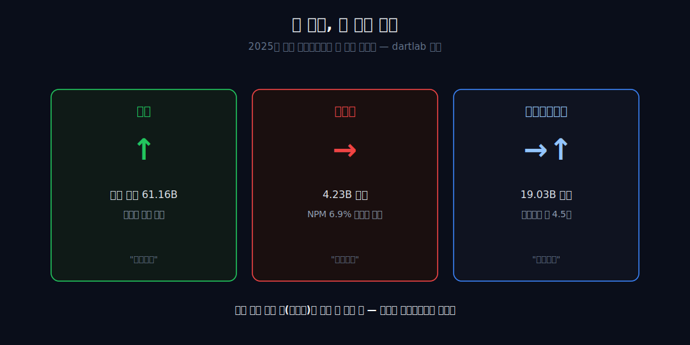
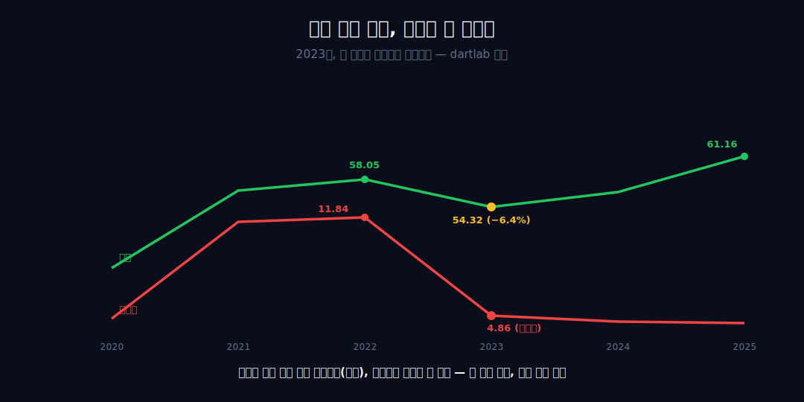
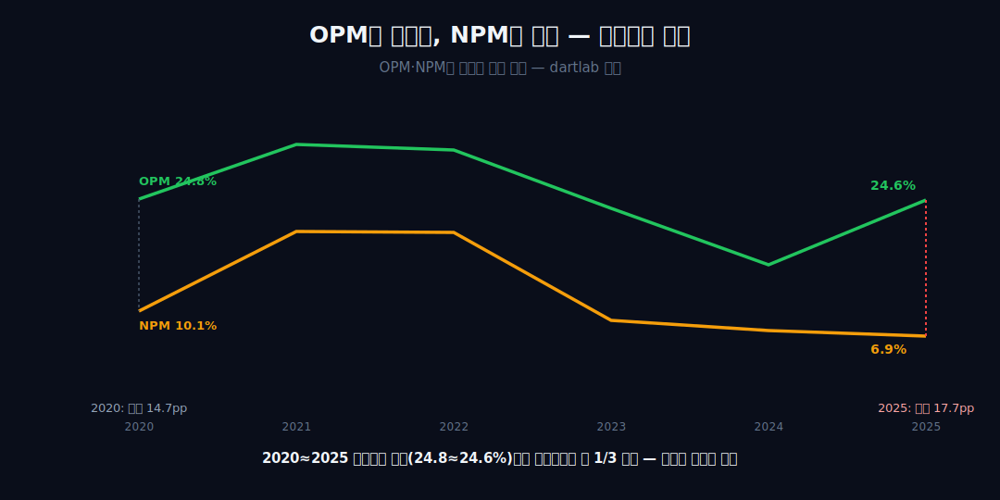
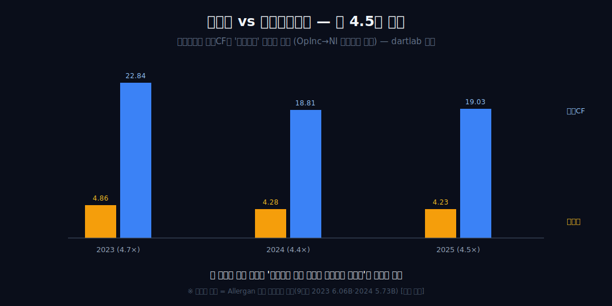
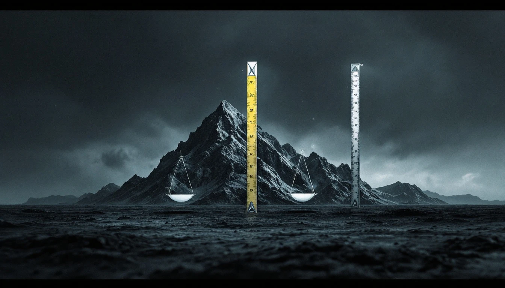
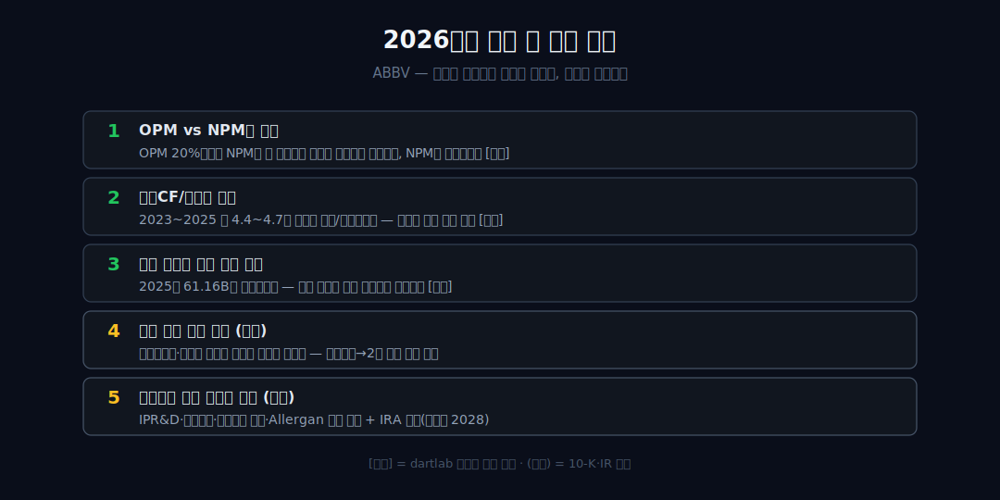

<script>
import ComboChart from '$lib/components/blog/ComboChart.svelte';
import StackBar from '$lib/components/blog/StackBar.svelte';
</script>

> **데이터 기준**: 2026-06-14 dartlab 실측 — AbbVie(ABBV) **미국 연결(USD)** 기준, 분기 데이터를 역년으로 합산. 휴미라/스카이리치/린버크 개별 매출, Allergan 인수가·무형자산 상각액·IPR&D 비용·특허 만료는 연결 손익에 분해되지 않으므로 **10-K·IR(외부 인용)**로 표기하며 dartlab 연결로는 증명되지 않는다. 비율 기준은 post-Allergan(2020~2025)으로 두고 2019는 인수 전 맥락으로만 1회 언급한다. ※대차대조표 항목은 매핑이 불안정해 인용에 주의.
>
> **핵심 숫자**: OPM **24.8%(2020) ≈ 24.6%(2025)** 동일 · NPM **10.1%(2020) → 6.9%(2025)** 약 1/3 감소 · 2025 영업이익 **15.07B** → 순이익 **4.23B**(약 **10.84B 증발**, 영업이익 아래) · 영업CF/순이익 **약 4.4~4.7배**(2023~2025)
>
> **이 글의 용어**: OPM(영업이익률)·NPM(순이익률) = 별개 비율, 절대 섞지 않음 · 영업이익 아래 = 이자·세금·IPR&D·손상이 자리한 영업이익 하단 · 비현금 가산 = 순이익에서 영업CF로 *올라가는* 상각 등 · 정합/양립 = 데이터가 인과를 증명 못 해 '같이 일어난 두 관찰'까지만 두는 것.

---

## 프롤로그 — 손익은 위에서 아래로 한 방향으로 흐른다, 보통은

우리는 손익계산서가 위에서 아래로 한 방향으로 흐른다고 믿는다 — 매출이 살아나면 영업이익이, 그 다음 순이익이 따라 오른다고. 애브비는 그 통념을 한 장표 안에서 깬다.

2025년 매출은 사상 최고(61.16B)로 돌아오고 영업이익률(OPM)도 24.6%로 제자리를 찾았는데, 바로 그 해 순이익률(NPM)은 시리즈 최저인 6.9%까지 내려앉았고 영업현금흐름은 순이익의 약 4.5배에 머문다.



관통선은 둘이다. 하나, 회복은 영업이익 줄에서 멈췄고 — 사라진 이익은 전부 *영업이익 아래*에서 일어난 일이다(연결이 증명). 둘, 그 아래에서 *무엇이* 이익을 갉아먹었는지 — IPR&D·상각·세금 — 는 연결 손익이 답하지 못한다(외부 인용·봉인). 이 글은 손익계산서를 한 줄이 아니라 *층*으로 읽는다.


---

## 1막 — 정렬된 손익이라는 출발선

**손익 세 줄이 '함께' 움직인다는 건 어떤 모습인가, 그리고 그게 언제 깨지는가.** 먼저 정상 상태를 베이스라인으로 박는다.

```python
import dartlab
c = dartlab.Company("ABBV")
c.select("IS", ["매출액", "영업이익", "당기순이익"], freq="Q")  # 분기→역년 합산
```

2021~2022년 애브비의 손익은 교과서적으로 정렬돼 있었다. 매출 56.20B → 58.05B, OPM 31.9% → 31.2%, NPM 20.5% → 20.4% — 위 줄과 아래 줄이 나란히 건강했다. 영업현금흐름(22.78B → 24.94B)은 순이익(11.54B → 11.84B)의 약 2배로, 현금과 이익의 거리도 정상 범위였다.

이 막은 '디커플링 이전의 정렬'을 베이스라인으로 박아, 뒤에 올 비정상을 잴 자(尺)를 세운다. 정렬을 떠받친 단일 약 휴미라의 매출 비중과 임박한 특허 절벽은 **[외부 인용]** 사실이고, 내부 수치가 말할 수 있는 건 '이때는 세 줄이 같이 갔다'까지다.

---

## 2막 — 매출 라인의 얕은 패임, 순이익 라인의 반토막

**특허 절벽이 매출을 −6%만 깎았는데, 왜 같은 해 순이익은 반토막 났는가.** 위 줄과 아래 줄이 처음으로 결별한다.

2022→2023 매출은 58.05B에서 54.32B, 단 **−6.4%**였다. 절벽이 보통 제약사를 반토막 낸다면 이건 흠집이다. 그런데 같은 해 NPM은 20.4%에서 8.9%로, 순이익은 11.84B에서 4.86B로 사실상 반토막 났다.



매출 곡선과 순이익 곡선이 이 시점에 처음으로 결별한다 — 위 줄은 멀쩡한데 아래 줄만 무너진 첫 신호다. 1막의 '정렬'이 깨지는 첫 균열점이 여기다. **[외부 인용]** 매출 절벽이 얕았던 이유, 즉 휴미라 침식(미국 바이오시밀러 2023년 1월 진입)을 후계 약물 스카이리치·린버크가 메운 사실은 10-K·IR 세그먼트이며, 내부 수치로는 '매출이 메워졌다'까지만 말한다 — '후계 약이 메웠다'는 외부다.

---

## 3막 — 두 마진이 정반대로 갈라지는 핵(核)

**영업이익률은 회복했는데 순이익률은 오히려 더 내려갔다 — 이 역방향은 무엇을 뜻하는가.** 두 비율이 정반대로 움직인다.

2024년 OPM 16.2%·NPM 7.6%, 2025년 OPM 24.6%·NPM 6.9%. OPM과 NPM은 끝까지 별개 비율로 호명해야 한다. 2024→2025 사이 영업이익은 9.14B에서 15.07B로 매출과 함께 살아 돌아왔으나, 순이익은 4.28B에서 4.23B로 그 회복을 한 푼도 받지 못했다.



결정적 대조 한 쌍: **2020(OPM 24.8%/NPM 10.1%) vs 2025(OPM 24.6%/NPM 6.9%)** — 영업마진은 사실상 동일한데 순이익률만 약 3분의 1이 깎였다. 2025년 영업이익(15.07B)에서 순이익(4.23B)으로 내려오는 약 **10.84B의 증발**은 전부 '영업이익 아래'에서 일어난 일이며, 이게 글 전체의 핵이다. 2막에서 결별한 두 곡선이 여기서 완전히 역주행한다.

---

## 4막 — 영업이익 아래에서 무슨 일이 벌어지나

**같은 영업이익률인데 순이익이 사라졌다면, 그 돈은 정확히 어느 줄에서 빠져나갔는가.** 내부 수치가 단언할 수 있는 건 *위치*뿐이다.

3막의 '영업이익 아래'를 더 좁혀보자. 증발은 순이자비용·법인세·기타 비용/충당이 자리한 영업이익 하단에서 일어났고, **OPM이 회복했으므로 매출원가·판관비(상각이 들어가는 자리) 위에서 일어난 일이 아니다.** 정확한 구성 항목은 내부 연결 손익만으로는 '무엇인지 모른다' — 여기서 멈추고 정합/양립까지만 말한다.


**[외부 인용]** 회사는 2025년 GAAP 희석 EPS $2.36 중 '$2.76/주가 취득 IPR&D·마일스톤 비용의 불리한 영향'이라고 명시했고(조정 EPS $10.00), Q3 2025에는 IPR&D $1.50/주와 Resonic·Durysta 무형자산 손상 $847M이 GAAP EPS를 $0.10까지 눌렀다. 즉 영업이익 아래의 비현금·일회성 항목이 영업 회복을 GAAP 순이익으로 전달하지 못하게 막은 것 — 이건 전부 외부 근거이며, 연결 손익은 '증발이 영업선 아래에서 났다'는 위치까지만 단언한다.

---

## 5막 — 현금이라는 반증: 순이익은 영업 실체를 대표하지 못한다

**순이익이 4B대라면 회사가 망가진 것인가 — 아니면 순이익이 잘못된 줄인가.** 4막의 '눌린 순이익'에 현금흐름표를 겹친다.

```python
c.select("CF", ["영업활동현금흐름"], freq="Q")  # OCF는 순이익의 약 4.5배
```

영업CF는 2023~2025년 22.84B → 18.81B → 19.03B로, 순이익(4~5B대)의 약 **4.4~4.7배**를 줄곧 유지한다. OCF와 순이익의 격차는 2023년 약 18.0B로 시리즈 최대까지 벌어졌다.




주의 — 이 괴리는 4막의 'OpInc→NI 증발'과는 **다른 두 번째 괴리**다. 이건 순이익에서 영업CF로 *올라가는* 비현금 가산(상각 등)이고, OpInc→NI 증발은 영업이익에서 *내려가는* 부담이다. 둘을 한 덩어리 '비현금 무게'로 뭉치면 안 된다. 이 4~5배 괴리의 크기 자체가 '순이익이 영업 실체를 대표하지 못한다'는 정합적 증거다. **[외부 인용]** 이 가산의 대종이 2020년 Allergan 인수(약 $630억대)에서 떠안은 무형자산 상각(9개월 기준 2023 $6.06B·2024 $5.73B로 같은 기간 순이익보다 큼)이라는 점은 10-K·10-Q다.

---

## 6막 — 절벽 항해의 진짜 결산, 그리고 어느 줄을 믿을 것인가

**매출은 회복, 순이익은 고착, 현금은 든든 — 한 회사가 세 가지로 보일 때 무엇을 믿어야 하나.** 가장 눈에 띄는 줄이 가장 덜 믿을 줄이다.

2020~2025 6년 결산: 매출은 45.80B에서 61.16B로 절벽을 건너 더 높아졌고, OPM은 24.8%에서 24.6%로 원위치, 그러나 NPM은 10.1%에서 6.9%로 낮아진 채 고착, OCF는 17.59B에서 19.03B로 든든하다. 같은 2025년을 세 렌즈로 보면 매출은 '회복했다', 순이익은 '무너졌다', 영업CF는 '멀쩡하다'고 말한다.



재무 렌즈의 판정: **가장 눈에 띄는 줄(순이익)이 가장 덜 믿을 줄이다** — 영업 라인 아래에서 구조적으로 눌려 있기 때문. P/E만 보면 이 회사를 오독한다. 애브비의 항해는 '매출과 영업 수익성'에서는 성공한 드문 절벽 통과지만, GAAP 순이익에서는 회복이 영업 라인 아래로 내려가지 못해 여전히 눌려 있다.

**[외부 인용]** 그 아래 부담이 커진 배경 — 2013년 Abbott 분사 후 휴미라 단일분자 의존, 2020년 Allergan 인수로 쌓인 무형자산, 이후 ImmunoGen·Cerevel 인수로 반복되는 적층 — 은 전부 외부(10-K·IR)이며, 진짜 체력은 손익 맨 아랫줄이 아니라 현금에 적혀 있다.

정리하면 — 매출과 영업이익에서 회복한 점에선 디커플링을 뒤집은 [애플](/blog/AAPL-apple)의 사촌이고, 회복이 영업선 *아래*에서 막힌다는 점에선 첫 골절이 영업선 아래에서 난 [유나이티드헬스](/blog/UNH-unitedhealth)의 거울이다. 같은 제약 영역에서 매출·이익 구조가 어떻게 다른지는 [셀트리온](/blog/068270-celltrion)·[삼성바이오로직스](/blog/207940-samsung-biologics)와 나란히 읽으면 선명해진다. 그리고 손익이 아니라 현금이 진짜를 말한다는 점에선 [캐터필러](/blog/CAT-caterpillar)와 같은 계열이다.

---

## 2026년에 봐야 할 다섯 가지

1. **OPM vs NPM의 간격** — 2025처럼 OPM은 20%대인데 NPM이 한 자릿수에 머무는 '영업라인 아래 디커플링'이 지속되는지, NPM이 OPM 쪽으로 좁혀지는지. 두 비율은 끝까지 별개로 추적 [내부].
2. **영업CF/순이익 배율** — 2023~2025년 약 4.4~4.7배 괴리가 유지되는지 좁혀지는지. 좁혀지면 영업이익 아래를 누르던 비현금/일회성 부담이 완화됐다는 신호(정합/양립, 원인은 외부 확인 필요) [내부].
3. **매출 곡선의 고점 갱신 여부** — 2025년 61.16B를 넘어서는지. 절벽을 건넌 매출 회복이 일시적 반등인지 추세인지 [내부].
4. **후계 약물 합산 매출(외부)** — 휴미라 잔존 + 스카이리치·린버크 합산이 휴미라 정점을 넘어서는지. 단일분자 의존이 2종 의존으로 옮겨가는 집중 위험.
5. **영업이익 아래 항목의 규모(외부)** — 취득 IPR&D·마일스톤·무형자산 손상·Allergan 상각 잔여 스케줄의 2026 규모. IRA 약가 협상(보톡스 2028년 대상) 등 다음 세대 리스크 포함.



---

## 재무제표 — 최근 6개년 (dartlab 연결, $B)

> 미국 연결(USD)·분기 합산(역년) 기준. dartlab에서 직접 확인:
> ```python
> import dartlab
> c = dartlab.Company("ABBV")
> c.select("IS", ["매출액","영업이익","당기순이익"], freq="Q")
> c.select("CF", ["영업활동현금흐름"], freq="Q")
> ```

<ComboChart data={[{year:"2020",매출:45.80,영업이익:11.36,당기순이익:4.62},{year:"2021",매출:56.20,영업이익:17.92,당기순이익:11.54},{year:"2022",매출:58.05,영업이익:18.12,당기순이익:11.84},{year:"2023",매출:54.32,영업이익:12.76,당기순이익:4.86},{year:"2024",매출:56.33,영업이익:9.14,당기순이익:4.28},{year:"2025",매출:61.16,영업이익:15.07,당기순이익:4.23}]} lineKeys={["매출"]} barKeys={["영업이익","당기순이익"]} lineColors={["#22c55e"]} barColors={["#3b82f6","#f59e0b"]} title="매출(라인) vs 영업이익·당기순이익(막대) — $B" unit="$B" />

| 항목 ($B) | 2020 | 2021 | 2022 | 2023 | 2024 | 2025 |
|---|---:|---:|---:|---:|---:|---:|
| 매출 | 45.80 | 56.20 | 58.05 | 54.32 | 56.33 | 61.16 |
| 영업이익 | 11.36 | 17.92 | 18.12 | 12.76 | 9.14 | 15.07 |
| 당기순이익 | 4.62 | 11.54 | 11.84 | 4.86 | 4.28 | 4.23 |
| 영업이익률(OPM) | 24.8% | 31.9% | 31.2% | 23.5% | 16.2% | 24.6% |
| 순이익률(NPM) | 10.1% | 20.5% | 20.4% | 8.9% | 7.6% | 6.9% |
| 영업현금흐름 | 17.59 | 22.78 | 24.94 | 22.84 | 18.81 | 19.03 |

이 표를 한 줄로 읽으면 이렇다 — 매출 행은 2023년 한 칸 패였다가 2025년 사상 최고로 회복하고, OPM 행도 2025년 24.6%로 2020(24.8%) 원위치다. **그런데 당기순이익 행은 2023년 이후 4B대에 고착**되고 NPM 행은 6.9%까지 내려간다. 영업CF 행은 그 4배 안팎으로 든든하다. 이 표가 증명하는 건 '회복이 영업이익 줄에서 멈췄다'는 결과까지이고, *왜* 멈췄는지는 이 표 어디에도 안 적혀 있다(IPR&D·상각=외부).

---

## 검증표

본문 인용 수치를 dartlab 호출과 결과로 검증한다. 외부 출처(약물별 매출·상각·IPR&D·특허)는 분리 표기. 📅 dartlab 실측 2026-06-14 · AbbVie(ABBV) 미국 연결(USD)·분기 합산 기준.

| 본문 수치 | 출처 / 호출 | 결과 |
|---|---|---|
| OPM 2020 24.8% ≈ 2025 24.6%(동일) | `c.select("IS",[...])` 영업이익÷매출 | ✓ 실측 |
| NPM 2020 10.1% → 2025 6.9%(약 1/3 감소) | 순이익÷매출 | ✓ 실측 |
| 매출 절벽 얕음 58.05→54.32B(−6.4%)→61.16B 회복 | `c.select("IS",["매출액"])` | ✓ 실측 |
| 2025 영업이익 15.07B → 순이익 4.23B(약 10.84B 증발) | `c.select("IS",[...])` | ✓ 실측 |
| 2024→2025 영업이익 9.14→15.07B(회복) vs 순이익 4.28→4.23B(못 받음) | `c.select("IS",[...])` | ✓ 실측 |
| 영업CF/순이익 약 4.4~4.7배(2023~2025), 격차 2023 ~18.0B 최대 | `c.select("CF",["영업활동현금흐름"])` | ✓ 실측 |
| 휴미라 절벽·스카이리치/린버크 후계·바이오시밀러 2023.1 진입 | [ABBV 10-K (SEC)](https://www.sec.gov/cgi-bin/browse-edgar?action=getcompany&CIK=0001551152&type=10-K) · [FiercePharma](https://www.fiercepharma.com/) | 외부 인용·연결 증명 0 |
| 2025 GAAP EPS $2.36 중 IPR&D·마일스톤 $2.76/주, Q3 손상 $847M | [AbbVie IR](https://investors.abbvie.com/) | 외부 인용 |
| Allergan 인수 ~$630억(2020), 9개월 무형자산 상각 2023 $6.06B·2024 $5.73B | [Reuters](https://www.reuters.com/) · [ABBV 10-Q (SEC)](https://www.sec.gov/cgi-bin/browse-edgar?action=getcompany&CIK=0001551152&type=10-Q) | 외부 인용 |
| 스카이리치/린버크 특허 ~2033·린버크 제네릭 2037년 차단(IRA·보톡스 2028) | [DrugPatentWatch](https://www.drugpatentwatch.com/) | 외부 인용 |
| 2019(인수 전) 33.27/12.98/7.88B — post-Allergan과 같은 자로 안 잼 | dartlab 실측 | 부분/맥락 |
| BS(대차대조표) 매핑 불안정 — 인용 주의 | dartlab 데이터 한계 | 주의/제외 |

본문의 숫자 중 이 표에 없는 것은 발행 차단 대상이다. 약물별 매출·상각·IPR&D는 dartlab 연결로 증명되지 않으며 외부 인용임을, OpInc→NI 증발(영업이익 아래)과 NI→OCF 비현금 가산(순이익 위)은 별개 괴리라 뭉치지 않음을 명시한다 — 연결이 증명하는 것은 '회복이 영업이익 줄에서 멈췄다'(결과)까지이고, '왜'는 손익 밖에 있다.
