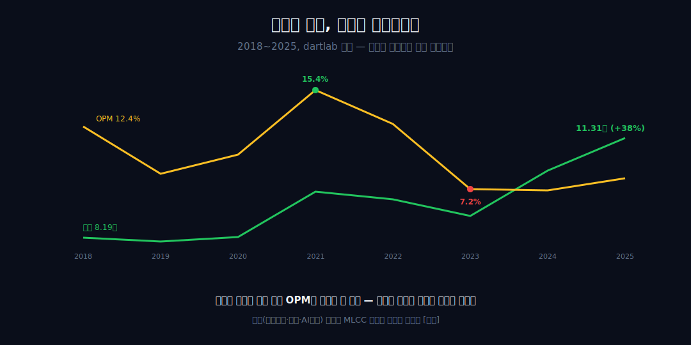
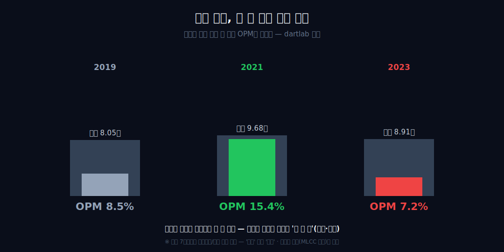
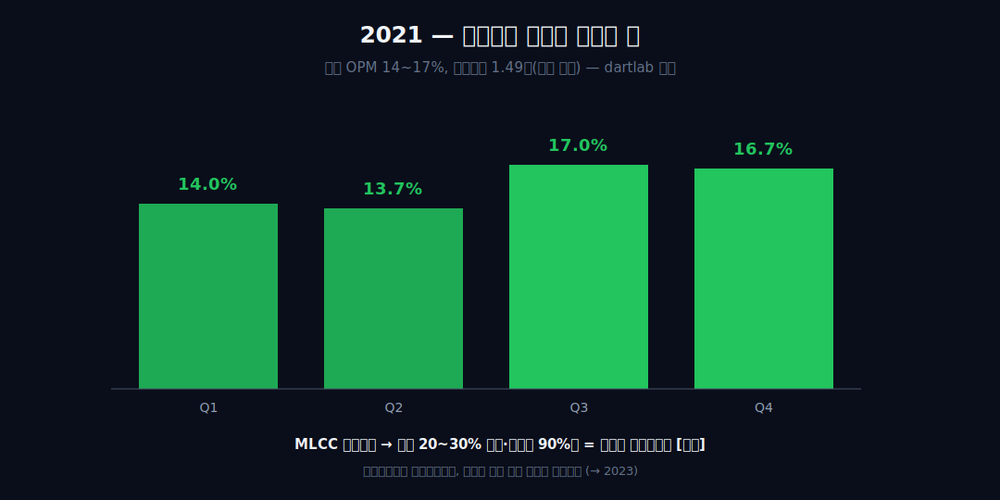
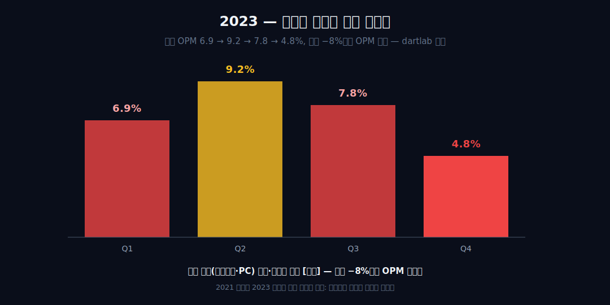
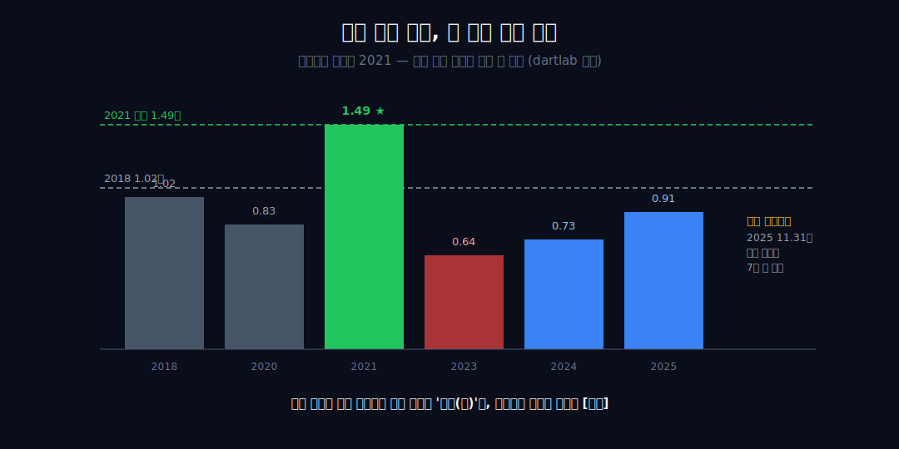
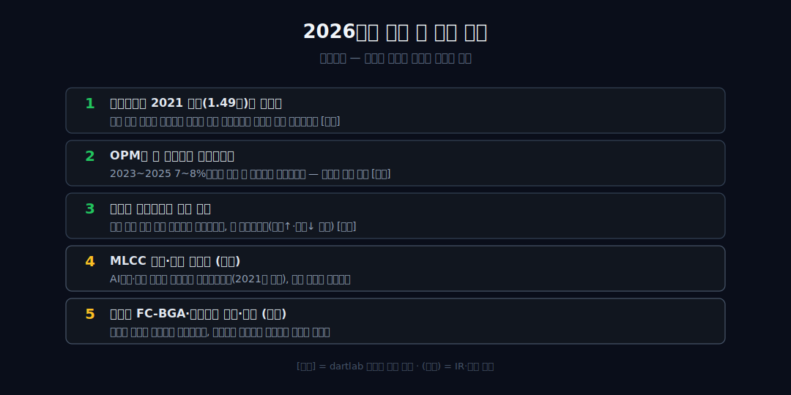

<script>
import ComboChart from '$lib/components/blog/ComboChart.svelte';
import StackBar from '$lib/components/blog/StackBar.svelte';
</script>

> **데이터 기준**: 2026-06-14 dartlab 실측 — 삼성전기(009150) **연결(KRW)** 기준, 분기 데이터를 역년으로 합산. MLCC 점유·전방(스마트폰/전장/AI서버) 수요·부문(컴포넌트/광학통신/패키지) 수치·무라타 경쟁은 연결 손익에 분해되지 않으므로 **IR·업계(외부 인용)**로 표기하며 dartlab 연결로는 증명되지 않는다. 영업이익은 전 분기 4q 클린이나, 영업현금흐름은 2021~2023 분기 결손이 있어 수치를 단정하지 않는다. ※대차대조표 항목은 매핑이 불안정해 인용에 주의.
>
> **핵심 숫자**: 매출 **8.19 → 11.31조** (2018→2025 **+38%**, 완만) · 영업이익률(OPM) **7.2%(2023) ~ 15.4%(2021)** 두 배폭 진동 · 절대 영업이익 정점 **2021년 1.49조** · 사상 최대 매출 2025년 영업이익 **0.91조 &lt; 2018년 1.02조**
>
> **이 글의 용어**: OPM(영업이익률)·NPM(순이익률) = 별개 비율 · 가격수용자(price-taker) = 자기 제품 가격을 자기가 못 정하는 위치 · 전방 = 부품을 사 가는 세트(완제품) 제조사 · 정합/양립 = 데이터가 인과를 증명 못 해 '같이 일어난 두 관찰'까지만 두는 것.

---

## 프롤로그 — 부품 회사는 매출이 커지면 이익도 커진다, 보통은

부품 회사를 읽는 통념은 단순하다 — 물량이 늘면 매출이 커지고, 매출이 커지면 이익도 따라 는다. 삼성전기는 그 통념을 비튼다.

2025년 매출은 사상 최대 11.31조인데, 영업이익(0.91조)은 7년 전 2018년(1.02조)도, 2021년 정점(1.49조)도 끝내 넘지 못했다. 매출은 완만히 +38% 늘었을 뿐인데, 영업이익률은 7%에서 15%까지 두 배폭으로 출렁였다.



관통선은 둘이다. 하나, 이 회사 손익을 흔드는 변수는 외형(매출)이 아니라 그 한 칸 위 — 단가와 수급이다(연결이 관찰을 증명). 둘, 그 단가를 *누가 정하는지* — MLCC 수급, 전방 수요, 무라타와의 경쟁 — 는 연결 손익이 답하지 못한다(외부 인용·봉인). 부품사는 가격수용자다.


---

## 1막 — 완만한 외형, 출렁이는 마진

**매출은 완만히 늘었는데, 왜 영업이익률은 두 배폭으로 출렁였나.** 먼저 인과 없이 관찰만 못 박는다.

```python
import dartlab
c = dartlab.Company("009150")
c.select("IS", ["매출액", "영업이익"], freq="Q")  # 분기→역년 합산
```

매출은 2018년 8.19조에서 2025년 11.31조로 **+38%**, 완만한 우상향이다. 그런데 같은 기간 OPM은 12.4% → 8.5% → 10.1% → **15.4%(2021)** → 12.6% → **7.2%(2023)** → 7.1% → 8.1%로, 7%에서 15% 사이를 두 배폭으로 진동했다.

매출 곡선은 완만한데 마진 곡선은 롤러코스터다. 외형이 한 방향으로 천천히 가는 동안 이익률은 위아래로 격동한 이 *분리*가 이 회사 손익의 출발점이다. 외형과 마진율이 따로 노는 점에선 [유나이티드헬스](/blog/UNH-unitedhealth)·[애플](/blog/AAPL-apple)과 결이 같지만, 삼성전기는 그 *진폭*이 훨씬 크다.

---

## 2막 — 변수는 매출이 아니라 한 칸 위에 있다

**그 진동의 진짜 변수는 무엇인가.** 같은 매출대에서 마진이 갈린다는 점이 단서다.

내부 수치로 정황을 좁혀보자. 2019년(매출 8.05조), 2021년(9.68조), 2023년(8.91조)은 매출이 모두 8~9조대로 엇비슷하다. 그런데 같은 매출대에서 OPM이 **8.5% · 15.4% · 7.2%**로 갈렸다.



외형이 거의 같은데 이익률이 두 배 차이로 벌어진다면, 손익을 흔드는 변수는 *매출이 아니라 한 칸 위* — 같은 매출을 얼마의 단가·원가로 파느냐다. 8년 전체를 봐도 이 분리는 또렷하다 — 매출은 8.19→11.31조로 거의 단조 증가에 가까운데, OPM은 12.4 → 8.5 → 10.1 → 15.4 → 12.6 → 7.2 → 7.1 → 8.1%로 *방향이 네 번* 바뀐다. 외형은 한 방향, 마진은 갈지자다. 단, 내부 손익 7줄만으로는 그게 매출원가인지 판가인지를 특정할 수 없으니 '증거'가 아니라 '정황'까지다(매출총이익률은 본 글에 주입되지 않아 분해하지 않는다). **[외부 인용]** 그 단가를 *누가* 정하는지는 외부에 있다 — MLCC 시장은 무라타가 40%+로 1위, 삼성전기가 2위(2024 상반기 점유율 약 24%)인 가격수용자 구조이고, MLCC 가격은 산업 전체의 수급 사이클로 결정된다(passive-components.eu·업계). 가격결정력 없는 부품사라는 위치는 [LG이노텍](/blog/011070-lg-innotek)에서도 본 적 있는 구조다.

---

## 3막 — 2021 정점은 어떻게 왔나

**OPM 15.4%, 절대 영업이익 1.49조 — 부품사가 어떻게 이런 정점을 찍었나.** 일시적으로 가격결정력을 쥐었기 때문이다.

2021년 OPM은 15.4%, 분기로 보면 14.0% → 13.7% → 17.0% → 16.7%로 내내 두 자릿수 중반이었다. 영업이익 1.49조는 이 시리즈의 절대 정점이다.



**[외부 인용]** 이 정점의 외부 정체는 MLCC 극심한 공급부족이다. COVID 이후 5G·자동차·IoT 수요가 동시에 몰리고 원자재난이 겹치며 리드타임이 16~20주(일부 30주)로 늘었고, 삼성전기는 2021년 3월 30개 품목 가격을 20~30% 인상했으며 무라타·삼성전기 가동률이 90%대였다(digitaltoday·업계). 즉 부품사가 *일시적으로* 가격결정력을 쥔 드문 국면이라 OPM이 튀었다. 내부의 '2021 OPM 정점' 관찰과 이 외부 설명은 정합한다 — 매출(완만)이 아니라 단가·가동률(수급)이 마진을 끌어올렸다. 가격결정력이 일시적이라면, 그것이 빠진 해엔 마진이 무너진다.

---

## 4막 — 2023 저점은 어떻게 왔나

**같은 회사가 2년 만에 OPM 15.4%에서 7.2%로 반토막 났다 — 무엇이 빠졌나.** 전방 수요가 빠졌다.

```python
c.select("IS", ["영업이익"], freq="Q")  # 2023 분기 영업이익률이 해를 따라 식는다
```

2023년 OPM은 7.2%, 분기로 보면 6.9% → 9.2% → 7.8% → **4.8%**로 해를 따라 식었다. 매출은 8.91조로 2021년(9.68조)보다 −8% 남짓 줄었을 뿐인데, OPM은 절반으로 무너졌다. 매출이 한 자릿수 줄었는데 이익률이 절반으로 무너진 이 비대칭은, MLCC·기판 공장이 설비 감가상각·인건비 같은 고정비가 큰 장치산업이라 가동률이 떨어지면 단위당 이익이 빠르게 깎이는 구조(고정비 디레버리지)와 정합한다 — 단, 그 고정비 분해는 손익 7줄로는 특정할 수 없어 정황까지다.



**[외부 인용]** 그 외부 정체는 전방 세트 수요(스마트폰·PC) 둔화와 메모리 한파다. 2022년 4분기 영업이익이 전년동기 대비 68% 급감(2023년 1월 발표)했고, 회사는 MLCC·카메라모듈·모바일 BGA 기판이 비수기·완제품 수요 둔화로 타격받았다고 밝혔다(Korea Times·업계). '전방 수요가 마진을 정한다'는 메커니즘과 일치한다 — 매출은 한 자릿수 빠졌는데 OPM은 반토막. 2021의 정점과 2023의 저점은 같은 진실의 양면이다: 부품사의 마진은 자기가 아니라 전방이 정한다.

---

## 5막 — 사상 최대 매출인데 못 넘은 천장

**2024·2025년 매출은 사상 최대를 갈아치웠다 — 그런데 왜 영업이익은 2018년도 못 넘나.** 회복의 동력이 단가가 아니라 양이기 때문이다.

2024년 매출 10.31조, 2025년 11.31조로 외형은 연속 사상 최대다. 그런데 영업이익은 0.73조·0.91조로, **2021년 정점(1.49조)은 물론 2018년(1.02조)도 넘지 못했다.** 외형은 사상 최대인데 이익은 7년 전 자리다.


숫자로 그 간극의 크기를 재면 이렇다 — 2025년 매출(11.31조)은 2021년(9.68조)보다 +17% 큰데, 영업이익(0.91조)은 2021년(1.49조)의 61% 수준에 그친다. 매출이 17% 더 큰데 이익은 39% 더 작다. 같은 회사가 더 많이 팔고 더 적게 버는 이 역설이, 단가를 자기가 못 정하는 부품사의 손익을 한 줄로 요약한다.



**[외부 인용]** 그 천장 미회복의 외부 정황은 회복의 *결*이다. 2024~2025 회복의 동력이 소비자 IT의 단가 스파이크(2021식)가 아니라 AI서버·전장(자동차)용 고부가 MLCC와 서버용 FC-BGA 기판으로 옮겨갔다(Korea Herald·업계). 외부는 '믹스가 양으로 회복했다'고 설명할 뿐, 2021식 가격 스파이크가 재현됐다는 근거는 없다 — 주입된 '절대이익 2021 미회복' 관찰과 모순되지 않는다(인과 단정 아님, 정합까지만). 사상 최대 매출이 사상 최대 이익이 못 되는 이 간극이, 가격수용자라는 구조의 비용이다.

---

## 6막 — 부품사의 운명, 그리고 다음 베팅

**자기 가격을 못 정하는 회사는 어디로 가나.** 전방이 정하는 마진에서 벗어나려 새 길에 베팅한다.

여섯 해를 한 장으로 겹쳐 보면 결론은 하나다. 매출은 완만히 +38% 늘었지만 OPM은 7~15% 두 배폭으로 진동했고, 절대 영업이익은 2021년(1.49조)을 정점으로 사상 최대 매출의 해에도 못 넘었다. 삼성전기의 손익은 '얼마나 파느냐'보다 *전방이 정하는 단가*가 정한다.


**[외부 인용]** 그 운명에서 벗어나려는 베팅도 외부에 있다 — 회사는 서버용 FC-BGA(반도체기판)에 베트남 누적 약 3조원을 투입 중이고, 유리기판을 2027년 양산 목표로 추진한다. 다만 업계는 한국 대기업 동시 진입을 두고 '과잉투자'(수율·고객수요 불확실) 위험을 경고한다(digitimes·TrendForce). 신사업 역시 전방 수요와 사이클에 묶인다는 점은 변하지 않는다.

정리하면 — 외형과 마진율이 따로 노는 점에선 [캐터필러](/blog/CAT-caterpillar)·[SK하이닉스](/blog/000660-skhynix)의 사이클 형제이고, 가격을 못 정하는 부품사라는 점에선 [LG이노텍](/blog/011070-lg-innotek)의 거울이다. 그리고 그 전방의 세트를 만드는 [애플](/blog/AAPL-apple)·삼성 같은 회사들이 이 회사의 마진을 사실상 정한다. 사상 최대 매출이 사상 최대 이익이 되지 못한 2024~2025가, 가격수용자의 운명을 가장 선명하게 보여준다. 증분 효율이 낮아진 것이 일시적 국면인지 구조적 변화인지는 — 손익 7줄만으로는 단정하지 않는다.

---

## 2026년에 봐야 할 다섯 가지

1. **영업이익이 2021 정점(1.49조)을 넘는가** — 사상 최대 매출이 이어지는 가운데 절대 영업이익이 천장을 처음 돌파하는지. 연결 손익으로 직접 검증 [내부].
2. **OPM이 두 자릿수로 복귀하는가** — 2023~2025 7~8%대에서 다시 두 자릿수로 올라서는지, 아니면 한 자릿수에 머무는지. 진동의 다음 위상 [내부].
3. **매출과 영업이익의 방향 일치** — 외형 사상 최대 동안 이익률이 동행해 올라오는지, 또 벌어지는지(외형↑·마진↓ 반복 여부) [내부].
4. **MLCC 수급·전방 사이클(외부)** — AI서버·전장 고부가 수요가 단가까지 끌어올리는지(2021식 재현), 아니면 양적 회복에 그치는지. IR·업계로만 확인.
5. **신사업 FC-BGA·유리기판의 수율·가동(외부)** — 베트남 FC-BGA·유리기판 투자가 이익으로 전환되는지, 과잉투자 경고대로 감가상각 부담이 되는지. 전부 외부 인용.



---

## 재무제표 — 최근 6개년 (dartlab 연결, 조원)

> 연결(KRW)·분기 합산(역년) 기준. dartlab에서 직접 확인:
> ```python
> import dartlab
> c = dartlab.Company("009150")
> c.select("IS", ["매출액","영업이익","당기순이익"], freq="Q")
> ```

<ComboChart data={[{year:"2020",매출:8.21,영업이익:0.83,당기순이익:0.62},{year:"2021",매출:9.68,영업이익:1.49,당기순이익:0.92},{year:"2022",매출:9.43,영업이익:1.18,당기순이익:0.99},{year:"2023",매출:8.91,영업이익:0.64,당기순이익:0.45},{year:"2024",매출:10.31,영업이익:0.73,당기순이익:0.70},{year:"2025",매출:11.31,영업이익:0.91,당기순이익:0.73}]} lineKeys={["매출"]} barKeys={["영업이익","당기순이익"]} lineColors={["#22c55e"]} barColors={["#3b82f6","#f59e0b"]} title="매출(라인) vs 영업이익·당기순이익(막대) — 조원" unit="조" />

| 항목 (조원) | 2020 | 2021 | 2022 | 2023 | 2024 | 2025 |
|---|---:|---:|---:|---:|---:|---:|
| 매출 | 8.21 | 9.68 | 9.43 | 8.91 | 10.31 | 11.31 |
| 영업이익 | 0.83 | 1.49 | 1.18 | 0.64 | 0.73 | 0.91 |
| 당기순이익 | 0.62 | 0.92 | 0.99 | 0.45 | 0.70 | 0.73 |
| 영업이익률(OPM) | 10.1% | 15.4% | 12.6% | 7.2% | 7.1% | 8.1% |
| 순이익률(NPM) | 7.6% | 9.5% | 10.5% | 5.1% | 6.8% | 6.5% |

이 표를 한 줄로 읽으면 이렇다 — 매출 행은 완만한 우상향이라 2025년이 사상 최대인데, **영업이익 행의 정점은 2021년(1.49조)이고 그 뒤로는 그 천장 아래에 머문다.** OPM 행은 같은 매출대에서 7%~15%로 격동한다. 이 표가 증명하는 건 '외형은 컸는데 이익은 천장에 못 닿았다'는 결과까지이고, 그 *원인*(단가·수급·믹스)은 이 표 어디에도 안 적혀 있다(MLCC 시장=외부).

---

## 검증표

본문 인용 수치를 dartlab 호출과 결과로 검증한다. 외부 출처(MLCC 점유·전방 수요·부문·신사업)는 분리 표기. 📅 dartlab 실측 2026-06-14 · 삼성전기(009150) 연결(KRW)·분기 합산 기준.

| 본문 수치 | 출처 / 호출 | 결과 |
|---|---|---|
| 매출 2018 8.19조 → 2025 11.31조 (+38%) | `c.select("IS",["매출액"],freq="Q")` 합산 | ✓ 실측 |
| OPM 7.2%(2023) ~ 15.4%(2021) 두 배폭 진동 | 영업이익÷매출 | ✓ 실측 |
| 같은 매출대 OPM: 2019 8.5%·2021 15.4%·2023 7.2% | `c.select("IS",[...])` | ✓ 실측 |
| 2021 분기 OPM 14.0/13.7/17.0/16.7% | `c.select("IS",["영업이익"],freq="Q")` | ✓ 실측 |
| 2023 분기 OPM 6.9/9.2/7.8/4.8% | `c.select("IS",[...],freq="Q")` | ✓ 실측 |
| 절대 영업이익 정점 2021 1.49조 > 2018 1.02조 > 2025 0.91조 | `c.select("IS",["영업이익"])` | ✓ 실측 |
| MLCC 무라타 1위·삼성전기 2위(약 24%)·가격수용자 | [passive-components.eu](https://passive-components.eu/) | 외부 인용·연결 증명 0 |
| 2021 공급부족·리드타임 16~20주·가격 20~30% 인상 | [삼성전기 IR](https://www.samsungsem.com/kr/ir/index.do) · 업계 | 외부 인용 |
| 2022 4Q 영업이익 −68% YoY·전방 수요 둔화 | [Korea Times](https://www.koreatimes.co.kr/) | 외부 인용 |
| 2024~2025 회복 동력 = AI서버·전장 고부가 믹스 | [Korea Herald](https://www.koreaherald.com/) | 외부 인용 |
| FC-BGA·유리기판 베팅·과잉투자 경고 | [Digitimes](https://www.digitimes.com/) | 외부 인용 |
| 영업현금흐름 2021~2023 분기 결손 — 단정 금지 | dartlab 데이터 한계 | 주의/제외 |
| BS(대차대조표) 매핑 불안정 — 인용 주의 | dartlab 데이터 한계 | 주의/제외 |

본문의 숫자 중 이 표에 없는 것은 발행 차단 대상이다. MLCC 점유·전방 수요·부문·신사업은 dartlab 연결로 증명되지 않으며 외부 인용임을, 증분 효율 저하가 일시인지 구조인지는 손익 7줄만으로 단정하지 않음을 명시한다 — 연결이 증명하는 것은 '외형은 컸는데 이익은 천장에 못 닿았다'(결과)까지이고, '왜'는 손익 밖에 있다.
