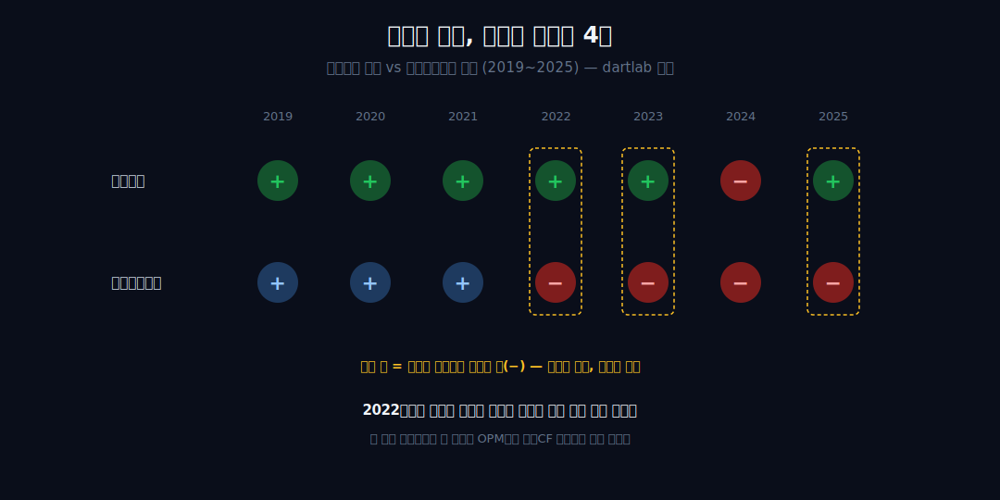
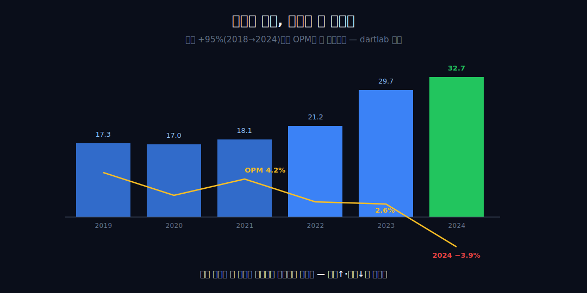
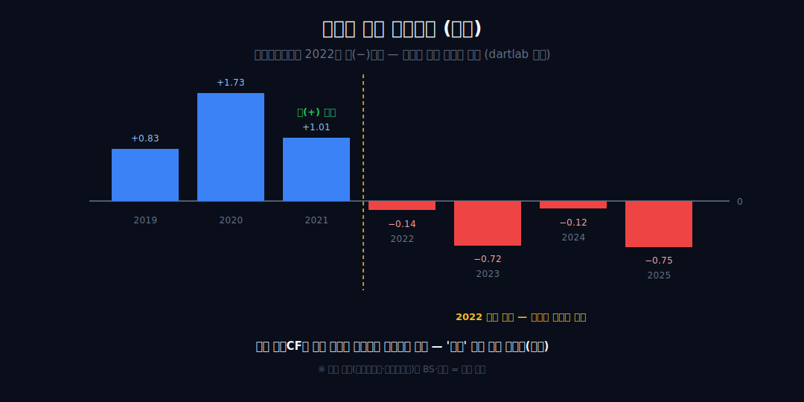
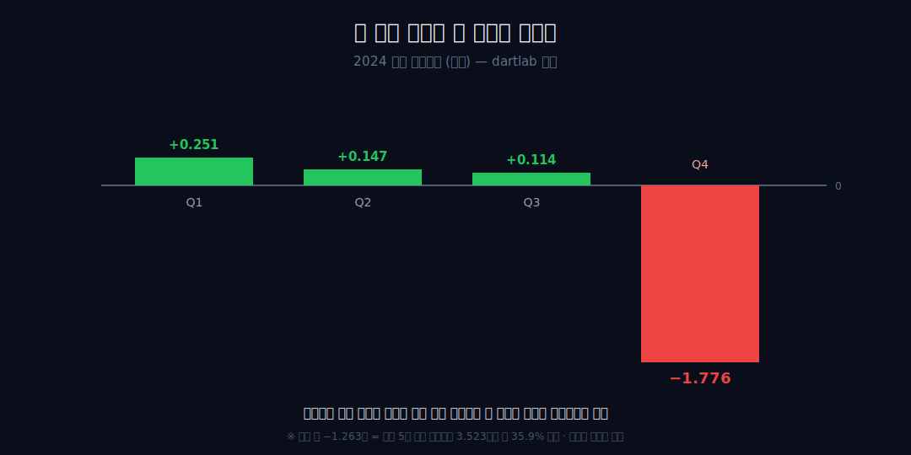
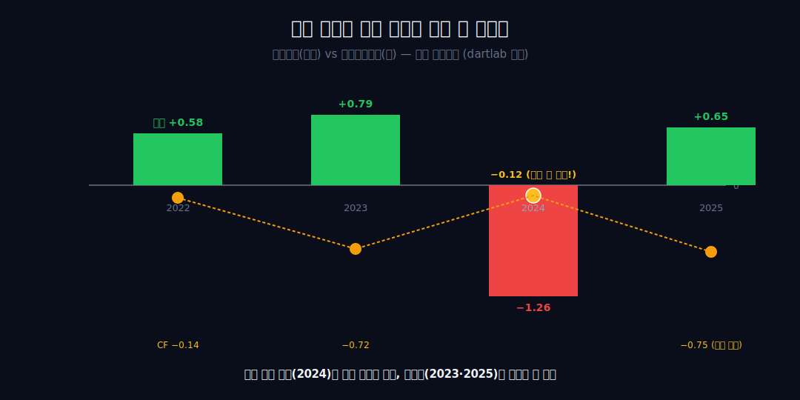
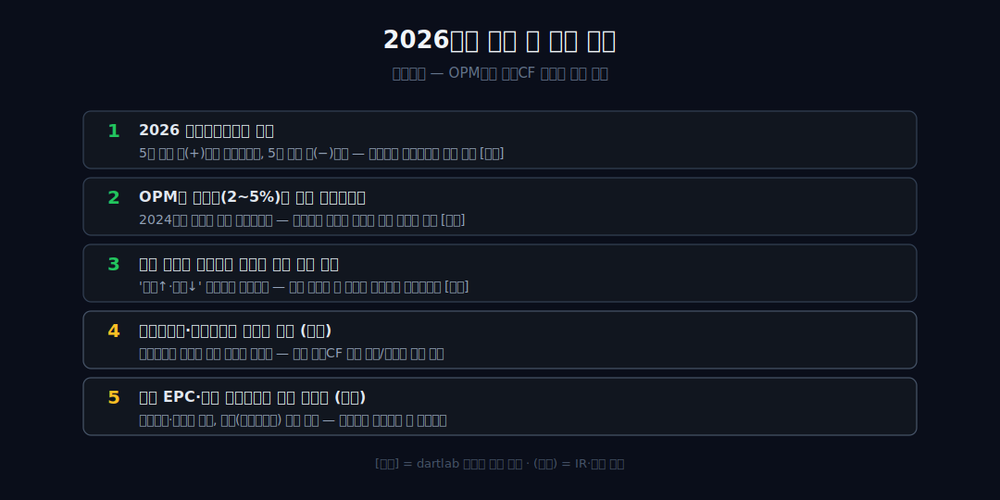

<script>
import ComboChart from '$lib/components/blog/ComboChart.svelte';
import StackBar from '$lib/components/blog/StackBar.svelte';
</script>

> **데이터 기준**: 2026-06-20 — 현대건설(000720) **연결(KRW)** 기준, 2019~2025 연간 수치는 dartlab 분기 합산과 2025 사업보고서를 교차 확인했고, 2026년 1분기 수치는 2026-05-15 KIND/DART 분기보고서 원문을 사용했다. 원가 재추정 사유·해외 프로젝트명·향후 수주 전망은 연결 손익에 분해되지 않으므로 **IR·공시(외부 인용)**로 표기한다. 내부에서 검증된 것은 '영업손실 −1.263조'(P&L), '2025 영업CF −0.748조'(CF), '2026Q1 영업CF −1.600조'(CF)이지 특정 현장의 인과가 아니다.
>
> **핵심 숫자**: 매출 **16.73 → 32.67조** (2018→2024 **+95%**, 신고가) · 2024 영업이익 **−1.263조** (OPM **−3.9%**, 7개년 유일 음수) · 2025 영업이익 **+0.653조**인데 영업CF **−0.748조** · 2026Q1 영업이익 **+0.181조**인데 영업CF **−1.600조** · 2026Q1 매출채권 **7.664조**, 미청구공사 **4.130조**, 초과청구공사 **3.150조**
>
> **이 글의 용어**: OPM(영업이익률)·NPM(순이익률) = 별개 비율 · 진행기준 = 공사 진행률 추정으로 매출·이익을 미리 인식하는 회계 · 영업CF = 영업활동현금흐름 · 부호 비동기성 = 손익의 부호(흑/적)와 현금의 부호가 같은 해에 살지 않는 것 · 정합/양립 = 데이터가 인과를 증명 못 해 '같이 일어난 두 관찰'까지만 두는 것.

---

## 프롤로그 — 매출이 늘면 이익도 늘고, 손실 나면 현금이 빠진다, 보통은

건설사를 읽을 때 우리는 보통 "매출이 늘면 이익도 늘고, 손실이 나면 현금도 빠진다"고 가정한다. 현대건설의 7개년 연결 손익은 이 직관을 두 번 배신한다.

매출이 사상 최고이던 2024년에 영업이익이 −1.263조로 꺼졌고(OPM −3.9%, 시계열 유일의 음수), 장부가 멀쩡하던 2023·2025년에도 영업현금흐름은 음(−)이었다.



이 글은 '왜 원가가 터졌나'(외부)를 설명하지 않는다. 내부 세 재무제표가 서로 어긋나는 산술적 지점만 읽어, 이 회사를 읽는 순서가 OPM 라인이 아니라 영업CF 라인이어야 하는 이유를 보인다. 관통선은 둘이다. 하나, 손익과 현금이 2022년부터 부호가 어긋났다(연결이 증명). 둘, 그 어긋남을 *무엇이* 만들었는지 — 진행기준 회계, 미청구공사 — 는 연결 손익이 답하지 못한다(외부 인용·봉인).


---

## 1막 — 박리의 평형선

**이익과 현금이 같은 방향을 보던 '정상 상태'는 어떤 모습이었나.** 얇고 안정적인 평형이다.

```python
import dartlab
c = dartlab.Company("000720")
c.select("IS", ["매출액", "영업이익"], freq="Q")  # 분기→역년 합산
c.select("CF", ["영업활동현금흐름"], freq="Q")
```

2018~2021년 현대건설의 연결 매출은 16.73~18.07조, 영업이익은 0.55~0.86조, OPM은 3.2~5.0%의 좁은 띠 안에 있었다. 이 시기엔 영업현금흐름도 2019~2021년 모두 양(+)이었다 — 0.83·1.73·1.01조. 손익계산서가 '이익'이라 말하면 현금흐름표도 같은 방향으로 끄덕이던 평형이다.

**[외부 인용]** 이 박리 구조가 우연이 아니라 반세기 초대형 해외 EPC와 진행기준 회계 위에 세워진 사업 방식의 산물이라는 역사적 맥락은 회사 뉴스룸·업계 정리 영역(외부)이다. 내부 수치가 단정할 수 있는 것은 '얇고 안정적인 마진'이라는 패턴 그 자체뿐이다.

---

## 2막 — 매출은 점프, 마진은 못 따라옴

**외형이 거의 두 배로 커지는 동안 이익률은 왜 오히려 눌렸나.** 커진 매출이 더 두꺼운 이익으로 전환되지 않았다.

2021~2023년 매출은 18.07조에서 29.65조로 **+64%** 뛴다. 그런데 같은 기간 영업이익은 0.754→0.785조에 머물고 OPM은 4.2%에서 2.6%로 평형선 하단까지 내려간다. 2018년 16.73조 대비 2024년 32.67조는 **+95%** — 외형은 거의 두 배가 됐는데 이익률은 두께가 더 얇아졌다.



외형이 커질수록 마진이 눌리는 이 역방향이 첫 긴장이다. 외형과 마진율이 따로 노는 점에선 [캐터필러](/blog/CAT-caterpillar)와 결이 같다. **[외부 인용]** 무엇이 외형을 키웠는지(해외/국내 수주 믹스, 자회사 현대엔지니어링 비중)는 IR·공시 영역이며, 내부 수치는 '커진 매출이 더 두꺼운 이익으로 전환되지 않았다'는 결과만 말한다.

---

## 3막 — 현금이 먼저 어긋났다

**손익계산서가 '괜찮다'고 말하던 그 해, 현금흐름표는 뭐라고 말하고 있었나.** 부호가 달랐다.

영업현금흐름이 2022년 −0.143조로 음전환하고 2023년 −0.715조로 심화한다. 그런데 2022·2023년은 둘 다 장부상 흑자였다 — 영업이익 0.575·0.785조, 순이익 0.471·0.654조. 인식한 이익이 현금으로 들어오지 않은 2년이다.



이 갭의 존재는 내부 영업CF로 직접 관찰되지만, 그것을 손실의 '예고'나 '선행 신호'로 읽지는 않는다 — 음의 영업CF는 매출 급증기(2021~2023 +64%)의 운전자본 흡수와도 동일하게 정합하기 때문이다. 그래서 '이익↔현금의 부호가 2022년에 어긋나기 시작했다'(양립)까지만 단언한다. **[외부 인용]** 그 갭을 구성하는 항목(미청구공사·공사미수금 잔액)은 BS·주석 항목이라 외부다 — 외부 보도는 미청구공사가 2022년 3.74조→2023년 5.34조, 공사미수금이 1.99조→3.32조로 불었다고 전한다.

---

## 4막 — 정산일: 매출 최고의 해에 손익이 꺼지다

**한 해 영업손실 −1.263조는 그해에 '발생한' 손실인가, 한 분기에 몰린 무엇인가.** 한 분기에 몰렸다.

```python
c.select("IS", ["영업이익"], freq="Q")  # 2024 손실은 4분기 단일 분기에 몰렸다
```

2024년, 매출은 신고가 32.67조인데 영업이익 −1.263조, 순이익 −0.766조, OPM −3.9%(NPM −2.3%는 별개 비율). 그런데 분기로 쪼개면 1~3분기는 영업이익 +0.251·+0.147·+0.114조로 정상이었고, **4분기 단일 분기에 −1.776조**가 났다. 한 해의 손실이 한 분기에 몰린 것이다.




손실이 4분기에 몰린 것 자체가 진행기준 회계의 지문이다. 1~3분기 내내 진행률로 이익을 정상 인식하다가, 연말 결산·외부감사 시점에 총공사예정원가를 다시 추정하면 그동안 미리 잡아 둔 이익이 한 분기에 정정된다. **[외부 인용]** 무엇이 그 재추정을 연말에 촉발했는지(현장별 원가 재산정 시점·감사 보수주의)는 외부지만, '손익이 4분기에 몰려 꺾인다'는 분기 형태 자체는 내부 수치로 직접 관찰된다.

여기 검산 가능한 내부 앵커 한 줄 — 2019~2023년 누적 영업이익은 +3.523조였고, 2024년 한 해 손실(−1.263조)은 그 누적의 약 **35.9%**, 거의 3분의 1 규모다. 진행기준에서 원가율을 다시 추정하는 순간 그동안 진행률로 미리 인식해 둔 이익이 손실로 정정되는 구조와, '매출 최고의 해에 영업적자'라는 이 관찰은 정합한다(인과 단정 아님). **[외부 인용]** 무엇이 원가 재추정을 촉발했는지(현대엔지니어링의 인도네시아 발릭파판·사우디 자푸라 현장, 인건비·자재비 급등, 발주처 협상 불발)와, 회사가 미래 잠재손실분까지 선제 반영해 잡았다는 공사손실충당금의 성격, 23년 만의 연간 적자라는 사실은 전부 외부다. 업계는 이를 어닝쇼크 vs 빅배스로 해석한다 — 한 분기에 몰아 인식한 [GS건설](/blog/006360-gs-engineering)의 검단 빅배스와 같은 결이다.

---

## 5막 — 손익은 V자, 현금은 4년째 한 방향

**손익이 회복하면 균열은 닫히는가 — 아니면 더 깊은 층위에서 같은 일이 계속되는가.** 손익은 V자지만 현금은 한 방향이다.

2025년 영업이익은 0.653조, 순이익 0.559조로 흑자로 복귀하고 OPM도 2.1%로 평형선 하단에 재진입한다. 손익계산서만 보면 V자 반등이다. 그러나 같은 해 영업현금흐름은 −0.748조 — **4년 연속(2022~2025) 음(−)이자 그중 가장 큰 유출**이다.



손익의 회복과 현금의 지속 유출이 또다시 어긋난다. 손익은 2024년의 정정을 흡수했지만, 이익과 현금의 시간 어긋남이라는 더 깊은 층위는 닫히지 않았다 — 흑자 복귀와 현금 유출 지속은 '양립'할 뿐, 어느 쪽이 진짜인지 내부 수치는 단정하지 않는다. **[외부 인용]** 2025년 흑자전환과 수주잔고 약 95조, 둔촌주공 등 준공 대금 회수 지연으로 인한 순현금→순차입 전환은 외부 보도 영역이다.

---

## 6막 — 어느 진술이 더 정직했나

**손실이 가장 컸던 해에 현금은 왜 가장 덜 빠졌고, 장부가 멀쩡한 해에 현금이 더 샜나.** 손익의 부호와 현금의 부호가 같은 해에 살지 않는다.

핵심 비동기성 한 줄 — 회계 손실 최대의 해 2024년 영업CF는 −0.119조로 네 음수 연도 중 **가장 덜 음수**이고, '좋아 보인' 2023·2025년이 −0.715·−0.748조로 더 많이 샜다. '손실=현금유출'이라는 직관이 깨지는 이 비동기성이 이 회사를 읽는 열쇠다.


결론: 손익은 추정으로 출렁였지만 현금흐름표는 2022년부터 같은 방향(음)을 가리켰다. 이 글의 독자가 가져갈 단 하나의 습관은 OPM 라인보다 영업CF 라인을 먼저 보는 것이다. 손익이 아니라 현금이 진짜를 말한다는 점에선 [애브비](/blog/ABBV-abbvie)와 같은 계열이고, 매출 최고의 해에 빅배스를 낸 점에선 [GS건설](/blog/006360-gs-engineering)·[HDC현대산업개발](/blog/294870-hdc-hyundai-dev)의 형제이며, 진행기준 회계라는 같은 문법을 쓴다는 점에선 [한화오션](/blog/042660-hanwha-ocean)과 나란히 읽힌다. **[외부 인용]** 진행기준이 '완공 전 미래를 진행률로 미리 기재하는' 회계라는 해석, 그리고 향후 수주잔고·원전(불가리아 코즐로두이 등) 프로젝트의 질이 이 어긋남을 좁힐지 넓힐지는 전부 외부 전망이며, 내부 수치는 거기까지 답하지 않는다.

---

## 7막 — 2025 사업보고서: 흑자 복귀와 현금 유출은 동시에 참이었다

**2025년 사업보고서가 새로 확인해 주는 것은 '손실이 끝났나'가 아니라 '현금 어긋남이 어디에 남았나'다.** 2025년 연결요약재무제표는 매출 **31.063조**, 영업이익 **0.653조**, 당기순이익 **0.559조**를 보여 준다. 2024년의 −1.263조 영업손실에서 흑자로 돌아섰다는 점만 보면 회복이다. 그런데 같은 사업보고서의 연결 현금흐름표는 2025년 영업활동현금흐름 **−0.748조**를 찍는다. 2024년의 −0.119조보다 더 음수다. 손익은 회복했는데 현금은 더 빠졌다.

이 한 줄 때문에 "2024년은 비용을 몰아 반영한 해였고, 2025년에 정상화됐다"는 문장은 절반만 맞다. 손익계산서에서는 맞다. 2025년 영업이익률은 2.1%로 박리 평형선 하단에 다시 올라왔다. 그러나 현금흐름표에서는 아직 아니다. 2025년 영업에서 창출된 현금흐름은 **−0.761조**이고, 이자수취·배당금수취·이자지급·법인세 납부를 모두 통과한 최종 영업CF가 −0.748조다. 즉 현금 유출은 금융비용 한 줄 때문에 생긴 착시가 아니라 영업에서 이미 음수였다.

여기서 중요한 것은 원인을 하나로 줄이지 않는 것이다. 2025년 말 연결요약재무상태표를 보면 매출채권은 **5.319조 → 6.842조**로 1.523조 늘었다. 반면 미청구공사는 **4.685조 → 3.937조**로 줄었다. 초과청구공사도 **3.470조 → 3.194조**로 줄었다. 그러므로 "미청구공사가 늘어서 현금이 빠졌다"라고 쓰면 틀린다. 2025년에 미청구공사는 줄었고, 더 크게 늘어난 것은 매출채권이다. 회계상 이미 청구된 권리가 많아졌지만 현금 회수는 아직 따라오지 않았다는 쪽이 더 정직한 설명이다.

건설업 장부에서 미청구공사와 매출채권은 비슷해 보이지만 현금 관점에서는 서로 다른 단계다. 미청구공사는 진행률로 수익을 인식했지만 아직 청구하지 못한 금액이다. 매출채권은 청구했지만 아직 현금으로 받지 못한 금액이다. 둘 다 현금 전 단계지만, 질문이 다르다. 미청구공사가 많으면 "아직 청구할 수 있는 권리로 굳지 않았나?"를 물어야 하고, 매출채권이 많으면 "청구했는데 왜 아직 들어오지 않았나?"를 물어야 한다. 2025년 현대건설의 현금 유출은 두 번째 질문을 더 크게 만든다.

계약자산 주석은 이 차이를 더 선명하게 한다. 2025년 말 단기미청구공사는 도급공사 부문 합계 **3.929조**와 기타 **0.008조**를 합쳐 연결요약표의 **3.937조**와 맞는다. 단기초과청구공사는 도급공사 부문 합계 **3.183조**와 기타 **0.011조**를 합쳐 **3.194조**다. 미청구공사와 초과청구공사의 차이는 대략 **0.743조**다. 2024년 말에는 미청구공사 4.685조, 초과청구공사 3.470조였으니 차이는 1.215조였다. 이 갭만 보면 2025년에 오히려 부담이 줄었다. 그런데 현금흐름은 나빠졌다. 그래서 이 글의 결론은 "미청구공사가 전부다"가 아니라 "진행기준 수익, 청구, 회수가 각자 다른 속도로 움직인다"가 된다.

공사손실충당부채도 같은 방식으로 분리해야 한다. 2024년 말 공사손실충당부채는 **0.411조**였고, 2025년 말에는 **0.280조**로 줄었다. 2025년 중 전입액은 **0.084조**, 사용 및 환입액은 **0.214조**다. 이 숫자는 "2024년에 잡은 손실 추정의 일부가 2025년에 사용·환입되며 잔액이 낮아졌다"는 사실을 말한다. 그러나 이것만으로 "현금 문제가 끝났다"는 결론은 나오지 않는다. 충당부채는 손익과 부채의 추정이고, 영업CF는 현금의 이동이다. 2025년에는 충당부채 부담은 낮아졌는데 영업CF는 더 나빠졌다. 두 문장이 동시에 참이다.

이 분리가 핵심이다. 2024년의 질문은 "왜 손익계산서가 한 분기에 무너졌나"였다. 2025년의 질문은 "왜 손익이 정상화됐는데 현금흐름표는 정상화되지 않았나"다. 둘은 같은 건설 장부에서 나오지만 같은 원인으로 환원하면 안 된다. 2024년은 원가 재추정과 공사손실충당부채가 손익을 때린 해이고, 2025년은 청구·회수 사이의 시간이 현금을 계속 묶은 해다. 한쪽은 P&L의 정산, 다른 한쪽은 BS와 CF의 지연이다.

그래서 2025 사업보고서를 읽는 순서는 이렇다. 첫째, 손익계산서에서 흑자 복귀를 확인한다. 둘째, 현금흐름표에서 영업CF가 여전히 음수인지 확인한다. 셋째, 재무상태표에서 매출채권·미청구공사·초과청구공사를 나눠 본다. 넷째, 충당부채 주석에서 손실 추정 잔액이 늘었는지 줄었는지 본다. 이 네 줄을 같은 말로 합치지 않으면 현대건설의 2025년은 단순한 회복도, 단순한 부실도 아니다. "손익은 회복, 현금은 미회복"이라는 중간 상태다.

---

## 8막 — 2026년 1분기: 흑자 분기도 현금 유출을 끊지 못했다

**2026년 1분기보고서는 이 글의 결론을 더 강하게 만든다.** 2026년 1분기 연결 매출은 **6.281조**, 영업이익은 **0.181조**, 분기순이익은 **0.207조**다. 전년 동기 매출 7.456조, 영업이익 0.214조와 비교하면 외형과 영업이익은 줄었지만 영업이익률은 약 **2.9%**로 비슷하다. 손익계산서만 보면 "저마진이지만 정상 영업"에 가깝다.

그런데 연결 현금흐름표는 같은 분기에 영업활동현금흐름 **−1.600조**를 보여 준다. 전년 동기 −1.209조보다 더 큰 유출이다. 즉 2026년 1분기는 영업손실 분기가 아니다. 영업이익이 플러스이고 순이익도 플러스다. 그런데 영업CF는 1.6조 빠졌다. 이 조합은 현대건설을 읽을 때 손익계산서를 먼저 보면 안 된다는 주장을 더 단단하게 만든다.

<ComboChart data={[{year:"2025말",현금:4.81,매출채권:6.84,미청구공사:3.94,초과청구공사:3.19},{year:"2026Q1",현금:3.34,매출채권:7.66,미청구공사:4.13,초과청구공사:3.15}]} lineKeys={["현금"]} barKeys={["매출채권","미청구공사","초과청구공사"]} lineColors={["#10b981"]} barColors={["#ef4444","#f59e0b","#3b82f6"]} title="2026Q1 운전자본 압력 — 현금은 줄고, 청구·미청구 권리는 늘었다" unit="조" />

재무상태표를 붙이면 이유가 숫자로 보인다. 2025년 말 현금및현금성자산은 **4.813조**였는데 2026년 3월 말 **3.337조**로 줄었다. 3개월 사이 현금이 1.475조 줄었다. 같은 기간 매출채권은 **6.842조 → 7.664조**로 0.821조 늘었다. 미청구공사는 **3.937조 → 4.130조**로 0.192조 늘었다. 초과청구공사는 **3.194조 → 3.150조**로 0.045조 줄었다. 청구했지만 못 받은 돈이 늘고, 청구 전 계약자산도 늘었고, 먼저 받은 성격의 초과청구는 줄었다. 세 줄 모두 현금에는 불리하다.

이 산술은 "매출이 줄었는데 왜 현금이 더 빠졌나"라는 질문에 답한다. 매출은 기간 손익의 속도이고, 현금은 청구·수금·선수금의 속도다. 2026년 1분기에는 매출이 줄었지만 매출채권과 미청구공사가 더 커졌다. 사업 규모가 작아지는 분기에도 현금 회수 속도는 더 느려질 수 있다. 이때 손익계산서의 영업이익 0.181조는 좋은 소식이지만, 현금흐름표의 −1.600조를 지우지는 못한다.

더 중요한 점은 공사손실충당부채가 이 현금 유출을 직접 설명하지 않는다는 것이다. 2026년 1분기 공사손실충당부채는 기초 **0.280조**에서 기말 **0.255조**로 줄었다. 분기 중 전입액은 **0.020조**, 사용 및 환입액은 **0.049조**다. 손실 추정 잔액은 낮아졌는데 영업CF는 더 크게 음수다. 그러므로 2026년 1분기 현금 유출을 "손실 충당금이 또 터졌다"로 쓰면 오독이다. 이 분기의 핵심은 손실 재추정이 아니라 운전자본이다.

1분기만 보고 연간을 단정해도 안 된다. 건설업 현금흐름은 계절성과 현장별 기성·청구·입주·준공 일정에 흔들린다. 1분기 영업CF −1.600조가 곧 2026년 연간 영업CF −6조를 뜻하지 않는다. 하지만 최신 공시 기준으로 "현금 어긋남이 해소됐다"는 결론도 아직 불가능하다. 손익은 플러스이고, 현금은 음수이며, 매출채권과 미청구공사는 늘었다. 현재 확인 가능한 공식 공시의 문장은 여기까지다.

이 분기를 읽는 올바른 질문은 "현대건설은 다시 적자로 갈 것인가"가 아니다. 그건 아직 연결 손익이 말하지 않는다. 올바른 질문은 "2026년 2~4분기에 매출채권과 미청구공사가 현금으로 돌아오는가"다. 이 질문에 답하려면 다음 분기마다 세 숫자를 반복해서 봐야 한다. 매출채권, 미청구공사, 초과청구공사. 그리고 마지막으로 영업CF. 이 네 줄이 같은 방향으로 움직이기 전까지, 흑자 분기 하나만으로 회복을 선언하면 빠르다.

---

## 9막 — 이 글의 금지어: 선행 신호, 빅배스, 회복

**현대건설 글에서 가장 위험한 문장은 숫자가 아니라 단어다.** 첫 번째 금지어는 "선행 신호"다. 2022년부터 영업CF가 음수였고 2024년에 영업손실이 났으니, 음의 영업CF가 손실을 예고했다고 쓰고 싶어진다. 하지만 그렇게 쓰면 인과가 과해진다. 음의 영업CF는 매출 급증기 운전자본 흡수와도 양립하고, 공사 기성·청구·수금 시차와도 양립한다. 2022·2023년 음의 영업CF는 2024년 손실과 나란히 놓을 수는 있지만, 그것이 손실을 예고했다고 단정할 수는 없다.

두 번째 금지어는 "빅배스"다. 2024년 4분기 단일 분기 영업손실 −1.776조는 빅배스처럼 보인다. 실제로 한 분기에 손실이 몰렸고, 공사손실충당부채 전입도 2024년에 크게 늘었다. 그러나 빅배스라는 단어는 경영진의 의도까지 건드린다. 연결 재무제표가 직접 말하는 것은 의도가 아니라 결과다. 매출 최고 해에 영업손실이 났고, 그 손실이 4분기에 집중됐고, 공사손실충당부채가 증가했다. 의도는 외부 해석으로 남겨 둬야 한다.

세 번째 금지어는 "회복"이다. 2025년 영업이익 +0.653조와 2026년 1분기 영업이익 +0.181조는 회복의 재료다. 하지만 2025년 영업CF −0.748조와 2026년 1분기 영업CF −1.600조는 회복 선언을 막는다. 손익만 회복됐고 현금은 아직 회복되지 않았다는 표현이 더 정확하다. 투자자가 이 회사를 손익 회복주로만 보면 현금 유출을 놓치고, 현금 유출만 보면 손익 정상화를 놓친다. 둘 다 봐야 한다.

네 번째 금지어는 "미청구공사 때문"이다. 2023년 말 미청구공사는 5.335조였고, 2024년 말 4.685조, 2025년 말 3.937조로 낮아졌다가 2026년 1분기 4.130조로 다시 올라왔다. 반면 매출채권은 2023년 말 3.379조, 2024년 말 5.319조, 2025년 말 6.842조, 2026년 1분기 말 7.664조로 계속 커졌다. 현금 유출의 표면은 미청구공사보다 매출채권에서 더 크게 보이는 시기도 있다. 건설업 운전자본을 읽을 때는 미청구공사 하나만 들고 결론을 내면 안 된다.

다섯 번째 금지어는 "충당금이 줄었으니 끝났다"다. 2024년 말 공사손실충당부채 0.411조가 2025년 말 0.280조, 2026년 1분기 말 0.255조로 줄어든 것은 긍정적인 관찰이다. 그러나 충당부채 잔액 축소는 손실 추정의 한 라인이고, 매출채권 회수와 미청구공사 청구 전환은 다른 라인이다. 2026년 1분기처럼 충당부채가 줄어도 영업CF는 크게 음수일 수 있다. 손실 추정 리스크와 현금 회수 리스크를 한 단어로 묶으면 장부가 흐려진다.

이 글의 결론은 그래서 일부러 좁다. 현대건설은 나쁜 회사다, 좋은 회사다, 원전 수주로 달라진다, 해외 플랜트 리스크가 끝났다 같은 문장을 쓰지 않는다. 공식 재무제표가 보장하는 결론은 더 작고 더 강하다. 2024년에는 손익이 한 분기에 무너졌다. 2025년에는 손익이 회복됐지만 영업CF가 더 음수였다. 2026년 1분기에도 흑자 분기와 큰 현금 유출이 동시에 나타났다. 즉 현대건설의 핵심 질문은 "이익이 나느냐"가 아니라 "이익이 현금으로 바뀌느냐"다.

---

## 10막 — 네 줄로 다시 읽는 현대건설

**현대건설을 읽는 실전 순서는 네 줄이면 된다. 매출, 매출채권, 미청구공사와 초과청구공사, 그리고 영업CF.** 이 순서가 중요한 이유는 건설사의 손익계산서가 현재의 현금이 아니라 진행률로 계산한 성과를 먼저 보여 주기 때문이다. 매출은 공사가 얼마나 진행됐다고 보는지를 반영한다. 매출채권은 청구가 끝났지만 아직 현금이 들어오지 않은 권리다. 미청구공사는 공사는 진행됐다고 보지만 아직 청구하지 못한 권리다. 초과청구공사는 반대로 진행률보다 먼저 청구하거나 받은 성격의 부채다. 영업CF는 이 모든 시차가 실제 현금으로 얼마나 풀렸는지를 보여 준다.

첫 번째 줄, 매출. 2026년 1분기 현대건설의 연결 매출은 6.281조다. 전년 동기 7.456조보다 줄었다. 그러나 매출 감소만으로 현금 부담이 줄었다고 볼 수 없다. 매출은 기간 중 인식한 수익의 크기이고, 현금 부담은 인식한 수익이 언제 청구되고 언제 회수되는지에 따라 달라진다. 2026년 1분기는 매출이 줄었는데도 영업CF가 더 크게 빠졌다. 이 사실 하나만으로도 "매출 감소=운전자본 부담 감소"라는 단순식은 깨진다.

두 번째 줄, 매출채권. 2026년 3월 말 매출채권은 7.664조다. 2025년 말 6.842조보다 0.821조 늘었다. 이 항목은 이미 청구했지만 아직 현금으로 받지 못한 금액에 가깝다. 매출채권이 늘면 손익계산서에는 매출과 이익이 남아도 현금흐름표에는 유출 압력이 생긴다. 2025년에도 같은 일이 있었다. 미청구공사는 줄었는데 매출채권은 1.523조 늘었고, 영업CF는 −0.748조였다. 그래서 현대건설의 현금 문제를 미청구공사 하나로만 설명하면 2025년을 놓친다.

세 번째 줄, 미청구공사와 초과청구공사. 2026년 3월 말 미청구공사는 4.130조, 초과청구공사는 3.150조다. 둘의 차이는 약 0.980조다. 2025년 말 차이는 0.743조였다. 3개월 동안 갭이 0.237조 벌어졌다. 이 갭은 진행기준으로 인식한 권리와 먼저 받은·청구한 성격의 부채 사이의 방향을 보여 준다. 갭이 벌어진다고 곧바로 부실이라고 단정할 수는 없다. 하지만 현금 관점에서는 더 많은 돈이 아직 회수 전 단계에 놓였다는 뜻이다.

네 번째 줄, 영업CF. 2026년 1분기 영업CF는 −1.600조다. 이 숫자는 앞의 세 줄을 최종적으로 통과한 결과다. 영업이익이 +0.181조였고 순이익도 +0.207조였지만, 매출채권과 미청구공사가 늘고 초과청구공사가 줄어든 구조에서는 현금이 빠질 수 있다. 그래서 영업CF는 "손익이 진짜냐 가짜냐"를 판정하는 도덕적 숫자가 아니라, 손익이 현금으로 바뀌는 속도를 보여 주는 시간표다.

여기에 다섯 번째 보조 줄로 공사손실충당부채를 붙인다. 이 줄은 현금흐름표의 직접 대체물이 아니다. 2026년 1분기 공사손실충당부채는 0.255조로 줄었다. 손실 추정 잔액이 낮아졌는데도 영업CF는 크게 음수였다. 따라서 충당부채는 "원가 재추정 리스크"를 보는 줄이고, 매출채권·미청구공사·초과청구공사는 "현금 회수 리스크"를 보는 줄이다. 두 줄을 분리해야 한다.

좋은 다음 공시는 어떤 모습일까. 첫째, 영업이익이 플러스인 상태를 유지해야 한다. 둘째, 매출채권 증가 속도가 둔화되거나 감소해야 한다. 셋째, 미청구공사와 초과청구공사의 갭이 줄어야 한다. 넷째, 영업CF가 분기 단위로 양(+)으로 돌아서거나 최소한 큰 폭의 음수를 줄여야 한다. 다섯째, 공사손실충당부채 전입액이 다시 커지지 않아야 한다. 이 다섯 조건이 동시에 좋아져야 "손익 회복이 현금 회복으로 번졌다"고 말할 수 있다.

나쁜 다음 공시는 반대다. 영업이익은 플러스인데 매출채권이 더 늘고, 미청구공사가 더 커지고, 초과청구공사가 줄고, 영업CF가 계속 음수이며, 공사손실충당부채 전입액까지 다시 커지는 조합이다. 이 경우 손익계산서는 "버틴다"고 말하지만 재무상태표와 현금흐름표는 "시간이 더 필요하다"고 말한다. 현대건설처럼 진행기준과 대형 프로젝트가 많은 회사는 이 두 문장이 몇 분기 동안 동시에 존재할 수 있다.

이 순서를 다른 건설사에도 적용할 수 있다. [GS건설](/blog/006360-gs-engineering)을 볼 때도, [HDC현대산업개발](/blog/294870-hdc-hyundai-dev)을 볼 때도, [한화오션](/blog/042660-hanwha-ocean)을 볼 때도 먼저 손익계산서의 영업이익을 보고 끝내면 안 된다. 매출채권, 미청구공사, 초과청구공사, 충당부채, 영업CF를 이어 봐야 한다. 기업마다 계정 이름과 사업 구조는 다르지만, "성과 인식"과 "현금 회수"가 다른 속도로 움직인다는 원리는 같다.

실무적으로는 첫 페이지의 요약손익보다 연결 현금흐름표를 먼저 열어도 된다. 현대건설 2026년 1분기처럼 영업이익이 0.181조인데 영업CF가 −1.600조이면, 그 다음 질문은 자동으로 정해진다. "어느 자산이 늘었나?"다. 이 질문을 들고 재무상태표로 돌아가면 매출채권 +0.821조, 미청구공사 +0.192조가 보인다. 다시 부채 쪽으로 가면 초과청구공사 −0.045조가 보인다. 이 세 변화만 더해도 현금 유출의 큰 방향은 설명된다. 물론 정확한 영업CF 전체는 법인세·이자·재고·기타채권·매입채무 등 많은 항목을 통과한다. 하지만 핵심 독해의 출발점은 이미 잡힌다. 청구했거나 청구 전인 권리가 늘었고, 먼저 받은 성격의 부채는 줄었다.

두 번째 검산은 "손익과 현금의 크기를 같은 단위로 놓는 것"이다. 2026Q1 영업이익 0.181조와 영업CF −1.600조의 차이는 1.781조다. 이 차이는 분기 매출 6.281조의 약 28%다. 분기 손익계산서가 만든 영업이익보다 현금 유출이 훨씬 크다. 이런 분기에는 영업이익률 2.9%가 좋아 보이는지보다, 영업이익률 2.9%가 왜 현금 유입으로 연결되지 않았는지를 먼저 물어야 한다. 건설업에서 이 차이는 부실의 증거일 수도 있고, 프로젝트별 대금 회수 일정의 문제일 수도 있고, 대형 현장의 공정·기성·수금 타이밍일 수도 있다. 공시 숫자는 그 가능성을 열어 둘 뿐 하나로 닫지 않는다.

세 번째 검산은 "잔액과 흐름을 섞지 않는 것"이다. 매출채권 7.664조는 2026년 3월 말의 잔액이고, 영업CF −1.600조는 2026년 1~3월의 흐름이다. 잔액이 크다고 그 분기에 같은 금액이 빠진 것은 아니다. 하지만 잔액이 커지는 방향과 흐름이 음수인 방향이 같이 나오면, 둘은 같은 현금 압력의 다른 얼굴일 수 있다. 현대건설의 2026Q1은 바로 이 조합이다. 매출채권 잔액이 커졌고, 미청구공사 잔액도 커졌고, 영업CF는 음수였다. 이때 분석의 문장은 "잔액이 곧 유출"이 아니라 "잔액 증가와 유출이 같은 방향의 압력을 가리킨다"가 되어야 한다.

네 번째 검산은 "공사손실충당부채를 현금흐름표처럼 읽지 않는 것"이다. 충당부채는 미래 손실 추정을 현재 장부에 반영하는 계정이다. 2024년 말 공사손실충당부채 0.411조는 2024년 손익 쇼크를 해석하는 데 중요하다. 하지만 2026Q1의 현금 유출을 설명하는 주인공은 아니다. 2026Q1에는 공사손실충당부채가 줄었는데도 영업CF가 크게 빠졌다. 이 조합은 원가 추정의 추가 악화와 현금 회수 지연이 서로 다른 층위라는 점을 보여 준다. 하나가 좋아져도 다른 하나가 나쁠 수 있다. 그래서 충당부채 표와 현금흐름표는 나란히 보되, 서로 대체하지 않는다.

다섯 번째 검산은 "수주잔고를 곧바로 이익이나 현금으로 번역하지 않는 것"이다. 2025 사업보고서의 건설계약 수주잔고는 95.822조다. 큰 숫자다. 그러나 수주잔고는 미래 매출의 원천이지 미래 현금 유입의 즉시 증거가 아니다. 같은 수주잔고라도 원가율, 청구 조건, 선급금 구조, 발주처 지급 일정에 따라 손익과 현금이 다르게 나타난다. 이 글이 수주잔고를 긍정 재료로 길게 쓰지 않는 이유가 여기에 있다. 수주잔고는 중요하지만, 이 글의 핵심 질문인 "이익이 현금으로 바뀌는가"에 답하려면 수주잔고보다 매출채권·미청구공사·초과청구공사·영업CF가 더 직접적이다.

여섯 번째 검산은 "분기와 연간을 섞지 않는 것"이다. 2026Q1 영업CF −1.600조는 매우 큰 숫자지만, 그것만으로 2026년 연간 영업CF를 예단하지 않는다. 건설사는 분기별 수금과 지급 타이밍이 크게 흔들릴 수 있다. 다만 1분기 숫자는 다음 분기에서 확인해야 할 부담의 출발점이다. 2분기에 매출채권이 줄고 미청구공사가 줄고 영업CF가 양수로 돌아서면 1분기 유출은 타이밍 이슈로 해석될 여지가 커진다. 반대로 같은 항목들이 계속 늘고 영업CF가 음수로 남으면, 현금 회수 지연은 일시적 분기 노이즈가 아니라 구조적 부담으로 읽힐 수 있다. 공시는 이 판단을 한 번에 주지 않고, 분기마다 갱신한다.

일곱 번째 검산은 "순이익을 위로 보낼지 아래로 보낼지"다. 2026Q1 순이익은 0.207조로 영업이익 0.181조보다 크다. 기타이익과 금융수익·금융원가·법인세를 통과한 결과다. 하지만 영업CF는 −1.600조다. 순이익이 영업이익보다 크다는 사실은 지배주주 EPS와 손익 안정성에는 의미가 있을 수 있다. 그러나 현금 독해에서는 순이익보다 영업에서 창출된 현금흐름이 더 직접적이다. 현대건설의 2026Q1은 순이익이 좋아 보여도 영업 현금이 빠질 수 있음을 보여 주는 사례다. 그래서 이 글은 EPS보다 영업CF를 먼저 둔다.

여덟 번째 검산은 "좋은 뉴스와 나쁜 뉴스를 같은 표에 넣는 것"이다. 좋은 뉴스: 2025년 영업이익은 흑자 전환했고, 2026Q1도 영업이익과 순이익이 플러스다. 공사손실충당부채도 2024년 말보다 낮아졌다. 나쁜 뉴스: 영업CF는 2025년에 −0.748조, 2026Q1에 −1.600조다. 매출채권은 계속 커졌고, 2026Q1에는 미청구공사도 다시 늘었다. 같은 회사의 같은 공시에 이 두 묶음이 함께 있다. 둘 중 하나만 고르면 분석이 아니라 편집이 된다. 좋은 뉴스와 나쁜 뉴스를 같은 표에 넣어야 현대건설의 현재 상태가 보인다.

아홉 번째 검산은 "다음 분기에 무엇이 바뀌면 내 생각을 바꿀지 미리 써 두는 것"이다. 이 글의 생각을 바꾸려면 2026년 남은 분기에서 영업CF가 양수로 돌아서고, 매출채권 증가가 멈추고, 미청구공사와 초과청구공사의 갭이 줄어야 한다. 반대로 생각을 더 조심스럽게 만들려면 영업이익이 플러스인 상태에서도 영업CF가 계속 음수이고, 매출채권과 미청구공사가 함께 늘고, 공사손실충당부채 전입이 다시 커지면 된다. 좋은 글은 결론만 쓰지 않고, 결론이 틀리는 조건도 쓴다. 이 글의 검증 조건은 바로 이 네 줄이다.

열 번째 검산은 "주가 논리를 재무제표 논리로 착각하지 않는 것"이다. 현대건설 주가가 원전 기대, 해외 수주, 금리, 부동산 경기, 그룹 프리미엄에 반응할 수 있다는 사실은 이 글의 범위 밖이다. 주가는 미래 기대를 먼저 반영할 수 있고, 재무제표는 이미 인식된 수익과 비용, 이미 발생한 현금 이동을 뒤늦게 보여 준다. 그래서 이 글은 주가가 오를지 내릴지를 말하지 않는다. 대신 주가가 어떤 기대를 반영하더라도 다음 공시에서 반드시 확인해야 할 현금 항목을 지정한다. 매출채권, 미청구공사, 초과청구공사, 공사손실충당부채, 영업CF. 기대가 맞는지는 결국 이 다섯 줄을 통과해야 한다.

열한 번째 검산은 "연결과 별도를 섞지 않는 것"이다. 현대건설은 현대엔지니어링 등 연결 종속기업의 영향이 크다. 2025 사업보고서에서도 현대엔지니어링은 매출 13.897조, 영업손익 0.278조, 영업활동 현금흐름 −0.999조로 표시된다. 2026년 1분기에도 현대엔지니어링의 영업활동 현금흐름은 −0.756조다. 그러나 이 숫자는 종속기업 요약 현금흐름이고, 이 글의 핵심 표는 연결 전체의 영업CF다. 연결 전체와 주요 종속기업 요약치를 섞으면 중복 계산 위험이 생긴다. 따라서 종속기업 숫자는 "어디에서 압력이 올 수 있는가"를 보는 보조 단서이고, 최종 판단은 연결 현금흐름표의 영업CF로 닫는다.

열두 번째 검산은 "원인명보다 계정명을 먼저 쓰는 것"이다. 발릭파판, 자푸라, 원전, 둔촌주공, 샤힌, 아미랄 같은 이름은 글을 생생하게 만들지만, 공시 숫자와 직접 연결하지 않으면 분석을 흐리게 한다. 먼저 계정명을 써야 한다. 영업이익, 영업CF, 매출채권, 미청구공사, 초과청구공사, 공사손실충당부채. 그 다음에 외부 기사나 IR이 특정 현장을 설명할 때만 원인명을 붙인다. 이 순서가 바뀌면 서사가 숫자를 끌고 가고, 숫자가 서사를 검증하지 못한다. 이 글이 반복해서 "공시가 증명한 것"과 "외부 해석"을 나누는 이유다.

열세 번째 검산은 "현금 유출을 무조건 나쁘게만 읽지 않는 것"이다. 영업CF 음수는 위험 신호일 수 있지만, 대형 프로젝트가 진행되며 매출채권이 먼저 쌓이고 나중에 회수되는 국면일 수도 있다. 그래서 이 글은 음의 영업CF를 결론으로 쓰지 않고 질문으로 쓴다. 나쁜 결론은 다음 공시에서도 회수가 안 되고, 잔액이 더 쌓이고, 충당부채까지 다시 커질 때 강해진다. 좋은 결론은 현금 회수와 청구 전환이 실제 숫자로 확인될 때 강해진다. 지금은 그 중간이다. 중간 상태를 중간으로 쓰는 것이 가장 어렵지만, 재무제표 독해에서는 그게 가장 정직하다.

마지막으로, 이 글의 모든 숫자는 평가 의견이 아니라 다음 질문을 고정하는 핀이다. 2026년 2분기 공시가 나오면 가장 먼저 1분기와 같은 표를 다시 만든다. 영업이익, 영업CF, 매출채권, 미청구공사, 초과청구공사, 공사손실충당부채. 이 여섯 줄이 좋아지면 글의 결론도 업데이트된다. 좋아지지 않으면 손익 회복보다 현금 회수 문제가 더 오래 남았다고 써야 한다.

그래서 현대건설의 다음 공시는 제목보다 표가 먼저다. 보도자료가 "흑자", "수주", "원전"을 말하더라도, 이 글의 독자는 먼저 현금흐름표와 계약자산 주석을 연다. 그 순서를 지키면 서사는 늦게 오고 숫자는 먼저 온다.

이 순서가 지켜지는 한, 다음 분기의 좋은 뉴스도 나쁜 뉴스도 같은 저울 위에 올라간다. 현대건설을 읽는 힘은 예측의 세기가 아니라, 같은 질문을 공시마다 반복하는 집요함에서 나온다. 그 반복이 손익의 소음과 현금의 사실을 분리한다. 다음 분기도 같은 순서다. 결론보다 검산이 먼저고, 표가 답한다. 숫자가 좋아지면 글의 결론도 바뀌고, 숫자가 나빠지면 좋은 제목도 보류한다.

현대건설의 2026년 1분기는 이 훈련에 좋은 사례다. 영업이익은 플러스다. 순이익도 플러스다. 공사손실충당부채는 줄었다. 그런데 영업CF는 −1.600조다. 현금은 1.475조 줄었고, 매출채권은 0.821조 늘었고, 미청구공사는 0.192조 늘었다. 이 네 문장을 동시에 놓으면 회사가 좋아졌는지 나빠졌는지를 한 단어로 말하기 어려워진다. 하지만 바로 그 어려움이 좋은 분석의 출발점이다. 쉬운 결론을 버리고, 네 줄을 매 분기 다시 읽는 것. 이 글이 요구하는 습관은 그것뿐이다.

---

## 2026년에 봐야 할 다섯 가지

1. **2026 영업현금흐름의 부호** — 1분기는 이미 −1.600조다. 남은 2~4분기에 이 유출이 회수되는가, 5년 연속 연간 음(−)으로 굳는가. 이익↔현금 어긋남이 닫히는지를 가르는 단일 지표 [공시].
2. **매출채권 회수 속도** — 2026Q1 매출채권은 7.664조로 2025년 말보다 0.821조 늘었다. 청구된 돈이 현금으로 들어오는지, 다음 분기에도 더 쌓이는지 확인 [공시].
3. **미청구공사와 초과청구공사의 갭** — 2026Q1 미청구공사 4.130조, 초과청구공사 3.150조. 둘의 차이가 줄면 현금 부담이 낮아지고, 벌어지면 진행기준 수익과 청구의 시차가 커진다 [공시].
4. **공사손실충당부채의 재증가 여부** — 2024 말 0.411조 → 2025 말 0.280조 → 2026Q1 0.255조로 낮아졌다. 다시 전입액이 커지는지, 사용·환입이 우세한지 관찰 [공시].
5. **해외 EPC·원전 프로젝트의 원가 안정성(외부)** — 발릭파판·자푸라 협상 결과, 원전(코즐로두이 등) 원가 추정 안정성. 진행기준 재추정이 또 일어날지의 외부 변수. 전부 외부 인용.



---

## 공시 / Filings

이 글의 공식 원문은 세 갈래다. 첫째, 현대건설 IR의 [주요 보고서](https://www.hdec.kr/kr/invest/annual.aspx) 페이지다. 여기에서 2025년 사업보고서가 2026-03-18자로 게시되어 있음을 확인했다. 둘째, 한국거래소 KIND의 [2025 사업보고서 접수본](https://kind.krx.co.kr/common/disclsviewer.do?acptno=20260318002005&docno=&method=search&viewerhost=)이다. 본문에서 쓴 2025년 매출 31.063조, 영업이익 0.653조, 당기순이익 0.559조, 영업활동현금흐름 −0.748조, 매출채권 6.842조, 미청구공사 3.937조, 초과청구공사 3.194조, 공사손실충당부채 0.280조는 이 접수본의 연결요약재무제표·연결 현금흐름표·계약자산 및 계약부채·충당부채 주석에서 대조했다.

셋째, 한국거래소 KIND의 [2026년 1분기보고서 접수본](https://kind.krx.co.kr/common/disclsviewer.do?acptno=20260515003185&docno=&method=search&viewerhost=)이다. 본문에서 새로 추가한 2026Q1 매출 6.281조, 영업이익 0.181조, 분기순이익 0.207조, 영업활동현금흐름 −1.600조, 현금 3.337조, 매출채권 7.664조, 미청구공사 4.130조, 초과청구공사 3.150조, 공사손실충당부채 0.255조는 이 분기보고서의 연결요약재무제표·연결 포괄손익계산서·연결 현금흐름표·계약자산 및 계약부채·충당부채 주석에서 확인했다.

공시 해석 범위는 일부러 제한한다. 공식 재무제표는 숫자와 계정 위치를 증명한다. 특정 해외 현장의 원가 재추정 원인, 발주처와의 협상 상태, 원전 수주 기대, 향후 현금 회수 일정은 공식 재무제표만으로 닫히지 않는다. 그래서 이 글은 "공시가 증명한 것"과 "외부 해석으로 남긴 것"을 분리한다. 손익과 현금의 부호 비동기성은 공시 숫자로 닫히지만, 그 비동기성을 만든 현장별 인과는 닫히지 않는다.

---

## 재무제표 — 최근 7개년 (dartlab 연결, 조원)

> 연결(KRW)·분기 합산(역년) 기준. dartlab에서 직접 확인:
> ```python
> import dartlab
> c = dartlab.Company("000720")
> c.select("IS", ["매출액","영업이익","당기순이익"], freq="Q")
> c.select("CF", ["영업활동현금흐름"], freq="Q")
> ```

<ComboChart data={[{year:"2019",매출:17.28,영업이익:0.86,영업현금흐름:0.83},{year:"2020",매출:16.97,영업이익:0.55,영업현금흐름:1.73},{year:"2021",매출:18.07,영업이익:0.75,영업현금흐름:1.01},{year:"2022",매출:21.24,영업이익:0.58,영업현금흐름:-0.14},{year:"2023",매출:29.65,영업이익:0.79,영업현금흐름:-0.72},{year:"2024",매출:32.67,영업이익:-1.26,영업현금흐름:-0.12},{year:"2025",매출:31.06,영업이익:0.65,영업현금흐름:-0.75}]} lineKeys={["매출"]} barKeys={["영업이익","영업현금흐름"]} lineColors={["#22c55e"]} barColors={["#3b82f6","#f59e0b"]} title="매출(라인) vs 영업이익·영업현금흐름(막대) — 조원" unit="조" />

| 항목 (조원) | 2019 | 2020 | 2021 | 2022 | 2023 | 2024 | 2025 |
|---|---:|---:|---:|---:|---:|---:|---:|
| 매출 | 17.28 | 16.97 | 18.07 | 21.24 | 29.65 | 32.67 | 31.06 |
| 영업이익 | 0.86 | 0.55 | 0.75 | 0.58 | 0.79 | −1.26 | 0.65 |
| 순이익 | 0.57 | 0.23 | 0.55 | 0.47 | 0.65 | −0.77 | 0.56 |
| 영업이익률(OPM) | 5.0% | 3.2% | 4.2% | 2.7% | 2.6% | −3.9% | 2.1% |
| 영업현금흐름 | 0.83 | 1.73 | 1.01 | −0.14 | −0.72 | −0.12 | −0.75 |

이 표를 한 줄로 읽으면 이렇다 — 매출 행은 2024년까지 거침없이 솟구쳐 신고가인데, **영업이익 행은 2024년에 홀로 0선을 뚫고 −1.26조로 내려간다.** 그리고 영업현금흐름 행은 2022년부터 음(−)으로 돌아서 4년 내내 음수다 — 영업이익이 흑자인 2023·2025년에도. 손익의 부호와 현금의 부호가 같은 해에 살지 않는다는 게 이 표의 핵심이고, 그 *원인*(진행기준·미청구공사)은 이 표 어디에도 안 적혀 있다(외부).

최신 분기 공시를 붙이면 결론은 더 날카롭다. 2026년 1분기는 영업이익이 플러스였지만, 영업CF는 이미 연간 유출처럼 큰 폭으로 빠졌다.

| 항목 (조원) | 2025 말 / 2025년 | 2026Q1 / 2026.03 말 | 변화 |
|---|---:|---:|---:|
| 매출 | 31.063 | 6.281 | 분기 기준 |
| 영업이익 | 0.653 | 0.181 | 분기 OPM 약 2.9% |
| 순이익 | 0.559 | 0.207 | 분기 흑자 |
| 영업현금흐름 | −0.748 | −1.600 | 1분기만으로 2025 연간 유출의 2.1배 |
| 현금및현금성자산 | 4.813 | 3.337 | −1.475 |
| 매출채권 | 6.842 | 7.664 | +0.821 |
| 미청구공사 | 3.937 | 4.130 | +0.192 |
| 초과청구공사 | 3.194 | 3.150 | −0.045 |
| 공사손실충당부채 | 0.280 | 0.255 | −0.025 |

이 표의 핵심은 손실 충당금이 아니라 운전자본이다. 2026Q1 공사손실충당부채는 줄었지만 영업CF는 더 크게 음수였고, 매출채권과 미청구공사는 늘었다. 이 조합은 "손익 리스크가 줄어드는 것"과 "현금 회수 리스크가 남는 것"이 동시에 가능하다는 뜻이다.

---

## 검증표

본문 인용 수치를 dartlab 호출, 현대건설 IR, KIND 공시 원문으로 검증한다. 외부 출처(원가 사유·해외 프로젝트·전망)는 분리 표기. 📅 2026-06-20 · 현대건설(000720) 연결(KRW) 기준.

| 본문 수치 | 출처 / 호출 | 결과 |
|---|---|---|
| 매출 2018 16.73조 → 2024 32.67조 (+95%, 신고가) | `c.select("IS",["매출액"],freq="Q")` 합산 | ✓ 실측 |
| 2024 영업이익 −1.263조(OPM −3.9%, 7개년 유일 음수) | `c.select("IS",["영업이익"])` | ✓ 실측 |
| 2024 분기 영업이익 +0.251/+0.147/+0.114/−1.776조 | `c.select("IS",["영업이익"],freq="Q")` | ✓ 실측 |
| 직전 5년(2019~2023) 누적 영업이익 3.523조, 2024 손실 ≈35.9% | 영업이익 합산 | ✓ 실측 |
| 영업CF 2022~2025 −0.143/−0.715/−0.119/−0.748조(4년 연속 음) | `c.select("CF",["영업활동현금흐름"])` 및 2025 사업보고서 | ✓ 실측/공시 |
| 2022~2025 비동기: 손실최대(2024) 현금 −0.119(가장 덜 음수) | 영업이익 부호 vs 영업CF 부호 | ✓ 실측 |
| 2021~2023 매출 +64%인데 OPM 4.2→2.6% | `c.select("IS",[...])` | ✓ 실측 |
| 2025 매출 31.063조·영업이익 0.653조·순이익 0.559조 | [KIND 2025 사업보고서](https://kind.krx.co.kr/common/disclsviewer.do?acptno=20260318002005&docno=&method=search&viewerhost=) 연결요약재무제표 | ✓ 공시 |
| 2025 영업CF −0.748조·영업에서 창출된 현금 −0.761조 | 2025 사업보고서 연결 현금흐름표 | ✓ 공시 |
| 2025 말 매출채권 6.842조·미청구공사 3.937조·초과청구공사 3.194조 | 2025 사업보고서 연결요약재무제표 및 계약자산 주석 | ✓ 공시 |
| 2025 말 공사손실충당부채 0.280조, 2025 전입 0.084조·사용/환입 0.214조 | 2025 사업보고서 충당부채 주석 | ✓ 공시 |
| 2026Q1 매출 6.281조·영업이익 0.181조·순이익 0.207조 | [KIND 2026 1분기보고서](https://kind.krx.co.kr/common/disclsviewer.do?acptno=20260515003185&docno=&method=search&viewerhost=) 연결요약재무제표·손익계산서 | ✓ 공시 |
| 2026Q1 영업CF −1.600조, 전년 동기 −1.209조 | 2026 1분기보고서 연결 현금흐름표 | ✓ 공시 |
| 2026Q1 말 현금 3.337조·매출채권 7.664조·미청구공사 4.130조·초과청구공사 3.150조 | 2026 1분기보고서 연결요약재무제표 | ✓ 공시 |
| 2026Q1 말 공사손실충당부채 0.255조, 분기 전입 0.020조·사용/환입 0.049조 | 2026 1분기보고서 충당부채 주석 | ✓ 공시 |
| 2024 적자 사유(발릭파판·자푸라 원가)·빅배스 해석 | [현대건설 IR](https://www.hdec.kr/kr/invest/annual.aspx) 및 외부 보도 | 외부 인용 |
| 2025 수주잔고 95.822조 | 2025 사업보고서 건설계약 주석 | ✓ 공시 |
| 원전 코즐로두이 등 2026 모멘텀 | [뉴시스](https://www.newsis.com/) | 외부 인용 |
| BS(미청구공사·충당금 잔액) 매핑 불안정 — 내부 단정 금지 | dartlab 데이터 한계 | 주의/제외 |

본문의 숫자 중 이 표에 없는 것은 발행 차단 대상이다. 원가 사유·해외 프로젝트명·향후 수주 기대는 공시 숫자만으로 증명하지 않으며 외부 인용임을, 음의 영업CF는 손실의 '예고'가 아니라 매출채권·미청구공사·초과청구공사·기성 회수 시차와도 양립하는 부호 어긋남임을 명시한다. 연결이 증명하는 것은 '손익과 현금의 부호 비동기성'(결과)까지이고, '왜'는 손익 밖에 있다.
