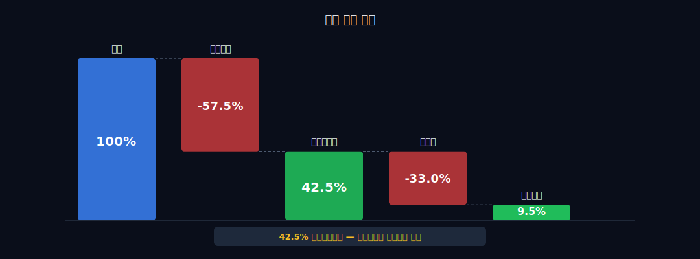
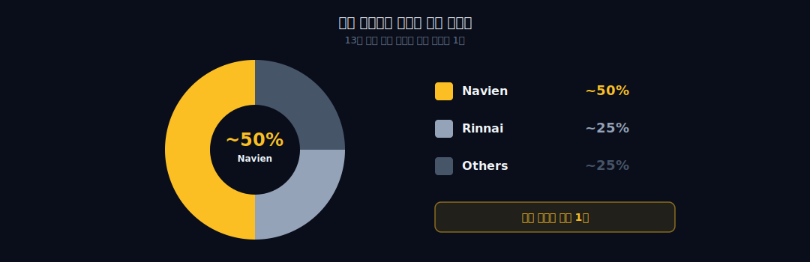
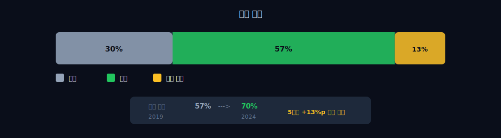
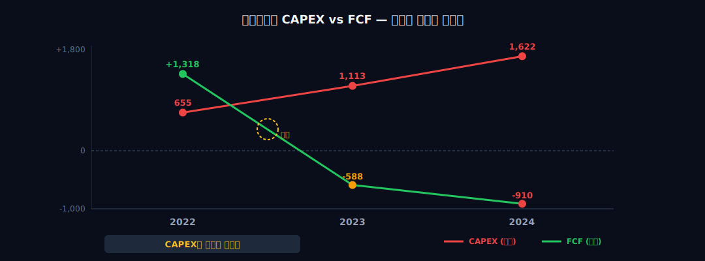
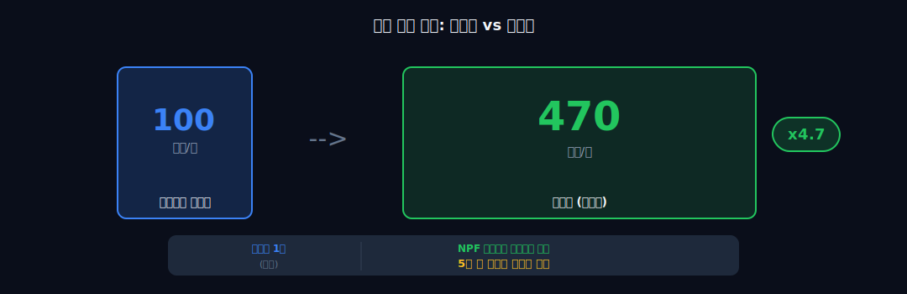
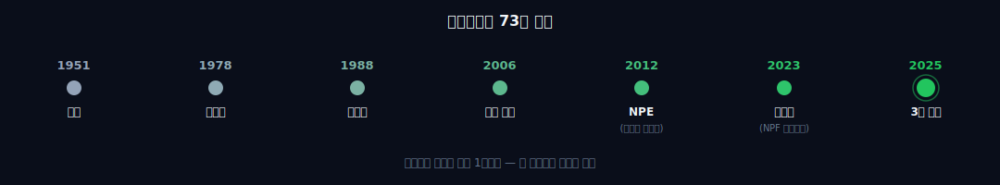

> **성장 + 자본집약** | 제조 > 보일러·온수기 | 2026-04-10 dartlab 실측
> 같은 시리즈: [SK하이닉스](/blog/000660-skhynix) · [삼양식품](/blog/003230-samyang-foods) · [두산에너빌리티](/blog/034020-doosan-enerbility) · [알테오젠](/blog/196170-alteogen) · [HMM](/blog/011200-hmm) · [셀트리온](/blog/068270-celltrion) · [한화에어로스페이스](/blog/012450-hanwha-aerospace) · [HD현대일렉트릭](/blog/267260-hd-hyundai-electric) · [고려아연](/blog/010130-korea-zinc) · [에이피알](/blog/278470-apr) · [크래프톤](/blog/259960-krafton) · [달바글로벌](/blog/483650-dalba-global) · [기업이야기 시리즈 전체](/blog/series/company-reports)

---

## 보일러 회사의 매총이익률이 42%라고?

```python
import dartlab
c = dartlab.Company("009450")
c.analysis("financial", "종합평가")
```


종합평가 스코어카드가 묘한 그림을 그린다. 수익성 **A**, 이익품질 **A**, 재무정합성 **A**. 그런데 안정성 **C**, 성장 **C**, 효율성 **C**. Piotroski **4/9**.

A와 C가 동시에 존재한다. 이건 뭘 의미하는가? 잘 벌고 있는데 어딘가에 돈을 쏟아붓고 있다는 뜻이다. "돈을 잘 버는 회사가 왜 현금이 없는가?" 이 질문이 경동나비엔이라는 회사의 핵심을 관통한다.

보일러를 만드는 제조업체다. 그런데 매출총이익률이 42.5%. 제조업에서 이 숫자는 설명이 필요하다. 자동차(현대차 18%), 반도체(삼성전자 36%), 철강(POSCO 14%). 화장품(에이피알 76%, 달바 76%)과 비교하면 절반이지만, **제조업 평균의 두 배**다. 보일러를 만들어서 42%를 남긴다는 건, 이 회사가 파는 게 단순한 보일러가 아니라는 뜻이다.

숫자부터 열어보자.

---

## 1막 — 1951년, 민둥산에서 시작된 여정

1951년. 한국전쟁 한복판이다. 산은 벌거벗었다. 땔감이 없으니 겨울을 날 수가 없었다. **손도익**(1921~2009)이라는 사람이 이 민둥산을 보고 무산연탄(茂山煉炭)을 세웠다. '무산(茂山)'은 '산이 다시 무성해지길'이라는 뜻이다. 나무 대신 연탄을 때면 산이 살아난다 — 이것이 이 회사의 시작이다.

여기서 70년을 빨리 감자. 연탄 → 보일러 → 온수기 → 퍼네스. 이 회사는 매번 **"난방의 다음 카테고리"**로 점프해왔다. 에너지원이 바뀔 때마다 사라지는 대신 진화했다. 지금은 미국 가정의 온수를 책임지고 있다.

```python
c.select("IS", ["매출액", "영업이익"], freq="Y")
```

경동나비엔의 핵심 숫자를 보자. 매출총이익률이 왜 제조업 평균의 두 배인지, 이 표에서 실마리가 시작된다.

| 연도 | 매출 | 영업이익 | OPM | 매총이익률 |
|------|------|---------|-----|----------|
| 2025 | 15,019억 | 1,433억 | 9.54% | 42.5% |
| 2024 | 13,539억 | 1,325억 | 9.79% | 45.1% |
| 2023 | 12,053억 | 1,059억 | 8.79% | 42.7% |
| 2022 | 11,591억 | 597억 | 5.15% | 40.3% |
| 2021 | 11,013억 | 642억 | 5.83% | 38.0% |

7년 전(2018) 매출 9,578억에서 2025년 15,019억. **+57%**. 연평균 6.6% 성장. 화려하지 않다. 삼양식품(해외 매출 3배)이나 에이피알(매출 5배)과 비교하면 조용한 편이다. 하지만 이 회사의 진짜 이야기는 성장률이 아니라 **성장의 질**에 있다.

매총이익률을 보자. 2021년 38.0%에서 2025년 42.5%로 **4.5%p 상승**. 매출이 늘면서 마진도 같이 올라갔다. 규모의 경제가 아니라, **제품 믹스가 바뀌고 있다**는 뜻이다. 더 비싼 걸 더 많이 팔고 있다.

그런데 OPM(영업이익률)은 2021년 5.83%에서 2025년 9.54%로 올랐지만, 매총이익률(42.5%)과의 갭이 **33%p**나 된다. 즉 판관비가 매출의 33%를 잡아먹는다. 이건 어디로 가는 돈인가?

```python
c.analysis("financial", "비용구조")
```



답은 **해외 영업**이다. 미국·캐나다에 법인을 두고, 현지 영업망을 운영하고, plumber(설치업자) 네트워크를 관리하는 비용이 판관비의 상당 부분을 차지한다. 국내 보일러만 팔았다면 이 비용이 없다. 하지만 이 비용 때문에 미국 시장 1위가 되었다. 비용이 아니라 **투자**다.

---

## 2막 — 연탄에서 콘덴싱까지, 기술이 해자가 된 순간

1막에서 "보일러인데 왜 42%인가" 질문을 던졌다. 답: **콘덴싱 기술**. 일반 보일러가 버리는 배기가스의 열(잠열)을 회수해서 효율 95%+를 뽑아낸다. 이걸 가능하게 하는 핵심 부품이 **스테인리스 스틸 열교환기** — 강산성 응축수가 구리/알루미늄을 녹이는 문제를 경동이 1998년에 세계 최초로 해결했다. 이 기술을 가진 회사가 전 세계에 손에 꼽는다.

이 기술 격차가 마진 격차로 직결된다:

| 회사 | 매총이익률 | OPM | 해외 비중 |
|------|----------|-----|---------|
| **경동나비엔** | **42.5%** | **9.5%** | **70%** |
| 귀뚜라미 (보일러) | ~25% | **적자** | 내수 중심 |
| Rinnai (일본) | ~35% | ~7% | 글로벌 |

같은 보일러인데 매총이익률이 17%p 차이. 콘덴싱 프리미엄(+30~50% 판가) + 해외 고가 시장 믹스 = 42.5%의 정체다.

타임라인의 핵심은 하나다. 1988년 콘덴싱 개발부터 2006년 미국 진출까지 **18년**. 콘덴싱 기술을 갈고닦은 뒤에야 미국에 갔다. 1998년에는 세계 최초 스테인리스 콘덴싱 열교환기까지 개발해, 아무도 따라올 수 없는 기술 해자를 먼저 팠다. **기술이 먼저, 시장이 나중.** 이 순서가 중요하다. 귀뚜라미는 기술 없이 시장(내수)에 남았고, 경동은 기술을 쌓은 뒤 시장(해외)을 열었다.

국내 브랜드 인지도는 귀뚜라미 > 린나이 > 경동 순서다. 그런데 **매출은 경동이 1위**. 2024년 귀뚜라미 보일러 본업 매출 3,225억에 영업손실 **-45억**(2년 연속 적자). 같은 기간 경동 매출 1.35조에 영업이익 **+1,325억**. 같은 보일러인데 하나는 적자, 하나는 OPM 10%. 갈림길은 간단하다 — 귀뚜라미는 정체된 내수에 남았고, 경동은 콘덴싱으로 해외를 열었다. **같은 출발선에서 20년이 지나면 기술 선택이 재무제표를 결정한다.**

2세 **손연호**가 이 기술 투자와 북미 진출을 주도했다. 차남으로 알려져 있고, 한국 재계에서 "은둔의 경영자"로 불린다. 인터뷰도 거의 없고, 공개 행사에도 잘 나타나지 않는다. 그러면서 회사의 해외 매출을 전체의 70%까지 끌어올렸다.

하지만 여기서 멈추지 말고, 왜 이 기술이 매총이익률 42%로 직결되는지를 숫자로 확인하자.

콘덴싱 프리미엄은 **+30~50% 판가**로 나타난다. 열효율이 높으니 가스비가 줄고, 각국 에너지 규제(미국 ENERGY STAR, 유럽 ErP)를 충족한다. **규제가 강해질수록 콘덴싱 수요가 늘고, 해자가 깊어진다.** 그리고 이 기술은 5막에서 보겠지만, 보일러·온수기를 넘어 **퍼네스(5배 큰 시장)**까지 확장되고 있다 — 30년 전 기술 선택의 복리 효과다.

---

## 3막 — 미국인의 샤워를 바꾼 PVC 파이프

2006년 캘리포니아 어바인에 Navien Inc.를 세웠을 때, 연간 판매량은 **2만 대**였다. 미국 온수기 시장에서 아무도 모르는 한국 브랜드. 그런데 지금은 **연 60만 대 이상**, 누적 **500만 대**. 16년 만에 30배 성장했다.

어떻게?

미국 가정의 온수 공급 방식을 이해해야 한다. 미국은 거대한 **탱크식 온수기**(tank water heater) 중심 시장이다. 지하실에 150~300리터짜리 물탱크를 놓고, 물을 미리 데워둔다. 에너지 효율이 낮고, 물탱크가 차면 뜨거운 물이 떨어진다. 하지만 **싸고 설치가 쉽다**. 미국 plumber(설치업자)에게 익숙한 시스템이다.

경동나비엔이 2012년 내놓은 **NPE 콘덴싱 순간식 온수기**(tankless water heater)가 게임 체인저가 된 이유는, 기술 자체가 혁신적이었기 때문이 아니다. 물론 기술도 좋았다 — 순간적으로 물을 데우니까 뜨거운 물이 끊기지 않고, 에너지 효율이 90% 이상이다. 하지만 **진짜 혁신은 PVC 파이프에 있었다.**

일반 온수기의 배기가스 온도는 200~300도. 금속 배관으로 배기해야 한다. 설치 비용이 높고, 기존 주택에 금속 배관을 새로 뚫어야 하는 경우가 많다. **콘덴싱 온수기는 배기가스를 냉각시켜 응축**하므로 배기 온도가 40~60도까지 내려간다. 이 온도면 **PVC 파이프**로 배기가 가능하다.

미국 plumber는 PVC를 매일 다룬다. 배관 공사의 기본 소재다. 금속 배관 용접 없이, **기존 도구만으로 설치**할 수 있다는 것. 이게 전부다. 기술을 만든 게 아니라, **설치하는 사람의 편의를 설계**한 것이다.



이 설계 철학이 입소문을 만들었다. plumber가 다른 plumber에게 추천하고, 배관 용품점에서 추천하고, YouTube에 설치 영상이 올라오기 시작했다. 미국 소비자 리뷰 사이트에는 "Thank you Navien — 따뜻한 물이 끊기지 않는다"라는 후기가 쌓여 있다. 경동나비엔은 미국에서 광고비를 쏟아붓지 않았다. **채널의 채널**(plumber → 소비자)을 설계한 것이다.

여기서 하나 더 — 미국 가정에서 탱크리스로의 전환은 아직 **25~30%**에 불과하다. 나머지 70%가 여전히 탱크식이다. 미국 에너지부(DOE)가 2029년부터 신규 온수기 효율 기준을 강화하면, 탱크식의 상당수가 기준을 못 맞춘다. **규제가 시장 전환을 강제하는 구조** — 경동나비엔이 이미 50%를 점유한 시장이 앞으로 2~3배 더 커질 수 있다는 뜻이다.

```python
c.analysis("financial", "성장성")
```



이제 매출 구성의 변화를 보자. 해외 매출 비중이 2019년 57%에서 2024년 **70%**까지 올라갔다. 그리고 해외 매출의 82%가 북미다. 즉 전체 매출의 **57%가 북미**에서 나온다. 한국 보일러 회사가 아니라, **미국 온수기 회사가 한국에서도 보일러를 파는 구조**로 뒤집어졌다.

경쟁 구도를 보면:
- **Navien(한국)** — 콘덴싱 탱크리스 온수기 미국 1위
- **Rinnai(일본)** — 탱크리스 시장 2위. 비콘덴싱 중심에서 전환 중
- **Rheem(미국)** — 탱크식 1위. 탱크리스 시장에서는 후발

탱크리스 온수기 시장에서 경동나비엔이 **점유율 약 50%**로 추정된다. 미국 시장의 절반이다. 그런데 전체 미국 온수기 시장에서 탱크리스 비중은 아직 **25~30%** 수준. 나머지 70%가 여전히 탱크식이다. 콘덴싱 규제가 강화될수록 탱크리스 전환이 가속되고, 경동의 점유율 기반이 넓어진다. 이것이 이 회사의 성장 내러티브다.

---

## 4막 — 이익은 나는데 현금이 없다

여기서부터가 이 글의 핵심이다. 매총이익률 42%, OPM 9.5%, 영업이익 1,433억. 잘 벌고 있다. 그런데 **현금이 없다**.

```python
c.analysis("financial", "자금조달")
```

현금흐름표를 펼치면 모순의 정체가 드러난다. CAPEX(자본적 지출)가 이익을 삼키는 속도를 보자.

| 연도 | 영업CF | CAPEX | FCF | 금융차입 |
|------|--------|-------|-----|---------|
| 2021 | 1,069억 | 410억 | **+659억** | 2,039억 |
| 2022 | 774억 | 550억 | **+224억** | — |
| 2023 | 778억 | 655억 | **+1,318억** | — |
| 2024 | 525억 | 1,113억 | **-588억** | — |
| 2025 | 711억 | 1,622억 | **-910억** | 3,423억 |

2023년까지는 괜찮았다. FCF 플러스. 번 돈으로 투자하고도 현금이 남았다. 그런데 2024년부터 **두 가지가 동시에 터졌다.**

첫째, 2024년 SK매직의 주방가전 사업을 인수해 **나비엔매직**을 출범시켰다. 정수기·식기세척기·인덕션. "난방"에서 "가정 내 열과 물을 다루는 모든 것"으로 범위를 넓힌 것이다. 둘째, 5막에서 자세히 보겠지만 미국 퍼네스 시장 진출을 위한 대규모 설비 투자가 시작됐다.

결과: CAPEX 655억 → 1,113억 → **1,622억**. 3년 만에 2.5배. 영업CF(711억)의 **두 배 이상을 투자**하고 있다. FCF **2년 연속 마이너스**. 모자라는 돈은? 금융차입이 2,039억에서 3,423억으로 **+68%**.

```python
c.show("CF", freq="Y")
```



부채비율 61% → 97%. 하지만 97%는 제조업 평균(100~150%)에서 **정상 범위**다. 문제는 부채비율이 아니라 **현금 흐름의 방향**이다. 이익이 나는데 현금이 줄고 빚이 느는 구조 — 무너지는 신호일 수도, **다음 카테고리에 올인하는 신호**일 수도 있다.

**배당 0원**. 유보율 91%. 번 돈을 전부 재투자한다. 이건 경영자의 확신이거나 도박이다. CAPEX 1,622억의 구체적 행선지를 보면 알 수 있다.

---

## 5막 — 온수기 다음은 퍼네스, 5배 큰 시장에 베팅했다

4막의 답이다. CAPEX가 어디로 가는가?

**퍼네스(furnace)**. 미국 가정의 난방 장치다. 한국의 보일러가 바닥에 물을 돌려서 데우는 온수 난방이라면, 미국의 퍼네스는 **공기를 데워서 덕트로 보내는 온풍 난방**이다. 미국 주택의 60% 이상이 퍼네스를 사용한다.

숫자를 보자.
- 미국 탱크리스 온수기 시장: 연 **100만 대**
- 미국 퍼네스 시장: 연 **470만 대**

**5배 차이.** 경동나비엔이 탱크리스 온수기로 연 60만 대를 팔아 매출의 57%를 만들었다면, 퍼네스에서 같은 점유율을 달성하면 어떻게 되는가? 단순 산술로도 매출이 **2~3배** 뛸 수 있는 시장이다.

경동나비엔이 내놓은 무기는 **NPF 하이드로 퍼네스**(Navien Premium Furnace). 이 제품의 특이점은 일반 가스 퍼네스가 아니라는 것이다. **"물로 공기를 데우는"** 구조다.

일반 퍼네스: 가스 → 열교환기 → 뜨거운 공기 → 덕트
하이드로 퍼네스: 가스 → 콘덴싱 보일러 → 뜨거운 물 → 열교환기 → 뜨거운 공기 → 덕트

왜 굳이 물을 한 번 거치는가? 콘덴싱 열교환이 공기 열교환보다 **열전달 효율이 높기 때문**이다. 그리고 이 구조는 **온수 공급도 동시에** 할 수 있다. 퍼네스 + 온수기를 하나로 합친 것. 미국 가정이 보일러, 온수기, 퍼네스를 따로 사야 했던 것을 **하나의 시스템**으로 통합한다.

경동이 30년간 갈고닦은 콘덴싱 보일러 기술과 탱크리스 온수기 기술이 여기서 결합된다. 연탄 → 보일러 → 온수기 → 퍼네스. **70년간 축적한 모든 기술이 이 제품에 수렴**한다.

2023년 첫 출하. 4개월 만에 **245% 성장**. 아직 매출 규모는 작지만, 초기 반응은 온수기 NPE 출시 초기보다 빠르다.



그리고 2026년 **텍사스 공장** 착공이 예정되어 있다. 왜 텍사스인가? 두 가지 이유다.

첫째, 물류. 미국 중남부에 공장을 두면 동부와 서부 모두 커버할 수 있다. 현재 캘리포니아(어바인)에 본사/물류 거점이 있지만, 생산은 한국에서 한다. 미국 현지 생산으로 전환하면 물류비가 줄고, 리드타임이 단축된다.

둘째, **관세**. 트럼프 행정부의 관세 정책(25%)에 대한 선제 대응이다. 한국에서 만들어 미국에 수출하면 25% 관세를 맞는다. 미국에서 만들면 0%다. 텍사스 공장은 단순한 생산 시설이 아니라 **관세 방어막**이다.

이것이 CAPEX 1,622억의 행선지다. 퍼네스 생산 확대 + 텍사스 공장 건설 + 미국 영업망 확충. "이익이 나는데 현금이 없는" 이유는 **회사가 무너지기 때문이 아니라, 70년 역사에서 가장 큰 카테고리로 점프하고 있기 때문**이다.



**연탄 → 보일러 → 온수기 → 퍼네스.** 매번 다음 카테고리로 점프할 때마다, CAPEX가 먼저 올라가고, FCF가 마이너스로 갔다가, 새 카테고리의 매출이 들어오면서 회복되는 패턴이 반복되었다. 지금은 그 사이클의 **투자 구간**에 있다.

---

## 6막 — 3세 경영과 다음 재무제표

2025년 3월, **손흥락**(1981~)이 대표이사에 취임했다. 3세 경영의 공식 시작이다.

위스콘신매디슨대 경제학과 출신. 2008년 입사해 **미국 법인 설립에 직접 참여**했다. 영업마케팅 총괄을 거쳐 대표이사로 올라왔다. 미국 현장에서 plumber 네트워크를 구축한 경험이 있는 사람이 회사를 이끌게 된 것이다. 이건 우연이 아니라, 회사의 무게중심이 어디인지를 보여준다.

할아버지 손도익이 민둥산에서 연탄을 만들었고, 아버지 손연호가 콘덴싱 기술로 미국에 진출했고, 손흥락이 퍼네스로 미국 HVAC 시장에 본격 진입한다. 3대에 걸친 카테고리 점프다.

이 회사의 다음 재무제표에서 모든 것이 수렴하는 지점이 하나 있다. **텍사스 공장 양산 시작일**이다.

텍사스 공장이 돌아가면 관세 25%가 0%로 바뀌고, 물류비가 줄고, 리드타임이 단축된다. 동시에 비용이 달러화되니 환율 헤지가 되고, CAPEX/매출 10.8%가 내려가면서 2년간 음수였던 FCF가 플러스로 뒤집힌다. 퍼네스 매출이 세그먼트에 잡히면, 시장은 "보일러 회사"가 아니라 "미국 HVAC 플랫폼"으로 이 회사를 보기 시작한다. 금융차입 3,423억이 이 시점에서 정점을 찍는지, 4,000억을 넘기며 이자 부담이 영업이익의 10%를 초과하는지 — 이것이 수익성A가 유지되느냐의 분기선이다.

**모든 리스크와 모든 기회가 2027~2028년 텍사스 양산에 수렴한다.** CAPEX, FCF, 관세, 환율, 퍼네스 — 다섯 변수가 같은 시점에 답을 내놓는다.

내 판단: **이 회사는 지금 사야 하는 회사가 아니라, 지금 추적을 시작해야 하는 회사다.** FCF가 마이너스인 투자 구간에서 밸류에이션은 불안정하다. 하지만 텍사스 공장이 가동되고 퍼네스 매출이 잡히는 그 시점에 — 재무제표가 완전히 다른 이야기를 한다면, 지금 추적을 시작한 사람만 그 변화를 읽을 수 있다.

**텍사스 양산일을 달력에 적어두자.** 그날 경동나비엔의 CF 표를 다시 열면, FCF 칸에 플러스가 찍혀 있을 수도 있다. 1951년 민둥산에서 시작된 이 회사가 미국 HVAC 플랫폼으로 변신하는 순간을, 재무제표가 가장 먼저 알려줄 것이다.

---

## 부록 — 재무제표 5년

이 회사를 직접 열어보고 싶다면:

```python
import dartlab
c = dartlab.Company("009450")
c.show("IS", freq="Y")
c.show("BS", freq="Y")
c.show("CF", freq="Y")
c.analysis("financial", "수익성")
c.analysis("financial", "비용구조")
c.analysis("financial", "자금조달")
c.analysis("financial", "종합평가")
```

### 손익계산서 (IS)

연결 기준이다. 단위는 억원. 매총이익률이 40%대에서 꾸준히 유지되는 점에 주목하자.

| 항목 | 2025 | 2024 | 2023 | 2022 | 2021 |
|---|---:|---:|---:|---:|---:|
| 매출 | 15,019 | 13,539 | 12,053 | 11,591 | 11,013 |
| 매출총이익률 | 42.5% | 45.1% | 42.7% | 40.3% | 38.0% |
| 영업이익 | 1,433 | 1,325 | 1,059 | 597 | 642 |
| OPM | 9.54% | 9.79% | 8.79% | 5.15% | 5.83% |
| 순이익 | 688 | 930 | 699 | 430 | 488 |

2022년 OPM이 5.15%로 바닥을 찍었다. 원자재(구리·스테인리스) 가격 급등이 마진을 눌렀다. 2023년부터 원자재 안정 + 해외 믹스 확대로 회복.

### 재무상태표 (BS)

부채비율 97%는 수치만 보면 높아 보이지만, 제조업 평균(100~150%)과 비교하면 정상 범위다. 핵심은 부채비율이 아니라 차입금의 용도다.

| 항목 | 2025 | 2024 | 2023 | 2022 | 2021 |
|---|---:|---:|---:|---:|---:|
| 총자산 | 15,278 | 13,961 | 12,148 | 10,951 | 9,680 |
| 부채 | 7,516 | 6,634 | 4,755 | 4,274 | 3,654 |
| 자본 | 7,762 | 7,327 | 7,392 | 6,677 | 6,026 |
| 현금 | 1,312 | 1,414 | 1,756 | 1,069 | 1,182 |
| 부채비율 | 97% | 91% | 64% | 64% | 61% |

총자산이 5년 만에 9,680→15,278억으로 **58% 증가**. 이 자산 증가분의 대부분이 유형자산(공장·설비)과 사용권자산이다. 즉 생산능력에 투자한 결과.

### 현금흐름표 (CF)

FCF 마이너스의 정체가 여기 있다. CAPEX 증가 속도가 영업CF 증가 속도를 압도한다.

| 항목 | 2025 | 2024 | 2023 | 2022 | 2021 |
|---|---:|---:|---:|---:|---:|
| 영업CF | 711 | 525 | 778 | 774 | 1,069 |
| CAPEX | 1,622 | 1,113 | 655 | 550 | 410 |
| FCF | -910 | -588 | 1,318 | 224 | 659 |

2021년 영업CF 1,069억 → 2025년 711억. 영업CF 자체는 매출 성장에 비해 **뒤처지고 있다**. 이유는 매출채권과 재고 증가(운전자본 투자). 해외 매출이 늘면서 매출채권 회수 기간이 늘어난 것이다. 이것도 해외 성장의 부산물이다.

---

## 마무리 — 번 돈을 전부 다음 카테고리에 쏟는 회사

연탄 → 보일러 → 온수기 → 퍼네스.

손도익이 민둥산에서 시작한 여정은 손연호의 콘덴싱 기술을 거쳐, 손흥락의 퍼네스로 이어지고 있다. 3대에 걸쳐 매번 "난방의 다음 카테고리"로 점프해온 회사다.

이 회사의 재무제표가 말하는 건 하나다 — **번 돈을 전부 다음 카테고리에 쏟는다.** 매총이익률 42%라는 기술 해자가 있고, 미국 탱크리스 1위라는 시장 지위가 있고, 퍼네스라는 5배 큰 시장이 눈앞에 있다. CAPEX가 이익을 삼키는 건 이 베팅 때문이다.

그 베팅이 매출로 돌아오는 시점이 FCF 전환점이고, 이 회사의 가치가 재평가되는 시점이다. 텍사스 공장이 양산을 시작하고, 퍼네스 매출이 세그먼트에 잡히고, CAPEX/매출이 내려가기 시작하면 — 그때가 이 회사의 재무제표가 전혀 다른 이야기를 하는 시점이다.

그때까지, 재무제표는 계속 "이익은 나는데 현금이 없다"고 말할 것이다. 그 문장이 불안 신호인지, 성장 신호인지는 위의 5개 숫자가 답해줄 것이다.

---

## 검증표

| 본문 수치 | 출처 |
|-----------|------|
| 매출 15,019억, OPM 9.54% | dartlab `c.select("IS", ...)` 실측 |
| 매총이익률 42.5% | dartlab 실측 |
| CAPEX 655→1,622억 (3년 2.5배) | dartlab `c.show("CF")` 실측 |
| FCF -910억 (2025) | dartlab 실측 (영업CF - CAPEX) |
| 금융차입 2,039→3,423억 (+68%) | dartlab 실측 |
| 배당 0원, 유보율 91% | dartlab 실측 |
| 부채비율 97% (2025) | dartlab 실측 |
| Piotroski 4/9 | dartlab `c.analysis("financial", "종합평가")` 실측 |
| 손도익 1951년 무산연탄 설립 | 헤럴드경제 |
| 1988년 아시아 최초 콘덴싱 보일러 | 서울경제 |
| 1998년 세계 최초 스테인리스 열교환기 | 경동나비엔 공식 |
| Navien Inc. 2006년 설립 | Navien 공식 |
| NPE 2012년 출시 | 가스신문 |
| 연 60만대+, 누적 500만대 | Navien 공식, 서울경제 |
| 해외 70%, 북미 57% | 블로터, 소비자뉴스 |
| 퍼네스 시장 470만대 | thebell |
| NPF 4개월 245% 성장 | 중앙뉴스 |
| 손흥락 2025.03 대표이사 | 한국경제 |
| 귀뚜라미 보일러 2년 적자, 매출 3,225억, 영업손실 -45억 | 글로벌에픽 |
| 미국 탱크리스 전환율 25~30% | 미국 에너지부(DOE) |
| DOE 2029년 효율 기준 강화 | Federal Register |
| 나비엔매직 (SK매직 주방가전 인수) | 경동나비엔 IR |

## 외부 출처

- [헤럴드경제 — 민둥산이 안타까웠던 경동나비엔](https://biz.heraldcorp.com/article/10670527)
- [한국경제 — 경동나비엔 3세 경영 시작](https://www.hankyung.com/article/202503261180i)
- [가스신문 — NPE 미국 시장](https://www.gasnews.com/news/articleView.html?idxno=68587)
- [thebell — K-퍼네스로 정면승부](https://m.thebell.co.kr/m/newsview.asp?svccode=&newskey=202303161854199680106518)
- [블로터 — 4년 연속 1조클럽](https://www.bloter.net/news/articleView.html?idxno=634667)
- [서울경제 — 히든챔피언](https://www.sedaily.com/NewsVIew/1VN5Q7G72S)
- [글로벌에픽 — 경동 vs 귀뚜라미](https://www.globalepic.co.kr/view.php?ud=20251028151730562348439a4874_29)
- [Navien Inc. 공식](https://www.navieninc.com/about)
