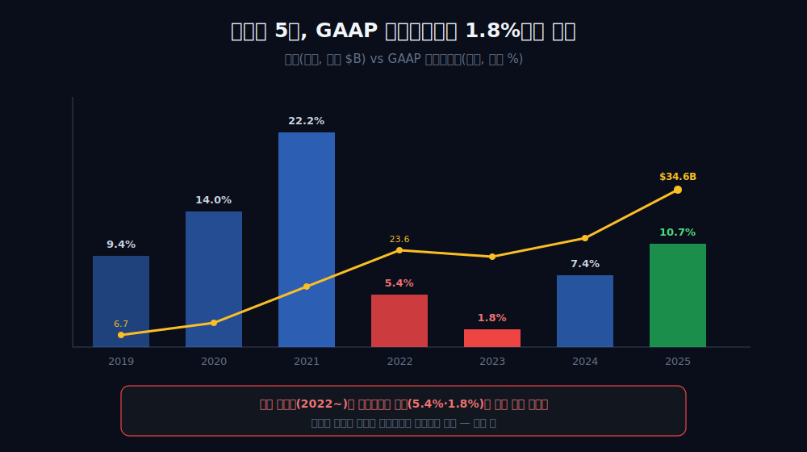
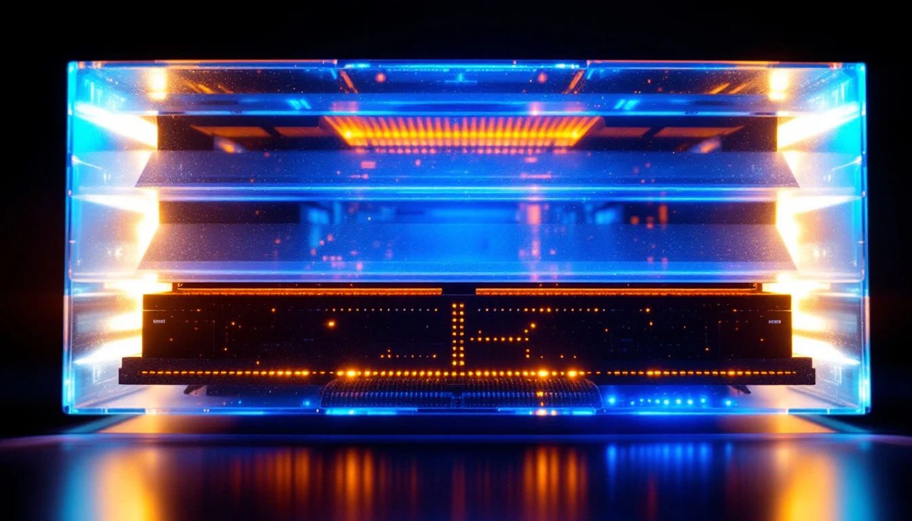
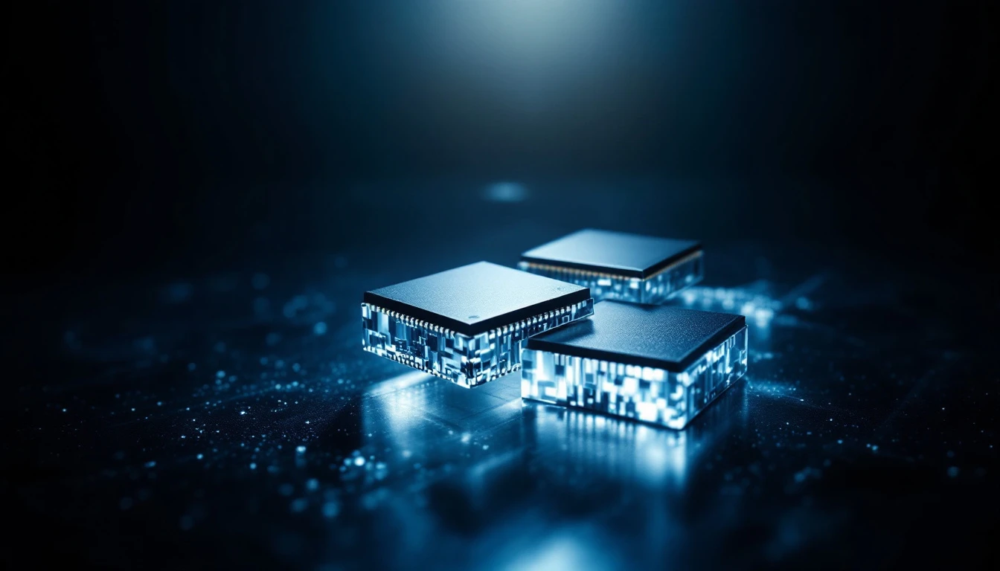
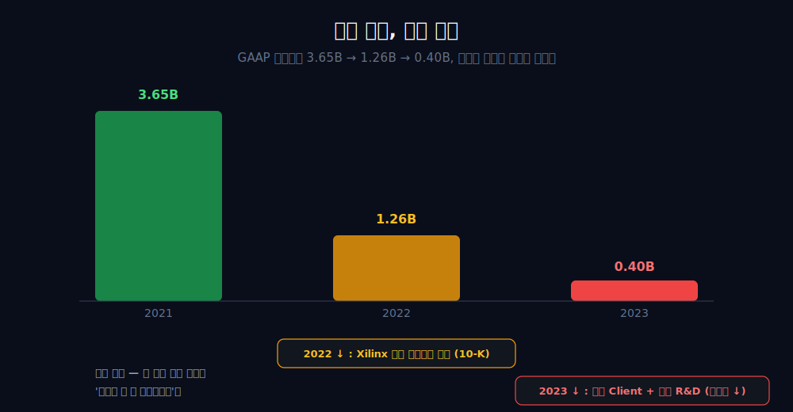
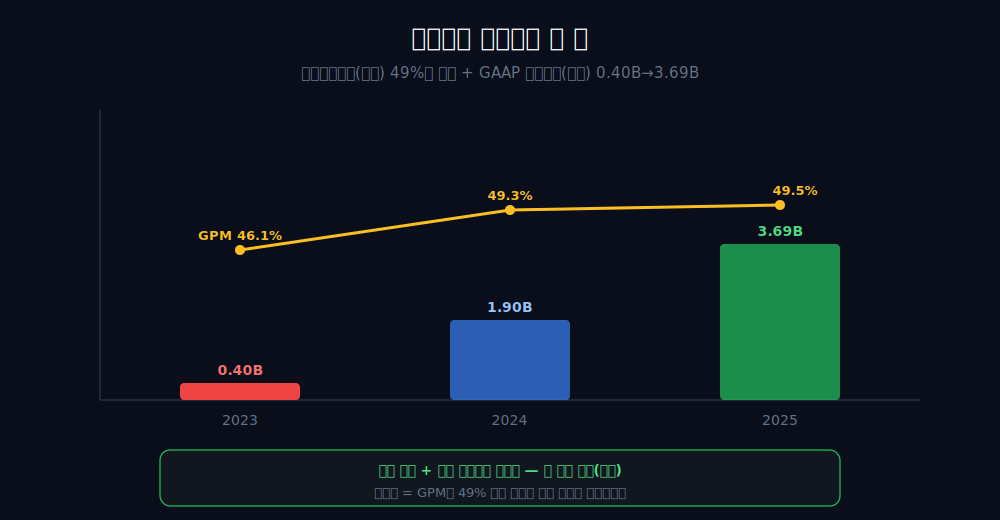
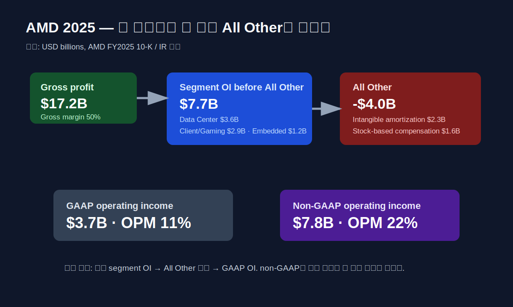

<script>
import ComboChart from '$lib/components/blog/ComboChart.svelte';
import StackBar from '$lib/components/blog/StackBar.svelte';
</script>

> **데이터 기준**: 2026-06-20 dartlab 실측 — Advanced Micro Devices(AMD) **미국 연결(USD)** 기준, 분기 데이터를 역년으로 합산. Xilinx 인수가·무형자산 상각 분해·non-GAAP·세그먼트별 매출 비중·2020년 세무 환입은 연결 손익에 한 줄로 합쳐지거나 아예 안 나오므로 **10-K·IR·공시(외부 인용)**로 표기. ※대차대조표 항목은 매핑이 불안정해 인용에 주의.
>
> **핵심 숫자**: 매출 **$34.64B** (2021→2025 **2.1배**) · 매출총이익률(GPM) **49.5%** · GAAP 영업이익률(OPM) 2021 **22.2%** → 2023 **1.8%** → 2025 **10.7%** · dartlab CF 행 2025 **$7.71B** (10-K 계속사업 OCF **$6.5B**, 라벨 분리)
>
> **이 글의 용어**: GPM(매출총이익률)·OPM(영업이익률)·NPM(순이익률) = 별개 비율 · 무형자산 상각 = 인수로 장부에 올린 무형자산을 매년 비용으로 깎는 비현금 항목 · GAAP = 회계기준 손익 · non-GAAP = 회사가 상각·주식보상 등을 빼고 따로 제시하는 보조 손익(외부).

---

## 프롤로그 — 같은 해, 두 줄, 정반대의 답

2023년, AMD의 GAAP 영업이익률은 **1.8%**였다. 100원을 팔아 2원도 채 남기지 못했다는 뜻이다.

같은 해, 같은 손익계산서의 위쪽 줄 — 매출총이익률은 **46%**였다. 100원을 팔아 46원이 남았다는 뜻이다.



한 회사의 한 해를 두고, 어느 줄을 짚느냐에 따라 '거의 못 벌었다'와 '절반 가까이 남겼다'가 동시에 참이 된다. 두 줄 사이에서 사라진 44원은 어디로 갔는가. 그 답의 절반은 1년 전, AMD가 자기보다 큰 회사를 자사 주식으로 사들이며 장부에 올린 약 350억 달러의 무형자산에 적혀 있다 — 회사는 그 인수 대금을 이미 2022년에 결제했지만, **회계 청구서는 매 분기 손익계산서로 나뉘어 도착하는 중이다.** 나머지 절반은, 그냥 안 좋았던 해였다는 더 단순한 사실에 있다.



이 글은 그 두 줄의 간극을, 연결 손익이 증명할 수 있는 선까지만 따라간다.

---

## 1막 — 위는 신고점, 아래는 절벽

**왜 같은 손익계산서의 두 줄이 정반대로 움직였나.** 손익계산서가 위에서 아래로 한 방향으로만 흐르지 않고, 매출총이익 라인과 영업이익 라인 사이에서 갈라졌기 때문이다.

```python
import dartlab
c = dartlab.Company("AMD")
c.select("IS", ["매출액", "매출총이익", "영업이익"], freq="Q")  # 분기→역년 합산
```

| 항목 ($B) | 2021 | 2022 | 2023 |
|---|---:|---:|---:|
| 매출 | 16.43 | 23.60 | 22.68 |
| 매출총이익 | 7.93 | 10.60 | 10.46 |
| 매출총이익률(GPM) | 48.2% | 44.9% | 46.1% |
| GAAP 영업이익 | 3.65 | **1.26** | **0.40** |
| 영업이익률(OPM) | 22.2% | 5.4% | 1.8% |

매출은 2021년 $16.43B에서 2022년 $23.60B로 신고점을 찍었고, 매출총이익도 $10.60B로 두꺼웠다. 매출총이익률은 44.9~48.2% 밴드 안에 그대로 있었다. 그런데 **바로 그 구간에서 GAAP 영업이익만 $3.65B→$1.26B→$0.40B로 무너졌다.**

여기서 방향을 분명히 하자. GPM과 OPM은 *별개 비율*이다. 2023년의 'GPM 46% vs OPM 1.8%'를 한 비율처럼 섞으면 안 된다. 매출총이익 라인이 두꺼운데 영업이익 라인이 얇다면, 그 사이 어딘가에서 큰 비용이 영업이익만 갉아먹었다는 뜻이다. 두 라인의 분기 자체는 연결 손익이 증명한다 — 그 *원인*이 무엇인지는 다음 막에서 외부 자료로 확인한다.

---

## 2막 — 청구서의 정체: 350억 달러를 장부에 올리던 날

**2022년 영업이익이 왜 한 번에 주저앉았나.** AMD가 그해 2월 자기보다 큰 회사를 사들이며, 장부에 거대한 무형자산을 올렸기 때문이다.

2022년 2월 14일, AMD는 FPGA 강자 **Xilinx 인수를 완료**했다. 2020년 10월 발표 당시 전액 주식 거래로 약 350억 달러였는데, 발표와 완료 사이 AMD 주가가 오르면서 완료 시점 총 대가는 약 **488억 달러**로 재평가됐다 [외부 인용·[AMD IR](https://ir.amd.com/news-events/press-releases/detail/1115/amd-reports-fourth-quarter-and-full-year-2022-financial-results)]. 여기서 한 가지는 정확히 해 두자 — 이건 'AMD가 정점의 주식을 일부러 동원했다'는 의도가 아니라, *전액 주식 거래가 주가 상승으로 장부가가 커진 기계적 결과*다.

이 인수로 AMD는 약 350억 달러의 무형자산을 장부에 올렸고, 그것이 매년 비용으로 상각되어 손익을 눌렀다. AMD의 10-K는 2022 회계연도 인수 관련 무형자산 상각을 **매출원가에 약 14.48억 달러, 영업비용에 약 21.00억 달러, 합계 약 35억 달러**로 분해한다 [외부 인용·[AMD 10-Q (SEC)](https://www.sec.gov/Archives/edgar/data/2488/000000248823000139/amd-20230701.htm)]. 회사가 상각·주식보상·인수통합비를 빼고 따로 제시하는 non-GAAP 영업이익은 2022년 약 $6.3B인데, GAAP은 약 $1.3B이었다 — 그 약 $5B 격차의 대부분이 이 비현금 항목들이다 [외부 인용].



핵심은 이거다 — 영업의 실수가 아니라, *과거에 결제한 인수대금의 청구서가 매 분기 손익계산서로 도착하는 구조*다. 다만 이 상각 분해는 연결 손익엔 한 줄로 합쳐져 보이지 않으므로, 본문은 '영업이익이 무너진 이유는 상각이다'를 단정하지 않고 '10-K가 그렇게 적는다'는 인용으로만 둔다.

---

## 3막 — 2023년은 상각의 해가 아니었다

**그럼 2023년 영업이익이 0.40B로 한 번 더 내려앉은 것도 상각 탓인가.** 아니다. 여기서 인과를 한 번 끊어야 한다.

2023년 GAAP 영업이익은 $0.40B(10-K 기준 약 4.01억 달러), OPM 1.8%로 한 칸 더 주저앉았다. 같은 붕괴처럼 보이니 '또 Xilinx 상각 탓'으로 묶고 싶어진다. **그런데 10-K MD&A는 이 해의 하락을 명시적으로 다르게 설명한다 — 약한 Client(PC용 칩) 실적과 높아진 R&D 때문이고, 인수 관련 상각은 오히려 줄어 일부 상쇄했다** [공식 공시·[AMD 2023 Form 10-K](https://www.sec.gov/Archives/edgar/data/2488/000000248824000012/amd-20231230.htm)].



그래서 두 해를 갈라 읽어야 한다.

- **2022년**: 인수 무형자산 상각이 영업이익을 눌렀다(10-K가 그렇게 적는다).
- **2023년**: 상각은 오히려 줄었고, 약한 Client 수요와 높아진 R&D가 눌렀다.

'상각이 2022·2023 둘 다 무너뜨렸다'는 깔끔하지만 *틀린* 서사다. 2023년은 상각 청구서가 아니라 PC 시장 침체와 AI 투자(R&D)가 만든 해다. 이 구분을 흐리면, 외부 자료가 직접 부정하는 인과를 본문이 우기는 셈이 된다.

---

## 4막 — 현금은 끄떡없지 않았다

**그럼 회계가 눌린 동안 현금은 멀쩡했나.** 흔히 그렇게 위안하지만, 데이터는 다른 말을 한다.

```python
c.select("CF", ["영업활동현금흐름"], freq="Q")  # 분기→역년 합산
```

영업현금흐름(OCF)을 *시간순으로* 읽으면 이렇다.

| 연도 | 2021 | 2022 | 2023 | 2024 | 2025 |
|---|---:|---:|---:|---:|---:|
| 영업현금흐름 ($B) | 3.52 | 3.57 | **1.67** | 3.04 | 7.71 |
| GAAP 영업이익 ($B) | 3.65 | 1.26 | 0.40 | 1.90 | 3.69 |

영업이익이 가장 얇았던 2023년에 **현금흐름도 $1.67B로 반토막 골이 패였다.** '영업이익은 무너져도 현금은 늘었다'는 위안은 2022년과 2025년 두 점만 이은 직선일 뿐이고, 이익 붕괴기인 2023년엔 현금도 같이 빠졌다.

그래도 한 가지는 분명하다 — *매년 OCF는 GAAP 영업이익을 웃돌았다.* 특히 2023년 OCF $1.67B는 GAAP 영업이익 $0.40B의 4배가 넘고, 2025년도 $7.71B vs $3.69B다. 이 간극이 바로 비현금 비용(상각 포함)의 그림자다. 다만 OCF엔 상각만이 아니라 비현금 주식보상(SBC)·운전자본 변동·인수통합비가 다 섞여 있어, '상각만 빼면 깨끗한 현금'이라는 등식은 연결로 증명되지 않는다 — 그래서 'OCF가 GAAP 영업이익을 웃돈다'는 사실과 '그 차이가 전부 상각이다'라는 주장은 *양립*으로만 둔다.

---

## 5막 — 2020년의 거울: 순이익이 영업이익보다 컸던 해

**손익계산서의 두 줄이 어긋나는 게 항상 나쁜 신호인가.** 아니다. 2020년엔 *반대 방향*으로 어긋났다 — 그리고 그것도 영업의 힘이 아니었다.

```python
c.select("IS", ["영업이익", "당기순이익"], freq="Q")  # 2020 비교
```

2020년 AMD의 영업이익은 $1.37B인데, 당기순이익은 그보다 큰 **$2.49B**였다. 보통 순이익은 영업이익에서 이자·세금을 뺀 뒤라 더 작은데, 이 해는 거꾸로였다.

이유는 영업이 아니라 *세무*에 있다. 오랜 적자 시절 쌓인 결손의 세무가치(이연법인세자산)를, '앞으로 충분히 벌어 이걸 쓸 수 있겠다'는 재평가에 따라 장부에 되살린 **valuation allowance 환입(약 13억 달러)** 때문이다 [외부 인용]. 한 번 쓰면 사라지는 일회성 카드라, 그 다음 해부터는 다시 영업의 진짜 힘으로 돌아가야 했다.

이 해를 추세선에 끼워 '2020년부터 수익성이 가속됐다'고 읽으면 비약이다. 2020년 순이익 점프는 *영업 개선 + 일회성 세무 환입*의 합산이고, 환입분은 반복 불가다. 2022~2023년 영업이익 붕괴(상각이 눌렀다)와 2020년 순이익 점프(세무가 밀어올렸다)는, 둘 다 '영업 바깥의 회계 사건이 손익을 흔든' 같은 종류의 장면이다 — 방향만 반대일 뿐.

---

## 6막 — 청구서가 얇아질 때

**그래서 무엇을 보면 이 베팅이 맞는지 알 수 있나.** 영업이익률 한 줄의 단기 회복이 아니라, 매출총이익률과 상각 청구서를 함께 추적해야 한다.

```python
c.select("IS", ["매출액", "매출총이익", "영업이익"], freq="Q")  # 2024~2025 회복
```

2024~2025년 GAAP 영업이익은 $0.40B→$1.90B→$3.69B로 회복했고, 매출총이익률은 46.1%→49.3%→49.5%로 다시 올라왔다. 매출은 2025년 $34.64B로 2021년($16.43B)의 2.1배가 됐다.



이 회복은 두 힘이 겹친 결과로 *양립*한다 — 수요가 살아난 것, 그리고 인수 후 시간이 지나며 상각 청구서가 상대적으로 얇아진 것. 그 사이 AMD는 2022년 2분기부터 Data Center·Client·Gaming·Embedded 4개 세그먼트로 재편하며, 인수한 FPGA(Embedded)와 같은 해 흡수한 Pensando DPU(약 19억 달러)를 Data Center에 합류시켰다 [외부 인용]. 정체성이 'CPU 사이클에 묶인 부품업체'에서 '적응형 컴퓨팅 복합체'로 바뀐 것이다.


다만 여기서 단정의 선을 지킨다 — '2025년 매출의 몇 %가 Data Center'라는 구체 비중은 연결 검증수치에 없고 10-K 세그먼트 주석[외부 인용]에만 있다. 비중 한 숫자로 'Xilinx 베팅 성공'을 판정하면, 서버 CPU·GPU의 자력 성장과 인수 효과를 분리하지 못한다. 그래서 이 글은 '세그먼트 재편이 일어났다'는 사실까지만 단정한다.

같은 반도체라도, 외형과 마진율이 *동행해서* 커진 [마이크로소프트](/blog/MSFT-microsoft)나 전환을 끝낸 고원에 올라선 [어도비](/blog/ADBE-adobe)와 달리, AMD는 *외형과 매출총이익은 신고점인데 회계 영업이익만 따로 눌린* 자리에 섰다. AI 가속기에서 맞붙는 [엔비디아](/blog/NVDA-nvidia), x86에서 점유율을 내준 [인텔](/blog/INTC-intel), 설계 IP를 파는 [ARM](/blog/ARM-arm-holdings), 그리고 클라우드 전환이 마진을 깎은 반례 [오라클](/blog/ORCL-oracle)과 나란히 놓으면, AMD의 이야기는 '경쟁의 승패'가 아니라 '*손익계산서를 어느 줄로 읽느냐*'의 이야기다.

---

## 7막 — 세 사업부는 7.7B를 벌었고, All Other가 4.0B를 지웠다

**2025년에는 정말 본업이 돈을 못 벌었나.** 아니다. 2025년 10-K 세그먼트 표를 열면 이야기가 더 선명해진다. Data Center는 매출 $16.635B와 영업이익 $3.603B를 냈고, Client and Gaming은 매출 $14.550B와 영업이익 $2.855B를 냈고, Embedded는 매출 $3.454B와 영업이익 $1.243B를 냈다. 이 세 줄만 더하면 영업이익은 약 **$7.701B**다.

그런데 연결 GAAP 영업이익은 $3.694B다. 사라진 것은 사업부가 아니라 **All Other**다. 10-K는 All Other 영업손실 $4.007B의 주된 구성으로 acquisition-related intangibles amortization 약 $2.3B와 stock-based compensation 약 $1.6B를 든다. 즉 2025년 AMD는 “본업이 3.7B밖에 못 번 회사”가 아니라, “세 사업부가 7.7B를 벌었고, 본사·회계·보상성 비용이 4.0B를 지워 연결 GAAP 3.7B가 된 회사”에 가깝다.



이 구분은 사소하지 않다. Data Center 매출만 보면서 “AI 수혜가 확인됐다”고 말하면 너무 빠르고, 연결 영업이익만 보면서 “아직 별로 못 번다”고 말하면 너무 느리다. 2025년의 정답은 둘 사이에 있다. Data Center는 이미 가장 큰 매출 축이 되었고 영업이익도 냈다. Client and Gaming도 회복했다. Embedded는 작지만 여전히 높은 절대 영업이익을 냈다. 그러나 Xilinx 인수의 회계 청구서와 보상성 비용이 연결 손익을 크게 눌렀다.

여기서 All Other를 “나쁜 사업부”처럼 읽으면 안 된다. All Other는 제품을 팔아 돈을 잃는 세그먼트가 아니라, 취득무형자산 상각·주식보상·인수 관련 비용 등이 모이는 연결 조정의 성격이 강한 통이다. 그래서 투자자는 두 질문을 분리해야 한다. 첫째, 사업부 영업이익 합계가 계속 커지는가. 둘째, All Other가 매출 대비 얼마나 빨리 얇아지는가. 첫 질문이 성장성을 보고, 둘째 질문이 GAAP 수익성 전환 속도를 본다.

이 글의 초반 질문인 “GPM 46%와 OPM 1.8%가 어떻게 같은 해에 가능했나”도 같은 구조로 닫힌다. 위쪽 줄의 매출총이익과 사업부 영업이익은 AMD가 팔고 남기는 힘을 보여준다. 아래쪽 줄의 GAAP 영업이익은 그 힘에서 상각·R&D·보상·운전자본·세무 같은 시간이 다른 비용을 제한 결과다. 손익계산서는 한 장이지만, 그 안에는 사업부 영업의 시간표와 인수 회계의 시간표가 같이 들어 있다.

2025년은 그 두 시간표가 완전히 화해한 해가 아니다. 오히려 본업 엔진이 커졌는데 회계 청구서가 아직 의미 있게 남아 있음을 동시에 보여준 해다. 그래서 2026년의 질문은 “AMD가 AI를 하나”가 아니라 “Data Center와 Client and Gaming이 벌어들이는 영업이익 증가가 All Other 손실 축소보다 빠른가”가 된다.

---

## 8막 — non-GAAP 22%는 면죄부가 아니라 보조 렌즈다

**non-GAAP을 보면 모든 문제가 해결되나.** 아니다. 그러나 무시해도 안 된다. AMD의 FY2025 IR 표는 GAAP operating income $3.694B, GAAP operating margin 11%를 제시한다. 같은 표의 non-GAAP operating income은 $7.768B, non-GAAP operating margin은 22%다. 11%와 22%는 같은 회사의 같은 해를 두고 두 배 차이가 난다.

이 차이를 읽는 방식이 글의 품질을 가른다. non-GAAP은 회사가 보기 싫은 비용을 지운 숫자라는 냉소만으로는 부족하다. AMD처럼 큰 인수를 거친 회사에서는 취득무형자산 상각이 실제 현금 유출 없이 손익을 누른다. 이 비용을 빼고 보면 “사업부가 현재 어느 정도 힘으로 돈을 버는가”를 보는 보조 렌즈가 된다. 그래서 non-GAAP 22%는 투자자가 버리기 어려운 정보다.

하지만 non-GAAP이 최종 손익을 대체하지도 않는다. 주식보상은 비현금이어도 주주에게 희석을 만든다. 인수 상각은 과거에 결제한 가격이 장부에서 비용으로 배분되는 것이므로, “현금이 안 나갔다”는 이유만으로 경제적 의미가 사라지지 않는다. AMD가 Xilinx를 샀을 때 주식으로 지불했더라도, 기존 주주는 그 대가를 희석으로 치렀다. non-GAAP은 “지금 영업 엔진이 얼마나 강한가”를 보는 렌즈이지, “그동안 낸 대가가 없었다”는 면죄부가 아니다.

그래서 이 글은 GAAP과 non-GAAP 중 하나를 고르지 않는다. GAAP은 주주가 결국 받는 회계 결과이고, non-GAAP은 인수 회계와 보상비를 걷어낸 현재 영업 체력의 참고값이다. 둘을 나란히 놓으면 2025년 AMD의 핵심 문장은 이렇게 바뀐다. “GAAP OPM은 11%까지 회복했지만, acquisition amortization과 SBC를 걷어낸 영업 체력은 22%에 가깝다. 둘 사이의 간극이 줄어드는지가 다음 시험이다.”

2026년 1분기에도 같은 렌즈가 필요하다. Q1 2026의 GAAP operating margin은 14%, non-GAAP operating margin은 25%다. 간극은 11%p다. 2025년 연간 11% vs 22%의 11%p 간극과 거의 같다. 즉 “회복이 시작됐다”는 말은 가능하지만, “간극이 사라졌다”는 말은 아직 불가능하다.

이 지점에서 AMD를 엔비디아와 단순 비교하면 위험하다. 엔비디아는 AI 가속기 수요를 훨씬 더 높은 연결 마진으로 즉시 반영했고, AMD는 EPYC·Instinct·Client 회복이 같이 섞인 상태에서 인수 회계와 R&D가 아직 아래쪽 줄을 누른다. AMD의 매력은 “엔비디아처럼 이미 완성된 마진”이 아니라 “위쪽 줄과 사업부 이익이 커지는 동안 아래쪽 GAAP 간극이 닫힐 여지”다. 그 여지가 실제로 닫히는지는 앞으로의 공시가 증명해야 한다.

---

## 9막 — 2026년 1분기: 간극은 줄었지만 사라지지 않았다

**최신 분기는 어떤 답을 줬나.** 2026년 1분기는 회복의 방향은 확인했지만, 청구서가 끝났다는 답은 주지 않았다.

AMD Q1 2026 IR은 매출 $10.253B, GAAP gross margin 53%, GAAP operating income $1.476B, GAAP operating margin 14%, net income $1.383B를 제시한다. non-GAAP 기준은 gross margin 55%, operating income $2.540B, operating margin 25%다. Data Center 매출은 $5.8B로 전년 대비 57% 증가했다. 다음 분기 전망도 revenue 약 $11.2B(±$0.3B), non-GAAP gross margin 약 56%로 제시됐다.

이 숫자들은 좋은 쪽과 조심할 쪽을 동시에 준다. 좋은 쪽은 분명하다. 2025년 연간 GAAP OPM 11%에서 Q1 2026 GAAP OPM 14%로 올라왔다. Data Center 매출은 분기 $5.8B까지 커졌고, 전년 대비 57%라는 높은 성장률을 보였다. 매출총이익률도 53%로, 2023년의 46%대가 아니라 50%대 위에서 움직인다.

조심할 쪽도 분명하다. non-GAAP OPM 25%와 GAAP OPM 14% 사이에는 여전히 11%p가 있다. reconciliation 표에는 취득무형자산 상각 $551M, 주식보상 $487M이 영업이익 조정의 큰 항목으로 남아 있다. 이것은 2025년의 All Other 논리를 2026년 1분기에도 그대로 이어준다. 본업 체력은 두꺼워졌지만, GAAP으로 내려오는 길목엔 아직 회계·보상 비용이 있다.

또 하나의 조심점은 재고와 수출통제다. 2025년 연간 결과에는 미국 정부의 Instinct MI308 수출통제와 관련한 순 재고 및 관련 비용 약 $440M이 들어갔다. 2026년에도 AI 가속기 수요가 강해질수록, 제품 믹스·중국향 제약·재고 충당금은 매출총이익률을 흔들 수 있다. AI 반도체는 성장 산업이라는 말만으로 재고 리스크가 사라지지 않는다. 고성장 제품일수록 규제와 믹스의 한 분기 충격이 총마진에 바로 보일 수 있다.

따라서 2026년 1분기는 결론이 아니라 업데이트다. AMD의 위쪽 줄은 좋아지고 있다. Data Center는 커졌다. GAAP OPM도 두 자릿수 중반으로 올라왔다. 그러나 non-GAAP과 GAAP의 간극, All Other 성격의 비용, 수출통제와 재고 충격 가능성은 남았다. 이 글의 질문은 “AMD가 좋아졌나”가 아니라 “좋아진 위쪽 줄이 언제 주주가 받는 아래쪽 줄로 충분히 내려오나”다. Q1 2026은 그 답의 첫 문장이지 마침표가 아니다.

---

## 10막 — 이 글이 틀리려면 무엇이 바뀌어야 하나

**어떤 숫자가 나오면 이 해석을 버려야 하나.** 좋은 글은 자기 반증 조건을 가져야 한다. AMD에선 다섯 줄이다.

첫째, Data Center 매출 성장이 영업이익으로 내려오지 못하면 이 글의 중심은 흔들린다. 2025년 Data Center 매출 $16.635B와 영업이익 $3.603B는 “AI와 서버 축이 실제로 돈을 벌기 시작했다”는 근거다. 그런데 이후 분기에서 Data Center 매출만 커지고 segment operating income이 둔화되거나 손실로 밀리면, 성장의 질은 낮아진다. 그 경우 “All Other만 얇아지면 된다”는 해석은 부족해지고, 제품 믹스와 가격 경쟁 자체를 다시 봐야 한다.

둘째, All Other 손실이 줄지 않으면 non-GAAP 서사는 힘을 잃는다. 2025년 All Other 영업손실 $4.007B는 연결 영업이익을 거의 절반 가까이 깎았다. 그 안의 취득무형자산 상각 $2.3B는 시간이 지나며 줄어드는 성격이어야 하고, 주식보상 $1.6B도 매출 대비 비율이 낮아져야 한다. 이 둘이 매출 성장과 함께 계속 커지면, non-GAAP은 “미래 GAAP의 미리보기”가 아니라 “영원히 도착하지 않는 보조 손익”이 된다.

셋째, 매출총이익률이 다시 40%대 중반으로 내려오면 회복 논리가 약해진다. 이 글은 AMD의 진짜 엔진이 매출총이익 라인에서 먼저 보인다고 읽는다. 2025년 GPM 50%, Q1 2026 GAAP gross margin 53%는 그 논리를 지지한다. 하지만 export control charge, 재고평가, GPU 가격 경쟁, PC 믹스 악화로 GPM이 46%대로 되돌아가면, 아래쪽 OPM 회복도 단순한 상각 축소만으로 설명하기 어렵다.

넷째, 현금흐름 라벨이 계속 엇갈리면 더 보수적으로 읽어야 한다. dartlab CF 행은 2025년 $7.71B를 보여주지만, 2025 Form 10-K는 continuing operations 기준 net cash provided by operating activities를 $6.5B로 설명한다. 두 숫자는 서로 다른 집계·라벨일 수 있으므로 섞지 않는다. 투자자가 봐야 할 것은 “현금이 늘었다”는 큰 방향뿐 아니라, 재고 증가와 운전자본이 실제로 얼마를 묶는지다. 10-K는 Data Center ramp와 관련한 재고 증가가 운전자본을 눌렀다고 설명한다. 성장할수록 현금이 같이 풀리는지, 아니면 재고가 먼저 먹는지를 분리해야 한다.

다섯째, 수출통제 비용이 반복되면 AI 매출의 질이 달라진다. 2025년 MI308 관련 순 재고 및 비용 $440M은 한 번의 특수 항목으로 처리될 수 있다. 그러나 비슷한 규제 충격이 반복되면, AMD의 AI 가속기 성장은 단순한 수요 문제가 아니라 규제·시장 접근·제품 전환 속도의 문제가 된다. 그 경우 매출 성장률만 보는 글은 너무 낙관적이고, GPM과 재고 충당금이 더 앞줄로 와야 한다.

여섯째, R&D와 MG&A가 매출총이익 증가보다 계속 빠르게 늘면 “위쪽 줄은 좋다”는 문장만으로는 부족해진다. 2025년 10-K는 R&D 증가가 AI 전략에 맞춘 인력과 인프라 투자 때문이라고 설명하고, MG&A 증가도 go-to-market 활동 확대와 연결한다. 이 설명은 납득 가능하다. 그러나 납득 가능하다는 말과 주주에게 좋은 비용이라는 말은 다르다. R&D는 미래 제품을 만들지만 올해 GAAP 영업이익을 누른다. go-to-market은 판매를 돕지만 매출총이익이 충분히 커지지 않으면 OPM을 갉아먹는다. AMD의 다음 숫자에서 봐야 할 것은 “AI에 투자했다”는 문장이 아니라, 그 투자 뒤에 매출총이익 증가분이 비용 증가분을 앞지르는지다.

일곱째, Client and Gaming 회복이 다시 둔화되면 Data Center 혼자 모든 것을 설명해야 하는 부담이 커진다. 2025년 Client and Gaming 매출 $14.550B와 영업이익 $2.855B는 AMD 회복의 두 번째 다리다. Data Center만 보면 AI 회사처럼 보이지만, AMD 연결 손익은 여전히 PC CPU, gaming, semi-custom, embedded가 함께 만든다. Client가 강하면 Data Center 성장의 변동성을 흡수할 수 있다. 반대로 Client가 약해지면, Data Center가 매출·마진·재고·수출통제 리스크를 모두 떠안아야 한다. 이때 AMD는 성장주처럼 보이지만 손익은 훨씬 더 변동적인 반도체 사이클 회사처럼 움직일 수 있다.

여덟째, Embedded가 작아졌다고 무시하면 Xilinx 인수의 평가가 흐려진다. 2025년 Embedded 매출은 $3.454B로 Data Center나 Client and Gaming보다 작다. 그러나 영업이익은 $1.243B로, 매출 대비 수익성은 여전히 두껍다. Xilinx 인수는 단순히 매출을 키우기 위한 인수만이 아니라, FPGA와 adaptive computing을 AMD 포트폴리오에 넣은 거래였다. Embedded가 작아지는 속도보다 영업이익을 지키는 힘이 중요하다. 만약 Embedded 매출이 계속 줄고 영업이익률도 같이 무너지면, 인수의 전략적 방어력은 약해진다. 반대로 매출은 작아져도 높은 영업이익을 유지하면, Xilinx는 여전히 포트폴리오의 마진 완충재로 기능한다.

아홉째, 세무 항목이 순이익을 크게 흔드는 해에는 OPM을 더 앞에 놓아야 한다. 2025년 10-K에는 IRS reasonable cause relief 승인과 관련된 uncertain tax positions release 효과가 세금 라인에 반영됐다. AMD는 이미 2020년에도 valuation allowance 환입으로 순이익이 영업이익을 웃돈 적이 있다. 이것은 순이익이 나쁘다는 뜻이 아니라, 순이익 한 줄이 때때로 영업의 힘보다 세무 이벤트를 더 크게 반영한다는 뜻이다. 그래서 이 글은 순이익보다 gross margin, operating income, segment operating income, operating cash flow를 먼저 본다. 세금 효과가 반복되지 않는다면, 다음 해의 순이익은 다시 영업이익과 현금흐름의 체력에 더 가까워진다.

열째, AMD를 “엔비디아를 따라가는 회사”로만 읽으면 실패 조건을 놓친다. 엔비디아와 AMD는 AI 가속기라는 같은 문장 안에 들어가지만, 손익계산서의 구조가 다르다. AMD는 CPU, GPU, FPGA, embedded, semi-custom, client가 섞인 복합 포트폴리오이고, Xilinx 인수의 장부 비용도 아직 손익에 남아 있다. 엔비디아 대비 점유율만 보거나 MI 시리즈 출하량만 보면, GAAP 영업이익과 All Other 손실의 좁혀지는 속도를 놓친다. AMD의 글에서 중요한 것은 “누가 AI 시장을 이기나”가 아니라, “AMD의 여러 엔진이 벌어들인 돈이 연결 주주 손익으로 얼마나 남는가”다.

마지막으로, 이 글의 반증 조건은 모두 다음 공시에서 확인 가능해야 한다. Data Center segment operating income, Client and Gaming 회복, Embedded 수익성, All Other 손실, acquisition amortization, SBC, gross margin, inventory, OCF가 그 목록이다. 확인할 수 없는 서사, 예컨대 “AI 시대의 필수 플랫폼” 같은 말은 이 글의 검증 축이 아니다. AMD는 좋은 이야기가 많은 회사지만, 좋은 이야기가 많은 회사일수록 손익계산서의 아래쪽 줄까지 확인해야 한다. 그래야 위쪽 줄의 흥분과 아래쪽 줄의 현실이 같은 방향으로 움직이는지 알 수 있다.

이 다섯 조건은 모두 같은 질문으로 돌아온다. AMD가 이미 좋은 회사냐 나쁜 회사냐가 아니다. 위쪽 줄에서 보이는 매출총이익과 사업부 이익이, 아래쪽 GAAP 영업이익과 현금으로 얼마나 빨리 내려오느냐다. 2025년과 2026년 1분기의 숫자는 그 방향을 긍정적으로 보여주지만, 아직 완성된 답은 아니다.

---

## 2026년에 봐야 할 다섯 가지

1. **Data Center가 분기 $5.8B 위에서 영업이익을 같이 키우는가** — Q1 2026 Data Center 매출은 $5.8B(+57%)였다. 다음 공시부터는 매출보다 segment operating income의 동행 여부가 더 중요하다.
2. **GAAP OPM 14%가 non-GAAP OPM 25% 쪽으로 좁혀지는가** — 간극이 11%p로 남아 있다. 이 간극이 줄어야 “보조 렌즈가 미래 GAAP을 보여준다”는 해석이 강해진다.
3. **All Other 손실과 취득무형자산 상각이 매출 대비 얇아지는가** — 2025 All Other -$4.007B, acquisition amortization $2.3B, SBC $1.6B가 기준선이다.
4. **재고와 영업현금흐름이 Data Center ramp를 따라 풀리는가** — 공식 10-K 계속사업 OCF $6.5B와 dartlab CF 행 $7.71B는 라벨을 분리하고, 재고 증가가 현금을 얼마나 묶는지 본다.
5. **MI308 같은 수출통제·재고 충격이 반복되는가** — 2025년 $440M 순 재고 및 관련 비용이 일회성인지, AI 가속기 매출의 반복 리스크인지가 GPM의 시험대다.

이 다섯 줄은 서로 독립된 체크리스트가 아니다. Data Center 매출이 커지면 재고가 먼저 늘 수 있고, 재고가 늘면 OCF가 눌릴 수 있으며, OCF가 눌리는 동안에도 GAAP OPM은 상각 감소 덕분에 좋아 보일 수 있다. 그래서 한 줄만 보고 결론을 내리면 늦거나 빠르다. AMD의 다음 공시는 “성장”, “마진”, “현금”, “상각”을 같은 표에 놓고 읽어야 한다. 특히 Data Center revenue growth와 Data Center operating income growth가 같이 움직이는지, 그리고 그 이익이 All Other 손실을 충분히 덮는지까지 한 번에 봐야 한다.

첫 번째 경보는 매출총이익률보다 먼저 재고에서 나올 수 있다. AI 가속기와 서버 CPU는 수요가 강해도 제품 전환과 고객 인증, 수출통제, 고객별 출하 타이밍이 재고를 먼저 키운다. 2025년 10-K가 Data Center ramp와 관련한 재고 증가를 설명한 것은 이 때문이다. 재고는 미래 매출의 씨앗일 수도 있고, 수요 예측 오류의 흔적일 수도 있다. 구분은 다음 분기의 매출총이익률과 OCF가 해준다. 재고가 늘었는데 GPM이 유지되고 OCF가 풀리면 정상적인 ramp다. 재고가 늘고 GPM이 낮아지며 OCF가 다시 눌리면 다른 이야기다.

두 번째 경보는 SBC다. 주식보상은 현금이 나가지 않지만 주주에게 비용이다. 2025년 All Other 손실의 큰 구성 중 하나가 $1.6B stock-based compensation이었다는 사실은, non-GAAP을 읽을 때 반드시 옆에 놓아야 한다. SBC를 빼고 보면 영업 체력이 좋아 보이지만, 주식 수와 희석이 함께 움직이면 주주가 받는 몫은 달라진다. AMD가 고성장 인재 시장에서 보상 경쟁을 해야 한다는 점은 이해되지만, 매출 대비 SBC 비율이 낮아지지 않으면 non-GAAP과 GAAP의 간극은 오래 남는다.

세 번째 경보는 “두 자릿수 OPM”이라는 표현 자체다. 2025년 GAAP OPM은 11%, Q1 2026은 14%다. 두 자릿수 진입은 중요하지만, AMD가 과거 2021년에 22.2% OPM을 찍었다는 점을 잊으면 안 된다. 2026년의 질문은 “두 자릿수냐 아니냐”가 아니라, AI와 Data Center가 커진 현재 구조에서 2021년 같은 높은 OPM에 가까워질 수 있느냐다. 만약 14~17% 부근에서 오래 머물면 회복은 맞지만 재평가의 폭은 제한될 수 있다.

네 번째 경보는 비교 대상의 선택이다. AMD를 인텔과 비교하면 서버·PC 점유율 변화가 먼저 보이고, 엔비디아와 비교하면 AI 가속기 마진 격차가 먼저 보이며, ARM과 비교하면 라이선스형 자산가벼운 모델과의 차이가 먼저 보인다. 어느 비교도 틀리지는 않지만, 각각 다른 질문을 만든다. 이 글의 비교 기준은 하나다. “AMD 내부에서 위쪽 줄이 아래쪽 줄로 내려오는가.” 이 내부 검산을 통과한 뒤에야 외부 경쟁사 비교가 의미를 가진다.

다섯 번째 경보는 “매출총이익률 50%”라는 숫자의 유혹이다. 50%라는 숫자는 좋아 보이지만, 반도체 회사의 GPM은 제품 믹스와 재고평가, 공급계약, 수율, 경쟁 가격, 수출통제에 민감하다. Q1 2026 gross margin 53%는 좋은 업데이트지만, 다음 분기에 Data Center 비중이 더 커져도 GPM이 유지된다는 보장은 없다. 특히 AI 가속기 시장은 고객 수가 제한적이고 제품 전환 속도가 빠르다. 고객 한두 곳의 출하 타이밍이나 규제 변수만으로도 분기 총마진은 흔들릴 수 있다.

여섯 번째 경보는 “상각은 비현금이라 무시”라는 문장이다. 상각은 올해 현금이 빠지는 항목이 아니지만, 과거 인수대가가 장부에서 비용화되는 방식이다. AMD가 Xilinx를 산 것은 전략적 선택이고, 그 대가는 이미 주주 희석과 장부 상각으로 들어왔다. 따라서 취득무형자산 상각을 모두 빼고 보는 non-GAAP은 유용하지만, 상각 자체를 경제적 의미가 없는 숫자로 취급하면 안 된다. 좋은 인수라면 시간이 지나며 상각이 얇아지고, 인수로 얻은 사업부 이익이 그 비용을 충분히 덮어야 한다.

일곱 번째 경보는 세그먼트 이름의 변화다. AMD는 Data Center, Client and Gaming, Embedded로 읽히지만, 각 세그먼트 안의 제품 믹스는 계속 바뀐다. Data Center 안에도 EPYC CPU와 Instinct GPU가 함께 있고, Client and Gaming 안에도 Ryzen과 gaming semi-custom이 섞인다. 같은 세그먼트 매출이라도 어떤 제품이 늘었는지에 따라 GPM과 OPM의 의미는 달라진다. 공시가 제품별 세부 수익성을 완전히 열어주지 않는 이상, 세그먼트 숫자는 강한 출발점이지 최종 답이 아니다.

여덟 번째 경보는 전망치의 언어다. AMD는 Q2 2026 revenue outlook을 약 $11.2B ± $0.3B로 제시했고, non-GAAP gross margin 약 56%를 전망했다. 전망은 현재 기대이지 확정 실적이 아니다. 투자자가 해야 할 일은 실제 Q2에서 revenue mid-point가 달성됐는지, non-GAAP gross margin이 현실화됐는지, 그리고 GAAP gross margin과 operating margin이 얼마나 따라왔는지 비교하는 것이다. 전망을 본문 결론으로 쓰면 빠르고, 실제 표와 비교하면 검증이 된다.

아홉 번째 경보는 “좋은 비용”이라는 표현이다. R&D, go-to-market, AI infrastructure, 주식보상은 모두 회사를 키우기 위한 비용일 수 있다. 그러나 재무제표에서는 좋은 의도와 좋은 결과가 다르다. 좋은 비용은 시간이 지나며 매출총이익과 segment operating income으로 돌아와야 한다. 돌아오지 않으면 그냥 비용이다. AMD를 강하게 읽는다는 것은 비용의 목적을 믿는 것이 아니라, 그 비용이 다음 손익계산서에서 어떤 이익으로 돌아오는지 계속 확인하는 것이다.

그래서 AMD의 다음 업데이트는 한 줄 뉴스가 아니라 표의 순서로 읽어야 한다. 매출, GPM, segment OI, All Other, GAAP OI, OCF가 같은 방향이면 이 글의 해석은 강해지고, 한 줄이라도 반대로 움직이면 원인을 다시 열어야 한다.


---

## 공시 / Filings

이 글에서 dartlab 연결 실측 밖으로 나가는 수치는 아래 공식 자료에서만 가져왔다. 사업부 매출·영업이익, All Other 손실, acquisition-related intangibles amortization, stock-based compensation, MI308 관련 비용, Q1 2026 GAAP/non-GAAP reconciliation은 모두 공시 표의 숫자다.

| 자료 | 이 글에서 쓰는 항목 |
|---|---|
| [AMD 2025 Form 10-K (SEC)](https://www.sec.gov/Archives/edgar/data/2488/000000248826000018/amd-20251227.htm) | FY2025 매출 $34.639B, Data Center $16.635B, Client and Gaming $14.550B, Embedded $3.454B, All Other -$4.007B, continuing operations OCF $6.5B |
| [AMD Q1 2026 Form 10-Q (SEC)](https://www.sec.gov/Archives/edgar/data/2488/000000248826000076/amd-20260328.htm) | Q1 2026 GAAP 손익, 세그먼트 매출·영업이익, 재고와 영업현금흐름 확인 |
| [AMD FY2025 Results (IR)](https://ir.amd.com/news-events/press-releases/detail/1276/amd-reports-fourth-quarter-and-full-year-2025-financial-results) | FY2025 GAAP OPM 11%, non-GAAP OPM 22%, MI308 관련 순 재고 및 비용 약 $440M |
| [AMD Q1 2026 Results (IR)](https://ir.amd.com/news-events/press-releases/detail/1284/amd-reports-first-quarter-2026-financial-results) | Q1 2026 매출 $10.253B, GAAP OPM 14%, non-GAAP OPM 25%, Data Center $5.8B, Q2 revenue outlook 약 $11.2B |

---

## 재무제표 — 최근 6개 연도 (dartlab 연결, $B)

> 미국 연결(USD)·분기 합산(역년) 기준. dartlab에서 직접 확인:
> ```python
> import dartlab
> c = dartlab.Company("AMD")
> c.select("IS", ["매출액","영업이익","당기순이익"], freq="Q")
> c.select("CF", ["영업활동현금흐름"], freq="Q")
> ```

<ComboChart data={[{year:"2020",매출:9.76,영업이익:1.37,당기순이익:2.49},{year:"2021",매출:16.43,영업이익:3.65,당기순이익:3.16},{year:"2022",매출:23.60,영업이익:1.26,당기순이익:1.32},{year:"2023",매출:22.68,영업이익:0.40,당기순이익:0.85},{year:"2024",매출:25.79,영업이익:1.90,당기순이익:1.64},{year:"2025",매출:34.64,영업이익:3.69,당기순이익:4.34}]} lineKeys={["매출"]} barKeys={["영업이익","당기순이익"]} lineColors={["#22c55e"]} barColors={["#3b82f6","#f59e0b"]} title="매출(라인) vs 영업이익·당기순이익(막대) — $B" unit="$B" />

| 항목 ($B) | 2020 | 2021 | 2022 | 2023 | 2024 | 2025 |
|---|---:|---:|---:|---:|---:|---:|
| 매출 | 9.76 | 16.43 | 23.60 | 22.68 | 25.79 | 34.64 |
| 매출총이익 | 4.35 | 7.93 | 10.60 | 10.46 | 12.73 | 17.15 |
| 매출총이익률(GPM) | 44.5% | 48.2% | 44.9% | 46.1% | 49.3% | 49.5% |
| GAAP 영업이익 | 1.37 | 3.65 | 1.26 | 0.40 | 1.90 | 3.69 |
| 영업이익률(OPM) | 14.0% | 22.2% | 5.4% | 1.8% | 7.4% | 10.7% |
| 당기순이익 | 2.49 | 3.16 | 1.32 | 0.85 | 1.64 | 4.34 |
| 영업현금흐름 | 1.07 | 3.52 | 3.57 | 1.67 | 3.04 | 7.71 |

이 표를 한 줄로 읽으면 이렇다 — 매출 행과 매출총이익 행은 두껍게 우상향하는데, **GAAP 영업이익 행만 2022~2023년에 푹 꺼졌다**(1.26→0.40). 매출총이익률(GPM) 행은 44.9~49.5% 밴드 안에 안정적인데 영업이익률(OPM) 행은 1.8~22.2%로 출렁인다 — 그 출렁임이 바로 '영업이익 라인 위에서 일어난 일(상각·수요·R&D)'의 흔적이다. 2020년 당기순이익(2.49)이 영업이익(1.37)보다 큰 한 칸은, 영업이 아니라 일회성 세무 환입이 밀어올린 자리다(외부).

---

## 검증표

본문 인용 수치를 dartlab 호출과 결과로 검증한다. 공식 공시·IR 수치(인수가·상각 분해·non-GAAP·세그먼트·세무 환입)는 연결 실측과 분리 표기. 📅 dartlab 실측 2026-06-20 · AMD 미국 연결(USD)·분기 합산 기준.

| 본문 수치 | 출처 / 호출 | 결과 |
|---|---|---|
| 매출 2021 16.43B → 2025 34.64B (2.1배) | `c.select("IS",["매출액"],freq="Q")` 합산 | ✓ 실측 |
| 매출총이익률(GPM) 2022 44.9% / 2023 46.1% / 2025 49.5% | 매출총이익÷매출 | ✓ 실측 |
| GAAP 영업이익 2021 3.65 → 2022 1.26 → 2023 0.40B (OPM 22.2→5.4→1.8%) | `c.select("IS",["영업이익"])` | ✓ 실측 |
| 영업현금흐름 2023 1.67B 골 → 2025 7.71B | `c.select("CF",["영업활동현금흐름"])` | ✓ 실측 |
| 2020 순이익 2.49B > 영업이익 1.37B | `c.select("IS",[...])` | ✓ 실측 (원인=외부) |
| Xilinx 인수 발표 약 350억$(전액주식, 2020-10) · 완료 약 488억$(2022-02-14) | [AMD IR](https://ir.amd.com/) · 8-K | 외부 인용 |
| 무형자산 상각 2022 ≈ 35억$ (매출원가 14.48억 + 영업비용 21.00억) | [AMD 10-Q (SEC)](https://www.sec.gov/Archives/edgar/data/2488/000000248823000139/amd-20230701.htm) | 외부 인용 |
| 2022 하락=상각 / 2023 추가 하락=약한 Client+높은 R&D(상각은 감소) | [AMD 2023 Form 10-K](https://www.sec.gov/Archives/edgar/data/2488/000000248824000012/amd-20231230.htm) MD&A | 공식 공시 |
| FY2022 GAAP 영업이익 ~1.3B vs non-GAAP ~6.3B (격차 ~5B) | [AMD Q4/FY2022 IR](https://ir.amd.com/news-events/press-releases/detail/1115/amd-reports-fourth-quarter-and-full-year-2022-financial-results) | 외부 인용 |
| 2020 순익>영익 원인 = 이연법인세 valuation allowance 환입 약 13억$ | 10-K · 세무 | 외부 인용 |
| Pensando 약 19억$ 인수 · 2022 Q2 4세그먼트 재편 / Data Center 매출 비중 | 10-K 세그먼트 주석 | 외부 인용·비중 단정 금지 |
| FY2025 Data Center 매출 16.635B / 영업이익 3.603B | [AMD 2025 Form 10-K](https://www.sec.gov/Archives/edgar/data/2488/000000248826000018/amd-20251227.htm) | 공식 공시 |
| FY2025 Client and Gaming 매출 14.550B / 영업이익 2.855B, Embedded 매출 3.454B / 영업이익 1.243B | [AMD 2025 Form 10-K](https://www.sec.gov/Archives/edgar/data/2488/000000248826000018/amd-20251227.htm) | 공식 공시 |
| FY2025 All Other 영업손실 4.007B, 구성: 취득무형자산 상각 2.3B + 주식보상 1.6B | [AMD 2025 Form 10-K](https://www.sec.gov/Archives/edgar/data/2488/000000248826000018/amd-20251227.htm) | 공식 공시 |
| FY2025 GAAP 영업이익 3.694B / OPM 11%, non-GAAP 영업이익 7.768B / OPM 22% | [AMD FY2025 Results](https://ir.amd.com/news-events/press-releases/detail/1276/amd-reports-fourth-quarter-and-full-year-2025-financial-results) | 외부 인용 |
| FY2025 MI308 수출통제 관련 순 재고 및 비용 약 440M | [AMD FY2025 Results](https://ir.amd.com/news-events/press-releases/detail/1276/amd-reports-fourth-quarter-and-full-year-2025-financial-results) | 외부 인용 |
| FY2025 계속사업 영업현금흐름 6.5B, Data Center ramp 관련 재고 증가 2.2B | [AMD 2025 Form 10-K](https://www.sec.gov/Archives/edgar/data/2488/000000248826000018/amd-20251227.htm) | 공식 공시·dartlab CF 행과 라벨 분리 |
| Q1 2026 매출 10.253B, GAAP OPM 14%, non-GAAP OPM 25%, Data Center 매출 5.8B(+57%) | [AMD Q1 2026 Form 10-Q](https://www.sec.gov/Archives/edgar/data/2488/000000248826000076/amd-20260328.htm) · [AMD Q1 2026 Results](https://ir.amd.com/news-events/press-releases/detail/1284/amd-reports-first-quarter-2026-financial-results) | 공식 공시·IR |
| Q2 2026 전망: revenue 약 11.2B ± 0.3B, non-GAAP gross margin 약 56% | [AMD Q1 2026 Results](https://ir.amd.com/news-events/press-releases/detail/1284/amd-reports-first-quarter-2026-financial-results) | 외부 인용·전망 |

본문의 숫자 중 이 표에 없는 것은 발행 차단 대상이다. 인수가·상각 분해·non-GAAP·세그먼트 비중·2020 세무 환입은 dartlab 연결로 증명되지 않으며 외부 인용임을 명시한다 — 연결이 증명하는 것은 '매출·매출총이익은 신고점인데 GAAP 영업이익만 붕괴(라인 간 분기), 2023년엔 현금도 골'까지이고, 그 *원인*은 전부 10-K·IR이다.
