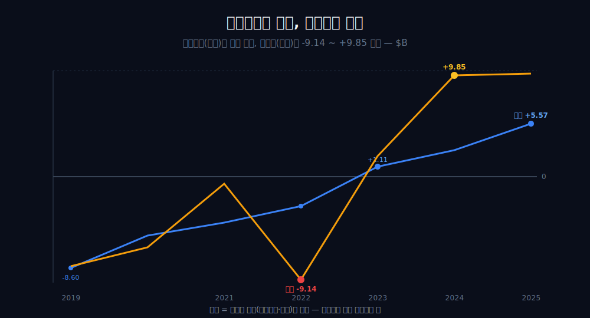
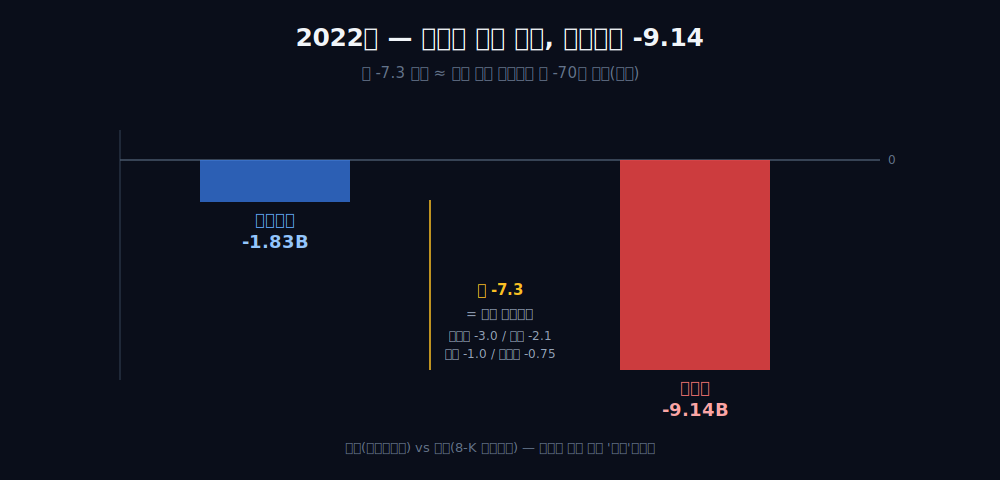
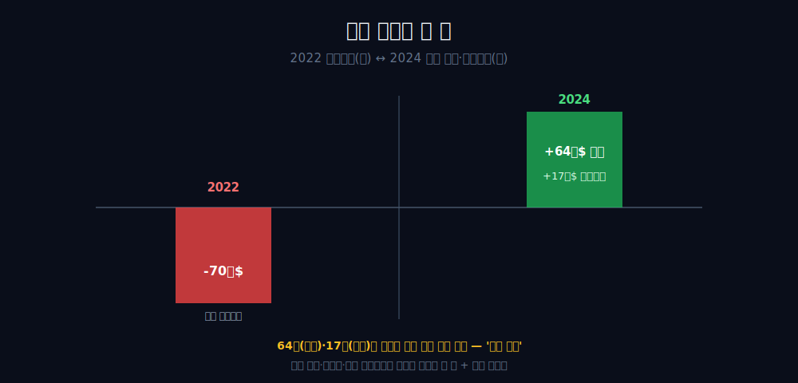
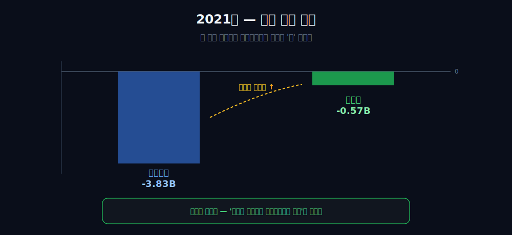
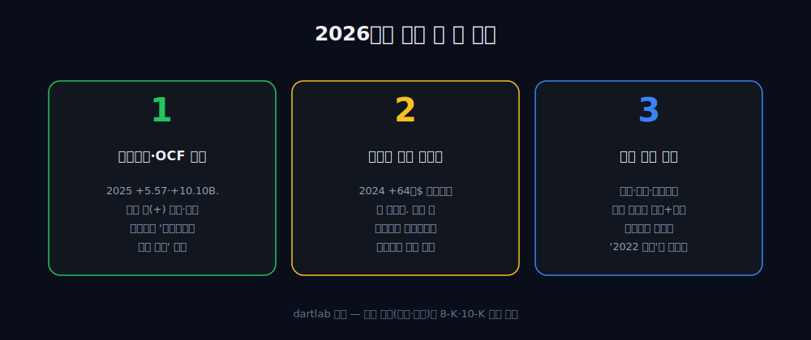

<script>
import ComboChart from '$lib/components/blog/ComboChart.svelte';
import StackBar from '$lib/components/blog/StackBar.svelte';
</script>

> **데이터 기준**: 2026-06-14 dartlab 실측 — Uber Technologies(UBER) **미국 연결(USD)** 기준, 분기 데이터를 역년으로 합산. 지분투자 평가손익·이연법인세 환입·Take Rate·Gross Bookings는 연결 손익에 분해돼 나오지 않으므로 **8-K·10-K·IR(외부 인용)**으로 표기. 2019년 영업현금흐름(-2.52B)은 IPO(2019.5) 전후 3분기 부분치라 연간 비교에서 제외. ※대차대조표 항목은 매핑이 불안정해 인용에 주의.
>
> **핵심 숫자**: 매출 **$52.02B** (2019→2025 약 **3.7배**) · 영업이익 2019 **-8.60B** → 2023 **+1.11B**(첫 흑자) → 2025 **+5.57B** · 순이익 2022 **-9.14B** → 2024 **+9.85B** · 영업현금흐름 2022 **+0.64B**(첫 흑자) → 2025 **+10.10B**
>
> **이 글의 용어**: 영업이익 = 영업으로 번 이익 · 순이익 = 이자·세금·지분평가까지 다 반영한 맨 아래 줄 · 영업선 아래 = 영업이익 이후의 비영업 항목(지분평가·세금 등) · 시가평가 = 보유 지분의 그해 시세를 손익에 반영하는 것.

---

## 프롤로그 — 한 표의 위와 아래가 7B 벌어졌다

2022년 우버의 손익계산서를 한 줄 한 줄 내려가면, 영업이익 칸에는 **-1.83B**이 찍혀 있다 — 4년 전 -8.60B에서 거의 본전 근처까지 올라온 숫자다. 그런데 같은 표의 맨 아래 칸, 헤드라인 순이익에는 **-9.14B**이 적혀 있다.



한 회사의 한 해 성적표인데, 위쪽 줄과 아래쪽 줄이 7B 넘게 벌어져 있다. 그 7B는 우버가 차를 굴리고 음식을 배달해서 까먹은 돈이 아니라, 우버가 *들고 있던 주식*(디디·그랩·오로라 등) 지분의 그해 시세가 빠진 평가손실이었다 [외부 인용].


영업으로 번 돈과 들고 있는 자산의 시세를 한 줄에 합쳐 적는 회계의 장면. **이 글은 그 한 줄(순이익)을 믿지 않는 법에서 출발한다.**

---

## 1막 — 부호가 바뀌는 줄

**이 회사를 읽는 축은 무엇인가.** '얼마를 더 팔았나'가 아니라 '영업이익의 부호가 언제 바뀌었나'다.

```python
import dartlab
c = dartlab.Company("UBER")
c.select("IS", ["영업이익"], freq="Q")  # 분기→역년 합산
```

| 연도 | 2019 | 2020 | 2021 | 2022 | 2023 | 2024 | 2025 |
|---|---:|---:|---:|---:|---:|---:|---:|
| 영업이익 ($B) | -8.60 | -4.86 | -3.83 | -1.83 | **+1.11** | +2.80 | +5.57 |

영업이익은 2019년 -8.60B에서 단조롭게 위로 기어 **2023년 +1.11B로 처음 0을 통과**했고, 이후 +2.80B→+5.57B로 이어진다. 적자기업이 흑자기업으로 바뀌는 그 한 줄의 부호 전환 — 이게 이 회사를 읽는 기준점이다. 매출도 같이 컸지만(뒤에서 본다), 영업의 진짜 상태는 *매출 규모*가 아니라 *이 부호*에 찍힌다.

---

## 2막 — 현금이 이익보다 한 해 먼저 나타났다

**영업흑자(2023)보다 먼저 돌아선 게 있다.** 통장(영업현금흐름)이 2022년에 이미 검게 돌아서 있었다.

```python
c.select("CF", ["영업활동현금흐름"], freq="Q")  # 분기→역년 합산
```

| 연도 | 2020 | 2021 | 2022 | 2023 | 2024 | 2025 |
|---|---:|---:|---:|---:|---:|---:|
| 영업현금흐름 ($B) | -2.75 | -0.45 | **+0.64** | +3.59 | +7.14 | +10.10 |

손익계산서가 아직 영업흑자(2023 +1.11B)를 못 찍던 2022년에, 영업현금흐름은 이미 **+0.64B**로 검게 돌아서 있었다.

여기서 인과를 조심한다 — 이건 '현금이 이익을 끌었다'가 아니다. 영업현금흐름이 한 해 앞선 건 비현금 비용(주식보상 등)과 운전자본 타이밍 같은 회계적 사유의 결과지, 현금이 이익을 *만든* 게 아니다. 그리고 이건 단 한 번의 교차일 뿐, '현금이 늘 이익을 선도한다'는 반복 법칙으로 격상할 표본이 아니다. 사실은 정확히 이 선까지다 — **현금흑자(2022)가 영업흑자(2023)보다 한 해 먼저 나타났다.**

---

## 3막 — 폭락: 영업은 -1.83인데 순이익은 -9.14

**왜 영업라인보다 순이익이 7B 넘게 더 깊이 빠졌나.** 그 격차가 영업선 *아래*에서 왔기 때문이다.

```python
c.select("IS", ["영업이익", "당기순이익"], freq="Q")  # 2022 비교
```

2022년 영업이익(-1.83B)과 헤드라인 순이익(-9.14B)의 약 **-7.3 격차**는, 공시가 밝힌 약 **-70억 달러의 지분 평가손실**과 같은 방향·같은 규모로 정합한다. 우버가 들고 있던 지분의 2022년 시세가 빠진 것이다 — 오로라 약 -30억, 그랩 약 -21억, 디디 약 -10억, 조마토 약 -7.5억 달러 [외부 인용·[Uber 8-K (SEC EDGAR)](https://www.sec.gov/cgi-bin/browse-edgar?action=getcompany&CIK=0001543151&type=8-K)].



여기서 단정의 선을 지킨다. 연결 순이익(-9.14B)은 dartlab EDGAR 분기합산(내부)이고, 평가손실 약 -70억 달러는 8-K 주석(외부)이다. 출처 층위가 다르므로 '70억이 9.14를 정확히 설명한다'고 자릿수를 맞추지 않고, '격차가 공시 평가손실과 같은 방향·같은 규모로 정합한다'까지만 둔다. 핵심은 — 순이익 폭락이 *영업이 아니라 영업선 아래*에서 왔다는 것이다.

---

## 4막 — 폭발: 같은 진자의 반대편 끝

**2년 뒤 순이익이 +9.85B로 터진 건 영업이 잘돼서인가.** 아니다. 같은 진자가 거꾸로 흔들렸고, 거기에 세금 장부효과가 얹혔다.

2024년 영업이익은 **+2.80B**인데 순이익은 **+9.85B**로 터졌다. 두 줄의 약 **+7.0 격차**는 두 가지가 *복합으로* 메웠다 [외부 인용]:

- **약 64억 달러 이연법인세 환입** — '앞으로 충분히 벌어 과거 결손의 세무가치를 쓸 수 있겠다'는 재평가(valuation allowance 환입)에서 나온 비영업 세무이익.
- **분기 지분 평가이익** — 예: 2024년 3분기 약 +17억 달러(세전). 2022년에 빠졌던 같은 디디·오로라·그랩 포트폴리오의 시가가 이번엔 +로 돈 것이다.




여기서도 자릿수 단정을 피한다 — 이연법인세(약 64억, 세후 성격)와 분기 평가이익(약 17억, 세전)은 성격이 달라 단순히 더해 '+7.0을 정확히 메웠다'고 말할 수 없다. '이연법인세 때문에 폭발'도, '평가이익 때문에 폭발'도 단독 단정이면 틀린다 — *둘이 복합으로* 격차를 메웠다는 정합 서술이 맞다. 2022년의 -70억과 2024년의 +64억은, 같은 포트폴리오 시가와 세무 재평가가 양 끝으로 흔들린 장면이다.

---

## 5막 — 영업선 아래는 양방향이다

**그럼 영업선 아래는 늘 순이익을 끌어내리는가.** 아니다. 2021년엔 *거꾸로* 끌어올렸다.

```python
c.select("IS", ["영업이익", "당기순이익"], freq="Q")  # 2021 반례
```

2021년에는 영업손실이 **-3.83B**였는데, 순이익은 그보다 *양호한* **-0.57B**였다. 영업선 아래가 순이익을 끌어내리기만 한 게 아니라, 끌어올린 해도 있었던 것이다.



이 한 점이 중요하다. '순이익 괴리 = 전부 잡음이 끌어내림'이라는 한 방향 프레이밍은 2021년을 설명하지 못한다. 정확한 사실은 — **영업선 아래가 순이익을 영업라인과 *다르게*(양방향으로) 움직였다**는 것이다. 그래서 순이익을 '영업 상태의 대리지표'로 격상하지 않는다. 순이익은 이 회사에서 가장 늦고 가장 시끄러운 줄이다.

---

## 6막 — 외형 3.7배라는 배경, 그리고 무엇을 믿을 것인가

**매출이 그렇게 컸으니 흑자전환은 규모 덕인가.** 같은 시기에 맞물렸다는 것까지만 말할 수 있다.

```python
c.select("IS", ["매출액"], freq="Q")  # 분기→역년 합산
```

매출은 2019년 $14.15B에서 2025년 $52.02B로, **6년 만에 약 3.7배** 커졌다. 그 거대한 외형 확장 구간과 영업흑자 전환(2023)이 같은 시기에 맞물린 건 사실이다.


하지만 '규모가 흑자를 만들었다'로 인과화하지 않는다. 검증수치로는 규모 확대와 흑자전환의 *동시성*만 확인되고, 2021년 매출 반등(코로나 회복, 17.46B)·믹스 변화 같은 교란을 배제할 수 없다. 또 Take Rate(테이크레이트)·Gross Bookings(총거래대금) 같은 지표로 규모를 보강 입증하지도 않는다 — 그건 GAAP 연결재무 밖의 비-GAAP 운영지표라, 검증된 매출·영업이익·순이익과 한 줄에 합산하면 출처가 다른 수치를 섞는 셈이다 [외부 인용].

그래서 이 회사를 읽을 때 믿을 줄은 헤드라인 순이익이 아니라 *영업이익과 영업현금흐름의 부호와 방향*이다. 같은 '장부이익 vs 현금'의 긴장을 콘텐츠 자본화로 안고 있는 [넷플릭스](/blog/NFLX-netflix), 소매 껍데기 아래 진짜 엔진을 둔 [아마존](/blog/AMZN-amazon), 그리고 신용리스크 없는 통행료망 [비자](/blog/V-visa)·[마스터카드](/blog/MA-mastercard)와 나란히 놓으면, 우버는 *'어느 줄을 믿느냐'*가 곧 결론인 회사다. 외형과 마진율이 깨끗이 동행한 [마이크로소프트](/blog/MSFT-microsoft)와는 정반대로, 우버에선 맨 아래 줄이 가장 마지막에, 가장 시끄럽게 도착한다.

---

## 2026년에 봐야 할 세 가지

1. **영업이익·영업현금흐름이 양(+)을 유지하며 동행하는가** — 관통선('영업라인이 진짜 상태')이 맞다면 두 줄은 헤드라인 순이익과 무관하게 단조롭게 위를 향해야 한다. 어느 한쪽이라도 0 아래로 다시 내려가면 '부호 전환이 정착했다'는 서사가 깨진다.
2. **일회성이 빠진 순이익이 영업이익에 근접하는가** — 2024년 순이익을 부풀린 약 64억 달러 이연법인세 환입은 일회성이다. 그게 빠진 2025~2026년 순이익과 영업이익(+5.57B 수준)의 격차가 좁혀지면 '2024 폭발=영업선 아래'라는 진단이 사후 확인되고, 다시 크게 벌어지면 그해 지분 시가가 또 출렁였다는 신호다.
3. **지분 포트폴리오 시가의 방향** — 디디·그랩·오로라 등의 시가가 매 분기 순이익을 흔드는 구조가 유지되면, 시장이 빠진 분기엔 영업이익이 +인데도 순이익이 꺾이는 '2022년 재현' 컷이 다시 나타나는지 본다.



---

## 재무제표 — 최근 6개 연도 (dartlab 연결, $B)

> 미국 연결(USD)·분기 합산(역년) 기준. dartlab에서 직접 확인:
> ```python
> import dartlab
> c = dartlab.Company("UBER")
> c.select("IS", ["매출액","영업이익","당기순이익"], freq="Q")
> c.select("CF", ["영업활동현금흐름"], freq="Q")
> ```

<ComboChart data={[{year:"2020",매출:11.14,영업이익:-4.86,당기순이익:-6.79},{year:"2021",매출:17.46,영업이익:-3.83,당기순이익:-0.57},{year:"2022",매출:31.88,영업이익:-1.83,당기순이익:-9.14},{year:"2023",매출:37.28,영업이익:1.11,당기순이익:2.16},{year:"2024",매출:43.98,영업이익:2.80,당기순이익:9.85},{year:"2025",매출:52.02,영업이익:5.57,당기순이익:10.09}]} lineKeys={["매출"]} barKeys={["영업이익","당기순이익"]} lineColors={["#22c55e"]} barColors={["#3b82f6","#f59e0b"]} title="매출(라인) vs 영업이익·당기순이익(막대) — $B" unit="$B" />

| 항목 ($B) | 2020 | 2021 | 2022 | 2023 | 2024 | 2025 |
|---|---:|---:|---:|---:|---:|---:|
| 매출 | 11.14 | 17.46 | 31.88 | 37.28 | 43.98 | 52.02 |
| 영업이익 | -4.86 | -3.83 | -1.83 | +1.11 | +2.80 | +5.57 |
| 당기순이익 | -6.79 | -0.57 | -9.14 | +2.16 | +9.85 | +10.09 |
| 영업현금흐름 | -2.75 | -0.45 | +0.64 | +3.59 | +7.14 | +10.10 |

이 표를 한 줄로 읽으면 이렇다 — 매출 행과 영업이익 행은 단조롭게 위를 향하는데(영업이익은 2023년 0을 통과), **당기순이익 행만 -9.14에서 +9.85까지 거칠게 출렁인다.** 2022년 순이익(-9.14)이 영업이익(-1.83)보다 훨씬 깊고, 2024년 순이익(+9.85)이 영업이익(+2.80)보다 훨씬 높다 — 그 격차가 바로 '영업선 아래'(지분평가·세금)의 진폭이다. 반면 2021년은 거꾸로 순이익(-0.57)이 영업손실(-3.83)보다 양호하다(반대 방향). 영업이익·영업현금흐름 두 행이 이 회사의 진짜 방향이고, 순이익 행은 가장 시끄럽다.

---

## 검증표

본문 인용 수치를 dartlab 호출과 결과로 검증한다. 외부 출처(지분 평가손익·이연법인세·Take Rate)는 분리 표기. 📅 dartlab 실측 2026-06-14 · Uber(UBER) 미국 연결(USD)·분기 합산 기준.

| 본문 수치 | 출처 / 호출 | 결과 |
|---|---|---|
| 매출 2019 14.15B → 2025 52.02B (약 3.7배, 6년) | `c.select("IS",["매출액"],freq="Q")` 합산 | ✓ 실측 |
| 영업이익 2019 -8.60 → 2023 +1.11(첫 흑자) → 2025 +5.57B | `c.select("IS",["영업이익"])` | ✓ 실측 |
| 순이익 2022 -9.14B / 2024 +9.85B | `c.select("IS",["당기순이익"])` | ✓ 실측 |
| 영업현금흐름 2022 +0.64B(첫 흑자) → 2025 +10.10B | `c.select("CF",["영업활동현금흐름"])` | ✓ 실측 |
| 2021 순이익 -0.57B > 영업손실 -3.83B (반대 방향 괴리) | `c.select("IS",[...])` | ✓ 실측 |
| 2022 약 -70억$ 평가손실 (오로라·그랩·디디·조마토) | [Uber 8-K (SEC EDGAR)](https://www.sec.gov/cgi-bin/browse-edgar?action=getcompany&CIK=0001543151&type=8-K) | 외부 인용 |
| 2024 약 64억$ 이연법인세 환입 (valuation allowance) | [Uber Q3 2024 8-K (SEC)](https://www.sec.gov/Archives/edgar/data/0001543151/000154315124000033/uberq324earningspressrelea.htm) | 외부 인용 |
| 2024 3분기 약 +17억$(세전) 지분 평가이익 | [Uber IR](https://investor.uber.com/) | 외부 인용·세전 |
| 2022 -70억과 2024 +64억은 같은 포트폴리오 시가/세무의 양 끝 | [Uber 10-K (SEC EDGAR)](https://www.sec.gov/cgi-bin/browse-edgar?action=getcompany&CIK=0001543151&type=10-K) | 외부 인용 |
| Take Rate·Gross Bookings = 비-GAAP 운영지표 (합산 인용 금지) | [Uber IR](https://investor.uber.com/) | 외부·정의용만 |

본문의 숫자 중 이 표에 없는 것은 발행 차단 대상이다. 지분 평가손익·이연법인세 환입·Take Rate는 dartlab 연결로 증명되지 않으며 외부 인용임을 명시한다 — 연결이 증명하는 것은 '영업이익·영업현금흐름의 부호 전환과, 순이익이 영업라인과 양방향으로 벌어진 격차'까지이고, 그 *구성 분해*는 전부 8-K·10-K다. 64억과 17억은 성격(세후/세전)이 달라 단순 합산하지 않는다.
