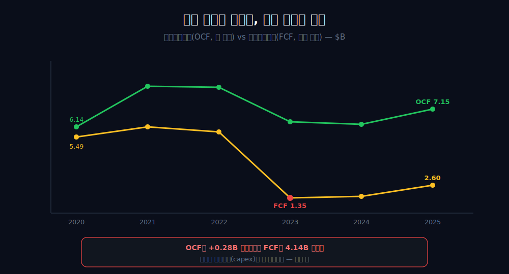
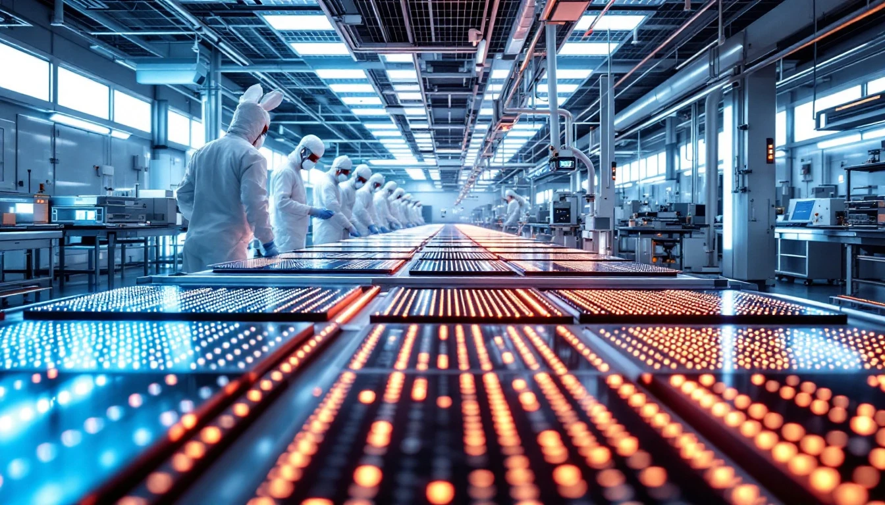
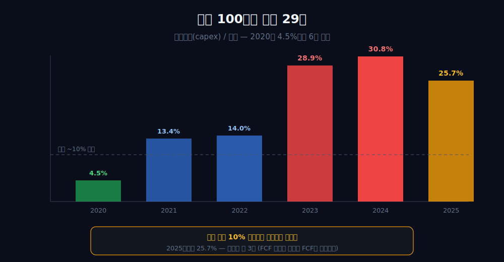
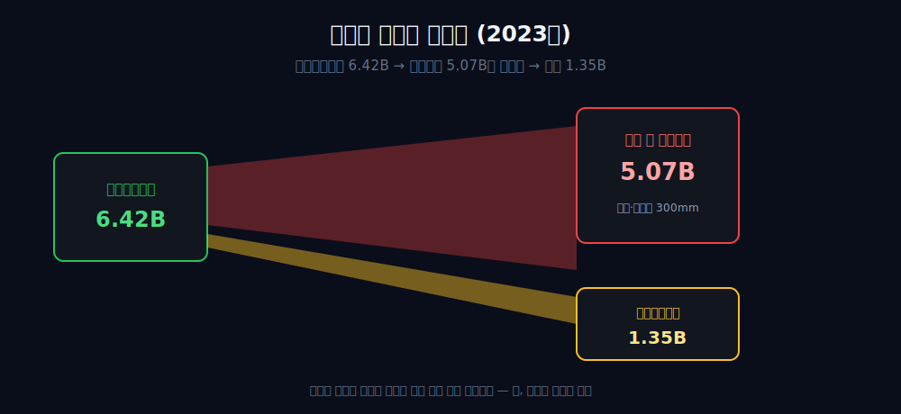
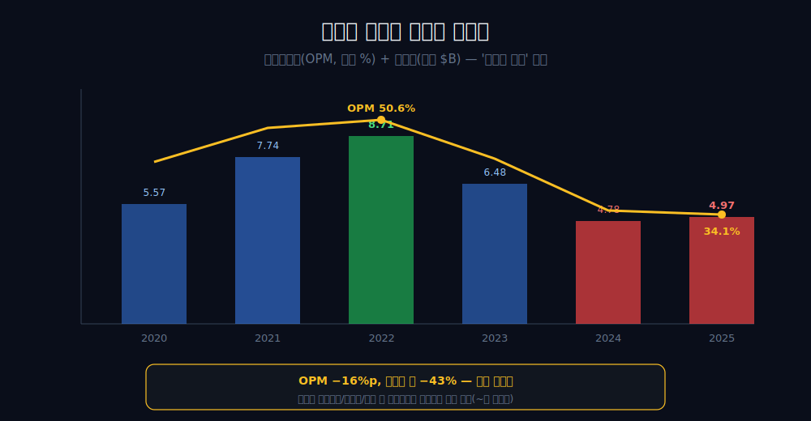
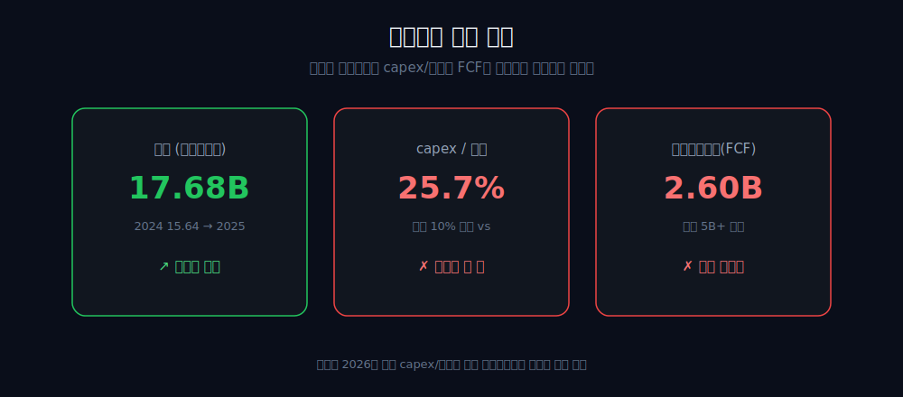

<script>
import ComboChart from '$lib/components/blog/ComboChart.svelte';
import StackBar from '$lib/components/blog/StackBar.svelte';
</script>

> **데이터 기준**: 2026-06-14 dartlab 실측 — Texas Instruments(TXN) **미국 연결(USD)** 기준, 분기 데이터를 역년으로 합산. capex가 향하는 개별 팹(셔먼·리하이)·CHIPS법 보조금·세그먼트 구성비는 연결 손익에 안 나오므로 **10-K·IR(외부 인용)**으로 표기. 검증수치($B, 회사 전체 연결)와 외부 IR의 '600억 달러·400억 달러' 같은 장기 잠재치는 단위·기간이 달라 합산하지 않는다. ※대차대조표 항목은 매핑이 불안정해 인용에 주의.
>
> **핵심 숫자**: 영업현금흐름 사이클 내내 **6~9B** · 잉여현금흐름(FCF) 2020 **5.49B** → 2023 **1.35B** (약 75%↓) · 설비투자(capex)/매출 2020 **4.5%** → 2023 **약 29%** · 영업이익률(OPM) 2022 **50.6%** → 2025 **34.1%** · 순이익 2022 **8.71B** → 2025 **4.97B** (약 43%↓)
>
> **이 글의 용어**: OCF(영업현금흐름) = 영업으로 들어온 현금 · capex(설비투자) = 공장·장비에 쓴 현금 · FCF(잉여현금흐름) = OCF − capex, 빚 갚고 배당·자사주에 쓸 수 있는 자유현금 · OPM(영업이익률)·NPM(순이익률) = 별개 비율.

---

## 프롤로그 — 같은 현금을 벌었는데 통장은 말랐다

2020년과 2023년, 이 회사가 영업으로 끌어모은 현금은 **6.14B와 6.42B**로 거의 같았다. 돈 버는 기계의 회전수는 변하지 않은 셈이다.

그런데 같은 두 해, 회사가 빚을 갚고 배당을 주고 자사주를 사는 데 자유롭게 쓸 수 있는 현금(잉여현금흐름)은 **5.49B에서 1.35B로 4분의 1 수준으로 쪼그라들었다.** 약 75%가 증발했다.



사라진 약 4B는 어디로 갔을까. 답은 단순하다 — 전부 공장을 짓는 데(capex) 들어갔다. capex가 0.65B에서 5.07B로 늘었고, FCF가 빠진 만큼이 거의 그대로 그 자리에 있었다.



같은 매출 구간, 같은 현금 창출력인데 '남는 돈'만 증발한 이 장면이 이야기의 입구다. 단, 미리 못 박아 둘 게 있다 — *'엔진은 멀쩡한데 FCF만'이라는 깔끔한 대조는 절반만 참이다.*

---

## 1막 — 멈추지 않은 기계, 그러나

**돈 버는 능력 자체는 흔들렸나.** 영업현금흐름만 보면 흔들리지 않았다. 그러나 그게 '이익도 멀쩡하다'는 뜻은 아니다.

```python
import dartlab
c = dartlab.Company("TXN")
c.select("CF", ["영업활동현금흐름"], freq="Q")  # 분기→역년 합산
```

| 연도 | 2019 | 2020 | 2021 | 2022 | 2023 | 2024 | 2025 |
|---|---:|---:|---:|---:|---:|---:|---:|
| 영업현금흐름 ($B) | 6.65 | 6.14 | 8.76 | 8.72 | 6.42 | 6.32 | 7.15 |

2020년 6.14B였던 영업현금흐름은 사이클 저점인 2023년에도 6.42B로 거의 평탄했다. 돈을 *현금으로 끌어오는 능력*은 7년 내내 6~9B 밴드를 지켰다.

그런데 여기서 한 가지를 분명히 한다 — *현금이 버텼다고 회계상 이익도 버틴 건 아니다.* 영업이익률은 2022년 50.6%에서 2025년 34.1%로 약 16%포인트 빠졌고, 순이익은 2022년 8.71B에서 2025년 4.97B로 약 43% 줄었다(5막). 'OCF는 견고했지만 영업이익·순이익·OPM은 함께 깎였다' — 이 병기를 글 내내 지킨다.

---

## 2막 — 통장만 마른 두 해

**버는 힘과 남는 돈이 왜 갈라졌나.** 한 항목이 그 사이를 다 가져갔기 때문이다.

```python
# FCF = 영업현금흐름 − 설비투자
c.select("CF", ["영업활동현금흐름", "유형자산취득"], freq="Q")
```

| 연도 | 2020 | 2021 | 2022 | 2023 | 2024 | 2025 |
|---|---:|---:|---:|---:|---:|---:|
| 영업현금흐름 ($B) | 6.14 | 8.76 | 8.72 | 6.42 | 6.32 | 7.15 |
| 잉여현금흐름(FCF) ($B) | 5.49 | 6.29 | 5.92 | **1.35** | 1.50 | 2.60 |

OCF가 거의 같았던 2020→2023에, 잉여현금흐름만 **5.49B→1.35B로 4분의 1 수준으로** 쪼그라들었다.

여기서 산수를 정직하게 한다. FCF = OCF − capex이므로, ΔFCF = ΔOCF − Δcapex다. 2020→2023에 OCF는 *오히려 0.28B 늘었는데*(6.14→6.42), 같은 기간 capex가 4.42B 폭증해(0.65→5.07) FCF가 4.14B 빠졌다. 즉 '버는 현금이 줄어서'가 아니다 — *버는 현금은 오히려 조금 늘었는데, 공장에 쏟아부은 돈이 그걸 다 삼켰다.* 범인은 한 항목, capex다.

---

## 3막 — 매출 100원에 공장 29원

**capex가 얼마나 폭증했나.** 매출 대비 비중으로 보면, 6배가 넘는다.

```python
c.select("IS", ["매출액"], freq="Q")  # capex/매출 계산용
```

| 연도 | 2020 | 2021 | 2022 | 2023 | 2024 | 2025 |
|---|---:|---:|---:|---:|---:|---:|
| 설비투자(capex) ($B) | 0.65 | 2.46 | 2.80 | 5.07 | 4.82 | 4.55 |
| capex / 매출 | 4.5% | 13.4% | 14.0% | **28.9%** | 30.8% | 25.7% |

2020년만 해도 TI는 매출의 **4.5%**만 설비에 썼다. 2023년엔 그 비율이 **약 29%**로, 2020년 기준 6배가 넘게 뛰었다. 반도체 회사가 한 해 버는 돈의 3분의 1 가까이를 땅 파고 클린룸 짓는 데 쏟아붓는다는 뜻이다.



FCF 감소분(약 4.14B)이 capex 증가분(약 4.42B)과 거의 일치하는 건 우연이 아니라 *정의상의 분해*다(FCF = OCF − capex). 그래서 'capex가 FCF를 끌어내렸다'는 기계적 인과로 단정해도 안전하다. 다만 그 capex 결정이 *옳았는지*는 수치 밖의 판단이다 — '의도된 선충전'이라는 형용사는 붙이지 않고, 그 돈이 어디로 향하는지만 다음 막에서 외부 자료로 본다.

---

## 4막 — 왜 그렇게까지 땅을 파나

**무엇을 보고 매출의 3분의 1을 공장에 쏟나.** 외주에 맡기던 제조를 자체 300mm 팹으로 가져가는 방향이다 — 단, 동기 배경으로만 읽는다.

TI의 IR·10-K는 이 capex가 향하는 곳을 밝힌다 — 텍사스 셔먼(SM1~SM4, 최대 4개 연결형 300mm 팹, 잠재투자 약 400억 달러), 유타 리하이(LFAB, 마이크론에서 인수)·리처드슨(RFAB2) [외부 인용·[TI 60억 달러 미국 투자](https://www.ti.com/about-ti/newsroom/news-releases/2025/texas-instruments-plans-to-invest-more-than--60-billion-to-manufacture-billions-of-foundational-semiconductors-in-the-us.html)]. 2030년까지 웨이퍼의 95% 이상을 사내에서, 그중 80% 이상을 300mm로 만든다는 목표다. 2024년 12월엔 CHIPS법에 따라 최대 16억 달러 직접 보조금 계약을 맺었고, 25% 투자세액공제(ITC)로 약 60~80억 달러를 추정한다 [외부 인용·[TI CHIPS법 보조금](https://www.ti.com/about-ti/newsroom/news-releases/2024/2024-12-20-texas-instruments-announces-award-agreement-for-chips-and-science-act-funding.html)].



여기서 단정의 선을 지킨다. 검증수치(회사 전체 capex)는 개별 팹 투자로 분해되지 않으므로, 'capex의 몇 %가 외주 회수이고 몇 %가 신규 수요 대응 증설인가'를 구분할 수 없다. '공격(신수요)이냐 회귀(수직통합)냐'는 둘 다 섞여 있을 개연성이 높아 단정하지 않는다. 또 외부 IR의 '600억 달러·400억 달러'는 *장기 잠재치*이지, 2021~2025년 실제 capex 누계(약 19.7B = 약 197억 달러)와 같은 줄에 더하거나 비교하지 않는다 — 단위($B vs 억 달러)도 기간(확정 실적 vs 장기 발표)도 다르다. CHIPS 보조금도 2024년 12월 계약된 미래 현금이라 2025년 FCF(2.60B)엔 거의 반영되지 않았다 — '잠재 완충'으로만 둔다.

---

## 5막 — 내려앉은 마진의 천장

**그럼 영업이익은 멀쩡한가.** 아니다. 이게 '엔진만 멀쩡' 프레임이 가리는 절반의 진실이다.

```python
c.select("IS", ["매출액", "영업이익", "당기순이익"], freq="Q")
```

| 연도 | 2020 | 2021 | 2022 | 2023 | 2024 | 2025 |
|---|---:|---:|---:|---:|---:|---:|
| 영업이익 ($B) | 5.89 | 8.96 | 10.14 | 7.33 | 5.47 | 6.02 |
| 영업이익률(OPM) | 40.8% | 48.8% | 50.6% | 41.8% | 34.9% | 34.1% |
| 순이익 ($B) | 5.57 | 7.74 | 8.71 | 6.48 | 4.78 | 4.97 |

2022년 TI는 매출 100원당 영업이익 50.6원을 남겼다 — 제조업에서 보기 드문 황금기였다. 그런데 2024~2025년엔 34원대로 약 16%포인트 주저앉았고, 순이익은 8.71B에서 4.97B로 약 43% 줄었다. **'엔진은 멀쩡한데 FCF만'이라는 깔끔한 대조는, 영업이익·순이익이 함께 깎였다는 이 사실을 가린다.**



여기서 인과를 단정하지 않는다. 2020년(매출 14.46B, OPM 40.8%)과 2024년(매출 15.64B, OPM 34.9%)을 비교하면 *매출은 더 큰데 OPM은 더 낮다.* 단순 매출 사이클만으로는 이 추가 하락이 설명되지 않아 '신규 팹 감가상각 부담' 가설이 매력적이다. 하지만 그게 감가상각인지·사이클 디레버리지인지·믹스 악화인지는 데이터로 구분할 수 없다 — '~로 보인다/정합한다'까지만 쓴다. 또 아날로그 78%·임베디드 16%라는 세그먼트 구성비(10-K)는 매출 비중일 뿐, 세그먼트 영업이익은 안 나오므로 'OPM 하락이 어느 세그먼트에서 왔다'고 귀속하지 않는다.

---

## 6막 — 복원되지 않은 약속

**매출이 돌아왔으니 FCF도 복원됐나.** 2025년 데이터는 아직 '아니오'다.

```python
c.select("IS", ["매출액"], freq="Q")  # 2024~2025 재레버리지
```

매출은 2024년 15.64B에서 2025년 17.68B로 재레버리지됐다. '매출이 회복되면 capex가 정상화되고 FCF가 돌아온다'는 시나리오대로라면, 이쯤에서 capex/매출이 평상(10% 미만)으로 내려오고 FCF가 추세(5B+)로 복원돼야 한다.



그런데 2025년 capex/매출은 **25.7%**로 여전히 평상의 3배 가까이, FCF는 **2.60B**로 5B+ 추세에 한참 못 미친다. 2019~2025년 어느 해도 capex/매출이 10% 미만으로 복귀하지 않았다(2021년 이후 13.4→14.0→28.9→30.8→25.7%). 즉 '선투자가 끝나고 정상화된다'는 약속은 *2025년 데이터로 아직 실현되지 않았다.* 이 관통선의 승부는 2026년 이후 capex/매출이 정말 내려오는지로 미뤄진 미결 상태다.

같은 반도체 사이클을 메모리에서 겪는 [SK하이닉스](/blog/000660-skhynix), 인수 상각이 영업이익을 누른 [AMD](/blog/AMD-amd), 장비 단에서 사이클을 타는 [한미반도체](/blog/042700-hanmi-semi), 설계 IP만 파는 [ARM](/blog/ARM-arm-holdings), 그리고 [엔비디아](/blog/NVDA-nvidia)·[인텔](/blog/INTC-intel)과 나란히 놓으면, TI는 *'영업이익이 아니라 잉여현금흐름이 먼저 깨진'* 자리다 — 그 깨짐이 미래를 위한 선투자인지, 구조적 비용 고착인지가 다음 분기들의 시험대다.

---

## 2026년에 봐야 할 세 가지

1. **capex/매출이 정상화되는가** — 2025년 25.7%였던 비율이 2026년에 의미 있게 내려오는가(10% 미만에 근접하는가, 아니면 13~25% 고원에 머무는가). 한 자릿수로 복귀하면 '정상화→복원' 시나리오가 살아나고, 25% 부근을 유지하면 '매출 회복=capex 정상화' 가정이 또 한 해 반증된다.
2. **FCF 추세가 복원되는가** — 2025년 2.60B였던 잉여현금흐름이 2026년에 5B+ 추세로 돌아오는가. OCF가 7B대를 유지하는 가운데 capex가 줄어 FCF가 4~5B를 넘으면 '선투자 종료' 신호이고, 다시 2~3B대에 머물면 capex 고원이 구조화되는 증거다.
3. **영업이익률 천장의 행방** — 2024~2025년 34%대에 내려앉은 OPM이 매출 재레버리지와 함께 다시 40%대로 회복되는가, 34~36% 레벨에 굳는가. 신규 팹 가동·매출 증가에도 30%대 중반에 고착되면 '감가상각·고정비 구조 비용 고착' 쪽으로, 40%대로 복귀하면 '일시적 사이클·디레버리지' 쪽으로 미결 승부가 기운다.

---

## 재무제표 — 최근 6개 연도 (dartlab 연결, $B)

> 미국 연결(USD)·분기 합산(역년) 기준. dartlab에서 직접 확인:
> ```python
> import dartlab
> c = dartlab.Company("TXN")
> c.select("IS", ["매출액","영업이익","당기순이익"], freq="Q")
> c.select("CF", ["영업활동현금흐름","유형자산취득"], freq="Q")
> ```

<ComboChart data={[{year:"2020",매출:14.46,영업이익:5.89,당기순이익:5.57},{year:"2021",매출:18.34,영업이익:8.96,당기순이익:7.74},{year:"2022",매출:20.03,영업이익:10.14,당기순이익:8.71},{year:"2023",매출:17.52,영업이익:7.33,당기순이익:6.48},{year:"2024",매출:15.64,영업이익:5.47,당기순이익:4.78},{year:"2025",매출:17.68,영업이익:6.02,당기순이익:4.97}]} lineKeys={["매출"]} barKeys={["영업이익","당기순이익"]} lineColors={["#22c55e"]} barColors={["#3b82f6","#f59e0b"]} title="매출(라인) vs 영업이익·당기순이익(막대) — $B" unit="$B" />

| 항목 ($B) | 2020 | 2021 | 2022 | 2023 | 2024 | 2025 |
|---|---:|---:|---:|---:|---:|---:|
| 매출 | 14.46 | 18.34 | 20.03 | 17.52 | 15.64 | 17.68 |
| 영업이익 | 5.89 | 8.96 | 10.14 | 7.33 | 5.47 | 6.02 |
| 영업이익률(OPM) | 40.8% | 48.8% | 50.6% | 41.8% | 34.9% | 34.1% |
| 당기순이익 | 5.57 | 7.74 | 8.71 | 6.48 | 4.78 | 4.97 |
| 영업현금흐름 | 6.14 | 8.76 | 8.72 | 6.42 | 6.32 | 7.15 |
| 설비투자(capex) | 0.65 | 2.46 | 2.80 | 5.07 | 4.82 | 4.55 |
| 잉여현금흐름(FCF) | 5.49 | 6.29 | 5.92 | 1.35 | 1.50 | 2.60 |

이 표를 한 줄로 읽으면 이렇다 — **영업현금흐름 행(6~9B)은 사이클 내내 비교적 평탄한데, 잉여현금흐름 행만 5.49B에서 1.35B로 무너진다.** 그 사이 설비투자 행이 0.65B에서 5.07B로 폭증하며 OCF를 다 가져갔다. 동시에 영업이익률 행도 50.6%에서 34.1%로 내려앉고 순이익 행도 8.71B에서 4.97B로 빠진다 — 'OCF만 버텼고, FCF·OPM·순이익은 함께 깎였다'는 그림이다(capex가 향하는 곳·OPM 하락 원인=외부/미결).

---

## 검증표

본문 인용 수치를 dartlab 호출과 결과로 검증한다. 외부 출처(팹·CHIPS법·세그먼트)는 분리 표기. 📅 dartlab 실측 2026-06-14 · TI(TXN) 미국 연결(USD)·분기 합산 기준.

| 본문 수치 | 출처 / 호출 | 결과 |
|---|---|---|
| 영업현금흐름 2020 6.14 → 2023 6.42B (거의 평탄, +0.28B) | `c.select("CF",["영업활동현금흐름"])` | ✓ 실측 |
| 잉여현금흐름(FCF) 2020 5.49 → 2023 1.35B (약 75%↓) | OCF − capex | ✓ 실측 |
| capex 0.65 → 5.07B, capex/매출 4.5% → 약 29% (2020→2023) | `c.select("CF",["유형자산취득"])` ÷ 매출 | ✓ 실측 |
| ΔFCF(−4.14) = ΔOCF(+0.28) − Δcapex(+4.42) | 정의상 분해 | ✓ 실측 |
| 영업이익률 2022 50.6% → 2025 34.1% (약 16%p↓) | 영업이익÷매출 | ✓ 실측 |
| 순이익 2022 8.71 → 2025 4.97B (약 43%↓) | `c.select("IS",["당기순이익"])` | ✓ 실측 |
| 2025 capex/매출 25.7% · FCF 2.60B (복원 미실현) | OCF − capex ÷ 매출 | ✓ 실측 |
| 셔먼(SM1~4)·리하이(LFAB)·리처드슨(RFAB2) 300mm 팹 | [TI 60억$ 미국 투자](https://www.ti.com/about-ti/newsroom/news-releases/2025/texas-instruments-plans-to-invest-more-than--60-billion-to-manufacture-billions-of-foundational-semiconductors-in-the-us.html) | 외부 인용 |
| CHIPS법 최대 16억$ 보조금 + ITC 약 60~80억$ (미래 현금) | [TI CHIPS법](https://www.ti.com/about-ti/newsroom/news-releases/2024/2024-12-20-texas-instruments-announces-award-agreement-for-chips-and-science-act-funding.html) · [TI 10-K (SEC)](https://www.sec.gov/cgi-bin/browse-edgar?action=getcompany&CIK=0000097476&type=10-K) | 외부 인용·잠재 완충 |
| 아날로그 78%·임베디드 16% (매출 구성비, OPM 귀속 금지) | [TI IR](https://investor.ti.com/) 10-K 세그먼트 | 외부 인용 |

본문의 숫자 중 이 표에 없는 것은 발행 차단 대상이다. 팹·CHIPS법·세그먼트는 dartlab 연결로 증명되지 않으며 외부 인용임을 명시한다 — 연결이 증명하는 것은 'OCF는 버텼는데 FCF·OPM·순이익은 함께 빠졌고, capex가 그 차이를 가져갔다'까지이고, 그 capex가 *옳은 베팅인지*·*OPM 하락의 원인이 무엇인지*는 미결이다. '600억·400억 달러'는 장기 잠재치라 검증 capex와 합산하지 않는다.
