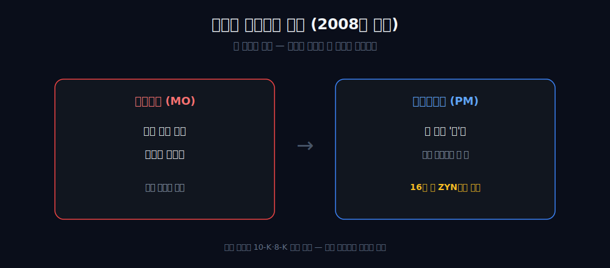
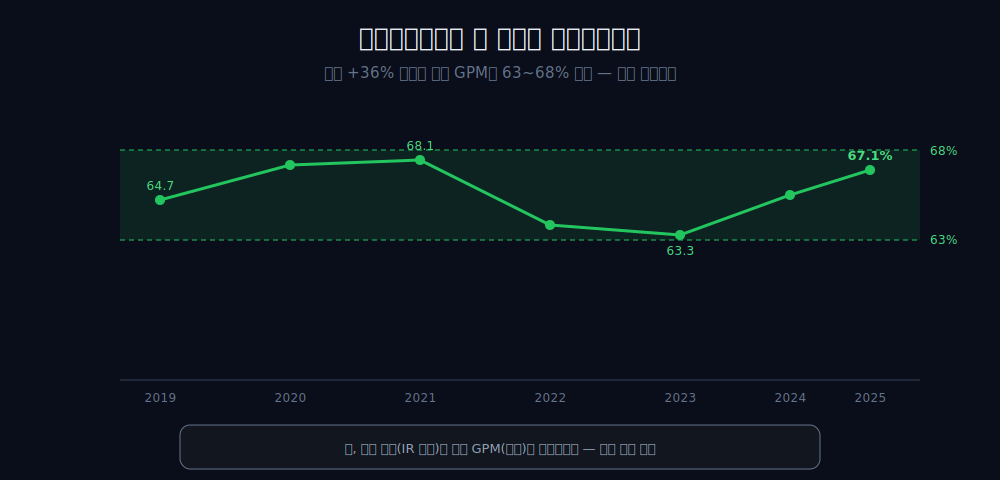
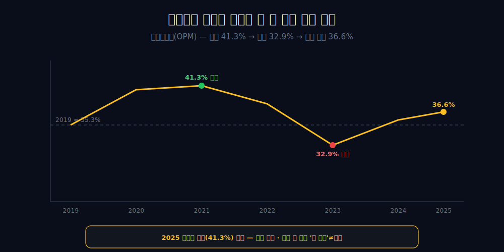
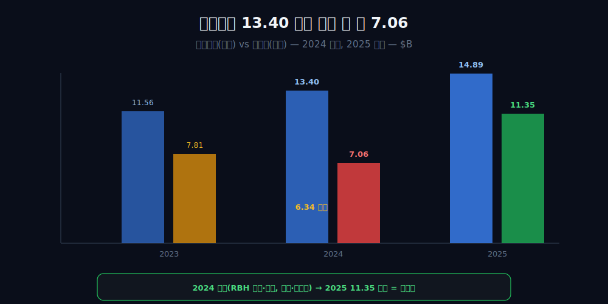
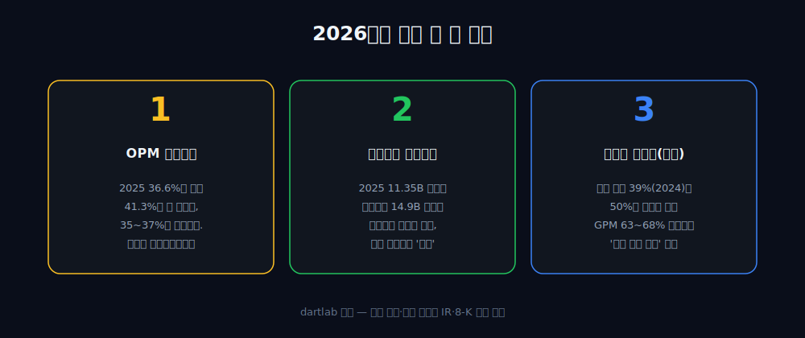

<script>
import ComboChart from '$lib/components/blog/ComboChart.svelte';
import StackBar from '$lib/components/blog/StackBar.svelte';
</script>

> **데이터 기준**: 2026-06-20 dartlab 실측 — Philip Morris International(PM) **미국 연결(USD)** 기준, 분기 데이터를 역년으로 합산. 최신 공시 보강은 FY2025 10-K와 2026 Q1 10-Q 기준. 2008년 분사 조건·스웨디시매치 인수·무연 비중·RBH 손상은 연결 손익에 분해돼 나오지 않으므로 **10-K·8-K·IR(공식 공시)**으로 분리 표기. ※대차대조표 항목은 매핑이 불안정해 인용에 주의.
>
> **핵심 숫자**: 매출 **$40.65B** (2019→2025 **+36%**) · 영업이익 **$14.89B** (2025, 7년 최고, +41%) · 매출총이익률(GPM) **63~68%** 밴드 · 영업이익률(OPM) 2021 **41.3%**(정점) → 2023 **32.9%**(최저) → 2025 **36.6%**(부분 회복) · 순이익 2024 **7.06B** → 2025 **11.35B**(반등)
>
> **이 글의 용어**: GPM(매출총이익률)·OPM(영업이익률)·NPM(순이익률) = 별개 비율 · 무연(smoke-free) = 가열담배(IQOS)·니코틴파우치(ZYN) 등 비연소 제품 · below-the-line(영업선 아래) = 영업이익 이후의 이자·세금·손상 등 · 손상차손 = 자산 장부가치를 깎는 비현금 비용.

---

## 프롤로그 — 미국 회사인데, 미국에서 담배를 못 판다

표지에 "미국 회사"라고 적힌 한 담배회사가 있다. 본사도 미국에 있다. 그런데 이 회사는 자기 본국 미국에서 담배를 한 갑도 못 판다.

2008년 3월, 알트리아에서 떨어져 나올 때 미국 시장과 '말보로 국내권'을 옛 주인이 가져가 버렸기 때문이다 [외부 인용]. 태어날 때부터 자기 안방과 자기 간판 브랜드에서 구조적으로 배제된 회사.



그 회사가 16년 뒤, ZYN을 품은 스웨디시매치를 약 **160억 달러**에 사서 옛 주인의 안방으로 되돌아간다. 이 글은 그 16년짜리 귀환을, 손익계산서가 실제로 증명할 수 있는 선까지만 따라간다. 결론을 먼저 쓰면 — *마진은 한 번도 무너지지 않았고, 한 번 깊게 눌렸다 되올라왔을 뿐이다.*

---

## 1막 — 태어날 때부터의 결손

**이 회사의 출발선은 어디인가.** 본국도, 간판 브랜드 국내권도 없는 자리다.

```python
import dartlab
c = dartlab.Company("PM")
c.select("IS", ["매출액"], freq="Q")  # 분기→역년 합산
```

2008년 분사로 미국 시장과 말보로 국내권을 잃은 채 출발한 회사가, '미국 밖'에서 벌어들인 2019년 매출은 **$29.81B**였다. 이후 6년간 매출은 $40.65B까지 +36% 자란다.

여기서 출처를 분명히 한다 — 분사 조건(미국·말보로 배제)은 10-K·8-K 외부 인용이고, 매출 절대액만 연결이 증명한다. 결손 위에 쌓인 숫자라는 게 이 회사를 읽는 출발점이다.

---

## 2막 — 갈아끼우는데도 안 무너진 매출총이익

**무연으로 포트폴리오를 바꾸면 마진이 희석되지 않나.** 적어도 전사 매출총이익률 수준에서는, 통념이 깨졌다.

```python
c.select("IS", ["매출액", "매출총이익"], freq="Q")  # GPM
```

| 연도 | 2019 | 2021 | 2023 | 2025 |
|---|---:|---:|---:|---:|
| 매출 ($B) | 29.81 | 31.41 | 35.17 | 40.65 |
| 매출총이익 ($B) | 19.29 | 21.38 | 22.28 | 27.28 |
| 매출총이익률(GPM) | 64.7% | 68.1% | 63.3% | 67.1% |

6년간 매출이 +36% 자라는 동안 매출총이익률은 **63~68% 밴드를 한 번도 벗어나지 않았다.** '무연으로 갈아끼우면 마진이 희석된다'는 통념이, 적어도 전사 GPM 수준에서는 깨진 것이다.



단, 인과는 조심한다. 무연 제품이 2024년 전사 매출의 약 39%, 4분기 총이익의 큰 축을 차지했다는 수치는 회사 공시·실적자료의 세그먼트 정보이고, 전사 GPM 63~68%는 EDGAR 연결 손익에서 다시 계산한 값이다. 출처가 다른 두 수치를 *병치*까지만 하고, '무연 비중이 올라서 GPM이 유지됐다'는 인과 연결은 하지 않는다.

---

## 3막 — 매출보다 빨리 큰 영업이익, 그러나 한 번 눌렸다

**영업이익은 매출보다 빨리 컸나.** 그렇다. 하지만 그 사이 OPM은 한 번 깊게 눌렸다.

```python
c.select("IS", ["매출액", "영업이익"], freq="Q")  # OPM
```

| 연도 | 2019 | 2020 | 2021 | 2022 | 2023 | 2024 | 2025 |
|---|---:|---:|---:|---:|---:|---:|---:|
| 영업이익 ($B) | 10.53 | 11.67 | 12.98 | 12.25 | 11.56 | 13.40 | **14.89** |
| 영업이익률(OPM) | 35.3% | 40.7% | **41.3%** | 38.6% | **32.9%** | 35.4% | 36.6% |

영업이익은 6년간 $10.53B→$14.89B로 +41% 붙었다 — 매출 증가(+36%)보다 빠르다. 운영 레버리지가 작동한 것과 정합한다.



그런데 시작·끝 두 점만 잇는 비교는 *중간 궤적*을 가린다. **OPM은 2021년 41.3% 정점에서 2023년 32.9%로 눌렸다** — 2019년의 35.3%보다도 낮은 7년 최저다. 그리고 2025년 36.6%로 되올라왔지만, *정점(41.3%)에는 한참 못 미치는 부분 회복*이다. 그러니 '매끄러운 중립 전환'이 아니라 '한 번 깊게 눌린 회복'이다. 게다가 밴드(OPM 8.4%p, GPM 4.8%p)가 넓어, '밴드를 안 깼다'는 *안정의 증거가 아니다* — 넓게 그렸으니 안 깨진 것이다. 매출보다 빠른 영업이익도 가격인상(담배는 가격결정력 산업)·환율·믹스가 더 단순한 설명일 수 있어, '전환의 마진 우월성 증명'으로 끌어올리지 않는다.

---

## 4막 — 영업으로 13.40 벌고 손에 쥔 건 7.06

**2024년, 영업이익은 13.40B인데 순이익은 왜 7.06B로 후퇴했나.** 그 6.34B 간극이 영업선 아래에서 났기 때문이다.

```python
c.select("IS", ["영업이익", "당기순이익"], freq="Q")  # 2024 괴리
```

2024년 영업이익은 **$13.40B**(7년 중 2위 — 정점은 2025년 $14.89B)인데, 순이익만 **$7.06B**로 후퇴했다. 둘의 약 **6.34B 간극**은 영업선 아래에서 났다 [공식 공시]:

- **RBH(캐나다) 약 23억 달러 비현금 손상** — 캐나다 사업(법적 절차 등) 관련 자산 장부가치를 깎은 비현금 비용.
- **Vectura 약 2억 달러 손상**(held-for-sale) + **스웨디시매치 인수금융 이자/세금.**



여기서 단정의 선을 지킨다. 연결 순이익은 below-the-line을 분해해 보여주지 않으므로, 이 항목들이 6.34B 간극을 *전부* 설명한다고 쓰지 않고 '주요 항목과 정합한다'까지만 둔다. 그리고 한 가지를 분리한다 — RBH 손상은 캐나다 사업 관련 비현금 손상으로, 스웨디시매치 재진입과는 *별개 회계사건*이다. 재진입 비용으로 인정할 수 있는 건 인수금융 이자뿐이다. 또 순이익이 *9~11대에서 한 해 만에 절벽으로 떨어진 게 아니라*, 이미 2023년에 7.81B로 내려와 있던 끝의 7.06B다(2년에 걸친 step-down: 9.05→7.81→7.06).

---

## 5막 — 흉터가 아니라 일회성이었다

**그 23억 달러 손상은 영구적 흉터였나.** 아니다. 1년 만의 반등이 그걸 정정한다.

```python
c.select("IS", ["당기순이익"], freq="Q")
c.select("CF", ["영업활동현금흐름"], freq="Q")
```

2024년 $7.06B로 주저앉은 순이익은 2025년 **$11.35B로 7년 최고**를 곧장 갈아치웠다. 비현금 손상이 '영구적 흉터'였다면 자국이 남았어야 하는데, 1년 만에 깨끗이 회복한 궤적이 그 후퇴를 *'그 해 한 번 청구된 일회성 비용'*으로 정정해준다.

영업현금흐름도 2024년 $12.22B로 순이익 후퇴와 무관하게 든든했다. 단, 이건 손상이 *비현금*이었다는 정의와 정합할 뿐 인과 증명은 아니다 — 'OCF가 강했기 때문에 손상이 비현금이었다'가 아니라, '비현금 손상이라 OCF가 안 흔들렸다'는 정의상의 공존이다. 순이익률(NPM)로 보면 2024년은 18.6%로 7년 저점이었다가 2025년 27.9%로 돌아왔다 — GPM·OPM과는 *별개의* 비율로, 영업선 아래 일회성이 NPM만 따로 눌렀던 것이다.

---

## 6막 — 16년 만의 귀환, 그리고 손익이 멈추는 경계

**그래서 이 회사를 무엇으로 읽나.** 16년짜리 귀환의 서사를 끝에 두되, 손익이 증명하는 경계까지만.

```python
c.select("IS", ["매출액", "영업이익"], freq="Q")  # 2025 사상 최고
```

2022년 11월 11일, PM은 스웨디시매치 인수를 완료했다 [PMI 8-K](https://www.sec.gov/Archives/edgar/data/0001413329/000141332922000132/pmhh-xxpressrelease.htm). ZYN — 스웨디시매치가 키운 니코틴파우치 브랜드 — 을 사들이며, 미국에 팔지 않던 회사가 이미 깔린 미국 유통망을 통째로 손에 넣었다. 옛 주인의 안방으로의 역진입이다.



2025년 매출($40.65B)과 영업이익($14.89B)은 둘 다 사상 최고다. 하지만 여기서 손익이 멈추는 경계를 분명히 한다 — '결손을 메우려는 전략의 대가가 2024년 비용'이라는 의도·시점 봉합은 검증 불가다. 재진입은 외부 사실, 인수 차입이자만 재진입 비용으로 인정, 손상은 별개 사건이다. 그리고 '왜 마진이 버텼고 앞으로도 버틸지'는 전부 연결 손익 밖이다.

규제가 진입은 막아도 마진은 못 지킨 [KT&G](/blog/033780-ktng)와 나란히 놓으면, PM은 *'무연 믹스 전환으로 마진을 지키며 외형을 키운'* 자리에 선다. 원액만 팔고 병입을 넘긴 [코카콜라](/blog/KO-coca-cola), 외형은 +40% 컸는데 수익성이 안 따라온 [펩시코](/blog/PEP-pepsico), 간판 사업 마진이 무너진 [스타벅스](/blog/SBUX-starbucks), 연결 OPM 46%가 임대인에서 나오는 [맥도날드](/blog/MCD-mcdonalds)와 함께 보면, 결국 이 시리즈가 묻는 건 하나다 — *간판과 진짜 돈줄이 어디서 갈리는가, 그리고 그 경계가 손익으로 증명되는가.*

---

## 2026 Q1 업데이트 — ZYN은 흔들렸고, 무연 전환은 더 커졌다

2026년 3월 31일로 끝난 1분기 10-Q를 붙이면, PM의 이야기는 더 복잡해진다. 전사 순매출은 **10.146B**로 전년 동기 대비 **9.1%** 증가했고, 영업이익은 **3.893B**로 **9.8%** 늘었다. 연결 손익만 보면 2025년의 반등이 다음 해 초에도 이어진 셈이다.

하지만 미국 부문만 떼면 그림이 반대다. 미국 순매출은 **622M**으로 전년 동기 대비 **30.8% 감소**했다. 회사는 ZYN 물량이 유통·도매 재고 움직임의 영향을 받았고, 전년의 낮은 판촉 수준과 비교되며 가격 효과도 불리했다고 설명한다. ZYN을 미국 재진입의 상징으로만 읽으면 이 분기에서 막힌다. 성장 브랜드라도 유통 재고와 판촉 비교 앞에서는 한 분기 매출이 꺾인다.

반대로 International Smoke-Free는 **3.836B**로 **24.7%** 증가했다. International Combustibles도 **5.688B**로 **6.8%** 늘었다. 다만 International Combustibles의 담배 출하량은 **137.3B 개비**로 **5.1% 감소**했다. 가격이 물량 감소를 이긴 구조다. 이 회사는 여전히 가격결정력 있는 성숙 담배회사이면서, 동시에 무연 제품 비중을 키우는 전환 회사다. 둘 중 하나만 보면 숫자가 비뚤어진다.

규제도 숫자의 바깥에서만 움직이지 않는다. FDA는 2025년 1월 16일 ZYN 20개 품목의 미국 판매를 허가했고, 회사는 2026년 1월 16일 첫 연례 보고서를 제출했다. IQOS와 ZYN의 규제 경로는 PM의 성장 서사에 붙어 있지만, 그 효과는 연결 손익 한 줄로 분해되지 않는다. 그래서 이 글은 2026년부터 ZYN을 성장의 상징이 아니라, 재고·판촉·규제·물량이 같이 움직이는 사업으로 본다.

---

## 2026년에 봐야 할 세 가지

1. **OPM의 재정상화 여부** — 2025년 36.6%가 2021년 정점(41.3%)을 향해 더 올라가는가, 35~37% 새 밴드에 안착하는가. 더 오르면 2023년 32.9% 눌림이 일회성 비용 흡수였다는 쪽, 35%대 고착이면 무연 믹스가 만든 새 구조적 마진대라는 쪽 단서다.
2. **순이익이 영업이익 성장 속도를 따라가는가** — 2025년 11.35B 반등이 일시적 base 효과가 아니라면 2026년 순이익은 영업이익 성장과 정렬돼야 한다. 다시 영업이익과 갈라지면 below-the-line 부담이 구조화됐다는 신호다.
3. **미국 ZYN이 재고 조정 뒤 다시 성장하는가** — 2026 Q1 미국 부문 -30.8%는 제품 수요만의 문제가 아니라 유통 재고와 판촉 비교가 섞인 결과다. 다음 분기부터 봐야 할 것은 미국 매출 회복, International Smoke-Free 성장 지속, 그리고 전사 GPM 63~68% 밴드 유지다.

---

## 공시 / Filings

- 최신 분기 공시: [Philip Morris International 2026 Q1 Form 10-Q, quarter ended 2026-03-31](https://www.sec.gov/Archives/edgar/data/1413329/000162828026027019/pm-20260331.htm)
- 최신 연간 공시: [Philip Morris International FY2025 Form 10-K, year ended 2025-12-31](https://www.sec.gov/Archives/edgar/data/1413329/000162828026005939/pm-20251231.htm)
- 스웨디시매치 인수 종결: [PMI 2022 Form 8-K](https://www.sec.gov/Archives/edgar/data/0001413329/000141332922000132/pmhh-xxpressrelease.htm)

---

## 재무제표 — 최근 6개 연도 (dartlab 연결, $B)

미국 연결(USD)·분기 합산(역년) 기준이다.

<ComboChart data={[{year:"2020",매출:28.69,영업이익:11.67,당기순이익:8.06},{year:"2021",매출:31.41,영업이익:12.98,당기순이익:9.11},{year:"2022",매출:31.76,영업이익:12.25,당기순이익:9.05},{year:"2023",매출:35.17,영업이익:11.56,당기순이익:7.81},{year:"2024",매출:37.88,영업이익:13.40,당기순이익:7.06},{year:"2025",매출:40.65,영업이익:14.89,당기순이익:11.35}]} lineKeys={["매출"]} barKeys={["영업이익","당기순이익"]} lineColors={["#22c55e"]} barColors={["#3b82f6","#f59e0b"]} title="매출(라인) vs 영업이익·당기순이익(막대) — $B" unit="$B" />

```python
import dartlab
c = dartlab.Company("PM")
c.select("IS", ["sales", "operating_profit"], freq="Y")
```
| 항목 ($B) | 2020 | 2021 | 2022 | 2023 | 2024 | 2025 |
|---|---:|---:|---:|---:|---:|---:|
| 매출액 | 28.69 | 31.41 | 31.76 | 35.17 | 37.88 | 40.65 |
| 영업이익 | 11.67 | 12.98 | 12.25 | 11.56 | 13.40 | 14.89 |

```python
import dartlab
c = dartlab.Company("PM")
c.select("IS", ["net_income"], freq="Y")
```
| 항목 ($B) | 2020 | 2021 | 2022 | 2023 | 2024 | 2025 |
|---|---:|---:|---:|---:|---:|---:|
| 순이익 | 8.06 | 9.11 | 9.05 | 7.81 | 7.06 | 11.35 |

| 보조 비율 | 2020 | 2021 | 2022 | 2023 | 2024 | 2025 |
|---|---:|---:|---:|---:|---:|---:|
| 매출총이익률(GPM) | 66.7% | 68.1% | 64.1% | 63.3% | 64.8% | 67.1% |
| 영업이익률(OPM) | 40.7% | 41.3% | 38.6% | 32.9% | 35.4% | 36.6% |
| 순이익률(NPM) | 28.1% | 29.0% | 28.5% | 22.2% | 18.6% | 27.9% |

```python
import dartlab
c = dartlab.Company("PM")
c.select("CF", ["operating_cashflow"], freq="Y")
```
| 항목 ($B) | 2020 | 2021 | 2022 | 2023 | 2024 | 2025 |
|---|---:|---:|---:|---:|---:|---:|
| 영업활동현금흐름 | 9.81 | 11.97 | 10.80 | 9.20 | 12.22 | 12.23 |

이 표를 한 줄로 읽으면 이렇다. 매출과 영업이익은 2025년 7년 최고로 끝나지만, OPM은 2021년 41.3%에서 2023년 32.9%로 한 번 깊게 눌렸다가 2025년 36.6%로 부분 회복했다. 순이익은 2023~2024년 7.81→7.06B로 따로 후퇴했다가 2025년 11.35B로 반등한다. GPM·OPM·NPM은 끝까지 별개 비율이다.

---

## 검증표

본문 인용 수치를 dartlab 호출과 공식 공시로 검증한다. 📅 dartlab 실측 2026-06-20 · PM 미국 연결(USD)·분기 합산 기준.

| 본문 수치 | 출처 / 호출 | 결과 |
|---|---|---|
| 매출 2019 29.81B → 2025 40.65B (+36%) | `c.select("IS", ["sales"], freq="Y")` 역년 합산 | 실측 |
| 영업이익 2019 10.53B → 2025 14.89B (+41%) | `c.select("IS", ["operating_profit"], freq="Y")` | 실측 |
| OPM 2021 41.3% → 2023 32.9% → 2025 36.6% | 영업이익÷매출 | 실측 |
| 순이익 2023 7.81B → 2024 7.06B → 2025 11.35B | `c.select("IS", ["net_income"], freq="Y")` | 실측 |
| 영업활동현금흐름 2024 12.22B, 2025 12.23B | `c.select("CF", ["operating_cashflow"], freq="Y")` | 실측 |
| 2026 Q1 전사 순매출 10.146B(+9.1%), 영업이익 3.893B(+9.8%) | [2026 Q1 10-Q](https://www.sec.gov/Archives/edgar/data/1413329/000162828026027019/pm-20260331.htm) | 공식 공시 |
| 2026 Q1 International Smoke-Free 순매출 3.836B(+24.7%), U.S. 순매출 622M(-30.8%) | 2026 Q1 10-Q segment table | 공식 공시 |
| 2026 Q1 International Combustibles 담배 출하량 137.3B 개비(-5.1%) | 2026 Q1 10-Q MD&A | 공식 공시 |
| FDA의 ZYN 20개 품목 판매 허가와 2026년 연례 보고 | 2026 Q1 10-Q regulatory discussion | 공식 공시 |
| 스웨디시매치 인수 종결(2022-11-11) | [PMI 2022 Form 8-K](https://www.sec.gov/Archives/edgar/data/0001413329/000141332922000132/pmhh-xxpressrelease.htm) | 공식 공시 |

분사 조건·인수·무연 비중·손상은 dartlab 연결로 증명되지 않으며 공시 항목으로 분리했다. 연결이 직접 증명하는 것은 GPM 밴드, OPM의 눌림과 부분 회복, NPM의 별도 출렁임까지다. 그 원인을 무연 믹스, 손상, 이자로 전부 귀속하지 않는다.
