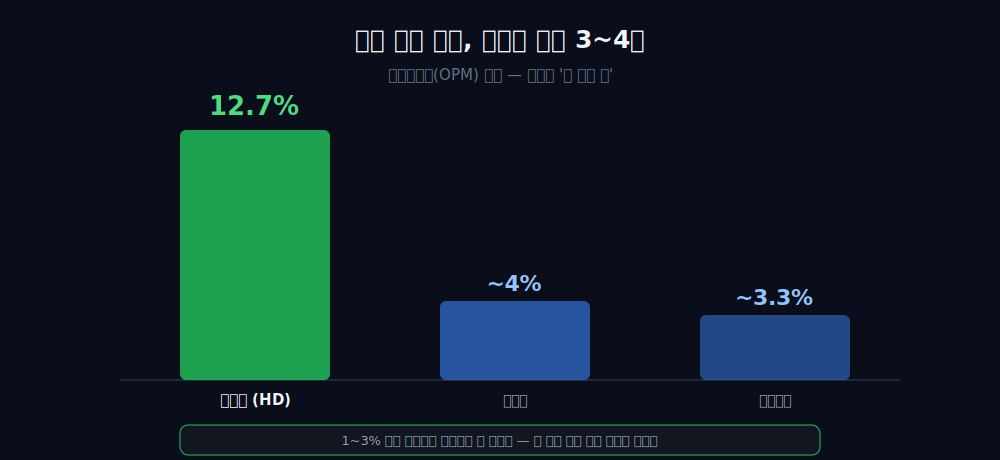
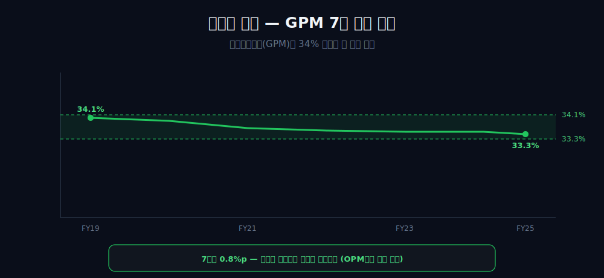
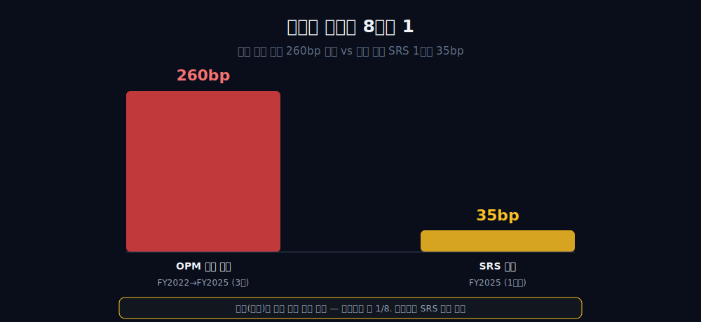
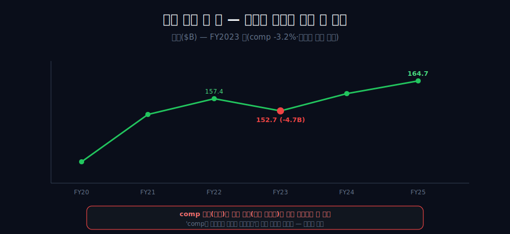
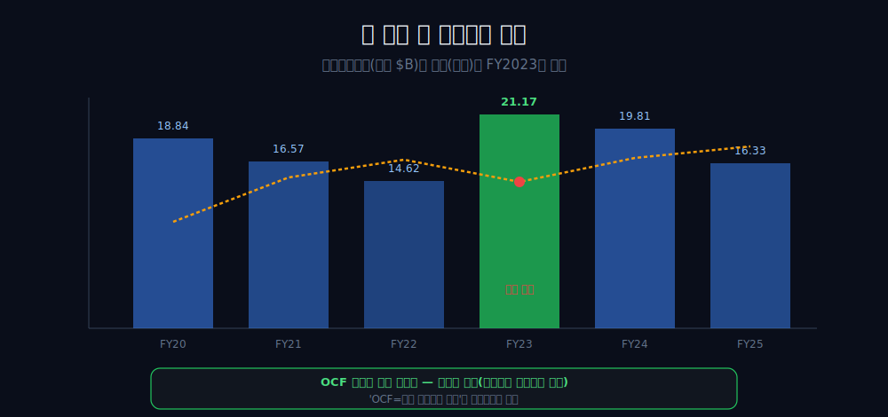
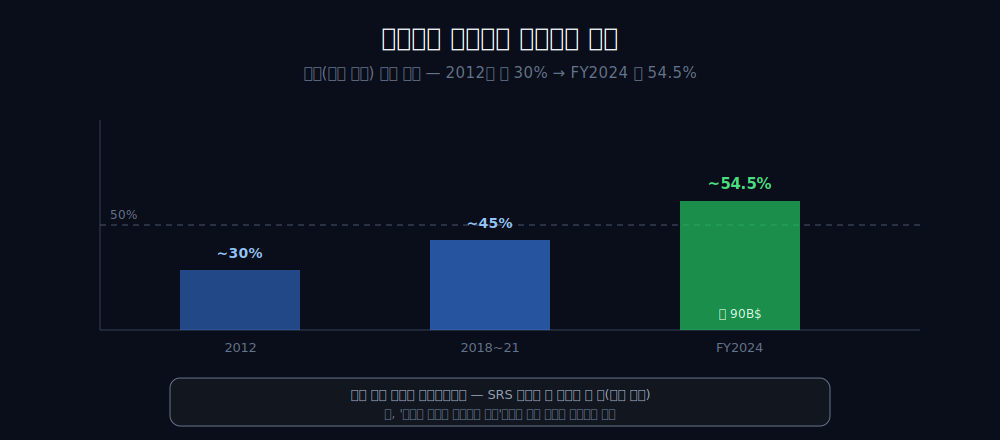
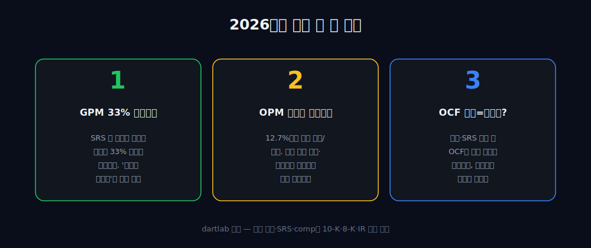

<script>
import ComboChart from '$lib/components/blog/ComboChart.svelte';
import StackBar from '$lib/components/blog/StackBar.svelte';
</script>

> **데이터 기준**: 2026-06-14 dartlab 실측 — The Home Depot(HD) **미국 연결(USD)** 기준, 분기 데이터를 회계연도(1월말 결산)로 합산. 프로 고객 비중·SRS 인수·SRS 마진 희석(bp)·동일점매출(comp)·평방피트당 매출·1979년 기원은 연결 손익에 안 나오므로 **10-K·8-K·IR(외부 인용)**으로 표기. ※대차대조표 항목은 매핑이 불안정해 인용에 주의.
>
> **핵심 숫자**: 영업이익률(OPM) **12.7~15.3%** (월마트·코스트코의 대략 **3~4배**) · 매출총이익률(GPM) **34.1% → 33.3%** (7년 거의 평탄) · 정점 FY2022 **15.3%** → FY2025 **12.7%** (2.6%p↓) · 영업현금흐름 FY2023 **21.17B**(7년 최대, 매출 최저해와 겹침)
>
> **이 글의 용어**: GPM(매출총이익률)·OPM(영업이익률)·NPM(순이익률) = 별개 비율 · bp(베이시스포인트) = 0.01%p · comp(동일점매출) = 기존 매장 매출 증감 · 영업 레버리지 = 고정비가 매출 변동에 따라 마진을 증폭·축소하는 효과 · SRS = HD가 2024년 인수한 전문 건축자재 유통사.

---

## 프롤로그 — 진열대에 우유가 없다

계산대를 한 바퀴 돌아본다. 카트에는 합판, 페인트 통, 전동 드릴, 잔디 비료가 실려 있다. 그런데 어느 통로에도 우유와 계란은 없다.

같은 '대형 소매'라 불리는 [월마트](/blog/WMT-walmart)·[코스트코](/blog/COST-costco)의 진열대를 채우는 1~3% 마진 식료품이, 이곳에는 처음부터 단 한 칸도 없다.



그 비어 있는 칸이, 이 회사의 영업이익률을 경쟁사의 대략 3~4배로 만든 첫 번째 설계다. 그리고 같은 설계가, 장사가 안 될 때 가장 먼저 흔들리는 좌표이기도 하다. **마진의 높이와 변동성은 한 구조의 두 얼굴이다.**

---

## 1막 — 안 파는 것의 이익

**왜 같은 대형 소매인데 마진이 3~4배인가.** 더 잘 팔아서가 아니라, 가장 싸게 팔아야 하는 물건을 아예 안 두기로 한 설계 때문이다.

```python
import dartlab
c = dartlab.Company("HD")
c.select("IS", ["매출액", "영업이익"], freq="Q")  # 분기→회계연도 합산
```

| 항목 (FY, $B) | 2020 | 2022 | 2024 | 2025 |
|---|---:|---:|---:|---:|
| 매출 | 132.1 | 157.4 | 159.5 | 164.7 |
| 영업이익 | 18.28 | 24.04 | 21.53 | 20.89 |
| 연결 OPM | 13.8% | 15.3% | 13.5% | 12.7% |

홈디포의 영업이익률은 12.7~15.3% 밴드다. 같은 기간 월마트는 약 4%, 코스트코는 약 3.3% — 홈디포가 *대략 3~4배* 높다(FY2025 12.7%는 코스트코 대비 약 3.9배, 월마트 대비 약 3.2배; 더 높았던 FY2019 14.4%는 코스트코 대비 4배를 약간 넘는다).

그 이유는 외부 자료가 준다 — 식료품 같은 초저마진(약 1~3%) 품목을 안 취급하는 빅박스 구조다 [외부 인용]. 단, 이건 *이 회사 고유의 경영 묘기가 아니다.* 로우스 같은 동종 빅박스도 공유하는 *좌표의 속성*이다. '안 파는 것'이 마진을 높였다는 건, 동시에 그 구조가 금리 민감성을 부른다는 양날이다.

---

## 2막 — 평탄한 천장

**그 높은 마진을 떠받치는 건 무엇인가.** 7년간 거의 안 움직인 매출총이익률이다.

```python
c.select("IS", ["매출액", "매출총이익"], freq="Q")  # GPM
```

| FY | 2019 | 2021 | 2023 | 2025 |
|---|---:|---:|---:|---:|
| 매출총이익률(GPM) | 34.1% | 33.6% | 33.4% | 33.3% |

매출총이익률은 7년간 34.1%에서 33.3%로, 0.8%p밖에 움직이지 않았다. 사실상 못 박힌 천장이다.



이 평탄함이 곧 마진의 *진짜 천장이자 떠받치는 힘*이다. 그리고 이건 영업이익률(OPM)과는 *별개의 비율*이다 — GPM은 거의 안 움직였는데, 다음 막부터 보듯 OPM은 빠졌다. 그 말은 곧 '마진을 떠받치는 엔진(GPM)은 그대로인데, 다른 데서 샜다'는 뜻이다. 그게 글 전체의 분해 출발점이다.

---

## 3막 — 지목된 범인의 8분의 1

**그럼 영업이익률은 왜 빠졌나. SRS 인수 탓인가.** 흔히 그렇게 지목하지만, 회사 스스로 밝힌 SRS의 책임은 8분의 1뿐이다.

```python
c.select("IS", ["매출액", "영업이익"], freq="Q")  # OPM 추이
```

| FY | 2021 | 2022 | 2023 | 2024 | 2025 |
|---|---:|---:|---:|---:|---:|
| 영업이익률(OPM) | 15.2% | **15.3%** | 14.2% | 13.5% | **12.7%** |

영업이익률은 정점 FY2022 15.3%에서 FY2025 12.7%로, **3년에 걸쳐 2.6%p(260bp)** 빠졌다. 180억 달러짜리 SRS 인수(2024년 6월)가 흔히 범인으로 지목된다.



그런데 회사 자기 공시로도 SRS의 영업이익률 희석은 **FY2025 한 해 약 35bp**다 [외부 인용]. 여기서 기간을 정확히 분리한다 — 35bp는 *FY2025 1년치* 희석이고, 2.6%p(260bp)는 *정점 FY2022 대비 3년 누적* 하락이다. 둘은 같은 분모로 뺄 수 없다. 다만 크기로만 비교하면 35bp는 260bp의 약 8분의 1이다. 그러니 *'180억 달러 인수가 범인'은 과장*이고, 정점 대비 하락의 대부분은 SRS 밖 요인과 정합한다 — 그게 무엇인지는 다음 막에서 본다.

---

## 4막 — 가장 적게 판 해

**그럼 나머지 하락은 어디서 왔나.** 매출이 가장 적었던 해(FY2023)의 영업 레버리지 역작용과 정합한다.

```python
c.select("IS", ["매출액"], freq="Q")  # 매출 궤적
```

| FY | 2021 | 2022 | 2023 | 2024 | 2025 |
|---|---:|---:|---:|---:|---:|
| 매출 ($B) | 151.2 | 157.4 | **152.7** | 159.5 | 164.7 |

매출은 '정체'가 아니라 *'하락 후 회복'*을 그렸다 — FY2023에 157.4B에서 152.7B로 4.7B 꺾였다가 다시 올라왔다. 그 골은 동일점매출 -3.2%, 고금리 '대기 모드'와 같은 해다 [외부 인용·[HD IR](https://ir.homedepot.com/)]. 모기지 금리가 오르자 고객이 대형 리모델링을 미룬 것이다.



여기서 인과를 조심한다 — 매출이 가장 적었던 해에 고정비 영업 레버리지가 역으로 작동해 OPM이 눌린 *타이밍과 정합한다.* 단, comp 감소(분자)와 마진 하락(분모 고정비)은 *같은 고금리 환경의 두 증상*이지, 'comp가 떨어져서 마진이 무너졌다'는 단선 인과가 아니다. 타이밍이 맞는다는 것과 한쪽이 다른 쪽을 만들었다는 것은 다르다.

---

## 5막 — 안 팔릴 때 두꺼워진 통장

**장사가 가장 안 된 해에 현금은 어땠나.** 거꾸로, 가장 많이 들어왔다.

```python
c.select("CF", ["영업활동현금흐름"], freq="Q")  # OCF
```

| FY | 2020 | 2021 | 2022 | 2023 | 2024 | 2025 |
|---|---:|---:|---:|---:|---:|---:|
| 영업현금흐름 ($B) | 18.84 | 16.57 | 14.62 | **21.17** | 19.81 | 16.33 |

영업현금흐름의 7년 최대치 **21.17B**가, 매출이 가장 적었던 FY2023에 찍혔다. 불황기에 곳간이 더 찬 역설이다.



이 역설은 OCF가 수요와 *역방향*으로 움직인 장면이다. 안 팔린 재고가 현금으로 풀린 것(운전자본 타이밍)과 양립한다. 여기서 'OCF=수요 사이클의 서명'이라는 깔끔한 비유는 명시적으로 배제한다 — 그 가정이 정확히 FY2023에서 깨지기 때문이다. 현금 창출력은 든든하지만, 그 출렁임을 '경기 진폭'으로 환원하면 틀린다.

---

## 6막 — 오렌지색 앞치마의 무게중심

**그래서 이 회사는 어디로 가고 있나.** 프로(전문 시공) 고객 쪽으로 무게중심이 옮겨가고, 그 결과 믹스가 마진을 누르는 방향과 정합한다.

```python
c.select("IS", ["매출액", "영업이익"], freq="Q")  # FY2025 종점
```

FY2025 영업이익률은 12.7%로 7년 최저이고, SRS 같은 저마진 유통을 끌어안았다. 프로 고객 비중은 2012년 약 30%에서 FY2024 약 54.5%(약 90B 달러)로 올랐다 [외부 인용·[HD SRS 인수](https://ir.homedepot.com/news-releases/2024/06-18-2024-153031934)]. 이제 매출의 절반 이상이 'DIY 주말 손님'이 아니라 '트럭 몰고 와 대량으로 자재 싣는 사람'에서 나온다.



여기서 의도 단정을 피한다 — '회사가 더 높은 마진을 *일부러 포기*하는 전략'이라고 쓰지 않는다. 외부 사실이 지지하는 건 프로 비중 상승과 SRS가 저마진 유통이라는 *사실*뿐이고, 결과적으로 믹스가 마진을 누르는 방향과 정합한다는 것까지다. 1979년 창고형 포맷이 만든 고마진·금리민감이라는 한 좌표의 두 얼굴 위에서, 이 이동의 결과가 마진·현금흐름에 어떻게 새겨질지가 다음 분기들의 시험대다(기원 서사는 배경으로만, 46년 뒤 OPM에 운명처럼 못박지 않는다).

같은 소매라도 입구의 회비로 이익을 정산받는 [코스트코](/blog/COST-costco), 박리를 그대로 떠안는 [월마트](/blog/WMT-walmart), 소매 껍데기 아래 클라우드를 둔 [아마존](/blog/AMZN-amazon), 한국 대형마트 [이마트](/blog/139480-emart), 그리고 햄버거가 아니라 임대료로 버는 [맥도날드](/blog/MCD-mcdonalds)와 나란히 놓으면, 홈디포는 *'안 파는 것으로 마진을 높이고, 그 구조로 변동성을 떠안는'* 자리다.

---

## 2026년에 봐야 할 세 가지

1. **매출총이익률(GPM)이 33% 부근에서 평탄한가** — SRS 등 저마진 유통 믹스가 커지며 33% 아래로 추세적으로 내려가는가. 관통선의 '엔진은 그대로'가 유지되는지 보는 핵심 지표다.
2. **영업이익률이 12.7%에서 빠지나 회복되나** — 그리고 그 변화가 comp 매출(수요) 반등·고정비 레버리지 회복으로 설명되는가, 믹스 희석이 더 깊어진 결과인가. 하락 원인의 분해가 맞는지 검증.
3. **OCF의 역설이 일회성인가 구조인가** — 프로 비중·SRS 통합이 진전될 때 영업현금흐름이 다시 수요와 역행(불황기 재고 회수)하는가, 도매·유통 믹스가 운전자본 행태 자체를 바꾸는가.



---

## 2026 공식 업데이트 — 매출은 늘었지만, 고마진 구조는 더 낮은 곳에서 시험받는다

2026년 1분기 공식 자료를 붙이면 홈디포의 질문은 더 선명해진다. 회사는 2026년 5월 3일 종료 분기 순매출이 **$41.765B**로 전년 대비 4.8% 늘었다고 발표했다. 겉으로는 회복이다. 그러나 이 글의 관통선은 "잘 팔아서 고마진"이 아니라 "안 파는 것과 믹스가 만든 고마진"이었다. 그래서 매출 증가율만 보고 결론을 내리면 안 된다. 같은 공시 안에서 comparable sales는 **+0.6%**, 미국 comparable sales는 **+0.4%**에 그쳤고, comparable customer transactions는 **-1.3%**였다. 평균 티켓은 **+2.2%**였으니, 더 많이 방문해서 생긴 회복이라기보다 티켓과 인수·믹스가 얹힌 회복에 가깝다.

| 2026 Q1 공식 지표 | 수치 | 이 글에서의 의미 |
|---|---:|---|
| 순매출 | $41.765B, +4.8% | 외형은 증가. 단, 인수·믹스 효과와 기존 매장 성과를 분리해야 함 |
| GAAP 영업이익 | $4.981B | 절대 이익은 크지만 매출 대비 마진은 낮아짐 |
| GAAP 영업마진 | 11.9% | 2025년 연간 12.7%보다 낮은 분기 출발 |
| 조정 영업마진 | 12.3% | acquired intangible amortization 조정 후에도 12%대 초반 |
| 순이익 | $3.289B | 전통적 이익 체력은 유지 |
| 희석 EPS | $3.30 | 조정 EPS $3.43과 분리해서 읽어야 함 |
| 영업활동 현금흐름 | $6.032B | 분기 현금은 강함, 단 계절·운전자본 타이밍 경계 |
| CAPEX | $0.844B | 단순 OCF-CAPEX proxy는 약 $5.188B |

이 표에서 가장 중요한 줄은 매출이 아니라 영업마진 **11.9%**다. 본문에서 홈디포의 OPM 밴드는 12.7~15.3%였고, 2025년 연간도 이미 12.7%로 7년 최저였다. 2026년 1분기 11.9%는 그보다 낮다. 물론 분기와 연간을 바로 비교하면 위험하다. 계절성, 인수 통합비용, 무형자산 상각, 프로 유통 믹스가 모두 섞인다. 하지만 방향은 분명하다. 홈디포의 고마진 구조가 높은 곳으로 다시 튀었다고 말하기에는 아직 이르다. 오히려 "매출은 늘었지만 고마진 구조는 더 낮은 마진대에서 시험받는다"가 맞다.

매출총이익률도 같은 메시지를 준다. 2026년 1분기 매출총이익은 **$13.781B**, 매출총이익률은 **33.0%**였다. 기존 본문에서 홈디포의 GPM은 34.0%에서 33.3%로 7년간 거의 못 박힌 천장이었다. 그런데 2026년 1분기 33.0%는 그 천장의 하단을 다시 건드린다. 회사가 2024년 SRS를 인수한 뒤 저마진 프로 유통 믹스를 끌어안았다는 기존 질문과 정면으로 이어진다. 우유를 안 팔아서 만든 높은 GPM이, 이제 프로 고객·건축자재 유통·인수 믹스 앞에서 얼마나 버티는지가 핵심이다.

```python
netSales = 41.765
grossProfit = 13.781
operatingIncome = 4.981
operatingCashFlow = 6.032
capex = 0.844

grossMargin = grossProfit / netSales
operatingMargin = operatingIncome / netSales
simpleFcfProxy = operatingCashFlow - capex
print(grossMargin, operatingMargin, simpleFcfProxy)
```

이 계산은 회사가 공시한 조정 FCF가 아니다. 단순히 OCF에서 CAPEX를 뺀 작성자 proxy다. 그래도 글의 규율을 보여 주기에는 충분하다. 홈디포는 현금이 약한 회사가 아니다. 2026년 1분기에도 영업현금흐름은 순이익을 크게 웃돈다. 다만 이 글의 질문은 현금의 절대 크기가 아니라 마진 구조다. 현금이 좋고 마진이 낮아질 수 있다. 이 둘은 양립한다. 홈디포의 회복은 매출·현금·마진이 동시에 좋아지는지로 판정해야 한다.

---

## 원래 질문에 겹쳐 읽기 — 안 파는 것으로 번 회사가, 저마진 프로 유통을 산다

기존 글의 좋은 질문은 "우유를 안 파는 순간 마진이 결정됐다"였다. 홈디포는 식료품이라는 초저마진 반복 구매품을 안 팔고, 주택 개량·공구·건축자재라는 고마진 카테고리에 집중했다. 그 결과 월마트·코스트코보다 훨씬 높은 OPM이 나왔다. 그런데 2026년 공식 자료를 붙이면 이 질문이 다음 단계로 넘어간다. 안 팔아서 번 회사가, 이제는 프로 고객을 잡기 위해 저마진 유통 성격의 사업을 더 많이 끌어안고 있다. 이것이 홈디포의 최신 긴장이다.

2026년 1분기 매출 +4.8%는 좋은 숫자지만, comparable sales +0.6%와 거래건수 -1.3%를 같이 보면 해석이 달라진다. 기존 매장 트래픽이 폭발적으로 돌아온 것이 아니다. 평균 티켓 +2.2%가 매출을 받쳤고, 인수 효과와 프로 믹스가 연결 매출을 키웠을 가능성이 크다. 그래서 "소비자가 돌아왔다"보다 "매출 구성과 티켓이 외형을 지탱했다"가 더 정확하다. 홈디포의 핵심 구조를 생각하면, 이 차이는 크다. 주택 개량 수요가 진짜로 회복되면 거래건수와 큰 프로젝트가 같이 살아야 한다. 티켓만 올라서는 고마진 회복을 증명하기 어렵다.

SRS와 GMS 같은 프로 유통 축도 같은 방식으로 읽어야 한다. 프로 고객은 매출 규모를 키운다. 대형 시공업체와 전문 고객은 반복 구매, 대량 주문, 건축자재 수요를 만든다. 그러나 그 매출은 DIY 고객의 페인트·공구·소모품 마진과 성격이 다를 수 있다. 유통 성격이 강하면 매출은 커져도 GPM은 낮아질 수 있다. 2026년 1분기 GPM 33.0%는 이 위험을 숫자로 보여 준다. 기존 33~34% 천장을 아직 무너뜨렸다고 단정하긴 이르지만, 하단 압력이 분명하다.

이 지점에서 홈디포는 [코스트코](/blog/COST-costco)와 반대로 보인다. 코스트코는 낮은 상품 마진을 회비로 보완하는 구조이고, 홈디포는 높은 상품 마진을 카테고리 선택으로 만든 구조다. 그런데 홈디포가 프로 유통을 키우면, 일부 매출은 코스트코식 저마진 대량 유통과 닮아갈 수 있다. 물론 회비 수익이 있는 코스트코와는 다르다. 그래서 더 조심해야 한다. 홈디포가 프로 고객으로 성장하려면 매출은 커질 수 있지만, GPM과 OPM을 어디까지 내줄 것인지가 관건이다.

2026년 1분기 자료는 기존 결론을 뒤집지 않는다. 오히려 더 날카롭게 만든다. 홈디포의 높은 마진은 여전히 카테고리 선택의 결과이고, 그 선택은 고금리와 주택 거래 둔화에 민감하다. 여기에 프로 유통 믹스가 더해지면 매출은 방어되지만 마진은 낮아질 수 있다. 그래서 다음 문장이 최신 결론이다. **홈디포는 매출을 키우기 위해 고마진 구조의 일부를 낮은 마진의 프로 유통으로 바꾸는 중이며, 그 교환비가 GPM 33%와 OPM 12% 안팎에서 시험받고 있다.**

---

## GAAP와 조정치, comp와 GAAP 매출을 섞지 않는 검산 노트

홈디포 2026년 1분기에서 가장 쉽게 틀리는 부분은 네 가지 숫자를 한 문장에 섞는 것이다. GAAP 매출, comparable sales, customer transactions, adjusted EPS는 모두 다른 분모와 목적을 가진다. 순매출 **$41.765B**는 연결 GAAP 매출이다. comparable sales **+0.6%**는 52주 이상 영업한 기존 매장과 웹사이트를 비교하는 운영지표다. customer transactions와 average ticket은 HD Supply와 SRS 결과를 제외한 기준이다. adjusted EPS와 adjusted operating margin은 acquired intangible amortization 등을 조정한 non-GAAP 지표다. 이 네 줄을 섞으면 "매출은 4.8% 늘었고 거래도 좋았다" 같은 부정확한 문장이 나온다.

| 지표 | 성격 | 본문에서의 사용법 |
|---|---|---|
| Net sales | GAAP 연결 매출 | 외형 전체의 출발점 |
| Comparable sales | 기존 매장·웹 성과 보조지표 | 본업 수요의 방향 확인, GAAP 매출 대체 금지 |
| Customer transactions | 일부 인수 제외 운영지표 | 방문·거래 빈도 힌트, 연결 매출 분모와 혼용 금지 |
| Average ticket | 일부 인수 제외 운영지표 | 가격·믹스 힌트, 거래건수와 같이 읽음 |
| Adjusted EPS / margin | non-GAAP | 조정 전 GAAP와 분리해서 보조로만 사용 |

이 구분을 지키면 2026년 1분기의 문장은 이렇게 바뀐다. "연결 매출은 4.8% 늘었지만, 기존 매장 comparable sales는 0.6% 증가에 그쳤고, comparable transactions는 1.3% 감소했으며, 평균 티켓이 2.2% 올랐다." 이 문장은 길지만 정확하다. 짧게 쓰면 틀린다. 홈디포 같은 소매업에서 매출 증가율은 트래픽, 티켓, 인수, 가격, 믹스가 합쳐진 결과다. 어떤 요인이 움직였는지 분리해야 고마진 구조가 유지되는지 볼 수 있다.

조정 지표도 조심한다. GAAP 영업마진은 **11.9%**, 조정 영업마진은 **12.3%**다. 둘 다 나쁘지 않지만, 본문 결론의 기준은 GAAP다. 조정 영업마진이 12.3%라 해도 2022년 정점 15.3%와는 멀다. 조정 EPS **$3.43**은 GAAP EPS **$3.30**보다 높지만, 주택 개량 수요가 회복됐다는 증거는 아니다. 조정치는 특정 비용을 제거한 운영 체력의 보조 렌즈이고, 수요 회복은 comp·transactions·ticket이 보여 준다.

현금흐름도 같은 규칙이다. 영업현금흐름 **$6.032B**는 강하다. CAPEX **$0.844B**를 빼면 단순 proxy로 **$5.188B**의 잉여현금흐름처럼 볼 수 있다. 그러나 이건 회사가 전면 KPI로 제시한 조정 FCF가 아니라 작성자 계산이다. 특히 소매업 분기 현금흐름은 재고, 공급업체 지급, 계절성, 세금 납부 타이밍에 크게 흔들린다. 그래서 이 글에서 현금은 "마진 약화를 당장 위기로 만들지 않는 완충"으로만 둔다. 핵심은 여전히 GPM과 OPM이다.

마지막으로 SRS와 GMS를 구분한다. SRS는 2024년 종결된 전문 건축자재 유통 인수이고, GMS는 2026년 5월 발표된 후속 인수다. 2026년 1분기 실적은 2026년 5월 3일 종료 기준이라 GMS 종결 효과가 아직 연결 실적에 반영된 구조라고 단정하면 안 된다. 다만 회사의 전략 방향은 분명하다. 프로 고객과 특수 건축자재 유통 쪽으로 더 깊이 들어간다. 이 방향이 매출에는 도움이 되고 마진에는 부담이 될 수 있다는 점을 다음 공시에서 확인해야 한다.

---

## 다음 공시에서 틀릴 조건 — 고마진 회복이라고 부르려면

홈디포가 이 글의 의심을 뒤집는 방법은 단순하다. 매출뿐 아니라 GPM과 OPM을 같이 회복시키면 된다. 2026년 1분기처럼 매출이 늘어도 GPM 33.0%, OPM 11.9%, comparable transactions -1.3%라면 "외형 회복"은 가능해도 "고마진 회복"은 아니다. 다음 공시에서 봐야 할 조건은 다섯 개다.

| 체크포인트 | 강한 신호 | 약한 신호 |
|---|---|---|
| GPM | 33.3~34.0% 밴드로 복귀 | 33.0% 아래로 추세 하락 |
| OPM | GAAP 기준 12.7% 위로 회복 | 11~12%대 초반에 머묾 |
| Comparable transactions | 플러스로 전환 | 평균 티켓만 오르고 거래는 감소 |
| Pro/SRS 믹스 | 매출 증가와 마진 방어가 동행 | 프로 유통 매출은 늘고 GPM이 낮아짐 |
| OCF | 순이익을 안정적으로 웃돌며 재고 부담 없음 | 현금은 강하지만 재고·운전자본 변동이 커짐 |

이 표에서 가장 중요한 것은 첫 두 줄이다. 홈디포는 원래 GPM이 높은 회사였고, 그 GPM이 OPM을 떠받쳤다. 그래서 GPM이 계속 33.0% 아래로 내려가면 이 글의 "안 파는 것의 이익"이라는 제목도 수정되어야 한다. 반대로 GPM이 33.5% 안팎으로 돌아오고 OPM이 13%에 가까워지면, 2026년 1분기는 인수·계절성·운전자본이 섞인 낮은 분기로 재해석될 수 있다.

거래건수도 중요하다. comparable transactions가 계속 마이너스이고 average ticket만 플러스라면, 소비자는 더 자주 오는 게 아니라 더 비싸게 사는 것에 가깝다. 주택 개량 수요의 진짜 회복은 큰 프로젝트와 작은 프로젝트가 같이 살아나야 한다. 2026년 1분기 10-Q는 smaller home improvement projects engagement를 언급하지만, housing affordability pressure와 consumer uncertainty도 같이 말한다. 바로 그 양면을 봐야 한다. 작은 프로젝트가 살아도 큰 리모델링이 돌아오지 않으면 홈디포의 고마진 엔진은 제한된다.

프로 고객 확장도 같은 방식으로 검산한다. 프로 고객은 매출을 방어하는 좋은 축이다. 그러나 유통 성격이 강한 프로 매출이 커지면 GPM은 낮아질 수 있다. 홈디포가 이 교환을 잘하고 있다면 매출 성장률이 높아지면서도 OPM이 안정될 것이다. 교환비가 나쁘면 매출은 늘지만 마진은 계속 내려간다. 다음 공시에서 SRS와 향후 GMS 통합 효과를 볼 때, 매출 증가액보다 GPM 하락폭을 먼저 봐야 한다.

따라서 홈디포의 다음 결론은 세 가지 중 하나다. 첫째, GPM과 OPM이 회복되면 "저마진 프로 유통을 흡수하면서도 고마진 구조를 지킨다." 둘째, 매출만 늘고 마진이 낮아지면 "성장을 위해 고마진 구조를 일부 내준다." 셋째, 거래건수까지 회복되면 "주택 개량 수요 자체가 돌아온다." 2026년 1분기만으로는 첫째와 셋째를 말할 수 없다. 현재 가장 근거 있는 문장은 둘째의 가능성을 열어 둔 상태다.

---

## 공시 / Filings

아래 자료는 2026년 1분기 업데이트와 기존 2025년 기준선을 검산할 때 사용한 공식 자료다. 홈디포는 GAAP 매출, comp sales, transactions, adjusted EPS의 분모가 다르므로 공시를 읽을 때 라벨을 유지했다.

| 자료 | 링크 | 이 글에서 사용한 내용 |
|---|---|---|
| Home Depot Q1 FY2026 results | [IR release](https://ir.homedepot.com/news-releases/2026/05-19-2026-110111934) | 순매출, GAAP/adjusted EPS, comparable sales, guidance |
| Home Depot Q1 FY2026 Form 10-Q | [SEC filing](https://www.sec.gov/Archives/edgar/data/354950/000162828026038247/hd-20260503.htm) | 매출총이익, 영업이익, OCF, CAPEX, comp 정의와 거래·티켓 분해 |
| Home Depot FY2025 Form 10-K | [SEC filings index](https://www.sec.gov/cgi-bin/browse-edgar?action=getcompany&CIK=0000354950&type=10-K) | 2025년 연간 기준선, SRS·프로 고객·사업 구조 검산 |
| SRS acquisition closing release | [SEC exhibit](https://www.sec.gov/Archives/edgar/data/0000354950/000035495024000177/exhibit991-6182024srsclosi.htm) | SRS 인수 규모와 프로 고객 전략 배경 |

공식 자료를 붙인 뒤 결론은 바뀌지 않고 더 좁아진다. 홈디포는 여전히 높은 마진을 가진 소매업체지만, 2026년 1분기 숫자는 그 마진이 프로 유통 확장과 주택 수요 둔화 속에서 더 낮은 기준선으로 내려올 수 있음을 보여 준다. 다음 공시의 첫 줄은 매출이 아니라 **GPM 33% 방어, GAAP OPM 12.7% 회복, comparable transactions 플러스 전환**이다.

**확장 검산 — 매출 증가를 세 조각으로 나눠 읽는다.** 홈디포 Q1 2026의 매출 증가율 4.8%는 한 줄로 보기에는 좋다. 하지만 이 글의 핵심은 "얼마나 팔았나"보다 "무엇을 팔았고, 그 판매가 어떤 마진을 남겼나"다. 그래서 매출 증가를 세 조각으로 나눈다. 첫째는 기존 매장 수요다. comparable sales +0.6%, 미국 comparable sales +0.4%가 여기에 해당한다. 둘째는 가격과 티켓이다. average ticket +2.2%는 거래당 금액이 올라갔다는 뜻이지, 방문자가 늘었다는 뜻이 아니다. 셋째는 연결 범위와 믹스다. SRS 같은 인수 효과와 프로 고객 비중 변화는 순매출을 키우지만 GPM을 낮출 수 있다. 세 조각을 분리하면 Q1의 좋은 매출 증가율이 곧바로 고마진 회복을 뜻하지 않는 이유가 보인다.

**트래픽의 언어와 티켓의 언어를 분리한다.** 소매업에서 거래건수는 체온계에 가깝다. 사람이 더 자주 오면 거래건수가 늘고, 단가가 오르면 평균 티켓이 늘어난다. 둘 다 매출을 올리지만 의미가 다르다. 2026년 1분기 comparable transactions -1.3%와 average ticket +2.2%의 조합은 "더 많은 사람이 돌아왔다"보다 "거래당 금액이 올라 매출을 받쳤다"에 가깝다. 주택 개량 수요가 강하게 회복된다면 작은 수리뿐 아니라 큰 프로젝트도 돌아와야 하고, 그때는 거래건수와 티켓이 같이 좋아질 가능성이 높다. 지금은 한쪽이 아직 비어 있다.

**GPM 33.0%는 작은 숫자가 아니다.** 홈디포의 GPM은 원래 높고 안정적이었다. 33~34%라는 숫자는 월마트식 저마진 대량 유통이 아니라, 카테고리 선택과 매장 운영이 만든 구조적 마진이다. 그런데 Q1 2026의 33.0%는 그 밴드의 하단이다. 0.3%p나 0.5%p 하락은 소매업에서 작아 보일 수 있지만, 매출이 40B가 넘는 분기에서는 수억 달러 단위의 이익 차이로 번역된다. 그래서 이 글은 GPM을 소수점까지 본다. "대략 33%"라고 뭉개면 홈디포의 핵심 엔진을 놓친다.

**프로 고객 전략은 좋은 전략이면서 동시에 마진 질문이다.** 홈디포가 프로 고객을 잡으려는 이유는 분명하다. 전문 시공업체와 대형 프로젝트 고객은 규모가 크고 반복 구매가 가능하다. DIY 고객 한 명이 주말에 페인트와 공구를 사는 것보다, 프로 고객의 자재 주문은 훨씬 클 수 있다. 하지만 그 매출은 더 유통적이고, 가격 협상력이 더 강한 고객을 상대할 가능성이 높다. 프로 고객은 매출의 안정성을 높이면서도 GPM에는 부담을 줄 수 있다. 좋은 전략이 마진에는 부담일 수 있다는 점을 동시에 인정해야 한다.

**SRS는 범인이 아니라 방향이다.** 기존 글에서 SRS 35bp 희석은 FY2025 한 해의 효과이고, FY2022 대비 OPM 260bp 하락과 직접 빼면 안 된다고 했다. 이 원칙은 Q1 2026에도 유지된다. SRS가 모든 마진 하락의 범인이라는 단정은 틀리다. 그러나 SRS가 홈디포의 방향을 보여 주는 사건이라는 점은 중요하다. 회사는 고마진 DIY 카테고리만으로 머물지 않고, 전문 건축자재 유통과 프로 고객 지갑으로 더 들어가고 있다. 이것이 매출 성장의 방향이라면, 앞으로도 GPM과 OPM을 같이 확인해야 한다.

**현금흐름은 방어막이지 결론이 아니다.** Q1 2026 OCF 6.032B와 단순 FCF proxy 5.188B는 강하다. 홈디포가 단기 유동성 때문에 흔들리는 회사가 아니라는 뜻이다. 하지만 현금흐름이 좋다고 마진 구조가 좋아지는 것은 아니다. 소매업의 분기 현금흐름은 재고, 매입채무, 세금 납부, 계절성에 따라 크게 움직인다. 홈디포의 현금흐름은 "마진 압력이 곧 위기로 번지지는 않는다"는 방어막을 제공한다. 그러나 "고마진 구조가 회복됐다"는 결론은 GPM과 OPM이 말해야 한다.

**조정치가 결론을 바꾸지는 않는다.** adjusted operating margin 12.3%는 GAAP 11.9%보다 높다. adjusted EPS 3.43도 GAAP EPS 3.30보다 높다. 조정치가 나쁘다는 뜻은 아니다. 인수 관련 무형자산 상각처럼 비교 가능성을 흐리는 비용을 제거하면 운영 체력을 더 잘 볼 때가 있다. 그러나 이 글의 질문은 "홈디포의 고마진 구조가 유지되는가"다. 이 질문에는 조정치보다 GAAP 마진의 하락 방향이 먼저다. 조정 후에도 12%대 초반이라는 점은 오히려 결론을 크게 바꾸지 않는다.

**주택 수요의 회복은 매출보다 거래건수에서 먼저 확인한다.** 금리와 주택 affordability가 부담이면 소비자는 큰 리모델링을 미루고 작은 수리만 한다. 이런 국면에서는 매출이 완전히 무너지지 않아도 거래건수와 큰 프로젝트 수요가 약할 수 있다. 홈디포의 10-Q가 작은 프로젝트 참여와 소비자 불확실성을 같이 말하는 이유가 여기에 있다. 작은 프로젝트는 매장을 계속 돌게 하지만, 고마진·고액 프로젝트의 회복을 대체하지는 못한다. 그래서 다음 공시에서 거래건수 플러스 전환이 중요하다.

**이 글의 강한 버전과 약한 버전을 구분한다.** 강한 버전은 "홈디포의 마진 구조가 깨지고 있다"다. 아직 이 문장은 과하다. GPM 33.0%는 낮아졌지만 붕괴는 아니고, OCF도 강하다. 약한 버전은 "홈디포의 고마진 구조가 낮은 밴드에서 시험받고 있다"다. 현재 자료는 이 약한 버전을 지지한다. 좋은 분석은 강한 주장을 먼저 쓰는 것이 아니라, 자료가 허락하는 주장만 끝까지 밀어붙이는 것이다. Q1 2026은 경고 신호이지 판결문은 아니다.

**비교 대상도 정확히 둔다.** 홈디포를 월마트나 코스트코와 비교하는 이유는 같은 대형 소매라도 카테고리와 수익 모델이 다르다는 점을 보여 주기 위해서다. 월마트·코스트코가 낮은 마진을 규모와 회전율로 버틴다면, 홈디포는 높은 상품 마진과 프로젝트 수요로 버틴다. 그런데 프로 유통 믹스가 커지면 홈디포의 일부 매출은 더 낮은 마진·더 큰 볼륨의 성격을 띨 수 있다. 이 변화가 나쁜 것은 아니다. 단, 홈디포를 홈디포답게 만든 마진 프리미엄을 희석하는지 봐야 한다.

**최종 판정은 보류가 아니라 조건부다.** 이 글은 홈디포를 부정적으로 결론내리지 않는다. 높은 현금흐름, 강한 브랜드, 프로 고객 확장, 넓은 카테고리 방어력은 여전히 장점이다. 다만 장점이 있다고 해서 마진 압력이 사라지는 것은 아니다. Q1 2026 기준으로 데이터가 말하는 판정은 "외형은 방어했고, 현금은 강하지만, 고마진 구조는 아직 회복을 증명하지 못했다"다. 다음 분기에서 GPM이 33.3% 이상으로 돌아오고 GAAP OPM이 12.7% 위로 올라가며 거래건수가 플러스로 바뀌면, 이 글의 의심은 약해진다. 그 전까지는 매출 증가보다 마진의 질을 먼저 봐야 한다.

**운영 레버리지의 방향도 확인해야 한다.** 홈디포는 매장, 물류, 인력, 재고 시스템을 가진 대형 소매업체다. 매출이 늘면 고정비 흡수 효과로 OPM이 좋아질 수 있고, 매출이 둔화되면 같은 비용 구조가 마진을 누를 수 있다. 그런데 Q1 2026에서는 순매출이 늘었는데 GAAP OPM은 11.9%에 머문다. 이 조합은 매출 증가가 충분히 고마진으로 흘러내리지 않았다는 뜻이다. 인수 관련 상각, 프로 믹스, 계절성, 판관비 부담이 섞였을 수 있지만, 결과는 하나다. 매출 증가율만으로 operating leverage가 살아났다고 말할 수 없다.

**GPM과 SG&A를 나눠야 한다.** GPM 33.0%는 상품과 믹스의 문제에 가깝고, OPM 11.9%는 거기에 판관비와 운영비가 더해진 결과다. GPM이 내려가면 카테고리와 가격, shrink, 물류 비용, 프로 믹스를 의심한다. GPM이 유지되는데 OPM만 내려가면 인건비, 기술 투자, 매장 운영비, 인수 통합비용을 의심한다. 홈디포의 Q1 2026은 둘 다 조심해야 하는 구간이다. GPM은 밴드 하단이고, OPM도 2025년 연간보다 낮다. 그래서 결론은 "엔진은 아직 남아 있지만 마찰이 커졌다"에 가깝다.

**SRS와 향후 GMS를 보는 법도 정해 둔다.** 인수는 매출을 키우는 가장 빠른 방법이다. 하지만 홈디포의 경우 인수 매출이 어떤 마진으로 들어오는지가 더 중요하다. SRS가 프로 고객 접점을 넓혔다면 전략적으로는 맞다. 다만 그 매출이 낮은 GPM으로 들어오고, 통합 비용이 판관비를 누르면 단기적으로 OPM은 내려갈 수 있다. GMS까지 연결되면 같은 질문이 커진다. 프로 유통 네트워크가 홈디포의 moat을 넓히는가, 아니면 홈디포의 고마진 소매 프리미엄을 희석하는가. 답은 발표 문구가 아니라 GPM과 OPM에 찍힌다.

**주택 사이클과 홈디포 사이클은 같지 않지만 겹친다.** 주택 가격, 모기지 금리, 기존주택 거래량, 소비자 신뢰는 모두 홈디포 매출에 영향을 준다. 그러나 홈디포가 주택 사이클 그 자체는 아니다. 사람들은 집을 사지 않아도 수리하고, 큰 리모델링을 미뤄도 작은 프로젝트는 한다. 그래서 Q1 2026처럼 작은 프로젝트는 살아 있고 큰 프로젝트는 아직 조심스러운 혼합 신호가 나올 수 있다. 홈디포의 강점은 이 혼합 국면에서도 매출을 방어하는 데 있다. 약점은 큰 프로젝트가 돌아오지 않으면 높은 마진 회복도 제한된다는 점이다.

**마지막으로, 숫자의 순서를 바꾸면 결론이 바뀐다.** "매출 +4.8%"로 시작하면 홈디포는 회복주처럼 보인다. "GPM 33.0%, OPM 11.9%"로 시작하면 마진 압력이 먼저 보인다. "OCF 6.032B"로 시작하면 현금 강자가 된다. 세 문장 모두 틀린 것은 아니지만, 이 글의 질문에 가장 맞는 순서는 마진, comp, 현금이다. 홈디포는 현금이 약해서 문제가 되는 회사가 아니라, 높은 마진 프리미엄을 유지할 수 있는지가 핵심인 회사다. 그래서 이 글의 독법은 끝까지 같다. 매출의 크기보다 매출의 질, 현금의 크기보다 마진의 지속성이다.

**홈디포의 강점은 사라진 것이 아니라 더 비싸졌다.** 강한 브랜드, 전국 매장망, 프로 고객 접점, 공급망 규모는 여전히 경쟁력이 있다. 다만 금리가 높고 주택 거래가 둔화된 국면에서는 그 경쟁력을 유지하는 비용이 더 커질 수 있다. 고객을 붙잡기 위한 가격·프로 서비스·배송·재고 투자가 필요하고, 인수한 유통망을 통합하는 비용도 든다. 좋은 moat도 공짜가 아니다. Q1 2026의 낮은 OPM은 moat가 사라졌다는 뜻이 아니라, 그 moat를 유지하는 비용이 매출 증가분을 일부 먹고 있다는 신호일 수 있다.

**그래서 다음 분기에서 볼 문장은 이미 정해져 있다.** "Net sales increased"는 첫 문장으로 충분하지 않다. 그 뒤에 "gross margin expanded", "operating margin recovered", "comparable transactions increased"가 따라와야 한다. 세 문장이 모두 붙으면 홈디포는 외형과 마진을 같이 회복한 것이다. 매출만 늘고 GPM이 낮아지면 성장의 질은 약하다. 거래건수는 계속 줄고 평균 티켓만 오르면 수요 회복도 약하다. 홈디포의 다음 공시를 읽는 순서는 이 세 문장을 찾는 일이다.

**이 글의 가장 보수적인 결론은 숫자로 닫힌다.** Q1 2026 순매출 41.765B, GPM 33.0%, GAAP OPM 11.9%, comp +0.6%, transactions -1.3%, OCF 6.032B. 이 여섯 줄을 한 화면에 놓으면 홈디포가 왜 흥미로운지 보인다. 회사는 여전히 돈을 잘 벌고 현금도 만든다. 하지만 고마진 프리미엄은 과거보다 낮은 위치에서 시험받고 있다. 그래서 홈디포는 "망가진 소매업체"가 아니라 "강한 소매업체의 마진 재평가" 문제다. 이 차이를 유지하는 것이 이 글의 핵심이다.

**독자가 가져갈 체크리스트는 단순하다.** 첫째, 매출 증가율을 보기 전에 GPM을 본다. 둘째, GPM을 본 뒤 GAAP OPM을 본다. 셋째, OPM을 본 뒤 comparable transactions를 본다. 넷째, 마지막으로 OCF가 그 마진 압력을 버틸 만큼 강한지 확인한다. 이 순서를 지키면 홈디포의 좋은 뉴스와 나쁜 뉴스를 동시에 읽을 수 있다. 좋은 뉴스는 외형과 현금이다. 나쁜 뉴스는 낮아진 마진과 아직 약한 거래건수다. 어느 한쪽만 잡으면 홈디포를 잘못 읽는다.

**마진 회복의 기준선도 미리 정한다.** GPM이 33.3% 위로 돌아오고, GAAP OPM이 12.7%를 회복하며, comparable transactions가 플러스로 바뀌면 이 글의 의심은 약해진다. 반대로 매출이 계속 늘어도 GPM이 33.0% 아래로 내려가고 OPM이 11%대에 머물면, 홈디포는 성장을 위해 고마진 구조를 일부 내주고 있다는 해석이 강해진다. 이 기준선은 의견이 아니라 현재 공시 숫자에서 나온다. 그래서 다음 업데이트 때도 같은 잣대로 다시 검산할 수 있다.

**홈디포를 강하게 보는 독자도 이 기준선을 피할 필요는 없다.** 오히려 좋은 회사일수록 기준선을 선명하게 두는 편이 낫다. 홈디포가 정말 강하다면 다음 공시에서 그 강함은 매출만이 아니라 GPM과 OPM에도 나타난다. 프로 고객 확대가 좋은 전략이라면 매출 증가와 마진 방어가 같이 보일 것이다. 주택 수요가 회복된다면 average ticket만이 아니라 transactions도 돌아올 것이다. 이 세 조건이 동시에 맞으면 이 글의 의심은 자연스럽게 약해진다. 반대로 한 조건만 맞고 두 조건이 빠지면, 좋은 서사와 좋은 손익 사이의 거리가 남아 있다는 뜻이다.

**그래서 홈디포의 최신 질문은 찬반이 아니라 교환비다.** 회사가 프로 고객을 얻기 위해 얼마의 GPM을 내주는가. 매출을 키우는 대신 OPM이 얼마나 낮아지는가. 현금흐름이 그 교환을 얼마나 오래 버티게 해 주는가. 이 세 문장이 다음 업데이트의 골격이다. 홈디포는 여전히 좋은 회사일 수 있다. 하지만 좋은 회사도 나쁜 교환비를 오래 지속하면 주주에게 남는 몫이 줄어든다.

**한 줄로 닫으면 이렇다.** 홈디포의 2026년 1분기는 회복의 증거가 아니라 검사의 시작이다. 매출은 이미 늘었다. 이제 필요한 것은 그 매출이 다시 33% 중반의 GPM과 13% 안팎의 OPM으로 내려오는지다. 그때까지 이 글의 질문은 유지된다.

**따라서 다음 분기에도 같은 순서로 읽는다.** 매출, GPM, OPM, 거래건수, OCF. 순서를 바꾸지 않으면 좋은 회사라는 인상과 낮아진 마진이라는 사실을 동시에 붙잡을 수 있다.

이 순서가 홈디포를 가장 덜 과장해서 읽는 방법이다.

다음 공시에서도 이 순서를 유지한다.

숫자가 먼저이고, 마진이 판정한다.

---

## 재무제표 — 최근 6개 회계연도 (dartlab 연결, $B)

> 미국 연결(USD)·분기 합산(회계연도 1월말) 기준. dartlab에서 직접 확인:
> ```python
> import dartlab
> c = dartlab.Company("HD")
> c.select("IS", ["매출액","영업이익","당기순이익"], freq="Q")
> c.select("CF", ["영업활동현금흐름"], freq="Q")
> ```

<ComboChart data={[{year:"2020",매출:132.1,영업이익:18.28,당기순이익:12.87},{year:"2021",매출:151.2,영업이익:23.04,당기순이익:16.43},{year:"2022",매출:157.4,영업이익:24.04,당기순이익:17.11},{year:"2023",매출:152.7,영업이익:21.69,당기순이익:15.14},{year:"2024",매출:159.5,영업이익:21.53,당기순이익:14.81},{year:"2025",매출:164.7,영업이익:20.89,당기순이익:14.16}]} lineKeys={["매출"]} barKeys={["영업이익","당기순이익"]} lineColors={["#22c55e"]} barColors={["#3b82f6","#f59e0b"]} title="매출(라인) vs 영업이익·당기순이익(막대) — $B" unit="$B" />

| 항목 (FY, $B) | 2020 | 2021 | 2022 | 2023 | 2024 | 2025 |
|---|---:|---:|---:|---:|---:|---:|
| 매출 | 132.1 | 151.2 | 157.4 | 152.7 | 159.5 | 164.7 |
| 매출총이익 | 44.85 | 50.83 | 52.78 | 50.96 | 53.31 | 54.87 |
| 매출총이익률(GPM) | 34.0% | 33.6% | 33.5% | 33.4% | 33.4% | 33.3% |
| 영업이익 | 18.28 | 23.04 | 24.04 | 21.69 | 21.53 | 20.89 |
| 영업이익률(OPM) | 13.8% | 15.2% | 15.3% | 14.2% | 13.5% | 12.7% |
| 당기순이익 | 12.87 | 16.43 | 17.11 | 15.14 | 14.81 | 14.16 |
| 영업현금흐름 | 18.84 | 16.57 | 14.62 | 21.17 | 19.81 | 16.33 |

이 표를 한 줄로 읽으면 이렇다 — **매출총이익률(GPM) 행은 34.0%에서 33.3%로 거의 못 박혀 있는데, 영업이익률(OPM) 행은 15.3%(FY2022)에서 12.7%(FY2025)로 2.6%p 빠진다.** GPM·OPM은 별개 비율이고, 그 둘의 갈림이 '엔진(GPM)은 그대로인데 다른 데서 샜다'는 그림이다. 영업현금흐름 행은 매출 행과 역행한다 — 매출 최저해 FY2023(152.7)에 OCF는 7년 최대(21.17)다(SRS 희석·comp·프로 비중=외부).

---

## 검증표

본문 인용 수치를 dartlab 호출과 결과로 검증한다. 외부 출처(프로 비중·SRS·comp·기원)는 분리 표기. 📅 dartlab 실측 2026-06-14 · HD 미국 연결(USD)·분기 합산(회계연도) 기준.

| 본문 수치 | 출처 / 호출 | 결과 |
|---|---|---|
| 영업이익률(OPM) 12.7~15.3% (월마트·코스트코의 대략 3~4배) | `c.select("IS",["영업이익"],freq="Q")` ÷ 매출 | ✓ 실측 |
| 매출총이익률(GPM) 7년 34.1→33.3% (거의 평탄) | 매출총이익÷매출 | ✓ 실측 |
| OPM 정점 FY2022 15.3% → FY2025 12.7% (3년 누적 2.6%p↓) | `c.select("IS",["영업이익"])` | ✓ 실측 |
| 매출 FY2023 골 157.4→152.7 (-4.7B) → 회복 164.7B | `c.select("IS",["매출액"])` | ✓ 실측 |
| 영업현금흐름 FY2023 21.17B (7년 최대, 매출 최저해) | `c.select("CF",["영업활동현금흐름"])` | ✓ 실측 |
| Q1 FY2026 순매출 41.765B(+4.8%), GAAP 영업이익 4.981B, OPM 11.9%, 순이익 3.289B | [HD Q1 FY2026 10-Q (SEC)](https://www.sec.gov/Archives/edgar/data/354950/000162828026038247/hd-20260503.htm) | 공식 공시 |
| Q1 FY2026 매출총이익 13.781B, GPM 33.0%, OCF 6.032B, CAPEX 0.844B, 단순 FCF proxy 5.188B | [HD Q1 FY2026 10-Q (SEC)](https://www.sec.gov/Archives/edgar/data/354950/000162828026038247/hd-20260503.htm) | 공식 공시 / 작성자 계산 |
| Q1 FY2026 comparable sales +0.6%, U.S. comp +0.4%, comparable transactions -1.3%, average ticket +2.2% | [HD Q1 FY2026 IR release](https://ir.homedepot.com/news-releases/2026/05-19-2026-110111934) · [HD 10-Q](https://www.sec.gov/Archives/edgar/data/354950/000162828026038247/hd-20260503.htm) | 공식 공시 |
| Q1 FY2026 GAAP EPS 3.30, adjusted EPS 3.43, adjusted operating margin 12.3% | [HD Q1 FY2026 IR release](https://ir.homedepot.com/news-releases/2026/05-19-2026-110111934) | 공식 공시 |
| SRS 인수 EV 약 18.25B$(2024.6.18 종결), 프로 TAM +50B$ | [HD IR (SRS)](https://ir.homedepot.com/news-releases/2024/06-18-2024-153031934) · [HD 8-K (SEC)](https://www.sec.gov/Archives/edgar/data/0000354950/000035495024000177/exhibit991-6182024srsclosi.htm) | 외부 인용 |
| SRS 영업이익률 희석 약 35bp (FY2025 1년치, 260bp와 분모 다름) | [HD 10-K (SEC EDGAR)](https://www.sec.gov/cgi-bin/browse-edgar?action=getcompany&CIK=0000354950&type=10-K) · 실적콜 | 외부 인용·기간 분리 |
| 프로 고객 비중 2012 약 30% → FY2024 약 54.5%(약 90B$) | [HD SRS 발표](https://ir.homedepot.com/news-releases/2024/03-28-2024-100102814) | 외부 인용 |
| FY2023 동일점매출(comp) -3.2% · 고금리 '대기 모드' | HD 8-K · CNBC | 외부 인용 |
| 식료품 미취급 빅박스 구조·1979년 창고형 기원 | 업계 분석 · 회사 연혁 | 외부 인용·배경만 |

본문의 숫자 중 이 표에 없는 것은 발행 차단 대상이다. 프로 비중·SRS·comp·기원은 dartlab 연결로 증명되지 않으며 외부 인용임을 명시한다 — 연결이 증명하는 것은 'GPM은 7년 평탄, OPM만 2.6%p 빠짐, OCF는 매출과 역행'까지이고, SRS 35bp(1년)와 260bp(3년 누적)는 분모가 달라 직접 빼지 않으며, OPM 하락의 대부분 원인은 미결(영업 레버리지와 정합)이다.
