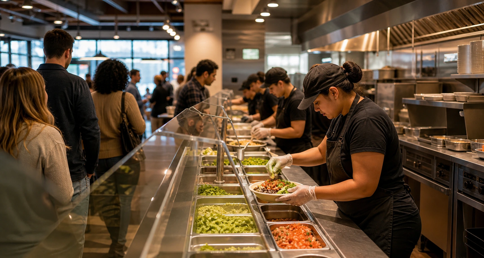
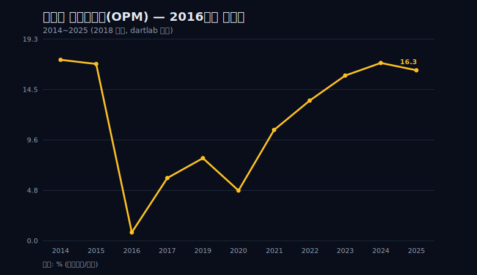
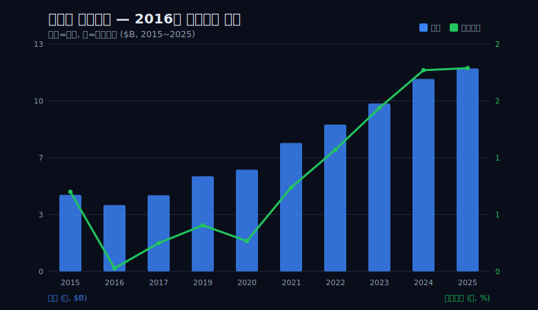
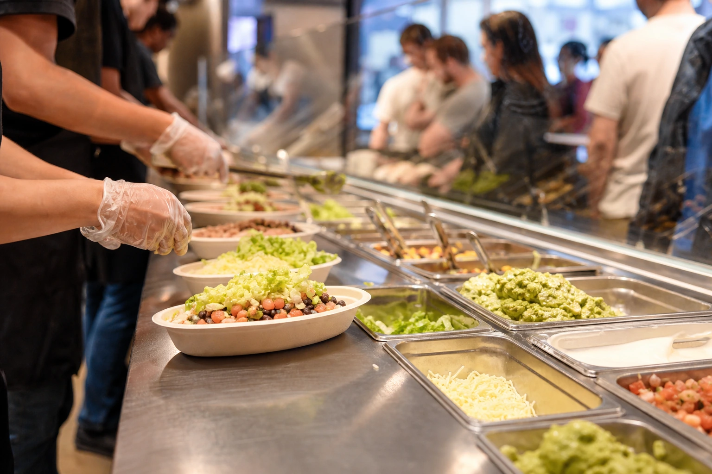
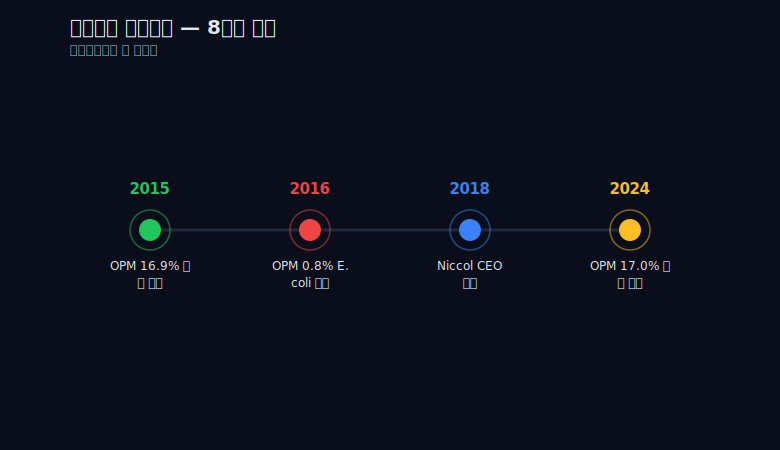
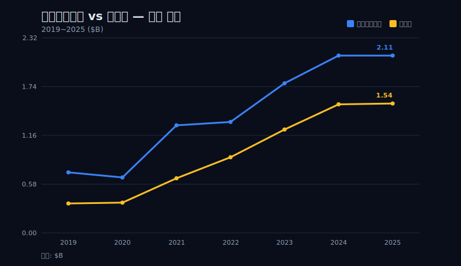
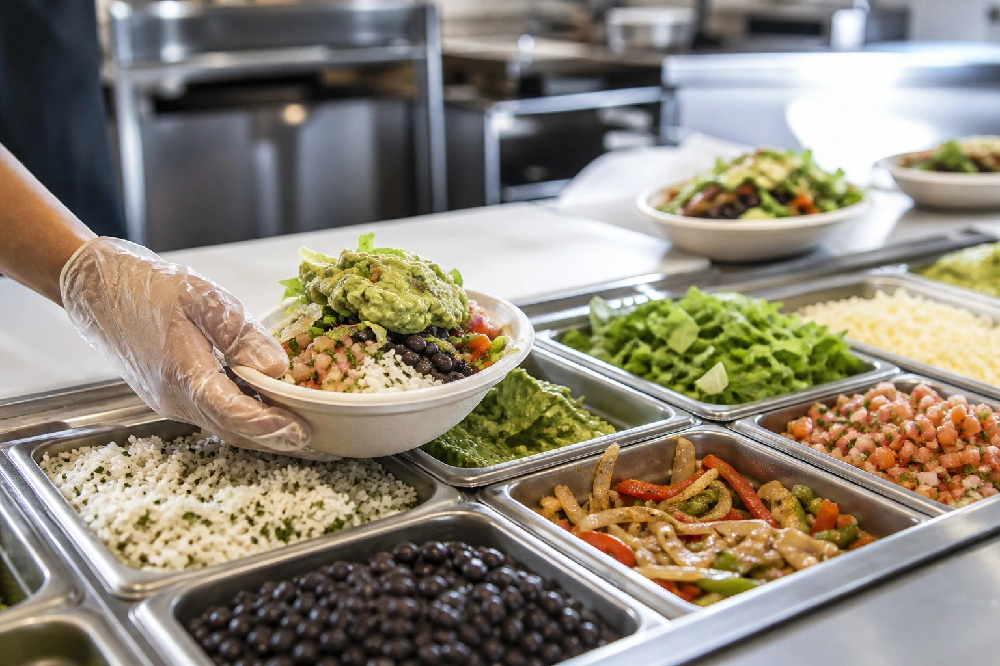

> **데이터 기준**: 2026-06-14 dartlab 실측 — Chipotle Mexican Grill(CMG) **미국 연결(USD)** 기준, 분기 데이터를 역년(曆年)으로 합산. 세그먼트·제품별·점포별 등 손익 밖 항목은 10-K/IR/언론 **외부 인용**으로 표기. ※2018년은 매출이 3분기만 집계돼 시계열에서 제외했고, 영업활동현금흐름은 2019년부터만 제공된다.
>
> **핵심 숫자**: 영업이익률(OPM) **16.9%**(2015) → **0.8%**(2016) → **17.0%**(2024) → **16.3%**(2025) · 영업이익 **0.76B**(2015) → **0.03B**(2016, -96%) → **1.94B**(2025) · 매출 **3.90B**(2016) → **11.93B**(2025, 약 3.06배).
>
> **이 글의 용어**: 영업이익률(OPM) = 영업이익÷매출 · 순이익률(NPM) = 순이익÷매출 · 영업활동현금흐름(OCF) = 본업으로 실제 들어온 현금 · 영업레버리지 = 고정비가 큰 회사에서 매출 변동이 이익을 더 크게 증폭시키는 성질.

---

## 프롤로그 — 0.8%라는 한 줄

한 회사의 영업이익률이 **0.8%**까지 내려간 해가 있다. 2016년 치폴레다. 매출 **3.90B**, 영업이익 **0.03B**. 100원을 팔아 영업이익으로 80전이 남았다는 뜻이다.



이 숫자가 충격적인 이유는 한 해 전과 한 해 뒤를 같이 놓을 때다. 바로 직전 2015년의 영업이익률은 **16.9%**였고, 8년 뒤 2024년에는 **17.0%**로 돌아왔다. 정상적으로 17%를 내던 회사가 단 한 해 거의 0에 닿았다가, 다시 17%로 채워졌다. 위기의 깊이와 회복의 길이가 영업이익률(매출 대비 영업이익 비율)이라는 단 한 줄에 동시에 적혀 있다.



이 글의 관통선은 하나다. **무너짐은 한 분기에, 회복은 8년에 걸쳐 일어났다.** 더 정확히 좁히면 이렇다 — 무너짐은 한 분기 매출 붕괴가 고정비 레버리지로 증폭된 결과였고, 회복은 외형 성장과 마진 재건이라는 *서로 다른 두 작업*이 8년 동안 겹쳐 누적된 결과다. 이 글은 그 한 줄을 따라간다.

미리 한 가지를 분명히 한다. "식중독이 영업이익률을 0.8%로 만들었다"는 직접 인과는 손익 7줄로 증명되지 않는다. 2015년 가을의 다주(州) 대장균·노로바이러스 발병은 [SEC 10-K(EDGAR)](https://www.sec.gov/cgi-bin/browse-edgar?action=getcompany&CIK=CMG&type=10-K)와 언론이 기록한 **손익 밖 맥락**이다. 손익이 직접 증명하는 건 '매출이 빠지자 이익이 더 빨리 빠졌다'까지다. 손익이 증명하는 것과 외부 서사로 남는 것의 경계 — 이 글은 그 경계를 매 막에서 다시 확인한다.

```python
import dartlab

c = dartlab.Company("CMG")          # 미국 연결(USD)
oi = c.select("IS", freq="Q")       # 분기 손익계산서
# 분기를 역년으로 합산해 연도별 매출·영업이익·영업이익률을 본다
# 2015 OPM 16.9% → 2016 0.8% → 2024 17.0% → 2025 16.3%
```

---

## 1막 — 분화구: 한 분기에 사라진 0.73B

**왜 한 회사의 영업이익이 1년 만에 96% 증발했나.** 2015년 영업이익 **0.76B**이 2016년 **0.03B**으로 줄었다. 절대액으로 **0.73B**이 사라진, -96%의 붕괴다.

같은 해 매출도 빠졌다. 2015년 **4.50B**에서 2016년 **3.90B**으로 **-13%**다. 13%의 매출 후퇴는 외식업에서 분명히 큰 충격이지만, 그 자체로 회사를 거의 0으로 만들 크기는 아니다. 결정적인 건 두 숫자의 *간격*이다. 매출은 13% 빠졌는데 영업이익은 96% 빠졌다. 이익의 하락이 매출의 하락보다 **7배 이상** 가파르다.



이 7배의 간격이 영업레버리지(고정비가 큰 회사에서 매출 변동이 이익을 증폭시키는 성질)의 붕괴다. 매장 임대료, 인건비, 본사 운영비처럼 매출이 줄어도 그대로 나가는 고정비가 두꺼운 회사는, 매출이 한 칸 빠지면 그 빠진 매출이 거의 통째로 이익에서 사라진다. 위에 깔린 고정비가 먼저 채워져야 이익이 남기 때문이다. 매출이 13% 빠지자 영업이익이 96% 사라진 2016년은 이 구조가 어떻게 작동하는지 그대로 드러낸다.

```python
# 영업레버리지 붕괴를 직접 확인한다
rev_2015, rev_2016 = 4.50, 3.90      # 매출(B)
oi_2015,  oi_2016  = 0.76, 0.03      # 영업이익(B)

rev_drop = (rev_2016 - rev_2015) / rev_2015   # -0.133 → -13.3%
oi_drop  = (oi_2016  - oi_2015)  / oi_2015     # -0.961 → -96.1%
# 이익 하락폭 / 매출 하락폭 ≈ 7.2배 → 매출보다 이익이 7배 이상 가파르게 빠졌다
```

손익 한 줄이 증명하는 건 정확히 여기까지다. '고정비 구조의 회사가 매출이 빠지면 이익은 더 빨리 빠진다.' 그 매출을 빼낸 방아쇠 — 2015년 가을 여러 주에서 동시에 터진 대장균·노로바이러스 발병과 그로 인한 브랜드 신뢰 붕괴 — 는 손익 밖 서사다. [Reuters CMG](https://www.reuters.com/markets/companies/CMG.N)와 10-K가 기록한 외부 사건이고, 손익은 그 사건이 매출을 무너뜨린 *결과*만 보여준다. "신선한 재료가 브랜드를 지켰다"는 식의 카피도 여기선 위험하다. 정작 그 신선식품 공급망이 발병의 통로였다는 것이 외부 기록이다.

---

## 2막 — 바닥이 한 점이 아니었다

분화구에서 곧장 솟구쳐 올랐다는 서사를 데이터가 거부한다.

2016년 0.8% 다음 해인 2017년 영업이익률은 **6.0%**였다. 0.8%에서 분명히 올라왔다. 그러나 위기 전 17% 수준과 비교하면 그 **3분의 1**에 불과하다. 영업이익도 2017년 **0.27B**으로, 2015년 0.76B의 절반에도 못 미친다. 한 번 무너진 회사가 곧장 제자리로 튀어오른 것이 아니라, 바닥에서 한 발 떼고 여전히 깊은 골짜기 안에 있었다.



즉 바닥은 한 점(2016)이 아니라 **2016~2017에 걸친 골짜기**였다. 이 구분이 중요한 이유는, '한 번의 충격 → 즉각 V자 반등'이라는 흔한 그림이 여기서 깨지기 때문이다. 위기는 한 분기에 왔지만, 그 바닥에서 빠져나오는 데만도 두 해가 걸렸고 그조차 위기 전의 3분의 1 수준이었다.

```python
# 바닥은 한 점이 아니라 2016~2017 골짜기였다
opm = {2015: 16.9, 2016: 0.8, 2017: 6.0}
# 2017년 6.0%는 위기 전(16.9%)의 약 0.36배 — '회복'이 아니라 '바닥에서 한 발'
floor_ratio = opm[2017] / opm[2015]   # ≈ 0.355
```

여기서 데이터의 한계를 정직하게 밝힌다. **2018년은 매출이 3분기만 집계되어 이 글의 시계열에서 제외했다.** 회복 곡선에 한 해의 공백이 있다는 뜻이다. 위 영업이익률 차트에서 2018년 자리를 비워둔 것은 이 때문이다. 한 해를 채워 매끄러운 곡선을 그리는 대신, 빈 자리를 그대로 두는 쪽을 택했다.

---

## 3막 — 누가 메웠나: CEO 서사를 데이터로 검증한다

**왜 이 회복을 'CEO 한 사람의 공'으로 쓰면 안 되나.**

가장 흔한 서사는 이렇다. 외부에서 온 새 CEO가 회사를 구원했다는 것. 브라이언 니콜(Brian Niccol, 전 Taco Bell)은 2018년 3월에 취임했다. 그런데 영업이익률은 그가 오기 *전인* 2017년에 이미 **6.0%**로, 2016년 0.8%에서 올라와 있었다. 회복의 첫 발은 그의 취임 이전에 떼어졌다. CEO가 도착하기 전에 숫자가 먼저 움직였다는 사실은, '구원자가 와서 회사를 살렸다'는 인과를 손익이 지지하지 않는다는 뜻이다.

```python
# CEO 구원자 서사를 데이터로 검증한다
niccol_start = "2018-03"
opm_before = 6.0   # 2017년, 취임 이전에 이미 0.8%→6.0%로 회복 시작
# 손익 7줄로는 '누구의 어떤 결정이 마진을 몇 %p 끌어올렸나'를 분리할 수 없다
```

이건 니콜의 기여를 부정하는 말이 아니다. 그의 개별 기여도를 손익으로 *분리할 수 없다*는 말이다. 영업이익률 한 줄에는 누가 무엇을 결정했는지가 적혀 있지 않다. 디지털 주문, 드라이브스루 전용 차로(Chipotlane), 매장 처리속도 개선 같은 회복의 동력은 [치폴레 IR](https://ir.chipotle.com)과 10-K가 설명하는 **외부 인용**이다. "디지털 전환이 마진을 되살렸다"를 손익으로 증명된 사실처럼 단정하면 인과를 날조하는 것이다.

손익이 보여주는 건 정확히 이만큼이다 — **회복은 한 번에 오지 않았고, 2019년부터 2024년까지 여러 해에 걸쳐 누적됐다.** 누가 메웠는가는 손익 밖이고, 어떻게 메워졌는가(여러 해에 걸쳐 조금씩)는 손익 안이다. 이 두 영역을 섞지 않는 것이 이 막의 전부다.

---

## 4막 — 매출 3배와 마진 회복은 다른 이야기다

**왜 '매출이 3배 됐으니 회복했다'고 쓰면 틀리나.**

매출은 2016년 **3.90B**에서 2025년 **11.93B**으로 약 **3.06배**가 됐다. 숫자만 보면 압도적인 회복처럼 보인다. 그러나 이건 신규 매장과 가격 인상으로 외형이 커진 *성장*이지, 마진이 제자리로 돌아온 *회복*과 같은 사건이 아니다. 둘을 한 선으로 뭉뚱그리면 인과가 흐려진다.

매출이 커지는 것과 마진이 돌아오는 것을 굳이 분리하는 이유는, 외형이 커지는 와중에도 마진은 다시 꺼질 수 있기 때문이다. 결정적인 반례가 2020년이다.



2020년 매출은 **5.98B**으로 전년(5.59B)보다 *늘었다*. 그런데 같은 해 영업이익률은 2019년의 **7.9%**에서 **4.8%**로 오히려 빠졌다. 코로나로 매장 내 영업이 막히며 매출은 외형상 증가했는데도 마진은 다시 꺼진 것이다. 만약 '매출 = 회복'이라면 매출이 늘어난 2020년에 마진도 올라야 했다. 실제로는 정반대였다.

```python
# 외형 성장(매출)과 마진 회복(영업이익률)은 같은 선이 아니다
rev_2019, rev_2020 = 5.59, 5.98     # 매출은 늘었다(B)
opm_2019, opm_2020 = 7.9, 4.8       # 그런데 영업이익률은 빠졌다(%)
# 매출↑ 인데 OPM↓ → '매출 3배 = 마진 회복'이라는 등식이 깨지는 결정적 반례
```

매출은 2016년 3.90B에서 2025년 11.93B으로 3배가 됐지만, 그 곡선 안에는 마진이 *다시 내려간* 2020년이 들어 있다. 회복은 매끄러운 직선이 아니라, 외형 성장이라는 한 작업과 마진 재건이라는 또 다른 작업이 따로 진행되며 때로 엇갈린 울퉁불퉁한 곡선이다. 매출 3배는 회복의 증거가 아니라 회복과 *겹쳐 일어난 다른 사건*이다.

---

## 5막 — 8년의 누적: 4.8%에서 17%로 채워 넣기

**그래서 마진은 어떻게 제자리로 돌아왔나.**

2020년 코로나 골(4.8%) 이후의 영업이익률을 해마다 늘어놓으면 이렇다.

- 2020년 **4.8%**
- 2021년 **10.6%**
- 2022년 **13.4%**
- 2023년 **15.8%**
- 2024년 **17.0%**

단발의 반등이 아니라 **4년 연속 누적**이다. 연간 증가폭을 정확히 적으면 **+5.8%p**(2020→2021), **+2.8%p**(2021→2022), **+2.4%p**(2022→2023), **+1.2%p**(2023→2024)다. 첫 해에 가장 크게 튀어오른 뒤 매년 증가폭이 줄어드는, 약 1~6%p의 점진적 채움이다. 운영의 재건이 한 번의 극적인 결정이 아니라 분기마다 조금씩 쌓이는 일이라는 것이, 이 둔화하는 증가선에 그대로 드러난다.

```python
# 코로나 골(2020) 이후 마진이 해마다 채워졌다 — 단발이 아니라 4년 누적
opm_path = {2020: 4.8, 2021: 10.6, 2022: 13.4, 2023: 15.8, 2024: 17.0, 2025: 16.3}
yearly_gain = [round(b - a, 1) for a, b in zip(
    list(opm_path.values())[:-1], list(opm_path.values())[1:])]
# [+5.8, +2.8, +2.4, +1.2, -0.7] → 매년 위로(증가폭은 둔화), 단 2025년은 소폭 후퇴
```

절대액으로 보면 회복의 폭은 더 선명하다. 영업이익은 2016년 바닥 **0.03B**에서 2025년 **1.94B**으로, 약 **64.7배**가 됐다. 비율(영업이익률)은 17%로 돌아왔고, 절대액(영업이익)은 위기 전을 한참 넘어섰다. 순이익률(NPM, 매출 대비 순이익)도 2016년 0.5%에서 2024년 13.5%로 함께 복원됐다.

그런데 정직하게 닫는다. **2025년 영업이익률은 16.3%로 소폭 후퇴했다.** 2024년 17.0%에서 0.7%p 내려온 것이다. 매출은 11.31B(2024)에서 11.93B(2025)으로 더 늘었지만 영업이익률은 한 칸 빠졌다 — 4막에서 본 '매출↑·마진↓'의 작은 반복이다. 회복은 17%에서 못 박힌 끝난 직선이 아니라, 천장 부근에서 여전히 출렁이는 진행형의 곡선이다.

---

## 6막 — 회복이 진짜인지 확인하는 법: 현금이 따라왔나

장부상 이익이 돌아왔다고 회복이 진짜인 건 아니다. 진짜를 가르는 마지막 질문은 하나다 — **그 이익이 현금으로 들어왔는가.** 영업이익률은 회계 추정이 섞인 비율이지만, 영업활동현금흐름(OCF, 본업으로 실제 들어온 현금)은 통장에 찍힌 숫자에 가깝다.



2019년부터 2025년까지, 영업활동현금흐름은 매년 순이익보다 두껍게 따라왔다.

- 2023년: 순이익 **1.23B**, 영업현금흐름 **1.78B**
- 2024년: 순이익 **1.53B**, 영업현금흐름 **2.11B**
- 2025년: 순이익 **1.54B**, 영업현금흐름 **2.11B**

순이익보다 영업현금흐름이 매년 더 큰 것은, 감가상각처럼 현금이 실제로 나가지 않는 비용이 이익에서 빠진 만큼 다시 현금으로 더해지기 때문이다. 회복된 마진이 회계 장식이 아니라 실제 현금 창출로 뒷받침되고 있다는 신호다.

```python
# 회복이 현금으로 뒷받침되는지 확인한다
cf = c.select("CF", freq="Q")    # 분기 현금흐름표 → 역년 합산
ni  = {2023: 1.23, 2024: 1.53, 2025: 1.54}   # 순이익(B)
ocf = {2023: 1.78, 2024: 2.11, 2025: 2.11}   # 영업활동현금흐름(B)
# OCF > 순이익 (전 연도) → 장부 이익이 현금으로 들어오고 있다
```

여기에도 한계가 있다. **영업활동현금흐름은 2019년부터만 제공된다.** 위기 한복판인 2016~2017년의 현금 그림은 이 글에서 그릴 수 없다. 마진이 0.8%였던 그해 현금이 어땠는지는 데이터가 비어 있다. 회복 구간(2019~2025)의 현금은 두껍게 따라왔다고 말할 수 있어도, 위기 구간의 현금은 침묵할 수밖에 없다. 또한 대차대조표(자산·부채·자본) 데이터가 없어 ROE·부채비율 같은 자본 효율 지표는 이 글에서 일절 다루지 않았다는 점도 밝혀둔다.

---

## 에필로그 — 8년의 곡선, 그리고 2026년에 볼 것

다시 관통선으로 닫는다. 영업이익률 한 줄 — **16.9% → 0.8% → 17.0%** — 이 위기의 깊이와 회복의 길이를 동시에 박제하고 있다.

무너짐은 한 분기 매출 붕괴가 고정비 레버리지로 증폭된 결과였다. 매출이 13% 빠지자 이익이 96% 사라진 2016년이 그 증거다. 회복은 외형 성장과 마진 재건이라는 *서로 다른 두 작업*이 8년에 걸쳐 겹쳐 누적된 결과였다. 매출은 3배가 됐고(성장), 영업이익률은 4.8%에서 17%로 해마다 채워졌다(재건). 둘은 같은 선이 아니었고, 2020년처럼 엇갈린 해도 있었다.

손익이 증명하는 것과 증명하지 못하는 것을 마지막으로 갈라둔다. 손익이 증명하는 것은 영업레버리지의 붕괴, 다년에 걸친 마진 누적, 현금의 뒷받침까지다. 손익이 증명하지 못하는 것은 '식중독 → 마진'의 직선 인과와 '니콜·디지털 → 회복'의 귀속이다. 후자는 [SEC 10-K(EDGAR)](https://www.sec.gov/cgi-bin/browse-edgar?action=getcompany&CIK=CMG&type=10-K)·[치폴레 IR](https://ir.chipotle.com)·언론이 채우는 외부 서사다. 외부 출처는 비율과 매출의 시계열을 교차 검증하는 데도 쓸 수 있다([Macrotrends 영업이익률](https://www.macrotrends.net/stocks/charts/CMG/chipotle-mexican-grill/operating-margin), [Macrotrends 매출](https://www.macrotrends.net/stocks/charts/CMG/chipotle-mexican-grill/revenue)). 회계 연도와 역년의 경계 차이로 소수점 단위의 차이는 있을 수 있다. 한 가지 덧붙이면, 표 안에서 가장 높은 영업이익률은 위기 이전인 2014년의 17.3%다. 2024년 17.0%는 사상 최고가 아니라 위기 전 수준으로의 복원에 가깝다는 점을 분명히 해둔다. 참고로 2024년 6월의 50:1 주식분할은 주가 사건이지 매출·이익·현금흐름과 무관하므로 이 재무 서사에서 제외했다.



판단으로 끝낸다. 목표주가도 매수의견도 없다. 2026년에 영업이익률 한 줄을 따라가며 볼 것은 넷이다.

1. **동일매장매출 성장률이 마진을 끌지, 가격이 끌지** — 손님이 더 오는 성장과 값을 올린 성장은 마진에 다르게 작동한다.
2. **영업이익률이 17% 천장에서 멈출지** — 2024년 17.0%가 직영 외식 모델의 한계선인지, 더 위가 있는지.
3. **2025년의 소폭 후퇴(16.3%)가 일시적인지 추세인지** — 한 해의 출렁임인지, 천장에서 내려오는 시작인지.
4. **영업현금흐름이 순이익을 계속 앞서는지** — 이익이 현금으로 들어오는 회복의 질이 유지되는지.

마지막으로 외식업에서 17%라는 마진이 어디쯤인지는, 같은 시리즈의 형제 글과 나란히 둘 때 가장 선명해진다. 임대인 모델로 본업 마진을 높게 내는 [맥도날드](/blog/MCD-mcdonalds)와, 마진 압박과 씨름하는 [스타벅스](/blog/SBUX-starbucks)를 옆에 놓으면, 치폴레의 17%는 '직영 중심 외식업이 운영만으로 도달할 수 있는 상단'에 가깝게 읽힌다. 음료·식품의 마진 구조가 궁금하다면 [코카콜라](/blog/KO-coca-cola)·[몬델리즈](/blog/MDLZ-mondelez)를, 다른 종류의 박리다매 운영 효율이 궁금하다면 [코스트코](/blog/COST-costco)·[나이키](/blog/NKE-nike)를 함께 읽으면 좋다. 같은 외식·소비재라도 업의 구조에 따라 마진의 천장이 다르다는 것이, 이 시리즈를 가로질러 읽을 때 보이는 풍경이다.
