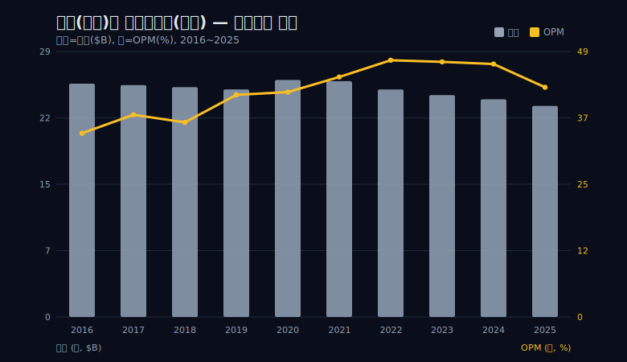
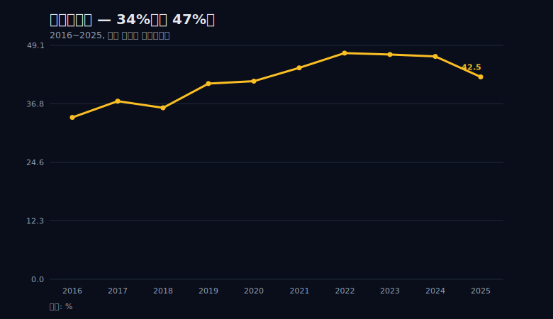
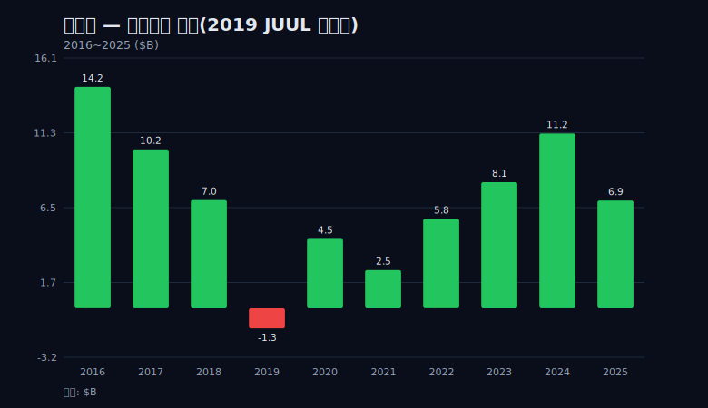
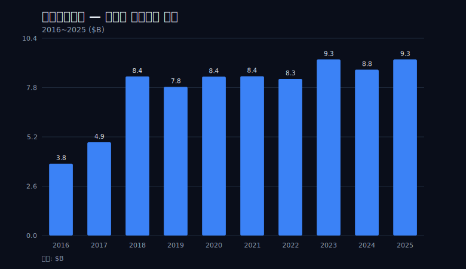

## 프롤로그 — 한 그래프 안에서 두 선이 반대로 벌어진다

알트리아의 10년치 손익을 한 장에 겹쳐 그리면, 보통은 같이 움직여야 할 두 선이 정반대로 갈라진다. 매출 막대는 2020년 26.15B을 꼭짓점으로 내려가는데, 영업이익률 선은 2016년 34.0%에서 2022년 47.5%까지 올라간다. 덜 파는데 더 남는다. 가위처럼 벌어지는 이 장면이 이 회사의 전부이자 함정이다.



대부분의 회사에서 매출과 마진은 같은 방향으로 움직인다. 많이 팔수록 고정비가 분산돼 마진이 좋아지고, 적게 팔수록 고정비 부담이 커져 마진이 나빠진다. 그런데 알트리아는 그 상식을 거꾸로 뒤집는다. 파는 양은 매년 줄어드는데 한 단위에서 남기는 이익은 매년 커진다. 이 가위 모양이 우연히 한 해 벌어진 것이라면 노이즈로 넘기면 그만이다. 하지만 이 벌어짐은 10년 내내 한 방향으로 누적됐다. 그래서 노이즈가 아니라 구조다.

이 한 장의 그래프가 알트리아라는 회사를 읽는 좌표축이다. 가로축에 시간을 놓고 매출과 마진을 겹쳐 그리는 순간, 보통 회사라면 두 선이 나란히 가야 할 자리에서 둘이 벌어진다. 이 벌어짐의 폭과 방향이 곧 이 회사의 정체다. 매출이 내려가는 기울기는 시장의 쇠퇴 속도이고, 마진이 올라가는 기울기는 그 쇠퇴 속에서 회사가 쥐고 있는 가격의 힘이다. 두 기울기를 따로 떼어 보면 비관도 낙관도 아닌, 사양산업 캐시카우의 정확한 초상이 나온다.

여기서 두 개의 질문이 동시에 걸린다. 첫째, 매년 담배가 덜 팔리는데 왜 마진은 거꾸로 올라가는가. 둘째, 그렇게 마진이 좋아지는 회사가 왜 2019년엔 순손실 -1.29B을 냈는가. 이 두 질문은 같은 그래프 안에서 모순처럼 보인다. 마진이 매년 좋아지는데 적자가 났다니.

이 모순은 사실 한 회사의 두 얼굴이다. 본업의 가격지배력, 그리고 그 본업이 번 돈을 미래에 베팅했다가 태운 자본배분. 한 줄로 줄이면 이렇다. 알트리아는 사양산업에서도 값을 매길 힘이 남아 캐시가 더 두툼해진 회사이고, 바로 그 캐시카우가 한 해 영업이익의 1.4배를 JUUL에 던졌다가 거의 전액을 재로 날린 회사다. 가격지배와 자본배분 실패는 따로 일어난 두 사건이 아니라, 같은 회사의 한 몸이다. 본업이 그렇게 강하지 않았다면 그런 큰 베팅을 할 엄두도 못 냈을 것이고, 본업이 그렇게 강했기에 그 화상마저 흡수하고 살아남았다.

데이터의 경계를 미리 밝힌다. 본 글이 쥔 것은 dartlab이 실측한 매출·영업이익·순이익·영업현금흐름·OPM·NPM 시계열뿐이다. 담배 물량(개비/갑) 감소율과 말보로 가격 인상폭의 분해 숫자는 이 데이터에 없다. 그래서 매출 하락은 물량 감소, 마진 상승은 가격 인상이라는 인과는 외부 맥락에 기댄 합리적 해석이지, 본 데이터로 증명된 분해가 아니다. 이 구분을 글 내내 지킨다. 본문에 나오는 모든 손익 수치는 분기 데이터를 역년(1~12월)으로 합산한 미국 연결(USD) 기준이고, 인수가·손상·물량 같은 손익 밖 항목만 외부 인용으로 표기한다.

## 막1 — 매년 덜 팔린다는 것은 미화할 수 없는 사실이다

먼저 쇠퇴부터 인정하고 시작한다. 알트리아 매출은 2016년 25.74B에서 2025년 23.28B로, 10년간 약 -9.6% 줄었다. 코로나 시기 일시 반등으로 2020년 26.15B을 찍은 정점을 기준으로 보면 2025년까지 -11.0%다. 한두 해의 부진이 아니라, 거의 매년 조금씩 내려앉는 구조적 하강선이다. 연도별로 따라가 보면 더 분명하다. 2016년 25.74B, 2017년 25.58B, 2018년 25.36B, 2019년 25.11B으로 4년 연속 야금야금 빠진다. 2020년 26.15B·2021년 26.01B에서 코로나 반등으로 잠깐 올라섰다가, 2022년 25.10B, 2023년 24.48B, 2024년 24.02B, 2025년 23.28B으로 다시 4년 연속 내려간다. 매출이 전년 대비 늘어난 해는 코로나 반등기 2020년 한 해뿐이고, 나머지는 전부 제자리거나 후퇴였다.

```python
import dartlab
c = dartlab.Company("MO")
c.select("IS", ["매출액"], freq="Q")  # 분기 → 역년 합산
# 합산 결과: 2016 25.74B … 2020 26.15B(정점) … 2025 23.28B
# 전년 대비 증가한 해: 2020 단 한 해 (코로나 반등)
```

이 하강의 원인은 데이터 밖에 있지만 분명하다. 알트리아의 2026년 1분기 10-Q에서도 미국 내 담배 출하량은 전년 동기 대비 2.4% 줄었고, 말보로 출하량은 7.8% 줄었다. 사람들이 담배를 끊고, 죽고, 시작하지 않는다. 이건 알트리아 경영이 잘하고 못하고의 문제가 아니라 시장 자체가 마르는 사양산업의 정의 그대로다. 회사가 아무리 유능해도 물량이 매년 빠지는 흐름 자체를 되돌릴 수는 없다. 신규 흡연자가 들어오지 않는 한 고객 풀은 산술적으로 줄어드는 방향으로만 간다.


그래서 알트리아는 성장주가 아니라 '관리된 쇠퇴(managed decline)'의 표본이다. 시장이 마르는 속도를 알면서, 그 안에서 최대한 오래 현금을 짜내는 일에 회사 전체가 맞춰져 있다. 성장을 포기하는 대신 수익성을 지키는 쪽으로 자원을 몰아넣는 구조다. 신규 공장이나 신시장 진출에 자본을 태우기보다, 이미 가진 브랜드의 값을 끌어올려 더 적은 매출에서 더 많은 이익을 짜내는 운영이다. 이 구조는 한국의 KT&G와 거울처럼 닮았다 — 둘 다 내수 담배 물량이 줄어드는 자리에서 현금을 지키는 쇠퇴산업 캐시카우다. 다만 분명히 해둔다. 이 글에 KT&G의 수치는 없다. KT&G 거울은 같은 구조라는 비유이지 두 회사의 숫자 비교가 아니다.

이 하강선이 일반 경기 둔화와 다른 점은 회복 시나리오가 구조적으로 막혀 있다는 데 있다. 보통 매출이 줄면 가격을 낮추거나 신제품을 내거나 신시장을 열어 물량을 되찾는 길이 있다. 그런데 담배는 그 길이 거의 다 막혀 있다. 가격을 낮춘다고 끊은 사람이 다시 피우지 않고, 광고가 금지돼 신규 수요를 만들 마케팅 채널도 없으며, 미국이라는 시장 자체가 인구학적으로 흡연자를 잃어 간다. 그래서 알트리아의 매출 하강은 경영이 더 분발하면 되돌릴 수 있는 종류가 아니라, 시장의 산술 자체가 정해 놓은 방향이다. 이 인식이 다음 막의 마진 상승을 제대로 읽는 전제가 된다 — 줄어드는 윗줄을 멈출 수 없다는 걸 인정해야, 그 줄어드는 윗줄에서 어떻게 더 많은 이익을 짜냈는지가 비로소 질문이 된다.

쇠퇴를 미화하지 않는 것이 이 글의 출발선이다. 사양산업이지만 알짜라는 식의 무비판적 옹호도, 담배는 사악하다는 도덕 설교도 분석을 대체하지 못한다. 매출선은 내려간다. 그게 사실이다. 사양산업을 분석할 때 흔한 함정이 두 가지다. 하나는 높은 마진과 배당만 보고 위험을 과소평가하는 것, 다른 하나는 산업이 사라질 것이라는 전제로 회사의 현금 창출력 자체를 과소평가하는 것이다. 이 글은 둘 다 피하려 한다. 진짜 질문은 그다음이다 — 그런데 왜 남는 돈은 거꾸로 늘어났는가.

## 막2 — 그런데 영업이익률은 오른다: 가격이라는 마지막 권력

같은 10년, 매출이 내려가는 동안 영업이익은 오히려 늘었다. 2016년 8.76B에서 2022년 정점 11.92B까지 +36%다. 매출은 줄었는데 영업이익이 36% 늘었으니, 영업이익률은 34.0%에서 47.5%로 +13.5%포인트 뛰었다. 2025년에 42.5%로 다소 내려오긴 했지만, 여전히 출발점보다 한참 높다. 10년 전이라면 매출의 3분의 1을 영업이익으로 남기던 회사가, 정점에서는 거의 절반을 남기는 회사로 바뀐 것이다.



OPM 선을 연도별로 따라가면 상승이 거의 한 방향이다. 2016년 34.0%, 2017년 37.4%, 2018년 36.0%, 2019년 41.1%, 2020년 41.6%, 2021년 44.4%, 2022년 47.5%로 6년에 걸쳐 13.5%포인트를 끌어올렸다. 그다음 2023년 47.2%, 2024년 46.8%로 정점 부근에서 횡보하다가 2025년 42.5%로 내려온다. 한두 해 반짝이 아니라 거의 매년 한 칸씩 위로 쌓아 올린 추세선이다. 매출이라는 윗줄이 빠지는데 마진이라는 비율이 이렇게 꾸준히 오른다는 건, 비용이 매출보다 빠르게 통제됐거나 단가가 매출 감소보다 빠르게 올랐다는 뜻이다.

가위가 벌어진 폭을 숫자로 환산해 보면 가격의 힘이 더 또렷하다. 매출은 2016년 25.74B에서 2022년 25.10B으로 6년간 거의 제자리(-2.5%)였는데, 같은 기간 영업이익은 8.76B에서 11.92B으로 +36% 늘었다. 매출이 한 발짝도 못 나간 사이 영업이익만 3분의 1 넘게 불었다는 건, 늘어난 이익이 새 매출에서 온 게 아니라 같은 매출 안에서의 마진 확대에서 왔다는 의미다. 매출이 거의 멈춰 있는데 영업이익이 그만큼 늘려면, 매출 한 단위가 가져가는 비용이 그만큼 줄거나 매출 한 단위의 마진이 그만큼 두꺼워져야 한다. 광고 금지로 마케팅비를 거의 쓰지 않는 산업에서 비용 절감 여지는 제한적이므로, 남는 설명은 단가 인상 쪽으로 무게가 실린다.

```python
# 영업이익률 = 영업이익 / 매출, 분기 합산 후 역년 비율
is_q = c.select("IS", ["매출액", "영업이익"], freq="Q")
# 역년 OPM(%): 2016 34.0 / 2019 41.1 / 2022 47.5(정점) / 2025 42.5
# 영업이익 $B: 2016 8.76 → 2022 11.92(정점) → 2025 9.90
```

이건 마법이 아니라 메커니즘이다. 마진이 오른 이유는 브랜드 파워가 마법 같아서가 아니라 네 가지가 한꺼번에 작동했기 때문이다. 첫째, 담배는 중독성 제품이라 수요가 가격에 비탄력적이다 — 값을 올려도 끊는 사람이 가격 인상폭만큼 늘지 않는다. 둘째, 미국은 담배 광고를 법으로 금지해 마케팅비를 거의 쓸 필요가 없다. 마케팅 경쟁이 막힌 시장에서는 비용이 자동으로 절약된다. 셋째, 시장이 과점이라 경쟁사가 가격 전쟁을 걸지 않는다. 모두가 값을 올리는 편이 이득이므로 가격 인상이 업계 공통의 관성으로 굳는다. 넷째, 그 결과 말보로의 가격 인상이 물량 감소를 상쇄하고도 남는다. 물량이 한 자릿수 빠져도 가격을 그보다 더 올리면 매출 방어와 마진 확대가 동시에 일어난다.


여기서 다시 데이터의 경계를 명시한다. 위 네 가지 메커니즘 중 가격 인상이 물량 감소를 초과했다는 부분은 본 데이터가 직접 증명하지 못한다. 본 데이터가 보여주는 건 매출은 내려가고 마진은 올라갔다는 결과뿐이고, 가격과 물량의 분해는 알트리아 10-Q의 출하량·세그먼트 표를 따로 봐야 한다. 그래도 이 메커니즘 해석이 합리적인 이유는, 광고 금지·과점·비탄력 수요라는 조건 자체가 가격 인상을 통한 마진 확대의 교과서적 무대이기 때문이다. 이건 [P&G](/blog/PG-procter-gamble)나 [콜게이트](/blog/CL-colgate), [코카콜라](/blog/KO-coca-cola) 같은 가격결정력 기업들이 공유하는 구조와 결이 같다 — 다만 알트리아는 시장이 줄어드는 와중에 그 힘을 쓴다는 점이 다르다. 다른 가격결정력 기업들은 늘어나는 시장에 가격을 더하지만, 알트리아는 줄어드는 시장을 가격으로 메운다.

가격은 사양산업에 남은 마지막 권력이다. 시장이 마르는 동안에도 값을 매길 힘이 남아 있으면, 회사는 매출이 줄어드는 와중에 캐시는 더 두툼하게 만들 수 있다. 막1의 하강선과 막2의 상승선이 한 그래프에서 갈라지는 정체가 바로 이것이다. 다만 이 힘에는 끝이 있다. 가격으로 물량을 메우는 게임은 물량이 빠지는 속도가 가격을 올릴 수 있는 속도를 추월하는 순간 멈춘다. 그 멈춤의 첫 기미가 에필로그에서 다룰 2025년이다. 그런데 이 두툼해진 캐시를 알트리아는 어디에 썼는가. 다음 막의 숫자가 한 회사의 두 번째 얼굴이다.

## 막3 — 캐시카우가 미래를 사기로 했다: 128억 달러의 베팅

2018년 12월, 알트리아는 전자담배 스타트업 JUUL의 지분 35%를 약 128억 달러($12.8B)에 인수했다. 이 숫자의 무게를 그냥 큰돈 정도로 넘기면 안 된다. 같은 해 알트리아의 한 해 영업이익은 9.12B이었다. 즉 JUUL 지분값은 한 해 영업이익의 약 1.4배 — 본업이 1년 동안 죽도록 짜낸 영업이익보다 큰 돈을, 지분 35%, 그것도 경영권도 아닌 소수지분에 던진 것이다.

```python
# 2018년 영업이익으로 인수가 규모를 재현 (인수가는 외부 인용)
op_2018 = 9.12   # 영업이익 $B (역년 합산, dartlab)
juul_price = 12.8  # JUUL 35% 지분 인수가 $B (SEC 공시, 손익 밖)
ratio = juul_price / op_2018
# ratio ≈ 1.40 → 한 해 영업이익의 약 1.4배
```

한 해 영업이익의 1.4배라는 비율을 다른 각도에서 보면 이 베팅의 무게가 더 실감 난다. 막5에서 다룰 알트리아의 연간 영업현금흐름은 8~9B 수준이다. 즉 JUUL 35% 지분값 12.8B은, 회사가 본업으로 1년 반 가까이 벌어들이는 현금 전부를 한 자산에 묶은 규모다. 그것도 경영권을 가져오는 100% 인수가 아니라 35% 소수지분이었다. 이사회 통제도, 제품 로드맵 결정권도 온전히 쥐지 못한 채 1년 반치 현금을 한 곳에 건 셈이다.

왜 캐시카우가 굳이 이런 베팅을 했나. 이걸 미래를 향한 과감한 도전으로 미화해도 안 되고, 경영진의 멍청함으로 조롱해도 안 된다. 둘 다 핵심 맥락을 빠뜨린다. 본질은 이 베팅이 성장 구매가 아니라 자기 쇠퇴에 대한 헤지였다는 점이다. 막1에서 봤듯 궐련 시장은 매년 마른다. 알트리아 입장에서 베이프(전자담배)는 자기 본업을 갉아먹는 위협이자, 동시에 그 위협을 자기 우산 안에 넣어버릴 기회였다. 사라질 미래를 돈으로 사서 막으려 한 것이다. 본업이 마르는 회사가 본업을 대체할 카테고리를 직접 키우는 대신 시장에서 이미 앞선 플레이어의 지분을 사 오는 선택은, 시간을 돈으로 사겠다는 전형적인 후발주자의 셈법이다. 직접 키우면 느리고, 사 오면 비싸다 — 마르는 시계 앞에서 알트리아는 비싼 쪽을 골랐다.

문제는 타이밍과 값이었다. 알트리아는 하필 베이프 열풍이 정점이던 2018년 말, 가장 비싼 시점에 가장 비싼 값을 치렀다. 그리고 인수 직후부터 청소년 베이핑 규제 강화, 폐질환 사태, 줄소송이 JUUL을 덮쳤다. 정점에서 산 자산의 가치가 인수 직후부터 무너지기 시작한 것이다. 헤지하려던 위험이 헤지 수단 자체에 그대로 옮겨붙은 셈이다. 본업을 위협하던 규제 환경이 결국 본업을 지키려고 산 자산까지 같이 덮친 것이라, 위험 분산이 아니라 위험 집중에 가까운 결과가 됐다.

여기에 자본배분의 뼈아픈 교훈이 있다. 베팅의 방향(베이프로의 전환 흐름)은 틀리지 않았다. 미국 흡연자가 궐련에서 전자담배로 옮겨 가는 큰 흐름 자체는 이후로도 이어졌다. 틀린 건 진입 가격과 진입 시점, 그리고 통제권 없는 소수지분이라는 구조였다. 좋은 사업에 나쁜 가격을 치르면 좋은 사업도 나쁜 투자가 된다. 알트리아는 마르는 본업에서 가격을 매기는 데는 발군이면서, 정작 자기가 자산을 살 때는 정점에서 비싼 값을 치렀다. 값을 받는 데 강한 회사가 값을 치르는 데서 무너진 셈이라, 막2의 가격지배력과 이 막의 자본배분 실패는 같은 동전의 양면처럼 맞물린다.

여기서 데이터 경계를 다시 못 박는다. 인수가 128억과 그 후의 손상 처리는 손익 시계열 밖의 외부 사건이다. 본 데이터 표에 직접 들어온 것은 그 사건의 결과뿐이다 — 다음 막에 나올 2019년 순손실. 손상 처리가 연도별로 얼마씩 배분됐는지, 거의 전액을 깎았다는 표현이 어느 회계연도에 얼마씩 찍혔는지는 본 데이터에 없고 외부 공시에 기댄다. 이 글은 인수의 동기(헤지·정점 매수)와 그 규모(거의 전액 상각)는 외부 맥락으로, 그 결과의 흔적(2019년 적자)은 본 데이터로 분리해 다룬다.

## 막4 — 화상: 2019년 순손실과, 순이익이 숨기는 것

JUUL 베팅의 화상이 처음 손익에 찍힌 해가 2019년이다. 그해 영업이익은 10.33B으로 멀쩡했다 — 오히려 전년 9.12B보다 늘었다. 그런데 순이익은 -1.29B, 순이익률(NPM) -5.1%. 10년 통틀어 유일한 적자다. 본업이 10.33B을 벌었는데 최종 줄에서 마이너스가 찍혔다는 건, 영업이익 아래에서 무언가 거대한 것이 뚫고 내려왔다는 뜻이다. 그 무언가가 JUUL 등 투자자산 평가손이다. 영업이익에서 순손실로 떨어지는 폭이 11.6B을 넘는다는 건, 본업과 무관한 곳에서 그만한 비용이 한꺼번에 손익을 관통했다는 의미다.



```python
# 영업이익은 흑자인데 순이익은 적자였던 2019년
c.select("IS", ["영업이익", "당기순이익"], freq="Q")
# 2019 역년: 영업이익 10.33B (흑자) / 순이익 -1.29B (적자)
# → 영업선 위는 멀쩡, 영업선 아래(평가손)가 적자를 만들었다
```

여기서 이 글의 가장 중요한 분석 장치를 건다. 순이익 차트를 사업이 미친 듯이 흔들린다는 인상으로 읽으면 그건 오독이다. 순이익선은 최저 -1.29B(2019)에서 최고 14.24B(2016)까지, 진폭 15.5B로 출렁인다. 하지만 이 출렁임은 본업의 수익력이 그만큼 흔들렸다는 뜻이 아니다. 막2에서 봤듯 영업선(영업이익)은 8.76B에서 11.92B 사이, 폭 3.2B 안에서 꾸준히 우상향했다. 같은 기간 순이익은 그 다섯 배에 가까운 15.5B 폭으로 널뛰었다. 두 선의 진폭 차이 자체가, 변동의 출처가 본업이 아니라 본업 밖이라는 증거다. 진폭을 만든 건 영업선 아래의 일회성 — 평가손과 영업외 이익 — 이다.


같은 함정의 반대 방향이 2024년이다. 2024년 순이익은 11.26B, NPM 46.9%로 영업이익(11.24B)과 거의 같았다. 숫자만 보면 사상 최고 수익성처럼 보인다. 하지만 이것 역시 영업이 그만큼 좋아져서가 아니라 영업외 이익이 더해진 일회성이다. 같은 해 매출은 24.02B으로 전년보다 오히려 줄었고 OPM도 46.8%로 정점에서 살짝 내려온 상태였는데, 순이익만 11.26B으로 튀어 올랐다. 본업 지표는 횡보·후퇴인데 최종 줄만 솟구쳤다는 건, 그 솟구침이 영업 밖에서 왔다는 신호다. 2024년 NPM 46.9%를 경영 실력의 정점으로 칭송하면, 2019년 -5.1%를 사업의 붕괴로 읽는 것과 똑같은 오독이다. 둘 다 영업선 아래 일회성이 만든 착시다. 하나는 아래로, 하나는 위로 부풀린 착시일 뿐 방향만 다르다.

한 가지 더 짚을 점은 NPM이라는 비율이 OPM과 전혀 다른 종류의 숫자라는 사실이다. 이 글은 OPM(영업이익률)과 NPM(순이익률)을 처음부터 별개 비율로 구분해 왔다. OPM은 본업이 매출에서 남기는 마진이라 영업의 체력을 비교적 곧게 비춘다. 반면 NPM은 영업선 아래의 평가손·영업외손익·세금까지 다 통과한 뒤의 비율이라, 본업과 무관한 사건에 휘둘린다. 2019년 NPM -5.1%와 2024년 NPM 46.8%의 51.9%포인트 간극은 본업이 그만큼 변했다는 뜻이 아니라, 영업선 아래에서 한 해는 큰 손실이, 다른 해는 큰 이익이 끼어들었다는 뜻이다. 같은 회사의 NPM이 한 자릿수 음수에서 40%대 후반까지 오르내리는 동안 OPM은 41%대에서 47%대 안에 머물렀다. 어느 비율이 본업을 보는 창인지는 이 대비가 답한다.

그래서 이 글은 순이익선을 실적 지표로 쓰지 않는다. 변동의 정체를 영업선 위(꾸준)와 아래(일회성)로 분리해 봐야 회사의 진짜 엔진이 보인다. 매출이 줄어도 마진을 지키는 회사를, 회계상 적자 한 줄로 망했다고 읽으면 그 회사의 본질을 놓친다. 거꾸로 일회성 이익이 부푼 해를 최고 실적으로 떠받들어도 마찬가지다. 순이익이라는 한 줄은 영업의 힘과 영업 밖의 노이즈를 한데 뭉뚱그려 보여줄 뿐이다. 그래서 같은 회사를 두고도 어느 해 숫자를 떼어 오느냐에 따라 정반대 결론이 나온다 — 2019년만 보면 적자 기업, 2024년만 보면 초우량 기업. 둘 다 절반의 진실이다.

그렇다면 영업선 아래가 그렇게 출렁이는 동안, 진짜로 살아남은 숫자는 어느 줄인가.

## 막5 — 진짜 살아남은 숫자: 영업현금흐름

순이익이 -1.29B까지 곤두박질친 2019년, 같은 해 영업현금흐름(OCF)은 7.84B이었다. 회계 손익이 평가손에 찢기는 동안에도 본업이 실제로 만든 현금은 거의 흔들리지 않았다. 손익계산서 맨 아랫줄은 적자였지만 회사 금고로는 그해에도 8B에 가까운 현금이 들어왔다는 뜻이고, 이 둘의 간극이 9B을 넘는다는 사실 자체가 이 회사를 어느 줄로 읽어야 하는지를 가리킨다. 그리고 이게 일회적 운이 아니다. 영업현금흐름은 2018년 8.39B부터 2025년 9.29B까지, 8년 내내 7.8~9.3B의 좁은 띠 안에서 움직였다. 순이익이 -1.29B에서 14.24B까지 15.5B 진폭으로 출렁이는 동안, 현금 엔진은 약 1.5B 폭 안에 머물렀다. 같은 회사의 두 숫자가 이렇게 다른 진폭으로 움직인다는 사실 자체가, 어느 쪽이 본업의 실제 체력을 더 왜곡 없이 보여주는지를 가른다.



```python
# 순이익은 출렁, 영업현금흐름은 평평 — 두 라인을 나란히
cf = c.select("CF", ["영업활동현금흐름"], freq="Q")
# OCF 역년: 2018 8.39 / 2019 7.84(적자해) / 2023 9.29 / 2025 9.29
# 같은 기간 순이익: 2019 -1.29 / 2024 11.24 → 진폭 비교 불가
```

평가손이 순이익은 찢으면서 현금흐름은 건드리지 못한 이유는 회계의 구조에 있다. 평가손과 손상차손은 자산의 장부가치를 깎는 비현금 비용이다. JUUL 지분의 장부가를 깎아내려도 그 깎인 금액만큼 실제로 회사 금고에서 현금이 빠져나가지는 않는다. 현금은 이미 2018년 인수 시점에 나갔고, 그 뒤의 손상은 장부 위에서만 일어나는 사후 인식이다. 그래서 손익계산서가 적자를 찍은 해에도 영업이 만든 현금은 그대로 들어왔다. 영업현금흐름이 평가손에 면역인 것은 운이 아니라 정의에 가깝다.

이 지점이 발생주의 손익과 현금주의의 갈림길이다. 손익계산서는 발생주의로 적힌다 — 현금이 오가지 않아도 가치가 변했다고 판단되면 그 변동을 그 시점의 비용이나 이익으로 잡는다. 평가손이 대표적이다. 반면 영업현금흐름은 실제로 들어오고 나간 현금만 센다. 두 숫자가 같은 회사를 두고 다른 그림을 그릴 때, 어느 쪽이 본업의 체력을 보는지는 무엇을 알고 싶으냐에 달렸다. 회계상 가치 변동까지 포함한 종합 성적표가 궁금하면 순이익을, 본업이 실제로 굴러가며 만들어 낸 현금이 궁금하면 영업현금흐름을 본다. 알트리아처럼 영업선 아래 일회성이 큰 회사에서는 이 두 숫자가 크게 어긋나고, 그 어긋남 자체가 회사를 읽는 단서가 된다.

10년 누적으로 보면 대조가 더 또렷하다. 누적 순이익은 약 69.1B, 누적 영업현금흐름은 약 77.3B. 현금이 순이익보다 8B 이상 더 두껍고, 무엇보다 훨씬 더 안정적이다. 보통의 회사는 장기 누적에서 순이익이 영업현금흐름과 비슷하게 수렴하거나 순이익이 더 크게 잡히는 경우가 많은데, 알트리아는 10년을 합산해도 현금이 순이익을 8B 넘게 앞선다. 이는 JUUL 평가손처럼 현금을 빼가지 않는 비현금 비용이 순이익만 깎아 내린 누적 효과다. 즉 손익계산서가 10년간 보여 준 69.1B은 회계상 보수적으로 잡힌 숫자이고, 그동안 회사가 실제로 손에 쥔 현금은 그보다 두툼한 77.3B이었다는 뜻이다. 회사를 소유자의 눈으로 볼 때 배당과 재투자의 실탄이 되는 건 후자다. JUUL 참사가 회계 손익을 찢는 동안에도 현금 엔진은 거의 영향을 받지 않았다는 것 — 이게 알트리아가 배당킹이라 불리며 수십 년간 배당을 늘려온 회복력의 정체다. 배당의 진짜 연료는 회계상 순이익이 아니라 영업현금흐름이다. 2019년처럼 순이익이 적자인 해에도 배당을 끊지 않을 수 있었던 건, 배당을 떠받치는 게 손익계산서의 맨 아랫줄이 아니라 현금흐름표의 영업현금이었기 때문이다.

다만 여기서도 분명하게 경계를 긋는다. 배당액·배당성향·부채·자사주 같은 자본배분의 나머지 축은 본 제공 데이터에 없다. 그래서 배당킹이라는 표현은 영업현금흐름의 안정성과 외부 맥락으로만 뒷받침하고, 배당액 자체를 본문에서 숫자로 단정하지 않는다. 고배당이니까 무조건 안전하다는 단정도 하지 않는다 — 배당의 지속가능성은 결국 막1의 물량 추세와 막2의 가격 방어력이 언제까지 버티느냐에 달렸기 때문이다. 현금흐름이 8~9B을 유지한다는 건 지금까지의 결과이지 미래의 보장이 아니다.

이 막은 막4의 회의론에 대한 답이다. 순이익선을 드라마로 끌어다 쓴 게 아니라, 그 변동의 정체(영업선 아래 일회성)를 분리해 보여준 다음, 곧바로 영업현금흐름이라는 진짜 살아남은 숫자로 대조시킨 것이다. 회계 손익의 출렁임과 현금 엔진의 안정성 — 누적 순이익 69.1B 대 영업현금흐름 77.3B가 그 대조의 못이다. [영업현금흐름과 순이익이 왜 갈라지는지 더 깊이](/blog/MDLZ-mondelez) 같은 형제 글에서도 반복되는, 캐시플로우로 회사를 읽는 핵심 장치다.

## 에필로그 — 톱니가 무뎌질 때

그런데 마지막 데이터가 한 가지 신호를 던진다. 2022년 47.5%로 정점을 찍었던 영업이익률이 2025년 42.5%로 내려왔다. 영업이익 절대액도 2022년 정점 11.92B에서 2025년 9.90B으로 줄었다. 정점 대비 -2.02B, 두 자릿수 감소다. 가격으로 물량 감소를 막던 엔진이, 처음으로 힘에 부치는 모습이다. 2023년 47.2%, 2024년 46.8%까지는 정점 부근에서 버텼는데 2025년에 한 단계 크게 내려앉았다는 점에서, 단순 횡보와는 결이 다르다.

이걸 추세 반전으로 단정하지는 않는다. 2025년 한 해의 하락은 1년치 신호일 뿐, 가격지배력이 꺾였다고 결론 내릴 만큼의 후속 데이터는 본 데이터에 없다. 그래서 신호로만 다룬다. 다만 이 신호가 의미심장한 이유는, 막2의 메커니즘이 영원할 수 없다는 걸 처음으로 숫자가 인정했기 때문이다. 가격 인상으로 물량 감소를 상쇄하는 게임은, 물량이 줄어드는 속도가 빨라지거나 소비자의 가격 저항이 커지는 순간 한계에 부딪힌다. 가격지배력은 강력하지만 무한하지 않다. 한 갑의 값을 끝없이 올릴 수는 없고, 어느 선을 넘으면 비탄력적이던 수요도 탄력적으로 바뀐다.

흥미로운 건 같은 2025년에도 영업현금흐름은 9.29B으로 여전히 띠의 상단에 머물렀다는 점이다. 마진(OPM)과 영업이익 절대액은 내려왔는데 현금 엔진은 아직 식지 않았다. 이걸 어떻게 읽을지가 이 회사의 다음 장을 가른다. 한 해 마진 하락이 일시적 비용 요인이라면 현금흐름의 견조함이 본업의 건강을 증언하는 것이고, 가격지배력 약화의 시작이라면 영업이익에 먼저 나타난 균열이 시차를 두고 현금흐름으로 번질 수도 있다. 본 데이터만으로는 둘을 가를 수 없다. 그래서 단정 대신 다음 분기들을 지켜볼 관찰점으로 남긴다 — 마진의 톱니가 무뎌지는 신호와 현금 엔진의 건재함이 같은 해에 공존한다는 사실 자체가, 지금이 이 회사를 가르는 분기점일 수 있음을 가리킨다.

여기서 처음의 모순으로 돌아온다. 알트리아는 사양산업에서도 값을 매길 힘이 남아 캐시는 더 두툼해진 회사이고, 동시에 그 캐시카우가 한 해 영업이익의 1.4배를 미래에 던졌다가 재로 날린 회사다. 가격지배와 자본배분 실패는 한 몸이다. 본업이 만든 두툼한 현금이 없었다면 JUUL 참사를 흡수하지 못했을 것이고, 본업이 그렇게 강력하지 않았다면 애초에 미래를 돈으로 사서 막겠다는 베팅도 하지 않았을 것이다. 강한 캐시카우가 자기 쇠퇴를 헤지하려다 정점에서 비싼 값을 치르는 것 — 이건 알트리아만의 이야기가 아니라 쇠퇴산업 캐시카우 자본배분의 두 얼굴이다.

같은 가격결정력 구조를 가진 회사들을 나란히 놓고 보면 이 두 얼굴이 더 또렷해진다. [P&G](/blog/PG-procter-gamble)·[콜게이트](/blog/CL-colgate)·[코카콜라](/blog/KO-coca-cola)·[펩시코](/blog/PEP-pepsico) 같은 소비재 가격결정력 기업들은 시장이 마르지 않는다는 점에서 알트리아보다 편한 자리에 있다. 결제망의 가격지배력을 가진 [비자](/blog/V-visa)·[마스터카드](/blog/MA-mastercard)는 또 다른 형태의 비탄력 수요를 가졌다. 그리고 알트리아의 가장 가까운 거울은 미국 밖에서 같은 게임을 하는 형제 [필립모리스](/blog/PM-philip-morris)와, 내수에서 같은 쇠퇴를 관리하는 KT&G다. 셋 다 마르는 담배 시장에서 가격으로 현금을 지킨다는 점은 같지만, 시장의 지리와 규제 환경이 달라 같은 게임을 다른 난이도로 푼다. 알트리아가 미국 내수라는 한 우물에 묶여 있다는 점은, 시장 다변화로 쇠퇴를 분산할 여지가 그만큼 좁다는 뜻이기도 하다. 이 구조적 제약까지 함께 봐야 가격지배력의 높이만으로 회사를 과대평가하는 함정을 피할 수 있다.

결론은 칭송도 조롱도 아니다. 알트리아는 사양산업에서 값을 매길 힘으로 캐시를 지키는 데 성공했고, 그 캐시로 미래를 사려다 크게 화상을 입었으며, 그 화상에도 현금 엔진은 흔들리지 않았지만 2025년 들어 가격지배의 톱니가 처음으로 무뎌지는 신호를 보냈다. 사양산업 캐시카우를 읽는 법은, 마진의 높이에 감탄하는 것도 적자 한 줄에 놀라는 것도 아니라, 영업선 위의 가격지배력과 영업선 아래의 자본배분을 따로 떼어 보는 것이다. 한 그래프 안에서 반대로 벌어진 두 선을, 끝까지 두 선으로 읽는 것 — 그게 이 회사를 왜곡 없이 보는 유일한 자세다.

---

## 공시 / Filings

- 최신 분기 공시: [Altria 2026 Q1 Form 10-Q, quarter ended 2026-03-31](https://www.sec.gov/Archives/edgar/data/764180/000076418026000058/mo-20260331.htm)
- 최신 연간 공시: [Altria FY2025 Form 10-K, year ended 2025-12-31](https://www.sec.gov/Archives/edgar/data/764180/000076418026000017/mo-20251231.htm)
- JUUL 투자 원문: [Altria Investments in Equity Securities note](https://www.sec.gov/Archives/edgar/data/764180/000076418021000037/R14.htm)

---

## 재무제표 — 최근 8개년 (dartlab 연결, $B)

단위는 USD 십억 달러다. dartlab의 분기 데이터를 역년으로 합산한 값이므로, 회사 10-K의 회계연도 표와 반올림·분기 경계가 다를 수 있다.

```python
import dartlab
c = dartlab.Company("MO")
c.select("IS", ["sales", "operating_profit", "net_income"], freq="Y")
```
| 항목 ($B) | 2018 | 2019 | 2020 | 2021 | 2022 | 2023 | 2024 | 2025 |
|---|---:|---:|---:|---:|---:|---:|---:|---:|
| 매출액 | 25.36 | 25.11 | 26.15 | 26.01 | 25.10 | 24.48 | 24.02 | 23.28 |
| 영업이익 | 9.12 | 10.33 | 10.87 | 11.56 | 11.92 | 11.55 | 11.24 | 9.90 |
| 당기순이익 | 6.96 | -1.29 | 4.47 | 2.48 | 5.76 | 8.13 | 11.26 | 6.95 |

```python
import dartlab
c = dartlab.Company("MO")
c.select("CF", ["operating_cashflow"], freq="Y")
```
| 항목 ($B) | 2018 | 2019 | 2020 | 2021 | 2022 | 2023 | 2024 | 2025 |
|---|---:|---:|---:|---:|---:|---:|---:|---:|
| 영업활동현금흐름 | 8.39 | 7.84 | 8.38 | 8.40 | 8.26 | 9.29 | 8.75 | 9.29 |

| 보조 비율 | 2018 | 2019 | 2020 | 2021 | 2022 | 2023 | 2024 | 2025 |
|---|---:|---:|---:|---:|---:|---:|---:|---:|
| 영업이익률(OPM) | 35.9% | 41.1% | 41.6% | 44.4% | 47.5% | 47.2% | 46.8% | 42.5% |
| 순이익률(NPM) | 27.5% | -5.1% | 17.1% | 9.5% | 23.0% | 33.2% | 46.9% | 29.8% |

---

## 검증표

본문 인용 수치를 dartlab 호출과 공식 공시로 검증한다. 📅 dartlab 실측 2026-06-20 · MO 미국 연결(USD)·분기 합산 기준.

| 본문 수치 | 출처 / 호출 | 판정 |
|---|---|---|
| 매출 2020 26.15B 정점 → 2025 23.28B | `c.select("IS", ["sales"], freq="Y")` | 실측 |
| 영업이익률 2022 47.5% 정점 → 2025 42.5% | 영업이익÷매출 | 실측 |
| 2019 영업이익 10.33B vs 순손실 -1.29B | `c.select("IS", ["operating_profit","net_income"], freq="Y")` | 실측 |
| 2019 영업활동현금흐름 7.84B, 2025 9.29B | `c.select("CF", ["operating_cashflow"], freq="Y")` | 실측 |
| JUUL 투자 12.8B, 35% economic interest | [SEC equity securities note](https://www.sec.gov/Archives/edgar/data/764180/000076418021000037/R14.htm) | 공식 공시 |
| 2026 Q1 순매출 5.428B, 영업이익 2.956B, 순이익 2.183B | [2026 Q1 10-Q](https://www.sec.gov/Archives/edgar/data/764180/000076418026000058/mo-20260331.htm) | 공식 공시 |
| 2026 Q1 Smokeable 순매출 4.758B, 미국 내 담배 출하량 13.867B개비(-2.4%), Marlboro 11.960B개비(-7.8%) | 2026 Q1 10-Q segment and shipment volume tables | 공식 공시 |

분해 한계: 가격 인상, 물량 감소, 할인 믹스, 규제 충격은 dartlab 연결 손익만으로 분리되지 않는다. 연결이 직접 증명하는 것은 매출 하락·영업이익률 상승·순이익 착시·영업현금흐름 안정이고, 그 원인은 10-Q/10-K의 출하량·세그먼트·투자 주석으로만 보강한다.
