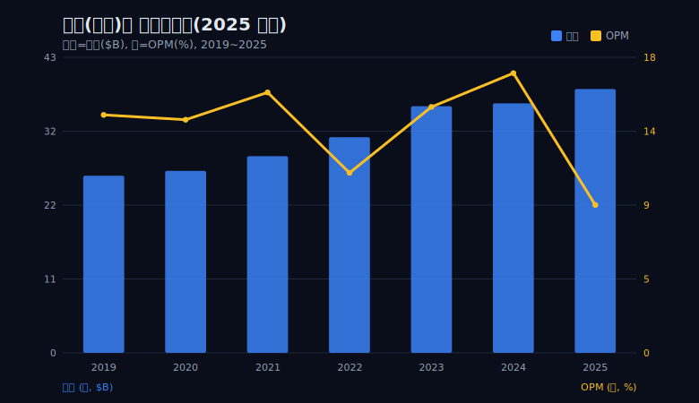
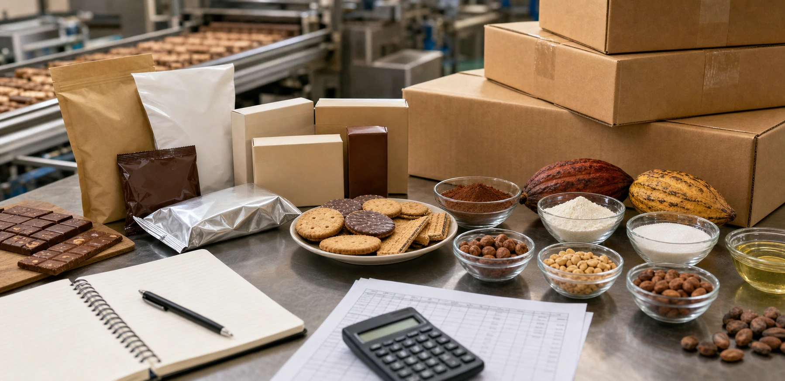
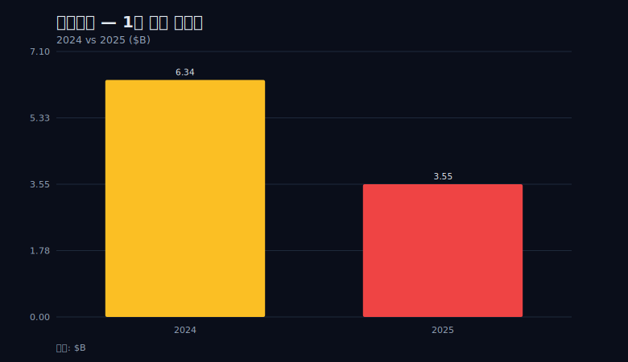
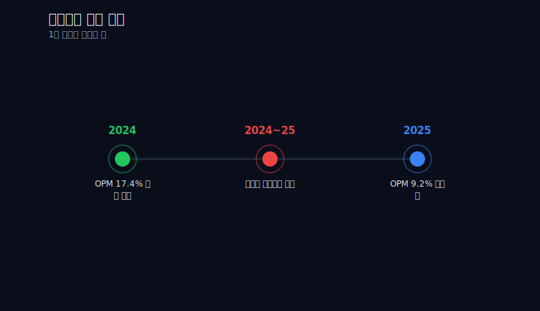
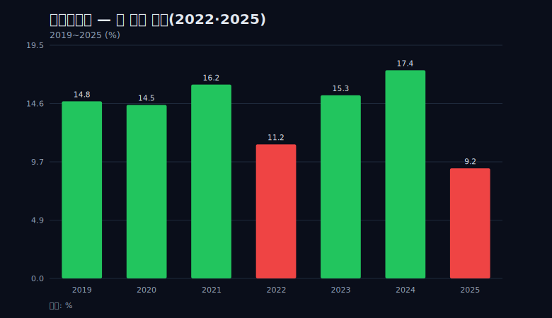
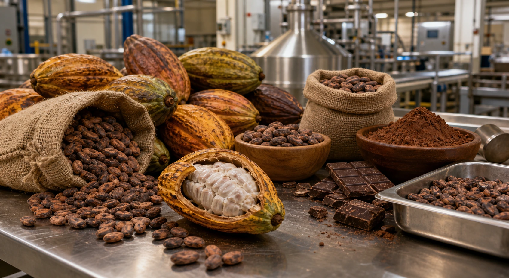
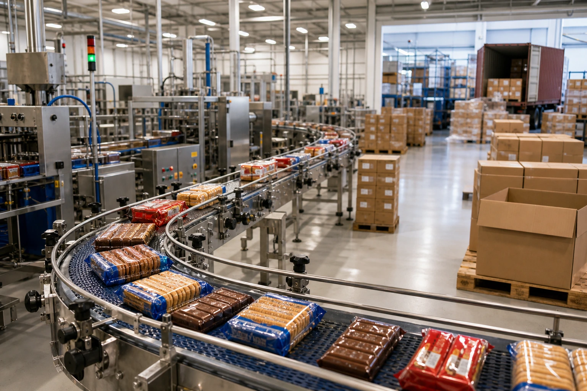

> **데이터 기준**: 2026-06-14 dartlab 실측 — Mondelez International(MDLZ) **미국 연결(USD)** 기준, 분기 데이터를 역년(calendar-year)으로 합산. 세그먼트·제품별·원가 항목은 연결 손익에 안 나오므로 SEC 10-K/10-Q와 회사 IR의 **공시 인용**으로 분리한다.
>
> **핵심 숫자**: 매출 **$38.54B**(2019→2025 연 **+6.9%**, 한 해도 안 꺾임) · 영업이익률 **17.4%(2024)→9.2%(2025)** · 영업이익 **$6.34B→$3.55B**(-44%) · 순이익 **$4.61B→$2.45B**(-47%) · 영업현금흐름 **$4.91B→$4.51B**(-8%)
>
> **이 글의 용어**: OPM(영업이익률)·NPM(순이익률) = 각각 영업이익·순이익÷매출(끝까지 별개 비율) · OI/OCF = 영업이익÷영업현금흐름(1보다 작으면 현금이 보고이익을 웃돈다는 뜻) · 전가(轉嫁) = 원가 상승분을 판매가에 얹는 것 · 비현금성 항목 = 감액·헤지회계처럼 현금이 실제로 나가지 않는 손익 비용.

---

## 프롤로그 — 매출 그래프만 보면 이 회사는 7년째 잘나간다

매출 한 줄만 떼어 놓고 보면 이 회사는 흠잡을 데가 없다. 2019년 $25.87B에서 2025년 $38.54B로, 7년 동안 매출은 단 한 해도 꺾이지 않고 연 **6.9%**씩 올랐다. 가격을 올렸고, 매출은 늘었고, 그래프는 왜곡 없이 우상향이다. 표면만 보면 모범 성장주로 글을 시작할 그림이다.

그런데 같은 그래프 위에 영업이익률 선을 한 줄 더 겹치면, 2025년에서 그 선이 절벽처럼 떨어진다. 매출 막대는 그 해에도 멀쩡히 올랐는데, 이익률 선만 혼자 바닥으로 꺼진다. 두 선이 7년을 나란히 가다가 마지막 한 칸에서 정확히 갈라진다.



이 글은 그 두 선이 갈라지는 한 칸을 추적한다. 출발점은 한 문장으로 요약된다 — 매출은 7년 내내 올랐지만 2025년 영업이익률은 반토막 났고, 그런데 영업현금흐름은 8%만 줄었다. 손익계산서가 외친 '재앙'을 현금흐름표가 '타박상'이라 정정한다. 그래서 이 글의 주인공은 몬델리즈가 아니라, *같은 해를 두 재무제표가 다르게 읽는 그 격차* 자체다.

왜 이 격차가 중요한가. 투자자가 회사를 잘못 읽는 가장 흔한 방식 두 가지가 바로 여기서 충돌하기 때문이다. 첫째는 매출선 한 줄만 보고 '계속 성장하니 안전하다'고 믿는 오독이고, 둘째는 순이익 한 줄만 보고 '반토막 났으니 망했다'고 단정하는 오독이다. 몬델리즈의 2025년은 이 두 오독을 동시에 유발하는 함정이다 — 매출만 보면 잘나가고, 순이익만 보면 무너졌다. 진실은 그 둘 사이 어딘가에 있고, 거기에 도달하려면 한 장의 재무제표가 아니라 세 장(손익·현금흐름·그 비율)을 겹쳐 봐야 한다. 그 겹쳐 보기의 절차를 한 회사 안에서 연습하는 것이 이 글의 실용적 목표다.



먼저 경계를 분명히 한다. 이 글에서 다룰 수치는 전부 dartlab 미국 연결(USD) 기준이고, 분기를 역년으로 합산한 값이다. 몬델리즈 자체 회계연도·세그먼트 공시와는 절단 기준이 다를 수 있다. 그리고 뒤에서 자주 등장할 '코코아'는 손익계산서 안의 라인이 아니라 바깥의 맥락이다 — 우리 데이터는 마진이 눌렸다는 사실을 보여주지, 그 범인이 누구인지를 증명하지 않는다. 이 경계를 흐리지 않는 것이 이 글의 규율이다.

이 시리즈를 따라온 독자라면 이 구도가 낯설지 않다. 외형은 멀쩡한데 어딘가에서 새는 회사를 두 재무제표로 교차 검증하는 방식은, [콜게이트](/blog/CL-colgate) 편에서 자기자본이 마이너스인데도 굴러가는 구조를 다룰 때, [알트리아](/blog/MO-altria) 편에서 매출은 줄어도 현금은 두꺼운 사양 산업을 읽을 때 이미 한 번씩 쓴 렌즈다. 몬델리즈의 2025년은 그 렌즈를 가장 극적으로 요구하는 사례라서, 시리즈의 한 매듭으로 골랐다.

---

## 막1 — 17.4%에서 9.2%로: 마진 반토막의 해부

먼저 한 칸의 크기를 정확히 재자. 영업이익률은 2024년 **17.4%**로 7년 중 정점을 찍었다. 그리고 단 한 해 만에 2025년 **9.2%**로 내려앉았다. 8.2%포인트가 한 해에 빠졌다. 이 폭은 비율만 흔들린 착시가 아니다 — 절대 금액이 같은 방향으로 함께 무너졌기 때문이다.

```python
import dartlab
c = dartlab.Company("MDLZ")
# 분기 손익을 역년으로 합산해 OPM·NPM 계산
is_q = c.select("IS", ["매출액", "영업이익", "당기순이익"], freq="Q")
# 2024: 매출 36.44, 영업이익 6.34 -> OPM 17.4%
# 2025: 매출 38.54, 영업이익 3.55 -> OPM  9.2%
```

영업이익은 $6.34B에서 $3.55B로 **-44%** 줄었다. 순이익은 $4.61B에서 $2.45B로 **-47%** 줄었다. 두 줄 모두 거의 반토막이다. 여기서 결정적인 사실 하나 — 매출은 같은 해에 $36.44B에서 $38.54B로 *오히려 늘었다.* 외형이 5.8% 커진 해에 영업이익이 44% 무너졌다.



이 비대칭이 막1의 핵심이다. 보통 이익이 반토막 나는 회사는 매출도 같이 빠진다 — 수요가 죽거나, 점유율을 잃거나, 사업을 접거나. 그런데 몬델리즈는 매출이 멀쩡히 늘어나는 와중에 이익만 혼자 무너졌다. 매출과 이익이 같은 방향을 보지 않았다는 사실은, 이 충격의 원인이 '얼마나 파느냐'가 아니라 '파는 것당 얼마가 남느냐'에 있었음을 가리킨다. 성장이 마진을 지켜주지 못한, 명백한 한 칸이다.

7년 영업이익률 경로를 통째로 펼치면 한 칸의 크기가 더 또렷해진다. 2019년 14.8%, 2020년 14.5%, 2021년 16.2%, 2022년 11.2%, 2023년 15.3%, 2024년 17.4%, 그리고 2025년 9.2%다. 평소 이 회사의 마진은 14~17% 사이의 좁은 띠 안에서 움직였다. 2022년에 11.2%로 한 번 띠 아래로 떨어졌다가 곧장 15.3%, 17.4%로 회복했다. 그런데 2025년 9.2%는 그 회복 밴드를 한참 벗어난, 7년 중 단연 최저점이다. 정점(17.4%)과 최저점(9.2%)의 거리가 8.2%포인트인데, 그 거리가 단 1년 안에 벌어졌다는 점이 이 사건의 폭력성이다. 완만한 하락이 아니라, 정점에서 바닥으로의 직하다.

한 가지 더 짚을 결이 있다. 2024년은 영업이익률 17.4%가 정점이었지만, 같은 해 순이익률은 12.7%였다. 4.7%포인트가 영업단과 순이익단 사이에서 사라졌다. 영업이익과 순이익이 늘 같은 폭으로 움직이지는 않는다는 신호다 — 영업 아래 단계(이자·세금·영업외 손익)에서 무언가가 작동했다는 뜻인데, 그 구성은 우리 7행 데이터로는 보이지 않는다. 흥미롭게도 2019년에는 NPM(15.0%)이 OPM(14.8%)을 *웃돌았고*, 2025년에는 OPM 9.2%에 NPM 6.4%로 다시 NPM이 더 낮다. OPM과 NPM의 상대 위치가 해마다 뒤바뀐다는 사실 자체가, 영업 아래에서 이자·세금·영업외 손익이 매년 다른 방향으로 작동했음을 시사한다. 두 비율이 별개라는 사실 자체가, 마진을 한 줄로 말할 수 없다는 첫 경고다. 그래서 이 글은 OPM과 NPM을 끝까지 한 단어로 뭉치지 않고 따로 추적한다.

그렇다면 매출이 늘었는데 이익이 빠진 그 한 칸에서, 무슨 일이 벌어졌나. 매출과 이익 사이의 거리 — 그건 곧 비용이다. 그래서 자연히 시선은 손익계산서 바깥으로 향한다.

---

## 막2 — 코코아라는 외부 용의자, 그리고 우리가 증명할 수 있는 것과 없는 것

마진이 한 해에 반토막 났다면, 가장 먼저 떠오르는 외부 용의자는 원자재다. 그리고 몬델리즈에게 그 원자재의 이름은 분명하다 — 코코아다. 캐드버리, 밀카, 토블론을 든 회사에게 코코아는 단순한 비용 항목이 아니라 제품 그 자체의 재료다.

외부 자료에 따르면, 2023년부터 2024년 사이 코코아 선물 가격은 톤당 약 $2,500에서 $10,000을 넘는 수준까지 급등했다. [국제코코아기구(ICCO)](https://www.icco.org)의 시장 보고와 여러 외신은 그 배경으로 서아프리카(코트디부아르·가나)의 흉작과 병해, 노후 농장을 지목한다. 가격이 한 해 사이 네 배 가까이 뛴 것이다. 다만 이 '네 배'는 우리 검증 데이터(손익 7행) 안의 숫자가 아니라 외부 출처에 전적으로 기댄 값임을 밝혀 둔다 — 초콜릿 비중이 큰 회사가 이 파도를 정면으로 맞았다는 것은 상식적인 정황이되, 우리가 직접 측정한 라인은 아니다.



그래서 우리가 자신 있게 말할 수 있는 것과 없는 것을 분리해야 한다. 이 코코아 급등은 **손익계산서 밖의 외부 맥락이지, 우리 dartlab 데이터에 찍힌 라인이 아니다.** 우리 검증 데이터에는 매출·영업이익·순이익·영업현금흐름과 그 비율만 있다. COGS(매출원가) 라인도, 원재료비 명세도, 코코아 단가도 없다.

그렇다면 우리 데이터만으로 어디까지 좁힐 수 있나. 마진을 누른 비용은 크게 두 갈래다 — 매출에 비례해 늘어나는 변동비(원재료·생산)와, 매출과 무관하게 깔리는 고정비(마케팅·관리·연구개발)다. 만약 마진 붕괴의 주범이 고정비였다면, 매출이 5.8% 늘어난 해에 마진이 개선됐어야 한다(고정비가 더 많은 매출에 나뉘므로). 그런데 매출이 늘었는데도 마진은 무너졌다. 이 방향성은 *매출에 비례해 함께 부푸는 비용*, 즉 변동비 쪽에 무게를 싣게 한다. 초콜릿 회사에게 가장 큰 변동비는 원재료이고, 그 원재료의 핵심이 코코아라는 것은 이 회사의 사업 구조상 자연스러운 연결이다. 다만 이 추론도 '변동비가 늘었다'까지가 데이터가 허락하는 선이고, '그 변동비가 코코아다'는 사업 상식에 기댄 한 걸음 더라는 점은 분리해 둔다.

우리 숫자가 증명하는 것: 2025년에 매출 1달러당 남는 영업이익이 17.4센트에서 9.2센트로 줄었다. 마진이 눌렸다. 이건 확정이다.

우리 숫자가 증명하지 *못하는* 것: 그 눌림의 범인이 코코아라는 것. 코코아 가격 차트를 가져와 우리 이익률 차트와 나란히 놓으면 둘이 같은 시점에 반대로 움직이는 것처럼 보이겠지만, 그것은 상관이지 인과가 아니다. 같은 시기에 환율도, 물류비도, 광고비도 움직였다. '코코아가 마진을 삼켰다'를 한 줄로 단정하는 순간, 이 글은 증명할 수 없는 것을 증명한 척하는 글이 된다. 그래서 코코아는 이 글에서 *유력한 외부 정황*이지 *입증된 범인*이 아니다.

이 경계를 지키는 데에는 실용적 이유도 있다. 만약 우리가 '코코아 단가 X% 상승이 OPM을 Y%포인트 깎았다'는 식의 분해를 하려면, 매출원가를 원재료·인건비·감가상각으로 쪼갠 명세와, 그 안에서 코코아가 차지하는 비중과, 헤지 계약의 체결 시점까지 알아야 한다. 그 자료는 10-K 주석과 IR 자료에만 있고, 연결 손익 7행에는 없다. 우리가 가진 도구로 그 분해를 흉내 내면, 정밀해 보이는 가짜 인과가 만들어질 뿐이다. 분석의 품질은 모르는 것을 모른다고 말하는 데서 갈린다 — 같은 원칙으로 다른 회사를 다룬 글로는 [코카콜라](/blog/KO-coca-cola) 편이 자산경량 구조의 마진 방어를, [펩시코](/blog/PEP-pepsico) 편이 외형 성장과 마진 압박의 공존을 같은 규율로 풀어낸다.

그렇다면 한 가지가 더 이상하다. 회사는 분명히 가격을 올렸다 — 매출이 그 증거다. 가격을 올렸는데 왜 마진을 지키지 못했나.

---

## 막3 — 가격을 올렸는데 왜 졌나: 전가의 속도 한계

매출이 $36.44B에서 $38.54B로 늘었다는 사실은, 회사가 가만히 있지 않았다는 뜻이다. 수요가 폭증한 게 아니라면, 늘어난 매출의 상당 부분은 가격 인상에서 왔다고 보는 것이 자연스럽다. 회사는 원가가 뛰는 만큼 진열대 가격에 얹으려 했다 — 이것이 '전가(轉嫁)'다.

```python
# 매출은 늘었는데 마진은 빠진 구조를 한 표로
import dartlab
c = dartlab.Company("MDLZ")
rev = c.select("IS", ["매출액"], freq="Q")   # 2024 36.44 -> 2025 38.54 (+5.8%)
oi  = c.select("IS", ["영업이익"], freq="Q")  # 2024  6.34 -> 2025  3.55 (-44%)
# 매출 +5.8%와 영업이익 -44%의 공존 = 전가가 원가 속도를 못 따라잡은 흔적
```



여기서도 선을 그어야 한다. 우리 데이터에는 COGS 라인도, 물량·믹스·환율 분해도 없다. 그래서 '매출 증가 = 순수 가격 인상'은 단정이 아니라 *맥락 기반 해석*이다. 매출 증가분 안에는 가격 외에도 신제품, 판매 지역 믹스, 환율 효과가 섞여 있을 수 있다. 우리가 말할 수 있는 것은 '매출이 늘었고, 그 와중에 마진이 빠졌다'는 두 사실의 공존까지다.

그래도 이 공존 자체가 하나의 메커니즘을 가리킨다. 전가는 분기마다 진열대에서 협상되고, 소매 체인의 저항에 부딪히고, 수요 탄력성에 묶인다. 가격을 올리면 일부 소비자는 더 싼 PB 상품으로 갈아탄다. 즉 가격 인상은 *느리고, 단계적이고, 마찰이 많은* 과정이다. 반면 원자재는 선물시장에서 단번에 뛴다. 원가는 시장에서 점프하고, 가격은 진열대에서 협상으로 기어간다. 이 속도의 비대칭이 전가 실패의 메커니즘이다 — 회사가 게으르거나 무능해서가 아니라, 올릴 수 있는 속도보다 원가가 빨랐다는 구조의 문제다.

숫자가 이 비대칭의 흔적을 어렴풋이 남긴다. 2025년 매출은 전년 대비 5.8% 늘었다. 만약 이 증가분이 대부분 가격 인상이라고 가정하면, 회사는 한 해에 진열대 가격을 한 자릿수 중반쯤 올린 셈이다. 그런데 같은 해 영업이익은 44% 빠졌다. 매출 1달러를 더 받아내는 동안, 그 1달러를 만드는 비용은 훨씬 더 빠르게 불었다는 뜻이다. 가격 인상이 0이었다면 매출은 줄었을 테니, 회사가 전가를 *시도하지 않은* 것은 아니다. 시도했지만 따라잡지 못했다 — 이것이 '한 자릿수 가격 인상 vs 두 자릿수(혹은 그 이상) 원가 상승'이라는 속도전의 패배다. 다만 다시 한번 못 박으면, 매출 증가분을 가격·물량·믹스·환율로 쪼갠 분해는 우리 데이터에 없다. '5.8% 매출 증가 = 5.8% 가격 인상'은 결코 아니며, 여기서는 *방향과 속도의 부등식*까지만 읽는다.

이 막의 결론은 그래서 겸손하다. '원가가 매출을 이겼다'는 매력적인 한 줄이지만, 우리 데이터로는 손익 라인으로 직접 보일 수 없다. 우리가 보는 것은 OPM 붕괴라는 결과와, 그 위에 겹쳐지는 코코아라는 외부 정황뿐이다. 거기서 추론한 그림이 '느린 전가 vs 빠른 원가'다 — 합리적 해석이되, 입증된 회계 분해는 아니다.

그래도 이 해석을 헛것으로 만들지 않으려면, 다음에 무엇을 확인하면 검증되는지를 명시하는 것이 분석의 책임이다. '느린 전가 vs 빠른 원가' 가설이 맞다면, 10-K의 매출원가율(COGS÷매출)이 2024년에서 2025년 사이 뚜렷이 뛰어 있어야 하고, 가격 인상 효과는 IR의 '유기적 매출 성장' 분해에서 가격 기여분으로, 물량 기여분과 분리되어 나타나야 한다. 두 자료가 그 방향을 가리키면 이 글의 해석은 사후에 확인되는 것이고, 어긋나면 우리는 외부 정황에 과도하게 기댄 것이 된다. 어느 쪽이든, *무엇을 보면 내가 틀렸는지*를 먼저 적어 두는 것이 추측과 분석을 가르는 선이다.

여기까지는 손익계산서 한 장 안에서의 이야기다. 그런데 이 글의 진짜 반전은, 재무제표를 한 장 더 넘겼을 때 시작된다.

---

## 막4 — 가장 불편한 숫자: 손익은 -44%인데 현금은 -8%

지금까지의 서사는 깔끔했다 — 코코아가 뛰었고, 전가가 못 따라갔고, 마진이 반토막 났다. 그런데 이 깔끔한 서사를 정면으로 흔드는 숫자가 하나 있다. 현금이다.

영업현금흐름은 2024년 $4.91B에서 2025년 $4.51B로 줄었다. 단 **-8%**다. 같은 해 영업이익이 -44%, 순이익이 -47% 무너진 것과 나란히 놓으면, 이건 거의 다른 회사의 숫자처럼 보인다. 손익계산서는 반토막을 외쳤는데, 현금흐름표는 가벼운 둔화만 기록했다.

```python
# 손익 붕괴와 현금 안정의 격차를 OI/OCF 비율로
import dartlab
c = dartlab.Company("MDLZ")
oi  = c.select("IS", ["영업이익"], freq="Q")          # 2025 3.55
ocf = c.select("CF", ["영업활동현금흐름"], freq="Q")   # 2025 4.51
# OI/OCF = 3.55 / 4.51 = 0.79  -> 영업현금흐름이 영업이익을 넘어섰다
```

더 날카로운 지점이 있다. 2025년 영업현금흐름 $4.51B는 영업이익 $3.55B를 *넘어섰다.* 영업이익을 현금흐름으로 나눈 OI/OCF 비율이 **0.79**로 떨어졌다 — 1보다 작다는 것은 회사가 장부에 적은 영업이익보다 실제로 더 많은 현금을 벌어들였다는 뜻이다. 7년 시계열에서 이 비율이 1 밑으로 내려간 해는 2019년(0.97)·2020년(0.97)·2022년(0.90)에 이어 2025년인데, 2025년의 0.79가 그중에서도 가장 낮다. 반대로 2021년(1.12)·2023년(1.17)·2024년(1.29)은 영업이익이 현금을 웃돈 해였다 — 2024년 정점에서 2025년 바닥까지, 이익과 현금의 관계가 1년 만에 정반대로 뒤집힌 것이다.

한 해씩 짚으면 패턴이 더 분명하다. 영업현금흐름은 7년 내내 $3.91B에서 $4.91B 사이의 좁은 구간에 머물렀다. 2019년 $3.96B, 2020년 $3.96B, 2021년 $4.14B, 2022년 $3.91B, 2023년 $4.71B, 2024년 $4.91B, 2025년 $4.51B. 같은 기간 영업이익이 $3.53B에서 $6.34B까지 거의 두 배 폭으로 출렁인 것과 대조하면, 현금은 놀랄 만큼 평평하다. 이익은 정점과 바닥을 오가는데 현금은 한 띠 안에서 호흡한다. 바로 이 *변동성의 비대칭*이 막4의 핵심이다 — 보고이익은 외부 충격과 회계 처리에 민감하게 출렁이지만, 실제로 회사 통장에 꽂히는 현금은 그보다 훨씬 둔하게 움직인다. 2025년은 그 비대칭이 가장 극적으로 드러난 해일 뿐이다.

이게 왜 결정적인 반론인가. 만약 코코아가 정말로 마진을 1대1로 현금까지 먹어치웠다면, 현금흐름도 이익과 함께 무너졌어야 한다. 비싼 코코아를 사느라 실제 현금이 그만큼 빠져나갔다면, OCF가 -8%로 버틸 수 없다. 그런데 현금은 버텼다. 이 격차는 2025년 보고이익 붕괴의 *상당 부분이 비현금성·시점성 항목으로 증폭됐을 가능성*을 가리킨다 — 감액(자산가치 손상 차감), 헤지회계 처리, 운전자본의 일시적 변동 같은, 장부 이익은 깎지만 그 해에 현금이 실제로 나가지는 않는 항목들이다.



여기서도 한계를 분명히 한다. 우리 데이터에는 감액·헤지·운전자본의 명세가 없다. 그래서 'OI -44% vs OCF -8%'라는 격차가 비현금성 항목을 *강하게 시사한다*고는 말할 수 있어도, 그 격차의 구체적 *구성*이 무엇인지는 미상이다. 감액이 얼마, 헤지가 얼마, 운전자본이 얼마인지는 10-K를 펼쳐야 나온다.

그래서 이 막은 출발점의 문장을 완성한다 — 손익계산서의 '재앙'을, 현금흐름표가 '타박상'으로 정정한다. 순이익 -47%만 보고 '회사가 반토막 났다'고 번역하면, 4.5B 달러를 여전히 벌어들이는 현금 체력을 통째로 무시하는 과장이 된다. 보고이익 한 줄은 충격의 *크기*를 알려주지만, 현금 한 줄은 그 충격의 *성격*을 알려준다. 둘을 같이 봐야 그림이 완성된다.

여기서 한 가지를 더 분명히 해 둘 필요가 있다. 'OCF가 이익을 넘었으니 괜찮은 해'라는 식의 안도는 금물이다. OI/OCF가 1 밑으로 내려가는 데에는 두 가지 정반대 사정이 섞일 수 있다 — 하나는 이 글이 추정한 비현금성 비용(감액·헤지처럼 현금 안 나가는 손실)으로 *이익만* 깎인 좋은 쪽이고, 다른 하나는 운전자본을 쥐어짜거나 미룰 지출을 미뤄 *현금만* 일시적으로 부풀린 나쁜 쪽이다. 우리 7행 데이터는 이 둘을 가르지 못한다. 그래서 'OI/OCF 0.79'는 '현금이 이익보다 견뎠다'는 신호이되, 그 견딤이 건강한 것인지 일시적인 것인지는 다시 10-K의 운전자본 항목으로 검증해야 할 *다음 질문*이지 결론이 아니다. 신호를 결론으로 착각하지 않는 것까지가 이 막의 규율이다.

이 이중 검증의 렌즈를 들고, 한 발 더 뒤로 물러나 보자. 몬델리즈가 마진의 골에 빠진 것은 2025년이 처음이 아니었다.

---

## 막5 — 2022 vs 2025: 같은 골, 다른 지문

영업이익률 막대를 7년 전체로 펼쳐 놓으면, 골이 두 개 보인다. 2025년의 9.2%가 가장 깊지만, 그 전에 2022년에도 한 번 11.2%로 꺼진 적이 있다. 표면적으로 둘 다 '마진이 외부 충격에 눌린 해'다. 그런데 두 골이 이익과 현금에 남긴 지문은 서로 다르다 — 그리고 그 지문을 읽는 도구가 바로 막4에서 꺼낸 OI/OCF다.

2022년의 골은 매크로였다. 러시아·우크라이나 전쟁, 글로벌 물류 대란, 강달러 환율이 동시에 덮친 해다. 그 해 영업이익률은 11.2%, 순이익률은 8.6%로 빠졌다. 영업이익 $3.53B에 영업현금흐름은 $3.91B로, OI/OCF는 **0.90**이었다.

2025년의 골은 단일 원자재였다 — 적어도 정황상으로는. 영업이익률 9.2%, 순이익률 6.4%로 2022년보다 더 깊게 빠졌고, OI/OCF는 **0.79**로 2022년보다 더 낮았다.


두 골의 OI/OCF 차이(0.90 vs 0.79)가 말해주는 것은 이렇다. 2025년은 2022년보다 *보고이익과 현금의 괴리가 더 컸다.* 즉 2025년 이익 붕괴에는 비현금성·시점성 증폭의 비중이 2022년보다 더 클 가능성이 있다. 같은 '마진 골'이라도, 매크로가 전방위로 비용을 밀어 올린 2022년과, 한 원자재가 장부를 강타한 2025년은 이익과 현금에 다른 흔적을 남긴다. 막4의 도구를 두 해에 똑같이 들이대면, '둘 다 그냥 나쁜 해'라는 뭉뚱그림이 '성격이 다른 두 골'로 분해된다.

회복의 모양도 두 골이 다를 수 있음을 시사한다. 2022년의 골 다음에는 2023년 15.3%, 2024년 17.4%로 V자 회복이 따라왔다. 매크로 충격(전쟁·물류·환율)은 시간이 지나며 풀렸고, 마진은 띠 안으로 돌아왔다. 그렇다면 2025년의 골 다음은 어떤 모양일까. 우리 데이터는 2025년까지만 있으므로 그 답을 가지고 있지 않다 — 이것은 있는 그대로 인정해야 할 한계다. 다만 두 골의 *성격* 차이가 회복의 *난이도* 차이로 이어질 수 있다는 점은 짚어둘 만하다. 매크로 충격은 여러 요인이 섞여 있어 일부만 풀려도 마진이 숨통을 트지만, 단일 원자재 충격은 그 원자재 가격이 내려오기 전까지 구조적으로 눌린다. 어느 쪽이 더 빨리 회복할지는 손익 7행 밖의 질문이고, 이 글은 그 예측을 하지 않는다.

물론 이 비교에도 한계가 있다. 단일 회사의 7개 연도 시계열이고, OI/OCF 비율의 절대 수준이 '좋다/나쁘다'를 판정하려면 동종 기업과 장기 평균 대비 검증이 더 필요하다. 0.79가 0.90보다 낮다는 *상대 비교*까지가 우리가 확정할 수 있는 선이다. 7개 점으로 그린 추세선은 한 점만 더해도 기울기가 달라질 만큼 표본이 얇고, 절대 수준의 정상 범위를 말하려면 같은 산업 여러 회사의 OI/OCF 분포가 필요하다. 우리는 그 분포를 가지고 있지 않으므로, 절대 판정 대신 *한 회사 안에서의 시점 간 비교*라는 더 안전한 주장에 머문다. 같은 자를 동종 기업으로 확장하는 일은 가능하되, 그 순간 데이터가 7행에서 수십 행으로 불어나고 각 회사의 회계연도·연결 범위 차이를 다시 맞춰야 하는, 별도의 작업이 된다. 같은 소비재 섹터에서 이 원가 사이클을 다르게 통과한 회사들 — 예컨대 자산경량 구조로 더 높은 마진 밴드를 지킨 [코카콜라](/blog/KO-coca-cola), 외형은 불었으나 마진이 눌린 [펩시코](/blog/PEP-pepsico) — 와 나란히 놓으면 몬델리즈의 코코아 노출이 왜 유독 깊은 골을 만들었는지가 더 또렷해지지만, 그 정밀 분해는 각 회사의 손익을 따로 펼쳐야 하는 이 글의 데이터 밖 작업이다.

---

## 에필로그 — 매출 성장은 알리바이가 아니다

이 글을 닫는 가장 쉬운 길은 '원가가 매출을 이겼다'이다. 듣기 좋고, 그럴듯하고, 틀리지도 않아 보인다. 하지만 우리 데이터는 그 한 줄조차 손익 라인으로 증명하지 못했다 — COGS도, 코코아 단가도, 분해도 없었다. 그래서 이 글은 그 손쉬운 결론을 거부하고 한 단계 더 들어간다.

첫 번째 교훈: 위로 가는 매출선은 마진의 알리바이가 못 된다. 몬델리즈의 매출은 7년 내내 올랐고 2025년에도 올랐다. 매출만 보는 투자자에게 이 회사는 영원히 잘나가는 성장주다. 하지만 매출이 늘어난 바로 그 해에 영업이익이 44% 빠졌다. 외형 성장은 '얼마나 팔았나'까지만 증명하고, '팔아서 얼마가 남았나'는 OPM을 따로 봐야 안다. 매출 그래프는 좋은 소식을 과장하는 경향이 있다.

두 번째 교훈: 이익의 반토막조차 현금 앞에서 다시 검증해야 한다. 순이익 -47%는 충격적인 숫자지만, 같은 해 영업현금흐름은 -8%였고 OCF가 영업이익을 넘어섰다. 보고이익 한 줄만 보고 '회사가 반토막 났다'고 결론 내리면, 4.5B 달러의 현금 체력과 비현금성 증폭의 가능성을 통째로 놓친다. 손익이 외친 재앙을 현금이 타박상으로 정정하는 이 장면은, 보고이익이 종종 회사의 *진짜 체력*보다 충격을 크게 그린다는 사실을 보여준다.

세 번째 교훈: 같은 회사의 두 골을 비교하면 충격의 결이 분해된다. 2022년(OI/OCF 0.90)과 2025년(0.79)은 둘 다 마진의 골이었지만, 후자가 이익과 현금의 괴리가 더 컸다. '나쁜 해'를 한 덩어리로 보지 않고 OI/OCF라는 같은 자로 재면, 매크로 충격과 단일 원자재 충격이 장부에 남긴 다른 지문이 보인다. 이 자는 몬델리즈에만 쓰는 도구가 아니다 — 같은 비율을 어느 회사에든 들이대면, 그 회사의 보고이익이 현금과 얼마나 붙어 있는지 한 줄로 진단할 수 있다. 다른 산업의 사례가 궁금하면 [코카콜라](/blog/KO-coca-cola)·[펩시코](/blog/PEP-pepsico)의 음료 듀오를 같은 자로 나란히 재 보는 것이 이 시리즈가 권하는 다음 연습이다.



```python
# 독자가 직접 검증하는 이중 렌즈 — 한 회사를 두 표로 읽기
import dartlab
c = dartlab.Company("MDLZ")
income = c.select("IS", ["매출액", "영업이익", "당기순이익"], freq="Q")  # 역년 합산
cash   = c.select("CF", ["영업활동현금흐름"], freq="Q")
# 규율 (1) 매출이 아니라 OPM을 본다: 6.34/36.44=17.4% -> 3.55/38.54=9.2%
# 규율 (2) 이익 붕괴를 OCF로 대조한다: OI -44% vs OCF -8%, OI/OCF=0.79
```

몬델리즈의 2025년은 그 두 검증을 *동시에* 요구하는 교과서적인 한 칸이다. 매출선만 보면 안 되고, 보고이익만 봐도 안 된다. 마진 충격을 만났을 때 (1) 매출이 아니라 OPM을 보고, (2) 이익 붕괴를 OCF로 한 번 더 대조하는 — 이 두 가지 규율을 한 해의 한 회사 안에서 같이 연습할 수 있는 사례다. 위 코드 한 조각이면 누구나 같은 두 표를 자기 손으로 뽑아 OPM과 OI/OCF를 직접 계산할 수 있다. 결론을 믿으라고 요구하는 글이 아니라, 같은 계산을 다시 해 보라고 권하는 글이다. 같은 렌즈를 다른 소비재에 들이댄 글이 궁금하면 [펩시코](/blog/PEP-pepsico)와 [코카콜라](/blog/KO-coca-cola) 편을 나란히 읽어 보면, 같은 원가 사이클이 회사마다 어떻게 다른 지문을 남기는지 보인다.

마지막으로, 이 글이 하지 않는 것을 분명히 한다. 목표주가도, 매수·매도 의견도 없다. 코코아가 범인이라는 단정도 없다. 우리가 확정한 것은 둘뿐이다 — 매출이 늘어난 해에 마진이 반토막 났다는 것(손익의 증명), 그리고 그 붕괴가 현금까지는 1대1로 따라가지 않았다는 것(현금의 정정). 그 사이의 모든 해석 — 코코아, 전가 실패, 비현금성 증폭 — 은 정황이지 증거가 아니다. 진짜 결론은 회사가 아니라 방법에 있다. 손익계산서 한 장을 믿기 전에, 현금흐름표 한 장을 더 넘겨라. 그리고 그 두 장이 같은 이야기를 하지 않을 때, 비로소 분석이 시작된다.

---

## 공시 / Filings

- 최신 분기 공시: [Mondelēz International 2026 Q1 Form 10-Q, quarter ended 2026-03-31](https://www.sec.gov/Archives/edgar/data/1103982/000162828026027937/mdlz-20260331.htm)
- 최신 연간 공시: [Mondelēz International FY2025 Form 10-K, year ended 2025-12-31](https://www.sec.gov/Archives/edgar/data/1103982/000162828026005345/mdlz-20251231.htm)
- 회사 공시 허브: [Mondelēz SEC filings](https://ir.mondelezinternational.com/financials/sec-filings)

---

## 재무제표 — 최근 7개년 (dartlab 연결, $B)

단위는 USD 십억 달러다. dartlab의 분기 데이터를 역년으로 합산한 값이므로, 회사 10-K의 회계연도 표와 반올림·분기 경계가 다를 수 있다.

```python
import dartlab
c = dartlab.Company("MDLZ")
c.select("IS", ["sales", "operating_profit", "net_income"], freq="Y")
```
| 항목 ($B) | 2019 | 2020 | 2021 | 2022 | 2023 | 2024 | 2025 |
|---|---:|---:|---:|---:|---:|---:|---:|
| 매출액 | 25.87 | 26.58 | 28.72 | 31.50 | 36.02 | 36.44 | 38.54 |
| 영업이익 | 3.84 | 3.85 | 4.65 | 3.53 | 5.50 | 6.34 | 3.55 |
| 당기순이익 | 3.88 | 3.56 | 4.30 | 2.72 | 4.96 | 4.61 | 2.45 |

```python
import dartlab
c = dartlab.Company("MDLZ")
c.select("CF", ["operating_cashflow"], freq="Y")
```
| 항목 ($B) | 2019 | 2020 | 2021 | 2022 | 2023 | 2024 | 2025 |
|---|---:|---:|---:|---:|---:|---:|---:|
| 영업활동현금흐름 | 3.96 | 3.96 | 4.14 | 3.91 | 4.71 | 4.91 | 4.51 |

| 보조 비율 | 2019 | 2020 | 2021 | 2022 | 2023 | 2024 | 2025 |
|---|---:|---:|---:|---:|---:|---:|---:|
| 영업이익률(OPM) | 14.9% | 14.5% | 16.2% | 11.2% | 15.3% | 17.4% | 9.2% |
| 순이익률(NPM) | 15.0% | 13.4% | 15.0% | 8.6% | 13.8% | 12.7% | 6.4% |
| OI/OCF | 0.97 | 0.97 | 1.12 | 0.90 | 1.17 | 1.29 | 0.79 |

---

## 검증표

본문 인용 수치를 dartlab 호출과 공식 공시로 검증한다. 📅 dartlab 실측 2026-06-20 · MDLZ 미국 연결(USD)·분기 합산 기준.

| 본문 수치 | 출처 / 호출 | 판정 |
|---|---|---|
| 매출 2019 25.87B → 2025 38.54B, 연 +6.9% | `c.select("IS", ["sales"], freq="Y")` | 실측 |
| 영업이익률 2024 17.4% → 2025 9.2% | 영업이익÷매출 | 실측 |
| 영업이익 2024 6.34B → 2025 3.55B(-44%) | `c.select("IS", ["operating_profit"], freq="Y")` | 실측 |
| 순이익 2024 4.61B → 2025 2.45B(-47%) | `c.select("IS", ["net_income"], freq="Y")` | 실측 |
| 영업활동현금흐름 2024 4.91B → 2025 4.51B(-8%) | `c.select("CF", ["operating_cashflow"], freq="Y")` | 실측 |
| 2025 OI/OCF 0.79 | 영업이익÷영업활동현금흐름 | 실측 |
| 2026 Q1 순매출 10.080B, 영업이익 808M, 귀속순이익 560M | [2026 Q1 10-Q](https://www.sec.gov/Archives/edgar/data/1103982/000162828026027937/mdlz-20260331.htm) | 공식 공시 |
| 2026 Q1 Chocolate 순매출 3.603B, Biscuits & Baked Snacks 4.543B | 2026 Q1 10-Q product revenue table | 공식 공시 |
| 2026 Q1 조정 영업이익 동인: net pricing +325M, input costs -439M, volume/mix -54M | 2026 Q1 10-Q adjusted operating income drivers | 공식 공시 |

분해 한계: dartlab 연결은 마진 붕괴와 현금 방어를 증명하지만 코코아, 헤지, 가격전가, 지역·제품 믹스의 원인 분해는 직접 증명하지 않는다. 그래서 원가·가격전가 문장은 10-Q의 input costs/net pricing 표로만 보강하고, 본문 결론은 손익·현금흐름의 교차 검증에 둔다.
