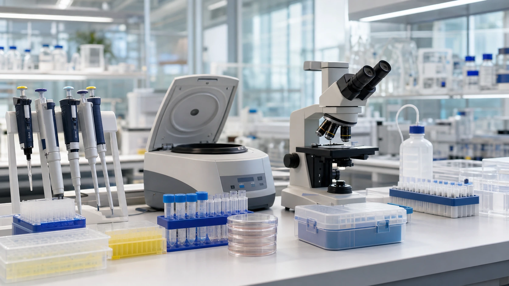
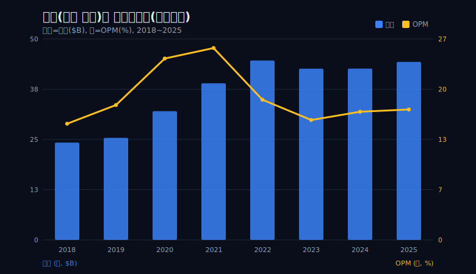
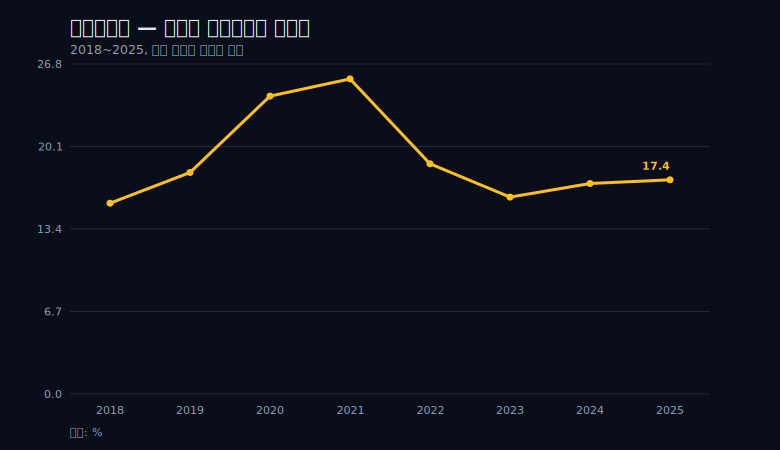
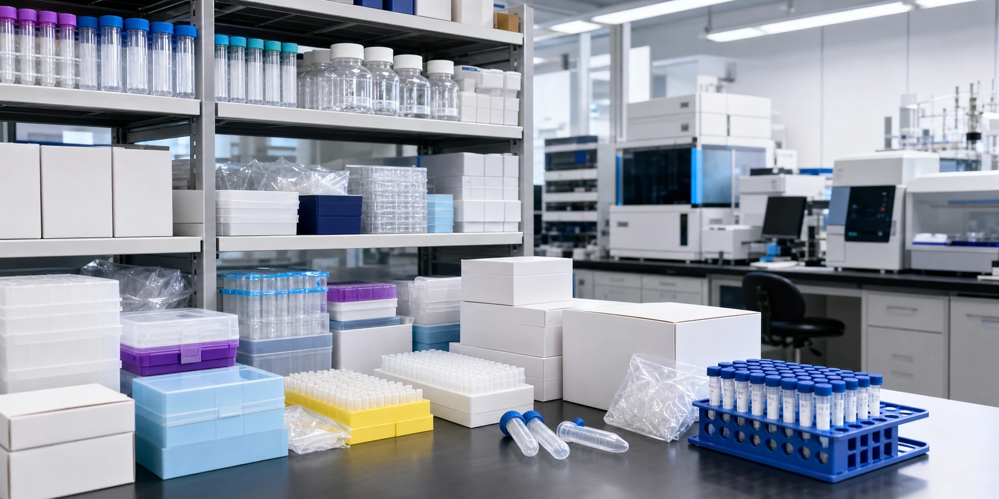
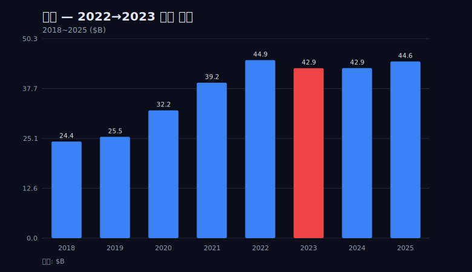
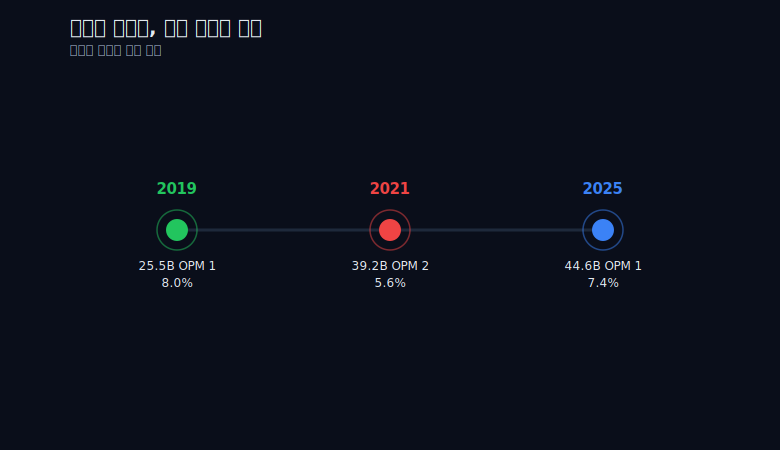
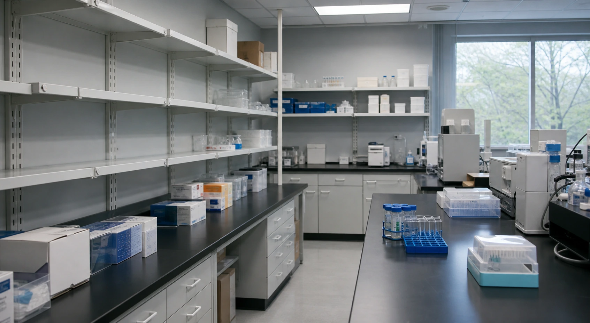

> **데이터 기준**: 2026-06-14 dartlab 실측 — Thermo Fisher Scientific(TMO) **미국 연결(USD)** 기준, 분기 데이터를 역년(calendar year)으로 합산. 세그먼트·제품별·인수 기여 분해 등 손익 밖 항목은 **10-K/IR/언론(외부 인용)**으로 표기.
>
> **핵심 숫자**: 매출 **$24.36B(2018) → $44.56B(2025)**, 8년간 **+83%** · OPM **15.5%(2018) → 25.6%(2021 정점) → 17.4%(2025)** · NPM **12.1% → 19.8%(2020) → 15.0%(2025)** · 코로나 매출 점프 **$25.54B(2019) → $39.21B(2021), +$13.67B** · 영업현금흐름 2025 **$7.82B**(2020년 이후 최저)
>
> **이 글의 용어**: OPM(영업이익률)·NPM(순이익률) = 별개 비율 · 증분 영업이익률 = 늘어난 매출 중 영업이익으로 떨어진 비율(ΔOI÷ΔREV) · 영업 레버리지 = 매출이 늘 때 고정비가 덜 늘어 마진이 비대칭적으로 오르는(그리고 빠질 때 더 빨리 빠지는) 현상 · 매출 base = 매출이 되돌아온 바닥선 · CRO = 임상시험 수탁기관.

---

## 프롤로그 — 곡괭이 장수의 손익은 어떻게 움직이는가

골드러시에서 가장 확실하게 돈을 번 쪽은 금맥을 찾아낸 광부가 아니라 곡괭이와 삽을 판 상인이었다. 광부는 누가 성공할지 미리 알 수 없지만, 상인은 광부가 몇 명이든 그들 전부에게 도구를 판다. 누가 이기든 도구를 판다 — 이것이 '곡괭이 장수(picks and shovels)'의 자리다.

써모피셔를 '코로나 수혜주'라고 부르면 절반만 읽은 것이다. 이 회사는 코로나라는 금맥을 찾아낸 광부가 아니다. PCR 장비와 시약, 바이러스 수송 배지, 백신 생산 도구, 그리고 임상시험을 대행하는 서비스를 파는 곡괭이 장수다. 백신을 누가 먼저 만들든, 진단키트를 어느 회사가 팔든, 그 모두가 써모피셔의 장비와 시약 위에서 일했다. 모더나의 백신도, 화이자의 백신도, 수많은 진단 회사의 검사키트도 어딘가에서는 써모피셔의 반응 효소·정제 컬럼·분석 기기를 거쳤다. 광부들이 서로 경쟁하는 동안 상인은 양쪽 모두에게 팔았다.



이 정체성은 코로나보다 수십 년 앞선다. 2006년 Thermo Electron과 Fisher Scientific의 합병으로 지금의 골격이 만들어졌고, 이후 Life Technologies(유전자 분석)·Patheon(의약품 위탁생산) 같은 인수로 '연구하고 검사하고 제조하는 모두에게 판다'는 모델을 쌓아 올렸다. 코로나는 이 회사에 새 사업을 만들어준 것이 아니다. 이미 있던 사업을, 한순간, 모두의 눈에 보이게 키웠을 뿐이다. 평소에는 학계와 제약사 연구실 안쪽에서 조용히 돌아가던 곡괭이 사업이, 전 세계가 동시에 같은 곡괭이를 찾는 순간 손익계산서 표면으로 솟아오른 것이다.

그래서 이 글이 묻는 것은 '코로나로 얼마를 벌었나'가 아니다. 곡괭이 장수의 손익이 특수 앞에서 어떻게 움직였고, 특수가 빠진 뒤 무엇이 남았는가다. 곡괭이 장수의 호황에서는 매출과 마진이 같은 모양으로 움직이지 않는다 — 이 한 문장에서 출발한다. 그리고 그 모양의 차이가, 코로나 같은 일회성 특수를 만났을 때 어떤 사업을 어떻게 읽어야 하는지에 대한 보편적인 틀을 남긴다.

---

## 1막 — 두 개의 모양: 매출은 계단, 마진은 스파이크

이 글 전체를 지탱하는 그림은 단 하나다.

써모피셔의 매출은 2018년 $24.36B에서 2025년 $44.56B로 8년간 +83% 늘었다. 그런데 이 매출 곡선의 모양은 '계단'이다. 2018년 $24.36B, 2019년 $25.54B로 완만히 오르던 매출이 2020년 $32.22B, 2021년 $39.21B로 두 해 만에 급격히 올라섰고, 2022~2023년에 $44.91B에서 $42.86B로 살짝 내려앉기는 했지만 거의 그 높이를 유지했다. 한 번 올라가서 내려오지 않은 계단.

같은 기간 영업이익률(OPM)은 전혀 다른 모양을 그린다. 15.5%(2018) → 18.0%(2019) → 24.2%(2020) → **25.6%(2021 정점)** → 18.7%(2022) → 16.0%(2023 저점) → 17.1%(2024) → 17.4%(2025). 솟았다가 내려온 '스파이크'다. 4년에 걸쳐 10%포인트 넘게 솟았다가, 다시 2년 만에 거의 출발점 부근으로 미끄러져 내렸다.



```python
import dartlab
c = dartlab.Company("TMO")
c.select("IS", ["매출액", "영업이익"], freq="Q")  # 분기 → 역년 합산
# OPM = 영업이익 ÷ 매출
```

같은 차트 위에 두 선을 겹쳐 놓으면 차이가 한눈에 들어온다. 매출선은 계단처럼 올라가서 머물렀고, 마진선은 봉우리처럼 솟았다가 거의 출발점 근처로 되돌아왔다. 같은 코로나 특수를 겪었는데 두 선의 모양이 다르다. 매출은 '계단'의 기억을 간직했고, 마진은 '봉우리'의 기억만 남기고 사라졌다.

좀 더 구체적으로 보자. 2021년 정점 OPM은 25.6%였다. 2025년 OPM은 17.4%다. 마진율로만 보면 회사는 거의 코로나 이전으로 돌아갔다. 반면 매출은 2019년 $25.54B에서 2025년 $44.56B로, 봉우리가 빠진 뒤에도 거의 1.7배 자리에 그대로 있다. NPM도 마진과 같은 운명을 따른다 — 2020년 19.8%까지 치솟았다가 2025년 15.0%로 내려왔다. 비율은 떠났고 규모는 남았다.

여기서 OPM과 NPM은 별개의 비율이라는 점을 짚어둔다. OPM은 영업 단계의 이익률이고 NPM은 이자·세금까지 차감한 최종 이익률이라, 두 선의 정점 시점이 미묘하게 어긋난다. OPM은 2021년(25.6%)에 정점을 찍었지만 NPM은 2020년(19.8%)에 먼저 정점을 찍었고 2021년에는 19.7%로 거의 같은 자리였다. 이 어긋남 자체가 영업 밖 요인(금융비용·세금·인수 관련 비용 등)이 끼어든 흔적이지만, 8개 행만으로는 그 안을 더 쪼개 들여다볼 수 없다. 그래서 이 글은 OPM을 마진 서사의 주축으로 쓰고, NPM은 '같은 모양을 그린다'는 확인용으로만 둔다.

같은 한 번의 코로나 특수인데, 왜 매출은 영구적으로 남고 마진은 일시적으로만 솟았다 사라졌는가. 이 질문의 답이 곡괭이 장수의 경제학 전체를 설명한다. 그리고 그 답은 두 갈래로 갈라진다 — 마진이 왜 더 크게, 더 먼저 솟았다 빠졌는지, 그리고 매출 바닥은 왜 안 내려왔는지. 두 갈래는 다른 이야기다. 섞으면 안 된다. 마진 이야기는 8개 행 손익 안에서 닫히지만, 매출 바닥 이야기는 손익 밖으로 나가야만 답할 수 있다. 이 구분이 글 전체의 척추다.

---

## 2막 — 곡괭이 장수의 마진은 왜 매출보다 먼저, 더 크게 솟는가

마진이 매출보다 더 가파르게 솟은 이유는 추상적인 것이 아니다. 증분으로 계산하면 숫자로 잡힌다.

코로나 특수가 매출을 처음 끌어올린 구간(2019→2021)을 보자. 매출은 $25.54B에서 $39.21B로 **+$13.67B** 늘었다. 같은 기간 영업이익은 $4.59B에서 $10.03B로 **+$5.44B** 늘었다. 새로 늘어난 매출 1달러 가운데 약 **40센트**가 영업이익으로 떨어졌다는 뜻이다(증분 영업이익률 ≈ 39.8%).

```python
# 증분 영업이익률 = (영업이익 증가분) ÷ (매출 증가분)
# 2019 → 2021: (10.03 - 4.59) / (39.21 - 25.54) ≈ 0.398  (약 40%)
delta_oi  = 10.03 - 4.59   # +5.44
delta_rev = 39.21 - 25.54  # +13.67
print(delta_oi / delta_rev)  # ≈ 0.398
```

이 40센트가 결정적이다. 같은 시기 회사 전체 OPM은 18.0%~25.6% 사이였다. 그런데 *새로 늘어난 매출분*의 마진은 약 40%였다 — 회사 평균보다 두 배 가까이 높다. 평균이 18%인데 추가분이 40%라는 건, 새로 들어온 매출 한 덩어리가 기존 매출보다 훨씬 '진한' 이익을 품고 있었다는 뜻이다. 그래서 추가 매출이 들어올수록 전체 OPM이 평균보다 빠르게 위로 끌려 올라간 것이다. 이것이 OPM이 매출보다 더 가파르게, 25.6%까지 솟은 이유다. 매출이 +83% 늘 때 마진율은 평소 밴드의 1.5배 자리까지 치솟은 비대칭의 정체가 바로 이 증분 40센트다.

다만 이 40센트가 무엇을 말하고 무엇을 말하지 않는지도 분명히 해야 한다. 이 숫자는 2019→2021 두 끝점의 매출과 영업이익을 견준 '평균적인 증분 마진'이다. 그 두 해 사이 어떤 분기에는 더 높았고 어떤 분기에는 더 낮았을 수 있으며, 그 출렁임은 두 끝점만 보는 계산에서는 평평하게 뭉개진다. 또 이 40%가 전부 '코로나 시약'의 마진이라고 단정할 수도 없다 — 같은 기간 일반 사업의 자생 성장과 다른 소규모 인수 기여가 섞여 있을 수 있고, 8개 행만으로는 그 안을 가르지 못한다. 그래서 이 글은 약 40%를 '새 매출이 기존보다 훨씬 진한 이익을 품었다'는 방향성의 증거로만 쓰고, 정밀한 단일 사업 마진으로는 못 박지 않는다.



왜 곡괭이 장수의 마진은 이렇게 비대칭적으로 솟는가. 시약·장비·진단 키트 같은 사업은 고정비(연구개발·생산설비·인력) 위에서 돌아간다. 공장과 연구 인프라는 이미 깔려 있고, 거기서 수요가 갑자기 폭발하면 늘어난 매출의 상당 부분이 추가 비용 없이 마진으로 떨어진다. 이미 깔린 곡괭이 생산 라인 위로 광부가 갑자기 열 배로 늘면, 곡괭이 한 자루당 비용은 거의 그대로인 채 매출만 솟는다. 추가로 들어온 주문은 새 공장을 짓지 않고 기존 라인의 가동률만 끌어올려 채워졌고, 그래서 추가 매출이 곧바로 이익으로 환산된 것이다.



그런데 이 영업 레버리지에는 정직하게 붙여야 할 경고가 있다. 레버리지는 양방향으로 작동한다. 고정비 위에서 수요가 솟을 때 마진이 비대칭적으로 *올라가듯*, 수요가 빠질 때는 마진이 비대칭적으로 *내려간다*. 매출이 줄면 매출은 비례해서 줄지만, 고정비는 그만큼 빨리 줄지 않기 때문에 마진은 매출보다 더 빨리 빠진다. 한번 늘린 인력과 설비를 수요가 빠졌다고 곧바로 같은 속도로 줄일 수는 없기 때문이다. 곡괭이 장수의 마진이 매출보다 먼저·더 크게 솟았다는 말은, 빠질 때도 매출보다 먼저·더 크게 빠진다는 뜻이기도 하다. 이 비대칭은 호황의 미덕이자 정상화의 고통이다.

---

## 3막 — 파도가 빠지자: 2022→2023 매출이 실제로 줄었다

곡괭이 장수의 호황 서사에서 가장 흔한 오해는 '매출이 계속 오르다가 성장률만 둔화됐다'고 읽는 것이다. 써모피셔는 그렇지 않았다. 매출이 실제로 *줄었다*.

매출은 2022년 $44.91B에서 2023년 $42.86B로 감소했다. 성장률 둔화가 아니라 절대 매출의 역성장이다. 8년 표에서 매출이 전년보다 줄어든 해는 2023년 단 한 해뿐이고, 바로 그 해가 코로나 특수 시약·진단 매출이 가장 크게 빠진 구간과 겹친다. 그리고 OPM은 18.7%(2022)에서 16.0%(2023)로 내려앉아, 코로나 이전 밴드(2018년 15.5% ~ 2019년 18.0%) 안으로 회귀했다.



여기서 2막의 영업 레버리지가 숫자로 확인된다. 정점에서 저점으로 가는 구간(2021→2023)을 보면, 매출은 $39.21B에서 $42.86B로 오히려 **+$3.65B 늘었는데**, 영업이익은 $10.03B에서 $6.86B로 **−$3.17B 줄었다.** 매출은 늘었는데 영업이익은 줄었다 — 마진이 매출과 반대 방향으로 움직인 것이다. 이런 역주행은 보통의 손익에서는 잘 나오지 않는다. 매출이 늘면 이익도 따라 느는 게 상식인데, 여기서는 정반대가 벌어졌다.

```python
# 2021(정점) → 2023(저점): 매출은 늘었는데 영업이익은 줄었다
rev  = {2021: 39.21, 2023: 42.86}   # +3.65
op   = {2021: 10.03, 2023: 6.86}    # -3.17
print(rev[2023] - rev[2021])  # +3.65  (매출 증가)
print(op[2023]  - op[2021])   # -3.17  (영업이익 감소)
```

이것이 양방향 영업 레버리지의 얼굴이다. 특수 시약·진단 매출이라는 고마진 부분이 빠지면서, 매출 총액은 다른 사업(인수로 더해진 매출 포함)으로 메워졌지만 마진은 따라오지 못했다. 솟을 때 비대칭적으로 올라갔던 마진이, 빠질 때도 비대칭적으로 내려갔다. 매출 덩어리의 '구성'이 바뀐 것이다 — 진한 이익을 품었던 코로나 매출이 빠진 자리를, 상대적으로 묽은 일반 매출과 인수 매출이 채웠다. 총량은 비슷해 보여도 마진의 질은 달라졌다.

그러나 이 감소를 '코로나 특수 소멸' 한 가지 원인으로만 설명하면 그건 post-hoc 단순화다. 2022~2023년은 코로나 진단 수요가 빠진 시기인 동시에, 바이오텍 자금 경색(금리 인상으로 신약 개발사들의 자금 조달이 막힌 시기), 고객사들의 코로나 시기 과잉 재고 조정 같은 외부 변수가 겹친 시기이기도 하다. 곡괭이 장수의 고객(연구소·바이오텍·제약사)이 지갑을 닫으면 곡괭이도 덜 팔린다. 신약 개발사가 자금줄이 막혀 실험을 줄이면 시약 주문이 줄고, 코로나 때 잔뜩 쌓아둔 재고를 소진하는 동안에는 새 주문이 멈춘다. 이 세 가지는 모두 같은 방향으로 매출을 밀어 내렸다.

문제는 이 글의 검증 데이터가 8개 연도의 손익·현금흐름 행뿐이라는 것이다. 8개 행만으로는 '코로나 특수 소멸'과 '바이오텍 자금 경색'과 '재고 조정'을 분리해 각각 몇 달러씩 책임이 있는지 가를 수 없다. 그래서 이 글은 2022→2023 하락을 '코로나 특수 소멸이 주된 동인일 가능성이 높지만, 그것만은 아니며 손익 8개 행으로는 분리 불가능하다'고 정직하게 적는다. 인과를 단정하는 대신 손익 밖 서사로 표기한다.

---

## 4막 — 그런데 매출 바닥은 왜 안 내려왔나: PPD라는 '산 것'과 코로나가 '벌어준 것'을 가른다

관통선에서 가장 오해되기 쉬운 지점이 여기다. 그리고 가장 강한 반론도 정확히 이 지점을 겨눈다.

지금까지의 이야기는 깔끔하다 — 마진은 영업 레버리지로 솟았다가 정상화됐다. 그런데 매출은 왜 안 내려왔나? 매출 base는 약 $25B(2019)에서 약 $44B(2025)로 영구히 상향됐다. 마진이 코로나 이전으로 돌아간 만큼 매출도 돌아갔어야 자연스러운데, 매출만 높은 자리에 그대로 있다. 마진을 끌어올린 그 고마진 매출이 빠졌다면, 매출 총액도 그만큼 빠져야 앞뒤가 맞는다. 그런데 매출은 안 빠졌다. 이 어긋남이 4막의 출발점이다.



여기서 글은 두 개의 서로 다른 주장을 명시적으로 분리한다. 섞으면 인과를 과장하게 되기 때문이다.

**주장 1 (마진): 영업 레버리지로 솟았다가 정상화됐다.** 이건 8개 행 손익으로 강하게 뒷받침된다. OPM 15.5→18.0→24.2→25.6→18.7→16.0→17.1→17.4의 궤적은 데이터 그 자체이고, 증분 영업이익률 약 40%도 데이터에서 직접 계산된다. 코로나 스토리로 읽어도 무리가 없다. 마진의 솟음과 내림은 손익 안에서 자기완결적으로 증명된다.

**주장 2 (매출 base): 영구히 높아졌다.** 이건 사실이다. 하지만 그 원인을 '코로나가 벌어준 영구 매출'로 읽으면 틀린다. 매출 base 상향의 상당 부분은 **2021년 12월 약 $174억 달러에 인수한 PPD**에서 왔다. PPD는 임상시험 수탁기관(CRO) — 제약·바이오 회사를 대신해 임상시험을 설계·운영하는 서비스 회사다. 곡괭이 장수가 곡괭이 파는 것에 더해 '광부 대신 땅을 파주는 서비스'까지 사들인 셈이다. 장비와 시약을 파는 회사가, 그 장비를 쓰는 임상시험 자체를 대행하는 서비스 사업까지 끌어안았다.

```python
# 8개 행만으로는 유기적 성장과 M&A를 분해할 수 없다.
# 매출 base 상향 = 코로나가 '번 것' + 돈 주고 '산 것'(PPD 등)
# 이 분해는 손익 8개 행이 아니라 10-K 세그먼트/인수 공시(외부)의 영역이다.
rev_2019 = 25.54
rev_2025 = 44.56
print(rev_2025 - rev_2019)  # +19.02B 의 base 상향 — 유기 vs M&A 분해는 불가
```

즉 '코로나가 벌어준 영구 매출'이 아니라 '돈 주고 산 매출'이 상당 부분 섞여 있다. 매출 base 영구 상향과 코로나 특수를 하나로 묶어 "코로나가 매출을 영구히 높였다"고 읽으면 PPD라는 '산 것'을 숨기게 된다. 매출이 안 내려온 진짜 이유 중 하나는, 코로나가 빠지는 동안 그 빈자리에 돈으로 사들인 새 매출이 들어와 앉았기 때문이다.

그리고 여기서 8개 행의 한계가 다시 드러난다. 손익 8개 행만으로는 매출 $44.56B 중 얼마가 코로나 진단의 유기적 잔존이고, 얼마가 PPD 인수 기여이며, 얼마가 그 외 사업의 자생적 성장인지 분해할 수 없다. '매출 base의 절반가량이 인수에서 왔다'는 식의 진술은 손익 안에서 증명되는 것이 아니라, 인수 금액($174억)과 매출 증가분($19.02B)의 크기를 외부 맥락(손익 밖)으로 견줘서만 말할 수 있는 거친 추정이다. 인수 금액은 매출이 아니라 지불 대가이므로, 그것으로 기여 매출의 정확한 비율을 못 박을 수는 없다. 그래서 이 글은 그것을 데이터의 결론이 아니라 외부 인용으로 표기한다.

이렇게 두 주장을 갈라놓으면 관통선이 비로소 정직해진다. 마진은 코로나가 솟구치게 했다가 도로 가져갔다(8개 행이 증명). 매출 바닥은 영구히 높아졌지만, 그 상당 부분은 코로나가 벌어준 게 아니라 PPD를 사서 올린 것이다(외부 맥락으로만 말할 수 있음). 매출은 남고, 마진은 떠났고, 남은 매출의 상당 부분은 사들인 것이다.

---

## 5막 — 돈을 캔 자와 곡괭이를 판 자: 동종 경제모델과의 대조

써모피셔의 자리를 더 또렷이 보려면, 같은 '곡괭이 장수' 자리에 선 다른 회사들과 경제모델을 대조하는 게 도움이 된다. 분명히 해둘 것 — 이건 숫자 비교가 아니다. 아래 회사들은 모두 미국 기업이고 사업도 다르며, 이 글의 8개 행으로 그들과 매출·마진을 직접 견주지 않는다. 오직 '곡괭이 장수'·'영업 레버리지'·'현금의 모양'이라는 경제모델만 대조한다.

AI 붐에서 가장 확실한 곡괭이 장수는 [엔비디아](/blog/NVDA-nvidia)다. 어떤 회사가 AI 경쟁에서 이기든, 그 모델을 학습시키는 GPU는 엔비디아에서 산다. 누가 이기든 도구를 판다는 점에서 써모피셔의 코로나 자리와 정확히 같은 구조다. 그리고 엔비디아의 마진 역시 수요가 솟을 때 비대칭적으로 솟았다 — 고정비(설계·연구개발) 위에서 수요가 폭발하면 마진이 매출보다 가파르게 오르는 영업 레버리지의 얼굴이다. 다른 점이 있다면 AI 수요는 아직 빠지는 국면을 보이지 않았다는 것뿐이고, 곡괭이 장수의 마진이 양방향이라는 원리 자체는 동일하다.

반면 [마이크로소프트](/blog/MSFT-microsoft)와 [오라클](/blog/ORCL-oracle)은 '현금의 모양'이 다른 사업이다. 구독·클라우드 모델은 현금이 선행(선결제)하고, 마진이 한 번 올라가면 한계비용이 낮아 잘 안 내려온다. 써모피셔의 시약·장비 마진이 수요와 함께 출렁이는 것과 달리, 이들의 마진은 전환이 끝나면 고원에 머무는 경향이 있다 — [어도비](/blog/ADBE-adobe)가 구독 전환을 끝낸 뒤 마진이 평탄해진 것이 그 예다. 곡괭이 장수의 마진은 본질적으로 '수요의 파도'를 더 직접적으로 탄다. 시약은 한 번 쓰면 사라지고 다시 주문해야 하는 소모품이라, 수요가 빠지면 매출이 곧바로 빠진다. 구독료가 매달 자동으로 들어오는 사업과는 현금의 결이 다르다.

[아마존](/blog/AMZN-amazon)과 [애플](/blog/AAPL-apple)은 또 다른 대조점을 준다. 아마존의 진짜 이익 엔진(AWS)이 연결 손익 표면에 안 드러나고 세그먼트에 숨어 있듯, 써모피셔의 PPD 기여나 코로나 진단의 유기적 잔존도 8개 행 손익에는 안 드러난다 — 둘 다 '연결로는 안 보이는 엔진'을 가졌다. 애플은 외형을 키우면서도 마진을 지킨 사례인데, 써모피셔는 외형(매출 base)은 지켰지만 마진은 못 지켰다는 점에서 정확히 반대편 거울이다. 같은 '외형 유지'라도 한쪽은 마진을 동반했고 다른 쪽은 마진을 떨궜다.

이 대조에서 끌어낼 결론은 하나다. 곡괭이 장수의 마진이 매출보다 변동성이 큰 것은 회사의 '질'이 나빠서가 아니라 사업 구조의 특성이다. 수요의 파도를 직접 타는 자리에 섰기 때문에 마진이 솟았다 빠진 것이지, 경영을 잘못해서가 아니다. 변동성을 약점으로 읽으면 곡괭이 장수의 경제학을 오독하는 것이다. 같은 곡괭이 장수라도 소모품을 파는 쪽(써모피셔)과 자본재를 파는 쪽(엔비디아), 구독으로 파는 쪽(소프트웨어)은 현금과 마진이 출렁이는 결이 서로 다르고, 그 결을 먼저 분별해야 호황과 정상화를 제대로 읽는다.

---

## 6막 — 그래서 무엇을 봐야 하나: 마진이 17%대에 정착했는지, 매출이 또 한 번 사서 키우는지

판단으로 닫는다. 체크리스트 나열이 아니라 판단이다.

먼저 절대 이익부터 정직하게 말해야 한다. 마진율은 코로나 이전 밴드로 돌아왔지만, 회사는 더 커졌다. 2025년 영업이익 $7.75B와 순이익 $6.70B는 2019년($4.59B / $3.70B)을 크게 웃돈다. 영업이익은 8년 전 2018년($3.78B)의 두 배가 넘고, 순이익도 2018년($2.94B)의 두 배를 넘어섰다. 마진율의 '정상화'를 회사의 '제자리'로 읽으면 오독이다 — 비율은 내렸지만 절대 이익은 회복됐고, 더 큰 매출 base 위에서 벌고 있다. 같은 17%라도 $25B 위의 17%와 $44B 위의 17%는 절대 금액이 다르다.



앞으로 봐야 할 신호는 두 가지다.

**첫째, 마진이 17%대에 정착하는가.** 2024년 17.1%, 2025년 17.4%는 코로나 이전(2018년 15.5%, 2019년 18.0%) 밴드 안이다. 주목할 점은 2023년 저점(16.0%) 이후 2024년 17.1%, 2025년 17.4%로 두 해 연속 조금씩 다시 올라왔다는 것이다. 매출도 2023년 $42.86B에서 2025년 $44.56B로 회복했다. 다만 이 소폭의 재상승을 '마진 회복 추세'로 단정하기에는 8개 행의 표본이 너무 얇다 — 두 해의 미세한 상승이 정착의 시작인지 일시적 반등인지는 데이터가 아직 말하지 않는다. 이 17%대가 새로운 정상선으로 굳는지, 아니면 더 내려가거나 다시 올라가는지가 곡괭이 장수의 '구조적 마진'을 가른다. 영업 레버리지가 양방향이므로, 수요가 다시 살아나면 마진은 또 비대칭적으로 솟을 수 있다 — 단, 그 반대도 똑같이 가능하다는 걸 잊지 말아야 한다.

**둘째, 영업현금흐름이 순이익을 제대로 따라오는가.** 2025년 영업현금흐름은 $7.82B로, 2020년 이후 가장 낮은 값이다. 2021년 $9.31B에서 4년 연속 조금씩 내려와 $7.82B까지 좁혀졌고, 같은 해 순이익 $6.70B 대비로도 그 격차가 줄어든 모습이다.

```python
c.select("CF", ["영업활동현금흐름"], freq="Q")
# 2025 OCF = 7.82B  — 2020년 이후 최저
# 2025 순이익 = 6.70B — OCF가 순이익을 여전히 웃돌지만 격차/배수가 좁아짐
```

다만 이 신호는 신호로만 제시한다. 영업현금흐름이 줄어든 원인이 운전자본 변동인지, 일회성 항목인지, 다른 무엇인지는 8개 행 손익·현금흐름만으로는 알 수 없다. 영업현금흐름이 순이익을 매년 웃돈다는 사실은 손익상 이익이 종이 위 숫자에 그치지 않는다는 검산이 되지만, 그 격차가 왜 좁아지는지까지는 8개 행이 말해주지 않는다. 그래서 해석을 붙이지 않고 '봐야 할 플래그'로만 남긴다. 인과를 추정하는 순간 데이터가 말하지 않는 것을 말하게 되기 때문이다.

마지막으로 관통선을 다시 못박는다. 코로나 특수가 써모피셔에 남긴 진짜 유산은 '높아진 마진'이 아니다. 마진은 솟았다가 떠났다. 진짜 유산은 '높아진 매출 바닥'이다. 그리고 그 바닥의 상당 부분은 코로나가 벌어준 게 아니라 PPD를 사서 만든 것이다. 매출은 계단처럼 남았고, 마진은 스파이크처럼 떠났고, 남은 계단의 상당 부분은 사들인 것이다. 목표주가나 매수의견은 이 글의 몫이 아니다.

---

## 에필로그 — 곡괭이 장수를 읽는 법

써모피셔를 읽고 나면, 다음에 다른 '곡괭이 장수'를 만났을 때 쓸 수 있는 틀이 손에 남는다.

**하나, 특수가 오면 매출보다 마진을 먼저 보라.** 고정비 위에서 도구를 파는 사업은 수요가 솟을 때 마진이 매출보다 먼저, 더 크게 오른다. 매출 성장률만 보면 호황의 절반만 본 것이다. 새로 늘어난 매출 1달러 중 몇 센트가 영업이익으로 떨어지는지(증분 영업이익률)를 계산하면, 그 사업이 영업 레버리지를 얼마나 세게 받는지가 보인다.

**둘, 마진은 영업 레버리지로 과장되었다가 정상화된다.** 솟은 만큼 빠진다. 영업 레버리지는 양방향이라, 마진이 비대칭적으로 올라갔다면 내려올 때도 비대칭적으로 빠진다. 정점의 마진(25.6%)을 '실력'으로 못 박으면, 정상화(17%대)를 '추락'으로 오독하게 된다. 마진의 '평상 밴드'가 어디인지를 봐야 한다 — 단, 그 밴드는 점이 아니다. 써모피셔의 2023년 저점 16.0%는 2018년 15.5%와 2019년 18.0% '사이'에 있는 것이지, 어느 한 점으로 '완전히 돌아왔다'고 말할 수 없다.

**셋, '영구히 커진 매출'을 봤을 때는 그게 번 것인지 산 것인지를 반드시 갈라라.** 이것이 가장 자주 틀리는 지점이다. 매출 base가 영구히 높아진 것을 모두 '특수가 남긴 유산'으로 읽으면, 돈 주고 산 매출(M&A)을 공짜로 번 매출로 착각하게 된다. 써모피셔의 매출 바닥이 안 내려온 것은 사실이지만, 그 상당 부분은 PPD를 $174억에 사서 올린 것이다.

이 글이 말할 수 있는 것과 없는 것의 경계도 정직하게 정리한다. 8개 연도의 손익·현금흐름 행은 마진의 솟음과 정상화를 강하게 증명한다 — OPM 궤적도, 증분 영업이익률도, 2021→2023의 마진 역주행도 데이터 안에서 닫힌다. 그러나 8개 행은 매출 base의 유기적 성장과 M&A 기여를 분해하지 못하고, 2022→2023 하락에서 코로나 특수 소멸과 바이오텍 자금 경색·재고 조정을 가르지 못하며, 2025년 영업현금흐름 둔화의 원인도 알지 못한다. 그 경계 밖의 이야기는 10-K, IR, 언론 인용([SEC 10-K](https://www.sec.gov/cgi-bin/browse-edgar?action=getcompany&CIK=TMO&type=10-K) · [써모피셔 IR](https://ir.thermofisher.com) · [Reuters TMO](https://www.reuters.com/markets/companies/TMO.N))의 몫이고, 마진과 매출의 모양은 외부 집계([Macrotrends 영업이익률](https://www.macrotrends.net/stocks/charts/TMO/thermo-fisher-scientific/operating-margin) · [Macrotrends 매출](https://www.macrotrends.net/stocks/charts/TMO/thermo-fisher-scientific/revenue))로도 교차 확인된다. 곡괭이 장수를 읽을 때, 데이터가 닫는 자리와 외부 맥락이 여는 자리를 가르는 것 — 그것이 이 글의 마지막 도구다.

---

**재무 데이터 — 최근 8개 연도 (dartlab 연결, $B, 역년 합산)**

| 항목 ($B) | 2018 | 2019 | 2020 | 2021 | 2022 | 2023 | 2024 | 2025 |
|---|---:|---:|---:|---:|---:|---:|---:|---:|
| 매출 | 24.36 | 25.54 | 32.22 | 39.21 | 44.91 | 42.86 | 42.88 | 44.56 |
| 영업이익 | 3.78 | 4.59 | 7.79 | 10.03 | 8.39 | 6.86 | 7.34 | 7.75 |
| 당기순이익 | 2.94 | 3.70 | 6.38 | 7.72 | 6.96 | 5.96 | 6.34 | 6.70 |
| 영업현금흐름 | 4.54 | 4.97 | 8.29 | 9.31 | 9.15 | 8.41 | 8.67 | 7.82 |
| OPM | 15.5% | 18.0% | 24.2% | **25.6%** | 18.7% | **16.0%** | 17.1% | 17.4% |
| NPM | 12.1% | 14.5% | 19.8% | 19.7% | 15.5% | 13.9% | 14.8% | 15.0% |

이 표를 한 줄로 읽으면 이렇다 — 매출 행은 계단처럼 한 번 올라가 거의 그 높이를 유지했고(2022→2023만 살짝 내려앉음), OPM 행은 25.6%(2021)까지 솟았다가 16~17%대로 되돌아온 봉우리다. NPM 행도 같은 모양으로 19.8%(2020)에서 15%대로 내려왔다. 영업현금흐름 행은 순이익 행을 매년 웃돌지만, 2025년 $7.82B로 2020년 이후 가장 낮은 값까지 좁혀졌다(신호로만). 매출은 남고, 마진은 떠난 그림이다.

```python
import dartlab
c = dartlab.Company("TMO")
c.select("IS", ["매출액", "영업이익", "당기순이익"], freq="Q")  # 분기 → 역년 합산
c.select("CF", ["영업활동현금흐름"], freq="Q")
# OPM = 영업이익 ÷ 매출, NPM = 당기순이익 ÷ 매출
```

> 본문 인용 수치는 모두 위 표(dartlab 실측, 2026-06-14, 미국 연결 USD, 분기→역년 합산)에서 나온다. 표에 없는 수치 — PPD 인수 금액($174억), 세그먼트·제품별 매출, 유기적 성장과 M&A의 분해, 2022~2023 하락의 원인 분해 — 는 모두 10-K/IR/언론 외부 인용이며 손익 안에서 증명되지 않는다.
