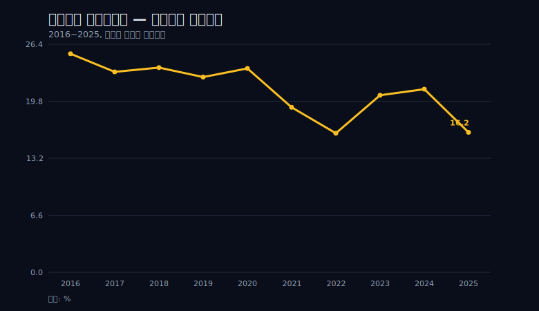
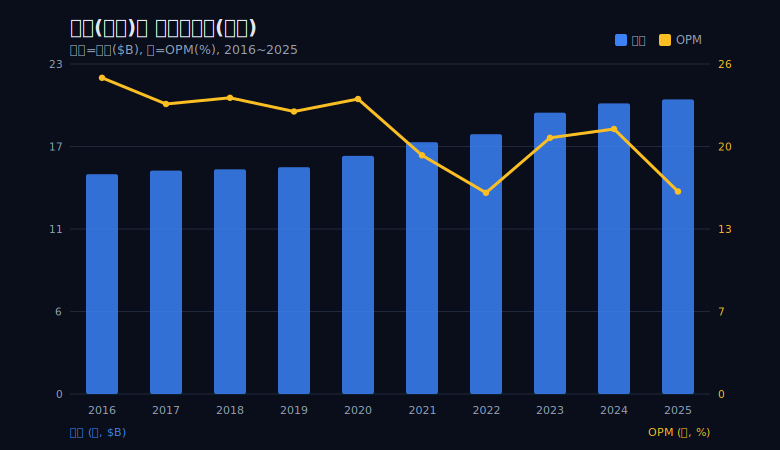
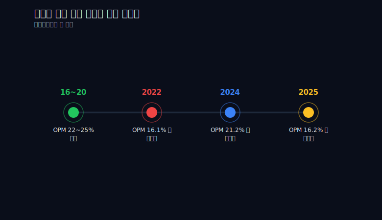
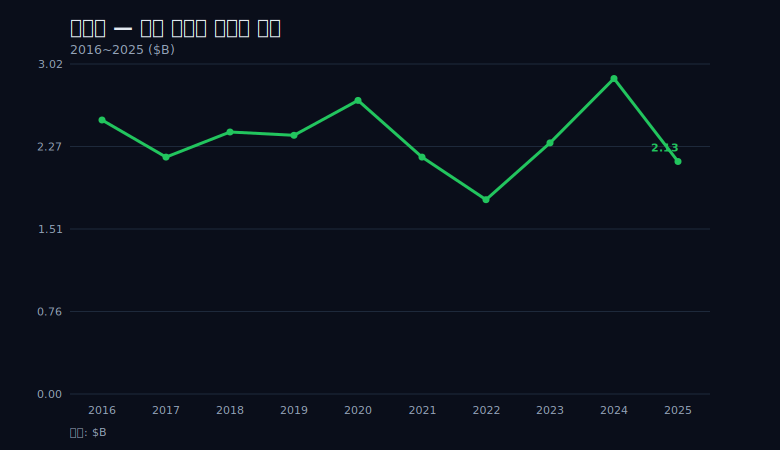

> **데이터 기준**: 2026-06-14 dartlab 실측 — Colgate-Palmolive(CL) **미국 연결(USD)**, 분기 데이터를 역년(calendar-year)으로 합산. 세그먼트·제품별·가격/물량 분해·시가총액·배당 이력은 연결 손익에 나오지 않으므로 10-K·IR·언론을 **외부 인용**으로 표기한다. 콜게이트 공식 회계연도 보고치와 집계 방식이 다를 수 있다.
>
> **핵심 숫자**: 매출 **$20.38B**(2025) · 영업이익 **$3.31B**(OPM **16.2%**) · 당기순이익 **$2.13B**(NPM **10.5%**) · 영업현금흐름 **$4.20B** · 2016→2025 매출 **+34%**(CAGR 3.3%)인데 OPM은 2016 25.3%에서 2022 16.1%까지 **9.2%p** 출렁였다.
>
> **이 글의 용어**: OPM(영업이익률)·NPM(순이익률) = 각각 영업이익·순이익 ÷ 매출(서로 별개 비율) · 가격 전가 = 오른 원가를 판매가에 옮겨 마진을 되돌리는 힘 · 시차 = 비용 충격이 마진에 닿는 시점과 가격이 그걸 되돌리는 시점 사이의 시간 간격.

---

## 프롤로그 — 거의 움직이지 않던 선

처음 콜게이트의 손익을 펼치면, 가장 먼저 눈에 들어오는 건 *얼마나 안 움직였나*다.

2016년 영업이익률(OPM)은 25.3%였다. 2017년 23.2%, 2018년 23.7%, 2019년 22.6%, 2020년 23.6%. 5년 내내 22%에서 25% 사이, 폭이 채 3%p가 안 되는 박스 안에서 거의 한 자리에 머물렀다. 차트로 그리면 거의 수평선에 가깝다. 그 평평함이 이 회사를 둘러싼 '해자'라는 단어의 첫인상이다 — 무슨 일이 있어도 비율이 흔들리지 않는다는 인상.

이런 종류의 선을 보면 분석자는 보통 안심한다. 출렁이는 손익은 설명할 게 많고 그만큼 위험하지만, 5년을 같은 자리에 머무는 비율은 '이미 검증된 안정'처럼 보이기 때문이다. 콜게이트의 22~25% 박스는 그 안심을 주기에 충분한 모양이었다. 그런데 안심은 분석이 아니다. 평평함이 무엇으로 만들어졌는지를 묻지 않은 안심은, 그 평평함이 깨지는 순간 그대로 배신당한다.


그래서 평평한 선을 두 갈래로 읽어 본다. 평평함은 두 가지를 동시에 뜻할 수 있다. 하나는 강함이다 — 어떤 충격이 와도 비율이 지켜진다는 뜻. 다른 하나는, 아직 시험받지 않았다는 뜻이다. 두 해석은 차트 위에서 똑같이 생겼다. 같은 수평선이 '막아낸 결과'일 수도 있고 '아직 두들겨 맞지 않은 결과'일 수도 있다. 둘을 가르는 유일한 방법은 충격이 실제로 닥쳤을 때 그 선이 어떻게 반응하는가를 보는 것뿐이다. 2016~2020년의 콜게이트는 강해서 평평했나, 아니면 흔들 만한 일이 없어서 평평했나. 이 글은 그 질문을 끝까지 따라간다.



결론부터 말하면, 그 선은 곧 깨진다. 25.3%에서 16.1%까지, 무려 9.2%p가 눌렸다. '해자'라는 단어가 약속하는 안정과는 정반대의 일이 벌어졌다. 그래서 이 글의 관통선은 마진의 안정을 부정하는 데서 출발한다 — **콜게이트의 마진은 원가가 한꺼번에 뛰면 먼저, 빠르게 눌리고, 가격 전가는 시차를 두고 늦게 따라온다. 해자가 있다면 그것은 비율의 안정이 아니라, 눌린 마진이 되돌아오는 회복 속도에 있다.**

먼저 유의 포인트 하나를 박고 들어간다. 이 글이 다루는 OPM·NPM은 제공된 영업이익·순이익을 매출로 나눈 값일 뿐이다. 매출원가(COGS)·판관비(SG&A) 분해 데이터가 손에 없다. 그래서 "원가 인플레가 마진을 눌렀다"는 문장을 손익 숫자만으로 증명할 수는 없다. 이 글은 인과를 단정하지 않고, '매출은 오르는데 마진은 내리는' 동시 발생을 **정합적 패턴**으로만 서술한다. 어디까지가 데이터고 어디부터가 외부 맥락인지, 매 막에서 선을 긋는다. 그 선을 흐릿하게 두면 이 글은 그냥 또 하나의 '해자 찬가'가 되고 만다.

---

## 1막 — 해자란 무엇인가: 매출은 멈추지 않았다

마진 이야기로 곧장 들어가기 전에, 더 견고한 증거부터 세운다. 콜게이트의 힘을 가장 깨끗하게 보여주는 줄은 마진이 아니라 **매출**이다. 마진은 비율이라 분모와 분자가 함께 움직이며 해석을 복잡하게 만들지만, 매출은 한 줄의 절대액이라 거짓말을 섞기 어렵다. 손님이 떠났다면 매출 행에 그대로 자국이 남는다.

콜게이트는 글로벌 구강케어(치약) 1위 브랜드로 알려져 있다(외부 인용: 10-K·IR). 하지만 '1위'라는 라벨은 형용사일 뿐이다. 시장점유율 몇 퍼센트라는 숫자도 이 글의 연결 손익에는 들어 있지 않다. 그 라벨을 *이 글이 가진* 검증 가능한 숫자로 바꾸면 이렇다 — 매출 행이 10년 동안 단 한 번도 뒷걸음치지 않았다.

```python
import dartlab
c = dartlab.Company("CL")
c.select("IS", ["매출액"], freq="Q")  # 분기 데이터를 역년으로 합산
```

| 연도 | 매출($B) |
|---|---:|
| 2016 | 15.20 |
| 2017 | 15.45 |
| 2018 | 15.54 |
| 2019 | 15.69 |
| 2020 | 16.47 |
| 2021 | 17.42 |
| 2022 | 17.97 |
| 2023 | 19.46 |
| 2024 | 20.10 |
| 2025 | **20.38** |

2016년 15.20B에서 2025년 20.38B로 **+34%**, 연평균(CAGR) 3.3% 성장이다. 화려한 곡선은 아니다 — 한 해에 두 자릿수로 뛰는 성장주의 그래프가 아니라, 계단을 한 칸씩 오르는 우상향이다. 한 해 한 해의 증가폭을 보면 2016~2019년은 0.25B 안팎의 느린 걸음이었고, 2020년 0.78B, 2021년 0.95B, 2022년 0.55B, 2023년 1.49B로 인플레 국면에서 오히려 증가폭이 커졌다. 이 가속이 중요하다 — 비용이 뛰던 바로 그 시기에 매출이 더 빨리 늘었다는 것은, 가격을 올리고도 외형이 깨지지 않았다는 1차 신호다.

하지만 이 그래프의 진짜 미덕은 *기울기*가 아니라 *연속성*에 있다. 곧 보게 되겠지만 마진이 9.2%p나 무너진 2022년에도, 그리고 마진이 재차 dip한 2025년에도, 매출 행만은 단 한 칸도 내려가지 않았다. 마진 차트와 매출 차트를 나란히 놓으면, 한쪽은 두 번 골짜기를 그리는데 다른 한쪽은 단조 증가다. 같은 회사의 같은 10년에서 두 줄이 이렇게 다른 모양을 그린다는 것 자체가 이 글의 출발점이다.


이게 1차 증거다. 수요와 가격을 매길 힘이 살아 있다면, 마진이 일시적으로 눌려도 외형은 유지된다. 거꾸로 말하면 — 가격을 올렸을 때 손님이 떠났다면 매출 행 어딘가에 구멍이 났어야 한다. 치약·비누·세제는 가격이 올라도 사람들이 쉽게 끊지 못하는 카테고리고, 그 비탄력성이 매출 행의 무결성으로 나타난다. 콜게이트의 매출 행에는 그 구멍이 없다([Stockanalysis CL 재무](https://stockanalysis.com/stocks/cl/financials/)).

이 무결성을 더 까다롭게 시험하는 방법은 '감소가 없다'를 넘어 '둔화조차 있었나'를 보는 것이다. 10년 중 가장 약한 성장 구간은 2017~2019년으로, 매출이 15.45B→15.54B→15.69B에 머물며 사실상 횡보에 가까웠다. 그런데 이 횡보 구간은 인플레가 닥치기 *전*이었다. 정작 비용이 가장 거셌던 2021~2023년에 매출은 17.42B→17.97B→19.46B로 오히려 가장 크게 뛰었다. 외형이 가장 위협받을 법한 시기에 외형이 가장 빨리 자랐다는 이 역설이, 가격을 올리고도 물량 기반이 무너지지 않았다는 가장 강한 정황이다. 다시 강조하지만 이 가속 안에 가격이 몇 할이고 물량이 몇 할인지는 가르지 못한다 — 다만 '가격을 올리자 손님이 절반 떠났다'는 시나리오라면 결코 나올 수 없는 모양이라는 것까지는 말할 수 있다.

다만 여기서 한 발 멈춘다. 이 +34%가 순수한 가격 인상의 결과인지, 물량(volume) 증가가 섞인 것인지는 손익 숫자만으로 가를 수 없다. 같은 1.49B의 매출 증가도, 가격을 5% 올려 만든 것과 물량을 5% 늘려 만든 것은 의미가 전혀 다르다. 앞이라면 전가력의 증거지만, 뒤라면 그냥 수요 성장이다. 가격과 물량을 분리할 데이터가 이 글에는 없으므로, '수요·가격 기반이 깨지지 않았다'까지만 말하고 '전량 가격 전가'라고는 단정하지 않는다. 이 절제가 다음 막의 발산을 왜곡 없이 읽기 위한 전제다.



매출이 멈추지 않았다는 것 — 그것이 이 글이 인정하는 첫 번째 해자의 증거다. 그렇다면 그 멈추지 않은 외형 위에서, 마진은 왜 그렇게 출렁였을까. 위 차트에서 가장 눈여겨봐야 할 것은 두 선이 *갈라지는* 순간이다. 매출 막대는 꾸준히 오르는데, OPM 선은 2021년부터 급격히 꺾여 내려간다. 같은 회사의 같은 손익에서 한쪽은 오르고 한쪽은 내린다. 이 발산이 이 글 전체의 화두다. 외형이 멀쩡한데 비율이 무너진다는 것은, 매출 1달러당 회사가 챙기는 몫이 줄었다는 뜻이다. 그 몫은 어디서 새어 나갔나 — 손익 분해 데이터가 없는 이 글로서는 '어디서'를 단정할 수 없지만, '언제'와 '얼마나'는 정확히 말할 수 있다. 그 '언제'가 2021~2022년이다. 다음 막은 그 선이 처음 깨지는 장면이다.

---

## 2막 — 2021~2022: 해자가 먼저 눌린다

평평하던 선이 깨지는 데는 2년이 걸렸다.

```python
import dartlab
c = dartlab.Company("CL")
c.select("IS", ["매출액", "영업이익"], freq="Q")
# OPM = 영업이익 / 매출 (역년 합산 후 계산)
```

2020년 23.6%였던 OPM은 2021년 19.1%로, 2022년 16.1%로 내려갔다. 2016년의 박스 천장(25.3%)에서 2022년 바닥(16.1%)까지 재면 **9.2%p**다. 가장 가파른 구간은 2021년(19.1%)에서 2022년(16.1%)으로 떨어진 1년이다. 22~25% 박스 안에서 5년을 머물던 비율이, 단 2년 만에 박스 바닥을 뚫고 16%대까지 내려앉았다. 9.2%p라는 폭이 추상적으로 들린다면 이렇게 바꿔 보면 된다 — 매출 18B 회사에서 영업이익률 9%p는 약 1.6B의 이익에 해당하는 크기다. 박스 안 5년의 안정이 만들어 준 신뢰가, 2년의 하락으로 그만큼 깎였다.



그런데 이 골짜기의 진짜 드라마는 비율이 아니라 *절대액의 발산*에 있다. 비율은 분모(매출)가 커지면 분자(이익)가 그대로여도 떨어지므로, 마진 하락만으로는 '이익이 정말 줄었는지'를 알 수 없다. 그래서 절대액을 본다. 2020년에서 2022년 사이, 매출은 16.47B에서 17.97B로 **+1.5B 늘었다**. 같은 기간 영업이익은 3.88B에서 2.89B로 **-0.99B 줄었다**. 외형이 1.5B 커지는 동안 이익은 1B 가까이 깎였다. 분모가 커지는데 분자가 줄었으니, OPM 하락은 '착시'가 아니라 실제 이익의 감소다. 더 많이 파는데 더 적게 남기는, 손익계산서에서 가장 불편한 종류의 그림이다.


여기서 외부 맥락을 끌어온다. 이 시기 콜게이트의 마진 압축은 원자재(유지·수지·포장재)·물류비·환율 인플레가 한꺼번에 닥친 국면과 겹친다(외부 인용: 콜게이트 IR·10-K, [Macrotrends 영업이익률](https://www.macrotrends.net/stocks/charts/CL/colgate-palmolive/operating-margin)). 치약·세제의 핵심 원료는 유지·계면활성제·플라스틱 포장재이고, 이들은 유가·곡물가·운임에 직접 연동된다. 2021~2022년은 그 셋이 동시에 뛴 드문 시기였다. 다만 명토 박아 둔다 — 이 글에는 COGS·SG&A 분해 데이터가 없다. 그래서 "원가가 올라서 마진이 눌렸다"를 손익 숫자만으로 증명하지 못한다. 내가 증명할 수 있는 건 '매출↑·영업이익↓가 동시에 일어났다'는 정합적 패턴이고, 그 패턴이 원가 인플레라는 외부 서사와 *방향이 같다*는 것까지다. 인과의 화살표를 내부 숫자로 그리지는 않는다. 만약 다른 원인(예: 대규모 마케팅 증액)이 같은 패턴을 만들었을 가능성도 이 글의 데이터로는 배제하지 못한다 — 그것까지 솔직히 적어 둔다.

순이익 쪽도 같은 골짜기를 그린다. 당기순이익은 2020년 2.69B에서 2022년 1.78B로 떨어졌다. NPM(순이익률)으로 보면 2016년 16.5%에서 2022년 9.9%로, 두 자릿수가 한 자릿수로 무너졌다. 여기서 OPM과 NPM을 한데 뭉뚱그리지 않는 게 중요하다. 둘은 별개의 비율이고, NPM에는 영업 밖의 이자·세금·일회성 항목이 섞여 들어간다. 2022년 OPM 16.1% 대비 NPM 9.9%의 간격(6.2%p)은 영업 아래 단계에서 추가로 새어 나간 몫이 있었다는 뜻인데, 그 내역(금융비용인지 세금인지 일회성인지)은 이 글의 데이터로 분해되지 않는다. 그러니 OPM과 NPM이 *같은 방향으로* 움직였다는 것까지만 읽고, 그 둘이 *같은 이유로* 움직였다고는 말하지 않는다.



압축의 속도를 한 번 더 분해해 본다. 2020→2021년 OPM은 23.6%에서 19.1%로 4.5%p 빠졌고, 2021→2022년에는 19.1%에서 16.1%로 3.0%p 더 빠졌다. 첫해의 낙폭이 더 컸다는 것은, 충격이 닿자마자 마진이 가장 크게 반응했다는 뜻이다 — 비용은 거의 실시간으로 손익에 닿았다. 같은 2년 동안 매출이 멈추지 않고 올랐다는 1막의 사실과 겹쳐 읽으면 그림이 선명해진다. *비용은 즉시 도착했고, 매출도 즉시 따라 올랐는데, 그 둘의 차액인 마진만 즉시 무너졌다.* 가격 인상이 외형에는 닿았지만 마진을 되돌리기엔 아직 부족했던, 시차의 전반부다.

핵심은 이것이다 — **마진은 원가 충격에 먼저, 그리고 빠르게 눌린다.** 2년 만에 9.2%p가 빠진 속도가 그 증거다. 평평하던 선은 충격 앞에서 전혀 평평하지 않았다. 프롤로그에서 던진 두 갈래 질문, '강해서 평평했나 안 맞아봐서 평평했나'에 대한 첫 답이 여기서 나온다 — 적어도 *비율을 지키는* 의미의 강함은 아니었다. 그렇다면 '해자'라는 단어는 이 골짜기 앞에서 완전히 무력했나. 다음 막이 그 대답이다.

---

## 3막 — 2023~2024: 가격이 시차를 두고 따라온다

골짜기 바닥(2022년 16.1%)에서, 선은 다시 올라온다.

OPM은 2023년 20.5%, 2024년 21.2%로 되돌아왔다. 영업이익 절대액으로도 2022년 2.89B에서 2023년 3.98B, 2024년 4.27B로 회복했다 — 2024년 영업이익은 10년 구간 최고치다. 회복의 폭을 절대액으로 재면 2022→2023년 한 해에만 영업이익이 1.09B 늘었는데, 같은 해 매출 증가폭(17.97B→19.46B, 1.49B)에 견주면 매출 1달러가 늘 때 영업이익이 약 73센트씩 따라붙은 셈이다. 압축 국면(2020→2022)에서 매출이 늘수록 이익이 *줄던* 그림과 정확히 반대다. 같은 회사의 같은 손익이, 비용 환경이 바뀌자 매출-이익 관계의 부호까지 뒤집었다. 순이익도 2022년 1.78B에서 2024년 2.89B로, NPM은 9.9%에서 14.4%로 되돌아왔다. 비율도 절대액도, OPM도 NPM도 함께 올라왔다는 점이 회복의 진정성을 뒷받침한다.

```python
import dartlab
c = dartlab.Company("CL")
is_q = c.select("IS", ["매출액", "영업이익", "당기순이익"], freq="Q")
# 역년 합산 후 OPM·NPM 계산 → 2022 바닥 vs 2024 회복 대조
```

회복의 결을 더 들여다보면, NPM이 OPM보다 더 멀리까지 따라오지는 못한 점이 눈에 띈다. OPM은 2024년 21.2%로 2016년 천장(25.3%)의 84%까지 복귀했지만, NPM은 14.4%로 2016년(16.5%)의 87% 수준에서 멈췄다. 두 비율이 함께 올라온 것은 분명하나 천장을 완전히 회복하지는 못했다는 점은 명확히 적어 둔다 — '되돌아왔다'는 '예전 수준을 넘어섰다'와 다르다. 회복은 골짜기를 메우는 데까지였지, 박스 천장을 다시 뚫는 데까지는 아니었다.

여기서 흔한 클리셰는 'V자 반등으로 위기를 극복했다'다. 하지만 그 표현은 이 데이터가 말하는 가장 중요한 사실을 가린다. 핵심 주장은 '회복했다'가 아니라 **'늦게, 그리고 천장까진 아니게 회복했다'**이다. '회복'에만 방점을 찍으면 시차라는 이 글의 발견이 통째로 사라진다.

타임라인을 다시 정렬해 본다. 비용 충격이 마진에 닿은 시점은 2021~2022년이었다. 매출이 그 비용을 따라 가속한 시점도 2021~2023년이었다(앞 막에서 본 증가폭 확대). 그런데 마진이 다시 박스 근처(20~21%)로 돌아온 시점은 2023~2024년이다. 즉 매출은 비용과 거의 동시에 반응했는데, 마진은 1~2년 늦게 반응했다. 이 어긋남이 **시차**의 정체다. 외부 맥락은 이 시차를 가격 인상의 반영 지연으로 설명한다(외부 인용: 콜게이트 IR, [Reuters CL](https://www.reuters.com/markets/companies/CL.N)) — 원가가 오른다고 다음 날 바로 가격표를 바꿀 수는 없고, 인상분이 전 제품·전 시장·전 유통채널에 퍼져 매출에 온전히 반영되기까지 시간이 걸린다. 계약·재고·환율 헤지가 그 시간을 더 늘린다.


이 시차가 이 글의 진짜 발견이다. '가격 결정력이 있으니 인플레는 문제없다'는 흔한 서사는 *무시차(無時差)의 신화*다. 가격을 마음대로, 즉시 올릴 수 있다면 마진은 애초에 눌리지 말았어야 한다. 그런데 콜게이트의 마진은 분명히 9.2%p 눌렸다. 그러니 가격 전가력은 **존재하지만 즉각적이지 않다.** 비용 충격과 가격 반영 사이에 1~2년이 비고, 그 빈 시간 동안 마진은 골짜기를 그린다([WSJ Markets CL](https://www.wsj.com/market-data/quotes/CL)). 전가력을 '있다/없다'의 이분법으로 묻는 대신, '얼마나 빨리 작동하는가'로 물어야 이 회사의 손익이 비로소 설명된다.

매출 vs OPM 차트로 돌아가면 이 구조가 한눈에 보인다 — 매출 막대는 2021~2022년 골짜기 구간에도 멈추지 않고 올랐고(가격 인상이 외형에는 즉시 반영된다), OPM 선은 그보다 늦게 2023~2024년에야 다시 올라온다(가격이 마진으로 환산되기까지 시차). 같은 가격 인상이 매출에는 먼저, 마진에는 나중에 도착한다. 이 두 속도의 차이가 발산의 정체고, 1막에서 본 매출 줄과 마진 줄의 모양이 왜 그렇게 달랐는지에 대한 답이다.

그렇다면 이 회복은 영구적인 사건이었을까. 한 번 되돌아온 마진은 그 자리에 머물렀을까. '시차를 두고 회복한다'는 명제가 참이라면, 새로운 비용 충격이 올 때마다 같은 골짜기가 반복될 것이라는 예측이 따라 나온다. 2025년이 바로 그 예측의 시험대다 — 그리고 그 답은 깔끔하지 않다.

---

## 4막 — 2025: 끝나지 않은 시험

깔끔한 결말을 원한다면, 2025년은 배신의 해다.

2024년 21.2%까지 돌아왔던 OPM은 2025년 16.2%로 **재차 5%p 하락**했다. 골짜기 바닥(2022년 16.1%)과 거의 같은 자리다. 순이익도 2024년 2.89B에서 2025년 2.13B로 동반 하락했고, NPM은 14.4%에서 10.5%로 다시 내려갔다. 매출은 20.10B에서 20.38B로 여전히 올랐다 — 또다시, 외형은 멈추지 않고 마진만 꺾였다. 2022년에 본 발산이 거의 그대로 재현됐다.


'2023년 V자 반등으로 위기 극복'이라는 해피엔딩은 여기서 무너진다. OPM 차트를 멀리서 보면 하나의 골짜기가 아니라 **두 개의 골짜기**가 보인다. 2022년의 바닥, 그리고 그것을 거의 복제한 2025년의 바닥. 회복은 한 번으로 끝나는 영구적 사건이 아니라, 반복해서 다시 찾아오는 시험이었다. 3막 끝에서 세운 예측 — '충격이 오면 같은 골짜기가 반복된다' — 이 2025년에 그대로 들어맞은 셈이다.

여기서 멈춘다. 2025년 재차 dip의 정확한 원인을 손익 데이터만으로 단정하지 않는다. 외부 맥락은 비용 재상승 또는 구조조정 관련 항목을 **추정**으로 언급하지만(외부 인용: [SEC EDGAR 콜게이트 공시](https://www.sec.gov/cgi-bin/browse-edgar)·언론), 이 글이 가진 연결 손익 숫자로는 어느 쪽이 얼마였는지 가를 수 없다. 일회성 비용이 섞였는지, 구조적 마진 훼손인지, 그 분해는 이 글의 데이터 밖에 있다. 이 구분은 결정적이다 — 일회성이라면 2026년 다시 메워질 골짜기이고, 구조적이라면 새로운 박스의 시작이다. 둘은 정반대의 미래를 함의하지만, 연결 손익 한 장으로는 둘을 가를 수 없다. 한 가지 단서는 있다. 2022년의 첫 골짜기가 시차를 두고 메워진 전례가 있으니, 같은 깊이(16.1% vs 16.2%)의 두 번째 골짜기를 무조건 구조적 훼손으로 읽을 근거도 없다. 그러나 전례가 보증은 아니다 — 같은 깊이라고 같은 원인일 이유도, 같은 회복이 따라올 이유도 없다. 그래서 이 글은 '재차 dip했다'는 사실만 확정하고, '어느 쪽 미래인가'는 열어 둔다.

이 대목이 회의론자의 반론을 정면으로 받는 자리다. 가장 강한 반론은 이렇다 — *"해자라면서 OPM이 2년 만에 25.3%에서 16.1%로 9.2%p나 무너진 게 어떻게 해자인가. 진짜 해자라면 애초에 눌리지 말았어야 한다. 게다가 2023~24년 회복했다더니 2025년에 또 16.2%로 dip — 회복이 일회성이 아니라 매번 다시 시험받는다면, 그건 해자가 아니라 그냥 가격에 민감한 보통 생필품 사업 아닌가?"*

이 반론을 피하지 않는다. 오히려 받아들인다. **'해자 = 마진의 안정'이라는 정의는 이 데이터 앞에서 폐기되는 게 맞다.** 9.2%p나, 그것도 두 번이나 출렁인 마진은 어떤 의미로도 '안정'이 아니다. 회의론자가 옳다 — 마진의 평평함을 해자라고 불렀다면, 그 해자는 없다. 프롤로그의 첫인상은 여기서 완전히 기각된다. 그래서 이 글은 해자의 정의를 다시 세워야 한다. 다만 반론을 끝까지 따라가 보면, 회의론자도 한 가지를 설명하지 못한다 — '가격에 민감한 보통 생필품 사업'이라면 왜 매출 행에는 단 한 번도 구멍이 나지 않았는가. 그 빈틈이 재정의의 실마리고, 그 두 번째 기둥이 다음 막에 있다.

---

## 5막 — 그래도 현금은 흐른다: 마진과 캐시의 갈림

마진이 두 번 무너지는 10년 내내, 단 한 번도 무너지지 않은 줄이 있다.

```python
import dartlab
c = dartlab.Company("CL")
cf = c.select("CF", ["영업활동현금흐름"], freq="Q")
is_q = c.select("IS", ["당기순이익"], freq="Q")
# 역년 합산 후 영업현금흐름 vs 순이익 대조 — 10년 전 구간
```

영업현금흐름(OCF)은 10개 연도 모두에서 당기순이익을 밑돌지 않았다. 마진이 바닥을 찍은 2022년에도 OCF 2.56B는 순이익 1.78B를 웃돌았다. 2016년 3.14B, 2020년 3.72B, 2023년 3.75B, 2024년 4.11B — 매년 순이익보다 위에서 흘렀다. 그리고 가장 인상적인 건 2025년이다. OPM이 16.2%로 재차 dip하고 순이익이 2.13B로 떨어진 그 해, OCF는 오히려 **4.20B로 10년 구간 최고치**를 찍었다. 순이익의 약 **1.97배**, 거의 2배다. 손익계산서가 가장 나빠 보이는 해에 현금흐름표는 가장 좋아 보였다.

이 갈림이 이 회사를 단순한 '망가진 해자'로 읽지 못하게 한다. 회계상 이익(순이익)이 눌릴 때조차, 현금을 만들어내는 능력은 깨지지 않았다. 마진 차트가 "나는 시험받고 있다"고 말할 때, 현금흐름 차트는 "해자는 아직 살아 있다"고 말한다. 두 신호가 같은 해에 정반대를 가리키는 것 — 그것이 2025년의 가장 있는 그대로의 그림이다. 회의론자가 마진 줄 하나만 보고 '보통 생필품 사업'이라고 단정할 때, 현금 줄은 그 단정에 동의하지 않는다.

다만 여기서도 과대 해석을 막는다. OCF가 순이익을 상회하는 것은 그 자체로 '현금 우월성'의 증거가 아니다. 감가상각·무형자산상각 같은 비현금 비용이 순이익에서는 차감되지만 OCF에는 다시 더해지기 때문에, 정상적인 우량 기업이라면 OCF가 순이익을 웃도는 게 오히려 자연스럽다. 즉 'OCF가 순이익보다 크다'는 사실 자체는 콜게이트만의 특별함이 아니라 대부분 제조·소비재 기업의 기본값에 가깝다. 그러니 2025년 OCF 4.20B가 말하는 건 '현금 창출이 *깨지지 않았다*'까지지, '마진 dip을 상쇄하는 깜짝 호재'까지는 아니다. 더 명확히는, 2025년 OCF가 전년보다 *늘어난* 부분이 운전자본의 일시적 변동(재고·매출채권·매입채무의 타이밍) 때문인지, 진짜 본업 현금창출의 개선인지도 이 글의 데이터로는 분해되지 않는다. 일회성 항목의 영향도 마찬가지다. 그래서 'OCF 최고치'는 강조하되, 그 위에 인과를 얹지는 않는다.

시야를 한 해에서 10년으로 넓히면 갈림은 더 분명해진다. 마진 줄은 25.3% → 16.1% → 21.2% → 16.2%로 두 번 깊게 출렁였지만, 현금 줄은 3.14B에서 4.20B로 큰 함몰 없이 우상향했다. 마진이라는 비율은 충격마다 요동쳤어도, 그 비율이 곱해지는 토대(매출)와 그 토대가 만들어 낸 현금은 줄곧 두꺼워졌다는 뜻이다. 비율 한 줄만 보는 독자와 세 줄을 함께 보는 독자가 같은 회사에서 정반대의 결론에 닿는 이유가 여기 있다. 비율은 '얼마나 효율적이었나'를 말하고, 매출과 현금은 '얼마나 버텼나'를 말한다 — 콜게이트의 10년은 효율의 골짜기와 체력의 우상향이 한 손익 안에 공존한 시간이었다.

그래도 사실은 사실이다 — 마진이 두 번 무너지는 동안 현금 줄은 한 번도 무너지지 않았고, 매출 줄은 한 칸도 내려가지 않았다. 회의론자의 반론은 세 줄 가운데 마진 줄 하나만 봤을 때 가장 강하다. 그런데 콜게이트의 손익에는 마진 줄 말고도 매출 줄과 현금 줄이 있고, 그 둘은 회의론자가 말하는 '보통 생필품 사업'과는 다른 그림을 그린다. 해자의 재정의는 바로 이 세 줄의 합에서 나온다.

---

## 에필로그 — 해자의 정의를 다시 쓰기

이 글은 처음의 인상을 부정하며 끝난다.


프롤로그에서 평평한 선을 보고 '안정 = 해자'라고 읽었다. 그 읽기는 틀렸다. 마진은 원가 충격 앞에서 먼저, 빠르게 눌렸고 — 회의론자의 지적대로 — 마진의 안정을 해자라고 부른다면 콜게이트에 그 해자는 없다.

그래서 해자를 다시 정의한다. 마진의 안정이 아니라, **두 가지 관찰 가능한 증거**로. 첫째, 마진이 무너진 해(2022·2025)에도 매출은 단 한 번도 감소하지 않았다 — 수요·가격 기반의 불괴. 둘째, 눌린 마진이 시차를 두고서라도 되돌아왔다 — 전가력의 지연된 실재. 2022년의 골짜기는 2023~2024년에 메워졌고, 그 회복은 가격 전가력이 *느리지만 실재한다*는 증거였다. 2025년 두 번째 골짜기 역시 — 회복이 또 올 것인가는 아직 답하지 않은 질문이지만 — 같은 해 OCF가 순이익의 약 2배였다는 사실이 균형을 잡는다. 해자는 '비율을 막는 벽'이 아니라 '눌려도 외형과 현금을 유지한 채 되돌아오는 복원력'으로 재정의된다.

콜게이트만 이 게임을 한 게 아니다. 같은 생필품 진영의 [P&G](/blog/PG-procter-gamble)는 매출보다 이익이 빨리 자란 비대칭으로 가격결정력의 자국을 남겼고, 원액 프랜차이즈로 가치사슬을 쥔 [코카콜라](/blog/KO-coca-cola), 스낵·음료 브랜드로 진열대를 쥔 [펩시코](/blog/PEP-pepsico), 스낵 카테고리의 [몬델리즈](/blog/MDLZ-mondelez) 모두 2021~2022년 인플레 국면에서 같은 *시차의 게임*을 치렀다. 마진이 먼저 눌리고 가격이 늦게 따라오는 구조는 한 회사의 특성이 아니라 생필품 진영 전체의 문법에 가깝다. 박리로 길목을 지키는 [월마트](/blog/WMT-walmart), 회비로 마진을 묶어두는 [코스트코](/blog/COST-costco), 규제 해자로 마진을 지키려 한 [알트리아](/blog/MO-altria)는 각각 다른 방식으로 '마진의 출처'를 보여주지만, 콜게이트는 그중 *눌렸다가 되돌아오는 회복 속도*로 자기 해자를 증명하는 거울이다. 형제 글들과 나란히 읽으면, 콜게이트의 두 골짜기는 예외가 아니라 진영 공통 문법의 한 사례로 자리를 찾는다.

마지막으로 유의 포인트를 모은다. 이 글은 10개 연도(2016~2025)의 단일 회사 시계열 하나만 다뤘다 — 통계적 일반화가 아니라 한 기업의 서사다. OPM·NPM은 영업이익·순이익을 매출로 나눈 값일 뿐, COGS·SG&A 분해가 없어 마진을 누른 원인을 손익 숫자로 증명하지 못했다. 매출 +34%가 가격인지 물량인지 가르지 못했고, 2025년 dip의 원인(일회성/구조적)도 추정에 머물렀다. OCF가 순이익을 웃돈 것은 비현금비용 가산의 정상적 결과이기도 해 '현금 우월성'으로 부풀리지 않았다. 데이터는 미국 연결 USD·역년 합산 기준(dartlab 2026-06-14 실측)이라 공식 회계연도 보고치와 다를 수 있다. 그러니 이 글은 목표주가도, 매수의견도 말하지 않는다 — 손익 데이터가 말할 수 있는 경계까지만 말한다.

그 경계 안에서 남는 질문은 하나다. 2025년이 던진 두 번째 골짜기는, 2022년처럼 또 메워질 것인가. 매출 줄과 현금 줄은 아직 멈추지 않았다. 마진 줄만 다시 시험받고 있다. 회복은 또 올 것인가 — 그 답은 다음 해의 손익이 쥐고 있고, 이 글이 줄 수 있는 것은 답이 아니라 그 답을 읽어 낼 세 줄(매출·마진·현금)의 좌표뿐이다. 좋은 분석은 결론을 파는 것이 아니라, 다음 데이터가 도착했을 때 무엇을 어디서 확인하면 되는지를 남기는 일이다. 콜게이트의 두 골짜기가 남긴 것은 바로 그 확인의 좌표다.
