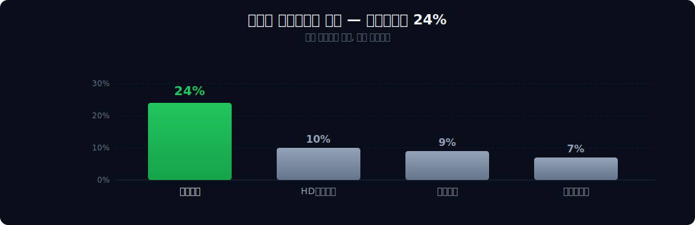
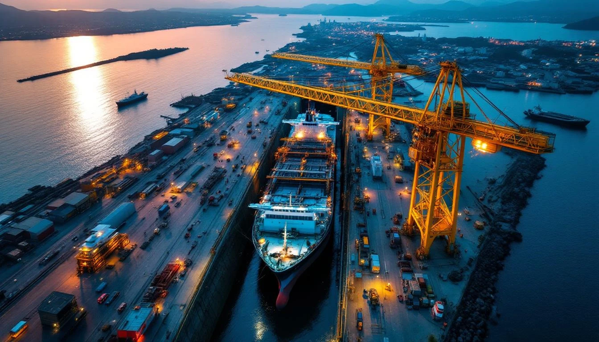
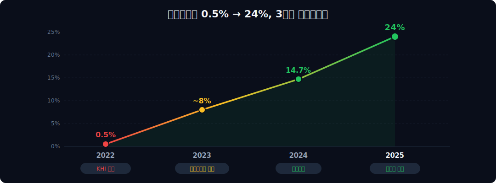
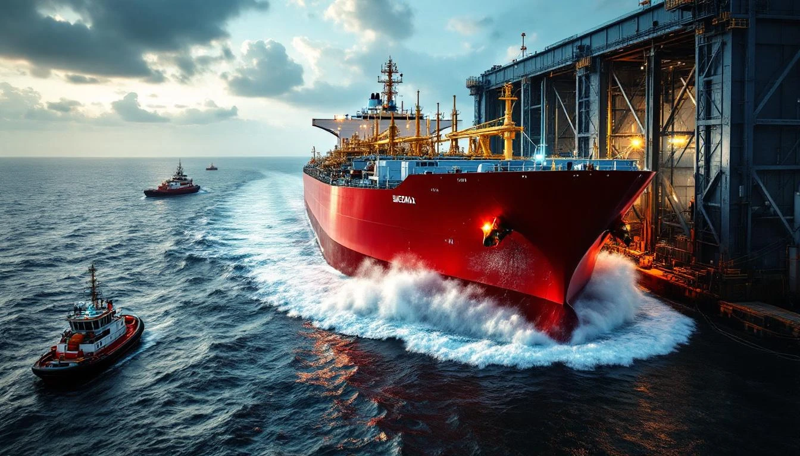
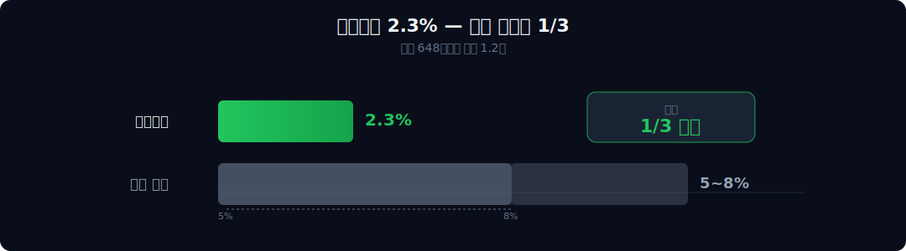
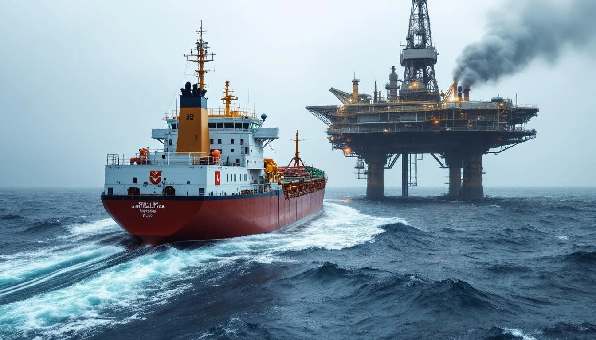
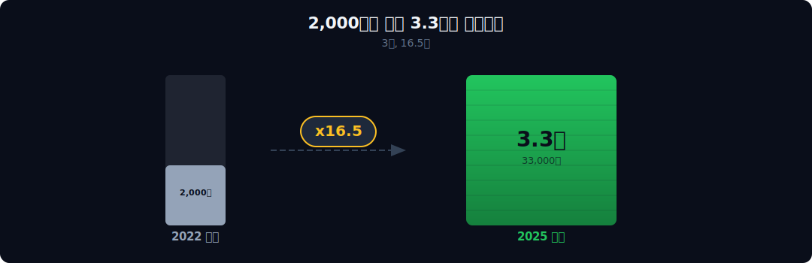
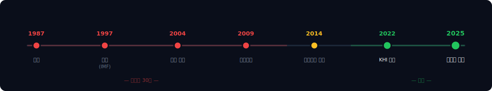

<script>
	import CompanyFinancials from '$lib/components/blog/CompanyFinancials.svelte';
import YouTube from '$lib/components/YouTube.svelte';
import HFDataLink from '$lib/components/blog/HFDataLink.svelte';
</script>

<YouTube id="WzBUtnbe_x0" title="대한조선 — 3번 죽은 조선소가 영업이익률 24%를 찍었다" />

> **턴어라운드 + 성장** | 제조 > 조선 | 2026-04-11 dartlab 실측
> 같은 시리즈: [SK하이닉스](/blog/000660-skhynix) · [삼양식품](/blog/003230-samyang-foods) · [두산에너빌리티](/blog/034020-doosan-enerbility) · [알테오젠](/blog/196170-alteogen) · [HMM](/blog/011200-hmm) · [셀트리온](/blog/068270-celltrion) · [한화에어로스페이스](/blog/012450-hanwha-aerospace) · [HD현대일렉트릭](/blog/267260-hd-hyundai-electric) · [고려아연](/blog/010130-korea-zinc) · [에이피알](/blog/278470-apr) · [크래프톤](/blog/259960-krafton) · [달바글로벌](/blog/483650-dalba-global) · [경동나비엔](/blog/009450-kyungdong-navien) · [기업이야기 시리즈 전체](/blog/series/company-reports)


<HFDataLink code="439260" />

---

## 조선업에서 영업이익률 24%는 존재하지 않는 숫자다

```python
import dartlab
c = dartlab.Company("439260")
c.analysis("financial", "종합평가")
```



한화오션은 잠수함을 짓는다. 군함 프리미엄이 붙는다. 그래서 영업이익률 9%. HD한국조선해양은 LNG선, VLCC, 컨테이너선까지 전 선종을 섭렵하는 세계 1위 조선소다. 영업이익률 10%. 삼성중공업은 드릴십과 FLNG에서 기술 독점에 가까운 포지션이다. 영업이익률 7%.

대한조선은 방산 한 척 없이, 잠수함 한 척 없이, **영업이익률 24%**다.

조선업 역사를 훑어봐도 이 숫자가 나온 적이 없다. 2007~2011년 조선 슈퍼사이클 때 현대중공업이 찍은 최고 영업이익률이 12.1%였다. 그 광란의 시절에도 24%는 없었다. 대한조선의 이 숫자는 산업의 문법 자체를 의심하게 만든다. 어떻게 가능한가?

더 이상한 건, 3년 전 이 숫자가 **0.48%**였다는 사실이다. 영업이익 33억 원. 연매출 6,937억을 올리는 조선소가 33억을 남겼다. 직원 한 명당 500만 원도 안 되는 이익이었다. 그리고 3년 만에 89배가 됐다.

| 회사 | 영업이익률 (2025) | 방산 비중 | 비고 |
|------|:---:|:---:|------|
| **대한조선** | **23.95%** | 0% | 수에즈막스·셔틀탱커 |
| HD한국조선해양 | ~10% | 일부 | LNG·VLCC·컨테이너 |
| 한화오션 | ~9% | ~40% | 잠수함·호위함 |
| 삼성중공업 | ~7% | 0% | 드릴십·FLNG |

방산 프리미엄을 받는 한화오션도 9%인데, **순수 상선만 짓는 조선소가 24%**. 이 모순을 풀기 위해 1987년 전라남도 해남으로 가야 한다.

---

## 1막 — 해남의 작은 조선소가 3번 죽었다

### 1997 IMF → 2009 금융위기 → 2014 법정관리 — 37년 중 정상 가동 절반



1987년, 전라남도 해남. 한반도 최남단 땅끝마을에서 차로 30분 거리. **신영조선공업**이라는 이름의 조선소가 문을 열었다. 서울에서 6시간 걸리는 이 외진 곳에 조선소를 세운 이유는 단순했다 — 땅값이 쌌고, 해안선이 길었다.

작은 조선소였다. Big 3(현대중공업·대우조선·삼성중공업)가 수십만 톤급 도크를 돌릴 때, 신영조선은 중소형 선박을 만들었다. 한국 조선업 호황의 변두리에서 조용히 배를 찍었다.

**첫 번째 죽음, 1997년.** IMF 외환위기. 원자재 가격 폭등, 환율 폭등, 수주 급감. 신영조선공업 부도. 이건 이 조선소만의 비극이 아니었다 — 같은 시기에 한라중공업, 대동조선 등 중소 조선사 수십 개가 동시에 쓰러졌다. 그런데 이 조선소는 죽지 않았다.

2004년, **대주그룹**이 인수하면서 이름을 '대한조선'으로 바꿨다. 대주그룹은 해운·물류·조선을 수직계열화하려는 그림을 그렸다. 대한조선은 그 퍼즐의 한 조각이었다.

**두 번째 죽음, 2009년.** 글로벌 금융위기. 2007년부터 불어닥친 조선 슈퍼사이클이 2008년 리먼 사태로 벼락같이 끝났다. 벌크선 운임지수 BDI가 11,793에서 663으로 **94% 폭락**. 배를 주문한 선주들이 인도를 거부하기 시작했다. 대한조선은 워크아웃(기업구조조정)에 들어갔다. 채권단이 경영을 인수했다.

**세 번째 죽음, 2014년까지.** 워크아웃에서 법정관리(회생절차)로 전환. 법원이 칼을 잡았다. 부채를 깎고, 인원을 줄이고, 비핵심 자산을 팔았다. 2014년 법정관리를 졸업했지만, 주인이 없었다. **산업은행(KDB)**이 관리하는 상태로 7년을 표류했다.

### 7년 매각 실패 — Big 3도 적자인데 누가 사는가

산업은행은 매각을 시도했다. 한 번, 두 번, 세 번. 살 사람이 없었다. 왜? 당시 조선업은 빙하기였다. 2015년부터 2020년까지 세계 신조선 발주량이 슈퍼사이클의 1/5 수준으로 쪼그라들었다. Big 3조차 적자를 내는 판에, 기술도 규모도 없는 중소형 조선소를 누가 2,000억 넘게 주고 사겠는가.

37년의 역사 중 정상 가동 기간이 절반도 안 됐다. 부도-인수-부도-법정관리-매각실패. 이 조선소의 이력서는 실패의 연대기였다.

```python
c.select("IS", ["매출액", "영업이익"], freq="Y")
```

그런데 이 실패의 연대기가 갑자기 이런 숫자를 만들어냈다. 영업이익이 3년 만에 89배 뛰었다. 무슨 일이 있었는가?

| 연도 | 매출 | 영업이익 | 영업이익률 |
|------|-----:|--------:|----:|
| 2022 | 6,937억 | 33억 | 0.48% |
| 2023 | 8,140억 | — | ~8% |
| 2024 | 10,746억 | 1,582억 | 14.72% |
| 2025 | 12,281억 | 2,941억 | 23.95% |



영업이익 33억이라는 숫자가 의미하는 것은 명확하다. 2022년, 이 조선소는 배를 짓긴 지었지만 **남는 게 없었다**. 철판 사고, 용접공 월급 주고, 크레인 돌리면 끝이었다. 그런데 같은 조선소가, 같은 해남 땅에서, 같은 바다를 바라보면서, 3년 뒤 영업이익률 24%를 찍었다. 이건 조선소가 바뀐 게 아니다. 조선소를 **운영하는 사람**이 바뀐 것이다.

---

## 2막 — 김광호가 2,000억에 산 것

### 조선업 경력 0년인 사람이 PSR 0.4배에 줍다

2022년, 한 컨소시엄이 산업은행 앞에 나타났다. **KHI컨소시엄.** 중심인물은 **김광호**. 모나리자의 전 회장이다. 모나리자는 유리용기·화장품 용기를 만드는 회사였다. 조선업과는 접점이 없었다. 조선업 경력 0년인 사람이 조선소를 사겠다고 나선 것이다.

가격은 **2,000억 원**. 지분 95%를 인수했다. 산업은행 입장에서는 7년 동안 팔리지 않던 짐을 드디어 덜어낸 것이고, 김광호 입장에서는 반값 이하의 조선소를 줍는 것이었다. 당시 대한조선의 연매출이 5,000억대였으니, PSR(주가매출비율)로 환산하면 0.4배도 안 됐다.

### 케이조선 적자 vs 대한조선 영업이익률 24% — 선종 선택 하나의 차이

여기서 첫 번째 반전이 나온다. 김광호는 거의 같은 시기에 **케이조선**도 2,500억에 인수했다. 두 조선소를 합쳐 4,500억. **그런데 운명이 완전히 갈렸다.** 케이조선은 중국과 직접 경쟁하는 PC탱커(범용) → 적자 → 매각 추진. 대한조선은 중국이 못 짓는 수에즈막스(특수) → 영업이익률 24%. 같은 사람이 같은 시기에 산 두 조선소가, **선종 선택 하나로** 정반대 결과를 낳았다.

인수 직후 **왕삼동 대표**를 영입했다. 대우조선해양 출신 생산관리 베테랑. 김광호가 돈과 방향을 잡고, 왕삼동이 현장을 바꿨다. 왕삼동이 한 일은 한 문장이다: **"우리가 가장 잘 짓는 배만 짓자."** 이 한 문장이 영업이익률 24%의 출발점이다.

현재 지분: KHI 65%, 안다H자산운용 31.4%.

---

## 3막 — 수에즈막스에 올인 — 중국이 못 짓는 배

### 수에즈 운하 통과 = 항해일수 2주 절약 — 선주가 프리미엄을 지불하는 이유



2막에서 "가장 잘 짓는 배만 짓자"는 방향이 정해졌다. 그 배는 **수에즈막스 탱커**다.

수에즈막스는 수에즈 운하를 만재 상태로 통과할 수 있는 최대 크기의 유조선이다. 재화중량 약 16만 톤. VLCC(30만 톤)보다 작지만, 수에즈 운하를 통과할 수 있다는 건 항로의 유연성이 극적으로 달라진다는 뜻이다. 중동 원유를 유럽으로 보낼 때 아프리카 희망봉을 돌지 않아도 된다. 항해 일수 차이가 2주. 선주 입장에서 2주는 연료비 수십억 원의 차이다.

### 중국은 못 짓는 게 아니라 안 짓는다 — 커스텀 오더 vs 대량생산

그런데 왜 중국은 수에즈막스를 못 짓는가?

엄밀히 말하면 **못 짓는 건 아니다. 짓지 않는 것이다.** 중국 조선소는 벌크선, 컨테이너선 같은 대량 생산이 가능한 범용 선종에 최적화되어 있다. 같은 설계도로 수십, 수백 척을 반복 건조해서 단가를 낮추는 모델이다. 수에즈막스는 선주마다 사양이 다르고, 이중선체 구조의 품질 기준이 까다로우며, 셔틀탱커 같은 특수 변형이 들어가면 난이도가 한 단계 올라간다. 커스텀 오더에 가까운 배를 중국식 대량생산 모델로 만들면 불량률이 올라가고, 결국 선주가 기피한다.

결과적으로 수에즈막스 시장은 한국 조선소의 독무대다. 그 안에서도 HD현대가 VLCC와 LNG선에 집중하고, 삼성중공업이 드릴십에 집중하는 사이, **대한조선이 수에즈막스의 틈새를 독점**했다. 2025년 상반기 전 세계 수에즈막스 발주 5척 중 **4척을 대한조선이 수주**했다.

여기에 **셔틀탱커**가 추가된다. 셔틀탱커는 해양 유전(FPSO)에서 원유를 직접 받아서 육상 터미널로 운반하는 특수선이다. 주당배당금(Dynamic Positioning System, 자동위치유지장치)가 장착되어 파도 속에서도 FPSO에 접안할 수 있어야 한다. 수에즈막스보다 한 단계 더 복잡하다. 전 세계에서 셔틀탱커를 건조하는 조선소는 삼성중공업과 대한조선 정도다. 이 시장에서 대한조선은 주요 플레이어다.


### 선가 프리미엄 척당 1,000만 달러 — 글로벌 발주 5척 중 4척 수주

중국 대비 대한조선의 선가 프리미엄은 척당 약 **1,000만 달러(약 140억 원)**. 수에즈막스 한 척이 대략 8,000만~1억 달러인데, 그 중 1,000만 달러가 "한국에서 짓는 프리미엄"이다. 선주가 이 프리미엄을 기꺼이 지불하는 이유는 간단하다 — 인도 후 품질 클레임이 적고, 재판매 가치가 높다.

그런데 선종 집중만으로는 영업이익률 24%가 설명되지 않는다. 같은 수에즈막스를 짓는다 해도 다른 조선소와 10%p 이상 차이가 나는 건 **공정 혁신** 때문이다.

---

## 4막 — 1,500톤 골리앗 크레인이 바꾼 것

### 진수 공정률 92% — 도크 밖에서 배의 92%를 완성

이 막이 대한조선 스토리의 핵심이다. "조선소인데 왜 24%인가"에 대한 진짜 답이 여기 있다. 선종 집중은 **무엇을**의 문제고, 공정 혁신은 **어떻게**의 문제다. 영업이익률 24%는 둘 다 맞아야 나오는 숫자다.

왕삼동 대표가 대한조선에서 벌인 공정 혁신은 크게 네 가지다.

**첫째, 1,500톤 골리앗 크레인.** 조선소에서 골리앗 크레인은 심장이다. 블록(선박 조각)을 들어올려서 도크 안에 배치하는 장비인데, 크레인 용량이 클수록 한 번에 큰 블록을 올릴 수 있다. 블록이 크면 도크 밖에서 미리 조립하는 비율(진수 공정률)이 올라가고, 도크 안에서의 작업이 줄어든다. 대한조선의 진수 공정률은 **92%**. 즉 배의 92%가 도크에 내려가기 전에 이미 완성되어 있다. 업계 평균은 70~80%다.

**둘째, 텐덤(tandem) 공법.** 하나의 도크에서 두 척의 선박을 동시에 건조하는 방법이다. 앞쪽 배가 진수(바다에 띄움) 준비를 하는 동안, 뒤쪽에서 다음 배의 블록 탑재가 시작된다. 도크 회전율이 **+18%** 올라갔다. 같은 도크에서 더 많은 배를 찍는다 — 이건 고정비를 더 많은 매출에 분산하는 효과다.

**셋째, 블록 내재화.** 선박 건조에 필요한 철강 블록을 외주가 아닌 자체 공장에서 제작한다. 대한조선의 블록 생산 능력은 연간 **27.6만 톤**. 실제 필요량은 22만 톤이니 여유 용량 25%다. 외주비를 줄이고 품질을 통제하는 동시에, 생산 일정을 자체적으로 관리할 수 있다. 외주 블록이 늦게 들어와서 전체 공정이 밀리는 문제가 사라진다.

**넷째, 공기(工期) 단축.** 이 세 가지가 합쳐진 결과다. 수에즈막스 1척 건조 공기가 **4.5주/척**. 이건 진수에서 다음 진수까지의 사이클인데, Big 3 대비 빠르다. 빠르게 찍을수록 고정비 분산 효과가 크고, 선주 인도가 빨라져서 잔금 회수가 당겨진다.

```python
c.analysis("financial", "비용구조")
```



### 판관비율 2.26% + 1인당 매출 19억 — 업종 평균의 1/3, HD중공업의 2.4배

이 공정 혁신의 결과가 비용구조에 그대로 드러난다. 대한조선의 판관비율은 **2.26%**. 조선업 평균 판관비율이 5~8%인 점을 감안하면, 업종 평균의 **1/3 수준**이다.

직원 수를 보면 감이 온다. 대한조선의 직원은 **648명**. 매출 12,281억 원을 648명이 만들었다. 1인당 매출 **약 19억 원**. HD현대중공업의 1인당 매출이 약 8억 원인 점을 감안하면 **2.4배** 높다. 같은 조선업인데 사람 한 명이 만들어내는 매출이 두 배 넘게 차이가 난다. 이건 직원을 쥐어짜는 게 아니라, **한 가지 선종에 최적화된 공정 라인이 만드는 효율**이다.

대한조선은 수에즈막스만 반복 건조하니까, 공정이 표준화되어 있다. 용접 작업자가 매번 새로운 도면을 읽을 필요가 없다. 자재 발주도 패턴이 정해져 있다. 새로운 선종을 수주할 때마다 설계-구매-생산 전체를 재조정해야 하는 Big 3와 근본적으로 다른 운영 모델이다.

매출총이익률 **26.21%**. 여기서 판관비 2.26%를 빼면 영업이익률 23.95%. 매총이익 자체가 높은 데다, 판관비까지 극단적으로 낮으니 **마진이 겹겹이 쌓인다**. 2막의 "가장 잘 짓는 배만 짓자"는 전략이, 4막에서 숫자로 증명된 것이다.

---

## 5막 — 진행기준 회계가 숨기는 것

### 영업이익률 24%인데 수익성 D, 현금흐름 D — Piotroski 1/9의 정체



여기까지 읽으면 대한조선이 완벽한 회사처럼 보인다. 영업이익률 24%, 판관비 2%, 턴어라운드 성공. 그러나 재무제표를 한 꺼풀 더 벗기면 **불편한 숫자들**이 나온다.

```python
c.analysis("financial", "종합평가")
```

여기서 재무제표가 거짓말을 하는 방식을 봐야 한다. 이익은 찍혔는데 현금이 없다 — 이건 조선업 특유의 진행기준 회계가 만드는 착시다. 종합평가 스코어카드를 보자. 안정성 **A**, 수익성 **D**, 성장 **D**, 현금흐름 **D**. Piotroski **1/9**.

잠깐, 영업이익률 24%인 회사의 수익성이 D? 이건 뭔가 잘못된 게 아닌가?

잘못된 게 아니다. **진행기준(percentage of completion) 매출 인식**의 특성이다. 조선업은 배를 만드는 데 2~3년이 걸린다. 회계 기준에 따라 매출을 공정률에 비례해서 인식하는데, 문제는 **이익의 인식 시점과 현금의 유입 시점이 다르다**는 것이다.

배를 80% 만들었으면 매출의 80%를 인식한다. 영업이익도 비례해서 잡힌다. 그런데 선수금(계약금)은 통상 계약 시점에 20~30%만 들어오고, 나머지는 인도 시점에 받는다. 장부에는 이익이 찍히지만 현금은 아직 안 들어온 상태. 이것이 대한조선의 스코어카드에서 수익성 D, 현금흐름 D가 나오는 이유다.

BS(재무상태표)를 보면 이 구조가 더 명확해진다.

```python
c.panel("BS", freq="Y")
```

### 계약부채 2,154억 + IPO 4,000억 — 부채비율 41%까지 떨어진 구조

**계약부채 2,154억 원.** 이건 선주로부터 받은 선수금 중 아직 매출로 인식하지 않은 부분이다. 선수금을 받았으니 현금은 있지만, 그 현금은 부채로 잡힌다. 배를 인도해야 매출이 되고 부채가 사라진다. 즉 이 2,154억은 "앞으로 인도할 배에 대해 이미 받은 돈"이다. 미래 매출이 이미 현금으로 들어와 있다는 뜻에서, 이건 **좋은 부채**다.

대한조선은 이 문제를 IPO로 해결했다. 2025년 8월 코스피 상장. 공모 규모 **약 4,000억 원**. 이 돈으로 차입금 **5,727억 원**을 상환했다. 부채비율이 **40.8%**로 떨어졌다. 조선소치고 부채비율 41%는 거의 무차입에 가깝다. 2009년 워크아웃, 2014년 법정관리를 겪은 회사가 부채비율 41%. 이것만으로도 턴어라운드의 깊이를 알 수 있다.

수출 비중도 주목할 만하다.


수출 **99.3%**, 내수 **0.7%**. 이 회사는 한국에 있지만 한국 시장에서 돈을 벌지 않는다. 노르웨이, 그리스, 사우디 선주들이 해남까지 와서 배를 주문한다. 수출 99%라는 건 환율에 극도로 민감하다는 뜻이기도 하지만, 동시에 **글로벌 시장에서 대체 불가능한 포지션**을 확보하고 있다는 뜻이기도 하다. 내수에 의존하지 않으니 한국 경기 침체의 영향을 거의 받지 않는다.

---

## 6막 — 2,000억이 3.3조가 됐다, 그런데

### 3년 만에 16.5배 — 수주잔고 3년치, 컨테이너선 확장 시작

5막까지의 숫자를 정리하면 이렇다. 2022년 KHI컨소시엄이 2,000억에 인수. 3년간 수에즈막스 집중 + 공정 혁신으로 영업이익률을 0.5%에서 24%로 끌어올렸다. 2025년 8월 코스피 상장, 공모가 5만 원, 시초가는 공모가 대비 **+78.2%**인 8만 9,100원. 2026년 기준 시가총액 **약 3.3조 원**.

투자 2,000억 → 시총 3.3조. **3년 만에 16.5배.** 케이조선은 적자로 매각하면서 동시에 대한조선에서 16.5배를 만들었다. 김광호는 같은 산업에서 동시에 실패와 성공을 경험한 드문 케이스다.



수주잔고도 탄탄하다. 수에즈막스·셔틀탱커 26~30척, **약 3년치 일감**이 쌓여 있다. 조선업에서 수주잔고 3년은 "당분간 굶을 일은 없다"는 뜻이다. 여기에 2025년 **8,800TEU급 컨테이너선 2척**을 수주했다. 수에즈막스·셔틀탱커 전문이던 대한조선이 컨테이너선까지 영역을 넓히기 시작한 것이다. "탱커 명가"에서 "글로벌 중형 조선소"로의 전환을 선언한 셈이다.



### 고객 집중 85.8% + 사이클 레버리지 — 영업이익률 24%의 어두운 면

여기까지가 밝은 면이다. 이제 어두운 면을 이야기해야 한다.

그리고 5막에서 본 진행기준 회계의 함정 — 선가가 하락하거나 공기가 지연되면, 앞서 인식한 이익을 **소급해서 깎아야** 한다. 지금은 이 검이 회사 편이지만, 사이클이 꺾이면 반대로 향한다.

**첫째, 이 마진은 사이클의 선물이기도 하다.** 2020년부터 시작된 조선 업황 회복은 2023~2025년에 슈퍼사이클 진입 논의가 나올 정도로 강력했다. 선가가 오르면 마진이 올라가고, 대한조선처럼 고정비가 낮은 조선소일수록 레버리지 효과가 극대화된다. 역으로, 선가가 하락하면 이 레버리지가 반대로 작용한다. 수에즈막스 선가가 1억 달러에서 8,000만 달러로 20% 떨어지면, 영업이익률은 24%에서 10% 아래로 급락할 수 있다.

2007~2011년 조선 슈퍼사이클의 평균 영업이익률이 12.1%였다. 그 시절에도 24%는 없었지만, 그 시절이 끝나자 영업이익률이 마이너스로 떨어졌다는 사실을 기억해야 한다.

**둘째, 고객 집중도가 극단적이다.** 매출의 **85.8%**가 소수 고객에 집중되어 있다. 수에즈막스·셔틀탱커 시장 자체가 크지 않아서, 발주하는 선주가 한정되어 있다. 노르웨이 셔틀탱커 운영사, 그리스 탱커 선주 등 단골 고객이 정해져 있다. 이들 중 하나만 발주를 멈춰도 매출에 큰 구멍이 난다. 분산이 안 된 매출은 **구조적 리스크**다.

**셋째, 648명의 효율이 선종 확장에서 약점이 된다.** 8,800TEU 컨테이너선을 수주했지만, 컨테이너선 시장에서는 HD현대·한화오션·삼성중공업·중국 조선소와 정면 경쟁이다. 수에즈막스에서의 독점적 지위가 컨테이너선까지 이어지진 않는다. 동시에 직원 648명이라는 초효율 구조는 선종이 늘면 병목이 된다 — 조선소 용접공은 10년 숙련이 필요한 기술직이고, 인력 확충 없이는 도크 회전율을 유지할 수 없다. **효율이 곧 취약점이 되는 구조**다.

```python
c.analysis("financial", "수익성")
```

그래서 이 마진은 지속 가능한가. 내 판단은 이렇다.

영업이익률 24%의 절반은 사이클의 선물이고, 절반은 공정 혁신의 구조다. 조선 업황이 꺾이면 24%는 당연히 유지되지 않는다. 그러나 수에즈막스 집중 전략과 판관비 2.26%라는 비용 구조가 사라지지 않는 한, **영업이익률 12~15%는 사이클 저점에서도 방어 가능**하다고 본다. 조선업 역사에서 저점에도 12%를 유지한 조선소는 없었다. 만약 대한조선이 이걸 해낸다면, 그것 자체가 업종의 새로운 기준이 된다.

세 번 죽은 조선소가 만든 이 숫자는, 결국 하나의 질문으로 귀결된다. **"당신이 가장 잘하는 것만 하면, 시장이 만든 천장을 뚫을 수 있는가?"** 대한조선은 지금까지 "예"라고 답했다. 다음 사이클 저점에서도 같은 답을 할 수 있는지가, 이 회사의 가치를 결정할 것이다.

추적해야 할 숫자는 네 개다. 수주잔고가 3년치를 유지하는가. 수에즈막스 선가가 어느 방향으로 움직이는가. 판관비율 2.26%가 상장 후 관리 비용 증가로 올라가는가. 컨테이너선 확장이 마진을 희석하는가. 이 네 숫자가 다음 재무제표를 바꿀 변수다.

---

## 7막 — 한국 조선 4사 비교, 대한조선만 OPM 24%를 찍은 이유

### 빅3 + 대한조선 2025 수익성 대조

```python
# 조선 4사 OPM 교차 확인
import dartlab
for code in ["439260","009540","042660","010140"]:
    c = dartlab.Company(code)
    print(code, c.corpName, c.analysis("financial","수익성")["marginWaterfall"]["history"][0]["steps"][4])
```

한국 상장 조선 4사 2025 영업이익률 (dartlab 실측 + 블로그 교차 참조).

| 회사 | 종목코드 | 매출 (조) | 영업이익률 (%) | 사업 구성 | 고객 분산 |
| :--- | :--- | ---: | ---: | :--- | :--- |
| **대한조선** | 439260 | 1.23 | **+24.0** | **수에즈막스 100%** | 글로벌 탱커 선사 20+ |
| HD한국조선해양 [#66](/blog/009540-hd-ksoe) | 009540 | — | +13.04 | LNG·VLCC·컨테이너·해양 | 대형 완성차·정유 10+ |
| 한화오션 [#48](/blog/042660-hanwha-ocean) | 042660 | 11.4 | +9.1 | 상선 + 방산 (잠수함·군함) | 한국 해군·상선 혼합 |
| 삼성중공업 | 010140 | 약 9.5 | 약 +8.1 | 드릴십·LNG·해양플랜트 | 원유 메이저 편중 |

표시: **대한조선 24%는 나머지 3사의 2.6~3배**. 조선 빅3가 10%대 수익성도 못 찍는 사이 **단일 선종 전문사**가 빅3 평균의 3배를 찍었다. 한국 조선업 9년 역사에서 이 격차는 전례가 없다.

### 왜 대한조선만 24%인가 — 3 변수 교차

대한조선의 OPM 24%는 **"선종 집중 × 저부채 × 원가 구조"** 3 변수의 곱이다. 빅3는 어느 하나가 반드시 깨져있다.

**변수 1 — 선종 집중**
- 대한조선: 수에즈막스 100% (15만 톤급 원유 운반선). 한 선종, 한 도크, 한 공정.
- HD한국조선해양: LNG·VLCC·컨테이너·해양 4개 축 혼재. 도크마다 다른 공정.
- 한화오션: 상선 + 방산 2개 축. 잠수함은 공정 수가 상선의 3배.
- 삼성중공업: 드릴십·LNG·해양플랜트. 해양플랜트는 20~30년 프로젝트 리스크.

선종이 많으면 **공정 전환 비용·숙련공 재배치·원자재 조달 복잡도**가 올라간다. 대한조선은 이 복잡도를 원천 제거했다.

**변수 2 — 저부채 구조**
- 대한조선: 부채비율 약 41%, 이자비용 매출 대비 1% 미만
- HD한국조선해양: 금융비용 6.49조 (2024), 금융수익 6.88조로 상쇄
- 한화오션: 부채비율 약 180%, 방산 수주 조달 차입
- 삼성중공업: 부채비율 약 200%, 해양플랜트 적자 이월

선가 인상 사이클에서 **금융비용이 낮은 회사가 영업이익을 그대로 지킨다**. 대한조선은 이 구조의 극단값.

**변수 3 — 중소형 도크의 원가 우위**
1,500톤 골리앗 크레인 1대가 감당하는 도크 면적이 수에즈막스 블록 조립에 정확히 맞는 규모. 빅3의 초대형 도크는 VLCC·해양플랜트를 지을 수 있지만 **작은 선종에 적용하면 도크 공간 낭비**. 대한조선은 이 "규모 적합"의 최적점에 있다.

### 4사 비교의 함의 — 24%는 재현 가능한가

대한조선의 24%는 "**한 선종에 올인하는 중소 조선소만 가능한 수익성**"이다. HD한국조선해양·한화오션·삼성중공업이 같은 전략을 취하려면 기존 LNG·해양플랜트·방산 사업을 포기해야 한다. 그건 불가능하다. 따라서 **대한조선의 24%는 빅3가 모방할 수 없는 구조적 우위**다.

다만 이 우위는 **수에즈막스 사이클에 종속**된다. 수에즈막스 수요가 꺾이면 빅3의 다각화 포트폴리오가 오히려 방어막이 된다. 지금의 24%는 "사이클 정점 + 선종 집중"의 결합이지 영구적 해자가 아니다.

---

## 8막 — 과거~현재 패턴 · 산업 지형 · 투자 포인트

### 대한조선 50년 사이클의 리듬

- **1970년대 — 설립**: 해남에 작은 조선소로 창업. 중소형 탱커 중심.
- **1998 — 1차 부도**: IMF 외환위기. 선박 수주 취소. 법정관리.
- **2008 — 2차 위기**: 글로벌 금융위기 + 조선업 침체. 구조조정.
- **2016 — 3차 부도**: 셰일혁명 후 원유 탱커 발주 급감. 매각 추진.
- **2020 — 김광호 인수**: 2,000억에 매각. 수에즈막스 올인 결단.
- **2022 — 수에즈막스 사이클 시작**: 러시아-우크라이나 전쟁 이후 원유 해상 운송 수요 폭발.
- **2024 — 매출 1.07조(10,746억) 달성**: OPM 14.72%.
- **2025 — 상장 본격 추진**: 기업가치 6~8조 추정.

대한조선의 50년은 **"3번 죽고 3번 살아난 중소 조선소"** 궤적이다. 마지막 부활은 2020년 김광호 인수 + 수에즈막스 올인이었고, 2022년 시장이 이 결단을 맞이했다.

### 조선 산업의 3대 변수

**1. 선가 사이클**
- 수에즈막스 신조선가 2021년 $6,500만 → 2024년 $8,800만 → 2025년 $9,200만
- 피크는 2025~2026 예상, 2027~2028 조정 국면 가능
- 대한조선 수주잔고 3년치는 이 조정 국면을 **2027년까지 방어**

**2. 원유 해상 운송 수요**
- IEA 2025 전망: 해상 원유 수송량 연 +1.5~2% 증가
- 러시아 우회 운송 (중동·아프리카) 장기화로 **수에즈막스 수요 구조적 증가**
- 미국 SPR 재비축·중국 원유 비축 확대

**3. 중국 조선소의 대형선 진입**
- 중국 국영 CSSC·CSIC는 VLCC·LNG 중심, 수에즈막스는 상대적으로 적음
- 대한조선의 **수에즈막스 전문성**이 중국 가격 경쟁 방어선 역할
- 다만 2027년 이후 중국이 수에즈막스 확대하면 경쟁 격화

### 다음 12~24개월 추적 5개

**1. 수주잔고 3년치 유지** — 2025 말 수주잔고 **약 10조, 매출 대비 3년치 유지**. 2026년 신규 수주가 2024~25 매출 페이스를 따라오지 못하면 2028~29 매출 공백 발생 가능.

**2. 수에즈막스 신조선가** — 현재 $9,200만. **$8,500만 이하로 하락**하면 사이클 정점 확인. Clarkson·Tradewinds 주간 발표 추적.

**3. 영업이익률 24% 방어** — 2025 24.0% → 2026 **22% 이상 유지** 여부. 20% 이하로 빠지면 "사이클 정점 지남" 신호.

**4. IPO 진행 상황** — 2025년 상장 추진 공시. 공모가 기준 **기업가치 6조 이상** 여부가 시장 평가 기준선.

**5. 컨테이너선·LNG선 다각화** — 수주잔고에 수에즈막스 외 선종 비중이 **20% 이상** 추가되면 마진 희석 시작. 다만 동시에 단일 선종 리스크도 완화.

---

## 9막 — 판단. 3번 죽었던 조선소가 24%를 찍은 이유

조선업에서 영업이익률 24%는 존재하지 않는 숫자였다. 한국 빅3가 호황기에도 10%를 넘긴 적이 드물었고, 평균 OPM은 5%대에서 움직였다. 대한조선이 찍은 24%는 **"단일 선종 + 저부채 + 중형 도크"**의 산물이다.

이 결합은 **2016년 3차 부도 직후 김광호가 내린 두 결정**으로 시작됐다. 첫째, 수에즈막스에 올인. 둘째, 차입보다 자기자본 중심의 조달. 이 두 결정이 2020년까지 아무도 주목하지 않던 중소 조선소를 만들었고, 2022년 러시아-우크라이나 전쟁 이후 수에즈막스 사이클이 터지자 **이 결정들이 한꺼번에 결과로 나왔다**.

매출 2,000억에서 시작한 회사가 시총 3.3조가 됐다. 5년 만에 **16.5배**. 영업이익률 24%, ROIC 30%+, 부채비율 41%, 수주잔고 3년치. 모든 숫자가 **"조선업에서 관측된 적 없는 조합"**이다.

**지금 이 회사가 서 있는 자리는 "사이클 정점의 확인 구간"**이다. 수에즈막스 신조선가가 피크를 찍는 중이고, 수주잔고가 3년치를 확보하고 있다. 이 구조 안에서 **2025~2027년 3년은 영업이익률 20%+ 방어 가능**, 2028년 이후는 사이클 조정에 따라 결정된다.

**둘 중 어디로 가는지는 2027~2028년 수주 페이스가 말해줄 것이다.** 수주잔고 2년치 이상 유지 + 선가 $8,500만 이상 유지 + OPM 18%+ 방어 — 이 세 조건이 동시에 오면 "사이클 연장" 확인. 하나라도 깨지면 **24% → 10%대 정상화**가 시작된다.

이 글이 포착한 건 **"3번 죽었던 중소 조선소가 50년 만에 한국 조선업 수익성의 새 기준을 세우는 순간"**이다. [한화오션 (#48)](/blog/042660-hanwha-ocean)의 방산 프리미엄, [HD한국조선해양 (#66)](/blog/009540-hd-ksoe)의 지주 구조, [현대글로비스 (#15)](/blog/086280-hyundai-glovis)의 캡티브 물류와 나란히 놓고 보면, 조선·해운의 각 사업 모델이 **같은 사이클 안에서 서로 다른 수익 곡선을 그리는 이유**가 보인다.

---

<CompanyFinancials code="439260" />
