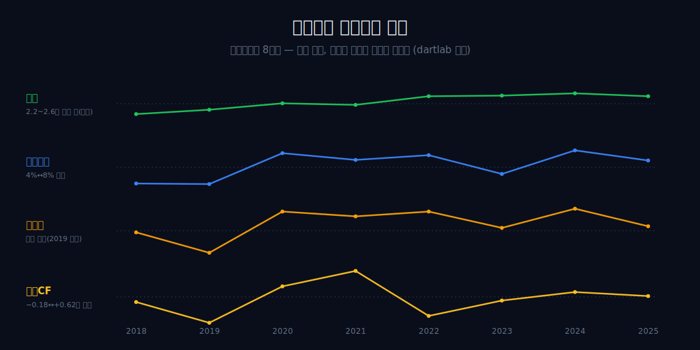
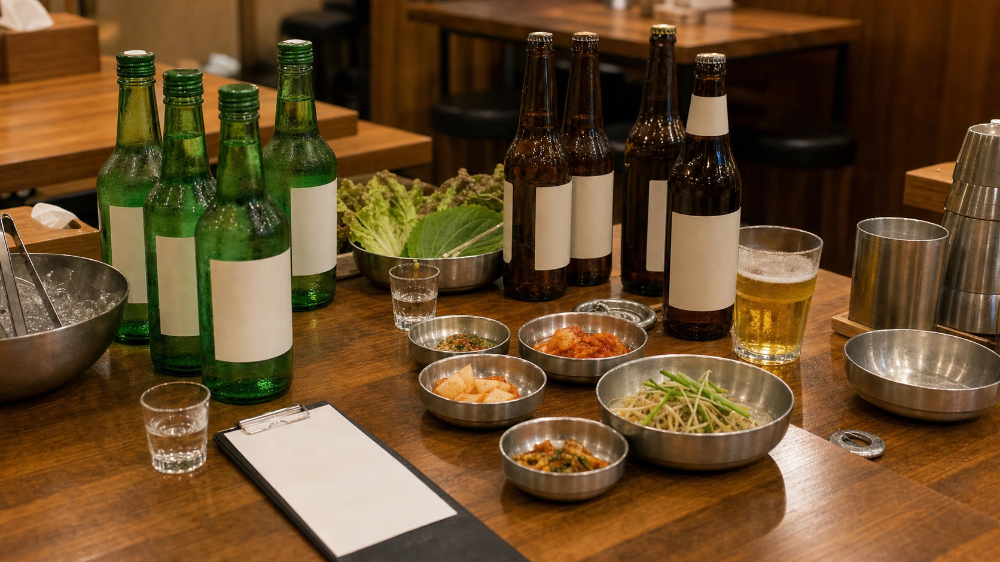
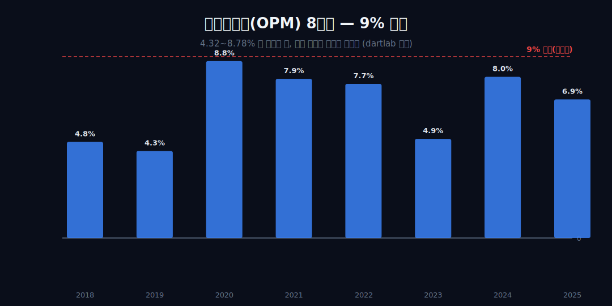
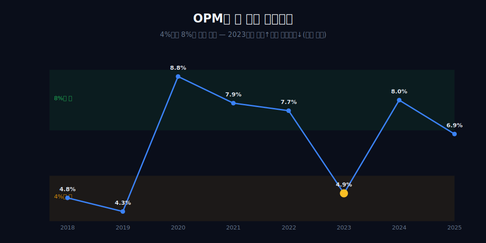
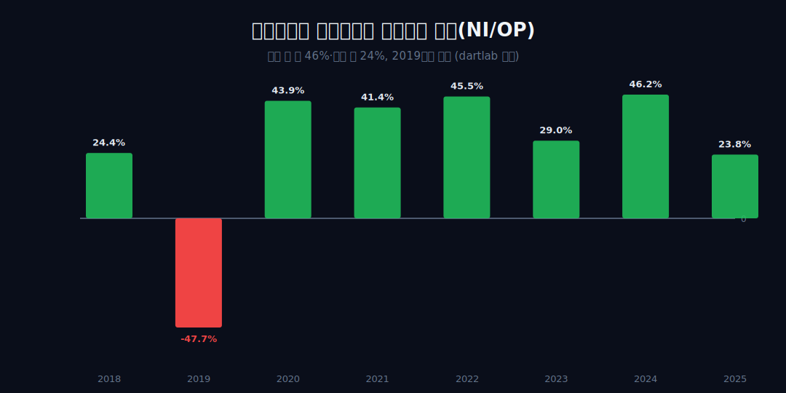
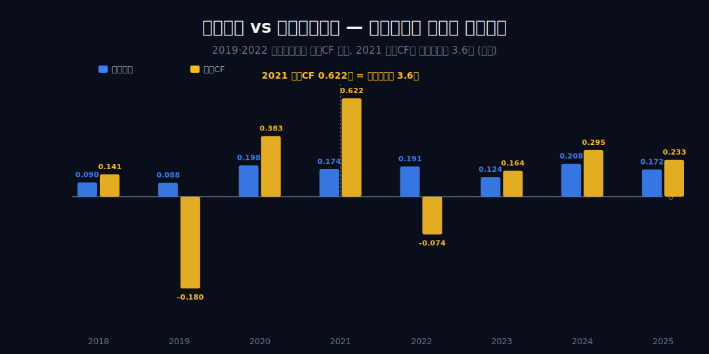
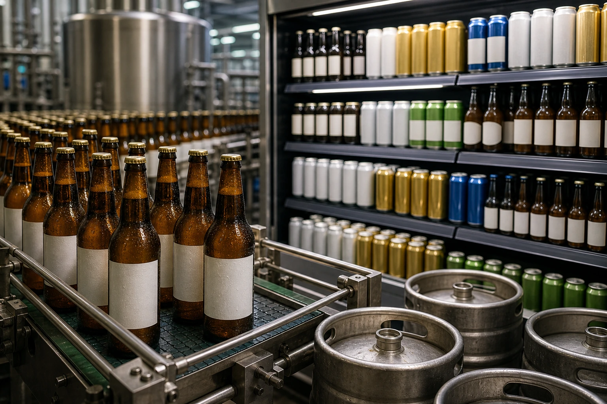
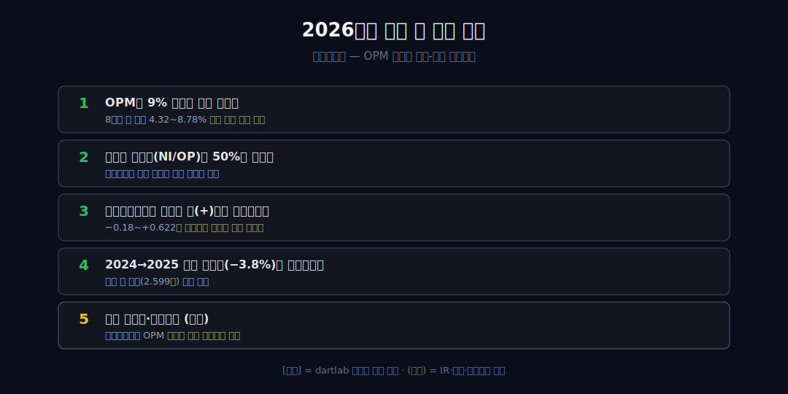

<script>
	import CompanyFinancials from '$lib/components/blog/CompanyFinancials.svelte';
import ComboChart from '$lib/components/blog/ComboChart.svelte';
</script>

> **데이터 기준**: 2026-06-20 dartlab 실측 — 하이트진로(000080) **연결(KRW)** 기준, 분기 데이터를 역년으로 합산. 2026Q1 최신 수치는 DART 2026년 1분기보고서(2026-05-15 접수)와 dartlab `2026Q1` 연결 값으로 재확인했다. 소주·맥주 시장점유율, 테라(2019)·켈리(2023) 출시와 마케팅비, 주류 종량세 전환(2020), 주정·맥아·호프 등 원재료 가격은 연결 손익에 분해되지 않으므로 **[외부 인용]**으로 표기하며 dartlab 연결로는 증명되지 않는다. 특히 **연결 손익 한 덩어리에는 소주 사업과 맥주 사업을 가르는 줄이 없다** — 사업별 마진 비교는 일절 내부 수치로 제시하지 않는다.
>
> **핵심 숫자**: 매출 **2020년 이후 2.203~2.599조** 좁은 띠(2018→2024 **+37.8%**, 2024→2025 **−3.8%**) · OPM **4.32~8.78%** 진동(8년간 9% 미돌파) · 순이익 **−0.042~+0.096조**(부호 전환) · 영업현금흐름 **−0.18~+0.622조**(흑자 해에도 음수)
>
> **이 글의 용어**: OPM(영업이익률) = 영업이익/매출, 매출 1원당 본업 이익 · NPM(순이익률) = 순이익/매출, 세금·금융손익까지 뗀 최종 비율 · NI/OP 전환율 = 순이익/영업이익, 본업이익이 최종까지 살아남는 비율 · 영업CF = 영업활동현금흐름, 손익이 아니라 실제 통장에 들어온 현금 · 종량세 = 술의 양(L)에 매기는 세금, 2020년 맥주·탁주가 가격기준에서 전환[외부] · 정합/양립 = 데이터가 인과를 증명 못 해 '같이 일어난 두 관찰'까지만 두는 것.

---

## 프롤로그 — 절반을 쥔 회사의 장부를 위에서 아래로 읽으면

"잘되는 사업(소주)과 못 이기는 싸움(맥주)을 한 지갑으로 굴리는 회사" — 하이트진로를 떠올릴 때 누구나 그리는 그림이다. 그런데 우리가 손에 쥔 건 연결 손익 한 덩어리뿐이고, 거기엔 소주와 맥주를 가르는 줄이 없다. 그래서 이 글은 '두 게임' 서사를 증명하려 하지 않는다.

대신 점유율·맥주전쟁·세제를 전부 지워도 무너지지 않는 단 하나의 사실에서 출발한다. **매출은 좁은 띠에 정체됐는데, 그 아래 이익과 현금은 부호가 바뀔 만큼 출렁인다.** 변동성이 윗줄이 아니라 아랫줄에 산다는 것.



8년치 네 줄(매출 → 영업이익 → 순이익 → 영업현금흐름)을 위에서 아래로 한 칸씩 내려가며, '절반을 쥔 지위'가 어느 줄에 찍히고 어느 줄에서 증발하는지를 따라간다. 용어는 그때그때 일상어로 풀고, 외부 사실은 [외부 인용]으로 분명히 떼어 둔다.



---

## 1막 — 천장의 발견: 가장 좋은 해조차 왜 9%를 못 넘나

**매출이 1.886조에서 2.599조로 약 38% 커지는 8년 동안, 왜 영업이익률은 한 번도 9%를 넘지 못했는가?**

```python
import dartlab
c = dartlab.Company("000080")
c.select("IS", ["매출액", "영업이익"], freq="Q")  # 분기→역년 합산
```

8년 OPM 레인지는 최저 4.32%(2019)에서 최고 8.78%(2020). 결정적인 한 줄은 이것이다 — 매출이 가장 큰 2024년(2.599조)의 OPM 8.00%가, 매출이 더 작은 2020년(2.256조)의 8.78%보다 **오히려 낮다.** 규모가 커져도 마진 수준이 따라 오르지 않았다. 매출 성장이 마진으로 전환되지 않았다는 관찰까지만 둔다.



첫 막은 '천장이 존재한다'는 내부 사실만 세운다. 점유율·가격결정력 같은 외부 해석으로 비약하지 않는다. **[외부 인용]** 하이트진로 소주 점유율이 약 60%대(2023 약 67%로 보도)라거나([인사이트코리아](http://www.insightkorea.co.kr/news/articleView.html?idxno=111329)), 맥주에선 오비맥주(2024 제조사 점유율 약 46.75%)에 밀린 도전자라는 사실은 외부 영역이다. 그 지위가 왜 한 자릿수 마진과 공존하는지를, 다음 막부터 손익의 아랫줄에서 찾는다.

---

## 2막 — 진동하는 띠: 마진은 왜 두 층 사이를 오가나

**천장이 있다면 그 아래는 안정적이어야 할 텐데, OPM은 왜 4%대와 8%대라는 두 층을 톱니처럼 오가는가?**

OPM 궤적은 4%대(2018 4.77·2019 4.32) → 8%대(2020 8.78·2021 7.90·2022 7.65) → 4.92(2023) → 8.00(2024) → 6.88(2025). 한 방향 추세가 아니라 두 층 사이의 진동이다. 결정적 단절은 **2023년** — 매출은 2.498→2.520조로 늘었는데 영업이익은 0.191→0.124조로 약 35% 급감(OPM 7.65→4.92)했다. 매출이 느는 해에 이익이 주는 이 한 해는, 비용이 매출과 무관하게 계단식으로 뛰었다는 내부 증거다.



무엇이 2023년 비용을 밀어 올렸는지는 봉인한다. **[외부 인용]** 켈리가 2023년 4월 출시돼 '테라·켈리 투트랙'으로 맥주 1위 탈환을 천명했고([한국경제](https://www.hankyung.com/article/2024010925091)), 그해 광고선전비가 약 2,458억 원으로 전년 대비 약 33% 늘었다는 보도([블로터](https://www.bloter.net/news/articleView.html?idxno=608219))는 시점이 겹친다. 또 2020년 맥주·탁주 종량세 전환([전자신문](https://www.etnews.com/20191231000107))과 2022년 전후 주정·수입 호프 급등도 비용 환경의 외부 맥락이다. 그러나 신제품·광고비·원가를 OPM 저점의 *원인*으로 단정하지 않는다 — 시점 겹침(정합)까지만이다. 원가가 마진을 흔들었다는 것은 매출총이익(GPM)이 있어야 증명되는데, 그 줄은 이 시계열에 없다.

---

## 3막 — 사라지는 절반: 영업이익은 어디서 순이익으로 새나

**영업단의 진동은 봤다. 그렇다면 영업이익이 순이익으로 내려오는 동안, 매년 얼마나 살아남는가?**

```python
c.select("IS", ["영업이익", "당기순이익"], freq="Q")  # 전환율 = 순이익/영업이익
```

NI/OP 전환율은 좋은 해(2020 43.9%·2022 45.5%·2024 46.2%)와 나쁜 해(2018 24.4%·2023 29.0%·2025 23.8%)로 갈리고, **2019년은 영업이익 +0.088조인데 순이익 −0.042조로 전환율이 음수다.** 가장 좋은 해조차 영업이익의 절반 남짓(약 46%)만 순이익으로 남는다.



다만 24~46%라는 진폭은 '매년 똑같이 절반 새는 만성 구조'라기보다, 좋은 해엔 안정적이고 나쁜 해에 떨어지는 '진동'에 더 가깝다. 이 글은 '구조적 누수'로 단정하지 않는다 — 금융손익·법인세·영업외 같은 영업선 아래 항목의 분해는 이 내부 시계열만으로는 불가능하다. 영업단 아래에서 절반이 갈리는데 그 정체가 항목으로 안 잡힌다는 사실이, 다음 막의 질문(현금은 더 멀리 어긋나는가)으로 넘어간다. 손익이 아니라 현금이 진짜를 말한다는 점에서는 [현대건설](/blog/000720-hyundai-enc)과 같은 계열의 독법이다.

---

## 4막 — 손익이 거짓말하는 해: 흑자인데 왜 현금이 마이너스인가

**순이익이 영업이익의 절반만 남는 것까지 봤다. 그런데 손익이 흑자인 해에 통장(영업현금흐름)은 왜 마이너스가 되는가?**

```python
c.select("CF", ["영업활동현금흐름"], freq="Q")  # 손익과 다른 박자
```

2019년 영업이익 +0.088조인데 영업CF −0.18조(괴리 약 0.268조), 2022년 영업이익 +0.191조(OPM 7.65%, 호실적)인데 영업CF −0.074조(괴리 약 0.265조). 본업에서 흑자를 냈다고 보고된 해에 현금이 빠져나간다 — 손익과 현금이 따로 논다. 장부상 장사는 잘됐다는데 통장엔 돈이 없는 해다.



원인은 운전자본(재고·매출채권 증가 등)일 수도, 영업외 현금유출일 수도 있다. 그러나 내부 시계열만으로는 '손실 예고'로 단정하지 않고 '손익-현금 디커플링'까지만 증명한다. 특히 '소주에서 번 현금으로 맥주전쟁을 친다'는 그림은 매력적이지만, 흑자 해(2019·2022)에 오히려 현금이 빠진 두 해와 충돌하므로 쓰지 않는다. 흑자 해에 현금이 빠진다면, 반대로 평범한 해에 현금이 폭발하는 해는 무엇을 말하는가 — 5막.

---

## 5막 — 현금이 폭발하는 해: 2021년은 왜 영업이익의 3.6배를 벌었나

**흑자 해에 현금이 마이너스였다면, 그 반대편 — 평범한 손익 위에서 현금이 폭발하는 해 — 는 같은 회사 안에서 어떻게 공존하는가?**

4막과 정반대로, 2021년 영업이익 0.174조인데 영업CF 0.622조(약 **3.6배**), 2020년도 영업이익 0.198조 대비 영업CF 0.383조(약 1.9배)다. 2020~2021년 합산하면 영업이익 0.372조 vs 영업CF 1.005조(약 2.7배). 같은 회사가 2019·2022엔 현금 마이너스, 2020·2021엔 영업이익의 약 2~3.6배를 현금으로 거뒀다.

결정적인 건 **2021→2022 한 칸**이다. 영업이익은 0.174→0.191조로 오히려 *늘었는데*, 영업현금흐름은 +0.622조에서 −0.074조로 한 해 만에 약 **0.696조가 증발**하며 부호가 뒤집혔다. 현금전환(영업CF/영업이익)이 3.6배에서 음수로 내려앉은 것이다. 산업가의 점유율·마케팅 프레임으로는 전혀 안 보이고, 오직 내부 현금-회계 시계열만 드러내는 한 장면이다.

핵심은 어느 해가 옳은가가 아니라, **영업CF가 −0.18조에서 +0.622조까지 약 0.8조 폭으로 출렁인다**는 변동성 그 자체다. 손익의 안정성(OPM은 한 자릿수 좁은 띠)과 현금의 불안정성이 한 회사 안에 공존한다. 이는 운전자본이 손익을 압도한다는 신호와 정합하나, 특정 원인으로 단정하지 않는다. 같은 '손익은 얇은데 현금은 다른 박자'라는 무늬는, 정유사 [S-Oil](/blog/010950-s-oil)이 훨씬 큰 진폭으로 보여주는 것과 같은 종류의 독법이다. 그렇다면 절반을 쥔 지위는 결국 손익의 어느 줄에 찍히는가 — 6막.

---

## 6막 — 절반을 쥐고도 새는 구조: 지위는 손익 어느 줄에 찍히나

**마진 천장·전환 누수·현금 변동성을 합치면, 시장 절반을 쥔 지위는 결국 손익의 어느 줄에 나타나고 어느 줄에는 나타나지 않는가?**

세 겹을 합치면 하나의 그림이 선다. 매출은 2020년 이후 2.203~2.599조의 좁은 띠로 정체되며 안정적이고, 순이익은 절대액이 0.022→0.096조로 늘되 NPM은 4%를 못 넘고(최고 3.86%) 2025년 1.64%로 회귀, 영업CF는 부호가 바뀌며 출렁인다. **즉 변동성은 윗줄이 아니라 아랫줄에 있다.**

외부의 점유율·맥주전쟁·세제·원가는 이 패턴과 시점이 겹칠 뿐(정합)이고, 연결 손익 한 덩어리에는 소주·맥주를 가르는 줄도 점유율 줄도 없다 — 그래서 '두 게임을 한 지갑으로'는 매력적이되 내부로는 증명 불가능한 외부 가설이다. 내부 시계열이 증명하는 결론은 하나다. **안정성은 매출 줄에만 머물고, 그 아래로 내려갈수록 구조가 샌다.** 지배적 점유율로 가격을 굳히지 못한다는 점에선, 가격을 끝내 못 정하는 [코스맥스](/blog/192820-cosmax)나 규제 해자 위에서도 마진을 못 지킨 [KT&G](/blog/033780-ktng)와 결이 닿고, 같은 식음료 박리 구조는 [농심](/blog/004370-nongshim)에서도 보인다.



**[외부 인용]** 해외 매출 비중은 약 8.5%로 낮지만 소주 수출이 5년 연평균 약 26% 늘었고, 베트남 공장을 2025년 말 완공해 2030년 해외 소주 5,000억 원을 목표한다는 전망([businesspost](https://www.businesspost.co.kr/BP?command=article_view&num=394831))과, 맥주 출고가 평균 2.7% 인상 같은 가격 정책은 전부 외부 영역이며, 그것이 위 세 줄의 진동을 좁힐지 넓힐지는 내부 수치가 답하지 않는다.

---

## 2026 Q1 업데이트 — 처음 넘은 9%, 그러나 성장의 9%는 아니다

2026년 1분기 DART 공시를 붙이면 하이트진로의 가장 중요한 문장이 바뀐다. 2018~2025 연간 표에서는 OPM이 9%를 한 번도 넘지 못했다. 그러나 2026Q1 분기 OPM은 9.47%다. 연결 기준 매출 5,908억원, 영업이익 559억원, 순이익 358억원이다. 기존 글이 말한 "9% 천장"은 연간 기준으로는 맞지만, 최신 분기 기준으로는 이미 한 번 뚫렸다.

그런데 이걸 곧장 구조 개선이라고 쓰면 틀린다. 2025Q1과 비교하면 매출은 6,128억원에서 5,908억원으로 -3.6%, 영업이익은 627억원에서 559억원으로 -10.8%, 순이익은 380억원에서 358억원으로 -5.8% 줄었다. OPM만 보면 좋아 보이지만, 전년 Q1 OPM은 10.24%였다. 즉 2026Q1은 9%를 넘은 분기이지만, 전년 동기보다 margin이 좋아진 분기는 아니다.

이 차이를 정확히 써야 한다. 2026Q1은 2025Q4의 부진에서 회복한 분기다. 2025Q4는 매출 5,697억원, 영업손실 92억원, 순손실 637억원, 영업CF -172억원이었다. 그 다음 분기인 2026Q1은 매출 5,908억원, 영업이익 559억원, 순이익 358억원, 영업CF 1,034억원이다. 전분기 대비로는 손익과 현금이 모두 크게 회복됐다. 그러나 전년 동기 대비로는 매출과 이익이 줄었다. 한 방향으로만 요약하면 놓친다.

이 분기의 진짜 신호는 현금이다. 2026Q1 영업현금흐름은 1,034억원으로 순이익 358억원의 2.89배다. 기존 글에서 하이트진로의 문제는 손익과 현금이 같은 박자로 움직이지 않는다는 점이었다. 2019·2022에는 흑자 해인데 영업CF가 음수였고, 2021에는 영업CF가 영업이익의 3.6배였다. 2026Q1도 같은 계열이다. 손익이 회복된 것보다 현금이 더 크게 붙었다.

그래서 Q1을 읽는 질문은 "9%를 넘었나"에서 끝나면 안 된다. 질문은 세 개다. 첫째, 이 9%대 OPM이 연간으로 이어지는가. 둘째, 매출 감소 없이 margin을 유지할 수 있는가. 셋째, 영업CF가 계속 양수로 안정되는가. Q1은 첫 번째 질문에 가능성을 보여줬지만, 두 번째 질문에는 아직 답하지 못했다. 매출은 줄었기 때문이다.

하이트진로의 사업을 소주와 맥주로 나누고 싶은 유혹은 크다. 하지만 연결 손익계산서에는 그 줄이 없다. 2026Q1에서도 마찬가지다. 매출과 영업이익이 줄었다고 해서 맥주 때문이라고 단정할 수 없고, OPM 9.47%를 소주 방어력으로 바로 연결할 수도 없다. DART 연결 수치로 증명되는 것은 전사 매출, 전사 이익, 전사 현금뿐이다. 사업별 원인은 공시 주석이나 회사 설명이 있어야 한다.

그럼에도 2026Q1은 기존 글을 더 강하게 만든다. 변동성은 여전히 윗줄보다 아랫줄에 산다. 매출은 5,908억원으로 전년보다 줄었는데, OPM은 9%대에 있고, OCF는 1,034억원으로 순이익보다 훨씬 크다. 즉 매출 한 줄만 보면 약한 분기이고, OPM만 보면 괜찮은 분기이며, 현금흐름까지 보면 더 강한 분기다. 같은 분기를 세 줄이 다르게 말한다.

### 2026Q1 이후 천장의 의미

이제 "9% 천장"이라는 표현은 더 조심해야 한다. 연간 기준으로는 2018~2025 동안 9%를 넘지 못했다. 분기 기준으로는 2026Q1에 9.47%를 찍었다. 이 둘은 모순이 아니다. 연간 천장을 뚫으려면 한 분기만이 아니라 네 분기 합산에서도 9%에 접근해야 한다. Q1 하나가 좋은 것은 시작점이지 결론이 아니다.

더 중요한 것은 margin이 매출 성장과 같이 왔는가다. 2026Q1은 아니다. 매출은 줄고 margin은 높은 분기였다. 비용 관리나 제품 mix가 좋았을 수 있지만, 연결 재무제표만으로는 원인을 닫지 않는다. 그래서 2026년의 좋은 답은 "OPM 9%대"만이 아니다. 좋은 답은 매출이 다시 2024년 상단에 가까워지면서 OPM이 9%대에 남고, OCF도 양수로 유지되는 것이다.

2025Q4에서 2026Q1로 넘어온 회복은 분명하다. 그러나 하이트진로의 구조적 질문은 남는다. 시장 지위가 전사 매출을 떠받치는가. 그 지위가 영업이익률을 연간 9% 이상으로 올리는가. 그 영업이익이 순이익과 현금으로 안정적으로 남는가. Q1은 첫 번째와 세 번째 일부에 답을 줬지만, 두 번째는 연간으로 다시 봐야 한다.

### 같은 9%라도 두 종류가 있다

OPM 9%는 좋은 숫자다. 하지만 하이트진로에서 9%의 의미는 두 갈래다. 매출이 늘면서 9%가 나오면 가격 지위 또는 mix 개선의 신호가 될 수 있다. 매출이 줄면서 9%가 나오면 비용 조절 또는 분기 mix의 신호일 수 있다. 2026Q1은 후자에 가깝다. 매출은 전년 동기보다 줄었고, 영업이익도 줄었다. 비율은 높지만 외형은 약해졌다.

그래서 이 분기를 "수익성 회복"이라고만 쓰면 절반만 맞다. 2025Q4 대비로는 회복이다. 2025Q4 OPM -1.62%에서 2026Q1 9.47%로 올라왔으니 손익 정상화는 분명하다. 그러나 2025Q1 대비로는 OPM 10.24%에서 9.47%로 낮아졌다. 같은 숫자라도 비교 기준이 전분기인지 전년 동기인지에 따라 결론이 바뀐다. 분기 실적 글에서 가장 흔한 오류가 바로 이 기준 혼합이다.

연간 글의 문장도 수정해야 한다. "8년간 9%를 못 넘었다"는 연간 합산 기준의 사실이다. 최신 분기에서 9%를 넘은 것은 별도의 사실이다. 그러므로 앞으로는 "연간 9% 미만의 회사가 2026Q1에 분기 9%를 찍었다"라고 써야 한다. 이 문장이 길지만 정확하다. 하이트진로의 상태는 짧은 라벨로 닫히지 않는다.

### 매출 감소가 더 중요한 이유

2026Q1에서 더 불편한 줄은 매출이다. 5,908억원은 전년 동기보다 -3.6%다. 하이트진로는 2020년 이후 매출이 2.2~2.6조원 띠에 갇혀 있었다. 이 띠의 상단은 2024년 2조5,992억원이었다. 2025년은 2조4,986억원으로 내려왔다. Q1의 전년 대비 감소는 이 상단 회복이 아직 시작되지 않았다는 신호다.

주류 회사에서 매출 감소와 margin 개선은 같이 올 수 있다. 프로모션을 줄이고, 수익성 낮은 판매를 줄이고, 비용을 줄이면 매출은 줄어도 이익률은 유지될 수 있다. 하지만 이 경우에는 성장의 질을 따로 물어야 한다. 단가가 오른 것인지, 물량이 줄어든 것인지, 제품 mix가 바뀐 것인지, 비용이 일시적으로 내려간 것인지가 다르다. 연결 손익표는 여기까지 답하지 않는다.

그래서 하이트진로의 2026년 핵심은 매출과 OPM의 동행이다. 매출이 다시 늘면서 OPM이 9%대에 남으면 좋은 답이다. 매출이 줄어야만 OPM이 9%대에 남으면 방어적 답이다. 매출도 줄고 OPM도 내려가면 구조적 압박이다. Q1은 두 번째 가능성을 열어둔 상태다.

### 현금은 이번에도 별도 언어를 썼다

Q1 영업CF 1,034억원은 강하다. 순이익 358억원의 2.89배다. 이 숫자는 2025Q4의 -172억원에서 크게 돌아섰다. 기존 글의 현금 프레임으로 보면, 하이트진로는 또 한 번 손익보다 현금이 더 큰 폭으로 움직인 분기를 냈다. 손익계산서는 회복이라고 말하고, 현금흐름표는 회복 폭이 더 크다고 말한다.

하지만 이것도 좋다고만 쓰면 안 된다. 하이트진로는 과거에도 2021년 OCF 6,222억원처럼 매우 큰 현금 유입을 보였고, 2022년에는 영업이익이 1,906억원인데 OCF가 -740억원이었다. 현금이 좋았던 분기나 해가 곧 구조적 안정성을 뜻하지 않는다. 오히려 이 회사는 OCF가 크게 출렁이는 회사다. Q1의 강한 OCF는 다음 분기에도 이어지는지 봐야 한다.

현금의 반복성을 보려면 영업CF뿐 아니라 재고, 매출채권, 매입채무의 방향도 봐야 한다. 블로그 본문은 그 세부표를 지금 직접 열어 분해하지 않는다. 이 글의 경계는 연결 주요 재무제표다. 다만 Q1의 OCF가 순이익보다 훨씬 크다는 사실은 충분히 강한 신호다. 다음 공시에서 그 차이가 어떻게 줄어드는지, 또는 더 벌어지는지를 봐야 한다.

### 사업별 설명을 쓰고 싶은 유혹을 막는다

하이트진로 글에서 가장 쉬운 길은 "소주는 버티고 맥주는 흔들렸다"라고 쓰는 것이다. 독자도 익숙하고, 산업 이야기도 된다. 그러나 이 글의 규칙은 다르다. 연결 손익표에 소주와 맥주 손익이 분해되어 있지 않으면, 사업별 원인을 내부 수치처럼 쓰지 않는다. 2026Q1도 마찬가지다. 전사 매출과 전사 이익은 알 수 있지만, 사업별 margin은 이 표만으로 알 수 없다.

물론 외부 자료나 회사 설명이 있으면 부문별 이야기를 붙일 수 있다. 그때도 문장 구조는 분리해야 한다. "DART 연결 수치로는 전사 매출 -3.6%, 영업이익 -10.8%다. 회사 설명 또는 별도 자료에 따르면 특정 사업이 영향을 줬다"처럼 써야 한다. 연결표가 말한 것과 외부 설명이 말한 것을 한 문장에 섞지 않는다.

이 경계가 글을 약하게 만드는 게 아니다. 오히려 강하게 만든다. 시장에서는 하이트진로를 소주/맥주 서사로 너무 쉽게 설명한다. 이 글은 그 서사를 지우고도 남는 내부 사실을 붙잡는다. 매출은 좁은 띠에 있고, margin은 분기와 연간에서 다르게 움직이며, 현금은 손익보다 더 크게 흔들린다. 이 세 줄은 사업별 설명 없이도 충분히 강하다.

### 이 글이 틀리는 조건

하이트진로 글이 틀리려면 세 가지가 필요하다. 첫째, 연간 OPM이 9%를 넘고 그 상태가 이어져야 한다. 그러면 한 자릿수 천장이라는 표현은 약해진다. 둘째, 매출이 2024년 상단을 회복하면서 margin도 같이 좋아져야 한다. 그러면 "지위가 매출만 떠받치고 이익에는 덜 남는다"는 문장을 고쳐야 한다. 셋째, 영업CF가 순이익과 비슷한 배율로 안정되어야 한다. 그러면 현금 변동성 프레임도 약해진다.

반대로 매출이 줄거나 정체된 상태에서 분기별 OPM만 들쭉날쭉하고, 영업CF가 다시 큰 폭으로 흔들리면 기존 결론은 강화된다. 하이트진로는 강한 브랜드와 시장 지위가 있지만, 그 지위가 연결 손익의 아랫줄에서는 안정적 프리미엄으로 굳지 않는 회사라는 뜻이다. 2026Q1은 이 결론을 깨지 않았다. 다만 분기 9%라는 새로운 확인 지점을 추가했다.

### 9%를 넘은 뒤 더 어려워진 질문

분기 OPM 9.47%는 글을 쉽게 만들지 않는다. 오히려 더 어렵게 만든다. 9%를 한 번도 못 넘는 회사라면 결론은 단순하다. 수익성 천장이 있다고 쓰면 된다. 하지만 하이트진로는 2026Q1에 분기 9%를 넘었다. 이제 질문은 "넘었는가"가 아니라 "어떤 조건에서 넘었는가"다.

2026Q1의 조건은 매출 감소였다. 매출은 전년 동기보다 219억원 줄었다. 영업이익도 68억원 줄었다. 그런데 OPM은 9%대에 남았다. 이 조합은 비용과 mix가 일정 수준 방어됐다는 신호일 수 있지만, 성장과 수익성이 같이 좋아졌다는 신호는 아니다. 하이트진로가 더 강해졌다고 쓰려면 매출 감소 없이 같은 margin을 보여줘야 한다.

이 회사의 장부에서 9%는 숫자 하나가 아니라 문맥이다. 2025Q4의 -1.62%에서 2026Q1의 9.47%로 올라온 것은 정상화다. 2025Q1의 10.24%에서 2026Q1의 9.47%로 내려온 것은 둔화다. 두 문장이 동시에 맞는다. 그래서 Q1 업데이트는 기존 글에 한 줄을 덧붙인다. "분기 천장은 한 번 넘었지만, 성장의 천장을 넘은 것은 아니다."

### 브랜드 지위와 재무제표의 거리

하이트진로는 소비자가 이름을 아는 회사다. 그래서 브랜드 지위가 재무제표에 곧바로 찍힐 것처럼 보인다. 하지만 연결 손익표는 더 냉정하다. 2018~2025 매출은 2.2~2.6조원 띠에 있었고, 영업이익률은 5~8%대에서 움직였다. 강한 이름이 곧바로 두 자릿수 margin으로 번역되지는 않았다.

2026Q1도 같은 거리감을 보여준다. 브랜드 지위가 약해졌다고 말할 수는 없다. 그러나 전년 동기 매출은 줄었다. 지위가 유지되어도 물량, 가격, 판촉, 원가, mix가 손익을 흔든다. 이름이 강하다는 말과 재무제표가 강하다는 말 사이에는 여러 줄이 있다. 이 글은 그 줄을 건너뛰지 않는다.

이 거리감을 무시하면 글은 편해지지만 약해진다. "소주 강자라서 괜찮다"는 말은 손익계산서의 어느 줄을 설명하는지 불명확하다. "맥주가 문제라서 어렵다"는 말도 연결표만으로는 닫히지 않는다. 반대로 매출, OPM, 순이익, OCF를 순서대로 읽으면 브랜드 서사를 쓰지 않아도 회사의 긴장이 보인다. 강한 지위가 있지만, 그 지위가 항상 두꺼운 이익으로 남지는 않는다.

### 현금 회복을 어떻게 판정할 것인가

2026Q1 OCF 1,034억원은 분명 좋은 숫자다. 하지만 하이트진로의 현금 문제는 좋은 분기가 없어서 생긴 것이 아니다. 오히려 너무 좋은 분기와 너무 나쁜 분기가 섞여 있었다. 2021년 OCF 6,222억원은 매우 컸고, 2022년 OCF -740억원은 같은 회사의 다른 얼굴이었다. 2025년 OCF 2,326억원도 나쁘지 않았지만 순이익 411억원과 격차가 컸다.

그래서 현금 회복의 판정 기준은 크기가 아니라 안정성이다. Q1처럼 순이익보다 OCF가 큰 분기는 좋다. 다만 그 격차가 다음 분기에 급격히 사라지거나 음수로 뒤집히면 여전히 변동성이 크다는 뜻이다. 반대로 OCF가 순이익보다 조금 크거나 비슷한 수준으로 여러 분기 이어지면, 현금 전환의 질이 좋아졌다고 쓸 수 있다.

여기서도 매출과의 동행이 중요하다. 매출이 줄어 재고나 채권 부담이 줄면서 현금이 좋아진 것인지, 매출이 늘면서도 현금이 좋아진 것인지는 다른 이야기다. 연결 현금흐름표만으로 원인을 닫을 수는 없지만, 다음 공시에서 매출 증가와 OCF 양수가 같이 나오면 더 강한 답이다. Q1은 현금 측면에서 좋은 출발이고, 성장 측면에서는 아직 질문을 남긴 출발이다.

### 2026년 말에 다시 써야 할 결론

2026년 연간 표가 닫히면 하이트진로 글의 결론은 세 갈래 중 하나가 된다. 첫째, 매출이 회복되고 OPM이 9% 이상이며 OCF가 양수로 안정되면, 이 글은 더 긍정적으로 바뀐다. 그때는 시장 지위가 손익과 현금으로 더 잘 남기 시작했다고 쓸 수 있다.

둘째, OPM은 9% 안팎이지만 매출이 약하면 방어적 개선이다. 비용과 mix로 margin은 지켰지만 성장의 답은 아직 없는 회사다. 셋째, 매출도 약하고 OPM도 다시 8% 아래로 내려가며 OCF가 흔들리면 기존 결론은 더 강해진다. 강한 브랜드를 가진 회사지만 연결 손익표에서는 좁은 띠와 큰 현금 변동성을 벗어나지 못한 것이다.

현재 Q1은 첫 번째 결론으로 가는 증거가 아니다. 두 번째와 첫 번째 사이의 중간 지점이다. 손익은 정상화됐고, 현금은 좋았으며, 매출은 약했다. 이 불균형 때문에 하이트진로는 계속 볼 가치가 있다. 모든 줄이 같은 방향으로 움직이는 회사보다, 이렇게 줄마다 다른 말을 하는 회사가 더 조심스러운 독해를 요구한다.

---

## 2026년에 봐야 할 다섯 가지

1. **연간 OPM이 9%를 넘는가** — 2026Q1은 9.47%였지만, 2018~2025 연간 표에서는 9%를 넘지 못했다. 분기 신호가 연간으로 이어지는지 본다.
2. **매출 감소 없이 margin을 유지하는가** — Q1 매출은 전년 동기 대비 -3.6%였다. 좋은 margin이 성장과 함께 오는지 확인한다.
3. **순이익 전환율(NI/OP)이 50%를 넘는가** — 2026Q1은 64.0%다. 이 전환율이 일회성이 아니라 반복되는지가 핵심이다.
4. **영업현금흐름이 안정적 양(+)으로 자리 잡는가** — Q1 OCF 1,034억원은 강했다. 기존의 음수 전환 패턴이 줄어드는지 본다.
5. **사업별 원인을 연결 수치와 섞지 않는가** — 소주·맥주·생수·해외 변수는 별도 공시와 회사 설명으로만 다룬다. 연결 손익 한 줄로 사업별 원인을 단정하지 않는다.



---

## 공시 / Filings

- [하이트진로 2026년 1분기보고서(DART)](https://dart.fss.or.kr/dsaf001/main.do?rcpNo=20260515001043) — 2026Q1 연결 손익계산서·현금흐름표 확인용.
- [하이트진로 2025년 사업보고서(DART)](https://dart.fss.or.kr/dsaf001/main.do?rcpNo=20260318000752) — 2025년 연간 연결 재무제표와 사업 설명 확인용.
- [하이트진로 DART 공시 목록](https://dart.fss.or.kr/dsab007/main.do?option=corp&textCrpNm=000080) — 정기보고서 원문 확인 입구.

---

## 재무 검증표 — 최근 4개년 (dartlab 연결, 억원)

```python
import dartlab
c = dartlab.Company("000080")
c.select("IS", ["sales","operating_profit","net_profit"], freq="Y")
```

| 항목 (억원) | 2022 | 2023 | 2024 | 2025 |
|---|---:|---:|---:|---:|
| 매출액 | 24,976 | 25,202 | 25,992 | 24,986 |
| 영업이익 | 1,906 | 1,239 | 2,081 | 1,723 |
| 당기순이익 | 868 | 355 | 957 | 411 |

```python
c.select("CF", ["operating_cashflow"], freq="Y")
```

| 항목 (억원) | 2022 | 2023 | 2024 | 2025 |
|---|---:|---:|---:|---:|
| 영업활동현금흐름 | -740 | 1,644 | 2,946 | 2,326 |

2022~2025년만 잘라도 본문 결론은 유지된다. 매출은 2.5조원 근처에 묶여 있고, 영업이익은 2023년에 낮아졌다가 2024년에 회복하고 2025년에 다시 줄었다. 영업CF는 2022년 음수에서 2024~2025년 양수로 돌아왔다. 2026Q1은 분기 값이므로 이 연간 검증표와 섞지 않고 업데이트 섹션에서 따로 본다.

---

## 재무제표 — 최근 8개년 (dartlab 연결, 조원)

> 연결(KRW)·분기 합산(역년) 기준. dartlab에서 직접 확인:
> ```python
> import dartlab
> c = dartlab.Company("000080")
> c.select("IS", ["매출액","영업이익","당기순이익"], freq="Q")
> c.select("CF", ["영업활동현금흐름"], freq="Q")
> ```

<ComboChart data={[{year:"2018",매출:1.886,영업이익:0.090,영업현금흐름:0.141},{year:"2019",매출:2.035,영업이익:0.088,영업현금흐름:-0.18},{year:"2020",매출:2.256,영업이익:0.198,영업현금흐름:0.383},{year:"2021",매출:2.203,영업이익:0.174,영업현금흐름:0.622},{year:"2022",매출:2.498,영업이익:0.191,영업현금흐름:-0.074},{year:"2023",매출:2.520,영업이익:0.124,영업현금흐름:0.164},{year:"2024",매출:2.599,영업이익:0.208,영업현금흐름:0.295},{year:"2025",매출:2.499,영업이익:0.172,영업현금흐름:0.233}]} lineKeys={["매출"]} barKeys={["영업이익","영업현금흐름"]} lineColors={["#16a34a"]} barColors={["#3b82f6","#f59e0b"]} title="매출(라인) vs 영업이익·영업현금흐름(막대) — 조원" unit="조" />

| 항목 (조원) | 2018 | 2019 | 2020 | 2021 | 2022 | 2023 | 2024 | 2025 |
|---|---:|---:|---:|---:|---:|---:|---:|---:|
| 매출 | 1.886 | 2.035 | 2.256 | 2.203 | 2.498 | 2.520 | 2.599 | 2.499 |
| 영업이익 | 0.090 | 0.088 | 0.198 | 0.174 | 0.191 | 0.124 | 0.208 | 0.172 |
| 순이익 | 0.022 | −0.042 | 0.087 | 0.072 | 0.087 | 0.036 | 0.096 | 0.041 |
| 영업이익률(OPM) | 4.77% | 4.32% | 8.78% | 7.90% | 7.65% | 4.92% | 8.00% | 6.88% |
| 순이익률(NPM) | 1.17% | −2.06% | 3.86% | 3.27% | 3.48% | 1.43% | 3.69% | 1.64% |
| 영업현금흐름 | 0.141 | −0.18 | 0.383 | 0.622 | −0.074 | 0.164 | 0.295 | 0.233 |

이 표를 한 줄로 읽으면 이렇다 — **매출 행은 2020년 이후 2.2~2.6조의 좁은 띠에서 거의 평평한데, 그 아래 영업이익률은 4%대와 8%대를 오가고, 순이익은 2019년에 한 번 0선을 뚫으며, 영업현금흐름은 흑자 해에도 음수가 된다.** 변동성이 위가 아니라 아래에 산다는 게 이 표의 핵심이고, 그 *원인*(맥주전쟁·세제·원가)은 이 표 어디에도 안 적혀 있다(외부).

---

## 검증표

본문 인용 수치를 dartlab 호출과 결과로 검증한다. 외부 출처(점유율·신제품·마케팅비·세제·원재료)는 분리 표기. 📅 dartlab 실측 2026-06-14 · 하이트진로(000080) 연결(KRW)·분기 합산 기준.

| 본문 수치 | 출처 / 호출 | 결과 |
|---|---|---|
| 매출 2020년 이후 2.203~2.599조(2018→2024 +37.8%) | `c.select("IS",["매출액"],freq="Q")` 합산 | ✓ 실측 |
| OPM 4.32%(2019)~8.78%(2020), 8년간 9% 미돌파 | 영업이익/매출 | ✓ 실측 |
| 2024 OPM 8.00% &lt; 2020 OPM 8.78%(매출은 2024가 큼) | 영업이익/매출 | ✓ 실측 |
| 2023 매출 +0.8%인데 영업이익 0.191→0.124조(−35%) | `c.select("IS",[...])` | ✓ 실측 |
| NI/OP 전환율 2019 음수(영업 +0.088·순익 −0.042조), 최고 46.2%(2024) | 순이익/영업이익 | ✓ 실측 |
| 영업CF 흑자해 음수: 2019 −0.18·2022 −0.074조 | `c.select("CF",["영업활동현금흐름"])` | ✓ 실측 |
| 2021 영업CF 0.622조 = 영업이익 0.174조의 약 3.6배 | 영업CF/영업이익 | ✓ 실측 |
| 영업CF 8년 레인지 −0.18~+0.622조 | 영업CF 합산 | ✓ 실측 |
| 소주 점유율 약 60%대·맥주 도전자(오비 46.75%) | [인사이트코리아](http://www.insightkorea.co.kr/news/articleView.html?idxno=111329) | 외부 인용·연결 증명 0 |
| 켈리 2023.4 출시·2023 광고선전비 약 2,458억(+33%) | [한국경제](https://www.hankyung.com/article/2024010925091) · [블로터](https://www.bloter.net/news/articleView.html?idxno=608219) | 외부 인용 |
| 2020 맥주·탁주 종량세 전환·원재료(주정·호프) 급등 | [전자신문](https://www.etnews.com/20191231000107) | 외부 인용 |
| 해외 비중 8.5%·소주 수출 연 26%·베트남 공장 | [businesspost](https://www.businesspost.co.kr/BP?command=article_view&num=394831) | 외부 인용 |
| 소주/맥주 사업별 손익 — 연결에 세그먼트 줄 없음 | dartlab 데이터 한계 | 주의/제외 |

본문의 숫자 중 이 표에 없는 것은 발행 차단 대상이다. 점유율·맥주전쟁·세제·원재료는 dartlab 연결로 증명되지 않는 외부 인용이며, 음의 영업CF는 손실의 '예고'가 아니라 운전자본 흡수와도 양립하는 부호 어긋남이고, 소주·맥주 사업별 마진 비교는 연결 손익에 줄이 없어 일절 내부 수치로 제시하지 않는다 — 연결이 증명하는 것은 '변동성이 매출이 아니라 이익·현금에 있다'는 위치까지다.

---

<CompanyFinancials code="000080" />
