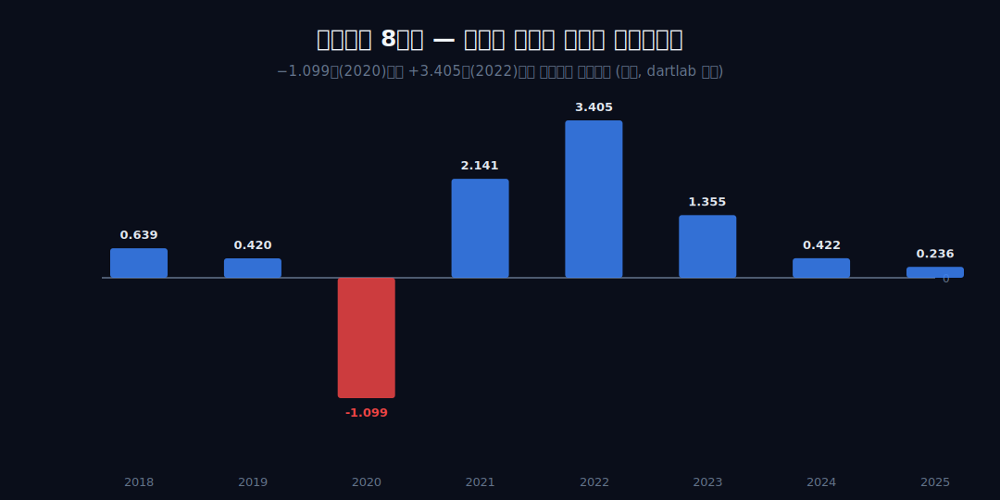
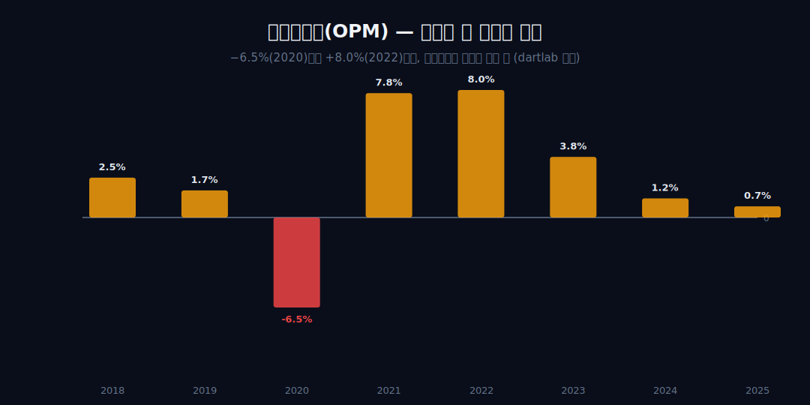
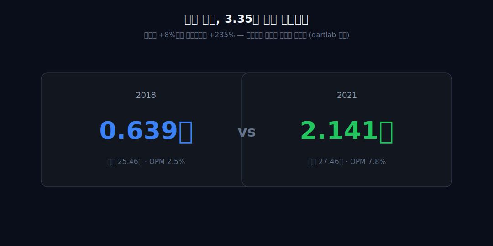
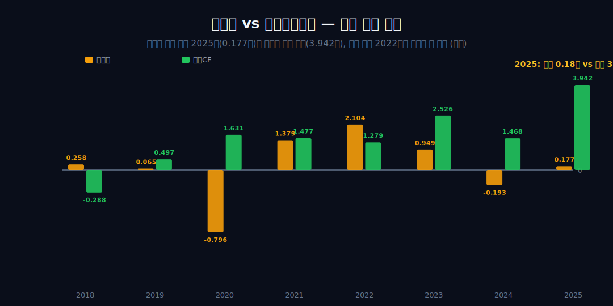
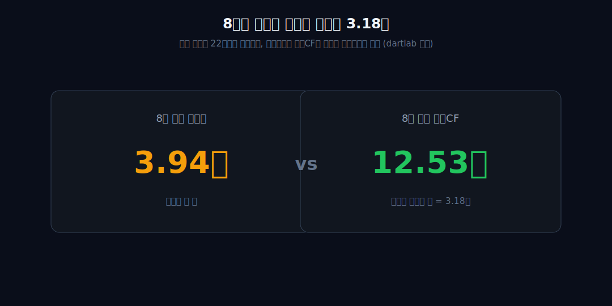
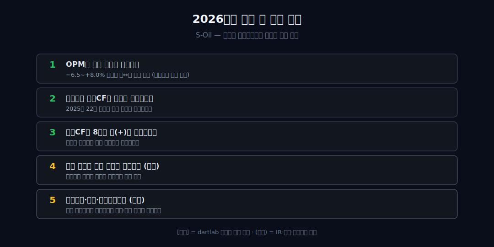

<script>
	import CompanyFinancials from '$lib/components/blog/CompanyFinancials.svelte';
import ComboChart from '$lib/components/blog/ComboChart.svelte';
</script>

> **데이터 기준**: 2026-06-20 dartlab 실측 — S-Oil(010950) **연결(KRW)** 기준, 분기 데이터를 역년으로 합산. 2026Q1 최신 수치는 DART 2026년 1분기보고서(2026-05-15 접수)와 dartlab `2026Q1` 연결 값으로 재확인했다. 정제마진(크랙 스프레드)·두바이유 등 유가·재고평가손익(FIFO)·아람코 투입계약·샤힌 프로젝트·사업부문(정유/석유화학/윤활)별 손익은 연결 손익 한 덩어리에 분해되지 않으므로 **[외부 인용]**으로 표기하며 dartlab 연결로는 증명되지 않는다. 내부에서 검증되는 것은 4개 시계열(매출·영업이익·순이익·영업현금흐름)의 상호 비동조까지다.
>
> **핵심 숫자**: 영업이익 **−1.099조(2020) ↔ +3.405조(2022)** 부호 전환 · OPM **−6.5~+8.0%**(진폭 14.55%p) · 2025 순이익 **0.177조** vs 영업CF **3.942조**(절대 격차 **+3.765조**) · 8년 누적 순익 **3.943조** vs 영업CF **12.532조**(약 **3.18배**)
>
> **이 글의 용어**: 가격수용자 = 투입·산출 가격을 회사가 못 정하고 시장이 정하는 위치 · OPM(영업이익률) = 영업이익/매출 · NPM(순이익률) = 순이익/매출 · 영업CF = 영업활동현금흐름, 손익이 아닌 실제 현금 · 정제마진(크랙 스프레드) = 석유제품가 − 원유가, 정유사가 받는 띠[외부] · 재고평가손익 = 원유 구매~판매 시차의 회계상 평가손익[외부] · 위상차/디커플링 = 두 지표가 같은 방향으로 안 움직이는 것.

---

## 프롤로그 — 같은 해 장부에 적힌 두 개의 다른 시각

한 회사의 같은 해 장부에서 '벌었다고 적힌 돈'과 '실제로 들어온 돈'이 한쪽은 0.177조, 한쪽은 3.942조라면 — 둘 중 하나가 거짓일까? S-Oil의 2025년이 그렇다. 그러나 이건 분식이 아니라 정유사라는 업종의 구조가 장부에 남기는 자연스러운 흔적에 가깝다.

이 글은 독자에게 두 개의 시계를 쥐여준다. 하나는 '손익(P&L)'이라는 빠른 시계, 하나는 '현금(CF)'이라는 느린 시계. 둘은 같은 회사를 가리키지만 같은 시각을 보지 않는다.



왜 정유사에서 두 시계가 어긋나는지, 그 출발점은 '이 회사는 사는 가격도 파는 가격도 자기가 못 정한다'는 한 가지 사실이다. 모든 진폭·격차 수치는 내부 4개 시계열로만 박고, 그 원인 후보(유가·정제마진·재고법·아람코·샤힌)는 전부 [외부 인용]으로 분리하며, 관찰과 인과 사이는 '정합'까지만 둔다.


---

## 1막 — 못 정하는 가격: 부호까지 바뀌는 마진

**이 회사의 영업이익은 얼마나 크게, 그리고 무엇에 동조해 흔들리는가? 매출이 정하는가?**

```python
import dartlab
c = dartlab.Company("010950")
c.select("IS", ["매출액", "영업이익"], freq="Q")  # 분기→역년 합산
```

정유사의 정체부터 박는다 — 원유(투입)도 석유제품(산출)도 국제가격이 정하고, 회사는 그 사이 정제마진만 받는 가격수용자다. 그 무력함의 가장 분명한 증거는 영업이익률(OPM)이 8년간 2.5 → 1.7 → −6.5 → 7.8 → 8.0 → 3.8 → 1.2 → 0.7%로 **부호까지 바꾼다**는 것(진폭 14.55%p)이다.



결정적 단서 하나 — 손익을 정하는 건 매출 규모(top line)가 아니다. 2024년과 2025년 매출은 36.637조에서 34.247조로 거의 평행(−6.6%)인데 영업이익은 0.422조에서 0.236조로 반토막 났다. 일상 비유로, 남이 정한 도매가에 사서 남이 정한 소매가에 파는 가게의 마진은 그 사이 푼돈이다. **[외부 인용]** 그 푼돈을 정하는 싱가포르 복합 정제마진이 분기당 $13~16/배럴대에서 회사 의지와 무관하게 변동하고([S-OIL 실적자료](https://www.marketscreener.com/quote/stock/S-OIL-CORPORATION-6491580/news/)), 두바이유가 2020년 연평균 약 $42에서 2022년 $96로 급변했다는 사실([한국경제 데이터센터](https://datacenter.hankyung.com/commodities/dubaif))은 외부다. 그 띠가 얼마나 얇길래 같은 매출도 결과가 갈리는가 — 2막.

---

## 2막 — 띠의 얇음: 같은 매출, 세 배 다른 이익

**매출이 비슷한 두 해가 왜 영업이익은 3배 넘게 갈리는가? 지렛대는 매출인가 비율인가?**

1막의 '얇은 띠'를 같은 매출대 비교로 증명한다. 2018년 매출 25.463조·OPM 2.5%·영업이익 0.639조. 2021년 매출 27.464조·OPM 7.8%·영업이익 2.141조. 매출 차이는 +8%인데 영업이익 차이는 **+235%(약 3.35배)**다.



영업이익의 지렛대는 매출 한 단위가 아니라 OPM 한 %p다. 이익의 분산을 설명하는 것은 규모가 아니라 비율이다. **[외부 인용]** 이 외생 띠(정제마진)가 OPM을 정한다는 것은 정합적인 산업 메커니즘이나, 내부 수치는 결과(OPM 분산)만 증명하고 원인은 단정하지 않는다. 같은 '사이클이 마진을 흔드는' 무늬는 석유화학사 [롯데케미칼](/blog/011170-lotte-chemical)·[금호석유화학](/blog/011780-kumho-petrochemical)이나 비철금속 [고려아연](/blog/010130-korea-zinc)에서도 보이는 가격수용자의 공통 지문이다. 그렇다면 영업단에서 흑자여도 최종 순익은 보장되나 — 3막.

---

## 3막 — 두 비율의 균열: 영업 흑자, 순익 적자

**영업이익이 +0.422조 흑자였던 2024년에 왜 순이익은 −0.193조 적자인가? 영업과 순익 사이에서 무엇이 부호를 다시 뒤집나?**

OPM과 NPM이 별개 비율임을 가장 날카롭게 보여주는 해가 2024다. 영업이익 +0.422조(OPM +1.15%)인데 순이익 −0.193조(NPM −0.53%) — 영업단에서 흑자여도 영업 아래 항목에서 부호가 뒤집힐 수 있다. 대조로, 2018은 영업 0.639→순익 0.258조(축소), 2022는 영업 3.405→순익 2.104조(축소)로 부호는 유지된다. **2024만 부호가 바뀐다.**

이는 1막의 '영업이익 진폭'과 다른 층위의 두 번째 변동축이다. 내부 수치는 영업이익≠순이익이라는 격차 자체만 증명하며, 그 구성요소(손익계산서 하단 항목)는 분해되지 않으므로 단정하지 않는다. 손익이 아니라 현금이 진짜를 말한다는 독법에선 [현대건설](/blog/000720-hyundai-enc)과 같은 계열이다. 영업도 순익도 출렁이는데, 실제 들어온 현금도 같이 출렁이나 — 4막.

---

## 4막 — 다른 박자: 순익 0.177조, 현금 3.942조

**순이익이 0.177조에 불과한 2025년에 영업현금흐름은 왜 그 격차가 +3.765조나 벌어진 3.942조인가? 버는 것과 들어오는 것이 사상 최대로 갈라진 이유는?**

```python
c.select("CF", ["영업활동현금흐름"], freq="Q")  # 손익과 다른 박자
```

관통선의 정점이다. 2025년 순익 0.177조 vs 영업CF 3.942조 — 절대 격차 **+3.765조**다(분모가 0에 가까워 배율로는 약 22배지만, 격차가 더 직접적인 표현이다). 대조가 결정적이다. 이익이 가장 컸던 2022년엔 순익 2.104조 vs 영업CF 1.279조로, **현금이 오히려 가장 적었다**(현금/순익 0.61배). 2018년은 순익 0.258조에 영업CF −0.288조로 현금이 유출됐다.



순익-현금 관계가 2018년 음수 → 2022년 0.61배 → 2025년 격차 +3.765조로 체계적으로 역전한다. 손익이 좋은 해에 현금이 마르고, 손익이 빈약한 해에 현금이 넘친다. **[외부 인용]** 재고평가손익(래깅·역래깅)이 원유 구매~판매 시차에서 생기는 회계상 손익일 뿐 현금 유입을 동반하지 않을 수 있다는 업계 설명([뉴스핌](https://www.newspim.com/news/view/20260427000852))과, S-Oil이 타 정유사(평균법)와 달리 재고에 FIFO(선입선출법)를 써 유가 등락이 손익에 더 크게 반영된다는 보도([이지경제](https://www.ezyeconomy.com/news/articleView.html?idxno=231149))는 외부 메커니즘이다. 그러나 '현금 격차 = 재고손익 때문'이라는 인과는 단정하지 않는다 — 증명되는 것은 위상 역전 자체다. 한 해는 격차가 이렇게 큰데, 8년을 합치면 어느 쪽이 큰가 — 5막.

---

## 5막 — 누적의 방향: 8년을 합치면 현금이 3.18배

**단일 연도의 위상 어긋남을 8년 전체로 누적하면, 이 회사는 손익으로 번 만큼 현금을 만들었나 — 아니면 더 만들었나?**

8년 순이익 합은 3.943조, 8년 영업CF 합은 12.532조 — 누적 영업CF가 누적 순익의 **약 3.18배**다. 단일 연도에선 격차가 사상 최대(+3.765조)까지 벌어지지만, 합치면 영업CF가 순익을 체계적으로 상회한다.



적자 해(2020 순익 −0.796조)에도 영업CF는 +1.631조 흑자였다는 사실이, 단일 연도 수준에서 이미 그 방향을 보여준다 — 부호가 가장 극적으로 갈린 해다. 증명되는 것은 '누적 영업CF > 누적 순익'이라는 방향뿐이다. '손익이 보수적으로 잡힌다'는 회계적 해석은 비현금비용(감가상각 등)이 큰지 손익이 보수적인지 내부 시계열만으로는 단정할 수 없으므로 두지 않는다. 누적으론 현금이 두툼한데, 무엇이 0 아래로 덜 떨어지나 — 6막.

---

## 6막 — 덜 흔들리는 층, 그리고 박자를 바꾸려는 시도

**손익은 8년 중 2년(2020·2024) 적자로 떨어졌지만 영업CF는 7년 양을 유지했다 — 이 회사에서 덜 흔들리는 층은 어디이고, 회사는 그 흔들림에 어떻게 대응하고 있나?**

변동성 층위가 종착점이다. 부호 전환 횟수를 세면, 순이익 2회(2020·2024) > 영업이익 1회(2020) > 영업CF 1회(2018, 단발)다. **영업CF는 2019~2025년 7년 연속 양(+0.497~+3.942조)으로 가장 둔감하다.** 손익은 못 정하는 두 가격 사이 얇은 띠라 부호까지 출렁이지만, 현금 층은 한 단계 더 평탄하게 양을 유지한다 — 이것이 두 시계 중 더 느린 박자다.


이 흔들림에 회사가 어떻게 대응하는지는 [외부]로만 둔다 — 정제마진을 더 잘 받자가 아니라 정제마진에 덜 의존하는 사업을 짓는 방향이다. **[외부 인용]** 사우디 아람코가 약 63.4% 최대주주이고 20년 장기 원유공급 계약으로 투입 원유 대부분을 조달하며([Wikipedia](https://en.wikipedia.org/wiki/S-Oil)), 약 9.258조원 규모 샤힌 프로젝트로 원유를 화학원료로 직접 전환해 2026년 상반기 기계적 준공을 목표한다는 것([아람코 코리아](https://korea.aramco.com/ko-kr/news-media/news/2022/aramco-affiliate-s-oil-to-build-one-of-the-worlds-largest-petrochemical-crackers-in-south-korea)), 그리고 윤활(기유) 부문이 2025년 4분기 5,821억원 흑자로 같은 분기 정유·석유화학 적자를 상쇄했다는 것([이지경제](https://www.ezyeconomy.com/news/articleView.html?idxno=231149))은 전부 외부 사실이다. 최근 두 해 OPM(1.2%·0.7%)이 8년 흑자 구간 최저점이라는 내부 사실과 다각화 투자 시점은 정합하나, '가격에 덜 휘둘리려는 의도'는 경영 판단이라 인과는 보류한다. 같은 '얇은 마진 위의 변동성'은 [하이트진로](/blog/000080-hite-jinro)가 훨씬 작은 진폭으로 보여준 것과 같은 종류의 독법이다.

---

## 2026 Q1 업데이트 — 손익은 급등, 현금은 음수

2026년 1분기 DART 수치를 붙이면 S-Oil의 두 시계는 더 멀어진다. 매출은 8조9,427억원으로 2025Q1 8조9,905억원과 거의 비슷했다. 그런데 영업이익은 -215억원에서 1조2,311억원으로 뛰었고, 순이익도 -446억원에서 7,210억원으로 흑자전환했다. OPM은 -0.24%에서 13.77%로 바뀌었다. 손익계산서만 보면 매우 강한 회복이다.

하지만 현금흐름표는 다른 말을 한다. 2026Q1 영업현금흐름은 -5,239억원이다. 전년 Q1 영업CF는 +7,924억원이었다. 즉 손익은 적자에서 대규모 흑자로 돌아섰는데, 현금은 양수에서 음수로 뒤집혔다. 기존 글의 핵심은 "순이익이 약한 해에 현금이 많다"였다. 2026Q1은 반대편 사례다. "순이익이 강한 분기에 현금이 빠질 수 있다." 둘 다 같은 결론으로 간다. 정유사는 손익과 현금을 한 줄로 묶으면 안 된다.

이 분기의 숫자는 2025년과 정확히 반대로 놓인다. 2025년 연간은 순이익 1,769억원, 영업CF 3조9,423억원이었다. 손익은 얇고 현금은 두꺼웠다. 2026Q1은 순이익 7,210억원, 영업CF -5,239억원이다. 손익은 두껍고 현금은 음수다. 한쪽만 보면 회사의 상태를 거꾸로 읽을 수 있다. 이게 이 글이 두 시계를 계속 분리하는 이유다.

Q1의 손익 급반등을 무엇으로 설명할지는 조심해야 한다. 정제마진, 유가, 재고평가손익, 래깅 효과는 모두 가능한 설명 후보지만, 이 글이 직접 증명하는 것은 결과다. 매출이 거의 비슷한데 영업이익이 크게 바뀌었다. 그리고 손익이 좋아졌는데 영업CF는 음수였다. 원인은 공시 주석과 회사 IR에서 따로 확인해야 한다. 연결 재무제표 한 줄로 "유가 때문에"라고 닫으면 안 된다.

그럼에도 투자자가 봐야 할 장면은 분명하다. 2026Q1 OPM 13.77%는 2018~2025 연간 표의 상단 8.0%를 크게 넘는다. 분기 기준으로는 손익 레버리지가 매우 강하게 작동했다. 하지만 같은 분기 OCF/NI는 -0.73배다. 순이익 1원당 현금이 들어온 것이 아니라 빠져나갔다. 그래서 이 분기는 "강한 손익"과 "약한 현금"이 동시에 있는 분기다.

S-Oil을 읽을 때 자주 생기는 오해가 있다. 정유사가 돈을 벌면 현금도 바로 좋아질 것이라고 보는 것이다. 실제로는 재고, 매출채권, 원유 구매 시점, 제품 판매 시점, 가격 변화가 현금흐름표를 따로 흔든다. 2026Q1은 그 오해를 깨는 사례다. 손익이 훌륭해도 영업CF가 음수일 수 있다. 반대로 2025년처럼 손익이 빈약해도 OCF가 매우 클 수 있다.

따라서 Q1 이후 S-Oil의 질문은 "흑자전환했나"가 아니다. 흑자전환은 했다. 질문은 "그 흑자가 현금으로 언제 들어오는가"다. 다음 분기에서 OCF가 양수로 돌아오면 Q1의 음수는 운전자본 timing으로 해석할 여지가 커진다. 반대로 손익이 좋았는데 OCF 음수가 반복되면 손익과 현금의 간극은 더 큰 경고가 된다.

### 2026Q1이 기존 글을 어떻게 강화하나

기존 글은 2025년을 중심으로 "순익 0.177조, 영업CF 3.942조"라는 양의 격차를 봤다. 그래서 손익이 약한 해에도 현금이 강할 수 있다고 썼다. 2026Q1은 반대 방향의 격차다. 손익은 강한데 현금은 약하다. 두 사례를 합치면 결론은 훨씬 강해진다. S-Oil의 손익과 현금은 단순히 가끔 어긋나는 것이 아니라, 서로 다른 시계로 움직인다.

이제 2026년에 볼 표는 두 개다. 첫째, 손익계산서의 영업이익과 순이익. 둘째, 현금흐름표의 영업CF와 운전자본 변동. 첫 번째 표만 보면 Q1은 강한 회복이다. 두 번째 표까지 보면 회복은 아직 현금으로 닫히지 않았다. 정유사에서 두 표 중 하나만 읽는 것은 반쪽 독해다.

마지막으로 샤힌 프로젝트와 다각화도 이 프레임 안에서 봐야 한다. 프로젝트가 완공되면 손익 구조가 바뀔 수 있다. 그러나 투자 사이클은 현금흐름표를 먼저 압박할 수 있다. 손익 개선과 현금 유출이 같은 시기에 존재할 수 있다는 점을 2026Q1이 이미 보여준다. 그래서 S-Oil의 다음 공시는 매출과 영업이익만 보지 않고, OCF와 투자CF까지 함께 읽어야 한다.

### 손익 급등을 좋은 뉴스로만 읽으면 빠지는 함정

2026Q1 OPM 13.77%는 눈에 띄는 숫자다. 2018~2025 연간 표에서 가장 높았던 OPM은 2022년 8.02%였다. Q1은 그보다 훨씬 높다. 그래서 손익계산서만 펼치면 S-Oil이 완전히 다른 국면에 들어간 것처럼 보인다. 하지만 이 회사에서 한 분기 OPM은 상태가 아니라 파동일 수 있다. 2020년에는 연간 OPM이 -3.18%였고, 2022년에는 8.02%였으며, 2025년에는 0.69%였다. 같은 회사의 같은 본업이 이렇게 크게 움직였다.

이 변동성을 인정하면 Q1의 좋은 숫자를 더 정확히 볼 수 있다. 13.77%는 좋은 분기 손익이다. 그러나 그 자체가 새 정상 이익률이라는 뜻은 아니다. 다음 분기에서 OPM이 5%대로 내려와도 회사가 갑자기 약해진 것은 아닐 수 있고, 다시 10%대가 나와도 구조가 완전히 바뀐 것은 아닐 수 있다. S-Oil의 손익은 원래 좁은 폭으로 움직이는 사업이 아니다. 그래서 투자자는 평균과 반복을 봐야 한다.

이 글이 Q1 손익을 낮게 평가하는 것은 아니다. 오히려 분기 흑자전환의 크기는 분명히 강하다. 영업이익이 전년 동기 -215억원에서 1조2,311억원으로 바뀐 것은 작은 회복이 아니다. 다만 그 회복이 어디에서 왔는지, 다음 분기에 얼마나 남는지, 현금으로 언제 닫히는지를 나눠 봐야 한다. 손익계산서 한 장은 첫 질문에만 답한다.

### 현금 음수를 경고로만 읽어도 틀린다

Q1 OCF -5,239억원은 불편한 숫자다. 그러나 이것도 곧바로 나쁜 영업이라고 쓰면 틀릴 수 있다. 정유사는 손익과 현금의 timing이 크게 다를 수 있다. 원유를 사는 시점, 제품을 파는 시점, 재고가 장부에 반영되는 시점, 채권과 채무가 결제되는 시점이 모두 다르다. 연결 현금흐름표는 그 결과를 보여주지만, 한 분기의 음수를 곧바로 사업 부진으로 닫지는 않는다.

그럼에도 이 숫자를 가볍게 넘기면 안 된다. 2026Q1은 순이익 7,210억원인데 영업CF가 음수다. 순이익과 영업CF의 방향이 반대다. 이것은 주주에게 중요한 문제다. 손익이 좋아도 운전자본이 현금을 잡아먹으면 배당, 투자, 차입 상환의 여력이 손익만큼 늘지 않는다. 그래서 Q1은 손익 회복의 좋은 뉴스와 현금 지연의 체크포인트가 동시에 있는 분기다.

2025년과 비교하면 더 선명하다. 2025년 연간 순이익은 1,769억원으로 작았지만 OCF는 3조9,423억원이었다. 2026Q1은 순이익 7,210억원인데 OCF는 -5,239억원이다. 두 숫자를 합치면 S-Oil의 현금 독해는 단순하지 않다. 순이익이 작다고 현금이 작지 않고, 순이익이 크다고 현금이 큰 것도 아니다. 이 문장 하나가 S-Oil 글의 핵심이다.

### 다음 분기에서 봐야 할 네 줄

첫 번째 줄은 매출이다. 2026Q1 매출 8조9,427억원은 2025Q1 8조9,905억원과 거의 비슷했다. 매출이 크게 늘지 않았는데 영업이익이 크게 바뀌었다. 따라서 다음 분기에서도 매출보다 margin이 먼저 움직일 가능성을 염두에 둔다. 매출 규모가 비슷해도 손익은 크게 달라질 수 있다.

두 번째 줄은 영업이익이다. Q1 영업이익 1조2,311억원은 2025년 연간 영업이익 2,356억원의 5배가 넘는다. 이 숫자가 한 분기 특이값인지, 2026년 연간 표를 완전히 바꿀 출발점인지는 Q2와 Q3가 답한다. 연간 표가 닫힐 때 OPM이 4~5%대 이상으로 회복되면 2024~2025의 저마진 구간은 일시적 저점으로 다시 읽힐 수 있다.

세 번째 줄은 영업CF다. Q1 OCF -5,239억원이 다음 분기에 양수로 돌아오는지가 가장 중요하다. 손익이 강한데 현금이 늦게 들어온 분기라면 시간이 지나며 회복될 수 있다. 반대로 OCF 음수가 반복되면 회계상 이익과 현금 회수 사이의 간극이 더 커진다. 이 경우 손익 회복은 좋아도 재무 여력은 따로 계산해야 한다.

네 번째 줄은 투자CF다. 샤힌 프로젝트 같은 대형 투자는 손익보다 현금흐름표에 먼저 흔적을 남긴다. 설비가 완성되기 전에는 비용과 자금 집행이 먼저 보이고, 가동 이후에야 손익 구조 변화가 보인다. 따라서 S-Oil은 영업CF만 봐도 부족하다. 투자CF까지 함께 봐야 주주 현금흐름의 실제 압박을 이해할 수 있다.

### 다각화는 답이 아니라 새 질문이다

S-Oil의 다각화 서사는 매력적이다. 정유의 변동성을 줄이고 석유화학과 윤활 쪽 비중을 키우면 손익이 덜 흔들릴 수 있다. 하지만 블로그가 재무제표에서 확인할 수 있는 것은 아직 결과다. 2026Q1 연결 손익은 좋아졌고, 연결 영업CF는 음수였다. 다각화가 어느 정도 기여했는지는 사업부 자료와 회사 설명을 따로 열어야 한다.

또한 다각화는 공짜가 아니다. 손익 안정성을 얻기 위해 투자CF와 운전자본 부담이 먼저 커질 수 있다. 이때 손익계산서는 희망을 말하고, 현금흐름표는 비용을 말한다. 둘 중 하나만 읽으면 다각화를 과대평가하거나 과소평가하게 된다. S-Oil에서 대형 프로젝트를 볼 때는 "완공 후 이익"과 "완공 전 현금"을 같은 표에 놓아야 한다.

그래서 이 글은 샤힌 이후의 S-Oil을 미리 좋게 쓰지 않는다. 프로젝트가 손익 구조를 바꾸면 그때 손익률과 현금 전환이 같이 바뀔 것이다. 반대로 프로젝트가 끝나도 정유 파동이 연결 손익을 계속 지배하면 다각화 효과는 제한적으로 봐야 한다. 2026Q1은 그 답을 주지 않는다. 대신 어떤 줄을 확인해야 하는지 알려준다.

### 이 글이 틀리는 조건

S-Oil 글이 틀리려면 손익과 현금의 두 시계가 다시 맞아야 한다. 첫째, 2026년 남은 분기에서도 OPM이 높은 수준을 유지하고, 연간 OPM이 2018~2025의 상단에 가까워지거나 넘어야 한다. 둘째, 영업CF가 양수로 돌아와 순이익과 같은 방향을 보여야 한다. 셋째, 투자CF 부담이 줄거나 새 설비가 연결 손익에 분명히 기여해야 한다.

이 세 조건이 동시에 맞으면 "손익과 현금이 따로 움직인다"는 프레임은 약해진다. S-Oil은 변동성이 큰 정유사를 넘어, 다각화와 설비 전환으로 손익과 현금의 동행성을 높인 회사로 다시 써야 한다. 반대로 OPM은 높게 튀었다가 다시 낮아지고, OCF가 분기마다 반대 방향으로 흔들리며, 투자CF 부담이 계속 크면 기존 결론은 더 강해진다.

현재 Q1은 결론을 바꾼 것이 아니라 결론의 범위를 넓혔다. 2025년은 약한 손익과 강한 현금의 사례였고, 2026Q1은 강한 손익과 약한 현금의 사례다. 방향은 반대지만 메시지는 같다. S-Oil은 손익계산서와 현금흐름표를 따로 읽어야 하는 회사다.

### Q1을 연간으로 단순화하지 않는다

2026Q1 영업이익 1조2,311억원을 네 배 하면 4조9,243억원이 된다. 하지만 이 숫자를 2026년 결론처럼 다루면 안 된다. S-Oil은 분기 손익이 크게 흔들리는 회사다. 2025년 전체 영업이익이 2,356억원이었는데, 2026Q1 한 분기 영업이익이 그보다 훨씬 컸다. 이 차이는 Q1이 강하다는 뜻이지, 네 분기가 같은 속도로 갈 것이라는 뜻이 아니다.

같은 이유로 Q1 OPM 13.77%도 연간 정상 margin으로 바로 쓰지 않는다. 2018~2025 연간 OPM은 -3.18%에서 8.02%까지 움직였다. 2026Q1은 그 범위를 넘는 좋은 분기다. 그러나 좋은 분기와 새 기준선은 다르다. 새 기준선이 되려면 높은 OPM이 여러 분기 반복되어야 한다. 정유사는 단일 분기보다 누적 구간으로 봐야 오독이 줄어든다.

현금도 마찬가지다. Q1 OCF -5,239억원을 네 배 하면 매우 큰 음수가 되지만, 이것도 연간 결론이 아니다. 운전자본은 분기별로 크게 움직일 수 있다. 다음 분기에서 회수되면 Q1 음수의 의미는 달라진다. 반대로 음수가 이어지면 손익 회복과 현금 회수 사이의 간극이 구조적 문제로 커진다. 단순 연간화는 두 가능성을 모두 지워 버린다.

### 주주에게 중요한 것은 두 표의 합이다

주주 관점에서 손익계산서는 중요하다. 영업이익과 순이익이 있어야 배당과 투자 여력이 생긴다. 하지만 정유사에서는 현금흐름표가 같은 무게를 가진다. 순이익이 좋아도 현금이 늦게 들어오면 차입, 배당, 투자 계획은 별도로 관리해야 한다. 2026Q1은 이 사실을 정면으로 보여준다.

2025년에는 반대였다. 순이익은 1,769억원으로 얇았지만 OCF는 3조9,423억원이었다. 이때 손익계산서만 보면 회사가 매우 약해 보이고, 현금흐름표까지 보면 내부 현금 창출은 강해 보인다. 2026Q1에는 손익계산서만 보면 매우 강하고, 현금흐름표까지 보면 아직 닫히지 않은 회수가 보인다. 두 해를 같이 보면 S-Oil에서 단일 표는 충분하지 않다.

그래서 이 글의 최종 질문은 "S-Oil이 좋은 회사인가"가 아니다. 질문은 더 구체적이어야 한다. "좋은 손익이 좋은 현금으로 바뀌는가." "대형 투자 이후 손익의 진폭이 줄어드는가." "정유 파동이 약해지는 동안 현금흐름의 변동성도 줄어드는가." 이 세 질문이 2026년 이후 S-Oil을 읽는 중심이다.

만약 세 질문의 답이 모두 좋아지면 S-Oil은 과거와 다른 방식으로 평가할 수 있다. 단순 정유 파동주가 아니라, 다각화와 설비 전환으로 손익과 현금의 동행성을 높인 회사가 된다. 그러나 한쪽 표만 좋아지고 다른 쪽 표가 계속 반대로 움직이면, 이 회사는 여전히 두 개의 시계를 가진 회사다. 2026Q1은 그 판정을 미루게 만든다.

결국 2026년 S-Oil의 좋은 결론은 화려한 분기 이익 하나로 완성되지 않는다. 높은 OPM, 양수 OCF, 투자 부담의 완화가 같은 방향으로 모여야 한다. Q1은 첫 번째만 강하게 줬고, 두 번째는 반대로 움직였다. 그래서 다음 공시에서 가장 먼저 확인할 줄은 매출이 아니라 OCF다. 그 순서를 지키는 것이 이 회사의 변동성을 과소평가하지 않는 방법이다.

---

## 2026년에 봐야 할 다섯 가지

1. **Q1의 13.77% OPM이 반복되는가** — 2026Q1은 연간 상단을 크게 넘은 분기다. 분기 손익 레버리지가 지속 가능한지 본다.
2. **영업CF가 양수로 돌아오는가** — Q1 OCF는 -5,239억원이었다. 손익 회복이 현금으로 닫히는지가 핵심이다.
3. **순이익과 영업CF의 방향이 다시 맞는가** — 2025년은 순익 약함·현금 강함, 2026Q1은 순익 강함·현금 약함이었다. 위상차가 줄어드는지 본다.
4. **샤힌 가동이 손익과 현금 중 어느 쪽을 먼저 흔드는가** — 다각화는 손익 구조를 바꿀 수 있지만 투자CF와 운전자본 부담도 함께 봐야 한다.
5. **정제마진·유가·재고평가손익을 원인으로 과잉 단정하지 않는가** — 시장 변수는 외부 자료로 확인하고, DART 연결표는 결과로만 쓴다.



---

## 공시 / Filings

- [S-Oil 2026년 1분기보고서(DART)](https://dart.fss.or.kr/dsaf001/main.do?rcpNo=20260515000478) — 2026Q1 연결 손익계산서·현금흐름표 확인용.
- [S-Oil 2025년 사업보고서(DART)](https://dart.fss.or.kr/dsaf001/main.do?rcpNo=20260320000559) — 2025년 연간 연결 재무제표와 사업 설명 확인용.
- [S-Oil 공식 재무 하이라이트](https://www.s-oil.com/m/relation/ir/FinancialHighlight.aspx) — 연간 손익·현금흐름·재무비율의 회사 공식 요약.

---

## 재무 검증표 — 최근 4개년 (dartlab 연결, 억원)

```python
import dartlab
c = dartlab.Company("010950")
c.select("IS", ["sales","operating_profit","net_profit"], freq="Y")
```

| 항목 (억원) | 2022 | 2023 | 2024 | 2025 |
|---|---:|---:|---:|---:|
| 매출액 | 424,460 | 357,267 | 366,370 | 342,470 |
| 영업이익 | 34,052 | 13,546 | 4,222 | 2,356 |
| 당기순이익 | 21,044 | 9,489 | -1,930 | 1,769 |

```python
c.select("CF", ["operating_cashflow"], freq="Y")
```

| 항목 (억원) | 2022 | 2023 | 2024 | 2025 |
|---|---:|---:|---:|---:|
| 영업활동현금흐름 | 12,789 | 25,257 | 14,676 | 39,423 |

2022~2025년만 잘라도 손익과 현금의 두 시계는 보인다. 2022년은 이익이 가장 컸지만 OCF는 그보다 작고, 2025년은 순이익이 얇은데 OCF가 가장 컸다. 2026Q1은 분기 값이라 이 연간 표에는 섞지 않는다. 대신 본문에서 손익 급반등과 음수 OCF를 따로 읽는다.

---

## 재무제표 — 최근 8개년 (dartlab 연결, 조원)

> 연결(KRW)·분기 합산(역년) 기준. dartlab에서 직접 확인:
> ```python
> import dartlab
> c = dartlab.Company("010950")
> c.select("IS", ["매출액","영업이익","당기순이익"], freq="Q")
> c.select("CF", ["영업활동현금흐름"], freq="Q")
> ```

<ComboChart data={[{year:"2018",매출:25.463,영업이익:0.639,영업현금흐름:-0.288},{year:"2019",매출:24.394,영업이익:0.420,영업현금흐름:0.497},{year:"2020",매출:16.830,영업이익:-1.099,영업현금흐름:1.631},{year:"2021",매출:27.464,영업이익:2.141,영업현금흐름:1.477},{year:"2022",매출:42.446,영업이익:3.405,영업현금흐름:1.279},{year:"2023",매출:35.727,영업이익:1.355,영업현금흐름:2.526},{year:"2024",매출:36.637,영업이익:0.422,영업현금흐름:1.468},{year:"2025",매출:34.247,영업이익:0.236,영업현금흐름:3.942}]} lineKeys={["매출"]} barKeys={["영업이익","영업현금흐름"]} lineColors={["#3b82f6"]} barColors={["#f59e0b","#22c55e"]} title="매출(라인) vs 영업이익·영업현금흐름(막대) — 조원" unit="조" />

| 항목 (조원) | 2018 | 2019 | 2020 | 2021 | 2022 | 2023 | 2024 | 2025 |
|---|---:|---:|---:|---:|---:|---:|---:|---:|
| 매출 | 25.463 | 24.394 | 16.830 | 27.464 | 42.446 | 35.727 | 36.637 | 34.247 |
| 영업이익 | 0.639 | 0.420 | −1.099 | 2.141 | 3.405 | 1.355 | 0.422 | 0.236 |
| 순이익 | 0.258 | 0.065 | −0.796 | 1.379 | 2.104 | 0.949 | −0.193 | 0.177 |
| 영업이익률(OPM) | 2.5% | 1.7% | −6.5% | 7.8% | 8.0% | 3.8% | 1.2% | 0.7% |
| 순이익률(NPM) | 1.0% | 0.3% | −4.7% | 5.0% | 5.0% | 2.7% | −0.5% | 0.5% |
| 영업현금흐름 | −0.288 | 0.497 | 1.631 | 1.477 | 1.279 | 2.526 | 1.468 | 3.942 |

이 표를 한 줄로 읽으면 이렇다 — **영업이익 행은 2020년 0선을 뚫고 −1.099조로 내려갔다가 2022년 +3.405조까지 솟구치는 롤러코스터인데, 영업현금흐름 행은 2019년 이후 7년 내내 양수**다. 그리고 순이익이 가장 적은 2025년(0.177조)에 영업CF는 가장 크다(3.942조). 손익의 부호와 현금의 부호가, 그리고 크기가 같은 해에 살지 않는다는 게 이 표의 핵심이고, 그 *원인*(정제마진·재고손익)은 이 표 어디에도 안 적혀 있다(외부).

---

## 검증표

본문 인용 수치를 dartlab 호출과 결과로 검증한다. 외부 출처(정제마진·유가·재고법·아람코·샤힌)는 분리 표기. 📅 dartlab 실측 2026-06-14 · S-Oil(010950) 연결(KRW)·분기 합산 기준.

| 본문 수치 | 출처 / 호출 | 결과 |
|---|---|---|
| 영업이익 2020 −1.099조 ↔ 2022 +3.405조(부호 전환) | `c.select("IS",["영업이익"],freq="Q")` 합산 | ✓ 실측 |
| OPM −6.5~+8.0%(진폭 14.55%p) | 영업이익/매출 | ✓ 실측 |
| 2024→2025 매출 −6.6%인데 영업이익 0.422→0.236조 반토막 | `c.select("IS",[...])` | ✓ 실측 |
| 2018 매출 25.46조·OPM 2.5% vs 2021 27.46조·OPM 7.8%(영익 3.35배) | 영업이익/매출 | ✓ 실측 |
| 2024 영업이익 +0.422조(OPM +1.15%) vs 순이익 −0.193조(NPM −0.53%) | `c.select("IS",[...])` | ✓ 실측 |
| 2025 순이익 0.177조 vs 영업CF 3.942조(격차 +3.765조) | `c.select("CF",["영업활동현금흐름"])` | ✓ 실측 |
| 2022 순익 2.104조 vs 영업CF 1.279조(현금/순익 0.61배) | 순이익 vs 영업CF | ✓ 실측 |
| 8년 누적 순익 3.943조 vs 영업CF 12.532조(약 3.18배) | 합산 | ✓ 실측 |
| 영업CF 2019~2025 7년 연속 양 | `c.select("CF",[...])` | ✓ 실측 |
| 싱가포르 정제마진·두바이유 등 외생 변동 | [한국경제 데이터센터](https://datacenter.hankyung.com/commodities/dubaif) · [S-OIL 실적자료](https://www.marketscreener.com/quote/stock/S-OIL-CORPORATION-6491580/news/) | 외부 인용·연결 증명 0 |
| 재고평가손익(FIFO)·현금 미동반 | [뉴스핌](https://www.newspim.com/news/view/20260427000852) · [이지경제](https://www.ezyeconomy.com/news/articleView.html?idxno=231149) | 외부 인용 |
| 아람코 약 63.4% 최대주주·20년 원유공급 계약 | [Wikipedia](https://en.wikipedia.org/wiki/S-Oil) | 외부 인용 |
| 샤힌 프로젝트 약 9.258조·2026 상반기 준공·윤활 부문 흑자 | [아람코 코리아](https://korea.aramco.com/ko-kr/news-media/news/2022/aramco-affiliate-s-oil-to-build-one-of-the-worlds-largest-petrochemical-crackers-in-south-korea) | 외부 인용 |
| 사업부문(정유/석유화학/윤활)별 손익 — 연결에 분해 없음 | dartlab 데이터 한계 | 주의/제외 |

본문의 숫자 중 이 표에 없는 것은 발행 차단 대상이다. 정제마진·유가·재고손익·아람코·샤힌은 dartlab 연결로 증명되지 않는 외부 인용이며, '순익이 적은 해에 현금이 많다'는 위상 역전은 재고평가손익 때문이라 단정하지 않고 운전자본과도 양립하는 어긋남까지만 둔다 — 연결이 증명하는 것은 '손익과 현금이 다른 박자로 돈다'는 두 시계의 위상차까지다.

---

<CompanyFinancials code="010950" />
