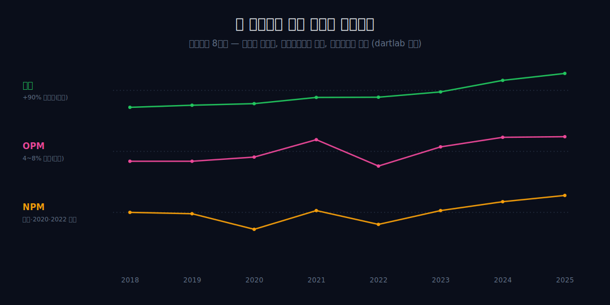
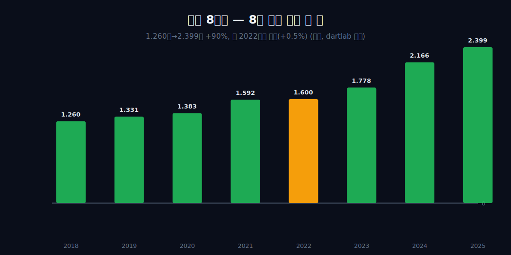
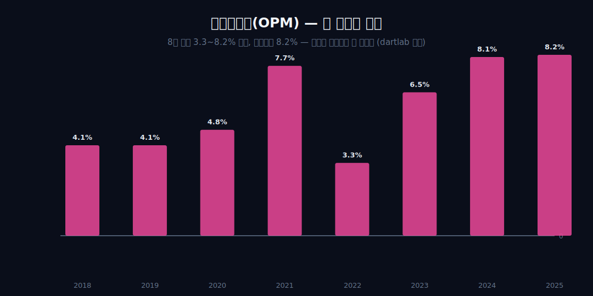
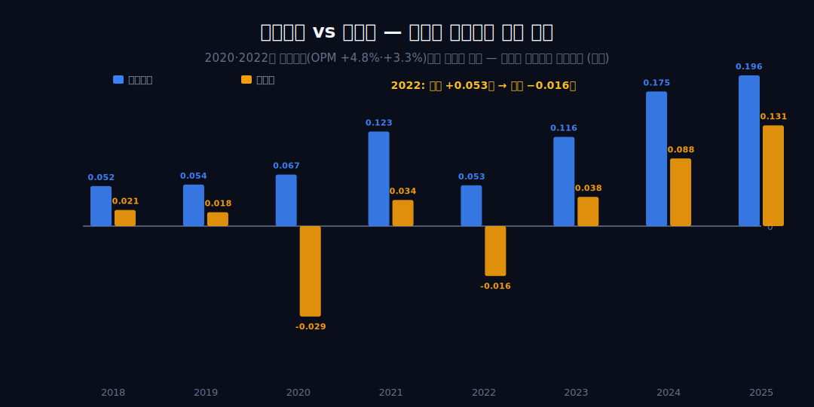
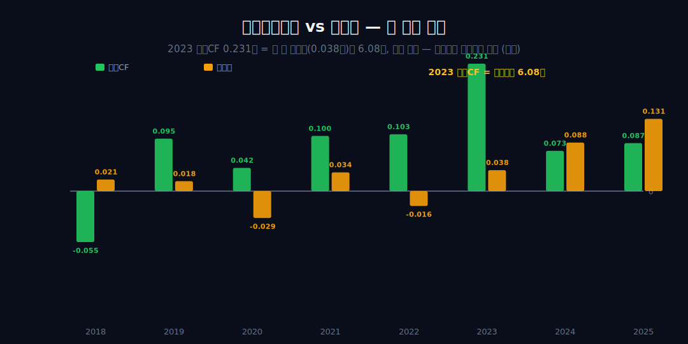
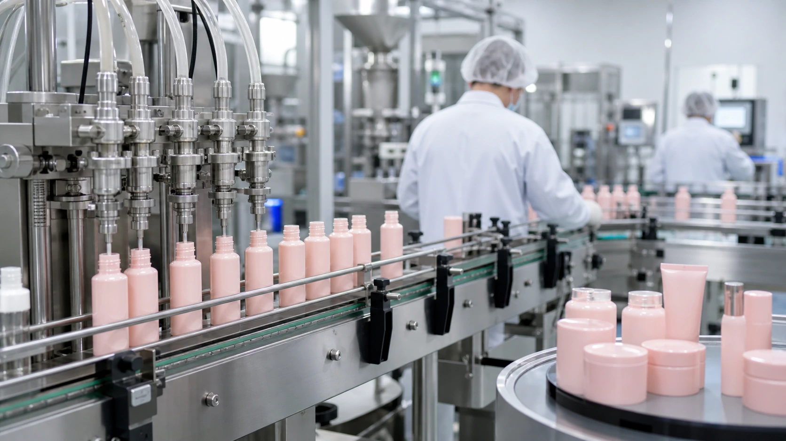
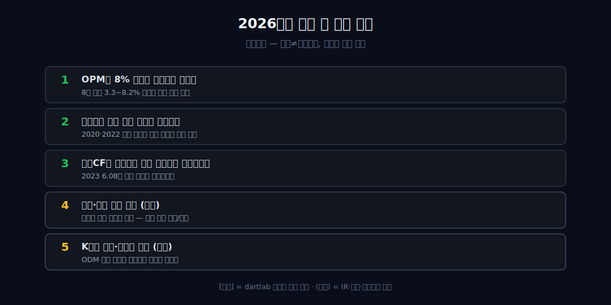

<script>
	import CompanyFinancials from '$lib/components/blog/CompanyFinancials.svelte';
import ComboChart from '$lib/components/blog/ComboChart.svelte';
</script>

> **데이터 기준**: 2026-06-20 dartlab 실측 — 코스맥스(192820) **연결(KRW)** 기준, 분기 데이터를 역년으로 합산. 2026Q1 최신 수치는 DART 2026년 1분기보고서(2026-05-14 접수)와 dartlab `2026Q1` 연결 값으로 재확인했다. ODM(제조자개발생산) 사업 구조, 고객사·브랜드 믹스, 중국(상하이·광저우)·미국·인도네시아 법인의 지역별 손익, K뷰티 수출 사이클은 연결 손익에 분해되지 않으므로 **[외부 인용]**으로 표기하며 dartlab 연결로는 증명되지 않는다. 내부에서 검증되는 것은 세 비율(매출·OPM·NPM)과 영업CF의 시계열까지다.
>
> **핵심 숫자**: 매출 **1.260 → 2.399조** (2018→2025 **+90.4%**) · OPM **3.3~8.2%** 한 자릿수 밴드(최고 8.2%) · 2020·2022 **영업흑자인데 순이익 적자**(−0.029·−0.016조) · 2023 영업CF **0.231조 = 순이익의 6.08배**
>
> **이 글의 용어**: OPM(영업이익률) = 영업이익/매출, 본업이 남기는 비율 · NPM(순이익률) = 순이익/매출, 영업선 아래까지 다 거친 최종 비율 · 영업선 아래 = 영업이익과 순이익 사이(영업외·금융손익·지분법·법인세) · 영업CF = 영업활동현금흐름, 장부이익이 아닌 실제 현금 · ODM = 제조자가 설계·개발·생산까지 맡고 고객사는 자기 브랜드만 붙이는 방식[외부].

---

## 프롤로그 — 라벨 뒤에 자주 등장하는 이름

화장품 한 통을 뒤집어 라벨 뒷면을 보면 누가 만들었는지 깨알 글씨로 적혀 있다. 코스맥스는 그 깨알 글씨에 자주 등장하는 이름이다([외부 인용](https://www.hankyung.com/article/2023120306921)). 이 글은 그 회사가 8년간(2018→2025) 무엇을 했는지를, 외부의 성장 서사가 아니라 회사가 매년 찍어낸 세 개의 숫자 — 매출, 영업이익률, 순이익률 — 만으로 따라간다.



핵심 질문은 하나다. 매출이 거의 두 배가 되는 내내, 회사에는 무엇이 남았고 무엇이 새어나갔나. 세 숫자는 같은 8년을 두고 서로 다른 박자로 움직였다.


---

## 1막 — 8년 만에 외형은 거의 두 배가 됐다

**8년간 이 회사가 실제로 한 일은 무엇으로 측정되나? 성장은 한 박자였나, 여러 박자였나?**

```python
import dartlab
c = dartlab.Company("192820")
c.select("IS", ["매출액", "영업이익"], freq="Q")  # 분기→역년 합산
```

매출은 1.260조(2018)에서 2.399조(2025)로 **+90.4%** 늘었다. 그러나 '쭉 컸다'가 아니다. 2018→2021에 1.260→1.592조로 한 번 점프(특히 2020→2021 +15.1%), 2022엔 1.600조로 사실상 정체(2021 대비 +0.5%), 이후 2023~2025에 1.778→2.166→2.399조로 재가속했다. 성장의 결은 '두 박자'다.



외형이 이렇게 컸다면, 그만큼 회사에 남은 것도 커졌을까 — 2막.

---

## 2막 — 그런데 마진율은 천장에 갇혀 있었다

**매출이 +90% 커졌는데 왜 영업이익률은 한 자릿수 밴드를 못 뚫나? 규모는 마진으로 번역되지 않았나?**

OPM은 4.1 → 4.1 → 4.8 → 7.7 → 3.3 → 6.5 → 8.1 → 8.2%로 움직였다. 8년 최고가 8.2%, 최저가 3.3%, 전 구간이 3~8%대 한 자릿수 밴드 안에서 진동만 했다. 매출 2.399조 회사의 영업이익이 0.196조다 — **규모가 곧 가치포착은 아니라는** 내부 증거다.



왜 마진이 얇은가의 이유 — ODM 제조 마진 구조 — 는 외부 인용 영역이며, 내부 수치는 '얇다'는 사실까지만 증명한다. **[외부 인용]** 코스맥스가 자기 브랜드 없이 고객사 제품을 개발·생산하고 매출의 약 70%가 인디브랜드에서 발생한다는 것([코스인코리아](https://www.cosinkorea.com/news/article.html?no=54374)), [한국콜마](/blog/161890-kolmar)와 ODM 양강 구도라는 것([한국경제 매거진](https://magazine.hankyung.com/business/article/202502261762b))은 외부다. 같은 화장품 산업의 브랜드사 [LG생활건강](/blog/051900-lg-h-and-h)·[아모레퍼시픽](/blog/090430-amorepacific)이 두 자릿수 마진을 두고 다투는 것과, 그 브랜드들을 *만들어주는* 코스맥스의 한 자릿수 마진은 같은 가치사슬의 다른 칸이다. 밴드가 낮은 것도 문제지만, 그 밴드 자체가 왜 한 해 만에 반토막 나나 — 3막.

---

## 3막 — 천장의 진폭: 2021의 도약과 2022의 반토막

**왜 그 천장 자체가 한 해 만에 7.7%→3.3%로 반토막 나나? 매출이 거의 그대로인데 무엇이 마진을 갈랐나?**

영업이익 0.123조(2021)→0.053조(2022), **−56.9%**. OPM 7.7→3.3%. 그런데 매출은 1.592→1.600조로 거의 그대로(+0.5%)다. 즉 외형이 빠진 게 아니라, **매출이 고정된 채 영업이익만 반토막** 났다 — 외형과 이익의 분리다.

이 분리는 '수출이 늘어 컸다'는 외형 서사로는 설명되지 않는, 마진 변동성 그 자체의 사실이다. 반토막의 원인이 원가인지 판관비인지 믹스인지는 항목 분해 없이는 미상이다 — 여기선 '분리가 있었다'는 사실까지만 둔다. 같은 '점유·규모와 마진이 따로 노는' 무늬는 [하이트진로](/blog/000080-hite-jinro)가 다른 산업에서 보여준 것과 결이 같다. 그런데 OPM이 +양수였던 해에도 최종 순이익은 음수였다. 영업선과 순이익선 사이에서 무슨 일이 — 4막.

---

## 4막 — 천장 위에서 새는 구멍: 순이익이 음수가 되는 해

**OPM이 +양수였던 2020·2022에 왜 순이익은 음수인가? 영업이익과 순이익 사이에서 무엇이 사라지나?**

```python
c.select("IS", ["영업이익", "당기순이익"], freq="Q")  # 영업선 아래 누수
```

2020년 — 영업이익 +0.067조(OPM 4.8%)인데 순이익 −0.029조(NPM −2.1%). 2022년 — 영업이익 +0.053조(OPM 3.3%)인데 순이익 −0.016조(NPM −1.0%). 두 해 모두 영업은 흑자, 최종은 적자다. 영업이익→순이익 사이에서 2020년 0.096조, 2022년 0.069조가 사라졌다.



회사의 취약점은 OPM이 낮다는 것만이 아니라 '영업선 아래의 누수'다. 내부 수치는 '영업흑자여도 순이익이 음수가 된다'는 사실, 그리고 그 간극의 크기까지 명백히 증명한다. **[외부 인용]** 다만 그 간극의 정체 — 중국 법인(상하이·광저우) 부진([코스인코리아](https://cosinkorea.com/news/article.html?no=56884))이나 미국 법인 만성 적자·구조조정([뉴시스](https://www.newsis.com/view/NISX20240103_0002579784)) 같은 지분법손실·손상 — 는 외부 인용 영역이며, 내부로는 '영업선 아래에서 발생했다'까지만이다. 그렇다면 장부이익과 실제 현금은 같은 이야기를 했나 — 5막.

---

## 5막 — 현금은 또 다른 박자였다

**이익이 회복된 2024·2025에 왜 영업현금흐름은 오히려 줄었나?**

영업CF는 −0.055(2018)→0.095→0.042→0.100→0.103→0.231(2023)→0.073(2024)→0.087(2025)조로 움직였다. 순이익이 0.038→0.088→0.131조로 *오르는* 2023→2025 구간에 영업CF는 0.231→0.073→0.087조로 *내렸다*. 2023년 영업CF(0.231조)는 그 해 순이익(0.038조)의 **6.08배**였다.



출발점 2018년 영업CF가 −0.055조 음수였던 것까지 합치면, '이익=현금이 아니다'가 내부 수치만으로 증명된다(운전자본·재고 변동이 원인이라는 해석은 분해 없이는 단정 불가 — 어긋남의 사실까지만). 여기에 한 각도를 외부 인용으로 얹는다: 4~8% 마진을 '낮다'가 아니라 '브랜드 칸이 아닌 제조 칸을 점유한 자리의 값'으로 읽을 수도 있다는 산업 관점이다 — 단 이는 내부 수치가 증명하는 사실이 아니라 외부 보도의 프레이밍이다.



8년의 끝에서 이 구조는 풀렸나, 더 높은 자리에서 반복되나 — 6막.

---

## 6막 — 끝점에서 천장은 가장 높았다, 그러나 천장은 천장이다

**8년의 끝(2025)에서 회사는 어디에 도달했나 — 압착은 풀렸나, 더 높은 자리에서 같은 구조를 반복하나?**

2025년 — 매출 2.399조·영업이익 0.196조·순이익 0.131조 모두 8년 절대 최고치, OPM 8.2%로 8년 최고다. 영업선 아래 누수도 적자에서는 벗어났다(NPM 2020 −2.1%·2022 −1.0% → 2025 +5.46%). 회복은 사실이다.

그러나 모든 절대치가 최고점인 바로 그 해에도 OPM은 여전히 8.2%, NPM은 5.46%다 — 영업이익률 8.2%가 순이익률 5.46%로 깎이는 '영업선 아래 깎임'은 적자로는 안 가도 여전히 작동 중이다. 천장이 깨진 게 아니라 **천장 안에서 가장 높은 지점에 닿았을 뿐**이다.

매출 +90%, OPM 4.1→8.2%, 순이익 적자 2회 후 0.131조 — 내부 수치가 보증하는 궤적은 여기까지이며, 그 너머(자리를 더 끌어올릴 여지)는 질문으로 남긴다. **[외부 인용]** 2025년 연결 매출 약 2조3,988억·영업이익 약 1,958억 역대 최대라는 외부 집계([헤럴드경제](https://biz.heraldcorp.com/article/10680761))나, 2024년 한국 화장품 수출 102억 달러 사상 최대([대한화장품협회](https://kcia.or.kr/)) 같은 매크로가 이 자리를 더 끌어올릴지는 시기적 양립일 뿐, 매크로→개별사 인과는 단정하지 않는다. K뷰티 유통의 [실리콘투](/blog/257720-silicon2)나 신생 브랜드 [에이피알](/blog/278470-apr)이 브랜드 칸에서 성장하는 동안, 코스맥스는 그 브랜드들을 만드는 제조 칸에서 같은 천장을 다시 만난다.

---

## 2026 Q1 업데이트 — 매출은 최대, 현금은 강함, 천장은 아직 열린 게 아니다

2026년 1분기 공시를 붙이면 코스맥스의 이야기는 단순히 "8% 천장"에서 끝나지 않는다. Q1 매출은 6,820억원으로 전년 동기 5,886억원 대비 +15.9% 늘었다. 분기 매출만 보면 이 글의 1막, 즉 외형 성장의 두 번째 박자가 계속 이어진다. 2025년 연간 매출 2조3,988억원을 단순 4등분한 5,997억원보다도 높다. Q1 하나만 놓고 보면 외형은 이미 2025년 평균 분기 run-rate를 넘어섰다.

그러나 이 분기에서 더 중요한 줄은 매출이 아니라 OPM이다. 2026Q1 영업이익은 530억원이고 OPM은 7.78%다. 전년 동기 영업이익 514억원, OPM 8.72%와 비교하면 이익 절대액은 조금 늘었지만 마진율은 약 0.94%포인트 낮아졌다. 매출은 +15.9%인데 영업이익은 +3.3%다. 이 한 줄이 기존 결론을 그대로 지킨다. 규모가 커져도 그 규모가 같은 속도로 margin으로 번역되지는 않는다.

이건 나쁜 숫자라는 뜻이 아니다. 오히려 2026Q1은 2020·2022의 영업선 아래 누수를 상당히 복구한 분기다. 순이익은 438억원으로 전년 동기 106억원 대비 약 4.1배가 됐고, NPM은 1.81%에서 6.42%로 올라갔다. 2025Q4 순이익 879억원은 분기적으로 매우 컸지만, 그 분기는 NPM 14.63%라 정상 영업 run-rate로 바로 읽기 어렵다. 2026Q1의 의미는 더 차분하다. 영업선 위의 margin은 천장 근처에 머물렀지만, 영업선 아래에서 빠져나가던 돈은 덜 빠졌다.

영업현금흐름도 강했다. 2026Q1 OCF는 997억원이었다. 순이익 438억원의 2.28배다. 2023년처럼 OCF가 순이익의 6배를 넘는 극단은 아니지만, 적어도 "이익은 좋아졌는데 현금은 안 붙는" 분기는 아니었다. 전년 동기 OCF 278억원과 비교해도 확실히 좋아졌다. 그래서 2026Q1은 "매출 성장 + 순이익 회복 + 현금 동행"이라는 점에서 좋은 답안이다.

다만 좋은 답안과 천장 돌파는 다르다. 기존 글이 붙잡은 질문은 "매출이 두 배가 됐는데 왜 회사에 남은 건 8%인가"였다. 2026Q1은 이 질문을 없애지 않는다. 오히려 더 정밀하게 만든다. 매출이 늘고 순이익과 현금이 좋아져도, OPM은 전년 동기보다 낮다. 코스맥스가 가치사슬에서 제조 칸에 있는 한, 매출 증가가 곧바로 가격 결정력으로 바뀌는지 별도로 증명해야 한다.

이 분기를 읽을 때 가장 위험한 문장은 "분기 최대 매출이니 구조가 바뀌었다"다. 구조가 바뀌었다고 쓰려면 OPM이 8%대 상단을 반복적으로 넘고, 순이익이 영업이익에 더 가까워지며, OCF가 순이익과 같은 방향으로 안정되어야 한다. Q1은 세 조건 중 둘에 가까운 신호를 줬다. 순이익과 현금은 좋아졌다. 그러나 OPM은 아직 천장 위가 아니라 천장 안쪽이다.

그래서 2026년 코스맥스를 볼 때는 세 줄을 동시에 봐야 한다. 첫째, 매출이 분기 6,800억원대에서 유지되는가. 둘째, OPM이 8%대 중후반을 넘는가. 셋째, 순이익과 OCF가 다시 따로 놀지 않는가. 세 줄이 모두 같은 방향이면 "ODM 규모의 가치포착"이 시작됐다고 말할 수 있다. 매출만 좋고 OPM이 눌리면, 코스맥스는 여전히 라벨 뒤에서 큰 물량을 만들지만 남는 몫은 얇은 회사다.

### Q1이 기존 결론을 어떻게 고치나

기존 결론은 "천장은 천장이다"였다. 2026Q1 이후 결론은 조금 바뀐다. "천장은 아직 열리지 않았지만, 천장 아래의 누수는 줄었다." 이 차이는 중요하다. 2020·2022의 약점은 영업이익이 낮다는 것만이 아니라, 영업흑자에서 순이익 적자로 떨어지는 영업선 아래 누수였다. 2026Q1은 그 아래층이 훨씬 좋아진 분기다. 그래서 이 글은 코스맥스를 부정적으로만 읽지 않는다.

다만 투자자가 헷갈리면 안 되는 것도 있다. 순이익률이 좋아진 분기를 보고 OPM 천장이 깨졌다고 쓰면 층을 섞는 것이다. 순이익률은 영업선 아래까지 지난 결과이고, OPM은 본업이 남기는 비율이다. 2026Q1은 NPM이 좋아진 분기이지, OPM이 전년 동기보다 좋아진 분기가 아니다. 코스맥스의 다음 질문은 "왜 영업선 아래가 좋아졌나"와 "왜 영업선 위 margin은 여전히 얇나"를 분리해서 보는 것이다.

이 둘을 분리해야 회사가 보인다. 영업선 아래가 좋아진 것은 재무구조·지역법인·일회성 항목의 영향을 받을 수 있다. 영업선 위 margin은 고객사 mix, 생산 효율, 가격 협상력, 원가율이 만든다. 두 줄 모두 좋아지면 구조 개선이다. 한 줄만 좋아지면 회복의 일부다. 2026Q1은 좋은 일부를 보여줬다. 아직 구조 전체를 닫지는 않았다.

### DART 분기표로 세 수평선을 다시 그리면

2026Q1을 세 수평선으로 다시 그려 보자. 첫 번째 수평선은 매출이다. 5,886억원에서 6,820억원으로 올라갔다. 이 줄은 강하다. 2025년 연간 매출 2조3,988억원을 고려하면, Q1 6,820억원은 연간 단순화 기준 2조7,281억원 속도다. 물론 화장품 ODM도 분기 계절성이 있으니 단순 4배를 연간 결론으로 쓰면 안 된다. 하지만 Q1 외형이 2025년 평균 분기보다 높은 것은 사실이다.

두 번째 수평선은 OPM이다. 이 줄은 조심스럽다. 2025Q1 OPM 8.72%에서 2026Q1 7.78%로 내려왔다. 2025년 연간 OPM 8.16%와 비교해도 Q1은 그보다 약간 낮다. 즉 매출이 높아진 분기에서 영업마진은 더 높아지지 않았다. 이 점이 코스맥스 독해의 핵심이다. 제조사에서 매출 증가는 설비가 더 돌아간다는 뜻일 수 있지만, 가격을 더 잘 받는다는 뜻은 아니다.

세 번째 수평선은 NPM이다. 이 줄은 좋아졌다. 2025Q1 NPM 1.81%에서 2026Q1 6.42%로 크게 올라갔다. 순이익 절대액도 106억원에서 438억원으로 커졌다. 기존 글에서 가장 약했던 부분이 영업선 아래 누수였다면, Q1은 그 누수가 줄어든 분기다. 그래서 Q1을 부정적으로 읽을 필요는 없다. 다만 NPM 개선은 OPM 개선과 다르다. 영업선 아래가 좋아진 것이지, 제조 margin 자체가 확장됐다고 바로 말할 수는 없다.

네 번째 줄로 영업CF를 추가하면 그림이 더 좋아진다. Q1 OCF는 997억원이다. 같은 분기 순이익의 2.28배다. 이익이 회계상으로만 좋아진 것이 아니라 현금도 같이 들어온 분기다. 기존 글의 2023년 OCF 2,310억원은 순이익의 6배가 넘는 특이값이었다. 2026Q1은 그 정도의 비정상적 격차는 아니지만, 현금이 붙었다는 점에서 더 안정적이다.

이 네 줄을 합치면 결론은 이렇게 바뀐다. "코스맥스는 여전히 낮은 제조 margin 회사다"라는 문장은 너무 거칠다. "코스맥스는 외형과 현금이 좋아졌고 영업선 아래 누수도 줄었지만, 영업 margin은 아직 매출 성장만큼 확장되지 않았다"가 더 정확하다. 이 문장이 길어도, 이 길이가 필요한 회사다. 세 수평선이 같은 방향으로 가지 않기 때문이다.

### 좋은 분기와 구조 개선을 구분한다

좋은 분기는 이미 나왔다. 2026Q1은 좋은 분기다. 매출은 늘었고, 순이익은 크게 늘었고, 영업CF도 강했다. 문제는 구조 개선이라는 더 강한 단어다. 구조 개선을 쓰려면 반복성이 필요하다. Q1 하나가 아니라 Q2·Q3에서도 OPM이 8%대 중후반을 유지하거나 넘고, NPM이 5~6%대에 머물며, OCF가 순이익과 같은 방향으로 가야 한다.

이 기준을 세우는 이유는 코스맥스의 약점이 단일 분기 적자가 아니었기 때문이다. 약점은 반복적으로 다른 줄이 다른 박자로 움직인다는 데 있었다. 2020·2022에는 영업흑자에서 순이익 적자로 내려갔다. 2023에는 OCF가 순이익의 6배를 넘었다. 2024~2025에는 순이익이 올라가는데 OCF는 2023보다 낮아졌다. 그러니 한 분기의 좋은 OCF만으로 "현금 문제가 해결됐다"고 말하지 않는다.

투자자가 다음 공시에서 가장 먼저 봐야 할 것은 매출 증가율이 아니다. 매출 증가율은 이미 좋은 편이다. 봐야 할 것은 영업이익 증가율이 매출 증가율을 따라잡는지다. 2026Q1에는 따라잡지 못했다. 매출 +15.9%, 영업이익 +3.3%였다. 이 격차가 줄어들면 제조 효율 또는 가격 mix 개선을 의심해 볼 수 있다. 격차가 계속 벌어지면 외형은 성장하지만 margin은 눌리는 구조가 유지된다.

두 번째로 볼 것은 순이익과 OCF의 동행이다. 순이익이 좋아지는데 OCF가 같이 좋아지면 안정적이다. 순이익은 좋아지는데 OCF가 빠지면 운전자본 부담을 봐야 한다. OCF만 좋아지고 순이익이 약하면 비현금 항목이나 운전자본 환입일 수 있다. 코스맥스는 이미 세 경우를 모두 보여준 적이 있다. 그래서 다음 분기는 손익계산서와 현금흐름표를 같이 열어야 한다.

세 번째는 지역·고객사 이야기를 연결 숫자와 섞지 않는 것이다. 코스맥스의 외부 서사는 늘 한국, 중국, 미국, 동남아, 인디브랜드, 대형 고객사로 쪼개진다. 하지만 연결 손익표는 그 모든 것을 합친 결과다. "미국이 좋아졌다"거나 "중국이 회복됐다"는 말은 회사 실적자료나 주석이 있어야 한다. 연결 표가 보여주는 것은 전체 효과다. 세부 원인까지 연결 표로 증명하려 하면 글이 약해진다.

### 이 글이 틀리는 조건

이 글의 주장은 코스맥스가 계속 8% 안팎 OPM에 머문다는 예측이 아니다. 오히려 다음 공시에서 틀릴 수 있는 조건을 분명히 둔다. 첫째, OPM이 9~10%대로 올라가고 그 수준이 두세 분기 유지되면 "제조 margin 천장"이라는 표현은 수정해야 한다. 둘째, 순이익률이 6%대에 반복적으로 머물면 영업선 아래 누수는 구조적으로 줄었다고 써야 한다. 셋째, OCF가 순이익과 비슷한 배율로 안정되면 "현금은 다른 박자"라는 표현도 약해진다.

반대로 매출은 계속 늘지만 OPM이 7~8%대에 머물고, 순이익이나 OCF가 분기마다 크게 출렁이면 기존 결론은 강화된다. 코스맥스는 더 큰 회사가 됐지만, 여전히 제조 칸의 얇은 margin과 영업선 아래 변동성을 같이 가진 회사라는 뜻이다. 이 글의 목적은 맞히는 것이 아니라 다음 공시에서 어느 줄을 보면 글이 틀리는지 명확히 하는 것이다.

### 생산량이 아니라 배분의 문제다

코스맥스의 2026Q1은 생산량의 문제를 거의 묻지 않게 만든다. 매출 6,820억원은 전년 동기보다 934억원 늘었다. 이 정도면 고객사가 줄어 회사가 흔들린다는 그림은 아니다. 오히려 문제는 늘어난 매출이 어디에 배분되는가다. 원가, 판관비, 이자, 세금, 비지배지분을 지나 최종적으로 주주에게 남는 몫이 얼마나 두꺼워지는지를 봐야 한다.

이 관점에서 2026Q1은 중간 점수다. 매출 증가는 강했다. 순이익과 현금도 좋았다. 하지만 영업이익률은 전년 동기보다 낮았다. 즉 늘어난 매출이 본업 margin으로 두껍게 쌓였다는 증거는 아직 약하다. 대신 영업선 아래에서는 좋아졌다. 그래서 이 분기는 "더 많이 만들었다"와 "더 많이 남겼다" 사이에 있는 분기다.

코스맥스 같은 ODM 회사는 브랜드 회사와 다른 방식으로 읽어야 한다. 브랜드 회사는 히트 제품이 가격과 margin을 동시에 바꿀 수 있다. ODM 회사는 고객사가 잘 팔려도 제조사의 몫이 그대로일 수 있다. 고객사의 외형 성장이 코스맥스 매출로 들어오는 것과, 그 매출이 코스맥스의 가격 결정력으로 바뀌는 것은 별개의 일이다. 2026Q1은 첫 번째는 확인했지만 두 번째는 아직 닫지 못했다.

따라서 다음 분기의 좋은 신호는 매출 증가율보다 영업이익 증가율이다. 매출이 10% 늘 때 영업이익이 15~20% 늘면 배분이 바뀌고 있다는 뜻이다. 매출이 10% 늘어도 영업이익이 3~5%만 늘면 생산량은 늘었지만 회사에 남는 몫은 여전히 얇다. 2026Q1의 매출 +15.9%, 영업이익 +3.3% 조합은 두 번째 쪽에 가깝다.

### 현금이 좋은데도 왜 신중해야 하나

2026Q1 OCF 997억원은 강하다. 이 숫자만 보면 보수적일 이유가 없어 보일 수 있다. 그러나 코스맥스는 이미 현금이 손익보다 크게 움직인 과거가 있다. 2023년 영업CF는 2,310억원이었고, 순이익은 378억원이었다. 2024년에는 순이익이 884억원으로 늘었지만 영업CF는 730억원으로 줄었다. 2025년에는 순이익 1,311억원, 영업CF 867억원이었다. 현금은 좋은 해와 약한 해가 손익과 같은 속도로 움직이지 않았다.

그래서 Q1의 강한 현금은 중요한 신호이지만 결론은 아니다. Q1 OCF가 좋았다는 사실과 2026년 전체 현금 전환이 안정됐다는 문장은 다르다. 운전자본이 한 분기에 좋아질 수 있고, 다음 분기에 다시 부담으로 돌아올 수 있다. 재고와 매출채권이 어떻게 움직였는지까지 확인해야 현금의 질을 더 좁힐 수 있다. 이 글은 연결 주요 재무제표를 기준으로 하므로, 여기서는 "현금이 강했다"까지만 말한다.

신중함은 비관이 아니다. 오히려 좋은 숫자를 오래 살리는 방법이다. 좋은 숫자를 너무 빨리 구조 변화로 부르면 다음 공시에서 글이 약해진다. 좋은 숫자를 좋은 숫자로 인정하되, 반복 조건을 분명히 두면 다음 분기 해석이 선명해진다. 코스맥스는 2026Q1에 좋은 현금을 냈다. 이제 필요한 것은 같은 방향의 반복이다.

### 2026년 연간 표가 닫힐 때 확인할 문장

연말에 이 글을 다시 열면 확인할 문장은 세 개다. 첫째, "2026년 매출은 2025년보다 의미 있게 커졌다." 이 문장은 Q1만 보면 가능성이 높다. 둘째, "2026년 OPM은 8%대 중후반 또는 그 위로 올라섰다." 이 문장은 아직 보류다. 셋째, "순이익과 영업CF가 함께 좋아졌다." 이 문장은 Q1에서 가장 좋은 출발을 했다.

세 문장이 모두 맞으면 코스맥스는 단순 ODM 외형 성장주가 아니라, 외형을 이익과 현금으로 더 잘 바꾸는 회사로 다시 써야 한다. 첫 번째와 세 번째만 맞고 두 번째가 틀리면, 외형과 현금은 좋아졌지만 제조 margin 천장은 남아 있는 회사다. 첫 번째만 맞고 나머지가 약하면, 매출은 늘어도 가치 포착은 부족한 회사다. 2026년의 판정은 이 세 문장의 조합으로 정리할 수 있다.

### 다음 공시를 읽는 순서

다음 공시가 나오면 순서를 정해 놓고 읽는 편이 좋다. 첫 줄은 매출이 아니다. 매출은 이미 성장 중이다. 첫 줄은 매출 증가율과 영업이익 증가율의 차이다. 2026Q1에는 매출 +15.9%, 영업이익 +3.3%였다. 이 격차가 줄어들면 회사가 더 많이 만드는 것에서 더 많이 남기는 쪽으로 이동하고 있다는 신호다. 격차가 그대로면 외형 성장은 계속되어도 제조 margin의 질문은 남는다.

두 번째 줄은 순이익률이다. 2026Q1 NPM 6.42%는 좋다. 하지만 2025Q4 NPM 14.63% 같은 큰 숫자가 있어, 분기 순이익률은 한 번에 결론을 내리기 어렵다. 순이익률이 5~6%대에서 반복되면 영업선 아래 누수가 줄었다고 볼 수 있다. 반대로 한 분기만 좋고 다시 낮아지면, Q1은 회복의 한 장면으로 남는다.

세 번째 줄은 영업CF다. Q1 OCF가 997억원이었다는 사실은 좋지만, 코스맥스의 현금흐름은 과거에도 손익보다 더 크게 움직였다. 따라서 다음 분기 OCF가 순이익과 같은 방향으로 움직이는지 봐야 한다. 순이익과 OCF가 같이 좋아지면 품질이 좋아진다. 순이익만 좋아지고 OCF가 약해지면 다시 운전자본을 봐야 한다.

이 순서로 읽으면 코스맥스는 더 선명해진다. 매출을 먼저 보면 이야기가 너무 긍정적으로 시작된다. OPM을 먼저 보면 좋은 순이익과 현금을 놓칠 수 있다. 순이익을 먼저 보면 본업 margin의 약함을 지나칠 수 있다. 세 줄을 순서대로 읽을 때만 이 회사의 장점과 한계가 동시에 보인다.

### 결론을 한 문장으로 줄이면

코스맥스는 2026Q1에 더 큰 회사가 됐고, 더 좋은 현금을 냈다. 그러나 아직 더 높은 margin의 회사가 됐다고 쓰기는 이르다. 이 문장이 이 글의 핵심이다. 2025년까지의 연간 표는 매출과 이익이 함께 커졌지만 OPM 천장이 남아 있음을 보여줬다. 2026Q1은 그 천장을 아직 깨지 못했지만, 영업선 아래 누수와 현금 문제는 개선되는 장면을 보여줬다.

그래서 코스맥스는 단순히 싼 제조사가 아니다. 그렇다고 이미 가격 결정력을 가진 고마진 브랜드 회사도 아니다. 두 세계 사이에서 규모는 빠르게 커졌고, 남는 몫은 아직 검증 중인 회사다. 이 중간 지대가 투자 판단을 어렵게 만든다. 좋은 숫자가 많은데도 한 번 더 확인해야 하는 이유가 여기에 있다.

---

## 2026년에 봐야 할 다섯 가지

1. **OPM이 8% 천장을 반복적으로 넘는가** — 2026Q1 OPM은 7.78%다. 전년 Q1보다 낮아졌으므로, 매출 증가만으로 천장이 깨졌다고 쓰면 안 된다.
2. **순이익률 개선이 유지되는가** — 2026Q1 NPM 6.42%는 2025Q1 1.81%보다 훨씬 높다. 영업선 아래 누수 축소가 반복되는지 본다.
3. **영업CF가 순이익과 같은 방향으로 수렴하는가** — Q1 OCF 997억원은 강했다. 2023년처럼 한 해만 튀는 현금인지, 지속 가능한 현금 전환인지 확인한다.
4. **지역 법인 손익이 연결 숫자를 덜 흔드는가** — 중국·미국 법인 손익은 DART 연결 한 줄로 닫히지 않는다. 공시 주석과 회사 설명을 분리해서 본다.
5. **고객사·K뷰티 수출 mix가 제조 margin을 끌어올리는가** — 매출 성장은 확인됐다. 다음은 그 성장이 OPM으로 남는지다.



---

## 공시 / Filings

- [코스맥스 2026년 1분기보고서(DART)](https://dart.fss.or.kr/dsaf001/main.do?rcpNo=20260514000806) — 2026Q1 연결 손익계산서·현금흐름표 확인용.
- [코스맥스 2025년 사업보고서(DART)](https://dart.fss.or.kr/dsaf001/main.do?rcpNo=20260318000694) — 2025년 연간 연결 재무제표와 사업 설명 확인용.
- [코스맥스 DART 공시 목록](https://dart.fss.or.kr/dsab007/main.do?option=corp&textCrpNm=192820) — 분기·반기·사업보고서 원문 확인 입구.

---

## 재무 검증표 — 최근 4개년 (dartlab 연결, 억원)

```python
import dartlab
c = dartlab.Company("192820")
c.select("IS", ["sales","operating_profit","net_profit"], freq="Y")
```

| 항목 (억원) | 2022 | 2023 | 2024 | 2025 |
|---|---:|---:|---:|---:|
| 매출액 | 16,001 | 17,775 | 21,661 | 23,988 |
| 영업이익 | 531 | 1,157 | 1,754 | 1,958 |
| 당기순이익 | -165 | 378 | 884 | 1,311 |

```python
c.select("CF", ["operating_cashflow"], freq="Y")
```

| 항목 (억원) | 2022 | 2023 | 2024 | 2025 |
|---|---:|---:|---:|---:|
| 영업활동현금흐름 | 1,025 | 2,310 | 730 | 867 |

이 검증표는 기존 8개년 표의 핵심 구간을 공시 감사용으로 다시 줄인 것이다. 2022년 당기순이익 적자, 2023년 OCF 급증, 2024~2025년 이익 회복이 모두 같은 방향으로 재확인된다. 2026Q1 최신 수치는 분기 값이므로 이 연간 표에 섞지 않고 본문 업데이트에서 따로 읽는다.

---

## 재무제표 — 최근 8개년 (dartlab 연결)

> 연결(KRW)·분기 합산(역년) 기준. 차트는 단위가 작아 **억원**, 표는 **조원**. dartlab에서 직접 확인:
> ```python
> import dartlab
> c = dartlab.Company("192820")
> c.select("IS", ["매출액","영업이익","당기순이익"], freq="Q")
> c.select("CF", ["영업활동현금흐름"], freq="Q")
> ```

<ComboChart data={[{year:"2018",매출:12600,영업이익:520,순이익:210},{year:"2019",매출:13310,영업이익:540,순이익:180},{year:"2020",매출:13830,영업이익:670,순이익:-290},{year:"2021",매출:15920,영업이익:1230,순이익:340},{year:"2022",매출:16000,영업이익:530,순이익:-160},{year:"2023",매출:17780,영업이익:1160,순이익:380},{year:"2024",매출:21660,영업이익:1750,순이익:880},{year:"2025",매출:23990,영업이익:1960,순이익:1310}]} lineKeys={["매출"]} barKeys={["영업이익","순이익"]} lineColors={["#22c55e"]} barColors={["#3b82f6","#f59e0b"]} title="매출(라인) vs 영업이익·순이익(막대) — 억원" unit="억" />

| 항목 (조원) | 2018 | 2019 | 2020 | 2021 | 2022 | 2023 | 2024 | 2025 |
|---|---:|---:|---:|---:|---:|---:|---:|---:|
| 매출 | 1.260 | 1.331 | 1.383 | 1.592 | 1.600 | 1.778 | 2.166 | 2.399 |
| 영업이익 | 0.052 | 0.054 | 0.067 | 0.123 | 0.053 | 0.116 | 0.175 | 0.196 |
| 순이익 | 0.021 | 0.018 | −0.029 | 0.034 | −0.016 | 0.038 | 0.088 | 0.131 |
| 영업이익률(OPM) | 4.1% | 4.1% | 4.8% | 7.7% | 3.3% | 6.5% | 8.1% | 8.2% |
| 순이익률(NPM) | 1.7% | 1.4% | −2.1% | 2.1% | −1.0% | 2.1% | 4.1% | 5.5% |
| 영업현금흐름 | −0.055 | 0.095 | 0.042 | 0.100 | 0.103 | 0.231 | 0.073 | 0.087 |

이 표를 한 줄로 읽으면 이렇다 — **매출 행은 거의 단조로 우상향(+90%)인데, OPM 행은 3~8% 한 자릿수 밴드에 갇혀 있고, 순이익률 행은 2020·2022에 0선 아래로 내려간다.** 매출은 두 배가 됐는데 회사에 남은 비율(OPM)은 8% 천장을 못 넘고, 그 위에서 만든 영업흑자조차 두 해는 순이익에서 적자로 새어버렸다. 세 수평선이 다른 박자로 움직인다는 게 이 표의 핵심이고, 그 *원인*(ODM 마진 구조·지역 법인)은 이 표 어디에도 안 적혀 있다(외부).

---

## 검증표

본문 인용 수치를 dartlab 호출과 결과로 검증한다. 외부 출처(ODM 구조·고객사·지역 법인·K뷰티 수출)는 분리 표기. 📅 dartlab 실측 2026-06-14 · 코스맥스(192820) 연결(KRW)·분기 합산 기준.

| 본문 수치 | 출처 / 호출 | 결과 |
|---|---|---|
| 매출 2018 1.260조 → 2025 2.399조 (+90.4%) | `c.select("IS",["매출액"],freq="Q")` 합산 | ✓ 실측 |
| OPM 3.3~8.2% 한 자릿수 밴드(최고 8.2%) | 영업이익/매출 | ✓ 실측 |
| 2021→2022 매출 +0.5%인데 영업이익 0.123→0.053조(−56.9%) | `c.select("IS",[...])` | ✓ 실측 |
| 2020 영업 +0.067조(OPM 4.8%) vs 순익 −0.029조(NPM −2.1%) | `c.select("IS",[...])` | ✓ 실측 |
| 2022 영업 +0.053조(OPM 3.3%) vs 순익 −0.016조(NPM −1.0%) | `c.select("IS",[...])` | ✓ 실측 |
| 2023 영업CF 0.231조 = 순이익(0.038조)의 6.08배 | `c.select("CF",["영업활동현금흐름"])` | ✓ 실측 |
| 2023→2025 순이익↑(0.038→0.131조)인데 영업CF↓(0.231→0.087조) | 순이익 vs 영업CF | ✓ 실측 |
| 2025 매출·영업이익·순이익·OPM 8년 최고(OPM 8.2%·NPM 5.46%) | `c.select(...)` | ✓ 실측 |
| ODM 구조·매출 70% 인디브랜드·한국콜마 양강 | [코스인코리아](https://www.cosinkorea.com/news/article.html?no=54374) · [한국경제 매거진](https://magazine.hankyung.com/business/article/202502261762b) | 외부 인용·연결 증명 0 |
| 중국(상하이·광저우)·미국 법인 손익 | [코스인코리아](https://cosinkorea.com/news/article.html?no=56884) · [뉴시스](https://www.newsis.com/view/NISX20240103_0002579784) | 외부 인용 |
| 2025 역대 최대(매출 2조3,988억)·K뷰티 수출 102억 달러 | [헤럴드경제](https://biz.heraldcorp.com/article/10680761) · [대한화장품협회](https://kcia.or.kr/) | 외부 인용 |
| 지역·고객사별 손익 — 연결에 분해 없음 | dartlab 데이터 한계 | 주의/제외 |

본문의 숫자 중 이 표에 없는 것은 발행 차단 대상이다. ODM 마진 구조·지역 법인·K뷰티 수출은 dartlab 연결로 증명되지 않는 외부 인용이며, 영업이익 반토막(2022)·영업선 아래 누수의 원인은 항목 분해 없이 단정하지 않고, 음의 영업CF(2018)나 2023~2025 CF 하락도 '이익≠현금'이라는 어긋남까지만 둔다 — 연결이 증명하는 것은 '매출은 두 배인데 남은 비율은 한 자릿수, 그마저 영업선 아래에서 샌다'는 세 수평선의 다른 박자까지다.

---

<CompanyFinancials code="192820" />
