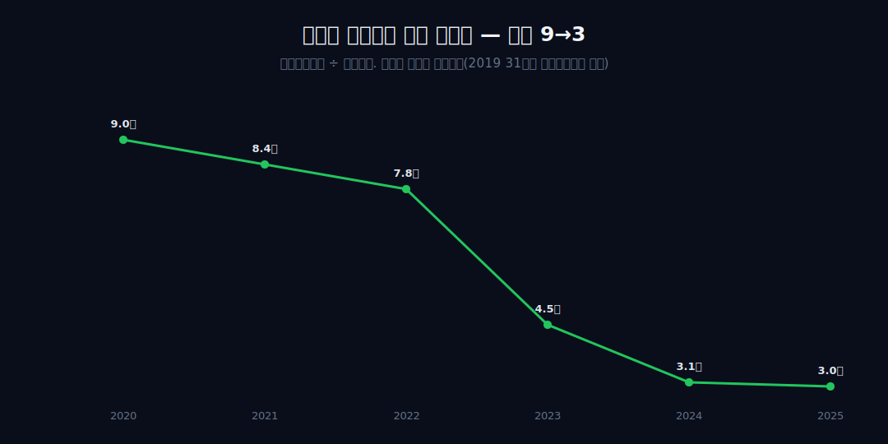
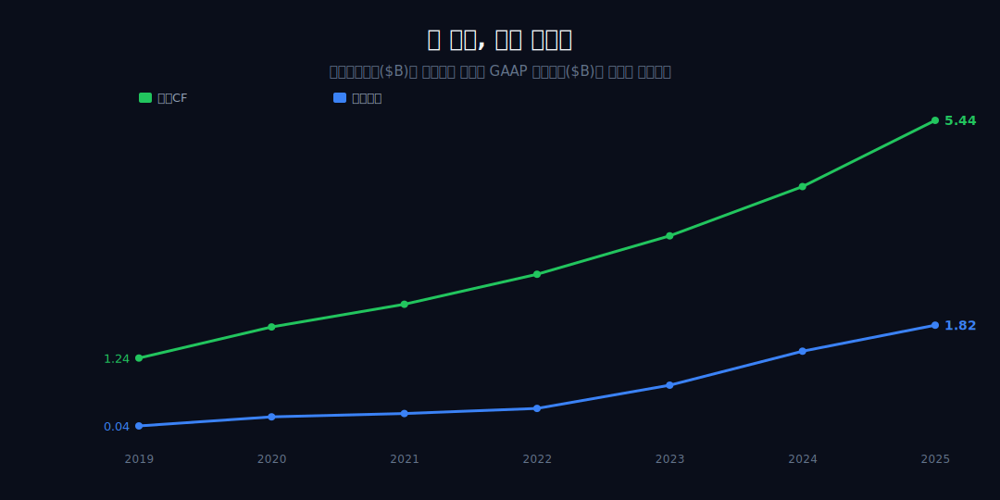
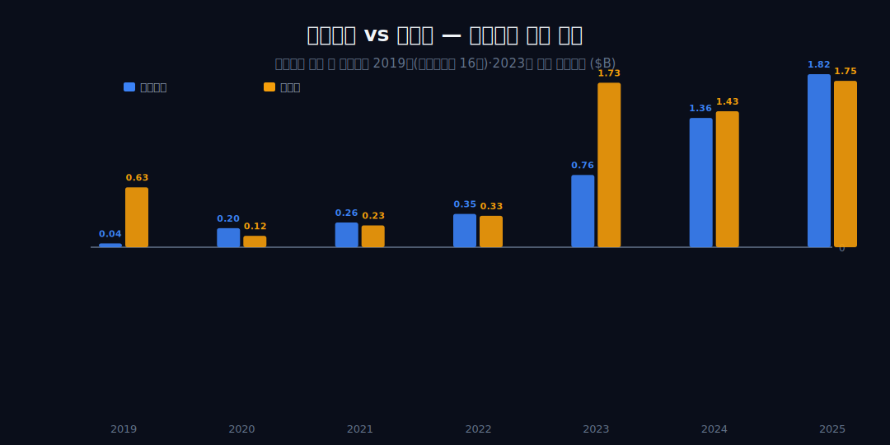
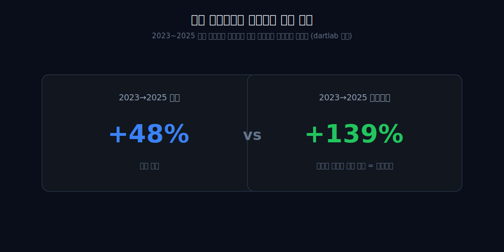
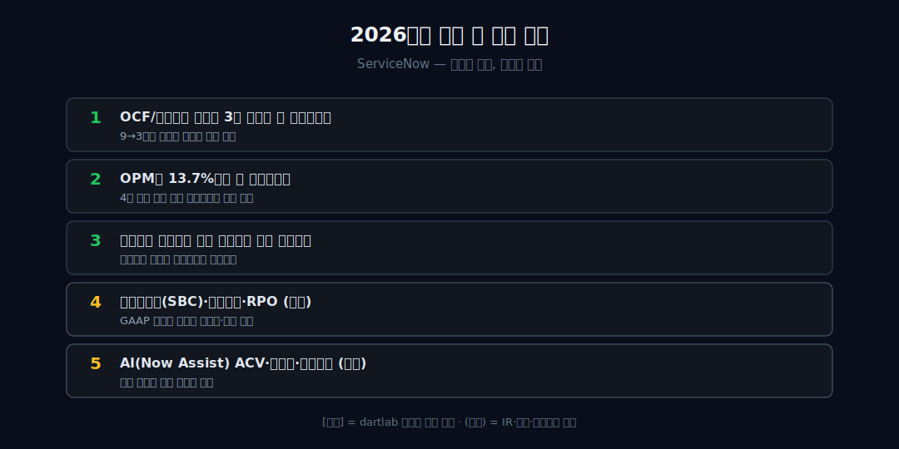

<script>
import ComboChart from '$lib/components/blog/ComboChart.svelte';
</script>

> **데이터 기준**: 2026-06-14 dartlab 실측 — ServiceNow(NOW) **연결(EDGAR, USD)** 기준, 분기 데이터를 역년으로 합산(2019~2025). 구독(SaaS) 모델·이연수익·RPO(잔여수행의무)·갱신율·주식보상비(SBC)·세그먼트·AI(Now Assist) ACV는 연결 손익에 분해되지 않으므로 **[외부 인용]**으로 표기하며 dartlab 연결로는 증명되지 않는다. 특히 **영업현금흐름(현금주의)과 영업이익(발생주의)은 원래 다른 회계 축**이라, 둘의 간극은 발견이 아니라 구조다.
>
> **핵심 숫자**: 매출 **$3.46B → $13.28B** (2019→2025 약 **3.84배**) · OCF/영업이익 배수 **9 → 3**(단조 축소) · 2023→2025 영업이익 **+139%** vs 매출 **+48%**(레버리지 점화) · 2025 영업CF **$5.44B** = 영업이익 **$1.82B**의 약 **3배**
>
> **이 글의 용어**: OPM(영업이익률) = 영업이익/매출, 장부상 본업 이익률 · NPM(순이익률) = 순이익/매출, 별개 비율 · 영업CF(OCF) = 영업활동으로 실제 들어온 현금 · 발생주의 vs 현금주의 = 이익은 '벌기로 약속된 것', 현금흐름은 '실제 들어온 돈' · OCF/영업이익 배수 = 현금이 장부이익의 몇 배인지(분모가 0에 가까우면 발산) · 운영 레버리지 = 매출이 늘 때 비용이 덜 따라붙어 이익률이 펴지는 것.

---

## 프롤로그 — 장부엔 본전, 통장엔 매출의 36%

2019년 서비스나우의 손익계산서를 보면 영업이익은 $0.04B — 사실상 본전이다. 같은 해 회사 통장엔 영업으로 $1.24B의 현금이 들어왔다. 매출의 약 36%가 현금으로 잡혔는데 장부 이익은 0에 붙어 있다. 회계를 몰라도 멈칫하게 된다 — 장부에 적힌 이익과 통장에 들어온 돈이 이렇게까지 다를 수 있나.



이 글은 그 비대칭에서 시작해 '현금이 왜 매년 먼저 닿는가'를 묻고, 6년 시계열이 단독으로 증명하는 두 사건 — 현금과 이익의 수렴(배수 9→3), 그리고 약 4년 늦게 켜진 운영 레버리지 — 을 추적한다. 선납·구독·SBC 같은 메커니즘은 외부 공시로만 다루고, 내부 숫자는 '정합'까지만 둔다. 인과로 비약하지 않고, 시계열이 침묵하는 곳에서 멈춘다.


---

## 1막 — 출발점의 역설: 장부는 본전인데 통장엔 매출의 36%

**2019년 영업이익은 $0.04B(OPM 1.2%)로 사실상 본전인데, 같은 해 영업현금흐름은 $1.24B였다. 장부가 '거의 0'을 적는 해에 통장은 왜 이미 두툼했나?**

두 숫자를 같은 평면에 올리지 않는 게 출발이다. 영업이익(발생주의)과 영업CF(현금주의)는 원래 다른 회계 축이라 '벌어졌다'가 아니라 '간극이 크다'까지만 말한다. 2019년 영업이익 $0.04B는 OPM 1.2%의 반올림 잔여에 가까워, OCF/영업이익 31배라는 숫자는 격차의 크기가 아니라 '그 해 분모가 우연히 0에 붙어 있었다'는 사실을 잴 뿐이다. 그래서 31배는 이 글의 후크로 쓰지 않는다.

정직한 출발점은 '장부가 본전을 적는 해에도 현금은 매출의 약 36%를 만들었다'는 비대칭 그 자체다. **[외부 인용]** 그 현금이 미리 들어오는 구조 — 과거 분기 체결 구독에서 이연수익으로 인식되고, 클라우드 제공분은 구독기간에 걸쳐 비례 인식된다는 것([SEC Form 10-Q](https://www.sec.gov/Archives/edgar/data/0001373715/000137371525000126/now-20250331.htm)) — 은 외부다. 왜 현금이 장부와 무관하게 미리 들어오는가 — 2막.

---

## 2막 — 현금이 먼저 닿는 구조: 매출은 '미리 약속된 돈'을 푸는 일

**1막의 비대칭이 일회성이 아니라면, 현금이 매년 미리 들어오는 '구조'가 있어야 한다. 시계열은 그것을 어디까지 보여주나?**

```python
import dartlab
c = dartlab.Company("NOW")
c.select("IS", freq="Q")   # 분기→역년 합산
c.select("CF", freq="Q")
```

매출 곡선이 한 해도 꺾이지 않고 3.46 / 4.52 / 5.90 / 7.25(2019→2022)로 매끄럽게 **+110%** 오른다는 사실은, 미리 약속된 구독을 기간에 걸쳐 푸는 구조와 양립한다. 그러나 정직하게 — 매끄러운 복리 곡선은 '선납 구조'와도, '신규 계약을 잘 따낸 것'과도 똑같이 양립하므로 내부 수치는 메커니즘을 구별해주지 못한다.

구조의 실물 증거 — 이연수익·RPO·갱신율 — 는 전부 [외부 인용]이다. **[외부 인용]** 이연수익이 2025년 중반 기준 유동분 약 $6,802M라거나([SEC 10-Q](https://www.sec.gov/Archives/edgar/data/0001373715/000137371525000276/now-20250630.htm)), 총 RPO 약 $28.2B(+27%)·갱신율 98%([ServiceNow Newsroom](https://newsroom.servicenow.com/press-releases/details/2026/ServiceNow-Reports-Fourth-Quarter-and-Full-Year-2025-Financial-Results-Board-of-Directors-Authorizes-Additional-5B-for-Share-Repurchase-Program/default.aspx))는 외부다. 시계열이 단독으로 말하는 것은 '현금이 장부와 다른 궤도로, 끊김 없이 쌓였다'는 형태뿐이다. 이 형태가 3막에서 두 궤도의 기울기 차이로 드러난다.

---

## 3막 — 두 궤도, 다른 기울기: 현금은 매끄럽게 2배, 장부는 바닥에서 꿈틀

**같은 2019→2022 동안 영업현금흐름은 1.24→2.72로 매끄럽게 2배가 됐는데 영업이익은 0.04→0.35에 머물렀다. 왜 한 회사의 두 숫자가 전혀 다른 기울기로 움직이나?**

OCF/영업이익 배수가 31 → 9 → 8.4 → 7.8로 단조 감소한다. 그러나 31배는 1막에서 폐기했으니, 정직한 진술은 '9배에서 7.8배로의 완만한 축소'다. 핵심은 절대 배수가 아니라 두 시계열의 기울기가 다르다는 것 — 현금은 거의 직선으로 2배, 장부이익은 바닥권에서 미동이다.



이 기울기 차이는 현금이 장부 성과와 분리된 축에서 움직였음을 보여주고, 선납 float이 현금을 끌어당긴다는 [외부 인용] 가설과 양립한다(인과 단정 아님). 정반대 현금 지문 — 이익은 느는데 현금이 안 따라오는 회사 — 는 같은 배치의 [페이팔](/blog/PYPL-paypal)이 보여준다. 그렇다면 장부이익은 왜 이렇게 더디게만 두꺼워졌나 — 4막.

---

## 4막 — 장부 마진이 더딘 이유, 그리고 순이익만 따로 튄 해들

**매출이 곱절 나는데 OPM은 1.2→4.8%로 겨우 3.6%p만 올랐다. 비용이 매출을 1:1로 따라붙었다는 뜻인데, 그 비용의 정체는 무엇이고 순이익은 왜 영업이익과 따로 노나?**

매출 2배에도 OPM이 한 자릿수 초반에 눌린 것은 비용이 매출과 거의 비례로 늘었다는 형태다. 그 비용의 비현금 성분이 주식보상비(SBC)라는 점은 [외부 인용]과 정합하나, 내부 시계열엔 SBC가 보이지 않으므로 '정합'까지만이다. **[외부 인용]** SBC가 2025년 약 $1.96B(+12%)라는 집계([MacroTrends](https://www.macrotrends.net/stocks/charts/NOW/servicenow/stock-based-compensation))는 외부다.

동시에 순이익은 영업이익과 독립적으로 흔들렸다 — 2023년 0.33→1.73($+424%$)으로 영업이익 점프(+117%)를 압도했지만, 같은 패턴은 2019년에도 이미 있었다(순이익 0.63이 영업이익 0.04의 약 16배). 그래서 2023년을 '변곡점'으로 극화하지 않는다.



NPM은 영업 성과와 별개 축에서, 위로도(2023) 아래로도(2019→2020 0.63→0.12) 움직였다. 영업 외 항목이 손익을 흔든 것까지만 말하고, 그 정체(예: 이연법인세 평가충당금 환입)는 외부 영역이라 단정하지 않는다. 그렇다면 장부이익 자체는 언제 펴지나 — 5막의 전환점.

---

## 5막 — 4년 늦게 켜진 스위치: 처음으로 이익이 매출보다 빨리 늘다

**2019→2023 매출은 +159% 늘었지만 OPM은 1.2→8.5%로 더디게만 올랐다. 그런데 2023→2025 들어 영업이익이 +139%로 매출 +48%를 처음 추월했다. 왜 운영 레버리지는 매출 성장보다 약 4년 늦게 점화했나?**

```python
c.select("IS", freq="Q")  # 영업이익 증가율 vs 매출 증가율
```

이 막이 시계열이 단독으로 못 박는 가장 단단한 사건이다. 두 증가율의 부호·크기 비교는 분모 노이즈에 둔감하고, 비율 인공물도 범주 오류도 아니다. 2023→2025 영업이익 증가율(+139%)이 매출 증가율(+48%)을 처음으로 넘었다 = 비용이 더는 매출을 1:1로 따라오지 않는다 = 레버리지가 '장부에서도' 켜졌다. OPM이 8.5→13.7%로 같이 확장하며 이를 독립 확인한다.



앞 4막의 '눌림'이 풀리는 변곡이며, 마진 확장이 매출 성장보다 약 4년 늦게 시작됐다는 지연 자체가 발견이다. 매출 외형이 먼저 솟고 장부 마진이 뒤늦게 따라 펴진다는 점에선, 클라우드 전환으로 외형과 마진을 함께 키운 [마이크로소프트](/blog/MSFT-microsoft)나 전환 끝에 고원 마진에 닿은 [어도비](/blog/ADBE-adobe), 전환이 마진을 깎은 반례 [오라클](/blog/ORCL-oracle)과 나란히 읽힌다. 소매 간판 뒤 클라우드(AWS) 엔진으로 외형과 마진을 함께 키운 [아마존](/blog/AMZN-amazon)과도 같은 토대를 공유한다. 그렇다면 장부와 현금, 두 숫자의 간극은 6년 끝에 어디에 도달했나 — 6막.

---

## 6막 — 9배에서 3배로: 두 숫자가 같은 방향을 가리키기 시작한 자리

**6년을 지나 2025년, 현금(영업CF $5.44B)은 여전히 장부 영업이익($1.82B)의 약 3배다. 출발점의 비대칭은 사라지지 않았는데 — 그렇다면 무엇이 바뀐 것이며, 이 수렴은 끝인가 진행인가?**

9배에서 출발한 OCF/영업이익 배수가 3배까지 단조로 좁혀졌다(31배는 분모 노이즈라 폐기, 정직한 궤적은 9→3). 격차가 사라진 게 아니라 두 숫자가 서로를 향해 움직였다 — 장부이익은 레버리지로 위로(OPM 1.2→13.7%), 현금배수는 9→3으로 아래로. **'발생주의 이익이 현금 현실을 향해 따라잡아 왔다'**가 정직한 표현이다.


동시에 미해결 긴장이 남는다. 매출이 약 3.84배 느는 동안 OPM은 여전히 13.7% — 10%대 중반에 머문다. 잔여 3배 간극이 선납 float인지 SBC 비현금 가산인지는 내부 시계열로 닫히지 않고, [외부 인용] SBC $1.96B·이연수익·희석 관리용 자사주 $5B·5-for-1 액면분할([ServiceNow Newsroom](https://newsroom.servicenow.com/press-releases/details/2025/ServiceNow-Shareholders-Approve-5-for-1-Stock-Split/default.aspx))으로만 정합을 확인한다. 두 청구서 — GAAP 이익률과 주주 지분 희석 — 를 어떻게 정산하느냐가 다음 챕터의 미결 질문이다.

---

## 2026년에 봐야 할 다섯 가지

1. **OCF/영업이익 배수가 3배 아래로 더 좁혀지는가** — 9→3으로 수렴한 격차의 다음 방향. 발생이익이 현금을 계속 따라잡는지의 단일 지표 [내부].
2. **OPM이 13.7%에서 더 확장하는가** — 4년 늦게 켜진 운영 레버리지의 지속 여부 [내부].
3. **영업이익 증가율이 매출 증가율을 계속 앞서는가** — 레버리지 점화가 일회성인지 추세인지 [내부].
4. **주식보상비(SBC)·이연수익·RPO (외부)** — GAAP 이익을 누르는 비현금·선납 구조. 규모는 외부 공시.
5. **AI(Now Assist) ACV·자사주·액면분할 (외부)** — 성장 동인과 희석 관리의 정산. 전부 외부.



---

## 재무제표 — 최근 7개년 (dartlab 연결, $B)

> 연결(EDGAR, USD)·분기 합산(역년) 기준. dartlab에서 직접 확인:
> ```python
> import dartlab
> c = dartlab.Company("NOW")
> c.select("IS", freq="Q")   # 매출·영업이익·순이익
> c.select("CF", freq="Q")   # 영업활동현금흐름
> ```

<ComboChart data={[{year:"2019",매출:3.46,영업이익:0.04,영업현금흐름:1.24},{year:"2020",매출:4.52,영업이익:0.20,영업현금흐름:1.79},{year:"2021",매출:5.90,영업이익:0.26,영업현금흐름:2.19},{year:"2022",매출:7.25,영업이익:0.35,영업현금흐름:2.72},{year:"2023",매출:8.97,영업이익:0.76,영업현금흐름:3.40},{year:"2024",매출:10.98,영업이익:1.36,영업현금흐름:4.27},{year:"2025",매출:13.28,영업이익:1.82,영업현금흐름:5.44}]} lineKeys={["매출"]} barKeys={["영업이익","영업현금흐름"]} lineColors={["#62d84e"]} barColors={["#3b82f6","#22c55e"]} title="매출(라인) vs 영업이익·영업현금흐름(막대) — $B" unit="$B" />

| 항목 ($B) | 2019 | 2020 | 2021 | 2022 | 2023 | 2024 | 2025 |
|---|---:|---:|---:|---:|---:|---:|---:|
| 매출 | 3.46 | 4.52 | 5.90 | 7.25 | 8.97 | 10.98 | 13.28 |
| 영업이익 | 0.04 | 0.20 | 0.26 | 0.35 | 0.76 | 1.36 | 1.82 |
| 순이익 | 0.63 | 0.12 | 0.23 | 0.33 | 1.73 | 1.43 | 1.75 |
| 영업이익률(OPM) | 1.2% | 4.4% | 4.4% | 4.8% | 8.5% | 12.4% | 13.7% |
| 영업현금흐름 | 1.24 | 1.79 | 2.19 | 2.72 | 3.40 | 4.27 | 5.44 |
| OCF/영업이익 | (31) | 9.0 | 8.4 | 7.8 | 4.5 | 3.1 | 3.0 |

이 표를 한 줄로 읽으면 이렇다 — **영업현금흐름 행은 1.24에서 5.44로 거의 직선으로 올랐는데, 영업이익 행은 2022년까지 바닥권($0.35B 이하)에 머물다 2023년부터야 본격적으로 두꺼워진다.** 그 사이 OCF/영업이익 배수는 9에서 3으로 좁혀졌다(2019의 31배는 분모가 0에 가까운 인공물이라 괄호로 둔다). 현금이 먼저 닿고 이익이 뒤따라온다는 게 이 표의 핵심이고, 그 *원인*(선납·SBC)은 이 표 어디에도 안 적혀 있다(외부).

---

## 검증표

본문 인용 수치를 dartlab 호출과 결과로 검증한다. 외부 출처(이연수익·RPO·SBC·갱신율·AI·자사주)는 분리 표기. 📅 dartlab 실측 2026-06-14 · ServiceNow(NOW) 연결(EDGAR, USD)·분기 합산 기준.

| 본문 수치 | 출처 / 호출 | 결과 |
|---|---|---|
| 매출 2019 $3.46B → 2025 $13.28B (약 3.84배) | `c.select("IS",freq="Q")` 합산 | ✓ 실측 |
| 2019 영업이익 $0.04B(OPM 1.2%) vs 영업CF $1.24B(매출 36%) | `c.select("IS"/"CF")` | ✓ 실측 |
| OCF/영업이익 배수 9→3(2020→2025), 2019 31배는 분모노이즈 | 영업CF/영업이익 | ✓ 실측 |
| 2023→2025 영업이익 +139%($0.76→1.82B) > 매출 +48% | `c.select("IS",[...])` | ✓ 실측 |
| OPM 1.2%(2019)→13.7%(2025), 2023부터 본격 확장 | 영업이익/매출 | ✓ 실측 |
| 2023 순이익 +424%($0.33→1.73B), 2019 순익은 영익의 약 16배 | `c.select("IS",[...])` | ✓ 실측 |
| 2025 영업CF $5.44B = 영업이익 $1.82B의 약 3배 | `c.select("CF")` | ✓ 실측 |
| 구독 모델·이연수익 $6,802M·갱신율 98% | [SEC 10-Q](https://www.sec.gov/Archives/edgar/data/0001373715/000137371525000126/now-20250331.htm) | 외부 인용·연결 증명 0 |
| 총 RPO 약 $28.2B(+27%)·자사주 $5B 추가 승인 | [ServiceNow Newsroom](https://newsroom.servicenow.com/press-releases/details/2026/ServiceNow-Reports-Fourth-Quarter-and-Full-Year-2025-Financial-Results-Board-of-Directors-Authorizes-Additional-5B-for-Share-Repurchase-Program/default.aspx) | 외부 인용 |
| 주식보상비(SBC) 2025 약 $1.96B(+12%) | [MacroTrends](https://www.macrotrends.net/stocks/charts/NOW/servicenow/stock-based-compensation) | 외부 인용 |
| 5-for-1 액면분할(2025-12) | [ServiceNow Newsroom](https://newsroom.servicenow.com/press-releases/details/2025/ServiceNow-Shareholders-Approve-5-for-1-Stock-Split/default.aspx) | 외부 인용 |
| 세그먼트·AI(Now Assist) ACV — 연결에 분해 없음 | dartlab 데이터 한계 | 주의/제외 |

본문의 숫자 중 이 표에 없는 것은 발행 차단 대상이다. 이연수익·RPO·SBC·갱신율·AI는 dartlab 연결로 증명되지 않는 외부 인용이며, 영업CF가 영업이익을 앞서는 것을 'SBC 때문'이라 단정하지 않고(발생주의-현금주의의 다른 축과 정합까지만), OCF/영업이익 31배(2019)는 분모 노이즈라 후크로 쓰지 않는다 — 연결이 증명하는 것은 '현금이 먼저 닿고 이익이 약 4년 늦게 따라왔다, 그 배수가 9에서 3으로 좁혀졌다'는 수렴의 방향까지다.
