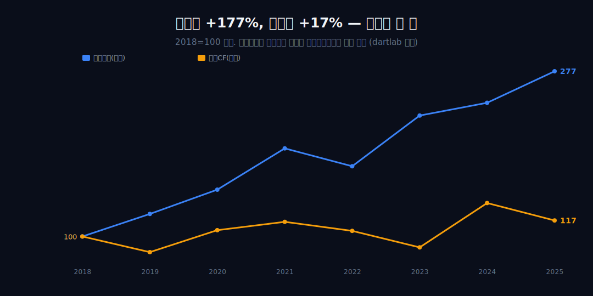
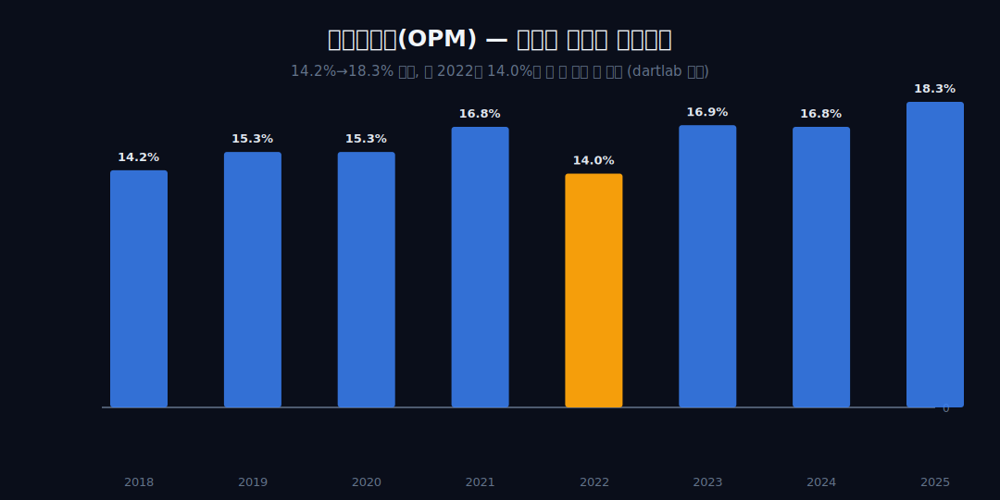
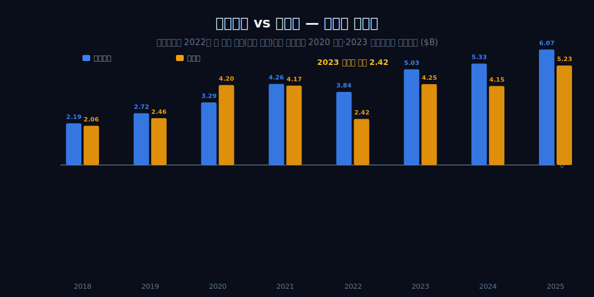
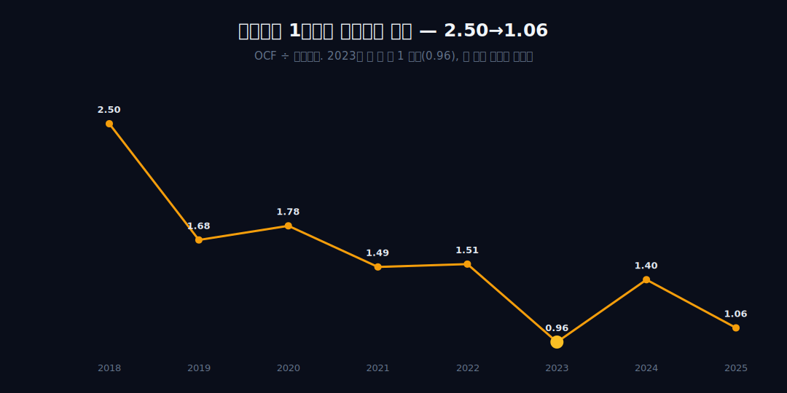
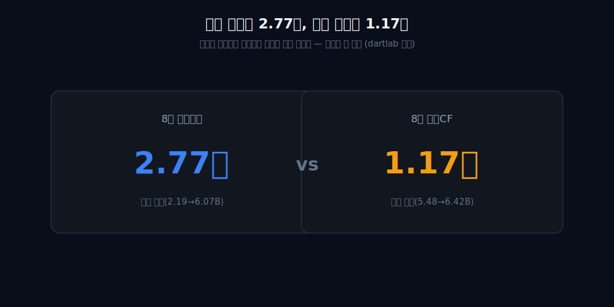
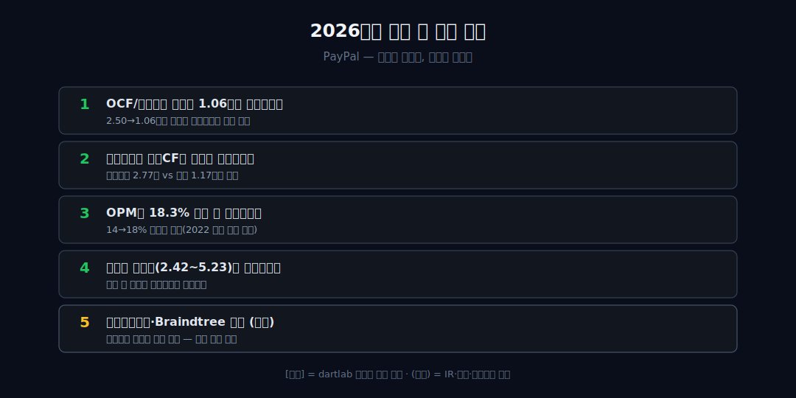

<script>
import ComboChart from '$lib/components/blog/ComboChart.svelte';
</script>

> **데이터 기준**: 2026-06-14 dartlab 실측 — PayPal(PYPL) **연결(EDGAR, USD)** 기준, 분기 데이터를 역년으로 합산. 총거래액(TPV)·테이크레이트·브랜디드 체크아웃 vs 언브랜디드(Braintree) 세그먼트·주가·자사주는 연결 손익에 분해되지 않으므로 **[외부 인용]**으로 표기하며 dartlab 연결로는 증명되지 않는다. 내부에서 검증되는 것은 4줄(매출·영업이익·순이익·영업현금흐름)과 그 비율까지다.
>
> **핵심 숫자**: 매출 **+115%**·영업이익 **+177%**(OPM 14.2%→18.3%) vs 영업CF **+17%** · 영업이익 1달러당 영업현금 **2.50 → 1.06** · 배율은 2023년 딱 한 번 **0.96**(1 미만)이나 전 구간 추세는 우하향 · 매출 역성장 **0개 해**(영업이익은 2022 한 해 −9.9%)
>
> **이 글의 용어**: OPM(영업이익률) = 영업이익/매출 · NPM(순이익률) = 순이익/매출, 별개 비율 · 영업CF(OCF) = 영업활동으로 실제 들어온 현금 · OCF/영업이익 배율 = 영업이익 1달러당 따라온 영업현금(현금전환 강도) · 테이크레이트 = 거래액에서 떼는 수수료율[외부] · 브랜디드/언브랜디드 = 페이팔 버튼으로 끝나는 고마진 결제 vs 브랜드가 안 보이는 저마진 처리[외부].

---

## 프롤로그 — 두 표가 서로 다른 이야기를 한다

손익계산서를 보면 페이팔은 8년 내내 좋아졌다 — 매출도, 영업이익도, 영업이익률도 우상향. 그런데 현금흐름표 맨 윗줄(영업현금흐름)만 떼어 보면 2018년 $5.48B, 2025년 $6.42B로 거의 같은 자리다. 두 표가 서로 다른 이야기를 한다.



이 글은 주가가 왜 80% 빠졌나(시장 서사)를 묻지 않는다. 대신 '영업이익 1달러가 데려오는 영업현금이 몇 달러인가'라는 단 하나의 비율을 8년간 따라가, 그 숫자가 2.50에서 1.06으로 줄어드는 과정을 내부 연결 4줄로만 추궁한다. 왜 줄었는지의 원인은 미리 약속한다 — 내부 수치로는 끝내 증명되지 않으며, 그건 정직하게 '모른다'로 닫을 것이다.


---

## 1막 — 두 이익률 곡선은 같은 방향인가: 손익은 정말 좋아졌다

**영업이익률(OPM)은 한 지표만 좋아 보이는 착시인가, 8개 점 모두로 실제 개선됐나?**

```python
import dartlab
c = dartlab.Company("PYPL")
c.select("IS", freq="Q")  # 분기→역년 합산
```

매출 $15.45B→$33.17B(+115%)인데 영업이익은 $2.19B→$6.07B(+177%)로 더 빠르게 늘어 OPM이 14.2%→18.3%로 **4.1%p 개선**됐다. 단 단조 상승은 아니다 — 2022년 16.8%→14.0%로 한 번 함몰했다 회복했다. OPM 8개 점(14.2/15.3/15.3/16.8/14.0/16.9/16.8/18.3)을 추세 단정이 아니라 사실로 깐다.



결론: 손익계산서 윗단은 확실히 개선됐다. 그렇다면 이 개선이 아래로 깨끗이 내려왔는지가 다음 질문이다 — 2막.

---

## 2막 — 영업이익과 순이익은 같은 리듬으로 움직였나: 밑단의 출렁임

**윗단(영업) 개선이 최종이익(순이익)까지 같은 리듬으로 내려왔나, 중간에서 출렁이나?**

영업이익은 2022년 한 해만 후퇴($4.26B→$3.84B, −9.9%)하는 거의 단조 우상향인데, 순이익은 2.06→2.46→4.20(2020 점프)→4.17→2.42(2023 반토막)→4.25→4.15→5.23으로 훨씬 출렁인다. 순이익률(NPM)도 13.3%(2018)→15.8%(2025)로 개선됐지만 2022년 8.8%로 깊게 함몰해, 영업이익률보다 더 크게 흔들린다.



결정적 어긋남 하나 — 2020년 순이익(4.20)이 2021년(4.17)보다 큰데 영업이익은 반대로 3.29<4.26이다. 영업 밑단과 순이익 밑단의 방향이 뒤집힌 해가 있다. 이는 영업 외 항목(지분 평가손익 등)의 존재와 양립하나, 원인은 단정하지 않는다. 영업·순이익 모두 '이익'은 늘었다는 건 분명한데, 다음은 이 이익이 현금으로 들어왔느냐다 — 3막.

---

## 3막 — 현금은 어디서 갈라졌나: 이익 1달러당 현금 2.50 → 1.06

**이익 곡선이 우상향인데 영업현금흐름(OCF)은 왜 제자리($5.48B→$6.42B, +17%)인가?**

```python
c.select("CF", freq="Q")  # 영업현금흐름 vs 영업이익
```

영업이익은 8년에 2.77배가 됐는데 OCF는 1.17배에 그쳤다. 이 글의 핵심 지문 — OCF/영업이익 배율이 2018년 **2.50**(OCF가 영업이익의 2.5배)에서 2025년 **1.06**으로 줄었다. 영업이익 1달러당 따라오는 영업현금이 2.50달러에서 1.06달러로 묽어졌다.



OCF 자체는 5.48→4.56→5.85→6.34→5.81→4.84→7.45→6.42로 등락하며 추세 없이 제자리다(전 구간 최저는 2019년 $4.56B). 비전문가용 한 줄 — 곳간(현금)이 이익만큼 안 차면 회사는 투자·배당·자사주를 위해 빚을 내거나 다른 곳을 줄여야 한다. 그래서 이 간극이 문제다. 단 '현금 위기·손실 예고'로의 비약은 금지한다 — 페이팔은 매 해 영업CF가 플러스이며, 전환 비율이 하락한 관찰까지만이다. 정반대 현금 지문 — 현금이 이익을 *앞지르는* 회사 — 는 같은 배치의 [서비스나우](/blog/NOW-servicenow)가 보여준다. 이 하락이 한 해의 사건인가, 8년의 추세인가 — 4막.

---

## 4막 — 한 번의 사건인가, 8년의 미끄러짐인가: 배율 추세를 분리한다

**배율 하락이 2023년 한 해의 충격인가, 전 구간에 걸친 구조적 추세인가?**

OCF/영업이익 배율은 2.50 → 1.68 → 1.78 → 1.49 → 1.51 → **0.96**(2023) → 1.40 → 1.06이다. 2023년에 딱 한 번 1 미만으로 떨어졌다 회복했지만, 전 구간을 잇는 추세선은 우하향이다 — 단일 사건이 아니라 구조적 미끄러짐이다.

같은 2023년에 순이익 저점($2.42B)과, 영업CF가 전 구간에서 두 번째로 낮은 값($4.84B, 최저는 2019년 $4.56B)이 겹친다. 두 약점이 같은 해에 양립한다는 관찰까지만 — 한쪽이 다른 쪽을 일으켰다는 인과는 4줄 수치로 분리할 수 없다. 사건이 아니라 추세라면, 이 추세가 무엇과 시기적으로 겹치는지가 다음 질문이다 — 5막.

---

## 5막 — 매출 둔화와 마진 개선이 같은 시기에, 그리고 시장은 반대로 갔다

**현금전환 약화가 성장 둔화기와 겹치는가, 그리고 그 시기에 시장은 어떻게 평가했나?**

매출 YoY는 +15%(2019)→+21%→+18%→+8%→+8%→+7%→+4%(2025)로, 20%대에서 한 자릿수로 내려앉는 시점(2022~)이 배율이 1.5 아래로 눌리는 후반부와 같은 구간이다. 역설 — 같은 후반부에 OPM은 오히려 16.9→18.3%로 개선됐다(인과 아님, 시기 양립). 매출은 8년간 역성장이 0개 해이고, 영업이익만 2022년 한 해 후퇴했다는 점을 다시 짚어 둔다.

여기서 역사가 각도를 한 겹 빌린다 — 시장은 같은 시기 정반대로 움직였다. **[외부 인용]** 주가는 2021년 중반 사상최고 약 $310에서 이후 최대 −81% 빠지며 약 3년간 시총 80%가 증발했고(같은 기간 S&P500 +16%, [Nasdaq](https://www.nasdaq.com/articles/paypal-stock-is-down-80-from-highs:-buying-opportunity)), 이는 외부 영역이다. 즉 내부 펀더멘털(매출·영업이익·OPM)은 역성장 없이 좋아지는데 시장은 디레이팅했다 — 내부 '이익↔현금' 모순 위에 외부 '시장↔펀더멘털' 모순이 한 겹 더 얹힌다. 단 디레이팅과 펀더멘털 개선이 '동시에 존재했다'는 관찰까지만이고, 어느 쪽이 원인이라 말하지 않는다.


---

## 6막 — 그래서 이 회사를 무엇으로 읽나: 증명된 것과 빌려온 가설을 가른다

**내부 수치만으로 정직하게 말할 수 있는 결론은 무엇이고, 무엇은 끝내 말할 수 없나?**

내부로 증명된 것은 넷이다 — ① OPM +4.1%p 개선 ② 영업이익 +177% vs OCF +17%의 큰 괴리 ③ OCF/영업이익 배율 2.50→1.06 추세 하락 ④ 순이익의 큰 변동성($2.42~5.23B). 끝내 말할 수 없는 것은 이 괴리의 *원인*이다. 연결 손익·현금 4줄은 '왜 현금전환이 약해졌나'에 답하지 못한다.



외부 가설은 표식을 달아 가설로만 남긴다. **[외부 인용]** 성장의 무게중심이 고마진 브랜디드 체크아웃에서 저마진 언브랜디드 처리(Braintree, 2024년 PSP TPV 약 $607B 중 $572B, 추정 테이크레이트 약 1.85% vs 전사 블렌디드 1.72%)로 이동했다는 것([ainvest](https://www.ainvest.com/news/paypal-branded-checkout-fortress-profit-competitive-landscape-2506/)), 자본환원이 공격적이어서 2023년 자사주 매입 $5B가 잉여현금흐름의 119%였다는 것([SEC DEF 14A](https://www.sec.gov/Archives/edgar/data/0001633917/000119312524090908/d554828ddef14a.htm))은 외부다. 후자는 3막의 '곳간이 이익만큼 안 차는' 내부 긴장과 양립하나, 믹스 이동이 현금 지문의 원인이라 단정하지 않는다.

이 회사를 같은 결제망의 [비자](/blog/V-visa)·[마스터카드](/blog/MA-mastercard)나 closed-loop의 [아메리칸 익스프레스](/blog/AXP-american-express)와 나란히 두면, 그들이 통행료망의 안정된 마진을 누리는 동안 페이팔은 이익과 현금이 갈라지는 다른 지문을 남긴다. [아마존](/blog/AMZN-amazon)처럼 간판 뒤 진짜 엔진을 찾는 독법으로 보면, 페이팔의 미결은 '엔진은 어느 쪽(브랜디드/언브랜디드)인가'이고 그 답은 연결 4줄 밖에 있다. 한 줄 대비 — 서비스나우는 OCF≫이익으로 '선불받는 구독'의 지문을, 페이팔은 OCF가 이익을 못 따라가는 정반대 지문을 남긴다.

---

## 2026년에 봐야 할 다섯 가지

1. **OCF/영업이익 배율이 1.06에서 반등하는가** — 2.50→1.06으로 묽어진 현금전환의 다음 방향. 이익이 현금으로 다시 두껍게 전환되는지의 단일 지표 [내부].
2. **영업이익과 영업CF의 격차가 좁혀지는가** — 영업이익 2.77배 vs 현금 1.17배의 간극 [내부].
3. **OPM이 18.3% 위로 더 개선되는가** — 14→18% 개선의 지속(2022 같은 함몰 재발 여부) [내부].
4. **순이익 변동성($2.42~5.23B)이 안정되는가** — 영업 외 항목이 최종이익을 흔드는지 [내부].
5. **테이크레이트·Braintree 믹스 (외부)** — 현금전환 약화의 후보 가설. 내부 증명 불가, 전부 외부.



---

## 재무제표 — 최근 8개년 (dartlab 연결, $B)

> 연결(EDGAR, USD)·분기 합산(역년) 기준. dartlab에서 직접 확인:
> ```python
> import dartlab
> c = dartlab.Company("PYPL")
> c.select("IS", freq="Q")   # 매출·영업이익·순이익
> c.select("CF", freq="Q")   # 영업활동현금흐름
> ```

<ComboChart data={[{year:"2018",매출:15.45,영업이익:2.19,영업현금흐름:5.48},{year:"2019",매출:17.77,영업이익:2.72,영업현금흐름:4.56},{year:"2020",매출:21.45,영업이익:3.29,영업현금흐름:5.85},{year:"2021",매출:25.37,영업이익:4.26,영업현금흐름:6.34},{year:"2022",매출:27.52,영업이익:3.84,영업현금흐름:5.81},{year:"2023",매출:29.77,영업이익:5.03,영업현금흐름:4.84},{year:"2024",매출:31.80,영업이익:5.33,영업현금흐름:7.45},{year:"2025",매출:33.17,영업이익:6.07,영업현금흐름:6.42}]} lineKeys={["매출"]} barKeys={["영업이익","영업현금흐름"]} lineColors={["#0ea5e9"]} barColors={["#3b82f6","#f59e0b"]} title="매출(라인) vs 영업이익·영업현금흐름(막대) — $B" unit="$B" />

| 항목 ($B) | 2018 | 2019 | 2020 | 2021 | 2022 | 2023 | 2024 | 2025 |
|---|---:|---:|---:|---:|---:|---:|---:|---:|
| 매출 | 15.45 | 17.77 | 21.45 | 25.37 | 27.52 | 29.77 | 31.80 | 33.17 |
| 영업이익 | 2.19 | 2.72 | 3.29 | 4.26 | 3.84 | 5.03 | 5.33 | 6.07 |
| 순이익 | 2.06 | 2.46 | 4.20 | 4.17 | 2.42 | 4.25 | 4.15 | 5.23 |
| 영업이익률(OPM) | 14.2% | 15.3% | 15.3% | 16.8% | 14.0% | 16.9% | 16.8% | 18.3% |
| 순이익률(NPM) | 13.3% | 13.8% | 19.6% | 16.4% | 8.8% | 14.3% | 13.1% | 15.8% |
| 영업현금흐름 | 5.48 | 4.56 | 5.85 | 6.34 | 5.81 | 4.84 | 7.45 | 6.42 |
| OCF/영업이익 | 2.50 | 1.68 | 1.78 | 1.49 | 1.51 | 0.96 | 1.40 | 1.06 |

이 표를 한 줄로 읽으면 이렇다 — **영업이익 행은 2022년 한 번만 후퇴하며 2.19에서 6.07로 거의 우상향인데, 영업현금흐름 행은 5.48에서 6.42로 등락만 하다 제자리다.** 그 결과 맨 아래 OCF/영업이익 행은 2.50에서 1.06으로 묽어진다 — 영업이익 1달러가 데려오는 현금이 절반 이하로 줄었다는 뜻이다. 손익은 좋아지는데 현금화가 약해진다는 게 이 표의 핵심이고, 그 *원인*(믹스 이동)은 이 표 어디에도 안 적혀 있다(외부).

---

## 검증표

본문 인용 수치를 dartlab 호출과 결과로 검증한다. 외부 출처(TPV·테이크레이트·주가·자사주·CEO)는 분리 표기. 📅 dartlab 실측 2026-06-14 · PayPal(PYPL) 연결(EDGAR, USD)·분기 합산 기준.

| 본문 수치 | 출처 / 호출 | 결과 |
|---|---|---|
| 매출 +115%·영업이익 +177%·OPM 14.2→18.3% | `c.select("IS",freq="Q")` 합산 | ✓ 실측 |
| 2022 영업이익 한 해만 후퇴($4.26→3.84B, −9.9%), 매출 역성장 0개 해 | `c.select("IS",[...])` | ✓ 실측 |
| 영업CF +17%($5.48→6.42B), 전 구간 최저 2019 $4.56B | `c.select("CF",freq="Q")` | ✓ 실측 |
| OCF/영업이익 배율 2.50(2018)→1.06(2025), 2023 0.96(유일 1 미만) | 영업CF/영업이익 | ✓ 실측 |
| 영업이익 2.77배 vs OCF 1.17배 | 합산 비율 | ✓ 실측 |
| 순이익 2.06→5.23B(+154%), 2023 저점 2.42·2020>2021 역전 | `c.select("IS",[...])` | ✓ 실측 |
| NPM 13.3→15.8%, 2022 8.8% 함몰 | 순이익/매출 | ✓ 실측 |
| 주가 사상최고 약 $310→ 최대 −81%·시총 80% 증발 | [Nasdaq](https://www.nasdaq.com/articles/paypal-stock-is-down-80-from-highs:-buying-opportunity) | 외부 인용·연결 증명 0 |
| Braintree TPV $572B·테이크레이트 1.85% vs 블렌디드 1.72% | [ainvest](https://www.ainvest.com/news/paypal-branded-checkout-fortress-profit-competitive-landscape-2506/) | 외부 인용 |
| 2023 자사주 $5B = 잉여현금흐름의 119% | [SEC DEF 14A](https://www.sec.gov/Archives/edgar/data/0001633917/000119312524090908/d554828ddef14a.htm) | 외부 인용 |
| 2023.9 Alex Chriss CEO 취임·Braintree 물량 축소 | [PRNewswire](https://www.prnewswire.com/news-releases/paypal-names-alex-chriss-as-next-president-and-ceo-301899740.html) | 외부 인용 |
| 브랜디드/언브랜디드 세그먼트 — 연결에 분해 없음 | dartlab 데이터 한계 | 주의/제외 |

본문의 숫자 중 이 표에 없는 것은 발행 차단 대상이다. TPV·테이크레이트·주가·자사주는 dartlab 연결로 증명되지 않는 외부 인용이며, 현금전환 약화를 'Braintree 믹스 이동 때문'이라 단정하지 않고(외부 가설과 양립까지만), 주가 −81%를 내부 손익으로 귀속하지 않으며, 영업CF의 정체를 '손실 예고'로 비약하지 않는다(매 해 플러스) — 연결이 증명하는 것은 '이익은 +177%인데 현금은 +17%, 영업이익 1달러당 현금이 2.50에서 1.06으로 묽어졌다'는 지문까지다.
