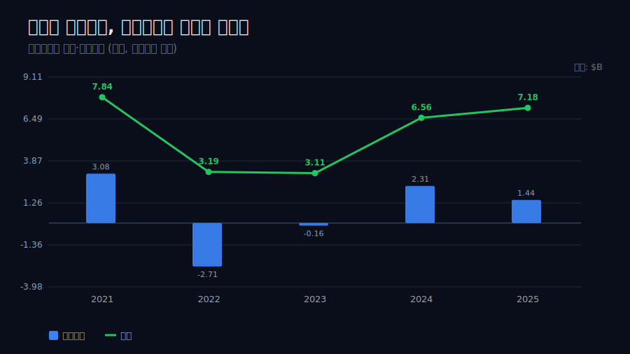
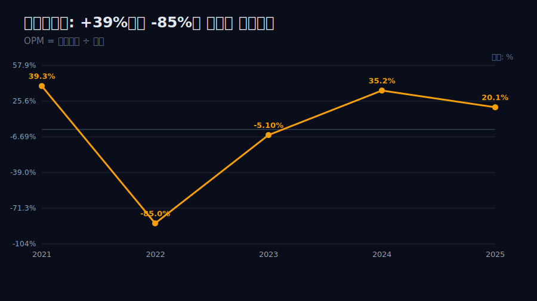
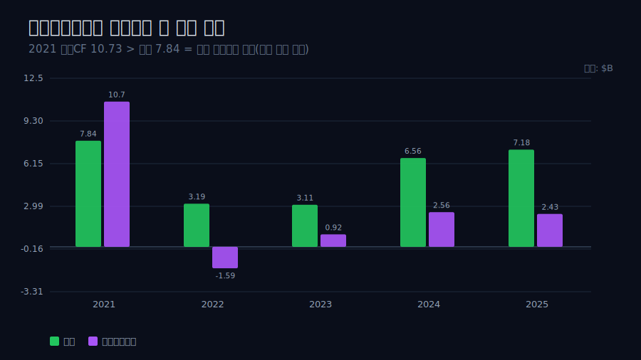
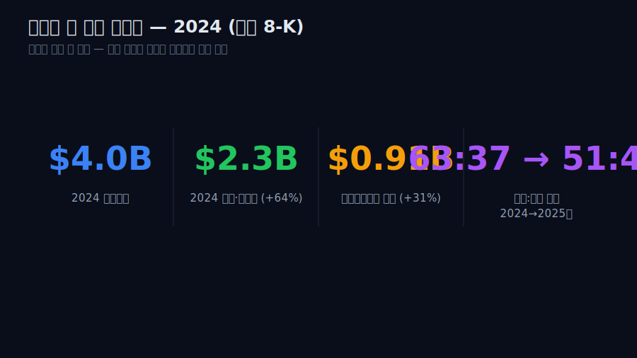
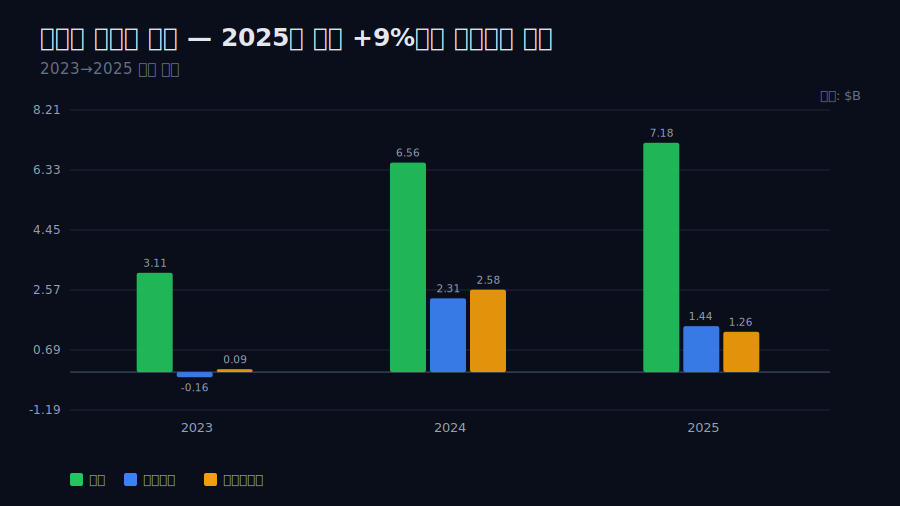
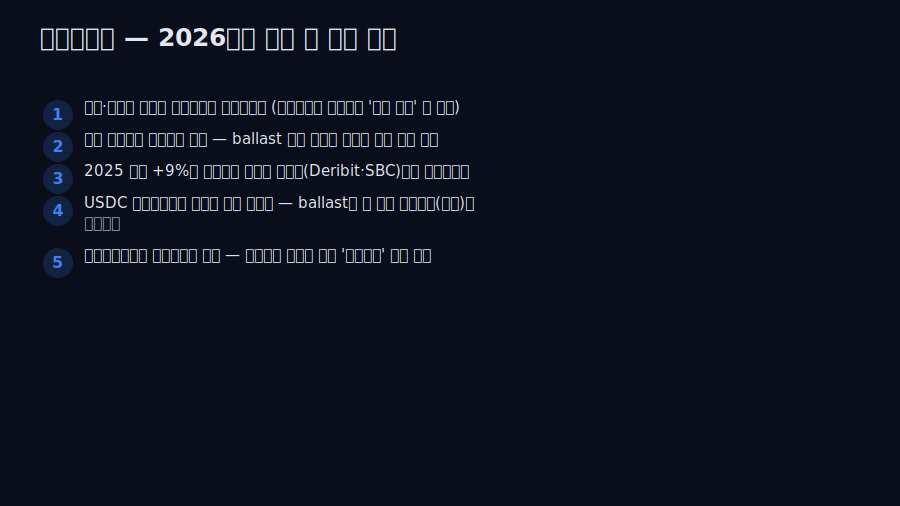

<script>
import ComboChart from '$lib/components/blog/ComboChart.svelte';
import StackBar from '$lib/components/blog/StackBar.svelte';
</script>

> **데이터 기준**: 2026-06-14 dartlab 실측 — Coinbase Global(COIN) **미국 연결(USD)** 기준, 분기 데이터를 달력연도로 합산. 내부로 쓰는 라인은 매출·영업이익·당기순이익·영업현금흐름 4개. 거래수익 vs 구독·서비스 *비중*, USDC 시가총액, SEC 소송·Deribit 인수·S&P500 편입은 연결 손익에 안 나오므로 **8-K·언론(외부 인용)**으로 표기. ※2021 영업현금흐름은 고객 수탁자금(safeguarding) 변동이 섞여 자기 현금창출력으로 읽지 않는다. ※대차대조표 항목은 매핑이 불안정해 인용에 주의.
>
> **핵심 숫자**: 매출 2021 **$7.84B** → 2022 **$3.19B**(-59%) → 2025 **$7.18B** · 영업이익 2021 **+3.08B** → 2022 **-2.71B**(부호 전환) → 2025 **+1.44B** · OPM 2022 **-85.0%** · 2021 영업CF **10.73B**(매출보다 큼=수탁자금 섞임) · 2024 매출 +111% V자 반등(외부)
>
> **이 글의 용어**: 거래수수료 = 사용자가 코인을 사고팔 때 떼는 수수료(매출 핵심) · 구독·서비스 = 거래에 안 묶인 수익(USDC 스테이블코인 이자·스테이킹·커스터디) · operating leverage = 매출이 흔들릴 때 고정비 탓에 이익이 더 크게(또는 부호까지) 흔들리는 현상 · safeguarding(수탁) = 고객이 맡긴 코인·현금, 회사 돈이 아님.

---

## 프롤로그 — 같은 회사, 1년 만에 매출 반토막

대부분의 회사는 매출이 한 해에 5~10% 움직인다. 코인베이스는 **2021년 7.84B를 벌고, 2022년 3.19B를 벌었다.** 같은 회사가, 1년 만에, 매출의 59%가 사라졌다.



이건 사고가 아니라 *구조*다. 그리고 매출이 반토막 나자 영업이익은 단순히 줄어든 게 아니라 **+3.08B에서 -2.71B로 부호가 뒤집혔다.** 관통선은 하나다. **"매출을 자기가 정하지 못하는 회사의 손익은, 외형이 흔들릴 때 *부호*까지 바뀐다 — 그리고 회사는 그 인질 상태에서 어떻게 벗어나려 하는가?"** 이 한 문장 이후로는 '롤러코스터' 같은 수사 대신 손익 라인의 부호와 배수로만 말한다.

---

## 1막 — 무엇이 매출을 그렇게 흔드나

**왜 매출의 *변동성*부터 보나.** 이 회사의 모든 손익 라인이 이 한 줄(매출)에 끌려다니기 때문이다.

```python
import dartlab
c = dartlab.Company("COIN")
c.select("IS", ["매출액"], freq="Q")  # 달력연도 합산
```

매출은 2021 7.84B → 2022 3.19B → 2023 3.11B → 2024 6.56B → 2025 7.18B. 위로도 아래로도 두 배씩 움직인다. 이유는 매출의 핵심이 **거래수수료**이고, 거래량은 암호화폐 *가격*에 끌려다니기 때문이다 — 코인값이 오르면 사람들이 더 많이·더 크게 사고팔고, 내리면 발길이 끊긴다. 외부 공시(8-K)에 따르면 2024년 매출 6.6B 중 **거래수익이 4.0B, 구독·서비스가 2.3B**였다(거래가 여전히 더 큼, [외부 인용](https://www.sec.gov/Archives/edgar/data/0001679788/000167978825000021/q424shareholderletter.htm)). 거래수수료가 매출의 다수파인 한, 매출은 회사가 정하는 게 아니라 *시장이 정한다.* 비자([이미 발간](/blog/V-visa))의 매출이 결제 *건수*라는 비교적 안정된 흐름에 실리는 것과 정반대 자리다.

---

## 2막 — 매출이 흔들리면 손익의 *부호*가 바뀐다

**왜 매출 다음에 곧장 영업이익의 부호를 보나.** 매출이 반토막일 때 이익이 '줄었다'가 아니라 '음(-)이 됐다'는 점이 이 회사 손익의 본질이기 때문이다.

```python
c.select("IS", ["매출액","영업이익"], freq="Q")  # 부호 전환 확인
```

| 항목 ($B) | 2021 | 2022 | 2023 | 2024 | 2025 |
|---|---:|---:|---:|---:|---:|
| 매출 | 7.84 | 3.19 | 3.11 | 6.56 | 7.18 |
| 영업이익 | 3.08 | **-2.71** | -0.16 | 2.31 | 1.44 |
| OPM | 39.3% | **-85.0%** | -5.1% | 35.2% | 20.1% |

2022년, 매출이 -59% 빠지자 영업이익은 +3.08B에서 **-2.71B**로 부호가 뒤집혔다(OPM -85%). 매출은 절반으로 줄었는데 비용은 그 속도로 줄지 않았기 때문이다 — 인력·기술·마케팅 같은 비용이 매출보다 천천히 줄면, 외형 하락이 이익의 부호까지 밀어버린다(operating leverage의 음의 방향). 단 선을 긋는다. 이건 *관찰*이다 — '매출 -59%에 영업이익이 음으로 갔다'까지다. 비용이 정확히 얼마나 경직적이었는지(고정비 비중)는 내부 4라인 밖이라, '고정비 구조 때문'은 단정하지 않고 정합까지만 둔다.



---

## 3막 — 현금흐름의 착시: 매출보다 큰 영업현금흐름

**왜 영업이익 다음에 현금흐름의 *함정*을 짚나.** 2021년 숫자를 잘못 읽으면 '엄청난 현금기계'로 오독하기 쉬운데, 그게 이 회사 회계의 가장 흔한 오해이기 때문이다.

```python
c.select("CF", ["영업활동현금흐름"], freq="Q")  # 매출과 비교
```

2021년 영업현금흐름은 **10.73B**로, 그해 매출 7.84B보다도 컸다. 보통 영업현금흐름이 매출보다 크면 비현실적이다. 답은 회계에 있다 — 코인베이스는 고객이 맡긴 코인·현금(safeguarding, 수탁자금)을 다루고, 그 자금의 *변동*이 영업현금흐름에 섞여 들어온다. 즉 10.73B는 회사가 *벌어들인* 현금이 아니라 고객 자금 흐름이 상당 부분 얹힌 숫자다.



그래서 이 글은 영업현금흐름을 '자기 현금창출력'의 증거로 쓰지 않는다 — 사이클이 식자 2022년엔 -1.59B로 같이 음이 됐고, 2023~2025는 0.92→2.56→2.43B로 영업이익 곁을 따라간다. 수탁자금이 섞인 호황기 숫자만 떼어 '현금부자'라 부르면 거짓이 된다.

---

## 4막 — 거래에 안 묶인 매출축이 동시에 커진다

**왜 부호 전환 다음에 '구독·서비스'를 보나.** 거래수수료가 사이클에 흔들리는 동안, *거래에 안 묶인* 매출이 동시에 커지고 있다는 사실이 이 회사를 단순한 사이클 베팅과 가르기 때문이다.

거래에 안 묶인 그 매출이 **구독·서비스** 라인이다 — 핵심은 **USDC 스테이블코인 이자**(맡아둔 달러 준비금에서 나오는 이자), 스테이킹, 커스터디다. 외부 공시에 따르면 2024년 구독·서비스 매출은 **2.3B(+64%)**, 그중 스테이블코인 매출이 **910M(+31%)**이었다([외부 인용](https://www.sec.gov/Archives/edgar/data/0001679788/000167978825000088/q125shareholderletter.htm)).



이 비거래 매출의 성격은 2025년 1분기에 또렷이 드러났다 — 거래수익은 전분기 대비 **-19%**로 빠졌는데 구독·서비스는 **+9%**로 늘었고, 코인베이스 내 평균 USDC 보유액이 전분기 대비 +49%인 12.3B로 늘며 USDC 시가총액은 600억 달러를 넘어 사상 최고를 찍었다([외부 인용](https://www.sec.gov/Archives/edgar/data/0001679788/000167978825000088/q125shareholderletter.htm)). 단 균형추를 단다 — *아직 거래가 더 크다.* 외부 공시상 매출 구성은 2024년 거래:구독 약 63:37에서 2025년 상반기 약 51:49로 옮겨갔지만(외부), 키는 아직 거래수수료가 쥐고 있다. '구조가 비거래 쪽으로 넘어갔다'는 결론은 이르고, *마진 하락과 매출축 다변화가 동시에 관찰된다*까지가 내부·외부가 함께 말할 수 있는 선이다 — '회사가 의도적으로 그렇게 했다'는 단정은 내부 수치로 증명되지 않으므로 두지 않는다.

---

## 5막 — 회복도 코인값 따라, 그리고 +9% 매출에 줄어든 이익

**왜 회복 국면(2024~2025)을 따로 보나.** 인질 구조는 폭락에서만 보이는 게 아니라 *반등*에서도 똑같이 보이기 때문이다.

```python
c.select("IS", ["매출액","영업이익","당기순이익"], freq="Q")  # 2024~2025
```

2024년 매출은 6.56B로 전년 대비 +111% V자 반등했다(외부 8-K 확인, 내부 합산 정합). 폭락이 코인값을 따라갔듯 회복도 코인값을 따라갔다 — 같은 사이클 민감도의 양면이다. 그런데 2025년엔 다른 결이 보인다. **매출은 7.18B로 +9% 늘었는데 영업이익은 2.31B→1.44B로 오히려 줄었다(OPM 35.2%→20.1%, 거의 반토막).** 매출이 느는데 영업이익이 주는 건 비용이 더 빨리 늘었다는 뜻이다. 외부 공시는 그 비용 증가에 USDC 보상·마케팅, Deribit 인수 관련 지출, 그리고 2분기 데이터 탈취 사건 대응 일회성 비용 약 **3.07억 달러**가 섞였다고 밝힌다([외부 인용](https://www.sec.gov/Archives/edgar/data/0001679788/000167978825000153/q225shareholderletter.htm)). 단 이 항목들이 영업이익 감소의 *전부*인지는 내부 4라인으로 분해되지 않는다 — 외부 주주서한 근거로 영업이익 감소와 '양립'한다까지만 둔다. 참고로 당기순이익은 2024 2.58B(영업이익 2.31B보다 큼=암호화폐 투자평가·세금 등 영업단 밖)·2025 1.26B로, 영업이익과 또 다른 평면에서 움직인다.



---

## 6막 — '왜 거래량이 그렇게 움직이나'는 경계에서 멈춘다

**왜 마지막에 외부 사건을 두되 거기서 손익 구조를 끌어내지 않나.** S&P500 편입 같은 큰 뉴스에서 '구조가 좋아졌다'로 비약하는 순간 검증선을 넘기 때문이다.

거래량이 *왜* 그렇게 출렁이는지 — 암호화폐 가격, 투자 심리, 규제 — 는 전부 내부 4라인 밖이다. 내부 수치가 단단하게 말하는 건 '매출이 가격 사이클에 인질이고, 외형이 흔들리면 영업이익의 부호까지 바뀐다'까지다. 2025년의 두 외부 사건도 *흥미로운 사실*로만 둔다. SEC는 2023년 제기했던 소송을 **2025년 2월 자진 철회**했고(연 5천만 달러 이상 법적 비용 절감 추정, [외부 인용](https://www.coindesk.com/policy/2024/03/27/coinbase-loses-most-of-motion-to-dismiss-sec-lawsuit)), 코인베이스는 **2025년 5월 19일 S&P500에 편입**된 첫 암호화폐 native 기업이 됐다([외부 인용](https://press.spglobal.com/2025-05-12-Coinbase-Global-Set-to-Join-S-P-500)). 같은 해 8월엔 파생거래소 Deribit를 **29억 달러**에 인수했다([외부 인용](https://www.theblock.co/post/366957/coinbase-completes-2-9-billion-cash-and-stock-acquisition-of-deribit)).

이 셋은 법적 불확실성 해소·제도권 편입·파생 확장이라는 *정합*이지, 거래수수료가 가격 사이클에서 풀려났다는 *인과*가 아니다. 결론은 경계에서 닫는다 — *내부 수치는 '매출이 인질이고 영업이익 부호가 바뀐다, 회사는 ballast를 키우는 중'까지 말한다. 그 인질에서 정말 벗어났는지는 다음 약세장이 와봐야 안다.* 이익률이 39%였다가 -85%였다가 다시 20%인 회사 — 그 진폭 자체가 이 회사의 정체다.

---

## 2026년에 봐야 할 다섯 가지

1. **구독·서비스 비중이 거래를 추월하는가** — 2024년 거래 4.0B > 구독·서비스 2.3B. 약세장에서 이 비중이 역전되면 '인질에서 벗어났다'는 첫 내부 증거가 된다(비중은 외부 8-K로만 확인).
2. **다음 약세장의 영업이익 부호** — 2022엔 매출 -59%에 영업이익이 음이 됐다. 다음 하락기에 ballast 덕에 부호를 지키면 구조 변화의 실증이다.
3. **2025년 매출 +9%에 영업이익 감소의 정체** — Deribit 인수비용·주식보상 같은 일회성인지, 구조적 비용 증가인지. 일회성이면 2026 영업이익이 다시 매출을 따라잡아야 한다.
4. **USDC 스테이블코인 이자의 금리 민감도** — 스테이블코인 매출은 준비금 이자라 금리 하강 국면에서 줄 수 있다(외부). ballast 자체가 또 다른 외생 변수(금리)에 묶이는지 본다.
5. **영업현금흐름과 영업이익의 거리** — 수탁자금이 섞이는 영업현금흐름이 영업이익과 얼마나 벌어지는지. 둘의 거리가 클수록 '현금기계' 오독 위험이 크다.



---

## 재무제표 — 최근 5개년 (dartlab 연결, $B)

> 미국 연결(USD)·달력연도 합산 기준. 거래/구독 매출 *분해*는 외부 8-K 영역(내부는 총매출). 2021 영업현금흐름은 고객 수탁자금이 섞여 자기 현금창출력으로 읽지 않는다. dartlab에서 직접 확인:
> ```python
> import dartlab
> c = dartlab.Company("COIN")
> c.select("IS", ["매출액","영업이익","당기순이익"], freq="Q")
> c.select("CF", ["영업활동현금흐름"], freq="Q")
> ```

<ComboChart data={[{year:"2021",매출:7.84,영업이익:3.08,당기순이익:3.62},{year:"2022",매출:3.19,영업이익:-2.71,당기순이익:-2.62},{year:"2023",매출:3.11,영업이익:-0.16,당기순이익:0.09},{year:"2024",매출:6.56,영업이익:2.31,당기순이익:2.58},{year:"2025",매출:7.18,영업이익:1.44,당기순이익:1.26}]} lineKeys={["매출"]} barKeys={["영업이익","당기순이익"]} lineColors={["#22c55e"]} barColors={["#3b82f6","#f59e0b"]} title="매출(라인) vs 영업이익·당기순이익(막대) — $B" unit="$B" />

| 항목 ($B) | 2021 | 2022 | 2023 | 2024 | 2025 |
|---|---:|---:|---:|---:|---:|
| 매출 | 7.84 | 3.19 | 3.11 | 6.56 | 7.18 |
| 영업이익 | 3.08 | -2.71 | -0.16 | 2.31 | 1.44 |
| OPM | 39.3% | -85.0% | -5.1% | 35.2% | 20.1% |
| 당기순이익 | 3.62 | -2.62 | 0.09 | 2.58 | 1.26 |
| 영업현금흐름 | 10.73 | -1.59 | 0.92 | 2.56 | 2.43 |

이 표를 한 줄로 읽으면 이렇다 — **매출 행이 7.84→3.19→7.18로 출렁이는 동안, 영업이익 행은 +에서 -로 다시 +로 *부호*가 바뀐다.** 매출이 5~10%씩 움직이는 평범한 회사라면 영업이익 부호가 바뀔 일이 없다. 부호가 바뀐다는 건 매출 변동이 비용의 경직성을 넘어선다는 뜻이고, 그게 '매출을 자기가 못 정하는' 회사의 손익이다. 2021 영업현금흐름 10.73B가 매출보다 크다는 점에 유의 — 고객 수탁자금이 섞여 있어 *자기 현금*으로 읽으면 안 된다.

---

## 검증표

본문 인용 수치를 dartlab 호출과 결과로 검증한다. 외부 출처(거래/구독 분해·USDC·SEC·Deribit·S&P500)는 분리 표기. 📅 dartlab 실측 2026-06-14 · Coinbase Global(COIN) 미국 연결(USD)·달력연도 합산 기준.

| 본문 수치 | 출처 / 호출 | 결과 |
|---|---|---|
| 매출 2021 7.84B → 2022 3.19B (-59%) | `c.select("IS",["매출액"],freq="Q")` 합산 | ✓ 실측 |
| 매출 2023 3.11 → 2024 6.56 → 2025 7.18B | `c.select("IS",["매출액"])` | ✓ 실측 |
| 영업이익 2021 +3.08B → 2022 -2.71B (부호 전환) | `c.select("IS",["영업이익"])` | ✓ 실측 |
| OPM 2022 -85.0% (=-2.71/3.19) | IS 계산 | ✓ 실측 |
| 영업이익 2024 +2.31B → 2025 +1.44B (매출 +9%인데 감소) | `c.select("IS",["영업이익"])` | ✓ 실측 |
| 당기순이익 2024 2.58B (>영업이익 2.31B=영업단 밖) | `c.select("IS",["당기순이익"])` | ✓ 실측 |
| 영업현금흐름 2021 10.73B (>매출, 수탁자금 섞임) | `c.select("CF",["영업활동현금흐름"])` | ✓ 실측 / 주의 |
| 영업현금흐름 2022 -1.59B → 2025 2.43B | `c.select("CF",["영업활동현금흐름"])` | ✓ 실측 |
| 거래/구독 매출 *분해*는 내부에 없음 = 외부 8-K | dartlab IS 격자 | 매핑 한계 |
| BS(대차대조표) 매핑 불안정 — 인용 주의 | dartlab 데이터 한계 | 주의/제외 |
| 2024 매출 6.6B(+111%)=거래 4.0B+구독·서비스 2.3B·스테이블코인 910M | [COIN 8-K Q4'24 (SEC)](https://www.sec.gov/Archives/edgar/data/0001679788/000167978825000021/q424shareholderletter.htm) | 외부 인용 |
| 2025Q1 거래 -19% vs 구독·서비스 +9%·USDC 평균보유 +49% 12.3B·시총 600억$ 돌파 | [COIN 8-K Q1'25 (SEC)](https://www.sec.gov/Archives/edgar/data/0001679788/000167978825000088/q125shareholderletter.htm) | 외부 인용 |
| 매출 구성 거래:구독 2024 약 63:37 → 2025 상반기 약 51:49 | [COIN 8-K Q4'24·2025 10-Q (SEC)](https://www.sec.gov/Archives/edgar/data/0001679788/000167978825000021/q424shareholderletter.htm) | 외부 인용 |
| 2025Q2 데이터 탈취 대응 일회성 비용 약 3.07억$ | [COIN 8-K Q2'25 (SEC)](https://www.sec.gov/Archives/edgar/data/0001679788/000167978825000153/q225shareholderletter.htm) | 외부 인용 |
| SEC 소송 2023 제기 → 2025.2 자진 철회 (연 5천만$ 절감 추정) | [CoinDesk 2024-03-27](https://www.coindesk.com/policy/2024/03/27/coinbase-loses-most-of-motion-to-dismiss-sec-lawsuit) | 외부 인용 |
| Deribit 29억$ 인수 (2025.8 완료, 파생 확장) | [The Block](https://www.theblock.co/post/366957/coinbase-completes-2-9-billion-cash-and-stock-acquisition-of-deribit) | 외부 인용 |
| S&P500 편입 2025.5.19 (첫 암호화폐 native, +24% 당일) | [S&P Global 2025-05-12](https://press.spglobal.com/2025-05-12-Coinbase-Global-Set-to-Join-S-P-500) | 외부 인용 |

본문의 숫자 중 이 표에 없는 것은 발행 차단 대상이다. 거래/구독 분해·USDC·SEC·Deribit·S&P500은 dartlab 연결로 증명되지 않으며 8-K·언론 외부 인용임을 명시한다. 영업현금흐름을 자기 현금창출력으로 읽지 않고, 매출 변동과 영업이익 부호 전환의 *관찰*까지만 단언하는 것이 이 글의 원칙이다.

> 관련 글 — 통행료망의 안정된 매출 [비자](/blog/V-visa)·[마스터카드](/blog/MA-mastercard), 손익에 신용리스크를 직접 진 [아메리칸 익스프레스](/blog/AXP-american-express), 비트코인 가격에 장부가 묶인 [마이크로스트래티지](/blog/MSTR-strategy), 흑자전환의 출처를 영업 밖에서 찾은 [우버](/blog/UBER-uber).
