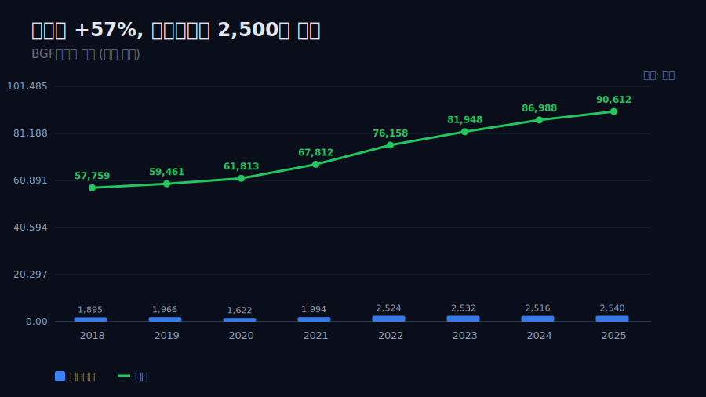
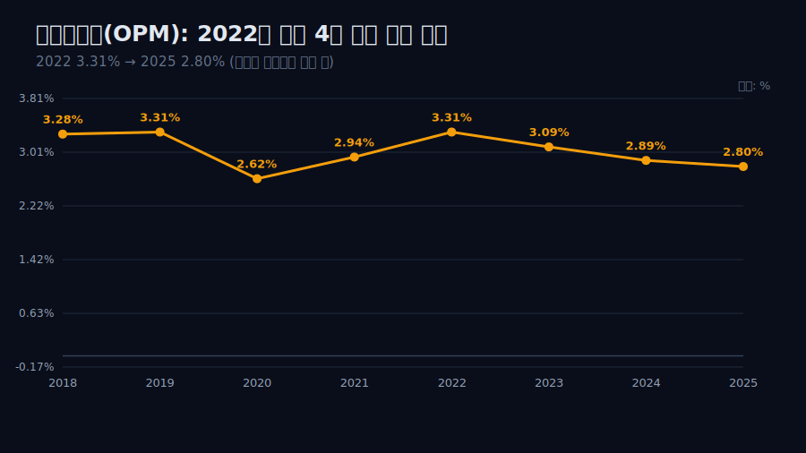
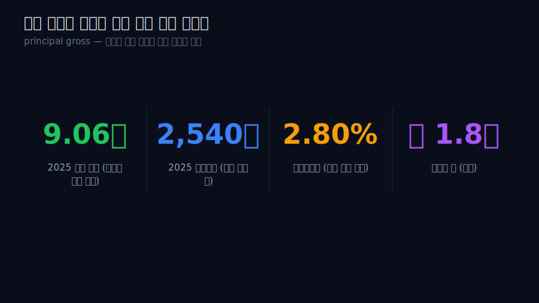
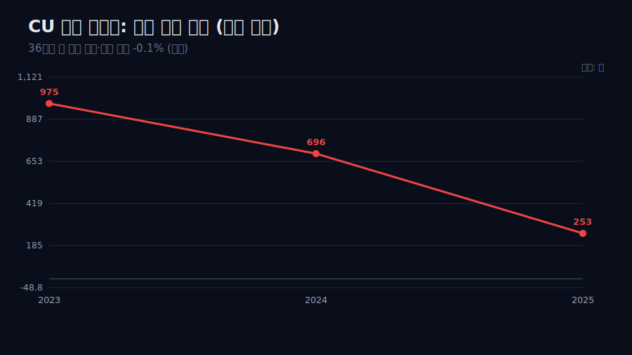
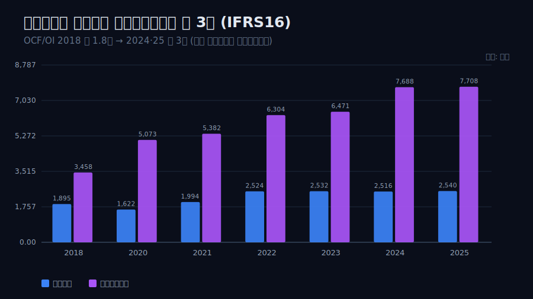
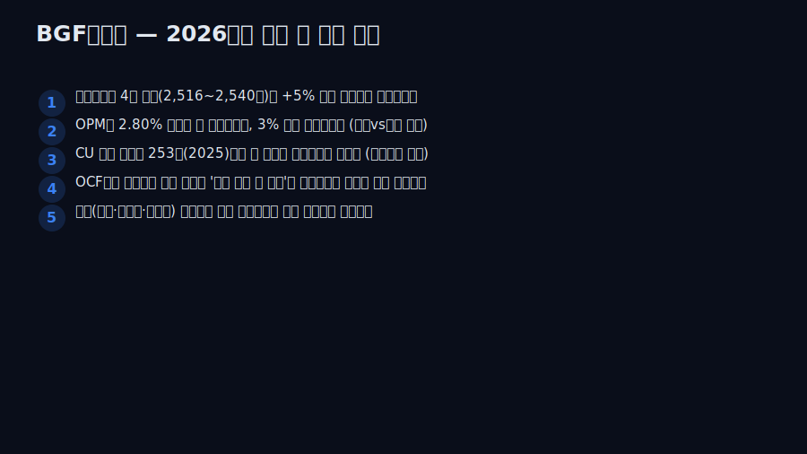

<script>
import ComboChart from '$lib/components/blog/ComboChart.svelte';
import StackBar from '$lib/components/blog/StackBar.svelte';
</script>

> **데이터 기준**: 2026-06-14 dartlab 실측 — BGF리테일(282330) **연결** 기준, 연간(분기 합산). 내부로 쓰는 라인은 매출·영업이익·당기순이익·영업현금흐름. 점포 수·순증·점당 매출·점유율·최저임금·가맹 배분 구조·해외 점포·IFRS16 리스 상환액은 연결 손익에 안 나오므로 **공시·언론(외부 인용)**으로 표기. ※2019년 영업현금흐름은 비교불가 결손이라 추세에서 제외. ※재무제표 자동 동기화는 분기 라벨 이상으로 끄고 수동 작성.
>
> **핵심 숫자**: 매출 **57,759억(2018) → 90,612억(2025)** (+57%, 7년 CAGR 약 6.6%) · 영업이익 **2,524억(2022) → 2,540억(2025)** (4년 정체) · OPM **3.31%(2022) → 2.80%(2025)** (4년 연속 완만 하락) · 영업현금흐름 **7,708억(2025)** = 영업이익의 약 3배(IFRS16 렌즈)
>
> **이 글의 용어**: principal gross(본인 총액 인식) = 본부가 상품 통제권을 거쳐 가맹점에 공급하면 그 *총액*이 본부 매출로 잡히는 회계 · 배분 마진 = 가맹점이 판 매출이익을 약정 비율로 본부가 나눠 갖는 몫 · IFRS16 = 리스(임차)를 사용권자산+리스부채로 잡아 임차료를 감가상각·이자로 분류하는 회계 기준.

---

## 프롤로그 — 9조를 파는데 이익은 2,500억에서 멈춘다

BGF리테일이 운영하는 편의점 CU는 2025년 **9조612억** 어치를 팔았다. 8년 전(2018년 5조7,759억)보다 +57% 큰 숫자다. 그런데 같은 회사의 영업이익은 2022년 **2,524억**을 찍은 뒤, 2023·2024·2025년 내내 **2,516~2,540억**에 머물렀다. 매출은 그 4년에도 +19% 더 컸는데, 이익은 ±1% 안에서 멈춰 있다.



관통선은 하나다. **"한 손익계산서 안에서 매출선과 영업이익선이 왜 다른 속도로 움직이고, 그 격차는 무엇과 양립하는가?"** 이 한 문장 이후로는 '성장의 함정' 같은 수사 대신 두 선의 측정값으로만 말한다.

---

## 1막 — 두 선의 격차를 숫자로 고정한다

**왜 매출과 영업이익을 *나란히* 보나.** 둘이 같은 속도였다면 이 글은 없기 때문이다 — 격차 자체가 출발점이다.

```python
import dartlab
c = dartlab.Company("282330")
c.select("IS", ["매출액","영업이익"], freq="Y")
```

| 항목 (억원) | 2018 | 2020 | 2022 | 2023 | 2024 | 2025 |
|---|---:|---:|---:|---:|---:|---:|
| 매출 | 57,759 | 61,813 | 76,158 | 81,948 | 86,988 | 90,612 |
| 영업이익 | 1,895 | 1,622 | 2,524 | 2,532 | 2,516 | 2,540 |
| OPM | 3.28% | 2.62% | 3.31% | 3.09% | 2.89% | 2.80% |

매출은 7년 누적 +57%(CAGR 약 6.6%)로 꾸준히 컸다. 영업이익은 2020년 코로나 저점(1,622억) 뒤 2022년 2,524억까지 회복했지만, 그 후 4개 연도가 평균 대비 ±1% 안에서 멈췄다. 더 또렷한 건 OPM이다 — 2022년 3.31%에서 2025년 2.80%로 **4년 연속 완만히 하락**했다(약 -0.5%p). 매출이라는 분모는 +19% 커지는데 영업이익이라는 분자는 안 커지니, 비율이 내려가는 건 산수다. 이 격차가 이 글의 출발점이다.



---

## 2막 — '매출'이라는 단어를 한 겹 벗긴다

**왜 격차 다음에 곧장 '매출'의 정의를 따지나.** 이 9조를 본부가 직접 번 돈으로 읽으면 모든 해석이 어긋나기 때문이다.

편의점 가맹본부의 구조는 이렇다 — 본부가 제조사에서 상품을 사서 가맹점에 공급하고, 가맹점이 소비자에게 판 매출이익을 약정 비율(통상 본부 65~75%, 외부 인용)로 나눈다. 회계 기준(K-IFRS 1115)은 본부가 상품 통제권을 거쳐 공급하면 그 **총액(principal gross)**을 본부 매출로 인식하게 한다. 즉 연결 매출 9조의 대부분은 가맹점 약 1만8천 개가 판 상품의 *총액*이 본부 장부를 통과한 것이다. 9조라는 숫자는 '본부가 직접 번 돈'이 아니라 '본부 장부를 통과한 상품 거래의 규모'에 가깝다.



여기서 선을 긋는다 — 본부의 *진짜 몫*은 그 9조가 아니라 그 위에 얇게 얹힌 배분 마진이다. 매출 절대액을 본부의 사업 규모로 읽는 것이 이 회사 최대의 오독이다. 매출선의 속도를 정하는 건 '점포가 얼마나 많고, 그 점포들이 얼마나 파느냐'이고, 영업이익선의 속도를 정하는 건 '본부가 점포당 얼마를 떼느냐'다. 두 선이 다른 속도인 이유의 절반이 여기 있다.

---

## 3막 — 매출 쪽 동력: 점포가 더 안 늘어난다 (외부)

**왜 매출선의 한계부터 보나.** 매출선이 점포 수×점당 매출이라면, 그 두 축이 지금도 도는지가 다음 질문이기 때문이다.

검증 재무는 매출이 2022~2025에도 +19% 더 컸다는 사실까지만 말한다. *왜* 그 속도가 식는지는 전부 외부 자료다. 외부에 따르면 CU 순증 점포는 2023년 975개 → 2024년 696개 → 2025년 253개로 빠르게 줄었고(외부 인용), 2024년 말 CU 점포는 1만8,711개로 점포 수 1위다(GS25 1만8,112개, 외부 인용). 그런데 편의점 4사 점포 수가 1988년 도입 이후 36년 만에 처음 감소했고, 점포당 매출은 5,531만원으로 전년비 -0.1%, 동일 상권 자기잠식이 본격화됐다(외부 인용).



즉 매출선의 한 축(점포 수)은 포화에 닿았다는 외부 신호가 있고, 다른 축(점당 매출)도 정체다. 검증 재무의 매출이 그래도 +19% 더 큰 것은 누적 점포 베이스와 물가로 설명되지만(양립), 추가 동력이 식고 있다는 외부 경계가 분명하다.

---

## 4막 — 이익 쪽: 본부 몫이 왜 안 커지나 (외부, 양립)

**왜 매출 한계 다음에 이익 한계를 따로 보나.** 두 선의 속도를 정하는 엔진이 물리적으로 다르기 때문이다 — 매출이 그래도 늘었는데 이익이 멈춘 이유는 매출 쪽이 아니라 이익 쪽에서 찾아야 한다.

이익선의 속도를 정하는 건 매출 총액이 아니라 '점당 배분 마진'이다. 외부 자료가 제시하는 양립 가능한 압력은 둘이다 — (1) 점당 매출이 정체(-0.1%)하면 본부가 점포에서 떼는 절대 마진의 증가분도 정체한다(외부 인용). (2) 점주 쪽 비용 압력: 2026년 최저임금은 시간당 1만320원이고, 인건비 부담으로 폐점을 고민하는 점주가 늘고 있다(외부 인용). 본부는 점포를 붙들기 위해 초기안정화제도(점포 수익이 최대 470만원+임차료에 못 미치면 차액 보전)·폐기지원금 등을 운영하는데(외부 인용), 이는 본부 비용이다.

단 선을 긋는다 — 이를 '점주 지원이 이익을 깎았다'는 *단일 인과*로 단정하지 않는다. 검증 재무가 증명하는 건 'OPM이 3.31%→2.80%로 내려갔다'는 사실(분모가 분자보다 빨리 큼)이고, 위 외부 요인들은 그 사실과 *양립하는 경계*다. 외부=원인 후보, 내부=격차 사실 — 둘을 섞어 '데이터가 원인까지 증명한다'고 말하지 않는다.

---

## 5막 — OCF가 영업이익의 3배인데, 현금부자인가

**왜 이익 정체 다음에 현금흐름을 보나.** 영업현금흐름만 떼어 보면 이 회사가 현금이 넘쳐 보이는데, 그 숫자의 정체를 모르면 정반대로 오독하기 때문이다.

```python
c.select("CF", ["영업활동현금흐름"], freq="Y")
```

영업현금흐름은 2018년 3,458억에서 2024년 7,688억, 2025년 7,708억으로 늘었다. 2025년 영업이익 2,540억 대비 OCF는 약 **3.0배**다(2024년도 약 3.0배). 처음부터 3배는 아니었다 — 2018년엔 약 1.8배였다가 상승해 최근 3배 부근에서 안정됐다.



메커니즘은 IFRS16이다 — 점포 임차료가 비용(임차료)이 아니라 사용권자산 감가상각+리스부채 이자로 손익에 잡혀, 영업현금흐름에서는 현금유출로 빠지지 않는다. 실제 임차 관련 현금유출은 재무활동(리스부채 상환)으로 이동한다. 따라서 OCF가 영업이익의 3배인 것은 '본부가 돈을 더 잘 번다'는 신호가 아니라, *리스라는 출점 모델을 회계가 어디에 적느냐*의 렌즈 효과로 추정된다. 진짜 잉여는 OCF에서 리스부채 상환을 차감해야 보인다(검증 재무엔 그 상환액이 없어 수치로 단정하지 않는다). '현금이 영업이익의 3배니 저평가'라는 결론으로 비약하지 않는다.

---

## 6막 — 천장을 다시 올릴 레버는 어디에 (외부, 서사)

**왜 마지막에 미래 레버를 두되 거기서 결론을 끌어내지 않나.** 해외·교체출점 같은 레버는 아직 검증 재무의 영업이익 천장을 못 깬, *관찰 가능한 후보*일 뿐이기 때문이다.

국내에서 점포 축이 포화고 이익 축이 점당 마진에 묶였다면, 남은 레버는 모두 외부 경계로만 관찰된다. (1) 점당 수익성 질적 전환 — 중대형·PB·특화매장으로 점당 매출을 끌어올리고, 비효율 점포 폐점+신규 출점의 '교체' 전략(외부 인용). (2) 해외 — CU는 몽골 532개·말레이시아 167개·카자흐스탄 50개를 운영하고, 몽골 파트너사가 상반기 경상이익 약 39억원으로 국내 편의점 최초 해외 흑자를 냈으며 미국 하와이에 법인을 세웠다(외부 인용). 단 해외 다수는 마스터프랜차이즈(로열티) 모델이라 연결 매출·이익 기여는 아직 작고 검증 재무엔 또렷이 안 잡힌다 — 기대지 증명된 숫자가 아니다. (3) GS25와의 매출 1위 경쟁(2025년 3분기 BGF 2.46조 vs GS25 2.45조, 외부 인용)은 점유율 게임이지 이익 천장을 직접 올리지 않는다.

결론은 경계에서 닫는다 — *검증 재무는 '매출 +57%인데 영업이익이 4년 정체, OPM은 하락'이라는 두 선의 격차까지 말한다. 그 천장을 올릴 수 있느냐는 점당 마진을 올릴 외부 레버에 달렸고, 외형은 그 답을 주지 않는다.* 9조를 통과시키는 장부와 2,500억을 떼는 본부 — 그 둘이 다른 축이라는 게 이 회사를 읽는 열쇠다.

> 관련 글 — 가맹 로열티로 도는 [맥도날드](/blog/MCD-mcdonalds), 박리의 [월마트](/blog/WMT-walmart)·[코스트코](/blog/COST-costco), 직매입으로 적자를 감수한 [쿠팡](/blog/CPNG-coupang), 대형마트의 [이마트](/blog/139480-emart)와 겹쳐 읽으면 '외형과 진짜 몫이 다른' 유통 손익의 결이 또렷해진다.

---

## 2026년에 봐야 할 다섯 가지

1. **영업이익이 4년 천장(2,516~2,540억)을 의미 있게 돌파하는가** — 예컨대 +5% 이상(2,650억대)이면 점당 마진이 다시 돈다는 첫 증거. 못 넘으면 천장 5년 차 고착이다.
2. **OPM이 2.80%(2025) 아래로 더 내려가는가, 3% 위로 회복하는가** — 총액 분모와 본부 몫 분자의 상대 속도를 보는 단일 지표. 분모만 커지면 OPM은 계속 눌린다.
3. **CU 점포 순증이 253개(2025)에서 더 줄거나 마이너스로 가는가** — 아니면 '비효율 폐점+신규 출점' 교체로 점당 매출이 반등하는가. 매출 축과 이익 축의 분기점(외부 추적).
4. **영업현금흐름에서 리스부채 상환을 차감한 '리스 조정 후 잉여'가 영업이익을 여전히 크게 웃도는가** — OCF 3배 착시를 걷어낸 진짜 현금창출력. 차감 후 수치가 정체되면 '현금부자' 서사는 무효다.
5. **해외(몽골·말레이·하와이) 로열티가 연결 영업이익에 식별 가능한 라인으로 잡히는가** — 6막의 미래 레버가 '서사'에서 '검증 가능한 숫자'로 넘어오는 분기. GS25와의 매출 1위 역전은 점유율 이벤트일 뿐 이익 천장과 분리해 본다.



---

## 재무제표 — 최근 8개년 (dartlab 연결, 억원)

> 연결·연간(분기 합산) 기준. 자동 동기화는 분기 라벨 이상으로 끄고 수동 작성했다. 2019년 영업현금흐름은 비교불가 결손이라 표에서 제외(—). dartlab에서 직접 확인:
> ```python
> import dartlab
> c = dartlab.Company("282330")
> c.select("IS", ["매출액","영업이익","당기순이익"], freq="Y")
> c.select("CF", ["영업활동현금흐름"], freq="Y")
> ```

<ComboChart data={[{year:"2018",매출:57759,영업이익:1895,당기순이익:1542},{year:"2019",매출:59461,영업이익:1966,당기순이익:1514},{year:"2020",매출:61813,영업이익:1622,당기순이익:1227},{year:"2021",매출:67812,영업이익:1994,당기순이익:1476},{year:"2022",매출:76158,영업이익:2524,당기순이익:1935},{year:"2023",매출:81948,영업이익:2532,당기순이익:1958},{year:"2024",매출:86988,영업이익:2516,당기순이익:1952},{year:"2025",매출:90612,영업이익:2540,당기순이익:1953}]} lineKeys={["매출"]} barKeys={["영업이익","당기순이익"]} lineColors={["#22c55e"]} barColors={["#3b82f6","#f59e0b"]} title="매출(라인) vs 영업이익·당기순이익(막대)" unit="억원" />

| 항목 (억원) | 2018 | 2019 | 2020 | 2021 | 2022 | 2023 | 2024 | 2025 |
|---|---:|---:|---:|---:|---:|---:|---:|---:|
| 매출 | 57,759 | 59,461 | 61,813 | 67,812 | 76,158 | 81,948 | 86,988 | 90,612 |
| 영업이익 | 1,895 | 1,966 | 1,622 | 1,994 | 2,524 | 2,532 | 2,516 | 2,540 |
| OPM | 3.28% | 3.31% | 2.62% | 2.94% | 3.31% | 3.09% | 2.89% | 2.80% |
| 당기순이익 | 1,542 | 1,514 | 1,227 | 1,476 | 1,935 | 1,958 | 1,952 | 1,953 |
| 영업현금흐름 | 3,458 | — | 5,073 | 5,382 | 6,304 | 6,471 | 7,688 | 7,708 |

이 표를 한 줄로 읽으면 이렇다 — **매출 행은 +57%로 우상향하는데 영업이익 행은 2022년 이후 가로줄로 눕는다.** OPM 행이 2022년 3.31%에서 2025년 2.80%로 내려가는 것이 그 격차를 비율로 보여준다. 영업현금흐름 행이 영업이익의 약 3배라는 점에 유의 — IFRS16 리스 효과가 섞여 있어 '현금부자'로 읽으면 안 된다.

---

## 검증표

본문 인용 수치를 dartlab 호출과 결과로 검증한다. 외부 출처(점포·순증·점당 매출·점유율·최저임금·가맹 구조·해외)는 분리 표기. 📅 dartlab 실측 2026-06-14 · BGF리테일(282330) 연결·연간 기준.

| 본문 수치 | 출처 / 호출 | 결과 |
|---|---|---|
| 매출 2018 57,759억 → 2025 90,612억 (+57%, CAGR 약 6.6%) | `c.select("IS",["매출액"],freq="Y")` | ✓ 실측 |
| 영업이익 2022 2,524억 → 2025 2,540억 (4년 ±1% 정체) | `c.select("IS",["영업이익"])` | ✓ 실측 |
| OPM 3.31%(2022) → 2.80%(2025) 4년 연속 하락 | IS 계산 | ✓ 실측 |
| 당기순이익 2018 1,542억 → 2025 1,953억 | `c.select("IS",["당기순이익"])` | ✓ 실측 |
| 영업현금흐름 2025 7,708억 = 영업이익의 약 3.0배 | `c.select("CF",["영업활동현금흐름"])` | ✓ 실측 |
| OCF/OI 배수 2018 약 1.8배 → 2024·2025 약 3배 | IS·CF 계산 | ✓ 실측 |
| 2019 영업현금흐름 비교불가 결손 → 추세 제외 | dartlab 데이터 한계 | 주의 |
| 매출=가맹점 상품 총액(principal gross) 통과 / 본부 몫=배분 마진 | K-IFRS 1115 · 가맹 구조 | 외부 인용 |
| CU 순증 975(2023)→696(2024)→253(2025)·점포 1만8,711개(1위) | [비즈톡톡/종합](https://v.daum.net/v/20260222060150195) | 외부 인용 |
| 편의점 36년만 첫 점포 감소·점당 매출 5,531만원 -0.1% | [파이낸셜뉴스](https://www.fnnews.com/news/202512011814387047) | 외부 인용 |
| 2026 최저임금 1만320원·초기안정화(470만+임차료)·폐기지원 | [뉴스밸류](https://www.newsvalue.kr/news/articleView.html?idxno=22842) | 외부 인용 |
| 해외 몽골 532·말레이 167·카자흐 50·몽골 경상이익 39억 첫 흑자 | [더벨](https://www.thebell.co.kr/free/content/ArticleView.asp?key=202509171339489880107966) | 외부 인용 |
| GS25 매출 1위 박빙(2025 3Q BGF 2.46조 vs GS25 2.45조) | [전자신문](https://www.etnews.com/20250516000078) | 외부 인용 |
| IFRS16 리스부채 상환액(재무활동) — 내부 격자에 미표기 | dartlab 데이터 한계 | 주의/제외 |

본문의 숫자 중 이 표에 없는 것은 발행 차단 대상이다. 점포·순증·점당 매출·점유율·최저임금·해외는 dartlab 연결로 증명되지 않으며 공시·언론 외부 인용임을 명시한다. 매출 총액을 본부 사업 규모로 읽지 않고, OCF 3배를 '현금부자'로 읽지 않으며, 두 선의 격차를 *관찰*까지만 단언하는 것이 이 글의 원칙이다.
