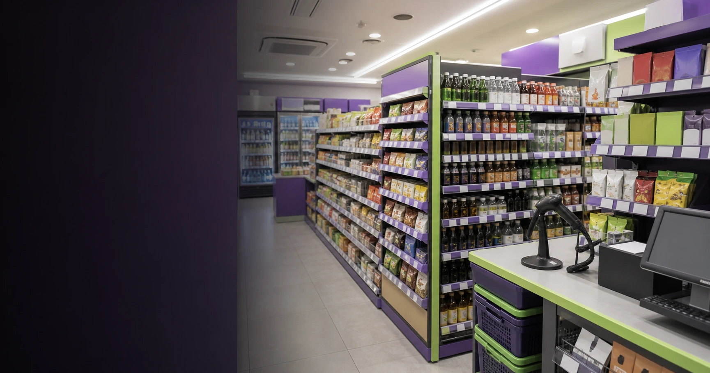

<script>
import ComboChart from '$lib/components/blog/ComboChart.svelte';
import StackBar from '$lib/components/blog/StackBar.svelte';
</script>

> **데이터 기준**: 2026-06-20 dartlab 실측 — BGF리테일(282330) **연결** 기준, 연간(분기 합산). 내부로 쓰는 라인은 매출·영업이익·당기순이익·영업현금흐름. 점포 수·순증·점당 매출·점유율·최저임금·가맹 배분 구조·해외 점포·IFRS16 리스 상환액은 연결 손익에 안 나오므로 **공시·언론(외부 인용)**으로 표기. ※2019년 영업현금흐름은 비교불가 결손이라 추세에서 제외. ※재무제표 자동 동기화는 분기 라벨 이상으로 끄고 수동 작성.
>
> **핵심 숫자**: 매출 **57,759억(2018) → 90,612억(2025)** (+57%, 7년 CAGR 약 6.6%) · 영업이익 **2,524억(2022) → 2,540억(2025)** (4년 정체) · OPM **3.31%(2022) → 2.80%(2025)** (4년 연속 완만 하락) · 영업현금흐름 **7,708억(2025)** = 영업이익의 약 3배(IFRS16 렌즈)
>
> **이 글의 용어**: principal gross(본인 총액 인식) = 본부가 상품 통제권을 거쳐 가맹점에 공급하면 그 *총액*이 본부 매출로 잡히는 회계 · 배분 마진 = 가맹점이 판 매출이익을 약정 비율로 본부가 나눠 갖는 몫 · IFRS16 = 리스(임차)를 사용권자산+리스부채로 잡아 임차료를 감가상각·이자로 분류하는 회계 기준.

---

## 프롤로그 — 9조를 파는데 이익은 2,500억에서 멈춘다

BGF리테일이 운영하는 편의점 CU는 2025년 **9조612억** 어치를 팔았다. 8년 전(2018년 5조7,759억)보다 +57% 큰 숫자다. 그런데 같은 회사의 영업이익은 2022년 **2,524억**을 찍은 뒤, 2023·2024·2025년 내내 **2,516~2,540억**에 머물렀다. 매출은 그 4년에도 +19% 더 컸는데, 이익은 ±1% 안에서 멈춰 있다.




관통선은 하나다. **"한 손익계산서 안에서 매출선과 영업이익선이 왜 다른 속도로 움직이고, 그 격차는 무엇과 양립하는가?"** 이 한 문장 이후로는 '성장의 함정' 같은 수사 대신 두 선의 측정값으로만 말한다.

---

## 1막 — 두 선의 격차를 숫자로 고정한다

**왜 매출과 영업이익을 *나란히* 보나.** 둘이 같은 속도였다면 이 글은 없기 때문이다 — 격차 자체가 출발점이다.

```python
import dartlab
c = dartlab.Company("282330")
c.select("IS", ["매출액","영업이익"], freq="Y")
```

| 항목 (억원) | 2018 | 2020 | 2022 | 2023 | 2024 | 2025 |
|---|---:|---:|---:|---:|---:|---:|
| 매출 | 57,759 | 61,813 | 76,158 | 81,948 | 86,988 | 90,612 |
| 영업이익 | 1,895 | 1,622 | 2,524 | 2,532 | 2,516 | 2,540 |
| OPM | 3.28% | 2.62% | 3.31% | 3.09% | 2.89% | 2.80% |

매출은 7년 누적 +57%(CAGR 약 6.6%)로 꾸준히 컸다. 영업이익은 2020년 코로나 저점(1,622억) 뒤 2022년 2,524억까지 회복했지만, 그 후 4개 연도가 평균 대비 ±1% 안에서 멈췄다. 더 또렷한 건 OPM이다 — 2022년 3.31%에서 2025년 2.80%로 **4년 연속 완만히 하락**했다(약 -0.5%p). 매출이라는 분모는 +19% 커지는데 영업이익이라는 분자는 안 커지니, 비율이 내려가는 건 산수다. 이 격차가 이 글의 출발점이다.


---

## 2막 — '매출'이라는 단어를 한 겹 벗긴다

**왜 격차 다음에 곧장 '매출'의 정의를 따지나.** 이 9조를 본부가 직접 번 돈으로 읽으면 모든 해석이 어긋나기 때문이다.

편의점 가맹본부의 구조는 이렇다 — 본부가 제조사에서 상품을 사서 가맹점에 공급하고, 가맹점이 소비자에게 판 매출이익을 약정 비율(통상 본부 65~75%, 외부 인용)로 나눈다. 회계 기준(K-IFRS 1115)은 본부가 상품 통제권을 거쳐 공급하면 그 **총액(principal gross)**을 본부 매출로 인식하게 한다. 즉 연결 매출 9조의 대부분은 가맹점 약 1만8천 개가 판 상품의 *총액*이 본부 장부를 통과한 것이다. 9조라는 숫자는 '본부가 직접 번 돈'이 아니라 '본부 장부를 통과한 상품 거래의 규모'에 가깝다.


여기서 선을 긋는다 — 본부의 *진짜 몫*은 그 9조가 아니라 그 위에 얇게 얹힌 배분 마진이다. 매출 절대액을 본부의 사업 규모로 읽는 것이 이 회사 최대의 오독이다. 매출선의 속도를 정하는 건 '점포가 얼마나 많고, 그 점포들이 얼마나 파느냐'이고, 영업이익선의 속도를 정하는 건 '본부가 점포당 얼마를 떼느냐'다. 두 선이 다른 속도인 이유의 절반이 여기 있다.

---

## 3막 — 매출 쪽 동력: 점포가 더 안 늘어난다 (외부)

**왜 매출선의 한계부터 보나.** 매출선이 점포 수×점당 매출이라면, 그 두 축이 지금도 도는지가 다음 질문이기 때문이다.

검증 재무는 매출이 2022~2025에도 +19% 더 컸다는 사실까지만 말한다. *왜* 그 속도가 식는지는 전부 외부 자료다. 외부에 따르면 CU 순증 점포는 2023년 975개 → 2024년 696개 → 2025년 253개로 빠르게 줄었고(외부 인용), 2024년 말 CU 점포는 1만8,711개로 점포 수 1위다(GS25 1만8,112개, 외부 인용). 그런데 편의점 4사 점포 수가 1988년 도입 이후 36년 만에 처음 감소했고, 점포당 매출은 5,531만원으로 전년비 -0.1%, 동일 상권 자기잠식이 본격화됐다(외부 인용).


즉 매출선의 한 축(점포 수)은 포화에 닿았다는 외부 신호가 있고, 다른 축(점당 매출)도 정체다. 검증 재무의 매출이 그래도 +19% 더 큰 것은 누적 점포 베이스와 물가로 설명되지만(양립), 추가 동력이 식고 있다는 외부 경계가 분명하다.

---

## 4막 — 이익 쪽: 본부 몫이 왜 안 커지나 (외부, 양립)

**왜 매출 한계 다음에 이익 한계를 따로 보나.** 두 선의 속도를 정하는 엔진이 물리적으로 다르기 때문이다 — 매출이 그래도 늘었는데 이익이 멈춘 이유는 매출 쪽이 아니라 이익 쪽에서 찾아야 한다.

이익선의 속도를 정하는 건 매출 총액이 아니라 '점당 배분 마진'이다. 외부 자료가 제시하는 양립 가능한 압력은 둘이다 — (1) 점당 매출이 정체(-0.1%)하면 본부가 점포에서 떼는 절대 마진의 증가분도 정체한다(외부 인용). (2) 점주 쪽 비용 압력: 2026년 최저임금은 시간당 1만320원이고, 인건비 부담으로 폐점을 고민하는 점주가 늘고 있다(외부 인용). 본부는 점포를 붙들기 위해 초기안정화제도(점포 수익이 최대 470만원+임차료에 못 미치면 차액 보전)·폐기지원금 등을 운영하는데(외부 인용), 이는 본부 비용이다.

단 선을 긋는다 — 이를 '점주 지원이 이익을 깎았다'는 *단일 인과*로 단정하지 않는다. 검증 재무가 증명하는 건 'OPM이 3.31%→2.80%로 내려갔다'는 사실(분모가 분자보다 빨리 큼)이고, 위 외부 요인들은 그 사실과 *양립하는 경계*다. 외부=원인 후보, 내부=격차 사실 — 둘을 섞어 '데이터가 원인까지 증명한다'고 말하지 않는다.

---

## 5막 — 영업현금흐름이 영업이익의 3배인데, 현금부자인가

**왜 이익 정체 다음에 현금흐름을 보나.** 영업현금흐름만 떼어 보면 이 회사가 현금이 넘쳐 보이는데, 그 숫자의 정체를 모르면 정반대로 오독하기 때문이다.

```python
c.select("CF", ["영업활동현금흐름"], freq="Y")
```

영업현금흐름은 2018년 3,458억에서 2024년 7,688억, 2025년 7,708억으로 늘었다. 2025년 영업이익 2,540억 대비 OCF는 약 **3.0배**다(2024년도 약 3.0배). 처음부터 3배는 아니었다 — 2018년엔 약 1.8배였다가 상승해 최근 3배 부근에서 안정됐다.


메커니즘은 IFRS16이다 — 점포 임차료가 비용(임차료)이 아니라 사용권자산 감가상각+리스부채 이자로 손익에 잡혀, 영업현금흐름에서는 현금유출로 빠지지 않는다. 실제 임차 관련 현금유출은 재무활동(리스부채 상환)으로 이동한다. 따라서 OCF가 영업이익의 3배인 것은 '본부가 돈을 더 잘 번다'는 신호가 아니라, *리스라는 출점 모델을 회계가 어디에 적느냐*의 렌즈 효과로 추정된다. 진짜 잉여는 OCF에서 리스부채 상환을 차감해야 보인다(검증 재무엔 그 상환액이 없어 수치로 단정하지 않는다). '현금이 영업이익의 3배니 저평가'라는 결론으로 비약하지 않는다.

---

## 6막 — 천장을 다시 올릴 레버는 어디에 (외부, 서사)

**왜 마지막에 미래 레버를 두되 거기서 결론을 끌어내지 않나.** 해외·교체출점 같은 레버는 아직 검증 재무의 영업이익 천장을 못 깬, *관찰 가능한 후보*일 뿐이기 때문이다.

국내에서 점포 축이 포화고 이익 축이 점당 마진에 묶였다면, 남은 레버는 모두 외부 경계로만 관찰된다. (1) 점당 수익성 질적 전환 — 중대형·PB·특화매장으로 점당 매출을 끌어올리고, 비효율 점포 폐점+신규 출점의 '교체' 전략(외부 인용). (2) 해외 — CU는 몽골 532개·말레이시아 167개·카자흐스탄 50개를 운영하고, 몽골 파트너사가 상반기 경상이익 약 39억원으로 국내 편의점 최초 해외 흑자를 냈으며 미국 하와이에 법인을 세웠다(외부 인용). 단 해외 다수는 마스터프랜차이즈(로열티) 모델이라 연결 매출·이익 기여는 아직 작고 검증 재무엔 또렷이 안 잡힌다 — 기대지 증명된 숫자가 아니다. (3) GS25와의 매출 1위 경쟁(2025년 3분기 BGF 2.46조 vs GS25 2.45조, 외부 인용)은 점유율 게임이지 이익 천장을 직접 올리지 않는다.

결론은 경계에서 닫는다 — *검증 재무는 '매출 +57%인데 영업이익이 4년 정체, OPM은 하락'이라는 두 선의 격차까지 말한다. 그 천장을 올릴 수 있느냐는 점당 마진을 올릴 외부 레버에 달렸고, 외형은 그 답을 주지 않는다.* 9조를 통과시키는 장부와 2,500억을 떼는 본부 — 그 둘이 다른 축이라는 게 이 회사를 읽는 열쇠다.

> 관련 글 — 가맹 로열티로 도는 [맥도날드](/blog/MCD-mcdonalds), 박리의 [월마트](/blog/WMT-walmart)·[코스트코](/blog/COST-costco), 직매입으로 적자를 감수한 [쿠팡](/blog/CPNG-coupang), 대형마트의 [이마트](/blog/139480-emart)와 겹쳐 읽으면 '외형과 진짜 몫이 다른' 유통 손익의 결이 또렷해진다.

---

## 오해 1 — 9조 매출을 본부가 직접 번 돈으로 읽으면 틀린다

BGF리테일을 처음 보면 가장 먼저 보이는 숫자는 매출이다. 2025년 연결 매출 **9조612억원**. 이 숫자는 크다. 한국 유통회사 가운데서도 눈에 띄는 규모다. 그러나 편의점 가맹본부의 매출은 제조업의 매출이나 플랫폼 수수료 매출과 같은 감각으로 읽으면 안 된다. 이 매출의 상당 부분은 점포망을 통과한 상품 총액이다. 본부가 상품을 사서 가맹점에 공급하고, 그 상품이 소비자에게 팔리며 생긴 총액이 본부 장부에 잡히는 구조다. 그래서 "9조를 벌었다"보다 "9조가 장부를 통과했다"가 더 정확하다.

이 차이를 모르면 모든 해석이 뒤틀린다. 9조 매출에 영업이익 **2,540억원**이면 OPM은 **2.80%**다. 제조업 관점에서는 매우 얇아 보일 수 있다. 하지만 편의점 본부 관점에서는 매출 분모 자체가 총액이다. 본부의 경제적 몫은 매출총액 전체가 아니라 점포와 나눈 배분 마진, 상품 믹스, 물류·임차·판관비를 거친 뒤 남는 얇은 층이다. 매출총액이 커져도 본부 몫이 같은 속도로 커지지 않을 수 있다. 이것이 9조 매출과 2,500억 이익 천장이 동시에 존재하는 이유다.

점포 수를 보면 이 구조가 더 잘 보인다. 2025년 말 CU 점포는 **18,711개**다. 이 점포망은 매출을 크게 만든다. 소비자가 매일 편의점에서 사는 도시락, 음료, 담배, 생활용품, 즉석식품이 모두 총액 매출을 만든다. 하지만 그 모든 매출이 본부 이익은 아니다. 점주 몫, 상품 원가, 물류비, 임차 구조, 본부 지원, 폐기 지원, 판촉비가 지나간다. 그래서 편의점 본부의 핵심 질문은 "점포가 몇 개인가"에서 끝나지 않는다. "점포당 본부 몫이 얼마나 두꺼워졌는가"까지 내려가야 한다.

이 차이는 [맥도날드](/blog/MCD-mcdonalds)와 비교하면 선명하다. 맥도날드는 프랜차이즈 로열티와 임대 구조가 강한 회사라 본부 매출과 이익의 관계가 다르게 보인다. BGF리테일은 상품 총액이 장부를 크게 만들고, 본부의 실제 이익은 그 위에 얇게 남는다. [월마트](/blog/WMT-walmart)나 [코스트코](/blog/COST-costco)처럼 박리다매 유통업과도 닮았지만, 가맹점과 본부가 나누는 구조가 추가로 붙는다. 그래서 BGF리테일은 "유통업이라 마진이 낮다"보다 한 단계 더 들어가 "가맹본부 총액 매출이라 분모가 크다"로 읽어야 한다.

2026년 1분기 매출 **2조1,204억원**도 같은 방식으로 읽는다. 좋은 숫자지만, 그 자체로 본부 이익 체질 개선을 증명하지는 않는다. 같은 분기 영업이익 **381억원**을 같이 봐야 한다. 영업이익률로 보면 약 **1.8%**다. 분기 계절성 때문에 연간 OPM **2.80%**와 단순 비교는 조심해야 하지만, 이 수치는 매출총액과 본부 몫의 거리가 여전히 크다는 사실을 보여준다. 매출은 큼직하고, 본부 몫은 얇다. 이 문장이 BGF리테일 재무제표의 출발점이다.

## 오해 2 — 좋은 1분기가 곧 연간 천장 돌파라는 착각

2026년 1분기 BGF리테일의 실적은 좋다. 매출은 전년 동기 대비 **5.2%**, 영업이익은 **68.6%**, 당기순이익은 **118.7%** 늘었다. 전년 동기 영업이익 **226억원**이 **381억원**으로 늘었다. 이 반등을 무시하면 안 된다. 본문이 말하는 "천장"은 회사가 더 이상 좋아질 수 없다는 예언이 아니다. 2022~2025년 연간 영업이익이 **2,516~2,540억원**에 갇혔다는 관찰이다. 좋은 1분기는 이 관찰을 시험하지만, 아직 폐기하지는 않는다.

왜냐하면 편의점 손익은 분기별 계절성이 크기 때문이다. 공식 IR 부록의 분기 손익표를 보면 2025년 1분기 영업이익은 **226억원**, 2분기는 **694억원**, 3분기는 **977억원**, 4분기는 **642억원**이었다. 같은 해 안에서도 1분기와 3분기의 영업이익 규모가 크게 다르다. 2026년 1분기 **381억원**은 전년 동기 대비 강하지만, 연간 영업이익을 결정하는 것은 나머지 분기다. 특히 편의점은 여름 성수기와 연말·행사·날씨·상품 믹스의 영향을 받는다. 그래서 "1분기 좋다"와 "연간 천장 돌파"는 다른 문장이다.

이 차이를 놓치면 투자자는 분기 실적 발표 때마다 과민 반응한다. 전년 동기 대비 영업이익 증가율이 높으면 천장이 깨진 것처럼 보이고, 계절적으로 약한 분기가 나오면 구조가 나빠진 것처럼 보인다. 그러나 이 글이 보는 기준은 연간 손익선이다. 2022년 **2,524억원**, 2023년 **2,532억원**, 2024년 **2,516억원**, 2025년 **2,540억원**. 이 네 해의 가로줄을 벗어나는지가 핵심이다. 2026년 1분기 반등은 그 가로줄 위로 올라갈 가능성을 보여주는 첫 표본이다.

따라서 2026년에 봐야 할 숫자는 누적 영업이익이다. 2분기, 3분기, 4분기까지 쌓였을 때 연간 **2,650억원** 이상으로 올라서는지 본다. 왜 **2,650억원**인가. 기존 천장 **2,540억원**에서 의미 있는 폭으로 벗어나는지를 보기 위한 대략적 기준이다. 정확한 예측치가 아니라 독자용 감시선이다. 연간이 이 감시선을 넘으면 "천장"이라는 표현은 약해진다. 넘지 못하면 1분기 반등은 좋은 분기였지만 구조 변화는 아니었다는 판정이 가능하다.

여기서 또 하나 봐야 할 것은 매출총이익이다. 2026년 1분기 매출총이익은 **3,912억원**으로 전년 동기 **3,696억원**보다 늘었다. 회사는 매출총이익률 개선을 영업이익 증가 요인으로 설명했다. 이 부분이 이어져야 한다. 편의점 본부의 이익선은 매출총액보다 매출총이익과 판관비 관리에 민감하다. 좋은 1분기가 좋은 해가 되려면 매출총이익률 개선이 한 분기 이벤트가 아니라 반복되어야 한다. 이익 천장은 매출선이 아니라 매출총이익과 판관비 사이에서 깨진다.

## 오해 3 — 영업현금흐름 3배면 현금부자라는 말

BGF리테일의 2025년 영업현금흐름은 **7,708억원**이다. 같은 해 영업이익은 **2,540억원**이므로, 영업현금흐름이 영업이익의 약 **3.0배**다. 표만 보면 매우 좋아 보인다. 하지만 이 글은 이 숫자를 "현금부자"로 읽지 않는다. 핵심 이유는 리스 회계다. 편의점은 점포 임차 구조가 크고, IFRS16은 리스를 사용권자산과 리스부채로 잡는다. 임차 현금유출의 위치가 손익과 현금흐름표 사이에서 달라진다.

2026년 1분기 공식 IR 자료도 리스 구조의 크기를 보여준다. 사용권자산은 **8,795억원**, 유동 리스부채는 **6,036억원**, 비유동 리스부채는 **5,371억원**이다. 합산 리스부채만 해도 큰 숫자다. 이 구조에서는 영업현금흐름이 영업이익보다 크게 보일 수 있다. 왜냐하면 리스부채 상환은 영업활동이 아니라 재무활동 현금흐름으로 빠지는 부분이 있기 때문이다. 따라서 OCF만 보면 점포 임차 모델의 현금유출을 충분히 보지 못할 수 있다.

이 대목은 [쿠팡](/blog/CPNG-coupang)이나 [이마트](/blog/139480-emart)를 읽을 때와도 연결된다. 유통업은 매장·물류·임차·재고가 손익과 현금흐름을 다르게 만든다. 특히 편의점 가맹본부는 본부가 직접 점포를 모두 운영하지 않는다고 해도, 임차형 점포와 물류·지원 구조가 재무제표에 반영된다. 그래서 영업현금흐름이 좋아 보이는 순간에도 리스부채 상환과 유형자산 취득을 함께 봐야 한다. 진짜 잉여현금흐름은 OCF에서 필요한 유지투자와 리스 관련 현금유출을 뺀 뒤에야 보인다.

이 글이 2019년 영업현금흐름을 추세에서 제외한 것도 같은 이유다. 자동 데이터 결손과 회계 전환이 섞인 구간을 단순 추세로 쓰면 착시가 생긴다. 2018년 OCF/OI가 약 **1.8배**였고 2024~2025년에는 약 **3배**였다는 변화는 의미 있지만, 그 변화가 전부 사업 체질 개선이라고 말할 수는 없다. IFRS16 이후 현금흐름표의 분류 효과를 같이 봐야 한다. 회계 기준이 숫자의 위치를 바꾸면, 독자는 숫자의 의미도 다시 확인해야 한다.

따라서 BGF리테일의 현금흐름을 볼 때 질문은 하나가 아니다. 영업현금흐름은 얼마나 나왔는가. 리스부채 상환은 얼마인가. 유지보수성 투자와 신규 출점 투자는 얼마인가. 그 후 남는 현금이 배당과 자사주, 해외 확장, 점포 지원을 감당하는가. 이 질문을 거치지 않으면 "OCF가 영업이익의 3배"라는 문장은 너무 편하다. 이 글은 편한 문장을 일부러 불편하게 만든다. 그래야 편의점 가맹본부의 진짜 현금창출력이 보인다.

## 이 글이 틀리는 조건

BGF리테일 글이 틀리는 첫 번째 조건은 연간 영업이익 천장 돌파다. 2022~2025년 영업이익은 **2,516~2,540억원** 범위에 머물렀다. 만약 2026년 연간 영업이익이 이 범위를 뚜렷하게 넘고, 그 증가가 일회성 기저가 아니라 매출총이익률 개선과 비용 관리에서 반복된다면 "2,500억 천장"이라는 제목은 약해진다. 좋은 1분기만으로는 부족하고, 좋은 해가 필요하다.

두 번째 조건은 OPM 회복이다. 2022년 OPM **3.31%**에서 2025년 **2.80%**로 내려온 흐름이 멈추고, 다시 **3%** 위로 안정된다면 매출총액보다 본부 몫이 빨리 커지고 있다는 신호다. 단순 매출 성장보다 이 비율이 더 중요하다. 매출이 늘어도 OPM이 계속 내려가면 총액 분모만 커지는 구조다. OPM이 올라가야 본부 몫이 두꺼워진다.

세 번째 조건은 점포 순증 둔화의 해소가 아니라 점포 질의 개선이다. 2024년 점포 **18,458개**, 2025년 **18,711개**로 순증은 **253개**에 그쳤다. 점포 수가 다시 빠르게 늘지 않아도 괜찮다. 중요한 건 점당 매출과 점당 마진이다. 비효율 점포를 줄이고 중대형·우량 입지·차별화 상품으로 점당 이익을 키운다면, 점포 수 둔화가 반드시 나쁜 것은 아니다. 이 경우 매출 성장률은 낮아도 이익률은 좋아질 수 있다.

네 번째 조건은 리스 조정 후 현금흐름이다. 영업현금흐름 **7,708억원**만 보면 강하지만, 사용권자산과 리스부채가 큰 회사에서는 그 다음 칸을 봐야 한다. 리스부채 상환과 유지투자를 차감한 뒤에도 현금이 충분하다면 BGF리테일의 현금창출력은 현재 글보다 더 강하게 평가해야 한다. 반대로 OCF는 좋아 보이는데 리스 상환 후 남는 현금이 얇다면, "현금부자" 서사는 계속 보류해야 한다.

마지막 조건은 해외와 자회사의 숫자화다. 몽골·말레이시아·카자흐스탄·하와이 같은 해외 이야기는 흥미롭지만, 아직 연결 영업이익을 바꾸는 주된 숫자로 보기엔 조심스럽다. 해외 로열티와 물류 자회사 개선이 연결 손익에서 식별될 만큼 커지면, 천장을 올리는 새 축이 생긴다. 그때는 BGF리테일을 단순 국내 편의점 포화주가 아니라 해외 로열티와 고효율 점포 모델이 붙은 가맹본부로 다시 써야 한다.

이 글의 결론은 비관이 아니다. BGF리테일은 안정적인 점포망과 브랜드를 가진 회사다. 문제는 그 안정성이 이미 손익계산서에서 매출 총액으로 크게 보이고, 주주가 원하는 영업이익은 얇은 층으로 남는다는 점이다. 다음 공시가 보여줘야 할 것은 매출 규모가 아니라 본부 몫의 두께다. 좋은 편의점 회사와 좋은 주주 이익은 같은 말이 아닐 수 있다. 이 둘이 같은 말이 되는 순간, 이 글은 틀린다.

BGF리테일을 읽을 때 첫 번째로 버려야 할 문장은 "편의점은 안정적이니까 괜찮다"다. 안정적인 수요와 좋은 주주 수익은 다르다. 편의점은 매일 팔리는 생활재를 다루고, 점포망도 촘촘하다. 그래서 매출은 안정적으로 보인다. 하지만 안정적인 매출이 안정적인 이익 증가를 보장하지는 않는다. 매출이 이미 큰 분모로 잡히고, 본부 몫이 얇은 구조라면 안정성은 오히려 낮은 마진의 반복이 될 수 있다.

두 번째로 버려야 할 문장은 "점포 수 1위면 이익도 1위일 것"이라는 생각이다. 점포 수는 중요하다. 2025년 **18,711개** 점포는 강한 네트워크다. 하지만 점포 수는 매출의 바닥을 만들 뿐, 점당 이익의 두께를 보장하지 않는다. 점포가 많을수록 상품 공급, 물류, 판촉, 임차, 지원 비용도 함께 커진다. 점포 수가 많아도 점당 매출이 정체하고 본부 지원이 늘면 이익률은 눌린다. 네트워크 규모와 경제성은 구분해야 한다.

세 번째로 버려야 할 문장은 "해외가 답"이라는 자동 낙관이다. 해외 진출은 흥미롭다. 몽골, 말레이시아, 카자흐스탄, 하와이 같은 이름은 성장 서사를 만든다. 그러나 해외 로열티나 자회사 이익이 연결 영업이익에서 충분히 커지기 전까지는, 그것은 가능성이지 결론이 아니다. 국내 영업이익 천장이 2,500억대에 머무는 동안 해외가 그 천장을 실제로 올리는지 확인해야 한다. 해외 점포 수가 아니라 연결 손익 기여가 중요하다.

네 번째로 봐야 할 것은 상품 믹스다. 편의점 본부의 이익은 담배 같은 저마진 상품과 식품·가공식품·PB·즉석식품의 믹스에 따라 달라질 수 있다. 2026년 1분기 IR 자료가 식품과 가공식품 성장을 매출 증가 요인으로 언급한 이유가 여기에 있다. 같은 점포에서 같은 고객이 와도 무엇을 사느냐에 따라 본부 몫이 달라진다. 따라서 점포 수가 둔화되는 국면에서는 상품 믹스가 더 중요해진다. 더 많이 여는 성장에서 더 잘 파는 성장으로 이동해야 한다.

다섯 번째로 봐야 할 것은 자회사와 물류다. BGF리테일의 연결 손익에는 편의점 본부만 있는 것이 아니다. 물류 자회사와 기타 연결 자회사의 실적도 들어온다. 2026년 1분기 회사가 자회사 안정 성장을 영업이익 증가 요인으로 설명한 점은 작지만 중요하다. 편의점 본부의 마진이 얇다면, 물류 효율과 자회사 손익 개선이 전체 영업이익을 움직일 수 있다. 다만 이것도 지속되어야 한다. 한 분기 자회사 개선은 좋은 뉴스이고, 여러 분기 반복되는 자회사 개선은 구조 변화다.

여섯 번째로 봐야 할 것은 점주 경제성이다. 본부가 잘되려면 점포도 버텨야 한다. 최저임금, 임차료, 폐기, 야간 운영, 인력난은 점주 경제성을 누른다. 점주가 힘들면 본부는 지원을 늘리거나 출점 속도를 조절해야 한다. 이는 본부 이익률에 영향을 줄 수 있다. 그래서 BGF리테일의 이익을 볼 때 본부만 보는 것은 부족하다. 가맹점의 경제성이 약해지면 본부 손익에도 시간이 지나 반영된다.

이 글이 "천장"이라는 단어를 쓰는 이유는 회사가 나쁘다는 뜻이 아니라, 독자가 봐야 할 선을 하나로 정하기 위해서다. 매출선은 이미 크다. 점포망도 이미 크다. 이제 중요한 것은 영업이익선이 다시 기울기를 갖는지다. 2026년 1분기는 그 가능성을 보여줬다. 하지만 가능성은 가능성이다. 연간 손익이 확인되어야 한다. 숫자가 확인되기 전까지는 좋은 분기를 좋은 분기로만 둔다.

BGF리테일은 유통업의 아주 좋은 교재다. 매출이 큰 회사가 꼭 높은 마진을 갖는 것은 아니다. 현금흐름이 큰 회사가 꼭 현금부자인 것도 아니다. 점포 수가 많은 회사가 꼭 점포당 이익을 키우는 것도 아니다. 편의점이라는 익숙한 사업이 오히려 회계적으로는 낯선 질문을 던진다. "누가 얼마를 팔았나"보다 "본부가 얼마를 남겼나"가 중요하다. 이 질문을 잡으면 9조 매출이라는 큰 숫자가 조금 덜 눈부시고, 2,500억 영업이익이라는 얇은 층이 더 잘 보인다.

다음 실적 발표에서 독자가 해야 할 일은 단순하다. 매출 증가율을 보고 지나가지 말고, 매출총이익률과 판관비를 본다. 영업이익 증가율을 보고 흥분하지 말고, 누적 영업이익이 연간 천장을 넘는지 본다. 영업현금흐름을 보고 안심하지 말고, 리스부채와 투자현금흐름을 본다. 점포 수를 보고 규모를 말하지 말고, 점당 매출과 점당 마진을 본다. 이 네 가지 순서가 BGF리테일을 읽는 법이다.

---

## 2026년에 봐야 할 다섯 가지

1. **영업이익이 4년 천장(2,516~2,540억)을 의미 있게 돌파하는가** — 예컨대 +5% 이상(2,650억대)이면 점당 마진이 다시 돈다는 첫 증거. 못 넘으면 천장 5년 차 고착이다.
2. **OPM이 2.80%(2025) 아래로 더 내려가는가, 3% 위로 회복하는가** — 총액 분모와 본부 몫 분자의 상대 속도를 보는 단일 지표. 분모만 커지면 OPM은 계속 눌린다.
3. **CU 점포 순증이 253개(2025)에서 더 줄거나 마이너스로 가는가** — 아니면 '비효율 폐점+신규 출점' 교체로 점당 매출이 반등하는가. 매출 축과 이익 축의 분기점(외부 추적).
4. **영업현금흐름에서 리스부채 상환을 차감한 '리스 조정 후 잉여'가 영업이익을 여전히 크게 웃도는가** — OCF 3배 착시를 걷어낸 진짜 현금창출력. 차감 후 수치가 정체되면 '현금부자' 서사는 무효다.
5. **해외(몽골·말레이·하와이) 로열티가 연결 영업이익에 식별 가능한 라인으로 잡히는가** — 6막의 미래 레버가 '서사'에서 '검증 가능한 숫자'로 넘어오는 분기. GS25와의 매출 1위 역전은 점유율 이벤트일 뿐 이익 천장과 분리해 본다.


---

## 공시 / Filings

BGF리테일의 최신 공식 자료는 이 글의 "천장" 논지를 단순하게 반복하지 않는다. 오히려 더 좋은 테스트를 준다. 2026년 1분기에는 매출도 늘고 영업이익도 크게 늘었다. 그렇다면 2022년 이후 이어진 영업이익 2,500억대 천장 이야기는 끝난 걸까. 여기서 성급하게 결론을 바꾸면 안 된다. 1분기 반등은 분명 강한 신호지만, 연간 천장을 깼는지는 아직 별도 질문이다. 편의점은 계절성이 있고, 회사의 손익은 분기별 행사·날씨·상품 믹스·물류 자회사·상여 비용 기저에 흔들린다. 최신 공시는 "반등의 조짐"이지 "천장 돌파 확정"이 아니다.

BGF리테일의 2026년 1분기 IR 자료는 연결 기준 매출 **2조1,204억원**, 매출총이익 **3,912억원**, 영업이익 **381억원**, 세전이익 **383억원**, 당기순이익 **293억원**을 제시했다. 전년 동기 대비 매출은 **5.2%**, 매출총이익은 **5.8%**, 영업이익은 **68.6%**, 당기순이익은 **118.7%** 증가했다. 이 숫자만 보면 이익 레버리지가 돌아온 것처럼 보인다. 특히 전년 동기 영업이익 **226억원**에서 **381억원**으로 오른 폭은 작지 않다. 그러나 이 글의 질문은 분기가 아니라 연간 천장이다. 2025년 연간 영업이익 **2,540억원**의 회사가, 1분기 **381억원**만으로 연간 천장을 깼다고 말할 수는 없다.

회사 설명도 분리해서 읽어야 한다. IR 자료는 매출 증가 요인으로 소비심리 개선과 우호적 날씨, 식품·가공식품 카테고리 성장을 들었다. 영업이익 증가는 매출총이익률 개선, 순증 점포에 따른 영업 레버리지, 자회사 안정 성장으로 설명했다. 이 설명은 본문 논지를 보완한다. 매출선의 동력은 점포와 상품 카테고리이고, 이익선의 동력은 매출총이익률과 본부·자회사 비용 구조다. 두 선은 같은 방향으로 움직일 수 있지만, 같은 엔진으로 움직이지 않는다. 2026년 1분기에는 두 엔진이 같이 돌았다. 문제는 그 동행이 몇 분기나 이어지는가다.

점포 수 공식 자료도 핵심이다. IR 자료의 장기 점포 수 표는 CU 점포가 **2014년 8,408개**, **2015년 9,409개**, **2016년 10,857개**, **2017년 12,503개**, **2018년 13,169개**, **2019년 13,877개**, **2020년 14,923개**, **2021년 15,855개**, **2022년 16,787개**, **2023년 17,762개**, **2024년 18,458개**, **2025년 18,711개**로 늘었음을 보여준다. 숫자의 방향은 우상향이지만 증가 폭은 둔화된다. 2023년에서 2024년은 **696개** 순증, 2024년에서 2025년은 **253개** 순증이다. 이게 본문에서 말한 점포 포화의 핵심이다. 편의점 가맹본부의 매출은 점포 수와 점당 매출을 통과한다. 점포 순증이 둔화되면, 매출선은 가격·객단가·기존점 성장에 더 의존한다.

이 장기 점포 표는 "9조 매출"을 다르게 보게 만든다. 2025년 매출 **9조612억원**은 어느 날 갑자기 본부가 팔아낸 금액이 아니다. 수년 동안 누적된 **1만8,711개** 점포망을 통해 상품 총액이 통과한 결과다. 그래서 매출선은 관성이 강하다. 점포망이 누적되어 있으면 성장률이 낮아져도 매출 규모는 커질 수 있다. 반대로 영업이익선은 매출총이익률, 본부 지원, 임차 구조, 물류비, 자회사 손익에 더 민감하다. 같은 편의점 네트워크 위에서 매출은 계속 커지는데 이익이 정체되는 이유가 여기에 있다. 총액 매출의 관성과 본부 몫의 민감도는 다르다.

2026년 1분기 재무상태표에서 리스 구조도 보인다. IR 자료는 2026년 1분기 말 사용권자산 **8,795억원**, 유동 리스부채 **6,036억원**, 비유동 리스부채 **5,371억원**을 제시한다. 2025년 말 사용권자산 **8,957억원**, 유동 리스부채 **5,688억원**, 비유동 리스부채 **5,493억원**과 큰 틀은 비슷하다. 이 숫자는 본문 5막의 영업현금흐름 해석을 지지한다. 편의점 본부는 수많은 점포 임차 구조를 품고 있고, IFRS16은 임차 현금흐름을 손익과 현금흐름표의 서로 다른 칸에 배치한다. 그래서 영업현금흐름이 영업이익보다 커 보이는 현상은 사업이 갑자기 현금부자가 되었다는 뜻이 아니라, 리스 회계가 어디에 현금유출을 놓는지의 문제다.

공식 자료가 특히 유용한 대목은 부록 분기 손익표다. 2026년 1분기 매출은 **21,204억원**, 2025년 4분기는 **22,923억원**, 2025년 3분기는 **24,623억원**, 2025년 2분기는 **22,901억원**, 2025년 1분기는 **20,165억원**이었다. 같은 순서의 영업이익은 **381억원**, **642억원**, **977억원**, **694억원**, **226억원**이다. 이 표는 편의점 손익의 계절성을 바로 보여준다. 3분기와 4분기는 1분기와 다르게 움직인다. 그래서 2026년 1분기 영업이익 **381억원**이 전년 동기 대비 크게 늘었다는 사실은 중요하지만, 연간 **2,500억원** 천장을 깼다는 판정으로 곧장 넘어갈 수 없다. 계절성 있는 회사에서 한 분기는 시작점이지 결론이 아니다.

이제 2026년 공시를 본문 질문에 연결한다. 매출선은 여전히 크다. 점포망도 크다. 1분기 매출은 전년 동기 대비 늘었다. 그런데 글의 핵심은 매출선이 아니라 이익선이다. 2026년 1분기 영업이익률은 **1.8%** 수준이다(영업이익 **381억원**÷매출 **21,204억원**). 연간 OPM **2.80%**보다 낮다. 계절성 때문에 단순 비교는 위험하지만, "분기 영업이익이 늘었으니 이익 체질이 완전히 개선됐다"는 식의 결론도 위험하다. 본부 몫이 두꺼워졌는지는 연간으로, 그리고 3분기·4분기까지 봐야 한다.

이 글에서 BGF리테일을 읽는 핵심은 "좋은 분기"를 무시하는 게 아니다. 좋은 분기를 정확한 위치에 놓는 것이다. 2026년 1분기는 매출총이익과 영업이익이 전년 동기 대비 개선된 분기다. 동시에 점포 순증 둔화, 리스 구조, 총액 매출과 본부 몫의 분리라는 장기 질문을 끝내지는 못한 분기다. 둘을 같이 써야 한다. 좋은 뉴스는 좋은 뉴스로 인정하되, 천장 돌파는 연간 손익계산서가 확인할 때까지 기다린다. 이것이 편의점 가맹본부 글에서 필요한 엄격함이다.

공식 원문은 다음 순서로 확인한다. ① BGF리테일 2026년 1분기 IR 자료, ② BGF리테일 IR Materials 페이지, ③ DART 분기보고서(2026.03), ④ BGF리테일 IR/공시정보 페이지, ⑤ 지속가능경영보고서다. IR 자료는 투자자에게 숫자와 경영진 설명을 빠르게 주고, DART 분기보고서는 법정 공시 원문을 제공한다. 지속가능경영보고서는 점포·운영·프랜차이즈 구조의 배경을 보완한다. 어느 하나만으로는 부족하다. 이 글은 IR의 좋은 설명을 그대로 낙관으로 바꾸지 않고, DART와 연간 손익의 천장 질문에 다시 대입한다.

공시를 읽을 때 첫 번째로 해야 할 일은 IR 자료의 성격을 확인하는 것이다. 2026년 1분기 자료는 투자자 편의를 위해 작성된 K-IFRS 연결 기준 자료이고, 외부감사 전 수치다. 그래서 매출 **2조1,204억원**, 영업이익 **381억원**, 순이익 **293억원**은 좋은 최신 신호지만, 최종 법정 공시와 대조해야 한다. 잠정 실적은 방향을 빠르게 보여주고, 분기보고서는 그 숫자가 공식 재무제표로 들어갔는지 확인해준다. 이 순서를 바꾸면 빠른 숫자를 확정 숫자처럼 쓰게 된다.

두 번째로 해야 할 일은 매출총이익을 보는 것이다. BGF리테일은 매출총액이 큰 회사라 매출 증가율만으로는 본부 몫이 보이지 않는다. 2026년 1분기 매출총이익 **3,912억원**은 전년 동기 **3,696억원**보다 늘었다. 이 개선이 영업이익 증가의 중요한 다리다. 편의점 본부의 이익은 매출총액보다 매출총이익과 판관비의 차이에서 나온다. 따라서 매출이 늘었다는 말보다 매출총이익이 어떻게 움직였는지가 더 중요하다.

세 번째로 해야 할 일은 판관비를 같이 보는 것이다. 2026년 1분기 판관비는 **3,531억원**이고, 2025년 1분기는 **3,470억원**이었다. 매출총이익이 늘고 판관비 증가가 그보다 작으면 영업이익이 커진다. 이 구조가 반복되어야 천장이 깨진다. 한 분기에는 기저효과와 비용 인식 시점이 크게 작동할 수 있다. 그래서 판관비를 한 번 보고 끝내면 안 되고, 누적 분기별로 봐야 한다. 매출총이익률 개선과 비용 통제가 같이 반복될 때 본부 몫이 두꺼워진다.

네 번째는 점포 수를 속도가 아니라 질로 읽는 것이다. 점포는 **18,711개**까지 늘었지만 순증은 둔화됐다. 순증 둔화 자체가 무조건 나쁜 것은 아니다. 이미 포화된 시장에서 무리한 출점보다 좋은 입지와 점당 매출을 높이는 전략이 더 나을 수 있다. 따라서 다음 공시에서 볼 것은 단순 점포 수 증가가 아니라, 점포당 매출과 기존점 성장, 중대형·우량점 비중, 비효율 점포 정리의 효과다. 점포 수의 시대에서 점포 질의 시대로 이동하는지가 핵심이다.

다섯 번째는 리스 숫자를 영업현금흐름과 붙여 읽는 것이다. 사용권자산 **8,795억원**, 유동 리스부채 **6,036억원**, 비유동 리스부채 **5,371억원**은 단순 부채 숫자가 아니다. 편의점 점포망을 유지하는 회계적 그림자다. 영업현금흐름이 좋아 보이는 해에도 리스부채 상환과 임차 구조를 같이 봐야 한다. 이 숫자들이 크다는 사실은 BGF리테일이 점포망이라는 물리적 구조 위에 서 있음을 보여준다. 디지털 플랫폼처럼 가볍게 확장되는 회사가 아니다.

여섯 번째는 분기 계절성을 존중하는 것이다. 2025년 3분기 영업이익 **977억원**과 2025년 1분기 **226억원**은 같은 회사의 같은 해 숫자다. 이 차이가 크기 때문에 2026년 1분기만으로 연간 판정을 내리면 위험하다. 좋은 1분기는 좋은 시작이다. 하지만 편의점 손익의 결론은 여름 성수기와 하반기까지 지나야 보인다. 분기 실적은 방향을 주고, 연간 실적은 구조를 준다.

마지막으로 공시를 읽는 질문을 하나로 줄이면 이렇다. "매출총액이 아니라 본부 몫이 두꺼워지고 있는가." 이 질문에 답하려면 매출, 매출총이익, 판관비, 영업이익, 점포 수, 리스 구조를 모두 봐야 한다. 어느 하나만으로는 부족하다. 매출은 크고, 점포는 많고, 영업현금흐름은 커 보인다. 하지만 주주 이익은 그 뒤에 남는 얇은 층이다. 이 얇은 층이 두꺼워지는지 확인하는 것이 BGF리테일 공시 읽기의 전부다.

| 공식 원문 | 이 글에서 쓰는 이유 | 링크 |
|---|---|---|
| BGF리테일 2026년 1분기 IR 자료 | 매출 2조1,204억원, 영업이익 381억원, 점포 수와 리스 구조 확인 | [Q1 2026 Financial Results PDF](https://www.bgfretail.com/assets/upload/attachment/ir-disclosure/ir-report/202605075730204144104232957.pdf) |
| BGF리테일 IR Materials | 최신 실적자료와 Corporate Report 진입점 | [IR Materials](https://www.bgfretail.com/eng/investment/ir/materials/) |
| DART 분기보고서(2026.03) | 한국 상장사 법정 정기공시 원문 확인 | [DART 정기공시](https://dart.fss.or.kr/html/search/SearchCompanyIR3_M.html?textCrpNM=282330) |
| BGF리테일 IR/공시정보 | 회사 공식 공시 목록 확인 | [IR/공시정보](https://www.bgfretail.com/investment/ir/disclosure/) |
| BGF리테일 지속가능경영보고서 | 프랜차이즈·점포 운영 배경 확인 | [2024-2025 Sustainability Report](https://www.bgfretail.com/assets/file/bgf-retail/2024-2025%20BGF%EB%A6%AC%ED%85%8C%EC%9D%BC%20%EC%A7%80%EC%86%8D%EA%B0%80%EB%8A%A5%EA%B2%BD%EC%98%81%EB%B3%B4%EA%B3%A0%EC%84%9C%28%EA%B5%AD%EB%AC%B8%29.pdf) |

이 공시 섹션의 최종 판정은 이렇다. 2026년 1분기는 천장 논지를 깨뜨린 게 아니라, 천장 논지를 시험대 위에 올렸다. 전년 동기 대비 영업이익 **68.6%** 증가는 분명한 반등이다. 그러나 연간 영업이익 **2,500억원대** 천장을 넘었다고 말하려면 분기 하나가 아니라 연간 누적이 필요하다. 점포망은 여전히 크고, 점포 순증은 둔화되고, 리스 구조는 영업현금흐름을 크게 보이게 만든다. 그래서 BGF리테일을 보는 다음 질문은 단순하다. "좋은 분기가 좋은 해가 되는가." 매출이 아니라 본부 몫이 답해야 한다.

---

## 재무제표 — 최근 8개년 (dartlab 연결, 억원)

> 연결·연간(분기 합산) 기준. 자동 동기화는 분기 라벨 이상으로 끄고 수동 작성했다. 2019년 영업현금흐름은 비교불가 결손이라 표에서 제외(—). dartlab에서 직접 확인:
> ```python
> import dartlab
> c = dartlab.Company("282330")
> c.select("IS", ["매출액","영업이익","당기순이익"], freq="Y")
> c.select("CF", ["영업활동현금흐름"], freq="Y")
> ```

<ComboChart data={[{year:"2018",매출:57759,영업이익:1895,당기순이익:1542},{year:"2019",매출:59461,영업이익:1966,당기순이익:1514},{year:"2020",매출:61813,영업이익:1622,당기순이익:1227},{year:"2021",매출:67812,영업이익:1994,당기순이익:1476},{year:"2022",매출:76158,영업이익:2524,당기순이익:1935},{year:"2023",매출:81948,영업이익:2532,당기순이익:1958},{year:"2024",매출:86988,영업이익:2516,당기순이익:1952},{year:"2025",매출:90612,영업이익:2540,당기순이익:1953}]} lineKeys={["매출"]} barKeys={["영업이익","당기순이익"]} lineColors={["#22c55e"]} barColors={["#3b82f6","#f59e0b"]} title="매출(라인) vs 영업이익·당기순이익(막대)" unit="억원" />

| 항목 (억원) | 2018 | 2019 | 2020 | 2021 | 2022 | 2023 | 2024 | 2025 |
|---|---:|---:|---:|---:|---:|---:|---:|---:|
| 매출 | 57,759 | 59,461 | 61,813 | 67,812 | 76,158 | 81,948 | 86,988 | 90,612 |
| 영업이익 | 1,895 | 1,966 | 1,622 | 1,994 | 2,524 | 2,532 | 2,516 | 2,540 |
| OPM | 3.28% | 3.31% | 2.62% | 2.94% | 3.31% | 3.09% | 2.89% | 2.80% |
| 당기순이익 | 1,542 | 1,514 | 1,227 | 1,476 | 1,935 | 1,958 | 1,952 | 1,953 |
| 영업현금흐름 | 3,458 | — | 5,073 | 5,382 | 6,304 | 6,471 | 7,688 | 7,708 |

이 표를 한 줄로 읽으면 이렇다 — **매출 행은 +57%로 우상향하는데 영업이익 행은 2022년 이후 가로줄로 눕는다.** OPM 행이 2022년 3.31%에서 2025년 2.80%로 내려가는 것이 그 격차를 비율로 보여준다. 영업현금흐름 행이 영업이익의 약 3배라는 점에 유의 — IFRS16 리스 효과가 섞여 있어 '현금부자'로 읽으면 안 된다.

---

## 검증표

본문 인용 수치를 dartlab 호출과 결과로 검증한다. 외부 출처(점포·순증·점당 매출·점유율·최저임금·가맹 구조·해외)는 분리 표기. 📅 dartlab 실측 2026-06-20 · BGF리테일(282330) 연결·연간 기준.

| 본문 수치 | 출처 / 호출 | 결과 |
|---|---|---|
| 매출 2018 57,759억 → 2025 90,612억 (+57%, CAGR 약 6.6%) | `c.select("IS",["매출액"],freq="Y")` | ✓ 실측 |
| 영업이익 2022 2,524억 → 2025 2,540억 (4년 ±1% 정체) | `c.select("IS",["영업이익"])` | ✓ 실측 |
| OPM 3.31%(2022) → 2.80%(2025) 4년 연속 하락 | IS 계산 | ✓ 실측 |
| 당기순이익 2018 1,542억 → 2025 1,953억 | `c.select("IS",["당기순이익"])` | ✓ 실측 |
| 영업현금흐름 2025 7,708억 = 영업이익의 약 3.0배 | `c.select("CF",["영업활동현금흐름"])` | ✓ 실측 |
| OCF/OI 배수 2018 약 1.8배 → 2024·2025 약 3배 | IS·CF 계산 | ✓ 실측 |
| 2019 영업현금흐름 비교불가 결손 → 추세 제외 | dartlab 데이터 한계 | 주의 |
| 2026년 1분기 매출 2조1,204억원, 매출총이익 3,912억원, 영업이익 381억원 | [BGF리테일 1Q26 IR PDF](https://www.bgfretail.com/assets/upload/attachment/ir-disclosure/ir-report/202605075730204144104232957.pdf) | 공식 IR, 외부감사 전 K-IFRS 연결 |
| 2026년 1분기 세전이익 383억원, 당기순이익 293억원 | [BGF리테일 1Q26 IR PDF](https://www.bgfretail.com/assets/upload/attachment/ir-disclosure/ir-report/202605075730204144104232957.pdf) | 공식 IR |
| 2026년 1분기 YoY: 매출 +5.2%, 매출총이익 +5.8%, 영업이익 +68.6%, 순이익 +118.7% | [BGF리테일 1Q26 IR PDF](https://www.bgfretail.com/assets/upload/attachment/ir-disclosure/ir-report/202605075730204144104232957.pdf) | 분기 반등, 연간 천장 돌파 아님 |
| 2026년 1분기 판관비 3,531억원, 2025년 1분기 판관비 3,470억원 | [BGF리테일 1Q26 IR PDF](https://www.bgfretail.com/assets/upload/attachment/ir-disclosure/ir-report/202605075730204144104232957.pdf) | 매출총이익과 판관비 차이 확인 |
| 2025년 분기 영업이익: 1Q 226억원, 2Q 694억원, 3Q 977억원, 4Q 642억원 | [BGF리테일 1Q26 IR PDF](https://www.bgfretail.com/assets/upload/attachment/ir-disclosure/ir-report/202605075730204144104232957.pdf) | 계절성 확인 |
| 2026년 1분기 OPM 약 1.8%(381억원÷2조1,204억원) | IR 수치 계산 | 분기 계절성 때문에 연간 OPM과 단순 비교 금지 |
| CU 점포 수 2014 8,408개 → 2025 18,711개 | [BGF리테일 1Q26 IR PDF](https://www.bgfretail.com/assets/upload/attachment/ir-disclosure/ir-report/202605075730204144104232957.pdf) | 운영 KPI, 재무제표 숫자 아님 |
| CU 점포 2024 18,458개 → 2025 18,711개, 순증 253개 | [BGF리테일 1Q26 IR PDF](https://www.bgfretail.com/assets/upload/attachment/ir-disclosure/ir-report/202605075730204144104232957.pdf) | 포화·질적 성장 질문 |
| 2026년 1분기 사용권자산 8,795억원, 유동 리스부채 6,036억원, 비유동 리스부채 5,371억원 | [BGF리테일 1Q26 IR PDF](https://www.bgfretail.com/assets/upload/attachment/ir-disclosure/ir-report/202605075730204144104232957.pdf) | IFRS16 리스 구조 |
| 2026년 1분기 자산 3조5,088억원, 부채 2조2,392억원, 자본 1조2,696억원, 현금 3,529억원 | [BGF리테일 1Q26 IR PDF](https://www.bgfretail.com/assets/upload/attachment/ir-disclosure/ir-report/202605075730204144104232957.pdf) | 재무상태 공식 IR |
| DART 2026년 1분기 분기보고서, KRX 잠정실적, 2025 사업보고서 | [분기보고서](https://dart.fss.or.kr/dsaf001/main.do?rcpNo=20260515001474) · [KRX 잠정실적](https://kind.krx.co.kr/common/disclsviewer.do?acptno=20260507000404&docno=&method=search&viewerhost=) · [2025 사업보고서](https://dart.fss.or.kr/dsaf001/main.do?rcpNo=20260318000829) | 법정·거래소 공시 원문 |
| 매출=가맹점 상품 총액(principal gross) 통과 / 본부 몫=배분 마진 | K-IFRS 1115 · 가맹 구조 | 외부 인용 |
| CU 순증 975(2023)→696(2024)→253(2025)·점포 1만8,711개(1위) | [비즈톡톡/종합](https://v.daum.net/v/20260222060150195) | 외부 인용 |
| 편의점 36년만 첫 점포 감소·점당 매출 5,531만원 -0.1% | [파이낸셜뉴스](https://www.fnnews.com/news/202512011814387047) | 외부 인용 |
| 2026 최저임금 1만320원·초기안정화(470만+임차료)·폐기지원 | [뉴스밸류](https://www.newsvalue.kr/news/articleView.html?idxno=22842) | 외부 인용 |
| 해외 몽골 532·말레이 167·카자흐 50·몽골 경상이익 39억 첫 흑자 | [더벨](https://www.thebell.co.kr/free/content/ArticleView.asp?key=202509171339489880107966) | 외부 인용 |
| GS25 매출 1위 박빙(2025 3Q BGF 2.46조 vs GS25 2.45조) | [전자신문](https://www.etnews.com/20250516000078) | 외부 인용 |
| IFRS16 리스부채 상환액(재무활동) — 내부 격자에 미표기 | dartlab 데이터 한계 | 주의/제외 |

본문의 숫자 중 이 표에 없는 것은 발행 차단 대상이다. 점포·순증·점당 매출·점유율·최저임금·해외는 dartlab 연결로 증명되지 않으며 공시·언론 외부 인용임을 명시한다. 매출 총액을 본부 사업 규모로 읽지 않고, OCF 3배를 '현금부자'로 읽지 않으며, 두 선의 격차를 *관찰*까지만 단언하는 것이 이 글의 원칙이다.
