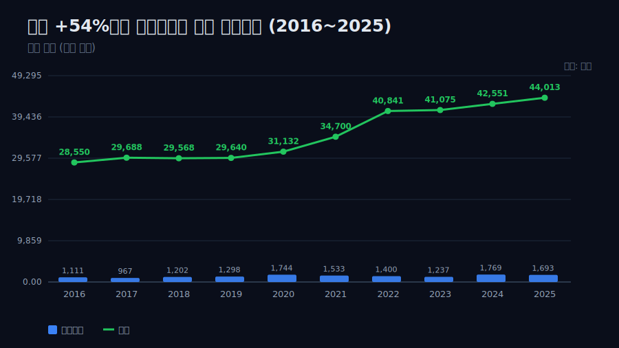
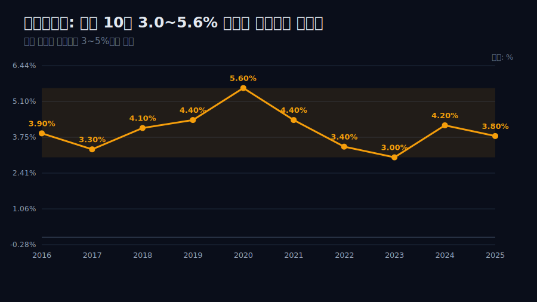
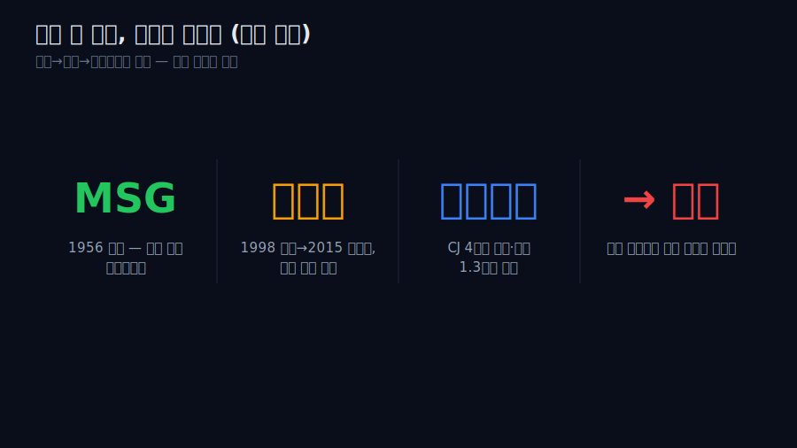
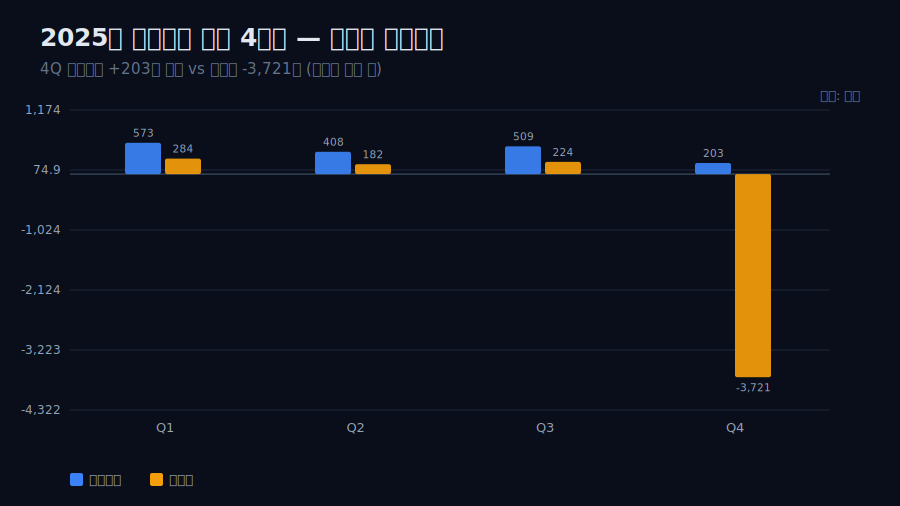
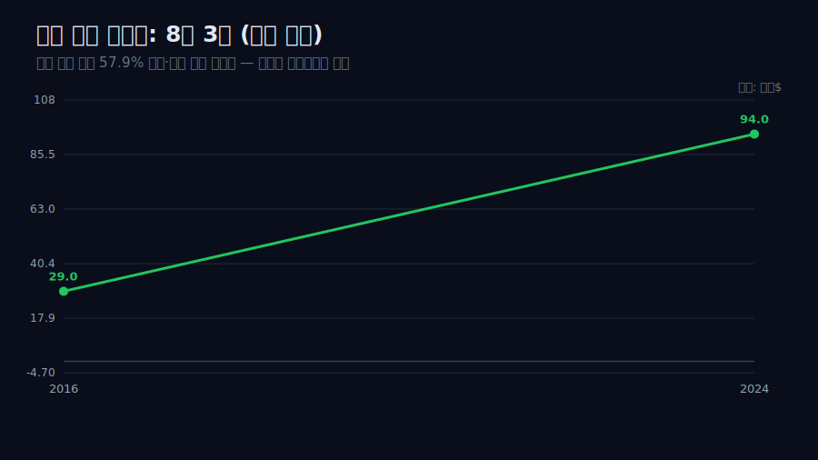
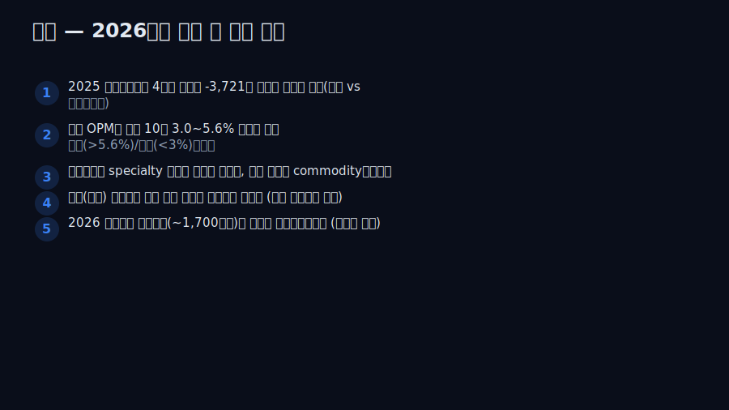

<script>
import ComboChart from '$lib/components/blog/ComboChart.svelte';
import StackBar from '$lib/components/blog/StackBar.svelte';
</script>

> **데이터 기준**: 2026-06-14 dartlab 실측 — 대상(001680) **연결** 기준, 연간(분기 합산). 내부로 쓰는 라인은 매출·영업이익·당기순이익·영업현금흐름. 부문(소재/식품) 매출·마진, 미원 창업사, 라이신 매각/재인수, 알룰로스 증설, 김치 수출 점유율, 2025 4분기 손상 항목은 연결 손익에 안 나오거나 미확정이라 **공시·언론(외부 인용)**으로 표기. ※'70년'은 발효 사업의 역사적 정체성이며, OPM 밴드 주장은 검증 가능한 **최근 10년(2016~2025)**으로 한정한다.
>
> **핵심 숫자**: 매출 **28,550억(2016) → 44,013억(2025)** (+54%, 연평균 약 +5%) · 전사 OPM **3.0~5.6%** (최근 10년 밴드) · 2025 영업이익 **+1,693억**인데 당기순이익 **-3,031억**(전액 4분기 영업외) · 4Q 영업이익 **+203억 흑자** vs 4Q 순이익 **-3,721억**
>
> **이 글의 용어**: 발효 = 미생물로 아미노산·당류를 만드는 기술(MSG·라이신·알룰로스가 모두 발효 산물) · 가격수용자(price-taker) = 가격을 시장 수급이 정해 회사가 못 정하는 처지 · specialty vs commodity = 차별화로 비싸게 받는 산물 vs 표준화돼 가격 경쟁에 빨려드는 산물.

---

## 프롤로그 — 산물은 바뀌었는데 천장은 그대로다

대상은 1956년 미원(MSG)으로 시작해 라이신, 그리고 최근의 대체감미료 알룰로스까지, 70년간 *발효*라는 한 가지 기술로 산물만 갈아입어 왔다(외부 인용). 그런데 검증 재무로 확인되는 최근 10년만 떼어 봐도 이상한 그림이 나온다 — 매출은 2016년 2조8,550억에서 2025년 4조4,013억으로 **+54%** 컸는데, 전사 영업이익률은 그 10년 내내 **3.0~5.6%** 대역을 한 번도 벗어나지 못했다.



관통선은 하나다. **"같은 기술이 더 나은 산물로 갈아입어도 마진 천장이 같다면, 그 벽은 기술이 아니라 *산물의 성격*에 있는 것 아닌가?"** 이 한 문장 이후로는 '한 우물' 같은 수사 대신 OPM 밴드와 부문 구조로만 말한다. 단 못을 박는다 — '70년 내내'는 검증 밖이다. 내가 증명할 수 있는 건 **2016~2025년 10개 연도**의 OPM이 3.0~5.6%였다는 관찰까지다.

---

## 1막 — 규모가 마진으로 번역되지 않았다

**왜 매출과 마진을 *함께* 보나.** 규모가 커지면 마진도 오르는 게 보통인데, 여기선 안 그랬다는 게 출발점이기 때문이다.

```python
import dartlab
c = dartlab.Company("001680")
c.select("IS", ["매출액","영업이익"], freq="Y")
```

검증 재무에서 영업이익률은 2016년 3.9%, 2020년 5.6%, 2023년 3.0%, 2025년 3.8%다. 매출 규모가 +54% 커지는 동안에도 비율은 3.0~5.6% 사이를 오갔을 뿐이다(2020년 5.6%가 이 밴드의 상단이다). 즉 '규모의 경제가 마진으로 번역됐다'고 보기 어렵다 — 규모 성장과 마진 정체가 *병존*한다는 관찰이다. 이 병존이 어느 사업에서 비롯되는지가 다음 질문이다.



---

## 2막 — 마진을 누르는 자리: 소재(B2B)의 commodity 운명

**왜 식품이 아니라 소재부터 보나.** 마진을 가두는 구조가 가격수용형 소재 쪽에 있다는 외부 단서가 뚜렷하기 때문이다.

대상은 식품(B2C 청정원·종가)이 매출의 약 70%, 소재(B2B 전분당·라이신·MSG)가 약 30%다(외부 인용). 소재의 핵심인 라이신(사료용 아미노산)은 전형적 가격수용자다 — 중국의 저가 공세와 수요 둔화로 가격이 급락하면 곧장 적자로 뒤집힌다. 외부 자료에 따르면 대상 소재부문은 2024년 들어 흑자에서 손실로 적자전환했다(외부 인용). 같은 발효 기술이 만든 산물인데, 가격은 회사가 정하지 못한다.

대상의 라이신 사업사는 이 운명을 압축한다 — 1998년 독일 BASF에 매각했다가, 2015년 백광산업에서 약 **1,206억원**에 재인수해 17년 만에 되살렸다(외부 인용). 그러나 되살린 사업은 다시 중국발 가격 경쟁에 노출됐다. 기술을 다시 손에 쥐어도, 가격결정력은 함께 돌아오지 않았다.

---

## 3막 — 탈출 시도: specialty 사다리를 오르다 (알룰로스)

**왜 commodity 다음에 알룰로스를 보나.** commodity가 문제라면 회사가 더 비싼 specialty로 갈아타려 했을 텐데, 그 시도의 결과가 관통선을 가르기 때문이다.

대상은 같은 발효 기술을 specialty 쪽으로 끌어올리려 했다. 대표가 대체감미료 **알룰로스**다 — 약 300억원을 들여 군산 전분당 공장에 국내 최대 알룰로스 생산시설을 준공하고, 헬시플레저·설탕세 흐름에 올라타 롯데칠성 등 50곳 이상과 북미 고객을 확보했다(외부 인용). 세계 대체감미료 시장은 2018~2022년 연평균 186% 성장한 고성장 영역이다(외부 인용). 발효 한 우물이 commodity(MSG·라이신)에서 specialty(알룰로스)로 산물을 갈아입은 셈이다.

그런데 검증 재무는 이 탈출이 마진 천장을 깨지 못했음을 보여준다 — 알룰로스가 본격화된 2023~2025년에도 전사 OPM은 3.0~3.8%로 여전히 밴드 안이다. 단 선을 긋는다: 알룰로스 *단독* 수익성은 검증 재무로 분리되지 않으므로, '알룰로스가 적자다'라고 단정하지 않는다. 말할 수 있는 건 '전사 OPM 밴드가 specialty 도입 후에도 그대로'라는 관찰까지다.

---

## 4막 — 왜 specialty조차 commodity로 가라앉나

**왜 밴드 불변의 *원인*을 산업 쪽에서 찾나.** 전사 OPM은 식품 70%+소재 30%의 합이라 알룰로스 단독으로 증명할 수 없고, 대신 산업 구조가 외부 사실로 또렷이 보이기 때문이다.

알룰로스는 CJ제일제당이 세계 최초로 상용화했으나 '사업성이 낮다'며 4년 만에 철수한 산물이고, 지금은 삼양사가 울산에 연 1.3만톤(기존 4배) 공장을 신설해 대상과 양분 경쟁 중이며, CJ가 재진입을 추진하고 있다(외부 인용). 선발자가 시장을 열면 → 경쟁사가 증설로 따라붙고 → 공급이 늘며 가격결정력이 옅어지는 흐름이, 70년 전 MSG, 한 세대 전 라이신에 이어 알룰로스에서도 외부 사실로 반복된다.



발효 산물은 '균을 배양하면 만들 수 있는' 표준화된 분자라, 기술 깊이가 진입을 막는 장벽이 아니라 입장 조건에 가깝다 — 이것이 전사 OPM 밴드가 산물이 바뀌어도 변하지 않는 것과 *양립하는* 설명이다(단정은 아니다, 알룰로스 단독 손익은 검증 밖). 같은 '가격을 남이 정하는' 처지는 대형 패널의 [LG디스플레이](/blog/034220-lg-display), 발효·바이오 소재를 함께 다루는 [CJ제일제당](/blog/097950-cj-cheiljedang)에서도 보인다.

---

## 5막 — 그 부담이 2025년 회계로 나타나다

**왜 마지막 사업연도를 따로 떼어 보나.** commodity 사이클의 부담이 장부에 한꺼번에 반영된 사건이 2025년에 있었기 때문이다.

```python
c.select("IS", ["영업이익","당기순이익"], freq="Q")  # 2025 분기
```

2025년 대상은 매출 4조4,013억으로 사상 최대, 영업이익 1,693억으로 정상 밴드를 유지했는데도 **당기순이익은 -3,031억으로 적자전환**했다(검증 재무). 결정적으로 이 순손실은 *전액 4분기*에 발생했다 — 2025년 4분기 영업이익은 **+203억 흑자**인데, 같은 분기 순이익이 **-3,721억**이다(검증 재무). 영업이익 아래(영업외)에서 약 4,700억 규모의 손실이 한 번에 잡혔다는 뜻이다.



선을 긋는다 — 4분기에 *영업이 망한 게 아니다.* 4분기 영업이익은 흑자였고, 손실은 영업 밖에서 났다. 정확한 손상 항목(영업권/무형/소재 자산/이연법인세 등)은 **공시 확인이 필요**하다(현 시점 미확정). 정황만 외부로 둔다 — 외부 자료는 2025년 소재부문이 라이신 시황 부진(중국 반덤핑 과세율이 낮게 책정돼 중국 물량 재유입)과 전방산업 부진, 축육 적자로 어려웠다고 본다(외부 인용). commodity 사이클의 누적 부담이 자산가치 재평가로 장부에 반영된 것과 *양립하는* 그림이지만, 단일 인과로 못박지 않는다. 참고로 검증 재무의 영업현금흐름도 이 사업의 성격을 비춘다 — 2022년 -909억으로 음수였다가 2023년 3,748억으로 튀는 등 운전자본 변동이 크다.

---

## 6막 — 다음 우물은 분자가 아니라 브랜드인가

**왜 마지막에 김치를 두나.** 발효 분자로는 못 깬 마진 천장을, 같은 회사의 *브랜드*가 깰 수 있는지가 마지막 질문이기 때문이다.

역설적으로 대상에서 가격결정력의 단서는 발효 기술이 아니라 브랜드에 있다. B2C 식품의 **종가(김치)**는 전 세계 80~100개국에 수출되며 국내 김치 수출의 **57.9%**를 차지하고(점유 1위), 미국을 최대 수출국으로 만들며 LA 인근에 약 200억원을 들여 국내 최초 현지 김치 공장을 가동 중이다(외부 인용). 김치 수출액은 2016년 2,900만 달러에서 2024년 9,390만 달러로 3배 이상 늘었다(외부 인용).



김치도 발효 산물이지만, '종가'라는 브랜드가 붙으면서 가격수용자에서 가격제시자 쪽으로 옮겨갈 단서가 보인다. 단 이건 *방향성 가설*이다 — 김치 부문 단독 마진이 소재보다 높다는 것은 검증 재무로 분리 확인되지 않는다. 결론은 경계에서 닫는다 — *검증 재무는 '매출 +54%인데 최근 10년 OPM 3~5.6% 정체'와 '2025년 영업외 대규모 손실'까지 말한다. 70년 동안 분자(MSG·라이신·알룰로스)로는 못 깬 천장을 브랜드(종가)로 깰 수 있는지는, 부문 실적이 답해야 할 다음 질문이다.* 같은 발효 회사 안에서 commodity와 brand의 경로가 갈린다는 것이, 이 회사를 읽는 마지막 단서다.

---

## 2026년에 봐야 할 다섯 가지

1. **2025 사업보고서(2026년 3월 공시)의 4분기 손실 정체** — 순손실 -3,721억(4Q)의 정확한 일회성 항목(영업권/무형/소재 자산 손상 vs 이연법인세 제거)을 확인. 5막의 '공시 확인 필요'가 사실로 채워지는 핵심 체크포인트.
2. **전사 OPM 밴드 이탈 여부** — 2026년 영업이익률이 최근 10년의 3.0~5.6% 밴드를 처음으로 상회(&gt;5.6%)하거나 하회(&lt;3%)하는가. 관통선의 '천장' 명제가 깨지거나 강화되는 데이터.
3. **알룰로스 마진** — 삼양사 증설분과 CJ 재진입이 본격화되는 2026년, 대상 소재/바이오 부문이 specialty 효과로 마진을 내는지 아니면 4막대로 증설 경쟁에 commodity화되는지(부문 실적 추적).
4. **김치(종가) 브랜드의 가격결정력 가설 검증** — K-푸드 호조와 LA 공장 가동으로 식품 B2C가 소재 대비 구조적으로 높은 마진을 내는지. 6막 가설의 진위는 부문 영업이익 공시로 판정.
5. **순이익 정상화** — 2025년 손실이 진짜 일회성이었다면 2026년 순이익은 영업이익(밴드 정상 시 ~1,700억대)에 수렴해 흑자전환해야 한다. 추가 손상이 또 나오면 '구조적 자산 과대평가'라는 더 무거운 해석으로 옮겨간다.



> 관련 글 — 발효·라이신·알룰로스를 함께 다투는 [CJ제일제당](/blog/097950-cj-cheiljedang), K-푸드 수출의 [삼양식품](/blog/003230-samyang-foods)·[농심](/blog/004370-nongshim)·[오뚜기](/blog/007310-ottogi), 그리고 가격을 남이 정하는 commodity 좌표의 [LG디스플레이](/blog/034220-lg-display)와 겹쳐 읽으면 '기술 깊이≠가격결정력'의 결이 또렷해진다.

---

<!-- AUTO:START — sync_financials.py가 자동 생성. 수동 편집 금지 -->


## 공시 자료

| 기간 | 보고서 | 링크 |
|------|--------|------|
| 2026 | 분기보고서 | [DART에서 보기](https://dart.fss.or.kr/dsaf001/main.do?rcpNo=20260515002571) |
| 2025 | 사업보고서 | [DART에서 보기](https://dart.fss.or.kr/dsaf001/main.do?rcpNo=20260318000733) |
| 2025 | 분기보고서 | [DART에서 보기](https://dart.fss.or.kr/dsaf001/main.do?rcpNo=20251114001857) |
| 2025 | 반기보고서 | [DART에서 보기](https://dart.fss.or.kr/dsaf001/main.do?rcpNo=20250814002325) |
| 2025 | 분기보고서 | [DART에서 보기](https://dart.fss.or.kr/dsaf001/main.do?rcpNo=20250515001663) |
| 2024 | 사업보고서 | [DART에서 보기](https://dart.fss.or.kr/dsaf001/main.do?rcpNo=20250319001095) |
| 2024 | 분기보고서 | [DART에서 보기](https://dart.fss.or.kr/dsaf001/main.do?rcpNo=20241114002086) |
| 2024 | 반기보고서 | [DART에서 보기](https://dart.fss.or.kr/dsaf001/main.do?rcpNo=20240814002611) |
| 2024 | 분기보고서 | [DART에서 보기](https://dart.fss.or.kr/dsaf001/main.do?rcpNo=20240516001137) |
| 2023 | 사업보고서 | [DART에서 보기](https://dart.fss.or.kr/dsaf001/main.do?rcpNo=20240327000761) |

> 전체 공시 목록은 dartlab에서 확인:
> ```python
> import dartlab
> c = dartlab.Company("001680")
> c.filings()
> ```

## 재무제표 — 최근 5개년

> 아래는 최근 5개년 요약입니다. 전체 기간·분기별 데이터는 dartlab에서 직접 확인할 수 있습니다:
> ```python
> import dartlab
> c = dartlab.Company("001680")
> c.show("IS")              # 손익계산서 (분기)
> c.show("IS", freq="Y")    # 손익계산서 (연간)
> c.show("BS")              # 재무상태표
> c.show("CF")              # 현금흐름표
> c.show("SCE")             # 자본변동표
> c.show("ratios")          # 재무비율
> ```

### 손익계산서 (IS) — 단위 억원

<ComboChart data={[{year:"2026Q1",매출액:11099,영업이익:570,당기순이익:326},{year:"2025",매출액:44013,영업이익:1693,당기순이익:-3031},{year:"2024",매출액:42551,영업이익:1769,당기순이익:967},{year:"2023",매출액:41075,영업이익:1237,당기순이익:686},{year:"2022",매출액:40841,영업이익:1400,당기순이익:769}]} lineKeys={["매출액"]} barKeys={["영업이익","당기순이익"]} lineColors={["#22c55e"]} barColors={["#3b82f6","#f59e0b"]} title="매출(라인) vs 영업이익·당기순이익(막대)" unit="억원" />

| 항목 | 2026Q1 | 2025 | 2024 | 2023 | 2022 |
|---|---:|---:|---:|---:|---:|
| 매출액 | 11,099 | 44,013 | 42,551 | 41,075 | 40,841 |
| 매출원가 | 8,014 | 32,229 | 31,131 | 30,885 | 31,138 |
| 매출총이익 | 3,085 | 11,784 | 11,421 | 10,190 | 9,703 |
| 판매비와관리비 | 2,514 | 10,091 | 9,651 | 8,953 | 8,303 |
| 영업이익 | 570 | 1,693 | 1,769 | 1,237 | 1,400 |
| 금융수익 | — | — | — | — | — |
| 금융비용 | 217 | 767 | 984 | 700 | 812 |
| 당기순이익 | 326 | -3,031 | 967 | 686 | 769 |

### 재무상태표 (BS) — 단위 억원

<StackBar data={[{year:"2026Q1",segments:[{label:"부채",value:25989,color:"#ef4444"},{label:"자본",value:11161,color:"#22c55e"}]},{year:"2025",segments:[{label:"부채",value:23822,color:"#ef4444"},{label:"자본",value:10969,color:"#22c55e"}]},{year:"2024",segments:[{label:"부채",value:20622,color:"#ef4444"},{label:"자본",value:14476,color:"#22c55e"}]},{year:"2023",segments:[{label:"부채",value:19906,color:"#ef4444"},{label:"자본",value:13437,color:"#22c55e"}]},{year:"2022",segments:[{label:"부채",value:18676,color:"#ef4444"},{label:"자본",value:13226,color:"#22c55e"}]}]} title="부채 vs 자본 구조" unit="억원" />

| 항목 | 2026Q1 | 2025 | 2024 | 2023 | 2022 |
|---|---:|---:|---:|---:|---:|
| 자산총계 | 37,150 | 34,791 | 35,098 | 33,344 | 31,902 |
| 유동자산 | 19,210 | 17,978 | 18,061 | 17,577 | 17,210 |
| 비유동자산 | 17,940 | 16,814 | 17,038 | 15,767 | 14,692 |
| 부채총계 | 25,989 | 23,822 | 20,622 | 19,906 | 18,676 |
| 유동부채 | 16,024 | 15,808 | 11,735 | 9,598 | 9,972 |
| 비유동부채 | 9,965 | 8,014 | 8,887 | 10,308 | 8,703 |
| 자본총계 | 11,161 | 10,969 | 14,476 | 13,437 | 13,226 |

### 현금흐름표 (CF) — 단위 억원

<ComboChart data={[{year:"2026Q1",영업CF:645,투자CF:-1106,재무CF:583},{year:"2025",영업CF:1881,투자CF:-1528,재무CF:-1180},{year:"2024",영업CF:1877,투자CF:-1846,재무CF:-822},{year:"2023",영업CF:3748,투자CF:-2107,재무CF:347},{year:"2022",영업CF:-909,투자CF:-2288,재무CF:3031}]} barKeys={["영업CF","투자CF","재무CF"]} barColors={["#22c55e","#ef4444","#3b82f6"]} title="영업·투자·재무 현금흐름" unit="억원" />

| 항목 | 2026Q1 | 2025 | 2024 | 2023 | 2022 |
|---|---:|---:|---:|---:|---:|
| 영업활동현금흐름 | 645 | 1,881 | 1,877 | 3,748 | -909 |
| 투자활동현금흐름 | -1,106 | -1,528 | -1,846 | -2,107 | -2,288 |
| 재무활동현금흐름 | 583 | -1,180 | -822 | 347 | 3,031 |

*최종 갱신: 2026-06-14 | dartlab 실측 (DART 공시 기준)*

<!-- AUTO:END -->
