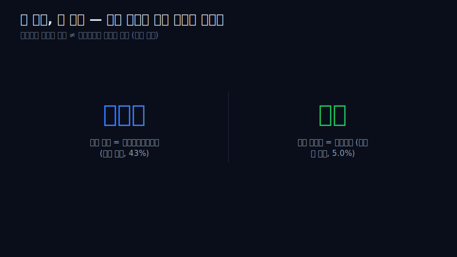
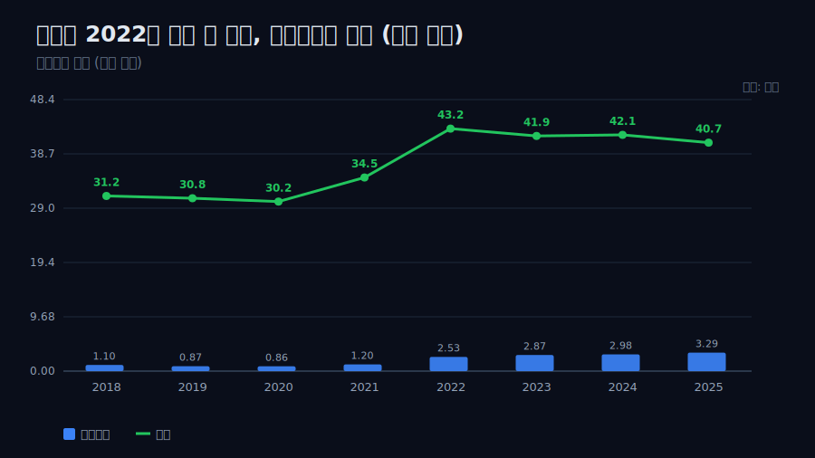
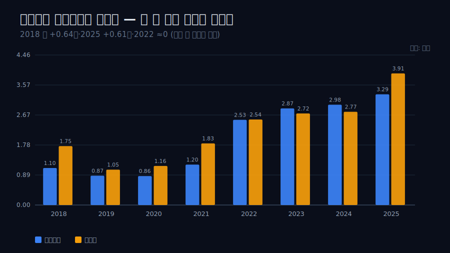
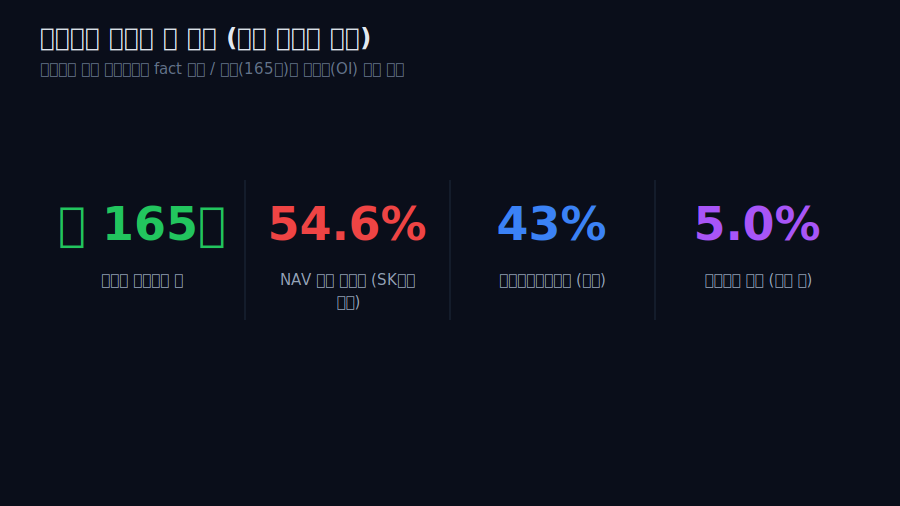
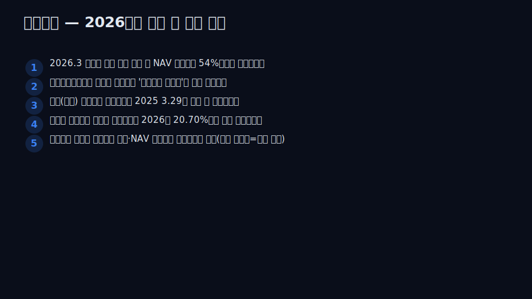

<script>
	import CompanyFinancials from '$lib/components/blog/CompanyFinancials.svelte';
</script>

> **데이터 기준**: 2026-06-20 dartlab 실측 — 삼성물산(028260) **연결** 기준, 연간(분기 합산). 내부로 쓰는 라인은 매출·영업이익·당기순이익·영업현금흐름. 2026Q1 부문별 실적은 삼성물산 공식 뉴스룸·DART 분기보고서로 분리 표기한다. 지분율(바이오 43%·전자 5.0%)·NAV 할인율·자사주 소각·지배구조 효과는 연결 손익에 안 나오므로 **공시·IR·외부 평가**로 분리한다. ※dartlab '지분법이익' 라인은 데이터 이상치라 인용하지 않고, 영업 밖 이익은 오직 검증된 '순이익-영업이익 차액'으로만 간접 관찰한다. ※NAV 할인율은 모델 산정치이지 확정 재무제표 숫자가 아니다.
>
> **핵심 숫자**: 매출 **43.2조(2022 정점) → 40.7조(2025, 횡보)** · 영업이익 **1.10조(2018) → 3.29조(2025)**(매출 횡보 속 성장) · 순이익이 영업이익을 웃돈 폭 **2018 +0.64조 · 2025 +0.61조 · 2022 ≈0**(비상수) · NAV 할인 **약 54.6%**(외부 SK증권 모델)
>
> **이 글의 용어**: 연결 종속회사 = 지분 과반·지배력으로 실적을 통째로 합산하는 자회사(삼성바이오로직스) → 그 이익이 영업이익·순이익에 모두 들어옴 · 연결 밖 지분 = 합산하지 않고 배당·평가로만 잡히는 보유 주식(삼성전자) → 순이익엔 거의 안 들어옴 · NAV 할인 = 보유지분 시가 합보다 주가가 싸게 거래되는 정도.

---

## 프롤로그 — 손익계산서가 보는 회사와 시가총액이 보는 회사가 다르다

삼성물산을 손익계산서로 읽으면 건설·상사·패션·리조트를 하는 사업회사다. 그런데 시가총액으로 읽으면 삼성전자·삼성바이오로직스 같은 *남의 회사 주식*을 잔뜩 쥔 지주에 가깝다. 문제는 이 두 시선이 보는 자산이 다르다는 것이다 — **순이익을 흔드는 자산과 기업가치를 흔드는 자산이 같지 않다.**



관통선은 하나다. **"순이익을 끌어올리는 자산과 시가총액의 무게추가 다른 자산이라면, 그 분열은 손익의 어떤 숫자와 시장의 어떤 숫자로 동시에 드러나는가?"** 이 한 문장 이후로는 '지주 디스카운트' 같은 라벨 대신 두 자산의 회계처리 차이로만 말한다.

---

## 1막 — 영업이익은 현금을 동반해 컸다

**왜 분열을 말하기 전에 본업부터 보나.** 본업이 허약했다면 '지분 마법'으로 이익을 부풀린 회사로 읽히지만, 실제로는 영업이익 자체가 진짜로 컸기 때문이다.

```python
import dartlab
c = dartlab.Company("028260")
c.select("IS", ["매출액","영업이익"], freq="Y")
```

검증 재무에서 영업이익은 2018년 1.10조에서 2025년 3.29조로 약 3배 커졌다(2018 기준). 같은 기간 영업현금흐름도 2022년 2.62조 → 2024년 3.31조로 함께 늘어, 회계이익이 아니라 현금이 따라온 성장이었다. 단 두 가지를 정직하게 짚는다 — (1) 매출은 같은 흐름이 아니다. 2022년 43.2조로 정점을 찍은 뒤 2023~2025년 41.9→42.1→40.7조로 횡보·소폭 감소했다. 즉 *외형이 아니라 마진이 개선*된 성장이다. (2) 2025년 영업현금흐름은 3.02조로 전년(3.31조)보다 줄어 영업이익 상승과 갈라졌다 — 동행은 2022~2024 구간에 한정한다.



---

## 2막 — 그런데 순이익이 영업이익 위를 걷는다

**왜 영업이익 다음에 순이익을 겹쳐 보나.** 보통은 영업이익 아래에서 이자·세금이 *빠져* 순이익이 더 작은데, 여기선 거꾸로이기 때문이다.

```python
c.select("IS", ["영업이익","당기순이익"], freq="Y")
```

검증 재무에서 순이익은 영업이익을 거의 매년 웃돈다 — 2018년 순이익 1.75조 > 영업이익 1.10조(+0.64조), 2025년 순이익 3.91조 > 영업이익 3.29조(+0.61조). 영업이익 아래 단계(지분법손익·금융손익·법인세 등)의 *순효과가 플러스*라는 뜻이다.



단 결정적 단서가 있다 — 이 차액은 상수가 아니다. 2022년은 순이익 2.54조 ≈ 영업이익 2.53조로 차이가 거의 0이었다. 그러니 '지분이익 한 줄이 매년 일정하게 얹힌다'는 고정 설명은 틀린다. 차액의 *크기 자체*가 해마다 다른 무언가에 묶여 있다는 것이 다음 질문을 강제한다.

---

## 3막 — 그 '무언가'는 성격이 다른 두 자산이다

**왜 차액이 출렁이나.** 영업 밖에서 순이익에 영향을 주는 자산이 회계처리가 전혀 다른 두 종류이기 때문이다.

여기서 분열이 드러난다. (1) **삼성바이오로직스 지분 약 43%** — 이건 *연결 종속회사*다. 그 실적이 삼성물산 연결에 통째로 합산되므로, 바이오의 이익은 순이익뿐 아니라 *영업이익에도* 들어간다(외부 인용). (2) **삼성전자 지분 약 5.0% 직접** — 이건 *연결 밖 보유지분*이라, 그 막대한 이익은 삼성물산 순이익에 거의 안 잡히고 배당·평가만 스친다(외부 인용).

2025년 차액 +0.61조가 커진 것은 바이오 쪽 실적과 함께 움직인다 — 외부 보도에 따르면 삼성바이오로직스 2025년 순이익은 약 1.61조로 전년비 +55% 급증했고, 삼성물산 2025년 순이익 3.91조(+40.9%)의 급증도 바이오 실적 급증에 주로 기인한다고 전해진다(외부 인용). 차액이 2022년에 거의 0이었던 것도 그해 바이오 기여가 작았던 것과 양립한다. 단 선을 긋는다 — 바이오는 연결이라 그 이익이 영업이익에도 들어가므로, 순이익-영업이익 차액 *전부*를 바이오에 귀속시키지는 않는다. '차액의 변동이 바이오 실적 변동과 함께 움직인다(외부 보도 기준)'까지가 경계다.

---

## 4막 — 그러면 시장은 무엇에 값을 매기나

**왜 순이익을 키운 자산과 시장이 보는 자산을 따로 묻나.** 둘이 같았다면 분열이 없는데, 정반대이기 때문이다.

순이익을 흔든 게 바이오라면, 주가의 무게추도 바이오일까. 정반대다. 외부 증권사 분석에 따르면 삼성물산이 보유한 관계사 지분가치 합은 약 **165조원**이고, 그 무게추는 삼성전자·삼성생명 지분이다(외부 인용). 즉 순이익을 거의 통과하지 못하는 *연결 밖* 전자 지분이, 시장이 매기는 기업가치에선 가장 큰 자산이다. **손익은 바이오가 끌고, 가치는 전자가 끈다** — 이 한 줄이 1막부터 쌓인 분열의 정체다. 투자자가 순이익 기준 PER로만 이 회사를 읽으면, 그 막대한 전자 NAV를 통째로 놓치게 된다.

---

## 5막 — 분열에는 값이 매겨진다: NAV 할인

**왜 분열 다음에 할인을 보나.** 손익(바이오)과 가치(전자)가 갈라져 있으면 시장이 그 어긋남을 가격으로 깎기 때문이다.

```python
c.select("IS", ["매출액","영업이익","당기순이익"], freq="Y")  # 본업 척추 재확인
```

지주성 회사는 자산 대부분이 '남의 회사 주식'이라, 중복상장·세금·자회사 직접 선호 때문에 보유지분 시가 합보다 싸게 거래된다. 외부 증권사(SK증권) 모델은 삼성물산의 NAV 대비 할인율을 약 **54.6%**로 산정했다(외부 인용). 보유지분 가치는 분명한데 그 가치를 '직접 사업으로 현금화'하지 못하니, 시장이 절반 가까이를 깎는 것이다.



단 못을 박는다 — 이 54.6%는 *증권사 모델의 산정치이지 검증된 fact가 아니다.* 그리고 보유지분 165조(스톡)와 영업이익 3.29조(플로우)는 차원이 다른 숫자라 한 문장에서 더하거나 비교하지 않는다. 본문이 말할 수 있는 건 '시장이 이 분열을 큰 폭의 할인으로 본다'까지다.

---

## 6막 — 할인을 좁히는 손, 그리고 그 끝에 누가 있나

**왜 마지막에 주주환원을 두나.** 분열에 값(할인)이 매겨졌다면, 회사가 그 값을 좁히려 움직이는 방식과 그 수혜가 분열의 마지막 조각이기 때문이다.

외부 공시·보도에 따르면 삼성물산은 2024~2026년에 자사주 보통주 약 **13.2%** 전량 소각과 배당 확대를 진행하고 있다(외부 인용). 자사주 소각은 주식 수를 줄여 NAV 할인을 좁히는 직접 수단이다. 그 산술적 효과의 끝에는 지배구조가 있다 — 자사주 소각으로 분모(주식 수)가 줄면 이재용 회장의 지분율이 한 주도 사지 않아도 산술적으로 오르며, 외부 보도는 2년간 약 +1.79%p, 2026년 20.70%까지 상승할 것으로 본다(외부 인용). 삼성 지배구조가 이재용→삼성물산→삼성생명→삼성전자로 이어지므로(외부 인용), 외부 보도는 삼성물산의 NAV 할인 축소·지분율 상승을 그룹 승계 맥락과 연결지어 해석한다.

결론은 경계에서 닫는다 — *1막의 영업이익은 진짜로 컸다. 그러나 이 회사를 읽는 열쇠는 손익계산서가 아니라, 손익엔 안 잡히는 전자 지분 + 그 할인을 좁히는 자사주 소각 + 그 산술적 수혜자라는, 회계 밖의 세 항목이다.* 손익을 움직이는 자산과 가치를 움직이는 자산이 갈라진 회사 — 그 분열이 'NI가 OI를 일정치 않게 웃도는' 검증 수치와 'NAV 할인'이라는 외부 사실을 동시에 설명한다. 같은 '연결의 함정'은 영업이익은 늘었는데 지배주주 순익은 더 적자였던 [LG화학](/blog/051910-lg-chem), 지주 NAV 할인의 [SK스퀘어](/blog/402340-sk-square)에서도 다른 얼굴로 보인다.

---

## 2026 Q1 업데이트 — 네 사업이 서로 상쇄한 전사 7,200억원

2026년 1분기 공식자료를 붙이면 삼성물산의 본문 결론은 더 선명해진다. 전사 숫자만 보면 안정적이다. 삼성물산은 2026Q1 매출 10조4,660억원, 영업이익 7,200억원을 냈다. DART 연결 손익계산서의 세부 값은 매출 104,658억원, 영업이익 7,204억원으로 반올림 차이를 빼면 같은 그림이다. 2025년 연간 영업이익 3조2,927억원을 단순 4등분한 8,232억원보다 낮지만, 분기 계절성과 사업 mix를 감안하면 결론을 한 줄로 쓰기 어렵다.

중요한 것은 전사 7,200억원이라는 평균 뒤에서 네 사업이 같은 방향으로 움직이지 않았다는 점이다. 건설은 매출 3조4,130억원, 영업이익 1,110억원이었다. 전년 동기 대비 매출과 이익이 모두 줄었다. 회사는 대형 프로젝트 종료와 준공 정산 이익의 역기저를 설명한다. 즉 2025년까지 본문이 강조한 "본업도 진짜다"는 말은 유지되지만, 그 본업 중 건설은 2026Q1에 회복의 주역이 아니었다.

반대로 상사는 분기 안에서 가장 강한 축이었다. 상사 매출은 4조1,140억원, 영업이익은 1,090억원이었다. 회사는 수익성 중심의 trading 확대와 북미 태양광 개발사업 호조를 설명했다. 상사는 매출 규모로 전사에서 가장 큰 사업이지만, 역사적으로는 margin이 낮아 손익보다 외형을 크게 만든다. 2026Q1에는 이 낮은 margin 사업이 영업이익 방어에 실질적으로 기여했다. 삼성물산을 건설회사로만 보면 이 분기 해석을 놓친다.

패션은 작지만 신호가 선명했다. 패션 매출은 5,730억원, 영업이익은 380억원이었다. 매출은 소폭 줄었지만, 온라인과 브랜드 mix 개선으로 영업이익은 늘었다. 이 줄은 전사 숫자를 크게 바꾸지는 않는다. 그러나 삼성물산의 손익 구조를 읽을 때 중요한 것은 크기만이 아니다. 패션은 전사 매출에서 차지하는 비중은 작아도, margin 변화가 빠르게 드러나는 사업이다. 2026Q1의 패션은 외형보다 수익성 관리가 먼저였던 분기다.

리조트는 반대편에 있었다. 리조트 매출은 9,300억원으로 늘었지만, 영업손실 210억원을 냈다. 레저 사업은 계절성이 크고 비용 선집행이 있다. 그렇다고 이 손실을 무시하면 안 된다. 전사 7,200억원 안에는 상사의 호조, 패션의 개선, 건설의 둔화, 리조트의 손실이 함께 들어 있다. 평균은 안정적으로 보이지만, 내부는 네 방향으로 벌어진다. 이게 2026Q1 업데이트의 핵심이다.

이 분기는 삼성물산을 하나의 업종으로 묶어 부르기 어렵다는 사실을 다시 확인한다. 건설 사이클, 원자재·트레이딩 사이클, 패션 소비, 레저 계절성, 바이오 연결, 전자 지분가치가 한 회사 안에 있다. 손익계산서에는 이 중 일부만 선명하게 잡힌다. 지분가치와 NAV 할인은 손익계산서 밖에 있고, 바이오는 연결 손익 안에 들어오며, 전자는 손익보다 가치에 더 크게 걸린다. 그래서 삼성물산의 전사 OPM이나 PER 하나만 보면 구조를 놓친다.

2025년 연간 공식자료와도 이어진다. 2025년 삼성물산은 매출 40조7,420억원, 영업이익 3조2,930억원을 냈다. 건설은 매출 14조1,480억원, 영업이익 5,360억원이었다. 상사는 매출 14조6,360억원, 영업이익 2,720억원이었다. 패션은 매출 2조200억원, 영업이익 1,230억원이었다. 리조트는 매출 3조9,870억원, 영업이익 1,710억원이었다. 2026Q1은 이 연간 구도를 그대로 연장하지 않는다. 건설은 약해지고, 상사는 올라오며, 패션은 margin으로 버티고, 리조트는 분기 손실을 냈다.

따라서 2026년의 질문은 "삼성물산 영업이익이 늘었나"가 아니다. 질문은 더 잘게 쪼개야 한다. 건설의 수주·원가율이 다시 올라오는가. 상사의 trading 이익이 반복 가능한가. 패션의 margin 개선이 일회성 비용 절감이 아닌가. 리조트의 계절 손실이 하반기에 회수되는가. 그리고 이 네 사업의 답이 주가를 움직이는 전자·바이오 지분가치와 같은 방향으로 가는가. 이 질문들이 동시에 맞아야 전사 숫자가 진짜로 단단해진다.

본문의 원래 결론도 여기서 조금 수정된다. 이전 결론은 "손익을 움직이는 자산과 가치를 움직이는 자산이 다르다"였다. 2026Q1을 붙인 결론은 "손익 안에서도 사업별 방향이 다르고, 손익 밖에서도 가치의 무게추가 따로 있다"다. 삼성물산은 두 겹으로 나뉜 회사다. 첫 번째 겹은 건설·상사·패션·리조트가 서로 다른 속도로 움직이는 영업 portfolio다. 두 번째 겹은 바이오·전자·생명 등 지분가치가 손익과 다른 방식으로 기업가치에 반영되는 holding portfolio다. 전사 매출과 전사 영업이익은 이 두 겹 중 첫 번째만 대략적으로 보여준다.

그래서 2026Q1의 7,200억원은 "좋다" 또는 "나쁘다"가 아니라 "평균이다." 평균을 해체해야 이 회사가 보인다. 건설이 약해도 상사가 보완할 수 있고, 상사가 좋아도 리조트가 깎을 수 있으며, 본업이 좋아도 NAV 할인은 남을 수 있다. 삼성물산은 숫자가 하나로 모이는 회사가 아니라, 숫자가 서로 다른 층에서 엇갈리는 회사다. 그 엇갈림을 읽는 것이 이 글의 목적이다.

### 전사 OPM 6.9%를 그대로 믿으면 놓치는 것

2026Q1 DART 수치로 단순 계산하면 전사 OPM은 7,204억원 ÷ 104,658억원, 약 6.9%다. 이 비율은 삼성물산을 한 업종 회사처럼 볼 때 편리하다. 그러나 실제 사업부문을 놓고 보면 이 6.9%는 네 가지 다른 경제성을 평균낸 결과다. 건설은 project margin과 원가율이 중요하고, 상사는 turnover가 큰 trading 사업이라 매출 대비 이익률이 낮아도 절대 이익 기여가 커질 수 있다. 패션은 작은 매출에서 브랜드·채널 mix가 바로 margin으로 드러난다. 리조트는 계절성과 고정비가 손익을 흔든다. 같은 1억원의 매출이라도 사업부문별로 남는 이익의 성격이 다르다.

이 때문에 삼성물산의 전사 OPM은 "회사의 품질"을 바로 말해주지 않는다. 전사 OPM이 좋아졌다면 어떤 사업이 좋아졌는지 봐야 하고, 전사 OPM이 나빠졌다면 어떤 사업이 눌렀는지 봐야 한다. 2026Q1은 그 필요성을 잘 보여준다. 건설 둔화는 전사 이익을 누르지만, 상사 호조와 패션 개선이 일부를 상쇄한다. 리조트 손실은 분기적으로 나쁠 수 있지만, 계절성이 큰 사업이라 연간으로 회수될 여지가 있다. 전사 OPM 한 줄은 이 네 문장을 모두 지운다.

### 2025년 연간 기저와 Q1을 같은 눈금에 놓지 않는다

2025년 연간 수치도 조심해서 붙여야 한다. 2025년 전사 매출 40조7,420억원, 영업이익 3조2,930억원은 네 분기의 합이다. 2026Q1 매출 10조4,660억원, 영업이익 7,200억원은 한 분기다. Q1 매출을 네 배 하면 41조8,640억원으로 2025년보다 조금 커 보이고, Q1 영업이익을 네 배 하면 2조8,800억원으로 2025년보다 낮아 보인다. 하지만 이 연간화는 결론이 아니라 점검표다. 특히 리조트처럼 계절성이 큰 사업은 Q1 손익을 네 배 하는 순간 왜곡이 커진다.

따라서 연간화보다 더 나은 방식은 부문별 질문을 나누는 것이다. 건설은 2025년 연간 영업이익 5,360억원을 냈고, 2026Q1에는 1,110억원을 냈다. 단순 4분의 1인 1,340억원보다 낮다. 상사는 2025년 연간 2,720억원이었고 Q1은 1,090억원이다. 단순 4분의 1인 680억원보다 높다. 패션은 2025년 연간 1,230억원이고 Q1은 380억원이다. 리조트는 2025년 연간 1,710억원이지만 Q1은 -210억원이다. 이 네 줄을 나란히 두면, Q1 전사 영업이익 7,200억원이 어떤 사업의 부진과 호조를 평균낸 값인지 보인다.

이 비교는 "상사가 좋아서 건설을 이겼다" 같은 단순 순위가 아니다. 사업별 자본 투입, 운전자본, 계절성, 수주 잔고, 가격 결정력이 다르다. 다만 투자자가 볼 수 있는 첫 번째 경고등은 여기서 나온다. 건설의 분기 이익이 낮은 상태로 고착되면 2025년의 본업 체력 이야기는 약해진다. 상사의 Q1 이익이 반복되지 않으면 2026년 전사 이익은 다시 건설과 바이오 쪽 기여에 더 기대게 된다. 리조트가 성수기에 Q1 손실을 회수하지 못하면 전사 margin은 눈에 띄게 눌린다. 패션은 규모가 작아도 margin 방향이 빠르게 바뀌기 때문에 소비 경기의 작은 체온계가 된다.

### holding portfolio는 Q1 손익으로 다 설명되지 않는다

삼성물산을 어렵게 만드는 마지막 이유는 Q1 손익이 holding portfolio의 대부분을 설명하지 못한다는 점이다. 손익계산서에 들어오는 바이오 연결 효과와, 손익 밖에서 시가총액·NAV를 흔드는 전자 지분가치는 다른 층이다. 2026Q1 영업이익 7,200억원을 아무리 정밀하게 뜯어도, 삼성전자 지분가치 변화가 주가에 얼마나 반영되는지는 별도의 질문으로 남는다. 이게 이 글이 처음부터 PER 하나로 삼성물산을 읽지 말라고 한 이유다.

연결회계는 "지배하는 회사"의 손익을 합산한다. 그래서 바이오가 잘되면 삼성물산 연결 손익에도 더 선명하게 들어온다. 반면 전자 지분은 큰 자산가치임에도 손익계산서에서는 배당·평가·기타 포괄손익의 방식으로 제한적으로만 보인다. 시장은 이 손익 밖 자산을 보면서도, 지주 구조와 세금·중복상장·지배구조의 비용을 이유로 할인한다. 그래서 삼성물산의 2026년은 두 표를 동시에 요구한다. 하나는 건설·상사·패션·리조트·바이오를 포함한 손익표, 다른 하나는 전자·생명·바이오 지분가치와 NAV 할인율을 보는 가치표다.

Q1 업데이트가 본문 결론을 강하게 만드는 이유가 여기에 있다. 2026Q1 영업 portfolio는 이미 내부에서 갈라졌다. 그리고 holding portfolio는 애초에 손익표 밖에 절반쯤 놓여 있다. 삼성물산은 한 회사지만, 읽는 표는 하나가 아니다. 전사 영업이익이 좋아지는 해에도 NAV 할인이 벌어질 수 있고, 전사 영업이익이 잠시 약해지는 분기에도 보유지분 가치가 주가를 끌어올릴 수 있다. 손익과 가치가 같은 방향으로 움직일 때는 읽기 쉽지만, 이 회사의 진짜 난도는 둘이 어긋날 때 드러난다.

따라서 2026년의 좋은 답안은 단순히 "영업이익 증가"가 아니다. 좋은 답안은 네 가지가 같이 나오는 것이다. 첫째, 건설이 원가율과 수주에서 회복한다. 둘째, 상사의 Q1 이익이 반복 가능한 사업이익으로 확인된다. 셋째, 패션과 리조트가 소비·레저 변동성을 흡수한다. 넷째, 자사주 소각과 주주환원 이후에도 NAV 할인율이 실제로 좁혀진다. 앞의 세 가지는 손익의 답이고, 마지막 하나는 가치의 답이다. 삼성물산을 제대로 읽으려면 두 답이 모두 필요하다.

### 단위와 반올림을 먼저 맞춰야 한다

삼성물산 같은 한국 연결회사를 읽을 때는 단위 실수가 결론을 망친다. 회사 실적자료는 전사 매출을 10조4,660억원, 영업이익을 7,200억원으로 둥글게 제시한다. DART 손익계산서는 매출 104,658억원, 영업이익 7,204억원으로 더 촘촘하다. 두 숫자는 충돌하지 않는다. 하나는 발표용 반올림이고, 하나는 공시 표의 세부 값이다. 본문에서 둘을 같이 쓰는 이유는 독자가 "10조" 단위의 감각과 "억원" 단위의 검증을 동시에 갖게 하기 위해서다.

이 단위 정리는 특히 사업부문을 볼 때 중요하다. 건설 3조4,130억원, 상사 4조1,140억원, 패션 5,730억원, 리조트 9,300억원을 모두 억원으로 바꾸면 각각 34,130억원, 41,140억원, 5,730억원, 9,300억원이다. 전사 매출 104,660억원과 단순히 맞춰 보면 부문 합산과 연결 조정의 차이가 생길 수 있다. 그러므로 부문별 표는 전사 손익계산서를 재구성하는 계산표가 아니라, 어떤 사업이 방향을 만들었는지 보는 설명표로 써야 한다. 이 경계를 지키지 않으면 "부문을 더했더니 전사와 안 맞는다"는 잘못된 문제를 만들게 된다.

영업이익도 마찬가지다. 건설 1,110억원, 상사 1,090억원, 패션 380억원, 리조트 -210억원만 더하면 전사 7,200억원보다 훨씬 작다. 왜냐하면 삼성물산의 전사 실적에는 바이오와 식음·기타 등 연결 범위의 다른 축도 있고, 내부거래·조정도 들어가기 때문이다. 따라서 Q1의 부문 숫자는 "전사 이익의 전부"가 아니라 "영업 portfolio 안에서 확인 가능한 네 축의 방향"이다. 본문이 이 네 축을 강조하는 이유는 전사 이익 7,200억원의 구성 전체를 닫기 위해서가 아니라, 평균을 해체하는 첫 번째 층을 보여주기 위해서다.

검증표도 이 원칙을 따른다. DART 연결 표로 검증 가능한 것은 매출액, 영업이익, 당기순이익 같은 연결 재무 항목이다. 사업부문별 Q1 매출·영업이익은 회사 실적자료에서 확인한다. NAV 할인율, 보유지분 가치, 자사주 소각 후 지분율 변화는 DART 연결 손익계산서의 한 줄로 증명되지 않는다. 그것들은 가치평가와 지배구조의 영역이다. 그러니 이 글은 세 종류의 숫자를 섞지 않는다. 연결 재무는 DART로, 사업부문 실적은 회사 실적자료로, NAV·지배구조 해석은 별도의 가치표로 본다.

이 구분이 번거로워 보여도 삼성물산에서는 필수다. 같은 "삼성"이라는 이름 아래 들어 있는 숫자들이 서로 다른 회계 층에 있기 때문이다. 바이오는 연결 손익에 들어와 영업이익과 순이익을 움직이고, 전자는 거대한 보유지분 가치로 남아 주가와 NAV를 움직이며, 건설·상사·패션·리조트는 분기별 사업 변동성을 만든다. 이 셋을 한 줄에 놓고 "좋다" 또는 "싸다"라고 쓰면, 읽기는 쉬워지지만 정확도는 떨어진다. 삼성물산은 쉬운 회사가 아니라, 표를 나눠야 보이는 회사다.

---

## 2026년에 봐야 할 다섯 가지

1. **건설 영업이익이 2026Q1 1,110억원에서 회복되는가** — 대형 프로젝트 종료와 역기저를 넘어 신규 수주·원가율이 전사 이익을 다시 끌어올리는지 본다.
2. **상사의 Q1 호조가 반복 가능한가** — 2026Q1 상사 영업이익 1,090억원은 전사 방어에 컸다. trading과 북미 태양광 개발사업 이익이 한 분기 신호인지 연간 체력인지 확인한다.
3. **패션 margin 개선과 리조트 손실 회수가 동시에 나타나는가** — Q1 패션은 이익이 늘었고 리조트는 적자였다. 소비·레저 사업의 서로 다른 계절성을 따로 본다.
4. **삼성바이오로직스 연결 효과가 순이익과 영업이익을 어떻게 나누어 움직이는가** — 바이오는 연결 안에 있고, 전자는 손익 밖 가치에 더 가깝다. 두 자산을 같은 줄에 놓고 읽지 않는다.
5. **자사주 소각 이후 NAV 할인율과 전자 지분가치 민감도가 좁혀지는가** — 손익이 좋아도 보유지분 가치가 가격에 반영되지 않으면 지주 할인은 남는다.



> 관련 글 — 순이익을 끌어올리는 [삼성바이오로직스](/blog/207940-samsung-biologics), 가치의 무게추 [삼성전자](/blog/005930-samsung), 영업이익↑인데 지배순익은 더 적자였던 [LG화학](/blog/051910-lg-chem), 지주 NAV 할인의 [SK스퀘어](/blog/402340-sk-square), 같은 그룹의 [삼성SDI](/blog/006400-samsung-sdi)와 겹쳐 읽으면 '연결과 지분'이 손익을 어떻게 비트는지 또렷해진다.

---

## 공시 / Filings

- [삼성물산 2026년 1분기 보고서(DART)](https://dart.fss.or.kr/dsaf001/main.do?rcpNo=20260515001895) — 2026Q1 연결 손익계산서, 재무상태표, 현금흐름표 확인용.
- [삼성물산 2026년 1분기 실적 참고자료](https://news.samsungcnt.com/ko/%EC%A0%84%EC%B2%B4%EA%B8%B0%EC%82%AC/%EC%A0%84%EC%82%AC%EA%B3%B5%ED%86%B5/2026-04-%EC%82%BC%EC%84%B1%EB%AC%BC%EC%82%B0-2026%EB%85%84-1%EB%B6%84%EA%B8%B0-%EC%8B%A4%EC%A0%81-%EC%B0%B8%EA%B3%A0%EC%9E%90%EB%A3%8C/) — 전사 및 사업부문별 Q1 매출·영업이익 공식자료.
- [삼성물산 2025년 연간 및 4분기 실적 참고자료](https://news.samsungcnt.com/ko/%EC%A0%84%EC%B2%B4%EA%B8%B0%EC%82%AC/%EC%A0%84%EC%82%AC%EA%B3%B5%ED%86%B5/2026-01-%EC%82%BC%EC%84%B1%EB%AC%BC%EC%82%B0-2025%EB%85%84-%EC%97%B0%EA%B0%84-%EB%B0%8F-4%EB%B6%84%EA%B8%B0-%EC%8B%A4%EC%A0%81-%EC%B0%B8%EA%B3%A0%EC%9E%90%EB%A3%8C/) — 2025년 전사·사업부문별 연간 실적 확인용.

---

## 재무 검증표 — 최근 4개년 (dartlab 연결, 억원)

```python
import dartlab
c = dartlab.Company("028260")
c.select("IS", ["매출액","영업이익","당기순이익"], freq="Y")
```

| 항목 | 2022 | 2023 | 2024 | 2025 |
|---|---:|---:|---:|---:|
| 매출액 | 431,617 | 418,957 | 421,032 | 407,422 |
| 영업이익 | 25,285 | 28,702 | 29,834 | 32,927 |
| 당기순이익 | 25,450 | 27,191 | 27,720 | 39,067 |
| 영업이익률(OPM) | 5.86% | 6.85% | 7.09% | 8.08% |
| 순이익률(NPM) | 5.90% | 6.49% | 6.58% | 9.59% |

2022~2025년 표에서 중요한 것은 매출이 커진 회사가 아니라 margin이 좋아진 회사라는 점이다. 매출은 2022년 431,617억원에서 2025년 407,422억원으로 줄었지만, 영업이익은 25,285억원에서 32,927억원으로 늘었다. 당기순이익은 2025년에 39,067억원으로 영업이익을 더 크게 웃돈다. 이 표는 본문이 말한 "본업 margin 개선"과 "순이익이 영업이익 위를 걷는 구조"를 동시에 검증한다.

---

<CompanyFinancials code="028260" />
