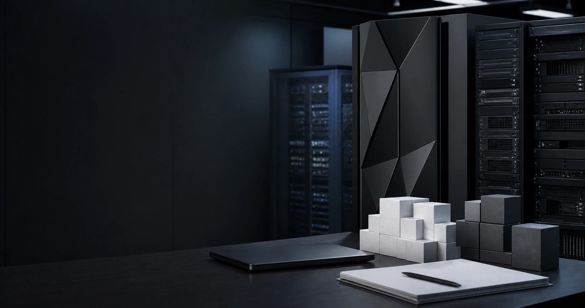

<script>
import ComboChart from '$lib/components/blog/ComboChart.svelte';
import StackBar from '$lib/components/blog/StackBar.svelte';
</script>

> **데이터 기준**: 2026-06-20 dartlab 실측 — IBM **미국 연결(USD)** 기준, 분기 데이터를 달력연도로 합산. 내부로 쓰는 라인은 매출·당기순이익·영업현금흐름. **영업이익(operating income) 라인은 dartlab 격자에 없어 마진은 순마진(순이익/매출)으로만** 본다. 영업현금흐름은 2017년 이후만 신뢰(이전 결손). Kyndryl 분사·반도체/x86 매각·연금정산손실·Red Hat·HashiCorp·watsonx·배당·FCF·소프트웨어 비중은 연결 손익 라인에 안 나오므로 **공시·언론(외부 인용)**으로 표기.
>
> **핵심 숫자**: 매출 **106.92B(2011 정점) → 57.35B(2021) → 67.53B(2025)** · 순마진 **14.8%(2011) → 2.7%(2022 저점) → 15.7%(2025)** · 2022 순이익 **1.64B**인데 영업현금흐름 **10.44B**(비현금 연금정산손실) · 2014년 반도체를 넘기며 **15억 달러 지불**(외부)
>
> **이 글의 용어**: 분사(spin-off) = 사업부를 떼어 별도 상장사로 분리(Kyndryl) · 순마진 = 당기순이익 ÷ 매출 · 비현금 손실 = 장부엔 손실로 잡히지만 현금은 안 빠지는 항목(연금정산손실 등) · book of business = 누적 수주잔고 성격의 지표(매출 아님).

---

## 프롤로그 — 매출이 반토막인데, 안 망했다

대부분의 회사에서 매출이 10년간 절반 가까이 줄면 그건 쇠퇴의 그래프다. IBM의 매출은 2011년 **106.92B**에서 2021년 **57.35B**로 약 46% 줄었다. 그런데 같은 기간 IBM은 망하지 않았고, 배당을 매년 늘렸으며, 순마진은 오히려 출발점 수준으로 돌아왔다.




관통선은 하나다. **"매출이 반토막인데 회사가 안 무너졌다면, 그 매출은 빼앗긴 것인가 — 아니면 스스로 깎아낸 것인가?"** 이 한 문장 이후로는 '재편' 같은 라벨 대신 매출 곡선과 순마진으로만 말한다. 미리 못을 박는다 — IBM은 dartlab 격자에 영업이익 라인이 없다. 그래서 마진은 *순마진(순이익/매출)* 한 가지로만 본다.

---

## 1막 — 외형 곡선만 보면 무너지는 회사다

**왜 쇠퇴 서사를 일부러 먼저 세우나.** 매출만 보면 정말 무너지는 그래프인데, 그 그래프가 틀렸음을 뒤에서 뒤집기 위해서다.

```python
import dartlab
c = dartlab.Company("IBM")
c.select("IS", ["매출액"], freq="Q")  # 달력연도 합산
```

검증 재무에서 매출은 2011년 106.92B(제공 시계열 정점)에서 2015년 81.74B, 2018년 79.59B, 2020년 73.62B, 2021년 57.35B로 내려왔다. 10년간 약 46%가 사라졌다. 보통 이 곡선은 시장에서 밀려나는 회사의 모습이다. 그런데 같은 기간 순이익은 2011년 15.86B에서 줄긴 했어도 0이 되지 않았고, 배당은 끊기지 않았다. **매출 곡선과 생존이 따로 논다** — 매출은 반토막인데 순이익은 0이 되지 않았다는 이 어긋남이, 1막의 사실이자 다음 질문의 출발점이다.

---

## 2막 — 절벽의 큰 부분은 '잘라낸 것'이었다

**왜 2021년 한 해를 떼어 보나.** 57B로의 추락이 시장 상실인지 자기 절단인지가, 관통선의 첫 갈림길이기 때문이다.

검증 재무로 낙폭의 크기는 보인다 — 2020년 73.62B에서 2021년 57.35B로, 한 해에 **-16.27B**다. 이 낙폭의 큰 부분은 '못 판 것'이 아니라 '떼어낸 것'과 정합한다. 외부에 따르면 2021년 11월 IBM은 관리형 인프라 서비스 사업을 **Kyndryl**로 분사·상장했고, 이 사업은 분리 직전 연 매출이 약 19.35B(2020년)였다(외부 인용). 즉 한 해 낙폭 16.27B는 Kyndryl 이관 규모대와 같은 자릿수다.


단 선을 긋는다 — 검증 재무가 보장하는 건 '-16.27B이라는 낙폭의 크기'까지다. 그 구성이 시장 상실이 아니라 분사라는 *식별*은 외부 인용으로만 가능하고, 16.27B와 19.35B의 차이(부분연도·세그먼트 재분류)는 정밀하게 맞아떨어지지 않는다. 그리고 분사 전후의 IBM은 *연속 비교가 불가능한 다른 회사*다. 여기까지 정리하면 다음 질문이 강제된다 — 떼어내는 게 한 번이 아니었다면?

---

## 3막 — IBM은 매출을 떼어내려고 *돈을 냈다*

**왜 이 막이 관통선의 핵심인가.** 사업을 팔면 보통 돈을 받는데, IBM은 어떤 사업을 넘기며 오히려 현금을 *지불*했기 때문이다 — 매출을 자산이 아니라 차감 대상으로 다룬 가장 또렷한 증거다.

외부에 따르면 2014년 IBM은 반도체(마이크로일렉트로닉스) 사업을 GlobalFoundries에 넘기며 *3년간 15억 달러를 지불*했고, 관련해 세전 약 47억 달러의 비용을 인식했다(외부 인용). 같은 해 x86 서버 사업은 Lenovo에 약 21~23억 달러에 매각했다(외부 인용). 받기는커녕 돈을 내고 떼어낸 반도체 — 메시지는 분명하다. 어떤 매출(저마진·자본집약 제조)은 IBM 장부에서 *짐*이었고, 그래서 비용을 치르고 덜어냈다.

이는 '매출=무조건 자산'이라는 통념의 반증이다. 1~2막의 외형 축소가 시장에 밀린 결과가 아니라 *자본배분 의사결정*이었음을, 이 '돈 내고 매각' 한 건이 확정한다. 단 '매출을 부채로 봤다'는 IBM의 동기에 대한 한 가지 해석이고, 검증 가능한 사실은 '지불하면서까지 저마진 제조를 떼어냈다'까지다. 그렇게 깎고 나면 남는 건 더 나아져야 한다 — 진짜 그런가?

---

## 4막 — 깎인 자리에서 순마진이 돌아왔다

**왜 외형 다음에 순마진을 보나.** 외형을 의도적으로 줄였다면, 줄인 보람(수익성)은 숫자로 증명돼야 하기 때문이다.

```python
c.select("IS", ["당기순이익"], freq="Q")  # 매출로 나눠 순마진
```

검증 재무로 순마진(순이익/매출)을 따라가면 — 2011년 14.8%, 2020년 7.6%, 2022년 **2.7%(저점)**, 그리고 2025년 **15.7%**다. 즉 외형은 107B→57B로 깎였는데 순마진은 2011년 수준(14.8%)을 2025년에 회복하고 소폭 상회했다(+약 0.9%p). 2025년 매출 67.53B·순이익 10.59B로 절대 이익도 회복 궤도다.


선을 긋는다 — 이 회복의 '원인'을 단정하지 않는다. 외부 세그먼트 자료는 소프트웨어 비중 상승(2024년 약 45%)과 높은 소프트웨어 총이익률(83.7%, 2024)을 제시하지만, 이는 전부 외부 인용 영역이고 검증 재무로 입증되지 않는다(영업이익 라인 부재). 내부 수치가 보장하는 건 *'외형↓·순마진↑의 동시 발생'* 그 자체다 — 소프트웨어 믹스는 그 동시 발생과 정합하는 외부 설명이지, 내부로 증명된 동인이 아니다.

---

## 5막 — 톱라인이 출렁여도 현금은 유지됐다

**왜 마진 다음에 현금을 보나.** 순이익이 2022년 1.64B까지 고꾸라진 해에도 배당 인상이 가능했던 현금의 출처가, 순이익 변동의 정체를 알려주기 때문이다.

```python
c.select("CF", ["영업활동현금흐름"], freq="Q")  # 2017년 이후만 신뢰
```

검증 재무 영업현금흐름은 2018년 15.25B, 2020년 18.20B, 2021년 12.80B, 2022년 **10.44B**, 2023년 13.93B, 2024년 13.45B, 2025년 13.19B다. 핵심은 2022년이다 — 순이익이 2020·2021년 약 5.7B 수준에서 **2022년 1.64B로 급락**했는데, 같은 해 영업현금흐름은 10.44B를 지켰다.


이 괴리는 '사업이 망했다 vs 멀쩡하다'로 읽으면 안 된다. 외부에 따르면 2022년 3분기 IBM은 약 16B의 연금부채를 보험사로 이전하며 일회성 *비현금* 세전 약 59억 달러(세후 약 44억 달러) 연금정산손실을 인식했다(외부 인용). 비현금·비영업 항목이라 현금흐름엔 영향이 없었고, 검증 재무의 OCF 10.44B 유지가 이를 뒷받침한다. 즉 순이익과 현금흐름의 차액은 사업 악화가 아니라 *회계 인식의 타이밍*과 정합한다(단정이 아니라 정합). '순이익이 곧 현금'이라는 오독을 막는 자리다. 단 OCF는 2017년 이후만 신뢰하므로, '늘 현금이 강했다'는 장기 단정은 하지 않는다.

---

## 6막 — 깎기에서 더하기로, 방향만 반대다

**왜 마지막에 '사들이기'를 두나.** 10년을 빼기로 버틴 회사가 2019년 이후 사상 최대로 사들이기 시작했는데, 그 인수가 실적의 원인이라고 비약하지 않으려면 경계가 필요하기 때문이다.

외부에 따르면 더하기의 증거는 셋이다 — 2019년 Red Hat **340억 달러** 인수(하이브리드 클라우드), 2025년 2월 HashiCorp **64억 달러** 인수 완료, 그리고 생성형 AI(watsonx)의 'book of business'가 2025년 누적 95억 달러를 넘었다(외부 인용). 단 watsonx의 그 숫자는 *수주잔고 성격*이지 인식 매출이 아니다 — 수주와 매출을 같은 것으로 읽지 않는다.


14년 전 저마진 제조를 *돈을 내고* 버린 손과, 지금 고마진 소프트웨어를 거액에 *사들이는* 손은 방향만 반대일 뿐 같은 기준 — '매출의 질로 자본을 배분한다'는 한 가지 원칙으로 읽을 수 있다(단 두 시기를 같은 의사결정으로 봉합하는 건 서사적 해석이다). 결론은 경계에서 닫는다 — *검증 재무는 '외형은 깎였는데 순마진은 회복됐고, 순이익이 무너진 해에도 현금은 유지됐다'까지 말한다. Red Hat·HashiCorp·watsonx라는 더하기가 AI 시대 성장으로 이어질지는 시간상 공존일 뿐, 인과는 아직 검증 밖의 베팅이다.* 매출을 깎아낸 거인이 더 작은 몸으로 더 두꺼운 마진을 입었다는 사실까지가, 이 회사가 지금 증명한 전부다. 같은 전환의 다른 얼굴은 클라우드로 외형·마진을 동시에 키운 [마이크로소프트](/blog/MSFT-microsoft), 전환이 마진을 깎은 [오라클](/blog/ORCL-oracle), 구독 고원의 [어도비](/blog/ADBE-adobe)에서 보인다.

---

## 2026년 1분기 — 깎은 뒤의 회사가 다시 자라는가

2026년 1분기 공시는 이 글의 질문을 한 단계 앞으로 민다. 과거 구간의 질문은 "IBM은 왜 작아졌나"였다. 2026년의 질문은 다르다. **작아진 뒤 남긴 몸이 다시 자랄 수 있는가.** 이 질문은 AI라는 단어가 아니라 손익계산서와 현금흐름표에서 먼저 검사해야 한다.

IBM 2026년 1분기 10-Q는 매출 **15.917B**, 전년 동기 대비 **+9.5%**를 제시한다. 환율 조정 기준 성장률은 **+6.1%**다. 이 둘은 같은 숫자가 아니다. +9.5%는 실제 보고 매출의 증가율이고, +6.1%는 환율 효과를 제거한 운영 비교다. 이 글은 둘을 섞지 않는다. 왜냐하면 IBM의 과거 재편 서사는 "무엇을 떼어냈는가"의 질문이었고, 2026년 재성장 서사는 "떼어낸 뒤 남은 사업이 환율 도움 없이도 커졌는가"의 질문이기 때문이다.

여기서 한 가지가 선명해진다. 2021년 57.35B까지 내려간 매출이 2025년 67.53B로 일부 회복했고, 2026년 1분기는 그 회복이 연간 숫자 밖에서도 이어지는지 보는 첫 관찰점이다. 단 1분기만으로 연간 추세를 확정하지 않는다. 15.917B를 4배 해 63.7B라고 단순 연환산하지도 않는다. IBM은 계절성과 인수 효과가 있고, 2026년 1분기에는 Confluent 인수도 들어왔다. 그래서 1분기 숫자는 "성장 확정"이 아니라 "사후검사 시작"으로 읽는다.

이 사후검사의 첫 줄은 매출이다. 두 번째 줄은 순이익이다. IBM은 2026년 1분기에 순이익 **1.216B**, 희석 EPS **1.28달러**를 보고했다. 전년 동기 순이익 1.055B보다 높다. 여기까지는 외형과 이익이 함께 개선된 것처럼 보인다. 하지만 이 글은 순이익만 보고 "AI 전환 성공"이라고 쓰지 않는다. IBM은 취득 무형자산 상각, 비영업 연금 비용, 환율 헤지 손익 같은 항목이 영업선 아래와 위를 동시에 흔든다. 2022년 순이익 1.64B와 영업현금흐름 10.44B의 괴리가 이미 그 함정을 보여줬다.

그래서 2026년 1분기의 핵심은 "매출 +9.5%"가 아니라 **그 매출이 어느 줄에서 왔고, 현금으로 얼마나 남았는가**다. IBM은 같은 분기에 영업현금흐름 **5.169B**, free cash flow **2.2B**를 제시했다. 여기서도 선을 긋는다. 영업현금흐름은 GAAP 현금흐름표 라인이고, free cash flow는 회사가 정의한 non-GAAP 지표다. 둘은 같은 현금 이야기를 하지만 같은 표준은 아니다. 이 글의 내부 검증축은 OCF이고, FCF는 회사 공시의 보조 지표로만 쓴다.

2026년 1분기 숫자를 이 글의 관통선에 붙이면 결론은 단순하다. IBM은 매출을 깎은 회사에서, 남긴 매출을 다시 키우는 회사로 넘어가는 중이다. 그러나 전환의 성패는 AI 키워드가 아니라 **Software 매출, 총마진, 현금흐름, 부채** 네 줄이 함께 버티는지로만 확인된다. 이제 그 네 줄 중 첫 번째, 소프트웨어를 본다.

---

## 소프트웨어 숫자 — 증거와 함정

IBM 2026년 1분기 공시에서 가장 중요한 줄은 Software다. Software 매출은 **7.052B**로 전년 동기 **6.336B**보다 **+11.3%** 늘었다. 환율 조정 기준으로는 **+7.9%**다. Software 총마진은 **82.8%**다. 같은 표에서 Consulting 매출은 5.272B, 총마진 27.5%이고, Infrastructure 매출은 3.326B, 총마진 56.9%다. IBM이 "소프트웨어 주도 회사"라고 말할 때, 이 표는 최소한 방향성의 증거가 된다.

하지만 여기서 가장 쉬운 오독이 나온다. Software 총마진 82.8%를 전사 순마진 15.7%(2025)와 한 문장으로 이어버리는 것이다. 그러면 틀린다. 총마진은 매출총이익 단계의 비율이고, 순마진은 R&D·판관비·이자·세금·연금·기타손익까지 다 통과한 맨 아래 비율이다. Software가 높은 총마진을 갖는다는 사실은 IBM의 전사 순마진 회복과 **정합**하지만, 그것만으로 전사 순마진을 **설명**하지 못한다.

더 조심할 숫자는 ARR이다. IBM은 Software ARR을 **24.6B**로 제시한다. ARR은 recurring revenue run-rate 성격의 운영지표이지, 그 분기에 인식된 매출이 아니다. ARR 24.6B를 매출 15.917B와 더하거나, "앞으로 24.6B가 자동으로 들어온다"고 쓰면 안 된다. ARR은 소프트웨어 전환의 질을 보는 렌즈이고, 매출은 회계상 이미 인식된 결과다.

이 구분은 Red Hat과 HashiCorp, watsonx를 읽을 때 특히 중요하다. Red Hat은 이미 IBM 안에 들어온 지 오래됐고, HashiCorp는 2025년에 인수 완료된 더하기다. watsonx의 book of business는 수주·계약 파이프라인 성격이라 매출이 아니다. 이 셋을 "AI 매출"이라는 한 단어로 합치면 독자에게 쉬운 문장은 되지만, 검증 가능한 문장은 아니다.

IBM이 2014년 반도체를 돈 내고 떼어냈다는 장면은 강하다. 하지만 그 장면이 강하다고 해서 2026년 Software 성장을 자동으로 정당화하지 않는다. 깎기는 이미 끝난 선택이고, 더하기는 지금 검증 중인 선택이다. 이 둘을 같은 기준으로 읽되, 같은 결과로 봉합하지 않는다. 기준은 "자본을 어디에 묶을 것인가"이고, 결과는 아직 열린 질문이다.

2026년 1분기 Software 표가 제공하는 확실한 사실은 세 가지다. 첫째, Software는 IBM 전체 매출의 가장 큰 축이다. 둘째, Software 총마진은 다른 보고부문보다 훨씬 높다. 셋째, 그 높은 총마진이 전사 순이익으로 얼마나 통과되는지는 별도 검증이 필요하다. 이 세 문장만 지키면, "소프트웨어가 좋아서 IBM이 좋아졌다"는 과잉 문장을 피할 수 있다.

그럼 다음 줄은 현금이다. Software가 좋다는 말은 손익계산서 위쪽에서 예쁘다. 하지만 IBM은 배당을 오래 유지한 회사이고, Confluent 같은 인수로 현금과 부채가 같이 흔들린 회사다. 좋은 매출이 좋은 자본배분으로 남는지는 현금흐름표와 대차대조표에서 봐야 한다.

---

## 현금과 부채 — Confluent가 만든 새 질문

2026년 1분기 IBM은 영업현금흐름 **5.169B**를 만들었다. 1분기만 놓고 보면 꽤 큰 숫자다. 같은 기간 free cash flow는 **2.2B**다. 그리고 회사는 배당으로 **1.6B**를 주주에게 돌려줬다. 여기까지만 보면 "현금이 충분하다"는 문장이 나오기 쉽다.

그런데 같은 10-Q는 다른 줄도 보여준다. 2026년 3월 말 총자산은 **156.229B**, 총부채는 **123.174B**, 총자본은 **33.056B**다. 2025년 말 대비 자산과 부채가 모두 늘었다. 공시는 그 배경 중 하나로 Confluent 인수를 든다. 또한 투자활동 현금흐름에는 Confluent 인수가 들어가며, 순투자 현금유출이 **10.5B**로 제시된다. 즉 2026년의 "더하기"는 손익계산서만이 아니라 대차대조표와 현금흐름표에 동시에 발자국을 남긴다.

이 지점에서 IBM의 2014년 장면과 2026년 장면은 거울처럼 마주 선다. 2014년에는 저마진 제조를 떼어내려고 비용을 냈다. 2026년에는 고성장 소프트웨어 인프라를 더하려고 현금을 쓴다. 둘 다 매출의 질을 바꾸는 자본배분이다. 그러나 첫 번째는 "불필요한 자본을 덜어냈는가"의 질문이고, 두 번째는 "새로 묶은 자본이 충분히 벌어오는가"의 질문이다.

그래서 Confluent 인수는 IBM 글의 장식이 아니다. 2026년 이후 IBM을 읽는 검증 장치다. Confluent가 Software 성장률을 높이고, 그 성장률이 총마진과 현금흐름으로 통과되면 "깎기 이후 더하기"가 맞다. 반대로 인수 효과가 매출 성장만 만들고 무형자산 상각·통합비용·부채비용이 순이익을 잠식하면, IBM은 다시 "매출의 질"을 묻는 출발점으로 돌아간다.

여기서도 free cash flow의 함정을 분리한다. IBM이 말하는 FCF 2.2B는 투자자에게 중요한 지표지만, GAAP 손익계산서 라인이 아니다. 그리고 1분기 FCF는 연간 FCF가 아니다. "1분기 2.2B니까 연간 8.8B"처럼 곱하면 계절성과 인수 현금흐름을 무시한다. 이 글에서 FCF는 배당과 인수 여력을 보는 보조 렌즈이고, 핵심 실측은 연간 OCF와 순마진이다.

IBM의 오랜 강점은 배당의 지속성이다. 그러나 배당이 길었다는 사실은 미래 배당의 보증이 아니다. 배당은 현금흐름과 부채비용, 인수 자금 소요가 동시에 허락할 때 지속된다. 2026년 1분기 IBM은 현금흐름을 만들었지만, 동시에 큰 인수로 자산과 부채의 질문도 키웠다. 그래서 올해의 IBM은 "매출이 자라는가"만 보면 부족하다. **자라난 매출이 현금으로 남고, 그 현금이 부채와 배당을 동시에 감당하는가**가 진짜 질문이다.

이 질문이 2026년 체크리스트의 중심이다. 과거 IBM을 읽는 핵심은 "줄어든 매출이 정말 나쁜 매출이었나"였다. 앞으로 IBM을 읽는 핵심은 "새로 더한 매출이 정말 좋은 매출인가"다. 같은 문장처럼 보이지만 방향이 반대다. 과거는 절단의 회계이고, 앞으로는 인수의 회계다.

---

## 이 글이 틀리는 조건

이 글의 결론은 IBM을 좋은 회사라고 선언하는 게 아니다. **매출 절단은 쇠퇴만이 아니라 자본배분일 수 있고, IBM의 경우 순마진과 현금흐름이 그 해석을 지지했다**는 것이다. 이 결론은 다음 조건에서 틀린다.

첫째, 2026년 이후 매출 성장률이 인수·환율 효과를 제외하면 다시 정체되거나 음수로 돌아서는 경우다. 2026년 1분기 보고 성장률은 +9.5%, 환율 조정 성장률은 +6.1%다. 이 격차 자체가 "보고 숫자"와 "운영 성장"을 나눠 봐야 한다는 신호다. 앞으로 환율 조정 성장률이 0에 가까워지면, "깎은 뒤 다시 자라는 회사"라는 문장은 약해진다.

둘째, Software 매출이 커져도 총마진 또는 전사 순마진이 밀리는 경우다. 2026년 1분기 Software 총마진 82.8%는 높다. 그러나 전사 순마진은 그보다 훨씬 아래에서 결정된다. Software 매출이 늘어도 인수 상각, R&D, 판관비, 이자비용, 연금비용이 더 크게 늘면 전사 순마진은 다시 눌릴 수 있다. 그 경우 "소프트웨어 믹스가 질을 높인다"는 설명은 관찰이 아니라 구호가 된다.

셋째, 영업현금흐름이 배당과 인수를 동시에 감당하지 못하는 경우다. 2026년 1분기 OCF 5.169B와 FCF 2.2B는 강해 보인다. 하지만 투자활동 현금유출과 부채 증가를 같이 봐야 한다. Confluent 같은 인수가 계속 이어지는데 현금흐름이 둔화되면, IBM은 다시 오래된 문제에 부딪힌다. 좋은 매출을 사기 위해 너무 많은 자본을 묶는 순간, 매출의 질 논리는 뒤집힌다.

넷째, ARR와 book of business가 매출로 통과되지 않는 경우다. ARR 24.6B, watsonx book of business 같은 숫자는 투자자에게 매력적인 운영지표다. 하지만 둘 다 그 분기의 GAAP 매출이 아니다. 앞으로 Software 매출 증가율이 이 운영지표를 따라오지 못하면, AI와 하이브리드 클라우드 이야기는 수주잔고의 언어에 머물고 손익계산서로 내려오지 못한 것이다.

다섯째, 순이익과 현금흐름 괴리가 다시 커지는 경우다. 2022년 IBM은 비현금 연금정산손실 때문에 순이익이 낮았고 OCF는 버텼다. 그때는 "손익의 잡음"이라는 해석이 가능했다. 그러나 비슷한 괴리가 반복되고, 그 원인이 비현금·비영업으로 설명되지 않으면 이야기가 달라진다. 현금이 순이익을 계속 방어하지 못하면, 5막의 현금 서사는 더 이상 방패가 아니다.

그래서 IBM은 "싸다/비싸다"보다 먼저 "무엇을 남겼고 무엇을 샀는가"로 읽어야 한다. 2011~2025년의 표는 남긴 몸의 질을 보여줬고, 2026년 1분기 공시는 그 몸이 다시 자라는지 보는 첫 창이다. 이 글이 맞으려면 앞으로도 네 줄이 함께 움직여야 한다. 매출은 자라고, Software 총마진은 유지되고, 순마진은 꺾이지 않고, 현금흐름은 배당과 인수의 무게를 견뎌야 한다.

### 읽는 순서 — IBM은 한 줄로 요약하면 틀린다

IBM을 "AI 수혜주"라고 한 줄로 요약하면 너무 빠르다. "레거시 IT 회사"라고 부르면 더 느리다. 두 문장 모두 어느 정도 맞지만, 둘 다 손익계산서의 시간축을 놓친다. IBM에서 먼저 봐야 할 것은 새로운 유행어가 아니라 **무엇을 버렸고, 무엇을 남겼고, 무엇을 다시 샀는가**다.

첫 줄은 버린 매출이다. 2011년 106.92B에서 2021년 57.35B로 내려간 매출은 보기만 하면 쇠퇴다. 하지만 그 하락의 큰 부분은 Kyndryl 분사 같은 구조적 절단과 정합한다. 이 지점에서 독자는 "매출이 줄었다"라는 문장을 "회사가 작아졌다"로 바꾸면 안 된다. 회사가 작아진 것은 맞지만, 왜 작아졌는지가 더 중요하다.

둘째 줄은 남은 매출의 질이다. 순마진은 2022년 2.7%까지 낮아졌다가 2025년 15.7%로 돌아왔다. 이것은 IBM이 버린 매출이 전부 좋은 매출은 아니었을 가능성을 보여준다. 단 "가능성"이라는 단어를 지워서는 안 된다. 순마진 회복은 결과이고, 그 원인이 전부 소프트웨어 믹스라는 증명은 아니다. IBM은 영업이익 라인이 dartlab 격자에 없어 순마진으로만 보는 제한도 있다.

셋째 줄은 현금이다. 순이익이 무너졌던 2022년에도 OCF는 10.44B를 지켰다. 이 사실은 IBM이 그해 영업적으로 완전히 무너진 회사가 아니었음을 보여준다. 하지만 현금흐름이 있다고 해서 모든 손익 문제가 사라지는 것도 아니다. 비현금 손실은 현금이 안 나가는 대신 자본과 손익의 해석을 어렵게 만든다. 그래서 2022년은 "괜찮았다"가 아니라 "순이익만 보고 판단하면 틀렸다"로 읽어야 한다.

넷째 줄은 새로 묶은 자본이다. Red Hat, HashiCorp, Confluent, watsonx는 모두 더하기의 언어다. 그러나 더하기가 모두 좋은 건 아니다. IBM이 과거에 저마진 제조를 떼어낸 이유가 매출의 질이었다면, 지금 인수와 AI 수주도 같은 기준으로 검사해야 한다. 새 매출이 높은 총마진을 만들고, 그 총마진이 전사 순마진과 현금흐름으로 내려와야 한다. 이 순서를 건너뛰고 "AI라서 좋다"라고 쓰면, 2011년 이후 IBM의 가장 중요한 교훈을 버리는 셈이다.

### 왜 2026년 1분기가 중요하지만 충분하지 않은가

2026년 1분기는 좋은 출발이다. 매출 15.917B, Software 7.052B, OCF 5.169B는 IBM의 더하기가 손익계산서와 현금흐름표에 실제로 보이기 시작했다는 신호다. 하지만 이 분기 하나로 결론을 닫을 수는 없다. IBM은 분기별 계절성이 있고, 인수 효과가 있으며, 환율 조정과 보고 성장률이 다르다. Q1 숫자는 "검증 시작"이지 "검증 완료"가 아니다.

특히 Software 총마진 82.8%는 강하지만, 그 자체가 전사 가치를 설명하지 않는다. 이 숫자는 gross margin 단계의 두께다. 전사 순마진은 그 아래에서 결정된다. 취득 무형자산 상각, R&D, 판관비, 이자비용, 연금비용, 세금이 모두 지나가야 한다. Software가 두꺼운 매출이라고 해도, 인수로 들어온 상각과 부채비용이 더 크게 늘면 전사 순마진은 눌릴 수 있다.

ARR 24.6B도 마찬가지다. ARR은 "반복될 수 있는 매출 기반"을 보여주는 운영지표로는 유용하다. 그러나 이미 인식된 매출이 아니고, 현금흐름도 아니다. ARR이 늘어도 청구·인식·현금 회수가 어떻게 진행되는지 확인해야 한다. 그래서 IBM 글에서는 ARR을 매출처럼 쓰지 않고, Software의 질을 보는 보조 렌즈로만 둔다.

Confluent 인수도 한 분기 안에서는 해석이 어렵다. 인수는 매출과 제품 포트폴리오를 강화할 수 있지만, 현금과 부채, 무형자산 상각을 동시에 늘린다. 좋은 인수는 나중에 손익과 현금으로 증명되고, 나쁜 인수는 매출 성장률만 예쁘게 만든 뒤 아래 줄을 먹는다. IBM이 과거 매출을 깎아 질을 높였다는 이야기가 맞다면, 새 인수도 같은 잣대를 통과해야 한다.

그래서 2026년의 IBM은 네 줄이 동시에 필요하다. 보고 매출 성장률과 환율 조정 성장률, Software 매출과 총마진, GAAP OCF와 회사 정의 FCF, 자산·부채와 인수 현금흐름. 이 네 쌍을 나누어 봐야 한다. 한 쌍이라도 섞으면 이야기는 쉬워지지만 정확도가 떨어진다.

### 독자가 다음 공시에서 해야 할 한 가지

다음 IBM 공시를 볼 때 가장 먼저 할 일은 보도자료 제목을 읽는 게 아니다. 표를 네 칸으로 나누는 것이다. 왼쪽 위에는 매출 성장률을 놓는다. 왼쪽 아래에는 Software 총마진을 놓는다. 오른쪽 위에는 순이익과 OCF를 놓는다. 오른쪽 아래에는 인수와 부채를 놓는다.

이 네 칸이 같은 방향이면 IBM의 더하기는 성공에 가까워진다. 매출이 자라고, Software 총마진이 유지되고, 순이익과 OCF가 같이 버티고, 인수와 부채가 현금흐름을 과하게 먹지 않는 상태다. 반대로 매출만 자라고 나머지 세 칸이 흔들리면, IBM은 다시 과거의 질문으로 돌아간다. 그 매출은 정말 좋은 매출인가.

이 글이 오래된 IBM을 변호하는 글처럼 보이면 실패다. IBM이 잘했다는 결론이 아니라, IBM을 읽는 순서를 제안하는 글이기 때문이다. 매출은 줄었는데 회사가 살아남았다. 순마진은 돌아왔다. 현금은 버텼다. 이제 다시 매출을 더한다. 이 네 문장을 순서대로 검증하면 IBM은 흥미로운 회사가 되고, 하나로 뭉치면 평범한 AI 테마주가 된다.

마지막으로, 이 글의 가장 강한 장면은 여전히 "돈 내고 판 반도체"다. 그 장면은 IBM이 매출을 신성하게 보지 않았다는 증거다. 그렇다면 2026년 이후 IBM도 같은 방식으로 봐야 한다. 매출이 늘었다고 자동으로 칭찬하지 않고, 그 매출이 좋은 매출인지 묻는다. IBM을 IBM답게 읽는 방법은 바로 그 의심을 유지하는 것이다.

---

## 2026년에 봐야 할 다섯 가지

1. **매출 67.53B(2025) 위에서 톱라인이 유기적으로 성장하는가** — 2026년 매출이 분사·인수 효과를 걷어내고도 전년 대비 플러스면 '깎기 종료, 더하기 본격화'의 첫 내부 검증(dartlab로 추적 가능).
2. **순마진 15.7%(2025) 방어/확장** — 영업이익 라인 부재로 순마진만 추적하되, 2026년 15%대를 지키면 소프트웨어 믹스 전환이 일시적 회복이 아닌 구조적 수준임을 확증. 하락 반전 시 '회복' 전제를 재검토한다.
3. **영업현금흐름 13~14B대 유지** — 2025 OCF 13.19B·FCF 14.7B(외부). 2026 OCF가 13B대 아래로 빠지면 5막의 현금 서사가 약화되므로 비현금 항목(연금·감가상각)과 함께 분해해 본다.
4. **HashiCorp(2025.2 인수) 통합이 2026 소프트웨어 매출·마진에 증분으로 잡히는가** — 아니면 무형자산 상각·통합비용으로 순이익을 잠식하는가. 6막 '더하기=고마진 매수' 논리의 사후 검증점.
5. **watsonx book of business가 인식 매출로 전환되는 속도** — 누적 95억+(외부)는 수주잔고 성격이라 매출이 아니다. 2026년 소프트웨어 인식 매출 성장률이 AI 수주 성장을 따라오는지를 분리 추적(수주≠매출 함정).


---

## 재무제표 — dartlab 연결, $B (영업이익 라인 부재 → 순마진)

> 미국 연결(USD)·달력연도 합산 기준. dartlab에 영업이익 라인이 없어 마진은 순마진(순이익/매출)으로만 본다. 영업현금흐름은 2017년 이후만 신뢰. dartlab에서 직접 확인:
> ```python
> import dartlab
> c = dartlab.Company("IBM")
> c.select("IS", ["매출액","당기순이익"], freq="Q")
> c.select("CF", ["영업활동현금흐름"], freq="Q")
> ```

<ComboChart data={[{year:"2011",매출:106.92,당기순이익:15.86},{year:"2015",매출:81.74,당기순이익:13.19},{year:"2018",매출:79.59,당기순이익:8.73},{year:"2020",매출:73.62,당기순이익:5.59},{year:"2021",매출:57.35,당기순이익:5.74},{year:"2022",매출:60.53,당기순이익:1.64},{year:"2023",매출:61.86,당기순이익:7.50},{year:"2024",매출:62.75,당기순이익:6.02},{year:"2025",매출:67.53,당기순이익:10.59}]} lineKeys={["매출"]} barKeys={["당기순이익"]} lineColors={["#22c55e"]} barColors={["#3b82f6"]} title="매출(라인) vs 당기순이익(막대) — $B" unit="$B" />

| 항목 ($B) | 2011 | 2015 | 2018 | 2020 | 2021 | 2022 | 2023 | 2024 | 2025 |
|---|---:|---:|---:|---:|---:|---:|---:|---:|---:|
| 매출 | 106.92 | 81.74 | 79.59 | 73.62 | 57.35 | 60.53 | 61.86 | 62.75 | 67.53 |
| 당기순이익 | 15.86 | 13.19 | 8.73 | 5.59 | 5.74 | 1.64 | 7.50 | 6.02 | 10.59 |
| 순마진 | 14.8% | 16.1% | 11.0% | 7.6% | 10.0% | 2.7% | 12.1% | 9.6% | 15.7% |
| 영업현금흐름 | — | — | 15.25 | 18.20 | 12.80 | 10.44 | 13.93 | 13.45 | 13.19 |

이 표를 한 줄로 읽으면 이렇다 — **매출 행은 107B에서 57B로 내려갔다가 67.53B로 일부 회복하고, 순마진 행은 2011년 14.8%에서 2022년 2.7%로 무너졌다가 2025년 15.7%로 돌아온다.** 외형이 줄어드는 내내 순마진이 출발점 수준을 회복했다는 것이 이 회사의 핵심이다. 영업현금흐름 행은 2017년부터만 신뢰하며, 순이익이 1.64B였던 2022년에도 10.44B를 지켰다(비현금 연금정산손실 효과).

---

## 검증표

본문 인용 수치를 dartlab 호출과 결과로 검증한다. 외부 출처(분사·매각·연금손실·인수·배당·소프트웨어 비중)는 분리 표기. 📅 dartlab 실측 2026-06-20 · IBM 미국 연결(USD)·달력연도 합산 기준.

| 본문 수치 | 출처 / 호출 | 결과 |
|---|---|---|
| 매출 2011 106.92B(정점) → 2021 57.35B (약 -46%) | `c.select("IS",["매출액"],freq="Q")` 합산 | ✓ 실측 |
| 매출 2021 57.35 → 2025 67.53B | `c.select("IS",["매출액"])` | ✓ 실측 |
| 2020→2021 매출 -16.27B (낙폭) | IS 차감 | ✓ 실측 |
| 순마진 2011 14.8% → 2022 2.7%(저점) → 2025 15.7% | IS 계산(NI/매출) | ✓ 실측 |
| 2022 순이익 1.64B (2020·2021 약 5.7B에서 급락) | `c.select("IS",["당기순이익"])` | ✓ 실측 |
| 영업현금흐름 2022 10.44B (순이익 1.64B인데 유지) | `c.select("CF",["영업활동현금흐름"])` | ✓ 실측 |
| 영업이익(operating income) 라인 부재 → 순마진만 사용 | dartlab IS 격자 | 매핑 사실 |
| 영업현금흐름 2017년 이전 결손 → 추세 2018+ 한정 | dartlab 데이터 한계 | 주의 |
| Kyndryl 분사(2021.11)·분리 직전 매출 약 19.35B(2020) | [CIO](https://www.cio.com/article/189224) | 외부 인용 |
| 2014 반도체 GlobalFoundries에 15억$ 지불·세전 47억$ 비용 | [Bloomberg 2014-10-19](https://www.bloomberg.com/) · [Semiconductor Digest](https://sst.semiconductor-digest.com/) | 외부 인용 |
| 2014 x86 서버 Lenovo에 약 21~23억$ 매각 | [Lenovo StoryHub](https://news.lenovo.com/) | 외부 인용 |
| 2022 Q3 연금부채 16B 이전·비현금 세전 59억$(세후 약 44억$) 손실 | [The Register 2022-09-14](https://www.theregister.com/) · SEC 8-K | 외부 인용 |
| Red Hat 340억$(2019.7)·HashiCorp 64억$(2025.2) 인수 | [CNBC 2019-07-09](https://www.cnbc.com/) · [TechCrunch 2025-02-27](https://techcrunch.com/) | 외부 인용 |
| 배당 30년 연속 인상·2025 FCF 14.7B·watsonx book 누적 95억$+ | [Sure Dividend](https://www.suredividend.com/) · SEC 8-K FY2025 | 외부 인용 |
| 소프트웨어 비중 약 45%·소프트웨어 총이익률 83.7%(2024) | IBM Newsroom Q4 2024 | 외부 인용 |
| 2026년 1분기 매출 15.917B, 보고 성장률 +9.5%, 환율 조정 +6.1% | [IBM 2026 Q1 10-Q](https://www.sec.gov/Archives/edgar/data/51143/000005114326000038/ibm-20260331.htm) | SEC 공식 |
| 2026년 1분기 순이익 1.216B, 희석 EPS $1.28, non-GAAP operating EPS $1.91 | [IBM 2026 Q1 10-Q](https://www.sec.gov/Archives/edgar/data/51143/000005114326000038/ibm-20260331.htm) | GAAP/non-GAAP 분리 |
| 2026년 1분기 영업현금흐름 5.169B, free cash flow 2.2B, 배당 1.6B | [IBM 2026 Q1 10-Q](https://www.sec.gov/Archives/edgar/data/51143/000005114326000038/ibm-20260331.htm) | OCF는 GAAP, FCF는 non-GAAP |
| 2026년 1분기 Software 매출 7.052B(+11.3%), Software 총마진 82.8%, ARR 24.6B | [IBM 2026 Q1 10-Q](https://www.sec.gov/Archives/edgar/data/51143/000005114326000038/ibm-20260331.htm) | ARR은 운영지표, 매출 아님 |
| 2026년 1분기 Consulting 5.272B/27.5%, Infrastructure 3.326B/56.9%, Total gross margin 56.2% | [IBM 2026 Q1 10-Q](https://www.sec.gov/Archives/edgar/data/51143/000005114326000038/ibm-20260331.htm) | 부문별 매출·총마진 |
| 2026년 3월 말 자산 156.229B, 부채 123.174B, 자본 33.056B | [IBM 2026 Q1 10-Q](https://www.sec.gov/Archives/edgar/data/51143/000005114326000038/ibm-20260331.htm) | 대차대조표 |
| Confluent 인수 포함 투자활동 현금유출 10.5B | [IBM 2026 Q1 10-Q](https://www.sec.gov/Archives/edgar/data/51143/000005114326000038/ibm-20260331.htm) | 인수 현금흐름 |

본문의 숫자 중 이 표에 없는 것은 발행 차단 대상이다. 분사·매각·연금손실·인수·배당·소프트웨어 비중은 dartlab 연결로 증명되지 않으며 공시·언론 외부 인용임을 명시한다. 영업이익 라인 부재로 순마진만 쓰고, 매출 낙폭의 '귀속(분사)'은 외부로, 인수와 실적의 '인과'는 경계 밖으로 두는 것이 이 글의 원칙이다.

> 관련 글 — 클라우드로 외형·마진을 동시에 키운 [마이크로소프트](/blog/MSFT-microsoft), 전환이 마진을 깎은 [오라클](/blog/ORCL-oracle), 구독 고원의 [어도비](/blog/ADBE-adobe), 그리고 IBM이 돈 내고 떼어낸 반도체를 본업으로 하는 [AMD](/blog/AMD-amd)·[인텔](/blog/INTC-intel)과 겹쳐 읽으면 '외형을 깎아 마진을 회복한다'는 재편의 결이 또렷해진다.

---

## 공시 / Filings

| 문서 | 확인한 내용 | URL |
|---|---|---|
| IBM 2026년 1분기 Form 10-Q | 2026년 3월 31일 분기 매출, 순이익, EPS, 현금흐름, 부문별 매출·총마진, 자산·부채 | [SEC 10-Q](https://www.sec.gov/Archives/edgar/data/51143/000005114326000038/ibm-20260331.htm) |
| IBM 2026년 1분기 Filing Detail | 제출일 2026-04-23, accession `0000051143-26-000038`, period `2026-03-31` 확인 | [SEC filing detail](https://www.sec.gov/Archives/edgar/data/51143/000005114326000038/0000051143-26-000038-index.htm) |
| IBM 2025 Form 10-K | 2025년 연간 사업·리스크·재무제표 기준점 | [SEC 10-K](https://www.sec.gov/Archives/edgar/data/51143/000005114326000010/ibm-20251231.htm) |
| IBM 1Q26 Earnings Announcement | 회사 IR 발표자료, press release·charts·prepared remarks 진입점 | [IBM IR](https://www.ibm.com/investor/events/earnings-1q26) |

이 섹션의 목적은 출처를 멋있게 나열하는 게 아니라, 본문 숫자의 층위를 분리하는 것이다. 10-Q의 GAAP 매출·순이익·OCF는 검증표의 중심이고, 회사 IR의 FCF·constant currency·ARR는 정의가 붙은 보조 지표다. IBM을 읽을 때 이 둘을 같은 줄에 섞지 않는 것이 가장 중요하다.

### 마지막 검산 — IBM은 덜어낸 회사인가, 다시 사들이는 회사인가

이 글을 끝까지 읽고 남는 질문은 하나다. IBM은 좋은 회사인가가 아니라, **IBM의 자본배분은 같은 기준으로 일관적인가**다. 과거의 IBM은 매출을 줄였다. Kyndryl을 떼어냈고, 반도체를 넘겼고, x86 서버를 팔았다. 그 결과 매출은 크게 줄었다. 그런데 순마진은 돌아왔고, 현금흐름은 버텼다. 이 조합은 "작아졌지만 질이 좋아졌다"는 해석을 허락한다.

2026년의 IBM은 반대 방향이다. 이제는 더한다. Software 매출을 키우고, Confluent 같은 회사를 사고, watsonx 같은 운영지표를 내세운다. 과거처럼 매출을 덜어내는 게 아니라, 다시 매출을 묶는다. 그러면 독자가 물어야 할 질문도 바뀐다. "왜 줄였나"가 아니라 "새로 더한 매출도 좋은 매출인가"다.

이 질문은 브랜드나 유행어로 답할 수 없다. Software라는 단어가 붙었다고 좋은 매출이 되는 것도 아니고, AI라는 단어가 붙었다고 더 좋은 매출이 되는 것도 아니다. 좋은 매출은 표에서 증명된다. 매출이 자라고, 총마진이 높고, 전사 순마진이 무너지지 않고, OCF가 따라오고, 인수로 늘어난 부채와 상각이 아래 줄을 과하게 먹지 않아야 한다.

IBM의 2026년 1분기는 그 조건을 모두 확정하지는 못한다. 다만 확인할 줄을 제시한다. 보고 매출 성장률과 환율 조정 성장률을 분리한다. Software 매출과 Software 총마진을 본다. OCF와 FCF를 나눈다. 자산과 부채, 인수 현금흐름을 같이 본다. 이 네 개의 분리가 다음 공시의 검산표다.

투자자가 IBM을 단순 배당주로만 읽어도 부족하다. 배당의 역사 자체는 강하지만, 배당은 미래 현금흐름의 결과이지 원인이 아니다. 현금흐름이 약해지거나 인수 비용이 커지면 배당의 여유는 줄어든다. 반대로 Software가 정말 높은 질의 매출로 남고, 인수가 현금흐름을 키운다면 배당의 지속성은 더 설득력을 얻는다. 배당은 결론이 아니라 검증 결과다.

IBM을 단순 AI 수혜주로 읽어도 부족하다. AI book of business와 ARR는 매력적이지만, 둘 다 매출과 현금흐름이 아니다. 이 지표들은 "앞으로 손익계산서로 내려올 가능성"을 보여줄 뿐이다. 가능성이 실제 매출로 내려오고, 그 매출이 순마진과 OCF로 통과되는지 확인해야 한다. IBM의 AI 서사는 여기서만 강해진다.

따라서 이 글의 마지막 문장은 낙관도 비관도 아니다. IBM은 매출을 신성하게 보지 않았던 회사다. 그 점이 과거에는 절단으로 나타났고, 지금은 선택적 인수로 나타난다. 독자가 해야 할 일은 하나다. IBM이 더하는 매출도 과거에 남긴 매출처럼 질이 높은지, 같은 기준으로 계속 검산하는 것이다. 그 검산이 통과될 때만 "매출을 깎아낸 거인"은 "좋은 매출을 다시 더하는 회사"가 된다.

### 한 문단으로 다시 판정한다

IBM을 한 문단으로 다시 판정하면 이렇다. 과거의 IBM은 매출을 잃은 회사처럼 보였지만, 표를 따라가면 스스로 덜어낸 매출이 많았다. 그 덜어냄이 의미 있으려면 남은 회사가 더 두꺼워야 했고, 순마진 회복과 현금흐름 유지가 그 해석을 지지했다. 지금의 IBM은 다시 더하는 중이다. 그런데 더하기는 절단보다 더 까다롭다. 버릴 때는 나쁜 매출을 골라내면 되지만, 살 때는 좋은 매출을 비싸게 사지 않았다는 증명이 필요하다.

그래서 2026년 이후 IBM의 독법은 "성장률을 보자"에서 끝나면 안 된다. 성장률이 어떤 매출에서 왔는지, 그 매출이 gross margin으로 얼마나 두꺼운지, 그 두께가 전사 순마진과 OCF로 얼마나 내려오는지, 그리고 인수로 생긴 자본 부담이 아래 줄을 얼마나 먹는지를 같이 봐야 한다. 이 네 질문 중 하나라도 빠지면 IBM은 다시 평범한 턴어라운드 서사가 된다.

이 글이 강조하는 건 오래된 회사의 부활 신화가 아니다. 오히려 부활 신화를 경계하는 읽기법이다. IBM은 매출이 줄어도 살아남았기 때문에 흥미롭고, 다시 매출이 늘기 시작했기 때문에 더 위험하게 읽어야 한다. 줄어든 매출은 결과로 검증됐지만, 새로 더한 매출은 아직 검증 중이다. 과거 성과가 미래 인수의 면죄부가 되지 않는다.

독자에게 남겨야 할 마지막 행동은 단순하다. 다음 IBM 공시에서 매출 기사부터 읽지 말고, 네 줄을 나란히 적는다. 매출 성장률, Software 총마진, OCF, 부채와 인수 현금흐름. 네 줄이 함께 좋아질 때만 IBM의 "더하기"는 과거의 "깎기"와 같은 수준의 자본배분으로 인정된다. 그 전까지는 좋은 이야기이지만 아직 완성된 증명은 아니다.

### 독자 체크리스트 — IBM을 빠르게 틀리지 않는 법

- IBM을 볼 때 "매출 감소"라는 말만 쓰지 않는다. 먼저 그 감소가 시장 상실인지, 분사와 매각의 결과인지 나눈다. IBM의 과거 글에서 중요한 것은 매출 감소 자체가 아니라, 감소 뒤에 남은 수익성과 현금흐름이다.
- Software라는 단어를 보면 먼저 gross margin을 확인하되, 곧장 순마진으로 넘기지 않는다. gross margin은 위쪽 줄이고 순마진은 아래쪽 줄이다. 둘 사이에는 비용과 이자, 세금, 연금, 상각이 있다.
- ARR와 book of business는 매출처럼 쓰지 않는다. 이 숫자들은 매출이 될 수 있는 기반 또는 운영지표다. 손익계산서에 이미 찍힌 매출과 같은 줄에 더하지 않는다.
- FCF와 OCF를 구분한다. OCF는 GAAP 현금흐름표 라인이고, FCF는 회사 정의가 붙은 보조 지표다. 배당과 인수 여력을 볼 때 FCF는 유용하지만, 검증표에서는 층위를 분리한다.
- 인수는 성장의 증거가 아니라 검증 대상이다. Confluent 같은 더하기가 좋은지 판단하려면 매출 성장, Software 총마진, 순마진, OCF, 부채 부담이 함께 움직이는지 봐야 한다.

이 체크리스트는 보수적인 독법처럼 보이지만, 사실 IBM에는 가장 공격적인 독법이다. IBM은 겉으로는 느린 회사처럼 보인다. 그러나 재무제표에서는 과감하게 버리고, 다시 사고, 현금으로 견디는 회사다. 그 과감함을 제대로 읽으려면 표를 느리게 읽어야 한다. 빠른 요약은 IBM을 늙은 회사나 AI 테마주 중 하나로만 만든다. 느린 검산은 IBM을 자본배분의 사례로 만든다.

마지막으로 이 글의 제목을 다시 본다. "매출을 깎아낸 거인"이라는 제목은 IBM을 작아진 회사로만 부르지 않는다. 깎아냈다는 말에는 의도가 들어 있다. 거인이라는 말에는 아직 남은 체급이 들어 있다. 2026년 이후의 질문은 그 거인이 다시 커지는가가 아니라, **다시 커지는 방식도 과거처럼 질을 따지는가**다. 이 질문이 유지되는 한 IBM 글은 단순한 실적 리뷰가 아니다.

그 질문을 잃지 않으면 IBM의 다음 공시는 읽기 쉬워진다. 매출이 늘면 먼저 좋아하지 말고, 어떤 매출인지 묻는다. Software가 늘면 먼저 환호하지 말고, 총마진과 전사 순마진 사이의 거리를 본다. 현금흐름이 크면 먼저 배당 여력을 보되, 인수와 부채가 그 현금을 얼마나 요구하는지 같이 본다. IBM은 한 줄 숫자로 판단하기 어려운 회사다. 그래서 좋은 블로그의 대상이다.

IBM을 읽는 가장 나쁜 방식은 "옛날 회사가 AI로 돌아왔다"처럼 시간을 건너뛰는 것이다. 이 문장은 2014년의 절단, 2021년의 분사, 2022년의 비현금 손실, 2025년의 순마진 회복을 모두 지운다. 반대로 가장 좋은 방식은 지루하지만 단단하다. 버린 매출과 남긴 매출을 나누고, 남긴 매출의 질을 순마진과 OCF로 확인하고, 새로 사들인 매출의 질을 다음 공시에서 다시 검산한다. IBM은 그렇게 읽을 때만 늙은 회사도, 단순 AI 회사도 아닌 자본배분의 표본이 된다.

이제 판단은 다음 공시로 넘어간다. IBM이 좋은 매출을 더하고 있다면 숫자는 네 줄에서 같이 나타날 것이다. 매출, Software 총마진, 순마진, OCF다. 하나만 좋아지는 이야기는 아직 부족하다.

그 네 줄이 같은 방향으로 움직일 때 IBM의 새 서사는 비로소 닫힌다. 그 전까지는 "AI 전환"도, "배당 안정"도, "소프트웨어 회사"도 모두 검증 중인 가설이다.

이 가설을 검증하는 태도가 IBM 글의 핵심이다. 오래된 회사라서 느슨하게 보지 않고, 오래 살아남은 회사라서 더 엄격하게 본다.

다음 분기에도 이 기준을 유지한다.

IBM을 읽는 마지막 원칙은 단순하다. 매출보다 질, 구호보다 현금, 인수보다 사후검증이다. 이 세 가지를 놓치지 않으면 다음 공시에서도 같은 질문으로 돌아올 수 있다.
