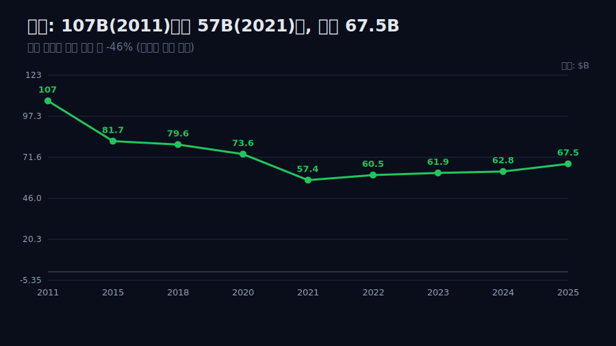
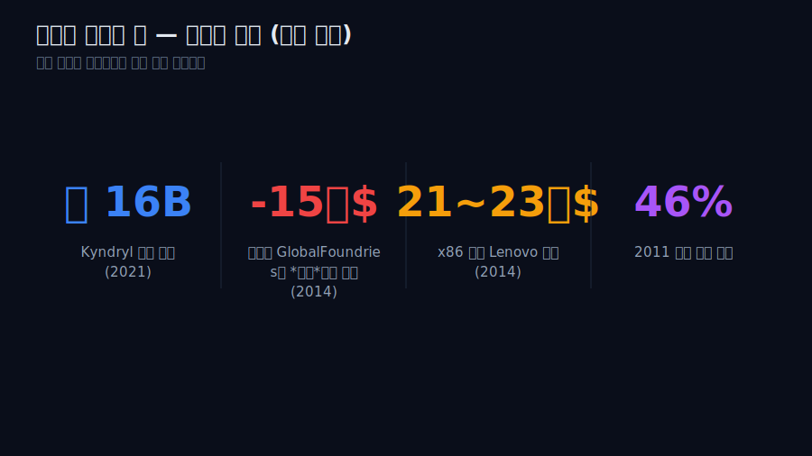
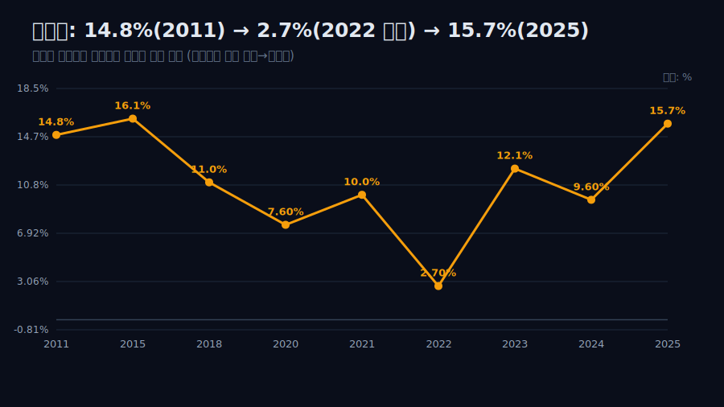
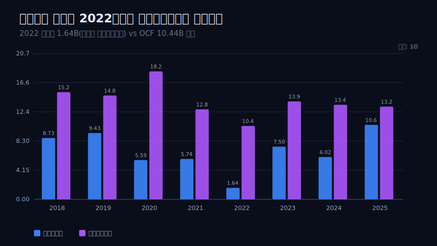
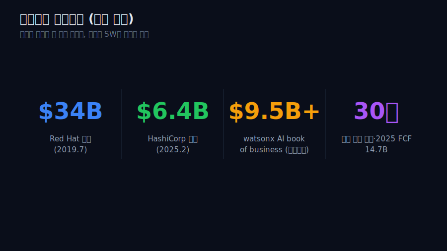
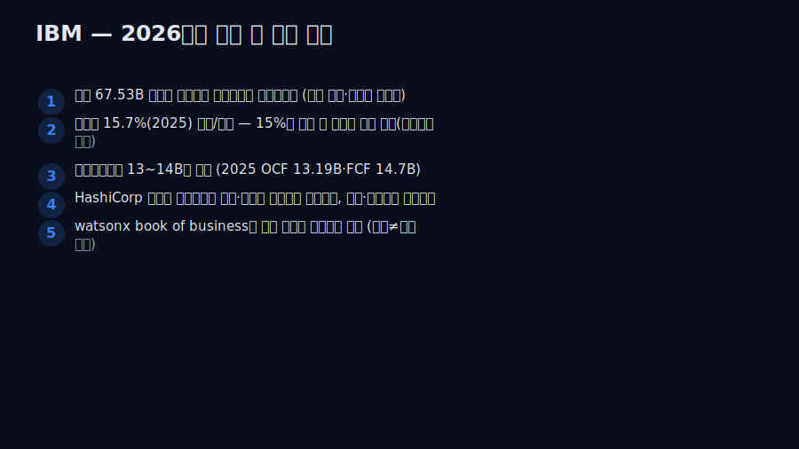

<script>
import ComboChart from '$lib/components/blog/ComboChart.svelte';
import StackBar from '$lib/components/blog/StackBar.svelte';
</script>

> **데이터 기준**: 2026-06-14 dartlab 실측 — IBM **미국 연결(USD)** 기준, 분기 데이터를 달력연도로 합산. 내부로 쓰는 라인은 매출·당기순이익·영업현금흐름. **영업이익(operating income) 라인은 dartlab 격자에 없어 마진은 순마진(순이익/매출)으로만** 본다. 영업현금흐름은 2017년 이후만 신뢰(이전 결손). Kyndryl 분사·반도체/x86 매각·연금정산손실·Red Hat·HashiCorp·watsonx·배당·FCF·소프트웨어 비중은 연결 손익 라인에 안 나오므로 **공시·언론(외부 인용)**으로 표기.
>
> **핵심 숫자**: 매출 **106.92B(2011 정점) → 57.35B(2021) → 67.53B(2025)** · 순마진 **14.8%(2011) → 2.7%(2022 저점) → 15.7%(2025)** · 2022 순이익 **1.64B**인데 영업현금흐름 **10.44B**(비현금 연금정산손실) · 2014년 반도체를 넘기며 **15억 달러 지불**(외부)
>
> **이 글의 용어**: 분사(spin-off) = 사업부를 떼어 별도 상장사로 분리(Kyndryl) · 순마진 = 당기순이익 ÷ 매출 · 비현금 손실 = 장부엔 손실로 잡히지만 현금은 안 빠지는 항목(연금정산손실 등) · book of business = 누적 수주잔고 성격의 지표(매출 아님).

---

## 프롤로그 — 매출이 반토막인데, 안 망했다

대부분의 회사에서 매출이 10년간 절반 가까이 줄면 그건 쇠퇴의 그래프다. IBM의 매출은 2011년 **106.92B**에서 2021년 **57.35B**로 약 46% 줄었다. 그런데 같은 기간 IBM은 망하지 않았고, 배당을 매년 늘렸으며, 순마진은 오히려 출발점 수준으로 돌아왔다.



관통선은 하나다. **"매출이 반토막인데 회사가 안 무너졌다면, 그 매출은 빼앗긴 것인가 — 아니면 스스로 깎아낸 것인가?"** 이 한 문장 이후로는 '재편' 같은 라벨 대신 매출 곡선과 순마진으로만 말한다. 미리 못을 박는다 — IBM은 dartlab 격자에 영업이익 라인이 없다. 그래서 마진은 *순마진(순이익/매출)* 한 가지로만 본다.

---

## 1막 — 외형 곡선만 보면 무너지는 회사다

**왜 쇠퇴 서사를 일부러 먼저 세우나.** 매출만 보면 정말 무너지는 그래프인데, 그 그래프가 틀렸음을 뒤에서 뒤집기 위해서다.

```python
import dartlab
c = dartlab.Company("IBM")
c.select("IS", ["매출액"], freq="Q")  # 달력연도 합산
```

검증 재무에서 매출은 2011년 106.92B(제공 시계열 정점)에서 2015년 81.74B, 2018년 79.59B, 2020년 73.62B, 2021년 57.35B로 내려왔다. 10년간 약 46%가 사라졌다. 보통 이 곡선은 시장에서 밀려나는 회사의 모습이다. 그런데 같은 기간 순이익은 2011년 15.86B에서 줄긴 했어도 0이 되지 않았고, 배당은 끊기지 않았다. **매출 곡선과 생존이 따로 논다** — 매출은 반토막인데 순이익은 0이 되지 않았다는 이 어긋남이, 1막의 사실이자 다음 질문의 출발점이다.

---

## 2막 — 절벽의 큰 부분은 '잘라낸 것'이었다

**왜 2021년 한 해를 떼어 보나.** 57B로의 추락이 시장 상실인지 자기 절단인지가, 관통선의 첫 갈림길이기 때문이다.

검증 재무로 낙폭의 크기는 보인다 — 2020년 73.62B에서 2021년 57.35B로, 한 해에 **-16.27B**다. 이 낙폭의 큰 부분은 '못 판 것'이 아니라 '떼어낸 것'과 정합한다. 외부에 따르면 2021년 11월 IBM은 관리형 인프라 서비스 사업을 **Kyndryl**로 분사·상장했고, 이 사업은 분리 직전 연 매출이 약 19.35B(2020년)였다(외부 인용). 즉 한 해 낙폭 16.27B는 Kyndryl 이관 규모대와 같은 자릿수다.



단 선을 긋는다 — 검증 재무가 보장하는 건 '-16.27B이라는 낙폭의 크기'까지다. 그 구성이 시장 상실이 아니라 분사라는 *식별*은 외부 인용으로만 가능하고, 16.27B와 19.35B의 차이(부분연도·세그먼트 재분류)는 정밀하게 맞아떨어지지 않는다. 그리고 분사 전후의 IBM은 *연속 비교가 불가능한 다른 회사*다. 여기까지 정리하면 다음 질문이 강제된다 — 떼어내는 게 한 번이 아니었다면?

---

## 3막 — IBM은 매출을 떼어내려고 *돈을 냈다*

**왜 이 막이 관통선의 핵심인가.** 사업을 팔면 보통 돈을 받는데, IBM은 어떤 사업을 넘기며 오히려 현금을 *지불*했기 때문이다 — 매출을 자산이 아니라 차감 대상으로 다룬 가장 또렷한 증거다.

외부에 따르면 2014년 IBM은 반도체(마이크로일렉트로닉스) 사업을 GlobalFoundries에 넘기며 *3년간 15억 달러를 지불*했고, 관련해 세전 약 47억 달러의 비용을 인식했다(외부 인용). 같은 해 x86 서버 사업은 Lenovo에 약 21~23억 달러에 매각했다(외부 인용). 받기는커녕 돈을 내고 떼어낸 반도체 — 메시지는 분명하다. 어떤 매출(저마진·자본집약 제조)은 IBM 장부에서 *짐*이었고, 그래서 비용을 치르고 덜어냈다.

이는 '매출=무조건 자산'이라는 통념의 반증이다. 1~2막의 외형 축소가 시장에 밀린 결과가 아니라 *자본배분 의사결정*이었음을, 이 '돈 내고 매각' 한 건이 확정한다. 단 '매출을 부채로 봤다'는 IBM의 동기에 대한 한 가지 해석이고, 검증 가능한 사실은 '지불하면서까지 저마진 제조를 떼어냈다'까지다. 그렇게 깎고 나면 남는 건 더 나아져야 한다 — 진짜 그런가?

---

## 4막 — 깎인 자리에서 순마진이 돌아왔다

**왜 외형 다음에 순마진을 보나.** 외형을 의도적으로 줄였다면, 줄인 보람(수익성)은 숫자로 증명돼야 하기 때문이다.

```python
c.select("IS", ["당기순이익"], freq="Q")  # 매출로 나눠 순마진
```

검증 재무로 순마진(순이익/매출)을 따라가면 — 2011년 14.8%, 2020년 7.6%, 2022년 **2.7%(저점)**, 그리고 2025년 **15.7%**다. 즉 외형은 107B→57B로 깎였는데 순마진은 2011년 수준(14.8%)을 2025년에 회복하고 소폭 상회했다(+약 0.9%p). 2025년 매출 67.53B·순이익 10.59B로 절대 이익도 회복 궤도다.



선을 긋는다 — 이 회복의 '원인'을 단정하지 않는다. 외부 세그먼트 자료는 소프트웨어 비중 상승(2024년 약 45%)과 높은 소프트웨어 총이익률(83.7%, 2024)을 제시하지만, 이는 전부 외부 인용 영역이고 검증 재무로 입증되지 않는다(영업이익 라인 부재). 내부 수치가 보장하는 건 *'외형↓·순마진↑의 동시 발생'* 그 자체다 — 소프트웨어 믹스는 그 동시 발생과 정합하는 외부 설명이지, 내부로 증명된 동인이 아니다.

---

## 5막 — 톱라인이 출렁여도 현금은 유지됐다

**왜 마진 다음에 현금을 보나.** 순이익이 2022년 1.64B까지 고꾸라진 해에도 배당 인상이 가능했던 현금의 출처가, 순이익 변동의 정체를 알려주기 때문이다.

```python
c.select("CF", ["영업활동현금흐름"], freq="Q")  # 2017년 이후만 신뢰
```

검증 재무 영업현금흐름은 2018년 15.25B, 2020년 18.20B, 2021년 12.80B, 2022년 **10.44B**, 2023년 13.93B, 2024년 13.45B, 2025년 13.19B다. 핵심은 2022년이다 — 순이익이 2020·2021년 약 5.7B 수준에서 **2022년 1.64B로 급락**했는데, 같은 해 영업현금흐름은 10.44B를 지켰다.



이 괴리는 '사업이 망했다 vs 멀쩡하다'로 읽으면 안 된다. 외부에 따르면 2022년 3분기 IBM은 약 16B의 연금부채를 보험사로 이전하며 일회성 *비현금* 세전 약 59억 달러(세후 약 44억 달러) 연금정산손실을 인식했다(외부 인용). 비현금·비영업 항목이라 현금흐름엔 영향이 없었고, 검증 재무의 OCF 10.44B 유지가 이를 뒷받침한다. 즉 순이익과 현금흐름의 차액은 사업 악화가 아니라 *회계 인식의 타이밍*과 정합한다(단정이 아니라 정합). '순이익이 곧 현금'이라는 오독을 막는 자리다. 단 OCF는 2017년 이후만 신뢰하므로, '늘 현금이 강했다'는 장기 단정은 하지 않는다.

---

## 6막 — 깎기에서 더하기로, 방향만 반대다

**왜 마지막에 '사들이기'를 두나.** 10년을 빼기로 버틴 회사가 2019년 이후 사상 최대로 사들이기 시작했는데, 그 인수가 실적의 원인이라고 비약하지 않으려면 경계가 필요하기 때문이다.

외부에 따르면 더하기의 증거는 셋이다 — 2019년 Red Hat **340억 달러** 인수(하이브리드 클라우드), 2025년 2월 HashiCorp **64억 달러** 인수 완료, 그리고 생성형 AI(watsonx)의 'book of business'가 2025년 누적 95억 달러를 넘었다(외부 인용). 단 watsonx의 그 숫자는 *수주잔고 성격*이지 인식 매출이 아니다 — 수주와 매출을 같은 것으로 읽지 않는다.



14년 전 저마진 제조를 *돈을 내고* 버린 손과, 지금 고마진 소프트웨어를 거액에 *사들이는* 손은 방향만 반대일 뿐 같은 기준 — '매출의 질로 자본을 배분한다'는 한 가지 원칙으로 읽을 수 있다(단 두 시기를 같은 의사결정으로 봉합하는 건 서사적 해석이다). 결론은 경계에서 닫는다 — *검증 재무는 '외형은 깎였는데 순마진은 회복됐고, 순이익이 무너진 해에도 현금은 유지됐다'까지 말한다. Red Hat·HashiCorp·watsonx라는 더하기가 AI 시대 성장으로 이어질지는 시간상 공존일 뿐, 인과는 아직 검증 밖의 베팅이다.* 매출을 깎아낸 거인이 더 작은 몸으로 더 두꺼운 마진을 입었다는 사실까지가, 이 회사가 지금 증명한 전부다. 같은 전환의 다른 얼굴은 클라우드로 외형·마진을 동시에 키운 [마이크로소프트](/blog/MSFT-microsoft), 전환이 마진을 깎은 [오라클](/blog/ORCL-oracle), 구독 고원의 [어도비](/blog/ADBE-adobe)에서 보인다.

---

## 2026년에 봐야 할 다섯 가지

1. **매출 67.53B(2025) 위에서 톱라인이 유기적으로 성장하는가** — 2026년 매출이 분사·인수 효과를 걷어내고도 전년 대비 플러스면 '깎기 종료, 더하기 본격화'의 첫 내부 검증(dartlab로 추적 가능).
2. **순마진 15.7%(2025) 방어/확장** — 영업이익 라인 부재로 순마진만 추적하되, 2026년 15%대를 지키면 소프트웨어 믹스 전환이 일시적 회복이 아닌 구조적 수준임을 확증. 하락 반전 시 '회복' 전제를 재검토한다.
3. **영업현금흐름 13~14B대 유지** — 2025 OCF 13.19B·FCF 14.7B(외부). 2026 OCF가 13B대 아래로 빠지면 5막의 현금 서사가 약화되므로 비현금 항목(연금·감가상각)과 함께 분해해 본다.
4. **HashiCorp(2025.2 인수) 통합이 2026 소프트웨어 매출·마진에 증분으로 잡히는가** — 아니면 무형자산 상각·통합비용으로 순이익을 잠식하는가. 6막 '더하기=고마진 매수' 논리의 사후 검증점.
5. **watsonx book of business가 인식 매출로 전환되는 속도** — 누적 95억+(외부)는 수주잔고 성격이라 매출이 아니다. 2026년 소프트웨어 인식 매출 성장률이 AI 수주 성장을 따라오는지를 분리 추적(수주≠매출 함정).



---

## 재무제표 — dartlab 연결, $B (영업이익 라인 부재 → 순마진)

> 미국 연결(USD)·달력연도 합산 기준. dartlab에 영업이익 라인이 없어 마진은 순마진(순이익/매출)으로만 본다. 영업현금흐름은 2017년 이후만 신뢰. dartlab에서 직접 확인:
> ```python
> import dartlab
> c = dartlab.Company("IBM")
> c.select("IS", ["매출액","당기순이익"], freq="Q")
> c.select("CF", ["영업활동현금흐름"], freq="Q")
> ```

<ComboChart data={[{year:"2011",매출:106.92,당기순이익:15.86},{year:"2015",매출:81.74,당기순이익:13.19},{year:"2018",매출:79.59,당기순이익:8.73},{year:"2020",매출:73.62,당기순이익:5.59},{year:"2021",매출:57.35,당기순이익:5.74},{year:"2022",매출:60.53,당기순이익:1.64},{year:"2023",매출:61.86,당기순이익:7.50},{year:"2024",매출:62.75,당기순이익:6.02},{year:"2025",매출:67.53,당기순이익:10.59}]} lineKeys={["매출"]} barKeys={["당기순이익"]} lineColors={["#22c55e"]} barColors={["#3b82f6"]} title="매출(라인) vs 당기순이익(막대) — $B" unit="$B" />

| 항목 ($B) | 2011 | 2015 | 2018 | 2020 | 2021 | 2022 | 2023 | 2024 | 2025 |
|---|---:|---:|---:|---:|---:|---:|---:|---:|---:|
| 매출 | 106.92 | 81.74 | 79.59 | 73.62 | 57.35 | 60.53 | 61.86 | 62.75 | 67.53 |
| 당기순이익 | 15.86 | 13.19 | 8.73 | 5.59 | 5.74 | 1.64 | 7.50 | 6.02 | 10.59 |
| 순마진 | 14.8% | 16.1% | 11.0% | 7.6% | 10.0% | 2.7% | 12.1% | 9.6% | 15.7% |
| 영업현금흐름 | — | — | 15.25 | 18.20 | 12.80 | 10.44 | 13.93 | 13.45 | 13.19 |

이 표를 한 줄로 읽으면 이렇다 — **매출 행은 107B에서 57B로 내려갔다가 67.53B로 일부 회복하고, 순마진 행은 2011년 14.8%에서 2022년 2.7%로 무너졌다가 2025년 15.7%로 돌아온다.** 외형이 줄어드는 내내 순마진이 출발점 수준을 회복했다는 것이 이 회사의 핵심이다. 영업현금흐름 행은 2017년부터만 신뢰하며, 순이익이 1.64B였던 2022년에도 10.44B를 지켰다(비현금 연금정산손실 효과).

---

## 검증표

본문 인용 수치를 dartlab 호출과 결과로 검증한다. 외부 출처(분사·매각·연금손실·인수·배당·소프트웨어 비중)는 분리 표기. 📅 dartlab 실측 2026-06-14 · IBM 미국 연결(USD)·달력연도 합산 기준.

| 본문 수치 | 출처 / 호출 | 결과 |
|---|---|---|
| 매출 2011 106.92B(정점) → 2021 57.35B (약 -46%) | `c.select("IS",["매출액"],freq="Q")` 합산 | ✓ 실측 |
| 매출 2021 57.35 → 2025 67.53B | `c.select("IS",["매출액"])` | ✓ 실측 |
| 2020→2021 매출 -16.27B (낙폭) | IS 차감 | ✓ 실측 |
| 순마진 2011 14.8% → 2022 2.7%(저점) → 2025 15.7% | IS 계산(NI/매출) | ✓ 실측 |
| 2022 순이익 1.64B (2020·2021 약 5.7B에서 급락) | `c.select("IS",["당기순이익"])` | ✓ 실측 |
| 영업현금흐름 2022 10.44B (순이익 1.64B인데 유지) | `c.select("CF",["영업활동현금흐름"])` | ✓ 실측 |
| 영업이익(operating income) 라인 부재 → 순마진만 사용 | dartlab IS 격자 | 매핑 사실 |
| 영업현금흐름 2017년 이전 결손 → 추세 2018+ 한정 | dartlab 데이터 한계 | 주의 |
| Kyndryl 분사(2021.11)·분리 직전 매출 약 19.35B(2020) | [CIO](https://www.cio.com/article/189224) | 외부 인용 |
| 2014 반도체 GlobalFoundries에 15억$ 지불·세전 47억$ 비용 | [Bloomberg 2014-10-19](https://www.bloomberg.com/) · [Semiconductor Digest](https://sst.semiconductor-digest.com/) | 외부 인용 |
| 2014 x86 서버 Lenovo에 약 21~23억$ 매각 | [Lenovo StoryHub](https://news.lenovo.com/) | 외부 인용 |
| 2022 Q3 연금부채 16B 이전·비현금 세전 59억$(세후 약 44억$) 손실 | [The Register 2022-09-14](https://www.theregister.com/) · SEC 8-K | 외부 인용 |
| Red Hat 340억$(2019.7)·HashiCorp 64억$(2025.2) 인수 | [CNBC 2019-07-09](https://www.cnbc.com/) · [TechCrunch 2025-02-27](https://techcrunch.com/) | 외부 인용 |
| 배당 30년 연속 인상·2025 FCF 14.7B·watsonx book 누적 95억$+ | [Sure Dividend](https://www.suredividend.com/) · SEC 8-K FY2025 | 외부 인용 |
| 소프트웨어 비중 약 45%·소프트웨어 총이익률 83.7%(2024) | IBM Newsroom Q4 2024 | 외부 인용 |

본문의 숫자 중 이 표에 없는 것은 발행 차단 대상이다. 분사·매각·연금손실·인수·배당·소프트웨어 비중은 dartlab 연결로 증명되지 않으며 공시·언론 외부 인용임을 명시한다. 영업이익 라인 부재로 순마진만 쓰고, 매출 낙폭의 '귀속(분사)'은 외부로, 인수와 실적의 '인과'는 경계 밖으로 두는 것이 이 글의 원칙이다.

> 관련 글 — 클라우드로 외형·마진을 동시에 키운 [마이크로소프트](/blog/MSFT-microsoft), 전환이 마진을 깎은 [오라클](/blog/ORCL-oracle), 구독 고원의 [어도비](/blog/ADBE-adobe), 그리고 IBM이 돈 내고 떼어낸 반도체를 본업으로 하는 [AMD](/blog/AMD-amd)·[인텔](/blog/INTC-intel)과 겹쳐 읽으면 '외형을 깎아 마진을 회복한다'는 재편의 결이 또렷해진다.
