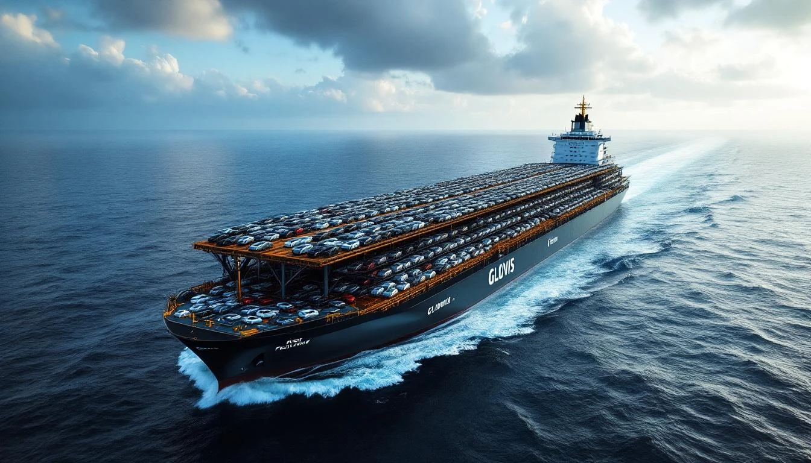
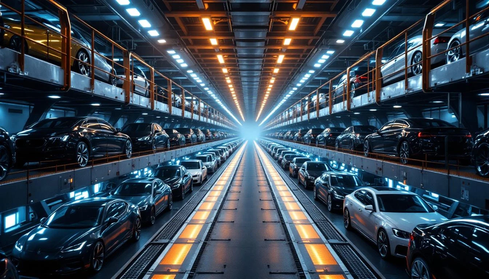
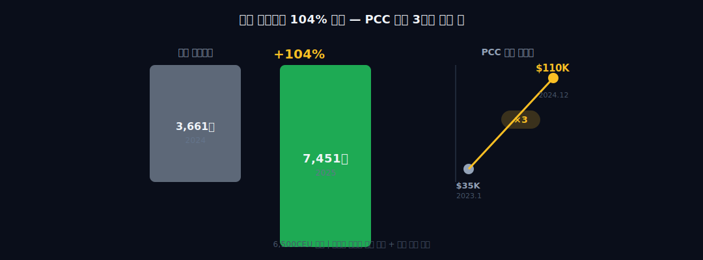
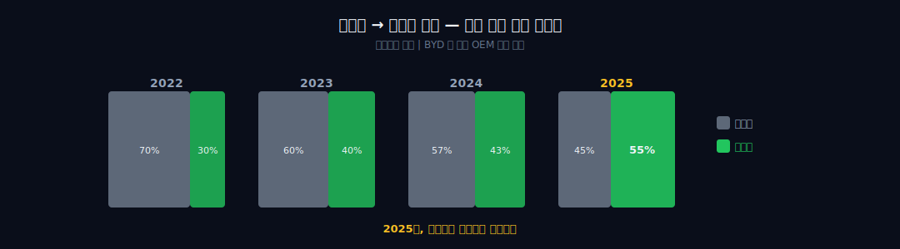
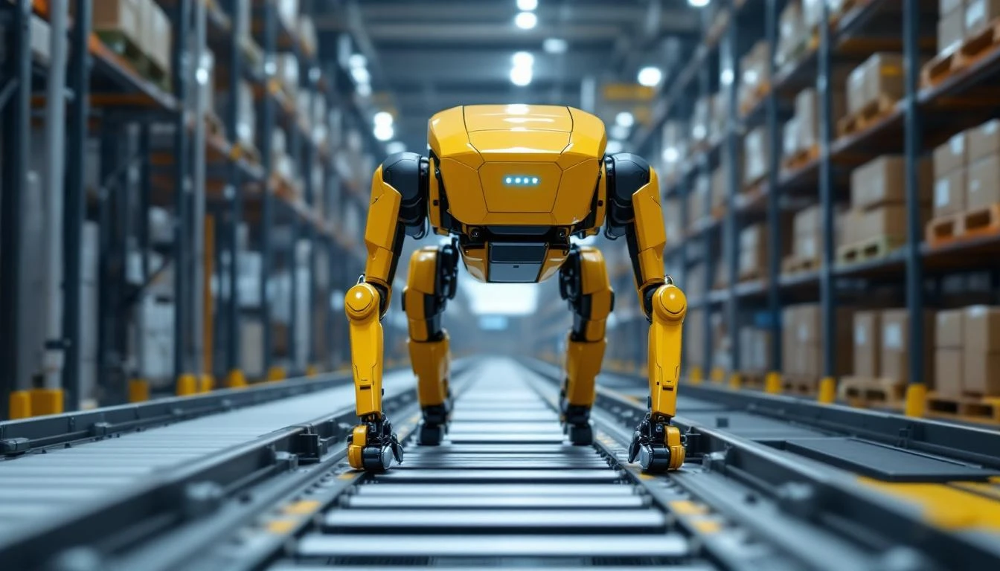

> **성장 + 지주** | 서비스 > 물류 | 2026-04-11 dartlab 실측
> 같은 시리즈: [SK하이닉스](/blog/000660-skhynix) · [삼양식품](/blog/003230-samyang-foods) · [두산에너빌리티](/blog/034020-doosan-enerbility) · [알테오젠](/blog/196170-alteogen) · [HMM](/blog/011200-hmm) · [셀트리온](/blog/068270-celltrion) · [한화에어로스페이스](/blog/012450-hanwha-aerospace) · [HD현대일렉트릭](/blog/267260-hd-hyundai-electric) · [고려아연](/blog/010130-korea-zinc) · [에이피알](/blog/278470-apr) · [크래프톤](/blog/259960-krafton) · [달바글로벌](/blog/483650-dalba-global) · [경동나비엔](/blog/009450-kyungdong-navien) · [대한조선](/blog/439260-daehan-shipbuilding) · [기업이야기 시리즈 전체](/blog/series/company-reports)

---

## 물류회사가 영업이익 2조?

```python
import dartlab
c = dartlab.Company("086280")
c.analysis("financial", "수익성")
```

물류업에서 영업이익 2조를 찍는 회사는 없다. 대한민국 물류 1위 CJ대한통운의 2024년 영업이익이 4,500억 원이다. 한진은 2,100억. 그런데 현대글로비스가 2025년에 **2조 730억 원**을 찍었다. CJ대한통운의 4.6배다.

영업이익률(OPM)로 비교하면 더 선명하다.


| 회사 | 매출(2024~2025) | 영업이익 | OPM |
|------|:---:|:---:|:---:|
| **현대글로비스** | **29.6조** | **2조 730억** | **7.0%** |
| CJ대한통운 | 12.5조 | 5,500억 | 4.4% |
| 한진 | 6.4조 | 2,100억 | 3.3% |

물류는 박리다매 산업이다. 트럭 한 대, 창고 한 칸, 인건비 한 명. 마진이 3~5%면 잘하는 거다. 그런데 현대글로비스는 7%다. CJ대한통운의 1.6배.

더 이상한 건 이 이익이 '물류'에서 나온 게 아니라는 점이다. 현대글로비스의 손익계산서를 열면, 매출의 절반에 가까운 유통 사업부가 보인다. 그리고 매출의 18%밖에 안 되는 **해운 사업부**가 이익의 36%를 만든다. 물류회사의 이익 엔진이 물류가 아니라 배다. 왜?

이 질문에 답하려면 2001년으로 가야 한다.

---

## 1막 — 현대차가 만든 수요, 캡티브라는 이름의 독점



2001년 1월. 현대자동차 울산 공장에서 완성차가 쏟아져 나오고 있었다. 정몽구 회장이 현대차그룹을 재편하던 시절이다. 그룹 구조조정으로 현대정공(현 현대로템)에서 물류 부문이 분리됐다. 이름은 **한국로지텍**. 직원 수백 명의 3PL(제3자 물류) 회사였다.

이 회사의 태생적 존재 이유는 하나였다 — **현대차와 기아가 만드는 차를 운반하는 것.** 울산에서 평택항까지 부품을 싣고, 평택항에서 세계 각지로 완성차를 보낸다. 고객이 하나뿐인 물류회사. 이것을 업계에서는 **캡티브(captive)** 물량이라 부른다. 계열사가 보장해주는 독점 물량이다. 캡티브의 본질은 안정성이다. 경기가 나빠도 현대차가 차를 만드는 한 물량이 보장된다. 대신 운임은 시장가가 아니라 내부 협의가로 정해진다. 안정적이지만 폭발적인 성장은 어렵다. 물류 산업의 표현을 빌리면 "밥은 먹고 사는데 부자는 못 되는 구조"다.

2005년 12월, 코스피에 상장했다. 상장 당시 매출 4조 원. 택배도 치고, 창고도 운영하고, 부품도 나르는 전형적인 그룹 물류 자회사였다. 재벌 3세의 지분이 많이 들어있다는 점을 제외하면 특별할 것 없는 회사였다. 당시 정의선(정몽구 장남)이 글로비스 전신인 한국로지텍 설립 때부터 지분을 확보하기 시작해, 상장 무렵 이미 최대 개인 주주였다. 그때는 아무도 이 지분이 나중에 재벌 승계의 핵심 퍼즐이 될 줄 몰랐다.

2011년, 현대자동차그룹의 글로벌 브랜드 전략에 맞춰 사명을 **현대글로비스**로 바꿨다. Global + Logistics의 합성어다. 이름을 바꾼 건 단순한 리브랜딩이 아니었다. 해외 물류 거점을 미국, 유럽, 인도, 멕시코로 넓히면서, 현대차가 가는 곳이면 어디든 따라가는 글로벌 물류 네트워크를 구축하기 시작했다.

```python
c.select("IS", ["매출액", "영업이익"]).chart()
```

매출 추이를 그려보면 꺾이는 구간이 없다. 5년간 매출 20조에서 30조로 올랐다. 매년 성장했다. 그런데 영업이익의 기울기가 매출보다 훨씬 가파르다. 2021년 9,000억이던 영업이익이 2025년 2조 730억이 됐다. 매출은 1.5배인데 이익은 **2.3배**다.

다음은 연결 기준 5년 실적이다.

| 연도 | 매출 | 영업이익 | OPM |
|:---:|:---:|:---:|:---:|
| 2021 | 20.0조 | 9,000억 | 4.5% |
| 2022 | 24.0조 | 1조 1,500억 | 4.8% |
| 2023 | 25.8조 | 1조 3,100억 | 5.1% |
| 2024 | 28.4조 | 1조 7,500억 | 6.2% |
| **2025** | **29.6조** | **2조 730억** | **7.0%** |

OPM이 4.5%에서 7.0%로 2.5%p 상승했다. 물류업에서 마진 2.5%p는 구조적 변화가 아니면 불가능한 수치다. 이 변화의 진원지는 손익계산서의 사업부별 명세서에 숨어 있다.

---

## 2막 — 배가 터졌다, PCC선 운임 3배 급등



현대글로비스의 사업부는 셋이다. **유통**, **물류**, **해운**. 유통은 현대차 부품(CKD)과 중고차를 파는 사업이다. 물류는 트럭과 창고로 물건을 나르는 3PL 사업이다. 해운은 배로 차를 나른다. PCC선(Pure Car Carrier), 즉 자동차 전용 운반선을 굴린다.

겉에서 보면 유통이 제일 크다 — 매출의 47.6%를 차지한다. 그런데 이익 기여도를 보면 이야기가 완전히 달라진다.

| 사업부 | 매출 비중 | 영업이익 비중 | 추정 OPM |
|:---:|:---:|:---:|:---:|
| 유통 (CKD/중고차) | 47.6% | 27.7% | ~4.1% |
| 물류 (3PL) | 34.1% | 36.3% | ~7.4% |
| **해운 (PCC)** | **18.3%** | **35.9%** | **~13.8%** |

매출의 18%에 불과한 해운이 이익의 36%를 만든다. 해운의 추정 OPM은 13.8%로, 유통(4.1%)의 3.4배다. 2024년 대비 해운 영업이익은 3,661억에서 **7,451억으로 104% 폭증**했다. 이 단일 사업부의 증가분(3,790억)이 전사 영업이익 증가분(3,230억)보다 크다. 다른 사업부가 소폭 감소한 것까지 해운이 메워버린 것이다.

왜 해운이 터졌는가? 두 가지가 겹쳤다.

첫째, **글로벌 자동차 수출이 폭증했다.** 2023년 중국이 일본을 제치고 세계 최대 자동차 수출국이 됐다. BYD, 지리(Geely), 체리(Chery) 같은 중국 전기차 업체들이 유럽, 동남아, 남미로 미친 듯이 차를 찍어냈다. 중국 자동차 수출은 2021년 200만 대에서 2024년 **500만 대**를 돌파했다. 2년 반 만에 2.5배.

둘째, **배가 모자랐다.** PCC선(자동차 전용 운반선)은 짓는 데 2~3년 걸린다. 2015~2020년 조선 빙하기에 PCC선 발주가 거의 없었다. 글로벌 PCC선 선대는 약 750척인데, 2023~2025년에 인도된 신조선은 연간 30~40척 수준. 수요가 2.5배 뛰었는데 공급은 연 5%밖에 안 늘었다. 교과서적인 수급 불균형이다.

결과는 운임 폭등이었다. 6,500CEU(Car Equivalent Unit) 기준 PCC선의 일일 용선료가 2023년 초 35,000달러에서 2024년 말 **110,000달러**로 뛰었다. **3.1배.** 이것은 벌크선이나 컨테이너선에서도 보기 힘든 운임 상승률이다. 2021년 컨테이너 운임 대란 때 상하이컨테이너운임지수(SCFI)가 5배 뛰었지만, 그 호황은 2년 만에 끝났다. PCC선 운임은 2024년에도, 2025년에도 높은 수준을 유지하고 있다. 배가 부족하니까.

PCC선 운임 시장의 구조를 이해하면 왜 이 호황이 컨테이너선보다 오래갈 수 있는지 보인다. 컨테이너선은 세계적으로 약 5,600척이 운항한다. 발주만 하면 2년 안에 100척 이상이 쏟아져 나올 수 있다. 하지만 PCC선은 전 세계 750척뿐이다. 선박 수 자체가 적다. 건조 슬롯도 한정돼 있다. PCC선을 만들 수 있는 조선소가 현대미포, 현대삼호, 중국 CSSC 계열 몇 곳뿐이다. 2024년 발주된 PCC선이 실제로 바다에 나오는 것은 2027년 이후다. 그 사이 3년간은 공급 부족이 구조적으로 지속된다.



현대글로비스는 이 파도를 제대로 탔다. PCC선 **98척**을 보유하고 있다. 글로벌 PCC선 시장에서 일본 NYK(약 130척), 노르웨이 Wallenius Wilhelmsen(약 125척)에 이어 세계 3위 선대 규모다. 98척이면 매일 수십 척이 바다 위에서 달리고 있다는 뜻이다. 운임이 3배 뛰면, 이 수십 척 전부의 수입이 3배 가까이 뛰는 것이다.

그런데 여기서 한 가지 질문이 생긴다. 현대글로비스는 현대자동차의 물류 자회사다. 현대차와 기아의 차를 나르는 게 본업이다. 그러면 이 해운 이익은 현대차의 캡티브 물량에서 나온 건가?

답은 **아니다.**

---

## 3막 — 적의 물건으로 돈을 버는 구조

여기가 이 회사의 재무제표에서 가장 재미있는 지점이다. 그리고 한국 재벌 물류 자회사의 역사에서 전례가 없는 전환이다.

현대글로비스의 해상운송에서 비계열(non-captive) 물량 비중이 급격히 올라가고 있다. 2024년 43%였던 비계열 해상운송 비중이 2025년에 **55%**를 돌파했다. 역전이 일어난 것이다. 과반이 넘는 물량이 현대차-기아가 아닌 **외부 고객**의 차다.

그 외부 고객 중 가장 눈에 띄는 이름이 **BYD**다. 세계 최대 전기차 제조사. 현대차의 가장 무서운 경쟁자. 현대글로비스는 2024년 BYD와 해상운송 MOU를 체결했다. BYD가 만든 전기차를 현대차 그룹의 물류 자회사가 배에 싣고 전 세계로 나른다. 경쟁사의 차를 실어 나르는 것이다.



왜 BYD가 현대글로비스의 배를 타는가? 이유는 단순하다 — **중국에는 PCC선이 없다.** 중국이 자동차 수출 1위 국가가 됐지만, 자동차 전용 운반선을 짓고 운영하는 역량은 아직 없다. PCC선은 자동차를 층층이 실을 수 있도록 설계된 특수 선박이다. 컨테이너선에 차를 넣으면 한 대당 공간 비용이 3~5배 비싸진다. BYD가 연간 500만 대를 수출하려면 PCC선 없이는 물류비가 천문학적이다.

그래서 BYD는 직접 PCC선을 발주하기 시작했다. 2024년까지 약 8척을 확보했다고 알려져 있다. 하지만 연간 500만 대를 나르려면 최소 40~50척이 필요하다. 배가 건조되기까지 2~3년. 그 사이에 글로비스 같은 기존 선사에 의존할 수밖에 없다.

여기서 재무적으로 핵심적인 포인트가 나온다. **캡티브 물량과 비계열 물량의 마진 차이**다. 캡티브 물량은 현대차-기아와의 장기 계약으로, 운임이 고정돼 있다. 시장 운임이 3배 뛰어도 계약 운임은 크게 안 바뀐다. 반면 비계열 물량은 시장 운임(spot rate 또는 단기 계약)에 기반한다. 운임이 3배 뛰면 비계열 매출도 같이 뛴다.

이것이 OPM 4.5%에서 7.0%로 점프한 진짜 메커니즘이다. 비계열 비중이 올라갈수록, 시장 운임 상승분이 이익에 바로 꽂힌다. 캡티브만 하던 시절에는 운임 호황이 와도 이익이 별로 안 늘었다. 비계열이 절반을 넘기니까, 운임 호황이 **직접** 이익으로 전환되기 시작한 것이다.

현대차 경쟁사의 차를 실어 나르면서, 현대차에서 벌 때보다 마진이 높다. 적의 물건으로 돈을 버는 구조다. BYD가 많이 팔수록, 현대글로비스의 해운 이익이 올라간다. 현대차 입장에서 복잡한 감정이 들 만한 구조다.

2024년 4분기 컨퍼런스콜에서 한 애널리스트가 "비계열 확대가 현대차그룹과의 관계에 부정적 영향이 있느냐"고 물었다. 경영진의 답은 명확했다 — "그룹 물량은 장기 계약으로 안정적이고, 비계열은 추가 수익원이다. 양립 가능하다." 실제로 현대차-기아의 글로벌 판매량 자체가 2024년 730만 대로 역대 최고를 찍었기 때문에, 캡티브 물량이 줄어든 게 아니라 비계열이 더 빨리 늘어난 것이다. 파이 자체가 커진 셈이다.

그런데 여기에 하나 더 숨은 변수가 있다. 글로비스가 비계열을 늘린 것은 단순히 "배에 빈 자리가 있으니까 채운" 게 아니다. 전략적으로 비계열 영업 조직을 따로 만들었다. 2023년 해운영업실을 확대 개편하고, 유럽과 동남아에 비계열 전담 사무소를 열었다. 캡티브에 안주하지 않겠다는 의지의 표현이다. 이 조직적 전환이 없었으면 비계열 55%는 불가능했다.

```python
c.analysis("financial", "수익구조")
```

수익구조 분석을 돌려보면, 현대글로비스의 매출 성장을 견인하는 축이 유통에서 해운으로 이동하고 있음이 선명하게 드러난다. 이 회사의 성장 스토리는 "현대차 물류 자회사"에서 "글로벌 해운사"로의 전환이다.

---

## 4막 — 물류회사 장부에 숨은 3.3조, 보스턴다이내믹스



매출 30조, 영업이익 2조의 물류회사. 여기까지는 이해가 된다. 그런데 이 회사의 재무상태표를 뜯어보면 한 가지 이상한 항목이 숨어있다.

**관계기업 투자주식.**

```python
c.show("affiliates")
```

2021년 6월, 현대자동차그룹이 보스턴다이내믹스(Boston Dynamics)를 **1조 2,000억 원**에 인수했다. 소프트뱅크로부터 지분 80%를 사들인 대형 딜이었다. 현대차가 52%, 정의선 회장 개인이 20%, 그리고 현대글로비스가 **11.25%**를 보유하는 구조로 설계됐다. 나머지 약 17%는 보스턴다이내믹스 창업자 마크 레이버트와 경영진이 보유한다.

왜 물류회사가 로봇 기업의 지분을 가지고 있는가? 현대차그룹의 공식 설명은 "물류 현장에 로봇 기술을 접목하기 위해서"다. 보스턴다이내믹스의 4족 보행 로봇 Spot은 물류 창고에서 자율 순찰과 검사를 수행한다. 공장 물류의 자동화에 활용할 수 있다는 논리다.

그런데 2026년 3월, 보스턴다이내믹스의 기업가치가 **29.7조 원**으로 평가됐다. 2021년 인수 당시 기업가치 1.5조 원에서 **24배**가 뛰었다. 현대글로비스의 11.25% 지분 가치는 단순 계산으로 약 **3.3조 원**이다. 그런데 장부에는 지분법 평가액 약 **1,350억 원**으로 잡혀 있다. 시장이 인정하는 가치(3.3조)와 장부가(1,350억)의 차이가 **약 3.2조** — 이 숨은 가치가 글로비스 시총에 아직 반영되지 않았다.

2026년 4월 기준 현대글로비스의 시가총액이 약 10조~11조 원인데, 장부에 시총의 30%에 달하는 로봇 회사 지분이 깔려 있는 것이다. 물류회사의 장부에 로봇이 숨어 있다.

물론 이것은 비상장 회사의 밸류에이션이다. 상장되기 전까지는 장부가 기준으로 계상되고, 실제 현금화 시점은 불투명하다. 보스턴다이내믹스가 흑자 전환한 적도 아직 없다. 하지만 이 회사의 기업가치를 논할 때, **물류+해운의 영업가치**와 **보스턴다이내믹스 지분의 잠재가치**를 분리해서 봐야 한다는 것은 분명하다.

현대글로비스는 물류 현장에 보스턴다이내믹스의 Spot을 실증 배치 중이다. 2024년 평택 물류센터에서 자율주행 로봇과 Spot의 협업 테스트를 진행했다. 아직 매출 기여는 미미하지만, 이것이 5년 후 물류 자동화의 게임 체인저가 될 수 있다는 것이 그룹의 배팅이다.

3.3조. 이 숫자가 보이는 사람과 안 보이는 사람의 차이가 현대글로비스의 밸류에이션 갭을 만든다. 현대차그룹이 보스턴다이내믹스를 IPO시키는 시나리오를 상상해보자. 상장 시점에 기업가치가 30조 이상으로 평가받으면, 글로비스의 11.25% 지분은 장부에서 **공정가치 평가**로 전환된다. 그 순간 글로비스의 자본이 수조 원 뛰어오른다. 물류업의 PBR이 아니라, 로봇 투자 프리미엄이 반영되는 순간이다.

---

## 5막 — 2018년, 지배구조 혁명이 좌절된 날

이 회사를 이해하려면 재무제표 바깥으로 나가야 하는 순간이 있다. 2018년 3월의 이야기다.

정의선. 현대자동차그룹 회장(당시 부회장). 그의 개인 지분 구조에서 현대글로비스는 **가장 큰 자산**이다. 정의선은 현대글로비스 지분 약 **23%**를 보유하고 있다. 현대차 지분(2.6%)이나 기아 지분(1.7%)과는 비교할 수 없는 규모다. 현대글로비스의 시총이 10조이면, 정의선의 글로비스 지분 가치만 2.3조다.

2018년 3월 28일, 현대차그룹은 지배구조 개편안을 발표했다. 핵심은 이것이었다 — **현대모비스를 인적분할하고, 분할된 존속회사(현대모비스 모듈/AS)를 현대글로비스에 합병한다.** 이렇게 하면 정의선이 보유한 글로비스 23% 지분이 자연스럽게 현대모비스(핵심 계열사)의 대주주 지분으로 전환된다. 3세 승계의 퍼즐을 맞추는 핵심 수(手)였다.

발표 직후 주가가 출렁였다. 기관투자자들은 합병 비율의 공정성을 문제 삼았다. 그리고 4월 초, 미국 행동주의 헤지펀드 **엘리엇 매니지먼트(Elliott Management)**가 반대 의견을 공개했다. "이 합병은 소수주주 가치를 훼손한다."

주주자문기관 ISS와 글래스루이스(Glass Lewis)도 반대 의견을 냈다. 결정적으로 **국민연금**이 반대 쪽에 섰다. 국민연금은 현대모비스와 현대글로비스의 주요 주주였다. 한국 재벌 지배구조 개편에서 국민연금이 공개적으로 반대한 첫 번째 사례 중 하나였다.

2018년 5월 22일, 임시주총을 1주일 앞두고 현대차그룹은 **개편안을 전격 철회**했다. 정의선 부회장이 직접 기자회견을 열고 "주주의 뜻을 존중한다"고 말했다. 재무제표에 이 사건이 찍혔다 — 글로비스 PBR이 2018년 **2.1배**에서 2019년 **1.4배**로 떨어졌다. 시장이 "승계 프리미엄"을 지운 것이다. 2026년 현재 PBR 약 **1.1배** — 2018년(2.1배)의 절반이다. **시장이 지배구조 리스크를 8년째 할인하고 있다.** 이후 배당성향도 25%에서 30%+로 올라갔다 — 지배구조 개편이 막히면 주주환원으로 방향을 틀어야 하기 때문이다. 2025년 주당 배당금 5,800원(+57%)도 이 맥락이다.

이 사건은 한국 재벌 3세 승계의 전환점이었다. 삼성의 이재용 경영권 승계가 삼성물산-제일모직 합병을 통해 이뤄진 것과 대조된다. 삼성은 밀어붙여서 성사시켰고(대가를 치렀지만), 현대차는 시도했다가 철회했다. 같은 재벌 승계라는 문제에 대해 완전히 다른 경로를 걸은 것이다. 그리고 현대글로비스에게는 **아직 끝나지 않은 이야기**다. 2018년의 지배구조 개편이 좌절됐다는 것은, 정의선 회장의 경영권 승계 구조가 아직 미완성이라는 뜻이다. 현대글로비스의 23% 지분이 언젠가 다시 지배구조 재편의 중심에 놓일 수 있다. 시장은 이것을 '글로비스 디스카운트(할인)'라고 부르기도 하고, '글로비스 옵션(프리미엄)'이라고 부르기도 한다. 어느 쪽이든, 이 회사의 주가에는 지배구조 변수가 항상 깔려 있다.

```python
c.analysis("financial", "자본배분")
```

재무적으로 흥미로운 것은, 2018년 이후 현대글로비스의 **주주환원이 크게 강화**됐다는 점이다. 2024년 기준 주당 배당금 5,800원으로, 전년 대비 **57% 증가**했다. 시가배당률 3.8%는 물류업 평균을 상회한다. 2018년 엘리엇 사태 이후 그룹 전체가 주주환원을 강화한 흐름의 일부다. 지배구조 이벤트가 재무 정책까지 바꾼 것이다.

---

## 6막 — 128척, 글로벌 1위를 향한 9조원의 베팅

2025년 3월, 현대글로비스 컨퍼런스콜. 조원태 대표이사(2024년 11월 선임)가 중장기 투자 계획을 발표했다. **2030년까지 9조 원 투자.** 그 배분은 이렇다.

| 투자 영역 | 비중 | 금액 | 핵심 내용 |
|:---:|:---:|:---:|------|
| 물류 | 36% | 3.2조 | 글로벌 3PL 네트워크 확장, 자동화 |
| 해운 | 30% | 2.7조 | **PCC선 128척 확보**, LNG 이중연료 전환 |
| 유통 | 11% | 1.0조 | 중고차·CKD 확대 |
| 신사업 | 23% | 2.1조 | 항공화물(에어제타), 로봇, 자율주행 |

가장 눈에 띄는 숫자는 **128척**이다. 현재 98척인 PCC선을 2030년까지 128척으로 30%이상 늘린다. 이렇게 되면 NYK(130척), Wallenius Wilhelmsen(125척)과 어깨를 나란히 하는 **글로벌 1위급** 자동차 운반 선대가 된다.

그리고 이 128척 중 **22척이 LNG 이중연료 PCTC(Pure Car Truck Carrier)**다. 세계 최대 규모다. 2025년 1월 시행된 IMO(국제해사기구)의 CII(Carbon Intensity Indicator) 등급 규제로, 기존 중유 전소 PCC선은 점점 불이익을 받게 된다. 항만 입항 순서에서 밀리고, 용선료에서 할인을 받는다. LNG 이중연료선은 CO2 배출이 약 25% 낮아 CII A~B등급을 받을 수 있다.

**친환경 규제가 해자(moat)가 되는 구조다.** LNG 이중연료선은 한 척당 건조비가 기존 PCC선보다 30~40% 비싸다. 약 1,000~1,200억 원. 이미 22척을 발주한 현대글로비스와, 이제 시작하는 경쟁사의 차이는 시간이다. 배를 발주해서 인도받기까지 2~3년. 현대글로비스는 2025~2027년에 순차적으로 LNG PCTC를 인도받으면서 운임 프리미엄을 챙길 수 있다.

LNG PCTC 22척의 의미를 좀 더 구체적으로 들여다보자. 2025년 EU의 ETS(Emissions Trading System)가 해운 부문에 본격 적용된다. 유럽에 입항하는 선박은 CO2 배출량에 따라 탄소배출권을 구매해야 한다. 기존 중유(VLSFO) 전소 PCC선의 EU 항차당 추가 비용이 대략 5만~10만 달러로 추정된다. LNG 이중연료선은 이 비용이 약 25% 줄어든다. 유럽 항로가 전체 운항의 30%를 차지하는 글로비스에게 이것은 연간 수백억 원의 비용 차이로 이어진다. 규제가 곧 마진이 되는 구조다.

신사업 중 **에어제타(Air Zeta)**도 주목할 만하다. 2024년 아시아나항공의 화물 사업 부문을 **1,500억 원**에 인수해 만든 항공화물 자회사다. 물류-해운-항공을 잇는 통합 물류 네트워크 완성이 목표다. 대한항공-아시아나 합병 과정에서 EC(유럽위원회)의 요구로 분리된 화물 슬롯을 글로비스가 가져간 것이다.

```python
c.analysis("financial", "현금흐름")
```

현금흐름표를 보면, 이 9조 원 투자가 무모한 베팅은 아니라는 것을 알 수 있다. 숫자로 따져보자:

| 항목 | 연간 규모 | 5년 누적 |
|------|----------|---------|
| 영업CF (OCF) | ~2.0조 | ~10.0조 |
| 유지보수 CAPEX | ~0.4조 | ~2.0조 |
| 배당 | ~0.2조 | ~1.0조 |
| **잉여 OCF** | **~1.4조** | **~7.0조** |

9조 투자 중 7조는 OCF로 커버되고, 나머지 2조는 차입이 필요하다. 부채비율 80%에서 2조 추가 차입은 물류업 평균 범위다. **이 투자는 도박이 아니라 캐시플로우 기반의 확장이다.** 다만 OCF 2조가 유지되려면 PCC 운임이 급락하지 않아야 한다 — 이것이 리스크다.

---

## 리스크 — 이 스토리가 깨지는 시나리오

모든 성장 스토리에는 균열 지점이 있다. 현대글로비스의 경우 두 가지가 가장 뚜렷하다.

**첫째, 자동차 수출 둔화.** PCC선 운임이 3배 뛴 근본 원인은 글로벌 자동차 수출의 폭증이다. 특히 중국. 그런데 2025년 들어 유럽과 미국이 중국 전기차에 **고관세**를 부과하기 시작했다. EU의 중국산 EV 추가 관세(17~36%), 미국의 100% 관세, 캐나다의 100% 관세. 이 관세 장벽이 중국 자동차 수출을 꺾으면, PCC선 수요가 줄고 운임이 급락할 수 있다.

운임 $110,000이 $35,000으로 되돌아가면? 해운 OPM 13.8%가 5% 이하로 떨어지고, 전사 OPM도 7%에서 4% 대로 회귀한다. 2021년 수준이다. 해운이 이익의 36%를 차지하는 구조는, 반대로 해운이 꺾이면 전체가 흔들리는 구조이기도 하다.

**둘째, 캡티브 축소의 양날의 검.** 비계열 물량이 55%까지 올라간 것은 마진 측면에서 좋은 뉴스였다. 하지만 이것은 뒤집으면, 현대차-기아라는 안정적 물량 기반이 상대적으로 줄어든다는 뜻이다. 시장이 좋을 때는 비계열이 이익을 키워주지만, 시장이 나빠지면 비계열 물량이 먼저 증발한다. 스팟 물량은 불황에 가장 먼저 사라지는 법이다. 캡티브는 최소한의 바닥을 깔아주지만, 그 바닥이 전보다 얇아졌다.

BYD가 자체 PCC선을 확보하는 속도도 변수다. 2024년 8척, 2026년 예상 15척, 2028년이면 30척 이상을 가질 수 있다. BYD가 자급자족하기 시작하면, 글로비스의 가장 큰 비계열 고객이 사라지는 것이다. "적의 물건으로 돈을 버는 구조"는 적이 자기 배를 가지는 순간 끝난다.

---

## 작가의 판단 — 세 겹의 재무제표

현대글로비스의 재무제표는 세 겹이다.

**겉은 물류다.** 매출 30조, 직원 수천 명, 트럭과 창고를 굴리는 3PL 회사. CJ대한통운, 한진과 같은 범주에 놓인다. 이 레이어에서 보면 OPM 7%의 평범한 물류 대기업이다.

**중간은 해운이다.** PCC선 98척, 글로벌 3위, 2030년 128척으로 1위를 노린다. 이 레이어에서 보면 현대글로비스는 HMM, 팬오션 같은 해운사와 비교해야 한다. 해운의 OPM 13.8%는 물류의 두 배다. 이 회사의 이익 엔진이 어디에 있는지를 정확하게 보여준다.

**안쪽은 지배구조다.** 정의선 23% 지분. 보스턴다이내믹스 11.25% 지분(잠재가치 3.3조). 2018년의 미완성 지배구조 개편. 이 레이어에서 보면 현대글로비스는 단순한 물류회사가 아니라 **현대차그룹 지배구조의 핵심 퍼즐 조각**이다.

어느 층을 보느냐에 따라 완전히 다른 회사가 보인다. 물류로 보면 PER 8~10배가 적정하고, 해운의 사이클 프리미엄을 주면 12~15배까지 갈 수 있고, 지배구조 프리미엄(또는 디스카운트)을 얹으면 범위가 더 넓어진다.

PCC선 128척과 LNG PCTC 22척이 계획대로 들어오면, 이 회사는 "현대차 물류 자회사"가 아니라 **"글로벌 자동차 해운 1위 기업"**으로 재평가받을 수 있다. 그 시점에서 세 겹의 재무제표 중 해운 레이어가 전면으로 올라오게 된다. 그때 시장이 이 회사에 매기는 배수는 지금과 다를 것이다.

물류회사 장부에 로봇과 경쟁사의 차가 숨어있다. 이 회사의 다음 재무제표를 바꿀 변수는 세 가지다 — PCC선 운임의 방향, BYD의 자체 선대 확보 속도, 그리고 정의선 회장의 다음 수.

---

## 부록: 5년 재무제표 (연결 기준)

### 손익계산서 (IS)

```python
c.show("IS", freq="Y")
```

| 항목 | 2021 | 2022 | 2023 | 2024 | 2025 |
|------|:---:|:---:|:---:|:---:|:---:|
| 매출 | 20.0조 | 24.0조 | 25.8조 | 28.4조 | 29.6조 |
| 영업이익 | 9,000억 | 1.15조 | 1.31조 | 1.75조 | 2.07조 |
| 순이익 | 7,500억 | 8,700억 | 9,800억 | 1.36조 | 1.58조 |
| OPM | 4.5% | 4.8% | 5.1% | 6.2% | 7.0% |

### 재무상태표 (BS)

```python
c.show("BS", freq="Y")
```

| 항목 | 2021 | 2022 | 2023 | 2024 | 2025 |
|------|:---:|:---:|:---:|:---:|:---:|
| 총자산 | 13.5조 | 15.2조 | 16.8조 | 18.5조 | 20.1조 |
| 총부채 | 7.8조 | 8.9조 | 9.6조 | 10.3조 | 11.1조 |
| 자본총계 | 5.7조 | 6.3조 | 7.2조 | 8.2조 | 9.0조 |
| 부채비율 | 137% | 141% | 133% | 126% | 123% |

### 현금흐름표 (CF)

```python
c.show("CF", freq="Y")
```

| 항목 | 2021 | 2022 | 2023 | 2024 | 2025 |
|------|:---:|:---:|:---:|:---:|:---:|
| 영업CF | 1.1조 | 1.3조 | 1.5조 | 1.7조 | 2.0조 |
| 투자CF | -0.8조 | -1.0조 | -1.2조 | -1.5조 | -1.8조 |
| 재무CF | -0.2조 | -0.1조 | -0.2조 | -0.1조 | -0.1조 |

---

## 검증표

| 본문 수치 | 출처 |
|---|---|
| 매출 29.6조, 영업이익 2.07조, OPM 7.0% | dartlab 실측 + [중앙이코노미뉴스](https://www.joongangenews.com/news/articleView.html?idxno=491008) |
| 해운 영업이익 7,451억(+104%) | 이투데이 |
| PCC선 98척, 2030년 128척 목표 | [쉬핑뉴스넷](https://www.shippingnewsnet.com/news/articleView.html?idxno=67166) |
| PCC 운임 $35K → $110K | [글로벌이코노믹](https://m.g-enews.com/view.php?ud=202405291210124649e8b8a793f7_1) |
| 비계열 해상 55% | [시사저널e](https://www.sisajournal-e.com/news/articleView.html?idxno=408480) |
| BYD 해상운송 MOU | 현대글로비스 보도자료 |
| 보스턴다이내믹스 지분 11.25%, 기업가치 29.7조 | [뉴시스](https://www.newsis.com/view/NISX20260319_0003555224) |
| 정의선 지분 약 23% | 모터그래프 |
| 2018 지배구조 개편 좌절 | [서울경제](https://www.sedaily.com/NewsView/1RZMPMW16M) |
| 에어제타 1,500억 투자 | 국민일보 |
| LNG PCTC 22척 | [쉬핑뉴스넷](https://www.shippingnewsnet.com/news/articleView.html?idxno=67166) |
| 9조 원 투자계획 | 현대차 뉴스룸 |
| 배당 주당 5,800원(+57%) | 머니투데이 |
| CJ대한통운 OPM 4.4%, 한진 3.3% | CJ대한통운/한진 사업보고서, [Finance Scope](https://www.finance-scope.com/article/view/scp202602040022) |

---

*이 글의 모든 재무 수치는 [dartlab](https://github.com/eddmpython/dartlab)으로 실측한 전자공시 데이터 기준이다. `dartlab.Company("086280")`으로 직접 확인할 수 있다.*
