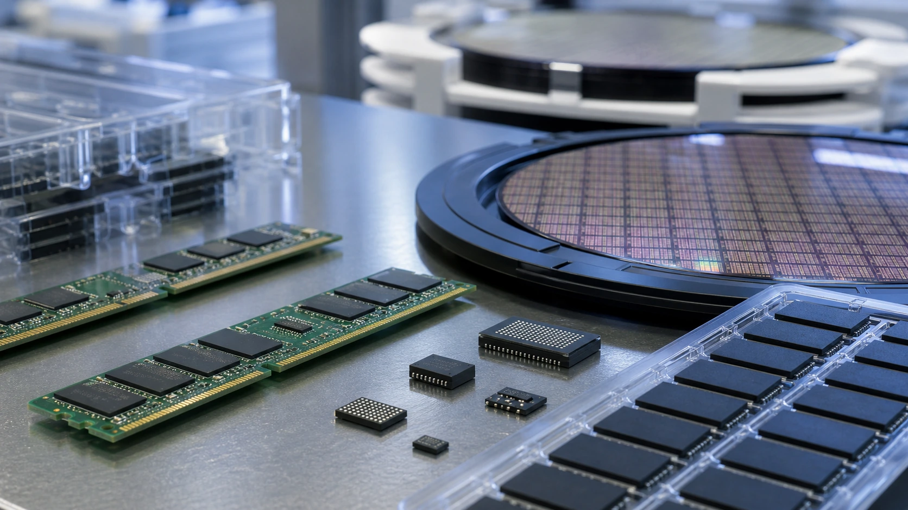
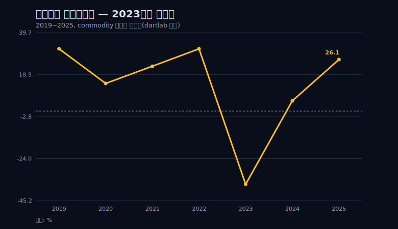
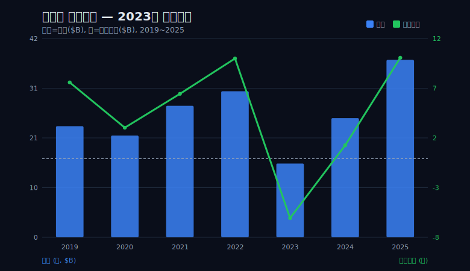
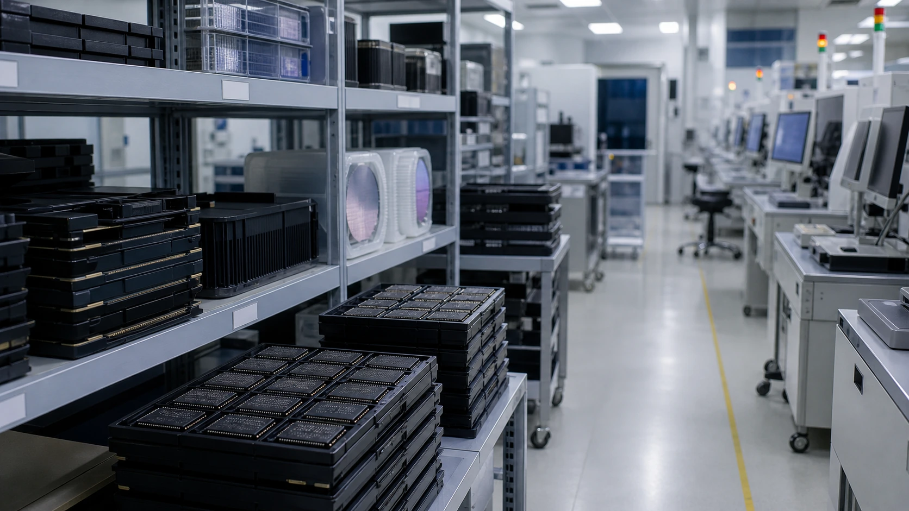
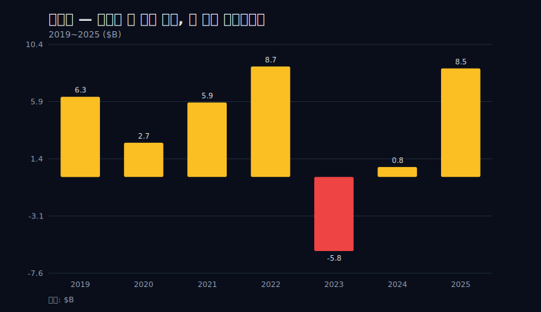
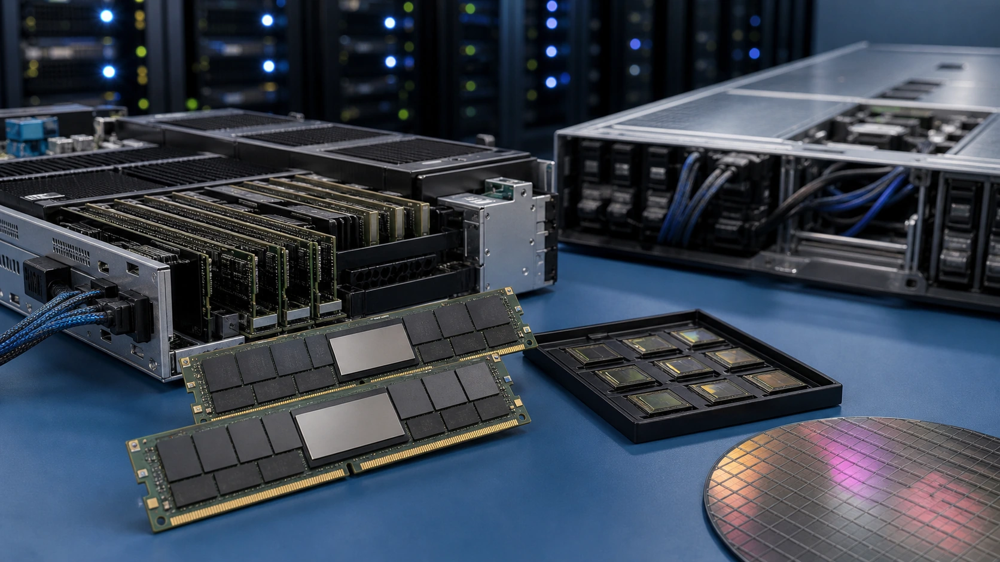
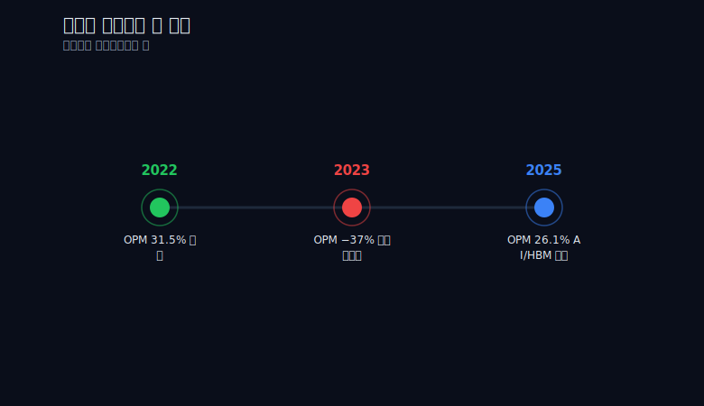

> **데이터 기준**: 2026-06-14 dartlab 실측 — Micron Technology(MU) 미국 연결(USD), 분기→역년 합산. (세그먼트 등 손익 밖은 10-K/IR/언론 외부 인용).
> **핵심 숫자**: 매출 30.76B(2022)→15.54B(2023, −50%)→37.38B(2025). 연 OPM 31.5→−37.0→26.1. 영업이익 +9.70B→−5.75B(적자)→+9.77B.
> **이 글의 용어**: OPM=영업이익률, NPM=순이익률, OCF=영업현금흐름. price-taker=가격을 시장이 정하고 회사는 받기만 하는 처지. HBM=AI 가속기에 쓰이는 고대역폭메모리.

---

## 프롤로그 — 같은 칩, 다른 가격표

마이크론이 2022년에 찍어낸 DRAM 한 칩과 2023년에 찍어낸 DRAM 한 칩은 물리적으로 동일하다. 같은 공정, 같은 용량, 같은 속도 규격이다. 그런데 그 칩을 파는 회사의 연 영업이익률은 31.5%에서 −37.0%로 떨어졌다. 한 해 동안 영업이익은 +9.70B에서 −5.75B로, 흑자에서 적자로 부호가 바뀌었다(단위 $B, 이하 동일).

제품이 나빠진 게 아니다. 공장이 무너진 것도, 경영진이 갑자기 무능해진 것도 아니다. 단 하나가 변했다 — 그 칩에 시장이 매기는 값이다. 마이크론은 자기 제품의 값을 자기가 정하지 못한다. 이 글은 그 한 문장을 7년치 숫자로 해부한다.

흔히 이런 회사를 두고 "롤러코스터 같은 실적"이라고 부른다. 그 비유는 버리겠다. 매출이 1년에 절반으로 깎이고(−50%) 영업이익률이 두 해 사이 60%포인트 넘게 출렁이는데, 비유가 무슨 소용인가. 숫자가 비유보다 잔인하다. 마이크론은 사이클을 타는 회사가 아니라 사이클에 실려가는 회사다. 다만 실려가는 짐짝에게도 핸들이 몇 개는 있다 — 그 이야기까지가 이 글의 끝이다.

먼저 마이크론의 7년 손익을 한 화면에 펼친다.

```python
import dartlab
c = dartlab.Company("MU")
# 미국 연결(USD), 분기 손익을 역년으로 합산해 본문 표를 재현
is_q = c.select("IS", freq="Q")
# operating_income, sales, net_income 행을 분기→역년 합산
```

| 연도 | 매출 | 영업이익 | 순이익 | 영업현금흐름 | OPM% | NPM% |
|---|---:|---:|---:|---:|---:|---:|
| 2019 | 23.41 | 7.38 | 6.31 | 13.19 | 31.5 | 27.0 |
| 2020 | 21.43 | 3.00 | 2.69 | 8.31 | 14.0 | 12.6 |
| 2021 | 27.70 | 6.28 | 5.86 | 12.47 | 22.7 | 21.2 |
| 2022 | 30.76 | 9.70 | 8.69 | 15.18 | 31.5 | 28.3 |
| 2023 | 15.54 | −5.75 | −5.83 | 1.56 | −37.0 | −37.5 |
| 2024 | 25.11 | 1.30 | 0.78 | 8.51 | 5.2 | 3.1 |
| 2025 | 37.38 | 9.77 | 8.54 | 17.52 | 26.1 | 22.8 |

이 표의 값은 미국 회계연도(8월 말 결산)를 역년으로 정규화한 dartlab 실측 합산값이다. 마이크론이 공식 발표하는 회계연도 숫자와는 시점·합계가 다를 수 있으므로, 이 글의 모든 연도 수치는 '역년 정규화 기준'임을 먼저 못 박아 둔다. 합산 단위가 달라지면 숫자도 달라지지만, 진폭의 모양과 크기라는 이 글의 논지는 어느 기준으로 잘라도 그대로 남는다.

## 막1 — price-taker라는 출생증명서

마이크론의 손익이 왜 이렇게 출렁이는지를 이해하려면, 손익계산서 안이 아니라 손익계산서 밖을 먼저 봐야 한다. 원인이 거기 있기 때문이다.

DRAM과 NAND는 표준화된 commodity다. 용량과 속도 규격이 정해져 있고, 같은 규격이라면 마이크론 칩이든 삼성전자 칩이든 SK하이닉스 칩이든 서버와 PC 입장에서는 서로 바꿔 끼울 수 있다. 코카콜라의 맛이나 애플의 운영체제 같은 '대체 불가능한 무엇'이 칩 자체에는 거의 없다. 그래서 가격은 개별 회사의 의지가 아니라 시장 전체의 수급이 매긴다. 이것이 price-taker — 가격을 정하는 자(price-maker)가 아니라, 시장이 정해준 값을 받기만 하는 처지다.



'값을 못 정한다'는 말은 비유가 아니다. 산업의 구조 그 자체다. 수요가 공급을 넘어서면 같은 칩 값이 두 배로 뛰고, 공급이 수요를 넘어서면 절반으로 내린다. 회사가 할 수 있는 일은 그 값에 맞춰 더 싸게 만들거나, 더 좋은 세대의 제품을 먼저 내놓거나, 값이 바닥일 때 버틸 현금을 쌓아두는 것뿐이다. 값 자체를 손으로 붙드는 일은 구조적으로 불가능하다.

이 출생증명서가 두 가지를 설명한다. 첫째, 마이크론과 삼성전자, SK하이닉스가 같은 사이클의 거울인 이유다. 셋은 같은 시장에서 같은 표준품을 팔기 때문에, 한 회사가 호황이면 대체로 셋 다 호황이고 한 회사가 적자면 셋 다 휘청인다. 그래서 마이크론을 제대로 읽으려면 [SK하이닉스 거울편](/blog/000660-skhynix)과 [삼성전자 거울편](/blog/005930-samsung)을 같은 화면에 놓고 봐야 한다. 둘째, 마이크론 손익 변동의 진짜 원인이 손익계산서 안에 없다는 점이다. 메모리 현물가, PC·스마트폰 수요, AI 투자 — 이 모든 외부 변수는 손익표 어디에도 행으로 들어있지 않다. 손익표는 결과만 보여주고, 원인은 표 밖에 있다.

이 글이 인과를 단정하지 않고 '손익 밖 외부 서사'로만 병치하는 이유가 여기 있다. 손익은 "이익이 이만큼 늘었다/줄었다"를 증명한다. "왜"는 손익 밖의 시장 데이터가 쥐고 있고, 그건 이 표에 없다.

```python
# 회사가 통제하지 못하는 값의 결과를, 손익은 OPM 변동으로 기록한다
import dartlab
c = dartlab.Company("MU")
opm = c.ratio("operating_margin", freq="A")  # 영업이익률 시계열
# 2022: 31.5% / 2023: -37.0% / 2025: 26.1% — 같은 회사, 같은 제품, 다른 값
```

## 막2 — 정점: 2022년, OPM 31.5%

2022년 마이크론은 매출 30.76B, 영업이익 9.70B, 영업이익률 31.5%를 찍었다. 매출의 약 3분의 1이 영업이익으로 떨어졌다는 뜻이다. 반도체 장비도, 자동차도, 어떤 산업에서도 흔치 않은 마진이다. 코로나기 PC·서버 수요가 메모리값을 끌어올리던 국면이었고, 마이크론은 그 윗면에 정확히 올라타 있었다.



여기서 강조할 것은 '잘했다'가 아니다. 위인전을 쓸 자리가 아니다. 강조할 것은 정반대다 — 이 31.5%는 마이크론의 '실력'이 아니라 사이클의 '윗면'이라는 점이다. 근거는 단순하다. 같은 회사가, 같은 공장에서, 같은 사람들이, 같은 제품을 만들었는데 1년 뒤 영업이익률 −37.0%를 찍었기 때문이다. 만약 31.5%가 순수한 실력의 결과였다면 1년 만에 그 실력이 −37%로 증발할 수는 없다. 변한 것은 실력이 아니라 값이다.

이 점을 놓치면 마이크론을 읽는 방식 전체가 어긋난다. 호황기의 높은 마진을 '구조적 경쟁력'으로 읽으면, 불황기의 적자를 '일시적 실수'로 오독하게 된다. 둘 다 틀렸다. 호황의 31.5%도 불황의 −37.0%도 같은 한 가지 원인 — 회사가 값을 정하지 못한다는 사실 — 의 양면일 뿐이다.

흥미로운 우연은 2019년에도 연 영업이익률이 똑같이 31.5%였다는 점이다. 2019년 매출은 23.41B, 영업이익 7.38B. 마이크론은 7년 안에 같은 31.5%를 두 번 찍고, 그 사이 한 번은 14.0%(2020)로 내려앉았다. 같은 회사가 같은 마진율을 두 번 찍는데 그 사이에 절반 가까이 떨어졌다 다시 오른다는 것 — 이것이 이미 사이클의 지문이다.



매출과 영업이익을 나란히 놓으면 한 가지가 더 보인다. 매출이 출렁일 때 영업이익은 매출보다 훨씬 크게 출렁인다. 메모리 제조는 공장·장비에 들어간 고정비가 크고, 값이 내려도 그 고정비는 그대로 나가기 때문이다. 그래서 매출이 절반으로 깎이면 영업이익은 절반이 아니라 적자로 떨어진다. 이 비대칭이 다음 막의 분화구를 만든다.

## 막3 — 분화구: 2023년, 영업적자

2022년에서 2023년으로 넘어가며 일어난 일은 이렇다. 매출은 30.76B에서 15.54B로 −50%. 정확히 절반이 사라졌다. 영업이익은 +9.70B에서 −5.75B로, 흑자에서 적자로 부호가 바뀌었다. 순이익도 −5.83B 적자였다. 연 영업이익률은 −37.0%. 매출 100원을 팔 때마다 37원씩 영업단에서 손실이 났다는 뜻이다.



손익 밖의 맥락은 이렇게 병치한다. 같은 시기 시장에서는 코로나 특수가 끝나며 PC·스마트폰 수요가 급감했고, 그동안 쌓인 메모리 재고가 한꺼번에 풀렸다. 수요는 줄고 공급은 남으니 표준품의 값은 폭락했다. 이 인과를 단정하지는 않는다 — 메모리 현물가도 PC 출하량도 이 손익표에 행으로 들어있지 않기 때문이다. 다만 '같은 시기에 시장에서 이런 일이 있었고, 마이크론의 손익이 이렇게 무너졌다'는 두 사실을 나란히 놓을 뿐이다. price-taker에게 적자는 운영 실패가 아니라 시장 값이 원가 아래로 내려갔다는 신호다.

그런데 더 무서운 사실은 따로 있다. 연 평균이 진폭을 가린다는 점이다. '연 −37%'를 최악으로 적으면 실제 바닥을 과소평가하게 된다. 분기로 내려가 보면 분화구는 훨씬 깊다.

```python
import dartlab
c = dartlab.Company("MU")
is_q = c.select("IS", freq="Q")
# 2023Q2 operating_income = -2,303M, sales = 3,693M
# 분기 영업이익률 ≈ -2,303 / 3,693 ≈ -62%
```

dartlab 패널의 2023Q2 영업이익은 −2,303M, 그 분기 매출은 3,693M이다. 분기 영업이익률로 환산하면 약 −62%다. 매출 100원에 영업손실 62원. 연 평균 −37%가 가려놓은 바닥은 −62%였던 셈이다. commodity 사이클의 폭력성은 여기서 가장 적나라하게 드러난다 — 단 한 분기에, 파는 족족 매출의 60% 넘게 손실이 났다.



순이익으로 보면 진폭은 +8.69B(2022)에서 −5.83B(2023)로, 한 해 사이 14B를 훌쩍 넘는 거리를 오갔다. 여기서 정직하게 짚어둘 것 하나. 영업이익률(OPM)과 순이익률(NPM)은 다른 지표다. OPM은 본업의 마진을, NPM은 이자·세금·일회성 항목까지 다 반영한 최종 마진을 말한다. 마이크론은 두 지표가 대체로 비슷하게 움직이지만(2023년 OPM −37.0%, NPM −37.5%), 둘은 같은 줄이 아니다. 이 글이 본업의 진폭에 집중하려고 OPM을 골격으로 쓰는 이유다.

## 막4 — 귀환: 2024~2025, 그리고 핸들 셋

분화구를 지난 마이크론은 어떻게 됐는가. 2024년 매출 25.11B, 영업이익 1.30B, 연 영업이익률 5.2%로 일단 적자를 벗었다. 그리고 2025년 매출 37.38B, 영업이익 9.77B, 영업이익률 26.1%로 사상최대급에 복귀했다. 매출은 7년 통틀어 가장 높고, 영업이익은 정점이던 2022년(9.70B)마저 살짝 넘어섰다.



여기서 가장 흔한 클리셰가 등장한다. "AI 수혜주로 화려하게 부활했다"는 식의 문장이다. 이 표현을 쓰지 않겠다. 인과를 단정하는 동시에 과장하기 때문이다. 손익이 증명하는 것은 딱 거기까지다 — '이익이 돌아왔다'. 그 이익의 원인이 AI 가속기용 HBM 수요인지, 일반 DRAM 가격 반등인지, 제품 믹스 개선인지는 손익만으로는 가를 수 없다. 세그먼트별 매출 분해 데이터 없이 손익표만 보면 'HBM이 얼마를 벌어줬다'고 적을 근거가 없다. 그래서 HBM은 인과가 아니라 '같은 시기 시장에서 AI 투자가 폭발했다'는 맥락(손익 밖)으로만 병치한다.


이 지점에서 회의론자의 가장 강한 반론을 정면으로 받겠다. "관통선이 마이크론을 너무 수동적인 객체로 그린다 — price-taker라도 기술 세대를 먼저 잡으면 같은 사이클에서 경쟁사보다 덜 깎이고 더 빨리 회복한다. 회사를 그저 사이클에 실린 짐짝으로 그리면 거짓이다." 이 반론은 옳다. 그래서 관통선을 보완한다.

값을 못 정하는 회사가 통제할 수 있는 것은 단 셋이다. 첫째 원가 — 같은 시장 값에서 더 싸게 만들면 같은 사이클에서 덜 깎인다. 둘째 기술 세대(믹스) — HBM처럼 한 세대 앞선 제품을 먼저 양산하면, 표준화가 덜 진행된 그 구간에서 잠시 값 협상력을 쥔다. 셋째 다운사이클을 버틸 현금 — 값이 바닥일 때 망하지 않고 다음 사이클까지 살아남는 체력이다. 마이크론은 값 자체는 못 정하지만, '어떻게 깎이고 어떻게 회복하느냐'는 이 세 핸들로 정한다.

그러니 관통선은 이렇게 다듬어진다. 마이크론은 사이클에 실려간다. 그건 변하지 않는다. 다만 그 차에는 핸들이 셋 달려 있다. '실려간다'와 '핸들이 셋 있다'는 모순이 아니라 한 문장의 앞뒤다. 2024~2025의 회복도 '실력으로 이겼다'가 아니라 '사이클 윗면이 다시 왔고, 마이크론이 세 핸들을 쥔 채 거기 실렸다'로 읽는 것이 정확하다.

## 막5 — 진폭 자체가 정체성

7년을 한 줄로 압축하면 이렇다. 매출 23.41 → 30.76 → 15.54 → 37.38. 연 영업이익률 31.5 → −37.0 → 26.1. 영업이익 9.70 → −5.75(적자) → 9.77. 어떤 회사의 7년이 이렇게 위아래로 찢어지는가. 이 진폭의 크기가 곧 마이크론이라는 회사의 정체성이다. 다른 회사라면 '변동성'이라 부를 것을, 마이크론에서는 '정체성'이라 불러야 한다.



재무분석가의 시선을 한 층 더 얹는다. 적자(−5.75B)보다 더 무서운 신호는 따로 있었다 — 현금이 마른다는 사실이다. 영업현금흐름(OCF)을 보자. 2022년 15.18B였던 영업현금흐름은 2023년 1.56B로 쪼그라들었다. 흑자 시절의 약 10분의 1이다. 매출이 절반 깎이는 동안, 본업이 벌어들이는 현금은 90% 가까이 증발했다.

```python
import dartlab
c = dartlab.Company("MU")
cf = c.select("CF", freq="A")  # 영업현금흐름 행
# 2022: 15.18B → 2023: 1.56B (약 1/10) → 2025: 17.52B로 회복
```

왜 적자보다 현금 고갈이 더 위협적인가. 회계상 적자는 감가상각 같은 비현금 비용을 포함하지만, 영업현금흐름은 실제로 손에 들어오고 나가는 돈이다. 메모리 회사는 다음 세대 공장과 장비에 끊임없이 돈을 쏟아부어야 하는데, 그 투자 재원이 바로 영업현금흐름이다. 그게 10분의 1로 마르면 투자도, 빚 상환도, 다음 사이클을 위한 준비도 모두 압박을 받는다. price-taker에게 호황은 보너스가 아니라 '생존자금을 비축하는 시간'이고, 불황은 '그 비축분으로 버티는 시간'이다. 2025년 영업현금흐름이 17.52B로 다시 차오른 것은, 마이크론이 이번 윗면에서 다음 분화구를 버틸 곳간을 채우고 있다는 뜻으로 읽힌다.


다만 여기서 정직하게 멈춘다. 역년 2026은 아직 완결되지 않았고, 진행 중인 분기 수치는 누적·정규화 방식에 따라 출렁일 수 있어 단일 분기로 못 박지 않는다. '사상최대 진행 중'이라고는 적을 수 있어도 '2026년 연간 사상최대'로 못 박을 수는 없다. "사상 최대 실적 경신 행진" 같은 표현은 단일 분기를 연간 추세로 부풀리는 일이라 쓰지 않는다. 이번 윗면이 얼마나 높고 얼마나 오래갈지는, 손익이 아니라 손익 밖의 값이 정할 일이다.

## 에필로그 — 사이클을 타는가, 실려가는가

마이크론에게 던질 진짜 질문은 '다음 분기 좋아지나'가 아니다. 다음 분기는 시장 값이 정하고, 그 값은 누구도 분기 단위로 정확히 맞히지 못한다. 진짜 질문은 이것이다 — '이 진폭을 견디는 자본·기술 체력이 있는가'.

가격을 못 정하는 회사가 통제할 수 있는 것은 막4에서 좁힌 단 셋, 원가·기술 세대(HBM 같은 믹스 우위)·다운사이클을 버틸 현금이다. 영업이익률이 31.5%에서 −37.0%로 떨어졌다 26.1%로 돌아오는 동안, 마이크론이 능동적으로 한 일은 값을 붙드는 것이 아니라 이 세 핸들을 쥐는 것이었다. 값에는 실려가되, 어떻게 깎이고 어떻게 회복하느냐를 정하는 일. 그것이 price-taker의 능동성이 허락되는 유일한 영역이다.

그리고 이 사이클이 한 회사만의 이야기가 아니라는 점을 마지막으로 짚는다. 같은 표준품을 파는 [SK하이닉스 거울편](/blog/000660-skhynix)과 [삼성전자 거울편](/blog/005930-samsung)은 같은 사이클의 거울이다. 셋의 영업이익률은 같은 시기에 함께 무너지고 함께 회복한다 — 그것이 셋 다 price-taker라는 증거다. 사이클의 다른 쪽 끝에는 메모리값을 끌어올리는 수요의 주체들이 있다. AI 가속기를 만드는 [엔비디아](/blog/NVDA-nvidia), 그 칩을 찍어낼 공정 장비를 파는 [어플라이드머티리얼즈](/blog/AMAT-applied-materials), 그리고 같은 메모리·로직 산업의 다른 길을 걸은 [인텔](/blog/INTC-intel)과 [브로드컴](/blog/AVGO-broadcom)까지. 마이크론을 제대로 읽는다는 것은, 이 거울들과 수요의 주체들을 같은 화면에 놓고 사이클 전체를 보는 일이다.

마지막으로 이 글이 하지 않은 것을 분명히 한다. 이 글은 마이크론의 주가도, 밸류에이션도, 목표주가도 말하지 않았다. 손익의 진폭과 그 구조적 원인(price-taker)만 다뤘다. 회복의 원인을 AI/HBM으로 단정하지 않고 맥락으로만 병치한 것도, 연 수치와 분기 수치 두 해상도를 모두 보여준 것도, 데이터의 한계를 본문에 그대로 드러낸 것도 같은 이유에서다. 사이클에 실려가는 회사의 다음 정거장이 어디일지는 손익이 아니라 시장이 정하고, 거기에 어떤 무게를 둘지는 독자의 몫이다.

---

**외부 출처**
- [SEC 10-K (EDGAR)](https://www.sec.gov/cgi-bin/browse-edgar?action=getcompany&CIK=MU&type=10-K)
- [마이크론 IR](https://investors.micron.com)
- [Macrotrends 영업이익률](https://www.macrotrends.net/stocks/charts/MU/micron-technology/operating-margin)
- [Macrotrends 매출](https://www.macrotrends.net/stocks/charts/MU/micron-technology/revenue)
- [Reuters MU](https://www.reuters.com/markets/companies/MU.O)
