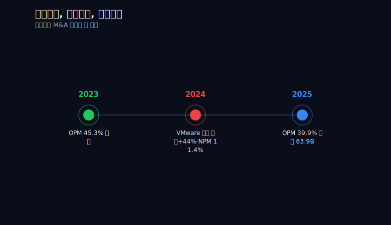
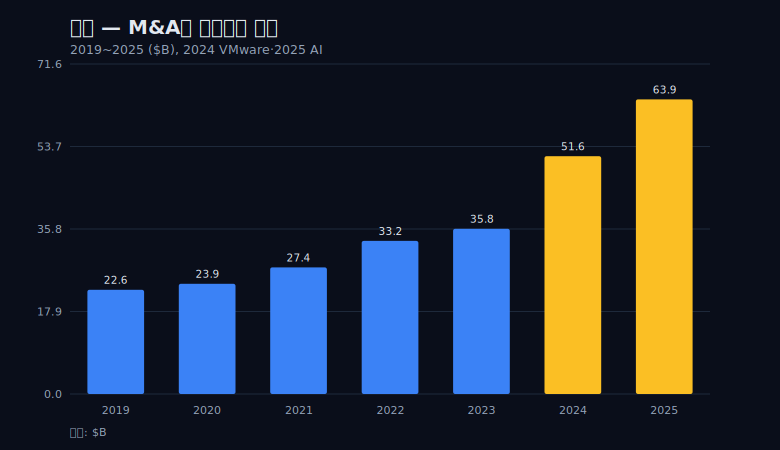
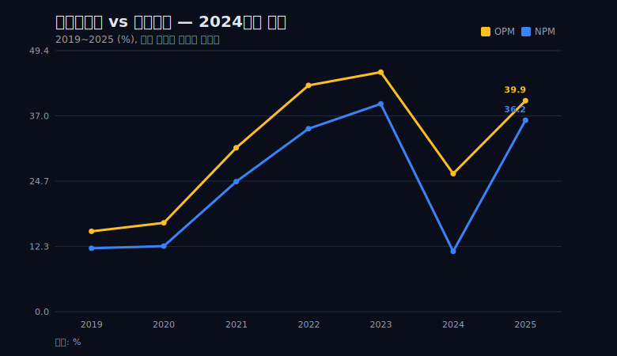
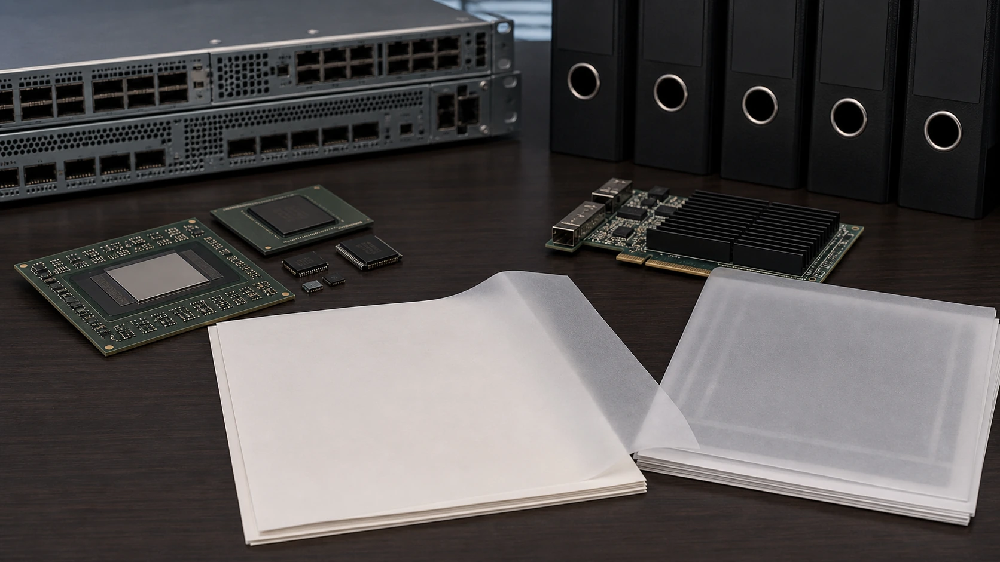
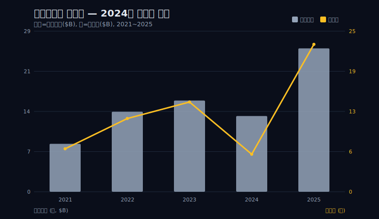
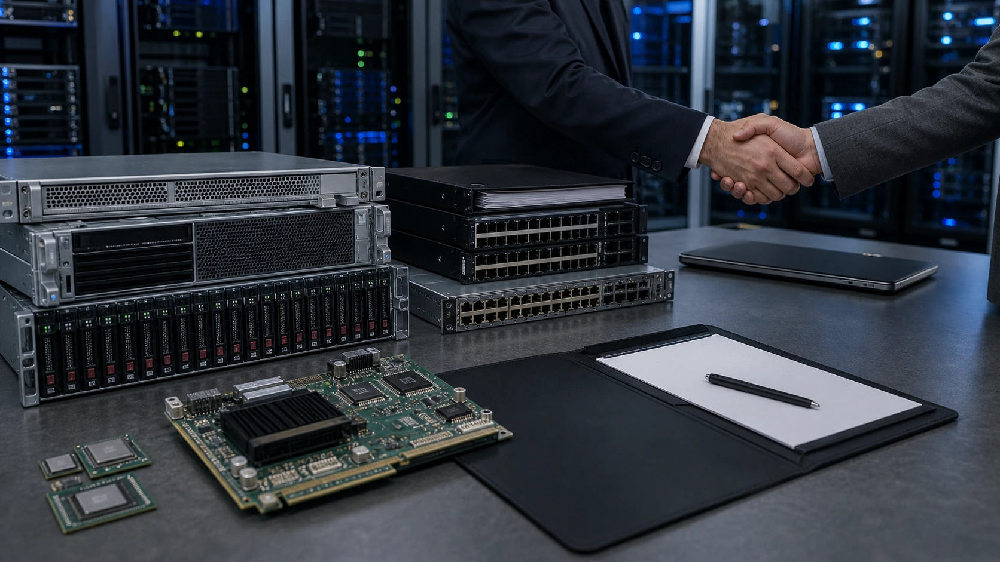
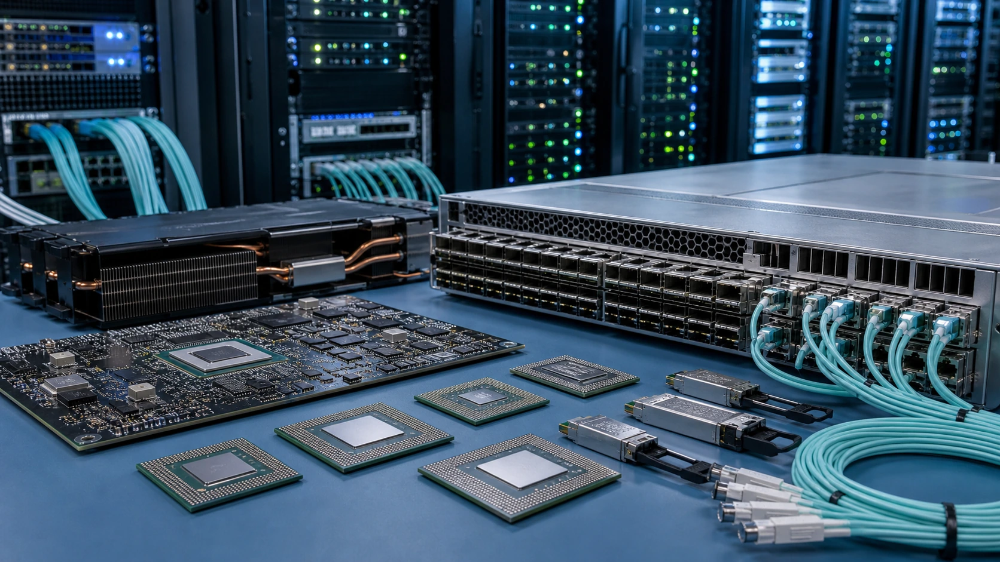

> **데이터 기준**: 2026-06-20 dartlab 실측 — Broadcom(AVGO) 미국 연결(USD), 분기→역년 합산. 세그먼트·AI semiconductor revenue·Q3 guidance는 Broadcom FY2026 Q2 IR 및 SEC filings로 분리 표기.
> **핵심 숫자**: 매출 358.2억(2023)→515.7억(2024, +44%)→638.9억 달러(2025), 즉 $35.82B→$51.57B→$63.89B. 순이익 140.8억→58.9억→231.3억 달러($14.08B→$5.89B→$23.13B). 영업이익률 45.3%→26.1%→39.9%. 영업현금흐름 180.9억→199.6억→275.4억 달러($18.09B→$19.96B→$27.54B)로 2024년에도 증가.
> **이 글의 용어**: '상각의 장막' = 인수로 생긴 무형자산을 비용으로 천천히 털어내는 회계 처리가 순이익만 골라 눌러 회사가 실제보다 나빠 보이게 만드는 현상. 화폐 단위는 모두 미국 달러이며, 본문은 십억 달러 단위 약어 $B(=10억 달러)와 한국어 '억 달러'를 함께 적는다($1B=10억 달러). 회계연도는 10~11월 말 마감.

---

## 프롤로그 — 가장 좋아진 회사가 가장 나빠 보인 해

2024년 브로드컴의 손익계산서를 처음 펼친 사람은 십중팔구 오해한다. 매출은 한 해 만에 358.2억 달러($35.82B)에서 515.7억 달러($51.57B)로 +44% 뛰었는데, 순이익은 140.8억 달러($14.08B)에서 58.9억 달러($5.89B)로 거의 반토막 났다. 순이익률(NPM)로 보면 39.3%에서 11.4%로 주저앉았다. 매출이 절반 가까이 늘었는데 이익률은 4분의 1 토막. 손익계산서만 보면 이 회사는 '망가진 해'를 보낸 것처럼 읽힌다.

그런데 같은 해 현금흐름표를 보면 정반대의 신호가 찍혀 있다. 영업현금흐름은 180.9억 달러($18.09B)에서 199.6억 달러($19.96B)로 오히려 늘었다. 회계상 순이익이 반토막 나는 동안, 회사가 영업으로 실제로 빨아들인 현금은 더 커진 것이다.

이 괴리가 이 글의 단서다. 회계이익은 반토막 났는데 현금은 멀쩡히, 아니 더 늘었다. 둘 중 하나는 무언가를 가리고 있다는 뜻이다. 그리고 가린 쪽은 현금이 아니라 회계이익이다.

이 글의 관통선은 하나다. **브로드컴은 사업을 키우기보다 회사를 사들여 외형을 계단처럼 올리는 회사다.** 그래서 가장 크게 사들인 해에 인수의 비용이 회계 순이익을 한꺼번에 짓눌렀고, '가장 좋아진 회사가 가장 나빠 보이는' 착시가 생겼다. 영업현금흐름은 그 와중에도 멀쩡히 흘렀고, 상각의 장막이 분기마다 걷히자 2025년에 진짜 수익력이 드러났다.

이 글은 손익계산서 한 장으로 회사를 판단하면 안 되는 이유를 브로드컴이라는 가장 선명한 사례로 읽는다. 같은 메커니즘은 [AMD(Xilinx 인수)](/blog/AMD-amd)에서도, [마이크로소프트의 대형 인수](/blog/MSFT-microsoft) 회계에서도 반복된다. 브로드컴은 그 교과서적 형태다.

미리 짚어 둘 한 가지가 있다. 이 글이 추적하는 것은 '회계이익(순이익)'과 '현금'이 갈라지는 한 지점이고, 그 갈라짐은 영업이익률(OPM)과 순이익률(NPM)의 격차로 나타난다. 그런데 OPM과 NPM은 같은 마진이 아니다. OPM은 본업의 영업 단계까지만 본 마진이고, NPM은 거기서 영업외 비용·세금·그리고 인수로 생긴 비현금 비용까지 다 뺀 마진이다. 둘이 평소보다 크게 벌어진 해 — 그게 바로 무언가 '순이익만' 골라 깎은 해다. 이 글은 그 격차를 따라가며, 격차를 만든 범인이 사업의 악화가 아니라 인수 회계였음을 손익과 현금 두 데이터로 교차 검증한다. 그래서 본문 내내 OPM과 NPM을 한 단어로 뭉뚱그리지 않고 둘을 분리해 읽는다.



---

## 막 1 — 사업을 키우는 게 아니라 사들인다

브로드컴의 성장 곡선을 그려 보면 부드러운 우상향이 아니다. 계단이다. 매출 시계열은 358.2억($35.82B, 2023)에서 515.7억($51.57B, 2024)으로, 다시 638.9억 달러($63.89B, 2025)로 한 칸씩 점프한다. 유기적으로 제품이 팔려 매출이 매끈하게 늘어난 곡선이 아니라, 무언가를 통째로 사들여 한 칸씩 올라선 계단의 모양이다.

그 '무언가'가 인수합병(M&A)이다. 브로드컴의 본체는 반도체다 — 네트워킹 칩, 무선 칩, 스토리지 칩. 여기에 인프라 소프트웨어를 M&A로 얹어 왔다. CA 테크놀로지스, 시만텍의 엔터프라이즈 보안 사업, 그리고 결정적으로 2023년 11월 약 690억 달러에 종결한 VMware 인수다. 이 690억 달러라는 숫자는 손익 데이터 밖, 외부 공시(10-K/IR) 맥락이지만, 매출 계단의 폭을 설명하는 가장 직접적인 사건이다.

여기서 한 가지 짚어야 한다. 'VMware 인수가 매출 계단을 만들었다'는 인과는 손익 요약표 안에서 직접 증명되지 않는다. 손익계산서는 세그먼트별로 어느 사업이 얼마를 보탰는지 분해해 주지 않는다. 다만 매출이 2024년에 +44% 점프한 시점과 VMware 종결 시점(2023년 11월)이 정확히 겹치고, 그 폭이 유기적 성장으로는 설명되지 않을 만큼 크다는 정황이 가리킨다. 정확한 세그먼트별 기여는 [SEC 10-K(EDGAR)](https://www.sec.gov/cgi-bin/browse-edgar?action=getcompany&CIK=AVGO&type=10-K)로 따로 확인해야 한다.

dartlab으로 이 계단을 그대로 불러올 수 있다.

```python
import dartlab
c = dartlab.Company("AVGO")
# 분기 손익을 역년으로 합산해 매출 계단을 확인
is_q = c.select("IS", freq="Q")
# 2023: $35.82B → 2024: $51.57B(+44%) → 2025: $63.89B(+24%)
```

계단형 성장은 그 자체로 좋지도 나쁘지도 않다. 다만 읽는 방법이 다르다. 유기적으로 자라는 회사는 손익계산서 한 장으로 대체로 판단이 된다. 매출이 늘면 그만큼 이익이 늘고, 비용 구조는 천천히 변한다. 그래서 손익계산서의 한 해 스냅샷이 회사의 현재 상태를 비교적 충실히 대변한다.

사들여 자라는 회사는 다르다. 외형은 인수가 종결되는 날 한꺼번에 점프하지만, 그 인수에 들어간 비용은 한꺼번에 손익에 찍히지 않고 여러 해에 걸쳐 흩뿌려진다. 매출은 즉시 더해지는데 비용은 시차를 두고 분산되니, 인수 첫해의 손익계산서는 '늘어난 매출'과 '집중된 초기 비용'이 비대칭으로 충돌하는 무대가 된다. 이 비대칭을 모르고 한 해 스냅샷만 보면, 가장 크게 사들인 해가 가장 망가진 해로 보인다. 사들여 자라는 회사는 손익계산서만으로는 함정에 빠진다. 인수에는 회계가 따라오기 때문이다. 사들인 회사의 장부에 없던 무형자산 — 브랜드, 고객 관계, 개발된 기술, 영업권 — 이 인수가격에 배분되고, 그 일부는 정해진 기간에 걸쳐 비용으로 천천히 털어내진다. 이것이 무형자산 상각이다. 그리고 상각은 현금이 나가지 않는 비용, 즉 비현금 비용이다.



이 한 문장 — '상각은 비현금 비용이다' — 이 프롤로그의 괴리를 풀 열쇠다. 인수의 비용은 회계 순이익을 깎지만 영업현금흐름은 깎지 않는다. 그래서 2024년 순이익은 반토막 났는데 영업현금흐름은 늘었다.

---

## 막 2 — 정점에서의 출발: 2023년의 45%

장막의 효과를 측정하려면 장막이 내려오기 직전의 맨얼굴을 먼저 봐야 한다. 그 맨얼굴이 2023년이다.

VMware를 삼키기 직전인 2023년, 브로드컴의 영업이익률(OPM)은 45.3%였다. 매출 358.2억 달러($35.82B)에 영업이익 162.1억 달러($16.21B). 시계열 전체에서 가장 높은 지점, 정점이다. 반도체와 인프라 소프트웨어를 묶은 본체가 이미 얼마나 효율적인 이익 기계였는지를 이 숫자가 말한다.

이 45%가 얼마나 높은 수치인지는 시간을 거슬러 보면 분명해진다.

```python
import dartlab
c = dartlab.Company("AVGO")
# 연도별 OPM 추이: 2019 15.2% → 2023 45.3%
# (분기 영업이익·매출을 역년 합산해 산출)
prof = c.analysis("financial", "수익성")
```

2019년 브로드컴의 OPM은 15.2%였다. 매출 226.0억 달러($22.60B)에 영업이익 34.4억 달러($3.44B). 평범한 반도체 회사의 마진이다. 그런데 4년 만에 이 수치가 15.2% → 16.8%(2020) → 31.0%(2021) → 42.8%(2022) → 45.3%(2023)로, 세 배가 됐다. 이 상승 자체도 사실 인수와 통합, 그리고 고마진 사업 비중 확대가 겹친 결과지만, 핵심은 2023년 시점에 본체가 이미 45%짜리 마진 기계로 완성돼 있었다는 사실이다.

이 기준선이 중요한 이유가 있다. 만약 2023년 OPM이 20%짜리 평범한 회사였다면, 다음 해 26.1%는 '개선'으로 읽혔을 것이다. 그러나 정점이 45.3%였기 때문에, 2024년의 26.1%는 명백한 후퇴로 보인다. 19.2%포인트가 한 해에 증발한 것처럼 보인다.

45%라는 마진이 어떻게 만들어졌는지도 잠깐 짚을 가치가 있다. 반도체는 본래 자본집약적이고 사이클을 타는 사업이라 40%대 영업이익률은 흔하지 않다. 브로드컴이 이 수준에 도달한 길은 두 갈래였다. 하나는 사업 포트폴리오를 의도적으로 고마진 영역 — 네트워킹, 무선, 스토리지처럼 설계 난도가 높고 대체가 어려운 칩 — 으로 좁힌 것이고, 다른 하나는 인수한 사업에서 중복 비용을 가차 없이 걷어낸 것이다. 롤업 모델의 진짜 무기는 '사들이는 것' 자체가 아니라 '사들인 뒤 비용을 깎는 규율'이다. 인수한 회사의 영업·관리·연구개발 중 겹치는 부분을 통합해 마진을 끌어올리는 능력. 2019년 15.2%에서 2023년 45.3%로 가는 곡선은, 인수한 사업을 본체의 비용 규율에 흡수시켜 마진을 표준화해 온 궤적이기도 하다.

그렇다면 한 가지 의문이 생긴다. 비용을 깎아 마진을 올리는 회사가, 왜 가장 큰 인수(VMware) 직후에는 마진이 폭락했는가. 답은 회계의 시간 차에 있다. 인수한 사업의 운영 비용은 통합으로 줄일 수 있지만, 인수가격을 무형자산으로 배분한 뒤 그것을 상각하는 회계 비용은 통합으로 줄일 수 없다. 오히려 인수가 클수록, 배분된 무형자산이 클수록, 초기 상각 비용은 더 무겁게 손익을 누른다. 즉 '비용을 잘 깎는 회사'의 운영 효율과 '인수 회계가 만드는 비현금 비용'은 별개의 층위다. 전자는 영업현금흐름에 나타나고, 후자는 회계 순이익에만 나타난다. 2024년은 이 두 층위가 정확히 갈라진 해였다.

이 글의 주장은 그 증발이 진짜 후퇴가 아니라 회계적 일시 가림이라는 것이다. 그리고 그 주장을 검증할 유일한 방법은, 같은 해의 영업이익률(26.1%)과 순이익률(11.4%) 사이의 격차를 들여다보는 것이다. 만약 마진 하락이 사업의 진짜 악화라면 OPM과 NPM이 비슷하게 같이 빠졌어야 한다. 그런데 실제로는 둘 사이에 큰 틈이 벌어진다. 그 틈이 다음 막의 주제다.

---

## 막 3 — 상각의 장막: 2024년에 무슨 일이 일어났나

2024년 브로드컴의 두 마진을 나란히 놓아 보자. 영업이익률 26.1%, 순이익률 11.4%. 둘 사이에 14.7%포인트의 틈이 있다.

이 틈이 핵심이다. 영업이익은 매출에서 매출원가와 판관비(영업비용)를 뺀 것이고, 순이익은 거기서 다시 영업외 항목과 세금을 뺀 것이다. 평소 잘 굴러가는 회사라면 OPM과 NPM의 격차는 세금과 이자 정도로 비교적 일정하다. 그런데 2024년 브로드컴은 이 격차가 비정상적으로 크게 벌어졌다. 무언가가 영업이익 아래 단계에서, 그리고 영업이익 자체에서도, 순이익을 골라 갉아먹었다는 신호다.



비교를 위해 정상 연도인 2023년을 보면, OPM 45.3%와 NPM 39.3%의 격차는 6.0%포인트다. 2025년도 OPM 39.9%와 NPM 36.2%로 격차 3.7%포인트다. 그런데 2024년만 14.7%포인트. 평년의 두 배가 넘는다. 2024년에만 무언가 특별한 비용이 이익 계단을 추가로 깎은 것이다.

분기 데이터를 열면 그 '무언가'의 흔적이 또렷하다. 판매비와관리비(판관비)가 시점에 맞춰 폭발한다.

```python
import dartlab
c = dartlab.Company("AVGO")
# 분기 판관비 급등 흔적 추적
is_q = c.select("IS", freq="Q")
# SG&A: 2023Q4 $0.418B → 2024Q1 $1.572B(약 4배) → 2025년 $0.9~1.1B대 정상화
```

dartlab 분기 실측으로 판관비를 따라가면, 2023년 4분기 4.18억 달러($0.418B)였던 판관비가 2024년 1분기에 15.72억 달러($1.572B)로 약 4배 튀어 오른다. 이 급등은 VMware 인수가 종결된(2023년 11월) 바로 다음 분기에 일어났다. 그리고 이후 분기를 보면 13.0억($1.30B, 2024Q2), 11.0억($1.10B, 2024Q3), 10.1억($1.01B, 2024Q4)으로 계단처럼 내려오고, 2025년에는 9~11억 달러($0.9~1.1B)대에 안착한다. 인수 첫 분기에 가장 무겁고, 분기마다 가벼워지는 이 패턴이야말로 인수 회계의 전형적 지문이다.

여기서 한계를 명확히 적어야 한다. 분기 판관비·영업이익 수치는 제공된 연간 검증 표에 직접 실려 있지 않은 dartlab 분기 실측이라, 본 글이 외부에서 독립 검증할 수 없는 값이다(다만 2024년 분기 영업이익의 합은 뒤에서 보듯 연간 영업이익 $13.46B과 정확히 맞아떨어진다). 또한 손익 요약표는 이 판관비 급등액 중 정확히 얼마가 VMware 무형자산 상각이고 얼마가 통합비용(인력 재배치, 시스템 통합 등)인지 분해해 주지 않는다. 'VMware 상각이 2024년 순이익 하락의 원인'이라는 명제는 손익 데이터 안에서 직접 증명된 인과가 아니라, ① 판관비 급등 시점이 인수 종결 직후와 정확히 일치하고 ② 그 비용이 비현금성이어서 영업현금흐름을 깎지 않았다는 두 가지 정황으로 읽는다. 정확한 상각 명세는 [SEC 10-K(EDGAR)](https://www.sec.gov/cgi-bin/browse-edgar?action=getcompany&CIK=AVGO&type=10-K)와 [브로드컴 IR](https://investors.broadcom.com) 공시로만 확정된다.

그러나 이 정황은 강력하다. 핵심 증거는 영업현금흐름이다. 만약 2024년 마진 하락이 사업의 진짜 악화 — 가격 하락, 비용 폭등, 수요 붕괴 — 였다면 영업현금흐름도 같이 빠졌어야 한다. 그런데 영업현금흐름은 199.6억 달러($19.96B)로, 2023년 180.9억 달러($18.09B)보다 오히려 늘었다. 순이익을 깎은 비용 대부분이 현금이 나가지 않는 비현금 항목, 즉 무형자산 상각이었기 때문이다. 회계이익은 인수의 비용을 앞당겨 한꺼번에 보여주었고, 현금은 그 비용을 실제로 지불하지 않았다.



이 대목에서 회의론자의 가장 강한 반론을 마주해야 한다. "인수 상각이 순이익을 가렸을 뿐 진짜 수익력은 멀쩡했다"는 프레임은, 부진한 롤업(roll-up, 인수로 외형을 키우는) 회사가 분기마다 꺼내는 단골 변명 아니냐는 것이다. 무형자산 상각을 '비현금이니 무시하라'고 말하는 순간, 690억 달러를 실제로 현금 지불(또는 차입)한 인수의 비용을 통째로 지워 버리는 회계 마사지가 된다는 지적이다.

이 반론은 정당하고, 가볍게 넘기면 안 된다. 그래서 이 글은 '비현금이니 무시하라'고 말하지 않는다. 정반대로 말한다 — **회계는 인수 비용을 앞당겨 왜곡 없이 보여준 것이다.** 690억 달러는 실재하는 비용이다. 다만 그 비용은 인수 시점에 이미 현금(또는 차입)으로 한 번 지불됐고, 회계는 그것을 미래에 걸쳐 비용으로 다시 인식할 뿐이다. 무형자산 상각은 '없는 비용'이 아니라 '이미 치른 비용을 회계가 천천히 반영하는 그림자'다. 그래서 2024년 순이익이 보수적으로 눌린 것은 회계가 있는 그대로 반영한 것이지 거짓이 아니다. 무시하라는 게 아니라, '이 비용은 미래 현금 유출이 아니라 과거 인수의 사후 기록'이라는 성격을 정확히 읽으라는 것이다.

이 구분이 왜 중요한지는 투자 판단의 두 질문이 서로 다르기 때문이다. 첫째 질문은 '이 회사가 인수에 너무 비싸게 지불했는가'다. 이것은 무형자산 상각이 적절한 답을 준다 — 비싸게 산 만큼 무형자산이 크고, 그만큼 상각도 무겁다. 둘째 질문은 '이 회사의 사업이 지금 돈을 잘 벌고 있는가'다. 이것은 무형자산 상각이 오히려 시야를 가린다 — 과거 인수의 회계 그림자가 현재 사업의 현금 창출력을 덮어버리기 때문이다. 같은 690억 달러를 두고, 첫 질문에서는 비용으로 빠짐없이 세고 둘째 질문에서는 현재의 사업 성과와 분리해 읽어야 한다. 이 두 질문을 뒤섞으면 '비싸게 산 죄'와 '지금 못 버는 죄'를 혼동하게 된다. 2024년 브로드컴은 전자였지 후자가 아니었다. 비싸게 샀을 수는 있어도, 사업이 못 번 해는 아니었다 — 영업현금흐름 199.6억 달러($19.96B)가 그 증거다.

---

## 막 4 — 분기마다 걷히는 장막

장막이 회계적 가림이라는 가설을 검증할 가장 강한 증거는 연간 스냅샷이 아니라 분기의 움직임에 있다. 만약 2024년의 부진이 진짜 사업 악화였다면, 한 해 내내 비슷하게 나빴어야 한다. 그런데 분기를 펼치면 전혀 다른 그림이 나온다 — 장막은 한 번에 걷히지 않고 분기마다 얇아졌다.

2024년 분기별 영업이익을 따라가 보자.

```python
import dartlab
c = dartlab.Company("AVGO")
is_q = c.select("IS", freq="Q")
# 2024 분기 영업이익: Q1 $2.083B → Q2 $2.965B → Q3 $3.788B → Q4 $4.627B
# 네 분기 합 $13.463B = 표의 연간 영업이익 $13.46B 와 정합
# 한 해 안에서 두 배 이상 회복
```

2024년 1분기 영업이익은 20.83억 달러($2.083B)였다. 2분기 29.65억($2.965B), 3분기 37.88억($3.788B), 4분기 46.27억 달러($4.627B). 네 분기를 더하면 134.6억 달러로, 검증 표의 연간 영업이익 134.6억 달러($13.46B)와 정확히 맞아떨어진다. 이 합산 일치가 분기 수치를 표 안의 연간 값과 묶어 주는 유일한 검증 고리다. 한 해 안에서 영업이익이 두 배 넘게 회복했다. 같은 회사의 같은 사업이 한 해 동안 갑자기 두 배로 좋아질 수는 없다. 변한 것은 사업이 아니라, 분기마다 가벼워진 비용 — 인수 첫 분기에 집중됐던 통합비용과 초기 상각 — 이다.

바닥을 정확히 찍어 보면 더 분명하다. 분기 실측에 따르면 인수 직전 분기인 2023년 4분기 영업이익은 42.40억 달러($4.240B)였다. 그런데 인수 첫 분기인 2024년 1분기에 20.83억 달러($2.083B)로 거의 반토막 났다. 직전 분기의 절반. 이것이 통합비용과 초기 상각이 가장 무겁게 내려앉은 순간, 바로 장막이 가장 두꺼웠던 바닥으로 읽힌다. 그리고 그 바닥에서부터 분기마다 영업이익은 위로 올라갔다. 다만 이 분기 바닥·회복 곡선은 표 밖의 dartlab 분기 실측에 기댄 해석이므로, 연간 합산 정합을 넘어선 분기 단위 결론은 단정이 아니라 정황 독해로 읽어야 한다.

연간 스냅샷은 이 '회복의 실시간 진행'을 가린다. 2024년 한 해를 하나의 숫자(OPM 26.1%)로 뭉뚱그리면, 1분기 바닥($2.083B)과 4분기 정상($4.627B)이 평균으로 섞여 '그냥 나쁜 해'로 보인다. 그러나 분기로 펼치면 그것은 '나쁜 해'가 아니라 '바닥에서 매분기 올라온 회복의 해'로 보인다.

이 분기 곡선이 회의론자의 '단골 변명' 반론에 대한 가장 강한 재반박이다. 진짜 사업 악화라면 분기마다 회복할 이유가 없다. 비용이 인수 첫 분기에 몰렸다가 분기마다 빠지는 패턴 — 이것은 사업의 회복이 아니라 일회성·초기 집중 비용이 소진되는 패턴의 정확한 모양이다. 2024년 4분기에 이미 영업이익이 46.27억 달러($4.627B)로, 인수 직전 정상 분기($4.240B)를 넘어선 점이 그 정황을 뒷받침한다. 한 해가 끝나기도 전에 본체는 이미 정상 궤도를 회복한 것으로 보인다.

분기 곡선이 가진 또 하나의 힘은, 그것이 연간 스냅샷보다 한발 앞선 신호를 준다는 점이다. 연간 투자자가 2024년 회계연도 전체를 하나의 OPM 26.1%로 받아들이는 사이, 분기를 추적한 사람은 4분기 영업이익 46.27억 달러($4.627B)를 보고 '2025년 연간으로는 분기당 40억 달러대 후반이 누적될 것'을 가늠할 단서를 이미 쥐고 있었다. 실제로 2025년 연간 영업이익은 254.8억 달러($25.48B)로, 분기당 평균 약 63.7억 달러(60억 달러 초과) 수준으로 올라섰다. 분기 데이터를 읽은 사람과 연간 스냅샷만 본 사람은 같은 2024년 말에 서로 다른 회사를 보고 있었던 셈이다. 한 명은 '반토막 난 회사'를, 다른 한 명은 '바닥을 찍고 매분기 올라오는 회사'를 본 것이다.

여기서 판관비의 분기 경로를 영업이익의 분기 경로와 겹쳐 보면 인과의 정황이 더 단단해진다. 판관비는 2024Q1 15.72억 달러($1.572B)에서 분기마다 내려왔고, 영업이익은 같은 분기들에 거꾸로 올라왔다. 한쪽이 빠진 만큼 다른 쪽이 찼다. 두 곡선이 거울처럼 대칭을 이룬다는 것은, 영업이익을 누른 것이 매출 부진이 아니라 비용 — 그중에서도 시점이 명확한 인수 관련 비용 — 이었음을 강하게 시사한다. 물론 이 대칭은 상관이지 손익 안에서 증명된 인과는 아니며, 정확한 비용 명세는 10-K로 넘긴다. 다만 상관의 시점·방향·크기가 모두 인수 가설과 들어맞는다는 점에서, 이 정황은 단순한 우연으로 치부하기 어렵다.



---

## 막 5 — 장막 뒤의 엔진: 2025년의 폭발

2025년, 장막이 완전히 걷혔다. 그리고 그 뒤에 있던 엔진이 드러났다.

매출 638.9억 달러($63.89B, +24%), 영업이익 254.8억($25.48B), 순이익 231.3억 달러($23.13B). 영업이익률 39.9%, 순이익률 36.2%. 정점이었던 2023년(45.3%, 39.3%)에는 못 미치지만, 2024년의 26.1%·11.4%에서 보면 완전한 회복이다. 특히 순이익은 58.9억 달러($5.89B)에서 231.3억 달러($23.13B)로 4배 가까이 뛰었다. 매출은 같은 기간 +24% 늘었을 뿐인데 순이익이 4배가 됐다는 것은, 2024년에 순이익을 짓눌렀던 비용이 빠졌다는 뜻이다.

이 비대칭이 인수 회계의 본질을 드러낸다. 매출이 +24% 늘 때 순이익이 +24%만 늘면 그것은 비용 구조가 그대로인 정상 성장이다. 그러나 순이익이 4배 가까이 뛰었다는 것은 매출 증가분이 거의 그대로 이익으로 떨어졌다는 뜻 — 즉 추가 매출에 붙는 한계 비용이 매우 낮았다는 뜻이다. 인수한 사업의 무거운 초기 비용이 이미 2024년에 한 번 털렸기 때문에, 2025년의 같은 매출은 훨씬 가벼운 비용 구조 위에서 만들어졌다. 한 번 무겁게 치른 비용이 다음 해의 레버리지로 돌아온 것이다. 이것이 인수 회계가 시간에 걸쳐 만들어내는 'J 커브'의 후반부다 — 첫해에 깊게 파이고, 이듬해에 가파르게 솟는다.



2025년 폭발에는 두 동력이 겹쳤다. 첫째, 통합비용과 초기 상각이 빠지면서 VMware가 정상 마진으로 기여하기 시작했다. 인수 첫해의 무거운 비용이 소진되자, 인수한 사업이 본체의 고마진 구조에 합류한 것이다. 둘째, AI 데이터센터용 맞춤형 칩(ASIC) 수요가 본체 반도체를 밀어 올렸다.

여기서 다시 한계를 명확히 그어야 한다. 이 두 동력 — 'VMware 정상화'와 'AI 맞춤칩' — 각각이 2025년 폭발에 몇 퍼센트씩 기여했는지는 제공된 손익 데이터로 분해되지 않는다. 두 힘이 같은 해에 겹쳤다고 말할 수 있을 뿐, 'AI가 매출의 X%를 끌어올렸다'고 단언하면 그것은 과장이다. ASIC과 AI 데이터센터 수요는 손익 데이터 밖의 외부 서사이며, Broadcom IR과 SEC filings로만 그 맥락을 확인할 수 있다. 본 글의 손익·현금 데이터가 확실히 말하는 것은 '2025년에 두 마진이 회복했다'는 결과뿐이고, 그 원인 분해는 공식 세그먼트 공시에 의존한다.



dartlab으로 2025년 회복을 재현하면 다음과 같다.

```python
import dartlab
c = dartlab.Company("AVGO")
prof = c.analysis("financial", "수익성")
cash = c.analysis("financial", "현금흐름")
# 2025: 매출 $63.89B, 영업이익 $25.48B, 순이익 $23.13B
# OPM 39.9%, NPM 36.2%, 영업현금흐름 $27.54B
```

그리고 이 모든 이야기를 관통하는 한 줄, 영업현금흐름. 2023년 180.9억($18.09B), 2024년 199.6억($19.96B), 2025년 275.4억 달러($27.54B). 한 번도 꺾이지 않았다. 회계 순이익이 39.3% → 11.4% → 36.2%로 롤러코스터를 타는 동안, 영업으로 들어온 현금은 $18B → $20B → $28B로 묵묵히 우상향했다. 두 번째 눈(현금흐름)으로 보면, 회사는 한 해도 나빠진 적이 없었다. 나빠 보였을 뿐이다.

영업현금흐름이 이렇게 매끈하게 오를 수 있었던 이유 자체가 인수 회계의 구조에서 나온다. 손익계산서에서 순이익을 가장 무겁게 깎은 항목 — 무형자산 상각 — 은 현금흐름표에서는 순이익에 그대로 다시 더해지는 항목이다. 현금흐름표는 회계 순이익에서 출발해 '실제로 현금이 나가지 않은 비용'을 도로 가산하는 방식으로 영업현금흐름을 계산하기 때문이다. 즉 2024년에 순이익을 11.4%까지 끌어내린 비현금 비용은, 현금흐름표로 자리를 옮기면 거의 그대로 복원된다. 손익계산서가 한 손으로 깎은 것을 현금흐름표가 다른 손으로 되돌리는 셈이다. 이 구조를 알면, '순이익은 반토막인데 영업현금흐름은 늘었다'는 프롤로그의 수수께끼가 사실은 회계 규칙의 당연한 귀결이었음이 보인다. 수수께끼였던 것은 데이터가 아니라, 손익계산서 한 장만 보던 우리의 시야였다.

다만 이 지점에서 한 번 더 균형을 잡아야 한다. 영업현금흐름이 상각을 되돌려 복원한다는 사실이, 상각이 '의미 없는 숫자'라는 뜻은 아니다. 영업현금흐름은 인수 대금 690억 달러가 처음 빠져나간 흔적을 보여주지 않는다 — 그 현금 유출은 투자활동현금흐름(인수)과 재무활동현금흐름(차입)에 기록됐지 영업현금흐름에는 없다. 그러니 영업현금흐름만 보면 인수의 진짜 청구서를 못 본다. 두 번째 눈(영업현금흐름)은 '사업이 지금 버는 힘'을 정확히 보여주지만, '인수에 얼마를 치렀고 그 빚이 얼마나 남았는가'라는 세 번째 질문에는 답하지 않는다. 그 답은 재무상태표와 재무활동현금흐름에 있고, 이 글의 데이터 범위 밖이다.

비교 관점에서 이 메커니즘은 브로드컴만의 것이 아니다. [AMD](/blog/AMD-amd)는 Xilinx를 인수하며 같은 무형자산 상각으로 GAAP 순이익이 눌렸고, [엔비디아](/blog/NVDA-nvidia)는 거꾸로 인수 의존이 낮아 이런 장막이 거의 없다. [퀄컴](/blog/QCOM-qualcomm)이나 [텍사스인스트루먼트](/blog/TXN-texas-instruments) 같은 고마진 반도체와 비교하면, 브로드컴의 마진 변동성은 대부분 사업이 아니라 인수 회계에서 나온다는 점이 더 선명해진다. [마이크론](/blog/MU-micron)처럼 메모리 사이클로 마진이 출렁이는 회사와는 변동의 성격 자체가 다르다.

---

## 에필로그 — 회계는 거짓말하지 않지만 가린다

브로드컴 2024년의 교훈은 '회계이익이 틀렸다'가 아니다. 정반대다. **회계이익은 인수의 비용을 앞당겨 한꺼번에 보여주는 보수주의였다.**

회계는 690억 달러짜리 인수의 비용을 숨기지 않았다. 오히려 그 비용을 인수 첫해에 가장 무겁게, 빠짐없이 손익계산서에 새겼다. 문제는 회계가 거짓말을 한 것이 아니라, 한 장의 손익계산서가 한 시점의 비용을 한꺼번에 보여주면서 '회사의 진짜 수익력'이라는 다른 진실을 가렸다는 것이다. 회계는 거짓말하지 않는다. 다만 가린다. 그래서 이 글의 요지는 '숫자는 거짓말하지 않는다'의 정반대다 — 숫자는 있는 그대로 가린다.

영업현금흐름이라는 두 번째 눈으로 보면, 가장 나빠 보였던 2024년이 실은 회사가 가장 크게 자라난 해였다. 매출은 +44% 뛰었고, 현금은 더 들어왔고, 인수한 사업은 이듬해 본체의 마진에 합류했다. 손익계산서만 본 사람은 '망가진 해'를 봤고, 현금흐름표까지 본 사람은 '가장 크게 자란 해'를 봤다. 같은 회사, 같은 해, 다른 결론.

그러나 이 글은 여기서 멈추고 한계를 분명히 그어야 한다. 'OCF가 멀쩡했다'는 사실이 '롤업 모델이 건강하다'는 증명은 아니다. 롤업 모델에는 그 자체의 청구서가 따로 있다 — 690억 달러 인수에 동원된 차입(빚)과 이자, 재무상태표에 쌓인 막대한 무형자산, 그리고 외형 성장을 다음 인수에 의존하는 구조적 습관. 이 청구서들은 본 글이 다룬 손익·현금 데이터 바깥에 있다. 부채 규모, 이자 부담, 주식 희석 리스크는 이 데이터만으로는 평가할 수 없다. '수익력이 멀쩡하다'는 결론이 '재무 건전성이 보증됐다'로 과대 해석되면 안 되는 이유다.

참고로 dartlab의 자동 신용등급 배지는 브로드컴에 dCR-A-(전망 부정적)를 부여하지만, 이 배지는 현금흐름·재무신뢰성 등 일부 축의 점수가 0으로 비어 있는 자동 산출물이라 본문 주장의 근거로는 쓰지 않았다. 등급 자체를 인용하려면 이 한계를 함께 적어야 한다. 또한 브로드컴의 회계연도는 10~11월 말 마감이라, 이 글이 '역년 합산'으로 정렬한 수치는 회사 공식 회계연도 수치와 분기 귀속이 ±1분기 다를 수 있다. 회사 IR·SEC 회계연도 수치와 대조할 때는 이 정렬 차이를 염두에 둬야 한다.

결국 브로드컴을 읽는 법은 단순하다. 사들여 자라는 회사는 손익계산서 한 장으로 판단하지 말 것. 인수 첫해의 순이익 dip을 '어닝 쇼크'로 단정하기 전에, 영업이익률과 순이익률의 격차가 평년의 두 배로 벌어졌는지, 그 격차를 만든 비용이 비현금인지, 영업현금흐름은 멀쩡한지, 그리고 분기마다 그 비용이 빠지고 있는지를 확인할 것. 이 네 가지를 확인하면, '가장 좋아진 회사가 가장 나빠 보이는' 착시는 더 이상 착시가 아니라 읽어낼 수 있는 패턴이 된다. 그리고 이 네 가지 점검 도구는 브로드컴에만 쓰는 것이 아니다. 인수로 외형을 키우는 모든 회사 — 반도체든, 소프트웨어든, 제약이든 — 의 인수 첫해 손익을 읽을 때 똑같이 작동한다. 브로드컴 2024년은 그 도구를 가장 또렷하게 시연한 표본일 뿐이다.

회계는 거짓말하지 않는다. 그러나 한 장만 보면, 가린 것을 못 본다.

---

## 2026 Q2 업데이트 — 장막 뒤에서 AI 반도체가 숫자로 올라왔다

2024년의 브로드컴은 "가장 좋아진 회사가 가장 나빠 보인 해"였다. 2026년 2분기 공식자료를 붙이면 질문이 한 단계 바뀐다. 이제는 "나빠 보인 이유가 회계였나"에서 멈출 수 없다. 장막이 걷힌 뒤 무엇이 남았는지 봐야 한다.

Broadcom의 2026년 6월 3일 FY2026 Q2 release는 답을 꽤 직접적으로 준다. Q2 매출은 22.187B$, 전년 동기 대비 +48%였다. GAAP net income은 9.310B$, non-GAAP net income은 12.074B$였다. 영업현금흐름은 10.493B$, capex는 0.231B$, 그래서 free cash flow는 10.262B$였다. 한 분기 FCF가 10B$를 넘는다. 이 숫자는 2024년 글의 핵심 명제와 잘 맞는다. 상각은 순이익을 가릴 수 있지만, 좋은 사업이면 현금은 결국 드러난다.

더 중요한 숫자는 AI semiconductor revenue다. 회사는 Q2 AI semiconductor revenue가 10.8B$였고 전년 대비 +143%였다고 밝혔다. Q2 전사 매출 22.187B$와 비교하면, AI semiconductor revenue는 전사 매출의 약 49%에 해당한다. 단, 이 비율은 단순 나눗셈일 뿐 segment margin을 말하지 않는다. AI 반도체가 전사 매출의 절반 가까운 크기가 됐다는 사실과, 그것이 전사 이익률을 얼마만큼 만들었는지는 다른 질문이다.

Q3 가이던스는 더 세다. 회사는 FY2026 Q3 revenue guidance를 약 29.4B$로 제시했고, AI semiconductor revenue가 16.0B$로 전년 대비 200% 이상 성장할 것으로 봤다. 만약 Q3 revenue 29.4B$와 AI semiconductor revenue 16.0B$가 동시에 맞으면, AI semiconductor revenue는 전사 매출의 약 54%가 된다. 브로드컴을 더 이상 "VMware를 산 소프트웨어 롤업"으로만 읽을 수 없게 된다. 맞춤형 AI accelerator와 AI networking이 전사 숫자의 중심으로 올라오는 회사가 된다.

여기서 오독을 막아야 한다. 첫째, Q2와 Q3는 Broadcom의 회계연도 분기 숫자이고, 위의 2019~2025 표는 dartlab이 분기 데이터를 역년으로 합산한 숫자다. 두 표를 같은 연도 숫자처럼 더하면 안 된다. 둘째, Q3의 non-GAAP operating income guidance 67%는 GAAP OPM이 아니다. Broadcom은 acquisition-related amortization, stock-based compensation, restructuring 등을 non-GAAP에서 제외한다. 기존 글이 말한 '상각의 장막'은 바로 이 GAAP와 non-GAAP 사이에 놓인다. 셋째, AI semiconductor revenue는 segment revenue이지 전사 순이익이 아니다. AI 매출이 크다고 해서 전부 높은 margin으로 남는다고 쓰면 숫자를 넘어선다.

그럼에도 결론은 바뀐다. 2024년 글의 결론이 "순이익 반토막은 사업 악화가 아니라 인수 회계의 장막이었다"였다면, 2026년판 결론은 "그 장막 뒤에서 AI 반도체가 전사 매출의 중심으로 올라왔다"다. 2024년은 회계의 해였고, 2026년은 mix의 해다. 이제 브로드컴을 볼 때는 상각을 조정하는 것만으로 충분하지 않다. AI semiconductor revenue의 크기, infrastructure software의 안정성, GAAP와 non-GAAP 간극, debt service를 동시에 봐야 한다.

### GAAP와 non-GAAP 사이가 여전히 핵심이다

Broadcom의 FY2026 Q2 10-Q는 이 간극을 숫자로 다시 보여준다. Q2 GAAP operating income은 10.788B$였고, 두 분기 누적 operating income은 19.351B$였다. 같은 표에는 acquisition-related intangible assets amortization이 cost of revenue와 operating expenses 양쪽에 남아 있다. 장막이 사라진 것이 아니라, 장막을 통과한 상태에서도 회사가 돈을 더 많이 벌고 있는 것이다.

그래서 non-GAAP 67%라는 Q3 guidance를 읽을 때는 두 단계가 필요하다. 첫 번째 단계는 "운영 체력"이다. 상각·주식보상·구조조정 등을 빼면 회사가 어느 정도의 run-rate를 만들 수 있는가. 두 번째 단계는 "주주 몫"이다. 그 조정 항목이 반복적으로 계속 나오면 GAAP 주주 이익은 non-GAAP보다 낮게 남는다. Broadcom의 장점은 두 번째 질문을 덮을 만큼 첫 번째 질문의 현금 창출력이 크다는 데 있다. 그러나 큰 FCF가 조정 항목을 없애는 것은 아니다. 큰 FCF는 조정 항목을 감당할 수 있게 만드는 힘이다.

### AI 반도체가 좋다는 말과 Broadcom이 좋은 사업이라는 말은 다르다

AI semiconductor revenue 10.8B$는 강한 숫자다. 그러나 독자는 여기서 한 번 멈춰야 한다. AI accelerator와 networking 수요가 강하다는 사실은 반도체 매출을 설명한다. Broadcom 전체가 좋은 사업이라는 결론은 그 매출이 cash flow와 margin으로 번역될 때만 성립한다. Q2에서 그 번역은 일단 좋았다. FCF 10.262B$, FCF margin 약 46%가 같은 분기에 나왔기 때문이다.

다음 분기에는 이 번역이 더 중요해진다. Q3 revenue guidance 29.4B$가 맞아도, capex와 working capital이 흔들리면 FCF는 덜 남을 수 있다. AI networking과 custom accelerator의 고객 집중도가 높으면 매출은 크지만 수요 timing이 더 거칠 수 있다. 반대로 FCF margin이 40%대 중후반을 유지하면서 AI semiconductor revenue가 16.0B$에 접근하면, 2024년에 보였던 장막 논쟁은 뒤로 밀린다. 그때의 핵심은 "가려진 이익"이 아니라 "드러난 현금"이다.

### Broadcom과 다른 AI 반도체 글을 나란히 읽는 법

[엔비디아](/blog/NVDA-nvidia)는 AI 수요가 거의 곧바로 GPU 매출과 gross margin으로 보이는 회사다. [AMD](/blog/AMD-amd)는 AI 가속기 성장과 Xilinx 인수 회계가 같이 놓인 회사다. [마이크론](/blog/MU-micron)은 AI 수요가 memory 가격 사이클로 번역되는 회사다. Broadcom은 그 셋과 다르다. 맞춤형 AI accelerator와 AI networking을 팔지만, 동시에 VMware를 품은 infrastructure software 회사이고, GAAP 손익에는 인수 상각이 남아 있다.

그래서 Broadcom을 AI 반도체 peer처럼만 읽으면 software cash flow를 놓치고, VMware 롤업처럼만 읽으면 AI semiconductor의 매출 전환을 놓친다. 이 회사의 2026년은 두 문장을 동시에 붙여야 한다. "VMware 장막은 아직 GAAP와 non-GAAP 사이에 남아 있다." "그러나 AI semiconductor revenue는 이미 전사 매출의 절반에 접근했다." 둘 중 하나만 쓰면 지금의 브로드컴을 반만 읽는다.

---

## 2026년에 봐야 할 다섯 가지

1. **AI semiconductor revenue가 Q3 16.0B$ 가이던스에 접근하는가** — Q2 10.8B$에서 한 분기 만에 16.0B$로 가면, 전사 mix가 사실상 AI 중심으로 재편된다. 단 revenue이지 profit이 아니다.
2. **FCF margin이 40%대 중후반을 유지하는가** — Q2 FCF 10.262B$는 revenue 대비 약 46%다. AI 매출이 커져도 현금이 같이 남아야 한다.
3. **GAAP와 non-GAAP 간극이 좁아지는가** — acquisition-related amortization과 stock-based compensation을 빼야 높은 margin이 나오는 구조인지, GAAP 자체가 좋아지는지 분리한다.
4. **interest expense와 debt balance가 내려오는가** — FY2026 Q2 10-Q의 Q2 interest expense는 776M$다. VMware 인수의 청구서가 줄어드는지 봐야 한다.
5. **infrastructure software가 안정적으로 남는가** — AI 반도체가 강해질수록 software는 변동성 완충 장치가 된다. software가 약해지면 Broadcom은 더 순수 반도체 사이클에 가까워진다.

---

## 공시 / Filings

- [Broadcom FY2026 Q2 earnings release](https://investors.broadcom.com/news-releases/news-release-details/broadcom-inc-announces-second-quarter-fiscal-year-2026-financial) — 2026-06-03 공식 IR. Q2 revenue 22.187B$, GAAP net income 9.310B$, FCF 10.262B$, AI semiconductor revenue 10.8B$, Q3 revenue guidance 29.4B$의 정본.
- [Broadcom FY2026 Q2 Form 10-Q](https://www.sec.gov/Archives/edgar/data/1730168/000173016826000054/avgo-20260503.htm) — 2026년 5월 3일 종료 분기 10-Q. operating income, interest expense, debt, acquisition-related amortization 확인용.
- [Broadcom FY2026 Q2 8-K Exhibit 99.1](https://www.sec.gov/Archives/edgar/data/1730168/000173016826000051/avgo-05032026x8kxex99.htm) — earnings release의 SEC 제출본. IR 페이지와 같은 숫자를 SEC archive에서 재확인한다.
- [Broadcom Investor Relations](https://investors.broadcom.com) — earnings release, SEC filings, quarterly results의 공식 입구.

---

## 재무제표 — 최근 7개 연도 (dartlab 연결, $B, 역년 정규화)

미국 연결(USD)·분기 데이터를 역년으로 합산한 표다. 회사의 공식 FY2026 Q2 숫자는 회계연도 분기 기준이므로 이 표와 직접 더하지 않는다.

```python
import dartlab
c = dartlab.Company("AVGO")
c.select("IS", ["매출액","영업이익","당기순이익"], freq="Q")
c.select("CF", ["영업활동현금흐름"], freq="Q")
```

| 항목 ($B) | 2019 | 2020 | 2021 | 2022 | 2023 | 2024 | 2025 |
|---|---:|---:|---:|---:|---:|---:|---:|
| 매출 | 22.60 | 23.89 | 27.45 | 33.20 | 35.82 | 51.57 | 63.89 |
| 영업이익 | 3.44 | 4.01 | 8.51 | 14.21 | 16.21 | 13.46 | 25.48 |
| 당기순이익 | 2.72 | 2.96 | 6.67 | 11.50 | 14.08 | 5.89 | 23.13 |
| 연결 OPM | 15.2% | 16.8% | 31.0% | 42.8% | 45.3% | 26.1% | 39.9% |
| 연결 NPM | 12.0% | 12.4% | 24.3% | 34.6% | 39.3% | 11.4% | 36.2% |
| 영업현금흐름 | 9.70 | 11.65 | 13.76 | 16.74 | 18.09 | 19.96 | 27.54 |

이 표를 한 줄로 읽으면 이렇다. 매출은 2024년에 VMware 인수 효과로 계단처럼 뛰고, 순이익은 같은 해 깊게 꺼지지만, 영업현금흐름은 2019~2025 내내 올라간다. 2024년 순이익 dip만 보면 회사가 망가진 것처럼 보이고, OCF를 같이 보면 회계 장막이 순이익만 눌렀다는 구조가 보인다. 2026 Q2의 FCF 10.262B$는 이 현금 서사를 다음 단계로 잇는 공식자료다.

---

## 검증표

본문 인용 수치를 dartlab 호출과 공식자료로 검증한다. dartlab 표는 역년 합산이고, Broadcom IR/SEC는 회계연도 분기 기준이다. 둘을 같은 기간처럼 더하지 않는다.

| 본문 수치 | 출처 / 호출 | 결과 |
|---|---|---|
| 2023 매출 35.82B$ → 2024 51.57B$ → 2025 63.89B$ | `c.select("IS",["매출액"],freq="Q")` 역년 합산 | 실측 |
| 2024 순이익 5.89B$, NPM 11.4% | `c.select("IS",["당기순이익"],freq="Q")` | 실측 |
| 2024 OPM 26.1%, 2025 OPM 39.9% | 영업이익÷매출 | 실측·계산 |
| OCF 18.09B$ → 19.96B$ → 27.54B$(2023~2025) | `c.select("CF",["영업활동현금흐름"],freq="Q")` | 실측 |
| FY2026 Q2 revenue 22.187B$, GAAP net income 9.310B$ | [Broadcom FY2026 Q2 release](https://investors.broadcom.com/news-releases/news-release-details/broadcom-inc-announces-second-quarter-fiscal-year-2026-financial) | 공식 IR |
| FY2026 Q2 FCF 10.262B$, CFO 10.493B$, capex 0.231B$ | [Broadcom FY2026 Q2 release](https://investors.broadcom.com/news-releases/news-release-details/broadcom-inc-announces-second-quarter-fiscal-year-2026-financial) | 공식 IR |
| FY2026 Q2 AI semiconductor revenue 10.8B$(+143%) | [Broadcom FY2026 Q2 release](https://investors.broadcom.com/news-releases/news-release-details/broadcom-inc-announces-second-quarter-fiscal-year-2026-financial) | 공식 IR |
| FY2026 Q3 revenue guidance 29.4B$, AI semiconductor revenue guidance 16.0B$ | [Broadcom FY2026 Q2 release](https://investors.broadcom.com/news-releases/news-release-details/broadcom-inc-announces-second-quarter-fiscal-year-2026-financial) | 공식 IR, forward-looking |
| Q2 FY2026 operating income 10.788B$, interest expense 0.776B$ | [Broadcom FY2026 Q2 Form 10-Q](https://www.sec.gov/Archives/edgar/data/1730168/000173016826000054/avgo-20260503.htm) | SEC filing |
| GAAP/non-GAAP 조정 항목 | Broadcom release non-GAAP reconciliation | GAAP와 non-GAAP 분리 필요 |

본문의 숫자 중 이 표에 없는 것은 발행 차단 대상이다. 이 글이 새로 더한 핵심은 Q2의 AI semiconductor revenue와 FCF가 동시에 컸다는 점이다. 그러나 AI revenue는 전사 revenue의 일부이고, non-GAAP margin은 GAAP OPM이 아니다.
