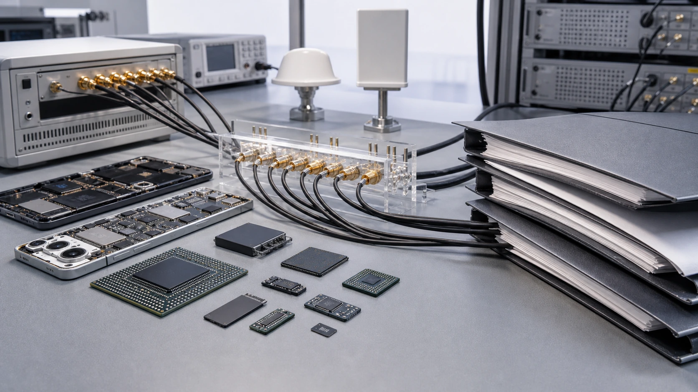
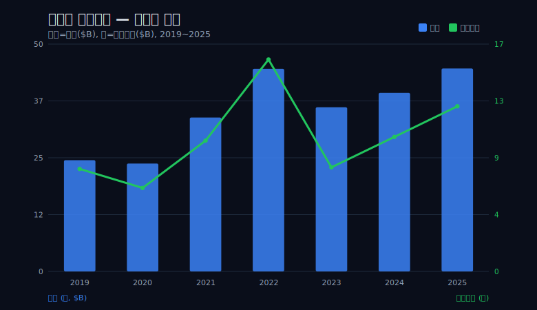
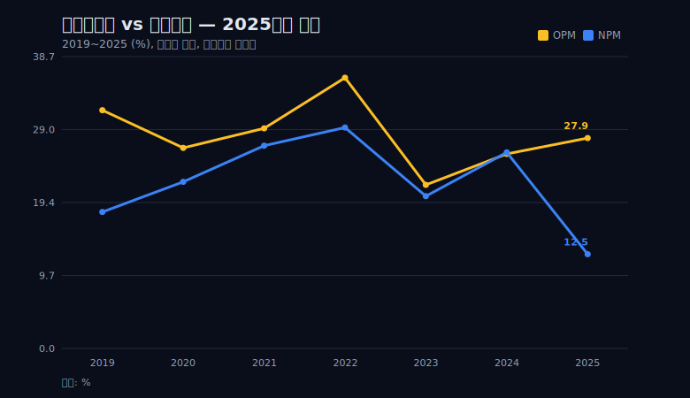
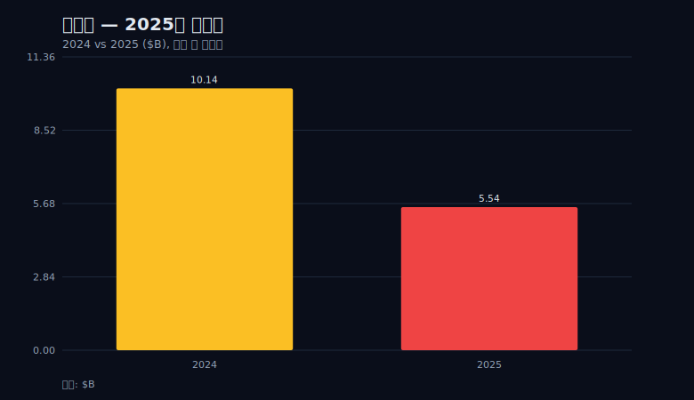
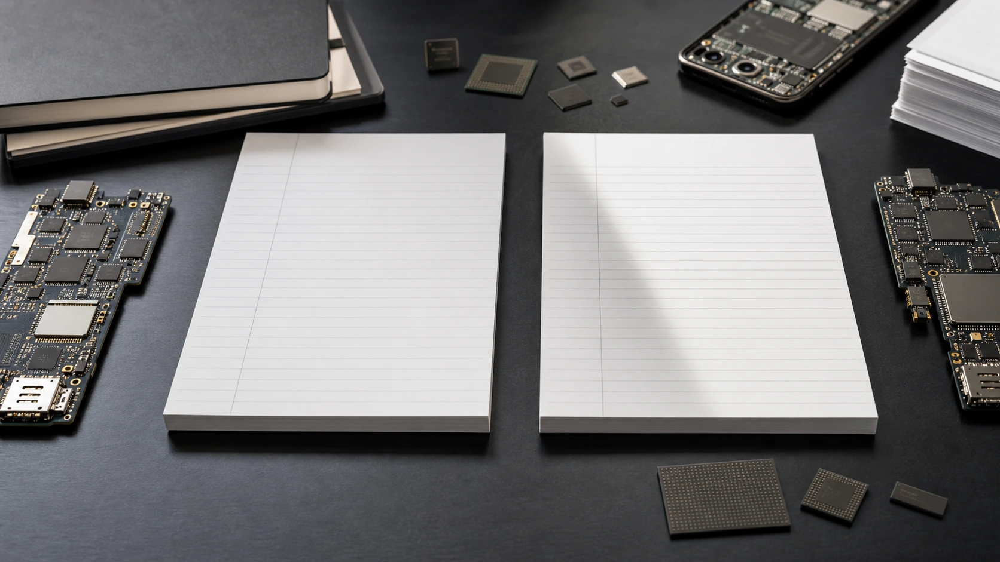
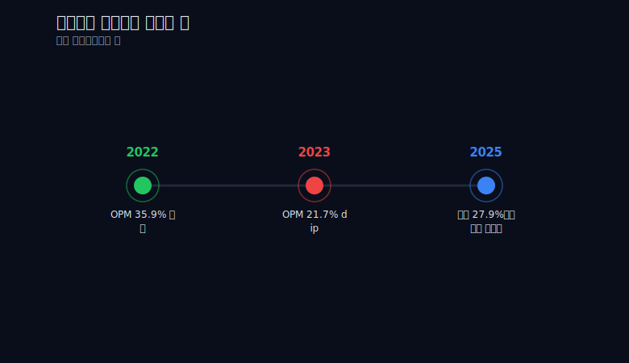
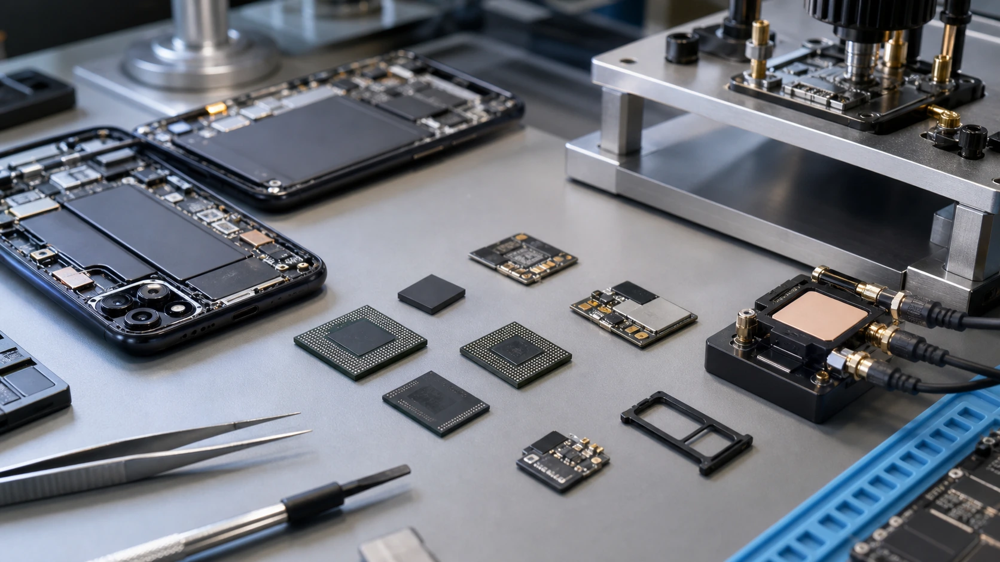

> **데이터 기준**: 2026-06-14 dartlab 실측 — Qualcomm(QCOM) 미국 연결(USD), 분기→역년 합산. (세그먼트 등 손익 밖은 10-K/IR/언론 외부 인용).
> **핵심 숫자**: 2025 매출 44.28B(사상 최대) · 영업이익 12.36B(영업이익률 27.9%) · 순이익 5.54B(순이익률 12.5%) · 영업활동현금흐름 14.01B(7개년 최고).
> **이 글의 용어**: 영업이익률(매출 대비 영업이익 비율) · 순이익률(매출 대비 순이익 비율) · 영업활동현금흐름(실제로 장사해서 손에 들어온 현금) · below-line(영업이익 아래, 영업외손익·세금 칸).

---

## 프롤로그 — 순이익 하나로 회사를 판정하면 안 되는 이유

2025년 퀄컴의 손익계산서는 맨 윗줄과 맨 아랫줄이 정반대 표정을 짓고 있다. 매출은 44.28B달러로 7개년 중 사상 최대였고, 영업이익도 12.36B달러로 전년 10.07B보다 오히려 늘었다. 위에서 두 줄만 읽으면 좋은 해다. 그런데 같은 표의 맨 아랫줄, 순이익은 5.54B달러로 주저앉았다. 전년 순이익 10.14B의 거의 절반이다. 영업이익 12.36B에서 순이익 5.54B까지 내려오는 사이, 절반 이상이 어디론가 사라졌다.

숫자 한 쌍을 비율로 바꾸면 괴리가 더 또렷하다. 영업이익률(매출 대비 영업이익 비율)은 27.9%로 멀쩡하다. 그런데 순이익률(매출 대비 순이익 비율)은 2024년 26.0%에서 2025년 12.5%로 거의 반토막 났다. 본업을 재는 자(영업이익률)는 흔들리지 않았는데, 회사 전체를 재는 자(순이익률)만 절반으로 꺾였다. 같은 회사, 같은 1년인데 어느 줄을 보느냐에 따라 결론이 갈린다.

이 글의 질문은 한 줄이다. 영업이 멀쩡한데 순이익만 반토막이면, 그 차이는 어디서 왔나. 손익계산서는 매출에서 시작해 매출원가·판매관리비를 빼면 영업이익이 나오고, 그 아래로 영업외손익과 법인세를 더 빼야 비로소 순이익이 된다. 영업이익까지가 '본업'의 영역이라면, 영업이익에서 순이익으로 내려오는 칸은 본업 바깥의 영역이다. 영업선은 멀쩡한데 최종선만 꺾였다는 것은, 그 차이가 본업이 아니라 영업 아래(below-line)에서 왔다는 뜻을 가리킨다. 정확히 어떤 항목 때문인지는 뒤에서 외부 출처로만 다루고 단정하지 않는다. 다만 한 가지 결정적 단서를 미리 깔아 둔다. 순이익이 반토막인 그해, 영업활동현금흐름은 오히려 14.01B달러로 7개년 최고였다. 순이익과 현금이 이렇게 멀어질 때, 회사를 최종 숫자 한 줄로 판정하면 틀린다. 퀄컴 2025가 바로 그 교과서적 사례다.

## 1막 — 퀄컴은 무엇으로 돈을 버는가: 칩(QCT)과 라이선스(QTL)

괴리를 읽기 전에 회사가 어떻게 돈을 버는지부터 고정해야 한다. 퀄컴의 엔진은 둘이다. 하나는 칩을 설계하고 파는 사업(QCT), 다른 하나는 무선통신 표준특허에 대한 로열티를 받는 라이선스 사업(QTL)이다. 스마트폰 안에 들어가는 모뎀·AP 칩을 만들어 파는 쪽이 앞이고, 셀룰러 표준을 쓰는 기기에서 특허 사용료를 받는 쪽이 뒤다. 세그먼트별 매출·이익 수치는 이번 검증 데이터에 포함되지 않아 금액을 단정하지 않는다. 다만 둘의 손익 성격이 다르다는 점은 전체 손익계산서의 마진 구조에서 드러난다.

라이선스 사업은 구조적으로 매출총이익률(물건을 팔고 그 원가를 빼면 남는 비율)이 높다. 추가로 칩 하나를 더 파는 데는 부품·제조 원가가 따라붙지만, 이미 보유한 특허에 로열티를 한 건 더 받는 데는 추가 원가가 거의 들지 않기 때문이다. 이 구조는 dartlab 분기 실측에서 그대로 확인된다.

```python
import dartlab
c = dartlab.Company("QCOM")
is_q = c.select("IS", freq="Q")   # 분기 손익계산서
# 2026Q1: 매출 12,252M, 매출원가 5,568M, 매출총이익 6,684M
# 매출총이익률 = 6,684 / 12,252 = 약 54.6%
```

2026Q1 기준 매출 122.52억달러에 매출원가가 55.68억달러, 매출총이익이 66.84억달러로 매출총이익률은 약 54.6%다. 매출의 절반 이상이 원가를 빼고도 남는다는 뜻이고, 이 높은 마진층이 영업이익률 27.9%를 떠받치는 토대다. 본업의 수익성 자체는 흔들리지 않았다는 점을 데이터로 먼저 못 박는다.

다만 '로열티는 가만히 앉아서 버는 공짜돈'이라는 통념은 경계해야 한다. 라이선스 모델은 협상과 소송, 재계약 비용을 동반한다. 통행료를 받는 자리에 있다는 것이 곧 무비용을 뜻하지는 않는다. 표준특허의 가치는 분쟁을 통해 끊임없이 재확인되며, 그 분쟁이 어떤 해에는 최종선에 큰 흔적을 남긴다. 뒤에서 보겠지만 퀄컴의 역사는 바로 그 흔적의 기록이기도 하다.



## 2막 — 영업선은 멀쩡하다: 2019~2025 영업이익률의 궤적

본업이 멀쩡하다고 말하려면 한 해가 아니라 궤적으로 증명해야 한다. 영업이익률 시계열을 펴면 퀄컴의 본업은 부침은 있되 무너지지 않았다는 것이 보인다. 2019년 31.6%에서 출발해 2022년 35.9%로 정점을 찍었고, 2023년에는 21.7%까지 내려앉았다가 2025년 27.9%로 회복했다.

```python
import dartlab
c = dartlab.Company("QCOM")
# 분기 손익을 역년으로 합산해 OPM(영업이익률) 궤적 확인
# 2019 31.6% → 2022 35.9%(정점) → 2023 21.7%(dip) → 2025 27.9%
```

여기서 두 번의 하강은 성격이 다르다. 2023년의 dip은 영업이익률 자체가 21.7%까지 떨어진 사건이다. 매출이 44.20B(2022)에서 35.82B(2023)로 줄고 영업이익이 15.86B에서 7.79B로 반토막 났다. 스마트폰 수요 부진이 매출과 영업이익을 동시에 끌어내린, 본업 안에서 일어난 진짜 수요 사건이다. 반면 2025년은 다르다. 영업이익률은 27.9%로 견고하고 영업이익도 12.36B로 늘었다. 본업 안에서는 아무 일도 없었다. 둘은 같은 '나쁜 결과'처럼 보여도 발생한 위치가 다르다. 2023은 영업선 위에서, 2025는 영업선 아래에서 일이 벌어졌다.

매출 규모도 함께 보면 본업의 체격이 커졌음을 알 수 있다. 매출은 2019년 24.27B에서 2025년 44.28B로 약 1.82배가 됐다. 2025년 영업이익 12.36B은 2024년 10.07B을 웃돌았다. 영업선만 떼어 읽으면 2025년은 분명히 좋은 해였다.





위 두 선이 2025년에 처음으로 크게 갈라진다는 점이 이 글의 출발점이다. 2019~2024년에는 영업이익률과 순이익률이 손을 잡고 비슷하게 움직였다. 그런데 2025년 한 해에만 영업이익률은 27.9%로 버티는데 순이익률만 12.5%로 떨어져 둘 사이가 15%포인트 넘게 벌어졌다. 본업을 재는 선은 그대로인데 최종선만 떨어졌다는 시각 증거다.

## 3막 — 최종선만 샜다: 영업이익 12.36B vs 순이익 5.54B의 거리

이 글의 심장이다. 2025년 영업이익은 12.36B인데 순이익은 5.54B다. 영업이익의 절반도 순이익으로 내려오지 못했다. 영업선과 최종선 사이에서 6.82B달러가 사라진 셈이다.

이 괴리가 비정상이라는 것을 입증하려면 정상 연도와 나란히 놓아야 한다. 회의론자는 정당하게 이렇게 지적할 수 있다. "영업이익과 순이익 사이에는 원래 세금과 영업외손익이 있다. 둘이 갈리는 건 당연한 일 아닌가." 맞는 말이다. 그래서 '당연한 괴리'와 '비정상 괴리'를 구분해야 한다. 바로 전해인 2024년을 보면 영업이익 10.07B에서 순이익 10.14B로, 오히려 순이익이 영업이익보다 살짝 높게 내려왔다. 영업이익 아래 칸(영업외손익)이 그해에는 순플러스였다는 뜻이다. 즉 정상 연도에는 영업이익이 거의 그대로, 때로는 더 늘어 순이익이 된다.

```python
import dartlab
c = dartlab.Company("QCOM")
# 2024년: 영업이익 10.07B → 순이익 10.14B (거의 그대로, 영업외 순플러스)
# 2025년: 영업이익 12.36B → 순이익 5.54B (절반 이상 증발)
# 같은 회사인데 영업→순익 전환율이 한 해 만에 100% → 45%로 붕괴
```

2024년에는 영업이익에서 순이익으로 100% 넘게 내려왔는데, 2025년에는 45% 남짓밖에 내려오지 못했다. 같은 회사, 1년 차이인데 영업이익을 순이익으로 바꾸는 전환율이 절반 아래로 무너졌다. 이것은 세금과 영업외가 늘 존재한다는 '당연한 괴리'로 설명되지 않는다. 통상 범위를 한참 벗어난 괴리다.



여기서 멈춰야 한다. '왜냐하면 X 때문'이라고 단정하고 싶은 유혹이 가장 큰 지점이지만, 정확히 어느 칸에서 6.82B가 빠졌는지는 검증 데이터의 숫자만으로 항목을 특정할 수 없다. 영업이익 아래에는 영업외손익, 법률·합의 같은 일회성, 법인세(유효세율 변동·일회성 세무항목)가 차례로 있다. 이 중 어디서 빠졌는지를 가리키는 다음 단서로 넘어간다.

## 4막 — 그 차이는 영업 밖에서 왔다: below-line을 읽는 법

손익계산서는 위에서 아래로 떨어지는 폭포다. 매출에서 매출원가를 빼면 매출총이익, 거기서 판매관리비를 빼면 영업이익까지가 '본업' 구간이다. 그 아래로 영업외손익을 가감하면 법인세차감전이익(profit_before_tax)이 되고, 마지막으로 법인세를 빼야 순이익이 된다. 영업이 멀쩡한데 순이익만 꺾였다면, 범인이 숨은 칸은 영업이익 아래 어딘가다. 일회성 비용, 법률·합의, 세금 같은 항목이 후보다.

이 글이 할 수 있는 가장 정직한 일은 '범인 찾기'가 아니라 '범인이 어느 층에 있는지 좁히는 법'을 보여 주는 것이다. dartlab 분기 실측에서 법인세차감전이익을 보면 단서가 하나 나온다.

```python
import dartlab
c = dartlab.Company("QCOM")
is_q = c.select("IS", freq="Q")
# 2026Q1: 영업이익 3,366M, 법인세차감전순이익 3,547M
# 영업외 단계까지는 이익이 오히려 영업이익보다 약간 높게 유지된다
```

2026Q1 기준으로 영업이익은 33.66억달러인데 법인세차감전이익은 35.47억달러로, 오히려 영업이익보다 높다. 영업외손익 단계까지 내려오는 동안 이익이 줄기는커녕 약간 늘었다는 뜻이다. 영업외(이자·투자손익 등) 칸에서 큰 출혈이 있었다면 이 숫자가 영업이익보다 낮아야 하는데 그렇지 않다. 이 정황은 연간 순이익을 깎은 힘이 영업외 칸보다 더 아래, 즉 법인세 등 마지막 칸 쪽일 가능성을 가리킨다.

다만 이 분기 한 컷의 관계가 2025년 연간 전체의 below-line 구조를 그대로 설명한다고 단정해서는 안 된다. 분기와 연간은 단위가 다르고, 일회성 항목은 특정 분기에 몰릴 수 있다. 정확히 어느 항목에서 얼마가 빠졌는지(유효세율 변동인지, 일회성 세무항목인지, 법률 합의인지)는 10-K(연차보고서)와 IR 자료로만 확정된다. 이 글은 항목을 단일 원인으로 지목하지 않는다. 손익계산서의 구조상 '영업 밖에서 왔다'까지가 데이터로 말할 수 있는 선이고, '어떤 항목인지'는 외부 출처로 이월한다. 이 경계를 지키는 것이 이 글의 정직성 핵심이다.



## 5막 — 현금은 거짓말을 덜 한다: 영업현금흐름 14.01B 사상 최고

순이익이 반토막인 해에 대한 가장 강한 반증은 현금흐름표에 있다. 2025년 영업활동현금흐름(실제로 장사해서 손에 들어온 현금)은 14.01B달러로 7개년 중 최고다. 순이익 5.54B은 이 영업현금흐름의 40%에도 못 미친다.

보통 회사는 순이익과 영업현금흐름이 비슷하게 움직인다. 이익을 냈으면 그만큼 현금이 들어오고, 손실을 냈으면 현금도 마른다. 그런데 2025년 퀄컴은 순이익이 절반으로 꺾였는데 현금은 오히려 사상 최고를 찍었다. 이 큰 격차가 결정적 단서다. 순이익을 깎아내린 항목이 실제로 현금을 들고 회사 밖으로 나가지는 않았다는 뜻이기 때문이다. 현금을 동반하지 않고 장부상 이익만 깎는 항목 — 비현금성 또는 일회성 성격의 항목 — 이 최종선을 눌렀을 가능성을 가리킨다.

```python
import dartlab
c = dartlab.Company("QCOM")
cf = c.select("CF", freq="Q")  # 분기 현금흐름표 → 역년 합산
# 영업활동현금흐름: 2019 7.29 → 2021 10.54 → 2024 12.20 → 2025 14.01 (B달러)
# 2025 순이익 5.54B은 영업현금흐름 14.01B의 40% 미만
```

여기서도 회의론자의 반론을 정면으로 받아야 한다. "영업현금흐름이 사상 최고라지만, 운전자본 타이밍이나 일회성 현금 유입으로 한 해 부풀 수도 있다. 본업 호조의 증거로 과해석하면 안 된다." 타당한 경계다. 그래서 단년이 아니라 추세로 봐야 한다. 영업현금흐름은 2019년 7.29B에서 2021년 10.54B, 2024년 12.20B, 2025년 14.01B로 계단을 밟아 올라왔다. 한 해 튄 게 아니라 여러 해에 걸쳐 우상향한 추세선이다. 따라서 이 글은 '본업의 현금 창출력이 강해졌다'까지만 주장한다. 운전자본을 분해해 어느 항목이 현금을 끌어올렸는지는 검증 범위 밖이며, 그 분해 없이 '본업이 역대급으로 좋았다'고 단정하지는 않는다.

그럼에도 결론의 방향은 분명하다. 순이익만 보면 위기처럼 보이는 해였지만, 현금흐름까지 펴 보면 정반대 그림이 나온다. 이것이 '최종 숫자 하나로 회사를 판정하지 말라'는 이 글의 관통선을 떠받치는 가장 강한 증거다.

## 6막 — 데자뷰: 2018년에도 똑같이 순손실이 났었다

영업선과 최종선을 분리해 읽어야 하는 회사라는 정체성은 2025년에 처음 드러난 게 아니다. 7년 전에도 똑같은 모양이었다. 2018년 퀄컴은 순손실 -4.86B달러를 냈다. 그 역시 애플과의 라이선스 분쟁, 그리고 미국 세제개편(Tax Cuts and Jobs Act)에 따른 일회성 세무 효과 등 영업 밖 사건이 겹친 결과로 알려져 있다(외부 인용). 이 인과는 dartlab 실측으로 검증한 사항이 아니라 외부 맥락임을 명시한다.

dartlab 분기 데이터로 봐도 그 시기의 영업선은 최종선만큼 깊게 무너지지 않았다. 2018Q4 영업이익은 -0.65B로 분기 단위로는 손실이었지만, 같은 해 다른 분기(2018Q3 0.93B 등)는 흑자였다. 연간 순손실 -4.86B의 깊이는 영업 자체의 부진만으로는 설명되지 않고, 그 아래 칸(분쟁·세무)이 함께 작용했음을 가리킨다. 그리고 그 다음 해 회사는 정상 궤도로 돌아왔다.



여기서 두 가지를 동시에 잡아야 한다. 한편으로, 2018과 2025는 '영업은 버티는데 최종선만 영업 밖 사건으로 꺾였다'는 같은 패턴을 공유한다. 이것은 퀄컴이라는 회사가 손익계산서를 끝줄까지 읽어야 정체가 보이는 유형임을 두 번에 걸쳐 보여 준다. 다른 한편으로, '2018에도 일회성으로 끝났고 다음 해 회복했으니 2025도 당연히 회복한다'는 비약은 경계해야 한다. 과거의 일회성이 미래의 회복을 보증하지는 않는다. 2025년의 below-line 구멍이 어떤 항목이었고 일회성이었는지는, 앞서 말했듯 10-K/IR로 확인할 사항이다. 패턴의 유사성은 '같은 독법으로 읽어야 한다'까지만 말해 주지, '같은 결말이 온다'를 약속하지 않는다.

## 7막 — 같은 가치사슬, 다른 경제학: 동종사와 나란히 놓으면 보이는 것

퀄컴의 손익 구조를 더 선명하게 보려면 같은 반도체·모바일 가치사슬에 선 회사들과 나란히 놓아야 한다. 같은 사슬이라도 돈을 버는 자리와 손익이 흔들리는 자리가 회사마다 다르다. 아래는 '돈 버는 자리'와 '손익 성격'의 차이를 보이려는 정성 비교이며, 마진율 한 줄로 우열을 매기려는 표가 아니다.

| 회사 | 사슬 위 자리 | 손익 성격의 한 줄 차별점 |
|---|---|---|
| 퀄컴(QCOM) | 모뎀·AP 칩 + 표준특허 로열티 | 높은 영업마진 + 영업 밖 사건에 크게 흔들리는 최종선 |
| [ARM](/blog/ARM-arm-holdings) | 설계 IP 라이선스 | 칩을 직접 안 만들고 설계 IP·로열티로 버는 모델 |
| [엔비디아](/blog/NVDA-nvidia) | GPU·가속기 | 제품 가격결정력으로 마진을 끌어올리는 구조 |
| [AMD](/blog/AMD-amd) | CPU·GPU 경쟁 | 경쟁 격전지에서 점유율과 마진을 함께 겨루는 구조 |
| [브로드컴](/blog/AVGO-broadcom) | 칩 + 인프라 소프트웨어 | 인수합병으로 사업 포트폴리오를 조립한 구조 |
| [애플](/blog/AAPL-apple) | 완제품·최대 고객 | 퀄컴 칩을 사가는 최대 고객이자 과거 분쟁 상대 |
| [삼성전자](/blog/005930-samsung) | 메모리·파운드리·완제품 | 핵심 고객이자 파운드리 축으로 얽힌 양면 관계 |

이 표에서 퀄컴의 특징은 '높은 영업마진 + 변동성 큰 최종선'으로 요약된다. 라이선스의 높은 마진이 영업선을 위로 끌어올리지만, 바로 그 라이선스를 둘러싼 분쟁과 세무 사건이 어떤 해에는 최종선을 아래로 끌어내린다. 같은 사슬의 다른 회사들은 손익이 흔들리는 자리가 대체로 영업선 위(수요·가격·점유율)인 데 비해, 퀄컴은 영업선 아래(분쟁·세무)에서 흔들린 이력을 두 번 남겼다. 가치사슬은 같아도 회사가 사는 경제학은 이렇게 다르다.

## 8막 — 그래서 2026년 퀄컴을 볼 때 봐야 할 다섯 줄

순이익 한 줄로 회사를 읽지 않으려면, 2026년 퀄컴을 볼 때 따라가야 할 선이 다섯 개다. 목표주가나 매수·매도 의견이 아니라, 손익계산서를 끝줄까지 읽는 체크포인트다.

첫째, 영업이익률이 27% 선을 지키는가. 본업의 건전성을 재는 첫 줄이다. 이 선이 무너지면 그건 영업 밖이 아니라 본업 안의 문제다.

둘째, 순이익이 다시 영업이익에 근접해 내려오는가. 2024년처럼 영업이익에서 순이익으로 거의 그대로 내려오면 below-line이 정상화됐다는 신호고, 2025년처럼 절반이 새면 영업 밖 사건이 이어진다는 신호다.

셋째, 유효세율과 일회성 세무항목의 추이. 2025년 급감의 직접 출처를 확인하는 줄이다. 이 항목은 검증 데이터로는 특정할 수 없으므로 10-K/IR에서 직접 봐야 한다.

넷째, 영업현금흐름이 순이익을 계속 크게 웃도는가. 격차가 유지되면 최종선을 누른 항목이 비현금성이라는 해석이 강화되고, 격차가 좁혀지면 본업 현금 창출과 이익이 다시 한 몸으로 움직인다는 뜻이다.

다섯째, QTL 로열티 분쟁·재계약 동향(외부). 퀄컴의 최종선을 흔드는 사건이 주로 여기서 나온다는 것을 역사가 두 번 보여 줬다.

여기에 재무분석가가 남긴 추가 질문 하나를 덧붙인다. 매출총이익률 약 55%에서 영업이익률 약 28%로 내려오는 사이에는 연구개발비를 비롯한 영업비용이 빠진다. 2025년 영업이익률 27.9%가 비용을 더 잘 통제해서 나온 것인지, 아니면 매출 믹스(고마진 라이선스 비중)가 바뀌어서 나온 것인지는 별도 검증표로 따로 묶어야 할 질문이다. 이 글의 검증 데이터는 그 분해까지는 담지 않으므로, 영업마진의 '질'에 대한 판단은 열어 둔다.

마지막은 판단으로 닫는다. 순이익 한 줄만 보고 퀄컴을 '반토막 난 회사'라 부르면 틀린다. 영업이익은 12.36B로 늘었고 영업현금흐름은 14.01B로 사상 최고였으며, 최종선의 구멍은 본업이 아니라 영업 밖에서 생겼다. 회사를 판정하려면 손익계산서를 끝줄까지, 그리고 현금흐름표까지 같이 읽어야 한다.

## 에필로그 — 손익계산서를 끝줄까지 읽는 습관

매출에서 영업이익, 영업이익에서 순이익으로 이어지는 흐름은 위에서 아래로 떨어지는 폭포다. 각 칸 사이에서 회사의 진짜 이야기가 갈린다. 위 두 줄(매출·영업이익)은 본업이 부르는 노래고, 아래 칸(영업외·세금)은 본업 바깥의 사정이다. 퀄컴 2025는 '영업은 멀쩡, 최종선만 샘'의 교과서적 사례였다. 영업선은 27.9%로 버텼고, 최종선은 12.5%로 꺾였으며, 현금선은 14.01B로 오히려 사상 최고였다.



세 줄을 따로, 그리고 같이 읽는 독법을 남긴다. 영업선으로 본업의 체력을, 최종선으로 그해 영업 밖에서 무슨 일이 있었는지를, 현금선으로 그 일이 정말 현금을 들고 나갔는지를 본다. 어느 한 줄도 혼자서는 회사를 다 말하지 못한다. 퀄컴이 가르쳐 준 것은 이것 하나다. 맨 아랫줄 숫자가 절반으로 줄었다고 회사가 절반이 된 건 아니다. 그 숫자가 어디서 줄었는지를 읽어야 한다.

---

### 출처와 더 읽을거리

데이터는 [SEC 10-K(EDGAR)](https://www.sec.gov/cgi-bin/browse-edgar?action=getcompany&CIK=QCOM&type=10-K)와 [퀄컴 IR](https://investor.qualcomm.com)에서 원문을 확인할 수 있다. 영업이익률·순이익 시계열의 외부 교차 확인은 [Macrotrends 영업이익률](https://www.macrotrends.net/stocks/charts/QCOM/qualcomm/operating-margin)과 [Macrotrends 순이익](https://www.macrotrends.net/stocks/charts/QCOM/qualcomm/net-income)을, 분쟁·재계약 같은 손익 밖 서사의 최신 동향은 [Reuters QCOM](https://www.reuters.com/markets/companies/QCOM.O)을 참고한다.

### 용어 사전

- **영업이익률(OPM)**: 매출 대비 영업이익 비율. 본업의 수익성을 잰다.
- **순이익률(NPM)**: 매출 대비 순이익 비율. 영업외·세금까지 다 빼고 남은 최종 수익성을 잰다.
- **영업활동현금흐름(OCF)**: 실제로 영업을 해서 손에 들어온 현금. 장부상 이익과 달리 비현금 항목에 덜 흔들린다.
- **below-line**: 손익계산서에서 영업이익 아래 칸(영업외손익·법인세). 본업 바깥의 손익이 잡히는 자리.
- **법인세차감전이익(profit before tax)**: 영업외손익까지 반영하고 법인세는 아직 빼기 전의 이익.
