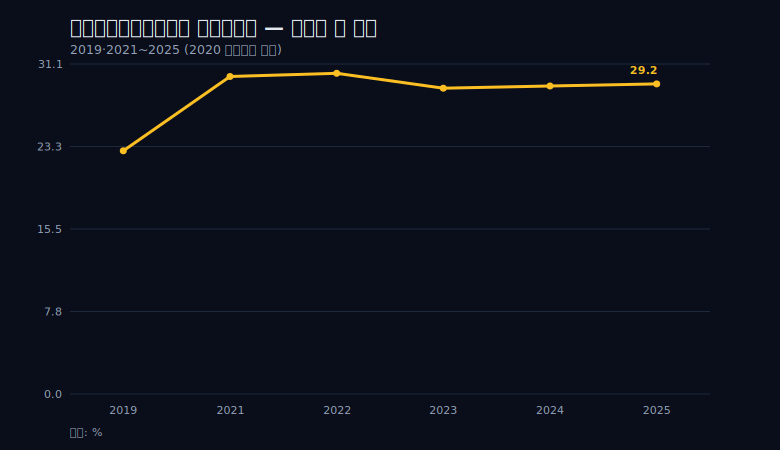
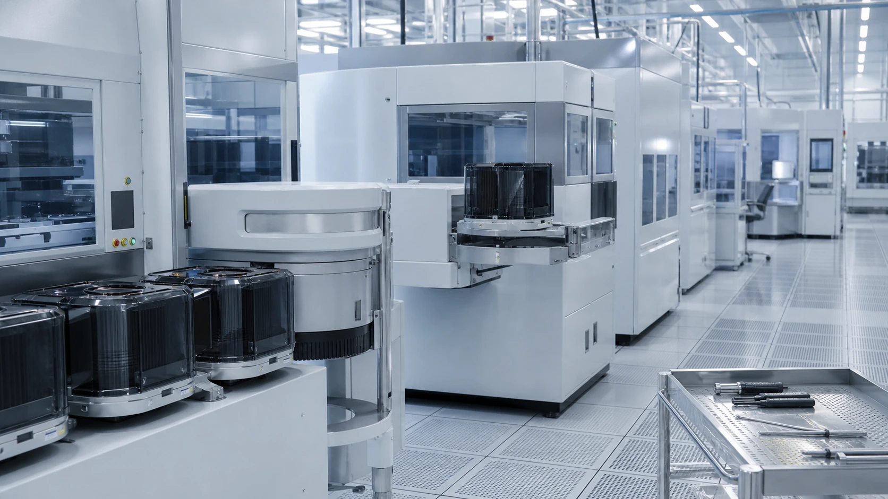
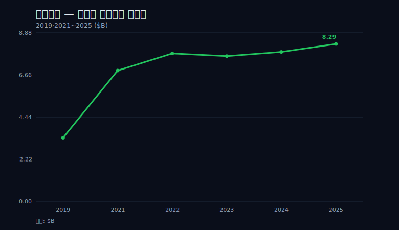
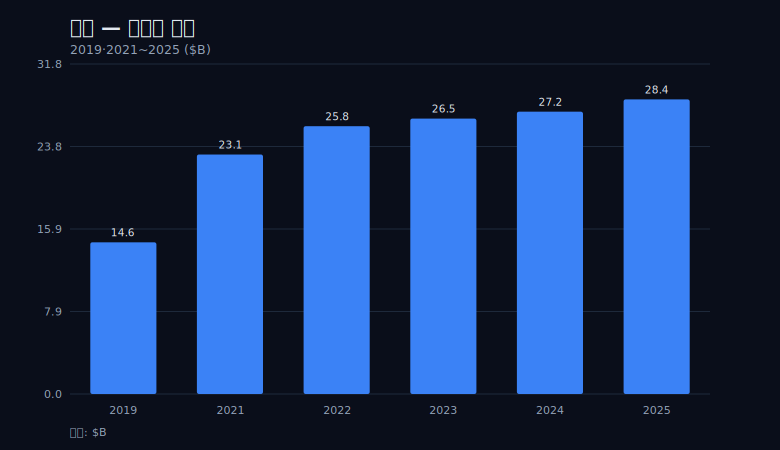
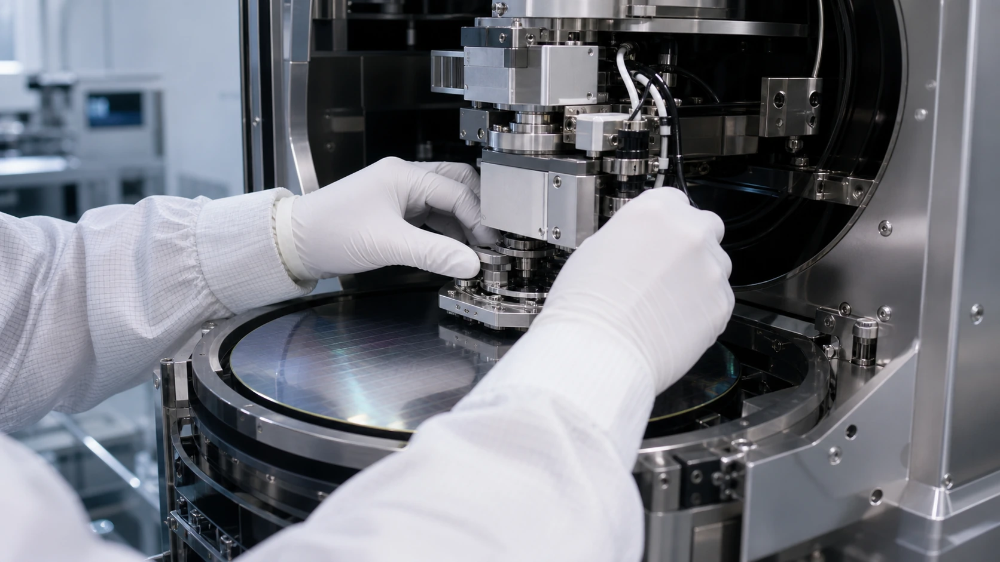
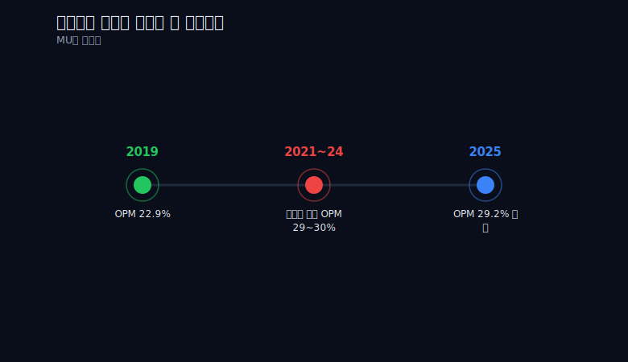
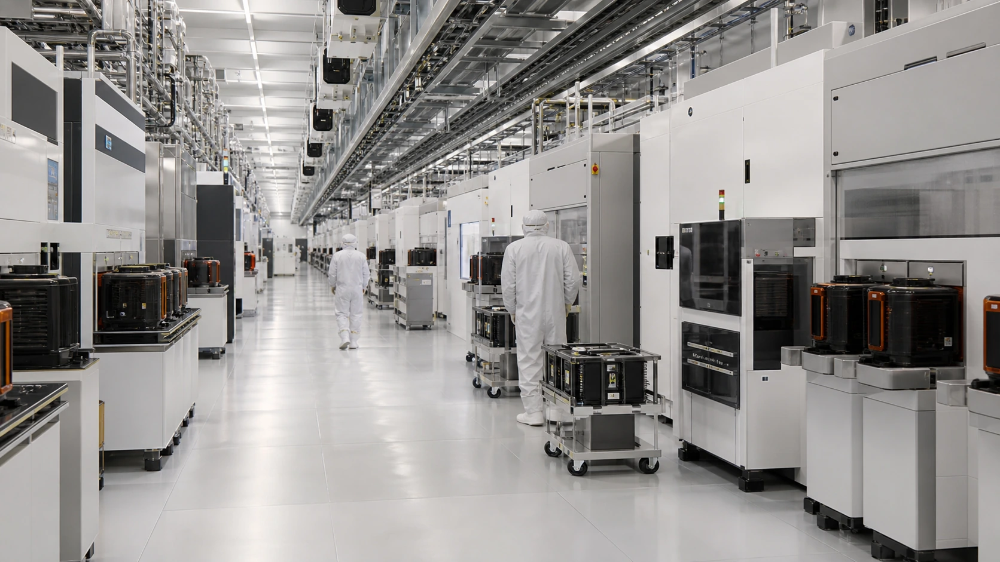

> **데이터 기준**: 2026-06-20 dartlab 실측 — Applied Materials(AMAT) 미국 연결(USD), 분기→역년 합산. 최신 공시 보강은 2026 Q2 10-Q(분기 종료 2026-04-26)와 FY2025 10-K 기준.
>
> **핵심 숫자**: 매출 14.61B(2019)→28.37B(2025), 영업이익률(매출 대비 영업이익) 2021~2025년 28.8~30.2% 밴드, 순이익률(매출 대비 순이익) 26.4%(2024)→24.7%(2025).
>
> **이 글의 용어**: OPM=영업이익률, NPM=순이익률, capex=설비투자, commodity=값이 시장에서 정해지는 상품. 모두 첫 등장 시 한국어로 풀어 쓴다.

---

## 프롤로그 — 같은 사이클, 갈라진 두 마진

반도체는 사이클 산업이다. 2021년부터 2025년까지 메모리 칩값은 한 번 끓어오르고 한 번 무너졌다. 같은 바람을 두 회사가 맞았는데, 손익계산서에 찍힌 결과는 정반대였다.

한쪽은 메모리 회사 마이크론이다. 다운사이클에서 영업이익률(매출 대비 영업이익)이 마이너스 영역까지 출렁였다. 칩값이 무너지면 매출은 빠지는데 공장과 매출원가는 그대로 남기 때문이다. 외부 대조 자료 기준으로 이 출렁임은 영업이익률 −37% 수준까지 내려간 적이 있다(이 수치는 마이크론이라는 별개 회사의 외부 데이터이며, 이 글의 AMAT 실측표와는 섞지 않는다).

다른 한쪽이 이 글의 주인공, 어플라이드머티리얼즈(AMAT)다. 같은 반도체 산업, 같은 고객, 같은 사이클을 지나는 동안 영업이익률은 약 29~30%에서 거의 흔들리지 않았다. dartlab 실측으로 2021년 29.9%, 2022년 30.2%, 2023년 28.8%, 2024년 29.0%, 2025년 29.2%. 다섯 해를 통틀어 가장 높은 해와 가장 낮은 해의 차이가 1.4%포인트밖에 되지 않는다.

그 사이 매출은 멈춰 있지 않았다. 2019년 14.61B 달러에서 2025년 28.37B 달러로, 7년 만에 약 1.9배가 됐다(역년 합산, 단위 $B, 미국 연결 USD). 매출은 거의 두 배가 됐는데 마진의 높이는 그대로 평탄했다.



이 글의 입구는 단순한 질문 하나다. 같은 사이클인데 왜 한쪽은 적자고 한쪽은 29%인가. 답을 미리 한 줄로 말하면 이렇다. 마이크론은 칩을 팔고, 어플라이드는 그 칩을 *만드는 장비*와 그 장비를 평생 돌보는 서비스를 판다. 같은 사이클의 한복판에서도 무엇을 파느냐가 마진의 바닥을 가른다.

이 첫 문장을 dartlab으로 그대로 불러보면 다음과 같다.

```python
import dartlab

# Applied Materials 손익계산서, 분기 단위로 받아 역년 합산
amat = dartlab.Company("AMAT")
income = amat.select("IS", freq="Q")

# 분기 매출/영업이익을 역년(calendar year)으로 묶어 OPM 산출
# 회계연도가 10월말 결산이라 FY가 아니라 역년 기준으로 재조립한 값
```



---

## 1막 — 마진은 어디서 갈라지나: 칩이 아니라 장비를 판다

같은 사이클, 같은 산업인데 왜 마진의 바닥이 다른가. 답은 손익계산서가 아니라 그 위쪽, 두 회사가 *무엇을 파느냐*에 있다.

마이크론이 파는 것은 DRAM과 NAND다. 이것은 commodity, 즉 값이 시장에서 정해지는 상품이다. 한 회사의 칩이 다른 회사의 칩보다 본질적으로 더 비싸기 어렵다. 그래서 공급이 수요를 앞지르면 칩값은 빠르게 무너진다. 문제는 칩값이 무너져도 그 칩을 만든 공장, 감가상각, 인건비, 재료비는 줄지 않는다는 점이다. 매출은 가격을 따라 내려가는데 매출원가는 버티니, 영업이익률이 마이너스 영역으로 떨어진다. 다운사이클의 적자는 경영의 실패가 아니라 commodity라는 상품의 구조 그 자체다.

어플라이드가 파는 것은 그 칩을 *만드는 장비*다. 실리콘 웨이퍼 위에 물질을 한 층씩 쌓는 증착, 깎아내는 식각, 불순물을 박아 넣는 이온주입 같은 공정 장비다. 칩이 commodity라면 장비는 그 반대편에 가깝다. 고객(메모리·파운드리 회사)이 더 미세한 칩, 더 새로운 구조의 칩을 만들려면 새 장비가 필요하고, 그 장비를 다룰 수 있는 회사는 손에 꼽힌다. 게다가 장비는 한 번 팔고 끝이 아니다. 공장에 들어간 장비는 수명 내내 정비·부품·업그레이드라는 서비스 매출을 만든다. 이 서비스 매출은 칩값처럼 출렁이지 않고 쌓인다.

흔히 쓰는 비유가 골드러시에 곡괭이를 판 자다. 다만 이 비유를 후킹 한 줄로만 쓰고 끝내면 클리셰가 된다. 핵심은 비유가 아니라 가격결정 구조다. 금값(=칩값)은 시장이 정하니 광부(=메모리 회사)는 가격 변동을 온몸으로 맞는다. 반면 곡괭이(=장비)는 만든 사람이 값을 매기고, 곡괭이 정비(=서비스)는 채굴이 계속되는 한 들어온다. commodity 칩과 recurring 장비/서비스의 차이가, 같은 광산(=사이클)에서 두 사람의 손익을 가른다.

검증 데이터로 보이는 것은 이 구조의 *결과*뿐이다. 어플라이드의 영업이익률은 2019년 22.9%에서 2021년 이후 약 29~30%로 올라 평탄하게 유지됐다. 영업이익 자체도 2019년 3.35B에서 2025년 8.29B로 약 2.5배가 됐다.



여기서 분명히 선을 그어야 한다. '장비+서비스 믹스가 마진을 지탱했다'는 메커니즘은 손익 요약 한 줄로 증명되지 않는다. 어떤 세그먼트(장비·서비스·디스플레이)가 얼마를 벌었는지, 서비스 부문(AGS) 비중이 얼마인지는 손익계산서가 아니라 10-K 외부 자료에 있다. 그러니 이 글이 손익으로 말할 수 있는 것은 '영업이익률이 29%대에서 평탄했다'는 결과까지이고, '장비 믹스 때문이다'는 그 결과를 설명하는 *손익 밖 외부 서사*로 보인다까지만 쓴다.

```python
# 연도별 영업이익률(OPM)을 직접 재현하는 맥락
# rev, oi 는 각 역년 합산값 ($B)
years = {
    2019: (14.61, 3.35),
    2021: (23.06, 6.89),
    2022: (25.79, 7.79),
    2023: (26.52, 7.65),
    2024: (27.18, 7.87),
    2025: (28.37, 8.29),
}
for y, (rev, oi) in years.items():
    print(y, "OPM%", round(oi / rev * 100, 1))
# 2021~2025: 29.9 / 30.2 / 28.8 / 29.0 / 29.2 → 1.4%p 밴드
```

---

## 2막 — 매출은 사이클을 타는데 마진은 안 탄다

고객이 사이클을 타면 어플라이드도 사이클을 타는가. 매출은 분명히 탄다. 어플라이드의 매출은 고객의 capex, 즉 설비투자 결정에 직접 묶여 있다. 메모리·파운드리 회사가 새 공장을 짓고 라인을 증설하기로 결정하면 장비 주문이 쏟아지고, 그 결정을 미루면 주문이 식는다. 어플라이드의 매출은 고객의 capex 사이클을 따라 출렁이는 구조다.

실측으로 그 출렁임을 따라가 보면 이렇다. 2019년 14.61B에서 2021년 23.06B로 급등했고, 2022년 25.79B, 2023년 26.52B, 2024년 27.18B, 2025년 28.37B로 움직였다. 절대 액수만 보면 꾸준한 우상향이지만, 연간 증가폭을 보면 2021년의 큰 점프 이후 증가 속도가 한 자릿수대로 완만해졌다 다시 붙는 식의 호흡이 보인다. 매출은 사이클의 리듬을 분명히 탄다.



그런데 같은 구간의 영업이익률을 겹쳐 보면 그림이 달라진다. 매출이 14.61B에서 28.37B로 거의 두 배가 되는 동안, 영업이익률은 29.9 → 30.2 → 28.8 → 29.0 → 29.2%로 1.4%포인트 안에 머물렀다. 매출의 *높이*는 사이클을 따라 크게 움직였지만, 마진의 *폭*은 좁았다.

이 '폭이 좁다'가 핵심이다. 마이크론은 같은 외부 사이클에서 영업이익률이 마이너스 영역까지 출렁였다(외부 대조 수치). 어플라이드는 가장 좋은 해와 가장 나쁜 해의 영업이익률 차이가 1.4%포인트다. 매출이 사이클을 타는 것은 둘 다 같지만, 그 매출이 손익의 바닥으로 전달되는 방식이 다르다. 칩 회사는 매출이 빠질 때 마진이 함께 무너지고, 장비 회사는 매출이 출렁여도 마진의 밴드가 거의 그대로 유지된다. 이것이 두 회사가 갈라지는 핵심 분기점이다.

```python
# 매출은 타는데 마진은 안 탄다 — 매출 변화폭 vs OPM 변화폭 비교
rev_by_year = [14.61, 23.06, 25.79, 26.52, 27.18, 28.37]  # 2019, 2021~2025
opm_by_year = [22.9, 29.9, 30.2, 28.8, 29.0, 29.2]

# 2021~2025만 보면
opm_band = max(opm_by_year[1:]) - min(opm_by_year[1:])
print("OPM 밴드 폭(%p):", round(opm_band, 1))  # 1.4
# 매출은 23.06 → 28.37 로 +23% 움직이는 동안 마진은 1.4%p 안에서만 출렁
```

매출은 사이클을 타는데 마진은 안 탄다. 한 문장이지만, 마이크론과 어플라이드를 가르는 가장 중요한 한 문장이다.

---

## 3막 — 데이터가 보여주는 반론: 이 데이터엔 '다운사이클'이 없다

여기서 글을 잠시 멈추고, 가장 날카로운 반론을 정면으로 받는다. 우회하지 않는다.

회의론자는 이렇게 말할 수 있다. "당신이 내민 표를 다시 봐라. 매출은 2019년 14.61B에서 2025년 28.37B까지 *한 해도 줄지 않고* 매년 늘었다. 그렇다면 이 표가 직접 증명하는 것은 '어플라이드가 매출 급감을 29% 마진으로 버텼다'가 아니다. 단지 '꾸준히 매출이 늘어나는 구간에서 마진이 높게 평탄했다'일 뿐이다. 관통선의 핵심 동사인 '통과'가, 정작 데이터로 뒷받침되지 않는다."

이 반론은 옳다. 그리고 옳기 때문에 숨기지 않고 이 막 전체를 여기에 쓴다.

검증 데이터(2019~2025) 안에는 매출이 감소한 해가 단 하나도 없다. 매출이 꺾인 해에도 영업이익률이 버텼는가, 라는 '통과'의 진짜 증거는 이 7년 표 *밖*에 있다. 표 안의 매출은 줄곧 우상향이었으니, 이 표만으로는 '진짜 다운사이클을 29%로 통과한다'를 단정할 수 없다. 단정하면 데이터를 넘어서는 과장이다.

그래서 이 글은 주장 수위를 데이터에 맞게 낮춘다. '어플라이드는 어떤 다운사이클도 29%로 통과한다'는 것은 미래에 대한 약속이고 증명 불가능한 명제다. 이 글은 그 명제를 하지 않는다. 대신 데이터로 말할 수 있는 것은 두 가지다.

첫째, 어플라이드의 손익에는 마이크론 같은 *적자 변동성*이 없다. 7년 내내 영업이익률은 플러스였고, 2021년 이후로는 1.4%포인트 밴드 안에 있었다. 적자로 내려간 해는 없다. 이것은 표가 직접 보여주는 사실이다.

둘째, 매출이 꾸준히 성장하는 구간에서 어플라이드의 마진은 매우 높고 매우 평탄했다. 이것 역시 표가 직접 보여주는 사실이다.

그러니 이 글의 근거 있는 결론은 이렇다. 어플라이드의 손익 구조는 '마이크론 같은 적자 변동성이 없다'까지 단정할 수 있고, '어떤 미래 다운사이클도 29%로 통과한다'는 약속은 하지 않는다. 둘을 섞으면 데이터가 보장하지 않는 곳까지 미끄러진다.

그렇다면 이 양보는 글을 약하게 만드는가. 다음 막에서 보겠지만, 오히려 반대다. 양보를 인정하고 나면 *진짜* 분기점이 더 또렷해진다.



---

## 4막 — 그럼에도 분기점이 진짜인 이유: 2024년

다운사이클이 표 안에 없다면, 마이크론과의 대조는 무의미한가. 아니다. 표 안에 매출 감소 연도가 없다는 것과, 같은 외부 사이클의 *고비*가 없었다는 것은 다른 이야기다. 그리고 그 고비가 한 해 있었다.

2023~2024년은 메모리 업계에 혹독한 구간이었다. 메모리 칩값이 깊게 빠졌고, 메모리 중심인 마이크론은 이 구간에 영업적자를 찍었다(외부/별개 회사 데이터, AMAT 검증표와 분리). 같은 외부 사이클을 같은 시간에 맞았는데, 어플라이드의 손익은 정반대로 움직였다.

같은 2023~2024년, 어플라이드의 매출은 26.52B에서 27.18B로 *오히려 늘었다*. 영업이익률은 28.8%에서 29.0%로 유지됐다. 메모리 업계가 가장 추울 때, 메모리 장비도 파는 어플라이드의 매출과 마진은 흔들리지 않았다.



이 한 해가 3막에서 받은 반론에 대한 데이터의 응답이다. '진짜 다운사이클을 29%로 통과한다'는 미래 약속은 증명할 수 없지만, '같은 외부 사이클의 고비를 두 회사가 정반대 손익으로 통과한 실측 한 해'는 표 안에 분명히 있다. 마이크론이 영업적자를 찍은 바로 그 구간에, 어플라이드는 매출을 늘리며 영업이익률을 지켰다. 무엇을 파느냐가 마진의 변동성을 가른다는 관통선의, 가장 단단한 실측 증거다.



다만 여기서도 한 줄을 명확히 덧붙여야 한다. 메모리 업계가 추운데 어플라이드의 매출이 오히려 늘어난 이유는, 메모리 약세를 파운드리·로직 쪽 capex와 서비스 매출이 상쇄한 *믹스 효과*로 보인다. 즉 메모리 장비가 식어도, 인공지능·고성능 로직 칩을 만드는 파운드리의 설비투자와 이미 깔린 장비의 서비스 매출이 빈자리를 메웠을 가능성이 크다. 하지만 이 분해는 세그먼트 명세(10-K 외부)에 있는 이야기이지 손익 요약으로 증명되는 것이 아니다. 그러니 '믹스가 상쇄했다'까지는 *보이며*, 그 비중과 인과는 손익으로 단정하지 않는다.

```python
# 2023~2024 메모리 다운사이클 구간만 떼어보는 맥락
# 같은 외부 사이클을 정반대 손익으로 통과한 한 해
checkpoint = {
    2023: {"rev": 26.52, "oi": 7.65, "opm": 28.8},
    2024: {"rev": 27.18, "oi": 7.87, "opm": 29.0},
}
d_rev = checkpoint[2024]["rev"] - checkpoint[2023]["rev"]
print("매출 변화($B):", round(d_rev, 2))   # +0.66, 다운사이클인데 증가
print("OPM 유지:", checkpoint[2023]["opm"], "→", checkpoint[2024]["opm"])
# 마이크론은 같은 구간 영업적자 (외부 대조 데이터, 본 표와 분리)
```

---

## 5막 — 순이익률은 왜 살짝 빠졌나: 마진의 균열을 직시하다

그렇다면 모든 것이 완벽하게 평탄한가. 아니다. '사이클을 초월한 무적의 마진'이라는 깔끔한 그림은 매력적이지만, 검증 데이터는 그렇게까지 말해주지 않는다. 영업 단의 평탄함 아래에, 작지만 분명한 균열이 하나 있다.

영업이익률(매출 대비 영업이익)은 2024년 29.0%에서 2025년 29.2%로 오히려 살짝 올랐다. 영업 단은 멀쩡하다. 그런데 순이익률(매출 대비 순이익)은 2024년 26.4%에서 2025년 24.7%로 약 1.7%포인트 빠졌다. 순이익 절대액도 2024년 7.18B에서 2025년 7.00B로 줄었다.

이상한 점은 같은 해의 다른 모든 수치는 늘었다는 것이다. 매출은 27.18B에서 28.37B로 늘었고, 영업이익은 7.87B에서 8.29B로 늘었다. 매출도, 영업이익도, 영업이익률도 모두 올랐는데, 순이익만 거꾸로 줄었다. 영업 단에서는 보이지 않던 무언가가 손익계산서의 더 아래쪽, 순이익 단을 눌렀다는 뜻이다.


그 '무언가'가 무엇인지는 미결로 둔다. 영업이익과 순이익 사이에는 영업외손익, 세금, 일회성 항목 같은 여러 줄이 끼어 있다. 그중 무엇이 2025년 순이익을 눌렀는지는 손익 요약만으로는 구분되지 않는다. 그래서 이 글은 '영업이익률은 지켰지만 순이익률은 약간 양보했다'는 사실을 병기하는 데까지만 간다. 원인을 세금이라고도, 일회성이라고도 귀속하지 않는다. 그것은 이 표의 해상도 밖이다.

```python
# 영업 단은 멀쩡한데 순이익 단만 빠진 2024 → 2025
y2024 = {"rev": 27.18, "oi": 7.87, "ni": 7.18, "opm": 29.0, "npm": 26.4}
y2025 = {"rev": 28.37, "oi": 8.29, "ni": 7.00, "opm": 29.2, "npm": 24.7}

print("매출:", y2024["rev"], "→", y2025["rev"], "(증가)")
print("영업이익:", y2024["oi"], "→", y2025["oi"], "(증가)")
print("순이익:", y2024["ni"], "→", y2025["ni"], "(감소)")
print("OPM%:", y2024["opm"], "→", y2025["opm"], "(유지/소폭 상승)")
print("NPM%:", y2024["npm"], "→", y2025["npm"], "(약 1.7%p 하락)")
# 원인(세금·영업외·일회성)은 손익 요약만으로 구분 불가 → 미결
```

이 균열을 굳이 드러내는 이유가 있다. 영업이익률(OPM)과 순이익률(NPM)은 같은 마진이 아니다. 어플라이드의 강점은 영업 단의 평탄함이고, 그것은 진짜다. 하지만 그 평탄함이 순이익 단까지 무조건 보장하는 것은 아니다. '완벽한 무중력 마진'이라는 한 단어로 묶어버리면, 이 절반의 진실을 가리게 된다. 강한 회사를 정확히 보는 일에는, 그 강함이 어디서 끝나는지를 표시하는 것도 포함된다.

---

## 2026 Q2 업데이트 — 매출은 뛰었고, 순이익은 더 튀었다

2026년 4월 26일로 끝난 분기 10-Q를 붙이면, 기존 관통선은 약해지지 않는다. 매출은 **7.91B**로 전년 동기 7.10B보다 **11%** 늘었고, 영업이익은 **2.523B**로 2.169B보다 **16.3%** 증가했다. 매출보다 영업이익이 더 빨리 늘었으니, 적어도 최신 분기 한 점에서는 장비 회사의 영업 레버리지가 여전히 살아 있다.

다만 순이익 **2.806B**(+31.3%)를 그대로 영업력으로 읽으면 틀린다. 영업이익 증가율은 16.3%인데 순이익 증가율은 31.3%다. 차이는 영업선 아래에 있다. 10-Q는 이자 및 기타손익 증가가 지분투자 평가이익 등과 관련 있다고 설명한다. 반대로 상반기에는 이전에 공시했던 수출통제 준수 사안을 해결하기 위한 **253M** 합의 비용도 들어갔다. 최신 분기의 결론은 그래서 두 문장이다. 영업은 좋았다. 순이익은 영업보다 더 좋게 보이게 만든 영업외 항목이 섞였다.

세그먼트로 보면 더 선명하다. Semiconductor Systems의 분기 영업이익은 **2.092B**로 전년 대비 **18%** 늘었지만, 상반기 기준으로는 **3.519B**로 **3% 감소**했다. 반면 Applied Global Services(AGS)는 분기 **487M**(+29%), 상반기 **925M**(+30%)로 늘었다. 장비 본체의 고객 투자 사이클은 여전히 흔들릴 수 있고, 이미 깔린 장비의 서비스·부품 쪽이 방어력을 보탠다는 기존 가설과 정합한다.

지역 리스크도 숫자에 남아 있다. 2026 Q2 매출 중 중국은 **2.087B**, 전체의 **27%**다. 2026년 상반기 기준도 28%다. AMAT를 볼 때 수출통제와 지정학을 별도의 뉴스로만 떼어낼 수 없는 이유다. 공시 숫자 안에 이미 그 노출이 들어 있다.

---

## 에필로그 — 2026년에 봐야 할 세 가지

관통선의 승부는 사실 아직 끝나지 않았다. 미래로 미뤄진 미결이다. 이 글이 데이터로 단정한 것은 '마이크론 같은 적자 변동성은 없다'까지였고, 그 너머는 다음 표가 와야 답할 수 있다. 2026년에 어플라이드를 다시 들여다볼 때 봐야 할 세 가지를 정리한다.

첫째, 진짜 다운사이클의 검증이다. 이 7년 표에는 매출이 줄어든 해가 없었다. 만약 고객 capex가 본격적으로 얼어붙어 어플라이드의 매출이 *처음으로 감소하는* 해가 온다면, 그때 영업이익률이 정말 29%대 밴드를 지키는지, 아니면 처음으로 밴드를 벗어나 내려가는지를 봐야 한다. 이것이 '통과'라는 동사의 진짜 시험대다. 그 해는 이 표 안에 없었다.

둘째, 서비스 비중이다. 마진 안정의 가설은 장비+서비스 믹스, 특히 한 번 깔리면 수명 내내 들어오는 서비스(AGS) 매출이었다. 이 가설이 맞다면 서비스 매출 비중이 계속 올라야 한다. 다만 이 수치는 손익 요약이 아니라 10-K로 추적해야 하는 외부 자료다.

셋째, 순이익률 균열의 행방이다. 2025년 24.7%로 내려온 순이익률이 일시적 양보인지, 추세의 시작인지를 다음 표가 말해줄 것이다. 영업 단은 멀쩡했으니, 답은 순이익 단의 어느 한 줄에 있을 것이다.

마지막으로, 어플라이드를 형제 회사들과 나란히 놓아본다. 같은 사이클을 메모리에서 적자로 맞는 [마이크론](/blog/MU-micron), 아날로그 반도체에서 잉여현금이 먼저 깨지며 마진의 균열을 보인 [텍사스인스트루먼트](/blog/TXN-texas-instruments), 메모리 칩값에 손익이 직결되는 [삼성전자](/blog/005930-samsung)와 [SK하이닉스](/blog/000660-skhynix), 설계 자산으로 다른 종류의 마진을 쌓는 [브로드컴](/blog/AVGO-broadcom), 그리고 장비의 후공정 쪽에서 사이클을 타는 [한미반도체](/blog/042700-hanmi-semi). 이들을 한 줄에 세우면 어플라이드의 자리가 보인다. '매출은 사이클을 타도, 마진은 덜 타는' 자리다.

그 자리가 진짜 다운사이클에서도 유지되는지가 다음 시험대다. 이 글은 그 시험대의 입구까지만 데이터로 안내한다. 목표주가도, 매수·매도 의견도 없다. 손익계산서가 보여주는 것은 그 회사가 무엇을 파는지가 마진의 바닥을 어떻게 정하는가, 그 한 가지다.

```python
# 7년 손익을 한눈에 — 이 글이 인용한 모든 수치의 재현 맥락
import dartlab

amat = dartlab.Company("AMAT")
ledger = {
    # 연도: (매출, 영업이익, 순이익, 영업현금흐름)  단위 $B, 역년 합산
    2019: (14.61, 3.35, 2.71, 3.25),
    # 2020 은 매출이 3분기만 집계되어 OPM/NPM 산출 제외
    # (영업이익 4.37 · 순이익 3.62 · 영업현금흐름 3.80 만 유효)
    2021: (23.06, 6.89, 5.89, 5.44),
    2022: (25.79, 7.79, 6.53, 5.40),
    2023: (26.52, 7.65, 6.86, 8.70),
    2024: (27.18, 7.87, 7.18, 8.68),
    2025: (28.37, 8.29, 7.00, 7.96),
}
for y, (rev, oi, ni, ocf) in ledger.items():
    print(y, "OPM%", round(oi / rev * 100, 1), "NPM%", round(ni / rev * 100, 1), "OCF", ocf)
```

영업현금흐름도 같은 이야기를 한다. 2019년 3.25B에서 2021~2022년 5.44/5.40B, 2023~2024년 8.70/8.68B로 올라섰다가 2025년 7.96B로 내려왔다. 절대 규모는 크게 늘었지만 매년 매끈하게 우상향한 것은 아니다. 손익의 평탄함과 현금흐름의 출렁임을 함께 보는 것이, 이 회사를 한쪽으로만 미화하지 않는 읽기다.

---

## 공시 / Filings

- 최신 분기 공시: [Applied Materials FY2026 Q2 Form 10-Q, quarter ended 2026-04-26](https://www.sec.gov/Archives/edgar/data/6951/000162828026037227/amat-20260426.htm)
- 최신 연간 공시: [Applied Materials FY2025 Form 10-K, fiscal year ended 2025-10-26](https://www.sec.gov/Archives/edgar/data/6951/000162828025056742/amat-20251026.htm)
- 회사 공시 허브: [Applied Materials SEC filings](https://www.sec.gov/cgi-bin/browse-edgar?action=getcompany&CIK=AMAT&type=10-K)

---

## 재무제표 — 최근 7개년 (dartlab 연결, $B)

단위는 USD 십억 달러다. 회사 보고 FY가 아니라 dartlab의 분기 데이터를 역년으로 합산한 값이므로, 10-K의 회계연도 수치와 분기 경계가 다를 수 있다.

```python
import dartlab
c = dartlab.Company("AMAT")
c.select("IS", ["sales", "operating_profit", "net_income"], freq="Y")
```
| 항목 ($B) | 2019 | 2020 | 2021 | 2022 | 2023 | 2024 | 2025 |
|---|---:|---:|---:|---:|---:|---:|---:|
| 매출액 | 14.61 | 12.51 | 23.06 | 25.79 | 26.52 | 27.18 | 28.37 |
| 영업이익 | 3.35 | 4.37 | 6.89 | 7.79 | 7.65 | 7.87 | 8.29 |
| 당기순이익 | 2.71 | 3.62 | 5.89 | 6.53 | 6.86 | 7.18 | 7.00 |

```python
import dartlab
c = dartlab.Company("AMAT")
c.select("CF", ["operating_cashflow"], freq="Y")
```
| 항목 ($B) | 2019 | 2020 | 2021 | 2022 | 2023 | 2024 | 2025 |
|---|---:|---:|---:|---:|---:|---:|---:|
| 영업활동현금흐름 | 3.25 | 3.80 | 5.44 | 5.40 | 8.70 | 8.68 | 7.96 |

---

## 검증표

| 본문 수치 | 출처 / 호출 | 판정 |
|---|---|---|
| 2021~2025 영업이익률 28.8~30.2%의 1.4%p 밴드 | dartlab `매출액`, `영업이익` 역년 합산 | 실측 |
| 2025 매출 28.37B, 영업이익 8.29B, 당기순이익 7.00B | `c.select("IS", ["sales","operating_profit","net_income"], freq="Y")` | 실측 |
| 2025 영업활동현금흐름 7.96B | `c.select("CF", ["operating_cashflow"], freq="Y")` | 실측 |
| 2026 Q2 매출 7.91B(+11%), 영업이익 2.523B(+16.3%), 순이익 2.806B(+31.3%) | [FY2026 Q2 10-Q](https://www.sec.gov/Archives/edgar/data/6951/000162828026037227/amat-20260426.htm) | 공식 공시 |
| 2026 Q2 Semiconductor Systems 영업이익 2.092B(+18%), AGS 487M(+29%) | FY2026 Q2 10-Q segment information | 공식 공시 |
| 2026 Q2 중국 매출 2.087B, 전체 27% | FY2026 Q2 10-Q geographic revenue table | 공식 공시 |
| 2026 상반기 수출통제 합의 관련 253M 비용 | FY2026 Q2 10-Q MD&A | 공식 공시 |

*데이터 한계 명시: (1) 검증 데이터(2019~2025)에는 매출이 감소한 해가 없으므로, 이 표는 '진짜 다운사이클 통과'가 아니라 '성장 구간의 평탄한 마진'을 직접 증명한다. (2) 2020년은 분기 데이터 범위 때문에 회사 FY와 직접 비교하지 않고 역년 합산값으로만 쓴다. (3) 마이크론의 OPM 음수 구간은 별개 회사 대조 수치라 AMAT 실측표와 섞지 않았다. (4) AGS와 지역 비중은 손익 요약이 아니라 10-Q/10-K 공시에서 온 항목이다. (5) 목표주가·매수의견은 제시하지 않는다.*
