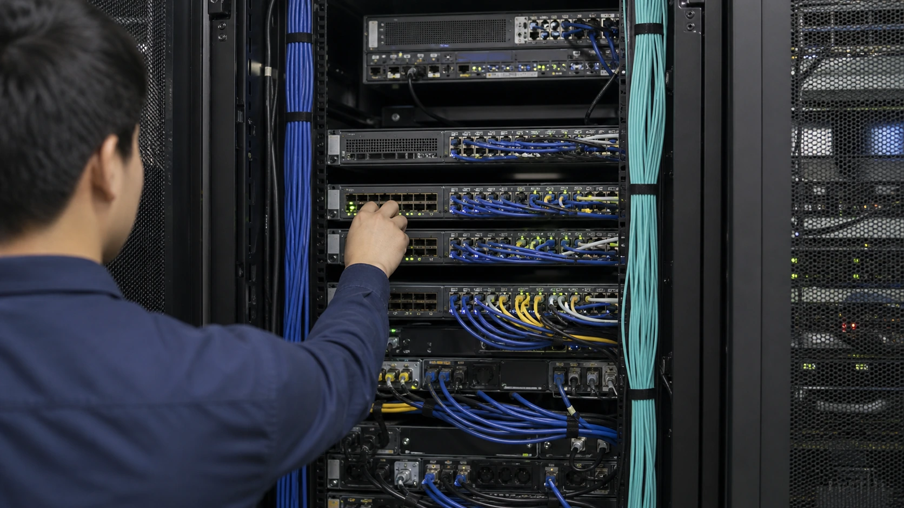
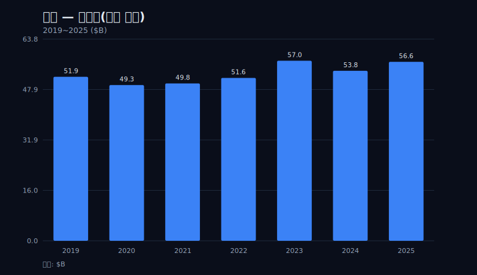
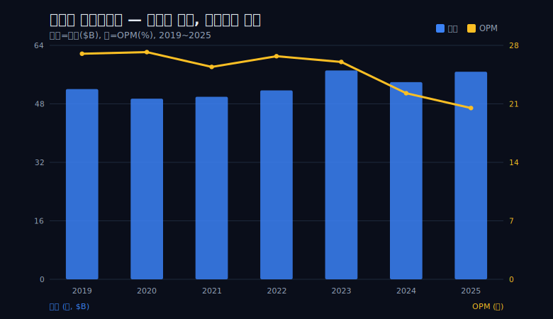
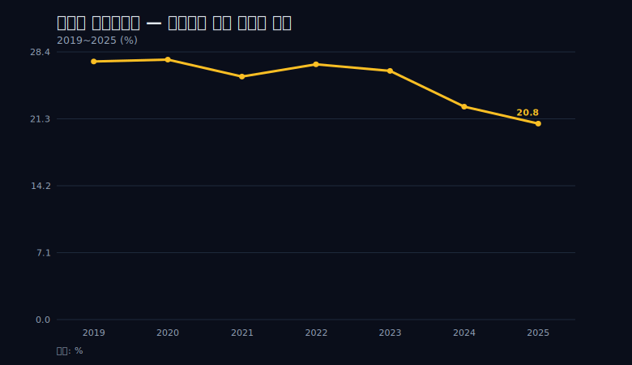
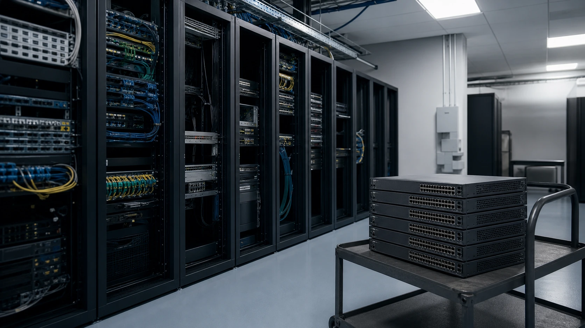
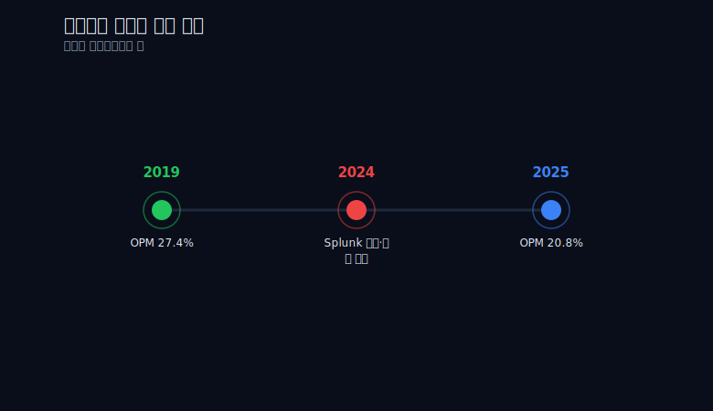
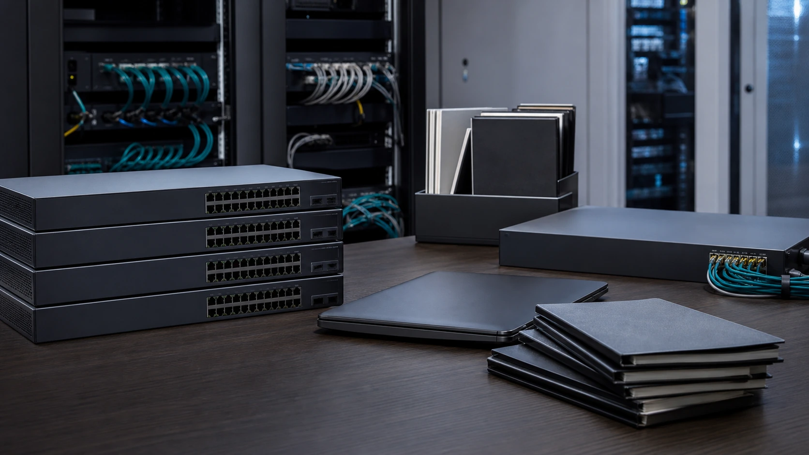

> **데이터 기준**: 2026-06-20 dartlab 실측 — Cisco Systems(CSCO) 미국 연결(USD), 분기→역년 합산. 2026 Q3 이후 숫자(주문·AI infrastructure orders·guidance·segment revenue)는 Cisco 공식 Q3 FY2026 release와 10-Q로 분리 표기.
>
> **핵심 숫자**: 영업이익률 **27.4%(2019) → 20.8%(2025)** · 결정적 계단은 **2023→2024 단 1년에 26.4%→22.6%** · 매출 **51.9B(2019) → 56.7B(2025)** 거의 정체 · 트로프 2024년에도 영업현금흐름 **10.88B**가 순이익 **10.32B**를 넘김.
>
> **이 글의 용어**: OPM(영업이익률) = 영업이익 ÷ 매출 · NPM(순마진) = 순이익 ÷ 매출 · OCF = 영업현금흐름 · false summit = 침식 서사 한가운데 솟은 일시적 정점 봉우리 · 이익의 현금화 = 순이익만큼(혹은 그 이상) 현금이 실제로 들어왔는지.

---

## 프롤로그 — 절벽 없는 하락

시스코 이야기에는 절벽이 없다. 영업이익률은 2019년 27.4%에서 2025년 20.8%로 6.6%포인트 내려왔지만, 어느 한 해에 한 번도 무너진 적이 없다. 같은 7년 동안 매출은 51.9B에서 56.7B로 거의 제자리였다. 숫자만 늘어놓으면 따분하다 — 큰 폭의 추락도, 분기 쇼크도, 적자 전환도 없다. 그래서 이 글은 멈춘 매출 위에서 마진이 조용히 한 점씩 깎이는 회계장부를, 과장 없이 그대로 따라간다.



관통선은 하나다. 시스코의 영업이익률은 2023년까지 26%대에서 높고 단단하게 버티다가, 소프트웨어로 갈아타는 바로 그 2년(2024~2025)에 20.8%로 두 계단 내려앉는다. 매출이 자라지 않는 성숙한 하드웨어 제국이 구독 매출을 사는 값을, 무너지지 않은 마진을 한 점씩 떼어 치르는 중이다. 형태부터 정확히 못 박는다 — 검증된 데이터는 2019~2025 7년이고, 그중 5년은 거의 변하지 않았으며, 침식의 본체는 끝의 2년에 몰려 있다. '오래 안정, 그다음 짧은 두 계단'이 사실에 맞는 모양이다. 길게 흘러내린 곡선이 아니다.

---

## 막1 — 여전히 두툼한 마진, 하드웨어 제국의 품질

먼저 인정하고 시작한다. 2025년의 20.8%라는 영업이익률조차 대부분의 하드웨어 회사는 부러워한다. 하락을 말하기 전에, 이 회사가 무엇을 깎는지 그 출발점의 두께부터 봐야 한다.

```python
import dartlab
c = dartlab.Company("CSCO")
c.select("IS", freq="Q")  # 분기 손익을 역년으로 합산
# 매출·영업이익에서 OPM = 영업이익 / 매출
```

검증 재무로 영업이익률을 따라가면 2019년 27.4%, 2020년 27.6%, 2021년 25.8%, 2022년 27.1%, 2023년 26.4%다. 5년 내내 25.8~27.6% 사이에서 단단했고, 정점은 2020년의 27.6%다. 라우터·스위치로 인터넷의 배관을 깔아온 회사가 가진 수익 체력은 이렇게 두껍다. 영업현금흐름도 마찬가지다 — 2019년 15.83B, 2023년에는 19.89B까지 찍었다. 매출 1달러가 들어오면 그중 4분의 1이 영업이익으로 남고, 현금은 그보다 더 들어오는 구조다.

이 두께를 먼저 못 박는 이유는 분명하다. 뒤에서 마진이 깎인다고 말할 때, 그것이 '망해가는 회사의 신호'로 오독되지 않도록 하기 위해서다. 20.8%로 내려앉은 2025년조차도, 여기서 출발한 회사의 자리다 — 침식은 *높은 고도에서* 시작했다.

---

## 막2 — 자라지 않는 매출, 성숙의 함정

진짜 문제는 마진보다 먼저 매출에 있다. 마진 곡선을 보기 전에 매출 곡선을 봐야 하는 이유는, 매출이 멈추면 손익계산서의 모든 이야기가 비용과 마진으로 옮겨가기 때문이다.

```python
c.select("IS", ["매출액"], freq="Q")  # 역년 합산
# 2019 51.90 → 2020 49.30 → 2021 49.82 → 2022 51.56 (B)
```

검증 재무로 매출은 2019년 51.90B, 2020년 49.30B, 2021년 49.82B, 2022년 51.56B다. 4년을 거의 같은 자리에서 맴돈다. 2020년에는 오히려 49.30B로 줄었고, 2022년에야 51.56B로 2019년 수준을 겨우 회복했다. 7년 전체로 보면 51.90B에서 56.65B로 약 9% 늘었으니 연 1.5% 남짓 — 성장이라 부르기 민망한 저성장 plateau다.



선을 긋는다 — 이 '정체'는 엄밀히 절대 제로 성장이 아니다. 7년간 약 9% 증가했으니 '저성장 plateau'가 정확한 표현이고, '매출 정체 = 몰락의 신호'로 읽는 것은 과장이다. 성숙기에 들어선 인프라 기업의 정상 상태에 가깝다. 다만 이 멈춘 외형이 중요한 이유는 따로 있다 — 매출이 자라지 않는 회사에서 마진이 깎이면, 절대 영업이익은 곧장 줄어든다. 위로 받쳐줄 외형 성장이 없기 때문이다. 이 정체가 뒤에 올 마진 침식을 더 아프게 만든다.

---

## 막3 — 2023년, 잠깐의 정상

하락이 일직선이라는 착각은 2023년이 깬다. '꾸준한 추락'이라는 거짓 매끄러움을 만들지 않으려면, 침식의 서사 한가운데 솟은 이 봉우리를 빼먹어선 안 된다.

검증 재무로 2023년은 매출 57.00B, 영업이익 15.03B, OPM 26.4%다. 제공된 7년 중 외형(57.00B)과 절대 영업이익(15.03B)이 *동시에 가장 컸던 해*다. 영업현금흐름도 19.89B로 7년 최고였다. 매출 정체를 말한 막2 바로 다음에 외형 정점이 오는 이 어색함이, 오히려 시스코 곡선의 진짜 모양이다 — 4년을 맴돌다가 2023년에 한 번 위로 솟았다.



이 false summit을 박는 이유는 관통선의 정확성을 위해서다. 만약 2019년 27.4%에서 2025년 20.8%로 그냥 직선을 그으면 '7년 내내 천천히 깎였다'는 매끄러운 거짓이 생긴다. 실제로는 시스코의 마진은 2023년까지 멀쩡했다 — OPM 26.4%는 5년 안정 구간(25.8~27.6%) 안에 그대로 들어있다. 침식은 아직 시작도 안 했다. 거짓 추락 서사를 막아두고, 진짜 변화가 어디 한곳에 몰려 있는지를 다음 막에서 본다.

---

## 막4 — 2024년의 계단, 소프트웨어로 갈아타는 값

변화는 흩어져 있지 않다. 한 해에 몰려 있다. 5년 안정과 2023년 정점 바로 뒤, 2024년이 결정적 계단이다.

```python
c.select("IS", freq="Q")  # 2023 vs 2024 역년 비교
# OPM 26.4% → 22.6% (단 1년 -3.8%p)
c.select("CF", ["영업활동현금흐름"], freq="Q")
# OCF 19.89B → 10.88B (거의 반토막)
```

검증 재무로 2024년 OPM은 22.6%다. 2023년 26.4%에서 단 1년 만에 3.8%포인트가 빠졌다 — 앞선 5년 동안 안정 밴드 안에서 출렁이던 폭(25.8~27.6%, 약 1.8%포인트)보다 한 해 낙폭이 두 배 더 크다. 같은 해 매출은 57.00B에서 53.80B로 줄었고, 영업이익은 15.03B에서 12.18B로, 영업현금흐름은 19.89B에서 10.88B로 거의 반토막 났다. 7년을 통틀어 가장 격한 한 해다.



같은 해, 시스코는 보안·관측 소프트웨어 Splunk를 약 280억 달러에 인수했다(외부, 손익 밖 맥락). 통합비용과 매출 믹스 변화가 이 계단에 섞여 있다. 다만 이 글은 인수가 마진 하락의 '유일한 원인'이라 단정하지 않는다 — 그렇게 못 박으면 인과 오류다. 매출 정체는 이미 2019년부터였고, OPM도 2021년 25.8%로 안정 밴드 안에서 한 번 출렁인 적이 있다. Splunk 통합비용·믹스 변화는 이 계단에 *섞인 요인*일 뿐, 혼자 만든 절벽이 아니다. Splunk 인수 규모(약 280억 달러)와 구독·ARR 비중은 10-K/IR 외부 인용이며, 제공된 손익 7개 항목 밖이다. 확인되는 사실은 여기까지다 — *2024년에 매출·이익·현금이 한꺼번에 내려앉았고, 그 해가 소프트웨어로 갈아타는 첫해와 겹친다.*

---

## 막5 — 20.8%, 붕괴가 아니라 연착륙

계단은 한 번 더 있다. 그러나 그 두 번째 계단조차 무너짐이 아니다 — 깎이는 와중에도 수익 체력이 어떻게 버텼는지가 이 막의 핵심이다.

검증 재무로 2025년 매출은 56.65B로 다시 올라왔고, 영업현금흐름도 10.88B에서 14.19B로 회복됐다. 그런데 OPM은 22.6%에서 20.8%로 또 한 계단 내려앉았고, 순마진(NPM)도 18.0%다. 매출과 현금은 돌아왔는데 마진은 더 깎인, 어긋난 회복이다. 흥미로운 건 트로프였던 2024년이다 — 그해 영업현금흐름 10.88B가 순이익 10.32B를 넘겼다. 마진이 가장 아팠던 해에도 이익의 현금화는 깨지지 않았다는 뜻이다.



```python
# 트로프 2024년: OCF가 순이익을 넘기는지 확인
c.select("IS", ["당기순이익"], freq="Q")   # 2024 NI 10.32B
c.select("CF", ["영업활동현금흐름"], freq="Q")  # 2024 OCF 10.88B
# OCF 10.88 > NI 10.32 → 이익의 현금화 유지
```

선을 긋는다 — 20.8%는 여전히 우수한 영업이익률이다. '하락'을 '붕괴'로 읽으면 안 된다. 대부분의 하드웨어 기업이 부러워할 수준이고, 이 막의 핵심은 '무너지지 않은 채 깎인다'이다. 순마진도 2019년 22.4%에서 2025년 18.0%로 내려왔지만, 적자 근처에도 가지 않았다. 침식은 진행 중이되 수익 체력은 무너지지 않았다. 추락이 아니라 더 낮은 고도로의 연착륙이다 — 곤두박질이 아니라, 더 낮은 순항 고도에서 다시 수평을 잡으려는 움직임이다.

---

## 막6 — 깎인 마진은 구독으로 다시 차오르는가

검증된 숫자가 보장하는 사실은 여기까지다. 멈춘 매출(51.9B→56.7B), 2024~2025에 집중된 마진 두 계단(26.4%→22.6%→20.8%), 그러나 무너지지 않은 현금(트로프 2024년에도 OCF가 순이익 초과). 이 셋이 이 회사가 지금 증명한 전부다.



```python
# 2026년에 확인할 것: 멈춘 매출 위 성장 + OPM 20%대 방어
c.select("IS", freq="Q")   # 매출 56.65B(2025) 위에서 플러스 성장하는가
# OPM 20.8%가 더 깎이는가, 여기서 침식이 멈추는가
```



여기서부터는 베팅이다. 구독·ARR 비중이 높아지며 깎인 영업이익률을 소프트웨어 마진이 다시 채울지, 아니면 더 낮은 고도에서 침식을 멈추는 데 그칠지는 손익계산서 밖의 영역이다 — 구독·ARR 비중은 10-K/IR 외부 인용이고, 검증된 손익 7개 항목으로는 입증되지 않는다. 회계연도가 7월 말에 끝나는 회사를 역년으로 재구성한 수치라, 분기 단위 타이밍은 외부 10-K와 미세하게 다를 수 있다. 목표주가도, 매수의견도 여기에 없다 — 이 글은 '마진이 무너지지 않은 채 깎였다'까지만 말한다.

같은 전환의 다른 얼굴들과 겹쳐 읽으면 시스코의 선택이 더 선명해진다. 외형을 *깎아* 마진을 되찾은 [IBM](/blog/IBM-ibm)과 비교하면, 시스코는 외형을 깎지 않은 채 마진을 내준 거울상이다. 전환이 마진을 깎은 [오라클](/blog/ORCL-oracle), 클라우드로 외형·마진을 동시에 키운 [마이크로소프트](/blog/MSFT-microsoft), 구독 고원의 [어도비](/blog/ADBE-adobe), 그리고 성숙한 반도체 거인의 길을 간 [인텔](/blog/INTC-intel)·[브로드컴](/blog/AVGO-broadcom)을 나란히 두면, '소프트웨어로 갈아타는 값을 무엇으로 치르는가'라는 같은 질문에 회사마다 다른 답이 보인다.

---

## 막7 — 2026 Q3: 저성장 thesis가 흔들린 첫 분기

2026년 Q3 공식자료는 이 글의 기존 논지를 가장 세게 흔든다. 2025년까지의 연간 재무만 보면 시스코는 저성장 위에서 마진을 내준 회사였다. 그런데 2026년 Q3에서 회사는 매출 15.8B$를 냈고, 전년 대비 12% 성장이라고 발표했다. GAAP EPS는 0.85$, non-GAAP EPS는 1.06$였고, GAAP operating margin은 25.0%, non-GAAP operating margin은 34.2%였다. 2025년 역년 합산 OPM 20.8%만 보고 "마진이 계속 낮은 고도로 내려앉는다"고 쓰면, 2026년 Q3의 반등을 놓친다.

하지만 반등을 곧장 구조적 회복으로 쓰는 것도 위험하다. 분기 매출 15.8B$와 역년 합산 매출 56.65B$는 시간 기준이 다르다. Cisco의 회계연도는 7월 말이고, 이 글의 dartlab 표는 분기를 역년으로 합산한 재구성이다. 따라서 2026 Q3는 2025 연간 표에 그냥 이어 붙이는 행이 아니라, 다음 연간 표를 예고하는 선행 분기다. 그것만으로도 충분히 중요하다. 저성장 thesis를 폐기하진 않지만, "고정된 저성장"에서 "주문 사이클이 다시 열렸는지 확인해야 하는 저성장"으로 바꾼다.

공식자료의 더 큰 반전은 주문이다. Q3 FY2026 product orders는 전년 대비 35% 늘었고, hyperscaler를 제외해도 19% 늘었다. networking product orders는 50% 초과 성장했다. 주문은 매출보다 앞선다. 매출이 재무제표에 찍히기 전에 고객이 장비를 다시 사기 시작했다는 신호다. 2019~2025 글의 "멈춘 매출"은 과거 손익의 사실이지만, 2026 Q3의 주문 데이터는 그 멈춤이 계속될지에 대한 새 질문을 만든다.

| 2026 Q3 공식자료 | 숫자 | 기존 글에 주는 보정 |
|---|---:|---|
| 매출 | 15.8B$ | 2025 저성장 결론에 반전 신호 |
| 매출 성장률 | +12% | 단순 plateau 지속으로 쓰면 부족 |
| GAAP operating margin | 25.0% | 2025 역년 OPM 20.8%보다 높은 분기 |
| Product orders | +35% | 매출보다 먼저 움직인 수요 신호 |
| Networking product orders | 50% 초과 | 레거시 장비 수요가 죽지 않았다는 반례 |
| AI infrastructure orders YTD | 5.3B$ | 새 수주 축이 생김 |

그래서 2026년의 시스코는 두 줄로 읽어야 한다. 과거 손익은 마진 침식이다. 최신 주문은 수요 반전이다. 둘 중 하나만 쓰면 틀린다. 침식만 쓰면 2026 Q3를 무시하고, 수요 반전만 쓰면 2024~2025에 이미 깎인 마진과 통합비용을 무시한다.

---

## 막8 — AI 인프라 주문은 새 축이지만, 아직 손익표의 중심축은 아니다

시스코 Q3 FY2026 자료에서 가장 눈에 띄는 문장은 AI infrastructure orders다. 회사는 hyperscaler 대상 AI infrastructure orders가 FY26 year-to-date 5.3B$라고 밝혔고, FY26 expected orders를 기존 5B$에서 9B$로 올렸다. expected revenue도 3B$에서 4B$로 올렸다. 이 숫자는 시스코를 단순 네트워크 장비 교체주로만 보는 시각을 흔든다.

그렇다고 이 숫자를 곧장 "AI 회사"라는 결론으로 바꾸면 과장이다. orders는 revenue가 아니다. backlog와 수주가 실제 매출·마진·현금흐름으로 들어오기까지는 납품, 원가, 고객 집중, 제품 믹스가 지나가야 한다. 특히 AI 인프라 장비는 수요는 강해도 총마진이 기존 고마진 소프트웨어와 같다고 전제할 수 없다. Cisco의 공식자료도 Q3에서 강한 매출·주문과 함께 총마진을 따로 제시한다. AI 주문은 수요의 방향을 보여주지만, 고마진 회복의 증명은 아니다.

이 지점이 [오라클](/blog/ORCL-oracle)과 닮았다. Oracle은 RPO가 폭증했지만 FY2026 free cash flow가 마이너스로 돌아서는 가격표가 붙었다. Cisco는 Oracle만큼 거대한 capex 부담을 떠안는 구조는 아니지만, orders가 곧 고품질 free cash flow라는 뜻은 아니다. 주문이 강하다는 것과, 그 주문이 2019~2023의 26%대 GAAP OPM을 되찾아준다는 것은 다른 명제다.

그래서 AI infrastructure orders의 정확한 독법은 이렇다. 첫째, 매출 plateau가 끝날 가능성을 열었다. 둘째, 네트워킹 포트폴리오가 데이터센터·AI 클러스터 병목과 연결되며 수요 축이 넓어졌다. 셋째, 그러나 gross margin과 operating margin에 어떤 비용으로 들어오는지는 아직 분기 몇 개를 더 봐야 한다. 주문이 손익으로 전환되는 속도와 마진을 분리해야 이 숫자를 과장 없이 쓸 수 있다.

---

## 막9 — 네트워킹 주문 50% 초과: 레거시가 아니라 교체 사이클이다

시스코를 낡은 네트워크 장비 회사라고만 부르면 Q3 FY2026의 핵심을 놓친다. 공식자료는 major multi-year campus networking refresh cycle을 언급했고, campus networking orders가 25% 초과 성장했으며, networking product orders는 50% 초과 성장했다고 밝혔다. 기존 글에서 "자라지 않는 매출, 성숙의 함정"이라고 쓴 부분은 과거 손익에는 맞지만, 2026년 주문 사이클에는 충분하지 않다.

여기서 중요한 것은 "레거시"라는 단어의 방향이다. 레거시는 죽은 사업이라는 뜻이 아니다. 기업 네트워크 장비는 교체 주기가 있고, 보안·무선·데이터센터 트래픽 변화가 겹치면 오래된 설치 기반이 다시 매출 기회가 된다. 시스코가 가진 설치 기반은 성숙의 약점이면서 동시에 교체 사이클의 자산이다. 2019~2025에 매출이 51.9B→56.7B로 거의 제자리였다는 사실은 그대로지만, Q3 주문 데이터는 그 제자리가 앞으로도 이어진다는 보증을 깨뜨린다.

다만 교체 사이클은 영구 성장 엔진이 아니다. 교체는 앞당겨진 수요와 미뤄진 수요가 한꺼번에 나오는 구간일 수 있고, 몇 분기 뒤 다시 정상화될 수 있다. 그래서 "저성장 thesis가 틀렸다"가 아니라 "저성장 thesis의 다음 검증 조건이 생겼다"가 정확하다. 2026년 이후 봐야 할 것은 매출 15.8B$ 같은 한 분기 숫자보다, networking orders가 실제 product revenue와 operating margin으로 몇 분기 연속 이어지는지다.

이 막의 결론은 의외로 보수적이다. 시스코의 레거시는 죽은 자산이 아니라 교체 가능한 설치 기반이다. 하지만 교체 가능한 설치 기반은 매년 반복되는 SaaS ARR와 다르다. 한 번 강한 주문이 들어왔다고 전사 밸류에이션을 영구 성장주로 옮기면 안 된다. 네트워크 장비의 힘은 반복 구독이 아니라 교체 주기의 파도다. 이번 파도가 AI 인프라와 campus refresh를 동시에 타고 왔다는 점이 새롭다.

---

## 막10 — 그래서 결론은 침식에서 조건부 반격으로 바뀐다

2025년까지만 보면 시스코는 낮아진 고도로 내려앉은 회사였다. 2026 Q3까지 포함하면 결론은 더 복잡해진다. 마진 침식은 과거 사실이고, 주문 반전은 현재 사실이다. 둘을 합치면 "무너지지 않은 채 깎이는 회사"에서 "깎인 뒤 주문으로 반격을 시작한 회사"가 된다. 단, 반격이 성공했는지는 아직 모른다.

성공 조건은 세 가지다. 첫째, Q3의 15.8B$ 매출 수준이 다음 분기에도 이어져 FY2026 revenue guidance 62.8~63.0B$ 안착으로 확인되어야 한다. 둘째, product orders +35%와 networking product orders 50% 초과가 backlog에서 매출로 바뀌며 gross margin을 크게 깎지 않아야 한다. 셋째, AI infrastructure orders 9B$ 기대가 4B$ revenue로 들어올 때 operating margin이 다시 2019~2023의 25~27%대 GAAP 밴드로 가까워져야 한다.

실패 조건도 분명하다. 주문은 강했는데 매출 인식이 늦거나, 매출은 늘었는데 제품 믹스와 관세 때문에 GAAP margin이 20% 초반에 머물면, 2026 Q3는 반격이 아니라 일시적 수요 분출이 된다. Splunk 통합과 보안·관측성 소프트웨어의 매출이 전사 마진을 실제로 끌어올리는지도 따로 봐야 한다. 이 지표들이 맞물리지 않으면 "소프트웨어로 갈아타는 값"은 계속 비용으로 남는다.

그래서 새 결론은 보수적으로 닫는다. 시스코는 더 이상 단순한 저성장 장비주라고 부르기 어렵다. 하지만 아직 AI 인프라 고마진 성장주라고 부르기도 이르다. 2026년의 정직한 이름은 "주문 반격이 시작된 성숙 인프라 기업"이다. 과거 재무제표는 마진 침식을 증명했고, 최신 공식자료는 그 침식이 멈출 수 있는 조건을 던졌다. 이제 봐야 할 것은 주문이 아니라 주문의 손익 번역이다.

### 주문과 매출 사이의 시간차를 먼저 본다

Cisco Q3 FY2026에서 product orders +35%는 강한 숫자다. 그러나 order는 아직 손익계산서의 revenue가 아니다. 주문이 들어오고, 장비가 출하되고, 고객이 검수하고, 매출 인식 기준을 충족해야 revenue가 된다. 이 시간차가 네트워크 장비 회사의 핵심이다. SaaS 회사의 ARR처럼 매월 자동으로 매출이 풀리는 구조와 다르다. 그래서 Cisco의 주문 반전은 매출 반전의 강한 후보이지, 이미 확정된 매출 반전은 아니다.

이 차이를 놓치면 두 가지 오독이 생긴다. 첫째, 주문이 강하니 당장 전사 매출이 구조적으로 두 자릿수 성장으로 바뀌었다고 과장한다. 둘째, 과거 매출이 7년간 거의 제자리였으니 주문 반전도 일시적 잡음이라고 무시한다. 둘 다 틀리다. 주문은 미래 매출의 선행 신호이고, 2026 Q3처럼 product orders와 networking product orders가 동시에 크게 움직이면 가볍게 볼 수 없다. 동시에 주문은 아직 margin과 cash flow를 통과하지 않은 숫자라, 손익 품질까지 보장하지 않는다.

따라서 다음 확인 순서는 명확하다. Q4와 FY2026에서 product revenue가 실제로 orders를 따라오는지 본다. 그다음 product gross margin이 얼마나 지켜지는지 본다. 마지막으로 operating margin이 2019~2023의 25~27%대 GAAP 밴드로 돌아오는지 본다. 매출만 오르고 margin이 안 돌아오면, 주문 반격은 규모만 큰 저마진 반격이다. margin까지 돌아오면, 2024~2025의 계단 하락은 전환기의 비용으로 재해석될 수 있다.

### AI infrastructure orders는 hyperscaler 고객의 언어다

AI infrastructure orders 5.3B$ YTD와 FY26 expected orders 9B$는 크다. 하지만 이 숫자는 일반 기업 네트워크 교체와 같은 종류의 주문이 아니다. hyperscaler 대상 주문이다. 고객 수는 적고, 금액은 크고, 제품 사양과 납기, 가격 협상이 일반 campus networking보다 더 집중될 수 있다. 그래서 AI infrastructure orders는 성장성의 증거이면서 고객 집중과 마진 협상력의 질문도 함께 만든다.

Cisco가 강한 이유는 AI 클러스터가 GPU만으로 돌아가지 않기 때문이다. 대규모 GPU 서버를 묶으려면 고속 네트워킹, switching, 보안, 관측성이 필요하다. [엔비디아](/blog/NVDA-nvidia)가 GPU 병목을 대표한다면, Cisco는 그 GPU들이 서로 말하게 하는 네트워크 병목에 서 있다. 그러나 GPU 수요가 폭발한다고 해서 모든 네트워크 장비 업체가 같은 이익을 가져가는 것은 아니다. hyperscaler는 큰 고객이고, 큰 고객은 가격 협상력이 있다.

따라서 AI infrastructure orders를 볼 때는 두 숫자를 더 요구해야 한다. 하나는 expected revenue 4B$가 실제 FY2026 매출로 얼마나 들어오는지다. 다른 하나는 그 revenue가 product gross margin을 얼마나 희석하거나 방어하는지다. orders가 9B$까지 커져도 매출 인식이 늦고 margin이 낮으면, 주식시장의 기대와 손익계산서가 어긋날 수 있다. 반대로 expected revenue가 빠르게 들어오고 margin 방어가 되면, Cisco의 2026 반격은 단순 주문 소식이 아니라 손익 구조의 변곡점이 된다.

### Splunk는 비용이자 방어막이다

기존 글에서 Splunk는 2024년 마진 계단과 시기가 겹친 사건이었다. 약 280억 달러 인수는 규모가 크고, 통합비용과 무형자산상각, 제품 믹스 변화가 전사 손익에 영향을 줄 수 있다. 그래서 2024~2025 마진 하락을 말할 때 Splunk를 완전히 빼면 안 된다. 그러나 Splunk를 단일 원인으로 쓰는 것도 틀리다. 2019~2023에도 매출 성장은 이미 느렸고, 네트워킹 하드웨어 사이클 자체도 둔화되어 있었다.

2026 Q3 이후 Splunk의 의미는 더 복합적이다. 한쪽에서는 integration cost와 acquired intangible amortization이 GAAP margin을 누를 수 있다. 다른 한쪽에서는 observability와 security 포트폴리오가 Cisco의 AI 인프라·네트워크 장비 판매를 더 끈끈하게 만들 수 있다. AI 클러스터를 깔고 나면 운영 상태를 봐야 하고, 보안과 관측성은 고객 lock-in에 가까운 기능이 된다. Splunk는 단순한 비용이 아니라 방어막이 될 수 있다.

하지만 방어막이라는 말도 손익으로 확인해야 한다. Q3 revenue by similar product groups에서 Observability는 269M$였고, nine months로 820M$였다. Security는 Q3 2.008B$, nine months 6.006B$다. Networking 8.815B$와 비교하면 규모 차이가 크다. 즉 Cisco의 반격은 아직 Networking이 주도하고, Splunk/Observability는 붙는 축이다. 이 붙는 축이 margin을 끌어올리는지, 아니면 integration 비용만 남기는지는 다음 몇 분기에서 확인해야 한다.

### 2026년 guidance를 보는 법

Cisco는 Q3 FY2026 자료에서 FY2026 revenue guidance를 62.8~63.0B$로 제시했다. 이 숫자는 2025 역년 합산 매출 56.65B$와 직접 같은 기준은 아니지만, 방향은 분명하다. 2026년 회계연도 기준으로는 60B$ 위의 매출 체력을 말하고 있다. 그래서 기존 "매출 51.9B→56.7B, 7년간 9%"라는 과거 문장만으로는 부족하다.

다만 guidance를 읽을 때 tariff 영향을 빼면 안 된다. Cisco는 guidance에 현재 trade policy 기준 tariff 영향을 반영한다고 밝혔다. 이는 단기 margin의 중요한 변수다. 주문이 강해도 tariff가 원가를 누르면 gross margin이 흔들릴 수 있고, gross margin 흔들림은 operating margin으로 내려온다. 따라서 FY2026을 볼 때는 revenue guidance와 EPS guidance만 볼 게 아니라, gross margin commentary와 tariff assumption을 같이 봐야 한다.

여기서 이 글의 제목도 달라진다. "무너지지 않은 채 깎이는 마진"은 2019~2025 표에는 맞다. 2026년 이후에는 "깎인 마진이 주문 반격으로 어디까지 돌아오는가"가 더 정확하다. guidance는 반격의 경로를 보여주고, tariff는 그 경로의 비용을 보여준다. 둘 중 하나만 보면 결론이 기울어진다.

### Cisco와 Broadcom을 나란히 보면 다른 전환이 보인다

소프트웨어 전환을 말할 때 [브로드컴](/blog/AVGO-broadcom)을 함께 보면 Cisco의 색이 더 분명해진다. Broadcom은 반도체와 인프라 소프트웨어를 결합하며 인수와 margin 확장을 동시에 밀어붙인 회사다. Cisco도 Splunk를 붙이고 software/subscription mix를 키우지만, 중심은 여전히 networking 설치 기반과 product cycle이다. 두 회사 모두 인프라를 팔지만, 손익의 리듬은 다르다.

Cisco의 장점은 설치 기반이다. 기업 네트워크, campus, data center switching은 한 번 깔리면 교체와 확장, 유지보수의 반복 수요가 생긴다. 약점도 설치 기반이다. 교체 주기가 쉬어가면 매출이 멈추고, 하드웨어 중심 mix에서는 높은 software margin처럼 매년 자동으로 올라가는 레버리지가 약하다. 2026 Q3의 강한 orders는 이 설치 기반이 다시 움직였다는 신호다. 그러나 설치 기반의 파도는 subscription ARR와 다르다. 파도가 왔는지, 조류가 바뀌었는지를 분리해야 한다.

이 분리는 [어도비](/blog/ADBE-adobe)의 ARR 독해와 반대다. Adobe는 반복매출의 작은 mix 변화(AI-first ARR, Semrush ARR)를 봐야 하고, Cisco는 주문과 매출 사이의 전환율을 봐야 한다. Adobe에서 "AI 라벨"이 중요하다면, Cisco에서 중요한 것은 "AI orders의 revenue conversion"이다. 같은 AI라는 단어가 붙어도 회계 질문은 완전히 다르다.

### 이 글이 틀리는 조건

이 글의 새 결론은 조건부다. "Cisco는 주문 반격을 시작했지만 아직 손익 번역이 필요하다." 이 결론이 틀리는 조건은 세 가지다. 첫째, FY2026 Q4와 FY2027 초반 product revenue가 orders를 따라오지 못한다. 그러면 Q3 주문 반전은 backlog나 timing의 착시가 된다. 둘째, revenue는 올라오지만 gross margin이 크게 눌리고 GAAP operating margin이 20% 초반에 머문다. 그러면 반격은 규모만 큰 저마진 반격이다. 셋째, AI infrastructure expected revenue 4B$가 실제 revenue로 들어와도 networking core와 security/observability attach가 약하다. 그러면 AI 주문은 큰 고객 몇 곳의 장비 수주에 그치고, Cisco 전체 체질 변화로 이어지지 않는다.

반대로 이 글이 더 강해지는 조건도 있다. Product orders가 revenue로 전환되고, networking growth가 FY2026 말까지 이어지고, GAAP operating margin이 25% 이상에서 안정되고, services revenue가 흔들리지 않으면 2024~2025의 낮아진 OPM은 일시적 전환 비용으로 다시 쓰일 수 있다. 그때 Cisco는 "무너지지 않은 채 깎인 회사"가 아니라 "깎인 뒤 다시 회복한 성숙 인프라 기업"이 된다. 아직은 전자가 과거이고, 후자는 검증 대기다.

### 다음 공시에서 직접 계산할 변환율

Cisco의 다음 공시를 볼 때 핵심은 주문 그 자체가 아니라 주문의 변환율이다. product orders가 강하다는 말은 수요가 있다는 말이다. 그러나 수요가 매출이 되고, 매출이 gross profit이 되고, gross profit이 operating income으로 남아야 비로소 주주에게 의미 있는 손익 반전이 된다. 그래서 다음 공시에서는 아래 네 단계를 나란히 봐야 한다.

| 단계 | 확인할 숫자 | 질문 |
|---|---|---|
| 주문 | Product orders, networking orders, AI infrastructure orders | 수요가 계속 강한가 |
| 매출 | Product revenue, networking revenue, total revenue | 주문이 revenue로 전환되는가 |
| 총마진 | GAAP gross margin, product gross margin | 강한 매출이 원가를 이기는가 |
| 영업이익 | GAAP operating margin | 20% 초반이 아니라 25%대에 머무는가 |
| 현금 | Operating cash flow | 이익이 다시 현금으로 들어오는가 |

이 표가 중요한 이유는 Cisco가 한 번에 두 개의 전환을 겪고 있기 때문이다. 하나는 제품 수요 전환이다. campus networking refresh와 AI infrastructure orders가 설치 기반을 다시 움직인다. 다른 하나는 사업 mix 전환이다. Splunk와 security/observability, subscription 성격의 revenue가 전사 mix를 바꾸려 한다. 제품 수요 전환은 매출을 밀고, mix 전환은 margin을 바꾼다. 둘이 동시에 좋아져야 진짜 회복이다.

만약 product orders는 계속 좋지만 GAAP operating margin이 20% 초반에 머문다면, Cisco는 강한 수요를 낮은 margin으로 처리하는 회사가 된다. 만약 margin은 좋아지지만 orders가 둔화한다면, 비용 절감으로 만든 일시적 반등일 수 있다. 가장 좋은 그림은 product orders가 revenue로 바뀌고, networking revenue가 늘며, security/observability attach가 붙고, GAAP operating margin이 25% 이상에서 버티는 것이다. 그때 2024~2025의 침식은 "전환 비용을 치른 뒤 돌아온 margin"으로 다시 쓰인다.

### Services revenue가 흔들리면 반격은 약해진다

Q3 FY2026 product story가 너무 강해서 services revenue를 놓치기 쉽다. 공식자료에서 services revenue는 Q3 3.724B$로 전년 대비 1% 감소했고, nine months 기준 11.237B$로 전년과 거의 같았다. Product가 17% 성장하고 Networking이 25% 성장하는 동안 Services는 조용했다. 이 조용함은 나쁘다고 단정할 수 없지만, Cisco 전체 손익에서는 중요하다. 서비스는 반복성과 margin 방어에 가까운 축이기 때문이다.

하드웨어 주문이 강한 분기에는 product revenue가 먼저 튄다. 그러나 장기적으로 좋은 Cisco는 services와 subscription이 product cycle의 빈틈을 메워야 한다. 제품 교체 파도는 올라왔다 내려갈 수 있지만, 서비스 계약은 더 길게 이어진다. 따라서 services revenue가 계속 정체하거나 감소하면, Q3의 product strength가 전사 체질 개선으로 이어지는 힘은 약해진다. 반대로 services가 다시 성장하면, product cycle과 recurring support가 함께 움직이는 그림이 된다.

이 점에서 Cisco는 단순 장비 회사와 다르지만, 순수 SaaS 회사도 아니다. [ServiceNow](/blog/NOW-servicenow)는 subscription revenue와 RPO가 거의 회사의 중심 언어다. Cisco는 product와 services가 함께 있어야 한다. Product는 성장률을 만들고, services는 안정성을 만든다. 2026년의 강한 product orders가 services attach로 이어지는지가 전환의 질을 가른다.

### 총마진을 봐야 하는 이유

Q3 release는 GAAP gross margin 63.6%, non-GAAP gross margin 66.0%를 제시했다. 이 숫자는 단순히 높다 낮다의 문제가 아니라 orders의 질을 판별하는 필터다. 네트워킹 주문이 50% 이상 늘고 AI infrastructure orders가 커져도, gross margin이 크게 눌리면 매출 성장이 operating income으로 충분히 남지 않는다. 반대로 gross margin이 방어되면 강한 주문은 손익 반전으로 이어질 가능성이 커진다.

특히 tariff는 이 필터를 흐리게 만든다. 회사가 guidance에 tariff 영향을 반영한다고 밝힌 만큼, 매출 성장률만 보면 안 된다. 같은 15.8B$ 매출이라도 tariff 부담이 커지면 gross margin이 낮아지고, operating margin 회복이 늦어진다. 그래서 다음 공시의 핵심은 revenue beat가 아니라 gross margin bridge다. 가격, mix, tariff, supply chain, restructuring, amortization이 어떻게 섞였는지 봐야 한다.

이 지점에서 Cisco의 2026 반격은 아직 완성형이 아니다. 수요는 공식적으로 강하다. Orders와 revenue는 반전 신호를 준다. 하지만 gross margin과 operating margin이 그 수요를 얼마나 남기는지는 다음 분기 표가 닫아야 한다. 주문은 박수이고, margin은 성적표다.

### Cisco 글의 최종 판정 문장

시스코는 낡은 네트워크 장비 회사라는 한 문장으로 끝낼 수 없다. 2026 Q3 기준으로는 더더욱 그렇다. 그러나 AI 인프라 성장주라는 한 문장도 빠르다. 이 회사는 2019~2025에 마진이 깎였고, 2026에는 주문이 돌아왔다. 두 문장을 모두 붙여야 한다.

가장 정직한 판정은 이렇다. Cisco는 낮아진 마진 고도에서 주문 반격을 시작한 성숙 인프라 기업이다. 과거 재무제표는 2024~2025의 침식을 증명했고, 최신 공식자료는 product orders와 AI infrastructure orders가 그 침식을 멈출 수 있는 조건을 보여줬다. 그러나 아직 orders가 annual revenue와 GAAP operating margin으로 완전히 번역된 것은 아니다. 그래서 다음 공시에서 볼 것은 headline orders가 아니라 revenue conversion, gross margin, GAAP operating margin, operating cash flow다.

### 숫자 감각 — 9B$ orders와 4B$ revenue의 간격

FY26 expected AI infrastructure orders 9B$와 expected revenue 4B$는 같은 숫자가 아니다. orders는 고객이 요구한 규모이고, revenue는 그중 회계적으로 인식될 분량이다. 이 간격이 크다는 것은 backlog와 납품 일정, 인식 timing이 중요하다는 뜻이다. 주문 9B$를 전부 올해 매출처럼 읽으면 과장이고, revenue 4B$만 보고 나머지 5B$를 무시하면 미래 가시성을 과소평가한다.

Cisco의 좋은 그림은 이 간격이 건강하게 줄어드는 것이다. 2026년에는 4B$가 revenue로 들어오고, 남은 orders가 FY2027 revenue visibility로 이어지며, gross margin이 크게 훼손되지 않는 그림이다. 나쁜 그림은 orders는 커 보이지만 납품과 margin이 따라오지 못하는 그림이다. 그래서 AI infrastructure 숫자를 읽을 때는 항상 "orders, revenue, margin" 세 단어를 같이 써야 한다.

이 점 때문에 Cisco는 헤드라인보다 bridge가 중요하다. 회사가 다음 공시에서 orders backlog, expected shipment, gross margin pressure, tariff assumption을 얼마나 구체적으로 설명하는지가 글의 다음 판단을 결정한다. 2026 Q3는 강한 시작이다. 그러나 시작은 성적표가 아니라 시험 문제다.

이 시험 문제의 답안지는 Q4 FY2026 손익과 현금흐름이다. Q3 한 번의 강한 주문보다, 그 주문이 연간 revenue와 OCF로 이어지는지가 더 중요하다.

---

## 공시 / Filings

- [Cisco Q3 FY2026 earnings release](https://investor.cisco.com/news/news-details/2026/CISCO-REPORTS-THIRD-QUARTER-EARNINGS/default.aspx) — 2026-05-13 공식 IR 자료. Q3 매출 15.8B$, GAAP operating margin 25.0%, product orders +35%, AI infrastructure orders YTD 5.3B$와 FY26 orders/revenue expectation의 정본.
- [Cisco Q3 FY2026 Form 10-Q](https://www.sec.gov/Archives/edgar/data/858877/000085887726000078/csco-20260425.htm) — 2026년 4월 25일 종료 분기보고서. 손익계산서, 제품/서비스 매출, margin discussion, risk factor를 확인한다.
- [Cisco FY2025 Form 10-K](https://www.sec.gov/Archives/edgar/data/858877/000085887725000111/csco-20250726.htm) — 2025년 연차 기준. Splunk 통합, product/service structure, 2025 낮아진 마진의 배경을 확인하는 정본.
- [Cisco Investor Relations quarterly results](https://investor.cisco.com/financials/quarterly-results/default.aspx) — earnings slides, prepared remarks, income statement reconciliation 파일의 공식 입구.

이 글은 2019~2025 역년 합산 재무와 FY2026 Q3 공식자료를 분리한다. 주문(order)은 매출(revenue)이 아니고, non-GAAP operating margin은 GAAP OPM과 같은 줄에 놓을 수 없다. Q3는 반전 신호이지 연간 결론의 대체물이 아니다.

---

## 재무제표 — dartlab 연결, $B (역년 합산)

> 미국 연결(USD)·분기 데이터를 역년으로 합산. OPM = 영업이익/매출, NPM = 순이익/매출. 회계연도 7월 말 종료를 역년으로 재구성한 수치라 분기 타이밍은 외부 10-K와 미세하게 다를 수 있다. dartlab에서 직접 확인:
```python
import dartlab
c = dartlab.Company("CSCO")
c.select("IS", ["매출액","영업이익","당기순이익"], freq="Q")
c.select("CF", ["영업활동현금흐름"], freq="Q")
```

| 항목 ($B) | 2019 | 2020 | 2021 | 2022 | 2023 | 2024 | 2025 |
|---|---:|---:|---:|---:|---:|---:|---:|
| 매출 | 51.90 | 49.30 | 49.82 | 51.56 | 57.00 | 53.80 | 56.65 |
| 영업이익 | 14.22 | 13.62 | 12.83 | 13.97 | 15.03 | 12.18 | 11.76 |
| 당기순이익 | 11.62 | 11.21 | 10.59 | 11.81 | 12.61 | 10.32 | 10.18 |
| 영업현금흐름 | 15.83 | 15.43 | 15.45 | 13.23 | 19.89 | 10.88 | 14.19 |
| OPM | 27.4% | 27.6% | 25.8% | 27.1% | 26.4% | 22.6% | 20.8% |
| NPM | 22.4% | 22.7% | 21.3% | 22.9% | 22.1% | 19.2% | 18.0% |

이 표를 한 줄로 읽으면 이렇다 — **OPM 행은 2019~2023년 25.8~27.6% 사이에서 단단하다가(정점 2020년 27.6%, 2023년 26.4%), 2024년 22.6%·2025년 20.8%로 두 계단 내려앉는다.** 매출 행은 51.90B에서 2023년 57.00B로 솟았다 56.65B로 안착하며 사실상 정체이고, 영업현금흐름 행은 2023년 19.89B 정점에서 2024년 10.88B로 반토막 났다가 2025년 14.19B로 회복한다. 트로프였던 2024년에도 영업현금흐름 10.88B가 순이익 10.32B를 넘긴다는 것이 이 표의 마지막 못이다 — 마진은 깎였어도 이익의 현금화는 깨지지 않았다.

---

## 검증표

본문 인용 수치를 dartlab 호출과 결과로 검증한다. 외부 출처(Splunk 인수·구독/ARR 비중)는 분리 표기. 📅 dartlab 실측 2026-06-14 · CSCO 미국 연결(USD)·역년 합산 기준.

| 본문 수치 | 출처 / 호출 | 결과 |
|---|---|---|
| OPM 2019 27.4% → 2025 20.8% (7년 -6.6%p) | `c.select("IS",freq="Q")` 합산(영업이익/매출) | ✓ 실측 |
| OPM 2019~2023 25.8~27.6% 안정, 정점 2020 27.6% | IS 계산 | ✓ 실측 |
| 결정적 계단 2023→2024 26.4%→22.6% (-3.8%p) | IS 차감 | ✓ 실측 |
| 매출 51.90B(2019)→56.65B(2025) 약 +9%, 연 1.5% | `c.select("IS",["매출액"])` | ✓ 실측 |
| 2023 false summit: 매출 57.00B·영업이익 15.03B 동시 정점 | IS 합산 | ✓ 실측 |
| OCF 2023 19.89B → 2024 10.88B (반토막) | `c.select("CF",["영업활동현금흐름"])` | ✓ 실측 |
| 트로프 2024 OCF 10.88B > 순이익 10.32B | IS·CF 비교 | ✓ 실측 |
| 2025 매출 56.65B·OCF 14.19B 회복, OPM 20.8% | IS·CF | ✓ 실측 |
| NPM 22.4%(2019) → 18.0%(2025) | IS 계산(순이익/매출) | ✓ 실측 |
| 회계연도 7월말 종료 → 역년 재구성 (분기 타이밍 미세 차이) | dartlab 데이터 특성 | 주의 |
| Splunk 약 280억 달러 인수(2024) | [Cisco FY2025 10-K](https://www.sec.gov/Archives/edgar/data/858877/000085887725000111/csco-20250726.htm) · [시스코 IR](https://investor.cisco.com) | 공식 공시 |
| Q3 FY2026 매출 15.8B$, GAAP operating margin 25.0%, non-GAAP operating margin 34.2% | [Cisco Q3 FY2026 earnings release](https://investor.cisco.com/news/news-details/2026/CISCO-REPORTS-THIRD-QUARTER-EARNINGS/default.aspx) | 공식 IR |
| Product orders +35%, hyperscaler 제외 +19%, networking product orders 50% 초과 | [Cisco Q3 FY2026 earnings release](https://investor.cisco.com/news/news-details/2026/CISCO-REPORTS-THIRD-QUARTER-EARNINGS/default.aspx) | 공식 IR |
| AI infrastructure orders FY26 YTD 5.3B$, FY26 expected orders 9B$, expected revenue 4B$ | [Cisco Q3 FY2026 earnings release](https://investor.cisco.com/news/news-details/2026/CISCO-REPORTS-THIRD-QUARTER-EARNINGS/default.aspx) | 공식 IR |
| Q3 revenue mix: Networking 8.815B$(+25%), Security 2.008B$, Services 3.724B$ | [Cisco Q3 FY2026 10-Q](https://www.sec.gov/Archives/edgar/data/858877/000085887726000078/csco-20260425.htm) | 공식 SEC |

본문의 숫자 중 이 표에 없는 것은 발행 차단 대상이다. Splunk 인수 규모와 FY2026 주문·AI 인프라 수주는 dartlab 연결 손익으로 증명되지 않으며 Cisco 공식 IR/SEC 자료로 분리한다. 마진 하락의 '귀속(Splunk)'은 *섞인 요인*으로만 두고 단일 원인으로 못 박지 않는다. 주문(order)은 매출(revenue)이 아니며, non-GAAP operating margin은 GAAP OPM과 같은 지표로 섞지 않는다.

> 관련 글 — 외형을 깎아 마진을 되찾은 [IBM](/blog/IBM-ibm), 전환이 마진을 깎은 [오라클](/blog/ORCL-oracle), 클라우드로 외형·마진을 동시에 키운 [마이크로소프트](/blog/MSFT-microsoft), 구독 고원의 [어도비](/blog/ADBE-adobe), 성숙한 반도체 거인의 [인텔](/blog/INTC-intel)·[브로드컴](/blog/AVGO-broadcom)과 겹쳐 읽으면 '소프트웨어로 갈아타는 값을 무엇으로 치르는가'라는 질문의 결이 또렷해진다.
