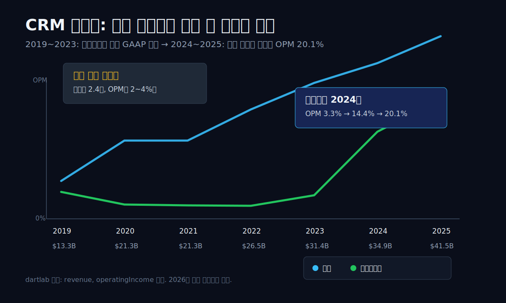
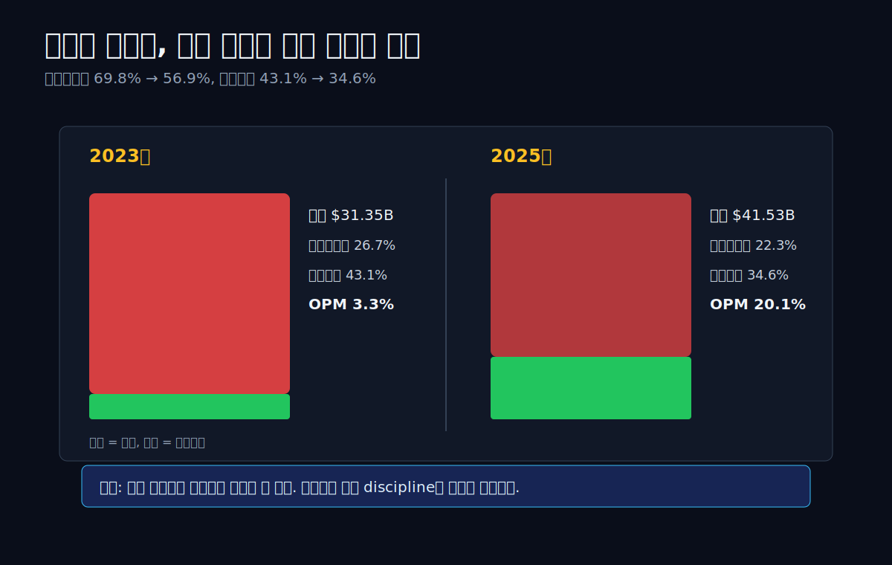
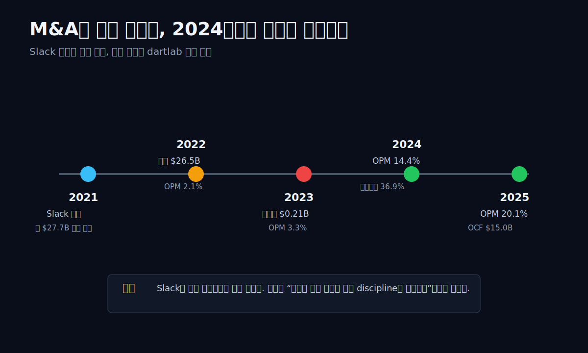
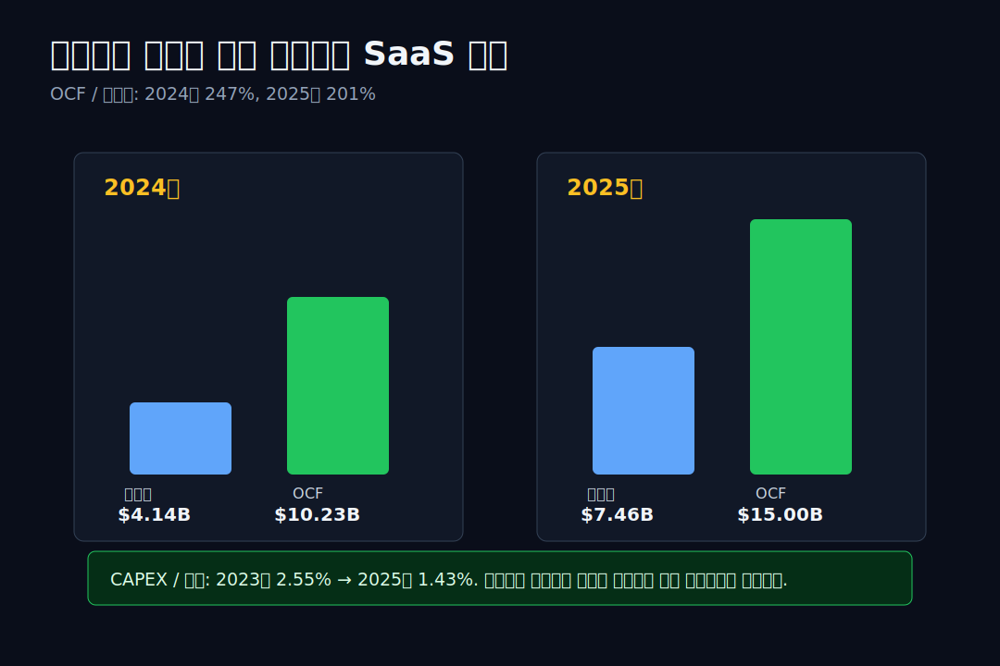
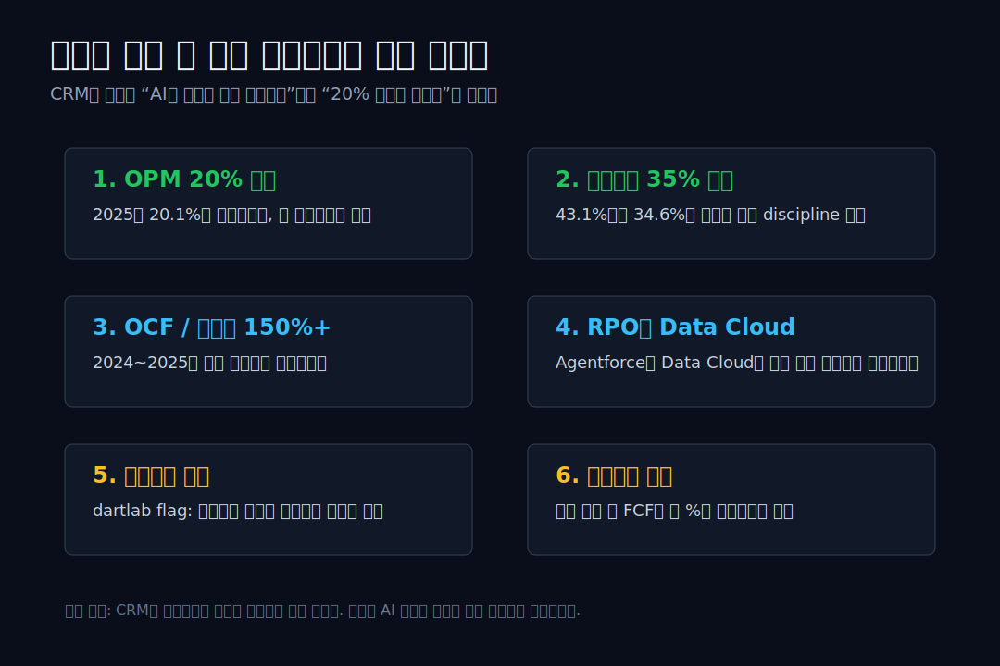

> **데이터 기준**: 2026-06-18 dartlab 실측 — Salesforce(CRM) 미국 연결(USD), 분기 데이터를 라벨연도별 합산. 이 글의 dartlab **2025 라벨은 회사 FY2026(2026-01-31 종료) 실적과 대응**한다. 2026년 이후 공식 공시는 RPO·Agentforce·가이던스·주주환원 맥락으로만 분리해 인용한다.
>
> **핵심 숫자**: 매출 **13.28B(2019) → 41.53B(2025)** · 영업이익률 **3.3%(2023) → 20.1%(2025)** · 판관비율 **43.1%(2023) → 34.6%(2025)** · 2025년 영업현금흐름 **15.00B**, 순이익 **7.46B**.
>
> **이 글의 용어**: 영업이익률(OPM) = 영업이익 ÷ 매출 · 판관비율 = 판매관리비 ÷ 매출 · 영업현금흐름(OCF) = 실제 영업활동에서 들어온 현금 · 자유현금흐름(FCF) = 영업현금흐름 - CAPEX.

---

## 프롤로그 — 매출은 벌써 3배였는데, 이익은 왜 늦게 왔나

Salesforce를 그냥 "AI CRM 회사"라고 부르면 너무 쉽다. 지금 투자자들이 듣고 싶은 말은 Agentforce, Data Cloud, AI 자동화다. 하지만 손익계산서가 먼저 보여주는 장면은 조금 다르다. Salesforce는 이미 오래전부터 성장하고 있었다. 2019년 매출 13.28B가 2025년 41.53B가 됐다. 6년 만에 3.1배다. 그런데 영업이익률은 그 성장 속도를 전혀 따라오지 못했다.

2019년 영업이익률은 4.0%였다. 2020년과 2021년은 2.1%, 2022년은 2.1%, 2023년은 3.3%다. 매출이 13B에서 31B까지 커지는 동안, 손익계산서 아래쪽은 여전히 2~4%대에 갇혀 있었다. SaaS라면 매출총이익률이 높고, 규모가 커질수록 영업이익률이 올라가야 한다. 그런데 Salesforce의 장부는 오랫동안 그 교과서와 반대로 보였다. 클라우드 회사인데 왜 이렇게 안 남겼나.


사람들이 Salesforce에서 정말 궁금해할 장면은 여기다. **이 회사는 매출이 커져서 이익이 난 회사가 아니라, 매출이 커진 뒤 비용을 접어서 이익이 난 회사다.** 2024년부터 판관비율이 내려가고, 2025년에 영업이익률이 20.1%까지 오른다. 그래서 이 글은 AI 제품 발표가 아니라 손익계산서의 모양을 본다. 매출 3배 뒤에, 왜 하필 지금 마진이 열렸는가.



---

## 막1 — 2019~2023년, 성장했지만 거의 남기지 못했다

먼저 성장 자체는 의심할 필요가 없다. dartlab 실측에서 Salesforce 매출은 2019년 13.28B, 2020년 21.25B, 2021년 21.25B, 2022년 26.49B, 2023년 31.35B다. 2019년에서 2023년까지 이미 2.4배가 됐다. 2020년의 큰 점프에는 Tableau 등 인수 효과가 섞여 있고, 2021년에는 같은 라벨연도 수치가 반복되어 보인다. 그래서 이 구간의 메시지는 "매출이 매년 매끈하게 커졌다"가 아니라 "몸집은 이미 충분히 커졌다"다.

```python
import dartlab

c = dartlab.Company("CRM")
c.analysis("성장성")["growthTrend"]["history"]
```

그런데 같은 기간 영업이익률은 2019년 4.0%, 2020년 2.1%, 2021년 2.1%, 2022년 2.1%, 2023년 3.3%다. 매출은 2.4배인데 영업이익률은 4% 아래다. 이 모양이 Salesforce를 단순 SaaS 우량주로 읽기 어렵게 만든다. 구독 매출이 쌓이면 고정비 레버리지가 생긴다는 말은 맞지만, Salesforce는 그 레버리지를 2023년까지 손익에 거의 보여주지 못했다.

여기서 중요한 것은 매출총이익률이다. 2019년 74.0%, 2020년 74.4%, 2021년 74.4%, 2022년 73.5%, 2023년 73.3%다. 제품 자체의 총마진은 높고 안정적이다. 문제는 원가가 아니라 그 아래다. 연구개발, 영업, 마케팅, 일반관리, 인수 통합 비용이 매출총이익을 대부분 먹었다. 그래서 Salesforce의 오래된 질문은 "제품은 좋은데 왜 영업이익이 얇은가"였다.

이 질문은 2023년에 가장 선명해진다. 매출 31.35B, 매출총이익 22.99B, 영업이익 1.03B. 매출총이익은 23B 가까이 되는데 영업이익은 1B 남짓이다. 그 사이를 지나가는 비용이 회사의 진짜 이야기다. 성장주의 회계는 매출이 아니라 비용 비율에서 성격이 드러난다.

---

## 막2 — 범인은 원가가 아니라 판관비였다

Salesforce의 낮은 영업이익률을 매출원가로 설명하면 틀린다. 2023년 매출원가율은 26.7%였다. SaaS 회사로서 낮다고 할 수는 없지만, 사업을 망칠 수준은 아니다. 같은 해 판관비율은 43.1%다. 매출 100달러를 벌면 제품 원가로 26.7달러를 쓰고, 판매관리비로 43.1달러를 쓴다. 영업이익은 3.3달러만 남는다.

```python
cost = c.analysis("비용구조")["costBreakdown"]["history"]
# 2023: costOfSalesRatio 26.66, sgaRatio 43.14
# 2025: costOfSalesRatio 22.32, sgaRatio 34.55
```

이 숫자가 Salesforce의 회계적 인물 소개다. 회사는 제품을 싸게 만들지 못해서 낮은 마진을 낸 것이 아니다. 고객을 얻고, 조직을 유지하고, 인수한 회사를 붙이고, 글로벌 엔터프라이즈 영업망을 돌리는 비용이 컸다. 매출총이익률 73%대 회사가 영업이익률 3%대에 머문 이유는, 총이익 아래에서 비용이 너무 컸기 때문이다.




2025년에는 모양이 달라진다. 매출원가율은 22.3%로 내려가고, 판관비율은 34.6%로 내려간다. 영업비용률은 2023년 69.8%에서 2025년 56.9%로 12.9%포인트 낮아졌다. 영업이익률은 3.3%에서 20.1%로 올라왔다. 이건 제품이 갑자기 완전히 달라졌다기보다, 조직 비용과 영업 비용의 기준선이 내려간 사건이다.

숫자를 더 세게 말하면 이렇다. 2023년에서 2025년 사이 매출은 31.35B에서 41.53B로 10.17B 늘었다. 같은 기간 영업이익은 1.03B에서 8.33B로 7.30B 늘었다. 매출 증가분의 상당 부분이 영업이익으로 떨어졌다. 성장주가 비용을 접으면 어떤 일이 생기는지, Salesforce는 2024~2025년에 손익계산서로 보여줬다.

---

## 막3 — 2024년, 비용 discipline이 손익에 처음 찍혔다

2024년은 전환점이다. 매출은 34.86B로 전년 대비 11.2% 증가했다. 성장률만 보면 대단하지 않다. 그런데 영업이익은 1.03B에서 5.01B로 뛰었다. 영업이익률은 3.3%에서 14.4%가 됐다. 매출이 11% 늘었는데 영업이익이 386% 늘었다. 이건 성장률의 이야기가 아니라 레버리지의 이야기다.

dartlab의 수익성 분해도 같은 결론을 낸다. 2024년 영업이익률 개선 요인에서 판관비 효율 기여가 가장 크다. 원가율 개선도 있었지만, 본체는 판관비다. 2025년에도 같은 흐름이 이어진다. 매출 41.53B, 영업이익 8.33B, 영업이익률 20.1%. 영업이익은 다시 66.3% 늘었다.

이 장면에서 조심해야 할 것이 있다. Salesforce는 2020~2021년 Tableau와 Slack 같은 대형 인수를 거쳤고, Slack 인수는 2021년 7월 완료됐다. Salesforce가 2020년 발표한 조건 기준 Slack의 기업가치는 약 27.7B였다. 하지만 이 글은 Slack을 영업이익률 반전의 단일 원인으로 쓰지 않는다. 인수는 몸집과 비용 구조를 바꾼 외부 맥락이고, dartlab이 검증하는 것은 손익계산서에 찍힌 결과다.



2023년의 낮은 영업이익률을 "나쁜 회사"로 읽는 것도 틀리고, 2025년의 20% 영업이익률을 "완성"으로 읽는 것도 빠르다. 정확한 표현은 이렇다. **Salesforce는 대형 인수와 성장 비용을 지나, 2024년부터 비용 기준선을 낮추는 국면에 들어갔다.** 지금의 질문은 성장률이 몇 %냐보다 이 비용 기준선이 유지되느냐다.

---

## 막4 — 순이익보다 현금이 먼저 들어온다

영업이익률만 보면 놓치는 것이 있다. Salesforce의 이익 품질은 영업현금흐름에서 더 강하게 보인다. 2024년 순이익은 4.14B였고, 영업현금흐름은 10.23B였다. 2025년 순이익은 7.46B였고, 영업현금흐름은 15.00B였다. 두 해 모두 영업현금흐름이 순이익의 2배 안팎이다.

```python
quality = c.analysis("이익품질")["accrualAnalysis"]["history"]
# 2025: OCF 14.996B, netIncome 7.457B, OCF/NI 201.1%
# 2024: OCF 10.234B, netIncome 4.136B, OCF/NI 247.4%
```

이건 SaaS 모델의 중요한 장점이다. 고객 계약과 청구 구조 때문에 회계상 이익보다 현금이 먼저 들어오는 구간이 생긴다. 물론 모든 OCF 초과가 무조건 좋은 것은 아니다. 선수금, 청구 타이밍, 매출채권 변화, 계약 구조를 같이 봐야 한다. 그래도 Salesforce의 최근 전환이 단순 회계상 이익 부풀리기가 아니라 현금으로도 따라오고 있다는 점은 강하다.



자유현금흐름도 같은 말을 한다. 2025년 영업현금흐름 15.00B에서 CAPEX 0.59B를 빼면 자유현금흐름은 14.40B다. CAPEX/매출은 1.43%다. 제조업이나 데이터센터 운영 기업처럼 대규모 물리 투자가 매출을 따라붙는 구조가 아니다. 매출이 커지고 비용 비율이 낮아지면 현금이 빠르게 쌓이는 구조다.

그래서 Salesforce는 더 이상 "돈을 못 버는 성장주"라고 부르기 어렵다. 2025년의 모양은 성장주보다 현금성 품질주에 가깝다. 다만 품질주가 되려면 한 해가 아니라 기준선이 필요하다. 20% 영업이익률과 15B 영업현금흐름이 다음 해에도 이어져야 한다.

---

## 막5 — RPO는 예약 매출인가, 기대가 커진 착시인가

Salesforce를 SaaS 회사로 볼 때 가장 매력적인 숫자는 잔여수행의무(RPO)다. RPO는 이미 계약했지만 아직 매출로 인식하지 않은 금액이다. 말하자면 고객이 앞으로 받을 서비스를 Salesforce 장부가 미리 알고 있는 숫자다. 2026년 5월 FY27 1분기 발표에서 Salesforce는 current RPO 33.6B, 총 RPO 67.9B를 제시했다. current RPO는 12개월 안에 매출로 인식될 계약 잔고이고, 총 RPO는 그보다 긴 계약 잔고까지 포함한다.

이 숫자만 보면 이야기가 아주 쉽게 풀린다. "이미 67.9B가 계약돼 있으니 매출은 단단하다." 하지만 좋은 글은 여기서 멈추면 안 된다. Salesforce의 SEC 공시는 RPO가 미래 매출 성장의 직접 지표가 아니라고 선을 긋는다. RPO는 계절성, 갱신 시점, 계약 기간, 환율, 인수 효과에 영향을 받는다. 특히 다년 계약을 연 단위로 청구하면 계약 초기에 RPO가 높고 갱신 직전에는 낮아질 수 있다. 그래서 RPO는 매출 예약표이면서 동시에 해석이 필요한 숫자다.

이 장면이 흥미로운 이유는 Salesforce의 현금흐름과 연결되기 때문이다. SaaS 회사는 고객에게 먼저 청구하고, 서비스를 제공하면서 매출을 나눠 인식한다. 이 구조에서는 현금이 손익보다 먼저 들어올 수 있다. Salesforce가 2025년에 순이익 7.46B보다 훨씬 큰 영업현금흐름 15.00B를 낸 것도 이 구조와 정합적이다. 다만 RPO가 크다는 사실만으로 "앞으로 매출이 무조건 커진다"고 쓰면 회계의 경계선을 넘는다.

```python
integrity = c.analysis("재무정합성")
integrity["isBsDivergence"]["history"]
# 2025: revenueGrowth 19.13%, receivableGrowth 33.32%, revRecGap 14.19%p
# summaryFlags: "매출채권 성장이 매출 성장보다 38%p 빠름 — 매출 인식 의심"
```

dartlab도 같은 쪽을 찌른다. 2025년에는 매출 성장률 19.1%보다 매출채권 성장률 33.3%가 더 빠르다. summary flag에는 더 큰 누적 경고가 잡힌다. 이걸 곧장 매출 인식 문제라고 단정하면 과장이다. Salesforce는 대형 엔터프라이즈 계약, 갱신 청구, 이연수익, RPO가 모두 섞인 회사다. 매출채권이 튀는 해가 생길 수 있다. 하지만 그래서 더 봐야 한다. AI 제품이 실제 청구와 현금으로 연결되는지, 아니면 계약·청구 타이밍만 앞서가는지 구분해야 한다.

여기서 독자가 붙잡아야 할 질문은 하나다. **RPO가 큰 회사인가, RPO가 매출과 현금으로 조용히 번역되는 회사인가.** 전자는 발표자료의 숫자이고, 후자는 다음 몇 분기의 손익계산서와 현금흐름표가 증명해야 하는 숫자다.

---

## 막6 — Agentforce는 드디어 성장 재가속의 장면을 만들었다

이제 투자자가 보고 싶은 AI 이야기가 나온다. Salesforce는 Data Cloud, Einstein, Agentforce를 전면에 세운다. 고객 데이터 통합, 영업 자동화, 서비스 자동화, 마케팅 자동화는 모두 Salesforce가 이미 가진 고객 기반 위에 올라간다. 논리는 매력적이다. 기존 고객에게 더 많은 모듈을 팔고, AI 기능으로 seat당 매출을 높이고, workflow 자동화로 이탈을 줄인다.


FY27 1분기 발표는 이 서사를 꽤 세게 밀어준다. Salesforce는 분기 매출 11.1B, 전년 대비 13% 성장을 발표했다. current RPO는 33.6B로 14% 증가했고, 총 RPO는 67.9B로 11% 증가했다. Agentforce ARR은 1.2B, Agentforce와 Data 360을 합친 ARR은 거의 3.4B라고 밝혔다. "AI가 돈이 되느냐"는 질문에 대해, 최소한 회사 발표 숫자는 "이미 별도 라인이 생겼다"고 말한다.

하지만 이 글은 AI 제품명을 따라가지 않는다. 제품명이 많아질수록 손익계산서에서 봐야 할 것은 더 단순해진다. 첫째, GAAP 영업이익률이 20% 근처를 지키는가. FY27 1분기 GAAP 영업이익률은 21.1%였고, FY27 연간 가이던스는 GAAP 영업이익률 20.6%다. 둘째, current RPO 성장이 매출 성장과 비슷하거나 그 이상으로 유지되는가. 셋째, AI·데이터 ARR이 기존 고객 업셀인지, 인수 효과인지, 신규 수요인지 구분되는가.

Salesforce가 FY27 1분기 발표에서 말한 Agentforce와 Data 360 ARR에는 Informatica Cloud ARR 1.1B가 포함된다. 이게 나쁘다는 뜻은 아니다. 다만 "AI ARR이 폭발했다"와 "인수한 매출원이 포함됐다"는 문장을 같은 줄에 놓아야 한다. Salesforce는 Slack 때도 그랬다. 대형 인수는 성장률을 올릴 수 있지만, 비용·상각·통합 리스크도 같이 가져온다. 그래서 AI 서사는 항상 두 장의 장부로 봐야 한다. 매출 장부와 비용 장부다.

이 막에서 결론은 간단하다. Agentforce는 진짜 볼 만한 이야기다. 숫자도 생겼다. 그러나 Salesforce의 투자 포인트가 바뀐 것은 아니다. 2024~2025년에 만들어진 비용 기준선 위에서 AI가 붙어야 한다. AI가 매출을 다시 가속하면서 영업이익률 20%를 지키면 Salesforce는 성장주와 품질주의 좋은 조합이 된다. AI가 영업·R&D·인수 비용을 다시 키우면, 20% 마진은 일시적 비용 절감의 산물로 내려앉는다.

---

## 막7 — non-GAAP 34%와 GAAP 20% 사이에 SBC가 있다

Salesforce 발표자료에는 두 개의 마진이 같이 나온다. FY26 GAAP 영업이익률 20.1%, non-GAAP 영업이익률 34.1%. FY27 가이던스도 비슷하다. GAAP 영업이익률 20.6%, non-GAAP 영업이익률 34.3%. 겉으로 보면 둘 다 좋다. 하지만 두 숫자 사이의 14%포인트가 그냥 사라지는 것은 아니다.

가장 큰 조정 항목은 주식보상비용(SBC)이다. FY27 연간 가이던스의 GAAP→non-GAAP 영업이익률 조정표에서 SBC는 매출의 9.0%포인트로 제시된다. FY26 공식 실적의 현금흐름표에서도 stock-based compensation expense는 약 3.48B다. SBC는 현금이 바로 나가는 비용이 아니다. 그래서 영업현금흐름을 키워 보이게 만드는 면이 있다. 동시에 주주 입장에서는 희석과 자사주 매입의 필요를 만든다.

```python
quality = c.analysis("이익품질")
quality["accrualAnalysis"]["history"][1]
# 2025: netIncome 7.457B, OCF 14.996B, OCF/NI 201.1%
```

이 대목을 잘못 쓰면 둘 다 틀린다. "SBC는 비현금이니 무시해도 된다"는 말도 틀리고, "SBC가 있으니 현금흐름은 가짜다"도 틀린다. SaaS 회사의 영업현금흐름은 선청구와 이연수익 때문에 실제로 강할 수 있다. 하지만 SBC가 영업현금흐름과 GAAP 이익 사이의 간극을 키우는 것도 사실이다. 그래서 Salesforce는 cash machine이면서 동시에 주주 수를 관리해야 하는 회사다.

이 관점에서 자사주 매입도 새롭게 보인다. 자사주 매입은 단순한 주주환원이 아니다. SBC로 생기는 희석을 상쇄하는 방어 장치이기도 하다. Salesforce가 2024~2025년에 자사주 매입을 크게 늘린 것은 "돈을 돌려준다"는 신호인 동시에 "주식보상 비용을 자본 배분으로 정리한다"는 신호다. 좋은 SaaS 회사일수록 이 두 숫자를 같이 봐야 한다. SBC를 많이 주고, 그만큼 자사주를 사서 희석을 막고, 그래도 자유현금흐름이 남는가.

Salesforce의 현재 답은 꽤 긍정적이다. 2025년 자유현금흐름은 14.40B다. 배당 1.59B를 빼도 12.82B가 남는다. 공식 FY26 발표에서도 회사는 12.7B 자사주 매입과 1.6B 배당을 포함해 14.3B를 주주에게 돌려줬다고 밝혔다. 문제는 이 수준이 매년 반복 가능한가다. SBC·인수·AI 투자·부채 비용이 동시에 올라가면 자유현금흐름의 여유는 줄어든다.

---

## 막8 — 25B 자사주는 자신감인가, 새로운 부담인가

Salesforce의 가장 극적인 장면은 FY27 1분기 주주환원이다. 회사는 27.5B를 주주에게 돌려줬고, 그중 27.1B가 자사주 매입이었다. 동시에 25B accelerated share repurchase(ASR)를 체결해 103M 주를 먼저 받았다. 103M 주는 회사가 말한 예상 매입 주식의 약 80%다. 이 정도 규모의 자사주는 단순한 "배당 시작"보다 훨씬 큰 메시지다.

숫자를 놓고 보면 왜 이런 선택을 했는지 이해된다. Salesforce는 이제 현금을 낸다. 2025년 영업현금흐름 15.00B, 자유현금흐름 14.40B. CAPEX/매출은 1.43%다. 매출이 커져도 공장과 설비를 대규모로 깔아야 하는 회사가 아니다. 비용 기준선이 유지되면 현금이 빠르게 남는다. 남는 현금의 일부는 배당으로, 더 큰 부분은 자사주로 간다.

```python
capital = c.analysis("자본배분")
capital["dividendPolicy"]["history"][1]
capital["fcfUsage"]["history"][1]
```

그런데 FY27 1분기 ASR에는 중요한 주석이 붙는다. 회사는 FY27 영업현금흐름과 자유현금흐름 성장률 가이던스를 약 4~5%로 제시하면서, 25B 부채 발행의 영향을 반영한다고 설명했다. 즉 대규모 자사주는 순수하게 남는 현금만으로 조용히 처리하는 이벤트가 아니다. 자본구조의 선택이다. 낮은 자본집약도와 높은 현금흐름을 믿고, 주식 수를 빠르게 줄이는 쪽에 베팅한 것이다.

이 선택은 좋을 수도 있고 나쁠 수도 있다. 주가가 합리적인 가격이고, GAAP 20% 마진이 유지되고, Agentforce가 매출을 다시 밀어 올리면 ASR은 강력한 주당가치 확대 장치다. 반대로 AI 성장률이 기대보다 낮고, 인수 통합 비용과 SBC가 계속 크고, 영업현금흐름 성장률이 둔화되면 ASR은 미래의 유연성을 당겨 쓴 선택이 된다. 그래서 주주환원은 결론이 아니라 질문이다.

Salesforce가 예전과 달라진 것은 맞다. 2023년까지의 회사는 "나중에 벌겠다"는 성장주에 가까웠다. 지금은 "벌고, 사고, 배당한다"는 품질주 문법을 쓴다. 하지만 품질주는 한 해의 현금으로 완성되지 않는다. 품질주는 반복성이다. 20% GAAP 마진, 14B 이상의 자유현금흐름, SBC를 감당한 뒤에도 줄어드는 주식 수, RPO가 매출로 번역되는 흐름이 2~3년 이어져야 한다.



---

## 막9 — 경쟁사와 나란히 보면 Salesforce의 장점과 약점이 보인다

Salesforce만 보면 이 회사가 갑자기 훌륭해진 것처럼 보인다. 하지만 소프트웨어 회사들은 각자 다른 방식으로 같은 질문을 받는다. [ServiceNow](/blog/NOW-servicenow)는 현금흐름이 GAAP 이익보다 먼저 들어오는 구조가 선명하지만, 영업이익률은 10%대 중반에 머문다. [어도비](/blog/ADBE-adobe)는 높은 마진을 이미 갖고 있지만, 생성형 AI 이후 가격 결정력과 성장률 재가속을 증명해야 한다. [오라클](/blog/ORCL-oracle)은 클라우드 성장과 부채·CAPEX 부담이 같이 커진다.

이 비교에서 Salesforce의 위치는 독특하다. 어도비처럼 이미 고마진이었던 회사가 아니다. 오라클처럼 인프라 투자 부담이 큰 회사도 아니다. ServiceNow처럼 아직 GAAP 마진이 10%대 중반에 머무는 회사도 아니다. Salesforce는 대형 SaaS 복합체가 긴 저마진 구간을 지나, 2024~2025년에야 GAAP 20% 마진을 보여준 회사다. 그래서 시장이 묻는 질문도 다르다. "이 회사가 클라우드 회사인가"가 아니라 "이제야 생긴 20% 마진이 구조인가"다.

이 질문이 좋은 이유는 답이 숫자로 나온다는 점이다. 앞으로 4개를 보면 된다. 첫째, GAAP 영업이익률이 20% 아래로 다시 내려가는지. 둘째, 판관비율이 34~35% 선에서 유지되는지. 셋째, current RPO 성장률이 매출 성장률과 같이 가는지. 넷째, 자사주 매입 뒤에도 순현금·부채 부담이 과도해지지 않는지. 제품 발표는 많아도, 판단표는 네 줄이면 충분하다.

여기서 Salesforce의 장점은 고객 기반이다. 영업, 서비스, 마케팅, 커머스, 분석, 통합, Slack까지 이미 기업 업무의 앞단을 넓게 잡고 있다. AI 기능은 새 고객을 완전히 새로 만드는 것보다 기존 고객에게 붙이는 쪽이 자연스럽다. 반대로 약점도 같은 곳에 있다. 제품군이 넓고 인수의 역사가 길기 때문에, 조직 비용과 통합 비용이 다시 커질 수 있다. Salesforce의 장점과 약점은 같은 문장에서 나온다. 너무 많은 고객 접점이 있고, 너무 많은 제품 접점이 있다.

---

## 막10 — 이 이야기가 틀리는 조건은 무엇인가

좋은 투자 이야기는 맞는 이유보다 틀리는 조건이 더 중요하다. Salesforce의 이번 이야기도 마찬가지다. "매출 3배 뒤에 마진 20%"라는 문장은 강하다. "Agentforce가 붙고 RPO가 크다"는 문장도 강하다. 하지만 둘이 동시에 참이어야 한다. 매출이 다시 빨라지는데 비용도 같이 빨라지면, 이 글의 결론은 약해진다.

첫 번째로 볼 것은 current RPO와 매출의 간격이다. current RPO가 14% 늘고 매출이 13% 늘면, 아직은 자연스럽다. 계약 잔고와 실제 매출 인식이 같은 방향으로 간다. 하지만 current RPO만 높고 매출 성장률이 내려오면 이야기가 바뀐다. 그때는 "계약은 있는데 인식 속도가 느린가", "갱신·청구 타이밍 효과인가", "인수 효과가 섞였나"를 따져야 한다. RPO는 훌륭한 선행 단서지만, 매출보다 먼저 결론을 내려주지는 않는다.

두 번째는 GAAP 영업이익률이다. Salesforce가 진짜 달라졌다는 증거는 non-GAAP 34%가 아니라 GAAP 20%다. non-GAAP 34%는 회사가 비용을 조정한 뒤 보여주는 운영 체력이다. GAAP 20%는 주식보상비용, 상각, 구조조정, 인수 관련 비용을 통과한 뒤 남는 장부 체력이다. 두 숫자 모두 의미가 있지만, 이 글의 핵심은 GAAP 쪽이다. Salesforce가 20%대 GAAP 마진을 유지하면 "비용을 접었다"는 이야기는 강해진다. 10%대 중반으로 내려가면 반전은 아직 완성되지 않은 것이다.

세 번째는 주식 수다. Salesforce는 이제 배당과 자사주를 말한다. 하지만 SaaS 회사에서 자사주는 항상 두 얼굴을 가진다. 하나는 주주환원이고, 다른 하나는 SBC 희석 방어다. 자사주 매입 규모가 커도 주식 수가 의미 있게 줄지 않으면, 현금이 주주에게 돌아간다기보다 직원 보상의 희석을 막는 데 많이 쓰였다는 해석이 가능하다. 반대로 SBC를 감당하고도 주식 수가 줄고, 부채 부담이 과하지 않으면 주당가치는 실제로 올라간다.

네 번째는 인수 효과다. Salesforce는 Tableau와 Slack을 지나 Informatica까지 품었다. 인수는 제품군을 넓히고 데이터 레이어를 강화한다. 하지만 인수는 언제나 숫자를 흐린다. 매출 성장률에 얼마가 유기 성장이고 얼마가 인수 기여인지, RPO에 얼마가 새로 붙은 계약 잔고인지, 상각과 통합 비용이 마진을 얼마나 누르는지 분리해야 한다. FY27 1분기 발표의 Agentforce와 Data 360 ARR에도 Informatica Cloud ARR 1.1B가 포함된다. 이 문장을 빼면 서사가 너무 예뻐진다.

다섯 번째는 현금흐름의 계절성이다. Salesforce 공시는 1분기가 보통 가장 큰 collections와 operating cash flow quarter가 된다고 설명한다. 대기업 갱신과 청구 패턴 때문이다. 그래서 FY27 1분기 영업현금흐름 6.7B를 보고 연간 26B 현금흐름을 단순 곱하면 안 된다. SaaS 현금흐름은 강하지만, 분기별 모양은 고르지 않다. 이 회사를 볼 때는 단일 분기보다 최근 4분기 누적과 연간 가이던스를 같이 봐야 한다.

```python
# 다음 분기 업데이트 때 확인할 네 줄
crm = dartlab.Company("CRM")
crm.analysis("수익성")["marginTrend"]["history"]
crm.analysis("재무정합성")["isBsDivergence"]["history"]
crm.analysis("이익품질")["accrualAnalysis"]["history"]
crm.analysis("자본배분")["dividendPolicy"]["history"]
```

이 네 줄이 Salesforce 읽기의 뼈대다. 수익성은 GAAP 20%가 구조인지 본다. 재무정합성은 매출채권과 매출 성장의 간격을 본다. 이익품질은 순이익과 영업현금흐름의 관계를 본다. 자본배분은 배당·자사주·SBC 이후에도 주주가 실제로 좋아지는지 본다. 발표자료의 단어가 바뀌어도 이 네 줄은 잘 안 바뀐다.

이야기가 더 흥미로운 이유는 Salesforce가 소프트웨어 회사의 중년 국면에 들어왔기 때문이다. 처음에는 성장만 보면 됐다. 매출이 빨리 크면 시장은 기다려줬다. 그다음에는 수익성을 요구했다. 비용을 줄이고 영업이익률을 보여달라는 압박이 왔다. 이제는 세 번째 시험이다. 성장도 다시 보여주고, 마진도 지키고, 현금도 돌려주고, SBC 희석도 관리해야 한다. 쉬운 회사는 아니다. 하지만 그래서 볼 만하다.

Salesforce가 이 시험을 통과하면 성격이 바뀐다. "클라우드 성장주"가 아니라 "AI 기능을 얹은 현금성 엔터프라이즈 플랫폼"이 된다. 실패하면 다시 예전 질문으로 돌아간다. 매출은 크지만 왜 이렇게 비용이 많이 드는가. 이 두 결론 사이의 차이는 제품 발표 한 줄이 아니라, 앞으로 몇 분기 동안 판관비율·RPO·SBC·주식 수가 같이 만드는 모양에서 갈린다.

---

## 막11 — 다음 실적에서 15분 안에 업데이트하는 법

Salesforce는 숫자가 많은 회사다. 그래서 실적 발표 날에 모든 표를 다 보면 오히려 판단이 흐려진다. 이 글의 질문은 "비용을 접은 상태로 AI 성장까지 붙을 수 있는가"다. 다음 실적에서 그 질문을 업데이트하려면 순서가 중요하다. 제품 발표를 먼저 읽지 않는다. 손익계산서, RPO, 현금흐름, 자본배분 순서로 읽는다.

첫 줄은 GAAP 영업이익률이다. Salesforce가 FY27 연간 가이던스로 제시한 GAAP 영업이익률은 20.6%다. 분기마다 약간 흔들릴 수는 있다. 하지만 이 숫자가 20% 근처에 남아 있어야 한다. non-GAAP 34%대가 유지되어도 GAAP이 내려가면 이 글의 핵심은 약해진다. 비용을 접었다는 말은 조정 전 장부에서도 보여야 한다.

두 번째 줄은 current RPO 성장률이다. current RPO는 12개월 안에 매출로 인식될 계약 잔고다. FY27 1분기 current RPO는 33.6B, 성장률은 14%였다. 다음 분기에 이 숫자가 매출 성장률보다 훨씬 빠르게 둔화되면, AI 서사의 매출 번역 속도를 다시 봐야 한다. 반대로 current RPO가 매출 성장률 이상으로 유지되고 GAAP 마진도 20% 선이면, Salesforce의 질은 올라간다.

세 번째 줄은 매출채권과 이연수익이다. 매출채권은 고객에게 청구했지만 아직 현금으로 받지 못한 돈이고, 이연수익은 먼저 받은 돈을 아직 매출로 인식하지 않은 부채다. Salesforce 같은 구독 회사는 이 두 줄이 중요하다. 매출채권이 매출보다 너무 빨리 늘면 현금화 속도를 점검해야 한다. 이연수익이 건강하게 쌓이면 선청구 구조가 유지된다는 뜻이다. 둘 중 하나만 보고 결론을 내리면 안 된다.

네 번째 줄은 주식 수와 부채다. 25B ASR 이후 Salesforce의 주식 수는 내려가야 자연스럽다. 그런데 SBC가 계속 크면 자사주 매입의 상당 부분은 희석 방어에 쓰인다. 여기에 부채가 늘면 자사주 매입의 성격이 더 복잡해진다. 현금이 남아서 산 것인지, 주가와 자본구조 판단으로 당겨 산 것인지 구분해야 한다. 좋은 결과는 명확하다. 주식 수가 줄고, 부채 부담은 관리 가능하고, 자유현금흐름은 계속 남는 것이다.

이 네 줄을 한 화면에 놓으면 Salesforce 업데이트가 쉬워진다.

| 확인 순서 | 봐야 할 숫자 | 좋은 신호 | 나쁜 신호 |
|---|---|---|---|
| 1 | GAAP 영업이익률 | 20% 안팎 유지 | 10%대 중반 재하락 |
| 2 | current RPO 성장률 | 매출 성장률과 동행 또는 상회 | RPO 둔화가 매출보다 빠름 |
| 3 | 매출채권·이연수익 | 현금화와 선청구가 같이 건강 | 매출채권만 빠르게 증가 |
| 4 | 주식 수·부채 | 자사주 뒤 주식 수 감소, 부채 관리 | SBC 방어에 현금 대부분 소진 |

이 표의 장점은 제품명에 흔들리지 않는다는 것이다. Agentforce, Data 360, Slack MCP, Informatica, Sales Cloud, Service Cloud 이름이 어떻게 바뀌어도 회계 질문은 그대로다. 고객이 계약했는가. 계약이 매출로 바뀌는가. 매출이 마진을 해치지 않는가. 마진이 현금으로 남는가. 남은 현금이 주주에게 실제로 돌아가는가. 이 다섯 문장으로 Salesforce를 충분히 따라갈 수 있다.

그래서 이 글의 독자는 다음 실적 발표를 기다릴 때 "AI 기능이 몇 개 늘었나"보다 "20% 마진이 살아 있나"를 먼저 봐야 한다. 기능이 늘어도 마진이 깨지면 이야기는 약해진다. 기능이 늘고 current RPO가 따라오고, GAAP 마진까지 유지되면 이야기는 강해진다. 결국 Salesforce의 다음 국면은 기술 데모가 아니라 회계 데모다. AI가 장부에 얹히는 순간을 보는 것이다.

판정은 세 갈래로 나뉜다. 가장 좋은 경우는 current RPO가 두 자릿수로 늘고, FY27 매출 가이던스가 유지 또는 상향되고, GAAP 영업이익률이 20% 위에 남고, 자사주 뒤 주식 수가 실제로 줄어드는 그림이다. 이때 Agentforce는 단순 제품명이 아니라 기존 고객 기반을 더 깊게 파고드는 업셀 엔진으로 읽을 수 있다. Salesforce는 성장률 재가속과 비용 discipline을 동시에 보여주는 회사가 된다.

중립적인 경우는 매출과 RPO는 괜찮지만 GAAP 마진이 조금 밀리는 그림이다. 이때는 이유가 중요하다. Informatica 통합 비용, 일회성 구조조정, 상각, 환율, 영업 인력 재배치처럼 설명 가능한 비용이면 기다릴 수 있다. 하지만 영업·마케팅 비용률이 다시 올라가고, AI 제품을 팔기 위해 조직 비용이 구조적으로 커지는 모양이면 이야기가 달라진다. 그때는 "성장을 위해 다시 비용을 열었다"는 쪽으로 읽어야 한다.

나쁜 경우는 RPO 성장률이 둔화되고, 매출채권이 매출보다 빠르게 늘고, GAAP 마진이 내려가고, 자사주 매입에도 주식 수가 뚜렷하게 줄지 않는 그림이다. 이 네 가지가 같이 나오면 Salesforce의 2024~2025년 반전은 구조적 전환이 아니라 비용 절감 사이클로 보일 수 있다. 이 글의 결론도 그때는 바뀐다. "품질주로 넘어갔다"가 아니라 "품질주가 되려는 시험을 치르는 중"으로 낮춰야 한다.

결국 Salesforce의 업데이트는 의견 싸움이 아니다. 숫자가 이미 체크리스트를 준다. 한쪽에는 RPO와 Agentforce ARR이 있고, 다른 한쪽에는 GAAP 마진과 SBC와 주식 수가 있다. 앞쪽만 좋아지면 성장 서사다. 뒤쪽까지 같이 좋아지면 좋은 회사다. 이 차이를 구분하는 것이 이번 글의 목적이다.

그래서 다음 실적 발표에서 가장 먼저 볼 문장은 CEO 코멘트가 아니다. "GAAP operating margin"과 "current remaining performance obligation"이다. 둘이 같이 살아 있으면 AI 서사는 숫자와 연결된다. 하나만 살아 있으면 아직 반쪽짜리다.

Salesforce는 지금 멋진 단어보다 단순한 증명이 필요한 회사다. 계약 잔고가 매출로 바뀌고, 매출이 마진을 해치지 않고, 마진이 현금과 주당가치로 남는지 보면 된다.

그 순서만 지키면 다음 발표자료가 아무리 화려해도 판단은 흔들리지 않는다.

그래서 Salesforce는 다음 분기에도 같은 질문으로 다시 읽을 수 있다.

---

## 에필로그 — 이 회사는 AI 회사가 되기 전에 비용을 접었다

Salesforce를 보는 렌즈는 바뀌어야 한다. 2019~2023년의 회사는 "크게 성장하지만 별로 안 남기는 SaaS 복합체"였다. 2024~2025년의 회사는 "비용 기준선을 낮춰 20% 영업이익률을 만든 현금성 소프트웨어 플랫폼"이다. 이 차이를 놓치면, AI CRM 발표만 따라가거나 과거 낮은 마진만 보고 늦게 판단하게 된다.

이 글의 판단은 세 문장이다. 첫째, Salesforce의 반전은 매출 성장 자체가 아니라 판관비율 하락에서 왔다. 둘째, 2025년 영업현금흐름 15.00B는 이익의 현금화를 강하게 뒷받침하지만, RPO·매출채권·SBC를 함께 봐야 한다. 셋째, 다음 국면의 핵심은 AI가 아니라 20% 영업이익률의 지속성이다. AI가 마진을 유지한 채 매출을 다시 가속하면 좋은 회사가 더 좋아진다. AI가 비용을 다시 키우면 2024~2025년의 discipline은 일회성으로 끝난다.

그래서 Salesforce에서 정말 흥미로운 이야기는 "AI CRM 1등"이 아니다. 더 날카로운 이야기는 이것이다. **이 회사는 AI 회사가 되기 전에 먼저 비용을 접었다. 이제 AI가 그 비용 기준선을 망치지 않고 다시 성장률을 올릴 수 있는지가 전부다.** 이 질문은 제품 발표보다 느리지만, 투자 판단에는 더 강하다.

비슷한 전환을 나란히 보면 결이 또렷하다. 구독 고원의 [어도비](/blog/ADBE-adobe), 클라우드와 AI가 동시에 붙은 [마이크로소프트](/blog/MSFT-microsoft), 전환 비용으로 마진이 깎인 [오라클](/blog/ORCL-oracle), 하드웨어 제국에서 소프트웨어로 넘어가는 [시스코](/blog/CSCO-cisco), IT 워크플로 자동화로 마진을 키운 [ServiceNow](/blog/NOW-servicenow)를 같이 보면 Salesforce의 특수성이 보인다. 더 넓게는 외형을 줄여 체질을 바꾼 [IBM](/blog/IBM-ibm)과도 반대편 거울상이다. Salesforce는 소프트웨어 회사지만, 지금의 핵심 질문은 기술이 아니라 비용이다.

---

## 검증표

본문 인용 수치를 dartlab 호출과 외부 공시로 분리한다. dartlab 실측은 CRM 미국 연결(USD), 라벨연도별 분기 합산 기준이다.

| 본문 수치 | 출처 / 호출 | 결과 |
|---|---|---|
| 매출 13.28B(2019) → 41.53B(2025), 3.1배 | `c.analysis("성장성")["growthTrend"]["history"]` | ✓ 실측 |
| 2019~2023 영업이익률 2.1~4.0%대 | `c.analysis("수익성")["marginTrend"]["history"]` | ✓ 실측 |
| 2023 영업이익률 3.3% → 2024 14.4% → 2025 20.1% | 수익성 history 영업이익/매출 | ✓ 실측 |
| 2023 판관비율 43.1% → 2025 34.6% | `c.analysis("비용구조")["costBreakdown"]["history"]` | ✓ 실측 |
| 2025 매출원가율 22.3%, 매출총이익률 77.7% | 비용구조 및 수익성 history | ✓ 실측 |
| 2025 순이익 7.46B, 영업현금흐름 15.00B, OCF/NI 201.1% | `c.analysis("이익품질")["accrualAnalysis"]` | ✓ 실측 |
| 2025 자유현금흐름 14.40B, CAPEX 0.59B, CAPEX/매출 1.43% | `c.analysis("현금흐름")`, `c.analysis("자본배분")` | ✓ 실측 |
| 2025 배당금 1.59B, 배당성향 21.3% | `c.analysis("자본배분")["dividendPolicy"]` | ✓ 실측 |
| 2024 자사주 매입 7.62B, 2025 12.60B | `treasuryStockStatus.rows` | ✓ XBRL 실측 |
| 매출채권 성장이 매출 성장보다 빠름 | `c.analysis("종합평가")["summaryFlags"]` | ✓ flag, 단정 금지 |
| Slack 기업가치 약 27.7B | [Salesforce Slack 인수 계약 발표](https://www.salesforce.com/news/press-releases/2020/12/01/salesforce-definitive-agreement-update/) | 외부 인용 |
| Slack 인수 완료 2021-07-21 | [Salesforce Slack 인수 완료 발표](https://www.salesforce.com/news/press-releases/2021/07/21/salesforce-slack-deal-close/) | 외부 인용 |
| FY26 매출 41.5B, GAAP 영업이익률 20.1%, OCF 15.0B, FCF 14.4B | [Salesforce FY2026 Q4 결과](https://investor.salesforce.com/news/news-details/2026/Salesforce-Delivers-Record-Fourth-Quarter-Fiscal-2026-Results/default.aspx) | 외부 공시 |
| FY26 주주환원 14.3B(자사주 12.7B, 배당 1.6B) | [Salesforce FY2026 Q4 결과](https://investor.salesforce.com/news/news-details/2026/Salesforce-Delivers-Record-Fourth-Quarter-Fiscal-2026-Results/default.aspx) | 외부 공시 |
| FY27 Q1 매출 11.1B, current RPO 33.6B, 총 RPO 67.9B, GAAP 영업이익률 21.1% | [Salesforce FY2027 Q1 결과](https://investor.salesforce.com/news/news-details/2026/Salesforce-Delivers-Record-First-Quarter-Fiscal-2027-Results/default.aspx) | 외부 공시 |
| Agentforce ARR 1.2B, Agentforce+Data 360 ARR nearly 3.4B | [Salesforce FY2027 Q1 결과](https://investor.salesforce.com/news/news-details/2026/Salesforce-Delivers-Record-First-Quarter-Fiscal-2027-Results/default.aspx) | 외부 공시, Informatica 포함 주의 |
| FY27 GAAP 영업이익률 가이던스 20.6%, non-GAAP 34.3%, SBC 조정 9.0%p | [Salesforce FY2027 Q1 결과](https://investor.salesforce.com/news/news-details/2026/Salesforce-Delivers-Record-First-Quarter-Fiscal-2027-Results/default.aspx) | 외부 공시 |
| FY27 Q1 주주환원 27.5B, 25B ASR, 103M 주 선인도 | [Salesforce FY2027 Q1 결과](https://investor.salesforce.com/news/news-details/2026/Salesforce-Delivers-Record-First-Quarter-Fiscal-2027-Results/default.aspx) | 외부 공시 |
| RPO는 미래 매출 성장의 직접 지표가 아니며 계절성·갱신·계약기간·환율·인수 영향 존재 | [Salesforce FY2026 Q3 10-Q](https://www.sec.gov/Archives/edgar/data/1108524/000110852425000238/crm-20251031.htm) | SEC 공시 |
| 2025-10-31 기준 향후 인식 예정 SBC 6.406B | [Salesforce FY2026 Q3 10-Q](https://www.sec.gov/Archives/edgar/data/1108524/000110852425000238/crm-20251031.htm) | SEC 공시 |
| 최신 SEC filing 목록 | [Salesforce IR SEC Filings](https://investor.salesforce.com/financials/sec-filings/default.aspx) | 외부 공시 |

숫자 해석의 경계는 분명히 둔다. Slack 인수와 AI 제품은 외부 맥락이다. dartlab이 직접 검증한 것은 손익계산서와 현금흐름표의 변화다. "Slack 때문에 마진이 낮았다" 또는 "AI 때문에 마진이 오른다"는 문장은 이 글의 검증 범위를 넘는다.

---

## 공시 / Filings

Salesforce는 미국 상장사이므로 EDGAR와 회사 IR을 함께 본다. dartlab 구조화 재무는 XBRL 기반으로 읽고, 제품·인수·가이던스 같은 손익 밖 맥락은 원문 링크로 분리한다.

- [Salesforce Investor Relations — SEC Filings](https://investor.salesforce.com/financials/sec-filings/default.aspx)
- [Salesforce Investor Relations — Annual Reports](https://investor.salesforce.com/financials/annual-reports/default.aspx)
- [Salesforce FY2025 Q4 and Fiscal Year Results](https://investor.salesforce.com/news/news-details/2025/Salesforce-Announces-Fourth-Quarter-and-Fiscal-Year-2025-Results/default.aspx)
- [Salesforce FY2026 Q4 Results](https://investor.salesforce.com/news/news-details/2026/Salesforce-Delivers-Record-Fourth-Quarter-Fiscal-2026-Results/default.aspx)
- [Salesforce FY2027 Q1 Results](https://investor.salesforce.com/news/news-details/2026/Salesforce-Delivers-Record-First-Quarter-Fiscal-2027-Results/default.aspx)
- [Salesforce FY2026 Q3 Form 10-Q](https://www.sec.gov/Archives/edgar/data/1108524/000110852425000238/crm-20251031.htm)
- [Salesforce Signs Definitive Agreement to Acquire Slack](https://www.salesforce.com/news/press-releases/2020/12/01/salesforce-definitive-agreement-update/)
- [Salesforce Completes Acquisition of Slack](https://www.salesforce.com/news/press-releases/2021/07/21/salesforce-slack-deal-close/)

공시를 읽을 때는 공식 회계연도와 dartlab 라벨연도 합산을 섞지 않는다. Salesforce의 회계연도는 1월 말에 끝나지만, 이 글의 실측표는 dartlab이 분기 라벨을 합산한 관찰 표다. 그래서 본문에서는 "라벨연도"라고 명시하고, 외부 IR의 fiscal year 숫자는 검증표에서 별도 영역으로 둔다.

---

## 재무제표 — 최근 5 개년

> 단위는 USD 십억 달러. 영업이익률 = 영업이익/매출, 순마진 = 순이익/매출. dartlab에서 직접 확인:
>
> ```python
> import dartlab
> c = dartlab.Company("CRM")
> c.analysis("수익성")["marginTrend"]["history"]
> c.analysis("현금흐름")["cashFlowOverview"]["history"]
> c.analysis("비용구조")["costBreakdown"]["history"]
> ```

| 항목 ($B) | 2021 | 2022 | 2023 | 2024 | 2025 |
|---|---:|---:|---:|---:|---:|
| 매출 | 21.25 | 26.49 | 31.35 | 34.86 | 41.53 |
| 영업이익 | 0.46 | 0.55 | 1.03 | 5.01 | 8.33 |
| 순이익 | 4.07 | 1.44 | 0.21 | 4.14 | 7.46 |
| 영업현금흐름 | 4.80 | 6.00 | 7.11 | 10.23 | 15.00 |
| 자유현금흐름 | 4.09 | 5.28 | 6.31 | 9.50 | 14.40 |
| 매출총이익률 | 74.4% | 73.5% | 73.3% | 75.5% | 77.7% |
| 판관비율 | 45.5% | 44.8% | 43.1% | 36.9% | 34.6% |
| 영업이익률 | 2.1% | 2.1% | 3.3% | 14.4% | 20.1% |
| 순마진 | 19.2% | 5.5% | 0.7% | 11.9% | 18.0% |

이 표의 핵심은 매출 행보다 판관비율 행이다. 매출은 2021년 21.25B에서 2025년 41.53B로 거의 두 배가 됐다. 하지만 영업이익률의 진짜 반전은 판관비율이 43.1%에서 34.6%로 내려간 뒤에야 나타난다. Salesforce의 현재 가치는 "얼마나 더 성장하나"보다 "이 비용 기준선이 얼마나 오래 유지되나"에 달려 있다.
