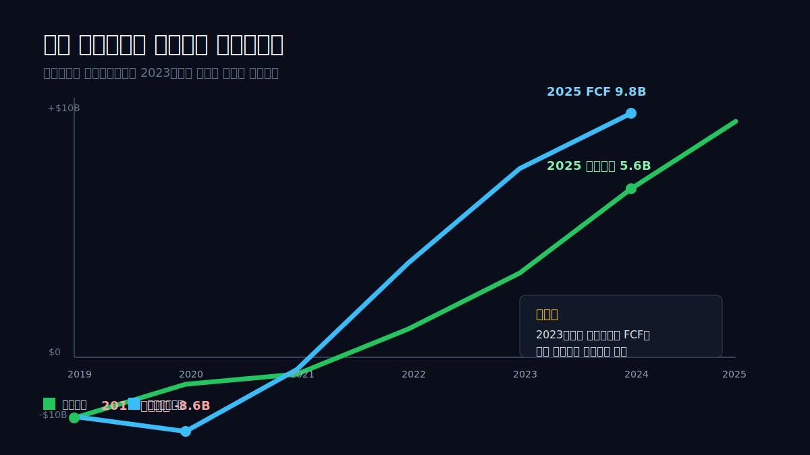
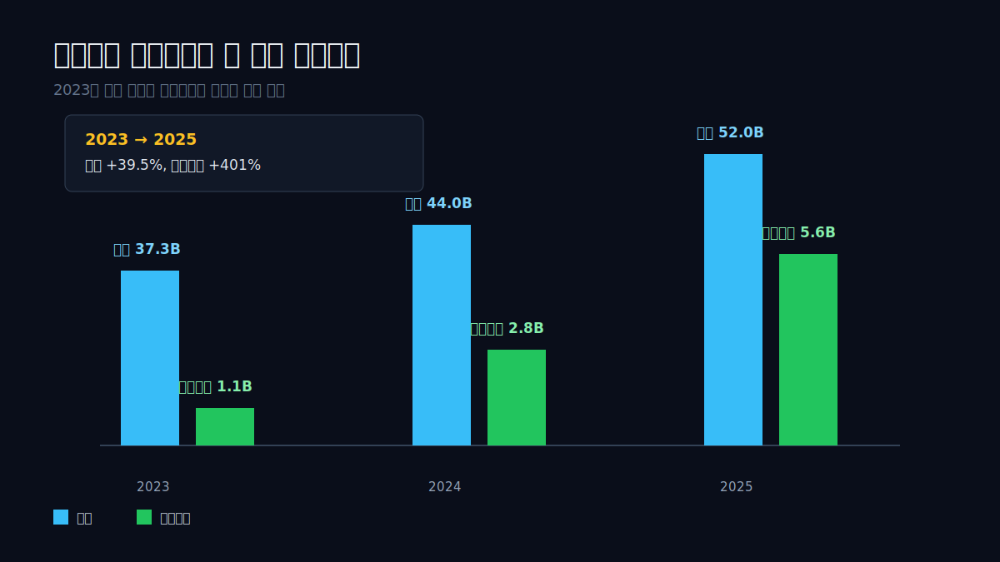
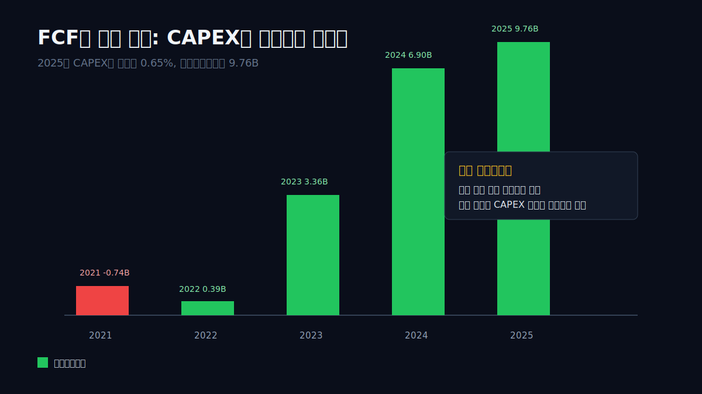
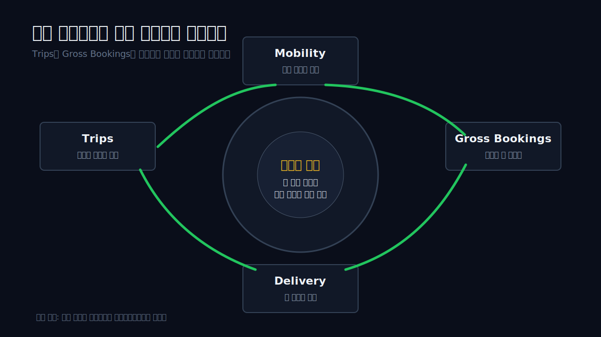
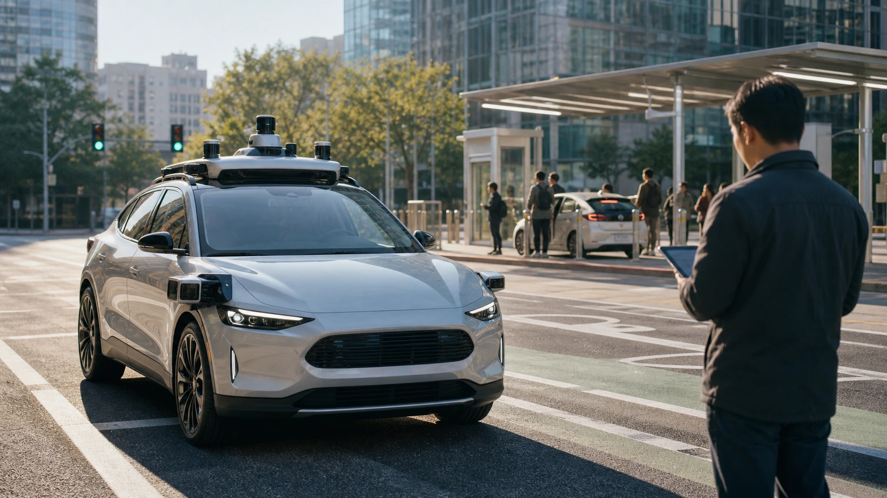
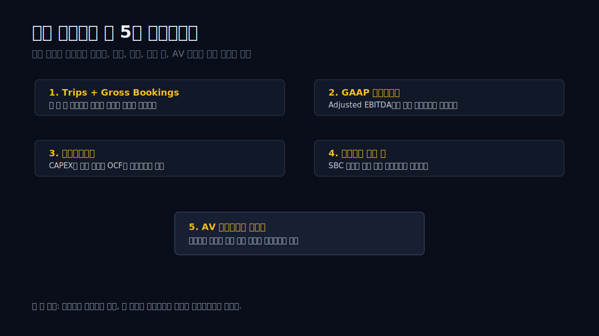

> **데이터 기준**: 2026-06-18 dartlab 실측 - Uber(UBER) 미국 연결(USD), 2019~2025 라벨연도. 2026년 공식 발표는 최신 영업 흐름을 확인하는 외부 공시로만 분리한다.
>
> **핵심 숫자**: 영업이익 **-8.60B(2019) → 5.57B(2025)** · 영업이익률 **-60.8%(2019) → 10.7%(2025)** · 영업현금흐름 **-2.75B(2020) → 10.10B(2025)** · 자유현금흐름 **9.76B(2025)** · Q1 2026 Gross Bookings **53.7B**.
>
> **이 글의 용어**: Gross Bookings = 소비자가 플랫폼에서 결제한 총 거래액 · Trips = 완료된 승차와 배달 주문 수 · 영업이익률 = 영업이익 ÷ 매출 · 자유현금흐름 = 영업현금흐름 - CAPEX.

---

## 프롤로그 - 우버는 언제부터 돈을 벌기 시작했나

우버를 아직도 "적자 플랫폼"으로만 기억하면 숫자를 놓친다. 이 회사는 2019년에 영업손실 8.60B를 냈다. 2020년에도 영업손실은 4.86B였다. 2021년은 -3.83B, 2022년은 -1.83B다. 플랫폼은 컸지만 장부는 계속 빨간색이었다. 승객과 운전자를 붙이는 앱은 세상을 바꿨지만, 주주에게는 오래 "언젠가 벌겠다"는 약속만 줬다.

그런데 2023년에 부호가 바뀐다. 영업이익 1.11B. 2024년 2.80B. 2025년 5.57B. 6년 전 -8.60B였던 영업이익이 2025년에는 +5.57B다. 더 놀라운 줄은 현금흐름표다. 2025년 영업현금흐름은 10.10B, 자유현금흐름은 9.76B다. 공장을 지은 것도 아니고, 차를 직접 대량 보유한 것도 아닌 플랫폼이 10B 현금을 만들기 시작했다.


사람들이 우버에서 정말 궁금해할 질문은 이것이다. **왜 적자 플랫폼의 상징이던 회사가 갑자기 현금흐름 회사가 됐나.** 단순히 매출이 커져서가 아니다. 2020년 이후 우버는 Trips와 Gross Bookings를 늘리면서, CAPEX는 매출의 1% 아래로 눌렀고, 영업손실을 이익으로 돌렸고, 2025년에는 자사주까지 6.5B 매입했다. 성장주 문법에서 현금성 플랫폼 문법으로 넘어간 것이다.

하지만 이 이야기는 조심해서 써야 한다. 우버의 순이익에는 투자 재평가와 세금 효과가 섞인다. 2024년 순이익 9.85B는 영업이익 2.80B보다 훨씬 컸고, 2025년 순이익 10.09B도 세금 효과가 크게 보인다. 그래서 이 글은 순이익보다 영업이익과 영업현금흐름을 먼저 본다. 우버가 진짜 바뀌었는지는 앱의 유명세가 아니라, Gross Bookings가 현금으로 남는 비율에서 드러난다.



---

## 막1 - 매출이 아니라 Trips가 먼저 움직였다

우버의 매출만 보면 전환이 너무 단순해 보인다. 2020년 매출 11.14B, 2021년 17.46B, 2022년 31.88B, 2023년 37.28B, 2024년 43.98B, 2025년 52.02B. 팬데믹 바닥 이후 매출은 4.7배가 됐다. 하지만 우버의 진짜 원천은 매출 라인보다 앞에 있다. 사람들이 실제로 얼마나 자주 차를 부르고, 음식을 받고, 물건을 보내는가다.

공식 공시에서 우버는 Gross Bookings와 Trips를 핵심 운영 지표로 둔다. 2025년 4분기 Gross Bookings는 54.1B, Trips는 3.8B였다. 2026년 1분기에도 Gross Bookings는 53.7B, Trips는 3.6B였다. 분기 하나에 36억 번 이상의 거래가 완료된다. 우버의 본체는 자동차 회사가 아니라 반복 거래의 밀도다. 한 번의 앱 실행이 승차, 배달, 장보기, 비즈니스 이동으로 반복될수록 플랫폼의 고정비는 얇아진다.

```python
import dartlab

c = dartlab.Company("UBER")
c.analysis("성장성")["growthTrend"]["history"]
```

매출 성장의 질도 중요하다. 2023년 이후 매출 성장률은 16.9%, 18.0%, 18.3%로 안정적이다. 그런데 영업이익 성장률은 훨씬 빠르다. 2023년 영업이익은 1.11B, 2024년 2.80B, 2025년 5.57B다. 매출은 2023년에서 2025년까지 39.5% 늘었는데, 영업이익은 401% 늘었다. 플랫폼에서 기다리던 운영 레버리지가 드디어 장부에 찍힌 것이다.

여기서 "운영 레버리지"는 어려운 말이 아니다. 같은 앱, 같은 결제망, 같은 지도·매칭 시스템 위에서 더 많은 거래가 흐르면, 추가 거래마다 회사에 남는 비율이 커지는 현상이다. 물론 운전자 인센티브, 배달원 비용, 보험비, 결제 수수료는 계속 든다. 우버는 완전한 소프트웨어 회사가 아니다. 하지만 거래가 커질수록 본사·플랫폼·기술 인프라의 부담은 매출보다 느리게 늘 수 있다.

2025년 공식 10-K도 같은 방향을 말한다. Gross Bookings는 2025년에 30.7B 늘어 19% 증가했고, Mobility와 Delivery가 이 증가를 이끌었다. Freight는 어려운 화물 사이클 때문에 줄었다. 즉 우버의 현금흐름 전환은 "모든 사업이 한꺼번에 좋아졌다"가 아니다. 본체는 Mobility와 Delivery이고, Freight는 아직 다른 사이클을 산다. 이 구분을 놓치면 우버를 너무 깔끔한 플랫폼으로 오해하게 된다.

---

## 막2 - 2019년에는 앱이 커질수록 손실도 컸다

우버의 전환이 흥미로운 이유는 출발점이 너무 나빴기 때문이다. 2019년 매출은 14.15B였는데 영업손실은 8.60B였다. 영업이익률은 -60.8%다. 매출 100달러를 만들 때 영업손실 60달러가 따라붙는 모양이다. 플랫폼이 커지면 언젠가 좋아진다는 말은 있었지만, 당시 손익계산서는 그 말을 믿기 어렵게 만들었다.

2020년에는 팬데믹까지 왔다. 매출은 11.14B로 줄고, 영업손실은 4.86B였다. 우버 입장에서 최악의 조합이다. 이동 수요는 꺾이고, 배달 수요는 커졌지만 배달은 또 다른 비용 구조를 가진다. 앱은 살아 있지만 도시의 움직임이 멈추면 Mobility의 힘은 약해진다. 이 시기를 지나면서 우버는 "거래액만 키우는 플랫폼"에서 "거래액을 이익으로 바꾸는 플랫폼"으로 바뀌어야 했다.

```python
profit = c.analysis("수익성")
profit["marginTrend"]["history"]
```

2021년 영업손실은 -3.83B, 2022년 -1.83B다. 손실은 줄었지만 아직 적자다. 이 구간에서 우버를 좋게만 볼 수 없었던 이유가 있다. 매출은 2020년 11.14B에서 2022년 31.88B로 거의 3배가 됐는데, 영업이익은 여전히 마이너스였다. 거래액이 늘어도 남지 않으면 플랫폼의 경제성은 의심받는다.

전환은 2023년에 온다. 영업이익 1.11B, 영업이익률 3.0%. 크지 않지만 부호가 바뀌었다. 2024년 6.4%, 2025년 10.7%로 올라간다. 이 숫자가 중요한 이유는 손익계산서가 처음으로 플랫폼의 규모를 인정하기 시작했기 때문이다. 우버는 더 이상 "언젠가 흑자"라고 말하는 회사가 아니라, 실제로 영업이익을 내는 회사가 됐다.



---

## 막3 - 현금흐름표가 먼저 답을 줬다

영업이익보다 더 강한 줄은 현금흐름표다. 2020년 영업현금흐름은 -2.75B였다. 2021년 -0.45B로 적자가 줄었고, 2022년 0.64B로 플러스가 됐다. 2023년 3.59B, 2024년 7.14B, 2025년 10.10B. 우버의 진짜 전환은 2022년부터 시작해 2025년에 굵어졌다.

자유현금흐름은 더 보기 좋다. 2020년 -3.36B, 2021년 -0.74B, 2022년 0.39B, 2023년 3.36B, 2024년 6.90B, 2025년 9.76B다. 3년 만에 자유현금흐름이 0.39B에서 9.76B로 커졌다. 이건 앱 회사의 강점이다. 매출이 커져도 CAPEX가 크게 따라붙지 않는다. 2025년 CAPEX는 0.34B, 매출 대비 0.65%다.

```python
cash = c.analysis("현금흐름")
cash["cashFlowOverview"]["history"]
```

제조업이라면 매출을 키우기 위해 공장, 설비, 재고, 물류망에 큰돈을 넣어야 한다. 우버도 데이터센터, 기술, 보험, 결제, 운영비가 필요하지만, 차량을 직접 대량 보유하는 모델은 아니다. 그래서 플랫폼이 한 번 흑자로 돌아서면 현금흐름이 빠르게 두꺼워질 수 있다. 2025년 우버의 영업현금흐름 10.10B와 CAPEX 0.34B의 차이가 바로 그 장면이다.



다만 영업현금흐름을 무조건 깨끗하다고 쓰면 안 된다. 우버의 순이익에는 투자 재평가와 세금 효과가 섞인다. 2024년 순이익은 9.85B였지만, 영업현금흐름은 7.14B였다. 2025년 순이익은 10.09B, 영업현금흐름은 10.10B로 거의 같다. 그래서 2025년은 더 좋아 보인다. 순이익과 현금흐름이 드디어 비슷한 수준에서 만났기 때문이다.

dartlab의 이익품질도 2025년을 긍정적으로 본다. 2025년 OCF/NI는 100.1%다. 순이익이 현금흐름으로 거의 그대로 따라온다. 2024년에는 순이익이 현금흐름보다 컸고, 영업 외 요인이 많이 보였다. 따라서 우버를 볼 때는 2024년 순이익보다 2025년 영업현금흐름을 더 신뢰하는 쪽이 맞다. 순이익은 화려했고, 현금흐름은 더 조용하지만 더 단단하다.

---

## 막4 - Mobility와 Delivery가 같이 버텨야 한다

우버의 장점은 하나의 앱에서 여러 거래가 흐른다는 점이다. 공항에 갈 때 차를 부르고, 집에서는 음식을 시키고, 회사에서는 비즈니스 이동을 처리하고, 일부 지역에서는 장보기와 소포 배송까지 한다. 이 구조가 강해지면 한 고객의 사용 빈도가 늘어난다. 2026년 1분기 공식 발표에서도 MAPCs는 17% 늘었고, Trips는 20% 늘었다. 이용자 수와 이용 빈도가 같이 움직인 것이다.

Delivery는 우버의 두 번째 엔진이다. Mobility는 수익성이 더 선명하지만, Delivery는 빈도와 생활 밀착도를 만든다. 사용자가 일주일에 차를 몇 번 부르지 않아도 음식을 더 자주 시킬 수 있다. 플랫폼 입장에서는 앱을 여는 횟수가 늘고, 결제 데이터와 고객 습관이 쌓인다. 우버가 단순 택시 호출 앱이 아니라 도시 생활의 거래망으로 읽히는 이유다.


하지만 Delivery도 공짜가 아니다. 2025년 10-K는 Delivery Adjusted EBITDA가 늘어난 이유와 동시에 비용 압박도 보여준다. Delivery Gross Bookings는 Trip volume 증가로 늘었고, 광고 매출도 증가했다. 하지만 Courier payments and incentives, 직원 인건비, 결제 처리 비용, 광고·마케팅 비용도 같이 늘었다. 배달은 네트워크를 키우지만, 음식점·배달원·소비자 사이에서 인센티브를 조절해야 하는 사업이다.

Mobility도 마찬가지다. 2025년 Mobility Adjusted EBITDA는 좋아졌지만, 공시는 운전자 지급과 인센티브, 보험비, 네트워크 비용, 카드 처리 비용 증가를 함께 적는다. 특히 보험비는 중요하다. 더 많은 마일이 주행되고, 보험 단가가 올라가면 Mobility 마진을 직접 누른다. 우버가 차를 소유하지 않아도 위험을 완전히 피하는 것은 아니다. 플랫폼은 위험을 가볍게 만들지만, 위험을 사라지게 하지는 않는다.

그래서 우버의 좋은 숫자는 Mobility와 Delivery가 같이 버텨야 한다. Mobility만 좋고 Delivery가 다시 보조금 경쟁으로 들어가면 앱 빈도는 유지돼도 마진이 흔들린다. Delivery만 성장하고 Mobility가 규제와 보험비에 눌리면 영업이익률 10%대가 유지되기 어렵다. 우버는 두 개의 엔진을 가진 회사이고, 두 엔진이 모두 "거래액 증가 → 현금흐름 증가"로 번역되어야 한다.



---

## 막5 - 자사주는 자신감이지만, SBC와 같이 봐야 한다

우버가 달라졌다는 신호는 자사주에서도 보인다. 2024년 이사회는 7.0B 자사주 매입을 승인했고, 2025년 7월에는 20.0B를 추가 승인했다. 총 27.0B 프로그램이다. 2025년에는 80.0M 주를 6.5B에 사서 소각했다. 2025년 말 기준 남은 자사주 매입 여력은 19.2B다.

이 숫자는 강하다. 몇 년 전까지 적자를 내던 회사가 이제 주식을 사고 있다. 하지만 자사주는 두 얼굴을 가진다. 하나는 주주환원이다. 다른 하나는 주식보상비용(SBC)으로 생기는 희석을 막는 방어다. 우버 같은 플랫폼 회사는 인재 보상에 주식을 많이 쓸 수 있다. 그러면 현금흐름이 좋아져도 주식 수가 늘면 주당가치가 희석된다. 자사주는 이 희석을 상쇄하는 데 쓰인다.

```python
capital = c.analysis("자본배분")
capital["treasuryStockStatus"]["rows"]
capital["fcfUsage"]["history"]
```

10-K에는 2025년 말 기준 미인식 주식보상 비용 3.5B가 남아 있다고 나온다. 앞으로 평균 2.64년에 걸쳐 비용으로 인식될 금액이다. 이 숫자는 우버가 현금흐름 플랫폼이 된 뒤에도 주식보상과 자사주를 같이 봐야 한다는 뜻이다. 자유현금흐름 9.76B가 강하더라도, 그 현금이 성장 투자, 자사주, 부채 관리, 인수, AV 전략 사이에서 어떻게 배분되는지 봐야 한다.

2025년 자유현금흐름 9.76B와 자사주 6.5B를 나란히 놓으면 그림이 선명하다. 우버는 벌어들인 현금의 상당 부분을 주식 매입에 썼다. 나쁘다는 뜻이 아니다. 오히려 자신감이다. 다만 앞으로도 같은 선택이 가능한지는 별개다. Gross Bookings 성장과 영업현금흐름이 유지되면 자사주는 주당가치를 키운다. 반대로 보험비, 인센티브, AV 투자, 규제 비용이 커지면 자사주는 유연성을 줄이는 선택이 될 수 있다.

우버가 이제 배당 회사가 아니라는 점도 중요하다. 2025년 배당은 없다. 주주환원의 중심은 자사주다. 자사주는 경영진이 가격과 상황을 보며 조절할 수 있다. 이 유연성은 플랫폼 회사에 맞다. 하지만 투자자 입장에서는 주식 수가 실제로 줄고 있는지, SBC를 넘어서는지, 부채가 같이 늘지는 않는지 확인해야 한다. "자사주 승인"은 뉴스이고, "주당가치 증가"는 검증해야 할 결과다.

---

## 막6 - 부채와 누적결손은 아직 지워지지 않았다

우버가 좋아졌다고 해서 과거가 사라지는 것은 아니다. 2025년 10-K는 2025년 말 누적결손이 10.6B라고 적는다. 영업이익과 현금흐름은 좋아졌지만, 과거 적자의 흔적은 아직 장부에 남아 있다. 이 한 줄이 우버의 전환을 더 흥미롭게 만든다. 회사는 이제 돈을 벌지만, 완전히 깨끗한 출발선에서 뛰는 것은 아니다.

부채도 봐야 한다. 2025년 말 총부채는 10.6B, 장기부채는 10.52B다. 2025년에는 2031년과 2035년 만기의 senior notes를 발행했고, 일부 고금리 채권을 상환했다. 만기 구조를 다듬고 낮은 금리와 긴 만기를 섞는 것은 나쁘지 않다. 하지만 현금흐름 회사가 된 뒤에도 부채는 자본배분의 중요한 축이다.

우버는 2025년 말 covenant를 준수하고 있었다. 단기 유동성에도 큰 문제는 보이지 않는다. 그래도 부채는 "이 회사가 현금흐름을 어디에 쓸 수 있는가"를 제한한다. 자유현금흐름이 9.76B라면 선택지가 많다. 자사주, 인수, AV 파트너십, 성장 투자, 부채 상환. 하지만 부채가 커지고 금리 비용이 부담되면 선택지는 줄어든다.

dartlab 종합평가가 잡은 경고도 이쪽이다. "부채 3기 연속 증가", "Altman Z-Score 1.11", "총자산회전율 3기 연속 하락", "영업레버리지(DOL) 5.4" 같은 flag가 있다. 이 중 일부는 플랫폼 회사의 특성과 회계 구조 때문에 거칠 수 있다. 그래도 무시하면 안 된다. 영업레버리지가 크다는 말은 매출이 좋을 때 이익이 빨리 늘지만, 반대로 둔화될 때 이익도 민감하다는 뜻이다.

```python
summary = c.analysis("종합평가")
summary["summaryFlags"]
```

결론은 균형이다. 우버는 더 이상 적자 플랫폼만은 아니다. 2025년 현금흐름은 강하다. 하지만 "현금흐름이 강하니 부채와 누적결손은 의미 없다"도 틀리다. 좋은 턴어라운드는 과거 리스크를 지우는 게 아니라, 과거 리스크를 감당할 만큼 현금흐름을 만드는 것이다. 우버는 그 시험을 이제 막 통과하기 시작했다.

---

## 막7 - AV는 위협이자 비용을 피하는 기회다

우버를 볼 때 가장 큰 외부 질문은 자율주행(AV)이다. 만약 자율주행차가 대규모로 보급되면, 차량을 부르는 행위 자체는 계속 남을 수 있다. 하지만 누가 고객을 소유하고, 누가 가격을 정하고, 누가 차량을 운영하는지가 바뀐다. 우버가 단순 매칭 앱으로 남을지, AV 운영자들의 수요 집합 플랫폼이 될지에 따라 경제성이 달라진다.

2026년 1분기 공식 발표에서 CFO는 AV에 대해 "capital-efficient approach"를 말한다. 핵심은 우버가 직접 대규모 차량을 사서 로보택시 사업자가 되는 것이 아니라, 파트너십을 통해 수요와 운영을 연결하려는 방향이다. 이 전략은 우버의 강점과 맞다. 우버의 장점은 차량 소유가 아니라 수요, 배차, 가격, 결제, 지역별 네트워크다.



하지만 AV를 너무 낙관적으로 쓰면 위험하다. 자율주행 회사가 직접 소비자 앱을 키우고, 도시별로 독점적 위치를 잡고, 우버 없이도 충분한 수요를 확보하면 우버의 take rate는 눌릴 수 있다. 반대로 여러 AV 운영자가 도시별로 흩어져 있고, 고객 수요를 모으는 앱이 필요하다면 우버의 플랫폼 가치는 유지된다. 이 싸움은 기술 경쟁이면서 유통 경쟁이다.

우버에 좋은 시나리오는 AV가 CAPEX 부담 없이 공급을 늘리는 것이다. 운전자 부족이 완화되고, 피크 시간 공급이 늘고, 대기 시간이 줄고, 고객 경험이 좋아지면 Gross Bookings가 늘 수 있다. 나쁜 시나리오는 AV 사업자가 가격과 고객 접점을 가져가고, 우버가 낮은 수수료의 유통 채널로 밀리는 것이다. 그래서 AV는 "우버가 망한다" 또는 "우버가 이긴다"로 단정할 주제가 아니다. 도시별 파트너십과 경제성을 봐야 한다.

이 글의 관점에서는 AV도 결국 같은 질문으로 돌아온다. **Gross Bookings가 현금흐름으로 남는가.** AV가 붙어도 영업이익률과 자유현금흐름이 유지되면 우버는 더 강해진다. AV가 성장률은 올리지만 마진을 깎으면 이야기는 약해진다. 기술 뉴스보다 중요한 것은 손익계산서와 현금흐름표다.

---

## 막8 - Q1 2026은 전환이 아직 살아 있음을 보여준다

최신 공식 발표는 긍정적이다. 2026년 1분기 Trips는 3.6B로 전년 대비 20% 늘었다. Gross Bookings는 53.7B로 25% 늘었고, constant currency 기준으로도 21% 증가했다. 매출은 13.2B, GAAP 영업이익은 1.9B, Adjusted EBITDA는 2.5B다. 자유현금흐름은 2.3B였다. 우버의 전환이 2025년 한 해짜리 이벤트는 아니라는 신호다.

특히 눈에 띄는 것은 영업이익의 속도다. 2026년 1분기 GAAP income from operations는 57% 늘었다. 매출은 14% 늘었다. 매출보다 이익이 훨씬 빠르게 늘었다. 이것이 이 글의 핵심과 맞다. 우버의 좋은 이야기는 "매출이 늘었다"가 아니라 "매출이 늘 때 이익이 더 빠르게 늘었다"다.

다만 Q1 2026에도 순이익은 조심해서 봐야 한다. GAAP net income은 263M으로 작게 보이지만, 여기에는 투자 재평가의 1.5B pre-tax headwind가 포함된다. 그래서 순이익만 보면 "왜 갑자기 약해졌나"라고 착각할 수 있다. 영업이익과 현금흐름은 여전히 강하다. 우버를 읽을 때는 순이익보다 영업이익, Adjusted EBITDA, 자유현금흐름, Gross Bookings를 같이 봐야 한다.

2026년 2분기 전망도 나쁘지 않다. 회사는 Q2 Gross Bookings 56.25B~57.75B, constant-currency 성장률 18~22%를 제시했다. Non-GAAP EPS는 0.78~0.82, Adjusted EBITDA는 2.70B~2.80B로 환산된다고 설명했다. 물론 가이던스는 약속이 아니라 전망이다. 하지만 현 시점에서 공식 숫자는 우버의 플랫폼 전환이 계속 진행 중임을 보여준다.

---

## 막9 - 이 이야기가 틀리는 조건

우버의 좋은 이야기는 분명하다. 거래가 늘고, 영업이익이 더 빠르게 늘고, CAPEX는 낮고, 자유현금흐름이 커지고, 자사주까지 가능해졌다. 하지만 강한 글은 틀리는 조건도 말해야 한다. 우버의 경우 조건은 다섯 개다.

첫째, Gross Bookings 성장률이 10%대 초반으로 내려가는데 영업비용이 줄지 않는 경우다. 우버는 영업레버리지가 큰 회사다. 매출이 좋을 때는 이익이 빠르게 늘지만, 성장률이 둔화되면 이익도 민감해질 수 있다. Q1 2026처럼 Gross Bookings가 20%대 성장하면 좋다. 하지만 이 숫자가 빠르게 둔화되면 플랫폼 경제성을 다시 점검해야 한다.

둘째, 운전자와 배달원 인센티브가 다시 커지는 경우다. 우버의 네트워크는 운전자와 배달원이 충분히 있어야 작동한다. 공급이 부족해지면 대기 시간이 늘고 고객 경험이 나빠진다. 이를 막기 위해 인센티브를 늘리면 Gross Bookings는 유지돼도 마진이 눌린다. 10-K가 Mobility와 Delivery 비용에서 driver/courier payments and incentives를 반복해서 적는 이유다.

셋째, 보험비와 규제비용이다. Mobility는 도로 위에서 일어난다. 사고, 보험 단가, 노동자 분류, 도시별 규제, 공항 접근 규칙이 모두 손익에 영향을 준다. 우버는 소프트웨어 회사처럼 보이지만 완전히 소프트웨어 회사가 아니다. 도시와 도로와 사람을 다루기 때문에 비용이 현실 세계에서 올라올 수 있다.

넷째, 자사주가 주당가치가 아니라 희석 방어에 그치는 경우다. 2025년 6.5B 자사주는 강한 신호다. 하지만 SBC가 계속 크고 주식 수가 줄지 않으면 주주환원의 힘은 약해진다. 앞으로는 자사주 승인 규모보다 실제 희석 후 주식 수 변화를 봐야 한다.

다섯째, AV가 우버의 수요 지위를 약하게 만드는 경우다. 자율주행 공급자가 우버 플랫폼을 필요로 하면 우버에 좋다. 공급자가 직접 고객을 잡고, 우버를 낮은 수수료 채널로만 쓰면 좋지 않다. 이 차이는 언론 기사보다 도시별 계약과 마진에서 확인된다.



---

## 막10 - 다음 실적에서 15분 안에 업데이트하는 법

우버 실적 발표 날에는 숫자가 많다. MAPCs, Trips, Gross Bookings, Revenue, Adjusted EBITDA, Non-GAAP EPS, Free Cash Flow, segment Adjusted EBITDA, take rate, share repurchase. 다 보면 오히려 흐려진다. 이 글의 질문은 단순하다. **거래액이 현금으로 남는가.**

첫 번째 줄은 Gross Bookings와 Trips다. Gross Bookings는 플랫폼의 거래 총량이고, Trips는 사용 빈도다. 둘이 같이 늘면 플랫폼은 건강하다. Gross Bookings가 가격 효과로만 늘고 Trips가 둔화되면 조심해야 한다. Q1 2026처럼 Trips 20%, Gross Bookings 25%가 같이 늘면 좋다.

두 번째 줄은 GAAP 영업이익이다. Adjusted EBITDA도 중요하지만, 우버가 정말 달라졌는지는 GAAP 영업이익에서 확인된다. 2025년 영업이익률은 10.7%였다. 이 비율이 올라가거나 유지되면 플랫폼 레버리지는 살아 있다. 내려가면 인센티브, 보험비, 마케팅, AV 투자, 규제비용 중 무엇이 원인인지 봐야 한다.

세 번째 줄은 자유현금흐름이다. 우버의 강점은 CAPEX가 낮다는 점이다. 2025년 CAPEX/매출은 0.65%였다. 영업현금흐름이 늘고 CAPEX가 낮으면 자유현금흐름은 빠르게 남는다. 단일 분기보다 trailing twelve months로 보는 것이 좋다. Q2 2025 발표에서 우버는 TTM FCF 8.5B를 언급했고, 2025년 연간 dartlab 실측은 9.76B다.

네 번째 줄은 자사주와 주식 수다. 자사주 승인액이 아니라 실제 매입액, 소각 주식 수, 남은 승인액, SBC를 같이 본다. 2025년 80.0M 주를 6.5B에 사서 소각했다는 점은 좋다. 하지만 앞으로도 같은 속도로 주식 수가 줄어야 주주환원이라고 말할 수 있다.

| 확인 순서 | 봐야 할 숫자 | 좋은 신호 | 나쁜 신호 |
|---|---|---|---|
| 1 | Trips + Gross Bookings | 둘 다 두 자릿수 성장 | 거래액만 늘고 Trips 둔화 |
| 2 | GAAP 영업이익률 | 10%대 유지 또는 상승 | 인센티브·보험비로 하락 |
| 3 | 자유현금흐름 | TTM FCF 증가 | OCF 둔화 또는 CAPEX 확대 |
| 4 | 자사주 + 주식 수 | 소각 후 주식 수 감소 | SBC 방어에 그침 |
| 5 | AV 파트너십 | 플랫폼 수요 지위 강화 | 낮은 수수료 채널화 |

이 표만 있으면 다음 발표자료가 화려해도 흔들리지 않는다. 우버는 더 이상 "성장하느냐"만 보는 회사가 아니다. 이제는 "성장한 만큼 남느냐"를 봐야 한다. 이 질문은 단순하고, 그래서 강하다.

---

## 에필로그 - 우버는 차를 소유하지 않는 현금흐름 회사가 됐다

우버의 전환은 한 문장으로 정리된다. **차를 소유하지 않는 플랫폼이, 거래 빈도를 쌓아 현금흐름 회사가 됐다.** 2019년 영업손실 8.60B였던 회사가 2025년 영업이익 5.57B와 자유현금흐름 9.76B를 만든다. 이 변화는 작지 않다.

하지만 이 글의 판단은 낙관으로 닫지 않는다. 우버의 좋은 숫자는 Gross Bookings, Trips, 영업이익, 자유현금흐름이 같은 방향으로 갈 때만 의미가 있다. 여기에 자사주가 실제 주식 수 감소로 이어지고, AV가 우버의 수요 지위를 해치지 않아야 한다. 한 줄이라도 깨지면 이야기는 약해진다.

비슷한 플랫폼 전환을 보려면 [Coinbase](/blog/COIN-coinbase)의 거래 수수료 사이클, [Salesforce](/blog/CRM-salesforce)의 비용 discipline, [ServiceNow](/blog/NOW-servicenow)의 현금흐름 선행 구조, [Oracle](/blog/ORCL-oracle)의 클라우드 성장과 부채 부담, [Tesla](/blog/TSLA-tesla)의 자율주행 기대를 같이 보면 좋다. 우버는 이 다섯 이야기의 중간에 있다. 플랫폼이고, 현금흐름 회사이고, AV 리스크를 품고 있고, 자사주를 시작했다.

그래서 다음 우버 실적에서 먼저 볼 문장은 CEO 코멘트가 아니다. Gross Bookings, Trips, GAAP income from operations, free cash flow다. 네 줄이 같이 살아 있으면 우버의 턴어라운드는 구조다. 하나만 살아 있으면 아직 반쪽짜리다.

---

## 검증표

본문 인용 수치를 dartlab 실측과 외부 공시로 분리한다. dartlab 실측은 UBER 미국 연결(USD), 라벨연도 기준이다.

| 본문 수치 | 출처 / 호출 | 결과 |
|---|---|---|
| 매출 2020년 11.14B → 2025년 52.02B | `c.analysis("성장성")["growthTrend"]["history"]` | dartlab 실측 |
| 영업이익 2019년 -8.60B → 2025년 5.57B | `c.analysis("수익성")["marginTrend"]["history"]` | dartlab 실측 |
| 영업이익률 2019년 -60.8% → 2025년 10.7% | 수익성 history 영업이익/매출 | dartlab 실측 |
| 2025년 영업현금흐름 10.10B, 자유현금흐름 9.76B | `c.analysis("현금흐름")["cashFlowOverview"]` | dartlab 실측 |
| 2025년 CAPEX 0.34B, CAPEX/매출 0.65% | `c.analysis("자본배분")["reinvestment"]` | dartlab 실측 |
| 2025년 순이익 10.09B, OCF/NI 100.1% | `c.analysis("이익품질")["accrualAnalysis"]` | dartlab 실측 |
| 2025년 자사주 매입 6.5B, 80.0M 주 소각 | [Uber 2025 Form 10-K](https://www.sec.gov/Archives/edgar/data/1543151/000154315126000015/uber-20251231.htm) | SEC 공시 |
| 2025년 말 남은 자사주 매입 여력 19.2B | [Uber 2025 Form 10-K](https://www.sec.gov/Archives/edgar/data/1543151/000154315126000015/uber-20251231.htm) | SEC 공시 |
| 2025년 말 누적결손 10.6B | [Uber 2025 Form 10-K](https://www.sec.gov/Archives/edgar/data/1543151/000154315126000015/uber-20251231.htm) | SEC 공시 |
| 2025년 말 총부채 10.6B, 장기부채 10.52B | [Uber 2025 Form 10-K](https://www.sec.gov/Archives/edgar/data/1543151/000154315126000015/uber-20251231.htm) | SEC 공시 |
| 2025년 Gross Bookings +30.7B, +19% | [Uber 2025 Form 10-K](https://www.sec.gov/Archives/edgar/data/1543151/000154315126000015/uber-20251231.htm) | SEC 공시 |
| Q4 2025 Trips 3.8B, Gross Bookings 54.1B, FCF 2.8B | [Uber FY2025 Q4 결과](https://investor.uber.com/news-events/news/press-release-details/2026/Uber-Announces-Results-for-Fourth-Quarter-and-Full-Year-2025/) | 외부 공시 |
| Q1 2026 Trips 3.6B, Gross Bookings 53.7B, GAAP operating income 1.9B, FCF 2.3B | [Uber Q1 2026 결과](https://investor.uber.com/news-events/news/press-release-details/2026/Uber-Announces-Results-for-First-Quarter-2026/default.aspx) | 외부 공시 |
| Q2 2025 신규 20B 자사주 승인, TTM FCF 8.5B | [Uber Q2 2025 결과](https://investor.uber.com/news-events/news/press-release-details/2025/Uber-Announces-Results-for-Second-Quarter-2025/default.aspx) | 외부 공시 |
| 운전자·배달원 인센티브, 보험비, 결제 처리 비용 증가 | [Uber 2025 Form 10-K](https://www.sec.gov/Archives/edgar/data/1543151/000154315126000015/uber-20251231.htm) | SEC 공시, 원인 경계 |
| summaryFlags: 부채 증가, Altman Z-Score, DOL 5.4 | `c.analysis("종합평가")["summaryFlags"]` | dartlab flag, 단정 금지 |

숫자 해석의 경계는 분명하다. 우버의 전환은 dartlab 연결 손익과 현금흐름이 증명한다. AV 파트너십의 장기 경제성, 도시별 take rate, driver/courier 분류 규제의 구체 비용은 외부 공시와 다음 분기 추적으로만 확인 가능하다.

---

## 공시 / Filings

Uber는 미국 상장사이므로 EDGAR와 회사 IR을 함께 본다. dartlab 구조화 재무는 XBRL 기반으로 읽고, Gross Bookings·Trips·Adjusted EBITDA·자사주 같은 운영 지표는 공식 실적 발표와 10-K 원문으로 분리한다.

- [Uber Investor Relations - Financials](https://investor.uber.com/financials/default.aspx)
- [Uber 2025 Form 10-K](https://www.sec.gov/Archives/edgar/data/1543151/000154315126000015/uber-20251231.htm)
- [Uber Q1 2026 Results](https://investor.uber.com/news-events/news/press-release-details/2026/Uber-Announces-Results-for-First-Quarter-2026/default.aspx)
- [Uber Q4 and Full Year 2025 Results](https://investor.uber.com/news-events/news/press-release-details/2026/Uber-Announces-Results-for-Fourth-Quarter-and-Full-Year-2025/)
- [Uber Q2 2025 Results](https://investor.uber.com/news-events/news/press-release-details/2025/Uber-Announces-Results-for-Second-Quarter-2025/default.aspx)

Gross Bookings와 Trips는 GAAP 매출이 아니다. 플랫폼의 거래량과 빈도를 보는 운영 지표다. 본문에서 이 지표를 쓸 때는 반드시 매출·영업이익·현금흐름과 분리한다.

---

## 재무제표 - 최근 5 개년

> 단위는 USD 십억 달러. 영업이익률 = 영업이익/매출, 순마진 = 순이익/매출. dartlab에서 직접 확인:
>
> ```python
> import dartlab
> c = dartlab.Company("UBER")
> c.analysis("수익성")["marginTrend"]["history"]
> c.analysis("현금흐름")["cashFlowOverview"]["history"]
> c.analysis("자본배분")["reinvestment"]["history"]
> ```

| 항목 ($B) | 2021 | 2022 | 2023 | 2024 | 2025 |
|---|---:|---:|---:|---:|---:|
| 매출 | 17.46 | 31.88 | 37.28 | 43.98 | 52.02 |
| 영업이익 | -3.83 | -1.83 | 1.11 | 2.80 | 5.57 |
| 순이익 | -0.57 | -9.14 | 2.16 | 9.85 | 10.09 |
| 영업현금흐름 | -0.45 | 0.64 | 3.59 | 7.14 | 10.10 |
| 자유현금흐름 | -0.74 | 0.39 | 3.36 | 6.90 | 9.76 |
| CAPEX | 0.30 | 0.25 | 0.22 | 0.24 | 0.34 |
| 영업이익률 | -22.0% | -5.8% | 3.0% | 6.4% | 10.7% |
| 순마진 | -3.3% | -28.7% | 5.8% | 22.4% | 19.4% |
| CAPEX/매출 | 1.71% | 0.79% | 0.60% | 0.55% | 0.65% |

이 표의 핵심은 매출 행보다 영업현금흐름 행이다. 우버는 매출을 키워서 흑자 전환한 회사가 아니라, 거래 빈도를 현금으로 바꾸는 데 성공한 회사다. 앞으로도 이 전환이 유지되는지는 Trips, Gross Bookings, 영업이익률, 자유현금흐름 네 줄이 알려준다.
