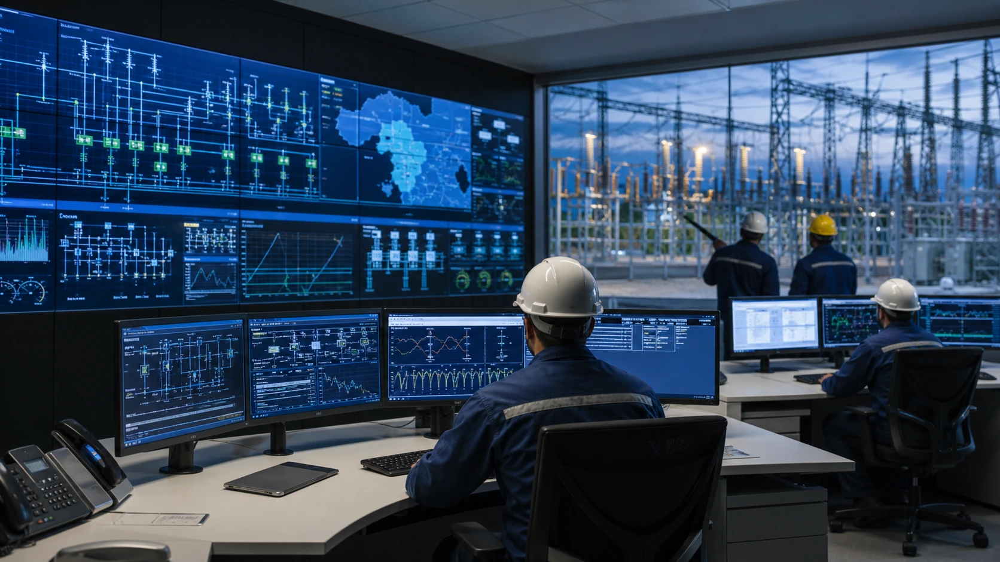
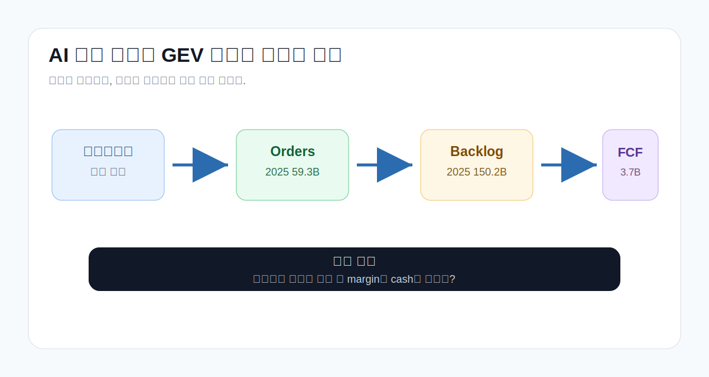
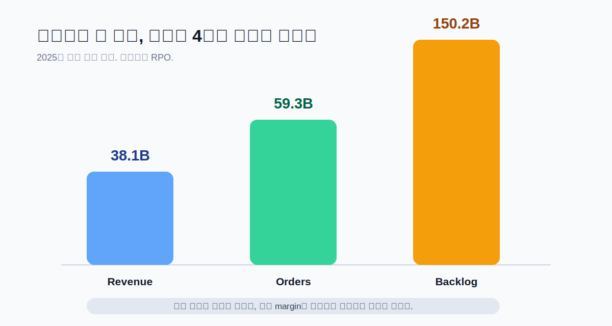
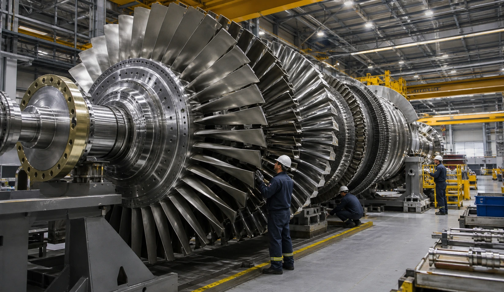
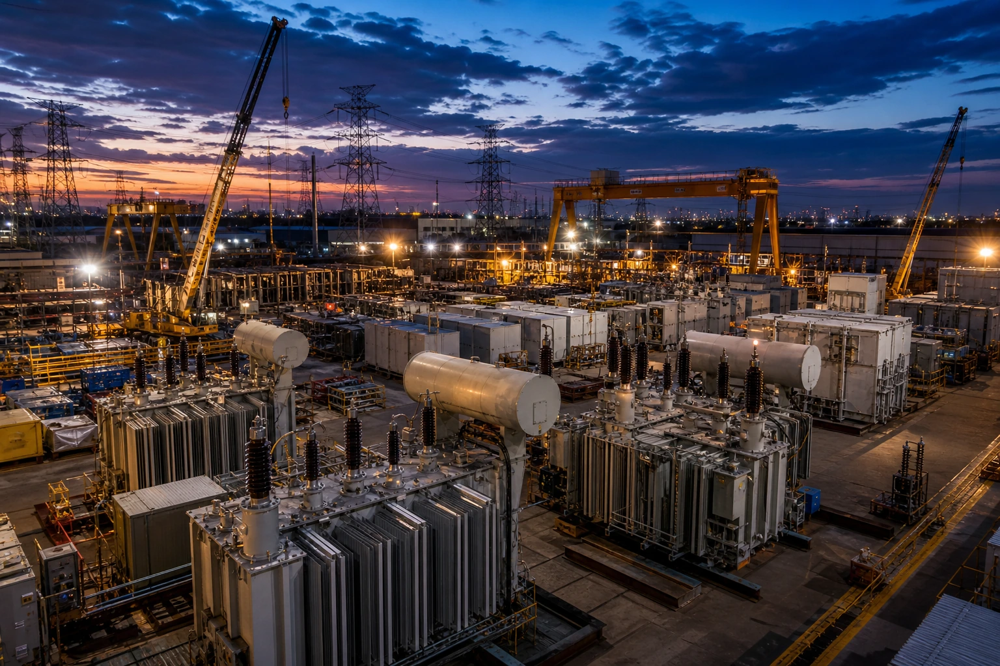
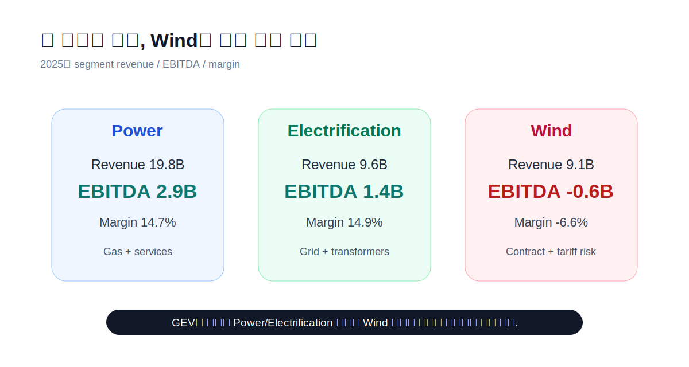
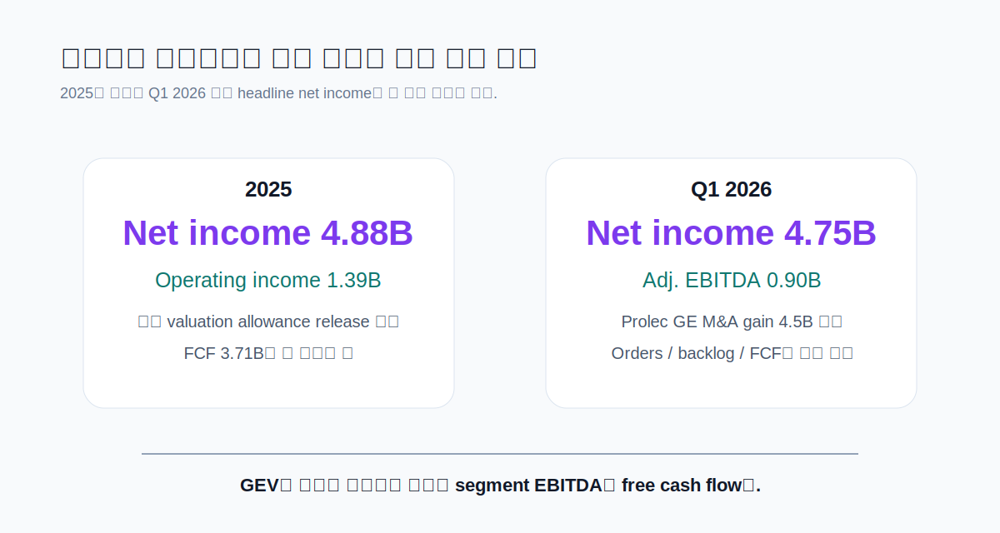
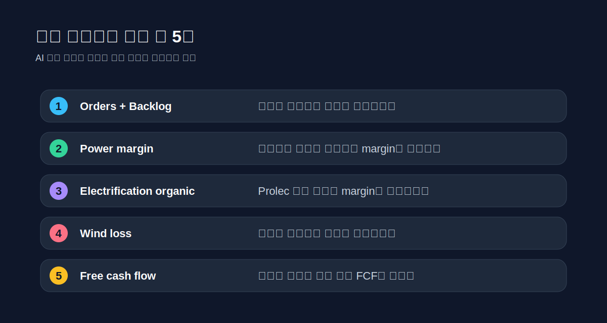

> **데이터 기준**: 2026-06-18 dartlab 실측 + GE Vernova 2025 Form 10-K + Q1 2026 공식 실적 발표. 금액 단위는 USD, 본문 표기는 십억 달러(B) 기준이다.
>
> **핵심 숫자**: 매출 **38.1B(2025)** · 영업이익 **1.39B(2025)** · 조정 EBITDA **3.20B(2025)** · 자유현금흐름 **3.71B(2025)** · 백로그 **150.2B(2025 말) → 163B(Q1 2026)**.
>
> **이 글의 용어**: 백로그 = GE Vernova가 remaining performance obligation(RPO)로 정의한 잔여 수행 의무 · FCF = 회사가 제시한 non-GAAP free cash flow · Power = 가스터빈·원전·수력·스팀 전력 장비와 서비스 · Electrification = Grid Solutions, 변압기, switchgear, 전력 변환·저장, 전력 소프트웨어.

---

## 프롤로그 - AI는 전기를 먹고, 전기는 장부를 남긴다

AI 데이터센터 이야기는 보통 GPU에서 시작한다. 칩을 누가 만들고, 서버를 누가 조립하고, 클라우드가 얼마나 쓰느냐가 먼저 나온다. 그런데 데이터센터는 모델만 돌리는 곳이 아니다. 전기를 끌어오고, 전압을 바꾸고, 열과 부하를 견디고, 전력망에 붙어야 돌아간다. 그래서 AI 투자 사이클이 커질수록 질문이 바뀐다. **전기를 실제로 공급하는 병목은 어디인가.**

GE Vernova는 이 질문의 가운데 있다. 이 회사는 2024년 4월 GE에서 분리 상장된 전력 인프라 회사다. 사업은 Power, Wind, Electrification으로 나뉜다. Power는 가스터빈과 전력 서비스, Electrification은 변압기·switchgear·HVDC·grid solutions, Wind는 육상·해상 풍력이다. 이름은 에너지 전환 회사처럼 들리지만, 2025년과 2026년 숫자를 보면 더 직접적인 문장이 나온다. **GE Vernova는 AI 전력 수요가 가스터빈 예약과 전력망 장비 주문으로 바뀌는 장부다.**



2025년 회사 전체 매출은 38.1B였다. 영업이익은 1.39B, 영업이익률은 3.6%다. 이익률만 보면 아직 고마진 회사는 아니다. 하지만 같은 해 조정 EBITDA는 3.20B, 자유현금흐름은 3.71B였다. 그리고 백로그는 150.2B까지 커졌다. 매출의 4배에 가까운 잔여 수행 의무가 쌓인 셈이다. 전력 장비 회사에서 백로그는 단순한 인기투표가 아니다. 공장 슬롯, 공급망, 가격, 고객 선급금, 장기 서비스 매출의 출발점이다.

더 강한 신호는 2026년 1분기다. 주문은 18.3B로 전년 대비 71% 유기 성장했다. 백로그는 분기 중 13.0B 늘어 163B가 됐다. Gas Power의 장비 백로그와 slot reservation agreements는 83GW에서 100GW로 늘었고, 회사는 2026년 말 110GW 이상을 예상한다고 밝혔다. Electrification은 1분기에 데이터센터 지원 장비 주문만 2.4B를 받았는데, 회사 설명으로는 이것이 2025년 전체 데이터센터 관련 장비 주문보다 컸다.



그래서 이 글의 질문은 단순하다. **GE Vernova는 AI 전력 붐의 진짜 수혜자인가, 아니면 한 번에 너무 많은 기대가 장부보다 먼저 달린 회사인가.** 답은 두 줄로 나뉜다. Power와 Electrification은 분명히 좋아지고 있다. Wind는 아직 손실이다. 순이익은 회계 이벤트가 섞여 과장될 수 있다. 그래서 GEV를 볼 때는 순이익보다 주문, 백로그, segment EBITDA, 자유현금흐름, Wind 손실을 먼저 봐야 한다.

---

## 막1 - 매출보다 먼저 봐야 할 줄은 주문과 백로그다

GE Vernova의 2025년 매출은 38.1B다. 2024년 34.9B에서 9% 늘었다. 매출 증가만 보면 좋은 제조업 회복 정도로 보인다. 하지만 주문과 백로그를 같이 보면 그림이 달라진다. 2025년 주문은 59.3B였다. 매출보다 주문이 훨씬 컸다. 그리고 2025년 말 백로그는 150.2B였다. 2024년 말 119.0B에서 31.2B 늘었다.

이게 중요한 이유는 전력 인프라 사업의 시간표 때문이다. 변압기, 가스터빈, switchgear, HVDC 장비는 클릭 한 번으로 팔리는 제품이 아니다. 고객이 먼저 예약하고, 계약하고, 선급금을 내고, 공장 슬롯을 잡고, 납품과 설치와 서비스가 이어진다. 오늘의 주문은 내일의 매출이 아니라 몇 분기, 몇 년 뒤의 매출이다. 그래서 GEV에서 가장 먼저 봐야 할 숫자는 매출보다 주문과 백로그다.

```python
import dartlab

c = dartlab.Company("GEV")
c.analysis("성장성")["growthTrend"]["history"]
c.analysis("수익성")["marginTrend"]["history"]
```

Power의 2025년 RPO는 94.4B다. 이 중 services가 69.7B다. 이게 GEV의 질을 높인다. 가스터빈 장비를 한 번 팔고 끝나는 회사가 아니라, 설치된 base에서 장기 서비스가 붙는다. 2025년 Power 매출 19.8B 중 services는 13.1B다. 장비보다 서비스가 더 크다. 전력 장비 회사가 매력적으로 보이는 순간은 장비 사이클이 서비스 매출로 이어질 때다.

Electrification의 RPO도 빠르게 늘었다. 2025년 말 Electrification RPO는 34.7B로 2024년 23.5B에서 48% 늘었다. 회사는 이 증가가 Grid Solutions의 alternating current substation solutions, switchgear, transformers, HVDC solutions, Power Conversion & Storage 수요 때문이라고 설명한다. 데이터센터, 송전망, 변전소, 산업용 전력 수요가 모두 이 줄에 들어온다.

2026년 1분기에는 이 흐름이 더 선명해졌다. Q1 주문 18.3B, 백로그 163B. 특히 Electrification orders는 7.1B였고, book-to-bill ratio는 약 2.5였다. 매출 1달러를 올리는 동안 주문이 2.5달러 들어왔다는 뜻이다. 이 비율은 강하다. 하지만 동시에 위험도 말한다. 주문이 매출보다 빠르게 쌓이면 공장 capacity, 공급망, 납기, 원가 관리가 모두 중요해진다.



GEV는 2025년과 2026년에 AI 전력 수요를 숫자로 보여준 드문 회사다. 다만 백로그는 현금이 아니다. 백로그는 약속이다. 이 약속은 공장 슬롯, 원재료, 품질, 고객의 프로젝트 일정, 규제 승인, 납기 리스크를 통과해야 매출과 현금이 된다. 그래서 투자자는 "백로그가 얼마냐"에서 멈추면 안 된다. "그 백로그의 margin이 좋아지고 있는가"까지 봐야 한다.

---

## 막2 - Power는 GEV의 현금 엔진이다

Power는 GEV의 가장 큰 사업이다. 2025년 Power 매출은 19.8B로 전체 매출의 절반 이상이다. segment EBITDA는 2.90B, margin은 14.7%다. 2024년 Power EBITDA margin 12.5%, 2023년 9.9%에서 꾸준히 올라왔다. 이 구간에서 GEV의 이익 개선이 가장 먼저 설명된다.

Power의 질은 두 가지에서 나온다. 첫째는 Gas Power 장비 수요다. 2025년 gas turbine orders는 173대, 29.8GW였다. 2024년 112대, 20.2GW보다 크다. heavy-duty gas turbine 주문도 68대에서 110대로 늘었다. 둘째는 설치된 장비에서 나오는 서비스다. Power services 매출은 2025년 13.1B로 equipment 6.7B보다 크다. 전력 장비의 강점은 판매 이후 서비스 기간이 길다는 데 있다.



Q1 2026 Power 숫자도 강하다. 주문은 10.0B, 매출은 5.0B, segment EBITDA는 0.81B, EBITDA margin은 16.3%였다. 전년 동기 11.6%에서 470bp 상승했다. 회사는 Gas Power의 가격과 물량이 이익을 밀었다고 설명한다. 여기서 가격이 중요하다. 전력 장비 공급이 부족할 때 좋은 회사는 단순히 더 많이 파는 것이 아니라, 더 좋은 조건으로 슬롯을 판다.

2026년 1분기에는 Gas Power 장비 백로그와 slot reservation agreements가 83GW에서 100GW로 늘었다. 이 숫자는 독자가 기억할 만하다. AI 데이터센터가 "전력 필요"라고 말하면 GEV 장부에서는 GW 단위의 예약과 주문으로 바뀐다. 회사는 2026년 말 110GW 이상을 예상한다. 실제로 이 물량이 높은 margin으로 매출화되면 Power는 GEV의 valuation을 설명하는 첫 번째 엔진이 된다.

다만 Power도 위험이 있다. 회사는 10-K에서 capacity expansion이 수요보다 앞서갈 수 있고, slot reservation agreements가 실제 주문으로 이어지지 않을 수 있다고 적는다. 공급망, 원자재, 납기, 품질 문제도 있다. 가스터빈은 앱 서비스가 아니다. 한 번 문제가 나면 비용이 크고, 고객 신뢰가 흔들리고, 장기 서비스 수익성까지 영향을 받는다.

그래서 Power를 볼 때 좋은 신호는 세 가지다. 주문 증가, margin 상승, 서비스 매출 증가. 나쁜 신호는 주문은 늘지만 margin이 내려가거나, 장비 납품 지연으로 cash conversion이 밀리는 것이다. 2025년과 Q1 2026의 숫자는 아직 좋은 쪽이다. 다음 시험은 2026년 하반기와 2027년에 백로그가 실제 매출과 현금으로 풀리는 속도다.

---

## 막3 - Electrification은 AI 전력 붐의 가장 직접적인 표지판이다

GEV에서 가장 재미있는 사업은 Electrification이다. 2025년 매출은 9.64B로 Power보다 작다. 하지만 성장 속도는 가장 빠르다. 2023년 6.38B, 2024년 7.55B, 2025년 9.64B다. 2년 만에 51% 늘었다. segment EBITDA는 2023년 0.23B에서 2025년 1.43B로 뛰었다. EBITDA margin은 3.7%에서 14.9%로 올라왔다.

Electrification은 전력망의 병목을 판다. 변압기, switchgear, substation solutions, HVDC, power conversion, storage, software. 데이터센터가 늘면 서버만 필요한 것이 아니다. 대규모 전력을 안정적으로 받기 위해 grid connection, 전압 변환, protection, monitoring, 전력 품질 관리가 필요하다. 바로 이 지점에서 GEV의 Electrification 사업이 숫자로 움직인다.



2025년 Electrification RPO는 34.7B였다. 2024년 23.5B에서 11.2B 늘었다. 회사는 demand for AC substation solutions, switchgear, transformers, synchronous condensers, energy storage를 증가 원인으로 설명한다. 이 문장은 중요하다. AI 전력 수요는 하나의 제품으로 끝나지 않는다. 송전망, 변전소, 전력품질, 저장, 제어가 묶여 들어온다.

Q1 2026은 더 선명하다. Electrification orders는 7.1B로 전년 대비 111% 늘었다. 매출은 3.0B로 61% 늘었고, 유기 성장도 29%였다. segment EBITDA margin은 17.8%로 전년 동기보다 670bp 높았다. 회사는 2026년 1분기 Electrification 장비 주문 중 데이터센터 지원 장비 주문이 2.4B였고, 이 금액이 2025년 전체 데이터센터 관련 주문보다 컸다고 밝혔다.

```python
profit = c.analysis("수익성")
profit["marginTrend"]["history"]
```

이 숫자가 독자에게 흥미로운 이유는 AI 수혜의 번역 방식 때문이다. GPU 회사는 칩 수요를 말한다. 서버 회사는 랙과 클러스터를 말한다. GEV는 데이터센터가 실제 전력망에 연결되는 병목을 말한다. AI capex가 계속 커지면 hyperscaler와 유틸리티는 전력 안정성을 사야 한다. 그때 주문서에는 변압기, switchgear, substation, grid integration이 찍힌다.

하지만 Electrification도 무조건 좋은 이야기는 아니다. 2026년 1분기 매출 성장에는 Prolec GE 인수 효과가 들어 있다. 회사가 제시한 GAAP 매출 증가는 61%였지만 유기 성장은 29%다. 둘 다 강하지만, 구분해야 한다. 또 order가 너무 빠르게 늘면 공급망과 생산 capacity가 병목이 된다. 변압기 시장은 이미 전 세계적으로 납기가 길고, 원자재와 전문 인력 제약도 있다.

따라서 Electrification의 다음 체크포인트는 세 가지다. 첫째, book-to-bill이 1을 훨씬 넘는 흐름이 지속되는가. 둘째, Prolec GE 효과를 제외한 organic revenue와 margin이 유지되는가. 셋째, 장비 백로그가 매출로 바뀔 때 margin이 희석되지 않는가. 이 세 줄이 살아 있으면 Electrification은 GEV의 두 번째 엔진이 아니라 가장 중요한 엔진이 될 수 있다.



---

## 막4 - Wind는 같은 장부 안의 반대편 이야기다

GEV를 쓰면서 Wind를 대충 넘기면 글이 약해진다. Power와 Electrification이 너무 좋게 보이기 때문에 Wind의 손실을 잊기 쉽다. 2025년 Wind 매출은 9.11B였고 segment EBITDA는 -0.60B였다. EBITDA margin은 -6.6%다. 2024년에도 -0.59B, 2023년에는 -1.03B였다. 손실은 줄었지만 아직 적자다.

Wind의 백로그도 Power와 Electrification과 다르게 움직인다. 2025년 말 Wind RPO는 21.6B로 2024년 22.7B에서 5% 줄었다. 회사는 Offshore Wind 계약 실행과 Onshore Wind 주문 감소를 이유로 들었다. 미국 고객들이 정책 불확실성을 겪었다는 설명도 있다. 전력 수요가 강하다고 해서 모든 에너지 사업이 동시에 좋아지는 것은 아니다.

2026년 1분기 Wind는 더 아프다. 매출은 1.43B로 전년 대비 23% 줄었고, segment EBITDA는 -0.38B였다. margin은 -26.7%다. 회사는 lower Onshore Wind equipment volume, tariffs, Offshore Wind contract losses를 원인으로 설명했다. Power와 Electrification이 margin을 올리는 동안 Wind는 손실 폭을 키웠다.

이 점이 GEV를 흥미롭게 만든다. 이 회사는 "전력 수요 수혜주"라는 한 문장으로 끝나지 않는다. Power와 Electrification은 AI와 grid investment의 직접 수혜를 받는다. Wind는 에너지 전환이라는 같은 큰 제목 아래 있지만, 프로젝트 손실과 정책 불확실성과 tariff 부담을 안고 있다. 한 회사 안에 두 개의 시간표가 있다.

투자자가 봐야 할 것은 Wind가 언제 흑자로 돌아서느냐보다, Wind 손실이 Power와 Electrification의 이익 개선을 얼마나 갉아먹느냐다. 2025년 Power EBITDA 2.90B와 Electrification EBITDA 1.43B를 합치면 4.34B다. Wind 손실 0.60B와 corporate 비용을 빼도 회사 전체 adjusted EBITDA는 3.20B다. 아직은 좋은 엔진이 나쁜 엔진을 덮고 있다.

하지만 이 균형이 깨지면 이야기는 달라진다. Offshore Wind contract loss가 다시 커지거나 tariff 영향이 늘면, GEV의 headline은 백로그보다 손실 관리가 된다. 반대로 Wind 손실이 2026년 가이던스처럼 약 0.4B 수준으로 제한되고 Power/Electrification margin이 올라가면, GEV의 이익률은 빠르게 두꺼워질 수 있다.

---

## 막5 - 순이익은 화려하지만, 그대로 믿으면 안 된다

GEV의 2025년 순이익은 4.88B다. 2024년 1.56B, 2023년 -0.47B에서 크게 좋아졌다. 겉으로 보면 완벽한 턴어라운드다. 하지만 이 숫자를 그대로 회사의 반복 이익으로 읽으면 위험하다. 2025년 영업이익은 1.39B다. 순이익이 영업이익보다 훨씬 크다.

이 차이는 세금에서 크게 나온다. 2025년 10-K는 2025년 income tax benefit 2.05B를 기록했고, 이는 상당 부분 U.S. federal and state deferred tax assets의 realizability 판단 변화로 valuation allowance가 줄었기 때문이라고 설명한다. 2025년 순이익 margin 12.8%는 좋아 보이지만, 영업이익률은 3.6%다. 이 둘을 섞으면 회사가 이미 고마진 체질이 된 것처럼 오해한다.

2026년 1분기도 같은 주의가 필요하다. Q1 2026 순이익은 4.75B, 순이익률은 50.9%다. 하지만 회사는 이 숫자에 Prolec GE 관련 pre-tax M&A net gains 4.5B가 포함됐다고 밝혔다. 조정 EBITDA는 0.90B, margin은 9.6%다. 순이익 headlines가 커도, 투자 판단에는 adjusted EBITDA와 영업현금흐름이 더 유용하다.

```python
quality = c.analysis("이익품질")
quality["accrualAnalysis"]["history"]
summary = c.analysis("종합평가")
summary["summaryFlags"]
```

dartlab flag도 같은 경고를 잡는다. 2025년 순이익률 12.8%가 영업이익률 3.6%의 3.5배이고, 영업외이익 비중이 높다는 flag가 있다. 이것은 "회사가 나쁘다"는 뜻이 아니다. 순이익을 그대로 구조적 이익으로 쓰지 말라는 뜻이다. GEV의 강점은 순이익 줄보다 주문, segment EBITDA, FCF, 백로그 margin에 있다.

2025년 영업현금흐름은 4.99B였고, 회사가 제시한 자유현금흐름은 3.71B였다. 2024년 FCF 1.70B에서 두 배 이상 늘었다. 여기에는 영업이익 개선과 working capital 효과가 같이 있다. 특히 2025년 OCF 증가에는 Power의 down payments와 slot reservation agreements, Electrification의 down payments와 collections가 크게 기여했다. 고객이 먼저 현금을 내고 공장 슬롯을 잡는 구조가 현금흐름을 밀었다.



이 현금흐름도 완전히 반복적이라고 단정하면 안 된다. 선급금과 contract liabilities는 강한 수요의 증거이지만, 동시에 미래 납품 의무다. 오늘 받은 현금은 내일 장비를 만들어 넘겨야 하는 약속이다. 그래서 GEV의 FCF는 좋은 신호이되, backlog conversion과 프로젝트 실행을 같이 봐야 한다. 현금이 쌓인 이유가 좋은 주문 때문인지, 납품 지연 때문인지 구분해야 한다.

---

## 막6 - 자사주와 배당은 자신감이지만, 공장 투자가 먼저다

GEV는 이제 주주환원을 시작한 회사다. 2025년에 분기 배당으로 주당 1.00달러를 지급했고, 2026년부터는 분기 배당을 0.50달러로 올렸다. 2025년에는 8.2M 주를 3.3B에 매입했다. 2025년 12월 이사회는 자사주 매입 authorization을 6.0B에서 10.0B로 늘렸다. 2025년 말 기준 남은 매입 여력은 6.68B였다.

2026년 1분기에도 약 1.8M 주를 1.3B에 매입했고, 0.50달러 분기 배당을 지급했다. 회사는 Q1 2026에 1.4B를 주주에게 돌려줬다고 밝혔다. 몇 년 전까지 GE 내부 사업이던 회사가 독립 상장 후 이렇게 빠르게 현금흐름과 주주환원을 보여주는 것은 강한 변화다.

하지만 GEV의 첫 번째 현금 사용처는 주주환원만이 아니다. 회사는 2025~2028년에 capex 6B, R&D 5B를 투자하겠다고 밝혔다. Q1 2026에도 capex 0.4B, R&D 0.3B를 집행했다. 이 투자는 필요하다. 주문이 늘고 백로그가 커지면 공장 capacity와 공급망을 키워야 한다. Power와 Electrification이 수요를 놓치지 않으려면 주주환원보다 생산능력과 품질이 먼저다.

```python
capital = c.analysis("자본배분")
capital["treasuryStockStatus"]["rows"]
capital["fcfUsage"]["history"]
```

2026년 1분기에는 Prolec GE 나머지 50% 지분 인수도 있었다. 현금 consideration은 약 5.3B였고, 일부 자금 조달을 위해 2.6B senior notes를 발행했다. 이 인수는 Electrification capacity를 강화하는 선택이다. 하지만 동시에 자본배분의 복잡도를 높인다. 현금흐름이 커지면 선택지는 많아진다. 생산능력, R&D, M&A, 자사주, 배당, 부채 관리. 좋은 회사는 이 순서를 잘 정한다.

GEV의 자본배분을 볼 때 핵심은 "자사주를 샀다"가 아니다. **생산 capacity와 margin을 훼손하지 않고 주주환원을 할 수 있는가**다. 백로그가 커질수록 공장 투자와 공급망 선급금이 필요하다. 그 상태에서 자사주까지 하려면 FCF가 충분해야 한다. 2026년 가이던스는 FCF 6.5B~7.5B다. 이 범위가 실제로 나오면 주주환원과 투자를 함께 할 여지가 있다.

---

## 막7 - 재무 위험 flag는 총부채보다 계약 구조로 읽어야 한다

dartlab 종합 flag에는 부채비율, Altman Z-Score, 영업레버리지 같은 경고가 나온다. 숫자만 보면 무섭다. 2025년 총부채는 50.7B, 총자본은 12.3B로 부채비율이 높게 잡힌다. 하지만 GEV의 재무를 일반 차입금 많은 제조업처럼 읽으면 어긋난다. 2025년 말 10-K 기준 cash, cash equivalents, restricted cash는 8.8B였고, 회전신용한도도 3.0B가 있었다. dartlab의 totalBorrowing은 63M으로 작게 잡힌다.

그럼 왜 총부채가 크냐. 전력 인프라 회사는 장기 계약과 선급금이 크다. 고객에게 받은 down payments, contract liabilities, deferred income이 장부상 부채로 잡힌다. 2025년 OCF 개선도 contract liabilities와 current deferred income 증가가 크게 기여했다. 다시 말해 이 회사의 부채 구조에는 "빚"과 "납품해야 할 약속"이 섞여 있다.

이 구조는 장점과 위험을 동시에 만든다. 장점은 고객이 먼저 돈을 낸다는 것이다. 수요가 강하고 공급 슬롯이 귀하면 고객 선급금이 늘고 현금흐름이 좋아진다. 위험은 그 약속을 실행해야 한다는 것이다. 납품 지연, 원가 상승, 품질 문제, tariff, 공급망 병목이 생기면 선급금은 이익이 아니라 부담으로 바뀐다.

GEV의 10-K도 이 위험을 분명히 적는다. capacity expansion과 공급 commitment는 수요 전망, 주문, slot reservation agreements, deposits를 기반으로 결정되며, 수요가 지연되거나 materialize 되지 않으면 idle capacity, under-absorption, inventory write-down, penalty, margin decline이 생길 수 있다. 이 문장은 GEV 투자 논리의 반대편이다. 주문이 강할수록 capacity 결정도 커진다.

따라서 재무 위험을 볼 때는 단순히 total liabilities만 보면 안 된다. 현금, 투자등급, 실제 차입금, contract liabilities, working capital, backlog conversion을 같이 봐야 한다. GEV가 위험 없는 회사라는 뜻이 아니다. 위험의 모양이 다르다는 뜻이다. 이 회사의 위험은 은행 빚보다 프로젝트 실행, 공급망, 선급금의 매출화에 더 가깝다.

---

## 막8 - Q1 2026은 시장이 왜 흥분했는지 보여준다

Q1 2026 발표는 GEV 이야기를 더 크게 만들었다. 주문 18.3B, 유기 성장 71%. 매출 9.34B, 전년 대비 16%, 유기 성장 7%. 조정 EBITDA 0.90B, margin 9.6%. 영업현금흐름 5.19B, FCF 4.79B. 분기 FCF가 2025년 연간 FCF 3.71B보다 컸다.

여기서 독자가 가장 좋아할 숫자는 두 개다. 하나는 backlog 163B다. 2025년 말 150B에서 한 분기 만에 13B 늘었다. 다른 하나는 Electrification 데이터센터 장비 주문 2.4B다. 회사는 이 금액이 2025년 전체 데이터센터 관련 장비 주문보다 많았다고 밝혔다. AI 데이터센터 이야기가 추상적 테마가 아니라 실제 주문서에 찍혔다는 뜻이다.

2026년 가이던스도 올라갔다. 회사는 2026년 매출 44.5B~45.5B, adjusted EBITDA margin 12%~14%, FCF 6.5B~7.5B를 예상한다. 이전 가이던스보다 매출, margin, FCF 모두 높였다. Power는 organic revenue growth 16%~18%와 EBITDA margin 17%~19%, Electrification은 매출 14.0B~14.5B와 EBITDA margin 18%~20%를 제시했다. Wind는 organic revenue가 low-double digits 감소하고 약 0.4B 손실을 예상한다.

이 가이던스가 의미하는 것은 분명하다. GEV는 2026년에 Power와 Electrification이 회사 전체 margin을 끌어올린다고 보고 있다. Wind는 아직 비용이다. 그러면 투자자의 질문도 간단해진다. Power와 Electrification이 계획대로 margin 17%~20%에 접근하고, Wind 손실이 0.4B 근처로 제한되면 전체 adjusted EBITDA margin 12%~14%가 가능하다. 반대로 Wind 손실이 커지거나 Power/Electrification 납품이 밀리면 가이던스는 흔들린다.

Q1 2026 순이익 4.75B는 다시 조심해야 한다. 이 안에는 Prolec GE 관련 pre-tax M&A net gains 4.5B가 있다. 그래서 분기 EPS가 아무리 크게 보여도 그걸 반복 이익으로 쓰면 안 된다. 진짜 줄은 주문, backlog, adjusted EBITDA, FCF다. 이 네 줄은 매우 강했다.



---

## 막9 - 이 이야기가 틀리는 조건

GEV의 좋은 이야기는 명확하다. AI 데이터센터와 전력망 투자가 커지고, Power와 Electrification 주문이 늘고, 백로그 margin이 좋아지고, FCF가 커진다. 하지만 이 이야기가 틀리는 조건도 명확하다. 강한 글은 여기까지 말해야 한다.

첫째, slot reservation이 실제 주문과 매출로 바뀌지 않는 경우다. Gas Power의 backlog와 reservation은 강력한 수요 신호다. 하지만 회사도 10-K에서 reservation이 주문으로 이어지지 않을 수 있다고 경고한다. 100GW라는 숫자는 크지만, 투자자는 이 숫자가 order, revenue, cash로 전환되는 속도를 봐야 한다.

둘째, capacity expansion이 과해지는 경우다. GEV는 2025~2028년에 capex 6B를 투자한다. 수요가 계속 강하면 좋다. 하지만 데이터센터 전력 투자 일정이 지연되거나 고객 financing이 흔들리면 공장 증설은 고정비 부담이 된다. 전력 장비는 공급 부족 때 가격이 좋아지지만, 과잉 capacity가 오면 margin이 빠르게 눌릴 수 있다.

셋째, Wind 손실이 다시 커지는 경우다. 2025년 Wind EBITDA 손실은 0.60B였고, Q1 2026 손실은 0.38B였다. 회사는 2026년 Wind 손실을 약 0.4B로 가이드한다. 이 수준을 넘어서면 Power와 Electrification이 만든 이익을 갉아먹는다. Offshore Wind 계약 손실과 tariff 영향은 계속 봐야 한다.

넷째, 순이익을 반복 이익으로 착각하는 경우다. 2025년 순이익에는 세금 valuation allowance release가 있고, Q1 2026 순이익에는 Prolec GE 관련 M&A 이익이 있다. GEV의 quality는 순이익이 아니라 adjusted EBITDA와 FCF에서 확인해야 한다. headline EPS가 아니라 사업 segment margin을 봐야 한다.

다섯째, 데이터센터 수요가 grid 장비 ordering으로 이어지는 속도가 둔화되는 경우다. Q1 2026의 2.4B 데이터센터 관련 장비 주문은 강하다. 하지만 이 숫자가 일회성 peak인지, 여러 분기 지속되는지 확인해야 한다. AI capex가 클라우드 안에서만 돌고 전력망 연결은 지연된다면 GEV의 주문 cycle도 늦어진다.

---

## 막10 - 다음 실적에서 15분 안에 업데이트하는 법

GEV 실적 발표 날에는 숫자가 많다. orders, revenue, adjusted EBITDA, segment EBITDA, backlog, RPO, FCF, Prolec GE, gas turbine GW, Wind losses, capital returned. 다 보면 오히려 흐려진다. 이 글의 질문은 하나다. **AI 전력 수요가 margin 있는 백로그와 현금흐름으로 바뀌고 있는가.**

첫 번째 줄은 orders와 backlog다. 주문이 매출보다 빠르게 늘면 수요는 강하다. 2025년 orders 59.3B, backlog 150.2B, Q1 2026 orders 18.3B, backlog 163B는 강한 출발점이다. 다만 book-to-bill이 너무 높을 때는 납품 capacity도 같이 봐야 한다.

두 번째 줄은 Power와 Electrification segment EBITDA margin이다. 2025년 Power margin은 14.7%, Electrification은 14.9%였다. Q1 2026에는 Power 16.3%, Electrification 17.8%로 올라갔다. 이 두 margin이 가이던스 범위인 17%~20%에 접근하면 GEV의 핵심 thesis는 살아 있다.

세 번째 줄은 Wind 손실이다. Wind는 좋은 이야기를 망칠 수 있는 가장 가까운 리스크다. 분기별 EBITDA loss가 줄어드는지, Offshore Wind contract loss가 다시 커지는지, tariff 영향이 얼마나 남는지 봐야 한다. Wind가 작아질수록 Power와 Electrification의 힘이 그대로 회사 전체 margin으로 내려온다.

네 번째 줄은 FCF다. 2025년 FCF는 3.71B였고, 2026년 가이던스는 6.5B~7.5B다. Q1 2026 FCF 4.79B는 매우 강하지만 working capital 효과가 크다. 분기 하나보다 trailing twelve months와 연간 가이던스 달성률을 같이 보는 편이 낫다.

다섯 번째 줄은 순이익 조정이다. 세금 valuation allowance, Prolec GE M&A gain, 사업 매각 이익은 분리해야 한다. GEV에서 순이익은 headline이고, adjusted EBITDA와 FCF가 본문이다. 주가가 크게 움직일수록 이 구분은 더 중요해진다.

| 확인 순서 | 봐야 할 숫자 | 좋은 신호 | 나쁜 신호 |
|---|---|---|---|
| 1 | Orders + Backlog | 매출보다 주문이 빠르게 증가 | 주문 둔화 또는 cancellation 증가 |
| 2 | Power margin | 17%대 접근 | 가격보다 원가·납기 부담 확대 |
| 3 | Electrification margin | Prolec 제외 organic margin 유지 | 인수 효과만 크고 organic 둔화 |
| 4 | Wind 손실 | 약 0.4B 이하로 제한 | Offshore Wind 손실 재확대 |
| 5 | FCF | 2026년 6.5B~7.5B 가이던스 유지 | working capital 반전과 capex 부담 |

이 표만 있으면 GEV의 다음 발표를 빠르게 읽을 수 있다. 좋은 회사인지 보려면 "AI 수혜"라는 단어를 찾지 말고, orders, backlog, segment margin, FCF를 보면 된다. 전력 인프라 회사의 진짜 이야기는 단어보다 납품 일정표에 가깝다.

---

## 에필로그 - GEV는 전력 병목을 파는 회사다

GE Vernova는 AI 데이터센터 테마를 장부로 확인할 수 있는 회사다. Q1 2026에 Electrification 데이터센터 장비 주문 2.4B가 들어왔고, Gas Power backlog와 slot reservation은 100GW까지 늘었다. 2025년 말 백로그 150B, Q1 2026 백로그 163B는 전력 병목이 실제 주문으로 바뀌고 있음을 보여준다.

하지만 GEV를 단순히 "AI 전력 수혜주"라고 쓰면 부족하다. 이 회사는 Power와 Electrification이라는 좋은 엔진, Wind라는 손실 엔진, 세금과 M&A 이익이 섞인 순이익, 강한 working capital 현금흐름을 동시에 가진 회사다. 그래서 좋은 질문은 이것이다. **백로그가 매출로 바뀔 때 margin이 유지되는가.**

비슷한 전력·AI 인프라 이야기는 [전력기기 슈퍼사이클](/blog/power-equipment-supercycle), [LS ELECTRIC](/blog/010120-ls-electric), [한화엔진](/blog/082740-hanwha-engine), [Dell](/blog/DELL-dell-technologies), [NVIDIA](/blog/NVDA-nvidia), [NuScale](/blog/SMR-nuscale-power), [Oklo](/blog/OKLO-oklo)와 같이 보면 좋다. GPU가 수요를 만들고, 서버가 계산을 담고, 전력망이 그 계산을 실제 세계에 붙인다. GEV는 그 마지막 문장에 서 있다.

다음 GEV 실적에서 먼저 볼 문장은 CEO 코멘트가 아니다. Orders, backlog, Power margin, Electrification margin, Wind loss, FCF다. 이 여섯 줄이 같이 살아 있으면 GEV의 전력 붐은 구조다. 주문만 살아 있고 margin과 cash가 흔들리면, 그것은 아직 기대다.

---

## 검증표

본문 인용 수치를 dartlab 실측과 공식 공시로 분리한다. GEV는 2024년 4월 분리 상장 회사라 2023년 수치는 carve-out/combined 재무 성격을 가진다. 비교할 때 이 점을 전제로 둔다.

| 본문 수치 | 출처 / 호출 | 결과 |
|---|---|---|
| 2025년 매출 38.07B, 영업이익 1.39B, 영업이익률 3.65% | `c.analysis("수익성")["marginTrend"]["history"]` | dartlab 실측 |
| 2025년 순이익 4.88B, 순마진 12.82% | `c.analysis("수익성")` | dartlab 실측 |
| 2025년 gross margin 19.8%, 2024년 17.4% | [GE Vernova 2025 Form 10-K](https://www.gevernova.com/sites/default/files/gevernova_2025_annual_report.pdf) | 공식 공시 |
| 2025년 orders 59.3B, revenue 38.1B, backlog 150.2B | [GE Vernova 2025 Annual Report](https://www.gevernova.com/sites/default/files/gevernova_2025_annual_report.pdf) | 공식 공시 |
| 2025년 adjusted EBITDA 3.20B, margin 8.4% | [GE Vernova FY2025 결과](https://www.gevernova.com/news/press-releases/ge-vernova-reports-fourth-quarter-full-year-2025-financial-results) | 공식 공시, non-GAAP |
| 2025년 OCF 4.99B, FCF 3.71B, PP&E/software additions 1.28B | [GE Vernova 2025 Form 10-K](https://www.gevernova.com/sites/default/files/gevernova_2025_annual_report.pdf) | 공식 공시, FCF는 non-GAAP |
| Power 2025 revenue 19.77B, EBITDA 2.90B, margin 14.7% | [GE Vernova 2025 Form 10-K](https://www.gevernova.com/sites/default/files/gevernova_2025_annual_report.pdf) | 공식 공시 |
| Wind 2025 revenue 9.11B, EBITDA -0.60B, margin -6.6% | [GE Vernova 2025 Form 10-K](https://www.gevernova.com/sites/default/files/gevernova_2025_annual_report.pdf) | 공식 공시 |
| Electrification 2025 revenue 9.64B, EBITDA 1.43B, margin 14.9% | [GE Vernova 2025 Form 10-K](https://www.gevernova.com/sites/default/files/gevernova_2025_annual_report.pdf) | 공식 공시 |
| Q1 2026 orders 18.3B, revenue 9.34B, adjusted EBITDA 0.90B, FCF 4.79B | [GE Vernova Q1 2026 Press Release PDF](https://www.gevernova.com/sites/default/files/gev_webcast_pressrelease_04222026.pdf) | 공식 공시 |
| Q1 2026 backlog 163B, Gas Power backlog + slot reservation 100GW | [GE Vernova Q1 2026 결과](https://www.gevernova.com/news/press-releases/ge-vernova-reports-first-quarter-2026-financial) | 공식 공시 |
| Q1 2026 Electrification 데이터센터 장비 주문 2.4B | [GE Vernova Q1 2026 Press Release PDF](https://www.gevernova.com/sites/default/files/gev_webcast_pressrelease_04222026.pdf) | 공식 공시 |
| 2026 가이던스 revenue 44.5B~45.5B, adjusted EBITDA margin 12%~14%, FCF 6.5B~7.5B | [GE Vernova Q1 2026 Press Release PDF](https://www.gevernova.com/sites/default/files/gev_webcast_pressrelease_04222026.pdf) | 공식 공시, forward-looking |
| 2025년 자사주 3.3B, 배당 주당 1.00달러, buyback authorization 10B | [GE Vernova 2025 Form 10-K](https://www.gevernova.com/sites/default/files/gevernova_2025_annual_report.pdf) | 공식 공시 |
| summaryFlags: 순이익률/영업이익률 괴리, 영업외이익, DOL, 부채비율 | `c.analysis("종합평가")["summaryFlags"]` | dartlab flag, 해석 주의 |

숫자 해석의 경계는 분명하다. GEV의 주문과 백로그는 강한 수요 신호다. 하지만 slot reservation, customer deposits, contract liabilities는 실제 매출과 cash margin으로 전환되어야 한다. 2025년과 Q1 2026의 순이익은 세금·M&A 이벤트가 섞여 있으므로 반복 이익으로 직접 쓰지 않는다.

---

## 공시 / Filings

GE Vernova는 2024년 4월 2일 독립 상장했다. 따라서 2023년과 2024년 일부 비교는 GE에서 분리되기 전의 combined/carve-out 성격을 이해하고 봐야 한다. 이 글은 구조화 수치는 dartlab, 운영 지표와 segment 설명은 회사 공식 공시를 우선한다.

- [GE Vernova Investor Relations](https://www.gevernova.com/investors)
- [GE Vernova Reports & Filings](https://www.gevernova.com/investors/reports-filings)
- [GE Vernova 2025 Annual Report / Form 10-K](https://www.gevernova.com/sites/default/files/gevernova_2025_annual_report.pdf)
- [GE Vernova Q4 and Full Year 2025 Results](https://www.gevernova.com/news/press-releases/ge-vernova-reports-fourth-quarter-full-year-2025-financial-results)
- [GE Vernova Q1 2026 Results](https://www.gevernova.com/news/press-releases/ge-vernova-reports-first-quarter-2026-financial)
- [GE Vernova Q1 2026 Press Release PDF](https://www.gevernova.com/sites/default/files/gev_webcast_pressrelease_04222026.pdf)

Backlog/RPO, adjusted EBITDA, organic revenue, FCF는 GAAP 지표가 아니다. 본문에서는 이 지표를 매출·영업이익·순이익과 분리해서 썼다. 투자 판단에서는 회사가 제시한 non-GAAP reconciliation과 segment table을 같이 확인해야 한다.

---

## 재무제표 - 최근 3 개년

> 단위는 USD 십억 달러. GEV는 2024년 4월 독립 상장했으므로 2023년 수치는 분리 전 combined 기준이다. dartlab에서 직접 확인:
>
> ```python
> import dartlab
> c = dartlab.Company("GEV")
> c.analysis("수익성")["marginTrend"]["history"]
> c.analysis("현금흐름")["cashFlowOverview"]["history"]
> c.analysis("자본배분")["treasuryStockStatus"]["rows"]
> ```

| 항목 ($B) | 2023 | 2024 | 2025 |
|---|---:|---:|---:|
| 매출 | 33.24 | 34.94 | 38.07 |
| 영업이익 | -0.92 | 0.47 | 1.39 |
| 순이익 | -0.47 | 1.56 | 4.88 |
| 조정 EBITDA | 0.81 | 2.04 | 3.20 |
| 영업현금흐름 | N/A | 2.58 | 4.99 |
| 자유현금흐름 | N/A | 1.70 | 3.71 |
| 총 백로그/RPO | N/A | 119.02 | 150.24 |
| 영업이익률 | -2.8% | 1.3% | 3.6% |
| 조정 EBITDA margin | 2.4% | 5.8% | 8.4% |
| 순마진 | -1.4% | 4.5% | 12.8% |

| 세그먼트 2025 ($B) | 매출 | Segment EBITDA | EBITDA margin | 2025 말 RPO |
|---|---:|---:|---:|---:|
| Power | 19.77 | 2.90 | 14.7% | 94.39 |
| Wind | 9.11 | -0.60 | -6.6% | 21.63 |
| Electrification | 9.64 | 1.43 | 14.9% | 34.67 |
| Corporate and other | - | -0.54 | - | - |
| Total adjusted EBITDA | - | 3.20 | 8.4% | 150.24 |

이 표의 핵심은 회사 전체 영업이익률보다 세그먼트의 방향이다. Power와 Electrification은 주문과 margin이 같이 좋아지고 있다. Wind는 아직 손실이다. GEV의 2026년은 이 두 힘의 차이로 결정된다.
