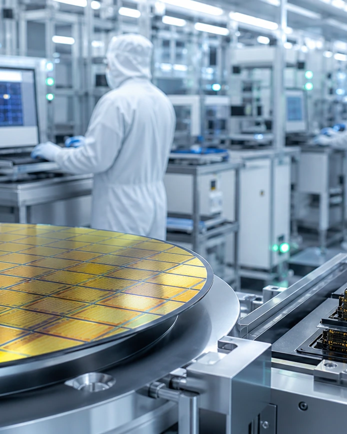
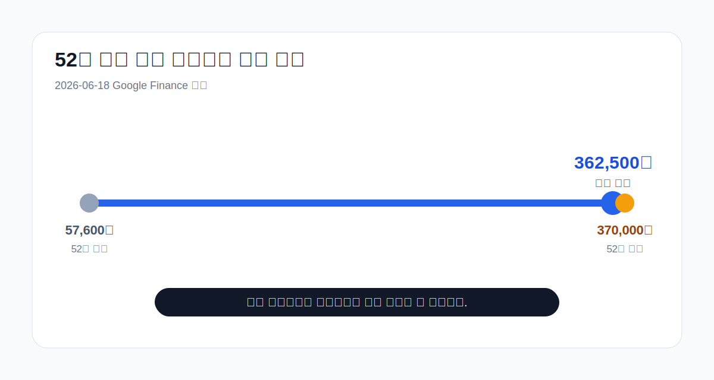
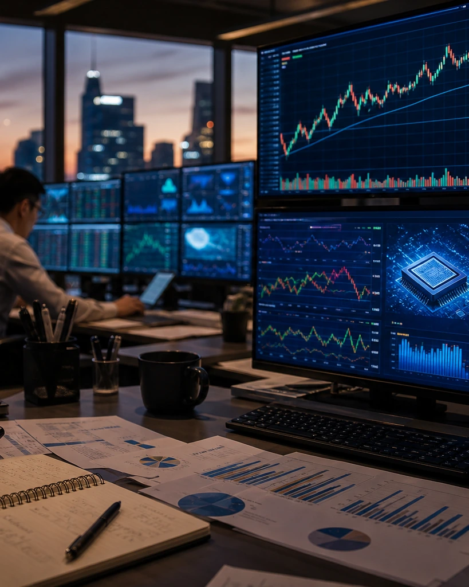
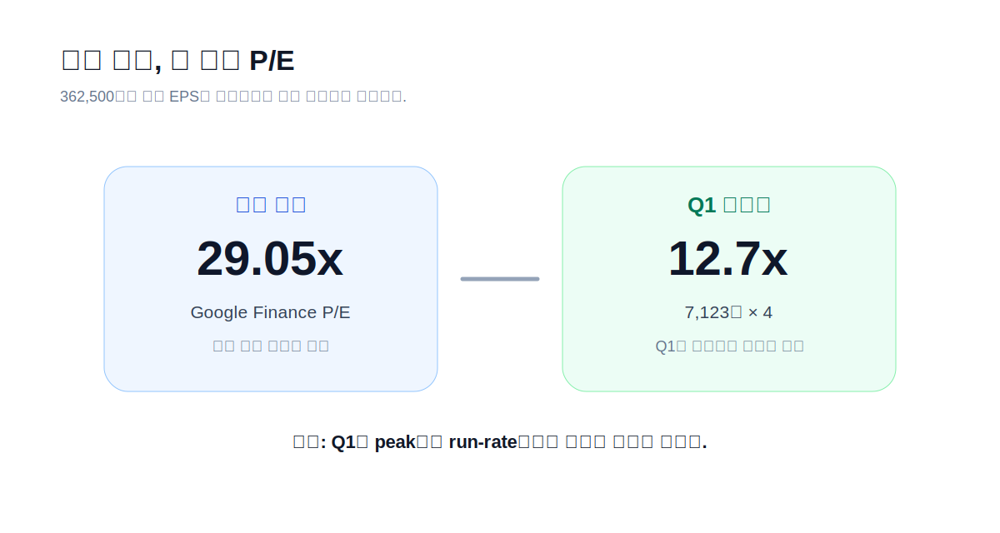
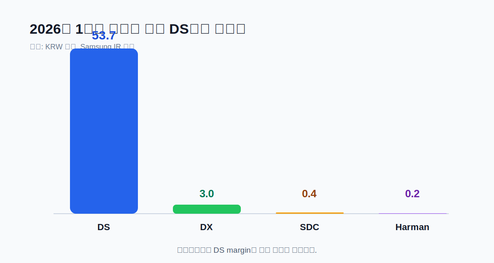
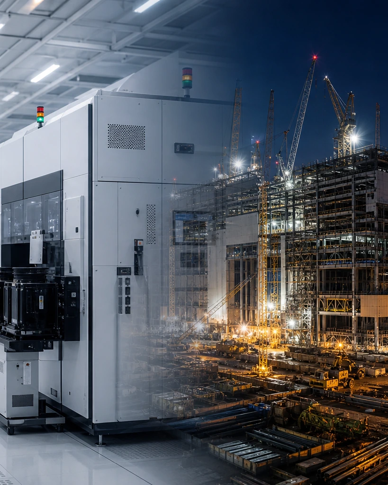
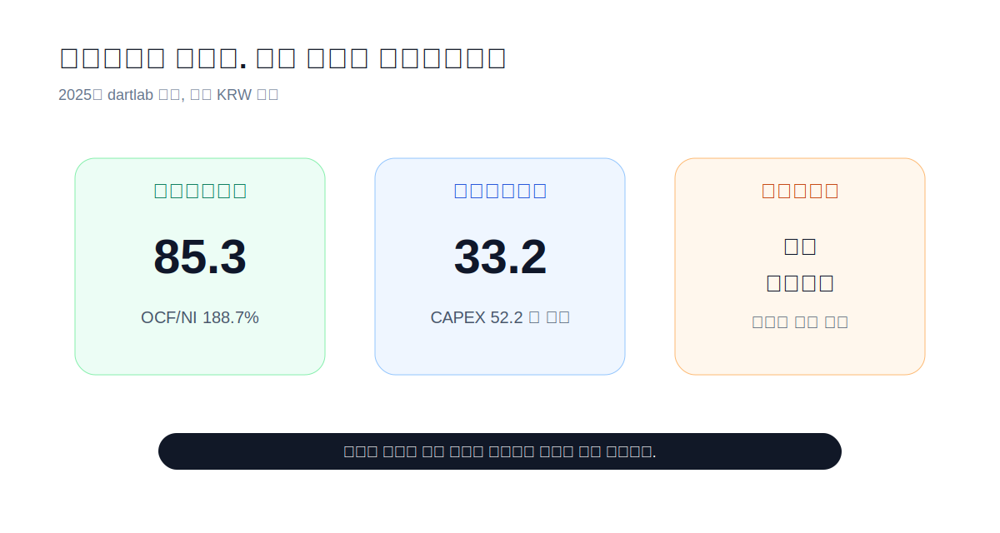
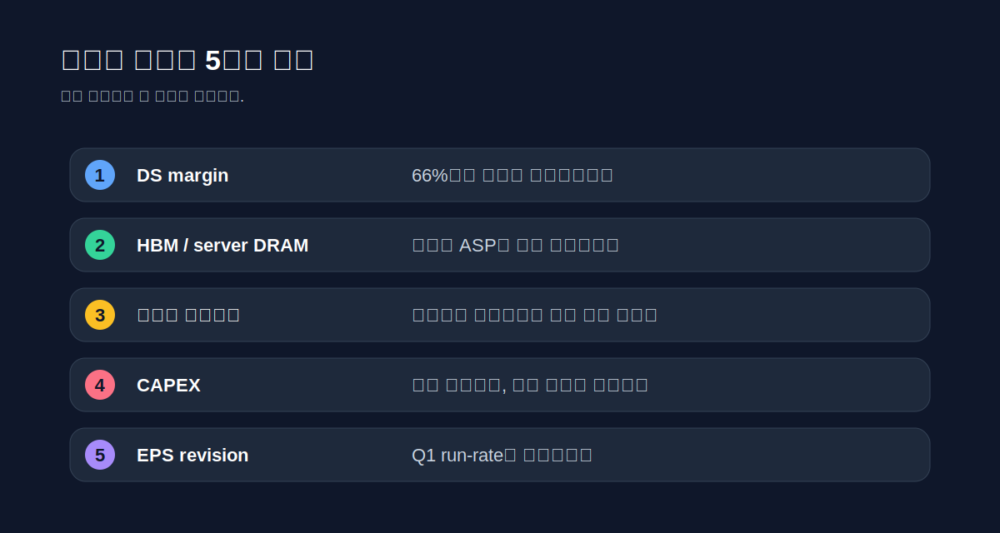

> **주의**: 이 글은 투자 권유가 아니다. 목표가를 제시하지 않는다. "언제까지 상승할까"라는 질문을 **상승이 유지되는 조건과 끝나는 조건**으로 바꿔 읽는다.
>
> **데이터 기준**: 2026-06-18 Google Finance 주가 화면, Samsung Electronics 2025년 4Q/FY 및 2026년 1Q IR 자료, 2026-06-18 dartlab 실측.
>
> **핵심 숫자**: 주가 **362,500원(2026-06-18 15:30 KST)** · 52주 고점 **370,000원** · 시가총액 **2,309조원** · 1Q 2026 매출 **133.9조원** · 영업이익 **57.2조원** · DS 영업이익 **53.7조원**.

---

## 프롤로그 - 이 질문은 가격이 아니라 시간에 관한 질문이다

삼성전자는 지금 이상한 위치에 있다. 2026년 6월 18일 종가 기준 주가는 362,500원이다. Google Finance가 보여주는 52주 고점은 370,000원, 52주 저점은 57,600원이다. 저점에서 보면 이미 여러 배가 올랐고, 고점에서 보면 아직 몇 퍼센트 남았다. 그래서 독자가 묻고 싶은 말은 자연스럽다. **삼성전자는 언제까지 상승할까.**

이 질문에 날짜로 답하면 거의 틀린다. "7월까지", "연말까지", "40만원까지" 같은 문장은 듣기에는 좋지만 검증하기 어렵다. 삼성전자 같은 메모리 사이클 주식은 달력보다 조건으로 움직인다. DRAM과 HBM 가격이 유지되는가. 고객 승인이 늦어지지 않는가. DS 영업이익률이 유지되는가. 파운드리 손실이 줄어드는가. CAPEX가 다음 다운사이클의 감가상각 부담으로 돌아오지 않는가.



이번 삼성전자 랠리를 가장 잘 설명하는 숫자는 2026년 1분기다. 매출 133.9조원, 영업이익 57.2조원, 영업이익률 42.8%. 분기 기준으로는 믿기 어려운 수치다. DS, 즉 반도체 부문만 보면 더 강하다. DS 매출은 81.7조원, 영업이익은 53.7조원, 영업이익률은 66%다. 2025년 연간 삼성전자 전체 영업이익이 43.6조원이었는데, 2026년 1분기 DS가 혼자 53.7조원을 벌었다.

이 한 문장이 랠리의 본체다. 시장은 삼성전자를 스마트폰 회사로 사는 것이 아니다. 2026년 6월 현재 시장은 삼성전자를 AI 메모리 사이클의 후발 회복주이자, HBM/서버 DRAM 가격 상승을 이익으로 바꾸는 회사로 사고 있다. 이익이 너무 빨리 좋아졌기 때문에 주가도 너무 빨리 올랐다. 그래서 지금은 "더 오를까"보다 "무엇이 꺾이면 끝나는가"가 더 좋은 질문이다.



---

## 막1 - 지금 가격은 무엇을 이미 믿고 있나

2026년 6월 18일 기준 삼성전자 주가는 362,500원이다. Google Finance 화면의 시가총액은 2,309.23조원, P/E는 29.05배, EPS는 12,479원으로 표시된다. 이 숫자만 보면 삼성전자는 이미 싼 주식이 아니다. 한국 대형 제조업이 29배 이익배수에 거래된다는 것은 시장이 미래 이익을 크게 당겨왔다는 뜻이다.

그런데 2026년 1분기 EPS를 보면 이야기가 달라진다. 삼성전자의 Q1 2026 common EPS는 7,123원이다. 이걸 단순히 네 배 하면 28,492원이다. 362,500원을 28,492원으로 나누면 약 12.7배다. 즉 같은 주가가 후행 EPS로는 29배처럼 보이고, Q1 이익을 연환산하면 13배 아래처럼 보인다. 이 괴리가 바로 삼성전자 랠리의 핵심이다.

```python
price = 362_500
q1_eps = 7_123
price / (q1_eps * 4)
```

하지만 여기서 조심해야 한다. Q1을 네 번 반복할 수 있다는 보장은 없다. 메모리 사이클은 peak quarter를 연환산하면 항상 싸 보인다. 반대로 bottom quarter를 연환산하면 항상 비싸 보인다. 그래서 삼성전자의 현 주가는 "이미 너무 비싸다"와 "아직 싸다"가 동시에 가능하다. 관건은 Q1의 이익률이 일회성이냐, 2026년 전체의 새 기준선이냐이다.

2025년 공식 FY 자료를 보면 삼성전자의 2025년 매출은 333.6조원, 영업이익은 43.6조원, 순이익은 45.2조원이었다. 2025년 common EPS는 6,605원이다. 그런데 2026년 1분기 EPS가 7,123원이다. 한 분기 EPS가 전년도 연간 EPS를 넘어선다. 이것은 놀라운 성장인 동시에 위험 신호다. 시장은 이익이 새 단계로 넘어갔다고 믿고 있지만, 메모리 산업에서 새 단계와 사이클 꼭대기는 종종 비슷한 얼굴을 한다.

그래서 현재 가격이 믿는 것은 세 가지다. 첫째, DS의 초고마진이 적어도 몇 분기 유지된다. 둘째, HBM과 서버 DRAM의 mix 개선이 conventional memory 가격 둔화를 덮는다. 셋째, 파운드리와 모바일이 이익을 크게 갉아먹지 않는다. 이 세 가지가 맞으면 상승은 더 갈 수 있다. 하나가 틀리면 주가는 먼저 멈춘다.





---

## 막2 - 랠리의 엔진은 DS 66% 영업이익률이다

삼성전자 전체를 한 회사로 보면 안 된다. 지금 랠리의 엔진은 거의 DS다. 2026년 1분기 회사 전체 영업이익은 57.2조원인데, DS 영업이익은 53.7조원이다. 전체 영업이익의 대부분이 반도체에서 나왔다. DX는 3.0조원, SDC는 0.4조원, Harman은 0.2조원이다. 스마트폰과 TV와 디스플레이와 전장도 중요하지만, 현재 주가의 심장은 DS다.

DS의 1분기 영업이익률은 66%다. 이 숫자는 일반 제조업 감각으로는 거의 설명이 안 된다. 삼성전자가 제품을 팔아 남기는 비율이 아니라, 메모리 가격과 원가 구조가 동시에 유리하게 움직인 결과다. 삼성전자는 Q1 자료에서 record earnings가 memory business에 의해 이끌렸고, high-value-added AI products 판매 확대와 supply shortage에 따른 ASP 상승이 있었다고 설명했다.

```python
import dartlab

c = dartlab.Company("005930")
c.analysis("수익성")["marginTrend"]["history"]
```

2025년에는 이미 회복이 진행 중이었다. 2023년 영업이익률은 2.5%였다. 2024년 10.9%, 2025년 13.1%로 회복했다. 그런데 Q1 2026 전체 영업이익률은 42.8%다. 삼성전자는 같은 회사지만, 사이클이 바뀌면 전혀 다른 손익계산서가 된다. 주가는 이 변화를 보고 올라온 것이다.

여기서 상승 지속 조건은 단순하다. DS 영업이익률이 급락하지 않아야 한다. 66%가 계속될 필요는 없다. 너무 높은 숫자다. 하지만 50%대에서 버티거나, 적어도 회사 전체 영업이익률이 30%대 이상으로 유지된다는 확신이 생기면 시장은 Q1을 peak가 아니라 new run-rate로 볼 수 있다. 그러면 후행 P/E 29배라는 부담은 빠르게 낮아진다.

반대로 DS margin이 66%에서 40%, 30%로 빠르게 내려가면 이야기는 끝난다. 주가는 Q1을 연환산해서 오른 것이 아니라, Q1이 반복될 수 있다고 믿고 오른 것이다. 반복 가능성이 깨지면 valuation은 다시 후행 이익 기준으로 돌아간다. 그때 2,300조원 시가총액은 부담이 된다.



---

## 막3 - 상승은 HBM보다 DRAM 가격에서 먼저 꺾일 수 있다

사람들은 삼성전자 랠리를 HBM으로만 설명하고 싶어 한다. HBM은 좋은 이야기다. AI 서버에 필요하고, 고객 승인이 중요하고, 제품 mix를 올리고, 고마진을 만든다. 삼성전자도 2025년 4분기 자료에서 HBM4 mass products와 high-density DDR5, SOCAMM2, GDDR7, enterprise SSD를 강조했다. 2026년 1분기 자료에서도 high-value-added AI products 판매 확대가 이익을 이끌었다.

하지만 삼성전자 같은 회사에서 HBM만 보면 반쪽이다. 메모리 이익은 제품 mix와 전체 DRAM/NAND 가격이 같이 만든다. HBM이 좋아도 conventional DRAM 가격이 꺾이면 전체 ASP와 margin은 흔들린다. 반대로 HBM이 완벽하지 않아도 서버 DRAM과 enterprise SSD가 강하면 DS 이익은 버틴다. 그래서 "HBM 고객 승인"은 중요한 체크포인트지만, 랠리의 조기 경보는 DRAM 가격과 재고에서 먼저 올 수 있다.

메모리 사이클은 항상 같은 구조를 가진다. 수요가 갑자기 좋아진다. 공급이 부족해진다. 가격이 오른다. 이익률이 폭발한다. 기업은 CAPEX와 공급을 늘린다. 시간이 지나면 공급이 따라온다. 가격 상승률이 둔화된다. 재고가 늘고, 이익률이 먼저 꺾인다. 주가는 보통 이익보다 먼저 움직인다. 그래서 삼성전자 상승의 끝도 실적 발표보다 가격 데이터에서 먼저 보일 가능성이 크다.

삼성전자의 2025년 CAPEX는 dartlab 기준 52.2조원이다. 2024년 53.7조원, 2023년 60.5조원이었다. 이 회사는 다운사이클에도 투자를 멈추지 않는다. 이것이 경쟁력의 원천이지만, 다음 다운사이클의 감가상각 부담이기도 하다. AI 메모리 수요가 계속 강하면 투자는 축복이다. 수요가 둔화되면 투자는 비용이 된다.

2026년 Q1 자료에서 삼성전자는 R&D investment 11.3조원을 집행했다고 밝혔다. 고부가 제품 경쟁에서 R&D와 CAPEX는 필요하다. 그러나 투자자가 봐야 할 것은 "투자를 많이 했다"가 아니라, 그 투자가 고마진 제품 mix로 돌아오는지다. HBM4, server DDR5, enterprise SSD의 출하와 가격이 유지되면 투자는 이익을 만든다. 그렇지 않으면 감가상각이 영업이익률을 누른다.

---

## 막4 - 파운드리는 랠리의 조용한 브레이크다

삼성전자 랠리를 메모리만으로 보면 너무 깔끔하다. 실제 회사는 더 복잡하다. DS 안에는 Memory만 있는 것이 아니다. System LSI와 Foundry도 있다. 삼성전자의 이전 기업분석에서 가장 불편한 줄도 파운드리였다. 메모리가 벌어도 파운드리 적자가 일부를 깎아먹는 구조다.

파운드리는 삼성전자에게 선택지가 아니라 전략이다. TSMC와의 격차를 줄여야 하고, AI 가속기와 advanced node 수요를 잡아야 하며, 고객 신뢰를 쌓아야 한다. 하지만 파운드리는 돈이 많이 든다. EUV 장비, 선단 공정, 수율 안정화, 고객 설계 지원, 장기 CAPEX가 모두 필요하다. 이 사업이 좋아지면 삼성전자의 multiple은 바뀐다. 이 사업이 계속 손실이면 메모리 이익의 일부를 먹는 비용으로 남는다.



지금 주가는 파운드리의 완전한 회복을 이미 반영했다기보다는, 메모리 이익 폭발을 먼저 반영하고 있다. 그래서 파운드리 뉴스가 주가를 더 밀어올릴 수는 있지만, 랠리를 유지하는 데 필요한 최소 조건은 파운드리가 더 악화되지 않는 것이다. 메모리 이익이 계속 늘어도 파운드리 적자가 커지면 DS margin은 내려간다.

삼성전자 주가가 계속 오르려면 시장이 두 번째 이야기를 사야 한다. 첫 번째 이야기는 "메모리 가격이 올랐다"다. 이 이야기는 이미 많이 반영됐다. 두 번째 이야기는 "메모리로 번 현금이 파운드리 경쟁력과 고부가 AI 반도체 포트폴리오로 이어진다"다. 두 번째 이야기가 생기면 주가는 단순 사이클 주식에서 기술 재평가로 넘어간다.

반대로 파운드리에서 대형 고객 지연, 수율 우려, 추가 비용, 선단 공정 신뢰 문제 같은 뉴스가 나오면 랠리의 질은 약해진다. 주가가 고점 근처에 있을 때는 좋은 뉴스보다 나쁜 뉴스의 설명력이 커진다. 기대가 이미 높기 때문이다.

---

## 막5 - 현금흐름은 좋다. 그래서 더 무서운 것은 재고와 매출채권이다

삼성전자의 재무 안정성은 강하다. dartlab 기준 2025년 영업현금흐름은 85.3조원, 자유현금흐름은 33.2조원이다. CAPEX 52.2조원을 집행하고도 33조원 이상 남겼다. 2025년 배당금은 9.9조원이고, FCF에서 배당을 뺀 잔여 현금흐름은 23.3조원이다. 이 정도면 대형 제조업 중에서도 현금 창출력은 압도적이다.

부채도 낮다. 2025년 부채비율은 약 29.9%, 2026년 dartlab 기준 30.2% 수준이다. 현금과 금융자산을 고려하면 순차입 구조가 아니다. 삼성전자가 쉽게 망할 회사는 아니다. 그래서 주가 하락의 핵심 위험은 재무위기가 아니라 이익 사이클과 valuation이다. 강한 회사도 비싸게 사면 수익률은 낮아질 수 있다.

```python
cash = c.analysis("현금흐름")
cash["cashFlowOverview"]["history"]
summary = c.analysis("종합평가")
summary["summaryFlags"]
```

여기서 봐야 할 불편한 줄은 매출채권과 재고다. dartlab summary flag는 매출채권 성장이 매출 성장보다 빠르고, 재고 성장도 매출 성장보다 빠르다는 경고를 잡았다. 2026년 라벨 데이터에는 매출이 아직 완전히 들어오지 않았지만, 자산 쪽에서는 매출채권과 재고가 크게 늘어난다. 사이클 기업에서 재고와 매출채권은 주가보다 늦게 보이는 숫자 같지만, 실제로는 다음 이익률을 설명한다.

재고가 늘어나는 것이 항상 나쁜 것은 아니다. 수요가 강하고 공급 부족이면 재고는 납품 준비일 수 있다. HBM과 고부가 서버 DRAM을 더 팔기 위한 build-up일 수 있다. 하지만 가격이 꺾이는 시점의 재고 증가는 다르게 읽힌다. 그때 재고는 미래 매출이 아니라 미래 할인 판매가 된다. 매출채권도 마찬가지다. 강한 매출 성장의 그림자일 수도 있고, 고객 collection 부담의 신호일 수도 있다.

따라서 삼성전자 랠리의 종료 조건 중 하나는 현금흐름이 아니라 working capital에서 온다. 영업이익은 여전히 높게 나오는데 재고와 매출채권이 더 빨리 늘고, OCF/NI가 내려가면 시장은 먼저 의심한다. 2025년에는 OCF/NI가 188.7%로 매우 좋았다. 이 비율이 떨어지는지가 다음 체크포인트다.



---

## 막6 - 스마트폰이 주가를 끌고 가는 국면은 아니다

삼성전자를 소비자 입장에서 보면 갤럭시가 먼저 떠오른다. 하지만 지금 주가를 설명하는 주인공은 갤럭시가 아니다. Q1 2026 DX 매출은 52.7조원, 영업이익은 3.0조원이다. 플래그십 S26 출시로 매출은 늘었지만, 전체 이익 기여는 DS에 비해 작다. DS 영업이익 53.7조원과 비교하면 DX는 랠리의 보조 엔진이다.

2025년 연간으로 보면 DX는 더 안정적인 사업이다. 2025년 DX 매출은 188.0조원, 영업이익은 12.9조원이었다. 매출은 회사에서 가장 크다. 하지만 margin은 반도체 peak와 비교할 수 없다. 스마트폰과 TV, 가전은 브랜드와 유통, 제품 사이클이 중요하지만, 현재 주가의 multiple을 바꾸는 힘은 메모리 가격에 있다.

이 점은 글의 결론에도 중요하다. 삼성전자 주가가 더 오르려면 갤럭시가 잘 팔리는 것만으로는 부족하다. DX가 안정적으로 버티는 것은 좋다. 하지만 시장이 2,300조원 시가총액을 정당화하려면 DS가 계속 벌어야 한다. DX가 비용 상승이나 수요 둔화로 흔들리면 주가에 부담이 되겠지만, 랠리의 핵심은 여전히 DS다.

SDC와 Harman도 마찬가지다. Q1 2026 SDC 영업이익은 0.4조원, Harman은 0.2조원이다. 2025년에는 SDC 4.1조원, Harman 1.5조원을 벌었다. 좋은 사업이지만 현재 주가를 밀어올리는 주인공은 아니다. 독자가 삼성전자를 볼 때 "갤럭시 잘 팔리나"보다 "DS margin이 유지되나"를 먼저 봐야 하는 이유다.

---

## 막7 - 그럼 언제까지 오를 수 있나

이제 질문으로 돌아오자. 삼성전자는 언제까지 상승할까. 내 답은 이렇다. **Q1 2026이 peak가 아니라 2026년 run-rate의 시작이라고 시장이 믿는 동안 오른다.** 이 문장은 날짜가 아니라 조건이다. 시장은 삼성전자가 분기 50조원대 영업이익을 반복할 수 있다고 믿으면 더 높은 주가를 줄 수 있다.

상승이 이어지는 첫 번째 조건은 DS 영업이익률이다. 66%는 너무 높다. 하지만 50%대가 유지되거나, 전체 영업이익률이 30%대 이상으로 남는다면 시장은 이익 전망치를 계속 올릴 수 있다. Q2, Q3에서 DS margin이 급락하지 않는 것이 가장 중요하다.

두 번째 조건은 HBM과 서버 DRAM의 가격이다. 삼성전자가 high-value-added AI products 판매 확대를 계속 말할 수 있어야 한다. HBM4 출하와 고객 승인, server DDR5, SOCAMM2, enterprise SSD가 계속 mix를 끌어올려야 한다. 만약 "출하는 늘었지만 가격이 내려갔다"는 문장이 나오면 랠리는 약해진다.

세 번째 조건은 CAPEX의 해석이다. 투자 확대가 고마진 수요를 잡기 위한 선제 투자로 읽히면 좋다. 그러나 투자 확대가 공급 과잉의 씨앗으로 읽히면 안 좋다. 메모리 업황에서 CAPEX는 항상 양면적이다. 투자하지 않으면 경쟁력을 잃고, 너무 많이 투자하면 다음 다운사이클을 만든다.

네 번째 조건은 valuation이다. 주가 362,500원에서 후행 P/E 29배는 부담이 있다. 그러나 Q1 EPS를 연환산하면 13배 아래다. 시장은 후자에 베팅하고 있다. 따라서 Q2 EPS가 Q1에 가까우면 valuation 부담은 줄어든다. Q2 EPS가 크게 꺾이면 valuation 부담은 커진다.

다섯 번째 조건은 외부 비교다. SK하이닉스, Micron, NVIDIA, Broadcom, Dell 같은 AI 공급망 주식과 비교해 삼성전자의 이익 revision이 더 좋아야 한다. 자금은 테마 안에서도 더 빠르게 숫자가 좋아지는 곳으로 간다. 삼성전자가 후발 회복주로 계속 매력적이려면, HBM과 메모리 가격에서 경쟁사 대비 gap을 줄인다는 증거가 필요하다.

---

## 막8 - 랠리가 끝나는 5가지 조건

좋은 글은 상승 조건보다 하락 조건을 더 분명히 말해야 한다. 삼성전자 랠리가 끝나는 조건은 다섯 개다.

첫째, DS 영업이익률이 예상보다 빠르게 내려가는 경우다. 66%에서 50%대는 자연스러운 normalization일 수 있다. 하지만 40% 아래로 빠르게 내려가면 시장은 Q1을 peak로 본다. 이때 주가는 이익보다 먼저 조정될 수 있다.

둘째, HBM 고객 승인과 출하가 기대보다 늦어지는 경우다. 삼성전자 랠리는 "고부가 AI 메모리 mix가 올라간다"는 믿음에 기대고 있다. conventional DRAM 가격만으로 오른다면 사이클 주식 discount를 피하기 어렵다. HBM4와 server 제품군에서 고객 신뢰가 쌓여야 multiple이 유지된다.

셋째, DRAM/NAND 가격 상승률이 둔화되고 재고가 늘어나는 경우다. 메모리 주식은 가격이 내려가기 전에 주가가 먼저 내려가는 경우가 많다. ASP 상승률 둔화, spot price 약세, customer inventory 조정, enterprise SSD 주문 둔화는 조기 경보다.

넷째, CAPEX와 감가상각 부담이 이익률을 누르는 경우다. 2025년 CAPEX 52.2조원은 경쟁력을 위한 투자다. 하지만 다음 수요가 충분하지 않으면 감가상각과 고정비가 margin을 누른다. 특히 파운드리와 선단 공정 투자는 긴 시간과 높은 불확실성을 가진다.

다섯째, 주가가 이익 revision보다 먼저 달리는 경우다. 주가가 52주 고점 근처에 있고 시가총액이 2,300조원을 넘으면, 좋은 뉴스가 나와도 이미 반영됐다는 말이 나오기 쉽다. 앞으로는 실적 beat보다 이익 전망치의 추가 상향이 필요하다. 숫자가 좋아도 기대보다 덜 좋으면 주가는 쉬어간다.



---

## 막9 - 다음 실적에서 15분 안에 업데이트하는 법

삼성전자 실적 발표 날에는 숫자가 너무 많다. 매출, 영업이익, EPS, DS, DX, SDC, Harman, memory bit growth, ASP, HBM, capex, inventory, cash flow. 다 보면 오히려 흐려진다. 이번 글의 질문은 하나다. **Q1의 이익이 반복 가능한가.**

첫 번째 줄은 DS 영업이익과 margin이다. Q1 2026 DS 영업이익은 53.7조원, margin은 66%였다. 다음 분기 이익이 40조원 이상이고 margin이 50%대라면 랠리는 살아 있다. 반대로 DS margin이 급락하면 다른 숫자가 좋아도 시장은 먼저 멈춘다.

두 번째 줄은 Memory comment다. Samsung IR 자료에서 "high-value-added AI products", "HBM4", "server DRAM", "enterprise SSD", "ASP" 문장이 어떻게 바뀌는지 본다. 단어가 중요한 것이 아니라, 이 단어들이 매출과 margin으로 이어지는지가 중요하다. "출하 확대"만 있고 "가격"과 "수익성"이 약해지면 조심해야 한다.

세 번째 줄은 재고와 매출채권이다. 영업이익이 높아도 재고와 매출채권이 더 빠르게 늘면 현금흐름이 먼저 흔들릴 수 있다. 2025년 OCF/NI는 188.7%로 좋았다. 이 비율이 계속 높으면 이익의 질은 좋다. 내려가면 사이클 후반부의 냄새가 난다.

네 번째 줄은 CAPEX다. 삼성전자는 매년 50조원대 CAPEX를 감당할 수 있는 회사다. 하지만 주가가 고점 근처일 때 시장은 CAPEX를 성장 투자로 볼지, 공급 과잉의 씨앗으로 볼지 빠르게 바꾼다. 투자 계획이 HBM/AI product 중심인지, 범용 capacity 확대인지 구분해야 한다.

다섯 번째 줄은 valuation reset이다. 현재 가격에서 Q1 EPS 연환산 P/E는 약 12.7배다. Q2 EPS가 Q1에 가까우면 이 논리는 유지된다. Q2 EPS가 크게 낮아지면 시장은 후행 P/E 29배와 2025 EPS 6,605원을 다시 본다. 그 순간 주가의 언어가 "싸다"에서 "비싸다"로 바뀐다.

| 확인 순서 | 봐야 할 숫자 | 상승 지속 신호 | 랠리 종료 신호 |
|---|---|---|---|
| 1 | DS 영업이익률 | 50%대 이상 유지 | 40% 아래 급락 |
| 2 | HBM/서버 DRAM | ASP와 mix 동반 개선 | 출하만 늘고 가격 둔화 |
| 3 | 재고·매출채권 | OCF/NI 높은 수준 유지 | 이익 대비 현금흐름 둔화 |
| 4 | CAPEX | HBM/AI 중심 투자 | 범용 공급 과잉 우려 |
| 5 | EPS revision | Q1에 가까운 run-rate | Q1 peak 인식 확산 |

이 표를 들고 다음 실적을 보면 된다. 삼성전자가 더 오를 수 있는지는 언론 제목보다 이 다섯 줄이 알려준다.

---

## 에필로그 - 삼성전자는 숫자가 꺾이기 전까지 오른다

삼성전자는 언제까지 상승할까. 가장 정직한 답은 이것이다. **시장이 Q1 2026을 peak가 아니라 새 이익 체력으로 믿는 동안 오른다.** Q1 매출 133.9조원, 영업이익 57.2조원, DS 영업이익 53.7조원은 주가를 끌어올릴 만큼 강했다. 현재 주가 362,500원은 그 힘을 이미 상당히 반영했다.

그래도 아직 논쟁은 끝나지 않았다. 후행 P/E 29배는 비싸 보인다. Q1 EPS 연환산 P/E 12.7배는 싸 보인다. 이 둘 중 어느 쪽이 맞는지는 Q2와 Q3가 결정한다. 삼성전자 랠리는 가격표가 아니라 이익표에서 답이 나온다.

비슷한 사이클과 AI 공급망 이야기는 [기존 삼성전자 분석](/blog/005930-samsung), [SK하이닉스](/blog/000660-skhynix), [NVIDIA](/blog/NVDA-nvidia), [Micron](/blog/MU-micron), [Broadcom](/blog/AVGO-broadcom), [Dell](/blog/DELL-dell-technologies), [AMD](/blog/AMD-amd)와 같이 보면 좋다. GPU가 AI의 얼굴이라면, 메모리는 AI의 숨이다. 삼성전자가 계속 오르려면 그 숨이 비싸게 팔려야 한다.

그래서 다음 실적에서 먼저 볼 문장은 하나다. "DS 영업이익률이 얼마인가." 그 다음이 HBM, server DRAM, 재고, CAPEX, EPS다. 이 순서를 지키면 주가가 흔들릴 때도 질문이 흔들리지 않는다.

---

## 검증표

본문 인용 수치를 dartlab 실측과 외부 공시로 분리한다. 주가는 2026년 6월 18일 장 마감 근처의 공개 화면 기준이며, 실시간 투자 판단에 쓰면 안 된다.

| 본문 수치 | 출처 / 호출 | 결과 |
|---|---|---|
| 2026-06-18 주가 362,500원, 52주 고점 370,000원, 52주 저점 57,600원 | [Google Finance 005930:KRX](https://www.google.com/finance/beta/quote/005930%3AKRX) | 외부 시세 화면 |
| 시가총액 2,309.23조원, P/E 29.05, EPS 12,479원 | [Google Finance 005930:KRX](https://www.google.com/finance/beta/quote/005930%3AKRX) | 외부 시세 화면 |
| Q1 2026 매출 133.9조원, 영업이익 57.2조원, OP margin 42.8% | [Samsung 1Q 2026 Earnings Presentation](https://images.samsung.com/is/content/samsung/assets/global/ir/docs/2026_1Q_conference_eng.pdf) | 회사 IR |
| Q1 2026 DS 매출 81.7조원, 영업이익 53.7조원, OP margin 66% | [Samsung 1Q 2026 Earnings Presentation](https://images.samsung.com/is/content/samsung/assets/global/ir/docs/2026_1Q_conference_eng.pdf) | 회사 IR |
| Q1 2026 DX 매출 52.7조원, 영업이익 3.0조원 | [Samsung 1Q 2026 Earnings Presentation](https://images.samsung.com/is/content/samsung/assets/global/ir/docs/2026_1Q_conference_eng.pdf) | 회사 IR |
| Q1 2026 SDC 6.7조원/0.4조원, Harman 3.8조원/0.2조원 | [Samsung 1Q 2026 Earnings Presentation](https://images.samsung.com/is/content/samsung/assets/global/ir/docs/2026_1Q_conference_eng.pdf) | 회사 IR |
| Q1 2026 EPS common 7,123원 | [Samsung 1Q 2026 Earnings Presentation](https://images.samsung.com/is/content/samsung/assets/global/ir/docs/2026_1Q_conference_eng.pdf) | 회사 IR |
| 2025년 매출 333.6조원, 영업이익 43.6조원, 순이익 45.2조원 | [Samsung 4Q/FY 2025 Earnings Presentation](https://images.samsung.com/is/content/samsung/assets/global/ir/docs/2025_4Q_conference_eng.pdf) | 회사 IR |
| 2025년 DS 매출 130.1조원, 영업이익 24.9조원 | [Samsung 4Q/FY 2025 Earnings Presentation](https://images.samsung.com/is/content/samsung/assets/global/ir/docs/2025_4Q_conference_eng.pdf) | 회사 IR |
| 2025년 DX 매출 188.0조원, 영업이익 12.9조원 | [Samsung 4Q/FY 2025 Earnings Presentation](https://images.samsung.com/is/content/samsung/assets/global/ir/docs/2025_4Q_conference_eng.pdf) | 회사 IR |
| 2025년 OCF 85.3조원, FCF 33.2조원, CAPEX 52.2조원 | `c.analysis("현금흐름")`, `c.analysis("자본배분")` | dartlab 실측 |
| 2025년 부채비율 약 29.9%, 2026년 약 30.2% | `c.analysis("안정성")["leverageTrend"]` | dartlab 실측 |
| summaryFlags: 매출채권·재고 증가, 배당 감소 | `c.analysis("종합평가")["summaryFlags"]` | dartlab flag, 단정 금지 |

Q1 EPS 연환산 P/E 12.7배는 계산 예시다. Q1 실적이 네 분기 반복된다는 뜻이 아니다. 메모리 사이클 기업에서는 peak quarter 연환산이 가장 위험한 착시가 될 수 있다.

---

## 공시 / Filings

삼성전자는 한국 상장사이므로 DART와 회사 IR을 함께 봐야 한다. 이 글은 실적과 세그먼트 숫자는 Samsung IR 자료를 우선했고, 연간 현금흐름·자본배분·안정성은 dartlab 구조화 데이터를 사용했다.

- [Samsung Electronics IR - Earnings Releases](https://www.samsung.com/global/ir/financial-information/earnings-release/)
- [Samsung 1Q 2026 Earnings Presentation](https://images.samsung.com/is/content/samsung/assets/global/ir/docs/2026_1Q_conference_eng.pdf)
- [Samsung 4Q/FY 2025 Earnings Presentation](https://images.samsung.com/is/content/samsung/assets/global/ir/docs/2025_4Q_conference_eng.pdf)
- [Samsung 2025 Consolidated Financial Statements](https://images.samsung.com/is/content/samsung/assets/global/ir/docs/2025_con_quarter04_all.pdf)
- [DART 삼성전자 2026년 1분기보고서](https://dart.fss.or.kr/dsaf001/main.do?rcpNo=20260515002181)
- [DART 삼성전자 2025년 사업보고서](https://dart.fss.or.kr/dsaf001/main.do?rcpNo=20260310002820)
- [DART 삼성전자 2025년 3분기보고서](https://dart.fss.or.kr/dsaf001/main.do?rcpNo=20251114002447)
- [Google Finance 005930:KRX](https://www.google.com/finance/beta/quote/005930%3AKRX)

주가와 valuation은 계속 바뀐다. 이 글의 주가 기준은 2026년 6월 18일 공개 시세 화면이며, 다음 장에서 달라질 수 있다. 따라서 결론도 가격이 아니라 조건으로 읽어야 한다.

---

## 재무제표 - 최근 5 개년

> 단위는 KRW 조원. dartlab에서 직접 확인:
>
> ```python
> import dartlab
> c = dartlab.Company("005930")
> c.analysis("수익성")["marginTrend"]["history"]
> c.analysis("현금흐름")["cashFlowOverview"]["history"]
> c.analysis("자본배분")["reinvestment"]["history"]
> ```

| 항목 (조원) | 2021 | 2022 | 2023 | 2024 | 2025 |
|---|---:|---:|---:|---:|---:|
| 매출 | 279.6 | 302.2 | 258.9 | 300.9 | 333.6 |
| 영업이익 | 51.6 | 43.4 | 6.6 | 32.7 | 43.6 |
| 순이익 | 39.9 | 55.7 | 15.5 | 34.5 | 45.2 |
| 영업현금흐름 | 65.1 | 62.2 | 44.1 | 73.0 | 85.3 |
| CAPEX | 49.8 | 53.1 | 60.5 | 53.7 | 52.2 |
| 자유현금흐름 | 15.3 | 9.1 | -16.4 | 19.2 | 33.2 |
| 영업이익률 | 18.5% | 14.4% | 2.5% | 10.9% | 13.1% |
| 순마진 | 14.3% | 18.4% | 6.0% | 11.5% | 13.6% |
| CAPEX/매출 | 17.8% | 17.6% | 23.4% | 17.9% | 15.6% |

이 표의 핵심은 삼성전자가 "좋은 회사인가"가 아니다. 좋은 회사다. 문제는 사이클이다. 2023년에는 영업이익률 2.5%, 2026년 1분기에는 42.8%다. 주가가 더 오르는지는 이 간극이 얼마나 오래 유지되는지에 달려 있다.
